# خواننده تلگرام

<!-- MSG START -->

---
📅 بروزرسانی: 1405/02/18 23:11
---

## VahidOOnLine — post 238965

  <a href="telegram/content/VahidOOnLine_238965_1778269271.mp4">🎬 Download video</a>

یک شهروند شاغل به شغل فصلی می‌گوید قطع اینترنت درآمد و کسب او را مختل کرده است. او گفت حتی اگر با فیلترشکن به اینترنت وصل شود چون بقیه شهروندان در اینترنت حاضر نیستند تبلیغات او فایده‌ای نخواهد داشت.
‌🏁 🇬🇧 IranintlTV

🤖 @VahidOOnLine

## VahidOOnLine — post 238964

🗣روایت شما از بحران اقتصادی و زندگی در آتش‌بس- جمعه ۱۸ اردیبهشت:

🔹روز ۱۸ اردیبهشت شش قلم کالا شامل سبزیجات و میوه خریدم که حجم‌شان به یک کیلو هم نمی‌رسد، اما شد یک میلیون و ۱۱۴ هزار تومان. تازه این خرید کاملی نیست، حتی برای چند روز.

🔹مرغ کیلویی ۳۴۰ هزار تومان، شیر پاکتی ۸۵ هزار تومان، نوشابه که پارسال ۴۵ هزار تومان بود، شده ۱۲۵ هزار تومان، پنیر ۴۰۰ گرمی شده ۲۳۰ هزار تومان؛ یک خرید در حد خورد و خوراک چند روز یک خانواده دو نفره و همه وسایل عادی و لازم زندگی را خریدم شد ۴ میلیون و ۵۰۰ هزار تومان.

🔹به علت نوسانات برق، ۱۸ اردیبهشت یخچال سایدبای‌ساید سامسونگ ما سوخت؛ علاوه بر اینکه قطعه‌ اصلی نایاب است، گفتند تعمیرات با قطعه‌ چینی بیشتر از ۴۵ میلیون تومان هزینه دارد؛ پول نداریم درستش کنیم و الان همه‌ ذخیره‌ مرغ و گوشت ما خراب شده.

🔹یک موبایل معمولی، یک لپتاپ معمولی و یک موتور معمولی ساده و از نوع ارزان، مجموعا می‌شود حدود یک میلیارد تومان؛ یعنی مرگ آرزوهایمان در جمهوری اسلامی را به چشم دیدیم.

🔹روز ۱۸ اردیبهشت یک پلاستیک زباله و یک پلاستیک فریزر را در مازندران خریدم ۸۱۰ هزار تومان.
‌🏁 🇬🇧 IranintlTV

🤖 @VahidOOnLine

## VahidOOnLine — post 238963

  <a href="telegram/content/VahidOOnLine_238963_1778269273.mp4">🎬 Download video</a>

وزارت خارجه قطر اعلام کرد محمد بن عبدالرحمن آل ثانی، نخست‌وزیر و وزیر خارجه این کشور، در واشینگتن با جی‌دی ونس، معاون رئیس‌جمهوری ایالات متحده آمریکا، دیدار و درباره کاهش تنش در منطقه گفت‌وگو کرده است.

در این بیانیه آمده است نخست‌وزیر قطر بر ضرورت پاسخ‌گویی طرف‌ها به میانجیگری پاکستان و دستیابی به توافقی جامع برای تحقق صلحی پایدار تاکید کرده است.
‌🏁 🇬🇧 ManotoTV

🤖 @VahidOOnLine

## VahidOOnLine — post 238962

  <a href="telegram/content/VahidOOnLine_238962_1778269273.mp4">🎬 Download video</a>

وزارت خارجه قطر با انتشار بیانیه‌ای، حملات جمهوری اسلامی به امارات متحده عربی را به‌شدت محکوم کرد و آن را «نقض آشکار حاکمیت» و تهدیدی برای امنیت منطقه دانست.

در این بیانیه آمده است که این حملات با استفاده از موشک‌های بالستیک و پهپاد انجام شده و به زخمی شدن چند نفر منجر شده است.

دوحه با اعلام همبستگی کامل با امارات متحده عربی تاکید کرد از تمامی اقدامات این کشور برای حفظ امنیت، ثبات و تمامیت ارضی‌اش حمایت می‌کند.
‌🏁 🇬🇧 ManotoTV

🤖 @VahidOOnLine

## VahidOOnLine — post 238961

  <a href="telegram/content/VahidOOnLine_238961_1778269274.mp4">🎬 Download video</a>

مارکو روبیو، وزیر خارجه ایالات متحده آمریکا، از متحدان اروپایی خواست از موضع‌گیری‌های لفظی فراتر رفته و اقدامات عملی علیه جمهوری اسلامی انجام دهند.

او پس از دیدار با جورجا ملونی، نخست‌وزیر ایتالیا، در رم گفت تلاش تهران برای کنترل تنگه هرمز «غیرقابل قبول» و تهدیدی برای امنیت جهانی است.

روبیو تاکید کرد: «همه می‌گویند ایران یک تهدید است و نباید به سلاح هسته‌ای دست پیدا کند، اما باید اقدامی هم انجام شود.»

او افزود: «اگر پاسخ این است که نه، پس باید چیزی فراتر از بیانیه‌های شدیدالحن داشته باشید.»
‌🏁 🇬🇧 ManotoTV

🤖 @VahidOOnLine

## VahidOOnLine — post 238960

  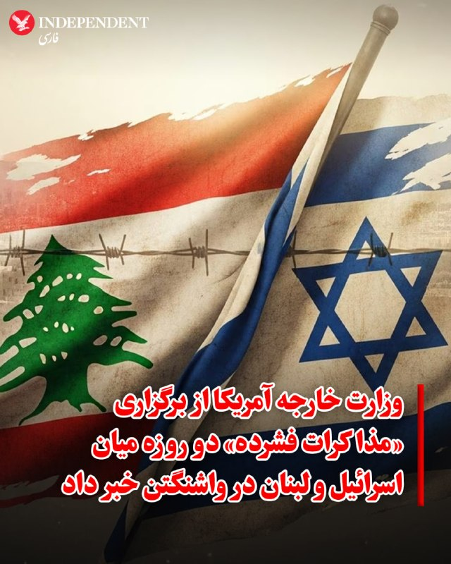

♦️ وزارت امور خارجه ایالات متحده روز جمعه ۱۸ اردیبهشت اعلام کرد که نمایندگان اسرائیل و لبنان در روزهای ۲۴ و ۲۵ اردیبهشت برای انجام دو روز «مذاکرات فشرده» در واشنگتن گرد هم می‌آیند. هدف از این نشست، دستیابی به یک توافق جامع صلح و تدابیر امنیتی پایدار است که بتواند به دهه‌ها تنش در مرزهای شمالی اسرائیل و جنوب لبنان پایان دهد.

این سومین دور از گفتگوهای مستقیم دیپلماتیک میان دو طرف در هفته‌های اخیر است. دور قبلی این مذاکرات در تاریخ ۲۳ آوریل با حضور و میانجی‌گری مستقیم دونالد ترامپ، رئیس‌جمهور آمریکا، در کاخ سفید برگزار شد که منجر به تمدید سه هفته‌ای آتش‌بس شکننده میان دو کشور شد. اولین دور این گفتگوها نیز در ۱۴ آوریل انجام شده بود که به چندین دهه قطع رابطه دیپلماتیک پایان داد و اولین آتش‌بس ۱۰ روزه را رقم زد.
‌🇸🇦 Indypersian

🤖 @VahidOOnLine

## VahidOOnLine — post 238959

  

ارتش جمهوری اسلامی در بیانیه‌ای اعلام کرد که بامداد جمعه «در یک عملیات ترکیبی موشکی-پهپادی» با هشت موشک کروز و ۲۴ فروند پهپاد انتحاری، به سه ناوشکن آمریکایی که در حال خروج از تنگه هرمز به سمت دریای عمان بودند، حمله کرد.
‌🏁 🇬🇧 IranintlTV

🤖 @VahidOOnLine

## VahidOOnLine — post 238958

حسین حیدری، ۵۰ ساله و پدر یک دختر ۲۰ ساله، شامگاه ۱۸ دی ۱۴۰۴ در هفت حوض تهران هدف گلوله‌های جنگی ماموران قرار گرفت و خانواده‌اش پیکر او را در حیاط پشتی بیمارستان الغدیر و پیچیده در پتویی آبی‌رنگ یافتند.
‌🏁 🇬🇧 IranintlTV

🤖 @VahidOOnLine

## VahidOOnLine — post 238957

  <a href="telegram/content/VahidOOnLine_238957_1778269276.mp4">🎬 Download video</a>

فرماندار سوادکوه اعلام کرد در تنگه ابوالقیس این منطقه رانش زمینی به ارتفاع حدود ۳۰ متر رخ داده که به‌دلیل قرار گرفتن در مجاورت یک مسیر ارتباطی حیاتی، خطوط برق ۲۰ کیلووات، لوله نفت ۳۲ اینچ و نهر آب کشاورزی، وضعیت آن «ناپایدار و خطرآفرین» ارزیابی شده است.
به گفته او، این رانش در باند برگشت محور اصلی تهران به شمال و در فاصله حدود ۵۰۰ متری راهدارخانه اوریم، در ضلع غربی محور شمال به تهران اتفاق افتاده است.
بررسی‌های میدانی نشان می‌دهد آثار به‌جامانده از این رانش، احتمال ادامه‌دار بودن حرکت زمین و تشدید ناپایداری در منطقه را مطرح می‌کند.
‌🏁 🇬🇧 ManotoTV

🤖 @VahidOOnLine

## VahidOOnLine — post 238956

  <a href="telegram/content/VahidOOnLine_238956_1778269276.mp4">🎬 Download video</a>

پنتاگون مجموعه‌ای از اسناد جدید و «تاکنون دیده‌نشده» درباره اشیای پرنده ناشناس (UFO/UAP) منتشر کرده و اعلام کرده مردم می‌توانند خودشان درباره این پدیده‌ها نتیجه‌گیری کنند. در میان این اسناد، تصویری از مأموریت آپولو ۱۷ در سال ۱۹۷۲ دیده می‌شود که سه نقطه نورانی را به شکل مثلثی نشان می‌دهد. پنتاگون اعلام کرده هنوز اجماعی درباره ماهیت این پدیده‌ها وجود ندارد، اما بررسی‌های اولیه احتمال داده که ممکن است یک «شیء فیزیکی» باشد. در این بسته جدید ۱۶۱ فایل منتشر شده که شامل اسناد وزارت خارجه، اف‌بی‌آی، گزارش‌های ناسا از مأموریت‌های فضایی و بیش از ۲۰ ویدیو از اشیای ناشناس ثبت‌شده توسط حسگرهای نظامی در نقاط مختلف جهان است؛ از ژاپن و سوریه تا آمریکای شمالی. این اشیا از نقاط نورانی سریع‌الحرکت تا یک جسم شبیه توپ فوتبال آمریکایی در سال ۲۰۲۲ را شامل می‌شوند. در یکی از اسناد نیز گزارش شده که خلبانی در سال ۱۹۹۴ به همراه سه آمریکایی در آسمان قزاقستان یک شیء نورانی دیده که حرکات غیرعادی مانند چرخش‌های تند و تغییر مسیر ۹۰ درجه داشته است. همچنین در اسناد آپولو ۱۱، باز آلدرین از مشاهده یک شیء بزرگ نزدیک ماه و نورهای غیرعادی خبر داده و در گزارشی دیگر از اف‌بی‌آی یک خلبان پهپاد در سال ۲۰۲۳ گفته جسمی خطی با نور بسیار شدید برای چند ثانیه دیده شده و سپس ناپدید شده است. پنتاگون هدف از این انتشار را افزایش شفافیت اعلام کرده و گفته مردم خودشان باید قضاوت کنند، در حالی که تأکید شده در گزارش‌های قبلی هیچ مدرکی درباره فناوری فرازمینی تأیید نشده است.
‌🏁 🇬🇧 ManotoTV

🤖 @VahidOOnLine

## VahidOOnLine — post 238955

  <a href="telegram/content/VahidOOnLine_238955_1778269277.mp4">🎬 Download video</a>

♦️ ستاد فرماندهی مرکزی ایالات متحده، سنتکام، ویدیویی از هدف قرار گرفتن دو نفتکش «سی‌استار ۳» و «سِودا» را منتشر کرد. به گفته سنتکام، این دو نفتکش خالی، قصد داشتن به بنادر ایران نزدیک شوند اما با شلیک جنگنده‌ای که از ناو «جورج دبلیو بوش» بلند شده بود، از کار افتادند. پیش از این نیز نفتکش دیگری به نام «حَسنا» از سوی جنگنده‌ای از ناوگان آبراهام لینکلن از کار افتاده بود.

سنتکام تاکید کرده است که با جدیت با هر نوع نقض محاصره دریایی بنادر ایران مقابله خواهد کرد.

در حالی‌که جمهوری اسلامی به‌دلیل محاصره دریایی امکان صادرات نفت از مسیر دریای عمان را از دست داده و مخازن نفت در کشور در آستانه پر شدن قرار دارند، ورود این نفتکش‌ها به بنادر ایران، می‌توانست فضایی اضافه برای ذخیره‌سازی ایجاد کند تا دولت مجبور به متوقف کردن استخراج نفت نشود. توقف استخراج نفت و راه‌اندازی دوباره، موجب هزینه مضاعف تعمیر و راه‌اندازی می‌شود.
‌🇸🇦 Indypersian

🤖 @VahidOOnLine

## VahidOOnLine — post 238954

  

وزارت کشور سوریه اعلام کرد «خردل احمد دیوب»، ژنرال دوران حکومت بشار اسد را به دلیل نقش مستقیم در نقض سازمان‌یافته حقوق غیرنظامیان، همکاری با جمهوری اسلامی و دست داشتن در حملات شیمیایی در دمشق بازداشت کرده است.

دیوب متهم است که «بر عملیات سرکوب نظارت کرده و در هماهنگی لجستیکی بمباران غوطه شرقی با سلاح‌های شیمیایی ممنوعه بین‌المللی مشارکت داشته است.»

دیوب که تازه‌ترین مقام بازداشت‌شده از میان مسئولان دوران اسد در ماه‌های اخیر است، همچنین به مشارکت در اعدام‌های فراقضایی و هماهنگی با جمهوری اسلامی و حزب‌الله لبنان، که هر دو از حکومت سرنگون‌شده حمایت می‌کردند، متهم شده است.

در تابستان سال ۱۳۹۲، ارتش تحت فرمان اسد متهم شد که با استفاده از سلاح‌های شیمیایی، مناطق تحت کنترل شورشیان را هدف قرار داده و بنا بر ارزیابی نهادهای اطلاعاتی آمریکا و گروه‌های حقوق بشری، بیش از ۱۴۰۰ مرد، زن و کودک را کشته است.
‌🏁 🇬🇧 IranintlTV

🤖 @VahidOOnLine

## VahidOOnLine — post 238953

  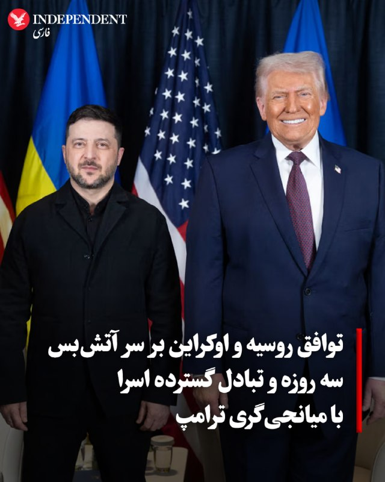

♦️ دونالد ترامپ، رئیس‌جمهوری آمریکا، روز جمعه ۱۸ اردیبهشت، اعلام کرد که روسیه و اوکراین بر سر یک آتش‌بس سه روزه که از شنبه آغاز می‌شود و همچنین تبادل متقابل ۲۰۰۰ اسیر (۱۰۰۰ نفر از هر طرف) به توافق رسیده‌اند. ترامپ در پیامی ابراز امیدواری کرد که این آتش‌بس در روزهای شنبه، یکشنبه و دوشنبه، «آغازی بر پایان این جنگ طولانی، مرگبار و سخت» باشد.

ولودیمیر زلنسکی، رئیس‌جمهوری اوکراین، نیز با تایید این خبر اظهار داشت که کی‌یف چراغ سبز مسکو را برای انجام این تبادل بزرگ دریافت کرده است. او تاکید کرد که برقراری رژیم آتش‌بس در روزهای ۹ تا ۱۱ مه (۲۰ تا ۲۲ اردیبهشت) ضروری است.

روسیه پیش از این به مناسبت ۹ مه، سالگرد پیروزی در جنگ جهانی دوم، یک آتش‌بس دو روزه یک‌جانبه اعلام کرده بود، اما اکنون با توافق جدید، این مدت به سه روز افزایش یافته و شامل تبادل گسترده اسرا نیز می‌شود. این تحول دیپلماتیک که با نقش‌آفرینی مستقیم واشنگتن حاصل شده، امیدها را برای کاهش تنش‌ها در جبهه‌های نبرد تقویت کرده است.
‌🇸🇦 Indypersian

🤖 @VahidOOnLine

## VahidOOnLine — post 238952

  <a href="telegram/content/VahidOOnLine_238952_1778269280.mp4">🎬 Download video</a>

♦️ فرماندهی مرکزی ایالات متحده (سنتکام) روز جمعه ۱۸ اردیبهشت اعلام کرد که از زمان آغاز محاصره بنادر ایران، نیروهای آمریکایی در مجموع مسیر ۵۷ شناور تجاری را تغییر داده و ۳ شناور دیگر را نیز از کار انداخته‌اند.

سنتکام همچنین تایید کرد که در حال حاضر سه ناوشکن آمریکایی شامل «یواس‌اس تراکستون» (USS Truxton)، «یواس‌اس رافائل پرالتا» (USS Rafael Peralta) و «یواس‌اس میسون» (USS Mason) در دریای عرب مستقر هستند تا بر اجرای این محاصره نظارت کنند. این ناوشکن‌ها بخشی از نیروی ضربت دریایی هستند که وظیفه دارند مانع از ورود یا خروج هرگونه محموله از بنادر ایران شوند.
‌🇸🇦 Indypersian

🤖 @VahidOOnLine

## VahidOOnLine — post 238951

  

دونالد ترامپ، رییس‌جمهوری آمریکا، با انتشار پستی در تروث سوشال اعلام کرد که بنا بر درخواست او، در روزهای نوزدهم، بیستم و بیست‌ویکم اردیبهشت، بین روسیه و اوکراین آتش‌بس سه روزه برقرار خواهد شد. ترامپ ابراز امیدواری کرد این آتش‌بس، شروعی برای پایان این جنگ باشد.

رییس‌جمهوری آمریکا نوشت: «این آتش‌بس شامل توقف تمامی فعالیت‌های نظامی و همچنین تبادل هزار اسیر از هر کشور خواهد بود. این درخواست مستقیما از سوی من مطرح شد و از موافقت ولادیمیر پوتین و ولودیمیر زلنسکی با آن بسیار قدردانی می‌کنم.»

ترامپ در این پست نوشت: «امیدوارم این، آغاز پایان یک جنگ بسیار طولانی، مرگبار و سخت باشد. مذاکرات برای پایان دادن به این درگیری بزرگ ــ بزرگ‌ترین درگیری از زمان جنگ جهانی دوم ــ ادامه دارد و هر روز بیش از پیش به توافق نزدیک می‌شویم.»
‌🏁 🇬🇧 IranintlTV

🤖 @VahidOOnLine

## VahidOOnLine — post 238950

  <a href="telegram/content/VahidOOnLine_238950_1778269283.mp4">🎬 Download video</a>

رحمانی فضلی، سفیر جمهوری اسلامی در چین، گزارش‌ها درباره حمله ایران به یک نفتکش چینی در تنگه هرمز را «غیرواقعی» توصیف کرد و گفت این خبر با هدف تحت تأثیر قرار دادن دستاوردهای سفر اخیر وزیر خارجه ایران به پکن منتشر شده است.
او همچنین گفت روابط تهران و پکن پس از جنگ «گسترده‌تر و عمیق‌تر» خواهد شد. سفیر نظام در چین افزود با توجه به جایگاه پکن برای ایران و کشورهای خلیج فارس، چین می‌تواند به‌عنوان «ضامن هرگونه توافق» در منطقه مطرح باشد.
‌🏁 🇬🇧 ManotoTV

🤖 @VahidOOnLine

## VahidOOnLine — post 238949

  <a href="telegram/content/VahidOOnLine_238949_1778269284.mp4">🎬 Download video</a>

یک شهروند در پیامی از قزوین به ایران‌اینترنشنال به کمبود داروها اشاره کرده و می‌گشوید به دلیل نبود داروی آنژیوگرافی در بیمارستان بوعلی جان و سلامت بیماران به خطر افتاده است.
‌🏁 🇬🇧 IranintlTV

🤖 @VahidOOnLine

## mwarmonitor — post 8728

  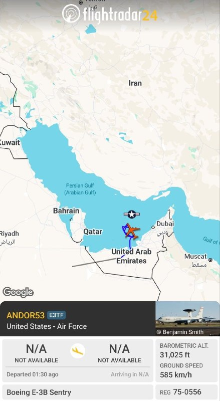

✈️«یک فروند هواپیمای E-3 Sentry نیروی هوایی آمریکا با علامت پروازی ANDOR53 بر فراز شرق عربستان سعودی و در نزدیکی مرز قطر مشاهده شد. این هواپیمای آواکس وظیفه مدیریت میدان نبرد هوابرد و فرماندهی و کنترل را بر عهده دارد و عملیات‌ها را در یک منطقه وسیع هماهنگ…

## mwarmonitor — post 8727

«من خوشحالم که اعلام کنم یک آتش‌بس سه روزه (در روزهای نهم، دهم و یازدهم می) در جنگ میان روسیه و اوکراین برقرار خواهد بود. این جشن در روسیه به مناسبت «روز پیروزی» است، اما به همین ترتیب در اوکراین نیز برگزار می‌شود، زیرا آن‌ها هم بخش و عامل بزرگی در جنگ جهانی…

## mwarmonitor — post 8726

  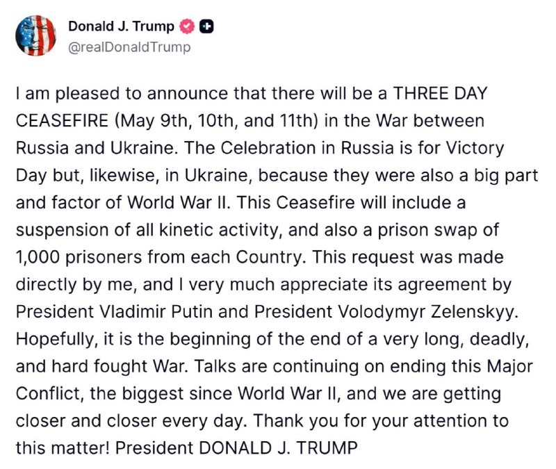

«من خوشحالم که اعلام کنم یک آتش‌بس سه روزه (در روزهای نهم، دهم و یازدهم می) در جنگ میان روسیه و اوکراین برقرار خواهد بود. این جشن در روسیه به مناسبت «روز پیروزی» است، اما به همین ترتیب در اوکراین نیز برگزار می‌شود، زیرا آن‌ها هم بخش و عامل بزرگی در جنگ جهانی دوم بودند.
این آتش‌بس شامل تعلیق تمامی فعالیت‌های نظامی جنبشی (درگیری‌های فیزیکی) و همچنین تبادل ۱۰۰۰ زندانی از هر کشور خواهد بود. این درخواست مستقیماً توسط من مطرح شد و من از موافقت پرزیدنت ولادیمیر پوتین و پرزیدنت ولودیمیر زلنسکی بسیار قدردانی می‌کنم.
امیدوارم این شروعی برای پایان یک جنگ بسیار طولانی، مرگبار و سخت باشد. گفتگوها برای پایان دادن به این درگیری بزرگ - که بزرگترین درگیری از زمان جنگ جهانی دوم است - ادامه دارد و ما هر روز به نتیجه نزدیک‌تر و نزدیک‌تر می‌شویم. از توجه شما به این موضوع سپاسگزارم!

رئیس‌جمهور دونالد جی. ترامپ»

@mwarmonitor

## mwarmonitor — post 8725

  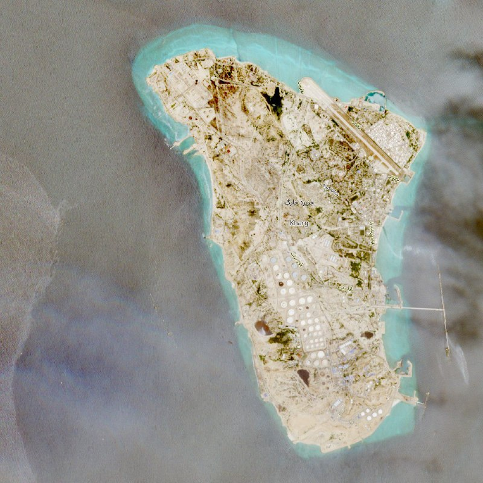

«ایران 🇮🇷 جزیره خارک امروز مشاهده شد .
هیچ نفتکش غول‌پیکر VLCC در حال بارگیری دیده نمی‌شود. فقط یک نفتکش کوچک ساحلی که از قبل هم آنجا بوده است.

❗️نشت بزرگ نفت از پایانه غربی (W terminal) پایان یافته است. یک لکه نفتی بزرگ در سمت چپ دیده می‌شود.
یک نشت کوچک نیز در نزدیکی نفتکش ساحلی در پایانه اسکله T (T-Jetty) مشاهده می‌شود.»

@mwarmonitor

## pm_afshaa — post 90384

🔴اتلانتیک:ترامپ از جنگ ایران «خسته» و ناامید است زیرا این جنگ بسیار طولانی‌تر از آنچه انتظار داشت ادامه یافته و پیروزی روشنی در چشم نیست.

او می‌خواهد به مسائل داخلی، مذاکرات تجاری با چین و اولویت‌های دیگر بپردازد، اما ایران همچنان از مذاکره امتناع می‌کند و درگیری را طولانی‌تر می‌کند

💧 Rainbet.com the #1 Non-KYC Crypto Casino & Sportsbook @rainbetcom

😁 @Pm_Afshaa

## pm_afshaa — post 90383

🔴گروسی: مسئله هسته‌ای ایران تنها از طریق دیپلماسی قابل حل است

💧 Rainbet.com the #1 Non-KYC Crypto Casino & Sportsbook @rainbetcom

😁 @Pm_Afshaa

## pm_afshaa — post 90382

🔴پرواز پهپاد های جاسوسی امریکا بر فراز تنگه هرمز

💧 Rainbet.com the #1 Non-KYC Crypto Casino & Sportsbook @rainbetcom

😁 @Pm_Afshaa

## DEJradio — post 4523

  <a href="telegram/content/DEJradio_4523_1778269287.mp4">🎬 Download video</a>

📢
🔺 شکایت از سفره‌های خالی؛ "بچه‌های ما گرسنه‌اند".

#بحران #اقتصاد #فروپاشی
@DEJradio

## VahidOnline — post 75339

  

دونالد ترامپ، رئیس‌جمهوری آمریکا، روز جمعه ۱۸ اردیبهشت، اعلام کرد که روسیه و اوکراین بر سر یک آتش‌بس سه روزه که از شنبه آغاز می‌شود و همچنین تبادل متقابل ۲۰۰۰ اسیر (۱۰۰۰ نفر از هر طرف) به توافق رسیده‌اند.
ترامپ در پیامی ابراز امیدواری کرد که این آتش‌بس در روزهای شنبه، یکشنبه و دوشنبه، «آغازی بر پایان این جنگ طولانی، مرگبار و سخت» باشد.
@VahidOOnLine

📡 @VahidOnline

## VahidOnline — post 75338

  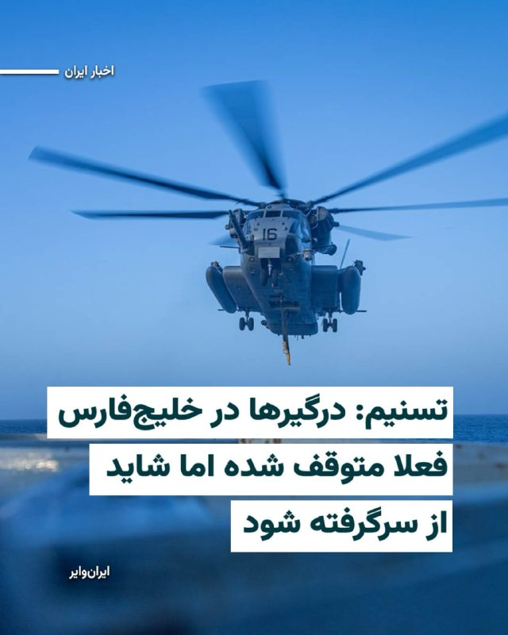

خبرگزاری «تسنیم»،رسانه نزدیک به سپاه پاسداران به نقل از یک منبع نظامی نوشته است که «پس از مدتی تبادل آتش، هم اینک درگیری‌ها متوقف شده و فضا آرام است». او اما در عین حال ادامه داده که «اگر مجددا آمریکایی‌ها قصد ورود به خلیج فارس را داشته باشند و یا برای شناورهای ایرانی مزاحمتی ایجاد کنند، مجدداً پاسخ قاطع دریافت خواهند کرد. بنابراین احتمال ورود مجدد به درگیری‌هایی از این قبیل در این منطقه همچنان وجود دارد.»
@VahidHeadline

📡 @VahidOnline

## IranIntlTV — post 336197

امارات متحده عربی از رهگیری حمله موشکی خبر داد؛ درگیری‌ها در تنگه هرمز تشدید شد

گزارش‌هایی از درگیری‌های پراکنده میان نیروهای مسلح جمهوری اسلامی و شناورهای آمریکایی در محدوده تنگه هرمز منتشر شده است. هم‌زمان امارات متحده عربی اعلام کرد در پی حمله موشکی و پهپادی جمهوری اسلامی سه نفر زخمی شدند.

خبرگزاری فارس، وابسته به سپاه پاسداران جمعه ۱۸ اردیبهشت نوشت درگیری‌های پراکنده میان نیروهای مسلح جمهوری اسلامی و شناورهای آمریکایی در محدوده تنگه هرمز از ساعتی پیش آغاز شده است.

ساعاتی بعد، خبرگزاری تسنیم، دیگر رسانه وابسته به سپاه پاسداران، به‌نقل از یک منبع نظامی نوشت که درگیری نیروهای جمهوری اسلامی با نیروهای آمریکایی «پس از مدتی تبادل آتش، متوقف شده و فضا آرام است.»

این منبع نظامی که نامش فاش نشده، افزود: «با این حال، اگر مجددا آمریکایی‌ها قصد ورود به خلیج فارس را داشته باشند و یا برای شناورهای ایرانی مزاحمتی ایجاد کنند، مجددا پاسخ قاطع دریافت خواهند کرد.»

او گفت: «بنابراین احتمال ورود مجدد به درگیری‌هایی از این قبیل در این منطقه همچنان وجود دارد.»

هم‌زمان گزارش‌های مختلفی از شنیده شدن صدای انفجار و فعالیت پدافند هوایی در چند شهر از جمله تهران، سیرک و کنارک منتشر شد.

این در حالی است که مارکو روبیو، وزیر امور خارجه آمریکا، گفت باید جمعه پاسخ جمهوری اسلامی به طرح پیشنهادی صلح به واشینگتن ارائه شود.

او ابراز امیدواری کرد این پاسخ «جدی» باشد و بتواند مسیر ورود به یک فرآیند مذاکراتی واقعی را باز کند.

امارات متحده عربی جمعه ۱۸ اردیبهشت اعلام کرد به یک حمله جدید موشکی جمهوری اسلامی پاسخ داده است؛ حمله‌ای که ساعاتی پس از اعلام تبادل آتش میان آمریکا و ایران در تنگه هرمز رخ داد و آتش‌بس شکننده یک‌ماهه را با چالش تازه‌ای روبه‌رو کرد.

وزارت دفاع امارات نیز گفت سامانه‌های پدافندی این کشور دو موشک بالستیک و سه پهپاد شلیک‌شده از سوی ایران را رهگیری کردند.

در این حمله سه نفر زخمی شدند، اما مشخص نیست همه اهداف به‌طور کامل منهدم شده باشند. مقام‌ها از شهروندان خواستند از محل سقوط احتمالی بقایا دوری کنند.

در همین حال، ارتش آمریکا اعلام کرد حملات جمهوری اسلامی به سه ناو نیروی دریایی خود در تنگه هرمز را دفع کرده و تاسیسات نظامی ایران را که در این حملات نقش داشته‌اند، هدف قرار داده است. به‌گفته مقام‌های آمریکایی، هیچ‌یک از کشتی‌های این کشور آسیب ندیده‌اند.

واشینگتن همچنین اعلام کرد نیروهایش دو نفت‌کش ایرانی دیگر را که در تلاش برای عبور از محاصره دریایی آمریکا بودند، هدف قرار داده و از کار انداخته‌اند. آمریکا با هدف جلوگیری از تردد نفت‌کش‌های ایرانی، بندرهای این کشور را تحت محاصره قرار داده است.

هم‌زمان، گزارش‌هایی منتشر شده که نشان می‌دهد جمهوری اسلامی با ایجاد نهادی برای کنترل عبور کشتی‌ها در تنگه هرمز، در پی تثبیت نقش خود در مدیریت این آبراه است؛ اقدامی که نگرانی‌های تازه‌ای درباره آزادی کشتی‌رانی ایجاد کرده است.

در حال حاضر صدها کشتی تجاری در خلیج فارس متوقف شده‌اند و امکان گذر از تنگه هرمز و ورود به آب‌های آزاد را ندارند.

🔗وب‌سایت ایران‌اینترنشنال
@iranintltv

## IranIntlTV — post 336196

  <a href="telegram/content/IranIntlTV_336196_1778269290.mp4">🎬 Download video</a>

یک شهروند شاغل به شغل فصلی می‌گوید قطع اینترنت درآمد و کسب او را مختل کرده است. او گفت حتی اگر با فیلترشکن به اینترنت وصل شود چون بقیه شهروندان در اینترنت حاضر نیستند تبلیغات او فایده‌ای نخواهد داشت.

## IranIntlTV — post 336195

🗣روایت شما از بحران اقتصادی و زندگی در آتش‌بس- جمعه ۱۸ اردیبهشت:

🔹روز ۱۸ اردیبهشت شش قلم کالا شامل سبزیجات و میوه خریدم که حجم‌شان به یک کیلو هم نمی‌رسد، اما شد یک میلیون و ۱۱۴ هزار تومان. تازه این خرید کاملی نیست، حتی برای چند روز.

🔹مرغ کیلویی ۳۴۰ هزار تومان، شیر پاکتی ۸۵ هزار تومان، نوشابه که پارسال ۴۵ هزار تومان بود، شده ۱۲۵ هزار تومان، پنیر ۴۰۰ گرمی شده ۲۳۰ هزار تومان؛ یک خرید در حد خورد و خوراک چند روز یک خانواده دو نفره و همه وسایل عادی و لازم زندگی را خریدم شد ۴ میلیون و ۵۰۰ هزار تومان.

🔹به علت نوسانات برق، ۱۸ اردیبهشت یخچال سایدبای‌ساید سامسونگ ما سوخت؛ علاوه بر اینکه قطعه‌ اصلی نایاب است، گفتند تعمیرات با قطعه‌ چینی بیشتر از ۴۵ میلیون تومان هزینه دارد؛ پول نداریم درستش کنیم و الان همه‌ ذخیره‌ مرغ و گوشت ما خراب شده.

🔹یک موبایل معمولی، یک لپتاپ معمولی و یک موتور معمولی ساده و از نوع ارزان، مجموعا می‌شود حدود یک میلیارد تومان؛ یعنی مرگ آرزوهایمان در جمهوری اسلامی را به چشم دیدیم.

🔹روز ۱۸ اردیبهشت یک پلاستیک زباله و یک پلاستیک فریزر را در مازندران خریدم ۸۱۰ هزار تومان.

## IranIntlTV — post 336194

  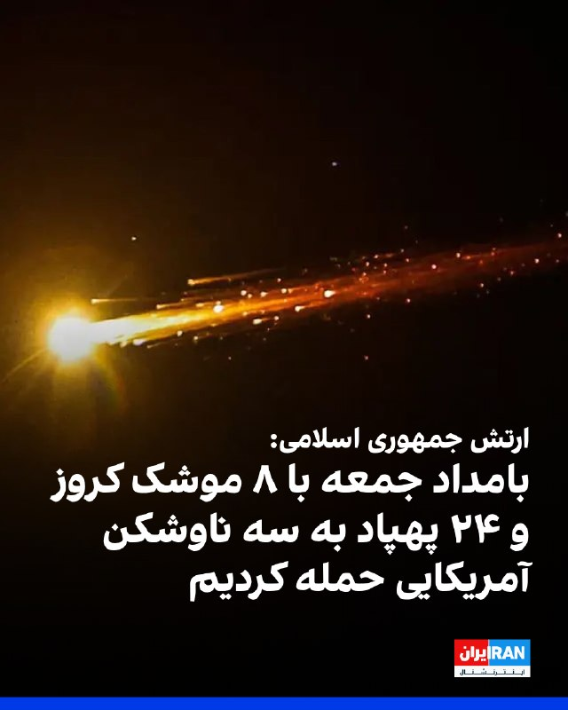

ارتش جمهوری اسلامی در بیانیه‌ای اعلام کرد که بامداد جمعه «در یک عملیات ترکیبی موشکی-پهپادی» با هشت موشک کروز و ۲۴ فروند پهپاد انتحاری، به سه ناوشکن آمریکایی که در حال خروج از تنگه هرمز به سمت دریای عمان بودند، حمله کرد.
https://iranintl.com/202605088265

## IranIntlTV — post 336193

حسین حیدری، ۵۰ ساله و پدر یک دختر ۲۰ ساله، شامگاه ۱۸ دی ۱۴۰۴ در هفت حوض تهران هدف گلوله‌های جنگی ماموران قرار گرفت و خانواده‌اش پیکر او را در حیاط پشتی بیمارستان الغدیر و پیچیده در پتویی آبی‌رنگ یافتند.

## IranIntlTV — post 336192

  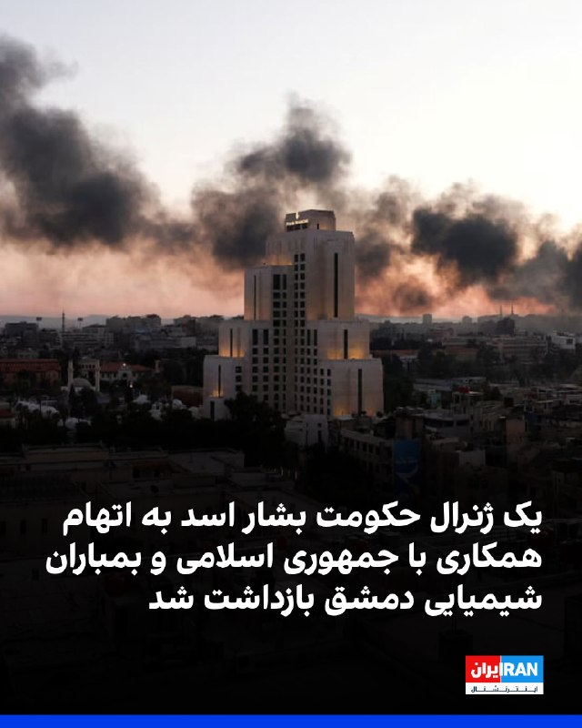

وزارت کشور سوریه اعلام کرد «خردل احمد دیوب»، ژنرال دوران حکومت بشار اسد را به دلیل نقش مستقیم در نقض سازمان‌یافته حقوق غیرنظامیان، همکاری با جمهوری اسلامی و دست داشتن در حملات شیمیایی در دمشق بازداشت کرده است.

دیوب متهم است که «بر عملیات سرکوب نظارت کرده و در هماهنگی لجستیکی بمباران غوطه شرقی با سلاح‌های شیمیایی ممنوعه بین‌المللی مشارکت داشته است.»

دیوب که تازه‌ترین مقام بازداشت‌شده از میان مسئولان دوران اسد در ماه‌های اخیر است، همچنین به مشارکت در اعدام‌های فراقضایی و هماهنگی با جمهوری اسلامی و حزب‌الله لبنان، که هر دو از حکومت سرنگون‌شده حمایت می‌کردند، متهم شده است.

در تابستان سال ۱۳۹۲، ارتش تحت فرمان اسد متهم شد که با استفاده از سلاح‌های شیمیایی، مناطق تحت کنترل شورشیان را هدف قرار داده و بنا بر ارزیابی نهادهای اطلاعاتی آمریکا و گروه‌های حقوق بشری، بیش از ۱۴۰۰ مرد، زن و کودک را کشته است.
https://iranintl.com/202605086109

## IranIntlTV — post 336191

جنگ نمادها: چرا شکوفایی امارات برای جمهوری اسلامی غیرقابل تحمل است؟

🖋 کامیار بهرنگ

دشمنی جمهوری اسلامی با امارات متحده عربی بیش از آنکه بر سر مرزها باشد، ریشه در یک تضاد عمیق وجودی دارد.

دقیق‌ترین توصیف از این شکاف را ریم الهاشمی، وزیر مشاور امارات ارائه داد. او تاکید کرد که امارات بیش از هر کشور دیگری هدف حملات تهران بوده است، زیرا این کشور هر آن چیزی است که جمهوری اسلامی نیست. امارات با ارائه الگویی از شکوفایی اقتصادی، تنوع ادیان و همزیستی فرهنگ‌های جهانی، عملا به ضدِ الگوی حکومتی تبدیل شده که بقای خود را در انزوای ایدئولوژیک و ترویج فقر تحت نام مقاومت می‌بیند.

هراس از ابطال روایت؛ وقتی رفاه همسایه پایه‌های شعار را می‌لرزاند
برای سیستمی که دهه‌ها بر طبل ساده‌زیستی انقلابی و دشمنی با تجمل کوبیده است، تماشای یک کشور مسلمان در همسایگی که به قله‌های رفاه و تکنولوژی رسیده، یک کابوس تمام‌عیار است.

موفقیت دبی و ابوظبی به‌طور خودکار ادعای ناکارآمدی مدل‌های غیرانقلابی را باطل می‌کند. مقامات تهران توسعه امارات را نه یک پیشرفت بومی، بلکه ویترینی از استعمار نوین معرفی می‌کنند، چرا که پذیرش موفقیت این مدل به معنای پذیرش شکست چهل سال شعار اقتصاد مقاومتی در ایران است.

استراتژی ویرانی؛ چرا برج‌ها و هتل‌ها در سیبل حملات هستند؟
تمرکز هواداران نظام و رسانه‌های رادیکال (اصلاح‌طلب، اصولگرا و ...) بر تهدید به تخریب هتل‌ها و برج‌های نمادین دبی، برخاسته از یک منطق جنگی است که اعتبار و امنیت را هدف می‌گیرد. آنها می‌دانند که قدرت امارات بر تصویر امنیت و ثبات استوار است.

در حالی که اهداف نظامی ممکن است بازسازی شوند، فروریختن یک نماد لوکس مانند برج خلیفه، ضربه‌ای مهلک به قلب صنعت توریسم و جریان سرمایه‌گذاری خارجی است. هدف قرار دادن این نمادها، تلاشی است برای اثبات این ادعا که رفاه بدون تبعیت از نظم مورد نظر تهران، سرابی لرزان بیش نیست.

خانه شیشه‌ای؛ منطق شکنندگی در برابر منطق توسعه
استفاده مداوم از استعاره خانه شیشه‌ای در ادبیات نظامی و رسانه‌ای جمهوری اسلامی، پیامی روشن به ابوظبی است. بر اساس تحلیل‌های منتشر شده در رسانه‌های وابسته به نهادهای نظامی، کشوری که تمام دارایی‌اش در چند سازه مدرن خلاصه شده، در برابر ضربه پهپادی و موشکی به‌شدت آسیب‌پذیر است.

این استراتژی در واقع تلاش برای باج‌گیری از کشوری است که برخلاف تهران، چیزهای زیادی برای از دست دادن دارد. آنها می‌خواهند ثابت کنند که شکوفایی اقتصادی در غیاب تبعیت سیاسی از قدرت منطقه‌ای جمهوری اسلامی، به مویی بند است.

اما ندیدن موازنه بلند مدت قدرت بزرگ‌ترین اشتباه راهبردی جمهوری اسلامی است. جایی که اتفاقا امارات متحده عربی به‌خوبی روی آن سرمایه‌گذاری کرده است و کشورش را از دل شن به جایی برای رفاه و سرمایه‌گذاری بدل کرده است.

پیمان ابراهیم؛ تغییر موازنه و ورود اسرائیل به معادله
تنها بخشی از این دشمنی که مستقیما به اسرائیل گره می‌خورد، نقش امارات در پیمان ابراهیم است. از نظر حاکمان جمهوری اسلامی، این توافق نه یک حرکت دیپلماتیک، بلکه یک خیانت راهبردی و تهدید موجودیتی است. الحاق امارات به این پیمان، به معنای پایان انزوای اسرائیل در منطقه و آغاز همکاری‌های امنیتی و راداری در نزدیکی سواحل ایران است. جمهوری اسلامی با وحشت نظاره‌گر این است که امارات چگونه با تغییر قطب‌نما، امنیت خود را از طریق اتحاد با قدرت‌های نوین و تکنولوژیک تامین می‌کند و عملا نفوذ سنتی ایران در میان کشورهای عربی را خنثی می‌سازد.

استقلال در بازار انرژی؛ پایان دوران تبعیت از الگوهای فرسوده
تحرکات امارات برای بازنگری در سهمیه‌های اوپک یا حتی شایعات خروج از این سازمان، نشان‌دهنده تولد یک بازیگر مستقل است که دیگر حاضر نیست منافع ملی خود را فدای سیاست‌های دسته‌جمعی کند.

این رویکرد که ابوظبی مسیر ویژن ۲۰۳۱ خود را مقدم بر اتحادهای نفتی قدیمی می‌داند، برای تهران که تحت فشار تحریم‌ها به انسجام اوپک نیاز دارد، یک ضربه سنگین است. امارات ثابت کرده که در نظم نوین جهانی، شکوفایی اقتصادی از مسیر عمل‌گرایی می‌گذرد، نه همبستگی‌های فرسوده ایدئولوژیک.

پایان عصر انحصار؛ پیروزی واقع‌گرایی بر شعار
امارات با انتخاب مسیر شکوفایی و تکثر، عملا ثابت کرده است که می‌توان مسلمان بود، مدرن زیست و با تمام جهان رابطه داشت و به ثروت رسید.

این دقیقا همان واقعیتی است که جمهوری اسلامی بیش از چهار دهه تلاش کرده تا آن را غیرممکن جلوه دهد. دشمنی با امارات، در حقیقت دشمنی با آینه‌ای است که ناتوانی‌های حکمرانی ایدئولوژیک را به وضوح نشان می‌دهد.

🔗متن کامل گزارش را اینجا بخوانید
@iranintltv

## IranIntlTV — post 336190

  <a href="https://t.me/IranintlTV/336190">📎 Download file</a>

🎧نسخه صوتی حرف آخر با پوریا زراعتی - طرح موساد برای مجتبی
@iranintlTV

## IranIntlTV — post 336189

  <a href="telegram/content/IranIntlTV_336189_1778269293.mp4">🎬 Download video</a>

۲۴ با فرداد فرحزاد
@iranintltv

## IranIntlTV — post 336188

  <a href="telegram/content/IranIntlTV_336188_1778269294.mp4">🎬 Download video</a>

چرا در شرایط فعلی توافق بین تهران و واشنگتن ممکن نیست؟

ترامپ و نتانیاهو برای تسلیم ج.ا چه طرحی در سر دارند؟
@iranintltv

## IranIntlTV — post 336187

  <a href="https://t.me/IranintlTV/336187">📎 Download file</a>

🎧نسخه صوتی اخبار شبانگاهی | جمعه ۱۸ اردیبهشت
@iranintlTV

## IranIntlTV — post 336186

  <a href="telegram/content/IranIntlTV_336186_1778269296.mp4">🎬 Download video</a>

در پی یک گروگان‌گیری در شهر زین‌سیش آلمان، پلیس عملیات گسترده‌ای را در این شهر آغاز کرد. با ورود نیروهای ویژه به ساختمان، افراد محبوس‌شده بدون جراحت آزاد شدند.

پلیس اعلام کرد هنگام ورود نیروها، مهاجمان دیگر در محل حضور نداشتند.

گزارش علی حسن‌پور، خبرنگار ایران‌اینترنشنال
@iranintltv

## IranIntlTV — post 336185

  <a href="telegram/content/IranIntlTV_336185_1778269298.mp4">🎬 Download video</a>

وزارت خارجه آمریکا از قطعی شدن دور جدید گفت‌وگوها میان اسرائیل و لبنان در واشینگتن خبر داد. یک مقام لبنانی گفت با وجود تلاش‌های آمریکا برای کاهش اقدامات نظامی اسرائیل، حمله به ضاحیه جنوبی را پیامی برای اخلال در روند مذاکرات می‌دانیم.

گزارش اشکان صفایی، خبرنگار ایران‌اینترنشنال
@iranintltv

## IranIntlTV — post 336184

  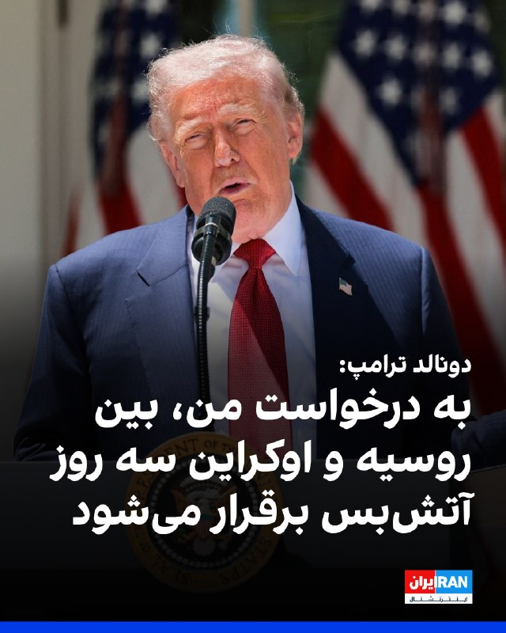

دونالد ترامپ، رییس‌جمهوری آمریکا، با انتشار پستی در تروث سوشال اعلام کرد که بنا بر درخواست او، در روزهای نوزدهم، بیستم و بیست‌ویکم اردیبهشت، بین روسیه و اوکراین آتش‌بس سه روزه برقرار خواهد شد. ترامپ ابراز امیدواری کرد این آتش‌بس، شروعی برای پایان این جنگ باشد.

رییس‌جمهوری آمریکا نوشت: «این آتش‌بس شامل توقف تمامی فعالیت‌های نظامی و همچنین تبادل هزار اسیر از هر کشور خواهد بود. این درخواست مستقیما از سوی من مطرح شد و از موافقت ولادیمیر پوتین و ولودیمیر زلنسکی با آن بسیار قدردانی می‌کنم.»

ترامپ در این پست نوشت: «امیدوارم این، آغاز پایان یک جنگ بسیار طولانی، مرگبار و سخت باشد. مذاکرات برای پایان دادن به این درگیری بزرگ ــ بزرگ‌ترین درگیری از زمان جنگ جهانی دوم ــ ادامه دارد و هر روز بیش از پیش به توافق نزدیک می‌شویم.»
https://iranintl.com/202605082152

## IranIntlTV — post 336183

  <a href="telegram/content/IranIntlTV_336183_1778269300.mp4">🎬 Download video</a>

یک شهروند در پیامی از قزوین به ایران‌اینترنشنال به کمبود داروها اشاره کرده و می‌گشوید به دلیل نبود داروی آنژیوگرافی در بیمارستان بوعلی جان و سلامت بیماران به خطر افتاده است.

## ManotoTV — post 105162

  <a href="telegram/content/ManotoTV_105162_1778269302.mp4">🎬 Download video</a>

وزارت خارجه قطر اعلام کرد محمد بن عبدالرحمن آل ثانی، نخست‌وزیر و وزیر خارجه این کشور، در واشینگتن با جی‌دی ونس، معاون رئیس‌جمهوری ایالات متحده آمریکا، دیدار و درباره کاهش تنش در منطقه گفت‌وگو کرده است.

در این بیانیه آمده است نخست‌وزیر قطر بر ضرورت پاسخ‌گویی طرف‌ها به میانجیگری پاکستان و دستیابی به توافقی جامع برای تحقق صلحی پایدار تاکید کرده است.

## ManotoTV — post 105161

  <a href="telegram/content/ManotoTV_105161_1778269302.mp4">🎬 Download video</a>

وزارت خارجه قطر با انتشار بیانیه‌ای، حملات جمهوری اسلامی به امارات متحده عربی را به‌شدت محکوم کرد و آن را «نقض آشکار حاکمیت» و تهدیدی برای امنیت منطقه دانست.

در این بیانیه آمده است که این حملات با استفاده از موشک‌های بالستیک و پهپاد انجام شده و به زخمی شدن چند نفر منجر شده است.

دوحه با اعلام همبستگی کامل با امارات متحده عربی تاکید کرد از تمامی اقدامات این کشور برای حفظ امنیت، ثبات و تمامیت ارضی‌اش حمایت می‌کند.

## ManotoTV — post 105160

  <a href="telegram/content/ManotoTV_105160_1778269303.mp4">🎬 Download video</a>

مارکو روبیو، وزیر خارجه ایالات متحده آمریکا، از متحدان اروپایی خواست از موضع‌گیری‌های لفظی فراتر رفته و اقدامات عملی علیه جمهوری اسلامی انجام دهند.

او پس از دیدار با جورجا ملونی، نخست‌وزیر ایتالیا، در رم گفت تلاش تهران برای کنترل تنگه هرمز «غیرقابل قبول» و تهدیدی برای امنیت جهانی است.

روبیو تاکید کرد: «همه می‌گویند ایران یک تهدید است و نباید به سلاح هسته‌ای دست پیدا کند، اما باید اقدامی هم انجام شود.»

او افزود: «اگر پاسخ این است که نه، پس باید چیزی فراتر از بیانیه‌های شدیدالحن داشته باشید.»

## ManotoTV — post 105159

  <a href="telegram/content/ManotoTV_105159_1778269304.mp4">🎬 Download video</a>

فرماندار سوادکوه اعلام کرد در تنگه ابوالقیس این منطقه رانش زمینی به ارتفاع حدود ۳۰ متر رخ داده که به‌دلیل قرار گرفتن در مجاورت یک مسیر ارتباطی حیاتی، خطوط برق ۲۰ کیلووات، لوله نفت ۳۲ اینچ و نهر آب کشاورزی، وضعیت آن «ناپایدار و خطرآفرین» ارزیابی شده است.
به گفته او، این رانش در باند برگشت محور اصلی تهران به شمال و در فاصله حدود ۵۰۰ متری راهدارخانه اوریم، در ضلع غربی محور شمال به تهران اتفاق افتاده است.
بررسی‌های میدانی نشان می‌دهد آثار به‌جامانده از این رانش، احتمال ادامه‌دار بودن حرکت زمین و تشدید ناپایداری در منطقه را مطرح می‌کند.

## ManotoTV — post 105158

  <a href="telegram/content/ManotoTV_105158_1778269304.mp4">🎬 Download video</a>

پنتاگون مجموعه‌ای از اسناد جدید و «تاکنون دیده‌نشده» درباره اشیای پرنده ناشناس (UFO/UAP) منتشر کرده و اعلام کرده مردم می‌توانند خودشان درباره این پدیده‌ها نتیجه‌گیری کنند. در میان این اسناد، تصویری از مأموریت آپولو ۱۷ در سال ۱۹۷۲ دیده می‌شود که سه نقطه نورانی را به شکل مثلثی نشان می‌دهد. پنتاگون اعلام کرده هنوز اجماعی درباره ماهیت این پدیده‌ها وجود ندارد، اما بررسی‌های اولیه احتمال داده که ممکن است یک «شیء فیزیکی» باشد. در این بسته جدید ۱۶۱ فایل منتشر شده که شامل اسناد وزارت خارجه، اف‌بی‌آی، گزارش‌های ناسا از مأموریت‌های فضایی و بیش از ۲۰ ویدیو از اشیای ناشناس ثبت‌شده توسط حسگرهای نظامی در نقاط مختلف جهان است؛ از ژاپن و سوریه تا آمریکای شمالی. این اشیا از نقاط نورانی سریع‌الحركت تا یک جسم شبیه توپ فوتبال آمریکایی در سال ۲۰۲۲ را شامل می‌شوند. در یکی از اسناد نیز گزارش شده که خلبانی در سال ۱۹۹۴ به همراه سه آمریکایی در آسمان قزاقستان یک شیء نورانی دیده که حرکات غیرعادی مانند چرخش‌های تند و تغییر مسیر ۹۰ درجه داشته است. همچنین در اسناد آپولو ۱۱، باز آلدرین از مشاهده یک شیء بزرگ نزدیک ماه و نورهای غیرعادی خبر داده و در گزارشی دیگر از اف‌بی‌آی یک خلبان پهپاد در سال ۲۰۲۳ گفته جسمی خطی با نور بسیار شدید برای چند ثانیه دیده شده و سپس ناپدید شده است. پنتاگون هدف از این انتشار را افزایش شفافیت اعلام کرده و گفته مردم خودشان باید قضاوت کنند، در حالی که تأکید شده در گزارش‌های قبلی هیچ مدرکی درباره فناوری فرازمینی تأیید نشده است.

## ManotoTV — post 105157

  <a href="telegram/content/ManotoTV_105157_1778269305.mp4">🎬 Download video</a>

رحمانی فضلی، سفیر جمهوری اسلامی در چین، گزارش‌ها درباره حمله ایران به یک نفتکش چینی در تنگه هرمز را «غیرواقعی» توصیف کرد و گفت این خبر با هدف تحت تأثیر قرار دادن دستاوردهای سفر اخیر وزیر خارجه ایران به پکن منتشر شده است.
او همچنین گفت روابط تهران و پکن پس از جنگ «گسترده‌تر و عمیق‌تر» خواهد شد. سفیر نظام در چین افزود با توجه به جایگاه پکن برای ایران و کشورهای خلیج فارس، چین می‌تواند به‌عنوان «ضامن هرگونه توافق» در منطقه مطرح باشد.

## FarsiVOA — post 217221

⚡️ریشه‌ها و علل حملات موشکی و پهپادی جمهوری اسلامی به مواضع احزاب کُرد ایرانی در اقلیم کردستان عراق در گفت‌وگو با خالد عزیزی، سخنگوی حزب دموکرات کردستان ایران
@FarsiVOA

## FarsiVOA — post 217220

🔺انتقال عرفان شکورزاده به زندان قزل‌حصار؛ خطر اجرای حکم اعدام این دانشجوی نخبه افزایش یافت

◾️رسانه‌های حقوق بشری اعلام کردند عرفان شکورزاده، دانشجوی نخبه ۲۹ ساله، پس از ماه‌ها نگهداری در سلول انفرادی و اعترافات اجباری، با حکم اعدام روبرو و برای اجرای این حکم به زندان قزل‌حصار منتقل شده است.

⬇️ بیشتر بخوانید:
https://ir.voanews.com/a/iran-execution-erfan-shakurzadeh-student-/8148049.html?withmediaplayer=1
@FarsiVOA

## FarsiVOA — post 217219

🔺گزارش| سرنخ ناوگان اشباح جمهوری اسلامی به وزارت نفت عراق رسید

◾️روز پنج‌شنبه ۱۷ اردیبهشت، وزارت خزانه‌داری آمریکا چهار عراقی را در لیست تحریم‌های خود قرار داد که یکی از آنها «علی بهادلی» معاون وزیر نفت عراق است. واشنگتن او را به سوءاستفاده از موقعیت خود برای تسهیل قاچاق نفت ایران از طریق عراق، و انجام این کار به واسطه شبه‌نظامیان عصائب اهل حق، با جعل اسناد درباره مبدأ نفت و اعطای امتیازات صادراتی به شبکه‌های قاچاق مرتبط با تهران، متهم کرده است.

⬇️ بیشتر بخوانید:
https://ir.voanews.com/a/8147979.html
@FarsiVOA

## FarsiVOA — post 217218

⚡️در حالی که مقام‌های جمهوری اسلامی امارات را تهدید می‌کنند، ویدئوهای رسیده به صدای آمریکا از صف جویندگان کار، قفسه‌های خالی فروشگاه‌ها و فشار شدید اقتصادی بر مردم ایران خبر می‌دهد. همزمان، تنش‌های امنیتی و اختلاف‌نظرها در داخل حکومت ادامه دارد
@FarsiVOA

## FarsiVOA — post 217217

🔺اعدام محراب عبدالله زاده، معترض «زن، زندگی، آزادی» که تا آخرین لحظه گفت «بی گناهم»

◾️«سلام مردم ایران، من محراب عبدالله‌زاده هستم. صدای من را از زندان مرکزی ارومیه می‌شنوید.» این سه جمله ابتدایی پیام صوتی کسی است که حالا نامش به عنوان یکی از اعدام شده‌های جمهوری اسلامی ثبت شده است. محراب عبدالله زاده در این پیام گزارش داده است که توسط سپاه پاسداران در جریان اعتراضات «زن، زندگی، آزادی» در ارومیه بازداشت شده است و «۴۲ ماه زیر حکم اعدام بوده است».

⬇️ بیشتر بخوانید:
https://ir.voanews.com/a/iran-execution-mehrab-abdollahzadeh-kurd-protest-/8148033.html
@FarsiVOA

## FarsiVOA — post 217216

🔺ارتش آمریکا مانع ورود یا خروج بیش از ۷۰ نفتکش از بنادر ایران شده است

◾️سنتکام می‌گوید هم‌اکنون، بیش از ۷۰ نفتکش، به دستور نیروهای آمریکایی در تنگه هرمز از ادامه مسیر خروج از بنادر ایران یا ورود به آنها خودداری کرده‌اند. ارزش این محموله‌های نفتی ۱۳ میلیارد دلار است.‏ همچنین ۵۰ کشتی نیز به دستور ارتش آمریکا، تغییر مسیر داده‌اند.

⬇️ بیشتر بخوانید:

https://ir.voanews.com/a/iran-centcom-hormuz-blockade-us-tankers-/8147997.html

## FarsiVOA — post 217215

  <a href="telegram/content/FarsiVOA_217215_1778269306.mp4">🎬 Download video</a>

فرماندهی مرکزی ایالات متحده، سنتکام، اعلام کرد سه ناوشکن آمریکایی در دریای عرب در حال پشتیبانی از عملیات مرتبط با محاصره دریایی ایران هستند.

سنتکام همچنین گفته تاکنون مسیر ۵۷ کشتی تجاری مرتبط با ایران را تغییر داده و چهار شناور را برای جلوگیری از ورود یا خروج از بنادر این کشور متوقف کرده‌ است.

@FarsiVOA

## FarsiVOA — post 217214

مهرزاد بروجردی: با توجه به ادامه آتش‌بس، روزنه‌ای از امید برای توافق میان واشنگتن و تهران وجود دارد

## FarsiVOA — post 217213

  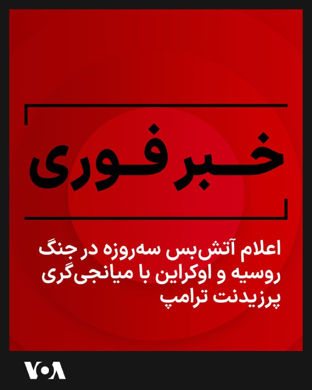

⚡️دونالد ترامپ، رئیس‌جمهوری ایالات متحده، از دستیابی به توافقی برای برقراری یک آتش‌بس سه‌روزه (۹، ۱۰ و ۱۱ ماه مه برابر با ۱۹، ۲۰ و ۲۱ اردیبهشت) میان روسیه و اوکراین خبر داد.
این توافق که به مناسبت سالگرد پیروزی در جنگ جهانی دوم حاصل شده، شامل توقف کامل تمامی فعالیت‌های نظامی و تبادل گسترده زندانیان است.
پرزیدنت ترامپ که مدت‌هاست برای پایان این جتگ تلاش می‌کند در تروت سوشال نوشت: «امیدوارم این آغاز پایانِ یک جنگ بسیار طولانی، مرگبار و سخت باشد.»

## FarsiVOA — post 217212

علی جوانمردی: روی سرنگونی جمهوری اسلامی با جنگ آمریکا سرمایەگذاری نکنید!

## FarsiVOA — post 217211

آمریکا دو‌ نفتکش دیگر‌ وابسته به جمهوری اسلامی‌ را هدف قرار داد

## FarsiVOA — post 217210

اپلیکیشن‌های داخلی در ایران هیچ‌گونه امنیتی برای کاربران ندارند؛ گفت‌وگو با علیرضا فیروزی

## DW_Farsi — post 124459

  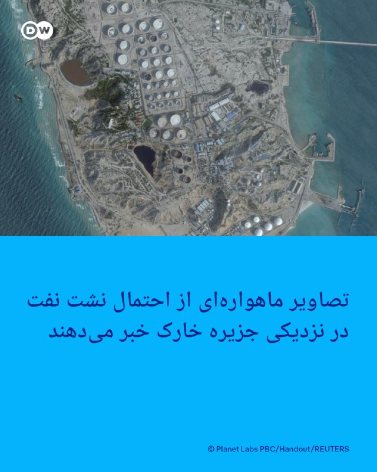

🔶 تصاویر ماهواره‌ای از احتمال نشت نفت در نزدیکی جزیره خارک خبر می‌دهند

خبرگزاری رویترز گزارش داد تصاویر ماهواره‌های کوپرنیک در فاصله سه‌شنبه تا پنج‌شنبه ۶ تا ۸ مه (۱۶ تا ۱۸ اردیبهشت ) لکه‌ای مشکوک را در آب‌های غرب جزیره خارک ثبت کرده‌اند؛ جزیره‌ای که پایانه اصلی صادرات نفت ایران به شمار می‌رود. پژوهشگران محیط‌زیست گفته‌اند این رد خاکستری‌ و سفید از نظر بصری با یک لکه نفتی مطابقت دارد، اما علت و منشأ دقیق آن هنوز مشخص نیست.

رویترز به نقل از دو پژوهشگر نوشته است این لکه احتمالی حدود ۴۵ کیلومتر مربع وسعت دارد؛ مساحتی در حد یک دریاچه بزرگ. با این حال، هنوز معلوم نیست این آلودگی از چه نقطه‌ای آغاز شده و چه عاملی باعث آن شده است. یکی از ارزیابی‌ها نیز می‌گوید در تصاویر پنج‌شنبه (۱۸ اردیبهشت) نشانه‌ای از ادامه فعال نشت دیده نشده است.

جزیره خارک که حدود ۲۵ کیلومتر از ساحل ایران فاصله دارد، مرکز انتقال حدود ۹۰ درصد صادرات نفت ایران است. همین موقعیت باعث شده هر تحول زیست‌محیطی یا نظامی در اطراف آن، اهمیت اقتصادی و راهبردی پیدا کند.
@dw_farsi

## DW_Farsi — post 124458

  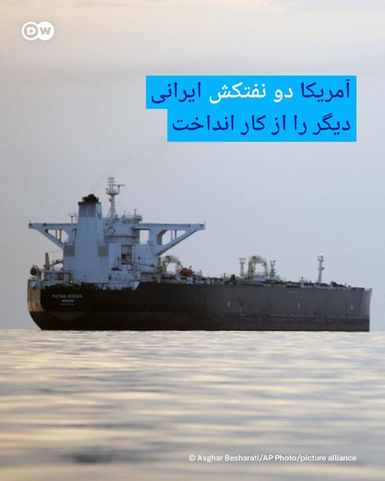

🔶 آمریکا دو نفتکش ایرانی دیگر را از کار انداخت

به گزارش خبرگزاری آلمان، فرماندهی مرکزی ایالات متحده اعلام کرد روز جمعه۸ مه  (۱۸ اردیبهشت) دو نفتکش ایرانی با نام‌های "ام‌تی سی استار" و "ام‌تی سودا" را پیش از ورود به یک بندر در دریای عمان هدف قرار داده و از کار انداخته است. سنتکام گفت این دو کشتی بدون بار و با پرچم ایران در حرکت بودند و یک جنگنده اف-۱۸ سوپر هورنت با شلیک مهمات دقیق به دودکش‌های آن‌ها، مانع از ادامه مسیرشان شد.

سنتکام گفت نیروهای آمریکایی روز چهارشنبه (۱۶ اردیبهشت) نیز نفتکش دیگری با نام "ام‌تی حسنا" را از کار انداخته بودند و هر سه کشتی دیگر به سمت ایران در حرکت نیستند.

دریاسالار برد کوپر، فرمانده سنتکام، نیز گفت نیروهای آمریکایی همچنان به اجرای کامل محاصره کشتی‌هایی که به ایران وارد یا از آن خارج می‌شوند، متعهد هستند.

ارتش آمریکا همچنین اعلام کرد اکنون مانع ورود یا خروج بیش از ۷۰ نفتکش از بنادر ایران شده است. به گفته سنتکام، این کشتی‌ها ظرفیت حمل نفتی به ارزش بیش از ۱۳ میلیارد دلار را داشته‌اند.
@dw_farsi

## DW_Farsi — post 124457

  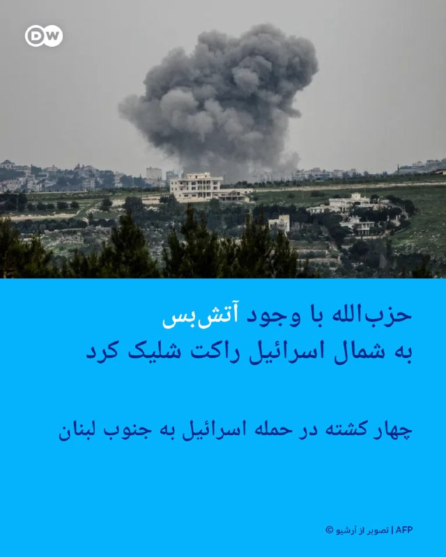

🔶 حزب‌الله با وجود آتش‌بس به شمال اسرائیل راکت شلیک کرد؛ چهار کشته در حمله اسرائیل به جنوب لبنان

خبرگزاری آلمان گزارش داد با وجود آتش‌بس میان اسرائیل و حزب‌الله، بعدازظهر جمعه ۸ مه (۱۸ اردیبهشت) در چند نقطه از شمال اسرائیل آژیر خطر به صدا درآمد و ارتش اسرائیل اعلام کرد یک راکت را رهگیری کرده و چند راکت دیگر در مناطق باز فرود آمده‌اند. هم‌زمان، وزارت بهداشت لبنان خبر داد در حمله اسرائیل به جنوب لبنان چهار نفر کشته و چند نفر زخمی شده‌اند.

این تبادل آتش پس از آن رخ داد که اسرائیل در حمله‌ای به حومه جنوبی بیروت، یکی از فرماندهان واحد رضوان حزب‌الله را هدف قرار داد. رسانه‌های اسرائیلی گزارش دادند در این حمله، مالک بلّوط، معاون او و چند عضو دیگر این واحد کشته شده‌اند.

ارتش اسرائیل گفته بود از قبل انتظار واکنش از خاک لبنان را داشته و خود را برای چنین حمله‌ای آماده کرده بود.

ارتش اسرائیل همچنین اعلام کرد یک پهپاد حامل مواد انفجاری که به حزب‌الله نسبت داده شده، در اسرائیل سقوط کرده و در نتیجه آن دو سرباز زخمی شده‌اند که حال یکی از آن‌ها وخیم گزارش شده است.
@dw_farsi

## Persian_Trend_Official — post 13717

  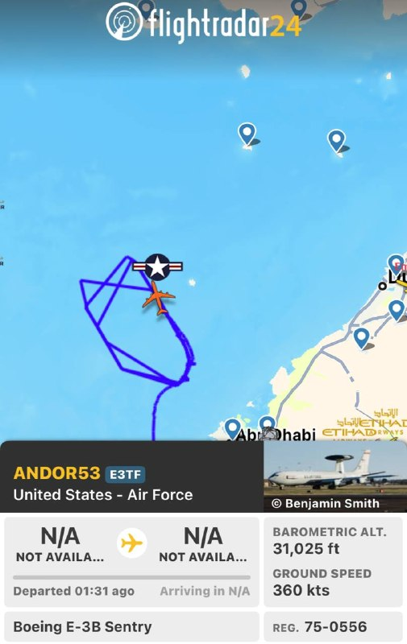

💢آخرین وضعیت سوخت رسان ها و هواپیما های نظامی حاضر در آسمان منطقه 🫆:Tony 📌 @persian_trend_official پرشین ترند | متفاوت‌ترین کانال نظامی

## Persian_Trend_Official — post 13716

  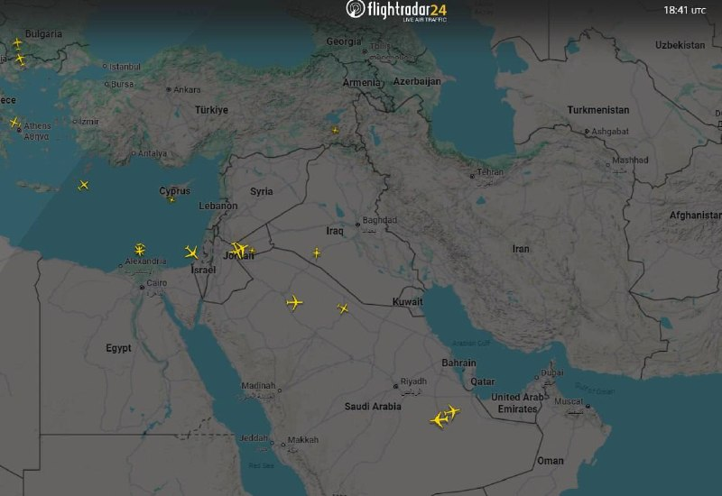

💢آخرین وضعیت سوخت رسان ها و هواپیما های نظامی حاضر در آسمان منطقه

🫆:Tony

📌 @persian_trend_official
پرشین ترند | متفاوت‌ترین کانال نظامی

## Persian_Trend_Official — post 13715

  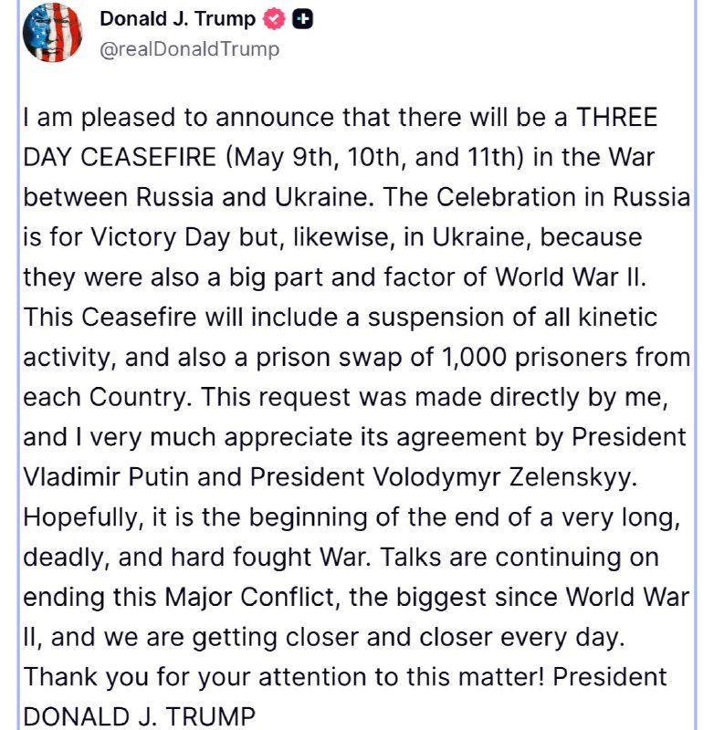

«خوشحالم اعلام کنم که آتش‌بس سه روزه‌ای(9 الی 11 می) در جنگ بین روسیه و اوکراین برقرار خواهد شد.

🔹جشن در روسیه به مناسبت روز پیروزی است اما به همین ترتیب در اوکراین نیز، زیرا آن‌ها نیز بخش بزرگی از جنگ جهانی دوم بودند.

🔹این آتش‌بس شامل تعلیق تمام فعالیت‌های نظامی و همچنین تبادل 1000 اسیر از هر کشور خواهد بود.

🔹این درخواست مستقیماً توسط من مطرح شده و من از موافقت رئیس‌جمهور ولادیمیر پوتین و رئیس‌جمهور ولادیمیر زلنسکی بسیار قدردانی می‌کنم.

🔹امیدوارم این آغاز پایان جنگی بسیار طولانی، مرگبار و سخت باشد.مذاکرات برای پایان دادن به این درگیری بزرگ، بزرگ‌ترین از زمان جنگ جهانی دوم، ادامه دارد و هر روز به هم نزدیک‌تر می‌شویم.»

-دونالد ترامپ،رئیس جمهور آمریکا

🫆:Tony

📌 @persian_trend_official
پرشین ترند | متفاوت‌ترین کانال نظامی

## Persian_Trend_Official — post 13714

  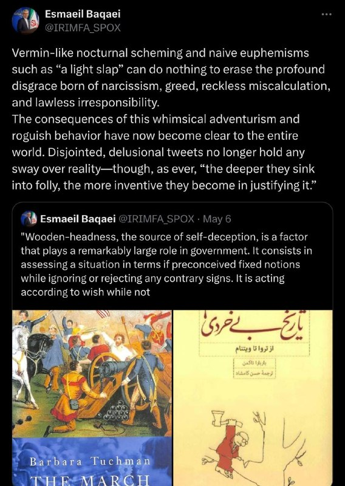

🔴 جمهوری اسلامی حملات آمریکا در هرمز را «ماجراجویی و رفتار یاغی‌گرایانه» توصیف کرد

اسماعیل بقایی، سخنگوی وزارت خارجه ، پس از حملات نظامی آمریکا به شناورهای ایرانی در تنگه هرمز، نسبت به «ماجراجویی و رفتار قانون‌گریزانه» هشدار داد.

بقایی در پیامی در X که به‌نظر می‌رسد اشاره‌ای مستقیم به دونالد ترامپ داشته باشد، نوشت:

«توطئه‌چینی و تعبیرات ساده‌لوحانه‌ای مانند “ضربه‌ای سبک” نمی‌تواند ننگ عمیقی را که حاصل خودشیفتگی، طمع، محاسبات بی‌پروا و بی‌مسئولیتی خارج از قانون است، پاک کند.»

عبارت «ضربه‌ای سبک» اشاره‌ای به اظهارات پیشین ترامپ دارد که حملات آمریکا علیه ایران را «یک love tap» توصیف کرده بود.

بقایی همچنین از «توییت‌های آشفته و توهم‌آلود» انتقاد کرد و گفت این پیام‌ها «دیگر هیچ تأثیری بر واقعیت ندارند.»

🫆:Tony

📌 @persian_trend_official
پرشین ترند | متفاوت‌ترین کانال نظامی

## RadioFarda — post 156986

دونالد ترامپ از برقراری آتش‌بس سه‌روزه بین روسیه و اوکراین خبر داد

🔸دونالد ترامپ، رئیس‌جمهور آمریکا، روز جمعه از برقراری یک آتش‌بس سه‌روزه در جنگ میان روسیه و اوکراین از روز شنبه ۱۹ اردیبهشت خبر داد.

🔸او در شبکه اجتماعی تروث سوشال نوشت که این آتش‌بس به درخواست او و با موافقت ولادیمیر پوتین و ولودیمیر زلنسکی، روسای جمهور دو کشور، اعمال می‌شود و همزمان با آن هزار زندانی طرفین نیز با یکدیگر تبادل خواهند شد.

🔸ترامپ ابراز امیدواری کرد که این آتش‌بس «آغازی بر پایان یک جنگ بسیار طولانی، مرگبار و سخت» باشد.

🔸او نوشت که مذاکرات برای پایان دادن به این درگیری بزرگ که آن را «بزرگترین درگیری از زمان جنگ جهانی دوم» نامید، ادامه دارد و به نوشته او «ما هر روز به آن نزدیک‌تر می‌شویم.»

🔸ولودیمیر زلنسکی پس از اعلام دونالد ترامپ، گفت که آتش‌بس با روسیه از ۹ تا ۱۱ مه، ۱۹ تا ۲۱ اردیبهشت، «باید برقرار شود» و کی‌یف چراغ سبز مسکو را برای تبادل گسترده زندانیان دریافت کرده است.

🔸او گفت به نیروهای نظامی خود دستور داده است که در جریان رژه نظامی روز پیروزی در ۹ مه، به میدان سرخ حمله نکنند.

🔸زلنسکی در این فرمان گفت: «بدین‌وسیله دستور می‌دهم: برگزاری رژه در شهر مسکو (فدراسیون روسیه) در تاریخ ۹ مه ۲۰۲۶ مجاز باشد» و افزود که «بخش سرزمینی میدان سرخ» از هرگونه طرح برای استفاده از سلاح‌های اوکراینی مستثنا خواهد بود.

🔸یوری اوشاکوف، دستیار ولادیمیر پوتین، نیز با انتشار بیانیه‌ای اعلام کرد که روسیه با آتش‌بس سه‌روزه و تبادل زندانیان موافقت کرده است.

🔸گزارش کامل را در وب‌سایت رادیوفردا بخوانید.

@RadioFarda

## RadioFarda — post 156985

  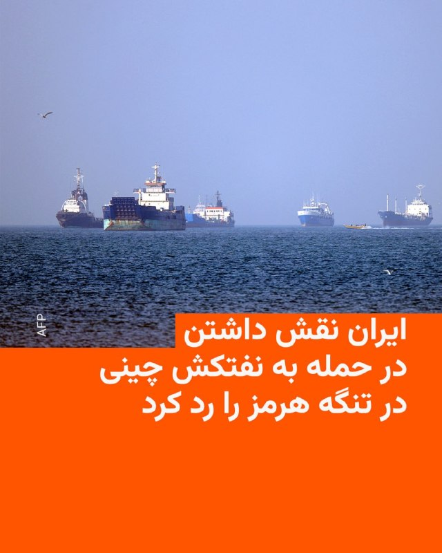

🔸سفیر جمهوری اسلامی در پکن گزارش‌ها درباره حمله ایران به یک نفتکش چینی در نزدیکی تنگه هرمز را تکذیب کرد.

🔸رسانه‌های ایران به نقل از عبدالرضا رحمانی فضلی نوشتند که نقش داشتن ایران در این حمله خبر «غیر واقع» است و «با هدف تحت تاثیر قرار دادن دستاوردهای سفر اخیر وزیر امور خارجه ایران به پکن، منتشر شده است».

🔸این در حالی است که وزارت خارجه چین تأیید کرد نفتکشی که دوشنبه گذشته در نزدیکی تنگه هرمز هدف حمله قرار گرفت، متعلق به یک شرکت چینی و با خدمه‌ای از شهروندان این کشور بوده است.

🔸منابع امنیت دریایی گفته‌اند کشتی آسیب‌دیده احتمالاً نفتکش و شناور حمل مواد شیمیایی «جی‌وی اینوویشن» با پرچم جزایر مارشال بوده است.

@RadioFarda

## IranianMinds — post 19814

🔴ترامپ:

آتش‌بس ۳ روزه میان اوکراین و روسیه برقرار کردیم.

@IranianMinds

## BBCPersian — post 280522

  <a href="telegram/content/BBCPersian_280522_1778269312.mp4">🎬 Download video</a>

امروز، ۱۸ اردیبهشت ۱۴۰۵، صدمین سالگرد تولد سردیوید اتنبرو، طبیعت‌شناس و مجری و مستندساز بی‌بی‌سی است. او در پیام صوتی که دیروز منتشر شد، گفت: «من ترجیح می‌دادم که صدمین سالگرد تولدم را بی‌سروصدا جشن بگیرم، اما به نظر می‌رسد که بسیاری از شما نظر دیگری داشتید.»

این پیام تولد در میدان پیکادلی لندن به نمایش درمی‌آید و به همین مناسبت مراسمی در سالن رویال آلبرت هال لندن هم برگزار می‌شود.

برنامه ۹۰ دقیقه‌ای که از رویال آلبرت هال لندن پخش می‌شود، با ارکستر کنسرت بی‌بی‌سی همراه است که موسیقی نمادین برخی از سکانس‌های تلویزیونی از سریال‌های آقای اتنبرو مانند «سیاره زمین»، «سیاره آبی» و «سیاره یخ‌زده» را اجرا می‌کند و به مرور دستاوردهای صد سال زندگی سردیوید اتنبورو می‌پردازد. در این برنامه افرادی که با آقای اتنبرو کار کرده‌اند و از او الهام گرفته‌اند هم درباره او صحبت خواهند کرد.

پیام صوتی سردیوید اتنبرو را در این ویدیو گوش دهید.

@BBCPersian
https://bbc.in/49B2wpU

## BBCPersian — post 280521

🔻حزب دموکرات کردستان ایران از «حمله موشکی» به یک اردوگاهش خبر داد

حزب دموکرات کردستان ایران از «حمله موشکی» حکومت ایران به یک اردوگاهش در نزدیکی اربیل خبر داد.

این حزب می‌گوید کمپ «جژنیکان» که روز جمعه هدف قرار گرفته است، یک منطقه مسکونی و غیرنظامی در نزدیکی اربیل در اقلیم کردستان عراق است و خانواده‌های اعضای حزب دموکرات کردستان ایران در آن سکونت دارند.

حزب دموکرات کردستان ایران می‌گوید که روز پنجشبه هم اهدافی مرتبط با این حزب هدف قرار گرفته بود.

ایران تا کنون درباره این حملات اظهارنظری نکرده است اما پیش از این، سپاه پاسداران بارها مقر‌ها و محل‌های استقرار اعضای این حزب را هدف قرار داده بود.

حملات به احزاب کردی مستقر در اقلیم کردستان ایران، از از زمان آغاز حمله آمریکا و اسرائیل به ایران افزایش یافته است.

https://bbc.in/4cZY32k
@BBCPersian

## Dirty_Kids — post 389127

  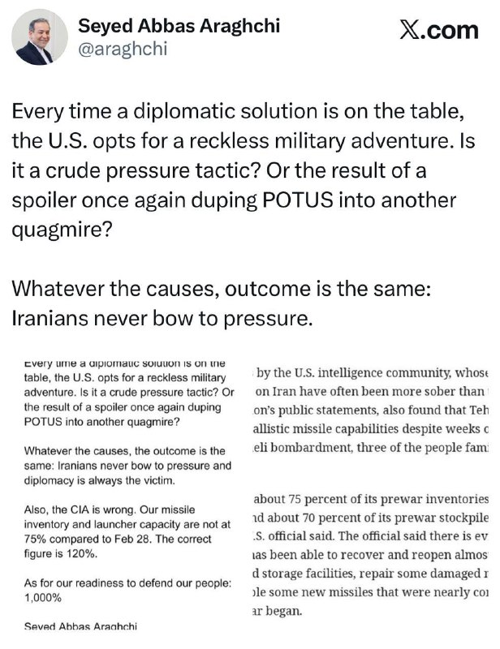

عباس عراقچی نوشت: «هر زمان که یک راه‌حل دیپلماتیک روی میز قرار می گیرد، ایالات متحده به‌ یک ماجراجویی نظامی بی‌خردانه رو می‌آورد. آیا این صرفا یک تاکتیک کور برای اعمال فشار است؟ یا فریب‌کاری یک خرابکار است که بار دیگر می‌خواهد رئیس‌جمهور آمریکا را به باتلاقی تازه بکشاند؟»

انگار نه انگار که همین ترامپ دستور قتل خامنه‌ای و اعضای خانواده‌اش و صدها فرمانده سپاه و دیگر مدیران ارشد نظام را صادر کرده است. با این‌حال عراقچی معتقد است که ترامپ خودش خوب است و اطرافیانش بد هستند و می‌خواهند «رییس‌جمهور را به باتلاق بکشانند»… عجب ذلت و حقارت جالبی :))

@Dirty_Kids 👻

## Dirty_Kids — post 389126

  <a href="telegram/content/Dirty_Kids_389126_1778269314.mp4">🎬 Download video</a>

تصاویر ماهواره‌ای نشان می‌دهند که لکه نفتی بزرگی در خلیج فارس، در نزدیکی جزیره خارک (پایانه اصلی صادرات نفت خام ایران)، در حال گسترش است.

@Dirty_Kids 👻

## Dirty_Kids — post 389125

  <a href="telegram/content/Dirty_Kids_389125_1778269315.mp4">🎬 Download video</a>

گلهای غربت، تو این روزای سخت، خانواده‌ها و عزیزانتون داخل ایران رو دریابید لطفا.

@Dirty_Kids 👻

## Dirty_Kids — post 389124

  

انقد موشتباه نیومد خمینی کامبک زد

+ البته قبول نیست، چون آفتابشو نیاورده

@Dirty_Kids 👻

## Dirty_Kids — post 389123

  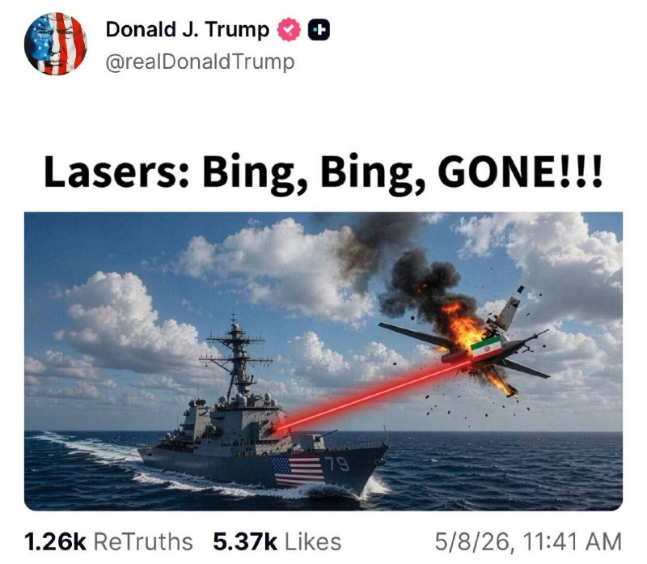

پست جدید ترامپ: پدافند لیزری ناوشکن

@Dirty_Kids 👻

## Dirty_Kids — post 389122

صداسیما داره از بسته شدن تیک تاک توی آمریکا انتقاد میکنه و میگه که معیشت خیلیا به خطر افتاده :))))))))
کشوری که ۷۱ روزه اینترنت رو بسته حالا نگران معیشت مردم آمریکاس :))))))
دوربین مخفیه؟

@Dirty_Kids 👻

## Dirty_Kids — post 389121

  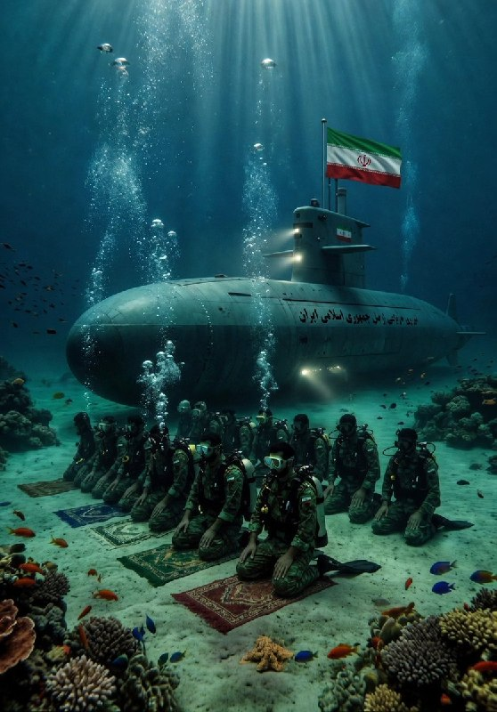

ناموساً نمی‌دونم از کجا شروع کنم؟ این خارکسه‌های عرزشی تمام قواعد فیزیک، منطق، ریاضی‌رو بهم ریختن

@Dirty_Kids 👻

## Hranews — post 112836

یک زندانی در زندان اردبیل اعدام شد

❗️
❗️
❗️
❗️
❗️ – سحرگاه روز چهارشنبه ۱۶ اردیبهشت ماه، حکم یک زندانی که پیشتر از بابت اتهام قتل به #اعدام محکوم شده بود، در زندان اردبیل اجرا شد.

ادامه مطلب

#شهاب_عظیمی

↘️
@hranews_bot تماس ✉️ -  @Hranews  کانال هرانا 🆑

## Hranews — post 112835

  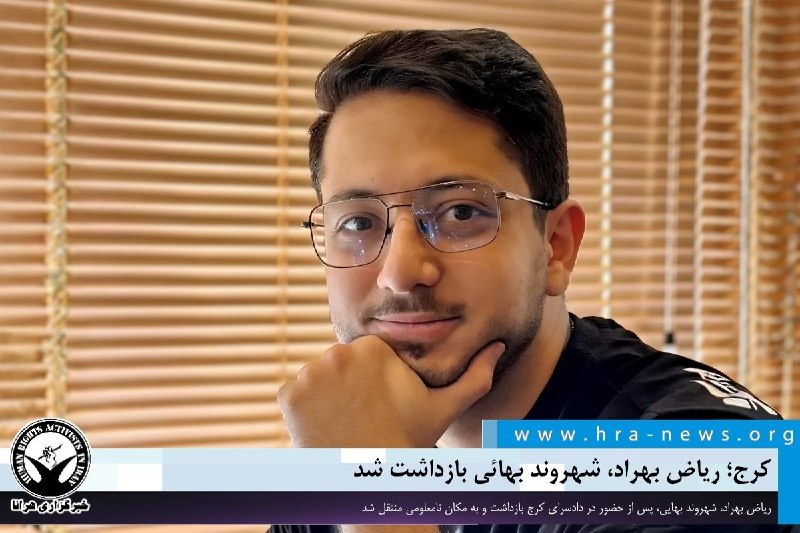

کرج؛ ریاض بهراد، شهروند بهائی بازداشت شد

❗️
❗️
❗️
❗️
❗️ – ریاض بهراد، شهروند بهایی، روز چهارشنبه ۱۶ اردیبهشت‌ماه پس از حضور در دادسرای کرج #بازداشت و به مکان نامعلومی منتقل شد.

به گزارش هرانا، ارگان خبری مجموعه فعالان حقوق بشر در ایران، ریاض بهراد، شهروند بهایی، ساکن کرج بازداشت شد.

بازداشت این شهروند بهایی روز چهارشنبه ۱۶ اردیبهشت‌ماه پس از حضور در دادسرای کرج صورت گرفته است. منزل آقای بهراد روز دوشنبه ۱۴ اردیبهشت نیز توسط ماموران امنیتی تفتیش شده بود.

ادامه مطلب

#ریاض_بهراد

↘️
@hranews_bot تماس ✉️ -  @Hranews  کانال هرانا 🆑

## configx2ray — post 38661

  <a href="https://t.me/ConfigX2ray/38661">📎 Download file</a>

کانفیگ برای Npv tunnel ⭕️

به هیچ وج دانلود نزنید باهاش
❤️

رمز فایل : @ConfigX2ray

Channel : https://t.me/ConfigX2ray

## manototv — post 105162

  <a href="telegram/content/manototv_105162_1778269319.mp4">🎬 Download video</a>

وزارت خارجه قطر اعلام کرد محمد بن عبدالرحمن آل ثانی، نخست‌وزیر و وزیر خارجه این کشور، در واشینگتن با جی‌دی ونس، معاون رئیس‌جمهوری ایالات متحده آمریکا، دیدار و درباره کاهش تنش در منطقه گفت‌وگو کرده است.

در این بیانیه آمده است نخست‌وزیر قطر بر ضرورت پاسخ‌گویی طرف‌ها به میانجیگری پاکستان و دستیابی به توافقی جامع برای تحقق صلحی پایدار تاکید کرده است.

## manototv — post 105161

  <a href="telegram/content/manototv_105161_1778269319.mp4">🎬 Download video</a>

وزارت خارجه قطر با انتشار بیانیه‌ای، حملات جمهوری اسلامی به امارات متحده عربی را به‌شدت محکوم کرد و آن را «نقض آشکار حاکمیت» و تهدیدی برای امنیت منطقه دانست.

در این بیانیه آمده است که این حملات با استفاده از موشک‌های بالستیک و پهپاد انجام شده و به زخمی شدن چند نفر منجر شده است.

دوحه با اعلام همبستگی کامل با امارات متحده عربی تاکید کرد از تمامی اقدامات این کشور برای حفظ امنیت، ثبات و تمامیت ارضی‌اش حمایت می‌کند.

## manototv — post 105160

  <a href="telegram/content/manototv_105160_1778269320.mp4">🎬 Download video</a>

مارکو روبیو، وزیر خارجه ایالات متحده آمریکا، از متحدان اروپایی خواست از موضع‌گیری‌های لفظی فراتر رفته و اقدامات عملی علیه جمهوری اسلامی انجام دهند.

او پس از دیدار با جورجا ملونی، نخست‌وزیر ایتالیا، در رم گفت تلاش تهران برای کنترل تنگه هرمز «غیرقابل قبول» و تهدیدی برای امنیت جهانی است.

روبیو تاکید کرد: «همه می‌گویند ایران یک تهدید است و نباید به سلاح هسته‌ای دست پیدا کند، اما باید اقدامی هم انجام شود.»

او افزود: «اگر پاسخ این است که نه، پس باید چیزی فراتر از بیانیه‌های شدیدالحن داشته باشید.»

## manototv — post 105159

  <a href="telegram/content/manototv_105159_1778269321.mp4">🎬 Download video</a>

فرماندار سوادکوه اعلام کرد در تنگه ابوالقیس این منطقه رانش زمینی به ارتفاع حدود ۳۰ متر رخ داده که به‌دلیل قرار گرفتن در مجاورت یک مسیر ارتباطی حیاتی، خطوط برق ۲۰ کیلووات، لوله نفت ۳۲ اینچ و نهر آب کشاورزی، وضعیت آن «ناپایدار و خطرآفرین» ارزیابی شده است.
به گفته او، این رانش در باند برگشت محور اصلی تهران به شمال و در فاصله حدود ۵۰۰ متری راهدارخانه اوریم، در ضلع غربی محور شمال به تهران اتفاق افتاده است.
بررسی‌های میدانی نشان می‌دهد آثار به‌جامانده از این رانش، احتمال ادامه‌دار بودن حرکت زمین و تشدید ناپایداری در منطقه را مطرح می‌کند.

## manototv — post 105158

  <a href="telegram/content/manototv_105158_1778269321.mp4">🎬 Download video</a>

پنتاگون مجموعه‌ای از اسناد جدید و «تاکنون دیده‌نشده» درباره اشیای پرنده ناشناس (UFO/UAP) منتشر کرده و اعلام کرده مردم می‌توانند خودشان درباره این پدیده‌ها نتیجه‌گیری کنند. در میان این اسناد، تصویری از مأموریت آپولو ۱۷ در سال ۱۹۷۲ دیده می‌شود که سه نقطه نورانی را به شکل مثلثی نشان می‌دهد. پنتاگون اعلام کرده هنوز اجماعی درباره ماهیت این پدیده‌ها وجود ندارد، اما بررسی‌های اولیه احتمال داده که ممکن است یک «شیء فیزیکی» باشد. در این بسته جدید ۱۶۱ فایل منتشر شده که شامل اسناد وزارت خارجه، اف‌بی‌آی، گزارش‌های ناسا از مأموریت‌های فضایی و بیش از ۲۰ ویدیو از اشیای ناشناس ثبت‌شده توسط حسگرهای نظامی در نقاط مختلف جهان است؛ از ژاپن و سوریه تا آمریکای شمالی. این اشیا از نقاط نورانی سریع‌الحركت تا یک جسم شبیه توپ فوتبال آمریکایی در سال ۲۰۲۲ را شامل می‌شوند. در یکی از اسناد نیز گزارش شده که خلبانی در سال ۱۹۹۴ به همراه سه آمریکایی در آسمان قزاقستان یک شیء نورانی دیده که حرکات غیرعادی مانند چرخش‌های تند و تغییر مسیر ۹۰ درجه داشته است. همچنین در اسناد آپولو ۱۱، باز آلدرین از مشاهده یک شیء بزرگ نزدیک ماه و نورهای غیرعادی خبر داده و در گزارشی دیگر از اف‌بی‌آی یک خلبان پهپاد در سال ۲۰۲۳ گفته جسمی خطی با نور بسیار شدید برای چند ثانیه دیده شده و سپس ناپدید شده است. پنتاگون هدف از این انتشار را افزایش شفافیت اعلام کرده و گفته مردم خودشان باید قضاوت کنند، در حالی که تأکید شده در گزارش‌های قبلی هیچ مدرکی درباره فناوری فرازمینی تأیید نشده است.

## manototv — post 105157

  <a href="telegram/content/manototv_105157_1778269322.mp4">🎬 Download video</a>

رحمانی فضلی، سفیر جمهوری اسلامی در چین، گزارش‌ها درباره حمله ایران به یک نفتکش چینی در تنگه هرمز را «غیرواقعی» توصیف کرد و گفت این خبر با هدف تحت تأثیر قرار دادن دستاوردهای سفر اخیر وزیر خارجه ایران به پکن منتشر شده است.
او همچنین گفت روابط تهران و پکن پس از جنگ «گسترده‌تر و عمیق‌تر» خواهد شد. سفیر نظام در چین افزود با توجه به جایگاه پکن برای ایران و کشورهای خلیج فارس، چین می‌تواند به‌عنوان «ضامن هرگونه توافق» در منطقه مطرح باشد.

## alonews — post 118757

  <a href="telegram/content/alonews_118757_1778269323.jpg">🎬 Download video</a>

👈میدل ایست آی: دبی با بحرانی وجودی مواجه است؛ جنگ علیه ایران باعث کاهش شدید تعداد توریست‌ها شده و این مقصد گردشگری جهانی را در بخش هتلداری ویران کرده

🔴در عرض دو هفته اول، مردم [گفتند] دیگر ارزشش را ندارد [که اینجا زندگی کنند]

🔴 کسب‌وکار‌ها ناگهان دارایی‌های خود را نقد می‌کردند و به عنوان جایگزین گزینه‌هایی را در اروپا بررسی کردند

🔴کل بنیان دبی به عنوان مکانی عاری از درگیری، لرزید

✅ @AloNews خبر جنگ

## alonews — post 118756

  <a href="telegram/content/alonews_118756_1778269323.jpg">🎬 Download video</a>

👈کویت میگوید به دلیل نگرانی‌ها درباره احتمال حملات از سوی ایران، حرکت کشتی‌های دریایی را محدود می‌کند

✅ @AloNews خبر جنگ

## alonews — post 118755

  <a href="telegram/content/alonews_118755_1778269323.jpg">🎬 Download video</a>

👈اسپوتنیک: روسیه با آتش‌بس پیشنهادی موافقت کرده است

✅ @AloNews خبر جنگ

## alonews — post 118754

  <a href="telegram/content/alonews_118754_1778269323.jpg">🎬 Download video</a>

👈دو مشاور رئیس‌جمهور آمریکا به آتلانتیک گفتند:

🔴«رئیس‌جمهور معتقد است که می‌تواند هر توافقی با ایران را به عنوان پیروزی خود بازاریابی کند».

✅ @AloNews خبر جنگ

## alonews — post 118753

👈جهت رزرو تبلیغات برای VPN در کانال #الونیوز به کانال زیر مراجعه کنید👇

📃https://t.me/ads_alonews

📃https://t.me/ads_alonews

## alonews — post 118752

  

👈تصویری از کارولین لویت سخنگوی کاخ سفید و فرزندش که تازه به دنیا آمده

✅ @AloNews خبر جنگ

## alonews — post 118751

  <a href="telegram/content/alonews_118751_1778269324.mp4">🎬 Download video</a>

🔴بیشتر از ناوهای آمریکا از سوگوارانی بترسید که سفید پوشیدند و شاهنامه خواندند و رقصیدند.

✅@AloNews

## alonews — post 118750

  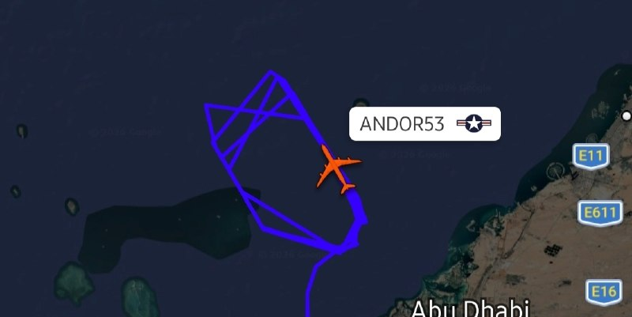

👈آواکس Boeing E-3 Sentry به سواحل ابوظبی، امارات رفته

✅ @AloNews خبر جنگ

## alonews — post 118749

  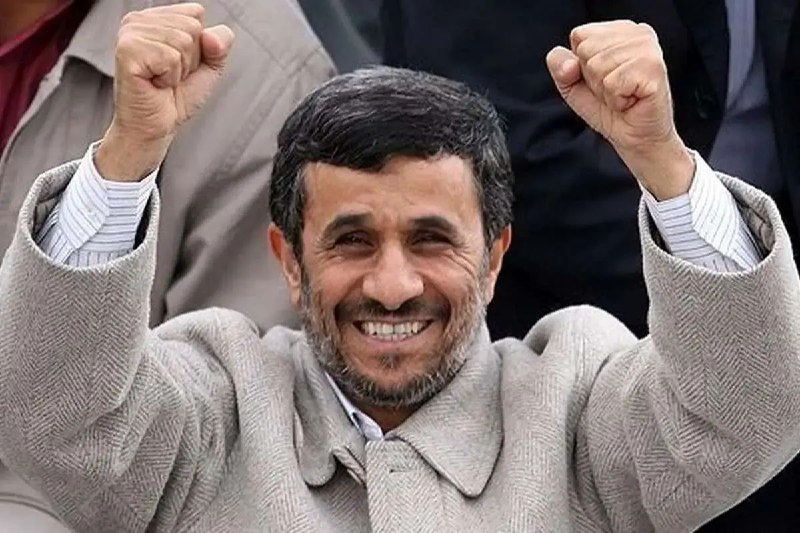

👈بیش از ۷۰روز از شروع جنگ میگذرد اما همچنان خبری از احمدی نژاد نیست

✅ @AloNews خبر جنگ

## alonews — post 118748

  <a href="telegram/content/alonews_118748_1778269327.jpg">🎬 Download video</a>

👈 ارتش ایران در عملیات دیشب علیه ناوشکن‌های آمریکایی: عملیات شامل شلیک ۸ موشک کروز و ۲۴ پهپاد انتحاری بود.

🔴ما ناوشکن‌های آمریکایی را با یک موشک کروز و سه پهپاد هدف قرار دادیم که منجر به آتش‌سوزی در آن‌ها شد.

🔴ما ۳ ناوشکن را هدف گرفتیم که نیروی دریایی آمریکا تلاش داشت آن‌ها را از تنگه هرمز به سمت دریای عمان منتقل کند.

✅ @AloNews خبر جنگ

## alonews — post 118747

  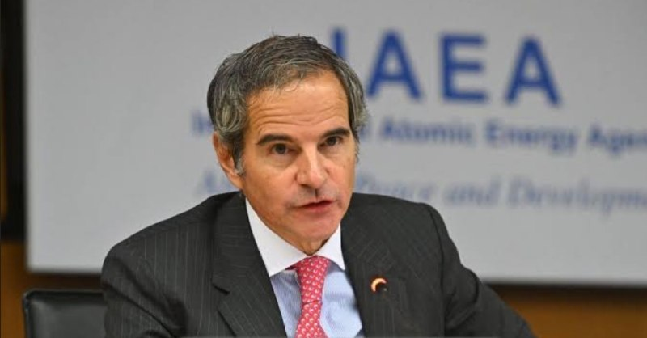

👈گروسی،مدیر کل آژانس بین‌المللی انرژی اتمی : موضوع هسته ای ایران تنها از طریق دیپلماتیک حل میشه

✅ @AloNews خبر جنگ

## alonews — post 118746

  

🔴در تصویر چه می‌بینید؟

✅@AloNews

## alonews — post 118745

  <a href="telegram/content/alonews_118745_1778269328.jpg">🎬 Download video</a>

👈وزارت امور خارجه قطر: نخست‌وزیر و وزیر خارجه قطر امروز در واشنگتن با معاون رئیس‌جمهور آمریکا دیدار کرد.

🔴 نخست‌وزیر و وزیر خارجه با «ونس» درباره آخرین تحولات منطقه و میانجی‌گری پاکستان گفت‌وگو کرد.

🔴 نخست‌وزیر و وزیر خارجه بر ضرورت همکاری همه طرف‌ها با تلاش‌های میانجی‌گری جاری تأکید کرد.

✅ @AloNews خبر جنگ

## alonews — post 118744

  <a href="telegram/content/alonews_118744_1778269328.jpg">🎬 Download video</a>

👈اژه ای: ناوهای شیطان بزرگ حتی جرئت نزدیک شدن به تنگه هرمز را نیز ندارند

✅ @AloNews خبر جنگ

## alonews — post 118743

  <a href="telegram/content/alonews_118743_1778269329.jpg">🎬 Download video</a>

👈به گزارش آتلانتیک ترامپ از جنگ ایران «کسل» و ناامید شده است، زیرا این جنگ بسیار طولانی‌تر از آنچه انتظار داشت، شده و هیچ پیروزی روشنی در چشم‌انداز نیست.

🔴او می‌خواهد به سراغ مسائل دیگر برود به سیاست داخلی، مذاکرات تجاری با چین و سایر اولویت‌ها اما ایران همچنان در برابر مذاکرات مقاومت می‌کند و درگیری را گسترش می‌دهد.

✅ @AloNews خبر جنگ

## alonews — post 118742

  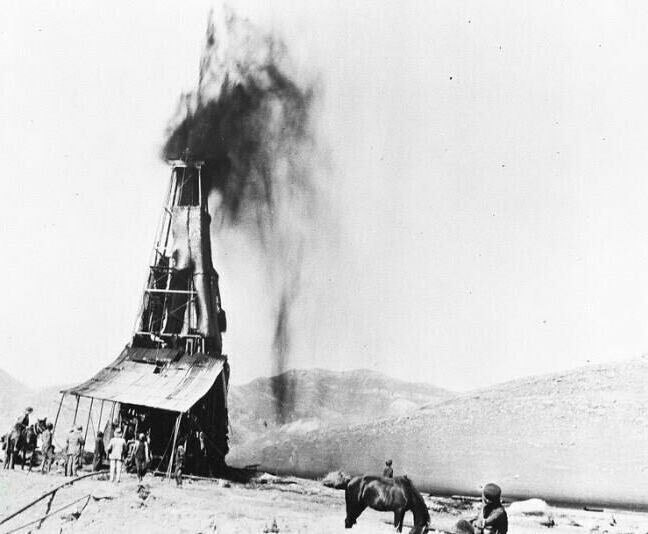

🔴نخستین فوران نفت در ایران، مسجد سلیمان

✅@AloNews

## alonews — post 118741

  <a href="telegram/content/alonews_118741_1778269329.jpg">🎬 Download video</a>

👈وال استریت ژورنال: هیچ کشتی تجاری که توسط شرکت‌های ثبت‌شده اداره شود، از سه‌شنبه از تنگه هرمز عبور نکرده است

✅ @AloNews خبر جنگ

## alonews — post 118740

  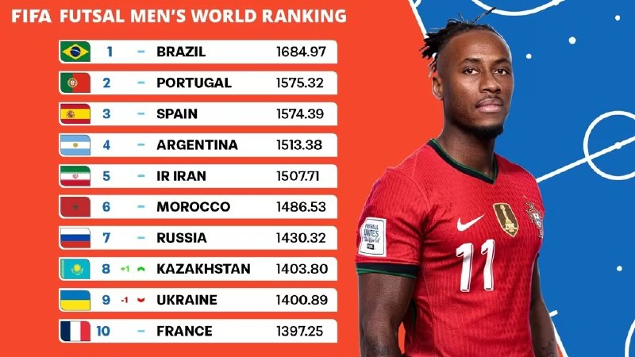

جدیدترین رده‌بندی برترین تیم‌های فوتسال
🔹تیم مردان ایران در ردۀ پنجم و تیم زنان در رتبۀ دهم دنیا قرار گرفته‌اند.

@AloSport

## alonews — post 118739

تعرفه سرویس های Vip 
⭕️ 
✅ 1 گیگابایت 
⬅️ 250/000 تومان 
✅ 3 گیگابایت 
⬅️ 750/000 تومان استارلینک Vip 
💫 
🌟 
⭐️ 5 گیگابایت 
⬅️ 1/200/000 تومان 
⭐️ 10 گیگابایت 
⬅️ 2/400/000 تومان ویژگی های سرویس های Vip : 
❤️‍🔥 
✅ متصل در تمامی دستگاه و اپراتور ها 
✅ مناسب استفاده…

## alonews — post 118738

تعرفه سرویس های Vip 
⭕️

✅ 1 گیگابایت 
⬅️ 250/000 تومان

✅ 3 گیگابایت 
⬅️ 750/000 تومان

استارلینک Vip 
💫 
🌟

⭐️ 5 گیگابایت 
⬅️ 1/200/000 تومان

⭐️ 10 گیگابایت 
⬅️ 2/400/000 تومان

ویژگی های سرویس های Vip : 
❤️‍🔥

✅ متصل در تمامی دستگاه و اپراتور ها

✅ مناسب استفاده روزمره در تمامی برنامه ها

✅ دارای ساب برای اطلاع لحظه ای باقیمانده

✅ تک لینک بدون نیاز به بروزرسانی های متعدد
 برای خرید از پشتیبانی به ایدی زیر پیام بدید.
👇

🔤 @expressuport

خرید فوری از ربات.
👇

🔤 @vpn_express_sup_bot

---
📅 بروزرسانی: 1405/02/18 21:26
---

## VahidOOnLine — post 238948

  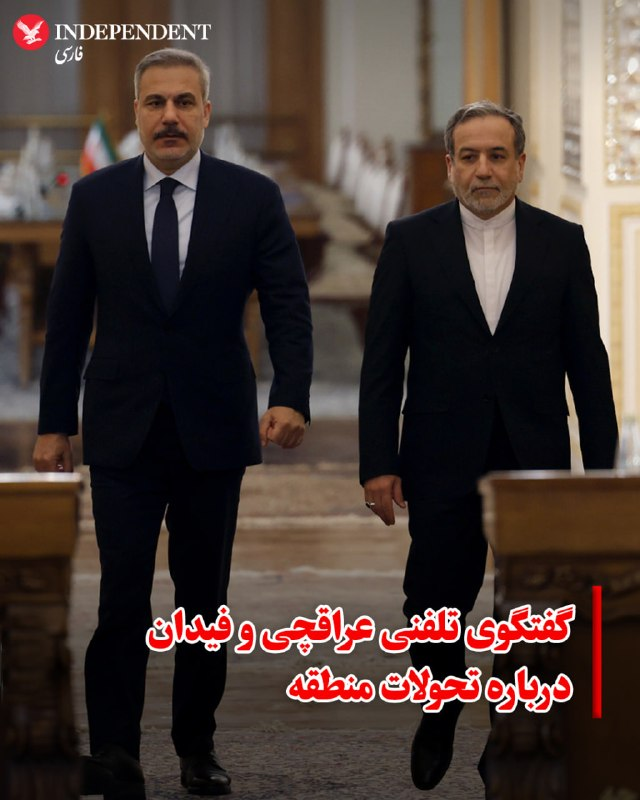

♦️ عباس عراقچی، وزیر امور خارجه جمهوری اسلامی، در تماسی تلفنی با همتای ترکیه‌ای خود، هاکان فیدان، آخرین تحولات منطقه‌ای را مورد بحث و تبادل نظر قرار داد.

عراقچی در این تماس گزارشی از آخرین وضعیت مذاکرات و آنچه «نقض مکرر آتش‌بس توسط ایالات متحده» خوانده، ارائه کرده است. او همچنین اختلال در تردد دریایی تنگه هرمز را نتیجه «قانون‌گریزی و ماجراجویی‌های نظامی آمریکا» دانست.

هم‌زمان، فرماندهی مرکزی ایالات متحده (سنتکام) اعلام کرد که نیروهایش از ورود دو نفتکش دیگر ایرانی که قصد شکستن محاصره بنادر ایران را داشتند، جلوگیری کرده و آن‌ها را از کار انداخته‌اند. این اقدامات فشارها بر آتش‌بس لرزان کنونی را بیش از پیش افزایش داده است.
‌🇸🇦 Indypersian

🤖 @VahidOOnLine

## VahidOOnLine — post 238947

  <a href="telegram/content/VahidOOnLine_238947_1778262997.mp4">🎬 Download video</a>

♦️کاخ سفید روز جمعه ۱۸ اردیبهشت به مناسبت روز مادر میزبان ضیافتی در باغ رز (Rose Garden) بود. این مراسم با حضور مهمانان، خانواده‌ها و چهره‌های مختلف برگزار شد و در آن از نقش مادران در جامعه قدردانی شد.
ضیافت روز مادر یکی از برنامه‌های نمادین سالانه در کاخ سفید است که با هدف قدردانی از مادران و نقش آن‌ها در تربیت نسل‌ها برگزار می‌شود.
‌🇸🇦 Indypersian

🤖 @VahidOOnLine

## VahidOOnLine — post 238946

  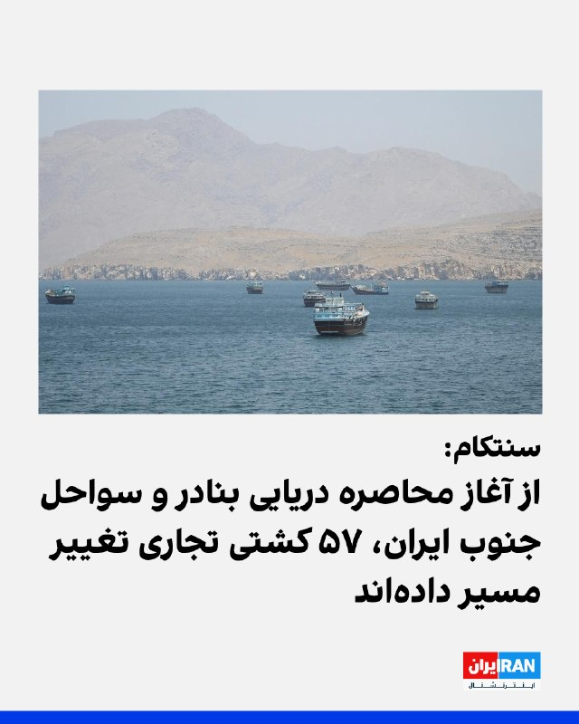

سنتکام، ستاد فرماندهی مرکزی ایالات متحده، اعلام کرد که از زمان آغاز محاصره دریایی بنادر و سواحل جنوب ایران، ۵۷ کشتی تجاری با دستور نیروهای آمریکایی تغییر مسیر داده و چهار کشتی پس از حمله از کار افتاده‌اند.

همچنین سه ناوشکن در دریای عرب برای پشتیبانی از محاصره در حال گشت‌زنی‌اند.
‌🏁 🇬🇧 IranintlTV

🤖 @VahidOOnLine

## VahidOOnLine — post 238945

  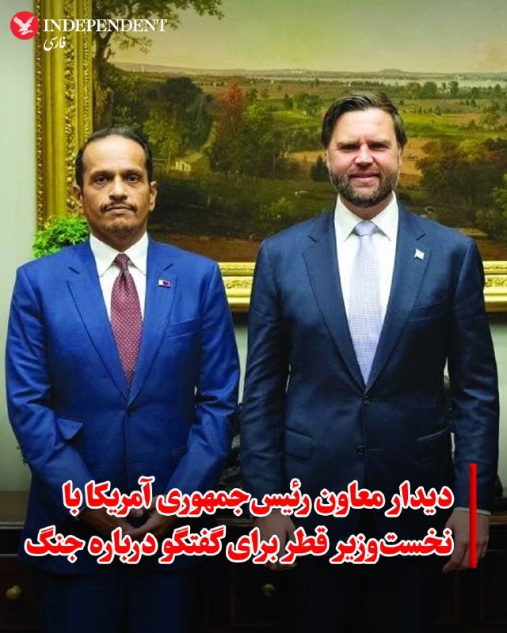

♦️ شیخ محمد بن عبدالرحمن بن جاسم آل ثانی، نخست‌وزیر قطر، صبح جمعه ۱۸ اردیبهشت وارد واشنگتن شد تا در دیداری با جی‌دی ونس، معاون رئیس‌جمهور آمریکا، پیرامون موضوعات مختلف از جمله جنگ با ایران گفتگو کند.

نخست‌وزیر قطر روز گذشته در گفتگو با روزنامه «العربی الجدید» اعلام کرده بود که «احتمال بالایی» برای دستیابی ایران و آمریکا به یک توافق وجود دارد. هم‌زمان، مارکو روبیو، وزیر امور خارجه آمریکا، صبح جمعه در ایتالیا اعلام کرد که واشنگتن انتظار دارد امروز پاسخ تهران به پیش‌نویس توافق برای پایان دادن به جنگ را دریافت کند.

روبیو هنگام ترک رم گفت: «ما منتظر پاسخ ایران هستیم و باید دید محتوای آن چیست.» وی ابراز امیدواری کرد که این پاسخ بتواند طرفین را وارد یک «فرآیند جدی برای مذاکره» کند.

نخست‌وزیر قطر که ریاست دستگاه دیپلماسی این کشور را نیز بر عهده دارد، همواره به عنوان میانجی کلیدی ایالات متحده در پرونده‌های دشواری چون غزه، افغانستان و جمهوری اسلامی عمل کرده است. قطر همچنین میزبان مقر فرماندهی مرکزی ایالات متحده (سنتکام) در منطقه است.
‌🇸🇦 Indypersian

🤖 @VahidOOnLine

## VahidOOnLine — post 238944

  <a href="telegram/content/VahidOOnLine_238944_1778263000.mp4">🎬 Download video</a>

‌
خبرگزاری حکومتی تسنیم به نقل از یک منبع نظامی گزارش داد درگیری‌ها در خلیج فارس فعلاً متوقف شده، اما احتمال آغاز مجدد آن همچنان وجود دارد.

این منبع مدعی شد پس از «اقدام خصمانه» آمریکا علیه نفتکش‌های ایران، نیروی دریایی جمهوری اسلامی با حملات خود به آن پاسخ داده و پس از مدتی تبادل آتش، درگیری‌ها متوقف شده است.

این منبع گفت در حال حاضر شرایط در منطقه آرام است، اما تهدید کرد «در صورت ورود دوباره نیروهای آمریکایی به خلیج فارس یا ایجاد مزاحمت برای شناورهای ایرانی، پاسخ قاطع داده خواهد شد.»
‌🏁 🇬🇧 ManotoTV

🤖 @VahidOOnLine

## VahidOOnLine — post 238943

  <a href="telegram/content/VahidOOnLine_238943_1778263001.mp4">🎬 Download video</a>

‌
هم‌زمان با زادروز جاویدنام احمد خسروانی، جان‌باخته اعتراضات دی‌ماه ۱۴۰۴، ویدیویی از حضور بر مزار او و رها کردن پرندگان در فضای مجازی منتشر شده است.

در این ویدیو، پریسا آقامحمدی، خواهر دادخواه پرهام آقامحمدی، جاویدنام اعتراضات دی‌ماه، با اشاره به دوستی این دو نوشته است: «امروز تولد احمد خسروانی بود… پرنده برای پرواز.»

احمد خسروانی، بسکتبالیست ۲۱ ساله و دانشجوی دانشگاه صنعتی شریف، روز ۱۹ دی‌ماه ۱۴۰۴ در جریان اعتراضات مردمی با شلیک مستقیم نیروهای امنیتی کشته شد.

او پیش‌تر با تیم «فرزان شمیران» عنوان قهرمانی مسابقات بسکتبال سه‌نفره تهران را کسب کرده و به‌عنوان برترین بازیکن لیگ تهران در سال ۱۴۰۴ انتخاب شده بود.
‌🏁 🇬🇧 ManotoTV

🤖 @VahidOOnLine

## VahidOOnLine — post 238942

  <a href="telegram/content/VahidOOnLine_238942_1778263003.mp4">🎬 Download video</a>

اکسویس گزارش داد جی‌دی ونس، معاون رئیس‌جمهوری ایالات متحده آمریکا، در دیدار با نخست‌وزیر قطر درباره مذاکرات با جمهوری اسلامی گفت‌وگو کرده است.

به‌گزارش آکسیوس، این دیدار با محوریت تلاش‌های دیپلماتیک برای پیشبرد مذاکرات انجام شده، اما جزئیات بیشتری از آن منتشر نشده است.

گزارش‌ها حاکی است اطلاعات تکمیلی درباره این دیدار هنوز منتشر نشده و انتظار می‌رود جزئیات بیشتری در ادامه اعلام شود.
‌🏁 🇬🇧 ManotoTV

🤖 @VahidOOnLine

## VahidOOnLine — post 238941

  <a href="telegram/content/VahidOOnLine_238941_1778263004.mp4">🎬 Download video</a>

سنتکام، اعلام کرد نیروهای آمریکایی دو نفتکش ایرانی به نام‌های «سی استار ۳» و «سوِودا» را پیش از ورود به بنادر ایران در دریای عمان از حرکت بازداشته‌اند.
به گفته سنتکام، جنگنده‌های مستقر روی ناو هواپیمابر «جورج اچ. دبلیو. بوش» با شلیک به دودکش این نفتکش‌ها، مانع ادامه حرکت آن‌ها شده‌اند.
آمریکا همچنین اعلام کرد نفتکش «حسنا» نیز روز ۶ مه توسط جنگنده‌ای از ناو «آبراهام لینکلن» هدف قرار گرفته و سکان آن از کار افتاده است.
سنتکام تأکید کرده این اقدامات در چارچوب اجرای محاصره دریایی علیه ایران انجام شده و هر سه نفتکش اکنون «دیگر در مسیر ایران نیستند.»
‌🏁 🇬🇧 ManotoTV

🤖 @VahidOOnLine

## VahidOOnLine — post 238940

  <a href="telegram/content/VahidOOnLine_238940_1778263004.mp4">🎬 Download video</a>

یکی از مخاطبان ایران‌اینترنشنال می‌گوید پس از ۷۰ روز به سختی توانسته ارتباط برقرار کند و از ایرانیان خارج از کشور می‌خواهد صدای مردم داخل ایران باشند.
‌🏁 🇬🇧 IranintlTV

🤖 @VahidOOnLine

## VahidOOnLine — post 238939

  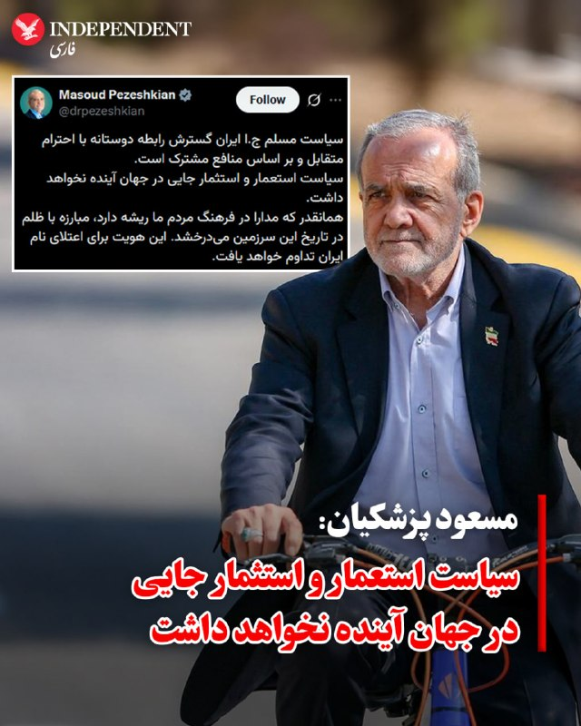

♦️ مسعود پزشکیان، رئیس‌جمهوری اسلامی، روز جمعه ۱۸ اردیبهشت، با انتشار پیامی در شبکه اجتماعی ایکس بار دیگر سیاست خارجی تهران را مبتنی بر «گسترش رابطه دوستانه با احترام متقابل و بر اساس منافع مشترک» دانست.

پزشکیان نوشت: «سیاست استعمار و استثمار جایی در جهان آینده نخواهد داشت. همانقدر که مدارا در فرهنگ مردم ما ریشه دارد، مبارزه با ظلم در تاریخ این سرزمین می‌درخشد. این هویت برای اعتلای نام ایران تداوم خواهد یافت.»

پزشکیان به‌طور مستقیم به حوادث اخیر اشاره نکرد اما به‌نظر می‌رسد با توجه به درگیری‌های ۲۴ ساعت گذشته در تنگه هرمز و افزایش فشارها بر جمهوری اسلامی برای پذیرش پیشنهادهای واشنگتن و از سر گیری مذاکرات، این پیام در راستای گفته‌های پیشین مجتبی خامنه‌ای، رهبر جدید جمهوری اسلامی مبنی بر کوتاه نیامدن از کنترل کامل تنگه هرمز باشد.
‌🇸🇦 Indypersian

🤖 @VahidOOnLine

## VahidOOnLine — post 238938

  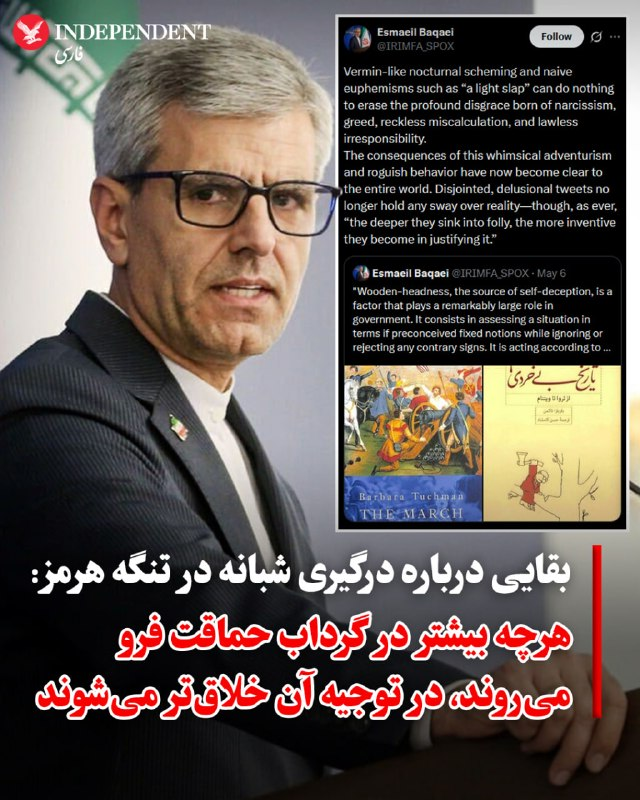

♦️ اسماعیل بقایی، سخنگوی وزارت امور خارجه جمهوری اسلامی، روز جمعه ۱۸ اردیبهشت در واکنش به درگیری‌های پنجشنبه‌شب در تنگه هرمز، اقدامات ایالات متحده را «ماجراجویی‌های هوس‌بازانه و رفتار شرورانه» دانست.

بقایی در واکنش به پیام ترامپ که اقدام نظامی آمریکا علیه نیروهای نظامی جمهوری اسلامی را به «سیلی آرام» تشبیه کرده بود، در شبکه اجتماعی ایکس نوشت: «توطئه شبانه و رذیلانه و واژگان ساده‌لوحانه‌ای چون سیلی آرام، هرگز نمی‌توانند ننگ عمیق ناشی از خودشیفتگی، طمع و محاسبات غلط بی‌پروا و بی‌مسئولیتی فراقانونی را پاک کنند.»

بقایی با بازنشر بخشی از کتاب «تاریخ بی‌خردی؛ از تروا تا ویتنام» نوشت: «توییت‌های گسسته و متوهمانه دیگر هیچ تاثیری بر واقعیت ندارند؛ هرچند طبق معمول، هر چه بیشتر در گرداب حماقت فرو می‌روند، در توجیه آن خلاق‌تر می‌شوند.»

این اظهارات در حالی مطرح شد که ایالات متحده در درگیری پنجشنبه‌شب در تنگه هرمز، جمهوری اسلامی را به اقدام نظامی علیه نیروهای این کشور متهم کرده و هدف قرار دادن مواضعی در ایران را پاسخی به این اقدام دانسته است.
‌🇸🇦 Indypersian

🤖 @VahidOOnLine

## VahidOOnLine — post 238937

  <a href="telegram/content/VahidOOnLine_238937_1778263009.mp4">🎬 Download video</a>

ویدیوهای رسیده به ایران‌اینترنشنال نشان می‌دهند گروهی از ایرانیان مقیم اسپانیا جمعه ۱۸ اردیبهشت در اعتراض به اعدام شهروندان، مقابل سفارت جمهوری اسلامی در مادرید تجمع کردند.
‌🏁 🇬🇧 IranintlTV

🤖 @VahidOOnLine

## VahidOOnLine — post 238936

🗣روایت شما از قطع اینترنت- جمعه ۱۸ اردیبهشت:

🔹من یک روان‌شناسم و هر روز برای پژوهش، مطالعه و نوشتن مقاله به اینترنت نیاز دارم. ما اینجا زندگیمون قطع شده، نه تنها اینترنت؛ درآمد و ارتباطات ما هم قطع شده. این شرایط سلامت روان مردم را تحت تاثیر قرار داده.

🔹قطعی اینترنت فشار بدی به من ۱۹ ساله آورده؛ نمی‌تونم از هوش مصنوعی استفاده کنم، در یوتیوب فیلم‌های آموزشی ببینم، یا در اوقات فراقت در پینترست سر کنم و بازی‌هایی مثل کلش و براول استارز انجام بدم. هیچ دل و جون و رمقی برامون نمونده.

🔹کانفیگ‌ها خیلی گرونه. خیلی‌ها که کسب‌وکارشون با اینترنته، از پس این هزینه‌ها بر نمیان.

🔹ما عملا در کشور خودمون به گروگان گرفته شدیم، حق حرف زدن نداریم، حق استفاده از اینترنت آزاد نداریم. این واقعا حق مردم ما نیست.

🔹شرایط برای کنکوری‌ها واقعا افتضاحه. هر روز یه خبر جدید می‌گن، با این حجم از استرس، تعطیلی مدرسه‌ها و آموزشگاه‌ها، اینترنت ضعیف و کمبود دسترسی به منابع درسی، واقعا هیچ‌جوره نمی‌شه درس خوند.

🔹برای این حقارتی که داره بابت وی‌پی‌ان بهمون تحمیل می‌شه، عصبانی و غمگینم.
‌🏁 🇬🇧 IranintlTV

🤖 @VahidOOnLine

## mwarmonitor — post 8724

🔴«به گزارش وال‌استریت ژورنال (WSJ)، از روز سه‌شنبه تاکنون هیچ کشتی تجاریِ متعلق به شرکت‌های کشتیرانی ثبت‌شده از تنگه هرمز عبور نکرده است؛ هم‌زمان با تشدید درگیری‌ها میان ایران و ایالات متحده.»

@mwarmonitor

## mwarmonitor — post 8723

  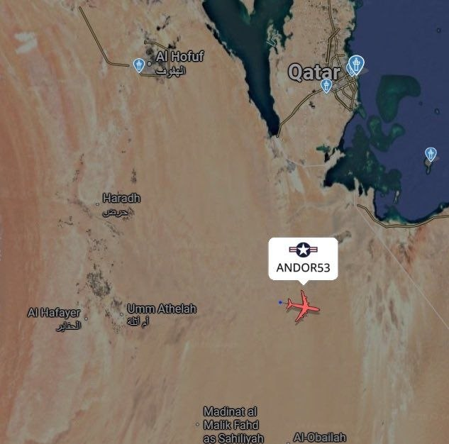

✈️«یک فروند هواپیمای E-3 Sentry نیروی هوایی آمریکا با علامت پروازی ANDOR53 بر فراز شرق عربستان سعودی و در نزدیکی مرز قطر مشاهده شد. این هواپیمای آواکس وظیفه مدیریت میدان نبرد هوابرد و فرماندهی و کنترل را بر عهده دارد و عملیات‌ها را در یک منطقه وسیع هماهنگ می‌کند.»

@mwarmonitor

## mwarmonitor — post 8722

  <a href="telegram/content/mwarmonitor_8722_1778263013.mp4">🎬 Download video</a>

📷«تصاویری از ناوشکن‌های USS Truxton (DDG 103)، USS Rafael Peralta (DDG 115) و USS Mason (DDG 87) که در خاورمیانه در حال عملیات هستند. این سه ناوشکن در حال حاضر در دریای عرب در حال دریانوردی هستند و از محاصره علیه ایران پشتیبانی می‌کنند.

❌تا امروز، نیروهای سنتکام ۵۷ کشتی تجاری را منحرف کرده و ۳ کشتی را متوقف کرده‌اند تا از ورود یا خروج آن‌ها به/از بنادر ایران جلوگیری کنند.»

@mwarmonitor

## mwarmonitor — post 8721

🔴«به گفته پنج مشاور و دستیار، رئیس‌جمهور ترامپ “واقعاً، واقعاً می‌خواهد جنگ با ایران پایان یابد” و “مطمئن است که می‌تواند هر نوع توافقی را به‌عنوان یک پیروزی به مردم ارائه کند” — آتلانتیک» @mwarmonitor

## mwarmonitor — post 8720

🦠«شرکت مدرنا در یک بیانیه اعلام کرد که در مراحل اولیه پژوهش درباره واکسن ویروس‌های هانتا با همکاری مؤسسه تحقیقات پزشکی بیماری‌های عفونی ارتش ایالات متحده (USAMRIID) فعالیت کرده است.»

@mwarmonitor

## mwarmonitor — post 8719

🔰«به گزارش وال‌استریت ژورنال (WSJ)، شرکت‌های اپل و اینتل به یک توافق اولیه دست یافته‌اند که بر اساس آن اینتل برخی از تراشه‌های مورد استفاده در دستگاه‌های اپل را تولید خواهد کرد.»

@mwarmonitor

## mwarmonitor — post 8718

🔴«به گفته پنج مشاور و دستیار، رئیس‌جمهور ترامپ “واقعاً، واقعاً می‌خواهد جنگ با ایران پایان یابد” و “مطمئن است که می‌تواند هر نوع توافقی را به‌عنوان یک پیروزی به مردم ارائه کند” — آتلانتیک»

@mwarmonitor

## mwarmonitor — post 8717

  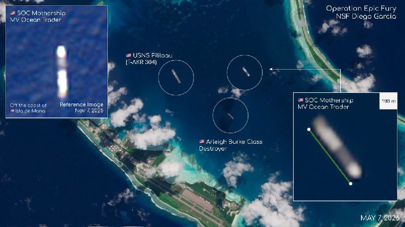

🚨 «کشتی مادر SOC در دیگو گارسیا» 🚨
تصاویر ماهواره‌ای Sentinel-2 مربوط به ۷ مه نشان می‌دهد که یک حضور بسیار مهم در پایگاه نیروی دریایی دیگو گارسیا (NSF Diego Garcia) ثبت شده است.

🔸 احتمالاً کشتی پشتیبانی عملیات ویژه (SOC) یعنی MV Ocean Trader با اطمینان در داخل آب‌سنگ حلقوی (آتول) لنگر انداخته است.
🔸 کشتی USNS Pililaau و یک ناوشکن کلاس آرلی برک نیز در داخل تالاب حضور دارند.

🔴آخرین مشاهده قطعی از این کشتی مربوط به نوامبر ۲۰۲۵ در سواحل پورتوریکو بود. همچنین یک مشاهده احتمالی در ۱۳ آوریل ۲۰۲۶ در مدیترانه و در مسیر کانال سوئز. این حضور در اقیانوس هند به‌طور قوی آن ردیابی قبلی را تأیید می‌کند.

⚠️وقتی Ocean Trader وارد یک منطقه عملیاتی می‌شود—مشابه آنچه قبلاً در آرایش‌های مربوط به ونزوئلا دیده بودیم—معمولاً عملیات‌های پیچیده‌تری در ادامه رخ می‌دهد.

❗️آیا ورود او نشان می‌دهد که عناصر SOCOM در حال آماده‌سازی فعال برای مرحله بعدی هستند؟خواهیم دید

@mwarmonitor

## mwarmonitor — post 8716

  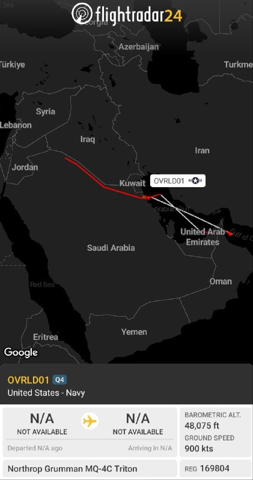

🇺🇸پهپاد شناسایی Northrop Grumman MQ-4C Triton متعلق به نیروی دریایی آمریکا که از پایگاه هوایی Muwaffaq Salti Air Base پرواز کرده بود، کد اضطراری 7700 را ارسال کرده است. 🚨کد 7700 در هوانوردی به معنای اعلام وضعیت اضطراری عمومی از سوی هواگرد است. شماره 169804…

## pm_afshaa — post 90381

🔴وزارت امور خارجه ایالات متحده: لبنان و اسرائیل متعهد شده‌اند که بر اساس منافع مربوطه خود وارد گفتگو شوند و ما برای آشتی دادن آنها تلاش خواهیم کرد

💧 Rainbet.com the #1 Non-KYC Crypto Casino & Sportsbook @rainbetcom

😁 @Pm_Afshaa

## pm_afshaa — post 90380

💰تعرفه
💰 1 گیگ    
⬆️ 345 ت 500 مگ 
⬆️ 195 ت 100 مگ 
⬆️ 65 ت 
⭐️ اتصال پایدار در نت ملی 
⭐️ مناسب اینستاگرام و تلگرام و یوتیوب 
⭐️ دارای سایت استعلام باقی حجم 
⭐️ بدون محدودیت کاربر و بدون انقضا 
⭐️ ضمانت بازگشت عدم رضایت 
🌟 تست هم موجود میباشد 
🌟 جهت خرید…

## pm_afshaa — post 90379

💰تعرفه
💰

1 گیگ    
⬆️ 345 ت

500 مگ 
⬆️ 195 ت

100 مگ 
⬆️ 65 ت

⭐️ اتصال پایدار در نت ملی

⭐️ مناسب اینستاگرام و تلگرام و یوتیوب

⭐️ دارای سایت استعلام باقی حجم

⭐️ بدون محدودیت کاربر و بدون انقضا

⭐️ ضمانت بازگشت عدم رضایت

🌟 تست هم موجود میباشد 
🌟

جهت خرید به آیدی زیر پیام دهید 
⬆️

Admin : @Four_Support 
👨‍💻

Channel : @Four_Vpn_4 
🩵

🎇داخل گروه زیر هر شب قرعه کشی ۱۰ اشتراک رایگان انجام میشود 
⬆️
https://t.me/+v8GFmLXjHa5jNDZk

## kianmeli1 — post 87289

  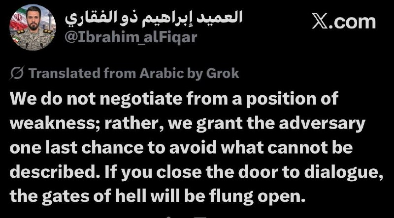

🔴سخنگو قرارگاه خاتم

ما از موضع ضعف مذاکره نمی‌کنیم؛ بلکه به دشمن آخرین فرصت را می‌دهیم تا از آنچه غیرقابل توصیف است، اجتناب کند. اگر درِ گفتگو را ببندید، دروازه‌های جهنم به رویتان گشوده خواهد شد.
https://t.me/kianmeli1

## kianmeli1 — post 87288

  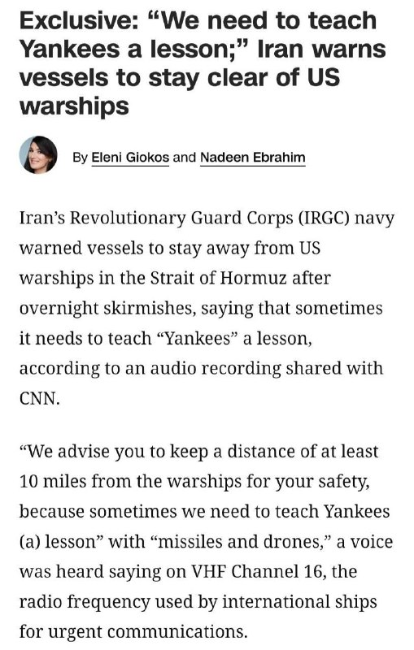

🔴سی‌ان‌ان: ایران به شناورها هشدار داده که از ناوهای آمریکا دور شوند

سی‌ان‌ان نوشت:

ایران روی فرکانس اضطراری کشتی‌ها در پیامی هشدار داده که: برای حفظ امنیت‌تان، توصیه می‌کنیم فاصلهٔ حداقل 10 مایلی را از ناوهای جنگی آمریکا حفظ کنید، زیرا ما گاهی نیاز داریم با موشک و پهپاد به یانکی‌ها درس بدهیم.

روز پنجشنبه هم ایرانی‌ها از تمامی کشتی‌های حاضر در بخش شمالی تنگهٔ هرمز خواستند به سمت دبی حرکت کنند و همهٔ آن‌ها به حرف ایران گوش کردند.
https://t.me/kianmeli1

## kianmeli1 — post 87287

  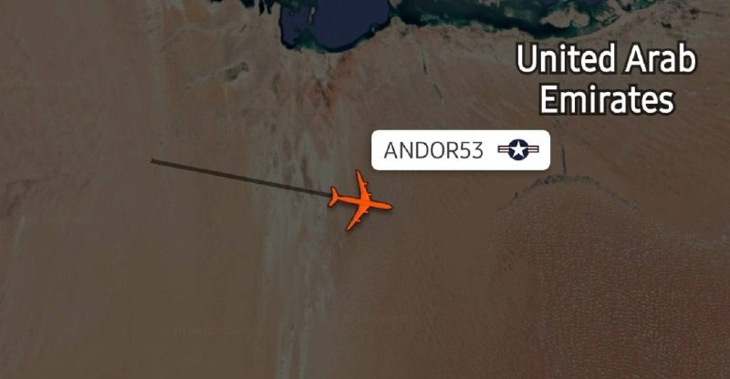

🔴آواکس"Boeing E-3 Sentry" تو شرق عربستان نزدیک قطر دیده شد؛برای فرماندهی و کنترل نبرد هوایی استفاده می‌شود
https://t.me/kianmeli1

## IranIntlTV — post 336182

  <a href="telegram/content/IranIntlTV_336182_1778263019.mp4">🎬 Download video</a>

مقتدی صدر، روحانی پرنفوذ شیعه در عراق، گفت هیچ‌یک از گروه‌های مسلح نباید در دولت آینده این کشور حضور داشته باشند.

او که انتخابات را تحریم کرده بود، افزود هیچ نماینده‌ای در کابینه آینده عراق نخواهد داشت.

گفت‌وگو با تروسکه صادقی، عضو تحریریه ایران‌اینترنشنال
@iranintltv

## IranIntlTV — post 336181

  

سنتکام، ستاد فرماندهی مرکزی ایالات متحده، اعلام کرد که از زمان آغاز محاصره دریایی بنادر و سواحل جنوب ایران، ۵۷ کشتی تجاری با دستور نیروهای آمریکایی تغییر مسیر داده و چهار کشتی پس از حمله از کار افتاده‌اند.

همچنین سه ناوشکن در دریای عرب برای پشتیبانی از محاصره در حال گشت‌زنی‌اند.
https://iranintl.com/202605081553

## IranIntlTV — post 336180

مقتدی صدر: گروه‌های مسلح نباید در دولت آینده عراق حضور داشته باشند

مقتدی صدر، رهبر جریان صدر، در پیامی خطاب به علی الزیدی، نخست‌وزیر مکلف به تشکیل دولت جدید در عراق، تاکید کرد «افراد یا جریان‌های دارای شاخه مسلح» نباید در کابینه آینده این کشور حضور داشته باشند.

صدر جمعه ۱۸ اردیبهشت خواستار آن شد که گروه‌های مسلح یا در قالب تشکیلاتی با عنوان «سربازان شعائر دینی» زیر نظر هیات حج سازماندهی شوند یا به «نهادهای امدادرسان و بشردوستانه» تبدیل شوند.

صدر همچنین بر حفظ استقلال عراق و دوری از هرگونه دخالت خارجی «نه شرقی و نه غربی» تاکید کرد و گفت دولت آینده باید خواسته‌های مردم عراق را برآورده کند.

او ادامه داد: «هیچ فردی از جریان صدر را در کابینه وزارتی نمی‌پذیریم و هیچ وزیری نماینده ما نخواهد بود.»

گمانه‌زنی‌ها درباره کابینه آینده عراق
در روزهای اخیر، گمانه‌زنی‌ها درباره ترکیب دولت آینده عراق بالا گرفته است.

۷ اردیبهشت، ائتلاف احزاب سیاسی شیعه عراق، «چارچوب هماهنگی»، اعلام کرد که علی الزیدی را به‌عنوان نامزد خود برای سمت نخست‌وزیری معرفی کرده است.

پس از این اعلام، نمایندگان شیعه به رویترز گفتند که رییس‌جمهور عراق، نزار آمیدی، از الزیدی، دعوت کرد تا دولت را تشکیل دهد.

بر اساس قانون اساسی عراق، الزیدی ۳۰ روز فرصت دارد تا کابینه خود را تشکیل دهد و آن را برای تایید به پارلمان معرفی کند.

یک مقام ارشد وزارت امور خارجه آمریکا ۱۶ اردیبهشت، اعلام کرد واشینگتن از نخست‌وزیر عراق انتظار دارد برای محدود کردن نفوذ گروه‌های مسلح نزدیک به جمهوری اسلامی، «اقدام‌های عملی» انجام دهد.

این مقام آمریکایی که نامش فاش نشده، گفت آمریکا خواهان پایان دادن به «مرز مبهم» میان دولت عراق و گروه‌های مسلح شیعه مورد حمایت جمهوری اسلامی است.

به گفته او، ازسرگیری کامل حمایت‌های آمریکا از عراق، از جمله انتقال منابع مالی حاصل از فروش نفت و کمک‌های امنیتی، منوط به اقدام‌هایی مانند اخراج «شبه‌نظامیان تروریستی» از نهادهای دولتی، قطع بودجه این گروه‌ها و توقف پرداخت حقوق به نیروهای وابسته به آن‌ها است.

این مقام آمریکایی تاکید کرد: «این‌ها اقدام‌های عملی هستند که می‌توانند به ما نشان دهند ذهنیت جدیدی در عراق شکل گرفته است.»

ترامپ: دولت جدید عراق باید «عاری از تروریسم» باشد
الزیدی پس از معرفی شدن به‌عنوان گزینه نخست‌وزیری عراق، تماس تبریکی از ترامپ دریافت کرد.

ترامپ در پیام خود ابراز امیدواری کرد دولت جدید عراق «عاری از تروریسم» باشد و فصل تازه‌ای در روابط بغداد و واشینگتن آغاز شود.

در ماه‌های اخیر، گروه‌های مسلح در عراق، سفارت آمریکا در بغداد، تاسیسات دیپلماتیک و لجستیکی آمریکا در فرودگاه بغداد و همچنین میدان‌های نفتی متعلق به شرکت‌های خارجی را هدف قرار داده‌اند.

🔗وب‌سایت ایران‌اینترنشنال
@iranintltv

## IranIntlTV — post 336179

  <a href="telegram/content/IranIntlTV_336179_1778263022.mp4">🎬 Download video</a>

مارکو روبیو، وزیر امور خارجه آمریکا، گفت اقدام نظامی ایالات متحده در جریان درگیری با جمهوری اسلامی در اطراف تنگه هرمز، دفاع از خود بوده است.

او افزود ناوشکن‌های آمریکایی در آب‌های بین‌المللی در حال حرکت بودند که از سوی ایران هدف قرار گرفتند و آمریکا برای محافظت از خود به آن پاسخ داد.
@iranintltv

## IranIntlTV — post 336178

  <a href="telegram/content/IranIntlTV_336178_1778263025.mp4">🎬 Download video</a>

مارکو روبیو، وزیر خارجه آمریکا، گفت واشینگتن همچنان منتظر پاسخ ایران به پیشنهادهای مطرح‌شده است و امیدوار است تهران برای ورود به مذاکراتی «جدی و واقعی» آمادگی نشان دهد.

او افزود گزارش‌ها درباره تلاش ایران برای کنترل تردد در تنگه هرمز برای آمریکا قابل قبول نیست و تاکید کرد اعمال کنترل بر آبراه‌های بین‌المللی «پذیرفتنی نیست».

روبیو همچنین گفت حکومت ایران «بسیار شکننده» است و ممکن است همین موضوع باعث تاخیر در ارائه پاسخ شده باشد.
@iranintltv

## IranIntlTV — post 336177

  <a href="telegram/content/IranIntlTV_336177_1778263027.mp4">🎬 Download video</a>

یکی از مخاطبان ایران‌اینترنشنال می‌گوید پس از ۷۰ روز به سختی توانسته ارتباط برقرار کند و از ایرانیان خارج از کشور می‌خواهد صدای مردم داخل ایران باشند.

## IranIntlTV — post 336175

  <a href="telegram/content/IranIntlTV_336175_1778263030.mp4">🎬 Download video</a>

ویدیوهای رسیده به ایران‌اینترنشنال نشان می‌دهند گروهی از ایرانیان مقیم اسپانیا جمعه ۱۸ اردیبهشت در اعتراض به اعدام شهروندان، مقابل سفارت جمهوری اسلامی در مادرید تجمع کردند.

## IranIntlTV — post 336174

🗣روایت شما از قطع اینترنت- جمعه ۱۸ اردیبهشت:

🔹من یک روان‌شناسم و هر روز برای پژوهش، مطالعه و نوشتن مقاله به اینترنت نیاز دارم. ما اینجا زندگیمون قطع شده، نه تنها اینترنت؛ درآمد و ارتباطات ما هم قطع شده. این شرایط سلامت روان مردم را تحت تاثیر قرار داده.

🔹قطعی اینترنت فشار بدی به من ۱۹ ساله آورده؛ نمی‌تونم از هوش مصنوعی استفاده کنم، در یوتیوب فیلم‌های آموزشی ببینم، یا در اوقات فراقت در پینترست سر کنم و بازی‌هایی مثل کلش و براول استارز انجام بدم. هیچ دل و جون و رمقی برامون نمونده.

🔹کانفیگ‌ها خیلی گرونه. خیلی‌ها که کسب‌وکارشون با اینترنته، از پس این هزینه‌ها بر نمیان.

🔹ما عملا در کشور خودمون به گروگان گرفته شدیم، حق حرف زدن نداریم، حق استفاده از اینترنت آزاد نداریم. این واقعا حق مردم ما نیست.

🔹شرایط برای کنکوری‌ها واقعا افتضاحه. هر روز یه خبر جدید می‌گن، با این حجم از استرس، تعطیلی مدرسه‌ها و آموزشگاه‌ها، اینترنت ضعیف و کمبود دسترسی به منابع درسی، واقعا هیچ‌جوره نمی‌شه درس خوند.

🔹برای این حقارتی که داره بابت وی‌پی‌ان بهمون تحمیل می‌شه، عصبانی و غمگینم.

## IranIntlTV — post 336173

  <a href="telegram/content/IranIntlTV_336173_1778263032.mp4">🎬 Download video</a>

رییس فراکسیون ورزش مجلس شورای اسلامی در نامه‌ای به مهدی تاج خواستار لغو تمامی مسابقات فوتبال در سراسر کشور شد. این در حالی است که پس از آغاز جنگ، هیچ مسابقه رسمی باشگاهی در ایران برگزار نشده است.

گفت‌وگو با محمد تقوی، بازیکن پیشین تیم ملی و باشگاه استقلال
@iranintltv

## IranIntlTV — post 336172

  <a href="telegram/content/IranIntlTV_336172_1778263035.mp4">🎬 Download video</a>

رییس فراکسیون ورزش مجلس شورای اسلامی در نامه‌ای به مهدی تاج خواستار لغو تمامی مسابقات فوتبال در سراسر کشور شد. این در حالی است که پس از آغاز جنگ، هیچ مسابقه رسمی باشگاهی در ایران برگزار نشده است.

گفت‌وگو با محمد تقوی، بازیکن پیشین تیم ملی و باشگاه استقلال
@iranintltv

## IranIntlTV — post 336171

  <a href="telegram/content/IranIntlTV_336171_1778263037.mp4">🎬 Download video</a>

خبرنامه امیرکبیر در گزارشی اختصاصی اعلام کرد عرفان شکورزاده، دانشجوی نخبه دانشگاه علم و صنعت، برای اجرای حکم اعدام به زندان قزلحصار منتقل شده است.

براساس این گزارش، او بهمن‌ماه ۱۴۰۳ با اتهام «جاسوسی و همکاری با کشورهای متخاصم» بازداشت شد و حدود ۹ ماه در سلول انفرادی تحت شکنجه برای اعتراف اجباری نگهداری شده است.

گفت‌وگو با مجتبی هاشمی، روزنامه‌نگار و تحلیل‌گر سیاسی
@iranintltv

## Shin_Persian — post 5898

  <a href="telegram/content/Shin_Persian_5898_1778263039.mp4">🎬 Download video</a>

U.S. Central Command ✓ @CENTCOM Fri, 08 May 2026 17:14:30 UTC Photos of USS Truxton (DDG 103), USS Rafael Peralta (DDG 115), and USS Mason (DDG 87) operating in the Middle East. The three destroyers are currently sailing in the Arabian Sea supporting the…

## Shin_Persian — post 5897

U.S. Central Command ✓ @CENTCOM
Fri, 08 May 2026 17:14:30 UTC

Photos of USS Truxton (DDG 103), USS Rafael Peralta (DDG 115), and USS Mason (DDG 87) operating in the Middle East. The three destroyers are currently sailing in the Arabian Sea supporting the blockade against Iran. As of today, CENTCOM forces have redirected 57 commercial vessels and disabled 4 to prevent the ships from entering or leaving Iranian ports.

فارسی

عکس‌هایی از یواس‌اس تراکستون (DDG 103)، یواس‌اس رافائل پرالتا (DDG 115) و یواس‌اس میسون (DDG 87) در حال عملیات در خاورمیانه. این سه ناوشکن در حال حاضر در دریای عرب در حال حرکت هستند و از محاصره علیه ایران پشتیبانی می‌کنند. تا امروز، نیروهای سنتکام (فرماندهی مرکزی ایالات متحده) ۵۷ کشتی تجاری را تغییر مسیر داده و ۴ کشتی را برای جلوگیری از ورود یا خروج آن‌ها از بنادر ایران از کار انداخته‌اند.

𝕏 · @shin_persian

## ManotoTV — post 105156

  <a href="telegram/content/ManotoTV_105156_1778263042.mp4">🎬 Download video</a>

‌
خبرگزاری حکومتی تسنیم به نقل از یک منبع نظامی گزارش داد درگیری‌ها در خلیج فارس فعلاً متوقف شده، اما احتمال آغاز مجدد آن همچنان وجود دارد.

این منبع مدعی شد پس از «اقدام خصمانه» آمریکا علیه نفتکش‌های ایران، نیروی دریایی جمهوری اسلامی با حملات خود به آن پاسخ داده و پس از مدتی تبادل آتش، درگیری‌ها متوقف شده است.

این منبع گفت در حال حاضر شرایط در منطقه آرام است، اما تهدید کرد «در صورت ورود دوباره نیروهای آمریکایی به خلیج فارس یا ایجاد مزاحمت برای شناورهای ایرانی، پاسخ قاطع داده خواهد شد.»

## ManotoTV — post 105155

  <a href="telegram/content/ManotoTV_105155_1778263043.mp4">🎬 Download video</a>

‌
هم‌زمان با زادروز جاویدنام احمد خسروانی، جان‌باخته اعتراضات دی‌ماه ۱۴۰۴، ویدیویی از حضور بر مزار او و رها کردن پرندگان در فضای مجازی منتشر شده است.

در این ویدیو، پریسا آقامحمدی، خواهر دادخواه پرهام آقامحمدی، جاویدنام اعتراضات دی‌ماه، با اشاره به دوستی این دو نوشته است: «امروز تولد احمد خسروانی بود… پرنده برای پرواز.»

احمد خسروانی، بسکتبالیست ۲۱ ساله و دانشجوی دانشگاه صنعتی شریف، روز ۱۹ دی‌ماه ۱۴۰۴ در جریان اعتراضات مردمی با شلیک مستقیم نیروهای امنیتی کشته شد.

او پیش‌تر با تیم «فرزان شمیران» عنوان قهرمانی مسابقات بسکتبال سه‌نفره تهران را کسب کرده و به‌عنوان برترین بازیکن لیگ تهران در سال ۱۴۰۴ انتخاب شده بود.

## ManotoTV — post 105154

  <a href="telegram/content/ManotoTV_105154_1778263045.mp4">🎬 Download video</a>

اکسویس گزارش داد جی‌دی ونس، معاون رئیس‌جمهوری ایالات متحده آمریکا، در دیدار با نخست‌وزیر قطر درباره مذاکرات با جمهوری اسلامی گفت‌وگو کرده است.

به‌گزارش آکسیوس، این دیدار با محوریت تلاش‌های دیپلماتیک برای پیشبرد مذاکرات انجام شده، اما جزئیات بیشتری از آن منتشر نشده است.

گزارش‌ها حاکی است اطلاعات تکمیلی درباره این دیدار هنوز منتشر نشده و انتظار می‌رود جزئیات بیشتری در ادامه اعلام شود.

## ManotoTV — post 105153

  <a href="telegram/content/ManotoTV_105153_1778263045.mp4">🎬 Download video</a>

سنتکام، اعلام کرد نیروهای آمریکایی دو نفتکش ایرانی به نام‌های «سی استار ۳» و «سوِودا» را پیش از ورود به بنادر ایران در دریای عمان از حرکت بازداشته‌اند.
به گفته سنتکام، جنگنده‌های مستقر روی ناو هواپیمابر «جورج اچ. دبلیو. بوش» با شلیک به دودکش این نفتکش‌ها، مانع ادامه حرکت آن‌ها شده‌اند.
آمریکا همچنین اعلام کرد نفتکش «حسنا» نیز روز ۶ مه توسط جنگنده‌ای از ناو «آبراهام لینکلن» هدف قرار گرفته و سکان آن از کار افتاده است.
سنتکام تأکید کرده این اقدامات در چارچوب اجرای محاصره دریایی علیه ایران انجام شده و هر سه نفتکش اکنون «دیگر در مسیر ایران نیستند.»

## FarsiVOA — post 217209

همگرایی آمریکا و اروپا علیه برنامه هسته‌ای جمهوری اسلامی در تماس ترامپ و فون‌درلاین

## FarsiVOA — post 217208

🔺روزنامه‌نگار بهره‌مند از اینترنت «پرو» با مردم ایران چه می‌کند

◾️هفتاد روز از قطع سراسری اینترنت در کنترل جمهوری اسلامی در ایران می‌گذرد. این بار، خاموشی از ۹ اسفند ۱۴۰۴، روز شروع جنگ یا همان روز کشته شدن علی خامنه‌ای شروع شد. ولی ممکن است در نگاهی عمومی به ظاهر شبکه‌های اجتماعی فارسی‌زبان، به نظر برسد کم‌کم افراد بیشتری به نت جهانی وصل می‌شوند. مثل روزهای بعد از قطع کوتاه‌تر اینترنت به قصد محدود کردن اخبار سرکوب ۱۸ و ۱۹ دی که هر کسی وصل می‌شد، دیگران تازه از زنده بودنش باخبر می‌شدند، حالا هم خیلی‌ها خبر میدهند که «زنده‌ایم».

⬇️ بیشتر بخوانید:

https://ir.voanews.com/a/iran-internet-pro-filtering-black-out-journalists-/8148014.html

## FarsiVOA — post 217207

  <a href="telegram/content/FarsiVOA_217207_1778263046.mp4">🎬 Download video</a>

یکی از مخاطبان صدای آمریکا با ارسال ویدئویی از پیرانشهر، آذربایجان غربی، از افزایش بیکاری و فشار اقتصادی گلایه می‌کند.

او می‌گوید: «هر روز این صف آدم‌های دنبال کار طولانی‌تر می‌شود». این مخاطب، حکومت و سپاه پاسداران را مسئول شرایط اقتصادی و معیشتی بسیار بد مردم می‌داند.

@FarsiVOA

## FarsiVOA — post 217206

مارکو روبیو، وزیر خارجه آمریکا، در سفر به رم با آنتونیو تایانی دیدار و درباره همکاری‌های دوجانبه، اوکراین و تحولات خاورمیانه گفت‌وگو کرد

## FarsiVOA — post 217205

ابهام در دیدار پزشکیان با مجتبی خامنه‌ای؛ واقعاً در بیت رهبری چه گذشت؟

## DW_Farsi — post 124456

  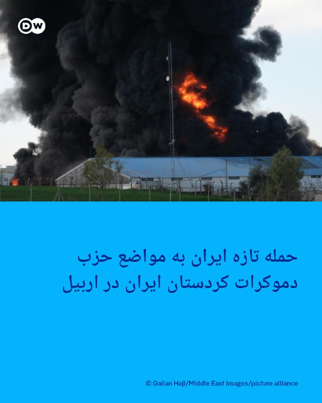

🔶 حمله تازه ایران به مواضع حزب دموکرات کردستان ایران در اربیل

بنا بر گزارش روداو  و به نقل از حزب دموکرات کردستان ایران، سپاه پاسداران شامگاه پنج‌شنبه۷ مه  (۱۷ اردیبهشت) مواضع پیشمرگه‌های این حزب در کوه‌های بالیسان در استان اربیل را با چند پهپاد انتحاری هدف قرار داده است. این گروه گفت حمله تازه در ساعت ۱۹:۴۰ به وقت محلی انجام شد و پس از دو حمله جداگانه در روز قبل به اردوگاه‌های "زێوی سپی" و "گرده‌چال" صورت گرفت.

حزب دموکرات کردستان ایران گفته است حمله پنج‌شنبه ادامه مجموعه حملاتی است که از روز قبل آغاز شده بود. این گروه مدعی است با حمله تازه، شمار حملات ایران به پایگاه‌هایش در اقلیم کردستان به ۱۲۰ مورد رسیده و بخش زیادی از این حملات، مناطق مسکونی، مراکز درمانی و مدارس را نیز دربر گرفته است.
این حمله هم‌زمان با ادامه گمانه‌زنی‌ها درباره نزدیک شدن تهران و واشنگتن به یک تفاهم جدید انجام شده است. هم‌زمان، مقام‌های ایرانی گفته‌اند پیشنهاد آمریکا هنوز در دست بررسی است و پس از تکمیل ارزیابی، موضع تهران از طریق طرف پاکستانی اعلام خواهد شد.
@dw_farsi

## DW_Farsi — post 124455

🔶 بلاتکلیفی متقاضیان ایرانی ویزای آلمان پس از جنگ

🔻 گزارشی از دانیال بابایانی

از زمان آغاز جنگ آمریکا و اسرائیل علیه ایران و تعطیلی سفارت آلمان در تهران، زندگی بسیاری از ایرانیانی که برای ویزای تحصیلی، کاری یا پیوست به خانواده اقدام کرده بودند، وارد وضعیتی معلق شده است؛ وضعیتی که برای بعضی حالا ماه‌ها طول کشیده است.

وزارت خارجه آلمان در ۱۷ اسفند ۱۴۰۴ اعلام کرد به دلیل ادامه حملات و "سطح بالای خطر"، کارکنان سفارت خود را به‌طور موقت از ایران خارج کرده است.

این وزارتخانه همچنین خبر داد که بخش کنسولی به‌شدت محدود شده و بخش ویزا نیز موقتا تعطیل است.

در همان زمان، کشورهای دیگری مانند اتریش، ایتالیا و اسپانیا نیز بخشی از فعالیت سفارتخانه‌های خود در تهران را متوقف یا منتقل کردند. اما در حالی که برخی کشورها سفارت جایگزین معرفی کردند، متقاضیان ایرانی ویزای آلمان می‌گویند برلین هنوز راه‌حل مشخص و فراگیری برای ادامه روند پرونده‌هایشان ارائه نکرده است.

وزارت خارجه آلمان در پاسخ به پرسش دویچه‌وله تاکید کرده که برخلاف برخی گزارش‌ها، سفارت آلمان در ایروان مسئولیت کامل خدمات کنسولی ایرانیان را بر عهده نگرفته است.

در پاسخ رسمی این وزارتخانه به دویچه‌وله آمده است: «تنها برخی متقاضیانی که پیش‌تر در تهران درخواست ویزا ثبت کرده و پرونده‌شان آماده صدور بوده، به‌صورت موردی برای الصاق ویزا به سفارت آلمان در ایروان معرفی شده‌اند.»

این وزارتخانه همچنین تاکید کرده که این روند به معنای انتقال کلی خدمات ویزا به ارمنستان نیست.

پویا، یکی از متقاضیان ویزای کاری آلمان، به دویچه‌ وله می‌گوید از زمان تعطیلی سفارت، روند رسیدگی عملا متوقف شده است.

او توضیح می‌دهد: «بسیاری از متقاضیان آوسبیلدونگ و ویزای کاری، ماه‌ها در صف انتظار مانده‌اند و بعضی قراردادهای شغلی یا پذیرش‌های خود را از دست داده‌اند.»

مانی دیگر شهروند ایرانی، حدود ۲۰ ماه است که برای ویزای پیوست به همسرش منتظر مانده؛ همسری که اکنون اقامت دائم آلمان را دریافت کرده است.

او به دویچه‌ وله می‌گوید: «دیگر کاملا از سفارت تهران ناامید شدم. نه پاسخ روشنی می‌دهند، نه اطلاع‌رسانی مشخصی وجود دارد.»

مانی اکنون به ارمنستان رفته و برای دریافت اقامت موقت در یک دوره زبان ثبت‌نام کرده است. اما حتی حالا هم مطمئن نیست آیا مدارکش مورد قبول سفارت خواهد بود یا نه.
@dw_farsi

## DW_Farsi — post 124454

🔶 روایت‌های متناقض از درگیری‌ها؛ آتش‌بس شکننده یا جنگ پنهان

🔻 گزارشی از مراد رحمتی

ایالات متحده و جمهوری اسلامی تمایلی به به‌کارگیری واژه "جنگ" ندارند، اما شکننده بودن آتش‌بس را پذیرفته‌اند و متقابلا یکدیگر را مسئول آن می‌دانند.

ترامپ واژه "جنگ" را به‌کار نمی‌گیرد، هرچند ماهیت این تحولات همچنان "جنگ‌گونه" است. او در عوض از عباراتی مانند "ضربه آرام عاشقانه" (love tap) استفاده می‌کند.

حال با توجه به شرایط موجود "نه جنگ و نه صلح"، چه دورنمایی می‌توان برای آن تصور کرد؟ دویچه‌وله این وضعیت پیش‌آمده را با دو کارشناس بررسی کرده است.

مهران براتی، تحلیلگر مسائل ایران می‌گوید آمریکا جنگ را تمام‌شده نمی‌بیند، اما مهلت ۶۰ روزه عملیات نظامی به پایان رسیده و تمدید آن برای یک ماه دیگر به تائید سنا نیاز دارد.

به گفته این کارشناس مقیم برلین ترامپ می‌تواند بدون تائید سنا نیز به عملیات ادامه دهد، اما کنگره این اختیار را دارد که منابع مالی را مسدود کند.

براتی معتقد است ترامپ با وجود حملات نظامی، همچنان تاکید می‌کند "جنگی درنگرفته و آتش‌بس برقرار است"؛ موضوعی که پذیرش آن دشوار به نظر می‌رسد. او ادامه می‌دهد جمهوری اسلامی نیز این روایت را پذیرفته، زیرا خود به مراکز آمریکایی در بحرین، کویت و قطر حمله کرده و تمایلی ندارد از ادامه جنگ سخن بگوید.

منشه امیر، تحلیلگر مسائل خاورمیانه در اسرائیل، نیز معتقد است ترامپ عمدا به‌جای واژه "جنگ" از عبارت "درگیری محدود" استفاده می‌کند، زیرا نمی‌خواهد خود را رئیس‌جمهوری جنگ‌طلب نشان دهد و در عین حال با محدودیت‌های قانونی کنگره روبه‌رو شود.

به گفته امیر در آمریکا برای اعلام رسمی جنگ علیه یک کشور، رئیس‌جمهور باید مجوز کنگره را دریافت کند، اما در صورت استفاده از عنوان "درگیری محدود نظامی" چنین مجوزی الزامی نیست.

منشه امیر همچنین می‌گوید ترامپ مدعی است توانسته ۱۰ جنگ منطقه‌ای را متوقف کند و به همین دلیل تمایلی ندارد واژه جنگ را درباره ایران به کار ببرد. او اضافه می‌کند مردم آمریکا و کشورهای اروپایی نیز علاقه‌ای به ورود به جنگی تازه ندارند.

ه باور این کارشناس امور خاورمیانه وضعیت فعلی نوعی "آتش‌بس شکننده" است؛ آتش‌بسی محدود و مشروط که هر لحظه ممکن است شعله‌های جنگ را دوباره روشن کند.

امیر اما تاکید دارد که این اقدام هرچه هم که باشد آن طور که ترامپ آن را "ضربه آرام عاشقانه "توصیف کرده نیست

@dw_farsi

## Persian_Trend_Official — post 13713

آخرین اخبار تا این لحظه

🔴 تشدید تنش‌ها در خلیج فارس و جنوب لبنان

▪️ ارتش آمریکا اعلام کرد دو نفتکش با پرچم ایران را که در تلاش برای ورود به یکی از بنادر ایران در خلیج عمان بودند هدف قرار داده است؛ دومین روز متوالی از درگیری‌های دریایی میان دو طرف.

▪️ ارتش ایران این اقدام را «خصمانه» توصیف کرد و گفت نیروی دریایی ایران به حملات آمریکا پاسخ داده، اما اکنون وضعیت «آرام» است.

▪️ در پی حمله آمریکا به یک شناور ایرانی در پنج‌شنبه شب، دست‌کم یک ملوان جان باخته، ۱۰ نفر زخمی و ۴ نفر دیگر همچنان مفقود هستند.

▪️ حملات اسرائیل به جنوب لبنان نیز ادامه دارد. خبرگزاری ملی لبنان گزارش داده دست‌کم ۲۰ نفر در یکی از خونبارترین روزها از زمان آغاز جنگ با حزب‌الله در ۲ مارس کشته شده‌اند.

▪️ عباس عراقچی، وزیر خارجه ایران، با اشاره به طرح صلح آمریکا که هنوز در حال بررسی است، گفت:
«هر بار که راه‌حل دیپلماتیک روی میز قرار می‌گیرد، آمریکا یک ماجراجویی نظامی بی‌پروا را انتخاب می‌کند.»

🫆:Tony

📌 @persian_trend_official
پرشین ترند | متفاوت‌ترین کانال نظامی

## Persian_Trend_Official — post 13712

  <a href="telegram/content/Persian_Trend_Official_13712_1778263048.mp4">🎬 Download video</a>

💢 علی مطهری

آمریکا میخواهد تا قبل از جام جهانی جنگ را تمام کند و به دنبال ادامه جنگ نیست

🫆:Tony

📌 @persian_trend_official
پرشین ترند | متفاوت‌ترین کانال نظامی

## Persian_Trend_Official — post 13711

🔴 نخست‌وزیر قطر وارد واشنگتن شد؛ گفت‌وگو درباره ایران در دستور کار

شیخ محمد بن عبدالرحمن آل ثانی، نخست‌وزیر و وزیر خارجه قطر، وارد واشنگتن دی‌سی شد تا با مقام‌های آمریکایی دیدار و درباره طرح صلح مرتبط با ایران گفت‌وگو کند.

«حمد المفتاح» معاون رئیس هیئت دیپلماتیک سفارت قطر در آمریکا با استقبال از او گفت:
«خوشحالیم که از صلح‌سازان در واشنگتن استقبال می‌کنیم.»

وب‌سایت Axios پیش‌تر گزارش داده بود نخست‌وزیر قطر قرار است با معاون رئیس‌جمهور آمریکا، «جی‌دی ونس»، درباره مذاکرات با ایران گفت‌وگو کند.

بر اساس گزارش AFP، محور این رایزنی‌ها شامل:
▪️ روابط آمریکا و قطر

▪️ وضعیت ایران

▪️ بازار گاز طبیعی مایع (LNG)

▪️ ثبات منطقه‌ای

خواهد بود.

🫆:Tony

📌 @persian_trend_official
پرشین ترند | متفاوت‌ترین کانال نظامی

## RadioFarda — post 156984

  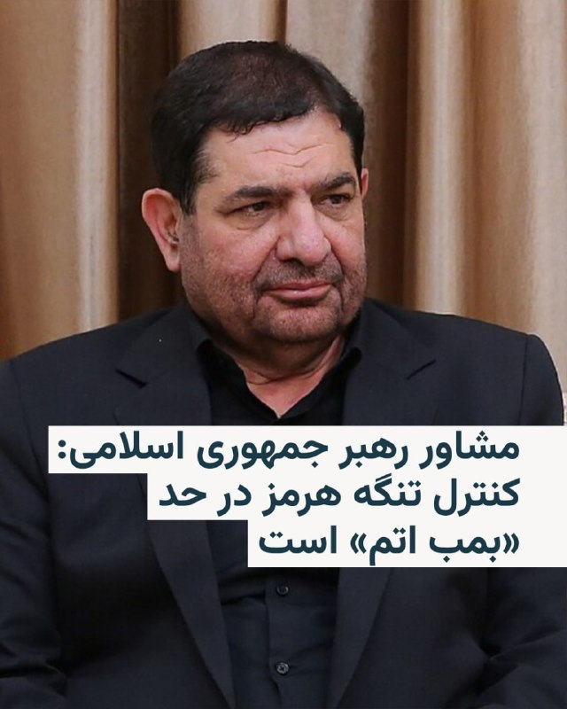

🔸محمد مخبر، دستیار رهبر جمهوری اسلامی، روز جمعه کنترل تنگه هرمز از سوی ایران را «امکانی در حد بمب اتم» خواند و گفت: «چیزی که با این جنگ به دست آوردیم را به هیچ وجه از دست نخواهیم داد.»

🔸او که در دولت ابراهیم رئیسی معاون اول رئیس‌جمهور سابق بود، به رسانه‌های ایران گفت که «اگر بتوانیم از نظر مسائل بین‌المللی، رژیم حقوقی تنگه هرمز را عوض خواهیم کرد وگرنه با قوانین داخلی خودمان این کار را خواهیم کرد».

🔸مقام‌های جمهوری اسلامی پس از آغاز جنگ اخیر و بسته شدن تنگه هرمز از سوی ایران، بارها گفته‌اند که شرایط این آبراه استراتژیک به پیش از جنگ باز نخواهد گشت.

🔸کشورهای غربی بارها کنترل تنگه هرمز از سوی ایران را رد کرده‌اند. روز جمعه، مارکو روبیو، وزیر خارجه آمریکا تلاش ایران برای کنترل تردد در تنگه هرمز را برای آمریکا غیر قابل قبول خواند و گفت اعمال کنترل بر آبراه‌های بین‌المللی پذیرفتنی نیست.

🔸محمد مخبر در اظهاراتش همچنین با تهدید امارات متحده عربی گفت این کشور «تنبیه شده و بیشتر هم تنبیه می‌شود.»

🔸ایران از زمان آغاز جنگ بارها با موشک و پهپاد به نقاط مختلفی در امارات حمله کرده است.

@RadioFarda

## RadioFarda — post 156983

  <a href="https://t.me/radiofarda/156983">📎 Download file</a>

چرا کمبود دارو شدت گرفته و چگونه کنشگران به تامین آن کمک می‌کنند؟ گفت‌وگو با هما فتحی

🔸هما فتحی کنشگر حوزه درمان است. به گفته خودش از «کنجکاوی» در حوزه سرکوب کادر درمان به بخش کمک به بیماران، تامین دارو و خیریه متمایل شد. او از شهر مونترال در کانادا در گفت‌وگو با رادیوفردا از مشاهداتش در چرخه تامین دارو در داخل ایران، مشکلات و چالش‌های عدیده در این چرخه در پی جنگ چهل روزه و راه‌های مختلفی که کنشگرانی مثل او برای کمک به شهروندان ایرانی دارند یا ندارند، می‌گوید.

@RadioFarda

## RadioFarda — post 156982

  <a href="https://t.me/radiofarda/156982">📎 Download file</a>

📻بشنوید: ایستگاه ۱۹ با رادیوفردا، ۱۸ اردیبهشت ۱۴۰۵

@RadioFarda

## RadioFarda — post 156981

🔸وزارت دفاع ایالات متحده اعلام کرد نخستین مجموعه از اسناد، ویدئوها و تصاویر محرمانه مربوط به «پدیده‌های ناشناس» یا یوفوها را در چارچوب برنامه‌ای برای «شفافیت کامل» منتشر کرده است.

🔸بر اساس بیانیه پنتاگون، اسناد تازه منتشرشده شامل پرونده‌هایی درباره «حیات فرازمینی»، «پدیده‌های ناشناس هوایی» و «اشیای پرنده ناشناس» است که تاکنون در اختیار عموم قرار نگرفته بودند.

🔸دونالد ترامپ، رئیس‌جمهور آمریکا، در شبکه اجتماعی تروث‌سوشال نوشت این اسناد و ویدئوها به مردم اجازه می‌دهد خودشان قضاوت کنند که «بالاخره چه خبر است». او همچنین گفت دولتش برخلاف دولت‌های پیشین تلاش کرده در این زمینه «حداکثر شفافیت» را ارائه کند.

🔸وزارت دفاع آمریکا اعلام کرده این اسناد با همکاری نهادهایی از جمله دفتر مدیر اطلاعات ملی، ناسا، اف‌بی‌آی و دفتر بررسی پدیده‌های ناشناس تهیه و از طبقه‌بندی خارج شده‌اند و انتشار فایل‌های بیشتر نیز ادامه خواهد یافت.

@RadioFarda

## RadioFarda — post 156980

  <a href="https://t.me/radiofarda/156980">📎 Download file</a>

🔸 در این کافه فردا به اظهارات عجیب پزشک مخصوص علی خامنه‌ای در مورد رژیم غذایی او، صحبت‌های سعید لیلاز در مورد «زِر زدن» بعضی از منتقدین نظام، حرف‌های حمید رسایی در مورد سیم‌کارت سفید، فصل جدید سریال خاندان اژدها، روز جهانی صلیب سرخ و مروری بر زندگی و آثار متفاوت جلال همتی می‌پردازیم.

🔸 برای تماس با ما می‌توانید به شناسه کافه فردا در تلگرام صوت و متن بفرستید.

📻 کافه فردا

## IranianMinds — post 19813

  

🔴هم‌اکنون یک پهپاد آمریکایی در حال رصد سواحل ایران.

@IranianMinds

## IranianMinds — post 19812

  

🔴 رویترز با استناد به تصاویر ماهواره‌ای: نشت مشکوک نفت، ۴۵ کیلومتر مربع در نزدیکی جزیره خارک ایران را پوشانده است.

@IranianMinds

## IranianMinds — post 19811

🔴 حسن قشقاوی، عضو کمیسیون امنیت ملی مجلس: آمریکا ۴۸ ساعت پیش ادعا کرد عملیات موسوم به «آزادی» را متوقف می‌کند و منتظر پاسخ دیپلماتیک ایران است، اما دیشب دست به اقدام نظامی زد.

@IranianMinds

## IranianMinds — post 19810

🔴کانال ۱۲ اسرائیل:

جی‌دی‌ونس، اکنون در کاخ سفید با نخست‌وزیر قطر، محمد‌بن‌عبدالرحمن‌ال‌ثانی، برای بررسی مذاکرات با ایران دیدار می‌کند.

@IranianMinds

## IranianMinds — post 19809

  

🔴عرفان شکورزاده، دانشجوی دانشگاه علم‌و‌صنعت ایران، برای اجرای حکم اعدام از زندان اوین یه زندان قزالحصار منتقل شد.

او در سال ۱۴۰۳ توسط اطلاعات سپاه بازداشت شده بود.

@IranianMinds

## BBCPersian — post 280520

🔻ایران دخالت در حمله به نفتکشی که ملوانان چینی هم در آن بودند را رد کرد

عبدالرضا رحمانی فضلی، سفیر ایران در چین «هرگونه دخالت ایران» در حمله به نفتکشی که گفته می‌شود تحت مالکیت جزایر مارشال بوده را رد کرد.

او گفت «خبر غیرواقع حمله ایران به نفتکش چینی در تنگه هرمز با هدف تحت تاثیر قرار دادن دستاوردهای سفر اخیر وزیر امور خارجه ایران به پکن، منتشر شده است.»

ساعاتی پیش لین جیان، سخنگوی وزارت امور خارجه چین، در نشستی خبری گفت «بر اساس اطلاعات کسب‌‌شده، کشتی آسیب‌دیده متعلق به جزایر مارشال است و در میان خدمه آن، ملوانانی با تابعیت چینی نیز حضور دارند.»

او گفت «تاکنون، گزارشی مبنی بر تلفات جانی ملوانان این کشتی ارائه نشده است.»

او گفت چین «معتقد است که از سرگیری هرچه سریعتر تردد روان در تنگه هرمز و حفظ ایمنی کشتی‌های غیرنظامی و خدمه آنها، به نفع همه کشورهای منطقه و جامعه بین‌المللی است.»

https://bbc.in/4cZY32k
@BBCPersian

## BBCPersian — post 280519

🔻سنتکام: در دو روز گذشته سه نفتکش را پیش از ورود به بندرهای ایرانی از کار انداختیم

فرماندهی مرکزی آمریکا در منطقه (سنتکام) می‌گوید روز جمعه دو کشتی را «پیش از ورود به بندری ایرانی در خلیج عمان» متوقف کرده است.

سنتکام در پستی در شبکه اجتماعی ایکس اعلام کرد که یک جنگنده اف-۱۸ سوپر هورنت نیروی دریایی آمریکا با برخاستن از ناو هواپیمابر یواس‌اس جورج اچ‌دبلیو بوش «پس از شلیک دقیق به داخل دودکش‌های هر دو نفتکش، آنها را از کار انداخت».

سنتکام همچنین ویدئویی منتشر کرده که هر دو کشتی را در حالی که به آنها شلیک می‌شود نشان می‌دهد.

بیانیه سنتکام نام این دو کشتی را «سی استار ۳» و «سِودا» معرفی کرده است.

طبق داده‌های مارین ترافیک، نهاد پایش تردد دریایی، سی استار ۳ با پرچم ایران حرکت می‌کرده و متعلق به شرکت ملی نفت ایران است.

این شناور آخرین بار در ۱۷ اردیبهشت موقعیت مکانی خود را در تنگه مالاکا اعلام کرده که آبراهی میان سوماترا و شبه‌جزیره مالایا است. این کشتی همچنین از سوی دفتر کنترل دارایی‌های خارجی آمریکا، تحریم شده است.

طبق اطلاعات مارین ترافیک، کشتی سودا نیز با پرچم ایران حرکت می‌کرده و متعلق به شرکتی مستقر در کره جنوبی است.

آخرین موقعیت مکانی سودا نیز در ۲۲ فروردین، شمال تنگه مالاکا اعلام شده بود. این کشتی نیز که پیشتر با نام دیگری فعالیت می‌کرد، از سوی ایالات متحده تحریم شده است.

سنتکام همچنین اعلام کرده که در تاریخ ۱۶ اردیبهشت کشتی‌ دیگری به نام «هسنا» را «در حالی که سعی داشت به سمت بندری ایرانی در خلیج عمان حرکت کند» از کار انداخته است.

به گزارش این نهاد نظامی، یک جنگنده اف-۱۸ نیروی دریایی آمریکا از ناو هواپیمابر آبراهام لینکلن «با شلیک چندین گلوله توپ ۲۰ میلی‌متری، سکان این نفتکش خالی را از کار انداخته است.»

مارین ترافیک مالک این کشتی را شرکت ملی نفت ایران اعلام کرده است. آخرین موقعیت جغرافیایی هسنا در ۱۷ اردیبهشت، حدود ۳۸ کیلومتری شرق عمان اعلام شده بود. این کشتی نیز به دلیل ارتباط با صنعت نفت ایران از سوی ایالات متحده تحریم شده بود.

https://bbc.in/4cZY32k
@BBCPersian

## BBCPersian — post 280518

پادکست جام جهان‌نما، جمعه ۱۸ اردیبهشت ۱۴۰۵

این برنامه رادیویی را می‌توانید هر شب ساعت ۲۰ به وقت ایران، روی موج متوسط ۷۰۲ کیلوهرتز و موج کوتاه ۹۴۶۵ کیلوهرتز بشنوید.
تکرار برنامه را هم می‌توانید ساعت ۲۱:۳۰ روی موج متوسط ۷۰۲ کیلوهرتز و موج کوتاه ۵۳۹۵ کیلوهرتز گوش کنید.

@BBCPersian

## BBCPersian — post 280517

  <a href="https://t.me/bbcpersian/280517">📎 Download file</a>

📎 Document

## BBCPersian — post 280516

🔻تسنیم: درگیرها در خلیج‌فارس فعلا متوقف شده اما ممکن است از سرگرفته شود

خبرگزاری تسنیم از قول یک منبع نظامی بدون ذکر نام گزارش داده است که «درگیری‌ها در خلیج فارس فعلا متوقف شده اما احتمال آغاز مجدد آن وجود دارد.»

پیشتر خبرگزاری فارس که مانند تسنیم به نهادهای نظامی و امنیتی نزدیک است، گزارش داده بود که «درگیری‌های پراکنده در تنگه هرمز در جریان است.»

تسنیم از قول منبع خود گفته است «پس از مدتی تبادل آتش، هم اینک درگیری‌ها متوقف شده و فضا آرام است» اما ادامه داده است که «اگر مجددا آمریکایی‌ها قصد ورود به خلیج فارس را داشته باشند و یا برای شناورهای ایرانی مزاحمتی ایجاد کنند، مجدداً پاسخ قاطع دریافت خواهند کرد. بنابراین احتمال ورود مجدد به درگیری‌هایی از این قبیل در این منطقه همچنان وجود دارد.»

@BBCPersian

## BBCPersian — post 280515

  <a href="telegram/content/BBCPersian_280515_1778263057.mp4">🎬 Download video</a>

ویدیویی که توسط یکی از مسافران کشتی اکتشافی ام‌‌وی هوندیوس ضبط شده نشان می‌دهد که کاپیتان کشتی در ۲۳ فروردین مرگ یکی از مسافران مرد بر اثر «عوامل طبیعی» را اعلام می‌کند.
کاپیتان کشتی که ویروس هانتا در آن پیدا شده می‌گوید که بر اساس تشخیص پزشک کشتی، بیماری متوفی «مسری نیست».

از آن زمان، سه مورد تایید شده و پنج مورد مشکوک به هانتاویروس شناسایی شده‌اند.

هانتا ناقل بیماری نادر و خطرناکی است و معمولا از جوندگان به انسان منتقل می‌شود.

روحی چه‌نت، وب‌لاگ‌نویس ترک‌تبار که در کشتی حضور داشته و صحبت‌های کاپیتان را فیلمبرداری کرده به بی‌بی‌سی می‌گوید: «در آن زمان هیچ اقدام ایمنی فوری از سوی مسئولان کشتی صورت نگرفت.»

اووشن‌واید اکسپدیشنز، شرکت اداره‌کننده این کشتی اکتشافی به بی‌بی‌سی گفته، نخستین گزارش مربوط به هانتاویروس را «پس از پیاده شدن مسافران در جزیره سنت هلن» دریافت کرده است.

این شرکت همچنین اعلام کرده که پس از شناسایی نخستین مورد هانتاویروس در ۴ مه، «مطابق اطلاعیه‌هایی که داده، اقدام کرده است».
لینک
@BBCPersian

## Dirty_Kids — post 389120

  <a href="telegram/content/Dirty_Kids_389120_1778263059.mp4">🎬 Download video</a>

سنتکام تصاویر حمله نیروهای آمریکا به کشتی‌های ایرانی Sea Star III و Sevda که قصد عبور از محاصره دریایی آمریکا داشتند را منتشر کرد.

@Dirty_Kids 👻

## Dirty_Kids — post 389119

جالبه تو دبیرستان دو‌تا رفیق داشتم یکیشون مثل خر درس میخوند و آخرم دولتی خوب قبول شد، اون یکی هم از اول درس تخمش بود و دنبال دلال بازی. دیروز خبر گرفتم ازشون اون درس خونه به خاک سیاه نشسته، اون یکی هم به خاک سیاه نشسته. بقیه بچه ها هم همینطور. کلا هممون به خاک سیاه نشستیم. هممو

@Dirty_Kids 👻

## Dirty_Kids — post 389118

  <a href="telegram/content/Dirty_Kids_389118_1778263061.mp4">🎬 Download video</a>

این مکالمه وحشتناک رو حتما گوش بدید.
روایت یک پزشک از ایران…

@Dirty_Kids 👻

## Dirty_Kids — post 389117

بچه ها اسم این بازی عبور مرغ از خیابون  هست ویدئو نگاه کنید خیلی راحت 8 میلیون ازش سود گرفتیم😍 
😤اگ توم دوس داری خیلی راحت از بازی های انلاین پول در بیاری حتما عضو کازینو شبانه شو
✅ توی کازینو شبانه بهت اموزش میدیم از بازی های انلاین پول دربیاری👌 کانال کازینو…

## Dirty_Kids — post 389116

  <a href="telegram/content/Dirty_Kids_389116_1778263064.mp4">🎬 Download video</a>

بچه ها اسم این بازی عبور مرغ از خیابون  هست ویدئو نگاه کنید خیلی راحت 8 میلیون ازش سود گرفتیم😍

😤اگ توم دوس داری خیلی راحت از بازی های انلاین پول در بیاری حتما عضو کازینو شبانه شو
✅

توی کازینو شبانه بهت اموزش میدیم از بازی های انلاین پول دربیاری👌

کانال کازینو شبانه راهی برای چند برابر کردن سرمایت 🤷‍♂

کسب درامد انلاین با یه ادم حرفه ای یاد بگیر و‌ پول دربیار 
💵
G18
🎯همین حالا عضو شو و شروع کن👇N
https://t.me/+6ckCmywafrxiYzk0
https://t.me/+6ckCmywafrxiYzk0

## Hranews — post 112834

فقدان ایمنی کار؛ افزایش شمار کارگران جانباخته حادثه آتش‌سوزی کارخانه صوفیان

❗️
❗️
❗️
❗️
❗️ – در سایه فقدان ایمنی محیط و شرایط نامناسب کار، رئیس انجمن ایمنی و بهداشت حرفه‌ای استان آذربایجان شرقی از افزایش شمار فوت‌شدگان حادثه آتش‌سوزی کارخانه چسب «تکنام کیهان پلیمر» در محدوده شهر صوفیان به سه تن خبر داد. همچنین در این واقعه ۱۶ #کارگر این کارخانه مصدوم شدند.

ادامه مطلب

↘️
@hranews_bot تماس ✉️ -  @Hranews  کانال هرانا 🆑

## Hranews — post 112833

  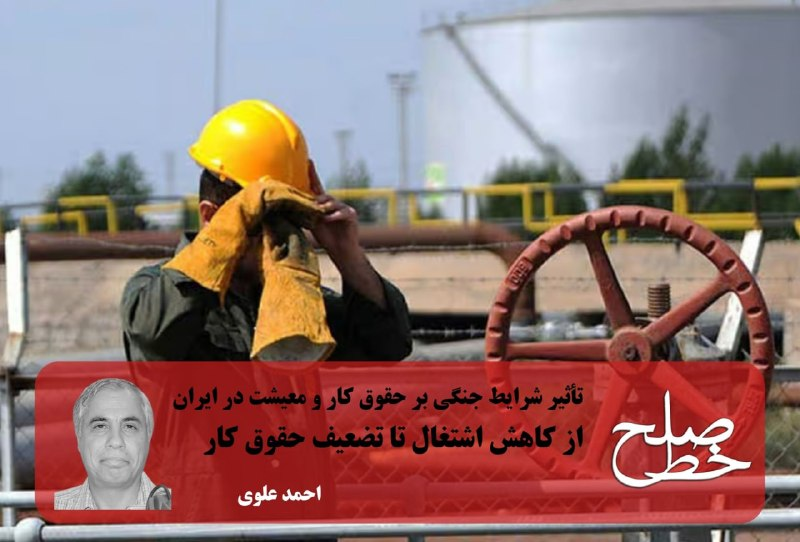

تأثیر شرایط جنگی بر حقوق کار و معیشت در ایران/ #احمد_علوی

📡
📡
📡
📡
📡 – جنگ‌ها در اقتصاد مدرن، دیگر صرفاً رویدادهایی نظامی نیستند، بلکه پدیده‌هایی چندبعدی‌اند که ساختارهای اقتصادی، اجتماعی و نهادی را به‌طور هم‌زمان تحت تاثیر قرار می‌دهند. در مورد ایران کنونی، در سال ۱۴۰۵، این ویژگی به‌وضوح قابل مشاهده است؛ جایی که اقتصاد پیشاپیش با عدم تعادل‌های مزمن مواجه بوده و جنگ به‌عنوان یک «شوک تشدیدکننده» عمل کرده است.

در چنین شرایطی، #بازار_کار به‌عنوان یکی از حساس‌ترین نهادهای اقتصادی، به سرعت واکنش نشان می‌دهد. کاهش اشتغال، افزایش #بیکاری_پنهان، خروج نیروی کار از بازار و تغییر در کیفیت اشتغال، همگی نشانه‌هایی از یک اختلال عمیق هستند. اما آن‌چه این وضعیت را پیچیده‌تر می‌کند، تلاقی آن با ساختار حقوقی و نهادی خاص بازار کار ایران است؛ جایی که قوانین، امکان تعلیق قراردادها را فراهم می‌کنند اما سازوکارهای حمایتی متناسب با آن توسعه نیافته‌اند.

از این رو، مسئله صرفاً «از دست رفتن شغل» نیست، بلکه ظهور یک وضعیت جدید است که می‌توان آن را «ناپایداری نهادی در بازار کار» نامید؛ وضعیتی که در آن، نه اشتغال پایدار وجود دارد و نه بیکاری به‌طور کامل شناسایی و جبران می‌شود. این گزارش تلاش می‌کند این وضعیت را از منظر نظری و تجربی واکاوی کند.

ادامه مطلب

ادامه مطلب در وب‌سایت خط صلح

↘️
@hranews_bot تماس ✉️ -  @Hranews  کانال هرانا 🆑

## configx2ray — post 38660

هرچیزی که رایگانه براتون وصله رو دایرکت چنل بفرستید تا متود برداری کنیم و از روش سرور بسازیم بزاریم چنل استفادع کنید فقط رایگان هارو بفرستید دمتون گرم دایرکت چنل : http://t.me/ConfigX2ray?direct

## configx2ray — post 38659

هرچیزی که رایگانه براتون وصله رو دایرکت چنل بفرستید تا متود برداری کنیم و از روش سرور بسازیم بزاریم چنل استفادع کنید

فقط رایگان هارو بفرستید دمتون گرم
دایرکت چنل :
http://t.me/ConfigX2ray?direct

## manototv — post 105156

  <a href="telegram/content/manototv_105156_1778263067.mp4">🎬 Download video</a>

‌
خبرگزاری حکومتی تسنیم به نقل از یک منبع نظامی گزارش داد درگیری‌ها در خلیج فارس فعلاً متوقف شده، اما احتمال آغاز مجدد آن همچنان وجود دارد.

این منبع مدعی شد پس از «اقدام خصمانه» آمریکا علیه نفتکش‌های ایران، نیروی دریایی جمهوری اسلامی با حملات خود به آن پاسخ داده و پس از مدتی تبادل آتش، درگیری‌ها متوقف شده است.

این منبع گفت در حال حاضر شرایط در منطقه آرام است، اما تهدید کرد «در صورت ورود دوباره نیروهای آمریکایی به خلیج فارس یا ایجاد مزاحمت برای شناورهای ایرانی، پاسخ قاطع داده خواهد شد.»

## manototv — post 105155

  <a href="telegram/content/manototv_105155_1778263068.mp4">🎬 Download video</a>

‌
هم‌زمان با زادروز جاویدنام احمد خسروانی، جان‌باخته اعتراضات دی‌ماه ۱۴۰۴، ویدیویی از حضور بر مزار او و رها کردن پرندگان در فضای مجازی منتشر شده است.

در این ویدیو، پریسا آقامحمدی، خواهر دادخواه پرهام آقامحمدی، جاویدنام اعتراضات دی‌ماه، با اشاره به دوستی این دو نوشته است: «امروز تولد احمد خسروانی بود… پرنده برای پرواز.»

احمد خسروانی، بسکتبالیست ۲۱ ساله و دانشجوی دانشگاه صنعتی شریف، روز ۱۹ دی‌ماه ۱۴۰۴ در جریان اعتراضات مردمی با شلیک مستقیم نیروهای امنیتی کشته شد.

او پیش‌تر با تیم «فرزان شمیران» عنوان قهرمانی مسابقات بسکتبال سه‌نفره تهران را کسب کرده و به‌عنوان برترین بازیکن لیگ تهران در سال ۱۴۰۴ انتخاب شده بود.

## manototv — post 105154

  <a href="telegram/content/manototv_105154_1778263070.mp4">🎬 Download video</a>

اکسویس گزارش داد جی‌دی ونس، معاون رئیس‌جمهوری ایالات متحده آمریکا، در دیدار با نخست‌وزیر قطر درباره مذاکرات با جمهوری اسلامی گفت‌وگو کرده است.

به‌گزارش آکسیوس، این دیدار با محوریت تلاش‌های دیپلماتیک برای پیشبرد مذاکرات انجام شده، اما جزئیات بیشتری از آن منتشر نشده است.

گزارش‌ها حاکی است اطلاعات تکمیلی درباره این دیدار هنوز منتشر نشده و انتظار می‌رود جزئیات بیشتری در ادامه اعلام شود.

## manototv — post 105153

  <a href="telegram/content/manototv_105153_1778263071.mp4">🎬 Download video</a>

سنتکام، اعلام کرد نیروهای آمریکایی دو نفتکش ایرانی به نام‌های «سی استار ۳» و «سوِودا» را پیش از ورود به بنادر ایران در دریای عمان از حرکت بازداشته‌اند.
به گفته سنتکام، جنگنده‌های مستقر روی ناو هواپیمابر «جورج اچ. دبلیو. بوش» با شلیک به دودکش این نفتکش‌ها، مانع ادامه حرکت آن‌ها شده‌اند.
آمریکا همچنین اعلام کرد نفتکش «حسنا» نیز روز ۶ مه توسط جنگنده‌ای از ناو «آبراهام لینکلن» هدف قرار گرفته و سکان آن از کار افتاده است.
سنتکام تأکید کرده این اقدامات در چارچوب اجرای محاصره دریایی علیه ایران انجام شده و هر سه نفتکش اکنون «دیگر در مسیر ایران نیستند.»

## alonews — post 118728

  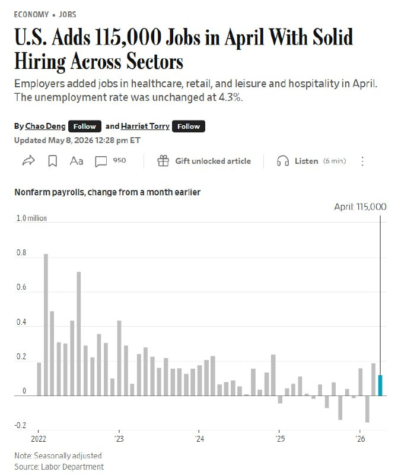

👈گزارش اشتغال ایالات متحده برای ماه آوریل «فراتر از انتظارات بود»، با افزوده شدن ۱۱۵٬۰۰۰ شغل، که از افزایش ۵۵٬۰۰۰ شغلی پیش‌بینی‌شده توسط اقتصاددانان پیشی گرفت، گزارش وال استریت ژورنال.

🔴 نرخ بیکاری بدون تغییر باقی مانده است

✅ @AloNews خبر جنگ

## alonews — post 118727

  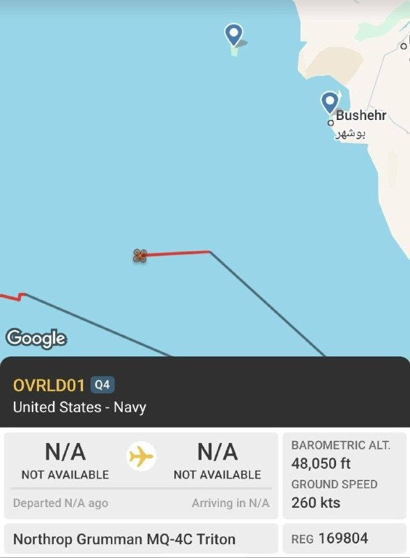

👈هم اکنون یک پهپاد آمریکایی درحال رصد سواحل ایران است

✅ @AloNews خبر جنگ

## alonews — post 118726

  <a href="telegram/content/alonews_118726_1778263073.jpg">🎬 Download video</a>

👈وزارت امور خارجه ایالات متحده: لبنان و اسرائیل متعهد شده‌اند که بر اساس منافع مربوطه خود وارد گفتگو شوند و ما برای آشتی دادن آنها تلاش خواهیم کرد.

✅ @AloNews خبر جنگ

## alonews — post 118725

  <a href="telegram/content/alonews_118725_1778263073.jpg">🎬 Download video</a>

👈بقایی، سخنگوی وزارت‌خارجه: پاسخ ایران به پیشنهاد آمریکایی‌ها در دست بررسیه و در زمان خودش براشون ارسال میشه. ضرب‌الاجل آمریکایی‌ها؟ برامون مهم نیست و کار خودمونو میکنیم.

✅ @AloNews خبر جنگ

## alonews — post 118724

  

👈آواکس"Boeing E-3 Sentry" تو شرق عربستان نزدیک قطر دیده شد؛برای فرماندهی و کنترل نبرد هوایی استفاده می‌شه!

✅ @AloNews خبر جنگ

## alonews — post 118723

  <a href="telegram/content/alonews_118723_1778263074.jpg">🎬 Download video</a>

👈فرماندهی مرکزی ایالات متحده: از امروز، نیروهای سنتکام ۵۷ کشتی تجاری را تغییر مسیر داده و ۴ کشتی را غیرفعال کرده‌اند تا از ورود یا خروج آنها از بنادر ایران جلوگیری کنند.

✅ @AloNews خبر جنگ

## alonews — post 118722

  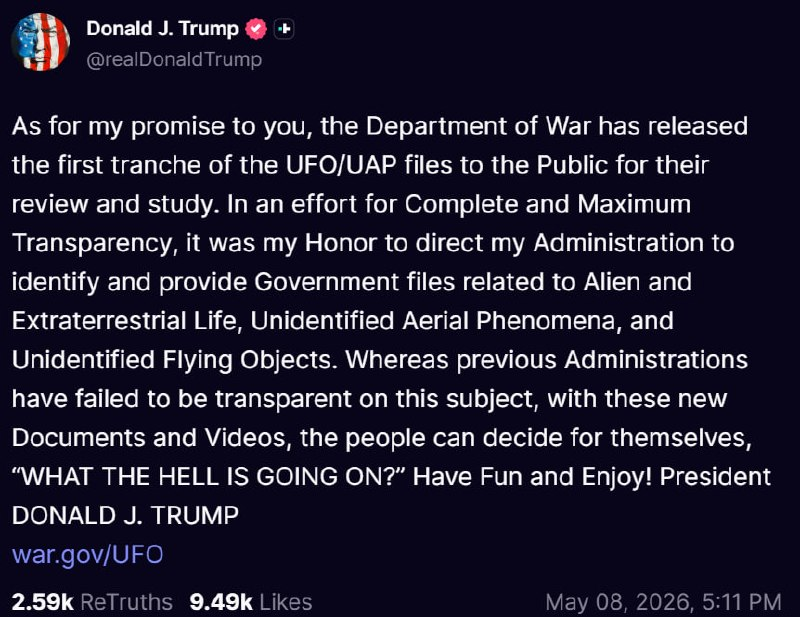

👈 ترامپ از طریق Truth Social:
در مورد وعده‌ام به شما، وزارت جنگ اولین بخش از پرونده‌های UFO/UAP را برای بررسی و مطالعه عمومی منتشر کرده است. در تلاشی برای شفافیت کامل و حداکثری، افتخار من بود که دستور دهم دولت من پرونده‌های دولتی مرتبط با زندگی بیگانه و فرازمینی، پدیده‌های هوایی ناشناس و اشیاء پرنده ناشناس را شناسایی و ارائه کند.

🔴در حالی که دولت‌های قبلی در این موضوع شفاف نبوده‌اند، با این اسناد و ویدیوهای جدید، مردم می‌توانند خودشان تصمیم بگیرند، «چه خبره؟» خوش بگذرانید و لذت ببرید!

✅ @AloNews خبر جنگ

## alonews — post 118721

  <a href="telegram/content/alonews_118721_1778263076.jpg">🎬 Download video</a>

👈سفیر ایران در آلمان : اگر اروپا نگران هرمزه، آمریکا رو مهار کنه

✅ @AloNews خبر جنگ

## alonews — post 118720

  <a href="telegram/content/alonews_118720_1778263076.jpg">🎬 Download video</a>

👈جی‌پی مورگان: «رسیدن قیمت بنزین به ۵ دلار در هر گالن دیگر قابل رد کردن نیست»

🔴بر اساس گزارش تحلیلگران جی‌پی مورگان، قیمت بنزین در ایالات متحده شانس جدی دارد که به ۵ دلار در هر گالن برسد، چرا که پالایشگاه‌ها اولویت را به تولید سوخت هواپیما می‌دهند و سایر فرآورده‌ها را در اولویت بعدی قرار می‌دهند.

✅ @AloNews خبر جنگ

## alonews — post 118719

  <a href="telegram/content/alonews_118719_1778263076.jpg">🎬 Download video</a>

👈 نیویورک‌ تایمز: تلاش پاکستانی‌ها برای میانجی‌گری بین آمریکا و ایران، باعث تیره‌شدن روابط ابوظبی و اسلام‌آباد شده است امارات به‌همین دلیل درحال اخراج کارگران شیعه پاکستانی است.

✅ @AloNews خبر جنگ

## alonews — post 118718

  <a href="telegram/content/alonews_118718_1778263076.jpg">🎬 Download video</a>

👈وال‌استریت‌ژورنال: طبق نظرسنجی گلدمن ساکس، سرمایه‌گذاران وال‌استریت انتظار دارند که بسته‌بودن تنگهٔ هرمز حداقل تا پایان ماه جولای (۱۰ مرداد) تداوم داشته باشد.

✅ @AloNews خبر جنگ

## alonews — post 118717

  <a href="telegram/content/alonews_118717_1778263077.jpg">🎬 Download video</a>

👈بلومبرگ: تنگه هرمز همچنان عملاً بسته است و از سه‌شنبه هیچ تردد کشتی به داخل یا خارج از آن ثبت نشده است.

✅ @AloNews خبر جنگ

## alonews — post 118716

اینترنت پرو روی سیم‌کارت شما 
🤘

دوستانی که میخوان اینترنت پرو رو روی خطشون فعال کنن میتونن از طریق عمو میرزا اقدام کنن و اشتراک 50 گیگ رو خریداری کنن 
🫨

همراه با درگاه پرداخت ریالی و ارزی 
✅

با میرزامتصل 
😘
به دنیای اینترنت آزاد دسترسی پیدا کنن 
🤑

https://t.me/+pxtiVpJWgdY4MzI0
https://t.me/+pxtiVpJWgdY4MzI0
https://t.me/+pxtiVpJWgdY4MzI0

## alonews — post 118715

  <a href="telegram/content/alonews_118715_1778263077.mp4">🎬 Download video</a>

👈دونالد ترامپ: «کارتل‌ها، آنها فقط حکومت می‌کنند، ما سالانه ۲۰۰هزار نفر را به خاطر این مواد مخدر که به کشورمان سرازیر می‌شود، از دست می‌دهیم. بنابراین ما کار دریا، یعنی اقیانوس‌ها، آبراه‌ها، را ۹۷٪ تمام کرده‌ایم و خیلی زود کار خشکی را هم تمام خواهیم کرد.»

✅ @AloNews خبر جنگ

## alonews — post 118714

  <a href="telegram/content/alonews_118714_1778263079.mp4">🎬 Download video</a>

👈ترامپ : قیمت داروها رو 90 درصد آوردیم پایین،البته اگه بخوای یه‌جوری بگی، میشه گفت 500٪ یا 600٪ هم کم شده!

✅ @AloNews خبر جنگ

## alonews — post 118713

  <a href="telegram/content/alonews_118713_1778263082.jpg">🎬 Download video</a>

👈ترامپ در مورد کاخ سفید: قبلا این باغ پر از لجن بود و سنگاش شکسته بود نمیشد راه رفت ولی من درستش کردم و سنگ گرانیت کار گذاشتم

🔴این باغ رزی که توشیم قبلا رز نداشت فقط علف بود ولی من پر از رز کردمش

✅ @AloNews خبر جنگ

## alonews — post 118712

  <a href="telegram/content/alonews_118712_1778263082.mp4">🎬 Download video</a>

👈ترامپ : من بهشون میگم مرزهای احمقانه،کار آدمای احمقیه که اونا رو اونجا گذاشتن

🔴 ما مانع عبور هزاران نفر مهاجر کصخل از مرز خودمون شدیم

✅ @AloNews خبر جنگ

## alonews — post 118711

  <a href="telegram/content/alonews_118711_1778263084.mp4">🎬 Download video</a>

👈ترامپ به یاد مادرش : من مادری فوق‌العاده داشتم،روز مادر یکی از بزرگ‌ترین روزهاست که میشه گفت ..

✅ @AloNews خبر جنگ

## alonews — post 118710

  <a href="telegram/content/alonews_118710_1778263086.mp4">🎬 Download video</a>

👈ترامپ : ما عکس‌های رئیس‌جمهورها رو از جورج واشنگتن تا یه نفر به اسم ترامپ اضافه کردیم

🔴 مردم واقعاً خیلی خوششون اومده،ما بهش می‌گیم پیاده‌روی مشاهیر ریاست‌جمهوری

✅ @AloNews خبر جنگ

## alonews — post 118709

  <a href="telegram/content/alonews_118709_1778263089.mp4">🎬 Download video</a>

👈حزب الله با پهپاد FPV خودروی زرهی نامر اسرائیل رو مورد اصابت قرار داد

✅ @AloNews خبر جنگ

---
📅 بروزرسانی: 1405/02/18 19:57
---

## VahidOOnLine — post 238935

  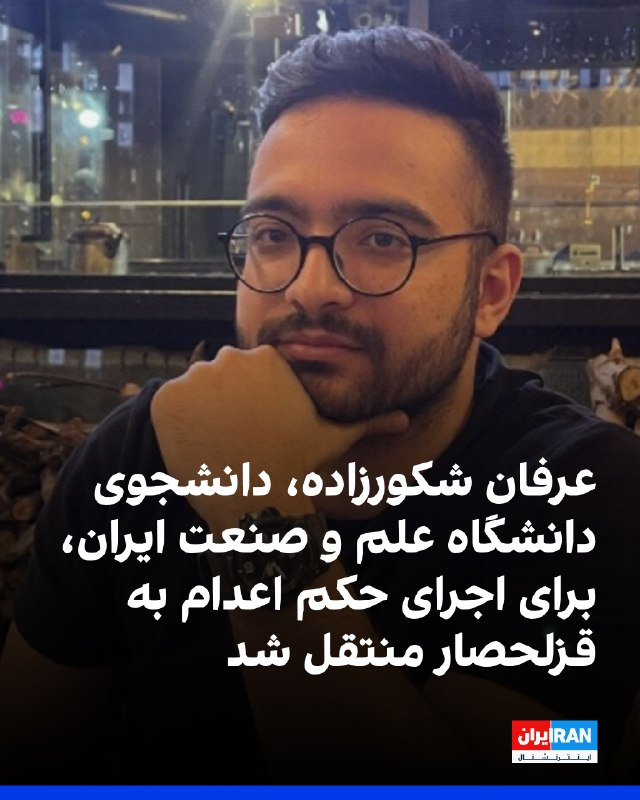

آموزشکده توانا گزارش داد عرفان شکورزاده، دانشجوی دانشگاه علم و صنعت ایران، برای اجرای حکم اعدام از زندان اوین به زندان قزلحصار منتقل شده است.

بر اساس این گزارش، عرفان شکورزاده بهمن‌ماه ۱۴۰۳ از سوی اطلاعات سپاه با اتهام «جاسوسی و همکاری با کشورهای متخاصم» بازداشت و به اعدام محکوم شد و حکم صادرشده علیه او به‌تازگی در دیوان عالی کشور تایید شده است.
‌🏁 🇬🇧 IranintlTV

🤖 @VahidOOnLine

## VahidOOnLine — post 238934

  

خبرگزاری تسنیم، وابسته به سپاه، به نقل از یک منبع نظامی نوشت که پس از اقدام نیروهای آمریکایی علیه نفتکش‌های ایران، نیروهای دریایی جمهوری اسلامی با آتش حملات خود به «نقض آتش‌بس آمریکا» پاسخ داد و پس از مدتی تبادل آتش، اکنون درگیری‌ها متوقف شده و فضا آرام است.

رسانه وابسته به سپاه افزود: «اگر مجددا آمریکایی‌ها قصد ورود به خلیج فارس را داشته باشند و یا برای شناورهای ایرانی مزاحمتی ایجاد کنند، مجددا پاسخ قاطع دریافت خواهند کرد. بنابراین احتمال ورود مجدد به درگیری‌هایی از این قبیل در این منطقه همچنان وجود دارد.»
‌🏁 🇬🇧 IranintlTV

🤖 @VahidOOnLine

## VahidOOnLine — post 238933

  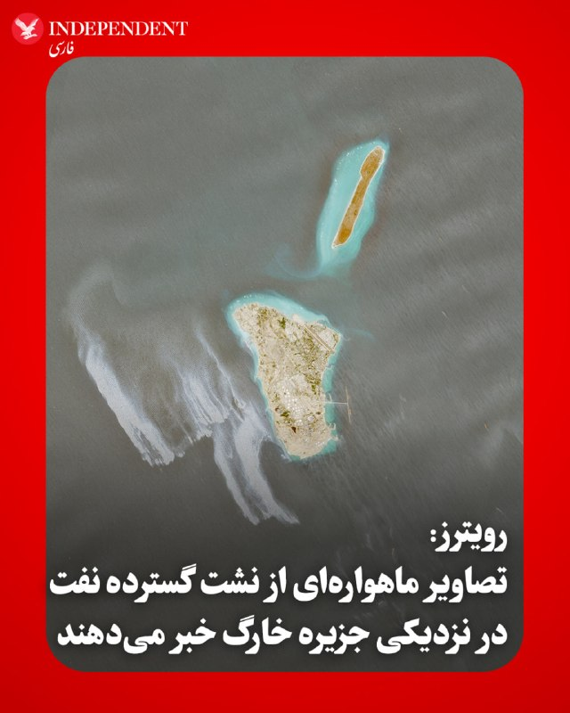

♦️ تصاویر ماهواره‌ای که بین ۶ تا ۸ می (۱۶ تا ۱۸ اردیبهشت) ثبت شده‌اند، از وقوع یک نشت نفت گسترده در نزدیکی جزیره خارگ، اصلی‌ترین پایانه صادرات نفت ایران، خبر می‌دهند. این لکه نفتی که در تصاویر ماهواره‌های کوپرنیک به‌صورت توده‌ای خاکستری و سفید دیده می‌شود، منطقه‌ای به وسعت تقریبی ۴۵ تا ۹۵ کیلومتر مربع را در غرب این جزیره پوشانده است.

لوییس گودارد، از موسسه تحلیلی «دیتا دسک»، این حادثه را احتمالا بزرگ‌ترین نشت نفتی از زمان آغاز جنگ اخیر توصیف کرده است. لئون مورلند، پژوهشگر رصدخانه درگیری و محیط‌زیست (CEOBS)، نیز تاکید کرد که ماهیت لکه با نفت کاملا همخوانی دارد، هرچند منشا دقیق و علت وقوع آن هنوز مشخص نیست.

جزیره خارگ که مرکز صادرات ۹۰ درصد نفت ایران است، در جریان این جنگ هدف حملات نیروهای آمریکایی قرار گرفته و اکنون تحت محاصره دریایی شدید قرار دارد. در حالی که نیروهای نظامی آمریکا و نمایندگی جمهوری اسلامی در سازمان ملل هنوز واکنشی به این تصاویر نشان نداده‌اند، کارشناسان هشدار می‌دهند که تداوم این وضعیت می‌تواند منجر به یک فاجعه زیست‌محیطی بی‌سابقه در زیست‌بوم حساس خلیج‌فارس شود.
‌🇸🇦 Indypersian

🤖 @VahidOOnLine

## VahidOOnLine — post 238932

  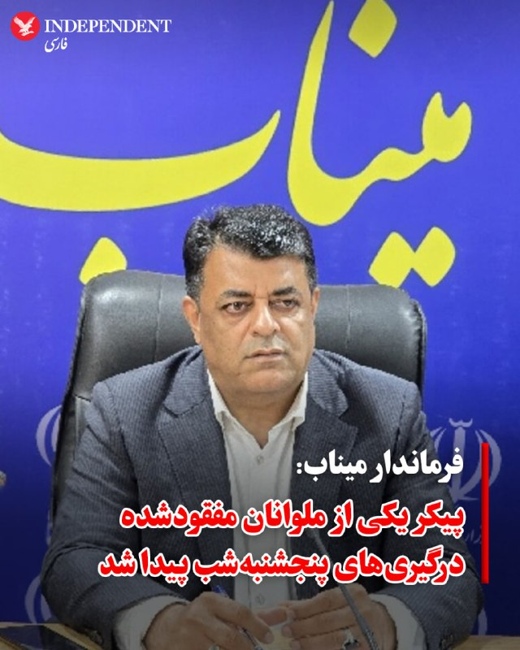

♦️ محمد رادمهر، فرماندار میناب در استان هرمزگان، اعلام کرد که نیروهای امدادی موفق شدند پیکر یکی از پنج ملوانی را که در پی حمله شبانه ایالات متحده به شناور ایرانی در محدوده تنگه هرمز مفقود شده بودند، پیدا کنند.

خبرگزاری مهر به نقل از رادمهر گزارش داد که تیم‌های جست‌وجو و نجات همچنان در تلاش برای یافتن چهار ملوان دیگر هستند که سرنوشت آن‌ها نامشخص است. پیش از این نیز فرماندار میناب تایید کرده بود که در جریان درگیری‌های پنجشنبه‌شب، ۱۰ ملوان دیگر مجروح و به مراکز درمانی منتقل شده‌اند.
‌🇸🇦 Indypersian

🤖 @VahidOOnLine

## VahidOOnLine — post 238931

  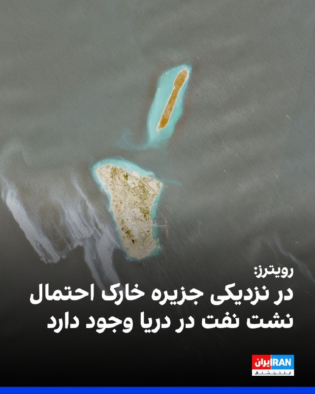

رویترز گزارش داد که بر اساس تصاویر ماهواره‌ای، در نزدیکی جزیره خارک، یکی از مراکز اصلی نفتی ایران، احتمال نشت نفت در دریا وجود دارد. در این تصاویر که بین ۱۶ تا ۱۸ اردیبهشت توسط ماهواره‌های کاپرنیکوس ثبت شده، لکه‌ای خاکستری و سفید در آب‌های غرب این جزیره دیده می‌شود.

پژوهشگر «رصدخانه منازعه و محیط زیست» گفته است که این لکه از نظر ظاهری با نفت مطابقت دارد و حدود ۴۵ کیلومتر مربع از سطح دریا را پوشش می‌دهد.
‌🏁 🇬🇧 IranintlTV

🤖 @VahidOOnLine

## VahidOOnLine — post 238930

♦️بر اساس گزارش رویترز، ارتش ایالات متحده ویدیویی به تازگی از اجرای محاصره دریایی در منطقه خلیج فارس منتشر کرد؛ هم‌زمان با آن، درگیری‌هایی میان نیروهای آمریکایی و ایران گزارش شده که آتش‌بس یک‌ماهه را با خطر جدی مواجه کرده است.
دونالد ترامپ اعلام کرد سه ناوشکن آمریکایی در جریان عبور از تنگه هرمز هدف حمله قرار گرفته‌اند. فرماندهی مرکزی ارتش آمریکا (سنتکام) نیز گفت ایران با موشک، پهپاد و قایق‌های تندرو به این شناورها که در حال حرکت به سمت دریای عمان بودند، حمله کرده است.
در مقابل، ستاد کل نیروهای مسلح ایران آمریکا را به نقض آتش‌بس متهم کرده و اعلام کرده است که واشنگتن با هدف قرار دادن یک نفتکش ایرانی و حمله به مناطق غیرنظامی در جزیره قشم و سواحل اطراف، آغازگر تنش بوده است.
مقام‌های ایرانی همچنین مدعی شدند در پاسخ به این اقدامات، شناورهای نظامی آمریکا در شرق تنگه هرمز و جنوب بندر چابهار را هدف قرار داده‌اند.
این تحولات در حالی رخ می‌دهد که تنگه هرمز، به‌عنوان یکی از مهم‌ترین مسیرهای انتقال انرژی جهان، همچنان در وضعیت پرتنش قرار دارد و امیدها برای حل دیپلماتیک بحران کاهش یافته است.
‌🇸🇦 Indypersian

🤖 @VahidOOnLine

## VahidOOnLine — post 238929

  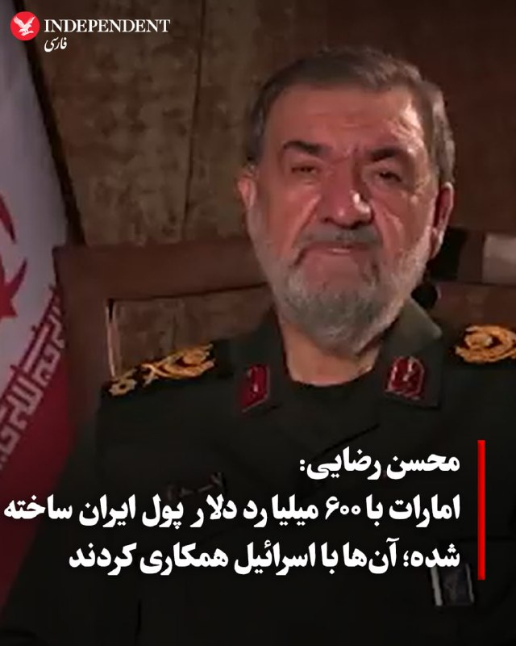

♦️ محسن رضایی، عضو مجمع تشخیص مصلحت نظام، در گفتگو با تلویزیون المیادین، اقدامات دولت امارات متحده عربی در قبال ایران را «مشکوک» توصیف کرد و این کشور را متهم کرد که در جریان جنگ اخیر، «جاسوس‌های اسرائیلی» را به جزایر ایرانی در خلیج فارس منتقل کرده است.

رضایی با اشاره به جنگ ایران و عراق و سرمایه‌گذاری‌های خارجی جمهوری اسلامی در امارات که بعد از پایان این جنگ انجام شد، گفت: «کشورهای خلیج فارس هشت سال از صدام حمایت کردند. آیا پس از پایان جنگ ما از آن‌ها انتقام گرفتیم یا به‌دنبال انتقام بودیم؟ نه بر عکس، ملت‌های منطقه باید بدانند که بیش از ۶۰۰ میلیارد دلار پول ایران به کشورهای منطقه، به دبی و ابوظبی، چه برای سرمایه‌گذاری و چه برای تجارت رفته است.»

رضایی در ادامه با اشاره به حادثه حمله موشکی به سفارت آمریکا در عربستان سعودی در جریان جنگ، با تاکید بر این‌که جمهوری اسلامی نقشی در این حمله نداشته، امارات را متهم کر دکه از طریق انتقال «جاسوس‌های اسرائیلی» به جزایر ایران، در این حمله نقش داشته است.
‌🇸🇦 Indypersian

🤖 @VahidOOnLine

## VahidOOnLine — post 238928

  <a href="telegram/content/VahidOOnLine_238928_1778257653.mp4">🎬 Download video</a>

رویترز گزارش داده تصاویر ماهواره‌ای این هفته نشان داده‌اند که یک لکه نفتی مشکوک، بخش وسیعی از دریا در نزدیکی جزیره خارک؛ بزرگ‌ترین پایانه صادرات نفت کشور را پوشانده است.
در گزارش رویترز آمده این لکه که به رنگ خاکستری و سفید در تصاویر دیده می‌شود، در فاصله غربی جزیره خارک (به طول حدود ۸ کیلومتر) در بازه زمانی ۶ تا ۸ مه توسط ماهواره‌های اروپایی کوپرنیکوس ثبت شده است.
پژوهشگران محیط‌زیست می‌گویند این لکه «از نظر بصری کاملاً شبیه نفت» است و تخمین زده می‌شود حدود ۴۵ کیلومتر مربع از سطح دریا را پوشانده باشد. به گفته کارشناسان، این می‌تواند بزرگ‌ترین نشت نفتی از زمان آغاز جنگ آمریکا و اسرائیل با ایران در ۷۰ روز گذشته باشد.
با این حال، علت دقیق این نشت و منبع آن هنوز مشخص نیست. تصاویر روز ۸ مه نیز نشانه‌ای از نشت فعال جدید نشان نداده‌اند.
جزیره خارک که حدود ۹۰ درصد صادرات نفت ایران از آن انجام می‌شود، یکی از نقاط کلیدی صنعت نفت کشور است و بخش عمده نفت آن به مقصد چین صادر می‌شود.
در گزارش آمده است که در جریان جنگ اخیر، حملاتی نیز به اهداف نظامی در این منطقه انجام شده و تنش‌های دریایی در خلیج فارس افزایش یافته است. همچنین حضور گسترده نیروهای دریایی و درگیری‌های پراکنده، باعث اختلال گسترده در مسیرهای کشتیرانی و بازار جهانی نفت شده است.
‌🏁 🇬🇧 ManotoTV

🤖 @VahidOOnLine

## VahidOOnLine — post 238927

  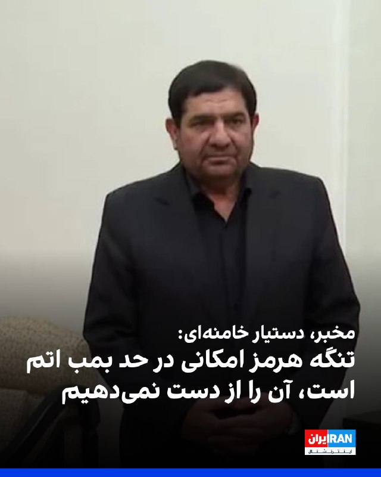

محمد مخبر، مشاور و دستیار رهبر جمهوری اسلامی، گفت: «تنگه هرمز یک امکانی است در حد بمب اتم. یعنی وقتی یک جایی دست شما باشد که با یک تصمیم کل اقتصاد دنیا را متاثر کنید، امکان بسیار بسیار بزرگی است. چیزی که با این جنگ به دست آوردیم را به هیچ وجه از دست نخواهیم داد.»
‌🏁 🇬🇧 IranintlTV

🤖 @VahidOOnLine

## VahidOOnLine — post 238926

  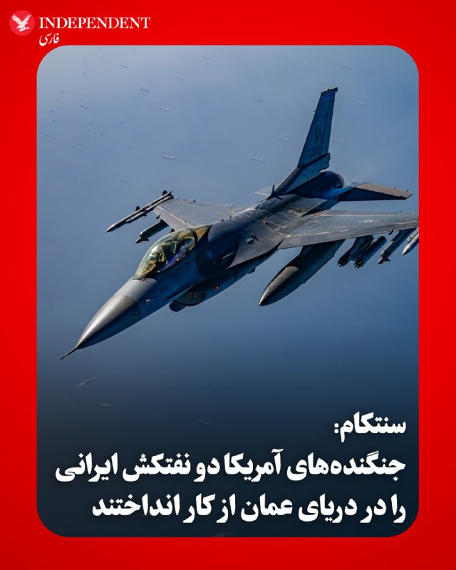

♦️ فرماندهی مرکزی ایالات متحده (سنتکام) اعلام کرد که در راستای اجرای محاصره دریایی ایران، نیروهای آمریکایی طی دو عملیات جداگانه، سه نفتکش با پرچم ایران را که قصد ورود به بنادر این کشور در دریای عمان را داشتند، از کار انداخته‌اند.

در آخرین اقدام در تاریخ ۱۸ اردیبهشت، یک جنگنده F/A-18 سوپر هورنت برخاسته از ناو هواپیمابر «جورج اچ.دبلیو. بوش»، با شلیک مهمات دقیق به دودکش نفتکش‌های «سی استار ۳» (Sea Star III) و «سودا» (Sevda)، آن‌ها را از کار انداخت و مانع ورود این کشتی‌های خالی از بار به بنادر ایران شد. همچنین در ۱۶ اردیبهشت، جنگنده‌ای از ناو «آبراهام لینکلن» با شلیک توپ ۲۰ میلی‌متری، سکان نفتکش «حسنا» (Hasna) را هدف قرار داد و آن را متوقف کرد.

دریادار برد کوپر، فرمانده سنتکام، با تاکید بر پایبندی نیروهای آمریکایی به اجرای کامل محاصره، اعلام کرد که این سه شناور دیگر به سمت ایران در حرکت نیستند. طبق بیانیه سنتکام، تاکنون چندین کشتی تجاری توسط نیروهای آمریکایی از کار افتاده و بیش از ۵۰ فروند دیگر نیز تغییر مسیر داده شده‌اند.
‌🇸🇦 Indypersian

🤖 @VahidOOnLine

## mwarmonitor — post 8715

🔴«رویدادهای جاری در تنگه هرمز مانع از ادامه مذاکرات نشده‌اند و گفته می‌شود پاسخ ایران به پیشنهاد آمریکا به‌زودی از طریق پاکستان ارسال خواهد شد.» الجزیره

@mwarmonitor

## mwarmonitor — post 8714

...ما باید به اسرائیلی‌ها اجازه دهیم تا اقدام کنند. آن‌ها برنامه بمباران بسیار جامعی دارند که قرار است اجرا کنند؛ برنامه‌ای که شامل رهبری، انرژی و تمام سیستم‌های تسلیحاتی (ایران) می‌شود که هنوز باید با آن‌ها روبرو شویم. به یاد داشته باشید، همانطور که از ابتدا…

## mwarmonitor — post 8713

📌بخش اول: صحبت‌های دونالد ترامپ دونالد ترامپ: "ناوشکن‌ها و آمریکایی‌ها به هیچ وجه آسیب ندیدند... مردم آسیب ندیدند، اما آن‌ها به سمت ما شلیک می‌کردند و ما هم متقابلاً به سمت آن‌ها شلیک کردیم. قدرت آتش ما به مراتب قوی‌تر از آن‌ها بود و حسابی از خجالت‌شان درآمدیم…

## mwarmonitor — post 8712

📌بخش اول: صحبت‌های دونالد ترامپ
دونالد ترامپ:
"ناوشکن‌ها و آمریکایی‌ها به هیچ وجه آسیب ندیدند... مردم آسیب ندیدند، اما آن‌ها به سمت ما شلیک می‌کردند و ما هم متقابلاً به سمت آن‌ها شلیک کردیم. قدرت آتش ما به مراتب قوی‌تر از آن‌ها بود و حسابی از خجالت‌شان درآمدیم (آن‌ها را درهم کوبیدیم)."
📌بخش دوم: گزارشگر فاکس نیوز
گزارشگر:
"بسیار خب، نیروهای آمریکایی در تنگه هرمز پاسخ حملات ایران را دادند. درست پس از آنکه دیروز سه ناو جنگی نیروی دریایی ما هدف قرار گرفتند. مقامات به شبکه فاکس گفتند که این درگیری به معنای شروع مجدد جنگ نیست و همچنین به معنای پایان آتش‌بس هم نیست."
"تهران همچنان در حال بررسی پیشنهاد صلح است، در حالی که گزارش‌ها حاکی از آن است که دولت ترامپ به دنبال راه‌اندازی مجددِ به اصطلاح «پروژه آزادی» است. یادتان هست؟ قرار بود سمتِ عمانیِ تنگه را تحت کنترل بگیریم؛ تمام این‌ها در حالی است که طبق گزارش‌ها، اطلاعات آمریکا معتقد است ایران می‌تواند ماه‌ها در برابر محاصره آمریکا دوام بیاورد چون از پسِ تأمین نیازهای خود برمی‌آیند. این‌ها طبق گفته‌های سیا (CIA) است."

📌بخش سوم: گفتگو با ژنرال جک کین
گزارشگر:
"برای بحث در این باره، ژنرال بازنشسته چهار ستاره، تحلیلگر ارشد استراتژیک فاکس نیوز و رئیس مؤسسه مطالعات جنگ، ژنرال جک کین همراه ماست. ژنرال، شما کاملاً با راه‌اندازی مجدد «عملیات آزادی» موافق هستید، درست است؟"
🔴ژنرال جک کین:
"بله، قطعاً. اول از همه اجازه دهید کمی به عقب برگردیم و ببینیم کجا هستیم. باید به پرزیدنت ترامپ بابت شروع این عملیات اعتبار داد. پس از ۷ اکتبر، زمانی که اسرائیلی‌ها به وضوح مورد حمله ویرانگری قرار گرفتند، این تشخیص به وجود آمد که این منطقه باید تغییر کند و ما مجبوریم این تغییر را تحمیل کنیم و ایران پشت تمام اتفاقاتی است که در آنجا می‌افتد. این رئیس‌جمهور بر اساس آن عمل کرد، در حالی که رؤسای جمهور دیگر – هرچند اعتراف می‌کنم تهدید به اندازه الان بد نبود – اما عمدتاً آن را نادیده گرفتند. پس این نکته اول."
"نکته دوم، ما حدود یک ماه پیش به یک آتش‌بس رسیدیم. از دیدگاه ایرانی‌ها، این همان چیزی بود که می‌خواستند به آن برسند: متوقف کردن جنگ. و قرار بود طی چند هفته به یک توافق مذاکره‌شده برسیم، اما این اتفاق نیفتاد. آن‌ها عمداً در حال طولانی کردن این روند هستند. الان یک ماه گذشته و ما هنوز دستاورد چندانی نداریم. فکر می‌کنم احتمال رسیدن به یک توافق خوب، اندک است."
"و حتی اگر به توافقی برسیم، مشکل هر توافقی که انجام دهیم – با فرض اینکه تمام اهداف ما را برآورده کند – این است که برای رسیدن به آن، باید منابع مالی در اختیار ایرانی‌ها قرار دهیم (البته مشروط) و همچنین تحریم‌ها را کاهش دهیم. پس وقتی از دور به ماجرا نگاه می‌کنید، حتی پس از یک توافق مذاکره‌شده، چه چیزی داریم؟ رژیمی داریم که زنده مانده و توانایی بازسازی خود را دارد. و من فکر می‌کنم این اساساً اشتباه است."
"این هدفی نبود که ما این عملیات را برای رسیدن به آن شروع کردیم. ما می‌خواهیم ایران به زانو دربیاید، به شدت آسیب ببیند و در برابر مقاومت مردم خودش و فشارهای داخلی آسیب‌پذیر شود. بنابراین، به نظر من، باید واقعیت را همان‌طور که هست ببینیم. ما باید برگردیم و «پروژه آزادی» را اجرا کنیم، تنگه هرمز را از ایرانی‌ها بگیریم، امنیت آن را تأمین کنیم و آن را برای کشتیرانی باز نگه داریم... و همچنین در مقطعی برای انجام این کار کمک بگیریم. و بعد از آن، باید دست اسرائیلی‌ها را باز بگذاریم..."

@mwarmonitor

## mwarmonitor — post 8710

## mwarmonitor — post 8709

🔴سپاه پاسداران انقلاب اسلامی (IRGC) از طریق رادیو پیامی برای شناورها ارسال کرده و به آن‌ها توصیه کرده است که برای «امنیت خود» ۱۰ مایل از ناوهای جنگی آمریکا فاصله بگیرند، «زیرا گاهی لازم است به یانکی‌ها با موشک‌ها و پهپادها درس داده شود» - CNN

@mwarmonitor

## mwarmonitor — post 8708

  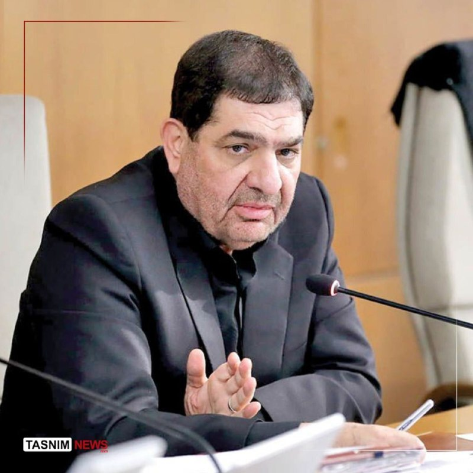

📝بامزیِ قصه‌ی ما که ظاهراً دُز عسلِ قدرتش بالا زده، با همان چشمان خمار و ژستِ «فیلسوفِ کوچه بن‌بست»، دوباره پشت میکروفون رفته تا دنیا را با پوشک گره بزند. جناب مخبر مدعی شده تنگه هرمز مثل بمب اتم است؛ احتمالا به این دلیل که هر دو مورد در دستان مدیریتِ فاجعه‌بار ایشان، فقط پتانسیل نابودی زندگی خودی‌ها را دارد!
🔸​بزرگوار، شما که در تنظیم بازار پیاز و مرغ، در حد فدراسیون تیله‌بازی هم اقتدار نداری، چطور از تحت تأثیر قرار دادن اقتصاد جهان حرف می‌زنی؟ تهدید به «تنبیه امارات» هم بیشتر شبیه پارس کردن سگی است که قلاده‌اش در دست همان صاحب‌خانه است؛ چرا که نیمی از دارایی‌های رفقایتان در همان دبی زیر آفتاب استراحت می‌کند. حقیقت تلخ اینجاست که تنگه هرمز بمب اتم نیست، اما دهانِ باز و مغزِ متوهمِ مسئول بی‌کفایتی مثل شما، دقیقاً همان سلاح کشتار جمعی است که سال‌هاست زندگی مردم ایران را به خاکستر نشانده است. در دنیای فانتزی خودت خوش باش خرسِ متوهم، اما بدان که با این دست‌فرمان، تنها چیزی که منفجر می‌شود، آستانه تحمل مردمی است که از اراجیف استراتژیک شما جان به لب شده‌اند.

@mwarmonitor

## mwarmonitor — post 8707

🔴معاون امنیتی و انتظامی وزیر کشور:
🔹وضعیت مرزهایمان نسبت به قبل از زمان جنگ بسیار بهتر شده و امنیت کامل برقرار است و مشکلی نداریم.

🔹همه مرزهای زمین و دریایی کشور و گمرکات در بحث صادرات و واردات فعال هستند و با جدیت کارها دنبال می‌شود.

🔹همه آن‌چه که موردنیاز کشور و مردم است از مرزها وارد کشور می‌شود و هر آنچه که باید صادر شود نیز بدون مشکل انجام می‌شود.

📝در دنیای موازی معاون، چنان «امنیت کامل» بر مرزها حاکم است که آدم شک می‌کند نکنه تمام این سال‌ها در نروژ زندگی می‌کردیم و نامردا بهمون نگفتن! در حالی که آسمان کشور از اتوبان تهران-کرج برای جنگنده و پهپادهای آمریکا و اسرائیل شلوغ‌تر شده، ایشان با آرامشی که از پهنِ جایگزینِ مغز سرچشمه می‌گیرد، از برتری اوضاع نسبت به دوران جنگ می‌گوید. گویا در این سیرکِ امنیتی، مرزها چنان برای صادرات و واردات فعال‌اند که هنوز یک دونه نخود هم جابه‌جا نشده، اما در عوض تا دلتان بخواهد دروغ صادر و بدبختی وارد می‌شود؛ بله، همه‌چیز تحت کنترل است، فقط معلوم نیست پدافند مشغول تماشای ترافیک هوایی است یا مسئولین در حال تمرینِ فنونِ پست‌فطرتی و دروغگویی در مدینه فاضله‌ی خیالی‌شان هستند.

@mwarmonitor

## mwarmonitor — post 8706

«روز شلوغ خارگ 🇮🇷 جزیره خارگ امروز. دو نفتکش VLCC، یک نفتکش Suezmax و یک نفتکش ساحلی در حال بارگیری مشاهده شدند. یک خطا - حادثه در یکی از VLCCها در مختصات 29.2309, 50.2837 منجر به نشت نفت خام شد. ❗️معلوم نیست میزان نشت چقدر است، چون بیشتر چیزی که دیده می‌شود…

## mwarmonitor — post 8705

  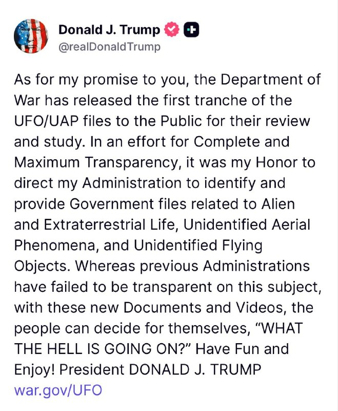

🇺🇸🛸وزارت جنگ ایالات متحده اسناد مربوط به برخوردها با «پدیده‌های ناشناس غیرعادی» (UAP) را از حالت محرمانه خارج کرده و منتشر کرده است. این وزارتخانه اعلام کرده که فایل‌های بیشتری نیز به‌صورت تدریجی در آینده منتشر خواهد شد. @mwarmonitor

## mwarmonitor — post 8704

🚨🇺🇸🇶🇦🇮🇷 معاون رئیس‌جمهور ونس هم‌اکنون در حال دیدار با نخست‌وزیر قطر است تا درباره مذاکرات با ایران گفت‌وگو کند.

🔴 یک مقام آمریکایی گفته است که قطری‌ها یک کانال ارتباطی غیررسمی و مهم بین آمریکا و ایران در مذاکرات مربوط به توافق برای پایان دادن به جنگ هستند. AXIOS

@mwarmonitor

## pm_afshaa — post 90378

  

رویترز با استناد به تصاویر ماهواره‌ای: نشت مشکوک نفت، 45 کیلومتر مربع در نزدیکی جزیره خارک ایران رو پوشانده

💧 Rainbet.com the #1 Non-KYC Crypto Casino & Sportsbook @rainbetcom

😁 @Pm_Afshaa

## pm_afshaa — post 90377

🔴سی‌ان‌ان: ایران به شناورها هشدار داده که از ناوهای آمریکا دور شوند

💧 Rainbet.com the #1 Non-KYC Crypto Casino & Sportsbook @rainbetcom

😁 @Pm_Afshaa

## pm_afshaa — post 90376

🔴بلومبرگ:تنگه هرمز عملاً همچنان بسته است و از سه‌شنبه هیچ عبور و مرور کشتی‌ها به داخل یا خارج ثبت نشده

💧 Rainbet.com the #1 Non-KYC Crypto Casino & Sportsbook @rainbetcom

😁 @Pm_Afshaa

## pm_afshaa — post 90375

🔴کانال 12 اسرائیل: جی دی ونس، اکنون در کاخ سفید با نخست‌وزیر قطر، محمد بن عبدالرحمن آل ثانی، برای بررسی مذاکرات با ایران دیدار می‌کند

💧 Rainbet.com the #1 Non-KYC Crypto Casino & Sportsbook @rainbetcom

😁 @Pm_Afshaa

## pm_afshaa — post 90374

کانفیگ به تعداد محدود موجود شد 5 گیگ کانفیگ 1 تومن 10گیگ کانفیگ 1800 تومن 20 گیگ کانفیگ 3500 تومن کانفیگ نامحدود هم 6 تا مونده فقط 8 میلیون تومن یک‌ماهه 5 کاربره ✅بدون ضریب ✅با لینک ساب ✅کاربر نامحدود ✅زمان‌نامحدود @Aliirezaaa_Vpn98

## pm_afshaa — post 90373

🔴روس‌اتم : فعالیت‌های نیروگاه هسته‌ای بوشهر داره کم‌کم دوباره راه می‌افته

💧 Rainbet.com the #1 Non-KYC Crypto Casino & Sportsbook @rainbetcom

😁 @Pm_Afshaa

## pm_afshaa — post 90372

🔴روبیو: رئیس‌جمهور ترامپ هنوز تصمیم نگرفته است که چگونه به برخی از متحدان که اجازه استفاده از پایگاه‌هایشان را در طول جنگ با ایران نمی‌دهند، پاسخ دهد

💧 Rainbet.com the #1 Non-KYC Crypto Casino & Sportsbook @rainbetcom

😁 @Pm_Afshaa

## pm_afshaa — post 90371

کانفیگ به تعداد محدود موجود شد

5 گیگ کانفیگ 1 تومن
10گیگ کانفیگ 1800 تومن
20 گیگ کانفیگ 3500 تومن
کانفیگ نامحدود هم 6 تا مونده فقط 8 میلیون تومن یک‌ماهه 5 کاربره

✅بدون ضریب
✅با لینک ساب
✅کاربر نامحدود
✅زمان‌نامحدود

@Aliirezaaa_Vpn98

## pm_afshaa — post 90370

مرندی: از این به بعد با امارات مانند شمال عراق رفتار خواهد شد.
این کشور جای پایی برای دشمن صهیونیستی است.
هر زمان که لازم باشد، دشمن در آنجا هدف قرار خواهد گرفت

💧 Rainbet.com the #1 Non-KYC Crypto Casino & Sportsbook @rainbetcom

😁 @Pm_Afshaa

## iaghapour — post 2593

  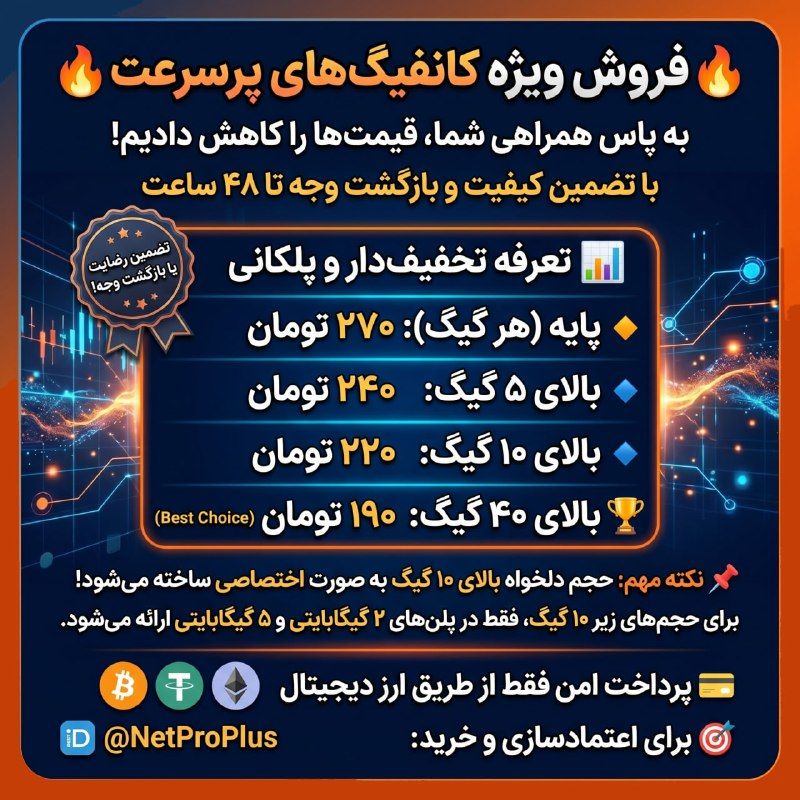

🔥 فروش ویژه کانفیگ‌های پرسرعت با تضمین کیفیت و بازگشت وجه!

به پاس استقبال و همراهی شما عزیزان، قیمت‌ها را کاهش دادیم. ما به کیفیت کارمان مطمئنیم؛ بنابراین در صورت عدم رضایت شما تا ۴۸ ساعت (به شرط عدم مصرف بالا)، مبلغ پرداختی بدون قید و شرط عودت داده می‌شود. 🤝

📊 تعرفه تخفیف‌دار و پلکانی (هرچه بیشتر، ارزان‌تر):
🔹 پایه: هر گیگ ۲۷۰ تومان
🔸 بالای ۵ گیگ: هر گیگ ۲۴۰ تومان
🔸 بالای ۱۰ گیگ: هر گیگ ۲۲۰ تومان
🔸 بالای ۴۰ گیگ: هر گیگ ۱۸۰ تومان (بهترین انتخاب)

📌 نکته مهم خرید:
برای حجم‌های زیر ۱۰ گیگ، کانفیگ‌ها از قبل آماده شده‌اند و فقط در پلن‌های ۲ گیگابایتی و ۵ گیگابایتی قابل ارائه هستند. اما برای سفارش‌های بالای ۱۰ گیگ، دقیقاً همان حجم دلخواه شما به صورت اختصاصی ساخته می‌شود.

💳 نحوه پرداخت: پرداخت امن فقط از طریق ارز دیجیتال (کریپتو)

🎯 برای اعتمادسازی و خرید به کانال ما بپیوندید (آیدی ادمین برای خرید موجوده):
🆔 @NetProPlus

## DEJradio — post 4522

  <a href="telegram/content/DEJradio_4522_1778257659.mp4">🎬 Download video</a>

🚨
⭕️ تصاویر سنتکام از متوقف کردن دو کشتی ایرانی

سنتکام ویدیو حمله نیروی دریایی آمریکا به دو نفت‌کش ایرانی M/T SEA STAR III و M/T Sevda که سعی داشتند از محاصره دریایی آمریکا عبور کنند منتشر کرد. به گفته سنتکام دو نفتکش پس ازحمله متوقف شدند.

#محاصره_دریایی #تنگه_هرمز
@DEJradio

## mamlekate — post 103479

📝 ارتش آمریکا می‌گوید دو نفتکش ایرانی را هدف قرار داده و از کار انداخته است

ارتش آمریکا روز جمعه ۱۸ اردیبهشت تایید کرد که با حمله به دو نفتکش ایرانی دیگر، مانع از عبور آنها از محاصره دریایی اعمال شده بر بنادر و کشتیرانی ایران شده است.

@mamlekate

## VahidOnline — post 75336

فرماندهی مرکزی ایالات متحده (سنتکام) اعلام کرد که در راستای اجرای محاصره دریایی ایران، نیروهای آمریکایی طی دو عملیات جداگانه، سه نفتکش با پرچم ایران را که قصد ورود به بنادر این کشور در دریای عمان را داشتند، از کار انداخته‌اند.
در آخرین اقدام در تاریخ ۱۸ اردیبهشت، یک جنگنده F/A-18 سوپر هورنت برخاسته از ناو هواپیمابر «جورج اچ.دبلیو. بوش»، با شلیک مهمات دقیق به دودکش نفتکش‌های «سی استار ۳» (Sea Star III) و «سودا» (Sevda)، آن‌ها را از کار انداخت و مانع ورود این کشتی‌های خالی از بار به بنادر ایران شد. همچنین در ۱۶ اردیبهشت، جنگنده‌ای از ناو «آبراهام لینکلن» با شلیک توپ ۲۰ میلی‌متری، سکان نفتکش «حسنا» (Hasna) را هدف قرار داد و آن را متوقف کرد.
دریادار برد کوپر، فرمانده سنتکام، با تاکید بر پایبندی نیروهای آمریکایی به اجرای کامل محاصره، اعلام کرد که این سه شناور دیگر به سمت ایران در حرکت نیستند. طبق بیانیه سنتکام، تاکنون چندین کشتی تجاری توسط نیروهای آمریکایی از کار افتاده و بیش از ۵۰ فروند دیگر نیز تغییر مسیر داده شده‌اند.
@VahidOOnLine
خبرگزاری فارس، وابسته به سپاه پاسداران، روز جمعه ۱۸ اردیبهشت از وقوع «درگیری‌های پراکنده» میان نیروهای مسلح جمهوری اسلامی و آمریکا در محدوده تنگه هرمز خبر داد.
فاکس‌نیوز به نقل از یک مقام آمریکایی، اعلام کرد که این درگیری‌ها ناشی از اقدام آمریکا برای مقابله با حرکت یک نفتکش متعلق به ایران بوده است. بر اساس این گزارش، نفتکش مذکور قصد شکستن محاصره را داشته که با مقابله شناورهای آمریکایی مواجه شده است.
@VahidOOnLine

📡 @VahidOnline

## VahidOnline — post 75335

  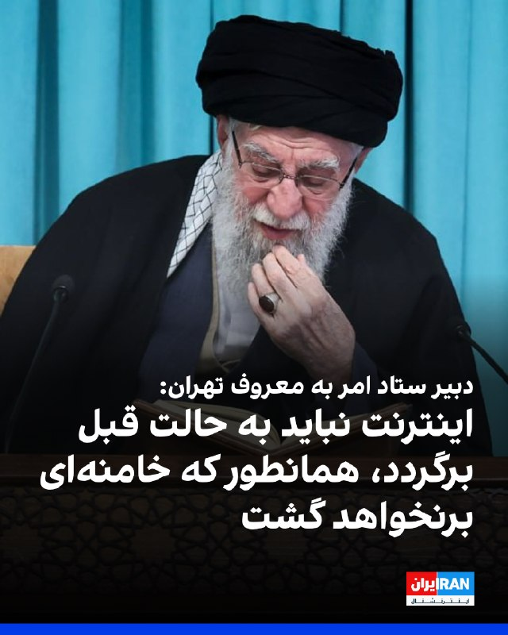

روح‌الله مومن‌نسب، دبیر ستاد امر به معروف تهران نوشت نمی‌شود نیروهای مسلح، مرزهای ما و تنگه هرمز را به روی دشمنان ببندند اما دولت فضای مجازی را در اختیار آنان قرار دهد.

او افزود که «فضای مجازی به هیچ وجه نباید به حالت قبل برگردد؛ همان‌طور که امام شهید ما به حالت قبل برنمی‌گردد.»
@VahidOOnLine

📡 @VahidOnline

## VahidOnline — post 75334

  

دونالد ترامپ در حساب تروث سوشال خود با انتشار تصویری شبیه‌سازی‌شده از انهدام یک پهپاد ایرانی توسط سلاح لیزری نیروی دریایی آمریکا، سرنگونی پهپادهای جمهوری اسلامی را به «پروانه‌ای که به سمت قبرش سقوط می‌کند»، تشبیه کرد.

او در واکنش به درگیری‌های شبانه ناوشکن‌ها در تنگه هرمز، این تبادل آتش را تنها یک «سیلی از روی محبت» (Love tap) خواند و تاکید کرد که آتش‌بس شکننده منطقه همچنان برقرار است.

سلاحی که ترامپ به آن اشاره می‌کند،سامانه لیزری ضد پهپاد «لوکاست» (LOCUST) است که پیش‌تر اعلام شد بر روی ناو هواپیمابر «یواس‌اس جورج اچ.دبلیو. بوش» نصب و آزمایش شده است.
به گزارش وب‌سایت «وار زون»، این نخستین بار است که یک سلاح انرژی هدایت‌شده روی یک ناو هواپیمابر کلاس نیمیتز نصب می‌شود.

مقامات عالی‌رتبه نیروی دریایی اعلام کرده‌اند که هدف نهایی آن‌ها، تبدیل این سلاح‌های پیشرفته به گزینه اصلی مقابله با تهدیدات نزدیک در آب‌های بین‌المللی است.
@VahidOOnLine

📡 @VahidOnline

## VahidOnline — post 75333

  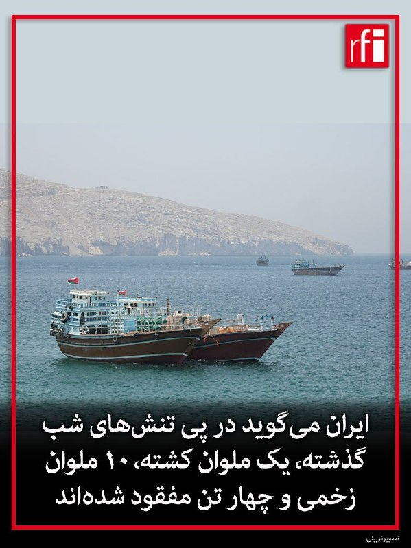

فرماندار میناب: حمله آمریکا به یک لنج باری یک کشته و چهار مفقود بر جا گذاشته است

فرماندار میناب می‌گوید که در حملات دیشب آمریکا یک لنج باری هدف قرار گرفته است که منجر به کشته شدن یک ملوان و مفقود شدن چهار نفر دیگر شده است. [گویا قبلا گفته بودند پنج مفقود داشته بعدا جسد یکیشون پیدا شد]

به گفته محمد رادمهر، ۱۰ ملوان دیگر این لنج هم مجروح و به بیمارستان منتقل شدند.

به گفته آقای رادمهر این حمله در نزدیکی آب‌های شهرستان میناب رخ داده است.
عملیات جستجو برای یافتن سایر مفقود‌شدگان ادامه دارد.

دیشب نیروهای ایرانی و آمریکایی در آب‌های جنوبی ایران تبادل آتش کردند، هرچند دونالد ترامپ می‌گوید که آتش‌بس همچنان برقرار است.
آمریکا می‌گوید که نیروهایش «بی‌مقدمه» هدف حمله موشک‌ها، پهپادها و قایق‌های تندرو ایران قرار گرفتند و ایران می‌گوید که حملاتش تلافی‌جویانه و در پاسخ به حمله آمریکا به یک نفتکش ایرانی و یک کشتی دیگر در منطقه تنگه هرمز بوده است.
@VahidHeadline

📡 @VahidOnline

## VahidOnline — post 75328

  <a href="telegram/content/VahidOnline_75328_1778257661.mp4">🎬 Download video</a>

مارکو روبیو، وزیر امور خارجه آمریکا، گفت اقدام نظامی آمریکا علیه ایران در بامداد جمعه «جدا و متمایز» از عملیات «خشم حماسی» بوده و ایالات متحده همچنان به‌صورت «دفاعی» واکنش نشان خواهد داد.

روبیو روز جمعه در شهر رم، پایتخت ایتالیا، در جمع خبرنگاران اعلام کرد «خشم حماسی» که او اوایل این هفته گفته بود به پایان رسیده است، «یک عملیات تهاجمی بود که برای نابودی سکوهای پرتاب موشک، نیروی دریایی و نیروی هوایی آن‌ها طراحی شده بود.»
او افزود آنچه ساعاتی پیش رخ داد «ناوشکن‌های آمریکایی بودند که در آب‌های بین‌المللی در حال حرکت بودند و از سوی ایرانی‌ها به آن‌ها شلیک شد، و آمریکا برای حفاظت از خود به‌صورت دفاعی پاسخ داد.»
دیپلمات ارشد آمریکا گفت: «فقط کشورهای احمق وقتی به آن‌ها شلیک می‌شود، پاسخ نمی‌دهند. و ما کشور احمقی نیستیم.»

وقتی از روبیو پرسیده شد که آیا آمریکا خطوط قرمزی را به ایران منتقل کرده است یا نه، پاسخ داد: «خط قرمز روشن است: اگر آمریکایی‌ها را تهدید کنند، نابود خواهند شد.»
وزیر خارجه آمریکا همچنین خبر داد که واشینگتن انتظار دارد روز جمعه پاسخ ایران به پیشنهاد واشینگتن برای پایان دادن به جنگ را دریافت کند.
روبیو در این زمینه توضیح داد: «خواهیم دید که این پاسخ شامل چه چیزهایی است. امید ما این است که چیزی باشد که بتواند ما را وارد یک روند جدی مذاکره کند.»
او همچنین تلاش‌های ایران برای کنترل تنگه هرمز را محکوم کرد و گفت: «ایران اکنون ادعا می‌کند که مالک این آبراه بین‌المللی است و حق کنترل آن را دارد... این اقدامی غیرقابل قبول است که آن‌ها تلاش دارند آن را عادی جلوه دهند.»
@VahidHeadline

📡 @VahidOnline

## VahidOnline — post 75327

  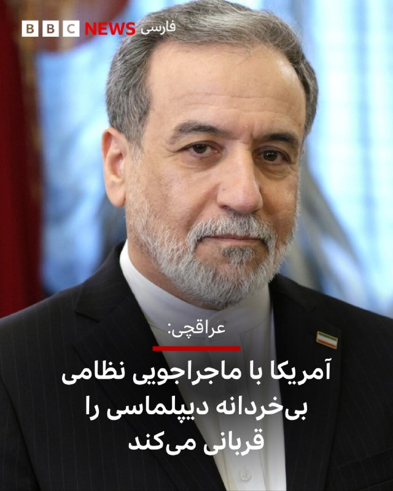

وزیر خارجه جمهوری اسلامی، آمریکا را متهم کرد که با «ماجراجویی نظامی بی‌خردانه» دیپلماسی «قربانی» می‌کند.

عباس عراقچی در پستی در شبکه اجتماعی ایکس نوشت: «هر زمان که یک راه‌ حل دیپلماتیک روی میز قرار می گیرد، ایالات متحده به‌ یک ماجراجویی نظامی بی‌خردانه رو می‌آورد.»

آقای عراقچی در ادامه می‌نویسد که دلیل این اقدام چه «صرفاً یک تاکتیک کور برای اعمال فشار» باشد و چه «فریبکاری یک خرابکار» که می‌خواهد «رئیس‌جمهور آمریکا را به باتلاقی تازه بکشاند» و یا هر دلیل دیگری «نتیجه همیشه یکی است: ایرانیان هرگز در برابر فشار سر خم نمی‌کنند، ولی این دیپلماسی است که همواره قربانی می‌شود.»

او همچنین ارزیابی سازمان اطلاعات مرکزی آمریکا از ذخایر موشکی ایران را اشتباه توصیف کرد و نوشت: «ذخایر موشکی و ظرفیت پرتابگرهای ما نسبت به ۹ اسفند در سطح ۷۵ درصد نیست؛ رقم صحیح ۱۲۰ درصد است.»
@VahidHeadline

📡 @VahidOnline

## VahidOnline — post 75326

  

سنتکام، فرماندهی مرکزی ایالات متحده، اعلام کرد از زمان آغاز محاصره دریایی تا روز جمعه، ۱۸ اردیبهشت مانع از ورود یا خروج بیش از ۷۰ نفتکش از بنادر ایران شده است.

سنتکام در پیام تازه‌اش در شبکه اجتماعی ایکس نوشته که این کشتی‌های تجاری ظرفیت حمل بیش از ۱۶۶ میلیون بشکه نفت ایران به ارزش تخمینی بیش از ۱۳ میلیارد دلار را دارند.

این موضوع ساعاتی پس از آن اعلام شد که ارتش آمریکا گفت نیروهایش در نخستین ساعات بامداد جمعه حملات «تحریک‌نشدهٔ» ایران علیه ناوشکن‌های آمریکایی در تنگه هرمز را رهگیری کرده و در پاسخ، «تأسیسات نظامی ایران» را هدف قرار دادند.
@VahidHeadline

📡 @VahidOnline

## VahidOnline — post 75325

  

امروز هفتادمین روز قطع اینترنت در ایران است و به‌گزارش نت‌بلاکس این اختلال صبح جمعه ۱۸ اردیبهشت از یک هزار ۶۵۶ ساعت فراتر رفت.

این در حالی است که مقامات و افراد نزدیک به حکومت یا کسانی که حکومت خود با واگذاری «سیم‌کارت سفید» انتخاب می‌کند، هم‌چنان به اینترنت دسترسی دارند.
علاوه بر آن، اخیراً برخی اپارتورهای نیز اینترنت موسوم به طبقاتی را باقیمت‌های گزاف در اختیار برخی مشاغل و طبقات قرار داده‌اند.
@VahidHeadline

📡 @VahidOnline

## kianmeli1 — post 87285

  <a href="telegram/content/kianmeli1_87285_1778257664.mp4">🎬 Download video</a>

🔴به عنوان بخشی از دستور اجرایی ترامپ درباره افشای اطلاعات یوفوها، وزارت جنگ آمریکا اولین بخش از پرونده‌های یوفو را منتشر کرد.
https://t.me/kianmeli1

## kianmeli1 — post 87284

🔴بلومبرگ: تنگه هرمز همچنان عملاً بسته است و هیچ ترافیک کشتی‌ از سه‌شنبه تاکنون وارد یا خارج نشده است.
https://t.me/kianmeli1

## kianmeli1 — post 87283

🔴وزارت امور خارجه آمریکا اعلام کرد، مسافران آمریکایی یک کشتی کروز که در آن ویروس هانتا شیوع پیدا کرده است، به کشورشان بازگردانده خواهند شد.
https://t.me/kianmeli1

## kianmeli1 — post 87282

‏🔴خبرگزاری تسنیم به نقل از یک منبع نظامی نوشت در حال حاضر درگیری‌ها در خلیج فارس متوقف شده است، اما در صورت ورود دوباره نیروهای آمریکایی به این منطقه به آن‌ها پاسخ «قاطع» داده می‌شود
https://t.me/kianmeli1

## kianmeli1 — post 87281

‏🔴محمد مخبر، دستیار رهبر جمهوری اسلامی: تنگه هرمز امکانی در حد بمب اتم دارد و با یک تصمیم می‌توان اقتصاد جهان را تحت تاثیر قرار داد
https://t.me/kianmeli1

## kianmeli1 — post 87280

‏🔴زمین‌لرزه‌ای به بزرگی ۳.۹ در عمق ۶ کیلومتری، عصر جمعه خوی را لرزاند
https://t.me/kianmeli1

## kianmeli1 — post 87279

‏🔴زمین‌لرزه‌ای به بزرگی ۳.۷ عصر جمعه خرم‌آباد را لرزاند
https://t.me/kianmeli1

## kianmeli1 — post 87278

‏🔴وزیر علوم جمهوری اسلامی: هنوز درباره مجازی یا حضوری بودن امتحانات دانشگاه‌ها تصمیمی نگرفته‌ایم
https://t.me/kianmeli1

## kianmeli1 — post 87277

‏🔴اکسیوس گزارش داد که جی‌دی ونس، معاون رییس‌جمهور آمریکا، در نشستی با نخست‌وزیر قطر برای گفت‌وگو درباره مذاکرات با جمهوری اسلامی حضور دارد
https://t.me/kianmeli1

## kianmeli1 — post 87276

‏🔴معاون استاندار هرمزگان: از شنبه ۱۹ اردیبهشت ادارات استان با ۵۰ درصد حضور و ۵۰ درصد دورکاری فعالیت می‌کنند و ساعت کار دستگاه‌های اجرایی از ۸ تا ۱۳ تعیین شده است
https://t.me/kianmeli1

## IranIntlTV — post 336170

  

آموزشکده توانا گزارش داد عرفان شکورزاده، دانشجوی دانشگاه علم و صنعت ایران، برای اجرای حکم اعدام از زندان اوین به زندان قزلحصار منتقل شده است.

بر اساس این گزارش، عرفان شکورزاده بهمن‌ماه ۱۴۰۳ از سوی اطلاعات سپاه با اتهام «جاسوسی و همکاری با کشورهای متخاصم» بازداشت و به اعدام محکوم شد و حکم صادرشده علیه او به‌تازگی در دیوان عالی کشور تایید شده است.
https://iranintl.com/202605089368

## IranIntlTV — post 336169

زنگ خطر برای احزاب؛ حزب اصلاح پادشاهی بریتانیا در کمین قدرت

🖋 علی رشید

انتخابات محلی هفتم مه ۲۰۲۶ در ۱۳۶ شورای انگلستان برگزار شد و بیش از پنج هزار کرسی را به رقابت گذاشت. مشارکت حدود ۴۳ درصد گزارش شد که به نوبه خود رکوردی تاریخی برای انتخابات‌های محلی در انگلستان به شمار می‌آید.

کی‌یر استارمر، نخست‌وزیر و رهبر حزب کارگر، شکست را پذیرفت و گفت پیام رأی‌دهندگان را شنیده است، در حالی که نایجل فاراژ، رهبر حزب اصلاحات پادشاهی بریتانیا، نتایج را «تغییر تاریخی» در سیاست بریتانیا توصیف کرد. حزب کارگر چندین شورا را از دست داد و حزب اصلاحات پادشاهی بریتانیا بیش از ۴۰۰ کرسی تازه به دست آورد.

نایجل فاراژ؛ از حزب استقلال پادشاهی متحد تا اصلاح پادشاهی بریتانیا
نایجل فاراژ، متولد ۱۹۶۴ در فارنبرو، پس از تحصیل در کالج دالیچ به‌جای دانشگاه وارد بازار بورس سیتی لندن شد. مخالفت با پیمان ماستریخت او را در ۱۹۹۲ از حزب محافظه‌کار جدا کرد و در ۱۹۹۳ با حزب استقلال پادشاهی متحد (یوکیپ) وارد سیاست شد.

او از ۱۹۹۹ نماینده پارلمان اروپا از حوزه جنوب شرق انگلستان بود و از ۲۰۰۶ تا ۲۰۱۶ (با وقفه‌ای کوتاه) رهبری یوکیپ را برعهده داشت، حزبی که بر نگرانی‌های بخشی از طبقه کارگر سفیدپوست درباره مهاجرت سوار شد و در انتخابات محلی ۲۰۱۳ و انتخابات پارلمان اروپا ۲۰۱۴ به موفقیت‌های تاریخی رسید.

حزب اصلاح پادشاهی بریتانیا چه می‌خواهد؟
حزب اصلاحات پادشاهی بریتانیا خود را حزبی ضداستقرار معرفی می‌کند که بر کنترل مهاجرت، کاهش مالیات، کوچک‌سازی دولت تمرکز دارد. هدف فاراژ تبدیل این حزب به نیروی اصلی راست سیاسی و در نهایت تصاحب نخست‌وزیری است.
سیاست‌های اقتصادی و مالیاتی
در مانیفست «قرارداد ما با شما»، مهم‌ترین وعده‌های اقتصادی عبارت‌اند از:
•افزایش سقف معافیت مالیاتی درآمد به ۲۰ هزار پوند در سال
•حذف مالیات بر ارث برای دارایی‌های زیر دو میلیون پوند
•کاهش هزینه‌های دولت از طریق «حذف ولخرجی» و بازتوزیع منابع به خدمات عمومی کلیدی

مهاجرت و هویت
•مهاجرت محور اصلی گفتمان حزب اصلاح پادشاهی بریتانیاست. این حزب می‌خواهد مهاجرت «غیرضروری»، که آن را شامل مهاجرت کاری و خانوادگی می‌داند متوقف کند، اقامت دائم (ILR) برای متقاضیان جدید را لغو کند و به‌جای آن ویزاهای پنج‌ساله با شرایط سخت‌تر، حقوق بالاتر و کنترل‌های شدیدتر قرار دهد.
•به‌موازات این، حزب خروج از کنوانسیون اروپایی حقوق بشر را برای تسهیل اخراج مهاجران غیرقانونی و توقف قایق‌ها ضروری می‌داند. منتقدان حقوقی هشدار می‌دهند که این طرح‌ها می‌تواند با تعهدات بین‌المللی بریتانیا در تضاد باشد و وضعیت هزاران مهاجر را مبهم کند.
•کی‌یر استارمر در مصاحبه‌ای سیاست مهاجرتی حزب اصلاحات پادشاهی بریتانیا را «نژادپرستانه» توصیف کرده، با این حال دولت کارگر تحت فشار این حزب به سمت سیاست‌های سخت‌گیرانه‌تر حرکت کرده است. این تاثیرگذاری بر گفتمان، یکی از مهم‌ترین دستاوردهای حزب اصلاحات پادشاهی بریتانیا حتی بدون داشتن قدرت ملی مستقیم است.

آزمایشگاه‌های قدرت محلی؛ برنامه ریفرم در شوراها
پیروزی در انتخابات محلی، حزب اصلاحات پادشاهی بریتانیا را برای اولین بار در جایگاه تصمیم‌گیر در سطح محلی قرار داده است. هاورینگ، نیوکاسل-آندر-لایم و شماری دیگر از شوراها اکنون به آزمایشگاه‌های اصلی این حزب تبدیل شده‌اند.

متخصصان حقوق اداری هشدار می‌دهند که شوراهای محلی در بریتانیا اختیارات محدود دارند و بسیاری از این تصمیمات با چارچوب قانون‌گذاری ملی در وستمینستر در تعارض قرار می‌گیرد، بنابراین این وعده‌ها با چالش‌های حقوقی جدی روبه‌رو خواهند شد.

استارمر در تنگنا و صعود عضویت ریفرم
۱۸ ماه پس از پیروزی بزرگ حزب کارگر در انتخابات عمومی ژوئیه ۲۰۲۴ با ۴۱۲ کرسی، کی‌یر استارمر با جدی‌ترین بحران دوران نخست‌وزیری‌اش روبه‌رو است.

گزارش‌ها حاکی است او در کارزار انتخابات محلی ۲۰۲۶ به «نقطه ضعف انتخاباتی» تبدیل شده و بسیاری از نمایندگان کارگر حضورش را در خط مقدم کمپین محدود کرده‌اند.

با وجود فشارهای داخلی برای تغییر رهبری، دفتر نخست‌وزیر تاکید می‌کند استارمر از اختیار پنج‌ساله برخوردار است و قصد کناره‌گیری ندارد؛ موضعی که یادآور ایستادگی تونی بلر در برابر فشارهای مشابه برای اعلام تاریخ خروج است.

🔗متن کامل گزارش را اینجا بخوانید
@iranintltv

## IranIntlTV — post 336168

  <a href="telegram/content/IranIntlTV_336168_1778257666.mp4">🎬 Download video</a>

نتایج انتخابات محلی در بریتانیا نشان می‌دهد حزب کارگر با شکست روبه‌رو شده و حزب اصلاح پادشاهی بریتانیا با شعار «بازگشت عقل سلیم» و تمرکز بر موضوع مهاجرت، توانسته بخشی از رای‌دهندگان را از احزاب سنتی جذب کند.
فرشاد متقی، عضو تحریریه ایران‌اینترنشنال، در «پیوست» به این موضوع می‌پردازد
@iranintltv

## IranIntlTV — post 336167

  

خبرگزاری تسنیم، وابسته به سپاه، به نقل از یک منبع نظامی نوشت که پس از اقدام نیروهای آمریکایی علیه نفتکش‌های ایران، نیروهای دریایی جمهوری اسلامی با آتش حملات خود به «نقض آتش‌بس آمریکا» پاسخ داد و پس از مدتی تبادل آتش، اکنون درگیری‌ها متوقف شده و فضا آرام است.

رسانه وابسته به سپاه افزود: «اگر مجددا آمریکایی‌ها قصد ورود به خلیج فارس را داشته باشند و یا برای شناورهای ایرانی مزاحمتی ایجاد کنند، مجددا پاسخ قاطع دریافت خواهند کرد. بنابراین احتمال ورود مجدد به درگیری‌هایی از این قبیل در این منطقه همچنان وجود دارد.»
https://iranintl.com/202605084110

## IranIntlTV — post 336166

  <a href="telegram/content/IranIntlTV_336166_1778257669.mp4">🎬 Download video</a>

یک شهروند با ارسال پیامی به ایران‌اینترنشنال از افزایش شدید قیمت خدمات درمانی روایت کرده و می‌گوید قیمت هر جلسه شیمی‌درمانی به ۷۰۰ میلیون تومان رسیده است.

## IranIntlTV — post 336165

  <a href="telegram/content/IranIntlTV_336165_1778257670.mp4">🎬 Download video</a>

در حالی که جمهوری اسلامی در جریان انقلاب ملی دست به گسترده‌ترین سرکوب معاصر زد، همچنان از برگزاری ساده‌ترین مراسم‌ بر مزار جان‌باختگان نیز جلوگیری می‌کند.
گفت‌وگو با رضا حاجی‌حسینی، روزنامه‌نگار
@iranintltv

## IranIntlTV — post 336164

  <a href="telegram/content/IranIntlTV_336164_1778257672.mp4">🎬 Download video</a>

نتایج اولیه انتخابات شوراهای محلی در انگلستان نشان می‌دهد حزب راستگرای اصلاح توانسته دستاوردهای قابل توجهی کسب کند و حزب کارگر در چندین منطقه کرسی از دست بدهد.
گفت‌وگو با شهران طبری، روزنامه‌نگار و تحلیل‌گر سیاسی
@iranintltv

## IranIntlTV — post 336163

  

رویترز گزارش داد که بر اساس تصاویر ماهواره‌ای، در نزدیکی جزیره خارک، یکی از مراکز اصلی نفتی ایران، احتمال نشت نفت در دریا وجود دارد. در این تصاویر که بین ۱۶ تا ۱۸ اردیبهشت توسط ماهواره‌های کاپرنیکوس ثبت شده، لکه‌ای خاکستری و سفید در آب‌های غرب این جزیره دیده می‌شود.

پژوهشگر «رصدخانه منازعه و محیط زیست» گفته است که این لکه از نظر ظاهری با نفت مطابقت دارد و حدود ۴۵ کیلومتر مربع از سطح دریا را پوشش می‌دهد.
https://iranintl.com/202605080464

## IranIntlTV — post 336162

  

محمد مخبر، مشاور و دستیار رهبر جمهوری اسلامی، گفت: «تنگه هرمز یک امکانی است در حد بمب اتم. یعنی وقتی یک جایی دست شما باشد که با یک تصمیم کل اقتصاد دنیا را متاثر کنید، امکان بسیار بسیار بزرگی است. چیزی که با این جنگ به دست آوردیم را به هیچ وجه از دست نخواهیم داد.»
https://iranintl.com/202605080980

## IranIntlTV — post 336161

  <a href="telegram/content/IranIntlTV_336161_1778257676.mp4">🎬 Download video</a>

فرماندهی مرکزی ایالات متحده، سنتکام، اعلام کرد ناوهای آمریکایی مانع ورود و خروج بیش از ۷۰ نفتکش از بنادر ایران شده‌اند. سنتکام ظرفیت این نفتکش‌ها را بیش از ۱۶۶ میلیون بشکه نفت و ارزش محموله‌های آن‌ها را بیش از ۱۳ میلیارد دلار اعلام کرد.
گفت‌وگو با شایان سمیعی، کارشناس امنیت ملی
@iranintltv

## IranIntlTV — post 336160

  <a href="telegram/content/IranIntlTV_336160_1778257677.mp4">🎬 Download video</a>

مارکو روبیو، وزیر خارجه آمریکا، همزمان با ادامه تنش‌ها در تنگه هرمز اعلام کرد واشینگتن کنترل این گذرگاه راهبردی توسط جمهوری اسلامی را نمی‌پذیرد. او همچنین گفت آمریکا قرار است امروز پاسخ تهران به طرح صلح آمریکا را دریافت کند.
جزییات بیشتر با سمیرا قرایی، خبرنگار ایران‌اینترنشنال
@iranintltv

## ManotoTV — post 105152

  <a href="telegram/content/ManotoTV_105152_1778257679.mp4">🎬 Download video</a>

رویترز گزارش داده تصاویر ماهواره‌ای این هفته نشان داده‌اند که یک لکه نفتی مشکوک، بخش وسیعی از دریا در نزدیکی جزیره خارک؛ بزرگ‌ترین پایانه صادرات نفت کشور را پوشانده است.
در گزارش رویترز آمده این لکه که به رنگ خاکستری و سفید در تصاویر دیده می‌شود، در فاصله غربی جزیره خارک (به طول حدود ۸ کیلومتر) در بازه زمانی ۶ تا ۸ مه توسط ماهواره‌های اروپایی کوپرنیکوس ثبت شده است.
پژوهشگران محیط‌زیست می‌گویند این لکه «از نظر بصری کاملاً شبیه نفت» است و تخمین زده می‌شود حدود ۴۵ کیلومتر مربع از سطح دریا را پوشانده باشد. به گفته کارشناسان، این می‌تواند بزرگ‌ترین نشت نفتی از زمان آغاز جنگ آمریکا و اسرائیل با ایران در ۷۰ روز گذشته باشد.
با این حال، علت دقیق این نشت و منبع آن هنوز مشخص نیست. تصاویر روز ۸ مه نیز نشانه‌ای از نشت فعال جدید نشان نداده‌اند.
جزیره خارک که حدود ۹۰ درصد صادرات نفت ایران از آن انجام می‌شود، یکی از نقاط کلیدی صنعت نفت کشور است و بخش عمده نفت آن به مقصد چین صادر می‌شود.
در گزارش آمده است که در جریان جنگ اخیر، حملاتی نیز به اهداف نظامی در این منطقه انجام شده و تنش‌های دریایی در خلیج فارس افزایش یافته است. همچنین حضور گسترده نیروهای دریایی و درگیری‌های پراکنده، باعث اختلال گسترده در مسیرهای کشتیرانی و بازار جهانی نفت شده است.

## FarsiVOA — post 217204

تاثیر تنش‌های خاورمیانه بر تامین انرژی و صنعت گردشگری در اروپا؛ گفت‌وگو با علی دادپی

## FarsiVOA — post 217203

شکست سنگین حزب کارگر بریتانیا در انتخابات محلی؛ کی‌یر استارمر اعلام کرد استعفا نمی‌دهد

## FarsiVOA — post 217202

وزیر خارجه آمریکا در رم گفت واشنگتن امروز پاسخ جمهوری اسلامی به طرح پیشنهادی صلح را دریافت می‌کند و ابراز امیدواری کرد تهران با «پاسخی جدی» زمینه ورود به مذاکرات جدی را فراهم کند.

## FarsiVOA — post 217200

🔺توقف دو نفتکش با پرچم ایران پس از شلیک ارتش آمریکا

◾️نیروهای ایالات متحده روز جمعه ۱۸ اردیبهشت، دو نفتکش ایرانی را پیش از ورود به یکی از بنادر ایران در دریای عمان از کار انداختند. این اقدام در چارچوب اجرای محاصره دریایی جمهوری اسلامی صورت گرفته است.

⬇️ بیشتر بخوانید:

https://ir.voanews.com/a/8148005.html

## FarsiVOA — post 217199

نشانه‌های دور شدن چین و روسیه از جمهوری اسلامی ایران؛ ایا آنها پشت حکومت ایران را خالی خواهند کرد؟ گفت‌وگو با صالح کامرانی

## DW_Farsi — post 124453

  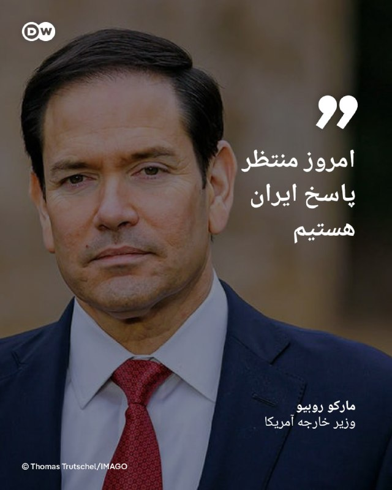

🔶 روبیو: امروز منتظر پاسخ ایران هستیم؛ بقایی: هنوز جمع‌بندی نهایی اعلام نشده

مارکو روبیو، وزیر خارجه آمریکا، روز جمعه ۸ مه (۱۸ اردیبهشت) در رم، پایتخت ایتالیا گفت ایالات متحده انتظار دارد امروز پاسخ ایران به پیشنهاد اخیر واشینگتن برای پایان دادن به جنگ را دریافت کند. او افزود امیدوار است محتوای این پاسخ، زمینه را برای ورود به یک روند "جدی" مذاکراتی فراهم کند.

در مقابل، اسماعیل بقایی، سخنگوی وزارت خارجه ایران، گفت موضوع همچنان در دست بررسی است و اگر تهران به جمع‌بندی نهایی برسد، آن را رسما اعلام خواهد کرد.

روبیو در جمع خبرنگاران گفت واشنگتن به‌زودی خواهد دید پاسخ ایران چه دربردارد و ابراز امیدواری کرد این پاسخ بتواند به یک مسیر مذاکراتی جدی منتهی شود. این موضع در حالی مطرح شده که دولت ترامپ همچنان بر حفظ فشار بر تهران و در عین حال باز نگه داشتن مسیر توافق تأکید دارد.

بقایی نیز در تهران گفت مذاکرات همچنان در حال بررسی است و هنوز تصمیم نهایی اعلام نشده است.
@dw_farsi

## DW_Farsi — post 124452

🔶 آلمان و وابستگی مبرم آن به پزشکان خارجی

کانال اول تلویزیون آلمان در گزارشی به موضوع کمبود پزشک در این کشور و علل وابستگی رو به رشد آن به پزشکان خارجی پرداخته است.

ماتیاس ووت، مدیر کلینیک هارتس در کوئدلین‌بورگ (Quedlinburg) آلمان در شرح این موضوع می‌گوید: «بدون پزشکان خارجی، بخش بزرگی از بیمارستان‌های آلمان دیگر قادر به فعالیت نخواهند بود.»

حدود یک‌سوم کادر پزشکی کلینیک او را مهاجران تشکیل می‌دهند. چنین آماری، به‌ویژه در خارج از شهرهای بزرگ، مدت‌هاست که به یک امر عادی تبدیل شده است.

به گفته او، در حال حاضر بیش از ۵۰هزار پزشک فاقد تابعیت آلمانی، کمبود نیروی انسانی را جبران می‌کنند. این در حالی است که تعداد پزشکان شاغل در آلمان بیش از هر زمان دیگری است.

کریستیان کاراگیانیدیس نیز که خود متخصص مراقبت‌های ویژه و عضو کمیسیون دولتی برای اصلاحات ساختاری سیستم بیمارستانی آلمان بوده است می‌گوید: «اگر به تعداد پزشک نسبت به جمعیت نگاه کنیم، آلمان به همراه اتریش در صدر جدول جهانی قرار دارند. این یعنی در مجموع، ما در واقع بیش از حد نیاز، پزشک در اختیار داریم.»

با این حال به گفته کریستیان کاراگیانیدیس، ساختار ناکارآمد بیمارستان‌ها باعث می‌شود که آلمان نتواند با وجود تراکم بالای پزشک در حال حاضر حدود ۶هزار پست خالی در کلینیک‌ها را پر کند: «ما در آلمان متأسفانه با پدیده همزمان خدمات بیش از حد، خدمات ناکافی و خدمات نادرست مواجه هستیم.»

او وجود یک‌هزار و ۷۰۰ بیمارستان در سراسر کشور را در مقایسه با استانداردهای بین‌المللی "بسیار زیاد" می‌داند و در عین حال یادآور می‌شود که با این حال، در برخی مناطق روستایی آلمان کمبود پزشک وجود دارد.

اینا ویاروکینا، پزشک دستیار در بخش مراقبت‌های ویژه در کوئدلین‌بورگ، روزانه چندین ساعت را صرف ثبت پرونده‌ها و کارهای اداری می‌کند.

این پزشک ۴۵ ساله هفت سال پیش از بلاروس به آلمان آمد. او که در بلاروس حقوق‌‌ ماهیانه‌اش حدود ۱۷۰ یورو بود سرانجام برای فراهم کردن زندگی بهتر برای خود و دو دخترش همسر و وطنش را ترک کرد و در اواخر دهه ۳۰ سالگی خود زبان آلمانی را آموخت.

کانال اول تلویزیون آلمان در گزارش خود می‌نویسد، در درازمدت، به‌ویژه بیمارستان‌های کوچک به متخصصان مهاجری مانند اینا ویاروکینا وابسته خواهند ماند.

@dw_farsi

## DW_Farsi — post 124451

  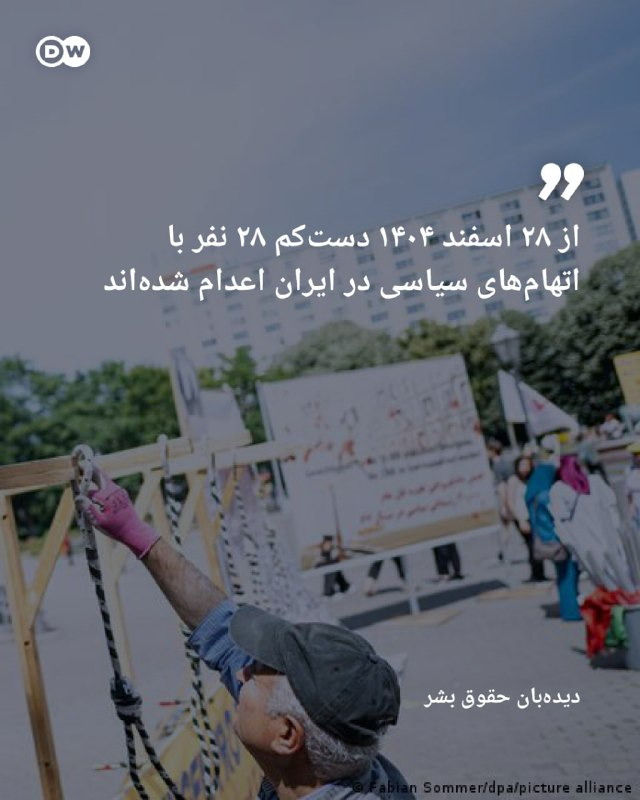

🔶 دیده‌بان حقوق بشر: از ۲۸ اسفند ۱۴۰۴ دست‌کم ۲۸ نفر با اتهام‌های سیاسی در ایران اعدام شده‌اند

دیده‌بان حقوق بشر با انتشار پیامی هشدار داد از ۱۸ مارس ۲۰۲۶، برابر با ۲۸ اسفند ۱۴۰۴، دست‌کم ۲۸ نفر در ایران با اتهام‌های "دارای انگیزه سیاسی" اعدام شده‌اند. این نهاد همچنین گفت شمار زیادی از معترضان زندانی همچنان در معرض خطر اعدام‌های خودسرانه و پنهانی هستند.

در این پیام، به‌صراحت نسبت به خطر ادامه اعدام‌ها علیه معترضان زندانی هشدار داده شده است. به گفته این نهاد، روند سرکوب قضایی در ایران فقط به بازداشت و محاکمه محدود نمانده و استفاده از مجازات مرگ در پرونده‌های سیاسی نیز شدت گرفته است.
@dw_farsi

## Persian_Trend_Official — post 13710

  <a href="telegram/content/Persian_Trend_Official_13710_1778257681.mp4">🎬 Download video</a>

💢عضو کمیسیون امنیت ملی مجلس

🔹 از این به بعد اقدامات آمریکا برای محاصره دریایی، با پاسخ نظامی جمهوری اسلامی مواجه می‌شود

🔹آمریکا باید برای ناوشکن‌هایش چند اسکورت قرار دهد که در صورت غرق‌شدن بتوانند نیروهای خود را نجات دهند.

🫆:Tony

📌 @persian_trend_official
پرشین ترند | متفاوت‌ترین کانال نظامی

## Persian_Trend_Official — post 13706

  <a href="telegram/content/Persian_Trend_Official_13706_1778257682.jpg">🎬 Download video</a>

⭕️ برای اولین‌بار، پنتاگون اسناد بسیار محرمانه مربوط به UFOها را منتشر کرده است.

برخی تصاویر، اجسام ناشناس ستاره‌شکل و نورها و اشکال عجیب در آسمان را هنگام مأموریت Apollo 11 Moon Landing نشان می‌دهند.
همچنین ویدیوهایی منتشر شده که در آن‌ها گوی‌هایی در آسمان حرکت می‌کنند بدون اینکه سیستم پیشران شناخته‌شده‌ای داشته باشند.

📝 Nick

📌 @persian_trend_official
پرشین ترند | متفاوت‌ترین کانال نظامی

## RadioFarda — post 156979

  <a href="https://t.me/radiofarda/156979">📎 Download file</a>

مجتبی نجفی: سنت مخالفت با توافق در ایران دیرینه است، اما موثر نیست

🔸محمود نبویان از نمایندگان اصولگرای مجلس شورای اسلامی و از سیاستمدارانی که همراه تیم مذاکره‌کننده جمهوری اسلامی راهی اسلام آباد شد، با تازه‌ترین اظهارنظر خود خبرساز شده است. آقای نبویان خطاب به محمد باقر قالیباف می‌گوید لازم است که «اصحاب» توافق به گفته او «ذلت بار» برجام از تیم مذاکره‌کننده حذف شوند. چرا که به گفته او مذاکره آمریکا در این لحظه واقعی نبوده و مشخصا «به هدف فریب» صورت می‌گیرد. این نماینده مجلس می‌گوید حتی به به فرض اینکه واقعی باشد دو عامل موجب به نتیجه نرسیدن آن خواهد بود که یکی «بدعهدی» آمریکاست، و دومی وجود «اصحاب برجام در تیم مذاکرات». عالی‌ترین مقام مرتبط با برجام که در تیم کنونی مذاکره‌کنندگان است، عباس عراقچی وزیر امور خارجه دولت مسعود پزشکیان است. آیا چنین اختلافاتی در صحنه سیاسی ایران مانع دستیابی تهران و واشینگتن به یک توافق خواهد شد؟ ارزیابی مجتبی نجفی تحلیلگر ساکن پاریس را بشنوید.

@RadioFarda

## IranianMinds — post 19808

  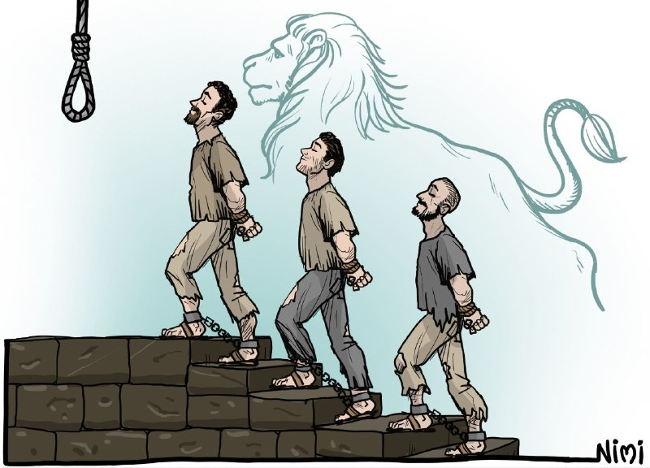

خورشید مردم ایران دوباره طلوع می کند و بر تاریکی جمهوری ستمگر اسلامی پیروز خواهد شد.

@IranianMinds

## IranianMinds — post 19807

  <a href="telegram/content/IranianMinds_19807_1778257684.mp4">🎬 Download video</a>

🔴 ویدئوی جنجالی وزارت دفاع آمریکا از پرونده‌های UFO که تازه افشا شده!

تو سال ۲۰۱۳، یه شیء ستاره‌مانند با حرکات زیگزاگی سریع و نامنظم توی آسمون معلق بود و می‌چرخید ! ی سری مدارک دیگم هست که از داخل سایت میتونید ببینید

war.gov/UFO

@IranianMinds

## IranianMinds — post 19806

  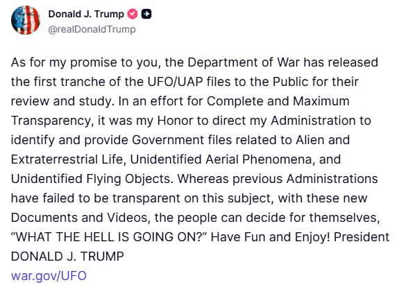

🔴 ترامپ:

«همون‌طور که قول داده بودم، وزارت جنگ اولین بخش از پرونده‌های UFO/UAP رو برای بررسی و مطالعه عموم منتشر کرده. برای شفافیت کامل و حداکثری، به دولت خودم دستور دادم اسناد مربوط به موجودات فضایی، حیات فرازمینی، پدیده‌های ناشناس هوایی و بشقاب‌پرنده‌ها شناسایی و منتشر بشن.

دولت‌های قبلی توی این موضوع شفاف عمل نکردن، اما حالا با انتشار این اسناد و ویدیوها، مردم خودشون می‌تونن تصمیم بگیرن که «بالاخره چه خبره؟!»

خوش بگذره !

@IranianMinds

## IranianMinds — post 19805

  <a href="https://t.me/IranianMinds/19805">📎 Download file</a>

📲#اپلیکیشن اندروید سایت جهانی دربی بت

👍اسپانسر لیگ انگلیس
👍
🔥امکان شارژ امن از طریق کارت بانکی
➖➖➖➖➖➖➖➖➖

🪙همین حالا عضو شوید 👇
https://t.me/+aCbq7yy8QY80NzQ0

## IranianMinds — post 19804

  

😤دنبال یه سایت شرط بندی بین المللی بودی که به ایرانیا خدمات بده؟!
⛔

👍دربی بت همون انتخاب  100%

💎ویژگی های سایت جهانی Derby Bet:

⬅️امکان شارژ امن با کارت بانکی

⬅️واریز اول دوبل شارژ می شوید(بونوس۱۰۰٪)

⬅️پر اپشن ترین سایت فعال در ایران

⬅️تسویه حساب کمتر از 5 دقیقه

⬅️برگشت بخشی از باخت به صورت هفتگی

🚨کد هدیه ثبت نام:GG007

⚠️برای دانلود اپلکیشن کلیک کنید
👉
ge18

🔔کانال دربی بت :

🪙https://t.me/+aCbq7yy8QY80NzQ0

## BBCPersian — post 280512

🔻خبرگزاری فارس: درگیری‌های پراکنده در تنگه هرمز در جریان است

خبرگزاری فارس وابسته به سپاه پاسداران انقلاب اسلامی می‌گوید «از ساعتی پیش درگیری‌های پراکنده‌ای میان نیروهای مسلح ایران و شناورهای آمریکایی‌ در محدودهٔ تنگهٔ هرمز در جریان است.»

جزئیات بیشتری از این درگیری از سوی ایران منتشر نشده است. مقام‌های آمریکایی هم در این زمینه اظهارنظری نکرده‌اند.

ایران و آمریکا شب گذشته در خلیج فارس تبادل آتش کردند اما هر دو کشور دیگری را آغازگر آن خواندند.

آمریکا گفته است با وجود این درگیری، آتش‌بس نقض نشده و همچنان جریان دارد.

https://bbc.in/4cZY32k
@BBCPersian

## BBCPersian — post 280511

🔻لبنان: چهار نفر در حمله هوایی کشته شدند؛ اسرائیل: چندین پرتابه از سمت لبنان شلیک شد

به گفته وزارت بهداشت لبنان، در حمله هوایی امروز به شهر طورا در جنوب این کشور، چهار نفر از جمله دو زن کشته شدند.

خبرگزاری دولتی لبنان و خبرگزاری فرانسه هم گزارش دادند که اسرائیل در حال انجام حملات گسترده در این منطقه بوده است.

اسرائیل در این باره اظهارنظر نکرده است اما در گزارش دیگری ارتش این کشور اعلام کرد پس از شلیک پرتابه از لبنان، آژیرهای هشدار حمله هوایی در چندین شهر شمالی این کشور به صدا درآمد.

در بیانیه ارتش اسرائیل آمده است که پس از فعال شدن آژیرها، «چندین پرتابه به سمت خاک اسرائیل شناسایی شد.»

این بیانیه افزود: «نیروی هوایی اسرائیل یکی از پرتابه‌ها را رهگیری کرد و سایر پرتابه‌ها در مناطق باز فرود آمدند. به کسی آسیب نرسید.»

ارتش اسرائیل جزئیات بیشتری ارائه نکرد.

با وجود آتش‌بس در جنگ میان اسرائیل و حزب‌الله، درگیری‌ها در جنوب لبنان متوقف نشده است.

https://bbc.in/4cZY32k
@BBCPersian

## Dirty_Kids — post 389113

دولت آمریکا اقدام به انتشار تصاویر و فیلم های مرتبط با UFO کرده. از نکات جالب این اسناد تصاویر گرفته شده در مأموریت آپولو 12 در سال 1969 بر روی ماه هست که به طور واضح اشیاء ناشناس در عکس ها دیده میشه

@Dirty_Kids 👻

## Hranews — post 112832

بازداشت چندین شهروند در اردبیل توسط نیروهای اداره اطلاعات

❗️
❗️
❗️
❗️
❗️ – طی روزهای اخیر، چندین شهروند به دلیل آنچه «همکاری با رسانه‌های خارج از کشور» عنوان شده است، توسط نیروهای اداره اطلاعات #بازداشت شدند. همزمان ویدیویی از #اعترافات_اجباری سه تن از این افراد منتشر شده که شرایط ضبط آن مشخص نیست.

ادامه مطلب

↘️
@hranews_bot تماس ✉️ -  @Hranews  کانال هرانا 🆑

## Hranews — post 112831

  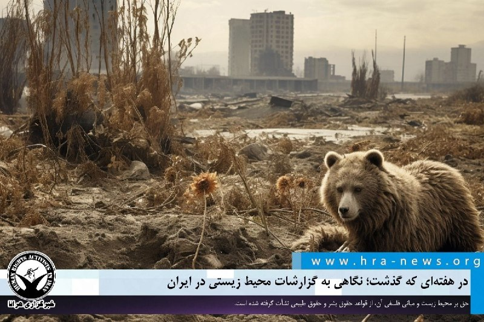

در هفته‌ای که گذشت؛ نگاهی به گزارشات محیط زیستی در ایران

❗️
❗️
❗️
❗️
❗️ – حق بر #محیط_زیست و مبانی فلسفی آن، از قواعد #حقوق_بشر و حقوق طبیعی نشأت گرفته شده است. ابتدایی ترین حق طبیعی انسان در این کره خاکی، «حق حیات» است. اما طی دهه‌های اخیر به دلیل استفاده بی‌رویه از منابع طبیعی، عدم نظارت و توجه به مباحث زیست محیطی و الگوهای صحیح، محیط زیست طبیعی به‌شدت آسیب دیده است. گزارش پیش رو حاصل ثبت ۶۵ گزارش محیط زیستی ایران است که در هفته‌ اخیر منتشر و به هدف آگاه‌سازی گردآوری شده است.

به گزارش خبرگزاری هرانا، ارگان خبری مجموعه فعالان حقوق بشر در ایران، در هفته‌‌ای که گذشت لاشه سه قلاده فوک خزری کشف شد. همچنین، بیش از ۵۴ شکارچی و صیاد غیرمجاز و قاچاقچی چوب بازداشت و به مراجع قضایی معرفی شدند. افزون بر این، بر اساس گزارشات منتشر شده، بیش از ۵۵ تن چوب قاچاق کشف و ضبط شد. از سوی دیگر، شاخص کیفی هوا دستکم در ۳۰ شهر ناسالم و خطرناک اعلام شد. از دیگر اخبار مرتبط با محیط زیست میتوان به بحران خشکسالی، پسماندها و آلاینده‌ها در مناطق مختلف اشاره کرد؛ در گزارش پیش رو به برخی از آنها پرداخته شده است.

آسیب رسانی به جنبه های مختلف محیط زیست در ایران کماکان ادامه دارد. از طرفی شهروندانی وجود دارند که به دلیل عدم آموزش یا نیازهای مالی دست به تخریب و آسیب رسانی به محیط زیست می زنند و از سوی دیگر نهادهای متولی در تلاش هستند تا از حجم این آسیب ها بکاهند، هر چند این تلاش ها قابل تقدیر است اما به نظر نمی آید میزان آن با شرایط محیط زیستی ایران تطبیق داشته باشد.

ادامه مطلب

↘️
@hranews_bot تماس ✉️ -  @Hranews  کانال هرانا 🆑

## configx2ray — post 38658

🍆نزدیک 7 عدد npv tunell . Npsternet گذاشتیم منطقه ای وصله ولی صدرصد وصل میشه فقط یکم زمان بدید بزنید اتصال بشه بیاید تلگرام یکم بمونید تا اوکی بشه
❤️

پخش کردن یادتون نره بفرستید تا همه وصل بشن
❤️

## configx2ray — post 38657

  <a href="https://t.me/ConfigX2ray/38657">📎 Download file</a>

کانفیگ برای Npv tunnel ⭕️

به هیچ وج دانلود نزنید باهاش
❤️

رمز فایل : @ConfigX2ray

Channel : https://t.me/ConfigX2ray

## configx2ray — post 38656

  <a href="https://t.me/ConfigX2ray/38656">📎 Download file</a>

کانفیگ برای Npv tunnel ⭕️

به هیچ وج دانلود نزنید باهاش
❤️

رمز فایل : @ConfigX2ray

Channel : https://t.me/ConfigX2ray

## configx2ray — post 38655

  <a href="https://t.me/ConfigX2ray/38655">📎 Download file</a>

کانفیگ برای Npv tunnel ⭕️

به هیچ وج دانلود نزنید باهاش
❤️

رمز فایل : @ConfigX2ray

Channel : https://t.me/ConfigX2ray

## configx2ray — post 38654

  <a href="https://t.me/ConfigX2ray/38654">📎 Download file</a>

کانفیگ برای Npv tunnel ⭕️

به هیچ وج دانلود نزنید باهاش
❤️

رمز فایل : @ConfigX2ray

Channel : https://t.me/ConfigX2ray

## configx2ray — post 38653

  <a href="https://t.me/ConfigX2ray/38653">📎 Download file</a>

کانفیگ برای Npv tunnel ⭕️

به هیچ وج دانلود نزنید باهاش
❤️

رمز فایل : @ConfigX2ray

Channel : https://t.me/ConfigX2ray

## manototv — post 105152

  <a href="telegram/content/manototv_105152_1778257688.mp4">🎬 Download video</a>

رویترز گزارش داده تصاویر ماهواره‌ای این هفته نشان داده‌اند که یک لکه نفتی مشکوک، بخش وسیعی از دریا در نزدیکی جزیره خارک؛ بزرگ‌ترین پایانه صادرات نفت کشور را پوشانده است.
در گزارش رویترز آمده این لکه که به رنگ خاکستری و سفید در تصاویر دیده می‌شود، در فاصله غربی جزیره خارک (به طول حدود ۸ کیلومتر) در بازه زمانی ۶ تا ۸ مه توسط ماهواره‌های اروپایی کوپرنیکوس ثبت شده است.
پژوهشگران محیط‌زیست می‌گویند این لکه «از نظر بصری کاملاً شبیه نفت» است و تخمین زده می‌شود حدود ۴۵ کیلومتر مربع از سطح دریا را پوشانده باشد. به گفته کارشناسان، این می‌تواند بزرگ‌ترین نشت نفتی از زمان آغاز جنگ آمریکا و اسرائیل با ایران در ۷۰ روز گذشته باشد.
با این حال، علت دقیق این نشت و منبع آن هنوز مشخص نیست. تصاویر روز ۸ مه نیز نشانه‌ای از نشت فعال جدید نشان نداده‌اند.
جزیره خارک که حدود ۹۰ درصد صادرات نفت ایران از آن انجام می‌شود، یکی از نقاط کلیدی صنعت نفت کشور است و بخش عمده نفت آن به مقصد چین صادر می‌شود.
در گزارش آمده است که در جریان جنگ اخیر، حملاتی نیز به اهداف نظامی در این منطقه انجام شده و تنش‌های دریایی در خلیج فارس افزایش یافته است. همچنین حضور گسترده نیروهای دریایی و درگیری‌های پراکنده، باعث اختلال گسترده در مسیرهای کشتیرانی و بازار جهانی نفت شده است.

## alonews — post 118707

  <a href="telegram/content/alonews_118707_1778257689.jpg">🎬 Download video</a>

👈مخبر: تنگه هرمز را هیچ‌گاه از دست نخواهیم داد

🔴تنگه هرمز امکانی در حد بمب اتم است؛ یعنی وقتی جایگاهی در دست شما باشد که بتوانید با یک تصمیم کل اقتصاد دنیا را تحت تأثیر قرار دهید، امکانی بسیار بسیار بزرگ است.

🔴ما تنگه هرمز را هیچ‌گاه از دست نخواهیم داد. اماراتی‌ها تنبیه شده‌اند و بیشتر تنبیه خواهند شد.

✅ @AloNews خبر جنگ

## alonews — post 118706

  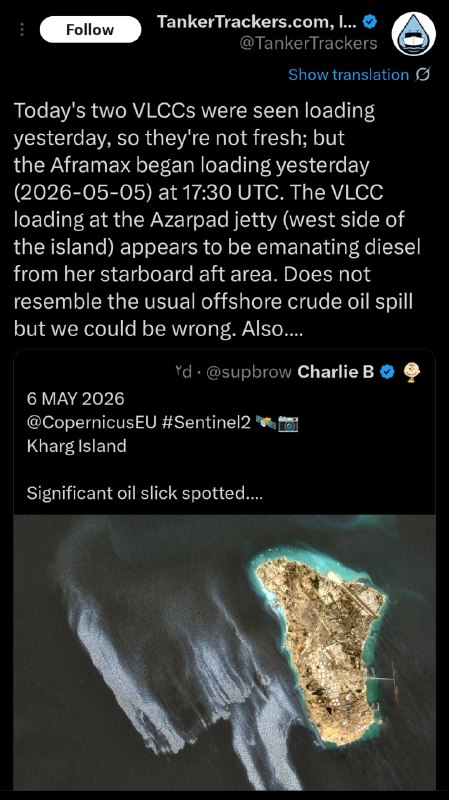

👈تانکر ترکرز: موقع بارگیری نفتکش نشت کرده و احتمال اینکه نفت رو خالی کرده باشند تو آب به خاطر نبود فضای ذخیره سازی خیلی کمه، چون ایران حجم بسیار زیادی هنوز برای ذخیره سازی دارد

✅ @AloNews خبر جنگ

## alonews — post 118705

  <a href="telegram/content/alonews_118705_1778257690.jpg">🎬 Download video</a>

👈مدیریت بحران: احتمال طغیان رودخانه‌های کشور وجود دارد

✅ @AloNews خبر جنگ

## alonews — post 118704

  <a href="telegram/content/alonews_118704_1778257690.jpg">🎬 Download video</a>

👈تسنیم: درگیری‌ها در خلیج فارس فعلاً متوقف شده اما احتمال آغاز مجدد آن وجود دارد

✅ @AloNews خبر جنگ

## alonews — post 118703

  <a href="telegram/content/alonews_118703_1778257690.jpg">🎬 Download video</a>

👈سخنگوی وزارت خارجه: اقدام دیشب آمریکا، هم نقض آتش‌بس بود و هم نقض فاحش منشور سازمان ملل

✅ @AloNews خبر جنگ

## alonews — post 118702

  <a href="telegram/content/alonews_118702_1778257690.jpg">🎬 Download video</a>

👈سی‌ان‌ان: ایران به شناورها هشدار داده که از ناوهای آمریکا دور شوند

✅ @AloNews خبر جنگ

## alonews — post 118701

  <a href="telegram/content/alonews_118701_1778257691.jpg">🎬 Download video</a>

👈حسن قشقاوی، عضو کمیسیون امنیت ملی مجلس: آمریکا ۴۸ ساعت پیش ادعا کرد عملیات موسوم به «آزادی» را متوقف می‌کند و منتظر پاسخ دیپلماتیک ایران است، اما دیشب دست به اقدام نظامی زد.

✅ @AloNews خبر جنگ

## alonews — post 118700

  <a href="telegram/content/alonews_118700_1778257691.jpg">🎬 Download video</a>

👈نیویورک تایمز: ترامپ کنترل خود را بر حزب جمهوری‌خواه از طریق ترکیبی از تطمیع و ارعاب اعمال کرد؛ کسانی که با او همسو هستند، نفوذ، حمایت و فرصت‌های سیاسی به دست می‌آورند، در حالی که کسانی که با او مخالفند با انزوای سختی روبرو می‌شوند که می‌تواند به حرفه سیاسی آنها پایان دهد

✅ @AloNews خبر جنگ

## alonews — post 118699

  <a href="telegram/content/alonews_118699_1778257691.jpg">🎬 Download video</a>

⚽️🇮🇷بالاخره یه حریف تدارکاتی واسه تیم‌ملی قبل جام جهانی پیدا شد؛ تیمِ مخوف گامبیا🇬🇲حاضر شده قبل جام جهانی با ایران بازی دوستانه برگزار کنه. @AloSport

## alonews — post 118698

  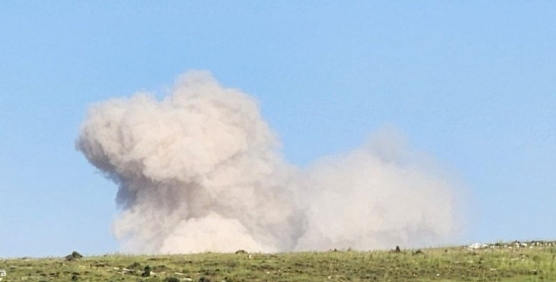

👈حمله‌ی جدید اسرائیل به بنت جبیل لبنان

✅ @AloNews خبر جنگ

## alonews — post 118697

  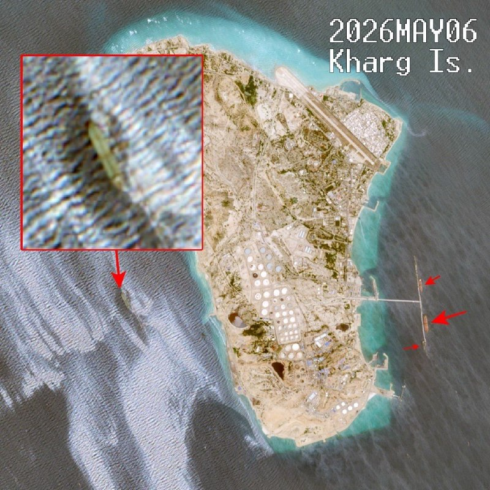

👈رویترز با استناد به تصاویر ماهواره‌ای: نشت مشکوک نفت، ۴۵ کیلومتر مربع در نزدیکی جزیره خارک ایران را پوشانده است.

✅ @AloNews خبر جنگ

## alonews — post 118696

  <a href="telegram/content/alonews_118696_1778257692.jpg">🎬 Download video</a>

👈کانال ۱۲ اسرائیل: جی دی ونس، اکنون در کاخ سفید با نخست‌وزیر قطر، محمد بن عبدالرحمن آل ثانی، برای بررسی مذاکرات با ایران دیدار می‌کند.

🔴قطر در هفته‌های اخیر کانال میانجیگری پنهانی بین ایالات متحده و ایران را اداره می‌کند، در تلاشی برای رسیدن به توافقی برای پایان دادن به جنگ

✅ @AloNews خبر جنگ

## alonews — post 118695

  <a href="telegram/content/alonews_118695_1778257693.jpg">🎬 Download video</a>

👈کانال ۱۲ اسرائیل: جی دی ونس، اکنون در کاخ سفید با نخست‌وزیر قطر، محمد بن عبدالرحمن آل ثانی، برای بررسی مذاکرات با ایران دیدار می‌کند.

🔴قطر در هفته‌های اخیر کانال میانجیگری پنهانی بین ایالات متحده و ایران را اداره می‌کند، در تلاشی برای رسیدن به توافقی برای پایان دادن به جنگ

✅ @AloNews خبر جنگ

## alonews — post 118694

  <a href="telegram/content/alonews_118694_1778257693.jpg">🎬 Download video</a>

👈برزیل اولین مورد ویروس هانتا را تایید کرد.

✅ @AloNews خبر جنگ

## alonews — post 118693

  <a href="telegram/content/alonews_118693_1778257693.jpg">🎬 Download video</a>

👈امام‌جمعه کرج:
دیشب بازم آمریکا رو شکست دادیم

✅ @AloNews خبر جنگ

## alonews — post 118692

  

👈خضریان، عضو کمیسیون امنیت ملی مجلس: جنگ با آمریکا تمام شود، پدر امارات را در می‌آوریم

✅ @AloNews خبر جنگ

---
📅 بروزرسانی: 1405/02/18 18:31
---

## VahidOOnLine — post 238925

  <a href="telegram/content/VahidOOnLine_238925_1778252512.mp4">🎬 Download video</a>

یک شهروند با ارسال پیامی به ایرا‌ن‌اینترنشنال می‌گوید قطع اینترنت موجب افسردگی و ورشکستگی مردم شده است.
‌🏁 🇬🇧 IranintlTV

🤖 @VahidOOnLine

## VahidOOnLine — post 238924

  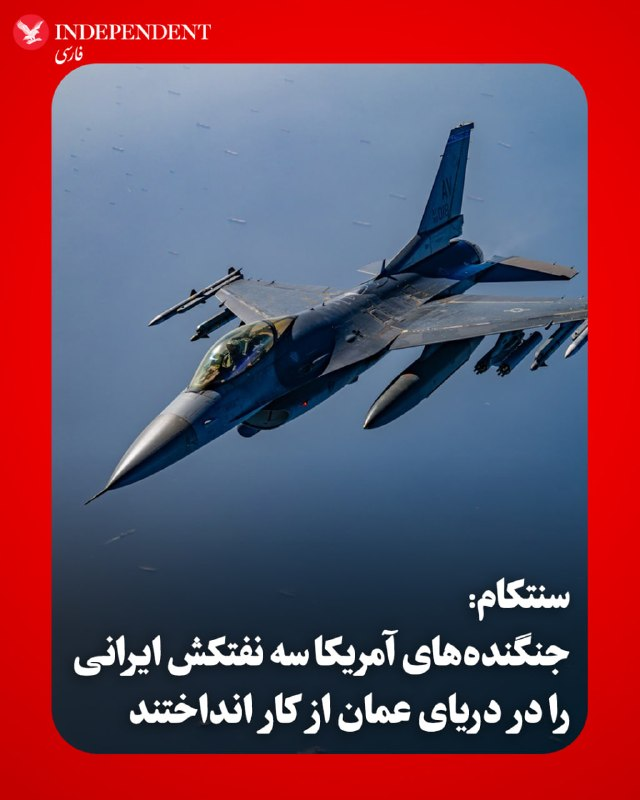

♦️ فرماندهی مرکزی ایالات متحده (سنتکام) اعلام کرد که در راستای اجرای محاصره دریایی ایران، نیروهای آمریکایی طی دو عملیات جداگانه، سه نفتکش با پرچم ایران را که قصد ورود به بنادر این کشور در دریای عمان را داشتند، از کار انداخته‌اند.

در آخرین اقدام در تاریخ ۱۸ اردیبهشت، یک جنگنده F/A-18 سوپر هورنت برخاسته از ناو هواپیمابر «جورج اچ.دبلیو. بوش»، با شلیک مهمات دقیق به دودکش نفتکش‌های «سی استار ۳» (Sea Star III) و «سودا» (Sevda)، آن‌ها را از کار انداخت و مانع ورود این کشتی‌های خالی از بار به بنادر ایران شد. همچنین در ۱۶ اردیبهشت، جنگنده‌ای از ناو «آبراهام لینکلن» با شلیک توپ ۲۰ میلی‌متری، سکان نفتکش «حسنا» (Hasna) را هدف قرار داد و آن را متوقف کرد.

دریادار برد کوپر، فرمانده سنتکام، با تاکید بر پایبندی نیروهای آمریکایی به اجرای کامل محاصره، اعلام کرد که این سه شناور دیگر به سمت ایران در حرکت نیستند. طبق بیانیه سنتکام، تاکنون چندین کشتی تجاری توسط نیروهای آمریکایی از کار افتاده و بیش از ۵۰ فروند دیگر نیز تغییر مسیر داده شده‌اند.
‌🇸🇦 Indypersian

🤖 @VahidOOnLine

## VahidOOnLine — post 238923

  <a href="telegram/content/VahidOOnLine_238923_1778252514.mp4">🎬 Download video</a>

♦️در پی دستور دونالد ترامپ رئیس جمهوری ایالات متحده برای افزایش شفافیت درباره پدیده‌های ناشناس پرنده (UAP)، نهادهای فدرال آمریکا روند انتشار اسناد و ویدیوهای مرتبط با این موضوع را آغاز کردند.
بر اساس این گزارش، فرماندهی هند-اقیانوسیه ایالات متحده در سال ۲۰۲۴ ویدیویی ۹ ثانیه‌ای از یک پدیده ناشناس را به دفتر بررسی ناهنجاری‌های همه‌دامنه (AARO) ارائه کرده است. این ویدیو که با حسگر مادون قرمز ثبت شده، جسمی شبیه به یک ساختار بیضی یا «توپ راگبی» را نشان می‌دهد که دارای سه زائده شعاعی است.
مقام‌های آمریکایی تأکید کرده‌اند که این تصاویر صرفاً برای اطلاع‌رسانی منتشر شده و هیچ نتیجه‌گیری قطعی درباره ماهیت یا منشا این پدیده‌ها ارائه نشده است.
این اقدام در حالی صورت می‌گیرد که به گفته مقامات، «علاقه عمومی گسترده‌ای» نسبت به موضوع اشیاء ناشناس پرنده وجود دارد و دولت آمریکا تلاش دارد برای نخستین‌بار سطحی بی‌سابقه از شفافیت را در این حوزه فراهم کند.
همچنین اعلام شده برخی بخش‌های اسناد به‌منظور حفظ هویت شاهدان و اطلاعات حساس نظامی حذف شده‌اند، اما تغییری در محتوای مربوط به خود پدیده‌های گزارش‌شده ایجاد نشده است
‌🇸🇦 Indypersian

🤖 @VahidOOnLine

## VahidOOnLine — post 238922

  

♦️ اسماعیل بقایی، سخنگوی وزارت امور خارجه جمهوری اسلامی، روز جمعه ۱۸ اردیبهشت اعلام کرد که جنگ با ایالات متحده در وضعیت «آتش‌بس صوری» قرار دارد.

بقایی در گفتگو با خبرگزاری تسنیم درگیری‌های پنجشنبه‌شب در محدوده تنگه هرمز را «نقض فاحش حقوق بین‌الملل» و «نقض آتش‌بس» دانست.

او همچنین گفت که پیشنهادات مذاکراتی همچنان «در دست بررسی» است و تهران به محض اتخاذ تصمیم نهایی، آن را اعلام خواهد کرد.

این اظهارات در حالی مطرح می‌شود که ایالات متحده، جمهوری اسلامی را به اقدام علیه نیروهای آمریکا متهم کرده و درگیری پنجشنبه‌شب را واکنشی به این اقدام دانسته است. همچنین مارکو روبیو، وزیر امور خارجه این کشور، گفت که انتظار دارد پاسخ ایران را تا پایان روز جمعه دریافت کند.
‌🇸🇦 Indypersian

🤖 @VahidOOnLine

## VahidOOnLine — post 238921

  <a href="telegram/content/VahidOOnLine_238921_1778252515.mp4">🎬 Download video</a>

رویترز گزارش داده تصاویر ماهواره‌ای این هفته نشان داده‌اند که یک لکه نفتی مشکوک، بخش وسیعی از دریا در نزدیکی جزیره خارک؛ بزرگ‌ترین پایانه صادرات نفت کشور را پوشانده است.
در گزارش رویترز آمده این لکه که به رنگ خاکستری و سفید در تصاویر دیده می‌شود، در فاصله غربی جزیره خارک (به طول حدود ۸ کیلومتر) در بازه زمانی ۶ تا ۸ مه توسط ماهواره‌های اروپایی کوپرنیکوس ثبت شده است.
پژوهشگران محیط‌زیست می‌گویند این لکه «از نظر بصری کاملاً شبیه نفت» است و تخمین زده می‌شود حدود ۴۵ کیلومتر مربع از سطح دریا را پوشانده باشد. به گفته کارشناسان، این می‌تواند بزرگ‌ترین نشت نفتی از زمان آغاز جنگ آمریکا و اسرائیل با ایران در ۷۰ روز گذشته باشد.
با این حال، علت دقیق این نشت و منبع آن هنوز مشخص نیست. تصاویر روز ۸ مه نیز نشانه‌ای از نشت فعال جدید نشان نداده‌اند.
جزیره خارک که حدود ۹۰ درصد صادرات نفت ایران از آن انجام می‌شود، یکی از نقاط کلیدی صنعت نفت کشور است و بخش عمده نفت آن به مقصد چین صادر می‌شود.
در گزارش آمده است که در جریان جنگ اخیر، حملاتی نیز به اهداف نظامی در این منطقه انجام شده و تنش‌های دریایی در خلیج فارس افزایش یافته است. همچنین حضور گسترده نیروهای دریایی و درگیری‌های پراکنده، باعث اختلال گسترده در مسیرهای کشتیرانی و بازار جهانی نفت شده است.
‌🏁 🇬🇧 ManotoTV

🤖 @VahidOOnLine

## VahidOOnLine — post 238920

  <a href="telegram/content/VahidOOnLine_238920_1778252516.mp4">🎬 Download video</a>

‌
یک مقام آمریکایی به فاکس‌نیوز گفت نیروی هوایی ایالات متحده چند نفتکش را که تلاش داشتند محاصره بنادر ایران را دور بزنند، هدف قرار داده است.

به گفته این مقام، چندین نفتکش خالی هدف قرار گرفته‌اند و احتمال داده می‌شود این کشتی‌ها برای افزایش ظرفیت ذخیره‌سازی نفت ایران مورد استفاده قرار می‌گرفتند.

کارشناسان می‌گویند جمهوری اسلامی حدود ۱۳ روز ظرفیت ذخیره‌سازی نفت در خشکی دارد، اما با استفاده از نفتکش‌های خالی می‌تواند این زمان را بین ۳۰ تا ۴۵ روز افزایش دهد.
‌🏁 🇬🇧 ManotoTV

🤖 @VahidOOnLine

## VahidOOnLine — post 238919

  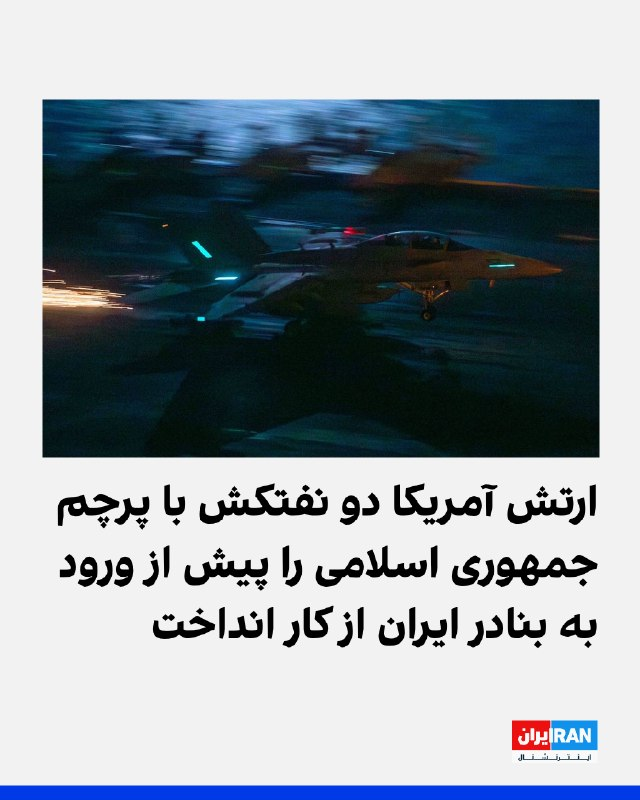

ستاد فرماندهی مرکزی ایالات متحده، سنتکام، اعلام کرد که ارتش آمریکا دو نفتکش خالی با پرچم جمهوری اسلامی را پیش از ورود به بندری ایرانی در دریای عمان متوقف کرد. این اقدام پس از به پرواز درآمدن جنگنده اف۱۸ و شلیک مهمات هدایت‌شونده دقیق به دودکش نفتکش‌ها صورت گرفته است.

بر اساس اعلام سنتکام، نفتکش‌های سودا و سی‌استار سه، به‌دلیل نقض محاصره دریایی از کار افتادند.

سنتکام اعلام کرد: «نیروهای آمریکا همچنین چهارشنبه، نفتکش حسنا با پرچم جمهوری اسلامی را در حالی که تلاش می‌کرد به سمت یک بندر ایرانی در دریای عمان حرکت کند، از کار انداختند. یک فروند جنگنده اف/ای-۱۸ سوپر هورنت از ناو یو‌اس‌اس آبراهام لینکلن (سی‌وی‌ان-۷۲) با شلیک چند گلوله از توپ ۲۰ میلی‌متری، سکان این نفتکش خالی را از کار انداخت.»
‌🏁 🇬🇧 IranintlTV

🤖 @VahidOOnLine

## VahidOOnLine — post 238918

  <a href="telegram/content/VahidOOnLine_238918_1778252517.mp4">🎬 Download video</a>

‌
خبرگزاری حکومتی فارس گزارش داد:
«از ساعتی پیش درگیری‌های پراکنده‌ای میان نیروهای مسلح ایران و شناورهای آمریکایی‌ در محدودهٔ تنگهٔ هرمز در جریان است.»
‌🏁 🇬🇧 ManotoTV

🤖 @VahidOOnLine

## VahidOOnLine — post 238917

  <a href="telegram/content/VahidOOnLine_238917_1778252517.mp4">🎬 Download video</a>

‌
ویدیوهای منتشرشده در شبکه‌های اجتماعی برخاستن ستونی از دود در اطراف فرودگاه دبی را نشان می‌دهد.

هم‌زمان، وزارت دفاع امارات اعلام کرد سامانه‌های پدافندی این کشور با دو موشک بالستیک و سه پهپاد که از سوی جمهوری اسلامی شلیک شده بودند، درگیر شده‌اند.
به گفته این وزارتخانه، در جریان این درگیری‌ها سه نفر دچار جراحات «متوسط» شده‌اند.
این رویداد در حالی رخ می‌دهد که آتش‌بس میان ایالات متحده و جمهوری اسلامی در ساعات گذشته با تبادل حملات میان دو طرف تحت فشار قرار گرفته است.
امارات پیش‌تر نیز در جریان این تنش‌ها تحت تأثیر حملات قرار گرفته بود.
با وجود حضور پایگاه‌های نظامی آمریکا در امارات، هنوز مشخص نیست اهداف این حملات چه بوده و آیا خسارتی به زیرساخت‌ها وارد شده است یا نه.
‌🏁 🇬🇧 ManotoTV

🤖 @VahidOOnLine

## VahidOOnLine — post 238916

  <a href="telegram/content/VahidOOnLine_238916_1778252518.mp4">🎬 Download video</a>

قطع اینترنت خاموش کردن صدای مردم است
‌🏁 🇬🇧 ManotoTV

🤖 @VahidOOnLine

## VahidOOnLine — post 238915

  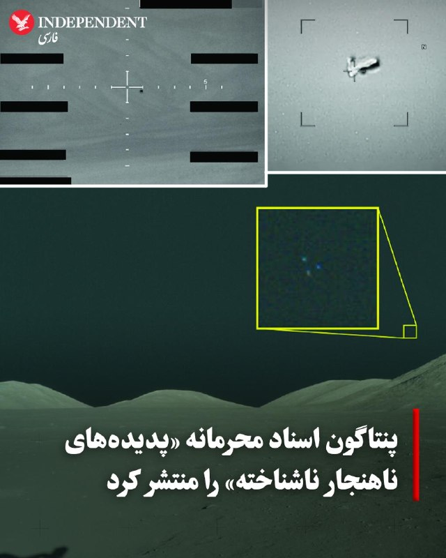

♦️وزارت دفاع ایالات متحده، پنتاگون روز جمعه ۱۸ اردیبهشت در پی دستور مستقیم دونالد ترامپ، مجموعه‌ای از اسناد طبقه‌بندی‌شده و «دیده‌نشده» مربوط به اشیاء ناشناس پرنده (UFO) را که اکنون با نام رسمی «پدیده‌های ناهنجار ناشناخته» (UAP) معرفی می‌شوند، منتشر کرد. پنتاگون اعلام کرد که از این پس شهروندان می‌توانند بدون نیاز به سطح دسترسی امنیتی، به ویدیوها، تصاویر و اسناد اصلی دولتی در این زمینه دسترسی داشته باشند.

این اقدام پس از آن صورت گرفت که ترامپ در پیامی در «تروث سوشال»، به آژانس‌های دولتی دستور داد روند شناسایی و انتشار اسناد مرتبط با حیات فرازمینی و پدیده‌های هوایی ناشناخته را آغاز کنند. جرد آیزاکمن، مدیر ناسا، با تمجید از این تصمیم ترامپ، آن را گامی در جهت شفافیت بیشتر دانست و تأکید کرد که ناسا همچنان به دنبال کشف اسرار جهان و درک پدیده‌های ناشناخته خواهد بود.
‌🇸🇦 Indypersian

🤖 @VahidOOnLine

## VahidOOnLine — post 238914

  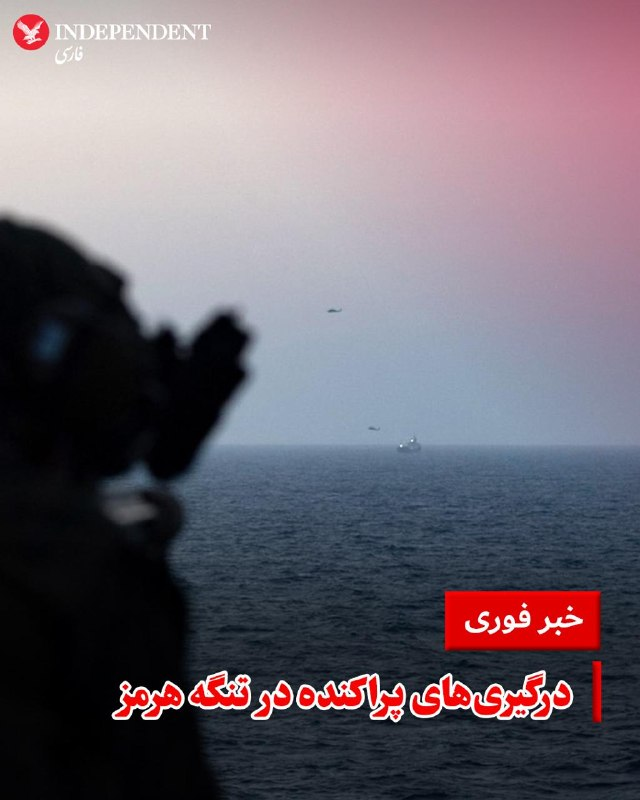

♦️خبرگزاری فارس، وابسته به سپاه پاسداران، روز جمعه ۱۸ اردیبهشت از وقوع «درگیری‌های پراکنده» میان نیروهای مسلح جمهوری اسلامی و آمریکا در محدوده تنگه هرمز خبر داد.

فاکس‌نیوز به نقل از یک مقام آمریکایی، اعلام کرد که این درگیری‌ها ناشی از اقدام آمریکا برای مقابله با حرکت یک نفتکش متعلق به ایران بوده است. بر اساس این گزارش، نفتکش مذکور قصد شکستن محاصره را داشته که با مقابله شناورهای آمریکایی مواجه شده است.
‌🇸🇦 Indypersian

🤖 @VahidOOnLine

## VahidOOnLine — post 238913

  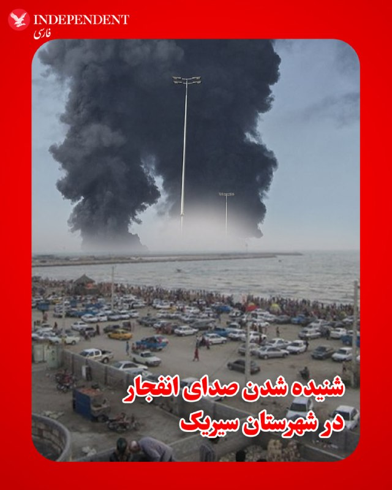

♦️رسانه های وابسته به جمهوری اسلامی اعلام کردند روز جمعه ۱۸ اردیبهشت در محدوده شهرستان سیریک صدای انفجار شنیده شده، اما تاکنون ماهیت این صداها مشخص نشده و هیچ‌یک از نهادهای رسمی درباره آن توضیحی ارائه نکرده‌اند.
‌🇸🇦 Indypersian

🤖 @VahidOOnLine

## VahidOOnLine — post 238912

  

خبرگزاری فارس، وابسته به سپاه پاسداران، گزارش داد که از ساعتی پیش درگیری‌های پراکنده‌ای میان نیروهای مسلح جمهوری اسلامی و شناورهای آمریکایی‌ در محدوده تنگه هرمز در جریان است.

فاکس‌نیوز نیز از حملات ارتش آمریکا به چند نفتکش خالی که قصد شکستن محاصره دریایی را داشتند، خبر داده است.
‌🏁 🇬🇧 IranintlTV

🤖 @VahidOOnLine

## VahidOOnLine — post 238911

  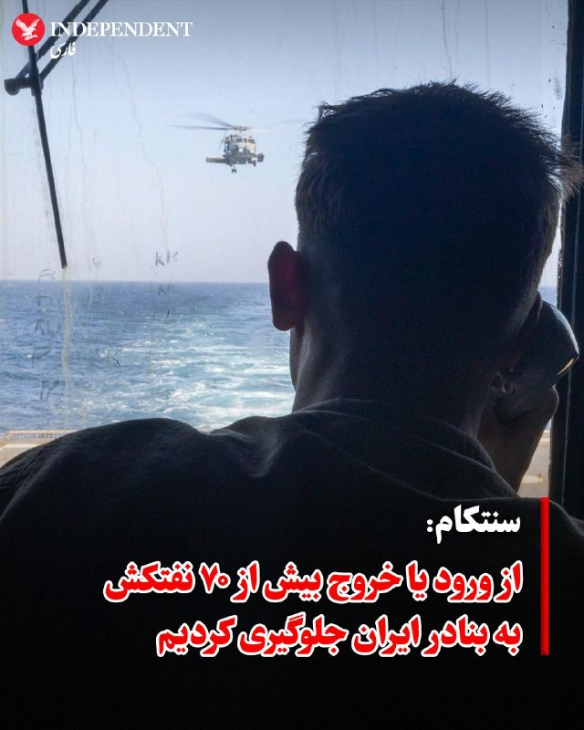

♦️فرماندهی مرکزی ایالات متحده (سنتکام) روز جمعه، ۱۸ اردیبهشت، اعلام کرد که در راستای محاصره دریایی ایران، از ورود یا خروج بیش از ۷۰ شناور به بنادر این کشور جلوگیری شده است.

سنتکام در پیامی در شبکه اجتماعی ایکس نوشت: «در حال حاضر نیروهای آمریکایی مانع از تردد بیش از ۷۰ نفتکش به بنادر ایران شده‌اند. این کشتی‌های تجاری ظرفیت جابه‌جایی بیش از ۱۶۶ میلیون بشکه نفت ایران را دارند که ارزش آن افزون بر ۱۳ میلیارد دلار برآورد می‌شود.»

فرماندهی مرکزی آمریکا همچنین افزود که تاکنون بیش از ۵۰ شناور دیگر نیز تغییر مسیر داده شده‌اند.
‌🇸🇦 Indypersian

🤖 @VahidOOnLine

## VahidOOnLine — post 238910

  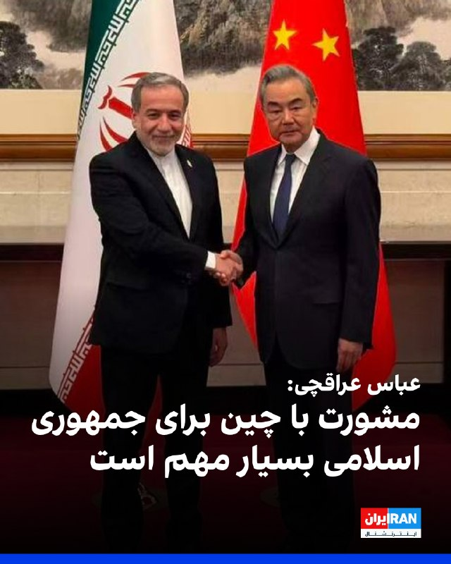

عباس عراقچی، وزیر امور خارجه جمهوری اسلامی، درباره دیدار با همتای چینی خود، گفت: «با توجه به شراکت راهبردی عمیق میان دو کشور، مشورت‌های مستمر و نزدیک با چین برای جمهوری اسلامی بسیار حائز اهمیت است.»
او افزود: «مسائل کلیدی از جمله جنگ اخیر و وضعیت تنگه هرمز مورد بحث قرار گرفتند.»
‌🏁 🇬🇧 IranintlTV

🤖 @VahidOOnLine

## VahidOOnLine — post 238909

  <a href="telegram/content/VahidOOnLine_238909_1778252522.mp4">🎬 Download video</a>

سخنگوی وزارت امور خارجه جمهوری اسلامی اعلام کرد که اقدام انجام‌شده از سوی آمریکا در شب گذشته، هم «نقض آشکار حقوق بین‌الملل» بوده و هم «نقض آتش‌بس».
او در ادامه گفت «نیروهای مسلح ایران در پاسخ ضربه سنگینی به دشمن وارد کرده‌اند» و با تمام توان، «تحرکات و اقدامات طرف مقابل را دفع کرده‌اند».
بقایی همچنین تأکید کرد که ایران در وضعیت «آتش‌بس اسمی» قرار دارد.
او درباره مذاکرات نیز گفت که پیشنهاد ارائه‌شده از سوی آمریکا در حال بررسی است و در صورت رسیدن به نتیجه نهایی، به‌طور رسمی اعلام خواهد شد.
‌🏁 🇬🇧 ManotoTV

🤖 @VahidOOnLine

## VahidOOnLine — post 238908

  <a href="telegram/content/VahidOOnLine_238908_1778252522.mp4">🎬 Download video</a>

«صدای علی صفری باشید»
‌🏁 🇬🇧 ManotoTV

🤖 @VahidOOnLine

## VahidOOnLine — post 238907

  <a href="telegram/content/VahidOOnLine_238907_1778252523.mp4">🎬 Download video</a>

خبرگزاری‌های داخلی از قول فرماندار میناب گزارش داده‌اند پیکر یکی از پنج ملوان مفقود شده دیشب در پی حملات آمریکا پیدا شده‌است. فرماندار میناب پیش‌تر اعلام کرده بود در جریان حملات آمریکا در آب‌های تنگه هرمز و دریای مکران که شب گذشته صورت گرفته، یک شناور باری در نزدیکی آب‌های میناب مورد هدف قرار گرفته و دچار آتش‌سوزی شده است. بر پایه این اعلام در این لنج، ۱۵ ملوان حضور داشتند که ۱۰ تن از آن‌ها مصدوم و پنج نفر مفقود شده‌ بودند که اکنون اعلام شده یکی از آن‌ها کشته شده‌اند.
‌🏁 🇬🇧 ManotoTV

🤖 @VahidOOnLine

## VahidOOnLine — post 238906

♦️مارکو روبیو، وزیر امور خارجه ایالات متحده، در گفتگو با فاکس‌نیوز در ایتالیا تاکید کرد هرگونه حمله به نیروها یا شناورهای آمریکایی با پاسخ مستقیم مواجه خواهد شد.
او با اشاره به درگیری‌های پنجشنبه شب گفت اگر به یک کشتی نیروی دریایی آمریکا شلیک شود، واشینگتن «قطعاً پاسخ خواهد داد» و این اقدام را بدیهی دانست.
روبیو افزود: «فقط کشورهای نادان هستند که وقتی به آن‌ها شلیک می‌شود، پاسخ نمی‌دهند.»
وزیر خارجه آمریکا همچنین هشدار داد در صورت تهدید آمریکایی‌ها، عاملان هدف قرار خواهند گرفت و این موضوع را «خط قرمز» واشینگتن توصیف کرد.
او در ادامه با اشاره به توان نظامی ایران گفت این کشور دیگر نیروی دریایی مؤثری ندارد و تلاش‌ها بیشتر از طریق قایق‌های تندرو انجام می‌شود. روبیو تأکید کرد در صورت نزدیک شدن این قایق‌ها به شناورهای آمریکایی، نیروهای آمریکا آن‌ها را هدف قرار خواهند داد.
‌🇸🇦 Indypersian

🤖 @VahidOOnLine

## mwarmonitor — post 8703

  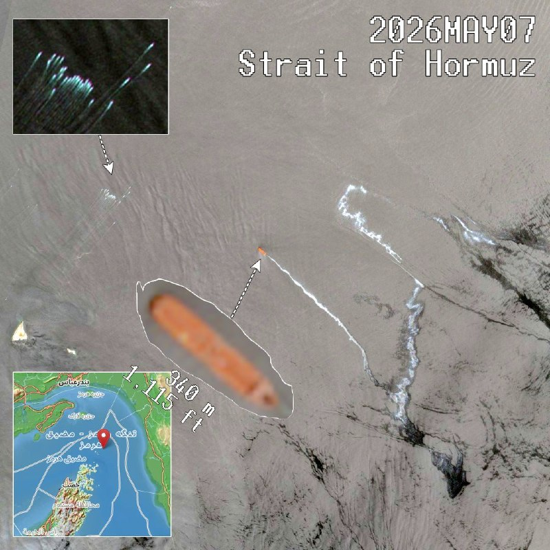

🚢یک نفتکش بسیار بزرگ (VLCC) با طول حدود ۳۴۰ متر که هویت آن مشخص نشده، دیروز در تنگه هرمز در مختصات 26.528، 56.594 در ساعت 0647 به وقت UTC مشاهده شد.

🔴گزارش شده که احتمالاً از بخش موتورخانه آن نشت نفت رخ داده است، احتمالاً به دلیل یک حادثه مرتبط با ایران 🇮🇷، و این اتفاق تنها ۴ مایل دریایی شمال‌شرقی جزایر «السلامه» در عمان 🇴🇲 رخ داده است.

🚤همچنین فعالیت شدید قایق‌های کوچک با سرعت بالا مشاهده شده که به سمت شمال‌شرق در حال حرکت هستند.

@mwarmonitor

## mwarmonitor — post 8702

  <a href="telegram/content/mwarmonitor_8702_1778252524.mp4">🎬 Download video</a>

🚨ناتوان‌سازی ۲ نفت‌کش دیگر توسط ایالات متحده به دلیل نقض محاصره در دریای عمان 🇺🇸ستاد فرماندهی مرکزی ایالات متحده (CENTCOM) 📌تمپا، فلوریدا — نیروهای ایالات متحده در تاریخ ۸ مه، پیش از ورود نفت‌کش‌های M/T Sea Star III و M/T Sevda به یکی از بنادر ایران در دریای…

## mwarmonitor — post 8701

📝شرایط جوریه که اگه اسرائیل یه ترقه تو بیروت در کنه، جمهوری اسلامی می‌گه «نقض فاحش آتش‌بس» رخ داده و باید انتقام گرفت؛ اما اگه کل سواحل جنوب خودمون زیر آتیش بره، احتمالاً میگن «این‌ها صدای تمرینات نورافشانی برای جشن پیروزی مقاومت بوده، نگران نباشید!»

🔸در واقع استراتژی اینه: «خط قرمز ما امنیت حزب‌الله‌ه، اما امنیت بندرعباس و قشم جزو موارد اختیاری و آپشنال سیستم محسوب میشه که فعلاً بهش بودجه تعلق نگرفته.»

@mwarmonitor

## mwarmonitor — post 8700

🚨ناتوان‌سازی ۲ نفت‌کش دیگر توسط ایالات متحده به دلیل نقض محاصره در دریای عمان

🇺🇸ستاد فرماندهی مرکزی ایالات متحده (CENTCOM)

📌تمپا، فلوریدا — نیروهای ایالات متحده در تاریخ ۸ مه، پیش از ورود نفت‌کش‌های M/T Sea Star III و M/T Sevda به یکی از بنادر ایران در دریای عمان، آن‌ها را به دلیل نقض محاصره جاری از سوی ایالات متحده، ناتوان (متوقف) کردند.
🔸ستاد فرماندهی مرکزی ایالات متحده (سنتکام) اقدامات مربوط به محاصره را علیه دو نفت‌کش خالی با پرچم ایران که قصد پهلوگیری در یک بندر ایرانی در دریای عمان را داشتند، به اجرا گذاشت. یک فروند جنگنده F/A-18 Super Hornet متعلق به ناو هواپیمابر یو‌اس‌اس جورج اچ.دبلیو بوش (CVN 77)، پس از شلیک مهمات دقیق به سمت دودکش‌های این دو نفت‌کش، آن‌ها را ناتوان کرد و مانع از ورود این کشتی‌های غیرمنصاع به ایران شد.
🔸نیروهای ایالات متحده همچنین در تاریخ ۶ مه، نفت‌کش M/T Hasna با پرچم ایران را که در تلاش بود به سمتی بندری در ایران در دریای عمان حرکت کند، ناتوان کردند. یک جنگنده F/A-18 Super Hornet از ناو هواپیمابر یو‌اس‌اس آبراهام لینکلن (CVN 72) با شلیک چندین گلوله از توپ ۲۰ میلی‌متری، سکان این نفت‌کش خالی را از کار انداخت.
🔸هر سه شناور مذکور دیگر به سمت ایران در حال حرکت نیستند.
دریاسالار برد کوپر، فرمانده سنتکام، در این باره گفت:
🔹«نیروهای ایالات متحده در خاورمیانه به اجرای کامل محاصره علیه شناورهایی که به ایران وارد یا از آن خارج می‌شوند، متعهد می‌مانند. مردان و زنان متخصص ما در لباس ارتش، عملکرد فوق‌العاده‌ای از خود نشان می‌دهند.»
🔸تاکنون چندین شناور تجاری ناتوان شده و بیش از ۵۰ فروند دیگر توسط نیروهای سنتکام برای اطمینان از پایبندی به قوانین، تغییر مسیر داده شده‌اند.

@mwarmonitor

## mwarmonitor — post 8699

🇺🇸🛸وزارت جنگ ایالات متحده اسناد مربوط به برخوردها با «پدیده‌های ناشناس غیرعادی» (UAP) را از حالت محرمانه خارج کرده و منتشر کرده است. این وزارتخانه اعلام کرده که فایل‌های بیشتری نیز به‌صورت تدریجی در آینده منتشر خواهد شد. @mwarmonitor

## mwarmonitor — post 8698

  

✈️حداقل سه هواپیمای سوخت‌رسان نیروی هوایی آمریکا هم‌اکنون از اسرائیل پرواز کرده‌اند؛ دو فروند KC-46A از تل‌آویو و یک فروند KC-135R از ایلات.

@mwarmonitor

## mwarmonitor — post 8689

⚠️خبر فوری: FOX NEWS 🔴 ارتش آمریکا امروز حملات هوایی بیشتری انجام داد و چندین نفتکش خالی را که تلاش می‌کردند محاصره را بشکنند، هدف قرار داد. 🔴به گفته یک مقام ارشد آمریکایی: «این‌ها نفتکش‌های بسیار بزرگ حمل نفت خام (VLCC) بودند… کشتی‌های عظیم و خالی که…

## mwarmonitor — post 8688

⚠️خبر فوری: FOX NEWS

🔴 ارتش آمریکا امروز حملات هوایی بیشتری انجام داد و چندین نفتکش خالی را که تلاش می‌کردند محاصره را بشکنند، هدف قرار داد.
🔴به گفته یک مقام ارشد آمریکایی: «این‌ها نفتکش‌های بسیار بزرگ حمل نفت خام (VLCC) بودند… کشتی‌های عظیم و خالی که تلاش داشتند به ایران بازگردند… و سعی کردند محاصره را دور بزنند…»

@mwarmonitor

## pm_afshaa — post 90369

امروز روز جهانیه اشکه
🫏 روزت مبارک عزیزم
💓

## pm_afshaa — post 90368

امروز روز جهانیه اشکه
🫏

روزت مبارک عزیزم
💓

## pm_afshaa — post 90367

  <a href="telegram/content/pm_afshaa_90367_1778252526.mp4">🎬 Download video</a>

سنتکام ویدیو حمله نیرو دریایی آمریکا به دو نفتکش ایرانی M/T SEA STAR III و M/T Sevda که سعی داشتند از محاصره دریایی آمریکا عبور کنند منتشر کرد. به گفته سنتکام دو نفتکش پس ازحمله متوقف شدن

💧 Rainbet.com the #1 Non-KYC Crypto Casino & Sportsbook @rainbetcom

😁 @Pm_Afshaa

## pm_afshaa — post 90366

🔴براساس گزارش سنتکام، دو نفتکش با پرچم ایران که در حال حرکت به سمت بنادر ایران بودند، در چارچوب اجرای محاصره دریایی آمریکا متوقف شدند.در این گزارش آمده است یک جنگنده اف‌ای 18 مستقر بر ناو هواپیمابر «جورج دبلیو بوش» با شلیک مهمات هدایت‌شونده به بخش دودکش این کشتی‌ها، آن‌ها را از کار انداخته

💧 Rainbet.com the #1 Non-KYC Crypto Casino & Sportsbook @rainbetcom

😁 @Pm_Afshaa

## pm_afshaa — post 90365

پنتاگون برای اولین‌بار، اسناد محرمانهٔ مربوط به UFOها رو منتشر کرده؛ یه ویدئو توسط ارتش ایالات متحده گرفته شده و یک جسم به شکل ستاره رو نشان می‌ده که با حرکتی ضربدری و سریع تو آسمون حرکت می‌کنه

💧 Rainbet.com the #1 Non-KYC Crypto Casino & Sportsbook @rainbetcom

😁 @Pm_Afshaa

## pm_afshaa — post 90364

🔴دستور بازگشایی پناهگاه‌های عمومی در حیفا صادر شد

💧 Rainbet.com the #1 Non-KYC Crypto Casino & Sportsbook @rainbetcom

😁 @Pm_Afshaa

## pm_afshaa — post 90363

🔴فرماندار میناب: در پی حمله دیشب آمریکا، 10 ملوان مجروح و 5 ملوان مفقود شدن

💧 Rainbet.com the #1 Non-KYC Crypto Casino & Sportsbook @rainbetcom

😁 @Pm_Afshaa

## pm_afshaa — post 90362

🔴چندین تانکر بزرگ نفت و گاز که سعی داشتند محاصره آمریکا رو بشکنن، هدف قرار گرفتن 
💧 Rainbet.com the #1 Non-KYC Crypto Casino & Sportsbook @rainbetcom 
😁 @Pm_Afshaa

## pm_afshaa — post 90361

🔴چندین تانکر بزرگ نفت و گاز که سعی داشتند محاصره آمریکا رو بشکنن، هدف قرار گرفتن

💧 Rainbet.com the #1 Non-KYC Crypto Casino & Sportsbook @rainbetcom

😁 @Pm_Afshaa

## iaghapour — post 2592

#فیلترینگ به ما تحمیل شد,
ولی #اینترنت_طبقاتی رو شما باید درخواست بدی تا بهت بدن...

🆔 @iaghapour

## DEJradio — post 4521

  <a href="telegram/content/DEJradio_4521_1778252527.jpg">🎬 Download video</a>

🚨
🔸 وضعیت آتش‌بس و معیشت پرسنل نیروهای مسلح

کارشناس: شهرام سبزواری

#آتشبس #نیروهای_مسلح
@DEJradio

## mamlekate — post 103478

📝 قابلیت حفظ حریم خصوصی اینستاگرام غیرفعال شد؛ این موضوع چه تاثیری بر پیام‌های شخصی شما دارد؟

اینستاگرام اعلام کرد که فناوری رمزگذاری سرتاسری را غیرفعال می‌کند؛ اقدامی که چرخشی ۱۸۰ درجه‌ای در سیاست‌های شرکت مادر اینستاگرام، یعنی متا، محسوب می‌شود.

@mamlekate

## kianmeli1 — post 87275

  <a href="telegram/content/kianmeli1_87275_1778252528.mp4">🎬 Download video</a>

🔴حمله دیشب به دو نفتکش جمهوری اسلامی
https://t.me/kianmeli1

## kianmeli1 — post 87274

  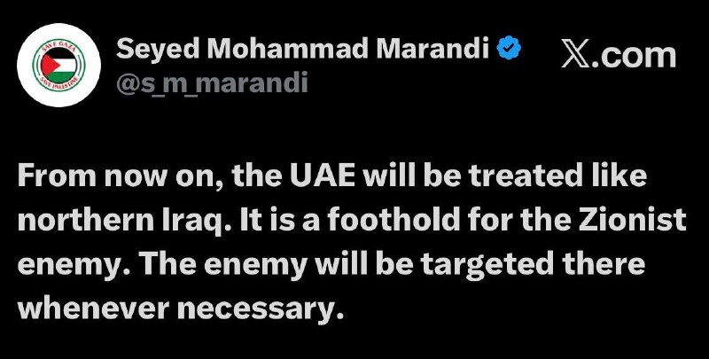

🔴تهدید شدید علیه امارات توسط مرندی

از این به بعد با امارات مانند شمال عراق رفتار خواهد شد. این کشور جای پایی برای دشمن صهیونیستی است. هر زمان که لازم باشد، دشمن در آنجا هدف قرار خواهد گرفت.
https://t.me/kianmeli1

## kianmeli1 — post 87273

‏🔴فوری-براساس گزارش فرماندهی مرکزی آمریکا (سنتکام)، دو نفتکش با پرچم ایران که در حال حرکت به سمت بنادر ایران بودند، در چارچوب اجرای محاصره دریایی آمریکا متوقف شدند.در این گزارش آمده است یک جنگنده اف‌ای ۱۸ مستقر بر ناو هواپیمابر «جورج دبلیو بوش» با شلیک مهمات هدایت‌شونده به بخش دودکش این کشتی‌ها، آن‌ها را از کار انداخته است
https://t.me/kianmeli1

## kianmeli1 — post 87272

🔴وقوع درگیری‌های پراکنده در تنگهٔ هرمز

از ساعتی پیش درگیری‌های پراکنده‌ای میان نیروهای مسلح ایران و شناورهای آمریکایی‌ در محدودهٔ تنگهٔ هرمز در جریان است.

در همین رابطه فاکس‌نیوز به‌نقل از یک مسئول آمریکایی مدعی شد که ارتش آمریکا امروز به نفتکش‌های ایرانی که قصد شکستن محاصره را داشتند، حمله کرد.
https://t.me/kianmeli1

## IranIntlTV — post 336159

  <a href="telegram/content/IranIntlTV_336159_1778252529.mp4">🎬 Download video</a>

یک شهروند با ارسال پیامی به ایرا‌ن‌اینترنشنال می‌گوید قطع اینترنت موجب افسردگی و ورشکستگی مردم شده است.

## IranIntlTV — post 336158

  

ستاد فرماندهی مرکزی ایالات متحده، سنتکام، اعلام کرد که ارتش آمریکا دو نفتکش خالی با پرچم جمهوری اسلامی را پیش از ورود به بندری ایرانی در دریای عمان متوقف کرد. این اقدام پس از به پرواز درآمدن جنگنده اف۱۸ و شلیک مهمات هدایت‌شونده دقیق به دودکش نفتکش‌ها صورت گرفته است.

بر اساس اعلام سنتکام، نفتکش‌های سودا و سی‌استار سه، به‌دلیل نقض محاصره دریایی از کار افتادند.

سنتکام اعلام کرد: «نیروهای آمریکا همچنین چهارشنبه، نفتکش حسنا با پرچم جمهوری اسلامی را در حالی که تلاش می‌کرد به سمت یک بندر ایرانی در دریای عمان حرکت کند، از کار انداختند. یک فروند جنگنده اف/ای-۱۸ سوپر هورنت از ناو یو‌اس‌اس آبراهام لینکلن (سی‌وی‌ان-۷۲) با شلیک چند گلوله از توپ ۲۰ میلی‌متری، سکان این نفتکش خالی را از کار انداخت.»
https://iranintl.com/202605086552

## IranIntlTV — post 336157

وزیر امور خارجه آمریکا: کنترل جمهوری اسلامی بر تنگه هرمز را نخواهیم پذیرفت

مارکو روبیو، وزیر امور خارجه ایالات متحده، اعلام کرد که این کشور کنترل جمهوری اسلامی بر تنگه هرمز را نخواهد پذیرفت. او همچنین گفت که همه کشورها موافقند که داشتن سلاح هسته‌ای از سوی جمهوری اسلامی «غیرقابل قبول است.»

روبیو که به ایتالیا سفر کرده، جمعه ۱۸ اردیبهشت هشدار داد اگر تهران به کشتی‌های نیروی دریایی آمریکا حمله کند نیروهای جمهوری اسلامی نابود خواهند شد.

روبیو در پایان یک سفر دو روزه برای ترمیم روابط در رم و واتیکان به پرسش‌های خبرنگاران پاسخ می‌داد؛ سفری که پس از اختلافات شدید درباره جنگ آمریکا و اسرائیل علیه جمهوری اسلامی و انتقادهای دونالد ترامپ، رییس‌جمهوری آمریکا، از پاپ لئو چهاردهم انجام شد.

از او درباره گزارش‌های یک شرکت داده‌های کشتی‌رانی پرسیده شد که گفته بود جمهوری اسلامی یک نهاد دولتی جدید ایجاد کرده است تا عبور کشتی‌ها از این تنگه را بررسی و مشمول مالیات کند.

روبیو پرسید: «آیا جهان قرار است بپذیرد که ایران اکنون یک آبراه بین‌المللی را کنترل کند؟ جهان برای انجام چه کاری آماده است؟»

پیشتر رسانه‌های بین‌المللی به نقل از داده‌های کشتی‌رانی گزارش دادند که جمهوری اسلامی نهاد جدیدی را برای کنترل کشتی‌رانی در تنگه هرمز ایجاد کرده است.

آسوشیتدپرس پنج‌شنبه ۱۷ اردیبهشت به‌نقل از شرکت داده‌های کشتی‌رانی«لوییدز لیست اینتلیجنس» گزارش داد که این نهاد که «سازمان تنگه خلیج فارس» نام دارد و «خود را به‌عنوان تنها مرجع معتبر برای صدور مجوز عبور کشتی‌ها در تنگه هرمز» معرفی می‌کند.

هشدار درباره حمله به نیروی دریایی این کشور
روبیو همچنین به تهران درباره حمله به دارایی‌های دریایی آمریکا در منطقه هشدار داد.

ایالات متحده اعلام کرد که سه حمله علیه کشتی‌های نیروی دریایی در تنگه هرمز را خنثی کرده است.

او گفت: «خط قرمز روشن است. اگر آمریکایی‌ها را تهدید کنند، منفجر خواهند شد.»

وزیر امور خارجه آمریکا در ادامه تاکید کرد که حملات ۱۷ اردیبهشت ارتباطی با عملیات «خشم حماسی» نداشته است.

روبیو گفت که قرار است جمعه ۱۸ اردیبهشت پاسخ جمهوری اسلامی به طرح پیشنهادی صلح به واشینگتن ارائه شود.

او ابراز امیدواری کرد این پاسخ «جدی» باشد و بتواند مسیر ورود به یک فرآیند مذاکراتی واقعی را باز کند.

دیدار با پاپ و انتقاد از حزب‌الله
روبیو همچنین به دیدار خود با پاپ لئو در ۱۷ اردیبهشت اشاره کرد و گفت این دیدار «بسیار مثبت» بوده است.

واتیکان پنج‌شنبه ۱۷اردیبهشت در بیانیه‌ای پس از نخستین دیدار میان پاپ لئو و یکی از اعضای کابینه ترامپ در نزدیک به یک سال گذشته، اعلام کرد که لئو و روبیو «تعهد مشترک خود را برای تقویت روابط دوجانبه خوب» تجدید کردند.

لئو، نخستین پاپ آمریکایی، پس از آنکه به منتقدی جدی در زمینه جنگ آمریکا و اسرائیل علیه جمهوری اسلامی و نیز سیاست‌های سخت‌گیرانه ضدمهاجرتی دولت ترامپ تبدیل شد، انتقادهای ترامپ را برانگیخت و این انتقادها واکنش منفی رهبران مسیحی از طیف‌های مختلف سیاسی را در پی داشت.

وزیر امور خارجه آمریکا در خصوص مذاکرات با دولت لبنان نیز گفت: «ما می‌خواهیم دولت مشروع لبنان قوی باشد و حزب‌الله مانعی برای این امر است.»
روبیو ادامه داد: «حزب‌الله کاملا یک نیروی نیابتی جمهوری اسلامی است و بدون آنها وجود نخواهد داشت.»

روبیو افزود: «ما در تلاشیم تا تامین مالی حزب‌الله را متوقف کنیم.»

🔗وب‌سایت ایران‌اینترنشنال
@iranintltv

## IranIntlTV — post 336156

  <a href="telegram/content/IranIntlTV_336156_1778252531.mp4">🎬 Download video</a>

سرخط خبرهای جمعه ۱۸ اردیبهشت
@iranintltv

## IranIntlTV — post 336155

  <a href="telegram/content/IranIntlTV_336155_1778252532.mp4">🎬 Download video</a>

لئو هوساکوس، رهبر محافظه‌کاران در مجلس سنای کانادا، در مصاحبه اختصاصی با ایران‌اینترنشنال می‌گوید هیچ نرمشی با جمهوری اسلامی قابل توجیه نیست. او می‌گوید استفاده از عبارات خوشایند مثل حقوق بشر و آزادی بیان نباید به بیانیه‌ها خلاصه شود و باید در عملکرد دولت لیبرال کانادا نیز مشهود باشد.
نسخه کامل این گفت‌وگو در یوتیوب:
https://youtu.be/lOneQwGPQEQ
@iranintltv

## IranIntlTV — post 336154

  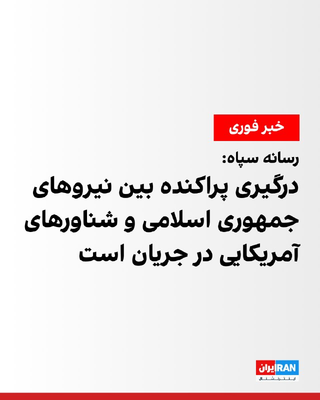

خبرگزاری فارس، وابسته به سپاه پاسداران، گزارش داد که از ساعتی پیش درگیری‌های پراکنده‌ای میان نیروهای مسلح جمهوری اسلامی و شناورهای آمریکایی‌ در محدوده تنگه هرمز در جریان است.

فاکس‌نیوز نیز از حملات ارتش آمریکا به چند نفتکش خالی که قصد شکستن محاصره دریایی را داشتند، خبر داده است.
https://iranintl.com/202605081025

## IranIntlTV — post 336153

  <a href="https://t.me/IranintlTV/336153">📎 Download file</a>

🎧نسخه صوتی دومینو: جنگ تهران و واشینگتن بر سر تنگه هرمز
@iranintlTV

## IranIntlTV — post 336152

اخراج گسترده کارگران پاکستانی‌ از امارات در پی نارضایتی ابوظبی از مواضع اسلام‌آباد

هرچند پاکستان کوشیده در مسیر پایان دادن به جنگ ایران نقش‌آفرینی کند، تحولات اخیر به روابط اسلام‌آباد با یکی از شرکای دیرینه‌اش، امارات متحده عربی، آسیب زده است.

روزنامه نیویورک‌تایمز جمعه ۱۸ اردیبهشت گزارش داد امارات، این کشور ثروتمند حاشیه خلیج فارس، دست به اخراج گسترده کارگران پاکستانی زده است؛ اقدامی که می‌تواند یکی از منابع مهم اشتغال پاکستان را با تهدید روبه‌رو کند.

بر اساس این گزارش، امارات از موضع نه‌چندان قاطع پاکستان در محکوم کردن حملات جمهوری اسلامی به این کشور ناراضی است؛ آن هم در شرایطی که اسلام‌آباد هم‌زمان می‌کوشد میان تهران و واشینگتن برای دستیابی به توافق صلح میانجی‌گری کند.

امارات در جریان جنگ اخیر هدف هزاران حمله موشکی و پهپادی حکومت ایران قرار گرفته و خساراتی را متحمل شده است.

جمهوری اسلامی از ۱۴ اردیبهشت حملات خود را به امارات از سر گرفته است.

در آخرین مورد، سامانه‌های پدافند هوایی امارات ظهر ۱۸ اردیبهشت برای دفع حملات موشکی و پهپادی حکومت ایران وارد عمل شدند.

به گفته منابع رسمی اماراتی، این حملات سه مجروح بر جای گذاشت.

شکاف میان روایت‌های مردمی و رسمی
نیویورک‌تایمز در ادامه گزارش، از گفت‌وگو با بیش از ۲۰ شهروند شیعه پاکستانی که به‌عنوان کارمند شرکت‌های اماراتی در این کشور مشغول به کار بودند، خبر داد.

آنها تایید کردند که همگی ماه گذشته به‌طور ناگهانی بازداشت، زندانی و سپس از امارات اخراج شده‌اند.

رهبران مذهبی شیعه در پاکستان برآورد می‌کنند که از اواخر فروردین‌ماه، احتمالا هزاران شیعه پاکستانی از امارات اخراج شده‌اند.

بر اساس این گزارش، شیعیان پاکستان که جمعیتی حدود ۳۵ میلیون نفر دارند و دارای «پیوندهای معنوی عمیق» با ایران هستند، بارها در این کشورِ عمدتا سنی‌مذهب هدف خشونت‌های فرقه‌ای قرار گرفته‌اند.

دلایل اخراج شهروندان پاکستانی از امارات هنوز به‌طور رسمی مشخص نشده و مقام‌های دو کشور همچنان بر استحکام روابط دوجانبه تاکید دارند.

وزارت امور خارجه پاکستان گزارش‌ها درباره اخراج گسترده شهروندان این کشور از امارات را رد کرده و به پرسش‌ها درباره اینکه آیا شیعیان به‌طور خاص هدف قرار گرفته‌اند یا نه، پاسخی نداده است.

طاهر اندرابی، سخنگوی این وزارتخانه، گفت پاکستانی‌های اخراج‌شده افرادی بوده‌اند که در امارات «مرتکب جرم» شده‌اند.

دولت امارات نیز تاکنون به درخواست‌ها برای اظهارنظر درباره این موضوع واکنشی نشان نداده است.

در روزهای اخیر، مقام‌های جمهوری اسلامی مواضع امارات در قبال جنگ ایران را مورد انتقاد قرار داده و بارها از ادبیات تهدیدآمیز علیه این کشور استفاده کرده‌اند.

علی خضریان، عضو کمیسیون امنیت ملی مجلس، پیش‌تر گفت جمهوری اسلامی «امارات متحده عربی را مانند اقلیم کردستان عراق، پایگاه دشمن می‌داند».

او افزود: «ما دیگر امارات را همسایه نمی‌بینیم، آنها در حکم پایگاه متخاصم هستند.»

آیا امارات از میانجی‌گری پاکستان خشمگین است؟
به گزارش نیویورک‌تایمز، بیش از دو میلیون شهروند پاکستانی در امارات متحده عربی ساکن هستند و سال گذشته میلادی بیش از هشت میلیارد دلار حواله مالی به پاکستان ارسال کردند.

مفتاح اسماعیل، وزیر پیشین دارایی پاکستان، گفت: «حفظ روابط خوب با امارات برای اسلام‌آباد اهمیت دارد، اما در عین حال، نمی‌دانم پاکستان در این جنگ چه مسیر دیگری می‌توانست انتخاب کند.»

در سوی دیگر، ندیم قطیش، تحلیل‌گر اماراتی-لبنانی نزدیک به دولت امارات، گفت اسلام‌آباد ابتکار میانجی‌گری میان آمریکا و جمهوری اسلامی را «بدون هماهنگی کافی» با ابوظبی آغاز کرد.

ماه گذشته، امارات وام ۳.۵ میلیارد دلاری خود به پاکستان را بازپس گرفت؛ رقمی نزدیک به یک‌پنجم ذخایر ارزی این کشور. پس از آن، عربستان سعودی با ارائه سپرده‌ای سه میلیارد دلاری برای تقویت ذخایر ارزی پاکستان وارد عمل شد.

محمدامین شهیدی، روحانی ساکن اسلام‌آباد و رهبر یک سازمان سیاسی شیعه، اعلام کرد این سازمان پنج هزار خانواده اخراج‌شده از امارات را ثبت کرده است.

او گفت: «در کشورهای خلیج فارس این تصور وجود دارد که هر شیعه‌ای از ایران حمایت می‌کند. با توجه به وخامت روابط، درخواست از دولت پاکستان برای گفت‌وگو با امارات بی‌فایده است.»

به گفته شهیدی و شماری دیگر از منابع، روند اخراج شهروندان پاکستانی از ۱۹ فروردین آغاز شد؛ زمانی که تهران و واشینگتن با میانجی‌گری اسلام‌آباد بر سر برقراری آتش‌بس موقت به توافق رسیدند.

به گزارش نیویورک‌تایمز، شمار نامشخصی از کارگران پاکستانی نیز در پی از دست دادن شغل خود به‌دلیل پیامدهای جنگ، امارات را ترک کرده‌اند.

🔗وب‌سایت ایران‌اینترنشنال
@iranintltv

## IranIntlTV — post 336151

  <a href="https://t.me/IranintlTV/336151">📎 Download file</a>

🎧نسخه صوتی اخبار نیم‌روزی | جمعه ۱۸ اردیبهشت
@iranintlTV

## IranIntlTV — post 336150

  

عباس عراقچی، وزیر امور خارجه جمهوری اسلامی، درباره دیدار با همتای چینی خود، گفت: «با توجه به شراکت راهبردی عمیق میان دو کشور، مشورت‌های مستمر و نزدیک با چین برای جمهوری اسلامی بسیار حائز اهمیت است.»
او افزود: «مسائل کلیدی از جمله جنگ اخیر و وضعیت تنگه هرمز مورد بحث قرار گرفتند.»
https://iranintl.com/202605083481

## IranIntlTV — post 336149

  <a href="telegram/content/IranIntlTV_336149_1778252535.mp4">🎬 Download video</a>

بر اساس اطلاعات رسیده به ایران‌اینترنشنال، ماموران حکومتی به مراسم تولد جاویدنام ابوالفضل پایدار در سبزوار یورش برده‌ و با اعمال خشونت مادر، دایی و خواهرزاده‌اش را به اردوگاه تربت حیدریه منتقل کرده‌اند. ابوالفضل پایدار ۱۷ ساله بود که در اعتراضات دی‌ماه کشته شد.
جزییات بیشتر با لیلا سعادتی، عضو تحریریه ایران‌اینترنشنال
@iranintltv

## IranIntlTV — post 336148

  <a href="telegram/content/IranIntlTV_336148_1778252536.mp4">🎬 Download video</a>

وزارت دفاع امارات متحده عربی اعلام کرد در حمله سپاه پاسداران به این کشور سه نفر مجروح شده‌اند. بر اساس این بیانیه جمهوری اسلامی دو موشک بالستیک و سه پهپاد به سوی امارات شلیک کرده است.
گفت‌وگو با علی صدرزاده، تحلیل‌گر مسائل خاورمیانه
@iranintltv

## IranIntlTV — post 336147

  

اسماعیل بقائی، سخنگوی وزارت خارجه جمهوری اسلامی، درباره حملات پنجشنبه و بامداد جمعه آمریکا، گفت: «نیروهای مسلح ما با تمام توان آمادگی دارند و هم با دقت رصد می‌کنند هرجا که لازم باشد با تمام توان به هرگونه تعرض و ماجراجویی پاسخ می‌دهند. اما بایستی گفت که شرارت‌تان دفع شده است.»

بقائی افزود: «درباره مذاکرات باید گفت که در حال بررسی است و به نتیجه نهایی رسیدیم حتما اعلام خواهیم کرد.»
https://iranintl.com/202605088684

## IranIntlTV — post 336146

  

فاکس‌نیوز در شبکه ایکس اعلام کرد که ارتش آمریکا جمعه حملات هوایی بیشتری انجام داده و چند نفتکش خالی را که قصد عبور از محاصره دریایی را داشتند، هدف قرار داده است.

پیش‌تر ارتش آمریکا اعلام کرده بود که شامگاه پنجشنبه و بامداد جمعه در محدوده تنگه هرمز «عملیات دفاعی» انجام داده است.
https://iranintl.com/202605084793

## IranIntlTV — post 336145

«رویا»؛ زن، دیوار و زندان
«رویا»، ساخته مهناز محمدی، که به تازگی در سینماهای آلمان به اکران عمومی درآمده، تصویر روشنی است از احوال یک زن زندانی گرفتار در اوین.

فیلم که از نظر زمانی به زندان‌ها و شکنجه‌های پس از جنبش «زن، زندگی، آزادی» مربوط است، حالا پس از وقایع انقلاب اخیر ایران که به کشته شدن ده‌ها هزار نفر و زندانی شدن افراد بسیار بیشتری انجامید، رنگ و بوی خاصی به خود می‌گیرد و از قید و بند زمان می‌گریزد.

محمدی که خود بارها به‌وسیله نیروهای امنیتی دستگیر شده و ماه‌ها در زندان انفرادی در اوین بوده است، این فیلم را حاصل تجربه شخصی خودش می‌داند. جایی که یک زن در یک سلول سه متر در سه متر نگهداری می‌شود و با توهین و تحقیر و شکنجه از او می‌خواهند که علیه خودش اعتراف کند.

فیلمساز شخصیت اصلی داستان را به معلمی تغییر داده که متهم است از شاگردانش خواسته تا روسری‌های خود را بسوزانند.

فیلم اطلاعات بسیار اندکی درباره شخصیت اصلی‌اش به ما می‌دهد و سعی دارد در حالتی رویاگونه احوال یک زن زیرشکنجه را ترسیم کند. از این رو ۲۰ دقیقه اول فیلم - نقطه قوت آن - سکانس تکان‌دهنده‌ای است در داخل زندان که به تمامی از نقطه‌نظر این زن روایت می‌شود و دوربین جای چشم‌های او را می‌گیرد. زنی محبوس در سلول که چیز زیادی نمی‌بیند - چون چشم‌بند دارد - و تنها از طریق صداها تا حدی می‌فهمد که چه اتفاقاتی در اطراف او رخ می‌دهد و از این رو صدا به ابزاری بسیار مهم در طول فیلم بدل می‌شود که در مجموع بار بزرگی از فیلم را به دوش می‌کشد؛ حتی بیش از تصویر.

۲۰ دقیقه ابتدایی هر چند می‌تواند برای تماشاگر آزارنده باشد - چرا که تصویرها روشن و واضح نیستند و هنوز چیز زیادی درباره این شخصیت نمی‌دانیم - اما در نهایت به یک تجربه عینی از وضعیت یک زندانی تحت‌ شکنجه بدل می‌شود که در آن تماشاگر خواه‌ناخواه در رنج شخصیت اصلی شریک می‌شود.

حالا دیگر اهمیتی ندارد که این شخصیت را می‌شناسیم یا نه. فیلم از این نقطه می‌گریزد و از ما می‌خواهد که در یک تجربه تلخ شریک شویم. همان تجربه‌ای که خود فیلمساز از سر گذرانده و حالا می‌خواهد با ما به اشتراک بگذارد.

او می‌گوید که تجربه‌اش در زندان اطلاعات سپاه در داخل اوین، دقیقا به همین شکل بوده و او در واقع به دلیل داشتن چشم‌بند، چیز زیادی درباره این زندان نمی‌داند. درست به مانند شخصیت اصلی فیلم که تنها با صداهایی ترسناک روبه‌روست.

از اینجاست که فیلم از تماشاگرش می‌خواهد به تخیل پناه ببرد و ساختار و دیوارها و آدم‌های زندان را در ذهن خود بسازد. فیلمساز حتی از این طریق وضعیت شخصیت اصلی فیلمش را به همه افراد در بند در زندان‌های ایران پیوند می‌زند: ما نمی‌دانیم که او کیست، چه کرده و حتی ظاهر فیزیکی و چهره‌اش را نمی‌بینیم، گویی که هیچ‌کدام از این‌ها اهمیتی ندارد و تنها در حال همذات‌پنداری با بیشمار زندانیان مشابه در جمهوری اسلامی هستیم.

همین ترفند جسورانه در این ۲۰ دقیقه ابتدایی، می‌تواند فیلم را در ذهن تماشاگرش حک کند.

ادامه فیلم به قوت این شروع تکان‌دهنده نیست. زمانی که پس از این سکانس پر تنش، سرانجام چهره زن را می‌بینیم که برای مرخصی سه روزه، از زندان بیرون می‌آید.

اما ادامه روایت هم به یک روایت رئالیستی معمول - از جمله فیلم پیشین این فیلمساز با عنوان «پسر-مادر» - ارتباطی ندارد و این فضای پر تردید و پر رویا تا انتها ادامه پیدا می‌کند. جایی که مکان‌ها و زمان‌های مختلف در هم تنیده می‌شوند و در تمام طول فیلم این زن - با بازی ملیسا سوزن، بازیگر اهل ترکیه که در فیلم برنده نخل طلای نوری بیلگه جیلان، «خواب زمستانی»، درخشیده بود - کلمه‌ای بر زبان نمی‌آورد تا عدم قطعیت در رفتار و گفتار اطرافیان او موکد شد، از فضای قبرستان و خواهر خودکشی کرده - که باز معلوم نیست به چه دلیل - تا گفت‌و‌گو با پدر مرده.

همه این فضاها و اتفاقات به شکلی به همان سکانس دیدنی ابتدایی باز می‌گردد: این که یک زن باید به هر قیمت و هر طریقی به‌وسیله بازجویانش خرد شود و بین سال‌ها زندانی شدن یا اعتراف تلویزیونی علیه خود، یکی را انتخاب کند.

فیلم به ما نمی‌گوید که شخصیت اصلی‌اش کدام را برمی‌گزیند.

🔗وب‌سایت ایران‌اینترنشنال
@iranintltv

## IranIntlTV — post 336144

  <a href="telegram/content/IranIntlTV_336144_1778252539.mp4">🎬 Download video</a>

عباس عراقچی بر رعایت حسن همجواری با کشورهای همسایه و احترام به تمامیت ارضی آن‌ها تاکید کرده است. این در حالی است که همزمان گزارش‌هایی از ادامه حملات موشکی و پهپادی به مواضعی در امارات متحده عربی منتشر می‌شود.
گفت‌وگو با علی شیرازی، عضو تحریریه ایران‌اینترنشنال
@iranintltv

## IranIntlTV — post 336143

  

فرماندار میناب اعلام کرد که پیکر بی‌جان یکی از پنج ملوان مفقود شده یک فروند لنج باری که در حمله بامداد جمعه آمریکا هدف قرار گرفته بود، پیدا شد.
پیش‌تر فرماندار میناب اعلام کرده بود که بر اثر این حمله، ۱۰ ملوان مصدوم و ۵ ملوان نیز مفقود شده بودند.
https://iranintl.com/202605087870

## IranIntlTV — post 336141

🗣روایت شما از رویدادهای مربوط به تنش نظامی- جمعه ۱۹ اردیبهشت

🔹ظهر جمعه صدای دو انفجار در غرب اصفهان شنیدیم
🔹بعدازظهر شنبه ساعت ۴:۱۵ صدای انفجار در غرب تهران شنیده شد
🔹جمعه صدای انفجار شدید در بندر کنارک به سمت نیروی دریایی آمد
🔹الان ساعت ۱۲:۳۰ شنبه کنارک را زدند، انفجار خیلی سنگین بود
🔹امروز جمعه ساعت ۱۶:۴۶ در خیابان جی صدای پدافند آمد
🔹دوباره صدای انفجار در سیریک شنیدیم

## IranIntlTV — post 336140

  <a href="telegram/content/IranIntlTV_336140_1778252541.mp4">🎬 Download video</a>

پس از گزارش برخی شهروندان به ایران اینترنشنال درباره وقوع انفجار و شنیدن صدای آن در کنارک، یک شهروند ویدیویی ارسال کرده و آن را مربوط به این انفجار در ظهر جمعه ۱۸ اردیبهشت روایت کرده است.

## IranIntlTV — post 336139

  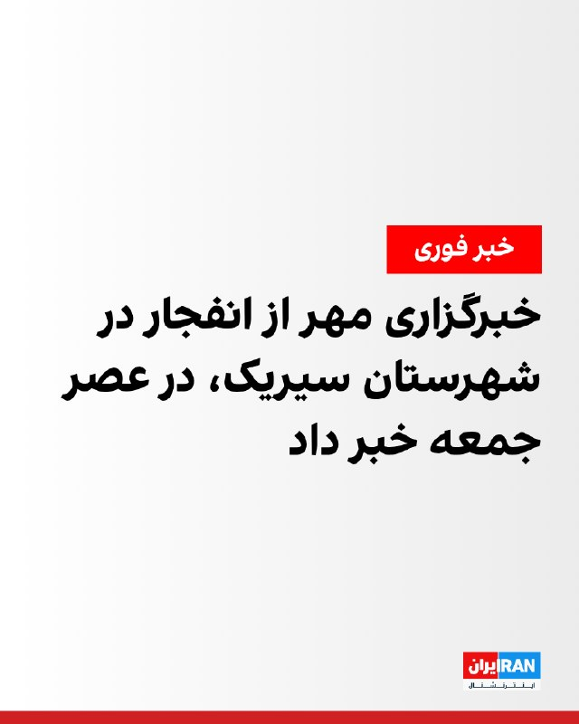

خبرگزاری مهر، وابسته به سازمان تبلیغات اسلامی، از شنیده شدن صدای انفجارهایی در محدوده شهرستان سیریک خبر داد.

بر اساس این گزارش، علت این انفجارها هنوز مشخص نشده است.

شامگاه پنجشنبه نیز اخباری مبنی بر انفجار در سیریک منتشر شده بود.
https://iranintl.com/202605082665

## Shin_Persian — post 5892

Shin ✓ @hey_itsmyturn
Fri, 08 May 2026 13:15:06 UTC

Several aircraft, according to the eyewitness "unmarked", were spotted over Zanjan earlier today, the eyewitness counted 8 aircraft.

[Looks like A340 to me]
Zanjan Province, #Iran

فارسی

چندین فروند هواپیما، که طبق گفته شاهد عینی «بدون علامت» بودند، ساعاتی پیش در آسمان زنجان دیده شدند؛ این شاهد عینی ۸ فروند هواپیما را شمارش کرده است.

[به نظر من شبیه A340 هستند]
استان زنجان، #Iran_

𝕏 · @shin_persian

## Shin_Persian — post 5891

Jennifer Griffin ✓ @JenGriffinFNC
Fri, 08 May 2026 12:58:25 UTC

NEW: US military carried out more airstrikes today hitting several empty tankers trying to break the blockade.

According to a senior US official:
“these were Very Large Crude Carriers (VLCC) .... massive, empty ships trying to make it back to Iran ... attempted to run the blockde...”

فارسی

جدید: ارتش ایالات متحده امروز حملات هوایی بیشتری انجام داد و چندین نفت‌کش خالی را که قصد شکستن محاصره را داشتند، هدف قرار داد.

به گفته یک مقام ارشد آمریکایی:
«این‌ها نفت‌کش‌های غول‌پیکر (VLCC) بودند .... کشتی‌های عظیم و خالی که سعی داشتند به ایران بازگردند ... قصد داشتند از محاصره عبور کنند...»

𝕏 · @shin_persian

## Iliaen — post 4434

گزارش‌ها از دو انفجار در اسکله طاهرویی (هرمزگان) حکایت دارد.

@iliaen

## ManotoTV — post 105151

  <a href="telegram/content/ManotoTV_105151_1778252543.mp4">🎬 Download video</a>

رویترز گزارش داده تصاویر ماهواره‌ای این هفته نشان داده‌اند که یک لکه نفتی مشکوک، بخش وسیعی از دریا در نزدیکی جزیره خارک؛ بزرگ‌ترین پایانه صادرات نفت کشور را پوشانده است.
در گزارش رویترز آمده این لکه که به رنگ خاکستری و سفید در تصاویر دیده می‌شود، در فاصله غربی جزیره خارک (به طول حدود ۸ کیلومتر) در بازه زمانی ۶ تا ۸ مه توسط ماهواره‌های اروپایی کوپرنیکوس ثبت شده است.
پژوهشگران محیط‌زیست می‌گویند این لکه «از نظر بصری کاملاً شبیه نفت» است و تخمین زده می‌شود حدود ۴۵ کیلومتر مربع از سطح دریا را پوشانده باشد. به گفته کارشناسان، این می‌تواند بزرگ‌ترین نشت نفتی از زمان آغاز جنگ آمریکا و اسرائیل با ایران در ۷۰ روز گذشته باشد.
با این حال، علت دقیق این نشت و منبع آن هنوز مشخص نیست. تصاویر روز ۸ مه نیز نشانه‌ای از نشت فعال جدید نشان نداده‌اند.
جزیره خارک که حدود ۹۰ درصد صادرات نفت ایران از آن انجام می‌شود، یکی از نقاط کلیدی صنعت نفت کشور است و بخش عمده نفت آن به مقصد چین صادر می‌شود.
در گزارش آمده است که در جریان جنگ اخیر، حملاتی نیز به اهداف نظامی در این منطقه انجام شده و تنش‌های دریایی در خلیج فارس افزایش یافته است. همچنین حضور گسترده نیروهای دریایی و درگیری‌های پراکنده، باعث اختلال گسترده در مسیرهای کشتیرانی و بازار جهانی نفت شده است.

## ManotoTV — post 105150

  <a href="telegram/content/ManotoTV_105150_1778252544.mp4">🎬 Download video</a>

‌
یک مقام آمریکایی به فاکس‌نیوز گفت نیروی هوایی ایالات متحده چند نفتکش را که تلاش داشتند محاصره بنادر ایران را دور بزنند، هدف قرار داده است.

به گفته این مقام، چندین نفتکش خالی هدف قرار گرفته‌اند و احتمال داده می‌شود این کشتی‌ها برای افزایش ظرفیت ذخیره‌سازی نفت ایران مورد استفاده قرار می‌گرفتند.

کارشناسان می‌گویند جمهوری اسلامی حدود ۱۳ روز ظرفیت ذخیره‌سازی نفت در خشکی دارد، اما با استفاده از نفتکش‌های خالی می‌تواند این زمان را بین ۳۰ تا ۴۵ روز افزایش دهد.

## ManotoTV — post 105149

  <a href="telegram/content/ManotoTV_105149_1778252544.mp4">🎬 Download video</a>

‌
خبرگزاری حکومتی فارس گزارش داد:
«از ساعتی پیش درگیری‌های پراکنده‌ای میان نیروهای مسلح ایران و شناورهای آمریکایی‌ در محدودهٔ تنگهٔ هرمز در جریان است.»

## ManotoTV — post 105148

  <a href="telegram/content/ManotoTV_105148_1778252545.mp4">🎬 Download video</a>

‌
ویدیوهای منتشرشده در شبکه‌های اجتماعی برخاستن ستونی از دود در اطراف فرودگاه دبی را نشان می‌دهد.

هم‌زمان، وزارت دفاع امارات اعلام کرد سامانه‌های پدافندی این کشور با دو موشک بالستیک و سه پهپاد که از سوی جمهوری اسلامی شلیک شده بودند، درگیر شده‌اند.
به گفته این وزارتخانه، در جریان این درگیری‌ها سه نفر دچار جراحات «متوسط» شده‌اند.
این رویداد در حالی رخ می‌دهد که آتش‌بس میان ایالات متحده و جمهوری اسلامی در ساعات گذشته با تبادل حملات میان دو طرف تحت فشار قرار گرفته است.
امارات پیش‌تر نیز در جریان این تنش‌ها تحت تأثیر حملات قرار گرفته بود.
با وجود حضور پایگاه‌های نظامی آمریکا در امارات، هنوز مشخص نیست اهداف این حملات چه بوده و آیا خسارتی به زیرساخت‌ها وارد شده است یا نه.

## ManotoTV — post 105147

  <a href="telegram/content/ManotoTV_105147_1778252546.mp4">🎬 Download video</a>

قطع اینترنت خاموش کردن صدای مردم است

## ManotoTV — post 105146

  <a href="telegram/content/ManotoTV_105146_1778252547.mp4">🎬 Download video</a>

سخنگوی وزارت امور خارجه جمهوری اسلامی اعلام کرد که اقدام انجام‌شده از سوی آمریکا در شب گذشته، هم «نقض آشکار حقوق بین‌الملل» بوده و هم «نقض آتش‌بس».
او در ادامه گفت «نیروهای مسلح ایران در پاسخ ضربه سنگینی به دشمن وارد کرده‌اند» و با تمام توان، «تحرکات و اقدامات طرف مقابل را دفع کرده‌اند».
بقایی همچنین تأکید کرد که ایران در وضعیت «آتش‌بس اسمی» قرار دارد.
او درباره مذاکرات نیز گفت که پیشنهاد ارائه‌شده از سوی آمریکا در حال بررسی است و در صورت رسیدن به نتیجه نهایی، به‌طور رسمی اعلام خواهد شد.

## ManotoTV — post 105145

  <a href="telegram/content/ManotoTV_105145_1778252547.mp4">🎬 Download video</a>

«صدای علی صفری باشید»

## ManotoTV — post 105144

  <a href="telegram/content/ManotoTV_105144_1778252548.mp4">🎬 Download video</a>

خبرگزاری‌های داخلی از قول فرماندار میناب گزارش داده‌اند پیکر یکی از پنج ملوان مفقود شده دیشب در پی حملات آمریکا پیدا شده‌است. فرماندار میناب پیش‌تر اعلام کرده بود در جریان حملات آمریکا در آب‌های تنگه هرمز و دریای مکران که شب گذشته صورت گرفته، یک شناور باری در نزدیکی آب‌های میناب مورد هدف قرار گرفته و دچار آتش‌سوزی شده است. بر پایه این اعلام در این لنج، ۱۵ ملوان حضور داشتند که ۱۰ تن از آن‌ها مصدوم و پنج نفر مفقود شده‌ بودند که اکنون اعلام شده یکی از آن‌ها کشته شده‌اند.

## ManotoTV — post 105143

  <a href="telegram/content/ManotoTV_105143_1778252549.mp4">🎬 Download video</a>

خبرگزاری مهر گزارش داده عصر جمعه در محدوده شهرستان سیریک صدای انفجار گزارش شده است. هنوز ماهیت این صداها مشخص نشده است و نهادهای رسمی در این خصوص اظهار نظر نکرده‌اند.

## ManotoTV — post 105142

  <a href="telegram/content/ManotoTV_105142_1778252549.mp4">🎬 Download video</a>

تانکرترکرز که به رصد حرکت شناورها می‌پردازد در گزارشی به وضعیت Ocean Koi نفت‌کش توقیف شده توسط ارتش پرداخته است. در این گزارش آمده نام این شناور در واقع JIN LI 9255933 است و از تاریخ ۳۰ نوامبر ۲۰۲۵ با این نام فعالیت می‌کرده است. بر اساس داده‌های موجود، این نفتکش از سال ۲۰۲۱ تاکنون دست‌کم در ۱۶ مورد محموله‌های مختلف هیدروکربنی ایران را حمل کرده است؛ موضوعی که به گفته منابع، با آگاهی کامل ایران انجام شده، زیرا نیمی از بارگیری‌ها در بنادر ایران و نیمی دیگر از طریق انتقال کشتی به کشتی در دریا صورت گرفته است.
در اداکه گزارش آمده گفته می‌شود مالکیت این نفتکش در شانگهای چین مستقر است و همچنین یادآوری شده این کشتی در تاریخ ۲۵ فوریه ۲۰۲۶ توسط دفتر کنترل دارایی‌های خارجی آمریکا تحریم شده است.
در پایان این گزارش تانکرترکرز گفته گزارش صدا و سیما از توقیف این نفتکش چیزی جز نمایش نیست. در گزارش صدا و سیما آمده تکاوران نیروی دریایی ارتش با «عملیات ویژه» این نفتکش را به دلیل «تلاش برای اختلال در صادرات نفت ایران و آسیب به منافع ملی» توقیف کردند؛ محموله نفت روی آن متعلق به ایران بوده، به سواحل جنوبی ایران هدایت و به مقامات قضایی تحویل داده شده است.

## ManotoTV — post 105141

  <a href="telegram/content/ManotoTV_105141_1778252550.mp4">🎬 Download video</a>

مارکو روبیو، وزیر خارجه آمریکا، پس از پایان سخنانش در جمع خبرنگاران در ایتالیا، بار دیگر بر موضع واشنگتن تأکید کرد که نیروهای نظامی این کشور در جریان درگیری‌های شب گذشته در تنگه هرمز، در چارچوب «دفاع از خود» عمل کرده‌اند.
او گفت: «آنچه دیروز دیدید این بود که ناوشکن‌های آمریکایی در آب‌های بین‌المللی در حال حرکت بودند و از سوی ایران به آن‌ها شلیک شد و آمریکا برای حفاظت از خود پاسخ دفاعی داد.»
روبیو افزود: «ما شلیک نکردیم، آن‌ها به ما شلیک کردند.»
طبق گزارش‌ها، هم آمریکا و هم جمهوری اسلامی اعلام کرده‌اند که شب گذشته در منطقه تنگه هرمز به یکدیگر حمله کرده‌اند.
ارتش آمریکا گفته است نیروهایش «حملات بدون تحریک ایران» را که سه ناوشکن نیروی دریایی را هدف قرار داده بود رهگیری کرده و در پاسخ، مواضع پرتاب این حملات در داخل ایران را هدف قرار داده است.
در مقابل، تهران پیش‌تر اعلام کرده بود که در پاسخ به آنچه «نقض آتش‌بس توسط واشنگتن» و هدف قرار گرفتن «مناطق غیرنظامی» خوانده، به شناورهای نظامی آمریکا حمله کرده و «خسارات قابل توجهی» به آن‌ها وارد کرده است. فرماندار میناب نیز اعلام کرده در جریان حملات آمریکا در آب‌های تنگه هرمز و دریای مکران که شب گذشته صورت گرفته، یک شناور باری در نزدیکی آب‌های میناب مورد هدف قرار گرفته و دچار آتش‌سوزی شده است. بر پایه این اعلام در این لنج، ۱۵ ملوان حضور داشتند که ۱۰ تن از آن‌ها مصدوم و پنج نفر مفقود شده‌اند.

## ManotoTV — post 105140

  <a href="telegram/content/ManotoTV_105140_1778252551.mp4">🎬 Download video</a>

مارکو روبیو، وزیر خارجه آمریکا، در گفت‌وگو با خبرنگاران در رم اعلام کرد ایالات متحده هیچ‌گونه مذاکره‌ای با حزب‌الله انجام نخواهد داد و تمرکز خود را بر گفت‌وگو با دولت لبنان قرار داده است.
او تأکید کرد که سیاست واشنگتن در این زمینه تغییر نکرده و مسیر دیپلماتیک تنها از طریق دولت رسمی لبنان دنبال خواهد شد.

## ManotoTV — post 105139

  <a href="telegram/content/ManotoTV_105139_1778252551.mp4">🎬 Download video</a>

فرماندار میناب اعلام کرده در جریان حملات آمریکا در آب‌های تنگه هرمز و دریای مکران که شب گذشته صورت گرفته، یک شناور باری در نزدیکی آب‌های میناب مورد هدف قرار گرفته و دچار آتش‌سوزی شده است. بر پایه این اعلام در این لنج، ۱۵ ملوان حضور داشتند که ۱۰ تن از آن‌ها مصدوم و پنج نفر مفقود شده‌اند.

## FarsiVOA — post 217198

🔺آماده‌باش جهانی برای مهار ویروس «هانتا»؛ آمریکا مسافران کشتی کروز را زیرنظر دارد

کشورهای سراسر جهان در رقابتی برای ردیابی مسافرانی هستند که پیش از شناسایی شیوع بیماری، یک کشتی تفریحی گرفتار ویروس هانتا را ترک کردند؛ در حالی که این شناور به سمت جزایر قناری اسپانیا در حرکت است.

⬇️ بیشتر بخوانید:

https://ir.voanews.com/a/cruise-viruses-us-europe-hantavirus-stricken-who-cdc-netherland-/8147652.html

## FarsiVOA — post 217197

🔺ادامه حملات جمهوری اسلامی؛ امارات از رهگیری پنج حمله موشکی و پهپادی جدید خبر داد

▪️وزارت دفاع امارات متحده عربی در روز جمعه ۱۸ اردیبهشت اعلام کرد که پنج حمله موشکی و پهپادی جدید را در آسمان خود رهگیری و منهدم کرده است. این حمله که شامل دو موشک و سه پهپاد می‌شد، سه زخمی در میان ساکنان این کشور به جا گذاشته است.

⬇️ بیشتر بخوانید:

https://ir.voanews.com/a/iran-emirates-war-attack-oil-/8147990.html/?nocach=1

## FarsiVOA — post 217196

ادامه حملات به اقلیم کردستان؛ اختلافات درباره گروه‌های مسلح، بغداد را وارد مرحله تازه‌ای کرد

## FarsiVOA — post 217195

🔺هشدار مارکو روبیو: اگر رژیم ایران آمریکا را تهدید کند، نابود خواهد شد

◾️مارکو روبیو، وزیر امور خارجه ایالات متحده، در هشداری تند به حکومت ایران گفت: خط قرمز روشن است: اگر جمهوری اسلامی آمریکا را تهدید کند، نابود خواهد شد.

⬇️ بیشتر بخوانید:

https://ir.voanews.com/a/us-italy-rubio-melony-visit-prime-minister-state-secretary-iran-/8147983.html

## FarsiVOA — post 217194

چگونه «امارات متحده عربی» از متحد مالی و اقتصادی جمهوری اسلامی به «دشمن» تبدیل شد؛ گفت‌وگو با یاسین اهوازی

## FarsiVOA — post 217193

دونالد ترامپ: به رغم تبادل آتش تازه بین دو کشور، ما همچنان در حال مذاکره با ایرانی‌ها هستیم

## FarsiVOA — post 217192

مدیرعامل شرکت غول نفتی «شِل» می‌گوید بازار نفت با کمبودی نزدیک به یک میلیارد بشکه روبه‌رو است؛ رقمی که معادل ۱۰ روز مصرف جهانی نفت است.

خبرگزاری بلومبرگ روز پنج‌شنبه گزارش داده بود که تولید روزانه نفت اوپک در ماه گذشته به حدود ۲۰ میلیون بشکه سقوط کرده که کمترین سطح طی ۳۶ سال گذشته است.

قیمت‌های جهانی نفت نیز از زمان انسداد تنگه هرمز توسط جمهوری اسلامی و حملات گسترده به کشورهای عرب منطقه بیش از ۳۰ درصد افزایش یافته است.

تنگه هرمز پیش از انسداد، محل عبور ۲۰ درصد از نفت، محصولات نفتی و گاز مایع مصرفی جهان بود.

گزارش کامل را در وب‌سایت صدای آمریکا بخوانید.

@FarsiVOA

## FarsiVOA — post 217191

  <a href="telegram/content/FarsiVOA_217191_1778252552.mp4">🎬 Download video</a>

یک مخاطب صدای آمریکا از ارومیه می‌گوید فشار تورم و بحران اقتصادی زندگی خانواده‌اش را به مرز فروپاشی رسانده است. او می‌گوید همسرش به دلیل رکود بازار، مغازه لوازم خانگی خود را تعطیل کرده و درآمد شغل پرستاری او نیز دیگر پاسخگوی هزینه‌های زندگی نیست.

## FarsiVOA — post 217190

  

مارکو روبیو، وزیر امور خارجه ایالات متحده هرگونه تلاش جمهوری اسلامی ایران برای ایجاد نهادی جهت کنترل تردد در تنگه هرمز را «غیرقابل‌قبول» خواند.
آقای روبیو که در ایتالیا حضور دارد، به پیگیری روند دیپلماتیک برای پایان دادن به جنگ اشاره کرد و از انتظار واشینگتن برای دریافت پاسخ حکومت ایران در روز جمعه ۱۸ اردیبهشت خبر داد: «ما در مقطعی از امروز منتظر دریافت پاسخ از سوی آن‌ها هستیم. هنوز پاسخی دریافت نکرده‌ایم... من امیدوارم که این یک پیشنهاد جدی باشد؛ واقعاً امیدوارم.»

## DW_Farsi — post 124450

  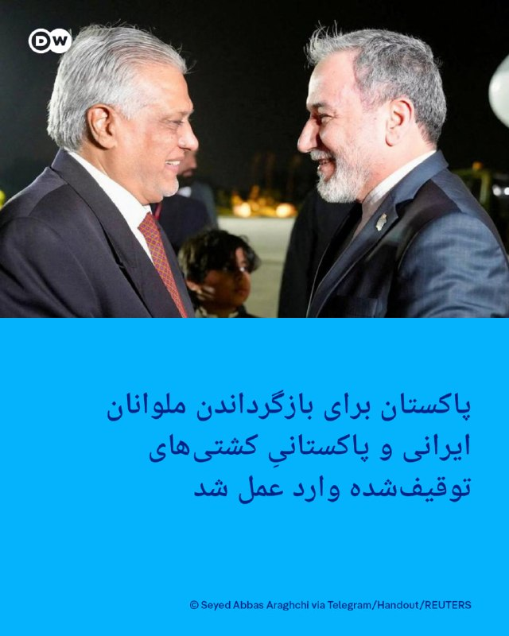

🔶 پاکستان برای بازگرداندن ملوانان ایرانی و پاکستانیِ کشتی‌های توقیف‌شده وارد عمل شد

اسحاق دار، وزیر خارجه پاکستان، روز جمعه ۸ مه (۱۸ اردیبهشت) اعلام کرد با عباس عراقچی، وزیر خارجه ایران، و ویویان بالاکریشنان، وزیر خارجه سنگاپور، درباره تسهیل بازگرداندن خدمه کشتی‌هایی که از سوی مقام‌های آمریکایی توقیف شده‌اند گفت‌وگو کرده است. او گفت اسلام‌آباد آماده است بازگشت امن شهروندان ایرانی به ایران را از مسیر پاکستان تسهیل کند.

دار در پیامی در شبکه ایکس نوشت از وزیر خارجه سنگاپور خواسته است برای بازگرداندن ۱۱ ملوان پاکستانی و ۲۰ ملوان ایرانی که روی کشتی‌های توقیف‌شده حضور دارند و اکنون در نزدیکی آب‌های سنگاپور هستند، کمک کند.

او توضیح بیشتری درباره نام کشتی‌ها یا وضعیت دقیق آن‌ها ارائه نکرد.

وزیر خارجه پاکستان همچنین گفت در تماس با عباس عراقچی، آمادگی اسلام‌آباد را برای کمک به انتقال امن شهروندان ایرانی به کشورشان اعلام کرده است.

این موضع نشان می‌دهد پاکستان تلاش دارد در کنار نقش دیپلماتیک خود، در پرونده‌های انسانی ناشی از توقیف کشتی‌ها هم نقش واسطه ایفا کند.
@dw_farsi

## DW_Farsi — post 124449

🔶 "تهدیدهای ایران؛ شکاف میان دولت و نهادهای اطلاعاتی آلمان"

به گزارش نیورک‌تایمز از آغاز جنگ آمریکا و اسرائیل با ایران، میان دفتر صدراعظم، وزارت کشور و نهادهای اطلاعاتی آلمان بر سر شدت تهدیدهای منتسب به ایرانشکاف ایجاد شده است. فریدریش مرتس، صدراعظم و الکساندر دوبرینت، وزیر کشور در مواضع علنی، خطر حملات احتمالی در خاک آلمان را بیشتر در حد احتمال توصیف کرده‌اند، اما شماری از مقام‌های اطلاعاتی، به‌ویژه در سطح ایالت‌ها، این تهدید را بسیار ملموس‌تر و فوری‌تر می‌دانند.

نیویورک‌تایمز به نقل از مقام‌های آلمانی گزارش داد، مقام‌های اطلاعاتی نگران‌اند که اگر دولت لحن هشدارها را بیش از حد ملایم نگه دارد، افکار عمومی خطر را جدی نگیرد. در مقابل، مقام‌های سیاسی بیم دارند که هشدار شدیدتر، خود به تشدید فضای تهدید و اضطراب منجر شود.

نیویورک‌تایمز می‌نویسد همین اختلاف، به تنش میان مقام‌های فدرال و ایالتی دامن زده است. به‌ویژه مسئولان اطلاعاتی در ایالت‌ها، که به محل‌های بالقوه تهدید نزدیک‌ترند، احساس می‌کنند ارزیابی آنها در سطح سیاسی به‌درستی بازتاب پیدا نمی‌کند. حتی در درون جامعه اطلاعاتی نیز این نگرانی وجود دارد که برخی نهادهای فدرال بیش از حد به دفتر صدراعظم نزدیک شده‌اند و در برابر چارچوب سیاسی دولت، مقاومت کافی نشان نمی‌دهند.

این گزارش می‌گوید مقام‌های آلمانی درباره یک نکته اتفاق نظر دارند: ایران در سال‌های اخیر تلاش خود برای پیشبرد حملات و عملیات خرابکارانه در آلمان را افزایش داده است. حتی پیش از آغاز جنگ نیز حدود ۵۰ طرح مشکوک مرتبط با شبکه‌های وابسته به ایران در آلمان شناسایی شده بود و این شبکه‌ها همچنان فعال‌اند.

اهداف اصلی، بنا بر این گزارش، نهادهای یهودی، مخالفان جمهوری اسلامی و برخی منافع آمریکایی و اسرائیلی در آلمان هستند. از جمله به حمله شبانه ماه گذشته به یک رستوران اسرائیلی در مونیخ اشاره شده که در آن، مهاجمان شیشه‌ها را شکستند و مواد انفجاری به داخل پرتاب کردند، هرچند کسی زخمی نشد.

@dw_farsi

## DW_Farsi — post 124448

🔶 ترامپ برای اجرای توافق گمرکی به اتحادیه اروپا مهلت داد

دونالد ترامپ، رئیس‌جمهور آمریکا که پیش از این مدعی شده بود، اتحادیه اروپا به توافق تجاری که پیش‌تر میان دو طرف نهایی شده بود پایبند نیست در پیامی در شبکه تروث سوشال این اتحادیه را تهدید کرده است.

او در این پیام به اتحادیه اروپا تا ۲۵۰مین سالروز تأسیس ایالات متحده در چهارم ژوئیه مهلت داده تا تعهدات خود در زمینه این توافق تعرفه‌ای را انجام دهد.

ترامپ تهدید کرد که در غیر این صورت تعرفه‌ها "بلافاصله به سطح بسیار بالاتری افزایش خواهند یافت."

این تهدید پس از آن مطرح شد که ترامپ گفت‌، "گفت‌‌وگوی بسیار خوبی" با اورزولا فون در لاین، رئیس کمیسیون اروپا در این زمینه داشته است.

فون در لاین نیز در بیانیه‌ای از مکالمه تلفنی "بسیار خوب" با رئیس‌جمهور آمریکا سخن گفت و افزود، هر دو طرف کماکان بر پایبندی دوجانبه به اجرای کامل توافق‌نامه تجاری تاکید دارند.

این سیاستمدار ۶۷ ساله اروپا افزود: «پیشرفت‌های خوبی در جهت کاهش تعرفه‌ها تا اوایل ژوئیه در حال انجام است.»

هفته گذشته دونالد ترامپ اتحادیه اروپا را متهم کرده بود که به طور کامل به توافق گمرکی مذاکره‌شده پایبند نیست و به همین دلیل قصد دارد، تعرفه واردات خودرو و کامیون از اتحادیه اروپا به ایالات متحده را از ۱۵ درصد به ۲۵ درصد افزایش دهد.

چنین افزایش تعرفه‌ای بیش از همه به اقتصاد آلمان ضربه خواهد زد.

ترامپ در پست خود جزئیات بیش‌تری درباره اینکه در صورت عدم تصویب توافق‌نامه تجاری تا آن زمان، دقیقا کدام تعرفه‌ها را از تابستان افزایش خواهد داد، ارائه نکرد.

در میانه ماه اوت سال گذشته، رئیس‌جمهور آمریکا و اورزولا فون در لاین در چارچوبی بر سر تعیین سقف ۱۵ درصدی برای بیش‌تر کالاهای وارداتی از اتحادیه اروپا به آمریکا به توافق رسیده بودند. این نرخ قرار بود برای خودروها و قطعات خودرو از اروپا نیز اعمال شود.

در مقابل، اتحادیه اروپا متعهد شده بود تعرفه‌های خود بر کالاهای صنعتی آمریکا را حذف کند و دسترسی محصولات کشاورزی آمریکا مانند گوشت خوک و لبنیات را به بازار خود آسان‌تر سازد.
@dw_farsi

## DW_Farsi — post 124447

🔶 صادرات آلمان به آمریکا به‌طور چشمگیری سقوط کرد

صادرات شرکت‌های آلمانی به بازار آمریکا در ماه مارس سال ۲۰۲۶ به شدیدترین شکل از زمان بحران کرونا در شش سال پیش کاهش یافت. اداره آمار فدرال آلمان اعلام کرد صادرات به بزرگ‌ترین اقتصاد جهان نسبت به ماه مشابه سال گذشته ۲۱٫۴ درصد کاهش داشته است.

آخرین بار که کاهش شدیدتری ثبت شده بود به ژوئن ۲۰۲۰ برمی‌گردد؛ زمانی که همه‌گیری کرونا اختلالات گسترده‌ای ایجاد کرده بود و صادرات ۲۷٫۴ درصد افت کرده بود. همچنین در مقایسه با فوریه نیز صادرات به آمریکا با کاهش قابل‌توجه ۷٫۹ درصدی به ۱۱٫۲ میلیارد یورو رسید.

با وجود این، آمریکا همچنان مهم‌ترین بازار خارجی صنعت آلمان باقی مانده است. صنعت آلمان در ماه مارس برخلاف انتظار سفارش‌های زیادی دریافت کرد، اما عمدتاً از منطقه اتحادیه اروپا بوده است.

توماس گیتسل، اقتصاددان ارشد بانک VP، کاهش تقاضا از سوی آمریکا را نتیجه مستقیم سیاست‌های تعرفه‌ای دونالد ترامپ دانست و گفت این سیاست‌ها "آثار ترمزکننده آشکاری" بر جا گذاشته‌اند.

سباستین دولین، مدیر علمی مؤسسه اقتصاد کلان و پژوهش‌های چرخه اقتصادی (IMK)، نیز از "فروپاشی چشمگیر صادرات آلمان به آمریکا" سخن گفت. او افزود: «صادرات به ایالات متحده در مقایسه سالانه بیش از یک‌پنجم کاهش یافته؛ افتی که از نظر تاریخی معمولاً فقط در دوران بحران‌های شدید مانند اوج همه‌گیری کرونا دیده می‌شود.» او تأکید کرد: «پیامدهای مخرب سیاست‌های ترامپ را می‌توان به‌وضوح در اینجا مشاهده کرد.»

مؤسسه اقتصاد جهانی کیل (IfW) همچنین به کاهش شدید ارزش دلار اشاره کرد. این مسئله باعث گران‌تر شدن کالاهای وارداتی آلمان در آمریکا شده و توان رقابتی آن‌ها را کاهش داده است. در حال حاضر هر یورو حدود ۱٫۱۷۴۵ دلار ارزش دارد که نسبت به یک سال قبل حدود پنج درصد افزایش نشان می‌دهد.

کارشناسان انتظار ندارند که تجارت با آمریکا به‌زودی بهبود یابد، به‌ویژه اینکه ترامپ تهدید کردهتعرفه واردات خودرو از اتحادیه اروپا را افزایش خواهد داد.

این تعرفه‌ها ممکن است از ۱۵ درصد به ۲۵ درصد برسند و تجارت مهم خودروسازان اروپایی با آمریکا را به‌شدت تحت تأثیر قرار دهند. نیلز یانسن، کارشناس اقتصادی IfW، گفت این اقدام موقعیت رقابتی تولیدکنندگان اروپایی را در برابر شرکت‌های سایر کشورها تضعیف خواهد کرد.
@dw_farsi

## DW_Farsi — post 124437

📸 ایران هفتاد روز در خاموشی قطع اینترنت؛ امنیت یا تبعیض؟

بر اساس تازه‌ترین گزارش نت‌بلاکس، نهاد بین‌المللی پایش وضعیت اینترنت در جهان، قطعی اینترنت در ایران وارد هفتادمین روز شده است. دسترسی به اینترنت آزاد حق هرشهروندی است، اما حالا شاهد ظهور یک تبعیض جدید هستیم: "اینترنت برای ثروتمندان یا خواص نظام". اینکه عده‌ای با پرداخت مبالغ کلان صاحب اینترنت بدون محدودیت می‌شوند، نشان می‌دهد که بهانه‌های امنیتی فقط برای قشر نابرخوردار صادق است. فروختن حقی که قبلاً سلب شده، از سوی بسیاری توجیهی ندارد. از این رو، اینترنت طبقاتی تیر خلاصی بر پیکر عدالت اجتماعی شمرده می‌شود.

در این مطلب شماری از نظرهای کاربران را گرد آورده‌ایم که در میانه این محدودیت‌ها به شبکه جهانی پیوسته و اعتراض خود را بیان کرده‌اند.

گالری عکس را ببینید و نظرات را بخوانید.

@dw_farsi

## DW_Farsi — post 124436

  

🔶 قطعی اینترنت در ایران ۷۰ روزه شد

نت‌بلاکس، یک گروه ناظر اینترنت در عرصه بین‌المللی، اعلام کرده است که قطع گسترده اینترنت در ایران وارد روز هفتادم شده و دسترسی بخش‌های بزرگی از جمعیت را در شرایط جنگی مختل کرده است.

بر اساس گزارش این گروه، این اختلال تاکنون بیش از ۱۶۵۶ ساعت ادامه داشته است. NetBlocks روز جمعه ۸ مه (۱۸ اردیبهشت) در شبکه اجتماعی "ایکس" نوشت که این قطعی از زمان حملات آمریکا و اسرائیل به تهران و بی‌ثباتی منطقه آغاز شده است.

این نهاد تأکید کرده است: «اتصال دیجیتال در زمان بحران حیاتی است» و محدود کردن اینترنت بیشترین آسیب را به افراد دارای معلولیت، دانش‌آموزان، کسب‌وکارهای کوچک و عموم مردم وارد می‌کند.

در ادامه گزارش آمده است که ایران پیش‌تر، یعنی در دیماه سال گذشته و هم‌زمان با سرکوب گسترده اعتراضات ضد دولتی که به گفته ناظران، شدیدترین سرکوب از زمان تأسیس جمهوری اسلامی بوده است، نیز قطعی اینترنت سراسری را برای حدود ۹۲ میلیون نفر اعمال کرده بود.
@dw_farsi

## Persian_Trend_Official — post 13705

  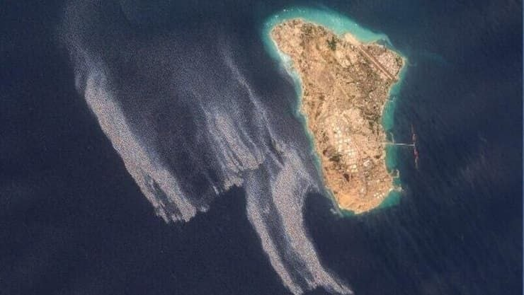

تصاویری ماهواره‌ای حاکی از نشت شدید نفت در جزیره خارک و ریختن آن به خلیج فارس است.

## Persian_Trend_Official — post 13704

  <a href="telegram/content/Persian_Trend_Official_13704_1778252554.mp4">🎬 Download video</a>

🔴سنتکام از هدف قرار دادن دو نفتکش جمهوری اسلامی خبر داد 💢فرماندهی مرکزی ایالات متحده (CENTCOM) اعلام کرد که سه نفت‌کش بدون بار با پرچم ایران را در خلیج عمان غیرفعال کرده است تا اجرای محاصره دریایی بنادر ایران را حفظ کند. 💢جت‌های F/A-18 Super Hornet از…

## Persian_Trend_Official — post 13703

  

🔴سنتکام از هدف قرار دادن دو نفتکش جمهوری اسلامی خبر داد

💢فرماندهی مرکزی ایالات متحده (CENTCOM) اعلام کرد که سه نفت‌کش بدون بار با پرچم ایران را در خلیج عمان غیرفعال کرده است تا اجرای محاصره دریایی بنادر ایران را حفظ کند.

💢جت‌های F/A-18 Super Hornet از ناوهای هواپیمابر USS George H.W. Bush و USS Abraham Lincoln، پس از اینکه کشتی‌ها به هشدارها توجه نکردند، با مهمات دقیق به دودکش‌ها و با توپ ۲۰ میلی‌متری به سکان آنها حمله کردند و عبورشان را متوقف کردند. هیچ تلفاتی گزارش نشده است.

🫆:Tony

📌 @persian_trend_official
پرشین ترند | متفاوت‌ترین کانال نظامی

## Persian_Trend_Official — post 13702

🔴 وقوع درگیری‌های پراکنده در تنگهٔ هرمز

💢از ساعتی پیش درگیری‌های پراکنده‌ای میان نیروهای مسلح ایران و شناورهای آمریکایی‌ در محدودهٔ تنگهٔ هرمز در جریان است.

💢در همین رابطه فاکس‌نیوز به‌نقل از یک مسئول آمریکایی مدعی شد که ارتش آمریکا امروز به نفتکش‌های ایرانی که قصد شکستن محاصره را داشتند، حمله کرد.

💢نیروهای مسلح ایران شب گذشته تلاش نیروهای آمریکایی در حمله به یک نفتکش ایرانی را ناکام گذاشتند./خبرگزاری فارس

🫆:Tony

📌 @persian_trend_official
پرشین ترند | متفاوت‌ترین کانال نظامی

## Persian_Trend_Official — post 13701

  <a href="telegram/content/Persian_Trend_Official_13701_1778252555.jpg">🎬 Download video</a>

🔴 آمار تلفات جنگ در لبنان به بیش از ۱۱ هزار نفر رسید

منابع رسمی لبنان اعلام کردند از زمان ازسرگیری جنگ، شمار کشته‌ها به ۲۷۵۹ نفر و تعداد زخمی‌ها به ۸۵۱۲ نفر افزایش یافته است.

این آمار در حالی منتشر می‌شود که حملات هوایی و توپخانه‌ای اسرائیل به مناطق مختلف جنوب و شرق لبنان همچنان ادامه دارد و درگیری‌ها با حزب‌الله وارد مرحله‌ای شدیدتر شده است.

🫆:Tony

📌 @persian_trend_official
پرشین ترند | متفاوت‌ترین کانال نظامی

## Persian_Trend_Official — post 13700

🔴 حملات هوایی اسرائیل به جنوب لبنان؛ بیش از ۱۰ کشته

در ادامه حملات اسرائیل به جنوب لبنان، منابع لبنانی از کشته شدن دست‌کم ۱۲ نفر در چندین حمله هوایی خبر می‌دهند.

وزارت بهداشت لبنان اعلام کرد:

▪️ حمله هوایی اسرائیل به شهر «طورا» در منطقه صور، ۴ کشته از جمله دو زن و ۸ زخمی بر جای گذاشته است.

▪️ در شهر «سلطانیه» نیز ۴ نفر در حملات هوایی اسرائیل کشته شدند.

خبرگزاری ملی لبنان (NNA) همچنین گزارش داد ارتش اسرائیل مناطق «شقرا»، «براشیت» و «صفد البطیخ» در شهرستان بنت‌جبیل را هدف قرار داده است.

▪️ در حمله‌ای دیگر به جاده «عرب الجل - حومین التحتا» در منطقه الزهرانی، یک خودرو هدف قرار گرفت و ۳ نفر کشته شدند. طبق گزارش‌ها یک موتورسیکلت نیز هنگام حمله از محل عبور می‌کرده و راننده آن در میان کشته‌شدگان است/الجزیره

🫆:Tony

📌 @persian_trend_official
پرشین ترند | متفاوت‌ترین کانال نظامی

## Persian_Trend_Official — post 13699

  <a href="telegram/content/Persian_Trend_Official_13699_1778252556.mp4">🎬 Download video</a>

💢وزارت دفاع امارات متحده عربی از صبح امروز 2 موشک بالستیک و 3 پهپاد ایرانی را رهگیری کرده و در نتیجه سقوط بقایای یک پهپاد 3 نفر به صورت متوسط زخمی شدند. 🫆:Tony 📌 @persian_trend_official پرشین ترند | متفاوت‌ترین کانال نظامی

## Persian_Trend_Official — post 13698

  <a href="telegram/content/Persian_Trend_Official_13698_1778252557.jpg">🎬 Download video</a>

شنیده شدن صدای انفجار  در شهرستان سیریک

💢به گزارش خبرگزاری مهر، عصر جمعه شنیده شدن صدای انفجارهایی در محدوده شهرستان سیریک از سوی ساکنان محلی گزارش شده است.

💢بر اساس این گزارش، هنوز ماهیت این صداها مشخص نیست.

💢هنوز هیچ‌یک از نهادهای رسمی درباره علت وقوع این صداها اظهارنظر نکرده‌اند، اما پیگیری‌ها برای کسب اطلاع از ماهیت انفجارها ادامه دارد.

🫆:Tony

📌 @persian_trend_official
پرشین ترند | متفاوت‌ترین کانال نظامی

## Persian_Trend_Official — post 13697

💢فرماندار میناب

💢در جریان حمله آمریکا به یک شناور در نزدیکی آب‌های این شهرستان، ۱۰ نفر از ۱۵ ملوان حاضر در لنج مصدوم و به بیمارستان منتقل شدند و گروه‌های تجسس در حال تلاش برای اطلاع از وضعیت دیگر ملوانان هستند.

🫆:Tony

📌 @persian_trend_official
پرشین ترند | متفاوت‌ترین کانال نظامی

## RadioFarda — post 156978

🔸ارتش آمریکا روز جمعه تایید کرد که با حمله به دو نفتکش ایرانی دیگر، مانع از عبور آنها از محاصره دریایی اعمال شده بر بنادر و کشتیرانی ایران شده است. 🔸بر اساس بیانیه فرماندهی مرکزی ایالات متحده (سنتکام)، نیروهای نظامی آمریکا در روز جمعه کشتی‌های «ام‌تی سی استار»…

## RadioFarda — post 156977

  <a href="telegram/content/RadioFarda_156977_1778252557.mp4">🎬 Download video</a>

🔸ارتش آمریکا روز جمعه تایید کرد که با حمله به دو نفتکش ایرانی دیگر، مانع از عبور آنها از محاصره دریایی اعمال شده بر بنادر و کشتیرانی ایران شده است.

🔸بر اساس بیانیه فرماندهی مرکزی ایالات متحده (سنتکام)، نیروهای نظامی آمریکا در روز جمعه کشتی‌های «ام‌تی سی استار» و «ام‌تی سودا» را پیش از ورود هر دوی آنها به بندری در دریای عمان از کار انداختند.

🔸سنتکام گفته این نفتکش‌ها بدون بار و با پرچم ایران بودند و یک فروند جنگنده سوپر هورنت اف ۱۸ نیروی دریایی آمریکا با برخاستن از ناو هواپیمابر یو‌اس‌اس بوش با شلیک مهمات دقیق به دودکش‌های هر دو نفتکش، آنها را از کار انداخت و مانع ورودشان به ایران شد.

🔸سنتکام یادآور شده که نیروهای آمریکایی روز چهارشنبه هم با شلیک به کشتی «ام‌تی حسنا» با پرچم ایران مانع از ورود آن به ایران شدند. بر اساس بیانیه ارتش آمریکا هر سه این کشتی‌ها دیگر به سمت ایران در حال حرکت نیستند.

@RadioFarda

## RadioFarda — post 156976

  

🔸خبرگزاری رویترز گزارش داد تصاویر ماهواره‌ای ثبت‌شده در روزهای ۱۶ تا ۱۸ اردیبهشت، لکه‌ای بزرگ را در آب‌های اطراف جزیره خارگ، مهم‌ترین پایانه صادرات نفت ایران، نشان می‌دهد که به گفته کارشناسان با «نشت نفت» سازگار است.

🔸بر اساس این گزارش، لکه‌ای خاکستری و سفیدرنگ در غرب جزیره خارگ دیده شده که به گفته یک پژوهشگر «رصدخانه منازعه و محیط زیست»، مساحتی حدود ۴۵ کیلومتر مربع را پوشش می‌دهد.

🔸رویترز به نقل از کارشناسان نوشته است که این نشت احتمالی می‌تواند بزرگ‌ترین مورد از زمان آغاز جنگ آمریکا و اسرائیل با ایران حدود ۷۰ روز پیش باشد. با این حال، علت نشت و منبع آن هنوز مشخص نیست.

🔸برخی منابع خبری دیگر نیز با اشاره به تصاویر ماهواره‌ای، احتمال نشت نفت در اطراف خارگ را مطرح کرده‌اند.

🔸جزیره خارگ مرکز حدود ۹۰ درصد صادرات نفت ایران است و در جریان جنگ ۳۹ روزه، ارتش آمریکا اعلام کرده بود اهدافی نظامی را در این منطقه هدف قرار داده است.

@RadioFarda

## RadioFarda — post 156975

  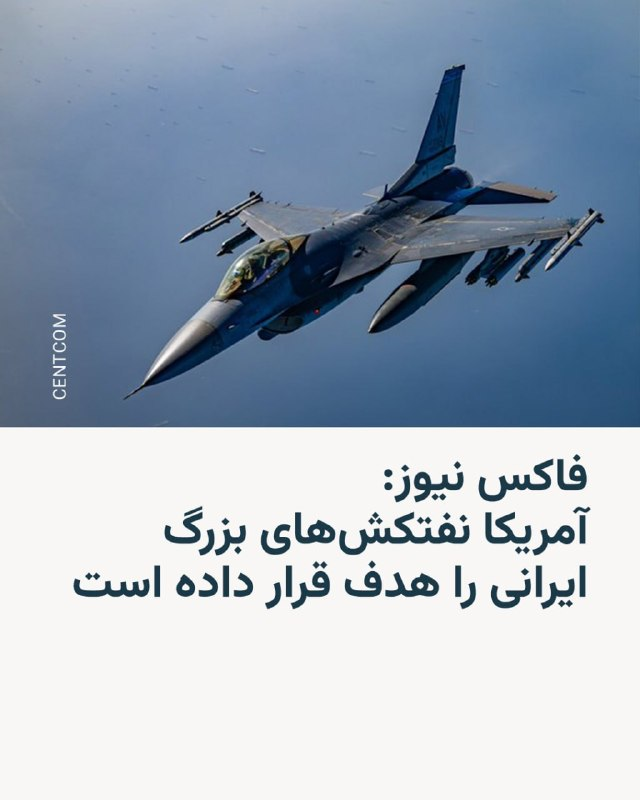

🔸شبکه فاکس نیوز گزارش داد که ارتش آمریکا روز جمعه ۱۸ اردیبهشت حملات هوایی بیشتری علیه کشتی‌های مرتبط با ایران انجام داده و چند نفتکش خالی را که سعی در شکستن محاصره ایران داشتند، هدف قرار داده است.

🔸این شبکه به نقل از یک مقام ارشد آمریکایی گفت: «کشتی‌های هدف قرار گرفته نفتکش‌های بسیار بزرگ (VLCC) خالی بودند که تلاش می‌کردند با عبور از محاصره به ایران بازگردند.»

🔸پنتاگون و فرماندهی مرکزی ایالات متحده، سنتکام، درباره این گزارش هنوز اظهارنظر نکرده‌اند.

🔸ساعاتی پیش از اعلام این خبر، وب‌سایت ردیابی کشتی‌ها، تنکر ترکرز در پیامی در شبکه اجتماعی ایکس نوشته بود که «طی دو روز گذشته، سه نفتکش شرکت ملی نفتکش ایران که خالی از بار بودند، برای بازگشت به ایران از طریق منطقه انحصاری اقتصادی پاکستان، به خط محاصره نیروی دریایی ایالات متحده نفوذ کرده‌اند. این سه نفتکش روی هم رفته قادر به حمل ۵ میلیون بشکه نفت خام ایران هستند.»

🔸در همین حال خبرگزاری مهر، از شنیده شدن صدای انفجارهایی در بعدازظهر جمعه در محدوده شهرستان سیریک خبر داد.

@RadioFarda

## RadioFarda — post 156974

  <a href="https://t.me/radiofarda/156974">📎 Download file</a>

«انشقاقی» که کشورهای عربی را از مواجهه با ایران باز داشت

🔸گزارش‌هایی که در روزهای اخیر منتشر شده تصویرهای چند لایه و در برخی موارد متضاد از رویکردهای کشورهای حوزه خلیج‌فارس ارائه می‌دهد. آیا کشورهای عربی این حوزه در مواجهه با مساله ایران متحدالشکل عمل می‌کنند؟ آیا تهدید برای همه آن‌ها در یک سطح است و تهدیدی که امارات خود را درگیر آن می بیند به همان میزان در عربستان سعودی یا قطر احساس می‌شود؟ ارزیابی مهرداد فرهمند تحلیلگر امور خاورمیانه در ترکیه را بشنوید.

@RadioFarda

## RadioFarda — post 156973

🔸ایرنا، خبرگزاری جمهوری اسلامی، با انتشار ویدئویی از قول سرپرست اداره پارک ملی بوجاق از فرود ۴۰ فلامینگو در تالاب این پارک ملی خبر داد.

🔸پارک ملی بوجاق در منطقۀ حفاظت‌شدۀ شهربندر کیاشهر در استان گیلان قرار دارد و شامل حدود ۱۶۰ هکتار محوطۀ تالابی می‌شود.

@RadioFarda

## RadioFarda — post 156972

🔸مارکو روبیو، وزیر امور خارجه آمریکا، گفت اقدام نظامی آمریکا علیه ایران در بامداد جمعه «جدا و متمایز» از عملیات «خشم حماسی» بوده و ایالات متحده همچنان به‌صورت «دفاعی» واکنش نشان خواهد داد. 🔸روبیو روز جمعه در شهر رم، پایتخت ایتالیا، در جمع خبرنگاران اعلام…

## RadioFarda — post 156971

  

🔸مارکو روبیو، وزیر امور خارجه آمریکا، گفت اقدام نظامی آمریکا علیه ایران در بامداد جمعه «جدا و متمایز» از عملیات «خشم حماسی» بوده و ایالات متحده همچنان به‌صورت «دفاعی» واکنش نشان خواهد داد.

🔸روبیو روز جمعه در شهر رم، پایتخت ایتالیا، در جمع خبرنگاران اعلام کرد «خشم حماسی» که او اوایل این هفته گفته بود به پایان رسیده است، «یک عملیات تهاجمی بود که برای نابودی سکوهای پرتاب موشک، نیروی دریایی و نیروی هوایی آن‌ها طراحی شده بود.»

🔸او افزود آنچه ساعاتی پیش رخ داد «ناوشکن‌های آمریکایی بودند که در آب‌های بین‌المللی در حال حرکت بودند و از سوی ایرانی‌ها به آن‌ها شلیک شد، و آمریکا برای حفاظت از خود به‌صورت دفاعی پاسخ داد.»

🔸دیپلمات ارشد آمریکا گفت: «فقط کشورهای احمق وقتی به آن‌ها شلیک می‌شود، پاسخ نمی‌دهند. و ما کشور احمقی نیستیم.»

🔸وقتی از روبیو پرسیده شد که آیا آمریکا خطوط قرمزی را به ایران منتقل کرده است یا نه، پاسخ داد: «خط قرمز روشن است: اگر آمریکایی‌ها را تهدید کنند، نابود خواهند شد.»

@RadioFarda

## IranianMinds — post 19802

  

🔴تهدید شدید علیه امارات توسط مرندی:

از این به بعد با امارات مانند شمال عراق رفتار خواهد شد.
این کشور جای پایی برای دشمن صهیونیستی است.
هر زمان که لازم باشد، دشمن در آنجا هدف قرار خواهد گرفت.

@IranianMinds

## IranianMinds — post 19801

  <a href="telegram/content/IranianMinds_19801_1778252561.mp4">🎬 Download video</a>

🔴 سنتکام:

نیروهای آمریکایی در 8 مه تانکرهای Sea Star III و Sevda با پرچم ایران را در حالی که قصد داشتند با نقض محاصره ایالات متحده وارد بندر ایران شوند، از کار انداختند.

یک فروند F/A-18 Super Hornet نیروی دریایی ایالات متحده از USS George H.W. بوش با مهمات دقیق به دودکش هر دو کشتی ضربه زد و مانع رسیدن آنها به ایران شد.

@IranianMinds

## IranianMinds — post 19800

🔴 فاکس نیوز به نقل از یک مسئول آمریکایی: ارتش آمریکا امروز به نفتکش‌های ایرانی که قصد شکستن محاصره را داشتند، حمله کرد.
نفتکش‌های هدف قرار گرفته، کشتی‌های بزرگ خالی بودند که قصد داشتند به ایران بازگردند.

@IranianMinds

## IranianMinds — post 19799

🔴خبرگزاری مهر از شنیده شدن انفجارهایی در محدوده شهرستان سیریک خبر داد.

@IranianMinds

## IranianMinds — post 19798

🔴دولت ترامپ ساعاتی پیش فروش تاریخی 26 میلیارد دلار موشک های سامانه پدافندی پاتریوت را به امارات، بحرین، قطر و کویت تصویب کرد

@IranianMinds

## BBCPersian — post 280510

🔻کمیسیون اروپا: تأثیر جنگ ایران بر بازار سوخت هواپیما به اندازه‌ای نبوده که تغییر مقررات لازم باشد

کمیسیون اروپا به شرکت‌های هواپیمایی اعلام کرده است که همه مقررات پیشین مربوط به حمایت از مسافران همچنان به قوت خود باقی است و در پی جنگ ایران تغییر نخواهد کرد.

بر اساس ارزیابی کمیسیون اروپا، تأثیر جنگ ایران بر بازار سوخت جت به اندازه‌ای شدید نبوده که تغییری در این مقررات لازم باشد.

کمیسیون اروپا در مجموعه‌ای از دستورالعمل‌ها برای شرکت‌های هواپیمایی اعلام کرد که این شرکت‌ها فقط در صورتی می‌توانند از پرداخت غرامت مالی به مسافران بابت لغو پرواز معاف شوند که کمبود محلی سوخت، عامل این لغو باشد.

این نهاد همچنین اعلام کرد که دریافت هزینه‌های اضافی از مسافران به‌صورت عطف‌به‌ماسبق، از جمله اضافه کردن هزینه سوخت به بلیت‌هایی که قبلا به افراد فروخته شده، مجاز نیست.

https://bbc.in/4cZY32k
@BBCPersian

## BBCPersian — post 280509

🔻اتحادیه اروپا: نیمی از جمعیت لبنان به کمک‌های بشردوستانه نیاز دارد

کمیسر مدیریت بحران اتحادیه اروپا می‌گوید که با ادامه حملات اسرائیل به لبنان، بیش از نیمی از جمعیت این کشور به کمک‌های بشردوستانه نیاز دارد.

حجه لحبیب پس از دیدار با جوزف عون، رئیس‌جمهور لبنان، در بیروت به خبرنگاران گفت: «در حال حاضر، بیش از سه میلیون نفر، یعنی بیش از نیمی از جمعیت لبنان، برای بقا به کمک‌های بشردوستانه متکی هستند.»

او گفت که اتحادیه اروپا از زمان آغاز جنگ در دوم مارس، ۱۰۰ میلیون یورو کمک به لبنان اختصاص داده است.

به گفته حجه لحبیب، تاکنون شش هواپیمای حامل کمک‌های بشردوستانه به لبنان ارسال شده و انتظار می‌رود به زودی هفتمین هواپپما هم وارد این کشور شود.

بنابر اعلام مقام‌های لبنان، از اوایل ماه مارس تاکنون، بیش از ۲۷۰۰ نفر در حملات هوایی اسرائیل به لبنان کشته شده‌اند.

از آن زمان، بیش از یک میلیون نفر هم در این کشور آواره شده‌اند.

https://bbc.in/4cZY32k
@BBCPersian

## BBCPersian — post 280508

🔻فرماندار میناب: حمله آمریکا به یک لنج باری یک کشته و چهار مفقود بر جا گذاشته است

فرماندار میناب می‌گوید که در حملات دیشب آمریکا یک لنج باری هدف قرار گرفته است که منجر به کشته شدن یک ملوان و مفقود شدن چهار نفر دیگر شده است.

به گفته محمد رادمهر، ۱۰ ملوان دیگر این لنج هم مجروح و به بیمارستان منتقل شدند.

به گفته آقای رادمهر این حمله در نزدیکی آب‌های شهرستان میناب رخ داده است.

عملیات جستجو برای یافتن سایر مفقود‌شدگان ادامه دارد.

آمریکا هنوز در این باره اظهارنظری نکرده است.

دیشب نیروهای ایرانی و آمریکایی در آب‌های جنوبی ایران تبادل آتش کردند، هرچند دونالد ترامپ می‌گوید که آتش‌بس همچنان برقرار است.

آمریکا می‌گوید که نیروهایش «بی‌مقدمه» هدف حمله موشک‌ها، پهپادها و قایق‌های تندرو ایران قرار گرفتند و ایران می‌گوید که حملاتش تلافی‌جویانه و در پاسخ به حمله آمریکا به یک نفتکش ایرانی و یک کشتی دیگر در منطقه تنگه هرمز بوده است.

https://bbc.in/4cZY32k
@BBCPersian

## BBCPersian — post 280507

🔻سنتکام: محاصره دریایی ایران مانع تردد بیش از ۷۰ نفتکش شده است

سرفرماندهی مرکزی ارتش آمریکا در منطقه، سنتکام، می‌گوید که از آغاز محاصره دریایی ایران تا امروز مانع عبور بیش از ۷۰ نفتکش شده است که مبدا یا مقصد آنها بنادر ایرانی بوده است.

سنتکام در بیانیه‌ای در شبکه ایکس نوشت: «این کشتی‌های تجاری ظرفیت حمل بیش از ۱۶۶ میلیون بشکه نفت ایرانی به ارزش تخمینی بیش از ۱۳ میلیارد دلار را دارند.»

آمریکا از ۱۳ آوریل (۲۴ فروردین) در واکنش به اقدام ایران در بستن تنگه هرمز دست به محاصره دریایی بنادر ایران زده است و اجازه نمی‌دهد هیچ کشتی‌ای با مبدا یا مقصد بنادر ایرانی از تنگه هرمز عبور کند.

https://bbc.in/4cZY32k
@BBCPersian

## BBCPersian — post 280506

  <a href="telegram/content/BBCPersian_280506_1778252562.mp4">🎬 Download video</a>

🔻سرخط خبرهای جمعه ۱۸ اردیبهشت ۱۴۰۵
@BBCPersian

## BBCPersian — post 280505

🔻امارات: سه نفر در حملات پهپادی و موشکی ایران مجروح شدند

وزارت دفاع امارات می‌گوید که پدافند هوایی آن کشور دو موشک بالستیک و سه پهپاد را که از ایران شلیک شده بودند، رهگیری کرده‌ است.

در بیانیه این وزارتخانه در شبکه ایکس آمده است که سه نفر در این حمله مجروح شده‌اند.

سطح جراحت این افراد «متوسط» اعلام شده است.

وزارت دفاع امارات همچنین هشدار داد که نیروهایش برای مقابله با هرگونه تهدید «در آمادگی کامل» قرار دارند و با هر اقدامی که امنی کشور را به خطر بیندازد، «قاطعانه» برخورد خواهند کرد.

https://bbc.in/4cZY32k
@BBCPersian

## Dirty_Kids — post 389112

  

پسر فک کن ۵ تا ایست بازرسی رد میکنی ده بار چک میشی که یه دقیقه بری کافه از دست این زامبی‌های حیدر حیدر کنان یه گوشه با دوستات چیل کنی بعد یکی با این قیافه میاد از کص و کونت عکس میگیره. @Dirty_Kids 👻

## Dirty_Kids — post 389110

  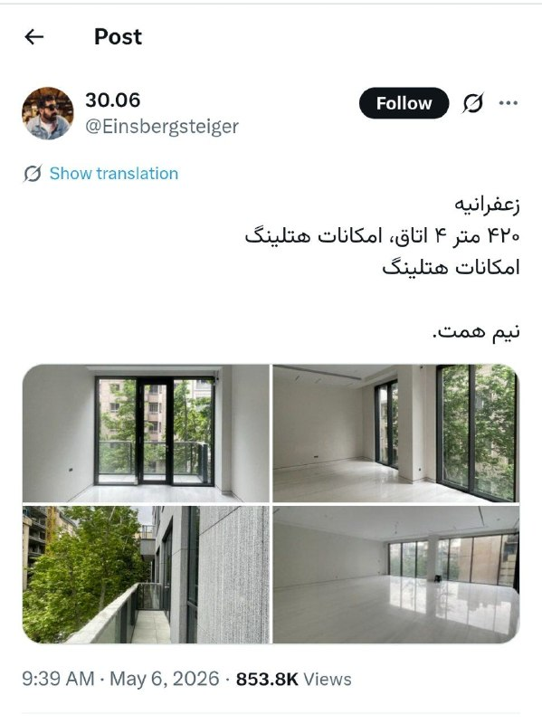

از معجزات اقتصاد ایران اینه که نه تنها پول خودش بی ارزش شده، بلکه پولی که همه‌جای دنیا ارزشمنده هم اینجا مفت نمیارزه، مثلا ۳ میلیون دلار میشه یه خونه، یا مثلا تو ۱ میلیون دلار داشته باشی نهایتا بتونی یه خونه و یه ماشین مدل ۲۰۱۶ خوب بخری.

@Dirty_Kids 👻

## Dirty_Kids — post 389109

  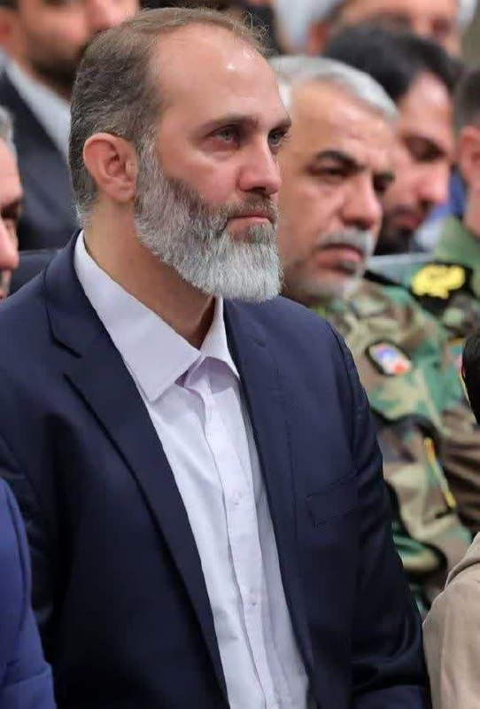

پس بگو چرا بچه موش‌تباه چشم رنگی بود!

ناصر بهرام نژاد رئیس محافظان خامنه‌ای:

@Dirty_Kids 👻

## Dirty_Kids — post 389108

گزارش‌ها از دو انفجار در اسکله طاهرویی (هرمزگان) حکایت دارد.

@Dirty_Kids 👻

## Dirty_Kids — post 389107

  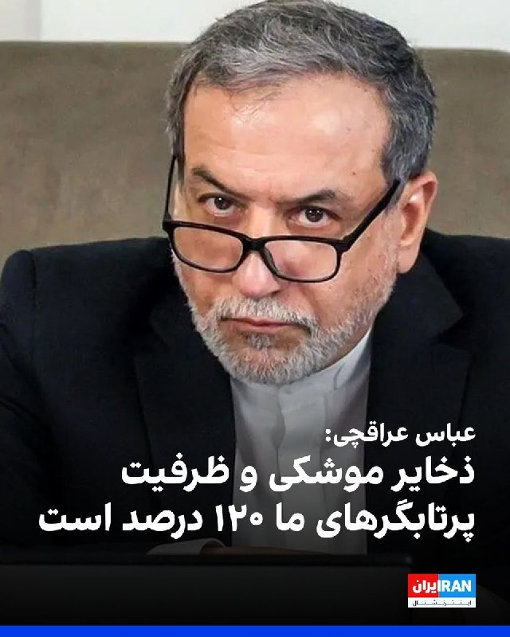

کاش عباس بعد از کتاب موفق قدرت مذاکره، یه کتاب هم درباره ریاضیات پایه بنویسه.

@Dirty_Kids 👻

## Dirty_Kids — post 389103

شات‌های وایرال شده‌ی شاهدخت فرح پهلوی از مراسم فارغ‌التحصیلیش

@Dirty_Kids 👻

## Dirty_Kids — post 389102

ارتش آمریکا مدعی شد از انتقال بیش از ۱۶۶ میلیون بشکه نفت ایرانی به ارزش ۱۳ میلیارد دلار جلوگیری کرده است.

@Dirty_Kids 👻

## Hranews — post 112830

  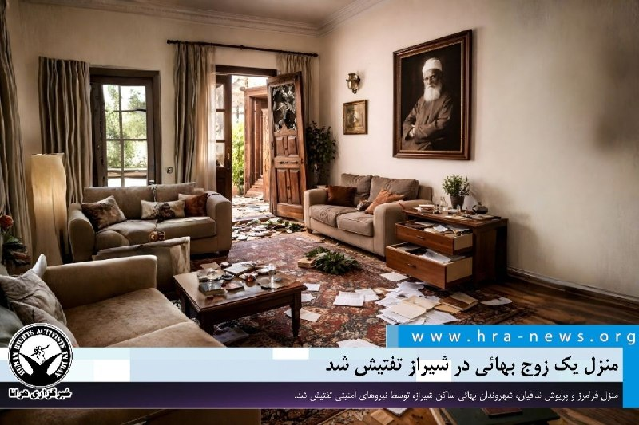

منزل یک زوج بهائی در شیراز تفتیش شد

❗️
❗️
❗️
❗️
❗️– صبح روز پنجشنبه ۱۷ اردیبهشت‌ماه، منزل فرامرز و پریوش ندافیان، شهروندان بهائی ساکن شیراز، توسط نیروهای امنیتی تفتیش شد. در جریان این اقدام، برخی لوازم شخصی و اموال این خانواده از جمله تلفن‌های همراه، کیس کامپیوتر، کتاب‌ها و طلا و جواهرات ضبط شد.

به گزارش خبرگزاری هرانا، ارگان خبری مجموعه فعالان حقوق بشر در ایران، منزل یک زوج بهائی در شیراز مورد تفتیش قرار گرفت.

بر اساس اطلاعات دریافتی هرانا، صبح روز پنجشنبه ۱۷ اردیبهشت ۱۴۰۵، مأموران امنیتی با ارائه حکمی دست‌ نویس وارد منزل فرامرز و پریوش ندافیان شده و اقدام به تفتیش محل سکونت آنان کردند. در جریان این بازرسی، تلفن‌های همراه، کیس کامپیوتر، تعدادی کتاب و همچنین طلا و جواهرات متعلق به این خانواده ضبط شده است.

ادامه مطلب

#پریوش_ندافیان
#فرامرز_ندافیان

↘️
@hranews_bot تماس ✉️ -  @Hranews  کانال هرانا 🆑

## configx2ray — post 38652

  <a href="https://t.me/ConfigX2ray/38652">📎 Download file</a>

کانفیگ برای Npv tunnel ⭕️

به هیچ وج دانلود نزنید باهاش
❤️

رمز فایل : @ConfigX2ray

Channel : https://t.me/ConfigX2ray

## configx2ray — post 38651

  <a href="telegram/content/configx2ray_38651_1778252566.jpg">🎬 Download video</a>

socks://Og@130.185.75.82:9595#1https://t.me/ConfigX2ray

vless://054be705-6bbf-42cd-9970-acfc325a34ca@SNApp.ir:80?path=%2FHoseisecu&security=&encryption=none&host=MMW.abanservers.ir&type=ws#2https://t.me/ConfigX2ray

socks://Og%3D%3D@62.220.126.56:30170#3https://t.me/ConfigX2ray

socks://Og%3D%3D@79.175.177.96:1080#4https://t.me/ConfigX2ray

ترکیبی با سایفون وصله 
✅

آموزش استفادع : 
👇
https://t.me/ConfigX2ray0/1665

Channel : https://t.me/ConfigX2ray

## configx2ray — post 38647

  <a href="https://t.me/ConfigX2ray/38647">📎 Download file</a>

کانفیگ برای Npv tunnel ⭕️

به هیچ وج دانلود نزنید باهاش
❤️

رمز فایل : @ConfigX2ray

Channel : https://t.me/ConfigX2ray

## manototv — post 105151

  <a href="telegram/content/manototv_105151_1778252567.mp4">🎬 Download video</a>

رویترز گزارش داده تصاویر ماهواره‌ای این هفته نشان داده‌اند که یک لکه نفتی مشکوک، بخش وسیعی از دریا در نزدیکی جزیره خارک؛ بزرگ‌ترین پایانه صادرات نفت کشور را پوشانده است.
در گزارش رویترز آمده این لکه که به رنگ خاکستری و سفید در تصاویر دیده می‌شود، در فاصله غربی جزیره خارک (به طول حدود ۸ کیلومتر) در بازه زمانی ۶ تا ۸ مه توسط ماهواره‌های اروپایی کوپرنیکوس ثبت شده است.
پژوهشگران محیط‌زیست می‌گویند این لکه «از نظر بصری کاملاً شبیه نفت» است و تخمین زده می‌شود حدود ۴۵ کیلومتر مربع از سطح دریا را پوشانده باشد. به گفته کارشناسان، این می‌تواند بزرگ‌ترین نشت نفتی از زمان آغاز جنگ آمریکا و اسرائیل با ایران در ۷۰ روز گذشته باشد.
با این حال، علت دقیق این نشت و منبع آن هنوز مشخص نیست. تصاویر روز ۸ مه نیز نشانه‌ای از نشت فعال جدید نشان نداده‌اند.
جزیره خارک که حدود ۹۰ درصد صادرات نفت ایران از آن انجام می‌شود، یکی از نقاط کلیدی صنعت نفت کشور است و بخش عمده نفت آن به مقصد چین صادر می‌شود.
در گزارش آمده است که در جریان جنگ اخیر، حملاتی نیز به اهداف نظامی در این منطقه انجام شده و تنش‌های دریایی در خلیج فارس افزایش یافته است. همچنین حضور گسترده نیروهای دریایی و درگیری‌های پراکنده، باعث اختلال گسترده در مسیرهای کشتیرانی و بازار جهانی نفت شده است.

## manototv — post 105150

  <a href="telegram/content/manototv_105150_1778252568.mp4">🎬 Download video</a>

‌
یک مقام آمریکایی به فاکس‌نیوز گفت نیروی هوایی ایالات متحده چند نفتکش را که تلاش داشتند محاصره بنادر ایران را دور بزنند، هدف قرار داده است.

به گفته این مقام، چندین نفتکش خالی هدف قرار گرفته‌اند و احتمال داده می‌شود این کشتی‌ها برای افزایش ظرفیت ذخیره‌سازی نفت ایران مورد استفاده قرار می‌گرفتند.

کارشناسان می‌گویند جمهوری اسلامی حدود ۱۳ روز ظرفیت ذخیره‌سازی نفت در خشکی دارد، اما با استفاده از نفتکش‌های خالی می‌تواند این زمان را بین ۳۰ تا ۴۵ روز افزایش دهد.

## manototv — post 105149

  <a href="telegram/content/manototv_105149_1778252568.mp4">🎬 Download video</a>

‌
خبرگزاری حکومتی فارس گزارش داد:
«از ساعتی پیش درگیری‌های پراکنده‌ای میان نیروهای مسلح ایران و شناورهای آمریکایی‌ در محدودهٔ تنگهٔ هرمز در جریان است.»

## manototv — post 105148

  <a href="telegram/content/manototv_105148_1778252569.mp4">🎬 Download video</a>

‌
ویدیوهای منتشرشده در شبکه‌های اجتماعی برخاستن ستونی از دود در اطراف فرودگاه دبی را نشان می‌دهد.

هم‌زمان، وزارت دفاع امارات اعلام کرد سامانه‌های پدافندی این کشور با دو موشک بالستیک و سه پهپاد که از سوی جمهوری اسلامی شلیک شده بودند، درگیر شده‌اند.
به گفته این وزارتخانه، در جریان این درگیری‌ها سه نفر دچار جراحات «متوسط» شده‌اند.
این رویداد در حالی رخ می‌دهد که آتش‌بس میان ایالات متحده و جمهوری اسلامی در ساعات گذشته با تبادل حملات میان دو طرف تحت فشار قرار گرفته است.
امارات پیش‌تر نیز در جریان این تنش‌ها تحت تأثیر حملات قرار گرفته بود.
با وجود حضور پایگاه‌های نظامی آمریکا در امارات، هنوز مشخص نیست اهداف این حملات چه بوده و آیا خسارتی به زیرساخت‌ها وارد شده است یا نه.

## manototv — post 105147

  <a href="telegram/content/manototv_105147_1778252569.mp4">🎬 Download video</a>

قطع اینترنت خاموش کردن صدای مردم است

## manototv — post 105146

  <a href="telegram/content/manototv_105146_1778252570.mp4">🎬 Download video</a>

سخنگوی وزارت امور خارجه جمهوری اسلامی اعلام کرد که اقدام انجام‌شده از سوی آمریکا در شب گذشته، هم «نقض آشکار حقوق بین‌الملل» بوده و هم «نقض آتش‌بس».
او در ادامه گفت «نیروهای مسلح ایران در پاسخ ضربه سنگینی به دشمن وارد کرده‌اند» و با تمام توان، «تحرکات و اقدامات طرف مقابل را دفع کرده‌اند».
بقایی همچنین تأکید کرد که ایران در وضعیت «آتش‌بس اسمی» قرار دارد.
او درباره مذاکرات نیز گفت که پیشنهاد ارائه‌شده از سوی آمریکا در حال بررسی است و در صورت رسیدن به نتیجه نهایی، به‌طور رسمی اعلام خواهد شد.

## manototv — post 105145

  <a href="telegram/content/manototv_105145_1778252570.mp4">🎬 Download video</a>

«صدای علی صفری باشید»

## manototv — post 105144

  <a href="telegram/content/manototv_105144_1778252571.mp4">🎬 Download video</a>

خبرگزاری‌های داخلی از قول فرماندار میناب گزارش داده‌اند پیکر یکی از پنج ملوان مفقود شده دیشب در پی حملات آمریکا پیدا شده‌است. فرماندار میناب پیش‌تر اعلام کرده بود در جریان حملات آمریکا در آب‌های تنگه هرمز و دریای مکران که شب گذشته صورت گرفته، یک شناور باری در نزدیکی آب‌های میناب مورد هدف قرار گرفته و دچار آتش‌سوزی شده است. بر پایه این اعلام در این لنج، ۱۵ ملوان حضور داشتند که ۱۰ تن از آن‌ها مصدوم و پنج نفر مفقود شده‌ بودند که اکنون اعلام شده یکی از آن‌ها کشته شده‌اند.

## manototv — post 105143

  <a href="telegram/content/manototv_105143_1778252572.mp4">🎬 Download video</a>

خبرگزاری مهر گزارش داده عصر جمعه در محدوده شهرستان سیریک صدای انفجار گزارش شده است. هنوز ماهیت این صداها مشخص نشده است و نهادهای رسمی در این خصوص اظهار نظر نکرده‌اند.

## manototv — post 105142

  <a href="telegram/content/manototv_105142_1778252572.mp4">🎬 Download video</a>

تانکرترکرز که به رصد حرکت شناورها می‌پردازد در گزارشی به وضعیت Ocean Koi نفت‌کش توقیف شده توسط ارتش پرداخته است. در این گزارش آمده نام این شناور در واقع JIN LI 9255933 است و از تاریخ ۳۰ نوامبر ۲۰۲۵ با این نام فعالیت می‌کرده است. بر اساس داده‌های موجود، این نفتکش از سال ۲۰۲۱ تاکنون دست‌کم در ۱۶ مورد محموله‌های مختلف هیدروکربنی ایران را حمل کرده است؛ موضوعی که به گفته منابع، با آگاهی کامل ایران انجام شده، زیرا نیمی از بارگیری‌ها در بنادر ایران و نیمی دیگر از طریق انتقال کشتی به کشتی در دریا صورت گرفته است.
در اداکه گزارش آمده گفته می‌شود مالکیت این نفتکش در شانگهای چین مستقر است و همچنین یادآوری شده این کشتی در تاریخ ۲۵ فوریه ۲۰۲۶ توسط دفتر کنترل دارایی‌های خارجی آمریکا تحریم شده است.
در پایان این گزارش تانکرترکرز گفته گزارش صدا و سیما از توقیف این نفتکش چیزی جز نمایش نیست. در گزارش صدا و سیما آمده تکاوران نیروی دریایی ارتش با «عملیات ویژه» این نفتکش را به دلیل «تلاش برای اختلال در صادرات نفت ایران و آسیب به منافع ملی» توقیف کردند؛ محموله نفت روی آن متعلق به ایران بوده، به سواحل جنوبی ایران هدایت و به مقامات قضایی تحویل داده شده است.

## manototv — post 105141

  <a href="telegram/content/manototv_105141_1778252573.mp4">🎬 Download video</a>

مارکو روبیو، وزیر خارجه آمریکا، پس از پایان سخنانش در جمع خبرنگاران در ایتالیا، بار دیگر بر موضع واشنگتن تأکید کرد که نیروهای نظامی این کشور در جریان درگیری‌های شب گذشته در تنگه هرمز، در چارچوب «دفاع از خود» عمل کرده‌اند.
او گفت: «آنچه دیروز دیدید این بود که ناوشکن‌های آمریکایی در آب‌های بین‌المللی در حال حرکت بودند و از سوی ایران به آن‌ها شلیک شد و آمریکا برای حفاظت از خود پاسخ دفاعی داد.»
روبیو افزود: «ما شلیک نکردیم، آن‌ها به ما شلیک کردند.»
طبق گزارش‌ها، هم آمریکا و هم جمهوری اسلامی اعلام کرده‌اند که شب گذشته در منطقه تنگه هرمز به یکدیگر حمله کرده‌اند.
ارتش آمریکا گفته است نیروهایش «حملات بدون تحریک ایران» را که سه ناوشکن نیروی دریایی را هدف قرار داده بود رهگیری کرده و در پاسخ، مواضع پرتاب این حملات در داخل ایران را هدف قرار داده است.
در مقابل، تهران پیش‌تر اعلام کرده بود که در پاسخ به آنچه «نقض آتش‌بس توسط واشنگتن» و هدف قرار گرفتن «مناطق غیرنظامی» خوانده، به شناورهای نظامی آمریکا حمله کرده و «خسارات قابل توجهی» به آن‌ها وارد کرده است. فرماندار میناب نیز اعلام کرده در جریان حملات آمریکا در آب‌های تنگه هرمز و دریای مکران که شب گذشته صورت گرفته، یک شناور باری در نزدیکی آب‌های میناب مورد هدف قرار گرفته و دچار آتش‌سوزی شده است. بر پایه این اعلام در این لنج، ۱۵ ملوان حضور داشتند که ۱۰ تن از آن‌ها مصدوم و پنج نفر مفقود شده‌اند.

## manototv — post 105140

  <a href="telegram/content/manototv_105140_1778252574.mp4">🎬 Download video</a>

مارکو روبیو، وزیر خارجه آمریکا، در گفت‌وگو با خبرنگاران در رم اعلام کرد ایالات متحده هیچ‌گونه مذاکره‌ای با حزب‌الله انجام نخواهد داد و تمرکز خود را بر گفت‌وگو با دولت لبنان قرار داده است.
او تأکید کرد که سیاست واشنگتن در این زمینه تغییر نکرده و مسیر دیپلماتیک تنها از طریق دولت رسمی لبنان دنبال خواهد شد.

## manototv — post 105139

  <a href="telegram/content/manototv_105139_1778252574.mp4">🎬 Download video</a>

فرماندار میناب اعلام کرده در جریان حملات آمریکا در آب‌های تنگه هرمز و دریای مکران که شب گذشته صورت گرفته، یک شناور باری در نزدیکی آب‌های میناب مورد هدف قرار گرفته و دچار آتش‌سوزی شده است. بر پایه این اعلام در این لنج، ۱۵ ملوان حضور داشتند که ۱۰ تن از آن‌ها مصدوم و پنج نفر مفقود شده‌اند.

## alonews — post 118691

  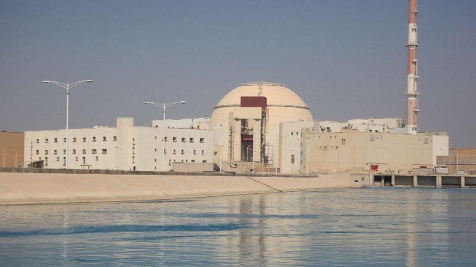

👈روس‌اتم : فعالیت‌های نیروگاه هسته‌ای بوشهر داره کم‌کم دوباره راه می‌افته

✅ @AloNews خبر جنگ

## alonews — post 118690

  <a href="telegram/content/alonews_118690_1778252575.jpg">🎬 Download video</a>

👈سفیر آمریکا در سازمان ملل مایک والتز:
ایران این هفته به یک نفتکش چینی در سواحل امارات حمله کرد.

✅ @AloNews خبر جنگ

## alonews — post 118689

  <a href="telegram/content/alonews_118689_1778252576.mp4">🎬 Download video</a>

👈سنتکام ویدیو حمله نیرو دریایی آمریکا به دو نفتکش ایرانی M/T SEA STAR III و M/T Sevda که سعی داشتند از محاصره دریایی آمریکا عبور کنند منتشر کرد. به گفته سنتکام دو نفتکش پس ازحمله متوقف شدند.

🔴این دو نفتکش تلاش می‌کردند در یک بندر ایرانی در خلیج عمان پهلو بگیرند.

✅ @AloNews خبر جنگ

## alonews — post 118688

  <a href="telegram/content/alonews_118688_1778252577.jpg">🎬 Download video</a>

👈روبیو: رئیس‌جمهور ترامپ هنوز تصمیم نگرفته است که چگونه به برخی از متحدان که اجازه استفاده از پایگاه‌هایشان را در طول جنگ با ایران نمی‌دهند، پاسخ دهد

✅ @AloNews خبر جنگ

## alonews — post 118687

  <a href="telegram/content/alonews_118687_1778252577.jpg">🎬 Download video</a>

👈فارس: از ساعتی پیش درگیری‌های پراکنده‌ای میان نیروهای مسلح ایران و شناورهای آمریکایی‌ در محدودهٔ تنگهٔ هرمز در جریان است.

✅ @AloNews خبر جنگ

## alonews — post 118686

  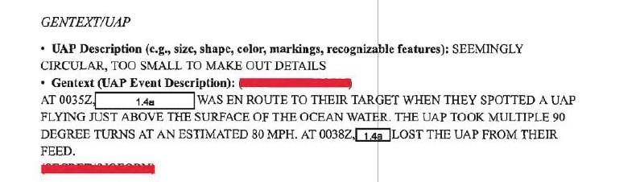

👈پرونده‌های یوفو منتشر شده توسط وزارت دفاع - تاریخ ۲۲ ژانویه ۲۰۲۶.

🔴یک خلبان آمریکایی ادعا می‌کند که در طول عملیات خود، یک جسم دایره‌ای را دیده است که با سرعت ۱۲۸ کیلومتر در ساعت بالای دریای اژه پرواز می‌کرد و چرخش‌های غیرطبیعی ۹۰ درجه انجام می‌داد، سپس از تصویر ناپدید شد.

✅ @AloNews خبر جنگ

## alonews — post 118685

  

👈تصویر بازسازی شده توسط FBI به کمک شاهدان عینی از شی ناشناسی که در سال 2023 دیده شد

✅ @AloNews خبر جنگ

## alonews — post 118684

  <a href="telegram/content/alonews_118684_1778252578.jpg">🎬 Download video</a>

👈یک ویدئوی بسیار عجیب که توسط ارتش ایالات متحده گرفته شده است، یک جسم به شکل ستاره را نشان می‌دهد که با حرکتی ضربدری و سریع در آسمان حرکت می‌کند

✅ @AloNews خبر جنگ

## alonews — post 118680

  <a href="telegram/content/alonews_118680_1778252578.jpg">🎬 Download video</a>

👈برای اولین‌بار، پنتاگون اسناد بسیار محرمانه مربوط به UFOها را منتشر کرده است.

برخی تصاویر، اجسام ناشناس ستاره‌شکل و نورها و اشکال عجیب در آسمان را هنگام مأموریت Apollo 11 Moon Landing نشان می‌دهند.
همچنین ویدیوهایی منتشر شده که در آن‌ها گوی‌هایی در آسمان حرکت می‌کنند بدون اینکه سیستم پیشران شناخته‌شده‌ای داشته باشند.

✅ @AloNews خبر جنگ

## alonews — post 118679

  

⚽️🇮🇷بالاخره یه حریف تدارکاتی واسه تیم‌ملی قبل جام جهانی پیدا شد؛

تیمِ مخوف گامبیا🇬🇲حاضر شده قبل جام جهانی با ایران بازی دوستانه برگزار کنه.
@AloSport

## alonews — post 118678

  <a href="telegram/content/alonews_118678_1778252579.jpg">🎬 Download video</a>

👈سخنگوی وزارت خارجه:
پاسخ ایران به طرح آمریکا برای پایان جنگ در دست بررسی است و به نتیجه نهایی که رسیدیم حتما اعلام خواهیم کرد.

✅ @AloNews خبر جنگ

## alonews — post 118677

  <a href="telegram/content/alonews_118677_1778252579.jpg">🎬 Download video</a>

👈رجانیوز: اینترنشنال جلیلی، جبلی، ثابتی و خضریان را تهدید به ترور کرده است و احتمالا ترامپ در دور بعد سایر مخالفان توافق با امریکا را ترور خواهد کرد تا مسیر برای امضای توافق باز شود

✅ @AloNews خبر جنگ

## alonews — post 118676

  <a href="telegram/content/alonews_118676_1778252579.jpg">🎬 Download video</a>

👈حمله هوایی اسرائیل به شهر جیبچیت در جنوب لبنان

✅ @AloNews خبر جنگ

## alonews — post 118675

  <a href="telegram/content/alonews_118675_1778252580.jpg">🎬 Download video</a>

👈ادعای فاکس نیوز به نقل از یک مسئول آمریکایی: ارتش آمریکا امروز به نفتکش‌های ایرانی که قصد شکستن محاصره را داشتند، حمله کرد.

🔴نفتکش‌های هدف قرار گرفته، کشتی‌های بزرگ خالی بودند که قصد داشتند به ایران بازگردند.(منبع تسنیم)

✅ @AloNews خبر جنگ

## alonews — post 118674

  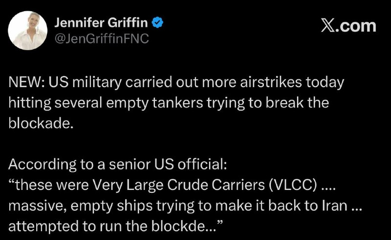

👈جنیفر گریفین: امروز ایالات متحده چند نفتکش خالی را که تلاش داشتند محاصره را بشکنند و به ایران بازگردند، هدف قرار داد

✅ @AloNews خبر جنگ

<!-- MSG END -->
<!-- NAV START -->
[صفحه قبل](telegram/content/archive_1.md)
<!-- NAV END -->
