# خواننده تلگرام

<!-- MSG START -->

---
📅 بروزرسانی: 1405/02/25 00:15
---

## VahidOOnLine — post 240187

  

♦️خبرگزاری رویترز گزارش داد نارندرا مودی، نخست وزیر هند، در چارچوب یک سفر منطقه‌ای و با هدف مقابله با پیامدهای بحران انرژی، روز جمعه راهی ابوظبی می‌شود تا با محمد بن زاید آل نهیان، رئیس امارات متحده عربی، دیدار و گفتگو کند. این سفر در حالی انجام می‌شود که افزایش جهانی قیمت نفت بر اثر تنش‌های خاورمیانه، فشار شدیدی بر ذخایر ارزی دهلی نو وارد کرده و مودی را به اتخاذ سیاست‌های ریاضتی و کاهش واردات واداشته است.

در این دیدار، طرفین درباره همکاری‌های راهبردی در حوزه انرژی و ثبات بازار سوخت رایزنی خواهند کرد. هند به عنوان یکی از بزرگترین واردکنندگان انرژی جهان، به دنبال تضمین امنیت تامین سوخت و کاهش تاثیر نوسانات قیمتی بر اقتصاد داخلی خود است. مودی پس از پایان گفتگوها در امارات، برای گسترش پیوندهای تجاری و پیگیری توافقات اقتصادی با اتحادیه اروپا، عازم کشورهای هلند، سوئد، نروژ و ایتالیا خواهد شد.
‌🇸🇦 Indypersian

🤖 @VahidOOnLine

## VahidOOnLine — post 240186

  

ابراهیم عزیزی، رییس کمیسیون امنیت ملی مجلس، از تدوین طرحی با عنوان «اقدام متقابل نیروهای نظامی و امنیتی جمهوری اسلامی» خبر داد که در آن پرداخت پاداش ۵۰ میلیون یورویی برای کشتن دونالد ترامپ، رییس‌جمهوری آمریکا، پیش‌بینی شده است.
 
عزیزی گفت همان‌طور که ترامپ دستور داد علی خامنه‌ای را بکشند، او باید «به دست هر مسلمان و آزاده‌ای مورد برخورد قرار بگیرد.»

او افزود در این طرح پیش‌بینی شده اگر افراد حقیقی یا حقوقی «این رسالت دینی و اعتقادی» را انجام دهند، دولت موظف است ۵۰ میلیون یورو پاداش بپردازد.

رییس کمیسیون امنیت ملی مجلس گفت جمهوری اسلامی معتقد است دونالد ترامپ، بنیامین نتانیاهو، نخست‌وزیر اسرائیل و برد کوپر، فرمانده سنتکام، باید به دلیل اقدامی که به کشته شدن علی خامنه‌ای منجر شد، «مورد برخورد و اقدام متقابل» قرار بگیرند؛ زیرا این را حق خود می‌داند.
‌🏁 🇬🇧 IranintlTV

🤖 @VahidOOnLine

## VahidOOnLine — post 240185

  

♦️شبکه خبری آی۲۴ نیوز گزارش داد امارات متحده عربی پس از انتشار خبر سفر محرمانه بنیامین نتانیاهو به ابوظبی، اعتراض شدید دیپلماتیک خود را به اسرائیل منتقل کرده است.
بر اساس این گزارش، این پیام اعتراضی از سوی محمد آل خاجه، سفیر امارات متحده عربی در اسرائیل، به مقام‌های شورای امنیت ملی اسرائیل در دفتر نخست‌وزیری این کشور منتقل شده است.
یک منبع آگاه به آی۲۴ نیوز گفت: «اماراتی‌ها بسیار خشمگین بودند. این نخستین بار نیست که اطلاعات حساس از دفتر نخست‌وزیری اسرائیل درز می‌کند. به همین دلیل است که نتانیاهو سال‌ها به امارات متحده عربی سفر نکرده بود.»
آی۲۴ نیوز همچنین نوشت امارات متحده عربی با وجود گسترش همکاری‌های امنیتی با اسرائیل، از جمله استقرار سامانه «گنبد آهنین» و سفر مقام‌های ارشد امنیتی اسرائیل به ابوظبی، همچنان تلاش می‌کند روابط خود با اسرائیل را کم‌حاشیه نگه دارد.
‌🇸🇦 Indypersian

🤖 @VahidOOnLine

## VahidOOnLine — post 240184

  

نشست کمیته نیروهای مسلح سنا با حضور ارشدترین مقام‌ نظامی آمریکا در خاورمیانه با تمرکز بر چالش خلع سلاح حزب‌الله، گروه مسلح لبنانی مورد حمایت جمهوری اسلامی، به پایان رسید.

راجر ویکر، سناتور جمهوری‌خواه ایالت میسیسیپی و رییس این کمیته، در این نشست از دریاسالار برد کوپر، که فرماندهی سنتکام را بر عهده دارد، ‌پرسید آیا تهاجم اسرائیل به خاک لبنان ضروری بوده است یا نه.

کوپر پاسخ داد: «این یکی از گزینه‌ها در میان گزینه‌هاست، از میان گزینه‌های اندکی که برای حل مشکل حزب‌الله وجود دارد.»

ویکر در ادامه گفت: «اگر حزب‌الله بتواند از بین برده شود، برای اسرائیل، لبنان و ایالات متحده یک دستاورد عظیم خواهد بود.»

در هفته‌های اخیر حزب‌الله به‌طور مداوم موشک‌هایی به سمت اسرائیل شلیک کرده و اسرائیل نیز یک تهاجم زمینی به جنوب لبنان انجام داده که بر حزب‌الله متمرکز بوده اما به گزارش رسانه‌ها، باعث آواره شدن ساکنان این منطقه شده است.
‌🏁 🇬🇧 IranintlTV

🤖 @VahidOOnLine

## VahidOOnLine — post 240183

  

♦️ابراهیم عزیزی، رئیس کمیسیون امنیت ملی و سیاست خارجی مجلس روز پنجشنبه ۲۴ اردیبهشت از اختصاص پاداش ۵۰ میلیون یورویی برای کشتن دونالد ترامپ رئیس جمهوری آمریکا خبر داد.
عزیزی با اشاره به طرحی با عنوان اقدام متقابل توسط نیروهای نظامی و امنیتی گفت: «پیش بینی کرده‌ایم که دولت به هر فرد حقیقی و حقوقی که این رسالت دینی (کشتن ترامپ) را انجام دهد به عنوان پاداش ۵۰ میلیون یورو بپردازد.»
رئیس کمیسیون امنیت ملی و سیاست خارجی مجلس در برنامه دایره قانون گفت: چند طرح را از زمان شروع جنگ سوم، آماده کردیم که طرح اقدام متقابل توسط نیروهای نظامی و امنیتی از جمله آنها است.
او با پلید خواندن دونالد ترامپ افزود: «ما معتقد هستیم که رئیس‌جمهور پلید آمریکا و نخست‌وزیر نحس و ننگین اسرائیل و فرمانده سنتکام باید مورد برخورد و اقدام متقابل قرار بگیرند. همان اقدامی که منتهی به شهادت امام شهید ما شد زیرا این حق ما است.»
‌🇸🇦 Indypersian

🤖 @VahidOOnLine

## VahidOOnLine — post 240182

  

♦️دریادار برد کوپر، فرمانده ستاد مرکزی نیروهای مسلح آمریکا (سنتکام)، روز پنجشنبه ۲۴ اردیبهشت در کمیته نیروهای مسلح سنا اعلام کرد که نیروهای آمریکایی استفاده از مهمات پیشرفته و گران‌قیمت برای سرنگونی پهپادهای جمهوری اسلامی را متوقف کرده‌اند.

ذخایر محدود سامانه‌های تسلیحاتی گران‌قیمت این کشور، از جمله موشک‌های رهگیر پیشرفته، در طول جنگ با جمهوری اسلامی به موضوعی بحث‌برانگیز تبدیل شده بود. پیش از این، نیروهای آمریکایی از این تسلیحات برای مقابله با پهپادهای ایرانی استفاده می‌کردند، اما کوپر می‌گوید ارتش آمریکا اکنون به استفاده از مهمات ارزان‌تر روی آورده است.

این دریادار ارشد خاطرنشان کرد که تنها ۱۰ درصد از پهپادهای ایران باقی مانده است.
‌🇸🇦 Indypersian

🤖 @VahidOOnLine

## VahidOOnLine — post 240181

  <a href="telegram/content/VahidOOnLine_240181_1778791528.mp4">🎬 Download video</a>

تماسی از ایران:
«می‌گفت بیمه عملاً داروها، مخصوصاً انسولین رو پوشش نمی‌ده…
و هزینه‌ها چند برابر شده.
می‌گفت دارو هست، اما برای خیلی‌ها دیگه قابل تهیه نیست.»
‌🏁 🇬🇧 ManotoTV

🤖 @VahidOOnLine

## VahidOOnLine — post 240180

  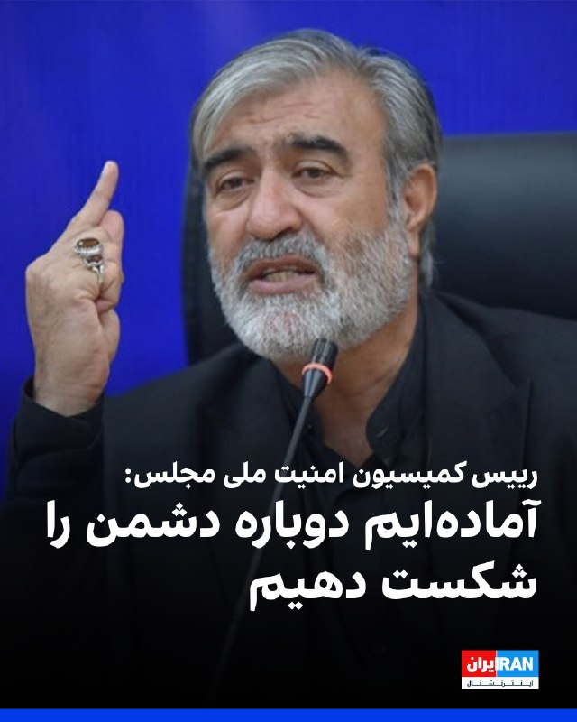

ابراهیم عزیزی، رییس کمیسیون امنیت ملی مجلس، گفت: «به دشمنان هشدار می‌دهیم اگر دچار خطای محاسباتی شده و به امنیت ما خدشه‌ای وارد کنند، امنیت آن‌ها را در هر کجای جهان که باشد، سلب خواهیم کرد. آماده‌ایم در تنگه هرمز و سایر میادین، بار دیگر دشمن را شکست بدهیم.»

او افزود: «امروز دشمن در تنگه هرمز در حال غرق‌شدن و تجربه شکست دیگری است و پیام ما به دشمن این است که هر اقدام محاسبه‌نشده، پاسخی دردناک به همراه خواهد داشت.»
‌🏁 🇬🇧 IranintlTV

🤖 @VahidOOnLine

## VahidOOnLine — post 240179

  

♦️اداره تحقیقات فدرال آمریکا، اف‌بی‌آی روز پنجشنبه ۲۴ اردیبهشت اعلام کرد برای اطلاعاتی که منجر به دستگیری و پیگرد قانونی مونیکا ویت، عضو سابق سرویس اطلاعاتی ایالات متحده و مأمور ضداطلاعات این کشور که در فوریه ۲۰۱۹ به اتهام جاسوسی، از جمله انتقال اطلاعات دفاع ملی به دولت ایران، متهم شده بود، ۲۰۰ هزار دلار پاداش تعیین کرده است.
به گفته اف‌بی‌آی، مونیکا ویت که در سال ۲۰۱۳ به ایران پناهنده شده اطلاعات مرتبط با دفاع ملی ایالات متحده را در اختیار جمهوری اسلامی قرار داده است.
این افسر پیشین اطلاعاتی و مامور ویژه دفتر تحقیقات ویژه نیروی هوایی آمریکا، بین سال‌های ۱۹۹۷ تا ۲۰۰۸ در ارتش آمریکا خدمت کرد و سپس تا سال ۲۰۱۰ به‌عنوان پیمانکار دولت آمریکا فعالیت داشت.
بنا بر اعلام اف‌بی‌آی سوابق نظامی و فعالیت قراردادی ویت،‌ دسترسی او به اطلاعات محرمانه و فوق محرمانه مربوط به اطلاعات و ضداطلاعات خارجی، از جمله هویت واقعی نیروهای مخفی آمریکا را فراهم کرد.
 این گزارش تاکید می‌کند ویت عمدا اطلاعاتی را به ایران ارائه داده که پرسنل آمریکایی و خانواده‌هایشان را که در خارج از کشور مستقر هستند، به خطر می‌اندازد.
‌🇸🇦 Indypersian

🤖 @VahidOOnLine

## VahidOOnLine — post 240178

  

♦️به گزارش خبرگزاری دولتی عراق (INA)، علی الزیدی، نخست‌وزیر جدید عراق که دولت او روز پنجشنبه ۲۴ اردیبهشت موفق به کسب رای اعتماد شد، متعهد شد که انحصار سلاح در اختیار دولت را تضمین کند.

خبرگزاری INA به نقل از دفتر رسانه‌ای پارلمان گزارش داد که برنامه دولتی الزیدی شامل «اصلاح ساختار امنیتی از طریق محدود کردن مالکیت سلاح به کنترل دولت و تقویت توانمندی‌های نیروهای امنیتی» است.

ایالات متحده به عنوان یکی از بازیگران کلیدی در عرصه سیاسی عراق، اخیرا فشارهای خود را بر بغداد افزایش داده است تا گروه‌های مورد حمایت جمهوری اسلامی را که واشنگتن آن‌ها را به عنوان سازمان‌های تروریستی می‌شناسد، خلع سلاح کند.
‌🇸🇦 Indypersian

🤖 @VahidOOnLine

## VahidOOnLine — post 240177

  <a href="telegram/content/VahidOOnLine_240177_1778791531.mp4">🎬 Download video</a>

تماسی از ایران:
«می‌گفت برای زنده نگه داشتن پدرش حتی کپسول اکسیژن هم پیدا نمی‌شد…
و بیمارستان، با اون حال وخیم، مرخصش کرد چون تخت لازم داشت.
‌🏁 🇬🇧 ManotoTV

🤖 @VahidOOnLine

## VahidOOnLine — post 240176

  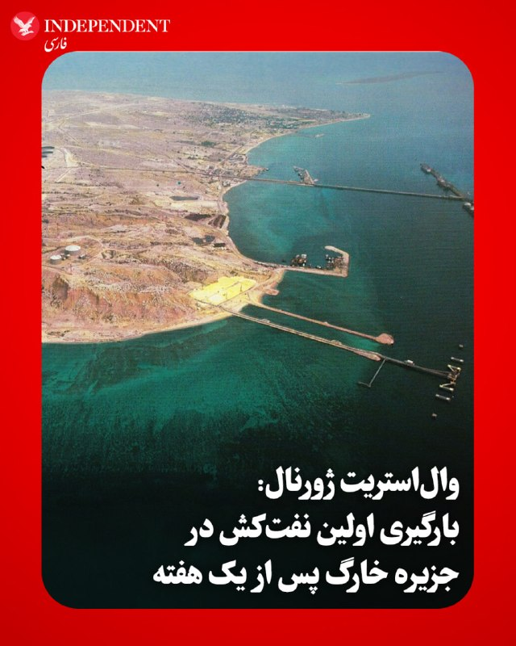

♦️ به گزارش وال‌استریت ژورنال و بر اساس داده‌های گروه دریایی «ویندوارد» (Windward)، روز پنجشنبه ۲۴ اردیبهشت یک نفت‌کش کلاس «پاناماکس» در جزیره خارگ در حال بارگیری است. این اولین بارگیری تایید شده در این ترمینال حیاتی نفت ایران از تاریخ ۷ مه (۱۷ اردیبهشت) تاکنون محسوب می‌شود.

شرکت ویندوارد اعلام کرد که تصاویر ماهواره‌ای از حضور این شناور در کنار ترمینال شرقی جزیره را ثبت کرده است. این شرکت همچنین شناسایی حدود ۲۰ «نفت‌کش شبح» (نفت‌کش‌هایی که سیستم ردیابی خود را خاموش کرده‌اند) را گزارش داده که در مناطق مجاور به حالت آماده‌باش توقف کرده‌اند.

جزیره خارگ، واقع در شمال خلیج فارس، هسته اصلی صنعت نفت ایران است و بخش اعظم صادرات نفت خام از طریق آن ذخیره و بارگیری می‌شود. پیش از این، اسکات بسنت، وزیر خزانه‌داری آمریکا، اعلام کرده بود که ایران به دلیل دشواری در فروش و تخلیه نفت صادراتی، به مدت سه روز هیچ بارگیری در این جزیره نداشته است. نفت‌کش‌های کلاس پاناماکس ظرفیتی معادل ۴۰۰ هزار تا ۵۵۰ هزار بشکه نفت دارند.
‌🇸🇦 Indypersian

🤖 @VahidOOnLine

## VahidOOnLine — post 240175

  

به گزارش ان‌بی‌سی، مجلس نمایندگان آمریکا عصر پنجشنبه درباره یک قطعنامه اختیارات جنگی رای‌گیری خواهد کرد؛ قطعنامه‌ای که رییس‌جمهور آمریکا را ملزم می‌کند نیروهای مسلح ایالات متحده را از درگیری‌ها علیه جمهوری اسلامی خارج کند.

بر اساس این گزارش، این قطعنامه با حمایت جاش گاتهایمر، نماینده دموکرات ایالت نیوجرسی ارائه شده و همه دموکرات‌هایی که پیش‌تر با قطعنامه‌های اختیارات جنگی درباره ایران مخالفت کرده بودند، اکنون به‌عنوان هم‌حامی آن ثبت شده‌اند.

دموکرات‌ها برای موفقیت در تصویب این قطعنامه، به حمایت جمهوری‌خواهان بیشتری فراتر از تام مَسی، نماینده جمهوری‌خواه ایالت کنتاکی نیاز خواهند داشت. او تنها جمهوری‌خواهی بود که از آخرین قطعنامه اختیارات جنگی درباره ایران که در نهایت شکست خورد، حمایت کرده بود.
‌🏁 🇬🇧 IranintlTV

🤖 @VahidOOnLine

## mwarmonitor — post 9100

  <a href="telegram/content/mwarmonitor_9100_1778791533.mp4">🎬 Download video</a>

📝 گویا «بیت» در یک دگردیسی انتحاری، از مداح به دلقک تغییر کاربری داده و «خاله محمود» را به عنوان آخرین سلاح کشتار جمعیِ آبرو، راهیِ میدان کرده است. این استندآپ‌کمدیِ تهوع‌آور، مرثیه‌ای است بر نظامی که برای بقا، ماله را کنار گذاشته و با میکروفون به جانِ شعور ملت افتاده است.

🔸وقتی وقاحت به سقف می‌چسبد، اصلا دور از انتظار نیست که در پرده‌ی بعدی، این سوپرمنِ ماله‌کشی را با ریش سه تیغ و استایل لش ببینیم که در حالِ رپ کردنِ قطعه‌ی حماسیِ «آقام تو فریزه» است؛ اجرایی که لابد قرار است انجمادِ مغزی و تحجرِ سیستم را به عنوان «ثباتِ انقلابی» به خوردِ مخاطب بدهد. خاله محمود با این لودگی‌های سفارشی، ثابت کرد که در سیرکِ قدرت، هرچه دلقک‌تر باشی و با ریتمِ «شش‌وهشت» روی ویرانه‌ها برقصی، به سفره‌ی چربِ نظام نزدیک‌تری. این نه هنر است و نه کمدی؛ این رقصِ بی‌شرمانه‌ی لاشخورهایی است که می‌خواهند با شوخی‌هایِ تاریخ‌مصرف‌گذشته، بوی تعفنِ سیاست را پنهان کنند.

@mwarmonitor

## mwarmonitor — post 9099

  

📝 اف‌بی‌آی برای سرِ این ضعیفه، ۲۰۰ هزار دلار مژدگانی گذاشته؛ زنی که سال ۲۰۱۳ از ناف آمریکا فرار کرد تا خودش را به آغوشِ گرمِ آخوندها بیندازد. این خائنِ وطن‌فروش که اطلاعات امنیت ملی آمریکا را مثل تحفه‌ای بی‌مقدار زیر پای دولت ایران ریخت، قطعاً حالا با نامی مستعار مثل «پارمیدا» در حوالی اندرزگو در حال دور دور می‌باشد. شک نکنید با پولی که از فروختنِ رفقای سابقش به جیب زده، آن چهره‌ی سنگیِ توی عکس را زیر تیغ جراحان زیبایی کوبیده و ساخته تا ردّ خیانتش را پشت دماغِ عمل‌کرده و ژلِ لب پنهان کند. پیدا کردنِ کسی که برای یک «صور به آخوند زدن» کل زندگی‌اش را به لجن کشیده، در تهرانِ امروز که پر از چهره‌های فیک و هویت‌های فروشی است، پاداش کلانی می‌طلبد.

@mwarmonitor

## pm_afshaa — post 90758

🔴آغاز اعتراضات مردمی در کوبا

💧 Rainbet.com the #1 Non-KYC Crypto Casino & Sportsbook @rainbetcom

😁 @Pm_Afshaa

## pm_afshaa — post 90757

🔴کانال 12 اسراییل: اسرائیل سطح هشدار را به اوج می‌رساند تا برای احتمال از سرگیری جنگ با ایران پس از بازگشت ترامپ از چین آماده شود

💧 Rainbet.com the #1 Non-KYC Crypto Casino & Sportsbook @rainbetcom

😁 @Pm_Afshaa

## pm_afshaa — post 90756

ایسنا : با قیمت قطعی خودرو باید خداحافظی کنید،چون تو جدیدترین طرح فروش ایران‌خودرو و سایپا،خریداران باید نیمی از مبلغ خودرو رو امروز بپردازن بدون اینکه بدونن در زمان تحویل چه قیمتی در انتظارشونه

💧 Rainbet.com the #1 Non-KYC Crypto Casino & Sportsbook @rainbetcom

😁 @Pm_Afshaa

## kianmeli1 — post 87410

  

🔴روزنامه اعتماد مدعی شد: اینترنت بین الملل خرداد ماه وصل می‌ شود
https://t.me/kianmeli1

## kianmeli1 — post 87409

  

🔴رئیس کمیسیون امنیت ملی مجلس، از پیشنهاد تعیین جایزه ۵۰ میلیون یورویی برای کشتن دونالد ترامپ، بنیامین نتانیاهو و فرمانده سنتکام خبر داده است.
https://t.me/kianmeli1

## kianmeli1 — post 87408

  <a href="telegram/content/kianmeli1_87408_1778791536.mp4">🎬 Download video</a>

🔴 کاتس وزیر دفاع اسرائیل  :
ماموریت ما کامل نشده است.

ما برای احتمال اینکه ممکن است مجبور به اقدام دوباره شویم - شاید حتی به زودی - آماده‌ایم.

اگر اهداف تأمین نشوند، دوباره اقدام خواهیم کرد.
   https://t.me/kianmeli1

## IranIntlTV — post 337218

  

ابراهیم عزیزی، رییس کمیسیون امنیت ملی مجلس، از تدوین طرحی با عنوان «اقدام متقابل نیروهای نظامی و امنیتی جمهوری اسلامی» خبر داد که در آن پرداخت پاداش ۵۰ میلیون یورویی برای کشتن دونالد ترامپ، رییس‌جمهوری آمریکا، پیش‌بینی شده است.
 
عزیزی گفت همان‌طور که ترامپ دستور داد علی خامنه‌ای را بکشند، او باید «به دست هر مسلمان و آزاده‌ای مورد برخورد قرار بگیرد.»

او افزود در این طرح پیش‌بینی شده اگر افراد حقیقی یا حقوقی «این رسالت دینی و اعتقادی» را انجام دهند، دولت موظف است ۵۰ میلیون یورو پاداش بپردازد.

رییس کمیسیون امنیت ملی مجلس گفت جمهوری اسلامی معتقد است دونالد ترامپ، بنیامین نتانیاهو، نخست‌وزیر اسرائیل و برد کوپر، فرمانده سنتکام، باید به دلیل اقدامی که به کشته شدن علی خامنه‌ای منجر شد، «مورد برخورد و اقدام متقابل» قرار بگیرند؛ زیرا این را حق خود می‌داند.
https://iranintl.com/202605147997

## IranIntlTV — post 337217

  

نشست کمیته نیروهای مسلح سنا با حضور ارشدترین مقام‌ نظامی آمریکا در خاورمیانه با تمرکز بر چالش خلع سلاح حزب‌الله، گروه مسلح لبنانی مورد حمایت جمهوری اسلامی، به پایان رسید.

راجر ویکر، سناتور جمهوری‌خواه ایالت میسیسیپی و رییس این کمیته، در این نشست از دریاسالار برد کوپر، که فرماندهی سنتکام را بر عهده دارد، ‌پرسید آیا تهاجم اسرائیل به خاک لبنان ضروری بوده است یا نه.

کوپر پاسخ داد: «این یکی از گزینه‌ها در میان گزینه‌هاست، از میان گزینه‌های اندکی که برای حل مشکل حزب‌الله وجود دارد.»

ویکر در ادامه گفت: «اگر حزب‌الله بتواند از بین برده شود، برای اسرائیل، لبنان و ایالات متحده یک دستاورد عظیم خواهد بود.»

در هفته‌های اخیر حزب‌الله به‌طور مداوم موشک‌هایی به سمت اسرائیل شلیک کرده و اسرائیل نیز یک تهاجم زمینی به جنوب لبنان انجام داده که بر حزب‌الله متمرکز بوده اما به گزارش رسانه‌ها، باعث آواره شدن ساکنان این منطقه شده است.
https://iranintl.com/202605140569

## IranIntlTV — post 337216

  <a href="telegram/content/IranIntlTV_337216_1778791538.mp4">🎬 Download video</a>

با شروع دور جدید مذاکرات مستقیم اسرائیل و لبنان در واشینگتن، مقام‌های لبنانی خواستار آتش‌بس فوری و توقف حملات اسرائیل به جنوب لبنان شدند. اسرائیل می‌گوید هدف مذاکرات، خلع سلاح حزب‌الله و رسیدن به توافق صلح است؛ در حالی‌ که تنش‌ها همچنان ادامه دارد.
@iranintltv

## IranIntlTV — post 337215

  <a href="https://t.me/IranintlTV/337215">📎 Download file</a>

🎧نسخه صوتی ۲۴ با فرداد فرحزاد: همکاری چین و آمریکا برای بازگشایی تنگه هرمز
@iranintlTV

## IranIntlTV — post 337214

  

ابراهیم عزیزی، رییس کمیسیون امنیت ملی مجلس، گفت: «به دشمنان هشدار می‌دهیم اگر دچار خطای محاسباتی شده و به امنیت ما خدشه‌ای وارد کنند، امنیت آن‌ها را در هر کجای جهان که باشد، سلب خواهیم کرد. آماده‌ایم در تنگه هرمز و سایر میادین، بار دیگر دشمن را شکست بدهیم.»

او افزود: «امروز دشمن در تنگه هرمز در حال غرق‌شدن و تجربه شکست دیگری است و پیام ما به دشمن این است که هر اقدام محاسبه‌نشده، پاسخی دردناک به همراه خواهد داشت.»
https://iranintl.com/202605142365

## IranIntlTV — post 337213

  

🔻فدراسیون فوتبال برزیل قرارداد کارلو آنچلوتی، سرمربی تیم ملی این کشور، را تا پایان جام جهانی ۲۰۳۰ تمدید کرد.

🔹آنچلوتی ۶۶ ساله که اردیبهشت ۱۴۰۴ پس از جدایی از رئال مادرید هدایت برزیل را بر عهده گرفت، تمدید قراردادش را در ویدیویی که فدراسیون فوتبال برزیل منتشر کرد، تایید کرد.

🔹او گفت: «یک سال پیش به برزیل آمدم و از همان لحظه اول فهمیدم فوتبال برای این کشور چه معنایی دارد. ما می‌خواهیم تیم ملی برزیل را دوباره به بالاترین سطح فوتبال جهان برگردانیم.»

🔹قرار است آنچلوتی دوشنبه فهرست نهایی تیم ملی برزیل برای جام جهانی را اعلام کند.

🔹سمیر شعود، رییس فدراسیون فوتبال برزیل، تمدید قرارداد آنچلوتی را «روزی تاریخی» برای فوتبال این کشور توصیف کرد و گفت این تصمیم بخشی از برنامه برزیل برای ساخت تیمی «مدرن و رقابتی» است.

🔹برزیل با هدایت آنچلوتی در ۱۰ مسابقه به پنج پیروزی، سه شکست و دو تساوی رسیده است. این تیم در جام جهانی ۲۰۲۶ با اسکاتلند، مراکش و هائیتی هم‌گروه خواهد بود.

@iranintltvsport

## IranIntlTV — post 337212

  <a href="https://t.me/IranintlTV/337212">📎 Download file</a>

🎧نسخه صوتی دومینو: شمارش معکوس برای آغاز جنگی دیگر
@iranintlTV

## IranIntlTV — post 337211

  

به گزارش ان‌بی‌سی، مجلس نمایندگان آمریکا عصر پنجشنبه درباره یک قطعنامه اختیارات جنگی رای‌گیری خواهد کرد؛ قطعنامه‌ای که رییس‌جمهور آمریکا را ملزم می‌کند نیروهای مسلح ایالات متحده را از درگیری‌ها علیه جمهوری اسلامی خارج کند.

بر اساس این گزارش، این قطعنامه با حمایت جاش گاتهایمر، نماینده دموکرات ایالت نیوجرسی ارائه شده و همه دموکرات‌هایی که پیش‌تر با قطعنامه‌های اختیارات جنگی درباره ایران مخالفت کرده بودند، اکنون به‌عنوان هم‌حامی آن ثبت شده‌اند.

دموکرات‌ها برای موفقیت در تصویب این قطعنامه، به حمایت جمهوری‌خواهان بیشتری فراتر از تام مَسی، نماینده جمهوری‌خواه ایالت کنتاکی نیاز خواهند داشت. او تنها جمهوری‌خواهی بود که از آخرین قطعنامه اختیارات جنگی درباره ایران که در نهایت شکست خورد، حمایت کرده بود.
https://iranintl.com/202605147731

## ManotoTV — post 105464

  <a href="telegram/content/ManotoTV_105464_1778791542.mp4">🎬 Download video</a>

تماسی از ایران:
«می‌گفت بیمه عملاً داروها، مخصوصاً انسولین رو پوشش نمی‌ده…
و هزینه‌ها چند برابر شده.
می‌گفت دارو هست، اما برای خیلی‌ها دیگه قابل تهیه نیست.»

## ManotoTV — post 105463

  <a href="telegram/content/ManotoTV_105463_1778791543.mp4">🎬 Download video</a>

تماسی از ایران:
«می‌گفت برای زنده نگه داشتن پدرش حتی کپسول اکسیژن هم پیدا نمی‌شد…
و بیمارستان، با اون حال وخیم، مرخصش کرد چون تخت لازم داشت.

## FarsiVOA — post 217773

🔺حمله «حزب‌الله» به اسرائيل هم‌‌زمان با آغاز سومین دور مذاکرات صلح با لبنان در واشنگتن

◾️ارتش اسرائيل روز پنج‌شنبه گفت که حزب‌الله به نقض آتش‌بس ادامه می‌دهد. ارتش اسرائيل در بیانیه‌ای در این روز منتشر کرد گفت که هشدارهایی در چندین منطقه در شمال اسرائيل فعال شد.

⬇️ بیشتر بخوانید:
https://ir.voanews.com/a/8150080.html
@FarsiVOA

## FarsiVOA — post 217772

  

⚡️ستاد فرماندهی مرکزی آمریکا، سنتکام، عصر پنج‌شنبه با انتشار تصویری از تمرین‌های نظامی نیروهای آمریکایی گفت این نیروها در راستای اجرای محاصره دریایی جمهوری اسلامی تاکنون مسیر ۷۲ کشتی تجاری را تغییر داد‌ه‌اند‌ و ۴ کشتی را نیز از کار انداختند.
@FarsiVOA

## FarsiVOA — post 217771

🔺اعتصاب غذای یک بریتانیایی در زندان اوین؛ رژیم ایران کرگ فورمن را «ملاقات ممنوع» کرده است

◾️کرگ فورمن، شهروند بریتانیایی زندانی در اوین، در اعتراض به محرومیت از ملاقات و محدودیت‌های اعمال‌شده علیه خود و همسرش، اعتصاب غذا کرده است.

⬇️ بیشتر بخوانید:
https://ir.voanews.com/a/iran-prison-british-tourists-visit-evin/8150052.html
@FarsiVOA

## FarsiVOA — post 217770

⚡️از سفره‌های خالی تا حواشی بی‌پایان تیم فوتبال جمهوری اسلامی؛ واکنش کاربران در شبکه‌های اجتماعی
@FarsiVOA

## FarsiVOA — post 217769

⚡️نهادهای حقوق بشری گزارش دادند عرفان عربی، دانشجوی ۲۰ ساله، به ۸ سال حبس محکوم شده. مهدی شفاخواه،⁩ مربی داوطلب کودکان کار هم بازداشت شده است

@FarsiVOA

## FarsiVOA — post 217768

⚡️حمله گسترده روسیه به اوکراین و زنگ خطر ناتو در رزمایش سوئد
@FarsiVOA

## FarsiVOA — post 217767

⚡️همزمان با اعدام بازداشت‌شدگان، توقیف اموال شهروندان با اتهام‌های امنیتی، و ادامه خاموشی اینترنت، فتوای تازه برای پرداخت وجوهات به مجتبی خامنه‌ایِ ناپدید از انظار، موج تازه‌ای از واکنش‌ها را به‌دنبال داشته است. منتقدان می‌گویند جمهوری اسلامی همچنان سرگرم حفظ ساختار قدرت و منابع مالی خود است.
@FarsiVOA

## FarsiVOA — post 217766

🔺تحولات نشست پکن و داده‌های اقتصادی تازه زیر ذره‌بین سرمایه‌‌گذاران

◾️قراردادهای آتیِ شاخص اس اند پی ۵۰۰ و نزدک، روز پنجشنبه، با رشد قابل توجه انویدیا به رکورد جدیدی دست یافتند. همچنین، سرمایه‌ گذاران نگاه خود را به تحولات نشست حساس آمریکا و چین و انتشار داده‌های اقتصادی دوختند.

⬇️ بیشتر بخوانید:
https://ir.voanews.com/a/stock-index-developments-in-the-us-china-summit/8150046.html
@FarsiVOA

## FarsiVOA — post 217765

  <a href="telegram/content/FarsiVOA_217765_1778791545.mp4">🎬 Download video</a>

⚡️نازیلا گلستان در برنامه تفسیر خبر: بازماندگان جمهوری اسلامی باید به سمت و سوی مردم برگردند
@FarsiVOA

## FarsiVOA — post 217764

🔺هشدار دوباره وزارت خارجه آمریکا درباره سفر به کشورهای «پرخطر»؛ ایران هم در فهرست است

◾️وزارت امور خارجه ایالات متحده آمریکا روز پنجشنبه ۲۴ اردیبهشت هشدارهای پیشین خود درباره سفر به کشورهای روسیه، کره‌شمالی، افغانستان، و جمهوری اسلامی ایران را تکرار کرد و این کشورها را برای شهروندان آمریکایی، «پرخطر» دانست.

⬇️ بیشتر بخوانید:
https://ir.voanews.com/a/high-risk-countries-us-department-of-state-travel-warning/8150070.html
@FarsiVOA

## DW_Farsi — post 124712

  

🔶 روبیو: ترامپ درباره ایران با شی گفتگو کرد، اما کمکی نخواست
 
مارکو روبیو، وزیر امور خارجه آمریکا، اعلام کرد که ، دونالد ترامپ رئیس‌جمهور آمریکا در دیدار با شی جین‌پینگ همتای چینی خود موضوع ایران را مطرح کرده است، اما "هیچ درخواستی" از او نداشته است.
 
روبیو در مصاحبه با شبکه "ان‌بی‌سی نیوز" گفت: «ما از چین درخواست کمک نمی‌کنیم. به کمک آن‌ها نیازی نداریم.»
 
او افزود که چین نیز با آمریکا هم‌نظر است ایران نباید به سلاح هسته‌ای دست پیدا کند و مقام‌های چینی این موضوع را در دیدارهای خود با هیئت آمریکایی مطرح کرده‌اند.
 
وزیر خارجه آمریکا همچنین گفت مقام‌های چینی به تیم آمریکایی اعلام کرده‌اند که "با نظامی‌سازی تنگه هرمز مخالف هستند و از ایجاد سیستم دریافت عوارض در این آبراه حمایت نمی‌کنند".
 
روبیو در پایان تاکید کرد که دست‌کم در این موضوع، آمریکا و چین با یکدیگر هم‌نظر و هم‌موضع هستند.
 
@dw_farsi

## Persian_Trend_Official — post 14168

  <a href="telegram/content/Persian_Trend_Official_14168_1778791546.jpg">🎬 Download video</a>

🔴 جایزه جمهوری اسلامی برای کشتن ترامپ

🔹عزیزی، رئیس کمیسیون امنیت ملی مجلس: پیش بینی کرده‌ایم دولت به هر کسی که این رسالت دینی (کشتن ترامپ) را انجام دهد، به عنوان پاداش ۵۰ میلیون یورو بپردازد

🫆:Tony

📌 @persian_trend_official
پرشین ترند | متفاوت‌ترین کانال نظامی

## Persian_Trend_Official — post 14167

  

⭕️سریعترین اینترنت های جهان در یک نگاه...

📌خاموشی اینترنت هم در ایران به بیش از 1800 ساعت رسیده و وارد روز ۷۷ ام شده

🫆:Tony

📌 @persian_trend_official
پرشین ترند | متفاوت‌ترین کانال نظامی

## Persian_Trend_Official — post 14166

⭕️بولتن خبری و شبانه پرشین ترند

🔻🔻🔻🔻🔻🔻🔻🔻🔻

💢 دیدار ترامپ و شی جین‌پینگ در پکن با محوریت ایران، تایوان و تنگه هرمز
────────── ──
💢 شی جین‌پینگ: تایوان خط قرمز چین است
────────── ──
💢 ترامپ: برای پایان جنگ با ایران به کمک چین نیاز نداریم
────────── ──
💢 چین: روابط با آمریکا مهم‌ترین رابطه جهان است
────────── ──
💢 روبیو: چین باید ایران را به عقب‌نشینی وادار کند
────────── ──
💢 واشینگتن‌پست: چین از جنگ ایران سود راهبردی می‌برد
────────── ──
💢 آتش‌بس ایران و آمریکا در آستانه فروپاشی
────────── ──
💢 عراقچی: تنگه هرمز را آمریکا بسته است، نه ایران
────────── ──
💢 ابراهیم رضایی: غنی‌سازی ۹۰ درصدی یکی از گزینه‌های ایران است
────────── ──
💢 ادعای توقیف یک شناور نزدیک فجیره توسط ایران
────────── ──
💢 امارات اطراف مخازن نفتی دبی موانع ضدپهپادی نصب کرد
────────── ──
💢 تنش تازه میان ایران و کویت بر سر بازداشت ۴ ایرانی
────────── ──
💢 رویترز: جنگنده‌های سعودی مواضع گروه‌های عراقی را هدف قرار دادند
────────── ──
💢 روسیه یکی از بزرگ‌ترین حملات جنگ را علیه اوکراین انجام داد
────────── ──
💢 شلیک بیش از ۱۴۰۰ پهپاد و ۵۰ موشک روسی به اوکراین
────────── ──
💢 روسیه زیردریایی‌های هسته‌ای بوری را با تور ضدپهپاد پوشاند
────────── ──
💢 انتشار تصاویر آزمایش موشک سارمات روسیه
────────── ──
💢 مشاهده سامانه پدافندی چینی در دست سرباز اوکراینی
────────── ──
💢 چین تولید جنگنده پنهانکار جی-۲۰ را با کارخانه تمام‌خودکار افزایش داد
────────── ──
💢 طوفان مرگبار در هند ده‌ها کشته برجای گذاشت
────────── ──
💢 وزیر بهداشت دولت بریتانیا علیه استارمر استعفا داد

🫆:Tony

📌 @persian_trend_official
پرشین ترند | متفاوت‌ترین کانال نظامی

## Persian_Trend_Official — post 14164

  

🔴وزیر بهداشت انگلیس استعفا کرد؛ شورش در کابینه استارمر

🔹وس استریتینگ، وزیر بهداشت انگلیس روز پنجشنبه با صدور نامه‌ای به کی‌یر استارمر نخست‌وزیر این کشور از سمت خود استعفا داد.

🔹او با بیان اینکه «اعتماد خود را به رهبری» نخست‌وزیر از دست داده تصریح کرد که به باور او ماندن در دولت اقدامی «ناپسند» خواهد بود.

🔹استارمر از زمانی که حزب کارگر در انتخابات محلی انگلستان و پارلمان اسکاتلند و ولز شکست سنگینی خورد، با شورش در حزب خود مواجه شده است.

🔹نزدیک به ۹۰ نماینده کارگر به طور علنی خواستار استعفای او شده‌اند. استریتینگ اولین عضو کابینه استارمر است که از زمان شروع این شورش استعفا می‌دهد.

🔹در روزهای گذشته دفتر نخست‌وزیری انگلیس که در داونینگ استریت مستقر است بارها تأکید کرده که استارمر قصد استعفا ندارد.

🔹او روز دوشنبه در سخنرانی خود قول داد که در پست خود بماند و گفت تغییر رهبری، بریتانیا را دوباره به «هرج‌ومرجی» فرو خواهد برد که در دوران حزب محافظه‌کار حاکم بود.

🫆:Tony

📌 @persian_trend_official
پرشین ترند | متفاوت‌ترین کانال نظامی

## Persian_Trend_Official — post 14163

  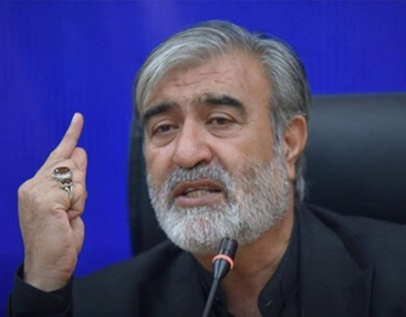

🔴 ابراهیم عزیزی، رییس کمیسیون امنیت ملی مجلس،

💢اماده‌ایم در تنگه هرمز و سایر میادین، بار دیگر دشمن را شکست بدهیم.»

💢به دشمنان هشدار می‌دهیم اگر دچار خطای محاسباتی شده و به امنیت ما خدشه‌ای وارد کنند، امنیت آن‌ها را در هر کجای جهان که باشد، سلب خواهیم کرد

💢او افزود: «امروز دشمن در تنگه هرمز در حال غرق‌شدن و تجربه شکست دیگری است و پیام ما به دشمن این است که هر اقدام محاسبه‌نشده، پاسخی دردناک به همراه خواهد داشت.»

🫆:Tony

📌 @persian_trend_official
پرشین ترند | متفاوت‌ترین کانال نظامی

## Persian_Trend_Official — post 14162

  <a href="telegram/content/Persian_Trend_Official_14162_1778791548.mp4">🎬 Download video</a>

🔴 تهدید کویت توسط عضو کمیسیون امنیت ملی مجلس

علی خضریان:
🔹کویت فراموش نکند که تنها در ۹۰ دقیقه توسط صدام تسخیر شد و امروز هم حد و حدود خود را بداند که جمهوری اسلامی بسیار قدرتمند است.

🫆:Tony

📌 @persian_trend_official
پرشین ترند | متفاوت‌ترین کانال نظامی

## Persian_Trend_Official — post 14161

https://youtube.com/live/SFBV2nP6Gs4?feature=share

## RadioFarda — post 157193

🔸همزمان با دیدار روسای جمهور آمریکا و چین در پکن، رهبران ۲۶ کشور روز پنجشنبه با انتشار بیانیه‌ای بار دیگر خواستار بازگشت وضعیت عادی دریانوردی در تنگه هرمز شدند. 🔸این بیانیه توسط کشورهایی مانند بریتانیا، فرانسه، بحرین، کانادا، آلمان، ژاپن، قطر و کره جنوبی…

## RadioFarda — post 157192

  

🔸همزمان با دیدار روسای جمهور آمریکا و چین در پکن، رهبران ۲۶ کشور روز پنجشنبه با انتشار بیانیه‌ای بار دیگر خواستار بازگشت وضعیت عادی دریانوردی در تنگه هرمز شدند.

🔸این بیانیه توسط کشورهایی مانند بریتانیا، فرانسه، بحرین، کانادا، آلمان، ژاپن، قطر و کره جنوبی صادر شده است.

🔸رهبران این کشورها در بیانیه خود بر «تعهد خود به استفاده از ظرفیت‌های جمعی دیپلماتیک، اقتصادی و نظامی برای حمایت از آزادی ناوبری در تنگه هرمز» تأکید کردند.

🔸در این بیانیه آمده است: «ناوبری باید مطابق با مفاد کنوانسیون حقوق دریاهای سازمان ملل متحد (UNCLOS) و قوانین بین‌المللی آزاد باشد.»

@RadioFarda

## RadioFarda — post 157191

  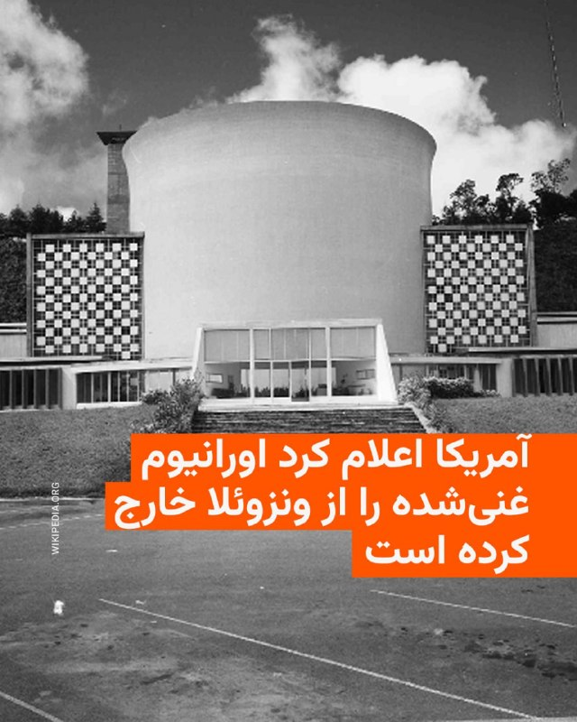

🔸وزارت خارجه آمریکا اعلام کرد واشینگتن با همکاری ونزوئلا، بریتانیا و آژانس بین‌المللی انرژی اتمی، محموله‌ای از اورانیوم غنی‌شده با غنای بالا را از راکتور تحقیقاتی تعطیل‌شده RV-1 در ونزوئلا خارج کرده است.

🔸بر اساس بیانیه وزارت خارجه آمریکا، این مواد هسته‌ای که بخشی از برنامه تاریخی «اتم برای صلح» آمریکا بود، اواخر آوریل بسته‌بندی و سپس از طریق بریتانیا به مرکز «ساوانا ریور» در کارولینای جنوبی منتقل شد.

🔸آمریکا این اقدام را بخشی از تلاش‌های جهانی برای کاهش خطرات هسته‌ای توصیف کرده و گفته عملیات در مدت چند ماه، و سریع‌تر از برنامه اولیه، انجام شده است.

🔸طبق اعلام اداره امنیت هسته‌ای ملی آمریکا، در این عملیات حدود ۱۳.۵ کیلوگرم اورانیوم با غنای بالاتر از ۲۰ درصد از ونزوئلا خارج شده است.

@RadioFarda

## IranianMinds — post 20149

  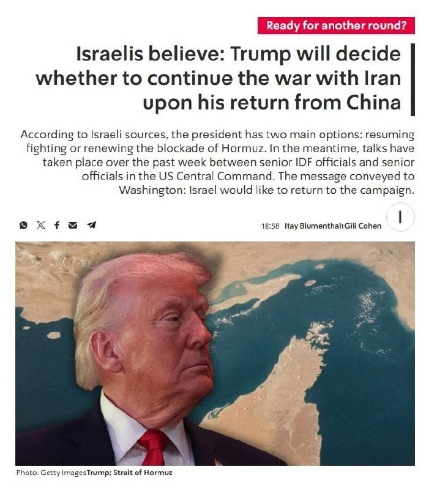

🔴کان‌نیوز:

اسرائیل معتقد است که ترامپ وقتی از چین برگرده، درباره حمله مجدد به ایران تصمیم‌گیری میکنه.

@IranianMinds

## IranianMinds — post 20148

🔴 خبرگزاری ایسنا : از الان دیگه باید با قیمت قطعی خودرو خداحافظی کنید؛ در طرح جدید ایران ‌خودرو و سایپا، خریداران باید نصف پول رو از اول بدن بدون اینکه حتی بفهمن قیمت نهایی زمان تحویل خودرو براشون چقدره ! @IranianMinds

## IranianMinds — post 20147

ShirOKhorshid-2026.05.14.apk

## BBCPersian — post 281056

  

‌🔻ایتامار بن گوویر، وزیر امنیت ملی اسرائیل، که گرایشات راست افراطی دارد، قوانین دیرینه اماکن مذهبی این کشور را زیر پا گذاشته و یک پرچم اسرائیل را در کنار مسجدالاقصی به حرکت درآورده است. یهودیان به این مکان، کوه معبد می‌گویند.

در فیلمی که از این وزیر اسرائیلی بعد از برافراشتن پرچم اسرائیل گرفته شده، دیده می‌شود که او رقص‌کنان، آواز «کوه معبد در دستان ماست» را سرمی‌دهد. پس از آن، ده‌ها هزار اسرائیلی در یک مراسم سالیانه مذهبی و ملی در بخش قدیمی بیت‌المقدس راهپیمایی کردند.

«راهپیمایی پرچم» به مناسبت سالگرد تصرف بیت‌المقدس شرقی ا‌ز سوی اسرائیل در جنگ سال ۱۹۶۷ برگزار می‌شود.

خبرنگار بی‌بی‌سی در بیت‌المقدس می‌گوید این مراسم معمولا با خشونت و شعارهای نژادپرستانه علیه ساکنان فلسطینی این منطقه از بیت‌المقدس همراه است.

امسال، ده‌ها فعال صلح‌طلب اسرائیل تلاش کردند با این آزار و اذیت‌ها مقابله کنند.

📷Reuters
https://bbc.in/490B5pq

@BBCPersian

## BBCPersian — post 281055

  <a href="telegram/content/BBCPersian_281055_1778791552.mp4">🎬 Download video</a>

🔻آخرین خبرهای مهم روز پنجشنبه ۲۴ اردیبهشت ۱۴۰۵
@BBCPersian

## BBCPersian — post 281054

  <a href="telegram/content/BBCPersian_281054_1778791553.mp4">🎬 Download video</a>

🔻مادری که در سال گذشته دخترش را به دلیل یک عارضه قلبی از دست داده بود موفق شد پس از مرگ او دستانش را دوباره بگیرد.

جرجی وقتی ۱۷ سال داشت فرم اهدای عضو را پر کرده بود و یک سال پیش، پس از مرگ او اعضای بدنش به فردی که هر چهار دست و پای خود را از دست داده بود پیوند داده شد و حالا مادر جرجی دستان دخترش را در جان فردی که او نجات داده است می‌تواند دوباره ببیند و لمس کند.

فردی که جرجی اعضای بدنش را به او اهدا کرده بود می‌گوید که حالا و پس از پیوند عضو استقلال عمل زیادی دارد و می‌تواند خیلی از کارها را انجام دهد.

برای مادر جرجی در دست گرفتن دستان دخترش پس از از دست دادن او تجربه‌ای بی‌نظیر و خارق‌العاده است.
@BBCPersian

## Dirty_Kids — post 389469

  <a href="telegram/content/Dirty_Kids_389469_1778791555.mp4">🎬 Download video</a>

چون دل‌تون برای سخنگوی اسکل الانبیا تنگ شده میدونم

@Dirty_Kids 👻

## Dirty_Kids — post 389468

  

اره داداش، امریکا تایوان رو میده به چین و ایران رو ازش میگیره.

@Dirty_Kids 👻

## configx2ray — post 38854

جهت دریافت Dns های متصل شیر و خورشید روی همین کلمه کلیک کنید 🌟

## configx2ray — post 38853

چندین DNS متصل تست شده رو براتون تست کردیم برای این که سریع مسدود نشه داخل رباتمون گذاشتیم میتونین با کلیک کردن کلمه زیر دریافت کنید و استفاده کنید 
❤️

جهت دریافت Dns های متصل شیر و خورشید روی همین کلمه کلیک کنید 🌟

Channel : https://t.me/ConfigX2ray

## configx2ray — post 38851

😈

## configx2ray — post 38850

23.207.154.93
23.222.125.55
23.49.248.33
2.23.237.178
23.59.235.9
23.214.170.91
2.20.12.96
2.20.12.86
2.21.2.25
23.44.201.134
23.48.224.68
23.217.125.42
23.217.125.249
23.212.254.112
23.210.73.147
2.21.2.26
23.63.84.194
2.21.2.74
23.219.2.145
23.216.77.178
23.216.77.177
23.216.77.180
23.216.77.184
23.1.228.178
23.208.64.159
23.221.29.186
184.25.52.7
2.19.193.232
23.35.134.38
184.29.98.95
2.20.255.113
23.219.2.137
184.25.193.133
23.49.248.29
23.216.77.172
23.216.77.163
2.19.117.69
2.23.237.157
2.21.2.9
23.1.228.149
23.1.228.142
23.216.151.146
23.216.77.170
23.216.77.149
184.25.102.162
23.1.228.168
23.49.248.40
23.53.35.203
23.44.111.48
23.48.224.81
23.44.201.140
23.202.138.125
23.216.77.157
23.216.77.153
2.22.255.37
2.22.255.34
2.22.255.39
2.22.255.40
23.221.227.196
23.216.77.136
23.216.77.140
23.216.77.138
23.1.228.156
23.1.228.145
23.1.228.137
2.16.6.151
23.215.0.45
23.216.132.68
2.19.204.170
23.214.184.21
23.48.224.70
23.48.224.71
23.48.224.74
2.21.2.16
2.22.255.20
23.216.77.141
23.221.227.207
23.221.214.145
23.221.241.92
23.39.223.148
23.48.203.135
2.20.12.98
2.21.2.17
184.25.102.153
2.22.255.9
2.22.255.17
2.21.2.96
23.221.30.96
23.209.72.174
2.20.12.97
2.19.204.225
23.49.5.132
23.61.202.82
23.38.49.97
2.21.239.12
2.21.239.23
23.14.133.112
2.21.2.65
2.21.2.56
23.203.134.235
2.23.81.75
23.37.196.7
23.44.201.145
23.44.201.147
23.44.201.152
23.55.176.84
23.221.240.208
23.208.64.169
23.216.77.83
23.3.90.50
184.26.57.235
23.9.30.108
23.39.223.154
2.19.204.217
23.207.138.29
23.35.29.178
2.19.204.201
23.219.36.113
184.24.145.216
23.216.77.58
23.44.111.73
2.21.2.81
23.44.201.19
23.205.218.66
23.219.89.184
23.53.126.64
23.219.36.109
23.202.229.22
23.209.72.137
23.44.201.6
23.215.0.134
2.19.204.211
23.219.36.106
23.215.0.44
23.15.241.218
23.207.192.6
2.16.1.201
2.21.2.49
23.36.20.220
23.219.36.103
23.219.36.104
2.21.2.88
23.55.176.89
23.39.148.213
23.35.28.60
2.19.204.200
23.209.72.172
184.26.128.7
23.212.254.67
95.100.170.50
2.21.2.66
2.19.204.235
2.17.106.104
23.32.113.166
2.21.2.40
23.48.203.113
23.1.33.18
23.61.202.117
23.209.72.134
23.44.201.218
23.44.201.216
2.21.2.98
2.21.2.97
2.21.2.90
23.44.201.27
2.21.2.42
23.209.72.135
23.55.244.179
23.203.134.236
2.19.204.218
23.53.127.106
2.19.204.203
23.220.200.9
23.47.49.240
23.15.241.153
23.201.31.240
23.61.202.70
23.209.72.167
2.20.135.152
23.44.111.49
2.20.135.160
23.40.207.81
184.29.30.61
23.38.63.215
2.21.2.80
2.21.2.82
23.207.192.167
23.215.0.5
23.61.214.101
23.37.182.153
2.19.204.202

لیست ایپی های تست شده برای متود جدید سایفون 
🌟

همشو باهم وارد کنید داخل برنامه 
❤️

Channel : https://t.me/ConfigX2ray

## configx2ray — post 38849

184.26.13.91
23.54.210.170
23.44.201.206
23.220.163.205
23.209.46.33
23.10.34.11
23.39.185.35
23.32.152.106
23.218.232.181
23.206.188.212
2.21.2.89
23.208.222.120
23.48.203.248
23.44.201.136
23.44.201.151
23.44.201.149
2.21.2.58
23.3.90.48
23.44.201.41
2.19.204.184
23.218.232.188
23.44.201.12
23.212.253.227
23.201.31.155
23.220.163.203
23.44.201.185
23.52.116.66
23.44.201.17
23.62.54.24
23.218.239.132
23.39.149.69
23.52.40.147
23.58.95.144
2.16.244.58
23.212.253.137
2.17.106.176
23.62.54.137
2.17.106.5
23.203.134.233
23.212.253.232
23.206.188.197
23.44.201.170
23.54.127.39
23.214.170.83
23.52.40.89
23.55.176.73
23.202.229.140
23.215.56.61
2.17.106.166
23.222.126.108
184.25.85.224
23.1.241.123
23.3.90.43

لیست ایپی های تست شده برای متود جدید سایفون 
🌟

همشو باهم وارد کنید داخل برنامه 
❤️

Channel : https://t.me/ConfigX2ray

## manototv — post 105464

  <a href="telegram/content/manototv_105464_1778791556.mp4">🎬 Download video</a>

تماسی از ایران:
«می‌گفت بیمه عملاً داروها، مخصوصاً انسولین رو پوشش نمی‌ده…
و هزینه‌ها چند برابر شده.
می‌گفت دارو هست، اما برای خیلی‌ها دیگه قابل تهیه نیست.»

## manototv — post 105463

  <a href="telegram/content/manototv_105463_1778791557.mp4">🎬 Download video</a>

تماسی از ایران:
«می‌گفت برای زنده نگه داشتن پدرش حتی کپسول اکسیژن هم پیدا نمی‌شد…
و بیمارستان، با اون حال وخیم، مرخصش کرد چون تخت لازم داشت.

## alonews — post 120047

  <a href="telegram/content/alonews_120047_1778791559.jpg">🎬 Download video</a>

🔴فوری/سفر هفته آینده رئیس جمهور اسرائیل به آمریکا به طور ناگهانی لغو شد.

✅ @AloNews خبر جنگ

## alonews — post 120046

  

عجیب ترین توافق نامه ازدواج که توی دوران جنگ رقم خورد:

[@AloTweet]

## alonews — post 120045

تعرفه سرویس های Vip 
⭕️ 
✅ 1 گیگابایت 
⬅️ 235/000 تومان 
✅ 3 گیگابایت 
⬅️ 735/000 تومان استارلینک Vip 
💫 
🌟 
⭐️ 5 گیگابایت 
⬅️ 1/150/000 تومان 
⭐️ 10 گیگابایت 
⬅️ 2/350/000 تومان ویژگی های سرویس های Vip : 
❤️‍🔥 
✅    متصل در تمامی دستگاه و اپراتور ها 
✅    مناسب استفاده…

## alonews — post 120044

  <a href="telegram/content/alonews_120044_1778791559.jpg">🎬 Download video</a>

👈سنتکام: از آغاز محاصره دریایی بنادر ایران، 72 کشتی تجاری را منحرف و 4 کشتی را از کار انداختیم

✅ @AloNews خبر جنگ

## alonews — post 120043

  <a href="telegram/content/alonews_120043_1778791559.jpg">🎬 Download video</a>

👈وزارت خارجه قطر: ما به طور کامل از تلاش‌های پاکستان برای میانجیگری بین آمریکا و ایران حمایت می‌کنیم

✅ @AloNews خبر جنگ

## alonews — post 120042

  <a href="telegram/content/alonews_120042_1778791560.jpg">🎬 Download video</a>

👈سوپر اپ روبیکا بیش از یک ساعته قطع شده

✅ @AloNews خبر جنگ

## alonews — post 120041

  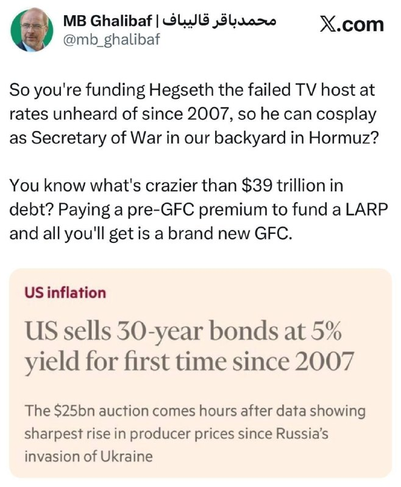

👈محمدباقر قالیباف: پس شما به هگست، مجری تلویزیونی شکست‌خورده، بودجه‌ای می‌دهید که از سال ۲۰۰۷ بی‌سابقه است، تا بتواند در حیاط خلوت ما در هرمز نقش وزیر جنگ را بازی کند؟

🔴می‌دانی چه چیزی دیوانه‌کننده‌تر از ۳۹ تریلیون دلار بدهی است؟ پرداخت حق بیمه پیش از بحران مالی جهانی برای حمایت از یک بازی نقش‌آفرینی زنده (LARP) و تنها چیزی که به دست می‌آوری یک بحران مالی جهانی جدید است.

✅ @AloNews خبر جنگ

## alonews — post 120040

  <a href="telegram/content/alonews_120040_1778791560.jpg">🎬 Download video</a>

👈رئیس‌جمهور ترامپ و هیئت همراهش در طول سفر به چین از تلفن‌ها و لپ‌تاپ‌های جایگزین استفاده کردند به دلیل نگرانی‌هایی که داشتند مبنی بر اینکه مقامات چینی ممکن است از آن‌ها برای نصب نرم‌افزار جاسوسی استفاده کنند، طبق گزارش فاکس نیوز.

✅ @AloNews خبر جنگ

## alonews — post 120039

  <a href="telegram/content/alonews_120039_1778791560.jpg">🎬 Download video</a>

👈العربی الجدید: حمله انتحاری، پایگاه نظامی ارتش در منطقه باجور در شمال غربی پاکستان را هدف قرار داد.

✅ @AloNews خبر جنگ

## alonews — post 120038

  <a href="telegram/content/alonews_120038_1778791561.jpg">🎬 Download video</a>

👈میدل ایست : ارتش دفاعی اسرائیل از فردا که ترامپ چین رو ترک می‌کنه، به بالاترین حالت آماده‌باش وارد میشه

✅ @AloNews خبر جنگ

## alonews — post 120037

  <a href="telegram/content/alonews_120037_1778791561.jpg">🎬 Download video</a>

👈طبق گزارش بی‌بی‌سی، شناوری که ایران امروز توقیف کرد، «هوی چوان» نام دارد.
هوی چوان یکی از چندین کشتی شبح نظامی چین است که پکن از آن‌ها برای پشتیبانی از ارتش‌ها و شبه‌نظامیان در سراسر جهان استفاده می‌کند.

🔴این شناور توسط پیمانکاران نظامی خصوصی چین برای کمک به اسکورت کشتی‌های تجاری در دریای عرب و دور زدن دزدی دریایی، حوثی‌ها و سومالی به کار گرفته می‌شد

✅ @AloNews خبر جنگ

## alonews — post 120036

  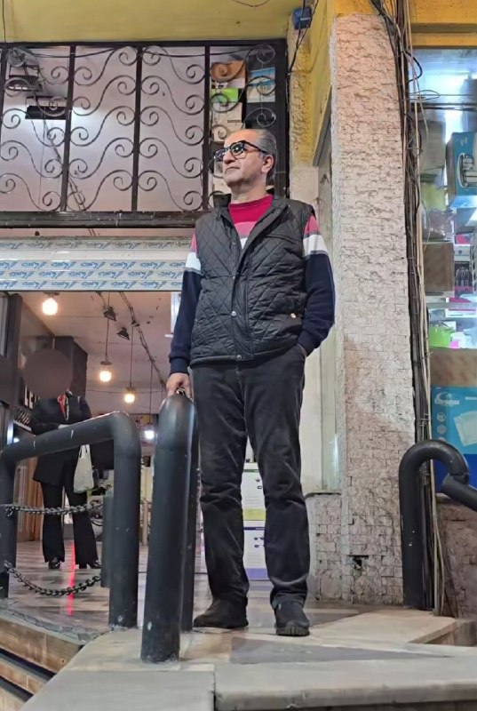

👈بدل شاه فقید در تهران رویت شد

✅ @AloNews خبر جنگ

## alonews — post 120035

  <a href="telegram/content/alonews_120035_1778791561.jpg">🎬 Download video</a>

👈اعتراضات در کوبا آغاز شده
این اعتراضات در حالی آغاز شد که دولت کوبا برق مناطق شرقی این کشور را به طور نامحدود قطع کرد.

🔴دولت اعلام کرد که "مطلقاً سوختی باقی نمانده است" و وضعیت اکنون "بحرانی" است.

✅ @AloNews خبر جنگ

## alonews — post 120034

  <a href="telegram/content/alonews_120034_1778791562.mp4">🎬 Download video</a>

👈لیندسی گراهام، سناتور مطرح آمریکایی با آشغال نامیدن متحدان چین از جمله ایران و روسیه، از این کشور برای باز کردن تنگه هرمز درخواست کمک کرد!

✅ @AloNews خبر جنگ

## alonews — post 120033

  

👈رسایی:
قالیباف بدون هیچ دلیلی مجلس رو بسته

✅ @AloNews خبر جنگ

## alonews — post 120031

اسرائیل کاتز، وزیر دفاع اسرائیل:
لامین یامال تصمیم گرفت با این حرکتش علیه اسرائیل یه جو بزرگ درست کنه و به تنش‌ها دامن بزنه.
کسایی که از این مدل رفتارها حمایت می‌کنن باید از خودشون بپرسن آیا این کار انسانی و اخلاقیه یا نه!؟
من به عنوان وزیر دفاع اسرائیل مقابل توهین به اسرائیل و مردم یهودی سکوت نمی‌کنم.
از باشگاه بارسلونا میخوام از این حواشی فاصله بگیره و اجازه هیچ‌گونه حمایتی از تروریسم رو نده
@AloSport

## alonews — post 120030

اخبار جنگ الونیوز AloNews pinned «تعرفه سرویس های Vip 
⭕️ 
✅ 1 گیگابایت 
⬅️ 235/000 تومان 
✅ 3 گیگابایت 
⬅️ 735/000 تومان استارلینک Vip 
💫 
🌟 
⭐️ 5 گیگابایت 
⬅️ 1/150/000 تومان 
⭐️ 10 گیگابایت 
⬅️ 2/350/000 تومان ویژگی های سرویس های Vip : 
❤️‍🔥 
✅    متصل در تمامی دستگاه و اپراتور ها 
✅    مناسب استفاده…»

## alonews — post 120029

  <a href="telegram/content/alonews_120029_1778791564.jpg">🎬 Download video</a>

👈زمین‌لرزه‌ای به بزرگی ۳.۵ ریشتر ساعت ۲۲:۲۹:۴۸ شامگاه پنجشنبه ۲۴ اردیبهشت حوالی قلعه قاضی در استان هرمزگان به وقوع پیوست

✅ @AloNews خبر جنگ

## alonews — post 120028

  <a href="telegram/content/alonews_120028_1778791564.jpg">🎬 Download video</a>

🔴صاحب کمپانی حمل و نقل در انگلیس، یه ایرانی باشرف و میهن‌پرسته و برداشته تریلی های شرکتش رو با پرچم‌ شیروخورشید ایران مزین کرده

✅@AloNews

---
📅 بروزرسانی: 1405/02/24 22:32
---

## VahidOOnLine — post 240174

  

محمدعلی جعفری، فرمانده قرارگاه «بقیه‌الله» سپاه پاسداران، در ویدیویی که بخش‌هایی از آن را خبرگزاری تسنیم منتشر کرده، گفت: «جمهوری اسلامی بدون اقدامات اعتمادساز از سوی آمریکا وارد مذاکرات نمی‌شود و آغاز دوباره جنگ قطعا به ضرر آمریکاست».

جعفری افزود: «دونالد ترامپ از متن‌های ارسالی تیم مذاکره‌کننده جمهوری اسلامی خوشش نمی‌آید، اما راه بهتری جز پذیرش شروط تهران ندارد».

او گفت جمهوری اسلامی در «گام اول» با آمریکا مذاکره نمی‌کند و از طریق پاکستان در حال تبادل پیام بر اساس شروط خود است.

فرمانده قرارگاه «بقیه‌الله» سپاه پاسداران، گفت جمهوری اسلامی ابتدا اقدامات اعتمادساز خود را اعلام می‌کند و از «دشمن» تعهد می‌گیرد و تنها در صورت دریافت تعهد، وارد مذاکره می‌شود.
‌🏁 🇬🇧 IranintlTV

🤖 @VahidOOnLine

## VahidOOnLine — post 240173

  

روزنامه فایننشال‌تایمز به‌نقل از دیپلمات‌ها و منابع آگاه گزارش داد که عربستان سعودی درباره ایده یک پیمان عدم‌تجاوز میان کشورهای خاورمیانه و جمهوری اسلامی گفت‌وگو کرده است.

به‌نوشته این روزنامه، کشورهای خلیج فارس به‌ویژه از زمان آغاز جنگ آمریکا و اسرائیل علیه ایران نگران بوده‌اند که پس از پایان درگیری و کاهش حضور نظامی گسترده آمریکا در منطقه، با یک حکومت اسلامی زخمی اما تندروتر در همسایگی خود باقی بمانند.

فایننشال‌تایمز پنج‌شنبه ۲۴ اردیبهشت نوشت عربستان سعودی ایده یک پیمان عدم‌تجاوز میان کشورهای خاورمیانه و ایران را در چارچوب رایزنی‌ها با متحدان درباره نحوه مدیریت تنش‌های منطقه‌ای پس از پایان جنگ آمریکا و اسرائیل با جمهوری اسلامی مطرح کرده است.

دو دیپلمات غربی به این روزنامه گفتند ریاض در حال بررسی فرآیند هلسینکی دهه ۱۹۷۰ به‌عنوان یک الگوی احتمالی است؛ فرآیندی که در دوران جنگ سرد به کاهش تنش‌ها در اروپا کمک کرد.

ادامه این گزارش را در وبسایت ایران‌اینترنشنال بخوانید
‌🏁 🇬🇧 IranintlTV

🤖 @VahidOOnLine

## VahidOOnLine — post 240172

  <a href="telegram/content/VahidOOnLine_240172_1778785329.mp4">🎬 Download video</a>

♦️دونالد ترامپ، رئیس‌جمهوری آمریکا، در مصاحبه با شان هنیتی از شبکه فاکس نیوز اعلام کرد که شی جین‌پینگ، رئیس‌جمهوری چین، با قاطعیت تاکید کرده است که کشورش هیچ‌گونه تجهیزات نظامی در اختیار جمهوری اسلامی قرار نخواهد داد. ترامپ این اظهارنظر رهبر چین را یک «بیانیه بزرگ» توصیف کرد که با جدیت بیان شده است.

رئیس‌جمهوری آمریکا در ادامه افزود که پکن به‌دلیل خرید حجم بالای نفت، خواستار بازگشایی تنگه هرمز و تداوم روابط تجاری خود است. ترامپ همچنین به نارضایتی شی جین‌پینگ از سیستم دریافت عوارض توسط جمهوری اسلامی در این آبراه اشاره کرد و با لحنی انتقادی گفت کشور ایران که اکنون «نابود شده» است، مشخص نیست این پول‌ها را کجا هزینه می‌کند. او خاطرنشان کرد که اگرچه چین خواستار بازگشایی مسیر است، اما در واقع ابتدا ایران مسیر رفت و آمد در این تنگه را مسدود کرد و سپس آمریکا محاصره دریایی را در نظر گرفت.
‌🇸🇦 Indypersian

🤖 @VahidOOnLine

## VahidOOnLine — post 240171

  

اف‌بی‌آی اعلام کرد برای ارائه اطلاعات درباره مونیکا ویت، مامور سابق ضدجاسوسی آمریکا که در سال ۲۰۱۳ به ایران پناهنده شده، ۲۰۰ هزار دلار جایزه تعیین کرده است.

به گفته اف‌بی‌آی، او اطلاعات مرتبط با دفاع ملی ایالات متحده را در اختیار جمهوری اسلامی قرار داده است.

ویت، افسر پیشین اطلاعاتی نیروی هوایی آمریکا و مامور ویژه دفتر تحقیقات ویژه نیروی هوایی، بین سال‌های ۱۹۹۷ تا ۲۰۰۸ در ارتش آمریکا خدمت کرد و سپس تا سال ۲۰۱۰ به‌عنوان پیمانکار دولت آمریکا فعالیت داشت.

سوابق نظامی و فعالیت قراردادی او موجب شده بود به اطلاعات محرمانه و فوق‌محرمانه در حوزه اطلاعات خارجی و ضدجاسوسی، از جمله هویت واقعی نیروهای مخفی آمریکا، دسترسی داشته باشد.
‌🏁 🇬🇧 IranintlTV

🤖 @VahidOOnLine

## VahidOOnLine — post 240170

  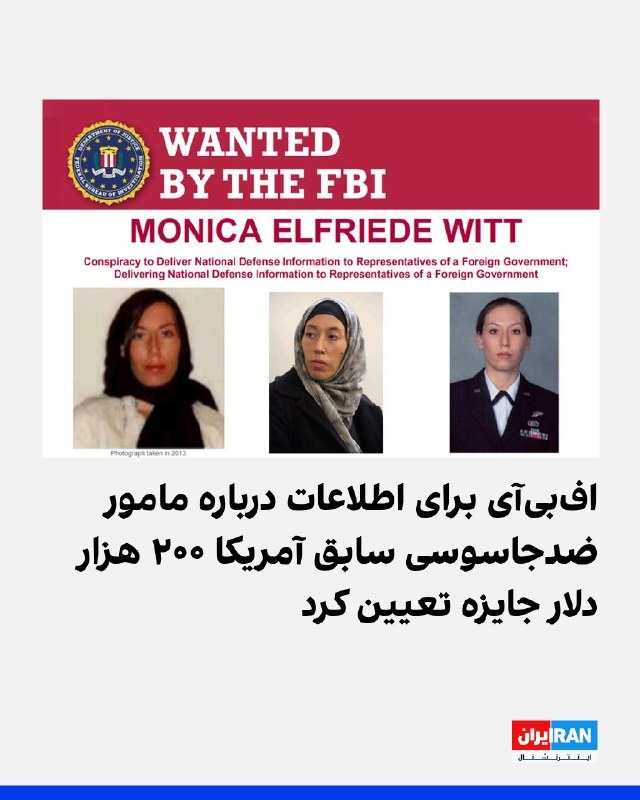

اف‌بی‌آی اعلام کرد برای ارائه اطلاعات درباره مونیکا ویت، مامور سابق ضدجاسوسی آمریکا که در سال ۲۰۱۳ به ایران پناهنده شده، ۲۰۰ هزار دلار جایزه تعیین کرده است.

به گفته اف‌بی‌آی، او اطلاعات مرتبط با دفاع ملی ایالات متحده را در اختیار جمهوری اسلامی قرار داده است.

ویت، افسر پیشین اطلاعاتی نیروی هوایی آمریکا و مامور ویژه دفتر تحقیقات ویژه نیروی هوایی، بین سال‌های ۱۹۹۷ تا ۲۰۰۸ در ارتش آمریکا خدمت کرد و سپس تا سال ۲۰۱۰ به‌عنوان پیمانکار دولت آمریکا فعالیت داشت.

سوابق نظامی و فعالیت قراردادی او موجب شده بود به اطلاعات محرمانه و فوق‌محرمانه در حوزه اطلاعات خارجی و ضدجاسوسی، از جمله هویت واقعی نیروهای مخفی آمریکا، دسترسی داشته باشد.
‌🏁 🇬🇧 IranintlTV

🤖 @VahidOOnLine

## VahidOOnLine — post 240169

  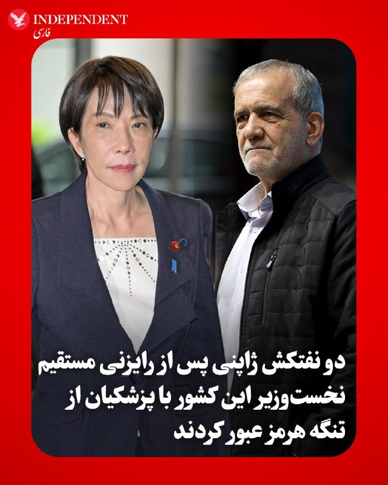

♦️وال استریت ژورنال روز پنجشنبه ۲۴ اردیبهشت گزارش داد که دو نفت‌کش ژاپنی پس از گفتگوهای مستقیم سانائه تاکایچی، نخست‌وزیر ژاپن، با مقامات ارشد جمهوری اسلامی موفق به عبور ایمن از تنگه هرمز شدند. تاکایچی در پیامی اعلام کرد که دولت او هماهنگی‌های متعددی از جمله «ارتباط مستقیم با مسعود پزشکیان» انجام داده است تا امنیت تردد کشتی‌های ژاپنی را تضمین کند.

داده‌های ردیابی نشان می‌دهد نفت‌کش غول‌پیکر «انئوس اندوور» (Eneos Endeavor) متعلق به شرکت NYK Line، که از دوشنبه گذشته سیگنال‌های خود را قطع کرده بود، روز چهارشنبه از تنگه هرمز عبور کرده و راهی بندر «کی‌یره» در ژاپن شده است. این کشتی از اواخر فوریه با محموله نفت کویت در منطقه متوقف شده بود. همچنین نفت‌کش دیگر ژاپنی به نام «ایدمیتسو مارو» (Idemitsu Maru) اواخر آوریل از این آبراه عبور کرده و در مسیر بازگشت به بندر ناگویا است.

نخست‌وزیر ژاپن خاطرنشان کرد که این کشور برای تامین امنیت انرژی خود، سه‌چهارم نیاز ماه ژوئن را از منابع جایگزین مانند ایالات متحده تامین کرده و بخشی از ذخایر استراتژیک نفت خود را نیز آزاد خواهد کرد.
‌🇸🇦 Indypersian

🤖 @VahidOOnLine

## VahidOOnLine — post 240168

  <a href="telegram/content/VahidOOnLine_240168_1778785333.mp4">🎬 Download video</a>

روزنامه فایننشال‌تایمز گزارش داده عربستان سعودی در حال بررسی طرحی برای ایجاد یک توافق امنیتی «عدم تجاوز» میان جمهوری‌اسلامی و کشورهای خاورمیانه است؛ توافقی که قرار است پس از پایان قطعی جنگ آمریکا و اسرائیل با ایران مطرح شود.
بر اساس این گزارش، این پیمان الگویی مشابه توافق هلسینکی در سال ۱۹۷۵ خواهد داشت؛ توافقی که میان آمریکا، کشورهای اروپایی و اتحاد جماهیر شوروی سابق امضا شده بود.
یک دیپلمات عرب به فایننشال‌تایمز گفته موفقیت چنین توافقی به کشورهایی بستگی دارد که در آن حضور خواهند داشت.
او گفته است: «اگر اسرائیل در این توافق حضور نداشته باشد، ممکن است نتیجه معکوس بدهد، چون بعد از ایران، اسرائیل از نگاه بسیاری عامل اصلی تنش در منطقه محسوب می‌شود. اما ایران از منطقه حذف نمی‌شود و به همین دلیل عربستان چنین طرحی را دنبال می‌کند.»
این گزارش همچنین به نقل از دو دیپلمات دیگر نوشته امارات متحده عربی ممکن است تمایلی به پیوستن به چنین توافقی نداشته باشد؛ کشوری که پس از امضای توافق ابراهیم در سال ۲۰۲۰، روابط نزدیکی با اسرائیل برقرار کرده است.
‌🏁 🇬🇧 ManotoTV

🤖 @VahidOOnLine

## VahidOOnLine — post 240167

  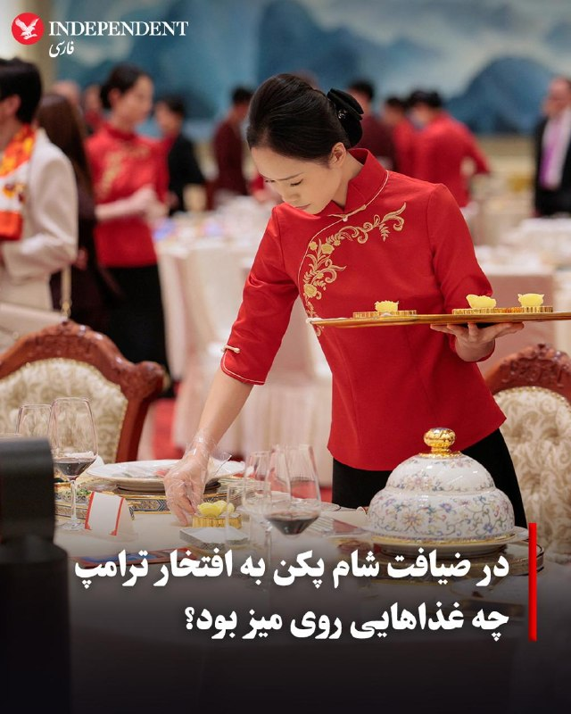

♦️در جریان ضیافت شام رسمی که به میزبانی شی جین‌پینگ برای دونالد ترامپ در پکن برگزار شد، سرآشپزهای چینی تلاش کردند با تلفیق مواد اولیه سنتی و ذائقه خاص ترامپ، منویی متفاوت ارائه دهند. غذاهای اصلی این مراسم شامل دنده گوساله ترد، اردک کباب شده و سالمون پخته شده در سس خردل بود. همچنین خرچنگ در سوپ گوجه‌فرنگی، سبزیجات فصلی، نان گوشت سرخ‌شده و نوعی شیرینی به شکل صدف در فهرست غذاها به چشم می‌خورد.

برخلاف ذائقه ترامپ که به غذاهای ساده آمریکایی مانند استیک کاملا پخته و همبرگر علاقه دارد، آشپزهای پکن با ارائه نسخه‌های ارتقایافته‌ای از استیک و غذاهای بین‌المللی سعی در جلب رضایت او داشتند. برای دسر نیز از مهمانان با تیرامیسو، میوه و بستنی پذیرایی شد. این رویکرد دیپلماتیک در انتخاب منو، مشابه سفرهای پیشین ترامپ به ژاپن و کره جنوبی بود که در آنجا نیز برای نشان دادن حسن نیت، از گوشت گاو آمریکایی و استیک استفاده شده بود.
‌🇸🇦 Indypersian

🤖 @VahidOOnLine

## VahidOOnLine — post 240166

♦️عباس عراقچی، وزیر خارجه جمهوری اسلامی روز پنجشنبه ۲۴ اردیبهشت در خصوص صحبت‌های مطرح شده در نشست بریکس گفت: امارات در این جنگ در کنار آمریکا و اسرائیل ایستاد و ناچار شدیم واقعیت‌ها را برای جامعه بین‌المللی بازگو کنیم.
عراقچی گفت: «برای همه حاضران در جلسه عجیب بود که نماینده امارات هیچ مسئله‌ای نداشت جز پرداختن به موضوع جنگ و پاسخ‌هایی که ایران به آمریکا در خاک آن کشور داده بود.»
او اضافه کرد که «ما نمی‌خواستیم برای حفظ وحدت و انسجام بریکس وارد این مباحث شویم، اما چون نماینده امارات این موضوعات را مطرح کرد، ناچار شدیم واقعیت‌ها را بازگو کنیم.»
‌🇸🇦 Indypersian

🤖 @VahidOOnLine

## VahidOOnLine — post 240165

  <a href="telegram/content/VahidOOnLine_240165_1778785334.mp4">🎬 Download video</a>

♦️ایلان ماسک، میلیاردر مشهور آمریکایی و صاحب شرکت‌های تسلا و اسپیس‌ایکس، که همراه با تعدادی دیگر از تاجران و ثروتمندان آمریکایی در ضیافت شام دولتی چین حضور داشت، هنگام عکس گرفتن با تیم کوک، مدیرعامل شرکت اپل، با ژست‌های عجیب خود بار دیگر سوژه دوربین‌های خبرنگاران شد.
‌🇸🇦 Indypersian

🤖 @VahidOOnLine

## VahidOOnLine — post 240164

  

وال‌استریت ژورنال به نقل از چند مقام آمریکایی و چند مقام کشورهای خلیج فارس گزارش داد عربستان سعودی پس از آن‌که تهران تاسیسات انرژی و زیرساخت‌های غیرنظامی این کشور را هدف قرار داد، به‌طور محرمانه حملاتی علیه جمهوری اسلامی انجام داده است.
به گفته یکی از این مقام‌ها، نیروی هوایی عربستان سعودی چندین حمله علیه اهدافی از جمله سایت‌های پرتاب پهپاد و موشک جمهوری اسلامی انجام داده است.
همچنین برخی منابع گفتند جنگنده‌های عربستان سعودی اهدافی در عراق مرتبط با شبه‌نظامیان مورد حمایت جمهوری اسلامی را نیز هدف قرار داده‌اند.
‌🏁 🇬🇧 IranintlTV

🤖 @VahidOOnLine

## VahidOOnLine — post 240163

  <a href="telegram/content/VahidOOnLine_240163_1778785337.mp4">🎬 Download video</a>

تدابیر امنیتی ویژه در سفر ترامپ به چین؛ استفاده از گوشی‌های موقتی برای جلوگیری از جاسوسی سایبری
رسانه‌های آمریکایی گزارش داده‌اند اعضای هیئت همراه دونالد ترامپ در سفر به پکن، برای جلوگیری از خطرات جاسوسی سایبری، از تلفن‌های موقتی و لپ‌تاپ‌های ویژه با دسترسی محدود استفاده می‌کنند.
بر اساس این گزارش‌ها، مقام‌های آمریکایی، دستیاران ترامپ و برخی مدیران شرکت‌های بزرگ فناوری از جمله ایلان ماسک و تیم کوک، دستگاه‌های شخصی خود را به چین نبرده‌اند و به‌جای آن از تجهیزات موسوم به «Burner Phone» و «Clean Device» استفاده می‌کنند.
گفته می‌شود نگرانی اصلی، احتمال شنود یا هک اطلاعات از طریق شبکه‌های اینترنتی، وای‌فای هتل‌ها، شارژرها و زیرساخت‌های ارتباطی در چین است.
این اقدام بخشی از پروتکل‌های امنیتی آمریکا برای سفرهای رسمی به چین به شمار می‌رود، اما رسانه‌ها می‌گویند این بار تدابیر امنیتی با حساسیت بیشتری اجرا شده است. مقام‌های آمریکایی در چنین سفرهایی فرض را بر این می‌گذارند که «هیچ چیز در چین امن نیست.»
‌🏁 🇬🇧 ManotoTV

🤖 @VahidOOnLine

## VahidOOnLine — post 240162

  <a href="telegram/content/VahidOOnLine_240162_1778785337.mp4">🎬 Download video</a>

عبدالحلیم خان، امام جماعت ۵۴ ساله ساکن شرق لندن، به‌دلیل تجاوز و آزار جنسی چندین زن و دختر، از جمله کودکان زیر ۱۳ سال، به حبس ابد محکوم شد.

پلیس متروپولیتن اعلام کرد او بین سال‌های ۲۰۰۴ تا ۲۰۱۵ از موقعیت مذهبی خود سوءاستفاده کرده و زنان و دخترانی حتی ۱۲ ساله را هدف قرار داده است.

خان در ماه فوریه در دادگاه «اسنرز‌بروک» به ۹ فقره تجاوز، چهار مورد آزار جنسی، دو مورد آزار جنسی کودک زیر ۱۳ سال، پنج مورد تجاوز به کودک زیر ۱۳ سال و یک مورد تعرض جنسی محکوم شد.

قاضی پرونده گفت او «پشت ظاهر تقدس و دینداری، به شکلی هیولاوار از زنانی که به او اعتماد داشتند سوءاستفاده کرده است.»

بر اساس اعلام دادستانی بریتانیا، خان به قربانیان می‌گفت توسط «جن» یا نیروهای ماورایی تسخیر شده و از این ادعا برای سوءاستفاده جنسی استفاده می‌کرد.

دادستان‌ها همچنین گفتند قربانیان از ترس «جادوی سیاه» و تهدیدهای او، سال‌ها موضوع را پنهان نگه داشته بودند.

یکی از قربانیان در بیانیه‌ای خطاب به دادگاه گفت: «برای من، خان انسان نیست؛ تجسم شر است.»

پلیس لندن اعلام کرد پرونده زمانی آغاز شد که کوچک‌ترین قربانی در سال ۲۰۱۸ موضوع را به معلم مدرسه‌اش گزارش داد.
‌🏁 🇬🇧 ManotoTV

🤖 @VahidOOnLine

## VahidOOnLine — post 240161

  

♦️مارکو روبیو، وزیر امور خارجه ایالات متحده، در گفتگو با شبکه سی‌ان‌بی‌سی (CNBC) اعلام کرد که ترجیح چین احتمالا پیوستن داوطلبانه و آگاهانه تایوان به این کشور است. او اشاره کرد که در یک شرایط ایده‌آل، پکن به دنبال برگزاری نوعی رای‌گیری یا همه‌پرسی در تایوان است که به موجب آن، الحاق به خاک اصلی مورد توافق قرار گیرد.

روبیو با تاکید بر اینکه موضوع «اتحاد مجدد» بخش مهمی از حکم حکومتی شی جین‌پینگ در دوران تصدی او بوده است، خاطرنشان کرد که رهبر چین به‌وضوح اعلام کرده است که این اتفاق باید در برهه‌ای از زمان رخ دهد. با این حال، وزیر امور خارجه آمریکا هشدار داد که ایالات متحده معتقد است تلاش برای پیشبرد این هدف از طریق نیروی نظامی یا اقدامات قهری، یک «اشتباه وحشتناک» خواهد بود.
‌🇸🇦 Indypersian

🤖 @VahidOOnLine

## VahidOOnLine — post 240160

  <a href="telegram/content/VahidOOnLine_240160_1778785339.mp4">🎬 Download video</a>

فرمانده سنتکام اعلام کرد توان جمهوری‌اسلامی برای تهدید همسایگان و منافع آمریکا در منطقه به‌طور چشمگیری تضعیف شده است.
دریادار برد کوپر، فرمانده سنتکام، در جلسه‌ای در سنای آمریکا گفت: «تهدید ایران به‌طور قابل‌توجهی کاهش یافته و دیگر مانند گذشته قادر به تهدید شرکای منطقه‌ای یا آمریکا در همه حوزه‌ها نیست.»
او افزود نیروهای نیابتی جمهوری‌اسلامی در ۳۰ ماه پیش از جنگ اخیر بیش از ۳۵۰ حمله علیه نیروها و دیپلمات‌های آمریکایی انجام داده بودند؛ حملاتی که به گفته او به کشته شدن چهار سرباز آمریکایی منجر شد.
کوپر همچنین مدعی شد گروه‌هایی مانند حماس، حزب‌الله و حوثی‌ها اکنون از حمایت تسلیحاتی و لجستیکی جمهوری‌اسلامی جدا شده‌اند.
این فرمانده آمریکایی گفت ارتش آمریکا دیگر برای مقابله با پهپادهای جمهوری‌اسلامی از مهمات گران‌قیمت و پیشرفته استفاده نمی‌کند و به‌جای آن سراغ گزینه‌های ارزان‌تر رفته است.
به گفته او، جمهوری‌اسلامی تنها حدود ۱۰ درصد از پهپادهای خود را در اختیار دارد. با وجود آتش‌بس شکننده یک‌ماهه، درگیری‌های پراکنده میان نیروهای ایرانی و آمریکایی همچنان ادامه دارد.
‌🏁 🇬🇧 ManotoTV

🤖 @VahidOOnLine

## VahidOOnLine — post 240159

  

♦️معاون حقوقی وزیر خارجه جمهوری اسلامی در واکنش به اظهارات وزیر مشاور در امور خارجی امارات متحده عربی درباره حملات ایران به این کشور گفت: «امارات متحده عربی نقشی قابل توجه در حمایت و تسهیل تجاوز نظامی علیه جمهوری اسلامی ایران ایفا کرده است.»
کاظم غریب‌آبادی روز پنجشنبه ۲۴ اردیبهشت در حاشیه نشست بریکس افزود:‌ «طرفی که خود در شکل‌گیری و تشدید تنش‌ها سهیم بوده، فاقد جایگاه لازم برای طرح اتهامات و ادعاهای سیاسی علیه ایران است.»
غریب‌آبادی امارات را یک متجاوز خواند و گفت: «در رسانه‌های غربی و آمریکایی، گزارش‌ها و اخباری درباره حمله مستقیم امارات به ایران منتشر شده است. این موضوع مصداق مشارکت مستقیم در تجاوز است. شما نمی‌توانید ماهیت و نقش متجاوزانه خود را پشت این ادعاهای دروغین و روایت‌های ساختگی پنهان کنید.»
او در ادامه تاکید کرد که ایران نمی‌توانسته «نظاره‌گر هدف قرار گرفتن زیرساخت‌های خود توسط متجاوزین» باشد آن هم «با مشارکت و همراهی یکی از همسایگان، یعنی امارات متحده عربی.»
‌🇸🇦 Indypersian

🤖 @VahidOOnLine

## VahidOOnLine — post 240158

روایت شما از زندگی در آتش‌بس- پنجشنبه ۲۵ اردیبهشت ۱۴۰۵

🔹از گرگان: چند ماهه اعلام کردن حقوق ارتش و بازنشسته‌ها رو تا ۵۰ درصد بیشتر می‌کنن. زیاد نکردن که هیچ، چند روز هم دیرتر واریز کردن. امیدتون به نابودی اینا باشه. جاوید شاه.
🔹در کاشان به بچه‌های حدود ۱۰ ساله آموزش کار با کلاش می‌دن. واقعا این تو همه جای دنیا قفله.
🔹پرچم‌چرخانی و اشغال خیابون‌ها توسط جیره‌خوارهای جمهوری اسلامی مساوی با مصرف سوخت و پول ملت بیچاره‌ست.
🔹معاون اول پزشکیان گفته از بازگشت نخبه‌ها استقبال می‌کنیم. آخه مردک! می‌خواید برگردن که به جرم جاسوسی اعدام‌شون کنید؟
🔹از الوند قزوین: تو هیچ داروخانه‌ای قرص‌های اعصاب مثل سرترالین و غیره پیدا نمی‌شه. خیلی از این قرص‌ها عوارض ترک دارن. چه کسی جوابگوست؟
🔹از چهارمحال: گرونی بیداد کرده. یک کیلو بذر لوبیا سبز شده دو میلیون تومان.
🔹شعار فیفا جدایی فوتبال از سیاسته و به همین دلیل داره برای ویزای تیم رژیم تلاش می‌کنه. یکی بهش بگه به خاطر خوشحالی شکست تیم جمهوری اسلامی در جام ۲۰۲۲، جوان‌های زیادی کشته و مجروح شدن.
🔹ایدئولوژی و فلسفه جمهوری اسلامی ضدبشری و ضدانسانیته. انسان‌های داخل ایران برده‌شونن و خارج از ایران دشمن‌شون.
🔹اسنپ گرفتم، زانتیا بود. ایست بازرسی نگهش داشتن. وقتی راننده گفت اسنپم، با کمال تعجب گفتن کی آخه با زانتیا میره اسنپ! راننده هم گفت چیکار کنم، بی‌پولیه. ببینید چیکار کردن با مردم.
🔹۷۰ روزه نت‌ها قطعه. کسانی که آنلاین‌شاپ داشتن از کار بیکار شدن. خیلی‌ها مثل معلم زبان خودم می‌گفت قبل جنگ ۱۸ شاگرد داشتم و بعد جنگ ۳ شاگرد. قیمت دلار ۱۸۰٬۰۰۰ تومانه.
🔹اسکله شهید رجایی بندرعباس که معروف بود به دروازه طلایی، ترمینال‌های مادر سینا و بتا که جرثقیل‌های گانتری‌کرین مستقر هستن، واردات و صادرات اصلی کشور کلا تعطیل شده. اگر ادامه‌دار باشه به‌زودی قحطی کل کشور رو فرا می‌گیره.
🔹خوزستان شرکت‌های بهره‌برداری فلرهای نفتی رو با بیشترین حد فعال کردن و مشغول سوزاندن و هدر دادن سوخت هستن. چرا؟ چون توان و تجهیزات برای تسویه و استفاده بهینه از سوخت استخراج‌شده رو ندارن. دقت کنید شهرهای خوزستان در صدر پرخطر بودن آلودگی هوا هستن.
🔹اگه می‌گن قطعی اینترنت به‌خاطر مسائل امنیتیه، پس فروش انبوه اینترنت پرو چیه؟ اینترنت پرو امنیت رو به خطر نمی‌ندازه؟ و کسانی که رفتن پرو گرفتن، خائن هستن.
🔹محدودیت‌های زیادی روی برنامه شاد هست. برای ارسال تکالیف هم باید تایم زیادی بذاریم. احساس ناامنی افکار دانش‌آموزها رو به هم ریخته. آموزش‌وپرورش واقعا بی‌برنامه‌ست.
🔹من یک تولیدکننده محتوا تو اینستاگرام و یوتیوب بودم. بعد از قطعی اینترنت زندگیم نابود شده. همه‌چیز خیلی گرونه. کاری هم که خودمون با جون‌کندن راه انداختیم ازمون گرفتن.
‌🏁 🇬🇧 IranintlTV

🤖 @VahidOOnLine

## VahidOOnLine — post 240157

  

♦️پارلمان عراق روز پنجشنبه ۲۴ اردیبهشت، به دولت جدید این کشور به ریاست علی فالح الزیدی، بازرگان ۴۰ ساله، رای اعتماد داد. الزیدی که جوان‌ترین نخست‌وزیر تاریخ عراق محسوب می‌شود، پس از ماه‌ها بن‌بست سیاسی و فشارهای فزاینده ایالات متحده، این مسئولیت را بر عهده گرفته است. انتخاب او پس از آن صورت گرفت که واشنگتن نامزدی نوری المالکی را وتو کرده بود.

دفتر رسانه‌ای نخست‌وزیر اعلام کرد که مجلس نمایندگان به برنامه وزارتی و ۱۴ وزیر پیشنهادی الزیدی رای اعتماد داده است. اگرچه کابینه نهایی باید شامل ۲۳ وزیر باشد، اما به دلیل تداوم رایزنی‌های گروه‌های سیاسی، برخی کرسی‌ها هنوز خالی مانده است. الزیدی که از حمایت «چارچوب هماهنگی» (ائتلاف گروه‌های شیعه) برخوردار است، وظیفه دشواری برای برقراری توازن میان نفوذ جمهوری اسلامی و ایالات متحده در پیش دارد. انتظار می‌رود کابینه جدید به خواسته دیرینه واشنگتن مبنی بر خلع سلاح گروه‌های مورد حمایت تهران که آمریکا آن‌ها را تروریستی می‌داند، رسیدگی کند. این نشست پارلمان برخلاف روال معمول، به‌صورت زنده پخش نشد.
‌🇸🇦 Indypersian

🤖 @VahidOOnLine

## VahidOOnLine — post 240156

  

نخست‌وزیر جدید عراق، علی الزیدی، پنجشنبه تنها با بخشی از اعضای کابینه خود سوگند یاد کرد، زیرا قانون‌گذاران نتوانستند بر سر پست‌های کلیدی از جمله وزارت کشور و وزارت دفاع به توافق برسند.

خبرگزاری رویترز گزارش داد که باسم محمد به‌عنوان وزیر جدید نفت کشور منصوب شد و فؤاد حسین نیز در دولت جدید در سمت وزیر خارجه ابقا شد.

پارلمان عراق در مجموع به ۱۴ وزیر پیشنهادی رای اعتماد داد.
‌🏁 🇬🇧 IranintlTV

🤖 @VahidOOnLine

## mwarmonitor — post 9098

🔴 فیننشال تایمز: عربستان سعودی در جریان گفت‌وگوها با متحدانش درباره مدیریت تنش‌های منطقه‌ای پس از پایان جنگ در ایران، ایده‌ی یک پیمان «عدم تجاوز» میان کشورهای خاورمیانه و ایران را مطرح کرده است.

@mwarmonitor

## mwarmonitor — post 9097

  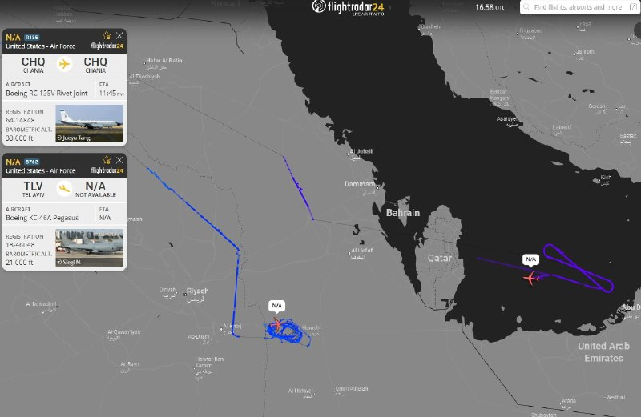

✈️📡 هواپیمای RC-135V Rivet Joint (شماره 64-14848) در حال انجام مأموریت بر فراز خلیج فارس است و در حال جمع‌آوری اطلاعات اطلاعاتی درباره ایران می‌باشد. 📝این هواپیما به‌تنهایی می‌تواند هشدار ورود به مرحله پیش از درگیری باشد؛ وقتی پروازهای روزانه و مستمر آواکس…

## pm_afshaa — post 90755

  

تخفیف ویژه فقط گیگی 170 با تست رایگان ✅
اول تست کن، بعد با خیال راحت خرید کن!

❌ دیگه چرا گیگی ۵۰۰ تا ۶۰۰ بدی؟!
اونم بدون اینکه بدونی کیفیتش چطوره 😐

⚡️ تخفیف ویژه محدود ⏳
فقط تا پایان امشب

🌍 آی‌پی استار واقعی + پینگ عالی
🛡 ضمانت بازگشت وجه بدون شرط
🚀 اتصال پایدار و بدون قطعی

خرید آنی از ربات :

Id : @LexVipBot
تایم سرورامون نامحدوده❤️

Link chanel : @lex_server

رایگان گذاشته میشه هرشب تو‌چنل بالا از دست ندید👌

## pm_afshaa — post 90754

🔴کارشناس کانال 14 اسرائیل: رژیم ایران به شدت به پول نیاز داره و در حال انجام تماس‌های مخفی و مستقیم با دولت ترامپه

💧 Rainbet.com the #1 Non-KYC Crypto Casino & Sportsbook @rainbetcom

😁 @Pm_Afshaa

## pm_afshaa — post 90753

  <a href="telegram/content/pm_afshaa_90753_1778785342.jpg">🎬 Download video</a>

🔴اوباما درباره برنامه هسته‌ای ایران:
ما بدون شلیک یک گلوله آن را متوقف کردیم. 97 درصد اورانیوم آنها رو خارج کردیم. هیچ بحثی وجود نداره که آن توافق رو کار کرد و لازم نبود ما عده زیادی آدم بکشیم یا تنگه هرمز رو ببندیم.

💧 Rainbet.com the #1 Non-KYC Crypto Casino & Sportsbook @rainbetcom

😁 @Pm_Afshaa

## pm_afshaa — post 90752

  <a href="telegram/content/pm_afshaa_90752_1778785343.jpg">🎬 Download video</a>

🔴پیت هگست:

علیرغم آنچه ممکن است در رسانه ها بشنوید، آمریکا در حال افول نیست. ما همچنان قوی‌ترین قدرت نظامی روی زمین هستیم، اما این قدرت مستلزم تجدید است.

با تهدیدهای جهانی که دائماً در حال تغییر هستند، زمان آن فرا رسیده است که یک سرمایه گذاری 1.5 تریلیون دلاری انجام دهید، یک پیش پرداخت نسلی.

این سرمایه‌گذاری تضمین می‌کند که ایالات متحده قدرت و قدرت بازدارندگی بی‌نظیری در برابر هر دشمنی را برای نسل‌های آینده حفظ کند.

💧 Rainbet.com the #1 Non-KYC Crypto Casino & Sportsbook @rainbetcom

😁 @Pm_Afshaa

## pm_afshaa — post 90751

  <a href="telegram/content/pm_afshaa_90751_1778785343.jpg">🎬 Download video</a>

🔴کانال 12 به نقل از یک منبع:
اسرائیل وضعیت آماده باش خود را به منظور آمادگی برای احتمال تجدید جنگ ایران پس از بازگشت ترامپ از چین به اوج رسوند.

ارتش اسرائیل در تدارک تهاجمی و تدافعی برای احتمال از سرگیری فوری جنگ ایرانه.

💧 Rainbet.com the #1 Non-KYC Crypto Casino & Sportsbook @rainbetcom

😁 @Pm_Afshaa

## kianmeli1 — post 87407

  

🔴 ترامپ می‌گوید شی جین‌پینگ، رئیس‌جمهور چین، به او گفته است که چین تجهیزات نظامی به ایران ارائه نخواهد داد و از توافق صلح حمایت کرده است.

ترامپ همچنین می‌گوید که رئیس‌جمهور شی پیشنهاد میانجیگری برای کاهش تنش‌ها به منظور بازگشایی تنگه هرمز را داده است.
https://t.me/kianmeli1

## kianmeli1 — post 87406

  

🔴عربستان سعودی می‌خواهد با ایران پیمان عدم تجاوز امضا کند.

این در حالی است که ایران در طول جنگ به خاک عربستان سعودی حمله کرده است.
https://t.me/kianmeli1

## kianmeli1 — post 87405

  

🔴به گزارش رویترز، عربستان سعودی به رئیس جمهور ترامپ گفته است که جنگ با ایران باید پایان یابد و تنگه هرمز باید باز بماند و در صورت ادامه بحران، نسبت به «زیان‌های اقتصادی غیرقابل اندازه‌گیری» هشدار داده است.
https://t.me/kianmeli1

## kianmeli1 — post 87404

  

🔴دریاسالار برد کوپر، رئیس فرماندهی مرکزی ایالات متحده، گزارش‌های خبری مبنی بر اینکه ایران ۷۰ تا ۷۵ درصد از موشک‌ها و پرتابگرهای قبل از جنگ خود را حفظ کرده است، «غیردقیق» خواند و آنها را رد کرد.
https://t.me/kianmeli1

## kianmeli1 — post 87403

  

🔴ایران از همه کشورهای عضو بریکس می‌خواهد که جنگ آمریکا و اسرائیل علیه خود را محکوم کنند.
https://t.me/kianmeli1

## kianmeli1 — post 87402

  

🔴به گزارش خبرگزاری AXIOS، مقامات اسرائیلی می‌گویند که در طول این آخر هفته، اسرائیل در بالاترین سطح آمادگی قرار خواهد گرفت، زیرا این کشور منتظر تصمیم رئیس جمهور ترامپ در مورد از سرگیری جنگ علیه ایران است.
https://t.me/kianmeli1

## IranIntlTV — post 337210

  <a href="telegram/content/IranIntlTV_337210_1778785348.mp4">🎬 Download video</a>

۲۴ با فرداد فرحزاد
@iranintltv

## IranIntlTV — post 337209

  

محمدعلی جعفری، فرمانده قرارگاه «بقیه‌الله» سپاه پاسداران، در ویدیویی که بخش‌هایی از آن را خبرگزاری تسنیم منتشر کرده، گفت: «جمهوری اسلامی بدون اقدامات اعتمادساز از سوی آمریکا وارد مذاکرات نمی‌شود و آغاز دوباره جنگ قطعا به ضرر آمریکاست».

جعفری افزود: «دونالد ترامپ از متن‌های ارسالی تیم مذاکره‌کننده جمهوری اسلامی خوشش نمی‌آید، اما راه بهتری جز پذیرش شروط تهران ندارد».

او گفت جمهوری اسلامی در «گام اول» با آمریکا مذاکره نمی‌کند و از طریق پاکستان در حال تبادل پیام بر اساس شروط خود است.

فرمانده قرارگاه «بقیه‌الله» سپاه پاسداران، گفت جمهوری اسلامی ابتدا اقدامات اعتمادساز خود را اعلام می‌کند و از «دشمن» تعهد می‌گیرد و تنها در صورت دریافت تعهد، وارد مذاکره می‌شود.
https://iranintl.com/202605145338

## IranIntlTV — post 337208

  <a href="https://t.me/IranintlTV/337208">📎 Download file</a>

🎧نسخه صوتی اخبار شبانگاهی | پنجشنبه ۲۴ اردیبهشت
@iranintlTV

## IranIntlTV — post 337207

  

روزنامه فایننشال‌تایمز به‌نقل از دیپلمات‌ها و منابع آگاه گزارش داد که عربستان سعودی درباره ایده یک پیمان عدم‌تجاوز میان کشورهای خاورمیانه و جمهوری اسلامی گفت‌وگو کرده است.

به‌نوشته این روزنامه، کشورهای خلیج فارس به‌ویژه از زمان آغاز جنگ آمریکا و اسرائیل علیه ایران نگران بوده‌اند که پس از پایان درگیری و کاهش حضور نظامی گسترده آمریکا در منطقه، با یک حکومت اسلامی زخمی اما تندروتر در همسایگی خود باقی بمانند.

فایننشال‌تایمز پنج‌شنبه ۲۴ اردیبهشت نوشت عربستان سعودی ایده یک پیمان عدم‌تجاوز میان کشورهای خاورمیانه و ایران را در چارچوب رایزنی‌ها با متحدان درباره نحوه مدیریت تنش‌های منطقه‌ای پس از پایان جنگ آمریکا و اسرائیل با جمهوری اسلامی مطرح کرده است.

دو دیپلمات غربی به این روزنامه گفتند ریاض در حال بررسی فرآیند هلسینکی دهه ۱۹۷۰ به‌عنوان یک الگوی احتمالی است؛ فرآیندی که در دوران جنگ سرد به کاهش تنش‌ها در اروپا کمک کرد.

ادامه این گزارش را در وبسایت ایران‌اینترنشنال بخوانید
https://iranintl.com/202605143675

## IranIntlTV — post 337206

  

اف‌بی‌آی اعلام کرد برای ارائه اطلاعات درباره مونیکا ویت، مامور سابق ضدجاسوسی آمریکا که در سال ۲۰۱۳ به ایران پناهنده شده، ۲۰۰ هزار دلار جایزه تعیین کرده است.

به گفته اف‌بی‌آی، او اطلاعات مرتبط با دفاع ملی ایالات متحده را در اختیار جمهوری اسلامی قرار داده است.

ویت، افسر پیشین اطلاعاتی نیروی هوایی آمریکا و مامور ویژه دفتر تحقیقات ویژه نیروی هوایی، بین سال‌های ۱۹۹۷ تا ۲۰۰۸ در ارتش آمریکا خدمت کرد و سپس تا سال ۲۰۱۰ به‌عنوان پیمانکار دولت آمریکا فعالیت داشت.

سوابق نظامی و فعالیت قراردادی او موجب شده بود به اطلاعات محرمانه و فوق‌محرمانه در حوزه اطلاعات خارجی و ضدجاسوسی، از جمله هویت واقعی نیروهای مخفی آمریکا، دسترسی داشته باشد.
https://iranintl.com/202605148135

## IranIntlTV — post 337204

  <a href="telegram/content/IranIntlTV_337204_1778785351.mp4">🎬 Download video</a>

برد کوپر، فرمانده سنتکام، برای پاسخ به سوالات نمایندگان در جلسه کمیته نیروهای مسلح سنای آمریکا حاضر شد.

او گفت توانایی جمهوری اسلامی برای تهدید همسایگان و منافع آمریکا در منطقه به‌طور چشمگیری کاهش یافته است.

گزارش مرضیه حسینی، خبرنگار ایران‌اینترنشنال
@iranintltv

## IranIntlTV — post 337203

  

وال‌استریت ژورنال به نقل از چند مقام آمریکایی و چند مقام کشورهای خلیج فارس گزارش داد عربستان سعودی پس از آن‌که تهران تاسیسات انرژی و زیرساخت‌های غیرنظامی این کشور را هدف قرار داد، به‌طور محرمانه حملاتی علیه جمهوری اسلامی انجام داده است.
به گفته یکی از این مقام‌ها، نیروی هوایی عربستان سعودی چندین حمله علیه اهدافی از جمله سایت‌های پرتاب پهپاد و موشک جمهوری اسلامی انجام داده است.
همچنین برخی منابع گفتند جنگنده‌های عربستان سعودی اهدافی در عراق مرتبط با شبه‌نظامیان مورد حمایت جمهوری اسلامی را نیز هدف قرار داده‌اند.
https://iranintl.com/202605147123

## IranIntlTV — post 337202

  

🔻پس از گذشت بیش از ۷۰ روز از آغاز جنگ آمریکا و اسرائیل با جمهوری اسلامی و تعطیلی ۷۵ روزه فوتبال باشگاهی در ایران، بازی‌های هفته بیست‌وچهارم لیگ دسته اول با برگزاری هشت دیدار از سر گرفته شد و تیم مس شهربابک توانست با نتیجه ۱ بر صفر مس کرمان را شکست دهد و صدرنشین باقی بماند.

🔹آخرین دیدار باشگاهی فوتبال ایران جمعه ۸ اسفند و یک روز پیش از آغاز جنگ برگزار شد و چهار دیدار از هفته بیست و سوم لیگ برتر انجام شد.

🔹در دیگر بازی‌های هفته بیست‌وچهارم، دیدارهای پارس جنوبی و هوادار، صنعت نفت آبادان و آریو اسلامشهر، شهرداری نوشهر و فرد البرز و همچنین سایپا و مس سونگون با تساوی بدون گل به پایان رسید.

🔹نود ارومیه نیز با نتیجه ۱ بر صفر شناورسازی قشم را شکست داد و دیدار نیروی زمینی و داماش گیلان به دلیل حاضر نشدن تیم گیلانی، ۳ بر صفر به سود نیروی زمینی اعلام شد.

🔹نساجی مازندران، دیگر تیم مدعی صعود به لیگ برتر، جمعه ۲۵ اردیبهشت به مصاف بعثت کرمانشاه می‌رود.

🔹پیش از این، محمدمهدی فروردین، رییس کمیسیون ورزش مجلس بخاطر شرایط امنیتی و اقتصادی خواستار لغو تمام لیگ‌های فوتبال ایران شده بود.

@iranintltvsport

## IranIntlTV — post 337200

روایت شما از زندگی در آتش‌بس- پنجشنبه ۲۵ اردیبهشت ۱۴۰۵

🔹از گرگان: چند ماهه اعلام کردن حقوق ارتش و بازنشسته‌ها رو تا ۵۰ درصد بیشتر می‌کنن. زیاد نکردن که هیچ، چند روز هم دیرتر واریز کردن. امیدتون به نابودی اینا باشه. جاوید شاه.
🔹در کاشان به بچه‌های حدود ۱۰ ساله آموزش کار با کلاش می‌دن. واقعا این تو همه جای دنیا قفله.
🔹پرچم‌چرخانی و اشغال خیابون‌ها توسط جیره‌خوارهای جمهوری اسلامی مساوی با مصرف سوخت و پول ملت بیچاره‌ست.
🔹معاون اول پزشکیان گفته از بازگشت نخبه‌ها استقبال می‌کنیم. آخه مردک! می‌خواید برگردن که به جرم جاسوسی اعدام‌شون کنید؟
🔹از الوند قزوین: تو هیچ داروخانه‌ای قرص‌های اعصاب مثل سرترالین و غیره پیدا نمی‌شه. خیلی از این قرص‌ها عوارض ترک دارن. چه کسی جوابگوست؟
🔹از چهارمحال: گرونی بیداد کرده. یک کیلو بذر لوبیا سبز شده دو میلیون تومان.
🔹شعار فیفا جدایی فوتبال از سیاسته و به همین دلیل داره برای ویزای تیم رژیم تلاش می‌کنه. یکی بهش بگه به خاطر خوشحالی شکست تیم جمهوری اسلامی در جام ۲۰۲۲، جوان‌های زیادی کشته و مجروح شدن.
🔹ایدئولوژی و فلسفه جمهوری اسلامی ضدبشری و ضدانسانیته. انسان‌های داخل ایران برده‌شونن و خارج از ایران دشمن‌شون.
🔹اسنپ گرفتم، زانتیا بود. ایست بازرسی نگهش داشتن. وقتی راننده گفت اسنپم، با کمال تعجب گفتن کی آخه با زانتیا میره اسنپ! راننده هم گفت چیکار کنم، بی‌پولیه. ببینید چیکار کردن با مردم.
🔹۷۰ روزه نت‌ها قطعه. کسانی که آنلاین‌شاپ داشتن از کار بیکار شدن. خیلی‌ها مثل معلم زبان خودم می‌گفت قبل جنگ ۱۸ شاگرد داشتم و بعد جنگ ۳ شاگرد. قیمت دلار ۱۸۰٬۰۰۰ تومانه.
🔹اسکله شهید رجایی بندرعباس که معروف بود به دروازه طلایی، ترمینال‌های مادر سینا و بتا که جرثقیل‌های گانتری‌کرین مستقر هستن، واردات و صادرات اصلی کشور کلا تعطیل شده. اگر ادامه‌دار باشه به‌زودی قحطی کل کشور رو فرا می‌گیره.
🔹خوزستان شرکت‌های بهره‌برداری فلرهای نفتی رو با بیشترین حد فعال کردن و مشغول سوزاندن و هدر دادن سوخت هستن. چرا؟ چون توان و تجهیزات برای تسویه و استفاده بهینه از سوخت استخراج‌شده رو ندارن. دقت کنید شهرهای خوزستان در صدر پرخطر بودن آلودگی هوا هستن.
🔹اگه می‌گن قطعی اینترنت به‌خاطر مسائل امنیتیه، پس فروش انبوه اینترنت پرو چیه؟ اینترنت پرو امنیت رو به خطر نمی‌ندازه؟ و کسانی که رفتن پرو گرفتن، خائن هستن.
🔹محدودیت‌های زیادی روی برنامه شاد هست. برای ارسال تکالیف هم باید تایم زیادی بذاریم. احساس ناامنی افکار دانش‌آموزها رو به هم ریخته. آموزش‌وپرورش واقعا بی‌برنامه‌ست.
🔹من یک تولیدکننده محتوا تو اینستاگرام و یوتیوب بودم. بعد از قطعی اینترنت زندگیم نابود شده. همه‌چیز خیلی گرونه. کاری هم که خودمون با جون‌کندن راه انداختیم ازمون گرفتن.

## IranIntlTV — post 337199

  

نخست‌وزیر جدید عراق، علی الزیدی، پنجشنبه تنها با بخشی از اعضای کابینه خود سوگند یاد کرد، زیرا قانون‌گذاران نتوانستند بر سر پست‌های کلیدی از جمله وزارت کشور و وزارت دفاع به توافق برسند.

خبرگزاری رویترز گزارش داد که باسم محمد به‌عنوان وزیر جدید نفت کشور منصوب شد و فؤاد حسین نیز در دولت جدید در سمت وزیر خارجه ابقا شد.

پارلمان عراق در مجموع به ۱۴ وزیر پیشنهادی رای اعتماد داد.
https://iranintl.com/202605145356

## ManotoTV — post 105462

  <a href="telegram/content/ManotoTV_105462_1778785354.mp4">🎬 Download video</a>

روزنامه فایننشال‌تایمز گزارش داده عربستان سعودی در حال بررسی طرحی برای ایجاد یک توافق امنیتی «عدم تجاوز» میان جمهوری‌اسلامی و کشورهای خاورمیانه است؛ توافقی که قرار است پس از پایان قطعی جنگ آمریکا و اسرائیل با ایران مطرح شود.
بر اساس این گزارش، این پیمان الگویی مشابه توافق هلسینکی در سال ۱۹۷۵ خواهد داشت؛ توافقی که میان آمریکا، کشورهای اروپایی و اتحاد جماهیر شوروی سابق امضا شده بود.
یک دیپلمات عرب به فایننشال‌تایمز گفته موفقیت چنین توافقی به کشورهایی بستگی دارد که در آن حضور خواهند داشت.
او گفته است: «اگر اسرائیل در این توافق حضور نداشته باشد، ممکن است نتیجه معکوس بدهد، چون بعد از ایران، اسرائیل از نگاه بسیاری عامل اصلی تنش در منطقه محسوب می‌شود. اما ایران از منطقه حذف نمی‌شود و به همین دلیل عربستان چنین طرحی را دنبال می‌کند.»
این گزارش همچنین به نقل از دو دیپلمات دیگر نوشته امارات متحده عربی ممکن است تمایلی به پیوستن به چنین توافقی نداشته باشد؛ کشوری که پس از امضای توافق ابراهیم در سال ۲۰۲۰، روابط نزدیکی با اسرائیل برقرار کرده است.

## ManotoTV — post 105461

  <a href="telegram/content/ManotoTV_105461_1778785355.mp4">🎬 Download video</a>

تدابیر امنیتی ویژه در سفر ترامپ به چین؛ استفاده از گوشی‌های موقتی برای جلوگیری از جاسوسی سایبری
رسانه‌های آمریکایی گزارش داده‌اند اعضای هیئت همراه دونالد ترامپ در سفر به پکن، برای جلوگیری از خطرات جاسوسی سایبری، از تلفن‌های موقتی و لپ‌تاپ‌های ویژه با دسترسی محدود استفاده می‌کنند.
بر اساس این گزارش‌ها، مقام‌های آمریکایی، دستیاران ترامپ و برخی مدیران شرکت‌های بزرگ فناوری از جمله ایلان ماسک و تیم کوک، دستگاه‌های شخصی خود را به چین نبرده‌اند و به‌جای آن از تجهیزات موسوم به «Burner Phone» و «Clean Device» استفاده می‌کنند.
گفته می‌شود نگرانی اصلی، احتمال شنود یا هک اطلاعات از طریق شبکه‌های اینترنتی، وای‌فای هتل‌ها، شارژرها و زیرساخت‌های ارتباطی در چین است.
این اقدام بخشی از پروتکل‌های امنیتی آمریکا برای سفرهای رسمی به چین به شمار می‌رود، اما رسانه‌ها می‌گویند این بار تدابیر امنیتی با حساسیت بیشتری اجرا شده است. مقام‌های آمریکایی در چنین سفرهایی فرض را بر این می‌گذارند که «هیچ چیز در چین امن نیست.»

## ManotoTV — post 105460

  <a href="telegram/content/ManotoTV_105460_1778785355.mp4">🎬 Download video</a>

عبدالحلیم خان، امام جماعت ۵۴ ساله ساکن شرق لندن، به‌دلیل تجاوز و آزار جنسی چندین زن و دختر، از جمله کودکان زیر ۱۳ سال، به حبس ابد محکوم شد.

پلیس متروپولیتن اعلام کرد او بین سال‌های ۲۰۰۴ تا ۲۰۱۵ از موقعیت مذهبی خود سوءاستفاده کرده و زنان و دخترانی حتی ۱۲ ساله را هدف قرار داده است.

خان در ماه فوریه در دادگاه «اسنرز‌بروک» به ۹ فقره تجاوز، چهار مورد آزار جنسی، دو مورد آزار جنسی کودک زیر ۱۳ سال، پنج مورد تجاوز به کودک زیر ۱۳ سال و یک مورد تعرض جنسی محکوم شد.

قاضی پرونده گفت او «پشت ظاهر تقدس و دینداری، به شکلی هیولاوار از زنانی که به او اعتماد داشتند سوءاستفاده کرده است.»

بر اساس اعلام دادستانی بریتانیا، خان به قربانیان می‌گفت توسط «جن» یا نیروهای ماورایی تسخیر شده و از این ادعا برای سوءاستفاده جنسی استفاده می‌کرد.

دادستان‌ها همچنین گفتند قربانیان از ترس «جادوی سیاه» و تهدیدهای او، سال‌ها موضوع را پنهان نگه داشته بودند.

یکی از قربانیان در بیانیه‌ای خطاب به دادگاه گفت: «برای من، خان انسان نیست؛ تجسم شر است.»

پلیس لندن اعلام کرد پرونده زمانی آغاز شد که کوچک‌ترین قربانی در سال ۲۰۱۸ موضوع را به معلم مدرسه‌اش گزارش داد.

## ManotoTV — post 105459

  <a href="telegram/content/ManotoTV_105459_1778785356.mp4">🎬 Download video</a>

فرمانده سنتکام اعلام کرد توان جمهوری‌اسلامی برای تهدید همسایگان و منافع آمریکا در منطقه به‌طور چشمگیری تضعیف شده است.
دریادار برد کوپر، فرمانده سنتکام، در جلسه‌ای در سنای آمریکا گفت: «تهدید ایران به‌طور قابل‌توجهی کاهش یافته و دیگر مانند گذشته قادر به تهدید شرکای منطقه‌ای یا آمریکا در همه حوزه‌ها نیست.»
او افزود نیروهای نیابتی جمهوری‌اسلامی در ۳۰ ماه پیش از جنگ اخیر بیش از ۳۵۰ حمله علیه نیروها و دیپلمات‌های آمریکایی انجام داده بودند؛ حملاتی که به گفته او به کشته شدن چهار سرباز آمریکایی منجر شد.
کوپر همچنین مدعی شد گروه‌هایی مانند حماس، حزب‌الله و حوثی‌ها اکنون از حمایت تسلیحاتی و لجستیکی جمهوری‌اسلامی جدا شده‌اند.
این فرمانده آمریکایی گفت ارتش آمریکا دیگر برای مقابله با پهپادهای جمهوری‌اسلامی از مهمات گران‌قیمت و پیشرفته استفاده نمی‌کند و به‌جای آن سراغ گزینه‌های ارزان‌تر رفته است.
به گفته او، جمهوری‌اسلامی تنها حدود ۱۰ درصد از پهپادهای خود را در اختیار دارد. با وجود آتش‌بس شکننده یک‌ماهه، درگیری‌های پراکنده میان نیروهای ایرانی و آمریکایی همچنان ادامه دارد.

## FarsiVOA — post 217763

پرزیدنت ترامپ: شی جین‌پینگ متعهد شده که به جمهوری اسلامی تجهیزات نظامی نفرستد

## FarsiVOA — post 217762

  <a href="telegram/content/FarsiVOA_217762_1778785357.mp4">🎬 Download video</a>

داریوش سجادی در برنامه تفسیر خبر می‌گوید که فرصتی برای وساطت چین بین جمهوری اسلامی و آمریکا وجود ندارد

## FarsiVOA — post 217761

گزارش فریبا مودت درباره جزئیات روز نخست دیدار پرزیدنت ترامپ با رئیس جمهوری چین

## FarsiVOA — post 217760

شکریا برادوست در برنامه تفسیر خبر: تمرکز بر ملی‌گرایی در چین افزایش یافته است

## FarsiVOA — post 217759

🔺پرزیدنت ترامپ: رئیس جمهوری چین گفته که به رژیم ایران تجهیزات نظامی نخواهد داد

◾️پرزیدنت ترامپ می‌گوید که شی جین‌پینگ، رئیس‌ جمهوری چین، متعهد شده است پس از مذاکرات سطح بالای دو رهبر، ارسال تجهیزات نظامی برای رژیم ایران را متوقف کند.

⬇️ بیشتر بخوانید:

https://ir.voanews.com/a/iran-us-trump-china-chi-weapon-hannity-/8150025.html?withmediaplayer=1

## FarsiVOA — post 217758

🔺علی فالح الزیدی نخست‌وزیر جدید عراق شد

▪️پارلمان عراق روز پنجشنبه ۲۴ اردیبهشت، به دولت جدید این کشور به ریاست علی فالح الزیدی و ۱۴ وزیر کابینه او رای اعتماد داد.

⬇️ بیشتر بخوانید:

https://ir.voanews.com/a/iraq-new-prime-minister-ali-alfateh-alzeidi-iran/8150045.html/?nocach=1

## FarsiVOA — post 217757

🔺تعیین پاداش ۱۵ میلیون دلاری برای اطلاعات درباره شبکه‌‌های مالی سپاه پاسداران

◾️وزارت امور خارجه ایالات متحده آمریکا روز پنجشنبه ۲۴ اردیبهشت، با انتشار بیانیه‌ای اعلام کرد که در چارچوب برنامه «پاداش برای عدالت» این وزارتخانه «۱۵ میلیون دلار پاداش برای اطلاعات درباره شبکه‌‌های مالی سپاه پاسداران در نظر گرفته شده است.»

⬇️ بیشتر بخوانید:

https://ir.voanews.com/a/million-bounty-iran-irgc-award/8150041.html?withmediaplayer=1

## FarsiVOA — post 217756

🔺فرمانده سنتکام: عملیات «خشم حماسی» ۹۰ درصد توانایی نظامی رژیم ایران را از بین برد

▪️کمیته نیروهای مسلح سنا روز پنجشنبه ۲۴ اردیبهشت یک جلسه استماع را با حضور دریابد برد کوپر، رئیس فرماندهی مرکزی آمریکا (سنتکام)، و ژنرال داگوین اندرسون، رئیس فرماندهی آفریقای ایالات متحده آمریکا (آفریکام) برگزار کرد. یکی از محورهای اصلی این جلسه موضوع اقدام نظامی ایالات متحده علیه جمهوری اسلامی و موضوعات مرتبط با آن بود. صدای آمریکا مشروح این جلسه را با ترجمه همزمان پخش کرد.

⬇️ بیشتر بخوانید:

https://ir.voanews.com/a/adm-brad-cooper-senate-hearing-iran-epic-fury/8149979.html?withmediaplayer=1%2F%3Fnocach%3D1

## FarsiVOA — post 217755

کمیته نیروهای مسلح سنا روز پنجشنبه ۲۴ اردیبهشت یک جلسه استماع را با حضور دریابد برد کوپر، فرمانده سنتکام، و ژنرال داگوین اندرسون، فرمانده آفریکام، برگزار کرد. یکی از محورهای اصلی این جلسه اقدام نظامی آمریکا علیه رژیم ایران بود. صدای آمریکا این جلسه را با ترجمه همزمان پژواک کیومرثی پخش کرد.

## FarsiVOA — post 217754

تشکیل دولت الزیدی زیر هشدارهای آمریکا؛ پارلمان عراق امروز به بخشی از کابینه رأی می‌دهد

## FarsiVOA — post 217753

کمیته نیروهای مسلح سنا روز پنجشنبه ۲۴ اردیبهشت یک جلسه استماع را با حضور دریابد برد کوپر، فرمانده سنتکام، و ژنرال داگوین اندرسون، فرمانده آفریکام، برگزار کرد. یکی از محورهای اصلی این جلسه اقدام نظامی آمریکا علیه رژیم ایران بود. صدای آمریکا این جلسه را با ترجمه همزمان پژواک کیومرثی پخش کرد.

## FarsiVOA — post 217752

فرج سرکوهی در «میدان»: هیچ اقلیت اتنیکی نمی‌تواند به‌تنهایی حاکمیت موفقی در ایران داشته باشد. ما یا همه با هم آزاد می‌شویم، یا متأسفانه همه با هم باید فلاکت جمهوری اسلامی را تحمل کنیم

## FarsiVOA — post 217751

علی جوانمردی: سفر تاریخی پرزیدنت ترامپ بە چین، رونق اقتصادی و اجلاس مدیریت بحران

## FarsiVOA — post 217750

کمیته نیروهای مسلح سنا روز پنجشنبه ۲۴ اردیبهشت یک جلسه استماع را با حضور دریابد برد کوپر، فرمانده سنتکام، و ژنرال داگوین اندرسون، فرمانده آفریکام، برگزار کرد. یکی از محورهای اصلی این جلسه اقدام نظامی آمریکا علیه رژیم ایران بود. صدای آمریکا این جلسه را با ترجمه همزمان پژواک کیومرثی پخش کرد.

## FarsiVOA — post 217749

کمیته نیروهای مسلح سنا روز پنجشنبه ۲۴ اردیبهشت یک جلسه استماع را با حضور دریابد برد کوپر، فرمانده سنتکام، و ژنرال داگوین اندرسون، فرمانده آفریکام، برگزار کرد. یکی از محورهای اصلی این جلسه اقدام نظامی آمریکا علیه رژیم ایران بود. صدای آمریکا این جلسه را با ترجمه همزمان پژواک کیومرثی پخش کرد.

## FarsiVOA — post 217748

کمیته نیروهای مسلح سنا روز پنجشنبه ۲۴ اردیبهشت یک جلسه استماع را با حضور دریابد برد کوپر، فرمانده سنتکام، و ژنرال داگوین اندرسون، فرمانده آفریکام، برگزار کرد. یکی از محورهای اصلی این جلسه اقدام نظامی آمریکا علیه رژیم ایران بود. صدای آمریکا این جلسه را با ترجمه همزمان پژواک کیومرثی پخش کرد.

## FarsiVOA — post 217747

کمیته نیروهای مسلح سنا روز پنجشنبه ۲۴ اردیبهشت یک جلسه استماع را با حضور دریابد برد کوپر، فرمانده سنتکام، و ژنرال داگوین اندرسون، فرمانده آفریکام، برگزار کرد. یکی از محورهای اصلی این جلسه اقدام نظامی آمریکا علیه رژیم ایران بود. صدای آمریکا این جلسه را با ترجمه همزمان پژواک کیومرثی پخش کرد.

## FarsiVOA — post 217746

کمیته نیروهای مسلح سنا روز پنجشنبه ۲۴ اردیبهشت یک جلسه استماع را با حضور دریابد برد کوپر، فرمانده سنتکام، و ژنرال داگوین اندرسون، فرمانده آفریکام، برگزار کرد. یکی از محورهای اصلی این جلسه اقدام نظامی آمریکا علیه رژیم ایران بود. صدای آمریکا این جلسه را با ترجمه همزمان پژواک کیومرثی پخش کرد.

## FarsiVOA — post 217745

کمیته نیروهای مسلح سنا روز پنجشنبه ۲۴ اردیبهشت یک جلسه استماع را با حضور دریابد برد کوپر، فرمانده سنتکام، و ژنرال داگوین اندرسون، فرمانده آفریکام، برگزار کرد. از محورهای اصلی این جلسه اقدام نظامی آمریکا علیه رژیم ایران بود. صدای آمریکا این جلسه را با ترجمه همزمان پژواک کیومرثی پخش کرد.

## FarsiVOA — post 217744

کمیته نیروهای مسلح سنا روز پنجشنبه ۲۴ اردیبهشت یک جلسه استماع را با حضور دریابد برد کوپر، فرمانده سنتکام، و ژنرال داگوین اندرسون، فرمانده آفریکام، برگزار کرد. یکی از محورهای اصلی این جلسه اقدام نظامی آمریکا علیه رژیم ایران بود. صدای آمریکا این جلسه را با ترجمه همزمان پژواک کیومرثی پخش کرد.

## DW_Farsi — post 124711

🔶 جام ۱۹۵۴ • فرانس پوشکاش، گلزن اسطوره‌ای قرن بیستم
 
فرانس پوشکاش در فاصله‌ سال‌های ۱۹۵۰ تا ۱۹۵۴ کاپیتان تیم ملی فوتبال مجارستان بود، تیمی که با "نسل طلایی" بازیکنان مجار می‌خواست و می‌توانست قله‌ فوتبال جهان را فتح کند. این آرزو اما با "معجزه‌ی برن" در سال ۱۹۵۴، نقش بر آب شد.
 
مجارستان در آن سال در فینال جام جهانی در سوئیس در میان شگفتی همگان مغلوب آلمان شد و پوشکاش و یارانش در حسرت مقام قهرمانی ماندند.
 
پوشکاش در تاریخ دوم آوریل سال ۱۹۲۷ در "کیش‌پشت" واقع در نزدیکی بوداپست زاده شد. نام واقعی او "فرانس پورتسلد" بود. پدر پوشکاش نیز بازیکن و مربی فوتبال بود. پوشکاش که در بازی فوتبال استعداد شگرفی داشت، زیر نظر پدر و با تمرینات مداوم، در پانزده سالگی مستقیما به تیم بزرگسالان باشگاه شهر خود منتقل شد.
 
از آنجا که در تیم خود از همه جوان‌تر و کوچک‌تر بود، همبازی‌ها به او لقب "پوشکاش اوکسی" دادند که به معنای "برادر کوچک" بود. البته نام پوشکاش به واژه‌ی مجاری "پوشکا" به معنای تفنگ نیز شبیه بود که قدرت شلیک را تداعی می‌کرد.
@dw_farsi

## DW_Farsi — post 124710

  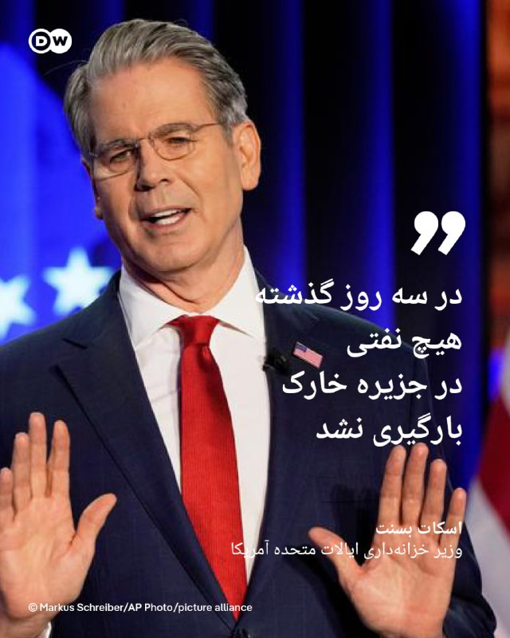

🔶 وزیر خزانه‌داری آمریکا: در سه روز گذشته هیچ نفتی در جزیره خارک بارگیری نشد
 
اسکات بسنت، وزیر خزانه‌داری ایالات متحده آمریکا روز پنج‌شنبه ۲۴ اردیبهشت (۱۴ مه) اعلام کرد تولید نفت ایران عملا متوقف شده است.
 
وزیر خزانه‌داری آمریکا در گفت‌وگو با شبکه سی‌ان‌بی‌سی (CNBC) گفت طی سه روز گذشته هیچ بارگیری نفتی در جزیره خارک، یکی از مراکز اصلی صادرات نفت ایران، انجام نشده است.
 
بسنت افزود: «ما معتقدیم مخازن ذخیره‌سازی آن‌ها پر شده است. هیچ کشتی خارج نمی‌شود و هیچ کشتی‌ هم وارد نمی‌شود، بنابراین آن‌ها دیگر قادر نیستند نفت را "روی آب" ذخیره کنند.»
 
ایالات متحده در واکنش به اقدام تهران در مسدود کردن تنگه هرمز، بنادر ایران را محاصره کرده است.
 
بسنت با اشاره به تصاویر ماهواره‌ای گفت که ایران "شروع به کاهش و تعطیلی بخشی از تولید نفت خود کرده است"؛ اقدامی که او آن را نتیجه مستقیم محاصره آمریکا دانست.
  
پس از جنگ آمریکا و اسرائیل علیه ایران این کشور با افزایش بی‌سابقه تورم روبه‌رو شده است. ارزش ریال به پایین‌ترین سطح تاریخی خود سقوط کرده است.
 
@dw_farsi

## DW_Farsi — post 124709

  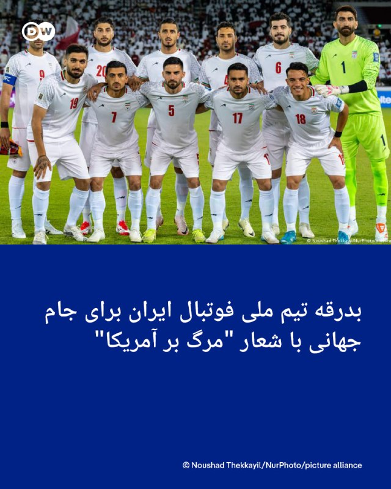

🔶 بدرقه تیم ملی فوتبال ایران برای جام جهانی با شعار "مرگ بر آمریکا"
 
مراسم بدرقه تیم ملی فوتبال ایران برای جام جهانی شامگاه چهارشنبه ۲۳ اردیبهشت (۱۳ مه) در میدان انقلاب تهران با "شعار مرگ بر آمریکا" برگزار شد.
 
این مسابقات از ۱۱ ژوئن تا ۱۹ ژوئیه در سه کشور آمریکا، کانادا و مکزیک برگزار می‌شود.
 
برخی بازیکنان حرفه‌ای و مطرح از جمله سردار آزمون در میان اعضای حاضر تیم ملی دیده نمی‌شوند. این موضوع انتقادهای زیادی را در داخل کشور برانگیخت. پیروز قربانی سرمربی فجر در برنامه لایو "ورزش سه" از سردار آزمون فوتبالیست مشهور حمایت کرد و گفت "سردار آزمون برای ایران ۵۰ گل زده و بارها پرچم ایران را بالا برده"است.
 
مراسم بدرقه در حالی‌ برگزار شده است که همچنان نگرانی‌ها درباره ورود تیم ملی فوتبال جمهوری اسلامی به ایالات متحده و شرکت در این رقابت‌ها همچنان ادامه دارد.
 
مهدی تاج، رئیس فدراسیون فوتبال ایران به دلیل ارتباط با سپاه پاسداران انقلاب اسلامی، اجازه ورود به کانادا برای شرکت در کنگره فیفا را دریافت نکرد.
 
در این تجمع پرچم حزب‌الله لبنان هم به احتزاز درآمد.
@dw_farsi

## Persian_Trend_Official — post 14160

  <a href="https://t.me/persian_trend_official/14160">📎 Download file</a>

فایل صوتی لایو اول
نسخه کم حجم - 8.26 مگابایت

اتاق جنگ پنجشنبه 24 اردیبهشت | توافق چین و آمریکا در مورد ایران

📝 Nick

📌 @persian_trend_official
پرشین ترند | متفاوت‌ترین کانال نظامی

## Persian_Trend_Official — post 14159

  

🇺🇸🇨🇳 لی جون، بنیان‌گذار و مدیرعامل شرکت شیائومی، در حال گرفتن عکس سلفی با ایلان ماسک، ثروتمندترین فرد جهان و تاریخ.

📝 Nick

📌 @persian_trend_official
پرشین ترند | متفاوت‌ترین کانال نظامی

## Persian_Trend_Official — post 14156

  <a href="telegram/content/Persian_Trend_Official_14156_1778785359.jpg">🎬 Download video</a>

🔴اسرائیل در حال توزیع تورهای ضد پهپاد به نیروهای خود در جنوب لبنان برای مقابله با پهپادهای FPV حزب‌الله است.

▪️تا کنون ۱۵۸٬۰۰۰ متر مربع نصب شده و ۱۸۸٬۰۰۰ متر مربع دیگر در سفارش است.

🫆:Tony

📌 @persian_trend_official
پرشین ترند | متفاوت‌ترین کانال نظامی

## Persian_Trend_Official — post 14155

https://youtube.com/live/SFBV2nP6Gs4?feature=share

## RadioFarda — post 157190

آغاز به کار دولت جدید عراق؛ پارلمان درباره ۹ وزیر کابینۀ علی الزیدی به توافق نرسید

🔸علی الزیدی، نخست‌وزیر جدید عراق، روز پنج‌شنبه ۲۴ اردیبهشت در حالی سوگند یاد کرد که کابینه او به‌صورت ناقص تشکیل شد و نمایندگان پارلمان نتوانستند در مورد برخی سمت‌های کلیدی، از جمله وزارتخانه‌های کشور و دفاع، به توافق برسند.

🔸به گفته نمایندگان پارلمان که با خبرگزاری رویترز گفت‌وگو کردند، باسم محمد به‌عنوان وزیر جدید نفت عراق منصوب شد و فؤاد حسین نیز در دولت جدید در سمت وزیر امور خارجه ابقا شد.

🔸پارلمان با ۱۴ وزیر کابینه جدید موافقت کرد، اما دربارهٔ چندین سمت باقی‌مانده، از جمله وزارتخانه‌های کشور و دفاع، به اجماع نرسید.

🔸نمایندگان گفتند جلسه پارلمان شاهد مشاجره‌های تندی بود، پس از آنکه برخی از نمایندگان به تأیید نامزد وزارت کشور اعتراض کردند.

🔸مقداد الخفاجی، نماینده پارلمان، به رویترز گفت: «پارلمان ۱۴ وزارتخانه را تأیید کرد، در حالی که تعیین تکلیف ۹ وزارتخانه دیگر به تعویق افتاده است. سه مورد از آنها امروز موفق به کسب رأی اعتماد پارلمان نشدند.»

🔸دونالد ترامپ، رئیس‌جمهور آمریکا، پیش‌تر در تماس تلفنی با الزیدی حمایت قاطع خود را از او اعلام کرد. این پس از آن بود که «چارچوب هماهنگی» شامل ائتلاف گروه‌های سیاسی شیعه عراق در ماه آوریل الزیدی را به‌عنوان نامزد نخست‌وزیری معرفی کرد و ۳۰ روز به او فرصت داد تا دولت تشکیل دهد.

🔸این ائتلاف قدرتمند شیعی پیشتر نوری‌المالکی نخست‌وزیر پیشین و نزدیک به حکومت ایران را نامزد پست نخست‌وزیری کرده بود؛ موضوعی که واکنش تند و تهدیدآمیز دونالد ترامپ را به‌دنبال داشت.

🔸 گزارش کامل را در وب‌سایت رادیوفردا بخوانید.

@RadioFarda

## IranianMinds — post 20146

  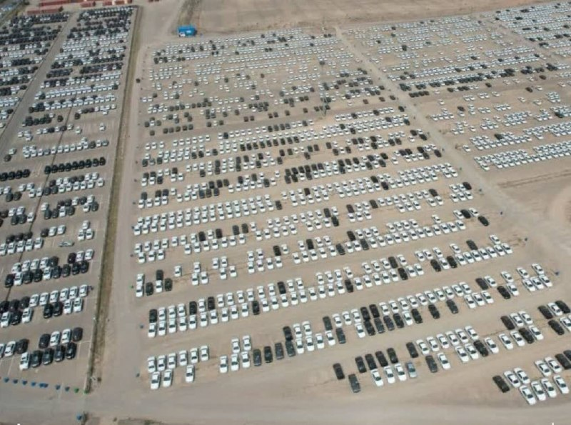

🔴 خبرگزاری ایسنا :

از الان دیگه باید با قیمت قطعی خودرو خداحافظی کنید؛

در طرح جدید ایران ‌خودرو و سایپا، خریداران باید نصف پول رو از اول بدن بدون اینکه حتی بفهمن قیمت نهایی زمان تحویل خودرو براشون چقدره !

@IranianMinds

## IranianMinds — post 20145

  <a href="telegram/content/IranianMinds_20145_1778785361.mp4">🎬 Download video</a>

🔴 کارشناس کانال ۱۴ اسرائیل:

رژیم ایران در حال انجام تماس‌هایی به صورت مخفی و مستقیم با دولت ترامپ هست و به شدت احتیاج به پول داره.

@IranianMinds

## IranianMinds — post 20144

  <a href="telegram/content/IranianMinds_20144_1778785362.mp4">🎬 Download video</a>

🔴 نتانیاهو:

ما اورشلیم را برای همیشه تحت حاکمیت اسرائیل حفظ خواهیم کرد.

@IranianMinds

## IranianMinds — post 20142

🔴 روبیو، وزیرخارجه آمریکا: ترامپ از رئیس جمهور چین کمکی نخواست و آمریکا به کمک چین نیازی نداره.

@IranianMinds

## IranianMinds — post 20141

  

:( موضوع امیدوار بودن یا نبودن نیست. وقتی که قدرت تصمیم‌گیری در دست دیگران است، وقتی که ما نمی‌توانیم در تصمیم‌گیری آنها دخالت کنیم، تنها کاری که می‌توان انجام داد، تحمل کردن است.

@IranianMinds

## BBCPersian — post 281046

‌🖊وایر دیویس، خبرنگار امور خاورمیانه
در,گزارش از عصاعصه، کرانه غربی

🔻محمد عصاعصه تازه پس از خاکسپاری حسین، پدر ۸۰ ساله‌اش، به خانه بازگشته بود که چند کودک دوان‌دوان وارد خانه شدند و فریاد زدند: «شهرک‌نشین‌ها دارند قبر را می‌کنند.»

در روستای کوچک عصاعصه، نزدیک جنین در کرانه غربی، روستایی که خانواده نام خود را از آن گرفته است، حسین پیش از مرگش به دلایل طبیعی، چهره‌ای شناخته‌شده و بسیار محترم بود.

طبق شعائر اسلامی، این مرد سالخورده، که پیش‌تر تاجر دام بود و ۱۰ فرزند داشت، در قبری ساده در گورستانی روی تپه‌ای کوچک، در سوی دیگر روستا و دور از خانه، به خاک سپرده شد.

محمد می‌گوید برای اطمینان از این‌ که مشکلی در روند خاکسپاری پیش نیاید، پیشاپیش از یک پایگاه نظامی اسرائیل در نزدیکی محل، برای برگزاری مراسم خاکسپاری اجازه گرفته بود.

اما کمتر از نیم ساعت بعد، محمد و برادرانش بار دیگر به ورودی گورستان بازگشتند و با صحنه‌ای هولناک روبه‌رو شدند.

متن کامل خبر در لینک زیر:
https://bbc.in/4tFB41J
📷BBC Images/ Getty Images/ AFP via Getty Images

@BBCPersian

## BBCPersian — post 281045

🔻سومین دور مذاکرات لبنان و اسرائیل در واشنگتن آغاز شد

🔻نمایندگان دولت‌های اسرائیل و لبنان سومین دور از مذاکرات خود را درواشنگتن آغاز کرده‌اند. این مذاکرات در حالی آغاز شده که آتش‌بس لبنان چند روز دیگر به پایان می‌رسد.

اسرائیل امروز هم در جنوب لبنان به حملات خود به چندین هدف که می‌گوید متعلق به حزب‌الله است، ادامه داد و چندین اسرائیلی هم با یک پهپاد انفجاری حزب‌الله مجروح شدند.

گروه حزب‌الله که تحت حمایت ایران است، در مذاکرات واشنگتن شرکت ندارد و آن را رد کرده است.

در حالی که دولت لبنان از اسرائیل خواسته است به حملات خود به خاک لبنان پایان دهد، اسرائیل خواهان خلع سلاح حزب‌الله است.

در دوره آتش‌بس، صدها نفر از مردم لبنان در حملات روزانه اسرائیل کشته شده‌اند و حزب‌الله هم به راکت‌پراکنی به داخل اسرائیل ادامه داده است.
https://bbc.in/3PHiUyz
@BBCPersian

## BBCPersian — post 281044

  <a href="https://t.me/bbcpersian/281044">📎 Download file</a>

🔻پادکست جام جهان‌نما پنجشنبه ۲۴ اردیبهشت ۱۴۰۵

🔻در این برنامه می‌شنوید:
دیدار دو ساعته ترامپ و شی در پکن... کاخ سفید می‌گوید آمریکا و چین بر سر باز شدن تنگه هرمز توافق دارند
همزمان در ایران گزارش‌ها از عبور بیشتر کشتی‌های چینی از تنگه هرمز حکایت دارد خبرگزاری فارس نوشته تهران به درخواست پکن این مجوز را صادر کرده نزدیکتر شدن آمریکا و چین، معادله جنگ را به نفع کدام‌ طرف تغییر می‌دهد؟
نشست وزیران خارجه بریکس در هند زیر سایه تنش میان اعضا... عراقچی در حاشیه این نشست، امارات را متهم کرد که مستقیم در اقدام تجاوزکارانه علیه ایران دست داشته
و... تکذیب سفر نتانیاهو به امارات در میانه جنگ ایران از سوی ابوظبی.... تهران با وجود این، هشدار داد دشمنی با ایران قماری احمقانه است

این برنامه رادیویی را می‌توانید هر شب ساعت ۲۰ به وقت ایران، روی موج متوسط ۷۰۲ کیلوهرتز و موج کوتاه ۹۴۶۵ کیلوهرتز بشنوید.
تکرار برنامه را هم می‌توانید ساعت ۲۱:۳۰ روی موج متوسط ۷۰۲ کیلوهرتز و موج کوتاه ۵۳۹۵ کیلوهرتز گوش کنید.
@BBCPersian

## BBCPersian — post 281043

🔻تدابیر تازه هند برای مقابله با اختلال در عرضه سوخت از خاورمیانه

🔻مقامات دهلی‌نو، پایتخت هند، اقداماتی را برای صرفه‌جویی در مصرف سوخت اعلام کرده‌اند.

این تدابیر در پی درخواست نارندرا مودی، نخست‌وزیر هند برای کاهش مصرف انرژی جهت مقابله با اختلال در عرضه سوخت از خاورمیانه در نظر گرفته شده است.

بر اساس این اقدامات که قرار است به مدت سه ماه اجرا شود، کارکنان ادارات دولتی دو روز در هفته «از خانه» کار خواهند کرد. سفرهای رسمی کاهش می‌یابد و استفاده از وسایل نقلیه شخصی هم کمتر خواهد شد.

همچنین در چارچوب این اقدامات، تمام رویدادهای عمومی و رسمی بزرگ لغو شده است و دولت هم خرید خودروهای جدید بنزینی، دیزلی و گاز طبیعی را به مدت شش ماه متوقف خواهد کرد.

نخست‌وزیر هند روز یکشنبه گفت که کشورش باید ارز کمتری را برای واردات سوخت هزینه کند.

https://bbc.in/4nraZ4K
@BBCPersian

## BBCPersian — post 281042

🔻دیدار عراقچی و لاوروف در حاشیه اجلاس وزرای خارجه بریکس

🔻وزارت خارجه روسیه اعلام کرد که سرگئی لاوروف، وزیر خارجه آن کشور، در حاشیه نشست وزرای خارجه کشورهای بریکس در دهلی نو، با همتای ایرانی خود عباس عراقچی دیدار و گفت‌وگو کرده است.

بنابر این گزارش، طرفین «به طور عمیق و محرمانه» درباره روند مذاکرات با هدف حل و فصل جنگ خاورمیانه تبادل نظر کردند.

وزارت خارجه روسیه می‌گوید که آقای لاوروف در این دیدار بر اهمیت حفظ آتش‌بس و صلح شکننده و همچنین جلوگیری از اختلال در تلاش‌های سیاسی و دیپلماتیک برای دستیابی به توافق جامع ایران و آمریکا تاکید کرد.

بر اساس این گزارش، سرگئی لاوروف در این دیدار بار دیگر آمادگی روسیه را برای ارائه تسهیلات به طرفین جهت یافتن و اجرای راه‌حل‌های قابل قبول دوجانبه اعلام کرد.

وزارت خارجه روسیه می‌گوید که دو طرف همچنین در مورد مسائل جاری همکاری‌های دوجانبه بحث و گفت‌وگو کرده و تعهد متقابل خود را برای تقویت مستمر مشارکت جامع راهبردی بین دو کشور، تایید کردند.

https://bbc.in/43cQEqw
@BBCPersian

## BBCPersian — post 281041

  

‌🔻‌روابط عمومی سپاه پاسداران اکنون با تایید گزارش‌های پیشین می‌گوید «با تصمیم جمهوری اسلامی، امکان عبور تعدادی از کشتی‌های چینی از تنگه هرمز با رعایت پروتکل مدیریت ایرانی تنگه میسر شد.»

بر اساس این بیانیه، پس از پیگیری‌های وزیر خارجه چین و سفیر این کشور در ایران، «در نهایت جمع‌بندی شد که تعدادی کشتی چینی مورد درخواست این کشور پس از تفاهم درباره پروتکل‌های مدیریت ایرانی تنگه از این منطقه عبور کنند که این عبور از شب گذشته آغاز شده است.»

بر اساس گزارش‌ها، ایران از شب گذشته به کشتی‌های چینی بیشتری اجازه عبور از تنگه هرمز را داده است.

خبرگزاری فارس به نقل از یک منبع آگاه گزارش داده است که این اقدام به دنبال درخواست‌های وزیر امور خارجه چین و سفیر پکن در ایران انجام شده است.

خبرگزاری فارس نوشته طی روزهای گذشته دست‌کم شش نفتکش و کشتی فله‌بر با مالکیت یا بهره‌برداری عملیاتی چین از تنگه هرمز عبور کرده‌اند.

بی‌بی‌سی وریفای هم تایید کرده که دستکم یک ابرنفتکش چین روز گذشته از تنگه هرمز عبور کرده است.

عکس استفاده شده آرشیوی است.

📷NurPhoto via Getty Images
https://bbc.in/4fl3qdR

@BBCPersian

## idfinfarsi — post 11580

  <a href="telegram/content/idfinfarsi_11580_1778785366.mp4">🎬 Download video</a>

🎬 Video

## idfinfarsi — post 11579

در طول ۲۴ ساعت گذشته: ارتش اسرائیل حدود ۶۵ زیرساخت را هدف قرار داد و بیش از ۲۰ تروریست از سازمان تروریستی حزب‌الله را در جنوب لبنان به هلاکت رساند

ارتش اسرائیل به اقدامات خود برای از بین بردن تهدیدها علیه شهروندان اسرائیل و نیروهای ارتش اسرائیل در جنوب لبنان ادامه می‌دهد.

در طول ۲۴ ساعت گذشته، ارتش اسرائیل از هوا و زمین بیش از ۶۵ زیرساخت متعلق به سازمان تروریستی حزب‌الله را در چندین منطقه در جنوب لبنان هدف قرار داد.

از جمله زیرساخت‌های هدف قرارگرفته می‌توان به انبارهای تسلیحات، مواضع دیده‌بانی، مقرهای فرماندهی و سایر زیرساخت‌هایی اشاره کرد که تروریست‌های این سازمان از آن‌ها برای پیشبرد طرح‌های تروریستی علیه نیروهای ارتش اسرائیل و کشور اسرائیل استفاده می‌کردند.

همچنین بیش از ۲۰ تروریست از این سازمان در سراسر جنوب لبنان به هلاکت رسیدند.

## Dirty_Kids — post 389467

  

آخرین ورژن خفت و خواری بچه‌شیعه:
رزمایش گذاشتن، هلی‌کوپتر نداشتن، بنرشو چاپ کردن گذاشتن اون وسط.

@Dirty_Kids 👻

## Dirty_Kids — post 389466

  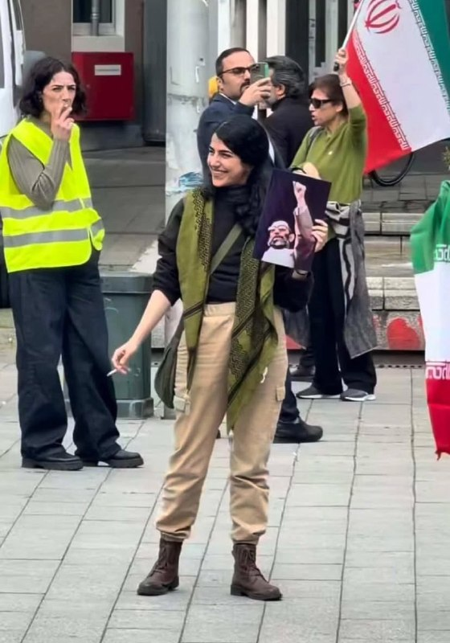

اصلی ترین سوالی که برای من پیش میاد که چرا تو همون ایران زیر کیر آخوند نمیخوابید ؟؟ چرا مهاجرت میکنید از راه دور برای آخوند دهنی میزنید ؟؟

این جک و جنده آزادی‌رو دوست دارن ولی اعتقاد دارن ملت ایران لیاقت ندارن فقط برای خودشون خوبه

@Dirty_Kids 👻

## Dirty_Kids — post 389465

  <a href="telegram/content/Dirty_Kids_389465_1778785368.mp4">🎬 Download video</a>

هنوز که هنوزه این ویدئو از درگیری چندتا ایرانی تو جاده ساحلیِ چالوس تو پیج‌های خارجی داره دست به دست میشه و تو اکسپلوره؛

@Dirty_Kids 👻

## Dirty_Kids — post 389464

  

خبرگزاری دانشجو : شما فقط نحوه دست دادن رئیس‌جمهور چین با پرفسور رئیسی و ترامپ رو مقایسه کنی، متوجه قدرت ایران میشید... +کسخلیت و کونده‌پروگری اینا حدی نداره :))))) چین فروختتشون توافق کرده با امریکا استقبال بی نظیر کردن از ترامپ بعد رئیسی گوزو ۶ کلاسه‌رو…

## Dirty_Kids — post 389463

  <a href="telegram/content/Dirty_Kids_389463_1778785370.mp4">🎬 Download video</a>

خبرگزاری دانشجو :
شما فقط نحوه دست دادن رئیس‌جمهور چین با پرفسور رئیسی و ترامپ رو مقایسه کنی، متوجه قدرت ایران میشید...

+کسخلیت و کونده‌پروگری اینا حدی نداره :)))))
چین فروختتشون توافق کرده با امریکا
استقبال بی نظیر کردن از ترامپ
بعد رئیسی گوزو ۶ کلاسه‌رو همه میریدن بهش از پوتین بگیر تا شی دارن مقایسه میکنن


@Dirty_Kids 👻

## Dirty_Kids — post 389462

  

رسایی؛ نماینده‌ی مجلس:

دولت قصد داره میزان سهمیه ماهانه بنزین ۱۵۰۰ تومنی و ۳۰۰۰ تومنی رو کاهش بده و قیمت بنزین ۵۰۰۰ تومنی رو هم به ۲۰۰۰۰ تومن برسونه.

@Dirty_Kids 👻

## Hranews — post 112946

گزارشی از تعدیل گسترده کارکنان شهربازی‌های کشور

❗️
❗️
❗️
❗️
❗️– رئیس انجمن شهربازی‌داران ایران اعلام کرد دستکم نیمی از نیروهای شاغل در این صنف، در پی افزایش هزینه‌ها و شرایط ماه‌های گذشته تعدیل شده‌اند.

ادامه مطلب

↘️
@hranews_bot تماس ✉️ - @Hranews کانال هرانا 🆑

## Hranews — post 112945

فقدان ایمنی کار؛ مصدومیت ۶ کارگر در آرادان و کاشان

❗️
❗️
❗️
❗️
❗️– در سایه فقدان ایمنی محیط و شرایط نامناسب کار، پنج #کارگر در آرادان بر اثر یک حادثه دچار مسمومیت شدند و یک کارگر در کاشان در پی وقوع حادثه‌ای، دچار مجروحیت و قطع عضو شد.

ادامه مطلب

↘️
@hranews_bot تماس ✉️ - @Hranews کانال هرانا 🆑

## configx2ray — post 38847

2.22.251.51 23.36.162.220 2.22.251.38 95.101.111.170 23.36.162.78 2.16.164.67 95.101.35.59 23.211.39.41 2.16.154.192 2.22.208.169 2.16.154.120 95.101.111.137 2.16.154.195 2.16.1.203 95.101.57.210 95.101.78.51 2.16.168.196 95.100.102.164 2.23.89.227…

## configx2ray — post 38846

2.22.251.51
23.36.162.220
2.22.251.38
95.101.111.170
23.36.162.78
2.16.164.67
95.101.35.59
23.211.39.41
2.16.154.192
2.22.208.169
2.16.154.120
95.101.111.137
2.16.154.195
2.16.1.203
95.101.57.210
95.101.78.51
2.16.168.196
95.100.102.164
2.23.89.227
23.12.156.6
2.16.238.5
23.216.134.106
2.21.134.71
2.21.134.73
2.16.154.147
2.22.248.182
23.205.47.167
2.17.251.186
2.17.100.129
2.16.154.113
184.24.77.58
23.192.25.125
95.101.137.212
184.24.77.170
23.11.40.157
184.24.77.80
2.18.190.83
2.16.168.209
95.101.137.19
2.22.245.88
95.101.29.37
2.16.238.25
23.219.79.86
95.101.111.185
2.18.190.150
2.16.168.116
2.23.7.25
2.16.106.34
2.20.169.205
23.14.119.41
95.101.61.199
2.17.137.157
2.17.251.181
95.101.111.152
2.16.241.19
2.21.134.77
23.219.79.96
23.46.188.232
95.101.27.107
2.17.100.139
23.210.170.249
95.100.146.27
95.101.137.31
2.16.154.136
2.16.168.118
95.101.111.175
2.16.106.142
23.15.179.153
2.16.238.23
2.19.248.224
2.16.165.210
23.11.206.88
2.19.248.208
95.101.238.171
95.101.35.88
184.26.3.238
23.201.242.44
2.23.7.8
2.16.106.28
2.16.164.10
2.16.168.13
23.202.156.85
2.21.134.84
95.101.29.67
23.35.208.5
2.16.238.18
2.16.106.227
95.101.29.56
23.219.79.101
2.17.100.145
23.58.222.104
95.101.111.150
23.15.179.137
2.17.100.226
23.204.132.194
2.16.164.50
2.16.168.113
23.205.47.184
23.58.222.96
95.100.146.26
2.16.168.106
95.100.232.73
2.22.145.24
184.24.167.96
23.38.31.63
95.101.137.93
23.36.162.73
184.30.156.119
95.100.146.90
95.100.146.82
2.22.245.224
95.101.27.66
23.58.223.211
23.52.181.166
23.50.55.19
23.45.106.167
23.206.71.179
23.202.156.203
95.100.178.131
95.101.75.113
23.214.208.61
2.22.145.20
23.205.176.190
23.204.132.239
2.17.100.138
95.101.23.74
2.17.147.8
2.16.164.64
23.204.132.237
95.101.22.225
2.18.69.150
23.11.206.49
95.101.234.80
95.101.137.40
2.16.164.105
95.100.146.35
95.101.35.106
23.220.158.121
95.101.111.131
95.101.29.159
23.63.146.88
95.101.137.37
2.22.145.29
23.14.118.50
2.16.106.17
95.100.133.93
23.56.202.239
2.16.238.28
95.101.29.53
95.101.35.67
95.101.22.203
2.23.227.200
23.32.112.173
95.101.35.83
23.62.15.27
95.100.176.221
23.216.134.162
23.203.61.225
2.19.252.153
2.16.183.198
23.192.237.196
2.19.248.163
23.197.161.85
23.202.156.221
2.18.190.11
2.16.168.115
95.100.237.52
23.220.72.94
2.16.241.13
2.16.106.35
2.16.168.220
2.22.31.90
23.196.110.205
2.16.245.154
2.22.251.53
95.101.111.182
2.19.252.140
95.101.29.48
23.204.132.249
23.12.156.141
95.101.29.42
2.16.106.24
95.101.29.151
23.211.97.107
23.35.104.145
95.101.181.80
2.16.168.211
2.17.147.210
2.17.147.17
23.55.163.156
2.16.168.111
23.11.206.98
95.101.27.102
95.100.110.7
23.12.158.44
2.18.64.7
2.18.190.79
23.204.132.200
2.17.147.99
2.18.190.69
2.21.33.40
23.55.163.10
95.101.137.97
2.16.168.100
95.101.23.211
95.101.22.216
95.100.110.5
95.101.137.29
95.101.137.30
95.101.137.27
95.101.137.24
2.16.245.137
2.18.190.77
2.17.147.83
95.101.111.130
95.101.35.64
2.16.164.72
2.16.106.11
23.15.179.146
2.16.238.154
23.216.134.150
2.23.210.25
2.19.248.217
95.101.29.38
2.19.248.33
95.101.29.34
2.17.147.89
2.19.248.207
184.30.158.72
2.16.221.84
2.18.190.31
23.209.210.105
23.202.156.205
23.203.61.216
2.22.251.23
23.58.223.187
95.101.123.82
95.101.29.44
2.23.89.83
2.18.190.24
2.20.168.7
2.18.190.88
2.18.190.181
2.18.69.19
95.101.137.18
2.19.252.155
2.16.168.108
2.18.68.167
95.101.29.33
23.11.206.58
2.22.248.186
2.18.190.26
95.101.35.112
2.19.248.206
2.18.190.78
95.100.110.16
23.36.77.26
23.11.206.96
2.16.238.11
2.18.64.216
23.204.132.211
95.101.137.28
2.23.89.78
2.18.190.20
95.101.137.26
2.16.238.147
2.18.190.177
2.18.190.76
2.19.248.147
2.16.154.193
2.23.167.226

لیست ایپی های تست شده برای متود جدید سایفون 
🌟

همشو باهم وارد کنید داخل برنامه 
❤️

Channel : https://t.me/ConfigX2ray

## manototv — post 105462

  <a href="telegram/content/manototv_105462_1778785372.mp4">🎬 Download video</a>

روزنامه فایننشال‌تایمز گزارش داده عربستان سعودی در حال بررسی طرحی برای ایجاد یک توافق امنیتی «عدم تجاوز» میان جمهوری‌اسلامی و کشورهای خاورمیانه است؛ توافقی که قرار است پس از پایان قطعی جنگ آمریکا و اسرائیل با ایران مطرح شود.
بر اساس این گزارش، این پیمان الگویی مشابه توافق هلسینکی در سال ۱۹۷۵ خواهد داشت؛ توافقی که میان آمریکا، کشورهای اروپایی و اتحاد جماهیر شوروی سابق امضا شده بود.
یک دیپلمات عرب به فایننشال‌تایمز گفته موفقیت چنین توافقی به کشورهایی بستگی دارد که در آن حضور خواهند داشت.
او گفته است: «اگر اسرائیل در این توافق حضور نداشته باشد، ممکن است نتیجه معکوس بدهد، چون بعد از ایران، اسرائیل از نگاه بسیاری عامل اصلی تنش در منطقه محسوب می‌شود. اما ایران از منطقه حذف نمی‌شود و به همین دلیل عربستان چنین طرحی را دنبال می‌کند.»
این گزارش همچنین به نقل از دو دیپلمات دیگر نوشته امارات متحده عربی ممکن است تمایلی به پیوستن به چنین توافقی نداشته باشد؛ کشوری که پس از امضای توافق ابراهیم در سال ۲۰۲۰، روابط نزدیکی با اسرائیل برقرار کرده است.

## manototv — post 105461

  <a href="telegram/content/manototv_105461_1778785372.mp4">🎬 Download video</a>

تدابیر امنیتی ویژه در سفر ترامپ به چین؛ استفاده از گوشی‌های موقتی برای جلوگیری از جاسوسی سایبری
رسانه‌های آمریکایی گزارش داده‌اند اعضای هیئت همراه دونالد ترامپ در سفر به پکن، برای جلوگیری از خطرات جاسوسی سایبری، از تلفن‌های موقتی و لپ‌تاپ‌های ویژه با دسترسی محدود استفاده می‌کنند.
بر اساس این گزارش‌ها، مقام‌های آمریکایی، دستیاران ترامپ و برخی مدیران شرکت‌های بزرگ فناوری از جمله ایلان ماسک و تیم کوک، دستگاه‌های شخصی خود را به چین نبرده‌اند و به‌جای آن از تجهیزات موسوم به «Burner Phone» و «Clean Device» استفاده می‌کنند.
گفته می‌شود نگرانی اصلی، احتمال شنود یا هک اطلاعات از طریق شبکه‌های اینترنتی، وای‌فای هتل‌ها، شارژرها و زیرساخت‌های ارتباطی در چین است.
این اقدام بخشی از پروتکل‌های امنیتی آمریکا برای سفرهای رسمی به چین به شمار می‌رود، اما رسانه‌ها می‌گویند این بار تدابیر امنیتی با حساسیت بیشتری اجرا شده است. مقام‌های آمریکایی در چنین سفرهایی فرض را بر این می‌گذارند که «هیچ چیز در چین امن نیست.»

## manototv — post 105460

  <a href="telegram/content/manototv_105460_1778785373.mp4">🎬 Download video</a>

عبدالحلیم خان، امام جماعت ۵۴ ساله ساکن شرق لندن، به‌دلیل تجاوز و آزار جنسی چندین زن و دختر، از جمله کودکان زیر ۱۳ سال، به حبس ابد محکوم شد.

پلیس متروپولیتن اعلام کرد او بین سال‌های ۲۰۰۴ تا ۲۰۱۵ از موقعیت مذهبی خود سوءاستفاده کرده و زنان و دخترانی حتی ۱۲ ساله را هدف قرار داده است.

خان در ماه فوریه در دادگاه «اسنرز‌بروک» به ۹ فقره تجاوز، چهار مورد آزار جنسی، دو مورد آزار جنسی کودک زیر ۱۳ سال، پنج مورد تجاوز به کودک زیر ۱۳ سال و یک مورد تعرض جنسی محکوم شد.

قاضی پرونده گفت او «پشت ظاهر تقدس و دینداری، به شکلی هیولاوار از زنانی که به او اعتماد داشتند سوءاستفاده کرده است.»

بر اساس اعلام دادستانی بریتانیا، خان به قربانیان می‌گفت توسط «جن» یا نیروهای ماورایی تسخیر شده و از این ادعا برای سوءاستفاده جنسی استفاده می‌کرد.

دادستان‌ها همچنین گفتند قربانیان از ترس «جادوی سیاه» و تهدیدهای او، سال‌ها موضوع را پنهان نگه داشته بودند.

یکی از قربانیان در بیانیه‌ای خطاب به دادگاه گفت: «برای من، خان انسان نیست؛ تجسم شر است.»

پلیس لندن اعلام کرد پرونده زمانی آغاز شد که کوچک‌ترین قربانی در سال ۲۰۱۸ موضوع را به معلم مدرسه‌اش گزارش داد.

## manototv — post 105459

  <a href="telegram/content/manototv_105459_1778785374.mp4">🎬 Download video</a>

فرمانده سنتکام اعلام کرد توان جمهوری‌اسلامی برای تهدید همسایگان و منافع آمریکا در منطقه به‌طور چشمگیری تضعیف شده است.
دریادار برد کوپر، فرمانده سنتکام، در جلسه‌ای در سنای آمریکا گفت: «تهدید ایران به‌طور قابل‌توجهی کاهش یافته و دیگر مانند گذشته قادر به تهدید شرکای منطقه‌ای یا آمریکا در همه حوزه‌ها نیست.»
او افزود نیروهای نیابتی جمهوری‌اسلامی در ۳۰ ماه پیش از جنگ اخیر بیش از ۳۵۰ حمله علیه نیروها و دیپلمات‌های آمریکایی انجام داده بودند؛ حملاتی که به گفته او به کشته شدن چهار سرباز آمریکایی منجر شد.
کوپر همچنین مدعی شد گروه‌هایی مانند حماس، حزب‌الله و حوثی‌ها اکنون از حمایت تسلیحاتی و لجستیکی جمهوری‌اسلامی جدا شده‌اند.
این فرمانده آمریکایی گفت ارتش آمریکا دیگر برای مقابله با پهپادهای جمهوری‌اسلامی از مهمات گران‌قیمت و پیشرفته استفاده نمی‌کند و به‌جای آن سراغ گزینه‌های ارزان‌تر رفته است.
به گفته او، جمهوری‌اسلامی تنها حدود ۱۰ درصد از پهپادهای خود را در اختیار دارد. با وجود آتش‌بس شکننده یک‌ماهه، درگیری‌های پراکنده میان نیروهای ایرانی و آمریکایی همچنان ادامه دارد.

## alonews — post 120013

  <a href="telegram/content/alonews_120013_1778785374.jpg">🎬 Download video</a>

👈نتانیاهو: اورشلیم را تحت حاکمیت اسرائیل برای همیشه حفظ خواهیم کرد.

✅ @AloNews خبر جنگ

## alonews — post 120012

  <a href="telegram/content/alonews_120012_1778785375.mp4">🎬 Download video</a>

👈 نتانیاهو: دشمنان ما به دنبال نابودی همه ما هستند. همه ما.

🔴 آنها بین راست و چپ، سکولار و مذهبی، یهودی و عرب تفاوتی قائل نمی‌شوند.

✅ @AloNews خبر جنگ

## alonews — post 120011

تعرفه سرویس های Vip 
⭕️

✅ 1 گیگابایت 
⬅️ 235/000 تومان

✅ 3 گیگابایت 
⬅️ 735/000 تومان

استارلینک Vip 
💫 
🌟

⭐️ 5 گیگابایت 
⬅️ 1/150/000 تومان

⭐️ 10 گیگابایت 
⬅️ 2/350/000 تومان

ویژگی های سرویس های Vip : 
❤️‍🔥

✅    متصل در تمامی دستگاه و اپراتور ها

✅    مناسب استفاده روزمره در تمامی برنامه ها

✅    دارای ساب برای اطلاع لحظه ای باقیمانده

✅    تک لینک بدون نیاز به بروزرسانی های متعدد

✉️ پشتیبانی و خرید:

🔤 @safevpn_secureSupport

🤖 خرید فوری از ربات:

🔤 @SafeVPNXBot

📢کانال اطلاع رسانی:

🔤 @safevpn_suportt

😍کانال رضایت :

🔤 @safevpn_feedback

╚═════════════════════════╝

## alonews — post 120010

  <a href="telegram/content/alonews_120010_1778785376.jpg">🎬 Download video</a>

👈خبرگزاری ایسنا : با قیمت قطعی خودرو باید خداحافظی کنید،چون تو جدیدترین طرح فروش ایران‌خودرو و سایپا،خریداران باید نیمی از مبلغ خودرو رو امروز بپردازن بدون اینکه بدونن در زمان تحویل چه قیمتی در انتظارشونه!

✅ @AloNews خبر جنگ

## alonews — post 120009

  <a href="telegram/content/alonews_120009_1778785376.jpg">🎬 Download video</a>

👈اسرائیل معتقد است که رئیس‌جمهور ترامپ پس از بازگشت از سفر به چین تصمیم خواهد گرفت که آیا عملیات نظامی علیه ایران را از سر بگیرد یا خیر، طبق گزارش کان نیوز.

🔴 مقامات ارشد ارتش اسرائیل و فرماندهی مرکزی آمریکا (CENTCOM) در هفته گذشته درباره احتمال از سرگیری عملیات علیه ایران گفتگو کرده‌اند. بحث‌ها شامل امکان حملات هدفمند آمریکا به زیرساخت‌های سوخت و انرژی ایران بود که هدف آن فشار آوردن به تهران برای بازگشت به مذاکرات و مجبور کردن به امتیازدهی در برنامه هسته‌ای‌اش است.

🔴 اسرائیل به واشنگتن اعلام کرده است که از از سرگیری عملیات نظامی علیه ایران حمایت می‌کند و معتقد است عملیات «شیر غران» خیلی زود پایان یافته است.

✅ @AloNews خبر جنگ

## alonews — post 120008

  <a href="telegram/content/alonews_120008_1778785377.mp4">🎬 Download video</a>

👈پست جدید کاخ سفید تو ایکس : بازگشت قدرت آمریکا به صحنه جهانی
🇺🇸
🇨🇳

✅ @AloNews خبر جنگ

## alonews — post 120007

  <a href="telegram/content/alonews_120007_1778785379.jpg">🎬 Download video</a>

👈عراقچی: دنیا فهمید دیگر نباید سر به سر مردم ایران بگذارد

✅ @AloNews خبر جنگ

## alonews — post 120006

  <a href="telegram/content/alonews_120006_1778785379.jpg">🎬 Download video</a>

👈رویترز: آرامش فریبنده بازار نفت دوام نخواهد داشت

🔴تحلیل‌های بازار نشان می‌دهد که ثبات نسبی فعلی در قیمت‌های جهانی نفت تنها سکوتی پیش از طوفان است و ریسک‌های ژئوپلیتیک به‌زودی نوسانات شدیدی را رقم خواهند زد.

✅ @AloNews خبر جنگ

## alonews — post 120005

  <a href="telegram/content/alonews_120005_1778785379.jpg">🎬 Download video</a>

👈نورالدین الدغیر خبرنگار الجزیره در تهران: ایران پنج شرط خود را برای مذاکره با واشنگتن اعلام کرد و میانجی پاکستانی آنها را [به آمریکا] رسانده است تا منتظر پاسخ آمریکا به این شروط باشد.

🔴 ممکن است برداشت اولیهٔ آمریکایی این باشد که اینها حداکثر سقف خواسته‌ها است.

🔴تهران منتظر است که میانجی پاکستانی پاسخ کاخ سفید را بیاورد.

✅ @AloNews خبر جنگ

## alonews — post 120004

  <a href="telegram/content/alonews_120004_1778785379.jpg">🎬 Download video</a>

👈تصویری از روسای جمهوری امریکا و چین در ضیافت شام 
✅ @AloNews خبر جنگ

## alonews — post 120003

  <a href="telegram/content/alonews_120003_1778785379.jpg">🎬 Download video</a>

👈بلومبرگ: ناامیدی و خشم مقامات سعودی و قطری از سرمایه گذاری در شرکت داماد ترامپ در پی وقوع جنگ و انتخاب گزینه اسرائیل توسط کوشنر

🔴 مشتریان عرب کوشنر همچنان احتمال همکاری‌های بیشتر با او را باز گذاشته‌اند، مشروط بر اینکه جنگ با توافق صلحی پایان یابد که برایشان قابل قبول باشد

✅ @AloNews خبر جنگ

## alonews — post 120002

  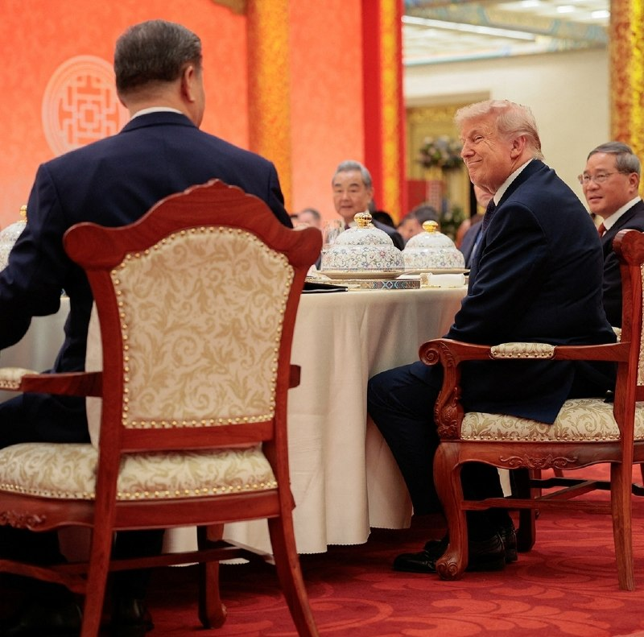

👈تصویری از روسای جمهوری امریکا و چین در ضیافت شام

✅ @AloNews خبر جنگ

## alonews — post 120001

  <a href="telegram/content/alonews_120001_1778785380.jpg">🎬 Download video</a>

👈سازمان بهداشت جهانی: نرخ مرگ و میر مرتبط با شیوع ویروس هانتا حدود ۲۷ درصد است و هیچ واکسن یا درمان خاصی برای ویروسی که می‌تواند باعث سندرم حاد تنفسی شدید شود، وجود ندارد.

✅ @AloNews خبر جنگ

## alonews — post 120000

  <a href="telegram/content/alonews_120000_1778785380.jpg">🎬 Download video</a>

👈الی کوهن، تو کانال ۱۲ اسرائیل : ایرانی‌ها داشتن سعی می‌کردن مکالمه‌هامون رو شنود کنن

✅ @AloNews خبر جنگ

## alonews — post 119999

اخبار جنگ الونیوز AloNews pinned «»

## alonews — post 119998

## alonews — post 119997

## alonews — post 119996

  <a href="telegram/content/alonews_119996_1778785381.mp4">🎬 Download video</a>

👈کارشناس کانال ۱۴ اسرائیل: رژیم ایران به شدت به پول نیاز داره و در حال انجام تماس‌های مخفی و مستقیم با دولت ترامپه.

✅ @AloNews خبر جنگ

## alonews — post 119995

  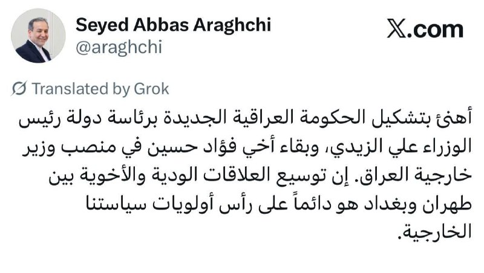

👈عراقچی: تشکیل دولت جدید به ریاست جناب آقای نخست وزیر علی الزیدی، و ابقای برادرم فواد حسین در جایگاه وزارت خارجه را تبریک می‌گویم

🔴گسترش روابط برادرانه و دوستانه تهران-بغداد همواره در صدر اولویت‌های سیاست خارجی ما باقی خواهد ماند

✅ @AloNews خبر جنگ

## alonews — post 119994

  <a href="telegram/content/alonews_119994_1778785383.mp4">🎬 Download video</a>

👈واکنش عراقچی به دست دراز کردن خانم وزیر خارجه ویتنام در اجلاس وزرای خارجه بریکس در هند

✅ @AloNews خبر جنگ

---
📅 بروزرسانی: 1405/02/24 20:28
---

## VahidOOnLine — post 240155

  

منوچهر متکی، نماینده مجلس و وزیر خارجه پیشین جمهوری اسلامی، خطاب به بحرین گفت: «الان در آتش‌بس هستیم؛ دعا کنید جنگی در نگیرد، اما اگر جنگ شد و دوباره پایگاه‌های آمریکا را برای حمله به ما در اختیار بگذارید، آنچنان می‌زنیم که نامتان را فراموش کنید و خاک بحرین را توی توبره می‌کنیم.»

متکی گفت بحرین و برخی کشورهای منطقه با در اختیار گذاشتن امکانات و پایگاه‌ها به آمریکا، حملات علیه جمهوری اسلامی را تسهیل کردند و پس از حملات آمریکا و اسرائیل، به جای همدردی با ما به‌خاطر کشته شدن علی خامنه‌ای، با تحریک ایالات متحده در شورای امنیت علیه تهران قطعنامه تصویب کردند.

او همچنین گفت بحرین تلاش کرده بود در اجلاس بین‌المجالس در استانبول نیز مصوبه‌ای علیه جمهوری اسلامی به تصویب برساند، اما تهران با «تدبیر دیپلماتیک» و همراهی برخی کشورها مانع رای‌گیری درباره آن شد.

متکی این اظهارات را در روایت تازه خود از تنش لفظی با هیات بحرین در اجلاس بین‌المجالس استانبول بیان کرد و گفت آن زمان، پس از آن‌که نماینده بحرین جمهوری اسلامی را به «حمله ظالمانه» به بحرین و کشورهای عربی متهم کرد، این پاسخ را به او داده بود.
‌🏁 🇬🇧 IranintlTV

🤖 @VahidOOnLine

## VahidOOnLine — post 240154

  

♦️مهدی تاج، رئیس فدراسیون فوتبال اعلام کرد که هنوز هیچ ویزایی برای حضور تیم ملی در رقابت‌های جام جهانی در ایالات متحده صادر نشده است. خبرگزاری دولتی ایرنا به نقل از تاج نوشت: «فردا یا پس‌فردا نشست تعیین‌کننده‌ای با فیفا خواهیم داشت. آن‌ها باید به ما تضمین بدهند، چرا که موضوع ویزا هنوز حل نشده است».

او در ادامه افزود: «ما هنوز هیچ گزارشی از طرف مقابل درباره اینکه برای چه کسانی ویزا صادر شده، دریافت نکرده‌ایم و تا این لحظه هیچ ویزایی صادر نشده است». پیش از این انتظار می‌رفت بازیکنان برای انجام مراحل انگشت‌نگاری ویزا به آنکارا، پایتخت ترکیه، سفر کنند. تاج در این باره گفت: «بازیکنان باید برای انگشت‌نگاری به آنکارا بروند، اما ما در تلاش هستیم تا هماهنگی‌های لازم را انجام دهیم تا این کار در آنتالیا صورت گیرد و نیازی به سفر به آنکارا نباشد».
‌🇸🇦 Indypersian

🤖 @VahidOOnLine

## VahidOOnLine — post 240153

  <a href="telegram/content/VahidOOnLine_240153_1778777883.mp4">🎬 Download video</a>

دونالد ترامپ در گفت‌وگو با شان هنیتی گفت شی جین‌پینگ، رئیس‌جمهوری چین، متعهد شده به جمهوری اسلامی تجهیزات نظامی ارائه نکند.

ترامپ گفت: «او گفت قرار نیست تجهیزات نظامی بدهد؛ این حرف بزرگی است.»

رئیس‌جمهوری آمریکا در ادامه افزود چین همچنان بخش زیادی از نفت خود را از ایران خریداری می‌کند و مایل است این روند ادامه پیدا کند.

ترامپ همچنین گفت شی جین‌پینگ خواهان باز ماندن تنگه هرمز و جلوگیری از اختلال در عبور و مرور کشتی‌هاست.
‌🏁 🇬🇧 ManotoTV

🤖 @VahidOOnLine

## VahidOOnLine — post 240152

  

اکسیوس در گزارشی درباره ایران نوشت که مقام‌های آمریکایی انتظار ندارند دونالد ترامپ در جریان سفرش به چین اقدام چشمگیری در مورد جمهوری اسلامی انجام دهد، اما معتقدند او ممکن است بلافاصله پس از پایان این سفر تصمیم بعدی خود را اتخاذ کند.

براساس این گزارش یکی از گزینه‌های مورد بررسی ازسرگیری «پروژه آزادی» است؛ طرحی که در آن نیروی دریایی آمریکا تلاش می‌کند بن‌بست ایجاد شده در تنگه هرمز را بشکند.

به گزارش اکسیوس، گزینه دیگر آغاز کارزار جدید بمباران با تمرکز بر زیرساخت‌های ایران است.

مقام‌های اسرائیلی نیز گفته‌اند در صورت تصمیم ترامپ برای ازسرگیری جنگ، در آخر هفته جاری در وضعیت آماده‌باش کامل خواهند بود.
‌🏁 🇬🇧 IranintlTV

🤖 @VahidOOnLine

## VahidOOnLine — post 240151

♦️دونالد ترامپ، رئیس‌جمهوری آمریکا که به چین سفر کرده، روز پنجشنبه همراه با شی جین‌پینگ،‌ رئیس‌جمهوری چین برای بازدید از معبد بهشت ​​در پکن که بیش از ۵۰۰ سال قدمت دارد، وارد این معبد تاریخی شد.
او در توری اختصاصی همراه با شی در جریان جزئیاتی از این معبد قرار گرفت.
دونالد ترامپ، رئیس جمهوری ایالات متحده آمریکا شامگاه پنجشنبه ۲۴ اردیبهشت (به وقت محلی) و در جریان ضیافت شام شی جین‌پینگ، گفتگوها با رئیس‌جمهوری چین را «فوق‌العاده مثبت و سازنده» توصیف کرد.
‌🇸🇦 Indypersian

🤖 @VahidOOnLine

## VahidOOnLine — post 240150

  

دونالد ترامپ در گفت‌وگو با فاکس‌نیوز گفت رییس‌جمهور چین خواهان باز ماندن تنگه هرمز و دستیابی به توافق است و پیشنهاد داده برای تحقق آن به هر شکل ممکن کمک کند.
ترامپ افزود شی جین‌پینگ به او گفته چین هیچ‌گونه تجهیزات نظامی در اختیار جمهوری اسلامی قرار نخواهد داد.
‌🏁 🇬🇧 IranintlTV

🤖 @VahidOOnLine

## VahidOOnLine — post 240149

  <a href="telegram/content/VahidOOnLine_240149_1778777886.mp4">🎬 Download video</a>

♦️دونالد ترامپ، رئیس‌جمهوری آمریکا، در مصاحبه با شان هنیتی از فاکس نیوز گفت که شی جین‌پینگ، رئیس‌جمهور چین، برای همکاری در پرونده ایران و بازگشایی تنگه هرمز اعلام آمادگی کرده است. ترامپ تاکید کرد که شی تمایل دارد شاهد دستیابی به یک توافق باشد و به‌طور مشخص پیشنهاد داده است که در این زمینه هرگونه کمک لازم را ارائه دهد.

رئیس‌جمهور آمریکا با اشاره به حجم بالای خرید نفت چین از ایران، خاطرنشان کرد که پکن به‌دلیل این رابطه اقتصادی، نفوذ قابل‌توجهی دارد. به گفته ترامپ، رهبر چین بر تمایل خود برای بازگشایی تنگه هرمز تاکید کرده و گفته است: «اگر هر کمکی از دستم بربیاید، مشتاقم که انجام دهم».
‌🇸🇦 Indypersian

🤖 @VahidOOnLine

## VahidOOnLine — post 240148

  

♦️عباس عراقچی، وزیر خارجه جمهوری اسلامی روز پنجشنبه ۲۴ اردیبهشت با اشاره به تنش‌ها میان تهران و واشنگتن تاکید کرد که «آمریکا راه حل اختلاف با ایران را در جایی غیر از میدان نظامی جست‌وجو کند.»
عباس عراقچی در حاشیه دیدارهای خود با همتایانش در بریکس در واکنش به تهدیدهای مقامات آمریکایی و اسرائیلی مبنی بر از سرگیری حملات به ایران به‌محض بازگشت رئیس‌جمهوری آمریکا از چین گفت: «آن‌ها مدت‌هاست که به اشکال و شیوه‌های مختلف تهدیدهای خود را تکرار می‌کنند، اما خودشان نیز می‌دانند که از این تهدیدها و حتی از جنگی که به راه انداختند، هیچ نتیجه‌ای نگرفته‌اند و نخواهند گرفت.»
عراقچی با تاکید بر اینکه «ایران در برابر تهدیدها محکم ایستاده و سر خم نمی‌کند.» افزود: «راه‌حل در تهدید کردن نیست.»
وزیر خارجه جمهوری اسلامی در ادامه با ابراز امیدواری از تغییر نگاه مقام‌های آمریکایی به موضوعات مربوط به ایران تاکید کرد: «اگرچه امید نیست که به منطق روی آورند ولی بدانند که راه‌حل مسائل را باید در جایی غیر از میدان نظامی جست‌وجو کنند، زیرا از این مسیر به هیچ نتیجه‌ای نخواهند رسید.»
‌🇸🇦 Indypersian

🤖 @VahidOOnLine

## VahidOOnLine — post 240147

  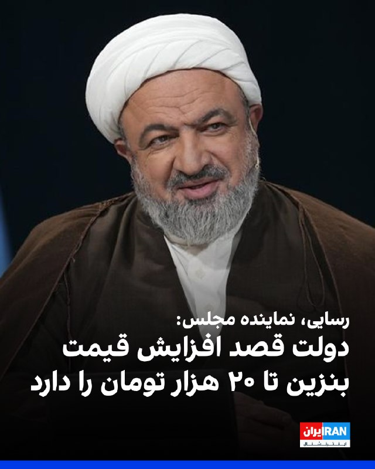

حمید رسایی، نماینده تهران در مجلس، نوشت جریانی «شناخته‌شده» در دولت چهاردهم که راه‌حل را «آزاد کردن و گران کردن» می‌داند، قصد دارد سهمیه بنزین هزار و ۵۰۰ تومانی و سه هزار تومانی را کاهش دهد و قیمت بنزین پنج هزار تومانی را به ۱۵ تا ۲۰ هزار تومان افزایش دهد.

او افزود همان جریان در دولت چهاردهم پیش‌تر با حذف ارز ترجیحی ۲۸ هزار و ۵۰۰ تومانی و گران کردن ارز، به گفته او، «بالاترین تورم پس از انقلاب ۵۷» را به مردم تحمیل کرده بود.

رسایی نوشت محمدباقر قالیباف با «پلمپ کردن بدون توجیه و دلیل مجلس»، راه نظارت نمایندگان بر تصمیمات دولت را بسته است. او افزود انجام تکلیف نمایندگی سخت شده، اما تلاش می‌کند مجلس را از این «مرگ تعمدی» بیرون بیاورد و جلوی این تصمیمات «عجیب» را در موقعیت «سخت و جنگی» فعلی بگیرد.
‌🏁 🇬🇧 IranintlTV

🤖 @VahidOOnLine

## VahidOOnLine — post 240146

  <a href="telegram/content/VahidOOnLine_240146_1778777889.mp4">🎬 Download video</a>

‌
دونالد ترامپ، رئیس‌جمهوری آمریکا، در گفت‌و‌گو با شان هنیتی، خبرنگار و مجری فاکس‌نیوز گفت شی جین‌پینگ، رئیس‌جمهوری چین، خواهان دستیابی به توافق و باز ماندن تنگه هرمز است.

ترامپ گفت: «رئیس‌جمهوری شی دوست دارد توافقی حاصل شود. او گفت اگر بتواند کمکی بکند، مایل است کمک کند.»

رئیس‌جمهوری آمریکا همچنین با اشاره به خرید نفت ایران از سوی چین افزود: «هر کسی که این مقدار نفت می‌خرد، بدیهی است نوعی رابطه دارد.»

ترامپ در ادامه گفت شی جین‌پینگ مایل است تنگه هرمز باز بماند.
‌🏁 🇬🇧 ManotoTV

🤖 @VahidOOnLine

## VahidOOnLine — post 240145

  <a href="telegram/content/VahidOOnLine_240145_1778777890.mp4">🎬 Download video</a>

مارکو روبیو، وزیر خارجه آمریکا، گفت دونالد ترامپ موضوع ایران را در گفت‌وگو با مقام‌های چین مطرح کرده و این موضوع «اهمیت زیادی» داشته است.

روبیو گفت طرف چینی اعلام کرده با «نظامی‌سازی تنگه هرمز» و همچنین ایجاد سیستم دریافت عوارض از کشتی‌ها در این آبراه مخالف است.

وزیر خارجه آمریکا افزود: «این موضع ما هم هست.»
‌🏁 🇬🇧 ManotoTV

🤖 @VahidOOnLine

## VahidOOnLine — post 240144

  

برد کوپر، فرمانده ستاد فرماندهی مرکزی آمریکا (سنتکام)، در جلسه کمیته نیروهای مسلح سنای آمریکا گفت در ۳۰ ماه منتهی به عملیات «خشم حماسی»، گروه‌های مورد حمایت جمهوری اسلامی بیش از ۳۵۰ بار به نیروها و دیپلمات‌های آمریکایی حمله کرده‌اند؛ به‌طور میانگین بیش از یک حمله در هر سه روز.
او افزود این حملات به کشته شدن چهار نظامی آمریکایی و زخمی شدن نزدیک به ۲۰۰ نفر انجامیده است.

فرمانده سنتکام همچنین گفت امروز حماس، حزب‌الله و حوثی‌ها از پشتیبانی و تامین تسلیحاتی جمهوری اسلامی محروم شده‌اند.
‌🏁 🇬🇧 IranintlTV

🤖 @VahidOOnLine

## VahidOOnLine — post 240143

♦️برد کوپر، فرمانده سنتکام، روز پنجشنبه ۲۴ اردیبهشت در جلسه استماع کمیته نیروهای مسلح سنا یادآوری کرد که فرماندهی مرکزی ایالات متحده (سنتکام) در پاسخ مستقیم به تهدیدهای ناشی از جمهوری اسلامی ایران تاسیس شده است. او با اشاره به ۴۷ سال خصومت تهران با آمریکا، تاکید کرد که تنها در ۳۰ ماه پیش از آغاز عملیات «حکم حماسی»، گروه‌های نیابتی ایران بیش از ۳۵۰ بار به نیروها و دیپلمات‌های آمریکایی حمله کرده‌اند.

کوپر گفت که سنتکام به دستور رئیس‌جمهور و در قالب عملیات «خشم حماسی»، در کمتر از ۴۰ روز به اهداف نظامی خود دست یافت. به گفته او، مهم‌ترین دستاورد این عملیات تضعیف توان قدرت‌نمایی ایران در خارج از مرزها بوده است؛ به‌گونه‌ای که جمهوری اسلامی دیگر قادر نیست حملاتی در ابعاد وسیع مشابه آنچه در سال ۲۰۲۴ در جریان اولین حمله مستقیم به خاک اسرائیل رخ داد، انجام دهد. فرمانده سنتکام تاکید کرد که با نابودی ۹۰ درصد از زیرساخت‌های صنایع دفاعی ایران، این کشور تا سال‌ها توان بازسازی تسلیحات خود را نخواهد داشت.
‌🇸🇦 Indypersian

🤖 @VahidOOnLine

## VahidOOnLine — post 240142

  

برد کوپر، فرمانده ستاد فرماندهی مرکزی آمریکا (سنتکام)، در جلسه کمیته نیروهای مسلح سنای آمریکا گفت در ۳۰ ماه منتهی به عملیات «خشم حماسی»، گروه‌های مورد حمایت جمهوری اسلامی بیش از ۳۵۰ بار به نیروها و دیپلمات‌های آمریکایی حمله کرده‌اند؛ به‌طور میانگین بیش از یک حمله در هر سه روز.
او افزود این حملات به کشته شدن چهار نظامی آمریکایی و زخمی شدن نزدیک به ۲۰۰ نفر انجامیده است.

فرمانده سنتکام همچنین گفت امروز حماس، حزب‌الله و حوثی‌ها از پشتیبانی و تامین تسلیحاتی جمهوری اسلامی محروم شده‌اند.
‌🏁 🇬🇧 IranintlTV

🤖 @VahidOOnLine

## VahidOOnLine — post 240141

  <a href="telegram/content/VahidOOnLine_240141_1778777892.mp4">🎬 Download video</a>

♦️عباس عراقچی وزیر خارجه جمهوری اسلامی روز پنجشنبه ۲۴ اردیبهشت در ادامه دیدارهای خود در حاشیه نشست وزیران خارجه گروه بریکس با سرگئی لاوروف وزیر امور خارجه روسیه دیدار کردند.
جزئیاتی در خصوص دیدار وزرای خارجه ایران و روسیه منتشر نشده است.
عراقچی و لاوروف دو هفته پیش در مسکو با یکدیگر دیدار کردند.
وزرای خارجه روسیه، مصر، برزیل، هند، آفریقای جنوبی از جمله مقام‌های ارشد دیپلماتیکی هستند که در این نشست حضور دارند.
عراقچی در حالی در اجلاس وزیران خارجه گروه بریکس شرکت می‌کند که مساله ادامه بسته بودن تنگه هرمز، به یکی از چالش‌های جدی بین‌المللی تبدیل شده است.
‌🇸🇦 Indypersian

🤖 @VahidOOnLine

## VahidOOnLine — post 240140

  

♦️فرماندهی مرکزی ایالات متحده (سنتکام) روز پنجشنبه ۲۴ اردیبهشت اعلام کرد که نیروهای دریایی این کشور تاکنون در چارچوب محاصره تنگه هرمز توسط آمریکا، ۷۰ کشتی تجاری را «تغییر مسیر» داده و چهار کشتی دیگر را «از کار انداخته‌اند».

این بیانیه پس از آن صادر شد که سپاه پاسداران انقلاب اسلامی ایران اعلام کرد طی ۲۴ ساعت گذشته به ده‌ها فروند کشتی تجاری، از جمله کشتی‌های متعلق به چین، اجازه عبور از این آبراه راهبردی را داده است.
‌🇸🇦 Indypersian

🤖 @VahidOOnLine

## mwarmonitor — post 9096

  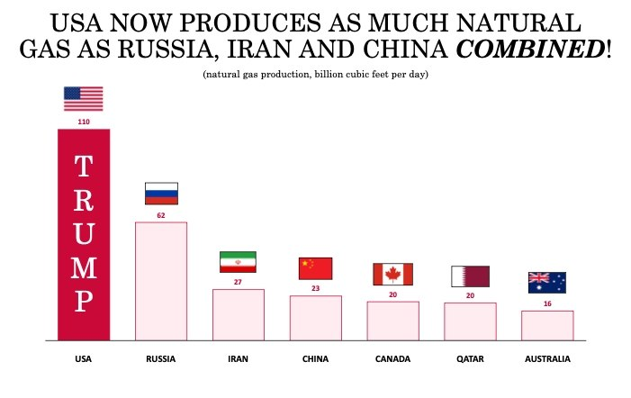

🇺🇸رئیس‌جمهور دونالد ترامپ در روز اول کاری خود، ممنوعیت دولت بایدن برای صدور مجوز صادرات LNG (گاز طبیعی مایع) را لغو کرد.

🇺🇸امروز، ایالات متحده بزرگ‌ترین تولیدکننده و صادرکننده گاز طبیعی در جهان است و پیش‌بینی می‌شود صادرات LNG این کشور تا پایان دهه تقریباً دو برابر شود.

@mwarmonitor

## mwarmonitor — post 9095

🇦🇪بیانیه: امارات حمله تروریستی به کشتی با پرچم هند در سواحل عمان را به شدت محکوم می‌کند

🇦🇪دولت امارات متحده عربی حمله تروریستی که کشتی حامل پرچم هند را در نزدیکی سواحل سلطنت عمان هدف قرار داد، با شدیدترین تعابیر محکوم کرد.

🇦🇪وزارت امور خارجه در بیانیه‌ای تأکید کرد که این حمله تهدیدی بزرگ برای ایمنی دریانوردی جهانی و تنش‌زایی خطرناکی است که ثبات آبراه‌های حیاتی را هدف قرار می‌دهد.

🇦🇪امارات همبستگی خود را با جمهوری دوست، هند، و حمایت کامل خود را از تمامی اقداماتی که منجر به حفاظت از امنیت و سلامت کشتی‌ها و منافع این کشور می‌شود، ابراز داشت.

🇦🇪این وزارتخانه همچنین تأکید کرد که این حمله نقض آشکار قطعنامه شماره ۲۸۱۷ شورای امنیت است که بر آزادی دریانوردی و رد هدف قرار دادن کشتی‌های تجاری یا مختل کردن مسیرهای دریایی بین‌المللی تأکید دارد. وزارت خارجه خاطرنشان کرد که هدف قرار دادن دریانوردی تجاری و استفاده از تنگه هرمز به عنوان ابزاری برای فشار یا باج‌خواهی اقتصادی، اقدامی راهزنانه محسوب شده و تهدیدی مستقیم برای ثبات منطقه، ملت‌های آن و امنیت انرژی جهانی است.

@mwarmonitor

## mwarmonitor — post 9094

  

✈️📡 هواپیمای RC-135V Rivet Joint (شماره 64-14848) در حال انجام مأموریت بر فراز خلیج فارس است و در حال جمع‌آوری اطلاعات اطلاعاتی درباره ایران می‌باشد.

📝این هواپیما به‌تنهایی می‌تواند هشدار ورود به مرحله پیش از درگیری باشد؛
وقتی پروازهای روزانه و مستمر آواکس را هم به آن اضافه کنیم، نشانه‌ها دیگر قابل چشم‌پوشی نیستند.

@mwarmonitor

## mwarmonitor — post 9093

  

🇮🇷ایران ادعا می‌کند برای ایجاد آشوب بیشتر در تنگه هرمز، زیردریایی‌های کوچک خود را مستقر کرده است. نیویورک پست

@mwarmonitor

## mwarmonitor — post 9092

🔴 به گفته فرماندهی مرکزی ایالات متحده (CENTCOM)، گروه‌های حماس، حزب‌الله و حوثی‌ها از پشتیبانی تسلیحاتی ایران قطع شده‌اند.

🔸بر اساس اظهارات برد کوپر، فرمانده سنتکام، توانمندی‌های ایران به‌شدت تضعیف شده و این کشور دیگر قادر به انجام حملات گسترده و پرحجم علیه همسایگان خود نیست.

🔸او همچنین می‌گوید ایران تا یک نسل دیگر به سطح نیروی دریایی پیش از جنگ بازنخواهد گشت و توان موشکی، نیروی دریایی، پهپادها و زیرساخت صنعتی نظامی ایران همگی تا حدود ۹۰ درصد تضعیف شده‌اند.

@mwarmonitor

## mwarmonitor — post 9091

🔴«یک مقام آمریکایی گفت که ایران حدود ۷۵ درصد از موجودی پیش از جنگِ پرتابگرهای متحرک خود و حدود ۷۰ درصد از ذخایر موشکی پیش از جنگ خود را همچنان حفظ کرده است.» واشنگتن پست @mwarmonitor

## mwarmonitor — post 9090

⚠️پدیده El Niño در اقیانوس آرام حتی سریع‌تر از حد انتظار در حال شکل‌گیری است و احتمال اینکه تا پاییز یا زمستان به یک رویداد تاریخی و بسیار قوی — یک «سوپر النینو» — تبدیل شود، در حال افزایش است. CNN

@mwarmonitor

## mwarmonitor — post 9089

🔴ترامپ به فاکس گفت: رهبر چین پیشنهاد داده است که در موضوع ایران کمک کند — و همچنین وعده داده که به ایران تجهیزات نظامی منتقل نکند. او می‌خواهد تنگه هرمز باز بماند.

@mwarmonitor

## pm_afshaa — post 90750

  <a href="telegram/content/pm_afshaa_90750_1778777897.jpg">🎬 Download video</a>

🔴ترامپ: رئیس‌جمهور شی مایله که شاهد یک توافق باشه. او گفت: اگه بتونم کمکی داشته باشم، دوست دارم کمک کنم.

هر کسی که این مقدار نفت میخره، مشخصاً نوعی رابطه داره و او دوست داره تنگه هرمز رو باز ببینه.

💧 Rainbet.com the #1 Non-KYC Crypto Casino & Sportsbook @rainbetcom

😁 @Pm_Afshaa

## pm_afshaa — post 90749

🎙️آیا رئیس جمهور شی از ترامپ درخواست کرده بود که به تایوان سلاح نفروشه؟

مارکو روبیو: خوب، این موضوع در گذشته مورد بحث قرار گرفته. اساساً در بحث امروز مطرح نشد. ما میدونیم که موضع آنها در این مورد چیست.

💧 Rainbet.com the #1 Non-KYC Crypto Casino & Sportsbook @rainbetcom

😁 @Pm_Afshaa

## pm_afshaa — post 90748

  <a href="telegram/content/pm_afshaa_90748_1778777897.jpg">🎬 Download video</a>

🔴ترامپ: چین موافقت کرد 200 هواپیمای بوئینگ خریداری کنه.

💧 Rainbet.com the #1 Non-KYC Crypto Casino & Sportsbook @rainbetcom

😁 @Pm_Afshaa

## pm_afshaa — post 90747

  <a href="telegram/content/pm_afshaa_90747_1778777898.jpg">🎬 Download video</a>

🔴حمید رسایی، نماینده تهران:
دولت قصد داره سهمیه بنزین هزار و ۵۰۰ تومنی و ۳ هزار تومنی رو کاهش بده و قیمت بنزین پنج هزار تومانی رو به ۱۵ تا ۲۰ هزار تومان افزایش بده.

💧 Rainbet.com the #1 Non-KYC Crypto Casino & Sportsbook @rainbetcom

😁 @Pm_Afshaa

## pm_afshaa — post 90746

  <a href="telegram/content/pm_afshaa_90746_1778777898.jpg">🎬 Download video</a>

🔴عراقچی: برای مسائل مربوط به ایران راه حل نظامی وجود نداره و ما در مقابل تهدیدات محکم می‌ایستیم و سر فرود نمیاریم.

اگر دوباره بخوان ما رو آزمایش کنند و وارد جنگ شوند، نتیجه‌ای جز شکستی که قبلا دیدن، نخواهد داشت.

💧 Rainbet.com the #1 Non-KYC Crypto Casino & Sportsbook @rainbetcom

😁 @Pm_Afshaa

## pm_afshaa — post 90745

🎙️آیا درباره حمایت چین از ایران با رئیس جمهور چین صحبت کردید؟

ترامپ: ما در مورد این موضوع صحبت کردیم. او گفت که تجهیزات نظامی ارائه نخواهد کرد، این یک بیانیه بزرگه. اما در عین حال گفت که آنها مقدار زیادی نفت خودشون رو از ایران میخرن و دوست دارن این کار رو ادامه بدن.

💧 Rainbet.com the #1 Non-KYC Crypto Casino & Sportsbook @rainbetcom

😁 @Pm_Afshaa

## pm_afshaa — post 90744

  <a href="telegram/content/pm_afshaa_90744_1778777899.jpg">🎬 Download video</a>

🔴برد کوپر، فرمانده سنتکام:
رژیم ایران از سال 1979 در حال گسترش وحشت در سراسر خاورمیانه است.

💧 Rainbet.com the #1 Non-KYC Crypto Casino & Sportsbook @rainbetcom

😁 @Pm_Afshaa

## pm_afshaa — post 90743

  <a href="telegram/content/pm_afshaa_90743_1778777899.jpg">🎬 Download video</a>

🔴برد کوپر، فرمانده سنتکام:
توانمندی‌های موشکی، دریایی، پهپادی و صنعتی ایران 90 درصد تضعیف شده. او افزود که نیروی دریایی ایران تا یک نسل دیگر هم به سطحی که پیش از جنگ در اختیار داشت باز نخواهد گشت.

💧 Rainbet.com the #1 Non-KYC Crypto Casino & Sportsbook @rainbetcom

😁 @Pm_Afshaa

## iaghapour — post 2611

  

💠 Mega Center 💠

🪩📈 ابزار مورد نیاز شما در دنیای کریپتو و تریدینگ / احراز هویت پلتفرم های خارجی

از افتتاح حساب های ارزی بین المللی
تا پکیج مدارک لازم جهت احراز هویت صرافی ها و سایت های خارجی
صدور مستر کارت و ویزا کارت و خدمات ارزی
سیم کارت های فیزیکی خارجی
خدمات وریفای تضمینی صرافی ها
ولت های فیزیکی معتبر و ...

👨‍💻لینک دسترسی ها و ارتباط :
www.megacenterx.com      
www.megacenterx.com
www.megacenterx.com

https://t.me/megacenter0
https://t.me/megacenter0

@Megav_admin22
@Megav_admin22

در صورت بالا نیامدن سایت ، بدون وی پی ان امتحان نمایید ✅

## iaghapour — post 2609

کل ریپازیتوری گیت هاب علیرضا که شامل X-UI و S-UI میشد بسته شده و هنوز دلیلش مشخص نیست.

## DEJradio — post 4636

  <a href="telegram/content/DEJradio_4636_1778777900.mp4">🎬 Download video</a>

🔺📢 "قیمت دارو سرسام‌آور شده، حکومت فقط دنبال جنگ‌افروزی است

یک شهروند از سمنان با ارسال یک ویدیو در پیامی نوشت: "ساکن سمنان هستم و براتون گزارشی می‌فرستم از افزایش قیمت دارو. این چند تا دارو رو دیروز از داروخانه به قیمت ۳ میلیون تومن خریدم درحالیکه پارسال قیمتش نصف این بود. درآمد ماهیانه من با این قیمت‌های سرسام آور تناسبی نداره و این به این معناست که برای خرید دارو باید از بقیه مایحتاج خودم و سه فرزندم صرف نظر کنم. این حکومت بی‌کفایت نه تنها که به فکر تامین نیازهای ما نیست بلکه با این جنگ افروزی‌هاش فقط اقتصاد کشور و درآمد مردم رو بیش از پیش نابود میکنه!"

#دارو #تورم
@DEJradio

## DEJradio — post 4635

  <a href="telegram/content/DEJradio_4635_1778777902.mp4">🎬 Download video</a>

🔺📢 "ما گرسنه‌ایم ولی از جنگ سیر

یک شهروند از تهران با ارسال ویدیویی از حرکت اعتراضی، نوشت گرانی زندگی مردم را مختل کرده است و بسیاری به نان شب محتاج‌اند اما حکومت انگار نه انگار که مردم چطور زندگی می‌کنند.

#تورم #جنگ
@DEJradio

## DEJradio — post 4631

  <a href="telegram/content/DEJradio_4631_1778777904.jpg">🎬 Download video</a>

🚨📢 روزنامه «وال‌استریت ژورنال» گزارش داده بود که اسرائیل یک پایگاه نظامی مخفی در بیابان عراق [نزدیم کربلا] ایجاد کرده بود تا از کارزار هوایی خود علیه جمهوری اسلامی پشتیبانی کند و در روزهای ابتدایی جنگ نیز حملاتی هوایی علیه نیروهای عراقی انجام داده بود؛ نیروهایی که نزدیک بود این پایگاه و باند فرود آن را کشف کنند.

اکنون، نزدیک به دو ماه پس از ترک این پایگاه، نیروهای ارتش عراق و عناصر حشـ.ـدالشعبی وارد محل این تأسیسات اسرائیلی شده‌اند.
تصویر یک از رسانه رسمی «کتائب حـ.ـزب‌الله» منتشر شد، اعضای این گروه را در حال بررسی یک وانت تویوتا هایلوکس نشان می‌دهد که گفته می‌شود هدف حمله نیروهای اسرائیلی قرار گرفته است. این هایلوکس متعلق به یک چوپان عراقی بود که به‌طور اتفاقی این پایگاه را کشف کرده و موفق شده بود با ارتش عراق تماس بگیرد، اما پس از آن هدف قرار گرفت و کشته شد. نیروهای کمکی عراقی از لشکر۴۱ نیز توسط یک نیروی ناشناس هدف حمله قرار گرفتند که دست‌کم یک کشته و چند زخمی برجا گذاشت.

تصویر ۲ باند فرود را نشان می‌دهد؛ باندی که گفته می‌شود هم به‌عنوان ایستگاه سوخت‌گیری و هم نقطه استقرار پیشرو برای عملیات جست‌وجو و نجات رزمی استفاده می‌شد؛ عملیاتی که در صورت سرنگونی یک هواپیمای سرنشین‌دار اسرائیلی توسط پدافند هوایی ایران انجام می‌گرفت. گزارش شده که دست‌کم هفت بالگرد در این محل قابل مشاهده بوده‌اند.

منتقدان دولت عراق می‌گویند این کشور با وجود داشتن یک ساختار امنیتی نزدیک به دو میلیون نفر شامل مرزبانان، حـ.ـشدالشعبی، پلیس و ارتش، نتوانسته بود تشخیص دهد که یک نیروی نظامی خارجی عملاً در بیابان‌های عراق یک پایگاه هوایی ساخته است. همچنین جمهوری اسلامی نیز ماه‌ها از فعالیت چنین پایگاهی بی‌خبر بود.

#جنگ #عراق #حشد_الشعبی
@DEJradio

## VahidOnline — post 75468

  

برد کوپر، فرمانده ستاد فرماندهی مرکزی ایالات متحده (سنتکام)، اعلام کرد که صنایع موشکی، پهپادی و دریایی ایران «۹۰ درصد تضعیف شده‌اند.»

او در یک جلسه استماع در سنای آمریکا گفت: «تهدید ایران به‌طور قابل‌توجهی تضعیف شده و این کشور دیگر مانند گذشته، در هیچ حوزه‌ای، قادر به تهدید شرکای منطقه‌ای یا ایالات متحده نیست. آنها به‌شدت تضعیف شده‌اند.»

کوپر اشاره کرد که نیروهای نیابتی مسلح ایران در ۳۰ ماه پیش از جنگ اخیر، بیش از ۳۵۰ حمله علیه نیروها و دیپلمات‌های آمریکایی انجام داده بودند؛ به‌طور میانگین هر سه روز یک حمله، که در نتیجه آن چهار سرباز آمریکایی کشته شدند.

برد کوپر با دفاع از جنگ اخیر تأکید کرد: «امروز حماس، حزب‌الله و حوثی‌ها همگی از تأمین تسلیحات و حمایت ایران قطع شده‌اند. این نتیجه از پیش تضمین‌شده نبود.»

او همچنین گفت نیروهای آمریکایی دیگر برای سرنگون کردن پهپادهای ایرانی از مهمات پیشرفته و گران‌قیمت استفاده نمی‌کنند.
ذخایر سامانه‌های دفاعی پرهزینه برای مقابله با پهپادهای ایرانی در طول جنگ خبرساز شده بود، اما فرمانده سنتکام اعلام کرد ارتش آمریکا اکنون از مهمات ارزان‌تر استفاده می‌کند.
@VahidHeadline

📡 @VahidOnline

## VahidOnline — post 75467

  

حمید رسایی، نماینده تهران در مجلس، نوشت جریانی «شناخته‌شده» در دولت چهاردهم که راه‌حل را «آزاد کردن و گران کردن» می‌داند، قصد دارد سهمیه بنزین هزار و ۵۰۰ تومانی و سه هزار تومانی را کاهش دهد و قیمت بنزین پنج هزار تومانی را به ۱۵ تا ۲۰ هزار تومان افزایش دهد.

او افزود همان جریان در دولت چهاردهم پیش‌تر با حذف ارز ترجیحی ۲۸ هزار و ۵۰۰ تومانی و گران کردن ارز، به گفته او، «بالاترین تورم پس از انقلاب ۵۷» را به مردم تحمیل کرده بود.

رسایی نوشت محمدباقر قالیباف با «پلمپ کردن بدون توجیه و دلیل مجلس»، راه نظارت نمایندگان بر تصمیمات دولت را بسته است. او افزود انجام تکلیف نمایندگی سخت شده، اما تلاش می‌کند مجلس را از این «مرگ تعمدی» بیرون بیاورد و جلوی این تصمیمات «عجیب» را در موقعیت «سخت و جنگی» فعلی بگیرد.
@VahidOOnLine

📡 @VahidOnline

## VahidOnline — post 75466

  

مصطفی پوردهقان، دبیر دوم کمیسیون صنایع و معادن مجلس گفته است که مصوبه شورای عالی امنیت ملی در مورد اینترنت پرو در اجرا به «قلکی برای همراه اول، ایرانسل و رایتل» تبدیل شده است.

او در مورد انتخاب محمدرضا عارف، به عنوان رئیس ستاد ویژه ساماندهی فضای مجازی گفت که «مجلس در این مورد چیزی نمی‌داند» و این حکم مسعود پزشکیان، رئیس‌جمهور را «تزئینی» خوانده است.

به گفته این نماینده مجلس این قبیل اقدامات بیشتر جنبه «روانی » دارد و قرار نیست که «اتفاق خاصی» در این مورد بیفتد.

آقای پوردهقان همچنین گفته است که بدتر از قطعی اینترنت، تعطیلی مجلس است و اکنون مجلس با بسیاری از وزرای دولت به لحاظ نظارتی هیچ ارتباط خاصی درمورد عملکردشان ندارد که یکی از همین موارد موضوع اینترنت است و هنوز یک جلسه ویژه نداریم که فردی بیاید و شرایط را توضیح دهد.
@VahidHeadline

📡 @VahidOnline

## IranIntlTV — post 337198

  

منوچهر متکی، نماینده مجلس و وزیر خارجه پیشین جمهوری اسلامی، خطاب به بحرین گفت: «الان در آتش‌بس هستیم؛ دعا کنید جنگی در نگیرد، اما اگر جنگ شد و دوباره پایگاه‌های آمریکا را برای حمله به ما در اختیار بگذارید، آنچنان می‌زنیم که نامتان را فراموش کنید و خاک بحرین را توی توبره می‌کنیم.»

متکی گفت بحرین و برخی کشورهای منطقه با در اختیار گذاشتن امکانات و پایگاه‌ها به آمریکا، حملات علیه جمهوری اسلامی را تسهیل کردند و پس از حملات آمریکا و اسرائیل، به جای همدردی با ما به‌خاطر کشته شدن علی خامنه‌ای، با تحریک ایالات متحده در شورای امنیت علیه تهران قطعنامه تصویب کردند.

او همچنین گفت بحرین تلاش کرده بود در اجلاس بین‌المجالس در استانبول نیز مصوبه‌ای علیه جمهوری اسلامی به تصویب برساند، اما تهران با «تدبیر دیپلماتیک» و همراهی برخی کشورها مانع رای‌گیری درباره آن شد.

متکی این اظهارات را در روایت تازه خود از تنش لفظی با هیات بحرین در اجلاس بین‌المجالس استانبول بیان کرد و گفت آن زمان، پس از آن‌که نماینده بحرین جمهوری اسلامی را به «حمله ظالمانه» به بحرین و کشورهای عربی متهم کرد، این پاسخ را به او داده بود.
https://iranintl.com/20

## IranIntlTV — post 337197

  

اکسیوس در گزارشی درباره ایران نوشت که مقام‌های آمریکایی انتظار ندارند دونالد ترامپ در جریان سفرش به چین اقدام چشمگیری در مورد جمهوری اسلامی انجام دهد، اما معتقدند او ممکن است بلافاصله پس از پایان این سفر تصمیم بعدی خود را اتخاذ کند.

براساس این گزارش یکی از گزینه‌های مورد بررسی ازسرگیری «پروژه آزادی» است؛ طرحی که در آن نیروی دریایی آمریکا تلاش می‌کند بن‌بست ایجاد شده در تنگه هرمز را بشکند.

به گزارش اکسیوس، گزینه دیگر آغاز کارزار جدید بمباران با تمرکز بر زیرساخت‌های ایران است.

مقام‌های اسرائیلی نیز گفته‌اند در صورت تصمیم ترامپ برای ازسرگیری جنگ، در آخر هفته جاری در وضعیت آماده‌باش کامل خواهند بود.
https://iranintl.com/202605149706

## IranIntlTV — post 337196

  

دونالد ترامپ در گفت‌وگو با فاکس‌نیوز گفت رییس‌جمهور چین خواهان باز ماندن تنگه هرمز و دستیابی به توافق است و پیشنهاد داده برای تحقق آن به هر شکل ممکن کمک کند.
ترامپ افزود شی جین‌پینگ به او گفته چین هیچ‌گونه تجهیزات نظامی در اختیار جمهوری اسلامی قرار نخواهد داد.
https://iranintl.com/202605142029

## IranIntlTV — post 337195

  <a href="telegram/content/IranIntlTV_337195_1778777908.mp4">🎬 Download video</a>

شش کشور عربی شامل بحرین، کویت، عربستان سعودی، امارات، قطر و اردن در نامه‌ای فوری به سازمان ملل، جمهوری اسلامی را مسئول خسارت‌های واردشده به کشورهای منطقه دانسته و خواستار پرداخت غرامت شدند.
جزییات بیشتر با مریم رحمتی، خبرنگار ایران‌اینترنشنال
@iranintltv

## IranIntlTV — post 337194

  <a href="telegram/content/IranIntlTV_337194_1778777910.mp4">🎬 Download video</a>

در ادامه سفر دونالد ترامپ به چین، روسای جمهور آمریکا و چین در ضیافت شام رسمی بر گسترش همکاری‌های اقتصادی و ادامه گفت‌وگوها تاکید کردند. شی جین‌پینگ این سفر را «تاریخی» توصیف کرد و ترامپ نیز گفت دیدارهای دو طرف مثبت و سازنده بوده است.
سمیرا قرایی، خبرنگار ایران‌اینترنشنال، گزارش می‌دهد
@iranintltv

## IranIntlTV — post 337193

  

«برنامه» امشب، «تریبون آزاد» شماست.
اگر فقط یک جمله فرصت داشتید با ایران حرف بزنید، چه می‌گفتید؟
چه چیزی هنوز دلتان را گرم نگه می‌دارد؟
نگرانی‌تان چیست؟
از چه چیزی عصبانی هستید؟
حرفی دارید که در دلتان مانده و جایی برای گفتنش نبوده؟
از خودتان بگویید؛ از امیدها و ترس‌هایتان،
از رؤیایی که هنوز زنده است یا از چیزی که از دست رفته است.
تاریخ با صدای شما نوشته می‌شود.
برای شرکت در برنامه، همین حالا در واتس‌اپ پیام بدهید:
۰۰۴۴۷۵۲۲۱۱۰۱۱۰
۰۰۴۴۷۵۴۴۱۱۰۱۱۰
۰۰۴۴۷۵۱۱۱۰۲۵۵۳
«برنامه با کامبیز حسینی»
«یک ایران، صدای شما را می‌شنود»
@iranintltv

## IranIntlTV — post 337192

یک شهروند با ارسال پیامی به ایران اینترنشنال از نایاب و گران شدن داروی اعصاب و روان روایت می‌کند. صدای او برای حفظ امنیتش با هوش مصنوعی تغییر یافته است.

## IranIntlTV — post 337191

  

حمید رسایی، نماینده تهران در مجلس، نوشت جریانی «شناخته‌شده» در دولت چهاردهم که راه‌حل را «آزاد کردن و گران کردن» می‌داند، قصد دارد سهمیه بنزین هزار و ۵۰۰ تومانی و سه هزار تومانی را کاهش دهد و قیمت بنزین پنج هزار تومانی را به ۱۵ تا ۲۰ هزار تومان افزایش دهد.

او افزود همان جریان در دولت چهاردهم پیش‌تر با حذف ارز ترجیحی ۲۸ هزار و ۵۰۰ تومانی و گران کردن ارز، به گفته او، «بالاترین تورم پس از انقلاب ۵۷» را به مردم تحمیل کرده بود.

رسایی نوشت محمدباقر قالیباف با «پلمپ کردن بدون توجیه و دلیل مجلس»، راه نظارت نمایندگان بر تصمیمات دولت را بسته است. او افزود انجام تکلیف نمایندگی سخت شده، اما تلاش می‌کند مجلس را از این «مرگ تعمدی» بیرون بیاورد و جلوی این تصمیمات «عجیب» را در موقعیت «سخت و جنگی» فعلی بگیرد.
https://iranintl.com/202605146615

## IranIntlTV — post 337190

  <a href="telegram/content/IranIntlTV_337190_1778777913.mp4">🎬 Download video</a>

در حالی که تنها ۲۸ روز تا آغاز جام جهانی فوتبال باقی مانده، سرنوشت صدور ویزای آمریکا برای اعضای تیم فوتبال ایران همچنان نامشخص است. رییس فدراسیون فوتبال اعلام کرده هنوز هیچ ویزایی برای اعضای این تیم صادر نشده است.
گفت‌وگو با محمد تقوی، بازیکن پیشین تیم ملی و باشگاه استقلال
@iranintltv

## IranIntlTV — post 337189

  

برد کوپر، فرمانده ستاد فرماندهی مرکزی آمریکا (سنتکام)، در جلسه کمیته نیروهای مسلح سنای آمریکا گفت در ۳۰ ماه منتهی به عملیات «خشم حماسی»، گروه‌های مورد حمایت جمهوری اسلامی بیش از ۳۵۰ بار به نیروها و دیپلمات‌های آمریکایی حمله کرده‌اند؛ به‌طور میانگین بیش از یک حمله در هر سه روز.
او افزود این حملات به کشته شدن چهار نظامی آمریکایی و زخمی شدن نزدیک به ۲۰۰ نفر انجامیده است.

فرمانده سنتکام همچنین گفت امروز حماس، حزب‌الله و حوثی‌ها از پشتیبانی و تامین تسلیحاتی جمهوری اسلامی محروم شده‌اند.
https://iranintl.com/202605144789

## IranIntlTV — post 337188

  

برد کوپر، فرمانده ستاد فرماندهی مرکزی آمریکا (سنتکام)، در جلسه کمیته نیروهای مسلح سنای آمریکا گفت در ۳۰ ماه منتهی به عملیات «خشم حماسی»، گروه‌های مورد حمایت جمهوری اسلامی بیش از ۳۵۰ بار به نیروها و دیپلمات‌های آمریکایی حمله کرده‌اند؛ به‌طور میانگین بیش از یک حمله در هر سه روز.
او افزود این حملات به کشته شدن چهار نظامی آمریکایی و زخمی شدن نزدیک به ۲۰۰ نفر انجامیده است.

فرمانده سنتکام همچنین گفت امروز حماس، حزب‌الله و حوثی‌ها از پشتیبانی و تامین تسلیحاتی جمهوری اسلامی محروم شده‌اند.
https://iranintl.com/202605144789

## IranIntlTV — post 337187

  <a href="telegram/content/IranIntlTV_337187_1778777916.mp4">🎬 Download video</a>

جمهوری اسلامی از نخستین روزهای قدرت، اعدام را به ابزار حکم‌رانی و کنترل سیاسی تبدیل کرد؛ زبانی خشن که از پشت‌بام مدرسه رفاه آغاز شد و تا زندان‌های امروز ادامه دارد.

آرین ریسباف گزارش می‌دهد.
@iranintltv

## IranIntlTV — post 337186

  <a href="https://t.me/IranintlTV/337186">📎 Download file</a>

🎧نسخه صوتی اخبار نیم‌روزی | پنجشنبه ۲۴ اردیبهشت
@iranintlTV

## IranIntlTV — post 337185

  <a href="telegram/content/IranIntlTV_337185_1778777918.mp4">🎬 Download video</a>

وزیر دفاع اسرائیل اعلام کرد ماموریت ارتش این کشور درباره جمهوری اسلامی هنوز کامل نشده است. پیش‌تر رییس ستاد کل ارتش اسرائیل نیز گفته بود نبرد با جمهوری اسلامی پایان نیافته و ارتش اسرائیل در صورت نیاز برای ازسرگیری جنگ آمادگی کامل دارد.
بابک اسحاقی، خبرنگار ایران‌اینترنشنال، گزارش می‌دهد
@iranintltv

## IranIntlTV — post 337184

  <a href="telegram/content/IranIntlTV_337184_1778777920.mp4">🎬 Download video</a>

کاخ سفید اعلام کرد در جریان سفر دونالد ترامپ به پکن، روسای جمهور آمریکا و چین بر لزوم باز ماندن تنگه هرمز به‌عنوان یک آبراه بین‌المللی تاکید کرده و گفته‌اند جریان انتقال انرژی از این مسیر باید ادامه داشته باشد.
گفت‌وگو با امید معماریان، تحلیل‌گر سیاسی
@iranintltv

## IranIntlTV — post 337183

  

🔻علی تاجرنیا، رییس هیات مدیره باشگاه استقلال، درباره اختلاف نظر باشگاه‌ها در برگزاری ادامه لیگ برتر گفت: «استقلال فعلا صدرنشین لیگ برتر است و قهرمانی تیم ما به نظر فدراسیون فوتبال بستگی دارد. بعد از اعلام تصمیم ادامه رقابت‌ها پیش از جام جهانی، تابع نظرات بودیم و نخستین تیمی بودیم که خود را برای مسابقات آماده کردیم.»

🔹او ادامه داد: «وقتی بقیه تیم‌ها درخواست کردند لیگ پس از جام جهانی برگزار شود، با آنها همراهی کردیم. اگر بازی‌ها به هر دلیلی ادامه نداشته باشد، استقلال به‌عنوان صدرنشین در صدر جدول قرار دارد.»

🔹رییس هیات مدیره باشگاه استقلال درباره معرفی نمایندگان ایران به کنفدراسیون فوتبال آسیا گفت: «ما تابع مقررات هستیم. فدراسیون درخواست کرده بود اسامی با تاخیر اعلام شود که ای‌اف‌سی نپذیرفت. خیلی‌ها تلاش می‌کنند به مراجع بالاتر مراجعه کنند، اما به نظرم باید از نهادهای بین‌المللی و آسیایی تمکین کنیم. انتظار داریم این اتفاق زودتر رخ دهد، چون در برنامه‌ریزی‌ها موثر است.»

@iranintltvsport

## ManotoTV — post 105457

  <a href="telegram/content/ManotoTV_105457_1778777922.mp4">🎬 Download video</a>

دونالد ترامپ در گفت‌وگو با شان هنیتی گفت شی جین‌پینگ، رئیس‌جمهوری چین، متعهد شده به جمهوری اسلامی تجهیزات نظامی ارائه نکند.

ترامپ گفت: «او گفت قرار نیست تجهیزات نظامی بدهد؛ این حرف بزرگی است.»

رئیس‌جمهوری آمریکا در ادامه افزود چین همچنان بخش زیادی از نفت خود را از ایران خریداری می‌کند و مایل است این روند ادامه پیدا کند.

ترامپ همچنین گفت شی جین‌پینگ خواهان باز ماندن تنگه هرمز و جلوگیری از اختلال در عبور و مرور کشتی‌هاست.

## ManotoTV — post 105456

  <a href="telegram/content/ManotoTV_105456_1778777924.mp4">🎬 Download video</a>

‌
دونالد ترامپ، رئیس‌جمهوری آمریکا، در گفت‌و‌گو با شان هنیتی، خبرنگار و مجری فاکس‌نیوز گفت شی جین‌پینگ، رئیس‌جمهوری چین، خواهان دستیابی به توافق و باز ماندن تنگه هرمز است.

ترامپ گفت: «رئیس‌جمهوری شی دوست دارد توافقی حاصل شود. او گفت اگر بتواند کمکی بکند، مایل است کمک کند.»

رئیس‌جمهوری آمریکا همچنین با اشاره به خرید نفت ایران از سوی چین افزود: «هر کسی که این مقدار نفت می‌خرد، بدیهی است نوعی رابطه دارد.»

ترامپ در ادامه گفت شی جین‌پینگ مایل است تنگه هرمز باز بماند.

## ManotoTV — post 105455

  <a href="telegram/content/ManotoTV_105455_1778777925.mp4">🎬 Download video</a>

مارکو روبیو، وزیر خارجه آمریکا، گفت دونالد ترامپ موضوع ایران را در گفت‌وگو با مقام‌های چین مطرح کرده و این موضوع «اهمیت زیادی» داشته است.

روبیو گفت طرف چینی اعلام کرده با «نظامی‌سازی تنگه هرمز» و همچنین ایجاد سیستم دریافت عوارض از کشتی‌ها در این آبراه مخالف است.

وزیر خارجه آمریکا افزود: «این موضع ما هم هست.»

## FarsiVOA — post 217740

اصغر فرهادی با فیلم جدیدش تحت عنوان «داستان‌های موازی» با حضور ایزابل اوپر، ونساند کسل، و کاترین دونوو به جشنواره کن می‌رود.

## FarsiVOA — post 217738

در گفت‌وگو با احمد وخشیته، پژوهشگر روابط بین‌الملل، به تصرف کشتی با پرچم هند در نزدیکی امارات، مواضع متناقض مقام‌های حکومت ایران در خصوص باز بودن تنگه هرمز پرداختیم و پرسیدیم آیا این اقدامات، ناشی از ضعف و انزواست یا بخشی از یک استراتژی حساب‌شده جمهوری اسلامی است؟

## FarsiVOA — post 217737

در گفت‌وگو با صالح کامرانی، کارشناس حقوق بین‌الملل، به هم‌زمانی فشار تحریم‌های آمریکا علیه چین، بحث تایوان و نقش منطقه‌ای پکن پرداختیم و پرسیدیم آیا معامله‌ای نانوشته میان واشنگتن و پکن بر سر ایران و تغییر موازنه قدرت در حال شکل‌گیری است؟

## FarsiVOA — post 217736

در گفت‌وگو با مهدی مصلحی، کارشناس بازار انرژی از لندن، به ابعاد اقتصادی سفر ترامپ به چین پرداختیم؛ از رقابت بر سر نیمه‌رساناها و انرژی تا نقش کشورهای خلیج فارس در معادله جدید گفتیم و پرسیدیم آیا این معادلات، ایران را از زنجیره‌های آینده اقتصاد جهانی کنار می‌گذارد؟

## FarsiVOA — post 217735

در گفت‌وگو با کامران متین و رضا تقی‌زاده، تحلیلگران سیاسی از بریتانیا، به همسویی تلویحی چین با راهبرد دریایی آمریکا پس از حمله به نفت‌کش چینی پرداختیم و پرسیدیم آیا جمهوری اسلامی در معادلات قدرت‌های بزرگ به «دارایی قابل حذف» تبدیل شده است؟

## FarsiVOA — post 217734

در گفت‌وگو با رضا تقی‌زاده، تحلیلگر سیاسی از بریتانیا، به همسویی تلویحی چین با راهبرد دریایی آمریکا پس از حمله به نفت‌کش چینی پرداختیم و پرسیدیم آیا جمهوری اسلامی در معادلات قدرت‌های بزرگ به «دارایی قابل حذف» تبدیل شده است؟

## FarsiVOA — post 217733

در میدان پرسیدیم: بالاخره کُردهای ایران از آمریکا سلاح گرفته‌اند یا نه؟ ماجرای سلاح‌هایی که رئیس‌جمهوری آمریکا می‌گوید کردها دریافت کرده و به مقصد نرسانده‌اند چیست؟

## FarsiVOA — post 217732

کاوه آهنگری، عضو حزب دموکرات کردستان در میدان: به عنوان شاهد عینی در اقلیم کردستان بودم و هیچ گونه سلاح آمریکایی در کمپ‌های حزب دموکرات و کوموله ندیدم

## DW_Farsi — post 124708

  

🔶 غریب‌آبادی در نشست بریکس: امارات یک متجاوز است
 
در اجلاس وزرای خارجه کشورهای عضو بریکس در دهلی‌نو، کاظم غریب‌آبادی، معاون وزیر خارجه ایران اعلام کرد امارات در "تسهیل اقدامات نظامی علیه ایران" نقش داشته و این کشور نمی‌تواند خود را در جایگاه قربانی معرفی کند.
 
او همچنین با استناد به قطعنامه ۱۹۷۴ مجمع عمومی سازمان ملل گفت: «کشورهایی که به متجاوز کمک کنند نیز در چارچوب حقوق بین‌الملل مسئول شناخته می‌شوند.»
 
به گفته غریب‌آبادی ایران پیش از آغاز درگیری‌ها دست‌کم "بیش از ۱۲۰ یادداشت رسمی دیپلماتیک" به شورای امنیت ارسال کرده و "بیش از ۵۰۰ صفحه سند و مدرک" در این زمینه ارائه داده است.
 
او همچنین مدعی شد "بیش از ۱۳۰ هزار هدف غیرنظامی" و "حدود ۴ هزار کشته غیرنظامی" در جریان حملات علیه ایران ثبت شده است.
 
معاون وزیر خارجه ایران یادآور شد تهران پیش از هرگونه درگیری، به کشورهای منطقه از جمله امارات هشدار داده و اعلام کرده بود در صورت همکاری با طرف‌های متخاصم، اقدامات دفاعی انجام خواهد داد.
 
@dw_farsi

## DW_Farsi — post 124707

  

🔶 کاتس: شاید مجبور شویم دوباره در ایران اقدام کنیم
 
یسرائیل کاتس، وزیر دفاع اسرائیل، روز پنج‌شنبه ۲۴ اردیبهشت (۱۴ مه) گفت کشورش برای احتمال انجام مجدد عملیات قریب‌الوقوع در ایران آمادگی دارد.
 
او تاکید کرد ایران در یک سال گذشته "ضربات بسیار سنگینی" متحمل شده است، اما ماموریت اسرائیل هنوز به پایان نرسیده و باید اهداف این کارزار محقق شود.
 
وزیر دفاع اسرائیل همچنین افزود: «ما باید اهداف این عملیات را تکمیل کنیم. همان‌طور که پیش‌تر گفته‌ام، برای این احتمال آماده‌ایم که به‌زودی مجبور شویم دوباره در ایران اقدام کنیم تا تحقق این اهداف تضمین شود.»
 
این مقام اسرائیلی پیش‌تر نیز گفته بود که کشورش از تلاش‌های دیپلماتیک واشنگتن حمایت می‌کند اما در عین حال ممکن است برای از بین بردن آنچه "تهدید وجودی" ایران می‌نامد، اقدام نظامی نیز ضروری باشد.
@dw_farsi

## DW_Farsi — post 124706

🔶 طولانی‌ترین حملات هوایی روسیه به اوکراین
 
چند روز پس از یک آتش‌بس کوتاه‌مدت ، روسیه یکی از طولانی‌ترین حملات هوایی خود در بیش از چهار سال جنگ علیه اوکراین را انجام داد. بنا بر اعلام ارتش اوکراین، روسیه دست‌کم ۶۷۵ پهپاد و ۵۶ موشک به خاک اوکراین شلیک کرده است.
 
بنا به گفته ولودیمیر زلنسکی ، رئیس‌جمهور اوکراین، در کی‌یف دست‌کم پنج نفر کشته و بیش از ۴۰ نفر زخمی شدند. در حملات جدید روسیه به پایتخت اوکراین، ساختمان‌های مسکونی، یک مدرسه، یک درمانگاه دامپزشکی و دیگر زیرساخت‌های غیرنظامی آسیب دیدند. به گفته ویتالی کلیچکو، شهردار کی‌یف جسد یک دختر ۱۲ ساله نیز از زیر آوار بیرون کشیده شد.
 
بر اساس اعلام مقامات نظامی اوکراین، در جریان این حملات شش منطقه در شهر کی‌یف و شش منطقه دیگر در اطراف آن هدف قرار گرفتند.
 
ولودیمیر زلنسکی در شبکه اجتماعی ایکس با اشاره به اظهارات اخیر ولادیمیرپوتین ، رئیس جمهور روسیه نوشت: «این‌ها قطعاً اقدامات کسانی نیست که باور دارند جنگ در حال پایان یافتن است.»
 
زلنسکی پیش‌تر نیز حملات گسترده اخیر با چندین کشته را "ترور" توصیف کرده بود.
 
او همچنین از متحدان غربی کشورش خواست واکنشی قاطع به این حمله شدید نشان دهند.
@dw_farsi

## Persian_Trend_Official — post 14154

تا دقایقی دیگه لایو شروع میشه

## Persian_Trend_Official — post 14153

❤️ اگر از مخاطبان پرشین ترند هستید و تلگرام پرمیوم دارید،
با بوست کردن کانال کمک بزرگی به رشد و دیده‌شدن بیشتر پرشین ترند می‌کنید.
این بوست‌ها باعث می‌شود امکانات بیشتری برای انتشار محتوا، استوری و قابلیت‌های ویژه کانال فعال شود و در شرایط فعلی، به ادامه پوشش سریع و تحلیل‌های روزانه کمک زیادی می‌کند.
🙏 اگر مایل بودید، از طریق لینک زیر کانال را بوست کنید:
https://t.me/boost/persian_trend_official
📌 @persian_trend_official
پرشین ترند | متفاوت‌ترین کانال نظامی

## Persian_Trend_Official — post 14152

  

💎 تراست vpn رو چندین بار معرفی کردم
و بازخوردتون خیلی خوب بود

✅ همین الان بهشون پیام بدین و سرورتون رو دریافت کنین تا با سرعت بالا و بدون لگ ویدئوهای اینستاگرام و یوتیوب رو ببینین.

🔻 بهشون گفتم قیمتاشونم یه کاهش قیمت بدن

به ایدی زیر پیام بدین 👇

@trusstvpnn_admin
@trusstvpnn_admin
@trusstvpnn_admin

## Persian_Trend_Official — post 14151

  

💢شبکه CNN: ادعاهای ترامپ درباره توان نظامی ایران با گزارش‌های اطلاعاتی مغایر است

🔹دولت ترامپ در حالی بر طبل نابودی کامل توان نظامی ایران می‌کوبد که گزارش‌های نهادهای اطلاعاتی تصویری متفاوت از واقعیت‌های میدان نبرد ارائه می‌دهند.

🔹ارزیابی‌های اطلاعاتی سی‌ان‌ان و نیویورک تایمز نشان می‌دهد که ایران بخش قابل‌توجهی از توان پهپادی و موشک‌های ساحلی خود را حفظ کرده است.
🔹در جلسات استماع سنا، مقامات ارشد نظامی از جمله کین (رئیس ستاد مشترک) و هگست (وزیر جنگ) از تأیید یا تکذیب آمارهای ترامپ (مانند نابودی ۸۰ درصد توان موشکی ایران) خودداری کرده و این جزئیات را «محرمانه» خواندند.
🔹تحلیل‌گران معتقدند اظهارات ترامپ درباره جنگ ایران بخشی از یک الگوی بزرگتر از بزرگ‌نمایی و تحریف حقایق برای پیشبرد اهداف سیاسی ست.

🫆:Tony

📌 @persian_trend_official
پرشین ترند | متفاوت‌ترین کانال نظامی

## Persian_Trend_Official — post 14150

  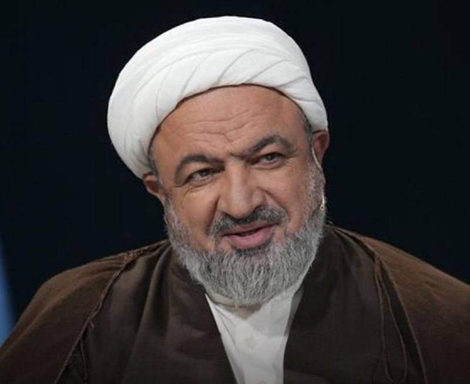

💢حمید رسایی، نماینده تهران در مجلس،

▪️جریانی «شناخته‌شده» در دولت چهاردهم که راه‌حل را «آزاد کردن و گران کردن» می‌داند، قصد دارد سهمیه بنزین هزار و ۵۰۰ تومانی و سه هزار تومانی را کاهش دهد و قیمت بنزین پنج هزار تومانی را به ۱۵ تا ۲۰ هزار تومان افزایش دهد.

💢او افزود همان جریان در دولت چهاردهم پیش‌تر با حذف ارز ترجیحی ۲۸ هزار و ۵۰۰ تومانی و گران کردن ارز، به گفته او، «بالاترین تورم پس از انقلاب ۵۷» را به مردم تحمیل کرده بود.

💢رسایی نوشت محمدباقر قالیباف با «پلمپ کردن بدون توجیه و دلیل مجلس»، راه نظارت نمایندگان بر تصمیمات دولت را بسته است. او افزود انجام تکلیف نمایندگی سخت شده، اما تلاش می‌کند مجلس را از این «مرگ تعمدی» بیرون بیاورد و جلوی این تصمیمات «عجیب» را در موقعیت «سخت و جنگی» فعلی بگیرد.

🫆:Tony

📌 @persian_trend_official
پرشین ترند | متفاوت‌ترین کانال نظامی

## Persian_Trend_Official — post 14149

  <a href="telegram/content/Persian_Trend_Official_14149_1778777928.mp4">🎬 Download video</a>

🔴مارکو روبیو:

💢نیروهای مسلح اوکراین در حال حاضر قوی‌ترین و قدرتمندترین نیروهای مسلح در سراسر اروپا هستند.

🫆:Tony

📌 @persian_trend_official
پرشین ترند | متفاوت‌ترین کانال نظامی

## Persian_Trend_Official — post 14148

  <a href="telegram/content/Persian_Trend_Official_14148_1778777930.mp4">🎬 Download video</a>

🔴 چین درخواست ترامپ برای عدم خرید نفت از ایران را رد کرد

🔹مجری فاکس‌ نیوز:
آیا در مورد حمایت چین از ایران با شی جین‌پینگ صحبت کردید؟

🔹ترامپ:
«ما در مورد آن صحبت کردیم. منظورم این است که وقتی می‌گویید «حمایت از ایران»، آنها با ما جنگ یا چیزی شبیه به این نمی‌کنند. او گفت که قرار نیست تجهیزات نظامی به ایران بدهد. این حرف بزرگی است. اما او در عین حال گفت که آنها مقدار زیادی از نفت خود را از ایران می‌خرند و دوست دارند به این کار ادامه دهند!»

🫆:Tony

📌 @persian_trend_official
پرشین ترند | متفاوت‌ترین کانال نظامی

## Persian_Trend_Official — post 14147

  

ٖغریب‌آبادی در بریکس: امارات متجاوز است نه ایران؛۱۳۰ هزار هدف غیرنظامی مورد حمله با مشارکت امارات /مستندات را به شورای امنیت ارسال کرده‌ایم

غریب‌آبادی در پاسخ به ادعای وزیر مشاور امارات مبنی بر متجاوز بودن ایران، گفت:

🔹امارات خود متجاوز است، نه ایران. زیرا امارات نقش قابل توجهی در حمایت و تسهیل تجاوز نظامی علیه ایران ایفا کرده است.

🔹استناد به قطعنامه ۱۹۷۴ مجمع عمومی سازمان ملل؛ هر کشوری که به متجاوزین تسهیلات و خدمات دهد، اقدامش برابر با تجاوز است، نه صرفا کمک به متجاوز.

🔹ایران به تمامی پایگاه‌های آمریکا و تأسیسات مرتبط با آمریکا در امارات حمله کرد. این اقدام مطابق با منشور ملل متحد و در چارچوب حق دفاع مشروع بود. ایران پیش از حمله، به امارات هشدار داده بود که در صورت کمک به متجاوز، تأسیساتشان هدف قرار می‌گیرد.

🔹در جریان تجاوز با مشارکت امارات، ۱۳۰ هزار هدف غیرنظامی مورد حمله قرار گرفت و بیش از ۴ هزار غیرنظامی به شهادت رسیدند.

🫆:Tony

📌 @persian_trend_official
پرشین ترند | متفاوت‌ترین کانال نظامی

## Persian_Trend_Official — post 14146

  

🔴 روسیه یکی از سنگین‌ترین حملات خود را علیه اوکراین انجام داد 💢گزارش‌ها حاکی است روسیه طی ۲۴ ساعت گذشته یکی از بزرگ‌ترین حملات هوایی خود از آغاز جنگ را علیه اوکراین انجام داده است. 💢بر اساس اطلاعات منتشرشده: ▪️ بیش از ۱۴۰۰ پهپاد در این حمله استفاده شده…

## RadioFarda — post 157189

  <a href="https://t.me/radiofarda/157189">📎 Download file</a>

چرا عمومی شدن سفر نتانیاهو به امارات، برای اسرائیل مهم است؟ گفت‌وگو با حبیب حسینی‌فرد

🔸آیا بنیامین نتانیاهو نخست‌وزیر اسرائیل در میانه جنگ با ایران به امارات متحده عربی سفر کرده است؟ پاسخ دفتر نخست‌وزیر اسرائیل به این پرسش مثبت است اما وزارت خارجه امارات متحده عربی در بیانیه‌ای ادعای دفتر بنیامین نتانیاهو، در این زمینه را تکذیب کرده است. دفتر نخست‌وزیر اسرائیل با اعلام خبر سفر گفته بود دیدار به یک «پیشرفت تاریخی» در روابط میان دو کشور منجر شده است. اما ابوظبی با تکذیب آن می‌گوید روابط امارات با اسرائیل «علنی» است و «بر پایه توافقات غیرشفاف یا غیررسمی بنا نشده است». خبر پیرامون این سفر و تکذیب آن در میانه گزارش‌هایی منتشر شده که از حمله تلافی‌جویانه امارات متحده عربی به ایران و همچنین استفاده این کشور از سامانه ضدموشکی گنبد آهنین اسرائیل مورد توجه قرار گرفته است. ارزیابی حبیب حسینی‌فرد تحلیلگر امور بین‌الملل را در آلمان درباره این تحولات بشنوید.

@RadioFarda

## RadioFarda — post 157188

  <a href="https://t.me/radiofarda/157188">📎 Download file</a>

«همزیستی» با محکومان به اعدام در گفت‌وگو با اسماعیل عبدی

🔸زندگی ایرانی گویی با نام زندان گره خورده‌ است. هر روز خبری از بازداشت، آزادی و اعدام در میان سرخط‌ها به چشم می‌خورد. اما زندانی که ما درباره آن می‌شنویم با زندانی که یک فرد محبوس پشت دیوارها و میله‌های آن تجربه می‌کند بسیار فاصله دارد و ما کمتر از تجربه روزمره زندانیان مطلع می‌شویم. در این روزها که هر روز خبر از اجرای یک یا چند حکم اعدام منتشر می‌شود با یک زندانی سیاسی پیشین درباره این تجربه گفت‌وگو کرده‌ایم که تجربه هم‌بندی و زندگی با محکومان به اعدام را از جمله در بند ۳۵۰ زندان اوین داشته است؛ اسماعیل عبدی دبیرپیشین کانون صنفی معلمان تهران بوده و حدود ده سال از زندگی خود را در زندان‌های ایران سپری کرده و هم اکنون ساکن شهر فرانکفورت در آلمان است.

@RadioFarda

## RadioFarda — post 157187

  <a href="https://t.me/radiofarda/157187">📎 Download file</a>

📻بشنوید: ایستگاه ۱۹ با رادیوفردا، ۲۴ اردیبهشت ۱۴۰۵

@RadioFarda

## RadioFarda — post 157186

  <a href="https://t.me/radiofarda/157186">📎 Download file</a>

🔸در این کافه فردا به بحران صنعت گردشگری در دوران آتش‌بس، ازدواج جان‌فداها در میدان امام حسین تهران، حواشی مسابقات یوروویژن در اروپا، صحبت‌های عجیب یک نماینده مجلس در مورد بمب‌های «لازمان» و فرافکنی سخنگوی دولت در رابطه با اینترنت پرو می‌پردازیم.

🔸 برای تماس با ما می‌توانید به شناسه کافه فردا در تلگرام صوت و متن بفرستید.

📻 کافه فردا

## RadioFarda — post 157185

🔸دونالد ترامپ، رئیس‌جمهور آمریکا، روز پنجشنبه و بعد از دیدار با همتای چینی خود در پکن گفت که شی جین‌پینگ پیشنهاد داده است برای توافق با ایران و تضمین عبور و مرور کشتی‌ها از تنگه هرمز کمک کند و وعده داد تجهیزات نظامی به ایران ارسال نکند. 🔸او در گفت‌وگویی اختصاصی…

## RadioFarda — post 157184

  

🔸دونالد ترامپ، رئیس‌جمهور آمریکا، روز پنجشنبه و بعد از دیدار با همتای چینی خود در پکن گفت که شی جین‌پینگ پیشنهاد داده است برای توافق با ایران و تضمین عبور و مرور کشتی‌ها از تنگه هرمز کمک کند و وعده داد تجهیزات نظامی به ایران ارسال نکند.

🔸او در گفت‌وگویی اختصاصی با شان هنیتی، مجری شبکه فاکس‌نیوز، گفت: «رئیس‌جمهور شی مایل است توافقی حاصل شود. او واقعاً دوست دارد توافقی انجام شود. و گفت: “اگر بتوانم به هر شکلی کمک کنم، خوشحال می‌شوم کمک کنم.”»

@RadioFarda

## RadioFarda — post 157183

🔸برد کوپر، فرمانده ستاد فرماندهی مرکزی ایالات متحده (سنتکام)، اعلام کرد که صنایع موشکی، پهپادی و دریایی ایران «۹۰ درصد تضعیف شده‌اند.» 🔸او در یک جلسه استماع در سنای آمریکا گفت: «تهدید ایران به‌طور قابل‌توجهی تضعیف شده و این کشور دیگر مانند گذشته، در هیچ حوزه‌ای،…

## RadioFarda — post 157182

  

🔸برد کوپر، فرمانده ستاد فرماندهی مرکزی ایالات متحده (سنتکام)، اعلام کرد که صنایع موشکی، پهپادی و دریایی ایران «۹۰ درصد تضعیف شده‌اند.»

🔸او در یک جلسه استماع در سنای آمریکا گفت: «تهدید ایران به‌طور قابل‌توجهی تضعیف شده و این کشور دیگر مانند گذشته، در هیچ حوزه‌ای، قادر به تهدید شرکای منطقه‌ای یا ایالات متحده نیست. آنها به‌شدت تضعیف شده‌اند.»

🔸کوپر اشاره کرد که نیروهای نیابتی مسلح ایران در ۳۰ ماه پیش از جنگ اخیر، بیش از ۳۵۰ حمله علیه نیروها و دیپلمات‌های آمریکایی انجام داده بودند؛ به‌طور میانگین هر سه روز یک حمله، که در نتیجه آن چهار سرباز آمریکایی کشته شدند.

🔸این جنگ روز نهم اسفند سال گذشته با حملات آمریکا و اسرائیل به ایران آغاز شد و طی آن علی خامنه‌ای و شماری از فرماندهان و مقام‌های ارشد جمهوری اسلامی کشته شدند. ایران نیز در مقابل حملات موشکی به اسرائیل و شماری از کشورهای خاورمیانه انجام داد و تنگه هرمز را مسدود کرد.

@RadioFarda

## IranianMinds — post 20140

گیر چه عقب مونده‌هایی افتادیم

ننگ ۵۰۰ ساله روحانیت رو از تاریخ ایران پاک باید کنیم

@IranianMinds

## IranianMinds — post 20139

  <a href="telegram/content/IranianMinds_20139_1778777935.mp4">🎬 Download video</a>

این هنرمند و کمدین آمریکایی، با طنز استندآپ، ۴۷ سال حکومت ننگین جمهوری اسلامی در ایران را به سخره می‌گیرد و به‌خوبی چهره فاسد و سرکوبگر این حکومت را افشا می‌کند. او همچنین از انقلاب و مبارزه مردم ایران برای آزادی حمایت می‌کند.
درود بر آزادی‌خواهان سراسر جهان.

@IranianMinds

## IranianMinds — post 20138

  

🔴اکانت اسرائیل به فارسی:

۳۰۰۰ سال پیش، حضرت داوود اورشلیم را به پایتختی خود برگزید.
۵۹ سال پیش با آزادی بخش شرقی شهر، پایتخت یهودیان زیر پرچم اسرائیل دوباره یکپارچه گشت.
این شهر قلب تپنده یهودیان و بخشی جدانشدنی از اسرائیل است.

روز اورشلیم خجسته باد.

@IranianMinds

## IranianMinds — post 20137

  <a href="telegram/content/IranianMinds_20137_1778777937.mp4">🎬 Download video</a>

ترامپ:

شی مایل است شاهد انجام یک معامله باشد. او گفت: «اگر بتوانم کمکی داشته باشم، دوست دارم کمک کنم.»

هر کسی که این مقدار نفت می‌خرد، دوست دارد تنگه هرمز را باز ببیند.

@IranianMinds

## IranianMinds — post 20136

🔴سنتکام:

امارات، بحرین، عربستان، کویت، اردن و اسرائیل در عملیات آمریکا شرکت کردند.

@IranianMinds

## IranianMinds — post 20135

🔴حمید رسایی:

دولت می‌خواهد قیمت بنزین را تا ۲۰ هزار تومان افزایش بدهد.

@IranianMinds

## IranianMinds — post 20134

🔴ترامپ به فاکس‌نیوز:

رهبر چین پیشنهاد داده است که در موضوع ایران کمک کند و همچنین وعده داده که به ایران تجهیزات نظامی منتقل نکند. او می‌خواهد که تنگه هرمز باز بماند.

@IranianMinds

## BBCPersian — post 281040

🔻ونگارد: کشتی توقیف شده از سوی ایران یک «انبار مهمات شناور» است

🔻پیشتر در مورد توقیف یک کشتی در نزدیکی امارات گزارش کرده بودیم که اکنون جزئیات بیشتری در مورد آن منتشر شده است.

به گزارش شرکت مدیریت ریسک دریایی «ونگارد»، یک کشتی که به عنوان «انبار مهمات شناور» در دریای عمان فعالیت می‌کرده، توسط نیروهای نظامی ایران توقیف شده است.

سازمان عملیات تجارت دریایی بریتانیا اعلام کرد که این کشتی اکنون «در مسیر آب‌های سرزمینی ایران» قرار دارد.

بی‌بی‌سی وریفای با بررسی داده‌های ردیابی کشتی‌ها از سامانه «مارین ترافیک» تایید کرده که این شناور که ونگارد آن را «هویی چوان» با پرچم هندوراس معرفی کرده، آخرین بار روز چهارشنبه در فاصله ۷۰ کیلومتری شمال شرق فجیره در امارات متحده عربی موقعیتش را مخابره کرده است.

اپراتورهای «هویی چوان» به ونگارد گفته‌اند که این کشتی به عنوان اسلحه‌خانه شناور فعالیت می‌کرده و در آن برای شرکت‌های امنیتی که از کشتی‌ها در برابر حملات دزدان دریایی محافظت می‌کنند، سلاح نگهداری می‌شده است.

بی‌بی‌سی وریفای نمی‌تواند تایید کند چه محموله‌ای در این کشتی بوده یا در اختیار چه کسانی بوده است.

بی‌بی‌سی پیشتر گزارش داده بود که این گونه شناورها در دریای سرخ، خلیج عدن و دریای عمان مستقر می‌شوند تا محافظان امنیتی بتوانند به راحتی سلاح و مهمات خود را تحویل گرفته یا تحویل دهند.

https://bbc.in/438NvYU
@BBCPersian

## BBCPersian — post 281039

  

🔻دونالد ترامپ می‌گوید که شی جین‌پینگ، رئیس‌جمهور چین، پیشنهاد داده تا پکن برای بازگشایی تنگه هرمز کمک کند.

آقای ترامپ،‌ پس از مذاکراتش در پکن به فاکس نیوز گفت که آقای شی به او گفته «به هر شکلی که بتواند مایل به این کار است.»

او افزود که رئیس‌جمهور چین همچنین به او اطمینان داده که پکن هیچ کمک نظامی به ایران در جنگ با اسرائیل و آمریکا ارسال نخواهد کرد.

پیش‌تر، شی جین‌پینگ در ضیافت رسمی به افتخار آقای ترامپ گفته بود که آمریکا و چین باید «شریک باشند، نه رقیب» و روابط دو کشور را «مهم‌ترین رابطه جهان» توصیف کرده بود.

آقای ترامپ نیز لحن مثبتی در قبال این دیدار داشت و از رهبر چین برای سفر به کاخ سفید در ماه سپتامبر دعوت کرد.

دو رئیس‌جمهور حدود دو ساعت گفت‌وگو کردند؛ مذاکراتی که کاخ سفید آن را «مثبت» توصیف کرده و گفته تمرکز آن بر تقویت روابط اقتصادی بوده است.

📷Getty Images
https://bbc.in/4uaHPJP

@BBCPersian

## BBCPersian — post 281038

  

‌🔻دریاسالار برد کوپر، فرمانده سنتکام، طی یک جلسه استماع در مورد جنگ با ایران در سنای آمریکا گفت که توانایی ایران برای تهدید همسایگان خود و منافع ایالات متحده در منطقه به طور چشمگیری کاهش یافته است.

او گفت عملیات نظامی ما زیرساخت صنعتی توانمندی‌های موشکی، دریایی و ساخت پهپاد ایران را تا ۹۰ درصد تضعیف کرده و بازسازی نیروی دریایی این کشور دستکم یک نسل به طول می‌انجامد.

آقای کوپر در جلسه کمیته سنا گفت: «تهدید ایران به طور قابل توجهی کاهش یافته است و آنها دیگر به روش‌هایی که پیش از این قادر بودند، در همه حوزه‌ها، شرکای منطقه‌ای یا ایالات متحده را تهدید نمی‌کنند. آنها به طور قابل ملاحظه‌ای تضعیف شده‌اند.»

او در عین حال گفت ایران به خاطر وسعت و قابلیت‌هایش همچنان یک تهدید باقی مانده است.

📷Reuters
https://bbc.in/4dGZanU

@BBCPersian

## BBCPersian — post 281037

  <a href="telegram/content/BBCPersian_281037_1778777940.mp4">🎬 Download video</a>

🔻کارشناسان می‌گویند در پی جنگ با ایران و درگیری و مشغول شدن نیروهای دریایی با آن، دزدی دریایی در آبهای سومالی دوباره در حال افزایش است.

دزدان دریایی سومالی دست‌کم سه کشتی بزرگ تجاری را برای اخاذی و باج‌گیری ربوده‌اند. از جمله نفتکش آنر۲۵ که کاپیتانش اشاری سامادیکون اهل اندونزی است.

همسر کاپیتان می‌گوید که او به دزدان دریایی گفته که مسلمان است و از آنها خواسته به خاطر هم‌کیشی به او و خدمه‌اش رحم کنند.

@BBCPersian

## BBCPersian — post 281036

  

‌🔻مصطفی پوردهقان، دبیر دوم کمیسیون صنایع و معادن مجلس گفته است که مصوبه شورای عالی امنیت ملی در مورد اینترنت پرو در اجرا به «قلکی برای همراه اول، ایرانسل و رایتل» تبدیل شده است.

او در مورد انتخاب محمدرضا عارف، به عنوان رئیس ستاد ویژه ساماندهی فضای مجازی گفت که «مجلس در این مورد چیزی نمی‌داند» و این حکم مسعود پزشکیان، رئیس‌جمهور را «تزئينی» خوانده است.

به گفته این نماینده مجلس این قبیل اقدامات بیشتر جنبه «روانی » دارد و قرار نیست که «اتفاق خاصی» در این مورد بیفتد.

آقای پوردهقان همچنین گفته است که بدتر از قطعی اینترنت، تعطیلی مجلس است و اکنون مجلس با بسیاری از وزرای دولت به لحاظ نظارتی هیچ ارتباط خاصی درمورد عملکردشان ندارد که یکی از همین موارد موضوع اینترنت است و هنوز یک جلسه ویژه نداریم که فردی بیاید و شرایط را توضیح دهد.

بیش از ۷۰ روز است که دسترسی به اینترنت جهانی در ایران قطع شده است.

پس از اعتراضات دی ۱۴۰۴ و سپس جنگ آمریکا و اسرائیل با ایران، دسترسی به اینترنت جهانی به طور کامل قطع شد.

لینک خبر کامل:

📷NurPhoto via Getty Images
https://bbc.in/492rMp0

@BBCPersian

## Dirty_Kids — post 389458

ده‌هزار تا عکس داره یکی از یکی زیباتر

@Dirty_Kids 👻

## Dirty_Kids — post 389456

ریدم=)))))))))

@Dirty_Kids 👻

## Dirty_Kids — post 389455

✖️ سایت بین المللی bet120x 
✖️  
👍دارای مجوز رسمی Gambling Judge سوئد
👍       
💳شارژ حساب از طریق ارز و یووچر و پرمیوم ووچر 
💳تسویه حساب دلاری سریع 💊بیمه شرط میکس 
⚠️فروش شرط 
🔔ویرایش شرط                    
3️⃣
2️⃣ 
🎁20%هدیه واریز از طریق ارز و ووچر ┅━━━━━━━━━━━…

## Dirty_Kids — post 389454

  

✖️ سایت بین المللی bet120x ✖️ 👍دارای مجوز رسمی Gambling Judge سوئد👍     💳شارژ حساب از طریق ارز و یووچر و پرمیوم ووچر💳تسویه حساب دلاری سریع💊بیمه شرط میکس⚠️فروش شرط🔔ویرایش شرط                    3️⃣2️⃣🎁20%هدیه واریز از طریق ارز و ووچر┅━━━━━━━━━━━🎁 10%برگشت باخت به صورت روزانه 🎁 10%برگشت باخت به صورت هفتگی 🎁10%برگشت باخت به صورت ماهانه💻ادرس ورود به سایت:https://bet120x.com/fa/?btag=971470➖➖➖➖➖   👈 آموزش واریز و برداشت دلاری👉🔪کانال اطلاع رسانی:👇✈️https://t.me/+1Wv5nGY_a54xNzlk

## Dirty_Kids — post 389453

گیر چه عقب مونده‌هایی افتادیم

ننگ ۵۰۰ ساله روحانیت رو از تاریخ ایران پاک باید کنیم

@Dirty_Kids 👻

## Dirty_Kids — post 389452

  <a href="telegram/content/Dirty_Kids_389452_1778777943.mp4">🎬 Download video</a>

هنوز رد خونت روشه ...
#پرهام_آقامحمدی

@Dirty_Kids 👻

## Dirty_Kids — post 389451

  

🌪وقتی اینترنت طوفانیه... کافیه بادبان ها رو بکشی تا

⚫️با بالاترین کیفیت ممکن
⚡️ 

⚫️100 هزار تومان شارژ هدیه 
🎁

⚫️پایین ترین قیمت گیگی 250
🌐 

⚫️و ارائه پورسانت %10 در ازای هر معرفی
💼

بتونی یه اتصال پایدار با پشتیبانی 24 ساعته داشته باشی
🚀

بادبان راهتو باز می‌کنه
⛵️

G24

🛡@BadBan_VPN | کانال 

🤖@BadBan_VPNBot | ربات 

📞@BadBan_VPNSupport | پشتیبانی

## Dirty_Kids — post 389450

  <a href="telegram/content/Dirty_Kids_389450_1778777945.mp4">🎬 Download video</a>

وضعیت دیشبِ خیابون فرشته تهران:
دعوا سر دختر

طهران الان قسمت بندی شده
یه گوشه حی‌در حی‌در میکنن عرزشیا هپی بشن، یه گوشه پروپاگاندا، یجا برای بچه پولدارا و...

@Dirty_Kids 👻

## Dirty_Kids — post 389449

‏از روزی که ‎#رضاشاه_کبیر سر از خاک بیرون آورد جمهوری اسهالی روی خوش ندید.

@Dirty_Kids 👻

## Dirty_Kids — post 389448

ShirOKhorshid-2026.05.14.apk

## Dirty_Kids — post 389447

  <a href="telegram/content/Dirty_Kids_389447_1778777946.mp4">🎬 Download video</a>

مراد؛ ویروس هانتا 😂🤌⁩⁩

@Dirty_Kids 👻

## Dirty_Kids — post 389446

  <a href="https://t.me/Dirty_Kids/389446">📎 Download file</a>

دقایقی قبل این اپلیکیشن بنام "شیر و خورشید" که نسخه تغییر یافته سایفون هستش تو تلگرام درحال وایرال شدنه و میگن خیلی خوب کار میکنه.

مهم: اگر این نسخه رو نصب کنید دیگه دردسر ستاپ کردن MITM و... ندارید!
این نسخه حدودا یک ساعت پیش توسط برنامه‌نویس شیر و خورشید آپدیت شد و به راحتی می‌تونید طبق این آموزش بهش وصل بشید:
1- وارد اپلیکیشن شیر و خورشید(آخرین نسخه که امروز منتشر شده) می‌شید
2- وارد بخش Options میشید از نوار بالا
3- روی More Options کلیک میکنید
4- گزینه‌ی Connection Protocol رو قرار میدید روی CDN Fronting
5- میرید و عادی کانکت میشید و به راحتی وصل میشه.

+ من تست نکردم ولی دیدم میگن جوابه

@Dirty_Kids 👻

## Hranews — post 112944

مهدی شفاخواه، فعال حوزه آموزش و حمایت از کودکان کار بازداشت شد❗️❗️❗️❗️❗️– مهدی شفاخواه، ، فعال حوزه آموزش و حمایت از کودکان کار و ساکنان مناطق محروم، روز سه‌شنبه ۲۲ اردیبهشت‌ماه، توسط نیروهای نیروهای امنیتی بازداشت و به مکان نامعلومی منتقل شد.#مهدی_شفاخواهادامه مطلب ↘️ @hranews_bot تماس ✉️ -  @Hranews  کانال هرانا 🆑

## configx2ray — post 38844

دوستان چند عدد سرور اختصاصی 3 گیگ هم موجوده قیمت با بیشترین تخفیف تقدیم میشه 490 هزار تومان
❤️

سرور کاملا تضمینی میباشد بدونه ضریب همراه با ساب جهت استعلام حجم مصرفیتون
🌟

نیاز داشتید میتونید به ایدی زیر پیام بدید
⭐️ :

ID : https://t.me/serverfast2 
💠

## configx2ray — post 38843

2.22.151.4 23.67.253.11 23.67.253.24 23.67.253.55 23.67.253.77 23.67.253.101 23.67.253.120 23.53.35.146 23.53.35.158 23.53.35.171 23.53.35.182 23.53.35.194 23.53.35.207 184.26.163.12 184.26.163.24 184.26.163.38 184.26.163.51 184.26.163.66 184.26.163.79 2.16.186.20…

## configx2ray — post 38842

  <a href="telegram/content/configx2ray_38842_1778777948.jpg">🎬 Download video</a>

2.22.151.4
23.67.253.11
23.67.253.24
23.67.253.55
23.67.253.77
23.67.253.101
23.67.253.120
23.53.35.146
23.53.35.158
23.53.35.171
23.53.35.182
23.53.35.194
23.53.35.207
184.26.163.12
184.26.163.24
184.26.163.38
184.26.163.51
184.26.163.66
184.26.163.79
2.16.186.20
2.16.186.31
2.16.186.44
2.16.186.58
2.16.186.69
2.16.186.81
23.195.81.72
23.195.81.84
23.195.81.96
23.195.81.108
104.124.148.191
104.124.148.203
23.32.5.18
23.32.5.44
23.32.5.71
23.32.5.96
23.32.5.118
23.32.5.141
23.32.5.167
23.32.5.193
23.32.5.214
23.32.5.236
96.16.97.82
96.16.97.104
96.16.97.126
96.16.97.148
96.16.97.169
96.16.97.191
184.50.87.22
184.50.87.44
184.50.87.66
184.50.87.88
92.122.123.128
2.19.204.87
2.19.204.137
2.19.204.144
2.19.204.145
2.19.204.170
2.19.204.184
2.19.204.185
2.19.204.202
2.19.204.210
138.201.54.122
2.22.151.4
2.22.151.9
2.22.151.12
2.22.151.13
2.22.151.15
2.22.151.17
2.22.151.20
2.22.151.22
2.22.151.23
2.22.151.32
2.22.151.36
2.22.151.37
2.22.151.39
2.22.151.47
2.22.151.51
2.22.151.53
2.22.151.54
2.22.151.58
2.22.151.60
2.22.151.62
2.22.151.135
2.22.151.138
2.22.151.139
2.22.151.141
2.22.151.142
2.22.151.143
2.22.151.144
2.22.151.146
2.22.151.149
2.22.151.150
2.22.151.151
2.22.151.152
2.22.151.153
2.22.151.154
2.22.151.155
2.22.151.156
2.22.151.157
2.22.151.158
2.22.151.159
2.22.151.161
2.22.151.162
2.22.151.163
2.22.151.164
2.22.151.168
2.22.151.169
2.22.151.170
2.22.151.171
2.22.151.173
2.22.151.175
2.22.151.179
2.22.151.181
2.22.151.182
2.22.151.183
2.22.151.184
2.22.151.185
2.22.151.186
2.22.151.188
2.22.151.189
2.22.151.190
2.22.151.191
2.22.151.193
2.22.151.194
2.22.151.195

پی های جدید همشونو با هم کپی کنید و جایگزین ای پی های قبلی تو CDN edge IPs کنید
✅

لینک فایل تلگرامی دانلود نسخه جدید شیر و خورشید 👇

https://t.me/ConfigX2ray0/2239

لینک دانلود داخلی نسخه جدید شیر و خورشید ( بدون فیلترشکن باز کنید لینک رو)👇

https://files.bokhary.fun/dump/%23%23%20Apps%20%23%23/ShirOKhorshid-2026.05.14.apk

لینک آموزش نسخه جدید شیر و خورشید 👇

https://t.me/ConfigX2ray0/2239

لینک آموزش اضافه کردن ای پی به CDN edge IPs 👇

https://t.me/ConfigX2ray0/2244

Channel : https://t.me/ConfigX2ray 
🌟

## configx2ray — post 38841

@ConfigX2ray.txt

## configx2ray — post 38840

  <a href="https://t.me/ConfigX2ray/38840">📎 Download file</a>

لیست چند هزارتایی آیپی های تمیز.

این لیست باز کنید کامل کپی کنید داخل سایفون
Channel : https://t.me/ConfigX2ray

## configx2ray — post 38839

ShirOKhorshid-2026.05.14.apk

## configx2ray — post 38837

  <a href="https://t.me/ConfigX2ray/38837">📎 Download file</a>

کانفیگ برای Npv tunnel ⭕️

به هیچ وج دانلود نزنید باهاش
❤️

رمز فایل : @ConfigX2ray

Channel : https://t.me/ConfigX2ray

## configx2ray — post 38836

ستینگ پروکسی گزینش نباید فعال باشه
پروتکل بزار رو Cdn
بعد برو پایینتر
Cdn edge ips
ایپی هارو اضاف کن

2.22.151.4
23.67.253.11
23.67.253.24
23.67.253.55
23.67.253.77
23.67.253.101
23.67.253.120
23.53.35.146
23.53.35.158
23.53.35.171
23.53.35.182
23.53.35.194
23.53.35.207
184.26.163.12
184.26.163.24
184.26.163.38
184.26.163.51
184.26.163.66
184.26.163.79
2.16.186.20
2.16.186.31
2.16.186.44
2.16.186.58
2.16.186.69
2.16.186.81
23.195.81.72
23.195.81.84
23.195.81.96
23.195.81.108
104.124.148.191
104.124.148.203
23.32.5.18
23.32.5.44
23.32.5.71
23.32.5.96
23.32.5.118
23.32.5.141
23.32.5.167
23.32.5.193
23.32.5.214
23.32.5.236
96.16.97.82
96.16.97.104
96.16.97.126
96.16.97.148
96.16.97.169
96.16.97.191
184.50.87.22
184.50.87.44
184.50.87.66
184.50.87.88
92.122.123.128
2.19.204.87
2.19.204.137
2.19.204.144
2.19.204.145
2.19.204.170
2.19.204.184
2.19.204.185
2.19.204.202
2.19.204.210
138.201.54.122
2.22.151.4
2.22.151.9
2.22.151.12
2.22.151.13
2.22.151.15
2.22.151.17
2.22.151.20
2.22.151.22
2.22.151.23
2.22.151.32
2.22.151.36
2.22.151.37
2.22.151.39
2.22.151.47
2.22.151.51
2.22.151.53
2.22.151.54
2.22.151.58
2.22.151.60
2.22.151.62
2.22.151.135
2.22.151.138
2.22.151.139
2.22.151.141
2.22.151.142
2.22.151.143
2.22.151.144
2.22.151.146
2.22.151.149
2.22.151.150
2.22.151.151
2.22.151.152
2.22.151.153
2.22.151.154
2.22.151.155
2.22.151.156
2.22.151.157
2.22.151.158
2.22.151.159
2.22.151.161
2.22.151.162
2.22.151.163
2.22.151.164
2.22.151.168
2.22.151.169
2.22.151.170
2.22.151.171
2.22.151.173
2.22.151.175
2.22.151.179
2.22.151.181
2.22.151.182
2.22.151.183
2.22.151.184
2.22.151.185
2.22.151.186
2.22.151.188
2.22.151.189
2.22.151.190
2.22.151.191
2.22.151.193
2.22.151.194
2.22.151.195

لیست ایپی های تست شده برای متود جدید سایفون 
🌟

همشو باهم وارد کنید داخل برنامه 
❤️

Channel : https://t.me/ConfigX2ray

## configx2ray — post 38835

2.23.227.196 2.17.147.11 2.18.64.9 2.18.64.4 2.18.64.5 2.22.114.98 95.100.153.184 95.101.27.196 2.17.96.131 95.101.137.74 95.101.78.25 2.23.245.35 2.16.168.107 2.17.100.250 2.16.245.188 2.17.100.130 95.100.110.28 2.22.89.43 2.18.63.33 95.100.153.186…

## configx2ray — post 38834

2.23.227.196 2.17.147.11 2.18.64.9 2.18.64.4 2.18.64.5 2.22.114.98 95.100.153.184 95.101.27.196 2.17.96.131 95.101.137.74 95.101.78.25 2.23.245.35 2.16.168.107 2.17.100.250 2.16.245.188 2.17.100.130 95.100.110.28 2.22.89.43 2.18.63.33 95.100.153.186…

## manototv — post 105457

  <a href="telegram/content/manototv_105457_1778777949.mp4">🎬 Download video</a>

دونالد ترامپ در گفت‌وگو با شان هنیتی گفت شی جین‌پینگ، رئیس‌جمهوری چین، متعهد شده به جمهوری اسلامی تجهیزات نظامی ارائه نکند.

ترامپ گفت: «او گفت قرار نیست تجهیزات نظامی بدهد؛ این حرف بزرگی است.»

رئیس‌جمهوری آمریکا در ادامه افزود چین همچنان بخش زیادی از نفت خود را از ایران خریداری می‌کند و مایل است این روند ادامه پیدا کند.

ترامپ همچنین گفت شی جین‌پینگ خواهان باز ماندن تنگه هرمز و جلوگیری از اختلال در عبور و مرور کشتی‌هاست.

## manototv — post 105456

  <a href="telegram/content/manototv_105456_1778777950.mp4">🎬 Download video</a>

‌
دونالد ترامپ، رئیس‌جمهوری آمریکا، در گفت‌و‌گو با شان هنیتی، خبرنگار و مجری فاکس‌نیوز گفت شی جین‌پینگ، رئیس‌جمهوری چین، خواهان دستیابی به توافق و باز ماندن تنگه هرمز است.

ترامپ گفت: «رئیس‌جمهوری شی دوست دارد توافقی حاصل شود. او گفت اگر بتواند کمکی بکند، مایل است کمک کند.»

رئیس‌جمهوری آمریکا همچنین با اشاره به خرید نفت ایران از سوی چین افزود: «هر کسی که این مقدار نفت می‌خرد، بدیهی است نوعی رابطه دارد.»

ترامپ در ادامه گفت شی جین‌پینگ مایل است تنگه هرمز باز بماند.

## manototv — post 105455

  <a href="telegram/content/manototv_105455_1778777951.mp4">🎬 Download video</a>

مارکو روبیو، وزیر خارجه آمریکا، گفت دونالد ترامپ موضوع ایران را در گفت‌وگو با مقام‌های چین مطرح کرده و این موضوع «اهمیت زیادی» داشته است.

روبیو گفت طرف چینی اعلام کرده با «نظامی‌سازی تنگه هرمز» و همچنین ایجاد سیستم دریافت عوارض از کشتی‌ها در این آبراه مخالف است.

وزیر خارجه آمریکا افزود: «این موضع ما هم هست.»

## alonews — post 119984

  <a href="telegram/content/alonews_119984_1778777952.mp4">🎬 Download video</a>

👈حزب‌الله دو سرباز اسرائیلی رو که داشتن فرار میکردن هدف گرفت و با پهپاد کُشت

✅ @AloNews خبر جنگ

## alonews — post 119983

👈گزارش واشنگتن پست از یک ارزیابی اطلاعاتی محرمانه ایالات متحده: چین در نتیجه جنگ جاری آمریکا با ایران، در زمینه های نظامی، اقتصادی، دیپلماتیک و رسانه ای، دستاوردهای استراتژیک گسترده‌ای را به هزینه ایالات متحده به دست می آورد ، در حالی که نگرانی فزاینده‌ای در وزارت دفاع ایالات متحده در مورد پیامدهای ژئوپلیتیکی این درگیری وجود دارد

🔴پکن از جنگ با ایران برای تقویت جایگاه بین‌المللی خود استفاده کرد، در حالی که واشنگتن بخش قابل توجهی از قابلیت‌های نظامی و اقتصادی خود را از بین برد

✅ @AloNews خبر جنگ

## alonews — post 119982

👈رسایی؛ نماینده‌ی مجلس:
دولت قصد داره میزان سهمیه ماهانه بنزین ۱۵۰۰ تومنی و ۳۰۰۰ تومنی رو کاهش بده و قیمت بنزین ۵۰۰۰ تومنی رو هم به ۲۰۰۰۰ تومن برسونه.

✅ @AloNews خبر جنگ

## alonews — post 119981

  

🌟 اشتراک v2ray استارلینک

🗯گیگی 150,000 تومان

🔗لینک ساب برا چک کردن مصرف و حجمتون

🔥سرعت و کیفیت بالا

✅ پشتیبانی دائم

📱جهت خرید پیام بدین : @v2safeBot

## alonews — post 119980

👈سخنگوی وزارت خارجه پاکستان: اسلام‌آباد از نقش چین در میانجی‌گری برای حل‌وفصل تنش‌ها میان ایران و آمریکا حمایت می‌کند.

✅ @AloNews خبر جنگ

## alonews — post 119979

👈واردات نفت خام آمریکا از ونزوئلا در هفته گذشته به بالاترین حد خود در هفت سال گذشته رسید.

✅ @AloNews خبر جنگ

## alonews — post 119978

👈وزیر دفاع بریتانیا : بعد از این‌که روسیه حملات سنگینی به اوکراین کرده

🔴قراره ارسال سامانه‌های پدافند هوایی به کی‌یف رو سریع‌تر انجام بدیم

✅ @AloNews خبر جنگ

## alonews — post 119977

👈ایالات متحده موفق شد اورانیوم بسیار غنی شده را از رآکتور هسته ای برای اهداف تحقیقاتی در ونزوئلا خارج کند

✅ @AloNews خبر جنگ

## alonews — post 119976

👈شبکه MS NOW: شرکت‌های خصوصی چینی در حال بررسی فروش موشک‌های ضدهوایی به ایران هستند

✅ @AloNews خبر جنگ

## alonews — post 119975

👈رونگ هوان»، فعال رسانه‌ای و تحلیلگر سیاسی چینی، تأکید کرد که پکن مناسب‌ترین و توانمندترین طرف برای ایفای نقش میانجیگری فعال بین واشنگتن و تهران است

🔴 او اشاره کرد که بهبود روابط چین و آمریکا در ماه‌های اخیر، افق‌های جدیدی را برای ترغیب دو طرف به بازگشت به میز مذاکرات مستقیم گشوده است.

🔴 این تحلیلگر سیاسی توضیح داد که منطقه در وضعیت تنش‌آفرینی متقابلی به سر می‌برد که نیازمند ابتکاری از سوی چین است تا نردبان کاهش تنش را فراهم آورد که آبروی هر دو طرف حفظ شود و به وضعیت بی‌ثباتی که به ضرر منافع همگان است، پایان دهد.

✅ @AloNews خبر جنگ

## alonews — post 119974

👈برد کوپر: ما درگیر اقدامات خصمانه علیه ایران نیستیم، بلکه آتش بس داریم

✅ @AloNews خبر جنگ

## alonews — post 119973

👈وزیر جنگ پیت هگستث: با وجود آنچه ممکن است در رسانه‌ها بشنوید، آمریکا در حال افول نیست. ما همچنان قوی‌ترین قدرت نظامی روی زمین هستیم، اما این قدرت نیاز به تجدید دارد.

🔴با تهدیدات جهانی که به طور مداوم در حال تحول هستند، زمان آن رسیده است که سرمایه‌گذاری ۱.۵ تریلیون دلاری، یک پیش‌پرداخت نسلی، انجام شود.

🔴این سرمایه‌گذاری تضمین می‌کند که ایالات متحده برای نسل‌های آینده قدرت غالب و بازدارندگی بی‌نظیر در برابر هر دشمنی را حفظ کند

✅ @AloNews خبر جنگ

## alonews — post 119972

👈ایلان ماسک درباره مذاکرات آمریکا و چین : من حس خوبی نسبت به این مذاکرات دارم. فکر می‌کنم نتیجه خوبی حاصل شود

✅ @AloNews خبر جنگ

## alonews — post 119971

👈ترامپ : چین موافقت کرده ۲۰۰ هواپیمای بوئینگ خریداری کنه

✅ @AloNews خبر جنگ

## alonews — post 119970

  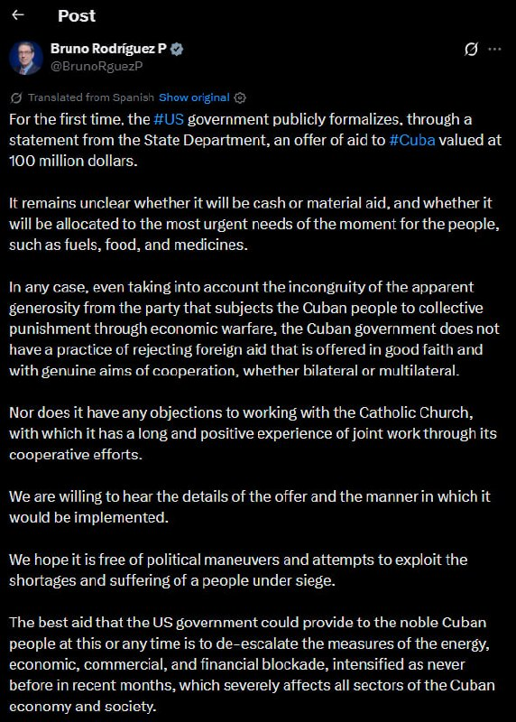

👈برونو رودریگز وزیر امور خارجه کوبا در شبکه ایکس اعلام کرد که آماده است پیشنهاد کمک ۱۰۰ میلیون دلاری ایالات متحده را بررسی کند

✅ @AloNews خبر جنگ

## alonews — post 119969

👈دولت کوبا اعلام کرده است که جزیره رسماً بدون سوخت است و انتظار دارد سیستم انرژی در روزهای آینده فروپاشی کند

✅ @AloNews خبر جنگ

## alonews — post 119968

👈مجلس نمایندگان عراق با اکثریت مطلق آرا، فؤاد حسین را به عنوان وزیر خارجه در دولت جدید تأیید کرد.

✅ @AloNews خبر جنگ

## alonews — post 119967

  <a href="telegram/content/alonews_119967_1778777955.mp4">🎬 Download video</a>

👈ان‌بی‌سی: آیا رئیس‌جمهور شی از رئیس‌جمهور ترامپ خواسته است که به تایوان سلاح نفروشد؟

🔴مارکو روبیو: خب، این موضوع قبلاً مورد بحث قرار گرفته است. این موضوع در بحث امروز به طور عمده مطرح نشد. ما قبلاً موضع آن‌ها را در این باره می‌دانیم

✅ @AloNews خبر جنگ

## alonews — post 119966

👈عراقچی: امارات در حملات به ایران شریک فعال بوده است

🔴 ایران در برابر تهدیدها محکم ایستاده و سر خم نمی‌کند. آن‌ها این مسئله را دیده و تجربه کرده‌اند

🔴 در عین حال، کسانی که با زبان احترام با ایران سخن بگویند، با همان زبان پاسخ خواهند گرفت

✅ @AloNews خبر جنگ

## alonews — post 119965

👈سنتکام: امارات، بحرین، عربستان، کویت، اردن و اسرائیل در عملیات آمریکا شرکت کردند

✅ @AloNews خبر جنگ

---
📅 بروزرسانی: 1405/02/24 18:18
---

## VahidOOnLine — post 240139

  

وزارت خارجه هند اعلام کرد یک کشتی باری با پرچم این کشور پس از حمله‌ مشکوک پهپادی یا موشکی در روز چهارشنبه، در آب‌های عمان دچار آتش‌سوزی و غرق شده است.
طبق گزارش‌ها هر ۱۴ خدمه این شناور نجات یافتند.
دهلی‌نو هدف قرار دادن کشتیرانی تجاری و ملوانان غیرنظامی را غیرقابل قبول دانست و آن را محکوم کرد.
شرکت امنیت دریایی وانگارد اعلام کرد این شناور هندی پس از انفجاری مشکوک که احتمالا ناشی از حمله پهپادی یا موشکی بوده، در نزدیکی سواحل عمان غرق شده است.
‌🏁 🇬🇧 IranintlTV

🤖 @VahidOOnLine

## VahidOOnLine — post 240138

  <a href="telegram/content/VahidOOnLine_240138_1778770092.mp4">🎬 Download video</a>

وزیر نیروی جمهوری‌اسلامی نسبت به وضعیت منابع آب در تهران هشدار داده و گفته شرایط آبی پایتخت چندان مطلوب نیست.
عباس علی‌آبادی اعلام کرده توزیع نامتوازن بارش‌ها باعث شده ۱۰ استان کشور با جمعیتی بیش از ۳۵ میلیون نفر همچنان در وضعیت کمتر از نرمال قرار داشته باشند.
او با اشاره به اینکه میزان بارش‌ها نسبت به میانگین بلندمدت حدود ۴ درصد و نسبت به سال گذشته ۶۶ درصد افزایش داشته، تأکید کرده این آمار به معنی خروج از بحران نیست.
به گفته او، شش سال خشکسالی پیاپی و کاهش ذخایر آب، به‌ویژه در منابع زیرزمینی، باعث شده کسری مخازن آب سطحی و زیرزمینی همچنان یکی از چالش‌های جدی کشور باقی بماند.
‌🏁 🇬🇧 ManotoTV

🤖 @VahidOOnLine

## VahidOOnLine — post 240137

  <a href="telegram/content/VahidOOnLine_240137_1778770092.mp4">🎬 Download video</a>

♦️مارکو روبیو، وزیر امور خارجه ایالات متحده، روز پنجشنبه ۲۴ اردیبهشت اعلام کرد که واشنگتن و پکن بر سر «نظامی نشدن» تنگه هرمز توافق نظر دارند.

روبیو که در جریان سفر به پکن با ان‌بی‌سی نیوز گفتگو می‌کرد، تاکید کرد که چین با هرگونه سیستم دریافت عوارض توسط جمهوری اسلامی در این تنگه مخالف است. او تصریح کرد: «ما هرگز از سیستم عوارض ایرانی حمایت نخواهیم کرد و معتقد نیستیم آن‌ها حق مین‌گذاری در آب‌های بین‌المللی را داشته باشند».

به گفته دیپلمات ارشد آمریکا، چین همچنین از جلوگیری از دستیابی ایران به سلاح هسته‌ای حمایت می‌کند. با این حال، روبیو خاطرنشان کرد تفاوت اصلی در این است که ایالات متحده به‌طور عملی برای تحقق این اهداف اقدام می‌کند.
‌🇸🇦 Indypersian

🤖 @VahidOOnLine

## VahidOOnLine — post 240136

  <a href="telegram/content/VahidOOnLine_240136_1778770094.mp4">🎬 Download video</a>

مقامات کره جنوبی اعلام کرده‌اند که به نظر می‌رسد بعید است گروهی غیر از جمهوری‌اسلامی در حمله به یک کشتی باری کره‌ای در نزدیکی تنگه هرمز نقش داشته باشد.
این حمله در تاریخ ۴ مه به کشتی متعلق به شرکت HMM کره جنوبی انجام شد و باعث آتش‌سوزی و آسیب به بخش عقبی آن شد. کره جنوبی در حال بررسی اطلاعاتی است که آمریکا درباره این حادثه در اختیارش قرار داده است.
سئول همچنین تیم‌های کارشناسی را به دبی فرستاده تا خسارت وارد شده به کشتی را بررسی و تحقیقات فنی انجام دهند.
در حالی که جمهوری‌اسلامی هرگونه دخالت در این حمله را رد کرده، مقامات کره جنوبی می‌گویند نتیجه‌گیری نهایی پس از پایان تحقیقات اعلام خواهد شد، اما در صورت اثبات نقش تهران، اقدامات لازم انجام می‌شود.
گزارش‌ها می‌گویند آمریکا نیز بلافاصله پس از حادثه، جمهوری‌اسلامی را به دست داشتن در این حمله متهم کرده و خواستار همکاری کره جنوبی در تأمین امنیت کشتیرانی در تنگه هرمز شده بود.
‌🏁 🇬🇧 ManotoTV

🤖 @VahidOOnLine

## VahidOOnLine — post 240135

  <a href="telegram/content/VahidOOnLine_240135_1778770095.mp4">🎬 Download video</a>

همزمان با سفر ترامپ به چین، آکسیوس در گزارشی به اختلاف نظرهایی در تیم ترامپ در خصوص ایران پرداخته؛ برخی معتقدند جمهوری‌اسلامی از زمان به نفع خود استفاده می‌کند و منتظر تأثیر فشارهای سیاسی در آمریکا است. هم‌زمان افزایش قیمت نفت و نگرانی از تورم، کار دولت را برای مدیریت افکار عمومی سخت‌تر کرده است.
گزارش‌ها نشان می‌دهد مذاکرات اخیر با تهران به بن‌بست رسیده و گزینه‌های نظامی دوباره روی میز قرار گرفته‌اند؛ از عملیات دریایی در تنگه هرمز گرفته تا حملات به زیرساخت‌های ایران.
در عین حال، برخی مقامات آمریکایی می‌گویند فشار اقتصادی فعلی شاید بدون اقدام نظامی هم ایران را تحت فشار قرار دهد، هرچند ساختار سیاسی این کشور کمتر تحت تأثیر نارضایتی عمومی قرار می‌گیرد.
در مجموع، ترامپ تأکید دارد که جلوگیری از دسترسی جمهوری‌اسلامی به سلاح هسته‌ای اولویت اصلی اوست، حتی اگر پیامدهای اقتصادی و سیاسی داخلی به دنبال داشته باشد؛ موضوعی که حالا به دست دموکرات‌ها یک ابزار تبلیغاتی آماده داده است.
‌🏁 🇬🇧 ManotoTV

🤖 @VahidOOnLine

## VahidOOnLine — post 240134

  <a href="telegram/content/VahidOOnLine_240134_1778770095.mp4">🎬 Download video</a>

«جمهوری اسلامی قصد جان فاطمه سپهری را کرده»
‌🏁 🇬🇧 ManotoTV

🤖 @VahidOOnLine

## VahidOOnLine — post 240133

  <a href="telegram/content/VahidOOnLine_240133_1778770096.mp4">🎬 Download video</a>

قیمت چیپس و پفک در بازار طی یک سال گذشته جهش چشمگیری داشته است.
بهای چیپس‌های ۶۰ گرمی که سال گذشته حدود ۲۵ هزار تومان بود، حالا به ۶۰ تا ۶۵ هزار تومان رسیده؛ افزایشی حدود ۱۶۰ درصدی.
قیمت چیپس‌های بزرگ‌تر نیز برای بسیاری از خریداران شوکه‌کننده شده است. هر بسته چیپس ۱۳۸ گرمی بسته به برند، بین ۱۳۰ تا ۱۴۰ هزار تومان قیمت دارد و چیپس‌های ۲۴۵ گرمی به حدود ۲۵۰ هزار تومان رسیده‌اند. برخی بسته‌های بزرگ‌تر نیز بین ۳۰۰ تا ۴۰۰ هزار تومان فروخته می‌شوند.
افزایش قیمت در بازار پفک و اسنک هم ادامه دارد. قیمت پفک ۱۱۰ گرمی از حدود ۴۵ هزار تومان به ۱۱۵ هزار تومان رسیده و اسنک‌های پنیری و طلایی حتی گران‌تر هستند. هر بسته اسنک طلایی اکنون حدود ۱۵۰ هزار تومان قیمت دارد و کرانچی ۱۰۰ گرمی نیز به حدود ۸۰ هزار تومان رسیده است.
‌🏁 🇬🇧 ManotoTV

🤖 @VahidOOnLine

## VahidOOnLine — post 240132

  <a href="telegram/content/VahidOOnLine_240132_1778770097.mp4">🎬 Download video</a>

♦️برخی از مشهورترین مدیران ارشد آمریکایی از جمله ایلان ماسک، میلیاردر و بنیان‌گذار تسلا و اسپیس‌ایکس همراه با دونالد ترامپ به چین سفر کرده‌اند.
خبرگزاری رویترز تصاویری از ورود آنها به یک نشست را منتشر کرده است و در این تصاویر فرزند ایلان ماسک، که با نام «ایکس» از او یاد می‌شود همراه با پدرش دیده می‌شود.
ماسک در دیدارهای رسمی خود، از جمله در ضیافت‌های شام یا بازدید از کارخانه‌های تسلا، پسرش را همراه خود می‌برد. تحلیل‌گران این اقدام را نوعی «نرم‌خویی در دیپلماسی» می‌بینند که چهره‌ای انسانی‌تر و صمیمی‌تر از این ثروتمند جنجالی در برابر مقامات چینی می‌سازد.
مدیران ارشد شرکت‌های آمریکایی دستاورد این سفر به پکن را «عالی» اعلام کرده‌اند.
 پیش از این سفر، سخنگوی کاخ سفید گفته بود انتظار می‌رود گفت‌وگوها شامل ادامه کار روی «شورای تجارت آمریکا و چین» و «شورای سرمایه‌گذاری آمریکا و چین» باشد.
‌🇸🇦 Indypersian

🤖 @VahidOOnLine

## VahidOOnLine — post 240131

  

چارلز سوم، پادشاه بریتانیا، روز پنج‌شنبه از محله‌ یهودی‌نشین گولدرز گرین در لندن بازدید کرد.
ماه گذشته در این محله یک نفر با چاقو دو مرد یهودی را زخمی کرد.
طبق بیانیه کاخ باکینگهام، هدف این بازدید «تاکید دوباره بر حمایت قاطع او» از جامعه یهودی، در شرایط افزایش نگرانی‌های امنیتی پس از این حمله بوده است.
‌🏁 🇬🇧 IranintlTV

🤖 @VahidOOnLine

## VahidOOnLine — post 240130

  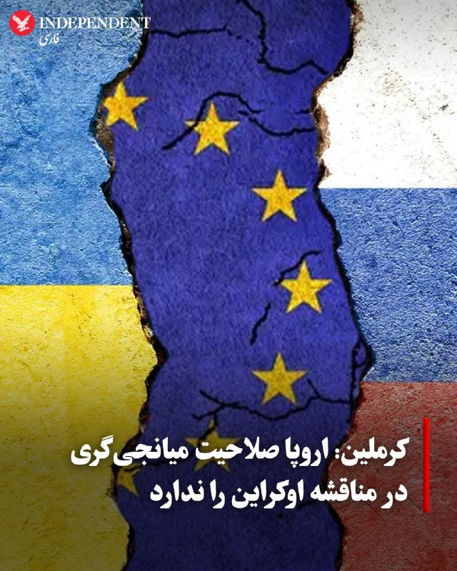

♦️خبرگزاری دولتی ریانووستی روسیه روز پنجشنبه ۲۴ اردیبهشت به نقل از دیمیتری پسکوف، سخنگوی کرملین، گزارش داد که اروپا با توجه به رویکرد کنونی‌اش، نباید انتظار داشته باشد که به عنوان میانجی در فرآیند صلح اوکراین عمل کند. پسکوف بار دیگر بر موضع مسکو تاکید کرد که اروپا در حال حاضر به عنوان یکی از طرف‌های درگیر، در کنار اوکراین ایستاده است.

از ماه فوریه تاکنون هیچ مذاکره صلحی میان روسیه و اوکراین صورت نگرفته است؛ چرا که ایالات متحده به عنوان میانجی اصلی میان دو کشور، تمرکز خود را بر جنگ در ایران معطوف کرده است.
‌🇸🇦 Indypersian

🤖 @VahidOOnLine

## VahidOOnLine — post 240129

  

♦️روزنامه اعتماد گزارش داد که نخستین نشست «ستاد ویژه ساماندهی و راهبری فضای مجازی» هفته آینده به ریاست محمدرضا عارف برگزار خواهد شد. هدف اصلی این ستاد، فراهم کردن زمینه‌های لازم برای رفع محدودیت‌های فضای مجازی است تا حداکثر تا میانه خردادماه، امکان اتصال مجدد شهروندان به اینترنت بین‌المللی فراهم شود. عارف در این مسیر قصد دارد از ظرفیت نخبگان و اساتید برجسته ارتباطات نظیر هادی خانیکی و علی ربیعی استفاده کرده و میان نهادهای حاکمیتی برای بازگشت سرویس‌دهی هم‌افزایی ایجاد کند.

این در حالی است که قطع سراسری اینترنت در ایران از مرز ۱۸۰۰ ساعت (۷۶ روز) گذشته است. گزارش‌ها نشان می‌دهد که در حال حاضر یک سیستم دسترسی طبقاتی اعمال شده است که طی آن، دسترسی به شبکه جهانی تنها برای گروهی خاص میسر بوده و عموم مردم از آن محروم هستند.
‌🇸🇦 Indypersian

🤖 @VahidOOnLine

## VahidOOnLine — post 240128

  

♦️به گزارش «چوسان بیز»، کره جنوبی یک تیم فنی را برای بررسی حمله به یک کشتی باری در نزدیکی تنگه هرمز به دبی اعزام کرده است. کشتی «نامو» (Namu) که توسط شرکت HMM اداره می‌شود، در تاریخ ۱۴ اردیبهشت هدف اصابت یک موشک ناشناس قرار گرفت که انفجار آن شکافی به عمق هفت متر در بخش عقبی بدنه کشتی ایجاد کرد.

لی کیونگ‌هو، سخنگوی وزارت دفاع کره جنوبی، اعلام کرد که این تیم تحلیل فنی روز چهارشنبه راهی دبی شده است تا «تحقیقات دقیق میدانی، تحلیل شواهد و همکاری با کشورهای مرتبط برای تثبیت حقایق» را انجام داده و از فعالیت‌های تیم واکنش مشترک دولتی حمایت کند. این تیم ۱۰ نفره شامل پژوهشگرانی از موسسه دولتی تحقیقات دفاعی (ADD) است. دولت‌های امارات و کره جنوبی هر دو این حمله را محکوم کرده‌اند.
‌🇸🇦 Indypersian

🤖 @VahidOOnLine

## VahidOOnLine — post 240127

  

محمدصالح جوکار، رییس کمیسیون شوراهای مجلس، گفت جمهوری اسلامی از خطوط قرمز خود، به‌ویژه در حوزه دانش هسته‌ای و مواد غنی‌سازی‌شده، عقب‌نشینی نمی‌کند.
نماینده یزد در مجلس، گفت هدف توییت‌های مکرر ترامپ ایجاد شائبه تفرقه میان مسئولان جمهوری اسلامی و نبود تصمیم‌گیر واحد در ایران است. او افزود حتی اگر مذاکرات به نتیجه برسد هم نمی‌توان به آمریکا اعتماد کرد زیرا عملیات تخریبی و ترور همواره در دستور کار آن‌هاست.
‌🏁 🇬🇧 IranintlTV

🤖 @VahidOOnLine

## VahidOOnLine — post 240126

  

مارکو روبیو، وزیر خارجه آمریکا، در گفت‌وگو با ان‌بی‌سی نیوز گفت دونالد ترامپ در گفت‌وگو با شی جین‌پینگ موضوع ایران را مطرح کرده، اما «هیچ درخواستی از او نداشته است».

روبیو تأکید کرد آمریکا از چین درخواست کمک نکرده و نیازی هم به کمک آن ندارد.

او افزود رییس‌جمهور به‌صراحت پیام داده اگر جمهوری اسلامی تصور می‌کند می‌تواند با سوءاستفاده از فضای سیاست داخلی آمریکا، او را به پذیرش توافقی نامطلوب وادار کند، سخت در اشتباه است.
‌🏁 🇬🇧 IranintlTV

🤖 @VahidOOnLine

## VahidOOnLine — post 240125

♦️عباس عراقچی، وزیر امور خارجه جمهوری اسلامی که برای شرکت در نشست وزرای خارجه کشورهای عضو بریکس به دهلی نو سفر کرده است روز پنجشنبه ۲۴ اردیبهشت در حاشیه این نشست با وزرای خارجه مالزی و برزیل دیدار کرد.
به گزارش خبرگزاری مهر  موضوعات دو جانبه و همچنین مسائل مربوط به بریکس از جمله محورهای دیدار «محمدحسن» وزیر خارجه مالزی با عباس عراقچی بود.
مائورو ویرا وزیر خارجه برزیل هم در دیدار با عراقچی ضمن محکوم کردن حملات آمریکا علیه ایران، بر آمادگی کشورش برای ایفای نقش در حل بحران در منطقه خلیج فارس تاکید کرد.
وزرای خارجه روسیه، مصر، برزیل، هند، آفریقای جنوبی از جمله مقامهای ارشد دیپلماتیکی هستند که در این نشست حضور دارند.
عراقچی در حالی در این اجلاس شرکت می‌کند که مساله ادامه بسته بودن تنگه هرمز، به یکی از چالش‌های جدی بین‌المللی تبدیل شده است.
هند که از بنیانگذاران بریکس و یکی از بزرگ‌ترین واردکنندگان نفت از کشورهای خاورمیانه است، از زمان آغاز جنگ و به‌دلیل کاهش واردات سوخت، مجبور به صرفه‌جویی و اتخاذ سیاست‌های ویژه پولی و بانکی شده است.
‌🇸🇦 Indypersian

🤖 @VahidOOnLine

## VahidOOnLine — post 240123

  <a href="telegram/content/VahidOOnLine_240123_1778770102.mp4">🎬 Download video</a>

الجزیره گزارش داد نمایندگان لبنان و اسرائیل برای دور تازه‌ای از گفت‌وگوها به ساختمان وزارت خارجه آمریکا در واشنگتن رسیده‌اند.
این مذاکرات مستقیم روزهای پنج‌شنبه و جمعه برگزار می‌شود و مقام‌های دیپلماتیک لبنان، اسرائیل و همچنین مقام‌های آمریکایی در آن حضور خواهند داشت.
‌🏁 🇬🇧 ManotoTV

🤖 @VahidOOnLine

## VahidOOnLine — post 240122

  <a href="telegram/content/VahidOOnLine_240122_1778770103.mp4">🎬 Download video</a>

فیفا در یک پست اینستاگرامی اعلام کرد که شکیرا، مدونا و سوپراستارهای کی‌پاپ گروه بی‌تی‌اس اجرای نخستین نمایش بین دو نیمه فینال جام جهانی را بر عهده خواهند داشت.
فینال جام جهانی قرار است ۱۹ ژوئیه در ورزشگاه مت‌لایف در نیوجرسی برگزار شود و انتظار می‌رود علاوه بر تماشاگران حاضر در ورزشگاه، میلیون‌ها بیننده در سراسر جهان آن را تماشا کنند.
جام جهانی ۲۰۲۶ از ۱۱ ژوئن در مکزیکوسیتی آغاز می‌شود و مسابقات آن در شهرهای مختلفی در آمریکا، کانادا و مکزیک برگزار خواهد شد.
‌🏁 🇬🇧 ManotoTV

🤖 @VahidOOnLine

## VahidOOnLine — post 240121

  

قاسم روانبخش، عضو هیات رییسه کمیسیون امور داخلی کشور و شوراها در مجلس، گفت نقشه راه جمهوری اسلامی کاملا روشن است و دستگاه دیپلماسی موظف است دقیقا بر مبنای ۱۰ شرط شورای عالی امنیت ملی که مورد تایید مجتبی خامنه‌ای است، حرکت کند.
قاسم روانبخش گفت عقب‌نشینی از ۱۰ شرط شورای عالی امنیت ملی یا افزایش سقف مطالبات طرف مقابل، باعث جری‌تر شدن دشمن و تشدید زیاده‌خواهی‌های او خواهد شد و افزود: «وظیفه مسئولان است که به طرف مقابل بفهمانند اگر مسیر عقلانیت را انتخاب نکند، جمهوری اسلامی ابزارهای دیگری در اختیار دارد»
قاسم روانبخش گفت: «ترامپ زبان دیپلماسی را نمی‌فهمد و تنها زبانی که به خوبی درک می‌کند، زبان موشک و قدرت نظامی است» او افزود ترامپ در شرایطی راهی پکن شد که ابهت ناوها و ناوشکن‌های آمریکا با موشک‌های جمهوری اسلامی در هم شکست.
‌🏁 🇬🇧 IranintlTV

🤖 @VahidOOnLine

## VahidOOnLine — post 240120

  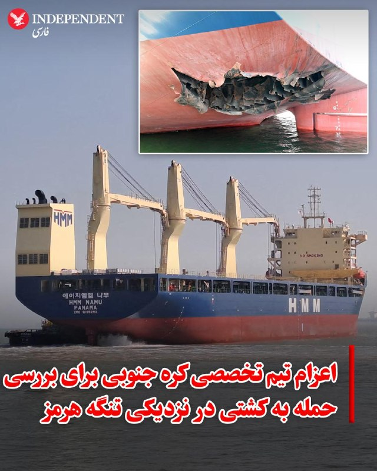

♦️به گزارش «چوسان بیز»، کره جنوبی یک تیم فنی را برای بررسی حمله به یک کشتی باری در نزدیکی تنگه هرمز به دبی اعزام کرده است. کشتی «نامو» (Namu) که توسط شرکت HMM اداره می‌شود، در تاریخ ۱۴ اردیبهشت هدف اصابت یک موشک ناشناس قرار گرفت که انفجار آن شکافی به عمق هفت متر در بخش عقبی بدنه کشتی ایجاد کرد.

لی کیونگ‌هو، سخنگوی وزارت دفاع کره جنوبی، اعلام کرد که این تیم تحلیل فنی روز چهارشنبه راهی دبی شده است تا «تحقیقات دقیق میدانی، تحلیل شواهد و همکاری با کشورهای مرتبط برای تثبیت حقایق» را انجام داده و از فعالیت‌های تیم واکنش مشترک دولتی حمایت کند. این تیم ۱۰ نفره شامل پژوهشگرانی از موسسه دولتی تحقیقات دفاعی (ADD) است. دولت‌های امارات و کره جنوبی هر دو این حمله را محکوم کرده‌اند.
‌🇸🇦 Indypersian

🤖 @VahidOOnLine

## VahidOOnLine — post 240119

🗣روایت شما از بحران اقتصادی و زندگی در آتش‌بس- پنج‌شنبه ۲۴ اردیبهشت:

🔹تعجب می‌کنم برخی می‌گن چرا تامین اجتماعی فلان کرد، چرا اداره کار بهمان کرد. جمهوری اسلامی هیچ‌وقت معیشت مردم براش مهم نبود و حتی خیریه‌ها و موسسه‌های مردم‌نهاد و مستقل رو از بین برد تا همه وابسته به خودش باشند و همه چیز رو کنترل بکنند.

🔹واقعا نگران بچه‌های مدرسه‌ای مقطع هفتم تا دوازدهم هستیم. کلاس‌ها اصلا کیفیت نداشته و شرایط روانی‌شون هم اصلا خوب نیست.

🔹چند شیفت کار سنگین می‌کنیم ولی بی‌پولیم.

🔹از اندیشه: قیمت‌ها سر به فلک کشیده، نون تافتون که ۵ هزار تومان بود، ۱۰ هزار تومان شده. داروها نیز بسیار کمیاب شده‌اند.

🔹حکومت می‌گه جنس هست و کمبودی در کار نیست، مثل اینه که من برم پشت ویترین طلافروشی و نتونم بخرم.

🔹قدرت اول منطقه حتی نمی‌تونه بسته‌های پستی رو به جزیره خارک برسونه و جرات ارسال مرسولات پستی به خارک رو نداره.
‌🏁 🇬🇧 IranintlTV

🤖 @VahidOOnLine

## mwarmonitor — post 9088

  

🔸۵ روز پس از آنکه در نزدیکی بندر شهر جاسک هدف حمله نیروهای آمریکایی قرار گرفتند، هنوز وضعیت دو نفتکش ایرانی بحرانی است.

🔹یکی از نفتکش‌های غول‌پیکر VLCC همچنان در آتش می‌سوزد و دود غلیظی از یکی از کشتی‌ها به هوا بلند شده و قابل مشاهده است.

🔸نفتکش دوم نیز در حال نشت حجم زیادی از نفت سنگین (fuel oil) به داخل آب است.

@mwarmonitor

## mwarmonitor — post 9087

  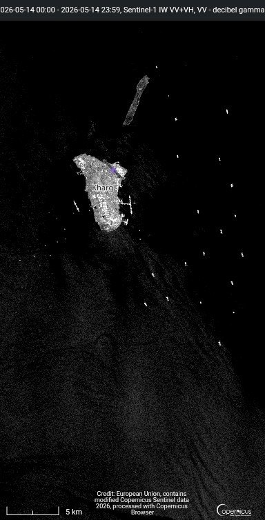

🔴روز هشتم است که ایران هیچ نفت خامی در جزیره خارگ بارگیری نکرده است. ذخایر نفت در خشکی اکنون تقریباً به ظرفیت کامل رسیده‌اند. به‌احتمال زیاد یکی از خطوط لوله آسیب دیده است. ایران در حال تلاش برای یافتن نوعی راه‌حل جایگزین است. هیچ نفتکش VLCC اجازه ورود پیدا نکرده است به‌دلیل محاصره آمریکا، بنابراین ایران در گزینه‌های خود محدود شده است.

@mwarmonitor

## mwarmonitor — post 9085

  

✈️🇺🇸نیروی هوایی آمریکا (USAF) 🚨 وضعیت اضطراری عمومی

⏱ساعت ۱۴:۳۹ – پرواز HITMAN 02 یک فروند Lockheed Martin F-35 Lightning II با علامت «LN» در حال بازگشت به پایگاه RAF Lakenheath است و به‌دلیل مشکل در سیستم فشار کابین (pressurisation) وضعیت اضطراری اعلام کرده است.

✈️این هواپیما کد اضطراری 7700 را روی ترانسپوندر (squawk 7700) ارسال کرده که به معنی اعلام وضعیت اضطراری عمومی در پرواز است.

🔸هواپیما با شماره بدنه 13-5067 به‌عنوان یک F-35A شناسایی شده است.

@mwarmonitor

## mwarmonitor — post 9084

  <a href="telegram/content/mwarmonitor_9084_1778770106.mp4">🎬 Download video</a>

🇺🇸سرمایه‌گذاری ۱.۵ تریلیون دلاری، یک پیش‌پرداخت نسلی برای دفاع ملی آمریکا است.

🔸این سرمایه‌گذاری تضمین می‌کند که ایالات متحده برای نسل‌های آینده، برتری قاطع نظامی و توان بازدارندگی بی‌رقیب خود را در برابر هر دشمنی حفظ کند.

@mwarmonitor

## mwarmonitor — post 9083

  

🇺🇸شهادت در مورد وضعیت فرماندهی مرکزی ایالات متحده (سنتکام) 🔸«من قویاً باور دارم که هر موفقیتی که به دست می‌آوریم با نیروهایمان آغاز می‌شود و با آن‌ها پایان می‌یابد. تنها در ۷ ماه گذشته، فرزندان دختر و پسر آمریکا که در سنتکام خدمت می‌کنند، نقش‌های کلیدی در…

## mwarmonitor — post 9082

  

🇺🇸دریادار برد کوپر، فرمانده فرماندهی مرکزی ایالات متحده (CENTCOM)، صبح امروز درباره وضعیت و آرایش عملیاتی سنتکام در کنگره شهادت خواهد داد. @mwarmonitor

## mwarmonitor — post 9081

  

🇺🇸کمک کنید تا در جریان درآمدی سپاه پاسداران انقلاب اسلامی (IRGC) اختلال ایجاد کنیم.

🔸برای ما درباره این افراد اطلاعات/نکته ارسال کنید؛ کسانی که این شرکت تولیدکننده پهپاد را مدیریت می‌کنند.

@mwarmonitor

## mwarmonitor — post 9080

  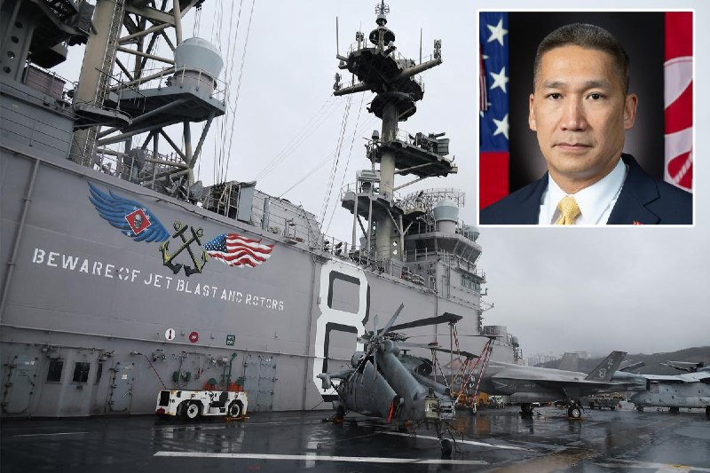

🇺🇸یک ناو جنگی آبی - خاکی uss makin مستقر در سن‌دیگو در حال آماده‌سازی برای اعزام به خاورمیانه است، در حالی که ملوانان کالیفرنیایی برای اعزام آماده می‌شوند. نیویورک پست

@mwarmonitor

## mwarmonitor — post 9079

  

🇺🇸یک بالگرد سی‌هاوک (Sea Hawk) متعلق به اسکادران Helicopter Maritime Strike Squadron 50 بر روی عرشه پرواز ناوشکن USS Truxtun (DDG-103) فرود می‌آید؛ در حالی‌ که این شناور در حال عبور از دریای عرب است و از محاصره دریایی ایالات متحده علیه ایران پشتیبانی می‌کند.

🔸بر اساس آخرین آمار، نیروهای سنتکام تا امروز مسیر ۷۰ کشتی تجاری را تغییر داده و ۴ فروند شناور را برای اطمینان از رعایت مقررات از کار انداخته‌اند.

@mwarmonitor

## mwarmonitor — post 9078

🇺🇸وزارت بازرگانی ایالات متحده آمریکا فروش تراشه‌های هوش مصنوعی H200 شرکت انویدیا را به ۱۰ شرکت چینی، در قالب مجوزهایی که برای هر مشتری تا سقف ۷۵ هزار تراشه را اجازه می‌دهد، تأیید کرده است. با وجود این تأییدها، تاکنون هیچ محموله‌ای ارسال نشده است.

@mwarmonitor

## mwarmonitor — post 9077

  

🇺🇸دریادار برد کوپر، فرمانده فرماندهی مرکزی ایالات متحده (CENTCOM)، صبح امروز درباره وضعیت و آرایش عملیاتی سنتکام در کنگره شهادت خواهد داد.

@mwarmonitor

## pm_afshaa — post 90742

  <a href="telegram/content/pm_afshaa_90742_1778770111.jpg">🎬 Download video</a>

🔴نخعی، عضو کمیسیون انرژی مجلس:
با کمبود بنزین مواجهیم و سناریوهای مختلفی درحال بررسیه.

💧 Rainbet.com the #1 Non-KYC Crypto Casino & Sportsbook @rainbetcom

😁 @Pm_Afshaa

## pm_afshaa — post 90741

  <a href="telegram/content/pm_afshaa_90741_1778770111.jpg">🎬 Download video</a>

🔴یسرائیل کاتز، وزیر دفاع اسرائیل:
ماموریت ما در ایران کامل نشده؛ اگر اهداف‌مان تامین نشه، دوباره اقدام می‌کنیم.

💧 Rainbet.com the #1 Non-KYC Crypto Casino & Sportsbook @rainbetcom

😁 @Pm_Afshaa

## pm_afshaa — post 90740

  <a href="telegram/content/pm_afshaa_90740_1778770112.jpg">🎬 Download video</a>

🔴عارف، معاون اول پزشکیان: به هیچ قیمتی کنترل تنگه هرمز رو از دست نمیدیم.

💧 Rainbet.com the #1 Non-KYC Crypto Casino & Sportsbook @rainbetcom

😁 @Pm_Afshaa

## pm_afshaa — post 90739

🔴وزیر خزانه داری آمریکا:ایران رو انقدر تحت فشار اقتصادی قرار دادیم که توی پرداخت حقوق نیروهاشم به مشکل خورده. دارن نفسای آخرشونو میکشن

💧 Rainbet.com the #1 Non-KYC Crypto Casino & Sportsbook @rainbetcom

😁 @Pm_Afshaa

## pm_afshaa — post 90738

  <a href="telegram/content/pm_afshaa_90738_1778770112.jpg">🎬 Download video</a>

🔴وزیر خزانه‌داری آمریکا: باز شدن تنگه هرمز به نفع چین خواهد بود و انتظار داریم قیمت نفت در شش ماه آینده کاهش یابد

💧 Rainbet.com the #1 Non-KYC Crypto Casino & Sportsbook @rainbetcom

😁 @Pm_Afshaa

## DEJradio — post 4630

  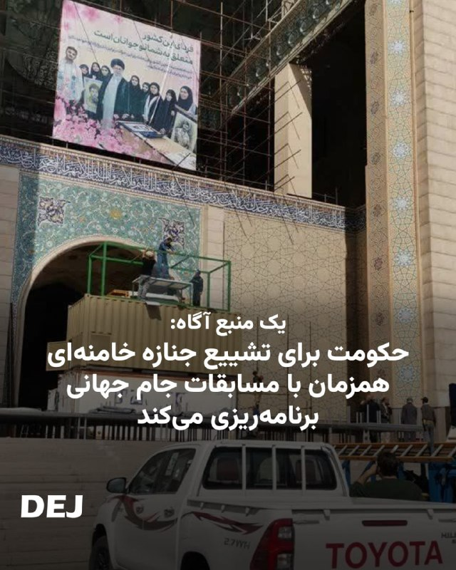

🔺📢 یک منبع آگاه:
حکومت برای تشییع جنازه خامنه‌ای هم‌زمان با مسابقات جام جهانی برنامه‌ریزی می‌کند

یک منبع آگاه به دژ گفت حکومت در حال برنامه‌ریزی برای تشییع جنازه علی خامنه‌ای همزمان با برگزاری مسابقات جام جهانی است.

نهادهای امنیتی و مقامات تصمیم‌گیر به این نتیجه رسیده‌اند که هم‌زمان با مسابقات فوتبال تهدیدات امنیتی از سوی آمریکا و اسرائیل کمتر خواهد بود.

شنیده شده مصلای تهران برای برگزاری این مراسم آماده می‌شود، اما قصد دارند او را در مشهد در جوار امام هشتم شیعیان دفن کنند.

#موشعلی #جام_جهانی
@DEJradio

## VahidOnline — post 75465

  

یسرائیل کاتز، وزیر دفاع اسرائیل در یک سخنرانی گفت که ماموریت ارتش این کشور درباره ایران کامل نشده و برای این احتمال آماده است که شاید دوباره ناچار به اقدام شود.
یسرائیل کاتز تاکید کرد: «اگر اهداف‌مان تامین نشود، دوباره اقدام خواهیم کرد.»

پیش از این نیز ایال زمیر، رییس ستاد کل ارتش اسرائیل، گفته بود که «نبرد به پایان نرسیده و ارتش برای ازسرگیری جنگ در صورت نیاز آماده است.»
@VahidOOnLine

📡 @VahidOnline

## VahidOnline — post 75464

  

اسکات بسنت، وزیر دارایی آمریکا، در گفت‌وگویی با شبکه سی‌ان‌بی‌سی در حاشیه سفر رئیس‌جمهور آمریکا، در یک مصاحبه از پیش ضبط‌شده گفت که معتقد است چین از نفوذش بر تهران برای بازگشایی تنگه هرمز استفاده خواهد کرد.

او گفت: «فکر می‌کنم آن‌ها (چینی‌ها) هر کاری از دستشان بربیاید انجام خواهند داد.»

آقای بسنت افزود: « بازگشایی تنگه هرمز بسیار به نفع چین است. فکر می‌کنم آن‌ها پشت پرده تلاش خواهند کرد، البته اگر اصلا کسی بتواند بر تصمیم‌های رهبری ایران تاثیر بگذارد.»

به اعتقاد وزیر دارایی آمریکا، چین به‌زودی سفارش بزرگی از هواپیماهای بوئینگ را اعلام خواهد کرد و افزود دو طرف در حال گفت‌وگو درباره بهبود روابط تجاری از جمله صادرات انرژی هستند.
@VahidHeadline

📡 @VahidOnline

## VahidOnline — post 75463

  

رسانه‌های ایران می‌گویند وزیر خارجه جمهوری اسلامی در نشست بریکس در دهلی‌نو، امارات متحده عربی را به «دخالت مستقیم» در عملیات نظامی علیه کشورش متهم کرد.
این تنش یک روز پس از آن رخ داد که امارات ادعای بنیامین نتانیاهو، نخست‌وزیر اسرائیل، مبنی بر سفر به این کشور حاشیه خلیج فارس در جریان جنگ ایران را رد کرد.

خبرگزاری مهر به نقل از عراقچی نوشت: «من به خاطر حفظ وحدت، در سخنرانی‌ام در بریکس نامی از امارات نبردم. اما حقیقت این است که امارات مستقیماً در تجاوز علیه کشور من دخیل بود. وقتی حملات آغاز شد، آن‌ها حتی آن را محکوم هم نکردند.»
رسانه‌های ایرانی مشخص نکردند که نماینده امارات چه اظهاراتی در این نشست مطرح کرده بود.

بر اساس این گزارش‌ها، عراقچی همچنین گفت که «نه پایگاه‌های آمریکا و نه اتحاد با اسرائیل برای امارات امنیت به همراه نیاورده و این کشور باید در سیاست خود نسبت به ایران تجدیدنظر کند».
عراقچی پیش‌ از این نیز گفته بود: «کسانی که با اسرائیل برای ایجاد تفرقه همکاری می‌کنند، پاسخگو خواهند شد.»

رسانه‌های ایرانی همچنین درباره اینکه آیا شرکت‌کنندگان نشست وزیران خارجه بریکس در هند خواهند توانست بیانیه نهایی مشترکی صادر کنند یا نه، ابراز تردید کرده‌اند؛ زیرا اختلافات میان ایران و امارات ادامه دارد.
در همین رابطه از کاظم غریب‌آبادی، معاون وزیر خارجه ایران، نقل شده که به دلیل حضور امارات در این نشست، «مشکلات و رایزنی‌هایی» وجود داشته است.
@VahidHeadline

📡 @VahidOnline

## VahidOnline — post 75462

  

یونهاپ، خبرگزاری دولتی کره جنوبی، روز چهارشنبه ۲۴ اردیبهشت به نقل از یکی از مقام‌های امنیتی این کشور گزارش کرد که بررسی‌های سئول نشان می‌دهد که به احتمال بسیار زیاد جمهوری اسلامی ایران مسئول حمله به کشتی باری این کشور در تنگه هرمز بوده است.

سفارت جمهوری اسلامی در سئول هفته گذشته هرگونه حمله جمهوری اسلامی به کشتی باری کره جنوبی در تنگه هرمز را رد کرده بود.
@VahidOOnLine

📡 @VahidOnline

## VahidOnline — post 75461

  

مرکز عملیات تجارت دریایی بریتانیا روز پنجشنبه ۲۴ اردیبهشت اعلام کرد پس از وقوع حادثه‌ای دریایی در شمال شرقی امارات متحده عربی، «افراد غیرمجاز» کنترل یک کشتی در لنگرگاه را به دست گرفته‌اند و این کشتی اکنون به سوی آب‌های سرزمینی ایران در حرکت است.

این نهاد گفت گزارشی دربارهٔ حادثه دریایی در ۳۸ مایل دریایی (حدود ۷۰ کیلومتری) شمال شرقی بندر فجیره امارات متحده عربی دریافت کرده و پس از آن، کشتی به تصرف درآمده و مسیر آن به سوی آب‌های سرزمینی ایران تغییر داده شده است.
@VahidHeadline

📡 @VahidOnline

## VahidOnline — post 75460

  

کاخ سفید اعلام کرد که دونالد ترامپ و شی جین‌پینگ، در پکن توافق کردند که ایران هرگز نباید به سلاح هسته‌ای دست پیدا کند و تنگه هرمز باید باز بماند.

آمریکا این گفت‌وگوی دو ساعته را «خوب» توصیف کرده و می‌گوید که دو رهبر در حال تلاش برای تقویت همکاری‌های اقتصادی هستند.

در بیانیه کاخ سفید، رئیس‌جمهور شی همچنین «علاقه‌مندی خود را» برای خرید بیشتر نفت آمریکا ابراز کرد تا وابستگی چین به تنگه هرمز را کاهش دهد.

همچنین گفته شد که مدیران برخی از بزرگ‌ترین شرکت‌های آمریکایی هم در بخشی از این دیدار حضور داشتند.

آن‌ها همچنین درباره اهمیت پایان دادن به ورود مواد اولیه برای ساخت ماده مخدر فنتانیل به آمریکا هم صحبت کردند.
@VahidHeadline

📡 @VahidOnline

## VahidOnline — post 75459

  

مارکو روبیو، وزیر خارجه آمریکا، می‌گوید به نفع چین است که حکومت ایران را برای باز کردن تنگه هرمز تحت فشار بگذارد.

براساس گزارشی که فاکس‌نیوز از اظهارات روبیو در راه سفر به چین پخش کرد، او گفت: «ما این استدلال را با چینی‌ها مطرح کرده‌ایم و امیدوارم قانع‌کننده باشد. آن‌ها اواخر این هفته در سازمان ملل فرصت خواهند داشت دربارهٔ این موضوع اقدامی انجام دهند؛ زمانی که قطعنامه‌ای برای محکوم کردن اقدامات ایران در ارتباط با تنگه‌ها مطرح می‌شود.»
روبیو گفت حکومت ایران در حال ایجاد ظرفیتی بوده که بتواند با «انبوهی از موشک‌ها و پهپادها» سامانه‌های دفاعی کشورهای منطقه را از کار بیندازد و هرگونه حملهٔ احتمالی به برنامه هسته‌ای خود را با تهدید به وارد کردن خسارت گسترده به کشورهای خلیج فارس پاسخ دهد.
مارکو روبیو همچنین با اشاره به بحران تنگه هرمز، گفت این وضعیت بیش از هر کشور دیگری به زیان چین است و پکن باید ایران را برای عقب‌نشینی از اقداماتش تحت فشار بگذارد.

@VahidHeadline

📡 @VahidOnline

## VahidOnline — post 75457

نت‌بلاکس، نهاد بین‌المللی پایش اینترنت، نوشت که پس از بیش از ۱۸۰۰ ساعت قطعی اینترنت در ایران، نظامی طبقاتی توسط جمهوری اسلامی برای دسترسی ایجاد شده است.

😋
💩 همزمان مهدی طباطبایی، معاون ارتباطات و اطلاع‌رسانی دفتر مسعود پزشکیان، ادعا کرده است که اگر همه‌پرسی برگزار شود، مردم در شرایط جنگی، امنیت را به سهولت دسترسی به اینترنت ترجیح خواهند داد.
@VahidHeadline
روزنامه اعتماد گزارش داد که نخستین نشست «ستاد ویژه ساماندهی و راهبری فضای مجازی» هفته آینده به ریاست محمدرضا عارف برگزار خواهد شد.
هدف اصلی این ستاد، فراهم کردن زمینه‌های لازم برای رفع محدودیت‌های فضای مجازی است تا حداکثر تا میانه خردادماه، امکان اتصال مجدد شهروندان به اینترنت بین‌المللی فراهم شود.
عارف در این مسیر قصد دارد از ظرفیت نخبگان و اساتید برجسته ارتباطات نظیر هادی خانیکی و علی ربیعی [
🤨] استفاده کرده و میان نهادهای حاکمیتی برای بازگشت سرویس‌دهی هم‌افزایی ایجاد کند.
@VahidOOnLine

📡 @VahidOnline

## VahidOnline — post 75456

  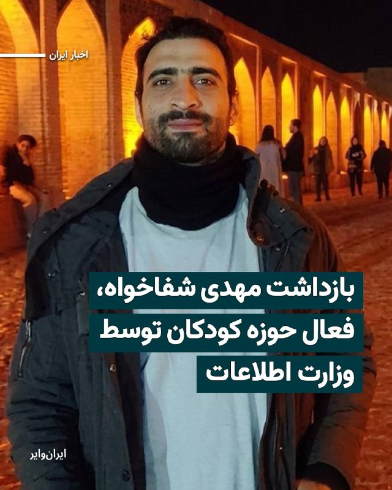

مهدی شفاخواه، فعال حوزه آموزش و حمایت از کودکان کار و ساکنان مناطق محروم، توسط نیروهای وزارت اطلاعات جمهوری اسلامی بازداشت شد.

این فعال حوزه کودکان عصر سه‌شنبه ۲۲ اردیبهشت ۱۴۰۵، ماموران وزارت اطلاعات بازداشت و به مکان نامعلومی منتقل شد. همچنین تمامی وسایل الکترونیکی و ارتباطی او و همسرش نیز توقیف شده است.
@VahidHeadline
هنوز از دلایل بازداشت، اتهامات انتسابی و محل دقیق نگهداری شفاخواه هیچ اطلاع دقیقی در دسترس نیست و پیگیری‌های خانواده او برای کسب اطلاع از وضعیت سلامت او بی‌نتیجه مانده است.

مهدی شفاخواه طی سال‌های اخیر به صورت داوطلبانه در مناطق محروم و حاشیه‌نشین فعالیت داشته و از طریق آموزش ورزش و مهارت‌های اجتماعی به کودکان کار و نوجوانان آسیب‌پذیر، در راستای کاهش آسیب‌های اجتماعی از جمله اعتیاد و بزهکاری تلاش می‌کرد.

او برادر رضا شفاخواه، وکیل دادگستری و فعال حقوق کودکان و زندانیان سیاسی، است.
@VahidHeadline

📡 @VahidOnline

## IranIntlTV — post 337182

  

وزارت خارجه هند اعلام کرد یک کشتی باری با پرچم این کشور پس از حمله‌ مشکوک پهپادی یا موشکی در روز چهارشنبه، در آب‌های عمان دچار آتش‌سوزی و غرق شده است.
طبق گزارش‌ها هر ۱۴ خدمه این شناور نجات یافتند.
دهلی‌نو هدف قرار دادن کشتیرانی تجاری و ملوانان غیرنظامی را غیرقابل قبول دانست و آن را محکوم کرد.
شرکت امنیت دریایی وانگارد اعلام کرد این شناور هندی پس از انفجاری مشکوک که احتمالا ناشی از حمله پهپادی یا موشکی بوده، در نزدیکی سواحل عمان غرق شده است.
https://iranintl.com/202605145500

## IranIntlTV — post 337181

سرخط خبرهای پنجشنبه ۲۴ اردیبهشت
@iranintltv

## IranIntlTV — post 337180

  

چارلز سوم، پادشاه بریتانیا، روز پنج‌شنبه از محله‌ یهودی‌نشین گولدرز گرین در لندن بازدید کرد.
ماه گذشته در این محله یک نفر با چاقو دو مرد یهودی را زخمی کرد.
طبق بیانیه کاخ باکینگهام، هدف این بازدید «تاکید دوباره بر حمایت قاطع او» از جامعه یهودی، در شرایط افزایش نگرانی‌های امنیتی پس از این حمله بوده است.
https://iranintl.com/202605145625

## IranIntlTV — post 337179

  <a href="telegram/content/IranIntlTV_337179_1778770119.mp4">🎬 Download video</a>

در حالی که نهادهای نظامی آمریکا از ادامه محاصره دریایی تنگه هرمز خبر می‌دهند، صداوسیمای جمهوری اسلامی به نقل از نیروی دریایی سپاه اعلام کرد در شبانه‌روز گذشته ۳۰ فروند کشتی با مجوز عبور کرده‌اند.
گفت‌وگو با علی‌حسین قاضی‌زاده، عضو تحریریه ایران‌اینترنشنال
@iranintltv

## IranIntlTV — post 337178

  

محمدصالح جوکار، رییس کمیسیون شوراهای مجلس، گفت جمهوری اسلامی از خطوط قرمز خود، به‌ویژه در حوزه دانش هسته‌ای و مواد غنی‌سازی‌شده، عقب‌نشینی نمی‌کند.
نماینده یزد در مجلس، گفت هدف توییت‌های مکرر ترامپ ایجاد شائبه تفرقه میان مسئولان جمهوری اسلامی و نبود تصمیم‌گیر واحد در ایران است. او افزود حتی اگر مذاکرات به نتیجه برسد هم نمی‌توان به آمریکا اعتماد کرد زیرا عملیات تخریبی و ترور همواره در دستور کار آن‌هاست.
https://iranintl.com/202605140299

## IranIntlTV — post 337177

🔻علی بلالی، مشاور عالی فرمانده نیروی هوافضای سپاه در صداوسیمای جمهوری اسلامی درباره حسن طهرانی‌مقدم گفت: «او هوادار استقلال بود و تیم صباباطری را قهرمانی جام حذفی کرد.»

🔹صبا باطری در سال ۱۳۸۴ در فینال جام حذفی با پیروزی برابر ابومسلم به مقام قهرمانی رسید.

🔹طهرانی مقدم از پایه‌گذاران صنعت موشکی در سپاه پاسداران بود که در سال ۱۳۹۰ در پی حادثه انفجار در پادگان مدرس تهران کشته شد.

@iranintltvsport

## IranIntlTV — post 337176

  

مارکو روبیو، وزیر خارجه آمریکا، در گفت‌وگو با ان‌بی‌سی نیوز گفت دونالد ترامپ در گفت‌وگو با شی جین‌پینگ موضوع ایران را مطرح کرده، اما «هیچ درخواستی از او نداشته است».

روبیو تأکید کرد آمریکا از چین درخواست کمک نکرده و نیازی هم به کمک آن ندارد.

او افزود رییس‌جمهور به‌صراحت پیام داده اگر جمهوری اسلامی تصور می‌کند می‌تواند با سوءاستفاده از فضای سیاست داخلی آمریکا، او را به پذیرش توافقی نامطلوب وادار کند، سخت در اشتباه است.
https://iranintl.com/202605147723

## IranIntlTV — post 337175

  

قاسم روانبخش، عضو هیات رییسه کمیسیون امور داخلی کشور و شوراها در مجلس، گفت نقشه راه جمهوری اسلامی کاملا روشن است و دستگاه دیپلماسی موظف است دقیقا بر مبنای ۱۰ شرط شورای عالی امنیت ملی که مورد تایید مجتبی خامنه‌ای است، حرکت کند.
قاسم روانبخش گفت عقب‌نشینی از ۱۰ شرط شورای عالی امنیت ملی یا افزایش سقف مطالبات طرف مقابل، باعث جری‌تر شدن دشمن و تشدید زیاده‌خواهی‌های او خواهد شد و افزود: «وظیفه مسئولان است که به طرف مقابل بفهمانند اگر مسیر عقلانیت را انتخاب نکند، جمهوری اسلامی ابزارهای دیگری در اختیار دارد»
قاسم روانبخش گفت: «ترامپ زبان دیپلماسی را نمی‌فهمد و تنها زبانی که به خوبی درک می‌کند، زبان موشک و قدرت نظامی است» او افزود ترامپ در شرایطی راهی پکن شد که ابهت ناوها و ناوشکن‌های آمریکا با موشک‌های جمهوری اسلامی در هم شکست.
https://iranintl.com/202605147234

## IranIntlTV — post 337174

🗣روایت شما از بحران اقتصادی و زندگی در آتش‌بس- پنج‌شنبه ۲۴ اردیبهشت:

🔹تعجب می‌کنم برخی می‌گن چرا تامین اجتماعی فلان کرد، چرا اداره کار بهمان کرد. جمهوری اسلامی هیچ‌وقت معیشت مردم براش مهم نبود و حتی خیریه‌ها و موسسه‌های مردم‌نهاد و مستقل رو از بین برد تا همه وابسته به خودش باشند و همه چیز رو کنترل بکنند.

🔹واقعا نگران بچه‌های مدرسه‌ای مقطع هفتم تا دوازدهم هستیم. کلاس‌ها اصلا کیفیت نداشته و شرایط روانی‌شون هم اصلا خوب نیست.

🔹چند شیفت کار سنگین می‌کنیم ولی بی‌پولیم.

🔹از اندیشه: قیمت‌ها سر به فلک کشیده، نون تافتون که ۵ هزار تومان بود، ۱۰ هزار تومان شده. داروها نیز بسیار کمیاب شده‌اند.

🔹حکومت می‌گه جنس هست و کمبودی در کار نیست، مثل اینه که من برم پشت ویترین طلافروشی و نتونم بخرم.

🔹قدرت اول منطقه حتی نمی‌تونه بسته‌های پستی رو به جزیره خارک برسونه و جرات ارسال مرسولات پستی به خارک رو نداره.

## IranIntlTV — post 337173

  

سنتکام اعلام کرد نیروهای آمریکایی در عملیات محاصره بنادر ایران، تاکنون ۷۰ کشتی تجاری را مجبور به تغییر مسیر کرده و ۴ کشتی را از کار انداخته‌اند.
پیش‌تر سنتکام، با انتشار تصویری از گشت‌زنی یک جنگنده پنهان‌کار اف-۳۵-ای نیروی هوایی بر فراز آب‌های منطقه‌ای نزدیک تنگه هرمز خبر داد.
https://iranintl.com/202605143032

## IranIntlTV — post 337172

  <a href="telegram/content/IranIntlTV_337172_1778770122.mp4">🎬 Download video</a>

گزارش‌های رسیده به ایران‌اینترنشنال از شهرهای مختلف ایران، حاکی از کمبود بنزین، صف‌های طولانی و گسترش بازار سیاه سوخت است. شهروندان در استان‌های مختلف می‌گویند عرضه بنزین محدود شده و در برخی جایگاه‌ها سوخت آزاد تنها به مقدار کم ارائه می‌شود.
گفت‌وگو با عطا حسینیان، روزنامه‌نگار اقتصادی و حوزه انرژی
@iranintltv

## IranIntlTV — post 337170

  <a href="telegram/content/IranIntlTV_337170_1778770124.mp4">🎬 Download video</a>

اسکات بسنت، وزیر خزانه‌داری آمریکا، در گفت‌وگو با سی‌ان‌بی‌سی گفت طی سه روز گذشته بارگیری در تاسیسات نفتی ایران انجام نشده است. او همچنین تاکید کرد جمهوری اسلامی توان پرداخت دستمزد نظامیان و هزینه‌های تجهیزات نظامی را ندارد.
گفت‌وگو با دالغا خاتین‌‌اوغلو، کارشناس انرژی
@iranintltv

## IranIntlTV — post 337169

  <a href="telegram/content/IranIntlTV_337169_1778770125.mp4">🎬 Download video</a>

رویترز گزارش داد جنگ ایران، روند گفت‌وگوهای صلح میان دولت ترکیه و کردها را با اختلال روبه‌رو کرده است. بر اساس این گزارش، آنکارا به دلیل نگرانی از گسترش تنش‌های منطقه‌ای، اجرای اصلاحات سیاسی را متوقف کرده و بر خلع سلاح کامل پ‌ک‌ک تاکید دارد.
نرگس هورخش، خبرنگار ایران‌اینترنشنال، گزارش می‌دهد
@iranintltv

## IranIntlTV — post 337168

  

علی مطهری، نایب‌رییس پیشین مجلس، گفت: «امارات متحده عربی خبیث‌ترین کشور خلیج فارس است و به اسرائیل نزدیک شده است.»
او افزود: «اتکای امارات به حمایت آمریکا باعث شده علیه جمهوری اسلامی موضع‌گیری کند و در صورت تضعیف موقعیت آمریکا، امارات نیز سر عقل خواهد آمد.»
https://iranintl.com/202605145020

## IranIntlTV — post 337167

  <a href="telegram/content/IranIntlTV_337167_1778770127.mp4">🎬 Download video</a>

دیدار دونالد ترامپ با شی جین‌پینگ، واکنش گسترده کاربران رسانه‌های اجتماعی را به همراه داشته است. کاربران علاوه‌بر ابعاد سیاسی و اقتصادی، به حاشیه‌های این سفر از جمله زبان بدن دو رهبر، حضور مارکو روبیو در هیات آمریکایی و موضوع رقابت تکنولوژیک واکنش نشان داده‌اند.
عادله بورنگ، عضو تحریریه ایران‌اینترنشنال، از واکنش کاربران می‌گوید
@iranintltv

## IranIntlTV — post 337166

🗣روایت شما از بحران اقتصادی و زندگی در آتش‌بس- پنج‌شنبه ۲۴ اردیبهشت:

🔹این چند وقت فشار روانی زیادی بر دانش‌آموزان بوده و در کمال ناباوری، آموزش و پرورش تصمیم به حضوری بودن امتحانات گرفته. از والدین محترم می‌خوام شرایط روانی فرزندان‌شون رو درک و اگر می‌تونن اعتراضی کنن.

🔹از شهسوار: زندگی برای خیلی از ما سخت شده؛ گرونی، فشارهای روزمره و نگرانی از آینده هر روز بیشتر حس می‌شه. این چیزیه که خیلی‌هامون داریم تجربه‌اش می‌کنیم و امیدوارم صدامون شنیده بشه.

🔹از شیراز: مرغ کیلویی ۵۰۰ هزار تومان، برنج کیلویی ۲۷۰ هزار تومان و تخم‌مرغ دانه‌ای ۲۲ هزار تومان. من که ۱۵ میلیون تومان حقوقمه چطوری می‌تونم زندگی کنم؟

🔹بعد از ۳۷ سال زندگی، با ۱۶ سال سابقه کار تخصصی در زمینه تحصیلاتم (کارشناسی ارشد مکانیک جامدات) و درآمدی که تازه در مقایسه با بقیه مشاغل نسبتا خوب محسوب می‌شه، هیچ امیدی به آینده ندارم. حقوقم فقط خرج روزمره زندگیم می‌شه.

🔹چهارشنبه رفتم بنزین بزنم. با کارت خودم نتونستم، چون سهمیه شخصی تموم شده بود. مسئول جایگاه هم فقط در صورتی کارت آزاد می‌داد که به خودش مستقیم پول بدیم. ۱۵ لیتر بیشتر هم نمیدن و هر لیتری به قیمت ۷ هزار تومان.

🔹قیمت یک پیتزا خانواده در تهران دست‌کم یک میلیون تومان شده؛ یعنی حدود ۵ دلار. در صورتی که درآمد خیلی از خانوارها از ۶۰ دلار در ماه شروع می‌شه. این یک مثال از قدرت خرید مردم در پایتخت بود.

🔹جمهوری اسلامی هیچ‌وقت معیشت مردم براش مهم نبود و حتی خیریه‌ها و موسسه‌های مردم‌نهاد و مستقل رو از بین برد تا همه وابسته به خودش باشن و همه‌چیز رو کنترل کنه.

🔹۲۶ سالمه و فروشگاه پوشاک داشتم. ۴ سال پیش تمام طلاهای مادرم رو فروختم برای راه‌اندازی بوتیک. امسال ورشکست شدم. غم و استرس بیکاری داره نابودم می‌کنه.

🔹 پدرم ۳۲ سال در مخابرات کار کرد و بازنشسته شده است. الان نزدیک یک سال و ۲ ماه هست که سنوات بازنشستگیش را ندادن. این وضعیت برای یک بازنشسته که کل زندگیش را برای کار گذاشته، مناسب نیست.

## IranIntlTV — post 337165

  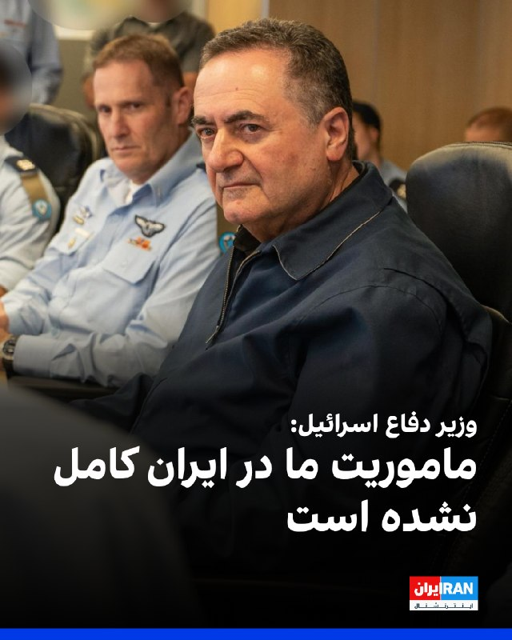

یسرائیل کاتز، وزیر دفاع اسرائیل در یک سخنرانی گفت که ماموریت ارتش این کشور درباره ایران کامل نشده و برای این احتمال آماده است که شاید دوباره ناچار به اقدام شود.
یسرائیل کاتز تاکید کرد: «اگر اهداف‌مان تامین نشود، دوباره اقدام خواهیم کرد.»

پیش از این نیز ایال زمیر، رییس ستاد کل ارتش اسرائیل، گفته بود که «نبرد به پایان نرسیده و ارتش برای ازسرگیری جنگ در صورت نیاز آماده است.»
https://iranintl.com/202605143284

## IranIntlTV — post 337164

  

مصطفی نخعی، عضو کمیسیون انرژی مجلس گفت: «ما با کسری بنزین مواجهیم و قبل از جنگ هم کمبود بنزین وجود داشت و روزانه حدود ۲۰ میلیون لیتر کسری بنزین داشتیم که باید با واردات جبران می‌کردیم.»

او ادامه داد: «سناریوهای مختلفی در خصوص بنزین در دولت در حال بررسی است اما هنوز سناریویی قطعی نشده است.»

این نماینده مجلس ادامه داد: «درحال حاضر یا سهمیه باید کاهش یابد یا از ابزار قیمتی استفاده شود که حداقل مجلس چندان موافق این موضوع نیست.»
https://iranintl.com/202605148048

## IranIntlTV — post 337163

  

🔻توماس راشل، نماینده دولت فدرال آلمان در امور آزادی دین و عضو پارلمان این کشور، رسماً کفالت سیاسی پیوند و برنا نعیمی را بر عهده گرفت. این دو جوان ورزشکار بهایی که با اتهامات سنگین و خطر اعدام روبه‌رو هستند، به نمادی از سرکوب جامعه ورزشی و اقلیت‌های مذهبی در ایران بدل شده‌اند.

🔹به گزارش انجمن «زن، زندگی، آزادی» در آلمان، پیوند نعیمی، ورزشکار رشته شنا و واترپلو از ژانویه ۲۰۲۶ در بازداشتگاه‌های سپاه تحت شدیدترین شکنجه‌ها قرار گرفته است و اعترافات اجباری او از صداوسیما پخش شده است.

🔹به گزارش این انجمن حقوق بشری، برنا نعیمی، کاراته‌کا و پدر یک فرزند خردسال، پس از تحمل شوک الکتریکی و «اعدام‌های نمایشی»، مجبور به امضای اعترافاتی علیه خود و پسرعمویش، پیوند نعیمی شده است.

🔹پیش‌تر، جامعه جهانی بهائی در بیانیه‌ای نوشت که پیوند و برنا نعیمی در حالی به دخالت در حوادث اعتراضات دی‌ماه متهم شده‌اند که مدارک نشان می‌دهد پیوند در زمان وقوع حادثه در بازداشت بوده است. این دو ورزشکار بدون دسترسی به دادگاه عادلانه، تحت شکنجه‌های غیرانسانی برای پذیرش اتهامات ساختگی قرار دارند.

@iranintltvsport

## IranIntlTV — post 337162

  

ایرنا، خبرگزاری رسمی دولت جمهوری اسلامی در گزارشی نوشت: «میزان ذخایر سدهای تهران نسبت به سال گذشته ۴۵ میلیون مترمکعب کاهش یافته و حجم آب موجود در پنج سد اصلی پایتخت افت قابل توجهی داشته است.»

معاون شرکت آب منطقه‌ای تهران نیز با اشاره به اینکه مخازن تنها حدود ۶۰ درصد ظرفیت نرمال را پر کرده‌اند، هشدار داد که پایتخت همچنان با شرایط خشکسالی مواجه است.
https://iranintl.com/202605149178

## Shin_Persian — post 5998

Samim ✓ @PawnToPromotion Thu, 14 May 2026 10:14:23 UTC آپدیت «خیلی مهم» برای کلاینت شیر و خورشید 2026.05.14: تنظیمات بیشتر برای CDN Domain Fronting: توجه کنید سایفون خودش دامین فرانتینگ انجام میده! ولی اون روش MitM که @patterniha پیدا کرد تنظیمات و جزییات…

## Shin_Persian — post 5997

Samim ✓ @PawnToPromotion
Thu, 14 May 2026 10:14:23 UTC

آپدیت «خیلی مهم» برای کلاینت شیر و خورشید 2026.05.14:

تنظیمات بیشتر برای CDN Domain Fronting: توجه کنید سایفون خودش دامین فرانتینگ انجام میده! ولی اون روش MitM که @patterniha پیدا کرد تنظیمات و جزییات دامین فرانتینگ متفاوتی داره. در این آپدیت٬ کلاینت شیر و خورشید کاری مشابه به چیزی که @patterniha ها معرفی کرد انجام میده با این تفاوت که این روش در هسته شیر و خورشید اضافه شده پس دیگه نیازی به xray و cert وکارای دیگه نیست.

۱. آپدیت رو نصب کنید
۲. پروتکل را روی یکی از حالت های Auto یا Direct یا CDN Fronting تنظیم کنید
۳. کلاینت شیر و خورشید باید الان خودش به تنهایی وصل بشه براتون!

قابلیت تنظیمات بیشتر برای SNI و IP هم وجود داره که فعلا بهش نیازی نیست و میتونید خالی بگذارید باشه. ولی برای آینده شاید به کار بیاد.

میتونید از اینجا دانلود و نصب کنید و ممنون میشم اگه repost کنید که تعداد بیشتری ببینند:

https://github.com/shirokhorshid/shirokhorshid-android/releases/tag/v2026.05.14-8a28d0c

در تلگرام هم آپلود کردم اگر براتون راحت تر هست میتونید از اونجا آپدیت رو بگیرید:

https://t.me/+aF04HaDSxVI4ZGEx

English

"Very Important" update for the Lion and Sun client 2026.05.14:

More settings for CDN Domain Fronting: Note that Psiphon performs its own domain fronting! However, the MitM (Man-in-the-Middle) method discovered by @patterniha involves different domain fronting settings and details. In this update, the Lion and Sun client performs an action similar to what @patterniha introduced, with the difference that this method has been integrated into the Lion and Sun core, so there is no longer a need for Xray, certificates, or other manual tasks.

1. Install the update.
2. Set the protocol to one of the following modes: Auto, Direct, or CDN Fronting.
3. The Lion and Sun client should now connect for you on its own!

There are also additional configuration options for SNI (Server Name Indication) and IP, which are not currently needed and can be left blank. However, they may be useful in the future.

You can download and install it from here, and I would appreciate it if you reposted so more people can see it:

https://github.com/shirokhorshid/shirokhorshid-android/releases/tag/v2026.05.14-8a28d0c

I have also uploaded it to Telegram; if it is easier for you, you can get the update from there:

https://t.me/+aF04HaDSxVI4ZGEx

𝕏 · @shin_persian

## ManotoTV — post 105454

  <a href="telegram/content/ManotoTV_105454_1778770131.mp4">🎬 Download video</a>

وزیر نیروی جمهوری‌اسلامی نسبت به وضعیت منابع آب در تهران هشدار داده و گفته شرایط آبی پایتخت چندان مطلوب نیست.
عباس علی‌آبادی اعلام کرده توزیع نامتوازن بارش‌ها باعث شده ۱۰ استان کشور با جمعیتی بیش از ۳۵ میلیون نفر همچنان در وضعیت کمتر از نرمال قرار داشته باشند.
او با اشاره به اینکه میزان بارش‌ها نسبت به میانگین بلندمدت حدود ۴ درصد و نسبت به سال گذشته ۶۶ درصد افزایش داشته، تأکید کرده این آمار به معنی خروج از بحران نیست.
به گفته او، شش سال خشکسالی پیاپی و کاهش ذخایر آب، به‌ویژه در منابع زیرزمینی، باعث شده کسری مخازن آب سطحی و زیرزمینی همچنان یکی از چالش‌های جدی کشور باقی بماند.

## ManotoTV — post 105453

  <a href="telegram/content/ManotoTV_105453_1778770131.mp4">🎬 Download video</a>

مقامات کره جنوبی اعلام کرده‌اند که به نظر می‌رسد بعید است گروهی غیر از جمهوری‌اسلامی در حمله به یک کشتی باری کره‌ای در نزدیکی تنگه هرمز نقش داشته باشد.
این حمله در تاریخ ۴ مه به کشتی متعلق به شرکت HMM کره جنوبی انجام شد و باعث آتش‌سوزی و آسیب به بخش عقبی آن شد. کره جنوبی در حال بررسی اطلاعاتی است که آمریکا درباره این حادثه در اختیارش قرار داده است.
سئول همچنین تیم‌های کارشناسی را به دبی فرستاده تا خسارت وارد شده به کشتی را بررسی و تحقیقات فنی انجام دهند.
در حالی که جمهوری‌اسلامی هرگونه دخالت در این حمله را رد کرده، مقامات کره جنوبی می‌گویند نتیجه‌گیری نهایی پس از پایان تحقیقات اعلام خواهد شد، اما در صورت اثبات نقش تهران، اقدامات لازم انجام می‌شود.
گزارش‌ها می‌گویند آمریکا نیز بلافاصله پس از حادثه، جمهوری‌اسلامی را به دست داشتن در این حمله متهم کرده و خواستار همکاری کره جنوبی در تأمین امنیت کشتیرانی در تنگه هرمز شده بود.

## ManotoTV — post 105452

  <a href="telegram/content/ManotoTV_105452_1778770132.mp4">🎬 Download video</a>

همزمان با سفر ترامپ به چین، آکسیوس در گزارشی به اختلاف نظرهایی در تیم ترامپ در خصوص ایران پرداخته؛ برخی معتقدند جمهوری‌اسلامی از زمان به نفع خود استفاده می‌کند و منتظر تأثیر فشارهای سیاسی در آمریکا است. هم‌زمان افزایش قیمت نفت و نگرانی از تورم، کار دولت را برای مدیریت افکار عمومی سخت‌تر کرده است.
گزارش‌ها نشان می‌دهد مذاکرات اخیر با تهران به بن‌بست رسیده و گزینه‌های نظامی دوباره روی میز قرار گرفته‌اند؛ از عملیات دریایی در تنگه هرمز گرفته تا حملات به زیرساخت‌های ایران.
در عین حال، برخی مقامات آمریکایی می‌گویند فشار اقتصادی فعلی شاید بدون اقدام نظامی هم ایران را تحت فشار قرار دهد، هرچند ساختار سیاسی این کشور کمتر تحت تأثیر نارضایتی عمومی قرار می‌گیرد.
در مجموع، ترامپ تأکید دارد که جلوگیری از دسترسی جمهوری‌اسلامی به سلاح هسته‌ای اولویت اصلی اوست، حتی اگر پیامدهای اقتصادی و سیاسی داخلی به دنبال داشته باشد؛ موضوعی که حالا به دست دموکرات‌ها یک ابزار تبلیغاتی آماده داده است.

## ManotoTV — post 105451

  <a href="telegram/content/ManotoTV_105451_1778770132.mp4">🎬 Download video</a>

«جمهوری اسلامی قصد جان فاطمه سپهری را کرده»

## ManotoTV — post 105450

  <a href="telegram/content/ManotoTV_105450_1778770133.mp4">🎬 Download video</a>

قیمت چیپس و پفک در بازار طی یک سال گذشته جهش چشمگیری داشته است.
بهای چیپس‌های ۶۰ گرمی که سال گذشته حدود ۲۵ هزار تومان بود، حالا به ۶۰ تا ۶۵ هزار تومان رسیده؛ افزایشی حدود ۱۶۰ درصدی.
قیمت چیپس‌های بزرگ‌تر نیز برای بسیاری از خریداران شوکه‌کننده شده است. هر بسته چیپس ۱۳۸ گرمی بسته به برند، بین ۱۳۰ تا ۱۴۰ هزار تومان قیمت دارد و چیپس‌های ۲۴۵ گرمی به حدود ۲۵۰ هزار تومان رسیده‌اند. برخی بسته‌های بزرگ‌تر نیز بین ۳۰۰ تا ۴۰۰ هزار تومان فروخته می‌شوند.
افزایش قیمت در بازار پفک و اسنک هم ادامه دارد. قیمت پفک ۱۱۰ گرمی از حدود ۴۵ هزار تومان به ۱۱۵ هزار تومان رسیده و اسنک‌های پنیری و طلایی حتی گران‌تر هستند. هر بسته اسنک طلایی اکنون حدود ۱۵۰ هزار تومان قیمت دارد و کرانچی ۱۰۰ گرمی نیز به حدود ۸۰ هزار تومان رسیده است.

## ManotoTV — post 105449

  <a href="telegram/content/ManotoTV_105449_1778770134.mp4">🎬 Download video</a>

«من صدای فاطمه سپهری هستم»

## ManotoTV — post 105448

  <a href="telegram/content/ManotoTV_105448_1778770135.mp4">🎬 Download video</a>

الجزیره گزارش داد نمایندگان لبنان و اسرائیل برای دور تازه‌ای از گفت‌وگوها به ساختمان وزارت خارجه آمریکا در واشنگتن رسیده‌اند.
این مذاکرات مستقیم روزهای پنج‌شنبه و جمعه برگزار می‌شود و مقام‌های دیپلماتیک لبنان، اسرائیل و همچنین مقام‌های آمریکایی در آن حضور خواهند داشت.

## ManotoTV — post 105447

  <a href="telegram/content/ManotoTV_105447_1778770135.mp4">🎬 Download video</a>

فیفا در یک پست اینستاگرامی اعلام کرد که شکیرا، مدونا و سوپراستارهای کی‌پاپ گروه بی‌تی‌اس اجرای نخستین نمایش بین دو نیمه فینال جام جهانی را بر عهده خواهند داشت.
فینال جام جهانی قرار است ۱۹ ژوئیه در ورزشگاه مت‌لایف در نیوجرسی برگزار شود و انتظار می‌رود علاوه بر تماشاگران حاضر در ورزشگاه، میلیون‌ها بیننده در سراسر جهان آن را تماشا کنند.
جام جهانی ۲۰۲۶ از ۱۱ ژوئن در مکزیکوسیتی آغاز می‌شود و مسابقات آن در شهرهای مختلفی در آمریکا، کانادا و مکزیک برگزار خواهد شد.

## ManotoTV — post 105446

  <a href="telegram/content/ManotoTV_105446_1778770136.mp4">🎬 Download video</a>

خبرگزاری حکومتی فارس وابسته به سپاه پاسداران از قول یک منبع آگاه اعلام کرد جمهوری اسلامی با عبور تعدادی از کشتی‌های چینی از تنگه هرمز، در چارچوب «پروتکل مدیریت ایرانی تنگه»، موافقت کرده است.
به گفته این منبع، پس از رایزنی‌های وزیر خارجه چین و سفیر پکن در تهران، دو کشور درباره تسهیل عبور برخی کشتی‌های چینی به توافق رسیدند و این روند از شامگاه گذشته آغاز شده است.
بر اساس این گزارش، عبور این کشتی‌ها پس از هماهنگی با مقام‌های جمهوری‌اسلامی و پذیرش ضوابط تعیین‌شده از سوی تهران انجام می‌شود.

## ManotoTV — post 105445

  <a href="telegram/content/ManotoTV_105445_1778770136.mp4">🎬 Download video</a>

عباس عراقچی، وزیر خارجه جمهوری اسلامی، امارات متحده عربی را به مشارکت مستقیم در حملات نظامی علیه ایران متهم کرد و خواستار بازنگری ابوظبی در روابطش با اسرائیل شد.
عراقچی این اظهارات را در نشست وزیران خارجه بریکس در دهلی‌نو مطرح کرد. او گفت: «امارات مستقیماً در تجاوز علیه کشور من دخالت داشت و اجازه داد از خاکش برای شلیک تجهیزات و تسلیحات علیه ایران استفاده شود.»
وزیر خارجه جمهوری اسلامی همچنین با اشاره به عادی‌سازی روابط امارات و اسرائیل در سال ۲۰۲۰ گفت: «ائتلاف شما با اسرائیل هم از شما محافظت نکرد و باید در سیاست خود در قبال ایران تجدیدنظر کنید.»

## ManotoTV — post 105444

  <a href="telegram/content/ManotoTV_105444_1778770137.mp4">🎬 Download video</a>

یک شرکت امنیت دریایی اعلام کرد شناور هندی «ام‌اس‌وی حاج‌علی» در پی حمله‌ای ناشناس در آب‌های نزدیک عمان غرق شده است.
شرکت «ونگارد» اعلام کرد این کشتی باری با ۱۴ خدمه، در نزدیکی ساحل لیما در عمان، در جنوب تنگه هرمز، پس از وقوع انفجار غرق شد.
بر اساس این گزارش، کشتی در حال انتقال دام از بربره در منطقه سومالی‌لند به شارجه امارات متحده عربی بود که «احتمالاً بر اثر حمله پهپادی یا موشکی» دچار انفجار شد.
ونگارد اعلام کرد پس از وقوع آتش‌سوزی در کشتی، خدمه مجبور به ترک شناور شدند و کشتی سپس غرق شد.
وب‌سایت رهگیری کشتی‌ها «ماریتایم ترافیک» این شناور را یک لنج چوبی ۵۴ متری معرفی کرده است. وزارت خارجه هند پیش‌تر اعلام کرده بود همه خدمه این کشتی سالم نجات یافته‌اند.

## FarsiVOA — post 217731

آیا احزاب کُرد آماده پاسخگویی درباره منابع سلاح و تجهیزات خود هستند؟ فریبا محمدی، معاون دبیرکل حزب کومله زحمتکشان کردستان می‌گوید انتظار شفاف‌سازی از احزابی که زیر حمله جمهوری اسلامی‌اند منصفانه نیست

## FarsiVOA — post 217730

🔺وزیر خزانه‌داری آمریکا: ما رژیم «شریر» ایران را زیر فشار اقتصادی قرار داده‌ایم

▪️وزیر خزانه‌داری آمریکا می‌گوید در سه روز گذشته هیچ بارگیری از ذخایر نفت در جزیره خارک ایران انجام نشده است و هیچ نفتی وارد یا خارج نشده است.

⬇️ بیشتر بخوانید:

https://ir.voanews.com/a/iran-us-china-bessent-treasury-oil-kharg-island-weapon/8149951.html/?nocach=1

## FarsiVOA — post 217729

🔺واکنش هند به حمله‌ منجر به غرق شدن کشتی این کشور در سواحل عمان: «غیرقابل قبول» است

▪️هند روز پنجشنبه ۲۴ اردیبهشت حمله‌ای را که به غرق شدن یک کشتی تحت پرچم آن کشور در آب‌های عمان منجر شد «غیرقابل قبول» خواند و اعلام کرد که در بحبوحه جنگ آمریکا و اسرائیل با رژیم ایران، باید از هدف گرفتن کشتی‌های تجاری جلوگیری شود.

⬇️ بیشتر بخوانید:

https://ir.voanews.com/a/reuters-indian-flagged-ship-sank-off-the-coast-of-oman/8149952.html/?nocach=1

## FarsiVOA — post 217728

  

⚡️شی جین‌پینگ، رئیس‌جمهور چین، در سخنرانی آغازین خود در ضیافت رسمی به افتخار دونالد ترامپ رئیس‌جمهور آمریکا، روابط دو کشور را مهم‌ترین رابطه دوجانبه جهان توصیف کرد و گفت که دو طرف باید «هرگز آن را خراب نکنند.»

او گفت‌وگوهای روز پنجشنبه خود با ترامپ درباره روابط چین و آمریکا و تحولات بین‌المللی و منطقه‌ای را «گفت‌وگوهای عمیق» توصیف کرد و افزود: «هر دوی ما معتقدیم که روابط چین و آمریکا مهم‌ترین رابطه دوجانبه در جهان است. ما باید آن را به‌درستی پیش ببریم و هرگز آن را خراب نکنیم.»

رییس‌جمهور چین ادامه داد: «هم چین و هم ایالات متحده از همکاری سود می‌برند و از تقابل زیان می‌بینند. دو کشور ما باید شریک یکدیگر باشند نه رقیب.»

او همچنین گفت: «رئیس‌جمهور ترامپ و من همچنین توافق کردیم که یک رابطه سازنده چین و آمریکا با ثبات راهبردی ایجاد کنیم تا توسعه باثبات، سالم و پایدار روابط چین و آمریکا را تقویت کرده و صلح، رفاه و پیشرفت بیشتری برای جهان به ارمغان آوریم.»

## FarsiVOA — post 217720

📸 گالری عکس | مراسم استقبال رسمی از پرزیدنت ترامپ در چین

مراسم استقبال از دونالد ترامپ، رئیس جمهوری آمریکا، با حضور شی جین‌پینگ، رئیس جمهوری چین، در سفر رسمی پرزیدنت ترامپ به پکن

## FarsiVOA — post 217719

زیردریایی هسته‌ای آلاسکا؛ پیام واشنگتن
آشکارسازی کم‌سابقه موقعیت زیردریایی هسته‌ای آمریکا در جبل‌الطارق؛ هشداری راهبردی به جمهوری اسلامی در اوج تنش‌های نظامی و بن‌بست کامل مذاکرات

## FarsiVOA — post 217718

🔺پیام‌های شادباش «روز اورشلیم»: شهر ادیان و پایتخت ابدی اسرائیل است

▪️اسرائیل با انتشار پیام‌هایی در شبکه‌های اجتماعی فرا رسیدن «روز اورشلیم» را شادباش گفت.

⬇️ بیشتر بخوانید:

https://ir.voanews.com/a/israel-jerusalem-congratulatory-message/8149943.html/?nocach=1

## DW_Farsi — post 124705

  

🔶 هند حمله به کشتی خود در نزدیکی عمان را "غیرقابل" قبول دانست
 
هند اعلام کرد یک کشتی با پرچم این کشور روز چهارشنبه ۲۳ اردیبهشت (۱۳ مه) در نزدیکی سواحل عمان هدف حمله قرار گرفته است، اما تمامی خدمه آن در سلامت هستند.
 
وزارت امور خارجه هند روز پنجشنبه این حمله را "غیرقابل قبول" خواند و اعلام کرد از اینکه کشتی‌های تجاری و دریانوردان غیرنظامی همچنان هدف قرار می‌گیرند، ابراز تأسف می‌کند.
 
در بیانیه وزارت خارجه هند اشاره‌ای به عامل یا عاملان این حمله نشده است.
 
این بیانیه در شرایطی صادر شده است که وزیران خارجه کشورهای عضو "بریکس" روز پنجشنبه نشست دو روزه‌ای را در دهلی نو آغاز کردند.
 
جمهوری اسلامی و امارات متحده عربی هم عضو بریکس هستند.
 
کاظم غریب‌آبادی، معاون وزیر خارجه ایران روز چهارشنبه گفت اختلاف‌نظرها در داخل بریکس بر سر جنگ ایران، مانع از دستیابی این گروه به یک موضع مشترک شده است.
 
غریب‌آبادی به خبرگزاری "پرس تراست آف ایندیا" گفته است که "یکی از کشورهای عضو" خواهان گنجاندن عباراتی برای محکوم‌کردن ایران بوده و این مسئله تلاش‌ها برای رسیدن به اجماع در داخل این ائتلاف را پیچیده ساخته است.
@dw_farsi

## DW_Farsi — post 124704

  

🔶 اسرائیل در آستانه مذاکرات با لبنان مواضع حزب‌الله را بمباران کرد
 
ارتش اسرائیل اعلام کرد روز پنج‌شنبه ۲۴ اردیبهشت (۱۴ مه) حملاتی را علیه مواضع حزب‌الله در مناطق مختلف جنوب لبنان آغاز کرده است. طبق داده‌های ارتش اسرائیل، این حملات چند ساعت پیش از آغاز مذاکرات دوجانبه میان لبنان و اسرائیل در واشنگتن با میانجی‌گری آمریکا انجام شد.
 
در مذاکرات واشنگتن، حزب‌الله لبنان حضور ندارد و در این گفت‌وگوها شرکت نمی‌کند.
 
ارتش اسرائیل حملات علیه "سایت‌های زیرساختی تروریستی حزب‌الله" در چندین منطقه در جنوب لبنان را پس از صدور هشدار تخلیه برای شماری از روستاهای منطقه انجام داده است. 
 
هم زمان رسانه‌های اسرائیلی گزارش دادند، حزب‌الله با پرتاب یک پهپاد انفجاری از لبنان به سمت خاک اسرائیل، به غیرنظامیان حمله کرده و در نتیجه آن دو نفر به‌شدت زخمی شده‌اند.
 
مقام‌های اسرائیلی این اقدام حزب‌الله را "نقض آشکار آتش‌بس" دانستند و گفتند که هدف آن، غیرنظامیان اسرائیلی بوده است.
@dw_farsi

## DW_Farsi — post 124703

  

🔶 اموال ۴۸ شهروند ایرانی در استان همدان مصادره و توقیف شد
 
۴۸ شهروند در استان همدان بر اساس حکم قضایی با توقیف و مصادره اموال مواجه شدند. مقام‌های قضایی این افراد را به "همکاری با دشمن و ارتباط با اسرائیل" متهم کرده‌اند.
 
۴۲ نفر از این افراد در خارج از کشور و ۶ نفر در ایران سکونت دارند.
 
در این گزارش، به هویت این شهروندان و جزئیات روند دادرسی به پرونده آنان اشاره‌ای نشده است.
 
طبق گزارش خبرگزاری فارس اموال توقیف‌شده قرار است برای بازسازی مناطق آسیب‌دیده از جنگ هزینه شود. مقامات قضایی و رسانه‌های داخلی درباره هویت "متهمان" و جزئیات روند رسیدگی قضایی هیچ اطلاعاتی ارائه نکرده‌اند.
 
توقیف و مصادره اموال شهروندان و بویژه ایرانیان مقیم خارج بعد از حملات نظامی آمریکا و اسرائیل به جمهوری اسلامی افزایش پیدا کرد.
 
مقامات هم‌زمان با این اقدام سامانه‌ای به نام "سهام" را برای شناسایی و توقیف سریع دارایی‌های شهروندان راه‌اندازی کردند.
@dw_farsi

## DW_Farsi — post 124702

  

🔶 عراقچی: امارات مستقیما در اقدام تجاوزکارانه علیه جمهوری اسلامی دخیل بود
 
عباس عراقچی، وزیر امورخارجه جمهوری اسلامی که برای اجلاس بریکس به هند سفر کرده است، در نشست وزیران خارجه در روز پنج‌شنبه ۱۴ مه به شدت به امارات متحده عربی حمله کرد.
 
عراقچی خطاب به وزیر امارات گفت: «ائتلاف شما با اسرائیلی‌ها نیز از شما محافظت نکرد. در سیاست خود در قبال ایران بازنگری کنید.»
 
عراقچی گفت: «من در سخنرانی‌ خود نام امارات متحده عربی را ذکر نکردم، به خاطر حفظ وحدت و ترجیح دادم به آن اشاره نکنم. اما در واقع باید بگویم که امارات مستقیماً در اقدام تجاوزکارانه علیه کشور من دخیل بود. زمانی که این تجاوز آغاز شد، آنها حتی از محکوم کردن آن خودداری کردند.»
 
جمهوری اسلامی در زمان جنگ  صدها موشک و پهپاد به سوی امارات متحده شلیک کرد.
 
در روز گذشته دفتر نخست‌وزیر اسرائیل اعلام کرد بنیامین نتانیاهو در جریان جنگ ایران به‌طور محرمانه به امارات سفر کرده است.
 
دفتر نتانیاهو گفت این سفر به "یک دستاورد تاریخی" در روابط دو طرف منجر شده است.
 
وزارت امور خارجه امارات با این حال در بیانیه‌ای این موضوع را تکذیب کرد.
 
@dw_farsi

## DW_Farsi — post 124701

  

🔶 آنگلا مرکل خواستار مدارای بیشتر آلمانی‌ها و سیاستمداران با دولت مرتس شد
 
آنگلا مرکل، صدراعظم پیشین آلمان، از شهروندان این کشور خواست عملکرد دولت ائتلافی را منصفانه‌تر ارزیابی کنند. این در حالی است که نارضایتی عمومی از عملکرد دولت به‌طور گسترده افزایش یافته است.
 
میزان محبوبیت دولت ائتلافی آلمان از زمان آغاز به کار آن، کمی بیش از یک سال پیش، به‌طور مداوم کاهش یافته است. در برخی نظرسنجی‌های تازه بیش از ۸۰ درصد پاسخ‌دهندگان از عملکرد دولت ابراز نارضایتی کرده‌اند.
 
مرکل که از سال ۲۰۰۵ تا ۲۰۲۱ صدراعظم آلمان بود، نخواست درباره سیاست‌های دولت ائتلافی اتحاد دموکرات مسیحی و حزب سوسیال‌دموکرات به‌طور جزئی اظهار نظر کند. اما تأکید کرد: «برای این دولت آرزوی موفقیت دارم.»
 
او در گفت‌وگو با مجله خبری "فوکوس" افزود: «هر شهروندی باید با خویشتنداری و تعادل، که همیشه از واژه‌های مورد علاقه من هستند، تلاش کند آنچه را که دولت تاکنون انجام داده، ارج نهد. این‌طور نیست که هیچ اتفاقی نیفتاده باشد.»
 
مرکل همچنین خواستار تحمل بیشتر در برابر بحث‌ها و اختلاف‌نظرهای درون دولت شد.
 
@dw_farsi

## DW_Farsi — post 124700

  

🔶 برگزاری دور سوم مذاکرات میان اسرائیل و لبنان در واشنگتن
 
نمایندگان اسرائیل و لبنان روز پنج‌شنبه ۲۴ اردیبهشت (۱۴ مه) بار دیگر "در تلاش برای رسیدن به یک راه‌حل صلح‌آمیز" در واشنگتن دیدار می‌کنند. این سومین دور گفت‌وگوها از زمان اعلام آتش‌بس است که حدود یک ماه پیش میان  اسرائیل و لبنان برقرار شده است.
 
دونالد ترامپ، رئیس‌جمهور ایالات متحده در آخرین دور مذاکرات در ۲۳ آوریل شخصا از مذاکره‌کنندگان در کاخ سفید استقبال کرده بود.
 
اسرائیل و لبنان به‌طور رسمی هیچ‌گونه روابط دیپلماتیکی با یکدیگر ندارند و از سال ۱۹۴۸ در "وضعیت جنگی" قرار دارند.
 
با وجود آتش‌بسی که از ۱۷ آوریل برقرار شده، اسرائیل و شبه‌نظامیان حزب‌اللهِ مورد حمایت ایران در لبنان همچنان به حملات متقابل خود ادامه داده‌اند.
 
حزب‌الله با مذاکرات لبنان و اسرائیل که بدون حضور و مشارکت این گروه برگزار می‌شود، مخالفت کرده است.
 
جنگ ایران تنش‌ها را بیش از پیش تشدید کرده است.
 
لبنان در اوایل ماه مارس به جنگ ایران کشیده شد. در آن زمان، حزب‌الله لبنان در واکنش به کشته‌شدن علی خامنه‌ای، رهبر جمهوری اسلامی موشک‌هایی به سمت اسرائیل شلیک کرد.
   
@dw_farsi

## DW_Farsi — post 124699

🎥 حمله مرگبار ایران به یک کشتی باری در تنگه هرمز؛ روایت ملوانی که جان به‌در برد
 
یک ملوان تایلندی که سه تن از همکارانش را در حمله مرگبار ایران به کشتی باری "Mayuree Naree" در تنگه هرمز (اسفند ۱۴۰۴) از دست داد، در گفت‌وگو با دویچه وله از این واقعه و پیامدهای آن می‌گوید.
@dw_farsi

## DW_Farsi — post 124698

  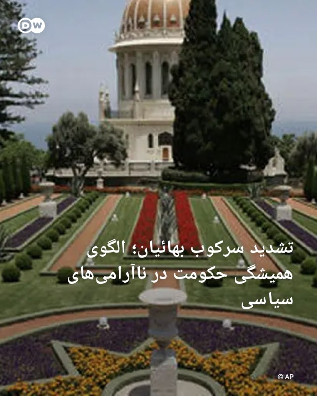

🔶 تشدید سرکوب بهائیان؛ الگوی همیشگی حکومت در ناآرامی‌های سیاسی
 
🔻 گزارشی از الینا فرهادی
 
در حالی که جمهوری اسلامی ایران در ماه‌های اخیر با خیلی از بحران‌های داخلی، تنش‌های منطقه‌ای و فشارهای امنیتی روبه‌رو بوده، جامعه بهائیان ایران بار دیگر با موج تازه‌ای از سرکوب مواجه شده است؛ موجی که این‌بار تنها به بازداشت و احکام قضایی محدود نمانده و با یورش به منازل، مصادره اموال، تبلیغات سازمان‌یافته و طرح اتهام‌های امنیتی علیه شهروندان بهائی همراه شده است.
 
در روزهای گذشته، گزارش‌های منتشرشده از سوی نهادهای حقوق بشری، از افزایش فشارها بر بهائیان در شهرهایی چون شیراز، ساری، کرمان و مشهد خبر داده‌اند.
 
وب‌سایت حقوق بشری "هه‌نگاو" گزارش داده نیروهای امنیتی در روزهای اخیر به خانه فرامرز و پریوش ندافیان، زوج بهائی ساکن شیراز، یورش برده و پس از چند ساعت تفتیش، تلفن‌های همراه، کتاب‌ها، وسایل شخصی و حتی طلا و جواهرات خانواده را ضبط کرده‌اند. یک روز پیش از آن نیز مأموران امنیتی به خانه افسانه جذابی، شهروند بهائی در شیراز حمله کرده و با طرح اتهام "همکاری با اسرائیل"، بخشی ازاموال شخصی  او را مصادره کرده‌اند.
 @dw_farsi

## DW_Farsi — post 124688

📸 آشنایی با ریما حسین؛ رکورددار داوری فوتبال زنان آلمان

وقتی درباره فوتبال حرف می‌زنیم، معمولا همه نگاه‌ها به بازیکنان دوخته می‌شود. اما بعضی شخصیت‌ها بدون آنکه گل بزنند، تاریخ‌ساز می‌شوند.

ریما حسین این آخر هفته پس از بیش از ۲۰ سال فعالیت حرفه‌ای، برای آخرین بار در بوندس‌لیگای زنان سوت خواهد زد؛ در حالی‌که با ۱۵۶ قضاوت، رکورددار داوری در فوتبال زنان آلمان است.

اما نکته‌ای که داستان او را خاص‌تر می‌کند، فقط رکوردهایش نیست. ریما حسین پیش از ورود به داوری بین‌المللی، دکتر داروساز بود و هم‌زمان مسیر دشوار داوری حرفه‌ای را نیز طی کرد.

@dw_farsi

## DW_Farsi — post 124687

🔶 مالزی: ایران برای انتقال نفت از خلأ حقوقی سوءاستفاده می‌کند

ناظران صنعت کشتیرانی و گروه  "اتحاد علیه ایران هسته‌ای" می‌گویند آب‌های نزدیک ایالت جنوبی "جوهور" در مالزی به یکی از مراکز اصلی انتقال کشتی‌به‌کشتی نفت توسط "ناوگان سایه" ایران تبدیل شده است؛ ناوگانی متشکل از نفتکش‌های فرسوده که اغلب با خاموش کردن سیستم‌های رهگیری، استفاده از هویت‌های جعلی و ساختارهای مالکیتی مبهم، منشأ نفت خام خود را پنهان می‌کنند.

این محموله‌های نفتی عمدتاً راهی چین هستند. 

منطقه دریایی جوهور که با نام "EOPL" در دریای چین جنوبی شناخته می‌شود، حدود ۷۰ کیلومتر از سواحل مالزی فاصله دارد. این ناحیه در یکی از پرترددترین مسیرهای تجاری دریایی جهان واقع شده و تقریباً در میانه راه میان ایران و چین قرار دارد. بنا بر برآوردهای کنونی چین حدود ۹۰ درصد نفت ایران را خریداری می‌کند.

منطقه دریایی"EOPL" شامل محدوده لنگرگاهی و آب‌های آزاد در شرق منطقه بندری سنگاپور و سواحل مالزی است که به علت محدودیت‌های حقوقی به عنوان یکی از نقاط کلیدی در انتقال نفت کشتی‌به‌کشتی شناخته می‌شود.

@dw_farsi

## Persian_Trend_Official — post 14143

🔴 مشاهده سامانه پدافندی چینی در دست سرباز اوکراینی

💢تصاویری منتشر شده که یک سرباز اوکراینی را در حال استفاده از سامانه پدافند هوایی دوش‌پرتاب «اف‌ان-۱۶» ساخت چین نشان می‌دهد.

▪️ «اف‌ان-۱۶» یک موشک دوش‌پرتاب کوتاه‌برد ضداهداف هوایی است

▪️ این سامانه برای مقابله با:

بالگردها
پهپادها
و هواگردهای کم‌ارتفاع طراحی شده است.

نحوه رسیدن این سامانه چینی به نیروهای اوکراینی مشخص نیست و تاکنون توضیح رسمی درباره آن منتشر نشده است.

🫆:Tony

📌 @persian_trend_official
پرشین ترند | متفاوت‌ترین کانال نظامی

## Persian_Trend_Official — post 14142

  <a href="telegram/content/Persian_Trend_Official_14142_1778770141.mp4">🎬 Download video</a>

💢فرمانده سنتکام، برد کوپر:

💢کار ما آماده بودن است و ما آماده‌ایم
مذاکرات حساس ادامه دارد

🫆:Tony

📌 @persian_trend_official
پرشین ترند | متفاوت‌ترین کانال نظامی

## Persian_Trend_Official — post 14141

  

🔴 روسیه زیردریایی‌های هسته‌ای «بوری» را با تور ضدپهپاد پوشاند

💢تصاویر ماهواره‌ای جدید نشان می‌دهد روسیه دو زیردریایی هسته‌ای کلاس «بوری» را در پایگاه کامچاتکا در اقیانوس آرام به‌طور کامل با تورهای ضدپهپادی پوشانده است.

🔹بر اساس گزارش‌ها:

▪️ این پایگاه حدود ۷۴۰۰ کیلومتر با اوکراین فاصله دارد

▪️ برای نخستین‌بار کل بدنه زیردریایی‌ها، نه فقط اسکله یا برجک آن‌ها، زیر پوشش تور قرار گرفته است

▪️ این اقدام احتمالاً با هدف مقابله با تهدید پهپادها انجام شده است

🔹زیردریایی‌های کلاس «بوری» بخشی از مهم‌ترین توان هسته‌ای دریایی روسیه محسوب می‌شوند و هرکدام توان حمل:

▪️ ۱۶ موشک بالستیک قاره‌پیما با چندین کلاهک هسته‌ای مستقل را دارند.

💢این اقدام نشان می‌دهد نگرانی روسیه از تهدید پهپادها اکنون حتی به پایگاه‌های راهبردی هسته‌ای در دوردست‌ترین مناطق این کشور نیز رسیده است.

🫆:Tony

📌 @persian_trend_official
پرشین ترند | متفاوت‌ترین کانال نظامی

## Persian_Trend_Official — post 14140

🔴 شی جین‌پینگ: روابط چین و آمریکا مهم‌ترین رابطه دوجانبه جهان است

💢رئیس‌جمهور چین اعلام کرد روابط پکن و واشینگتن مهم‌ترین رابطه دوجانبه در جهان محسوب می‌شود و دو کشور باید از تقابل پرهیز کنند.

🔹شی جین‌پینگ پس از دیدار با دونالد ترامپ گفت:

▪️ چین و آمریکا بیشترین منفعت را از همکاری مشترک می‌برند

▪️ دو کشور در صورت تقابل، متحمل خسارت خواهند شد

▪️ پکن و واشینگتن باید شریک باشند، نه رقیب

🔹او همچنین افزود:

▪️ در دیدار با ترامپ درباره روابط دوجانبه و تحولات منطقه‌ای و جهانی گفت‌وگوهای عمیقی انجام شده است

▪️ دو طرف بر ایجاد روابطی «سازنده و با ثبات راهبردی» توافق کرده‌اند

▪️ هدف از این رویکرد، کمک به صلح، ثبات و توسعه پایدار در جهان عنوان شده است

🫆:Tony

📌 @persian_trend_official
پرشین ترند | متفاوت‌ترین کانال نظامی

## Persian_Trend_Official — post 14139

  

🔴 طوفان مرگبار در هند؛ دست‌کم ۸۹ کشته 💢تصاویر منتشرشده از ایالت اوتار پرادش هند، شدت طوفان و بادهای سهمگین در این منطقه را نشان می‌دهد 💢 خبرگزاری رویترز گزارش داده طوفان شدید در ایالت اوتار پرادش هند دست‌کم ۸۹ تا ۱۰۴ کشته برجا گذاشته است. ▪️ در ویدئوهای…

## Persian_Trend_Official — post 14137

  <a href="telegram/content/Persian_Trend_Official_14137_1778770144.mp4">🎬 Download video</a>

🔴 طوفان مرگبار در هند؛ دست‌کم ۸۹ کشته

💢تصاویر منتشرشده از ایالت اوتار پرادش هند، شدت طوفان و بادهای سهمگین در این منطقه را نشان می‌دهد

💢 خبرگزاری رویترز گزارش داده طوفان شدید در ایالت اوتار پرادش هند دست‌کم ۸۹ تا ۱۰۴ کشته برجا گذاشته است.

▪️ در ویدئوهای منتشرشده از شهر بریلی، لحظه بلند شدن یک مرد توسط شدت باد دیده می‌شود

️▪️طبق گزارش‌ها، آن مرد همراه با سقف فلزی توسط باد به هوا پرتاب شد اما زنده مانده و دچار شکستگی دست و پا شده است.

🫆:Tony

📌 @persian_trend_official
پرشین ترند | متفاوت‌ترین کانال نظامی

## Persian_Trend_Official — post 14136

  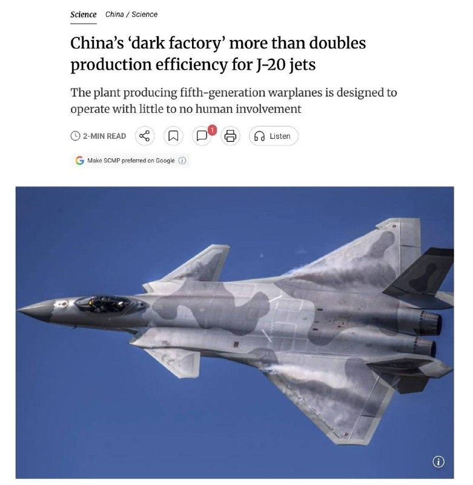

🔴 چین تولید جنگنده پنهانکار «جی-۲۰» را با کارخانه تمام‌خودکار افزایش داد

💢گزارش‌ها حاکی است چین به‌صورت بی‌سروصدا بهره‌وری تولید پیشرفته‌ترین جنگنده پنهانکار خود را بیش از دو برابر کرده است.

🔹بر اساس گزارش «ساوت چاینا مورنینگ پست»:

▪️ یکی از کارخانه‌های چنگدو به یک «کارخانه تاریک» تمام‌خودکار تبدیل شده است

▪️ در این مجموعه، ماشین‌ها و خودروهای خودران مبتنی بر هوش مصنوعی تقریباً به‌صورت ۲۴ ساعته فعالیت می‌کنند

▪️ به‌دلیل خودکار بودن فرایندها، نیاز چندانی به روشنایی و نیروی انسانی وجود ندارد

💢این کارخانه اکنون قطعات ساختاری جنگنده پنهانکار «جی-۲۰» ملقب به «اژدهای قدرتمند» را تولید می‌کند؛ جنگنده‌ای که از آن به‌عنوان رقیب چینی «اف-۲۲» آمریکا یاد می‌شود.

🔹بر اساس این گزارش:

▪️ استفاده گسترده از اتوماسیون باعث کاهش هزینه تولید شده است

▪️ وابستگی به نیروی انسانی شبانه‌روزی کاهش یافته

▪️ تولید انبوه جنگنده «جی-۲۰» از سال ۲۰۲۰ آغاز شده است

🫆:Tony

📌 @persian_trend_official
پرشین ترند | متفاوت‌ترین کانال نظامی

## Persian_Trend_Official — post 14135

  

اکانت کاخ سفید در شبکه ایکس:
تاریخ در حرکت است.

☆Phantom☆

📌 @persian_trend_official
پرشین ترند | متفاوت‌ترین کانال نظامی

## Persian_Trend_Official — post 14134

خدارو شکر دیگه کم کم هر ننه قمری فاز کوسه برداشته و میخواد به حساب دیگران رسیدگی کنه! جناب کریم شیره ای، شما اگر خیلی حساب و کتاب سرت میشه برو پول بساطت رو با ساقی محل حساب کن .

## Persian_Trend_Official — post 14131

  <a href="telegram/content/Persian_Trend_Official_14131_1778770146.jpg">🎬 Download video</a>

کانال هذیان گو اخبار سوریه، با محتوایی سمی و تخیلی ۶۰۰ میلیون از وزارت نفت به اسم تبلیغات !!! هزینه میگیره !

ادعای خط انرژی در مورد دریافتی ۶۰۰ میلیون تومانی مالک کانال ارزشی، قلم به مزد و دروغ پرداز اخبار سوریه از پتروشیمی آریا

در این کشور برای هر نوع چریدن و هدر دادن بیت المال پول کافی وجود دارد اما برای خرج های اصلی مملکت یا ساخت ارتشی توانمند دچار کسری بودجه ایم!

https://farsnews.ir/Khate_energy/1778660394098111565/%D8%A7%D8%B2-%D8%A7%D8%AE%D8%A8%D8%A7%D8%B1-%D8%B3%D9%88%D8%B1%DB%8C%D9%87-%D8%AA%D8%A7-%D9%88%D8%B2%D8%A7%D8%B1%D8%AA-%D9%86%D9%81%D8%AA-%D9%88-%D9%BE%D8%AA%D8%B1%D9%88%D8%B4%DB%8C%D9%85%DB%8C-%D8%A2%D8%B1%DB%8C%D8%A7%D8%B3%D8%A7%D8%B3%D9%88%D9%84-%DA%86%D8%B1%D8%A7-%D8%A8%D9%87-%D8%AE%D8%B7-%D8%A7%D9%86%D8%B1%DA%98%DB%8C-%D8%AD%D9%85%D9%84%D9%87-%D9%85%DB%8C-%DA%A9%D9%86%D9%86%D8%AF

📌 @persian_trend_official
پرشین ترند | متفاوت‌ترین کانال نظامی

## Persian_Trend_Official — post 14130

  

🔴عباس عراقچی، وزیر امور خارجه جمهوری اسلامی، و سرگئی لاوروف، وزیر امور خارجه روسیه، در شهر دهلی نو (پایتخت هند) با یکدیگر دیدار و گفتگو کردند

🫆:Tony

📌 @persian_trend_official
پرشین ترند | متفاوت‌ترین کانال نظامی

## Persian_Trend_Official — post 14127

🇬🇧 صبح امروز ویدئویی منتشر شد که ورود زیردریایی هسته‌ای «HMS Anson» متعلق به نیروی دریایی سلطنتی بریتانیا به جبل‌الطارق رو نشون میده؛ موضوعی که اعزام این زیردریایی به منطقه غرب آسیا رو تا حد زیادی تأیید می‌کنه.

اچ ام اس آنسون از پیشرفته‌ترین زیردریایی‌های تهاجمی کلاس Astute به‌شمار میره و به راکتور هسته‌ای مجهزه؛ یعنی می‌تونه ماه‌ها بدون نیاز به سوخت‌گیری در عمق دریا عملیات انجام بده و با سطح صدای بسیار پایین، شناسایی اون برای دشمن سخت باشه.

این زیردریایی معمولاً در مأموریت‌های شناسایی و جمع‌آوری اطلاعات، رهگیری زیردریایی‌ها و ناوهای دشمن، حفاظت از ناوگروه‌های دریایی، حملات موشکی دوربرد به اهداف زمینی و حتی پشتیبانی از عملیات نیروهای ویژه استفاده میشه.

اچ ام اس آنسون توان حمل تا ۳۸ سلاح رو داره که از طریق ۶ لوله اژدر ۲۱ اینچی شلیک میشن؛ از جمله موشک‌های کروز <<Tomahawk Block IV>> با برد بالا و دقت زیاد برای هدف قرار دادن مراکز نظامی و زیرساخت‌ها، و اژدرهای سنگین <<Spearfish>> برای نابودی شناورهای سطحی و زیردریایی‌ها.
حضور چنین زیردریایی‌هایی معمولاً در شرایط تنش نظامی یا برای نمایش قدرت و افزایش بازدارندگی انجام میشه؛ مخصوصاً در مناطقی که اهمیت راهبردی بالایی دارن.

☆Phantom☆

📌 @persian_trend_official
پرشین ترند | متفاوت‌ترین کانال نظامی

## Persian_Trend_Official — post 14126

  <a href="telegram/content/Persian_Trend_Official_14126_1778770147.mp4">🎬 Download video</a>

❗️پاکستان با موفقیت موشک کروز زمین‌پایه بومی «فتح-۴» را آزمایش کرد.

ویدئو منتشرشده لحظه شلیک این موشک را نشان می‌دهد؛ موشک پس از پرتاب با طی مسیر خود، هدف تعیین‌شده را با اصابت دقیق و انفجاری سنگین منهدم می‌کند.

گفته می‌شود «فتح-۴» در چارچوب توسعه توان بازدارندگی و ارتقای قابلیت حملات دقیق دوربرد پاکستان طراحی شده و بخشی از برنامه نوسازی سامانه‌های موشکی این کشور به‌شمار می‌رود.

☆Phantom☆

📌 @persian_trend_official
پرشین ترند | متفاوت‌ترین کانال نظامی

## RadioFarda — post 157181

  

🔸رئیس فدراسیون فوتبال ایران می‌گوید هنوز برای هیچیک از اعضای تیم ملی برای شرکت در جام جهانی ۲۰۲۶ ویزا صادر نشده است.

🔸خبرگزاری جمهوری اسلامی، ایرنا، به نقل از مهدی تاج نوشته است: «فردا یا پس‌فردا جلسه‌ای سرنوشت‌ساز با فیفا خواهیم داشت. آن‌ها باید به ما تضمین بدهند، زیرا هنوز مسئله ویزا حل نشده.»

🔸او افزود: «روایتی از سوی طرف مقابل مبنی بر اینکه به چه کسانی ویزا داده‌اند، دریافت نکرده‌ایم. هنوز هیچ ویزایی نیامده است.»

🔸رئیس فدراسیون فوتبال ایران که در روزهای اخیر شرط‌هایی برای حضور در جام جهانی از جمله لزوم صدور ویزا برای کل اعضای تیم و کادر فنی اعلام کرده بود، همچنین گفت: «ما در حال آماده‌سازی برای جام جهانی هستیم، اما منتظر رفتار طرف مقابل هستیم.»

🔸کاروان تیم ملی فوتبال روز چهارشنبه به ترکیه رفت تا بعد از یک اردوی چند روزه عازم آمریکا به عنوان میزبان مسابقات تیم ایران شود.

🔸رئیس فیفا پیش‌تر چند بار گفته است که ایران قطعا در جام جهانی شرکت خواهد کرد. دونالد ترامپ، رئیس‌جمهور ایالات متحده، نیز اعلام کرده که مشکلی با حضور ایران ندارد.

@RadioFarda

## RadioFarda — post 157180

  

🔸ستاد فرماندهی مرکزی ایالات متحده، سنتکام، روز پنجشنبه ۲۴ اردیبهشت با انتشار تصویری از عملیات ناو آمریکایی «یو‌اس‌اس تراکستون» در دریای عرب اعلام کرد که نیروهای این فرماندهی تاکنون ۷۰ کشتی تجاری را در چارچوب محاصره دریایی ایران وادار به تغییر مسیر کرده‌اند.

🔸سنتکام همچنین اعلام کرد چهار شناور نیز برای اجرای محاصره «از کار انداخته» شده‌اند.

🔸سنتکام پیش‌تر گفته بود در چارچوب این عملیات، به ۱۵ کشتی حامل کمک‌های بشردوستانه اجازه عبور داده شده و نیروهای آمریکایی برای وادار کردن برخی کشتی‌ها به تغییر مسیر، از تماس رادیویی و شلیک تیر هشدار نیز استفاده کرده‌اند.

🔸آمریکا پس از بی‌نتیجه ماندن مذاکرات مستقیم با ایران، محاصره دریایی بنادر جمهوری اسلامی را آغاز کرد؛ در حالی که ایران از ابتدای جنگ تنگه هرمز را مسدود کرده است.

@RadioFarda

## RadioFarda — post 157179

  

🔸رسانه‌های حکومتی ایران روز چهارشنبه گفتند نیروهای نظامی جمهوری اسلامی از شامگاه گذشته به گروهی از کشتی‌های چینی اجازه عبور از تنگه هرمز را داده‌اند.

🔸ساعتی بعد صداوسیمای جمهوری اسلامی اعلام کرد «بیش از ۳۰ کشتی» اجازه عبور از این آبراه را یافته‌اند، اما مشخص نکرد که آیا همه آنها چینی بوده‌اند یا نه.

🔸خبرگزاری‌های فارس و تسنیم، هردو نزدیک به سپاه پاسداران، به نقل از منابع آگاه خبر دادند که «با تصمیم جمهوری اسلامی» امکان عبور تعدادی از کشتی‌های چینی از تنگه هرمز «با رعایت پروتکل مدیریت ایرانی تنگه» فراهم شده است.

🔸این اتفاق همزمان با حضور دونالد ترامپ، رئیس‌جمهور آمریکا، در چین رخ داده است. کاخ سفید گفته واشینگتن و پکن توافق کردند که تنگه هرمز باید برای حفظ جریان آزاد انرژی باز بماند و رئیس‌جمهور چین مخالفت چین با «نظامی‌سازی» این آبراه و هرگونه تلاش برای دریافت عوارض برای استفاده از آن را اعلام کرده است.

🔸ایران از زمان آغاز حملات آمریکا و اسرائیل در نهم اسفند سال گذشته، تنگه هرمز را مسدود کرده و آمریکا نیز بعد از آتش‌بس دست به محاصره دریایی ایران زده است.

@RadioFarda

## RadioFarda — post 157178

🔸امید برزگری، مربی سازمان امداد و نجات هلال احمر، در یک گفت‌وگوی تصویری با خبر آن‌لاین دربارۀ سگ‌های امداد و نجات گفت «این سگ‌ها پست نیستند؛ فرشته‌اند، فرشتۀ نجات».

🔸آقای برزگری که به همراه همکارش و دو سگ نجات خود در این گفت‌وگو شرکت کرده بود این جمله را در پاسخ به گزارشی از صداوسیمای جمهوری اسلامی گفت که از مردم پرسیده بود «چه کسی از سگ‌های هلال احمر پست‌تر است».

🔸جمعیت هلال احمر ایران روز سه‌شنبه ۲۵ فروردین اعلام کرد که سگ‌های زنده‌یاب این سازمان، از ابتدای جنگ اخیر، در ۷۹۲ عملیات جستجو و نجات شرکت کردند که از این تعداد، در ۷۱۱ عملیات موفق به زنده‌یابی و جستجوی پیکر کشته‌شدگان شدند.

🔸سگ‌های تجسس هلال احمر در جنگ ۱۲ روزه اسرائیل و ایران هم نقش مهمی ایفا کردند و شماری از سگ‌های زنده‌یاب هلال احمر زخمی و دست کم دو قلاده از آن‌ها در جریان عملیات کشته شدند.

🔸استفاده از سگ‌ها در مواقع جنگ و حوادث غیرمترقبه در ایران در حالی است که داشتن این حیوان خانگی از سوی مقامات جمهوری اسلامی نماد «فرهنگ غربی» توصیف و همواره منع می‌شود.
@RadioFarda

## RadioFarda — post 157177

🔸رسانه‌های ایران می‌گویند وزیر خارجه جمهوری اسلامی در نشست بریکس در دهلی‌نو، امارات متحده عربی را به «دخالت مستقیم» در عملیات نظامی علیه کشورش متهم کرد. 🔸این تنش یک روز پس از آن رخ داد که امارات ادعای بنیامین نتانیاهو، نخست‌وزیر اسرائیل، مبنی بر سفر به این…

## RadioFarda — post 157176

  

🔸رسانه‌های ایران می‌گویند وزیر خارجه جمهوری اسلامی در نشست بریکس در دهلی‌نو، امارات متحده عربی را به «دخالت مستقیم» در عملیات نظامی علیه کشورش متهم کرد.

🔸این تنش یک روز پس از آن رخ داد که امارات ادعای بنیامین نتانیاهو، نخست‌وزیر اسرائیل، مبنی بر سفر به این کشور حاشیه خلیج فارس در جریان جنگ ایران را رد کرد.

🔸خبرگزاری مهر به نقل از عراقچی نوشت: «من به خاطر حفظ وحدت، در سخنرانی‌ام در بریکس نامی از امارات نبردم. اما حقیقت این است که امارات مستقیماً در تجاوز علیه کشور من دخیل بود. وقتی حملات آغاز شد، آن‌ها حتی آن را محکوم هم نکردند.»

🔸رسانه‌های ایرانی مشخص نکردند که نماینده امارات چه اظهاراتی در این نشست مطرح کرده بود.

🔸بر اساس این گزارش‌ها، عراقچی همچنین گفت که «نه پایگاه‌های آمریکا و نه اتحاد با اسرائیل برای امارات امنیت به همراه نیاورده و این کشور باید در سیاست خود نسبت به ایران تجدیدنظر کند».

@RadioFarda

## RadioFarda — post 157175

  

🔸مرکز عملیات تجارت دریایی بریتانیا روز پنجشنبه ۲۴ اردیبهشت اعلام کرد پس از وقوع حادثه‌ای دریایی در شمال شرقی امارات متحده عربی، «افراد غیرمجاز» کنترل یک کشتی در لنگرگاه را به دست گرفته‌اند و این کشتی اکنون به سوی آب‌های سرزمینی ایران در حرکت است.

🔸این نهاد گفت گزارشی دربارهٔ حادثه دریایی در ۳۸ مایل دریایی (حدود ۷۰ کیلومتری) شمال شرقی بندر فجیره امارات متحده عربی دریافت کرده و پس از آن، کشتی به تصرف درآمده و مسیر آن به سوی آب‌های سرزمینی ایران تغییر داده شده است.

🔸از مشخصات این کشتی و هویت افرادی که کنترل آن را در دست گرفته‌اند، هنوز اطلاعاتی منتشر نشده است.
@RadioFarda

## RadioFarda — post 157173

  

🔸وزارت خارجه هند حمله به یک کشتی با پرچم این کشور را که می‌گوید روز چهارشنبه ۲۳ اردیبهشت در نزدیکی سواحل عمان رخ داده است، «غیرقابل قبول» خواند.

🔸وزارت خارجه هند در بیانیه‌ای افزود که هدف قرار دادن کشتی‌های تجاری و دریانوردان غیرنظامی باید متوقف شود و از مقام‌های عمان برای نجات خدمه تشکر کرد.

🔸شرکت امنیت دریایی «ونگارد» نام این کشتی را «ام‌اس‌وی حاج علی» اعلام کرده و گفته است که این لنج چوبی ۵۴ متری در نزدیکی سواحل لیما در عمان، در جنوب تنگه هرمز، پس از وقوع انفجار غرق شده است.

🔸بر اساس این گزارش، کشتی در حال انتقال دام از بندر بربره در سومالی‌لند به شارجه در امارات متحده عربی بوده که احتمالاً هدف حمله پهپادی یا موشکی قرار گرفته است.

🔸حکومت ایران از نهم اسفند پارسال و شروع جنگ آمریکا و اسرائیل با ایران عملاً تنگه هرمز را مسدود کرده و آمریکا نیز با وجود آتش‌بس شکننده‌ای که از ۱۹ فروردین برقرار شده، محاصره دریایی بنادر ایران را ادامه داده است.

@RadioFarda

## IranianMinds — post 20133

  <a href="telegram/content/IranianMinds_20133_1778770152.mp4">🎬 Download video</a>

🔴 فرمانده سنتکام، دریاسالار برد کوپر:

مذاکرات با ریسک بالا ادامه دارد.
وظیفه ما این است که آماده باشیم و هستیم.

@IranianMinds

## IranianMinds — post 20132

🔴 شرکت هواپیمایی ایتالیایی ITA Airways بازگشت پروازهای خود به اسرائیل را تا اول جولای به تعویق انداخت

@IranianMinds

## IranianMinds — post 20131

🔴 فرمانده سنتکام :

ما هر لحظه آماده حرکت علیه ایران هستیم

@IranianMinds

## IranianMinds — post 20130

🔴 وزیر خزانه‌داری آمریکا:
طی سه روز گذشته هیچ بارگیری در تاسیسات نفتی ایران انجام نشده است.

@IranianMinds

## IranianMinds — post 20129

  

😤دنبال یه سایت شرط بندی بین المللی بودی که به ایرانیا خدمات بده؟!
⛔

👍دربی بت همون انتخاب  100%

💎ویژگی های سایت جهانی Derby Bet:

⬅️امکان شارژ امن با کارت بانکی

⬅️واریز اول دوبل شارژ می شوید(بونوس۱۰۰٪)

⬅️پر اپشن ترین سایت فعال در ایران

⬅️تسویه حساب کمتر از 5 دقیقه

⬅️برگشت بخشی از باخت به صورت هفتگی

🚨کد هدیه ثبت نام:GG007

⚠️برای دانلود اپلکیشن کلیک کنید
👉
ge24

🔔کانال دربی بت :

🪙https://t.me/+aCbq7yy8QY80NzQ0

## IranianMinds — post 20128

  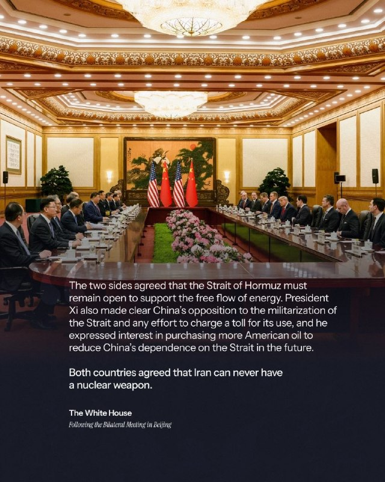

🔴کاخ سفید:

هر دو کشور ( چین و آمریکا ) توافق کردند که ایران هرگز نمی‌تواند سلاح هسته‌ای داشته باشد.

@IranianMinds

## IranianMinds — post 20127

  

لامین یامال بازیکن چپول بارسلونا که تو‌ جشن قهرمانی بارسا پرچم فلسطینو گرفته دستش @IranianMinds

## IranianMinds — post 20126

ShirOKhorshid-2026.05.14.apk

## IranianMinds — post 20125

ShirOKhorshid-2026.05.14.apk

## IranianMinds — post 20124

  <a href="https://t.me/IranianMinds/20124">📎 Download file</a>

آموزش اتصال به اینترنت بین الملل:

🔺 مهم: اگر این نسخه رو نصب کنید دیگه دردسر ستاپ کردن MITM و... ندارید!
این نسخه حدودا یک ساعت پیش توسط برنامه‌نویس شیر و خورشید آپدیت شد و به راحتی می‌تونید طبق این آموزش بهش وصل بشید:
1- وارد اپلیکیشن شیر و خورشید(آخرین نسخه که امروز منتشر شده) می‌شید
2- وارد بخش Options میشید از نوار بالا
3- روی More Options کلیک میکنید
4- گزینه‌ی Connection Protocol رو قرار میدید روی CDN Fronting
5- میرید و عادی کانکت میشید و به راحتی وصل میشه.

@IranianMinds

## IranianMinds — post 20123

  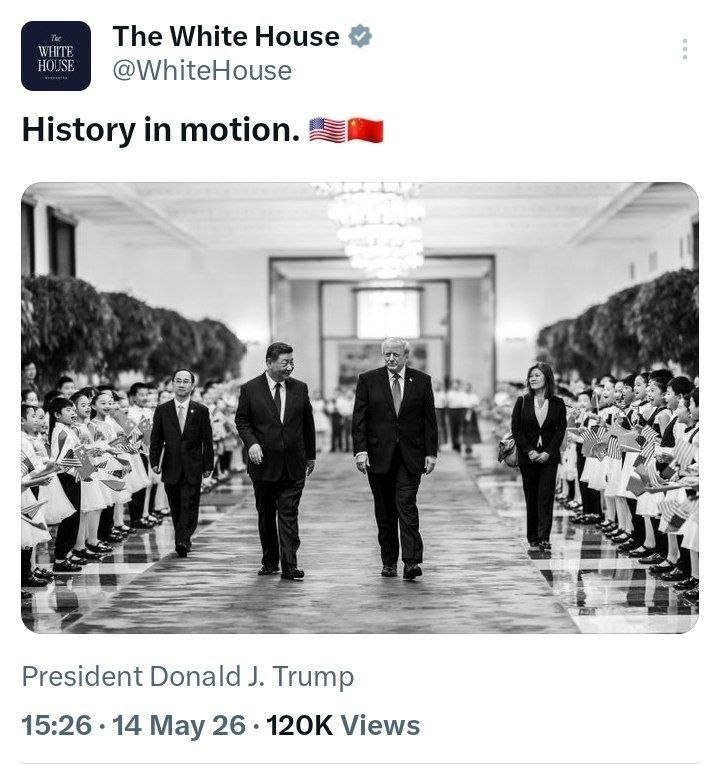

🔴پست کاخ سفید در ایکس:
تاریخ در حرکت است.

@IranianMinds

## IranianMinds — post 20122

  

🔴 ببین کی داره اینو میگه…

دو روز ۱۸ و ۱۹ دی ۱۴۰۴، ۲۳۶ کودک رو کشتید.
۵۵۵ بچه رو هم بازداشت کردید.

آها یادم نبود کودکان غزه و فلسطین مال شماس.

@IranianMinds

## IranianMinds — post 20121

  

⚠️اوتباند موجود⚠️

🔋حداقل خرید 30GB

♾حداکثر محدودیتی نداره

50GB ➡️ 180

100GB ➡️140

200GB ➡️120

+500GB ➡️100

🧬 500 گیگ به بالا امکان تسویه روزانه نیز فراهم می باشد

⬅️دارای لود بالانس و اپتایم 99/9% بدون قعطی
⬅️تست موجود می باشد

جهت خرید و استعلام قیمت🟡

@xan_vpnn

کانال:

https://t.me/+qNjExGEJztE2OGI0

## IranianMinds — post 20120

  

🔴بنر حامیان حکومت در تجمع دیشب تهران:
سید مجید نقطه‌زن، امتحانا نزدیکه، یه جایی‌رو زود بزن.

@IranianMinds

## IranianMinds — post 20119

  

ایلان ماسک به همراه پسرش در نشست پکن شرکت کرد.

@IranianMinds

## IranianMinds — post 20118

  <a href="telegram/content/IranianMinds_20118_1778770158.mp4">🎬 Download video</a>

🔴 صحبت‌های امروز اسکات بسنت، وزیر خزانه‌داری آمریکا راجب ایران و جمهوری‌اسلامی: تا اینجای امسال، رژیم ایران ۳۰ تا ۴۰ هزار نفر رو اعدام کرده (کُشته) و خیلی‌هاشون هم معترضای مسالمت‌آمیز بودن. خب با همچین رژیمی چطور باید برخورد کرد؟ از نظر اقتصادی خفه‌ش می‌کنیم و فکر می‌کنیم کار به جایی رسیده که سربازاشون حقوق نمی‌گیرن و نمی‌تونن از خارج هم سلاح و مهماتشون رو تأمین کنن. برای همین فکر می‌کنم دیگه دارن به آخر خط می‌رسن.

@IranianMinds

## IranianMinds — post 20117

🔴 یسرائیل کاتز، وزیر دفاع اسرائیل، درباره ایران: ماموریت ما کامل نشده؛ ما برای احتمال اینکه ممکنه مجبور شیم دوباره اقدام کنیم، شاید حتی «بزودی» آماده‌ایم. اگر اهدافمون تأمین نشن، دوباره اقدام خواهیم کرد.

@IranianMinds

## BBCPersian — post 281035

  <a href="telegram/content/BBCPersian_281035_1778770160.mp4">🎬 Download video</a>

🔻‌‌‌دونالد ترامپ با هیئتی از مقامات سیاسی و تجاری از جمله چندین نفر از مدیران ارشد شرکت‌های بزرگ، مانند ایلان ماسک، موسس تسلا و اسپیس‌اکس، تیم کوک، مدیرعامل اپل و جنسن هوانگ، مدیر اجرایی انویدیا به چین سفر کرده است.

دونالد ترامپ و شی جین‌پینگ، رئیس‌جمهور چین حدود دو ساعت با هم مذاکره کردند که دو برابر مدت زمانی بود که در ابتدا برای آن برنامه‌ریزی شده بود. آقای ترامپ در پاسخ به خبرنگاران این گفتگوها را «عالی» توصیف کرد.

اما حضور مارکو روبیو، وزیر امور خارجه آمریکا حتی پیش از ورودش به چین هم خبرساز شده بود. آقای روبیو از سال ۲۰۲۰ تحت دو تحریم دولت چین است، چون در دورانی که سناتور ایالت فلوریدا بود مواضعی سرسختانه درباره هنگ‌کنگ، اقلیت مسلمان اویغور و حقوق بشر در چین داشت.

اما پکن از زمان انتصاب او به وزارت خارجه آمریکا راهکاری برای دور زدن تحریم‌های خود به کار می‌بندد. آنها بخش نخست نام خانوادگی روبیو را در زبان چینی با حرف «لو» می‌نویسند تا تحریم‌ها را اجرا نکنند و لغو هم نکرده باشند.

https://bbc.in/4wyYEzS
@BBCPersian

## BBCPersian — post 281034

🔻دولت اسرائیل از نیویورک‌تایمز به خاطر مقاله‌اش شکایت می‌کند

🔻دفتر نخست‌وزیری اسرائیل روز پنج‌شنبه با صدور بیانیه‌ای اعلام کرد که این کشور علیه روزنامه نیویورک تایمز به دلیل انتشار یادداشتی از نیکلاس کریستوف که شامل اتهاماتی مبنی بر سوءاستفاده جنسی جدی از فلسطینیان در زندان‌های اسرائیل بود، اقدام قانونی خواهد کرد.

مقاله کریستف با عنوان «سکوتی که تجاوز به فلسطینیان با آن روبرو می‌شود» روز دوشنبه ۱۱ مه در نیویورک‌تایمز منتشر شده است.

دفتر نخست‌وزیری اسرائیل که این اتهام را «یکی از زشت‌ترین و تحریف‌شده‌ترین دروغ‌هایی که تاکنون علیه دولت اسرائیل منتشر شده» خوانده و گفته که بنیامین نتانیاهو، نخست‌وزیر، و گیدعون سعر، وزیر خارجه، به مقامات دستور داده‌اند تا مقدمات طرح شکایت افترا علیه این نشریه را آغاز کنند.

روزنامه نیویورک‌تایمز روز چهارشنبه با انتشار بیانیه‌ای ضمن دفاع از انتشار این مطلب، اعلام کرده بود که روایت ۱۴ زن و مردی که در این مطلب مورد اشاره قرار گرفته‌اند راستی‌آزمایی و با روایت شاهدان دیگر مقایسه شده است.

https://bbc.in/49yqhit
@BBCPersian

## BBCPersian — post 281033

  <a href="telegram/content/BBCPersian_281033_1778770161.mp4">🎬 Download video</a>

🔻سرخط خبرهای روز پنجشنبه ۲۴ اردیبهشت ماه ۱۴۰۵

@BBCPersian

## BBCPersian — post 281032

🔻وزیر بهداشت بریتانیا در اعتراض به رهبری استارمر استعفا داد

🔻وس استریتینگ، وزیر بهداشت بریتانیا با انتشار استعفانامه خود در شبکه ایکس، نوشت که «اعتماد به رهبری» کی‌یر استارمر، نخست‌وزیر بریتانیا را «از دست داده‌» و ادامه حضورش در دولت را «غیراخلاقی و برخلاف اصول» می‌داند.

او در بخشی از نامه، از کی‌یر استارمر بابت «شجاعت و دولتمردی» در عرصه بین‌المللی تمجید کرد و نوشت که نخست‌وزیر بریتانیا توانسته کشورش را «از جنگ با ایران دور نگه دارد.»

او همچنین می‌گوید که جنگ‌ها در اروپا و خاورمیانه، مشکلات داخلی بریتانیا را دشوارتر کرده‌اند.

آقای استریتینگ پس از نتایج فاجعه‌بار حزب کارگر در انتخابات شوراهای محلی هفته گذشته، تصمیم به استعفا گرفت.

از متن نامه استعفای او مشخص نیست که آیا از حمایت کافی برای به چالش کشیدن مستقیم کی‌یر استارمر برخوردار است و قصد دارد او را از رهبری کنار بزند یا نه.

https://bbc.in/42uHsOd
@BBCPersian

## BBCPersian — post 281031

🔻گزارش‌ها از تسهیل عبور کشتی‌های چینی از تنگه هرمز

🔻بر اساس گزارش‌ها، ایران از شب گذشته به کشتی‌های چینی بیشتری اجازه عبور از تنگه هرمز را داده است.

خبرگزاری فارس به نقل از یک منبع آگاه گزارش داده است که این اقدام به دنبال درخواست‌های وزیر امور خارجه چین و سفیر پکن در ایران انجام شده است.

خبرگزاری فارس نوشته طی روزهای گذشته دست‌کم شش نفتکش و کشتی فله‌بر با مالکیت یا بهره‌برداری عملیاتی چین از تنگه هرمز عبور کرده‌اند.

بی‌بی‌سی وریفای هم تایید کرده که دستکم یک ابرنفتکش چین روز گذشته از تنگه هرمز عبور کرده است.

ابرنفتکش با پرچم چین به نام «یوان هوا هو» بر اساس سیگنال موقعیت‌یابش، اوایل ماه مارس در بصره عراق پهلو گرفته و محموله نفت بارگیری کرده است.

این کشتی در ساعات اولیه بامداد چهارشنبه (۲۳ اردیبهشت) از تنگه هرمز عبور کرده و موقعیت خود را تنها به مدت حدود ۹۰ دقیقه در آب‌های ایران و در نزدیکی جزیره لارک نشان داده است.

به گزارش بی‌بی‌سی وریفای، این کشتی بیش از ۱۲ ساعت بعد، زمانی که در حال حرکت در وسط دریای عمان و شرق شهر صحار عمان بود، دوباره شروع به پخش موقعیت خود کرد.

مقصد اعلام‌شده این کشتی، بندر ژوشان چین است و طبق اطلاعات موجود در دسترس عموم، قرار است اوایل ژوئن (اواسط خرداد) به آنجا برسد.

مقام‌های چین هنوز این خبر را تایید نکرده‌اند.

ایران در طول جنگ آمریکا و اسرائیل، اعلام کرد که تنها «کشتی‌های بی‌طرف»، می‌توانند از این تنگه عبور کنند و گفته می‌شود که بسیاری از این کشتی‌ها از جمله متعلق به چین است.

https://bbc.in/4uNikya
@BBCPersian

## BBCPersian — post 281030

  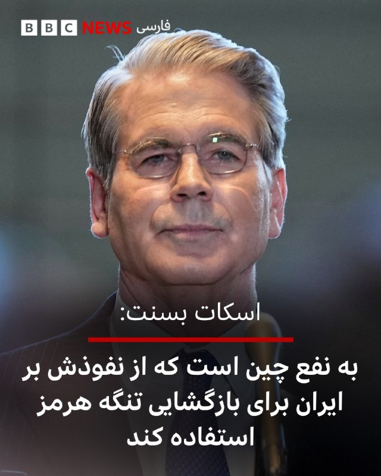

🔻اسکات بسنت، وزیر دارایی آمریکا، در گفت‌وگویی با شبکه سی‌ان‌بی‌سی در حاشیه سفر رئیس‌جمهور آمریکا، در یک مصاحبه از پیش ضبط‌شده گفت که معتقد است چین از نفوذش بر تهران برای بازگشایی تنگه هرمز استفاده خواهد کرد.

او گفت: «فکر می‌کنم آن‌ها (چینی‌ها) هر کاری از دستشان بربیاید انجام خواهند داد.»

آقای بسنت افزود: « بازگشایی تنگه هرمز بسیار به نفع چین است. فکر می‌کنم آن‌ها پشت پرده تلاش خواهند کرد، البته اگر اصلا کسی بتواند بر تصمیم‌های رهبری ایران تاثیر بگذارد.»

به اعتقاد وزیر دارایی آمریکا، چین به‌زودی سفارش بزرگی از هواپیماهای بوئینگ را اعلام خواهد کرد و افزود دو طرف در حال گفت‌وگو درباره بهبود روابط تجاری از جمله صادرات انرژی هستند.

📷Reuters
@BBCPersian

## BBCPersian — post 281029

  <a href="telegram/content/BBCPersian_281029_1778770164.mp4">🎬 Download video</a>

🔻حضور هیئت ایرانی در اجلاس بریکس به‌طور کامل در سایه جنگ آمریکا و اسرائیل با ایران و تنش‌های منطقه‌ای است.
عباس عراقچی، وزیر خارجه ایران در سخنرانی در صحن اجلاس از ناکارآمدی اقدامات نظامی علیه این کشور گفت و پس از سخنرانی در کانال تلگرامش به‌‌صراحت امارات متحده عربی را به دخالت مستقیم در حمله به ایران متهم کرد.

عباس عراقچی، همچنین از کشورهای عضو اجلاس وزرای خارجه بریکس خواست تا «نقض حقوق بین‌الملل از سوی آمریکا و اسرائیل» را محکوم کنند و وزیر خارجه هند هم تردد آزاد در تنگه هرمز را برای اقتصاد جهان «حیاتی» خواند.
رسانه‌های ایران گمانه‌زنی کرده‌اند که امارات «مانع از صدور بیانیه پایانی شود.»

آقای عراقچی همچنین گفت: «تنگه هرمز اکنون بیش از هر چیز از تجاوز آمریکا و محاصره‌ای که بر آن تحمیل کرده، آسیب می‌بیند. از نظر ما، تنگه هرمز برای تمامی کشتی‌های تجاری باز است، اما آن‌ها باید با نیروهای دریایی ما همکاری کنند.»

📷Shutterstock
@BBCPersian

## BBCPersian — post 281028

چین؛ بازیگردان پشت‌پرده ایران؟
🖋️آنتونی زوکر و لورا بیکر، بی‌بی‌سی

🔻دیدار عباس عراقچی، وزیر خارجه ایران، از پکن در هفته گذشته ظاهرا با هدف نشان دادن میزان نفوذ و اثرگذاری چین در خاورمیانه انجام شد.

ایالات متحده با دقت این موضوع را زیر نظر داشت.

مارکو روبیو، وزیر خارجه آمریکا گفت: «امیدوارم چینی‌ها به او آن چه را که باید گفته شود، بگویند و آن این است که کاری که شما در تنگه انجام می‌دهید باعث شده در سطح جهانی منزوی شوید. شما در این ماجرا طرف بد هستید.»

علی واین، مشاور ارشد تحقیات و حمایت در امور روابط آمریکا و چین در گروه بین‌المللی بحران، می‌گوید: « فکر می‌کنم اگر بخواهیم ایران را به شکلی پایدار و بلندمدت به میز مذاکره برگردانیم، ایالات متحده این را می‌پذیرد که چین قرار است نقشی در این میان داشته باشد.»

به نظر می‌رسد که دونالد ترامپ هم به نوبه خود نسبت به روابط نزدیک چین با تهران، بی‌تفاوت است. در حالی که آمریکا اخیرا یک پالایشگاه مستقر در چین را به دلیل انتقال نفت ایران تحریم کرد، آقای ترامپ هفته گذشته هرگونه حمایت چین از ایران در جریان این درگیری را کم‌اهمیت جلوه داد.

https://bbc.in/4d7TQd4
@BBCPersian

## Dirty_Kids — post 389445

  <a href="telegram/content/Dirty_Kids_389445_1778770166.jpg">🎬 Download video</a>

🎶 موزیک - کتلت تنگسیری

@Dirty_Kids 👻

## Dirty_Kids — post 389444

  <a href="telegram/content/Dirty_Kids_389444_1778770166.mp4">🎬 Download video</a>

موزیک ویدیو کتلت تنگسیری

ارزش دانلود بالا، انرژی‌بخش و شاد

حجمش رو تا جایی‌که میشد آوردم پایین
موزیک خالیشم براتون پایین گذاشتم که حجمش خیلی کمتره

@Dirty_Kids 👻

## Dirty_Kids — post 389443

  <a href="telegram/content/Dirty_Kids_389443_1778770167.mp4">🎬 Download video</a>

جو خونه مکرون
بعد از قضیه گلشیفته

@Dirty_Kids 👻

## Dirty_Kids — post 389442

  <a href="telegram/content/Dirty_Kids_389442_1778770168.mp4">🎬 Download video</a>

مصاحبه‌ی بسیار مهمی از عموی خوبم اسکات بسنت وزیر خزانه‌داری آمریکا با شبکه‌ی CNBC که گزارش مختصری از وضعیت روافض هزارپدر می‌ده:

«چیزی که ما شاهدش هستیم اینه که تأسیسات بارگیری نفت روافض که اصلی‌ترین تأسیسات بارگیری نفت‌شونه، مجموعه‌ایه به نام جزیره خارک.

ما رصد کردیم و دیدیم که در سه روز گذشته هیچ بارگیری نفتی صورت نگرفته. ما معتقدیم که مخازن ذخیره‌ی نفت رژیم قحبه‌زاده پر شده.

هیچ کشتی‌ای‌ از اونجا خارج نمی‌شه و هیچ کشتی‌‌ای وارد نمی‌شه، بنابراین رژیم پدرخراب رافضی نمی‌تونه نفتش رو روی آب [در تانکرها] ذخیره کنه.
بنابراین رژیم هزارپدر شروع به متوقف کردن تولید نفت خواهد کرد.
ما از طریق تصاویر ماهواره‌ای می‌بینیم که این اتفاق در حال رخ دادنه.

اما مهم‌تر از همه‌ی این حرف‌ها اینه که این یک رژیم شیطانی مادرهزارتختخوابیه.
روافض جنایتکار تا اینجای سال جاری ۳۰ یا ۴۰ هزار نفر رو کشتن و اعدام کردن ‌ که خیلی از این معترضان مسالمت‌جو بودن‌. پس، با چنین رژیم مادرخر...



@Dirty_Kids 👻

## Dirty_Kids — post 389441

  <a href="telegram/content/Dirty_Kids_389441_1778770169.mp4">🎬 Download video</a>

شی جین‌پینگ، رئیس‌جمهور چین در دیدار با ترامپ رئیس‌جمهور آمريکا:

دو کشور ما باید شریک باشند، نه رقیب. مردم چین و ایالات متحده هر دو ملت‌های بزرگی هستند. تحقق احیای بزرگی ملت چین و عظمت دوباره آمریکا می‌تواند همزمان پیش برود. ما می‌توانیم به موفقیت یکدیگر کمک کنیم و رفاه کل جهان را ارتقا دهیم.

@Dirty_Kids 👻

## Dirty_Kids — post 389437

ترامپ تو چین یه جور داره رفتار میکنه که انگار اون میزبانه:

@Dirty_Kids 👻

## Dirty_Kids — post 389436

  <a href="telegram/content/Dirty_Kids_389436_1778770170.mp4">🎬 Download video</a>

این چه سمی بود دیدم 😂🔞

@Dirty_Kids 👻

## configx2ray — post 38832

2.23.227.196
2.17.147.11
2.18.64.9
2.18.64.4
2.18.64.5
2.22.114.98
95.100.153.184
95.101.27.196
2.17.96.131
95.101.137.74
95.101.78.25
2.23.245.35
2.16.168.107
2.17.100.250
2.16.245.188
2.17.100.130
95.100.110.28
2.22.89.43
2.18.63.33
95.100.153.186
2.22.151.140
95.100.177.68
95.101.61.215
95.101.27.71
2.23.227.218
2.23.227.209
2.23.227.221
2.17.100.218
2.17.97.198
95.101.27.101
2.17.240.5
2.16.106.222
95.101.234.87
2.21.33.113
23.194.20.27
95.101.38.176
95.101.35.113
2.17.100.225
2.16.168.214
2.17.113.121
2.23.227.212
2.23.227.219
23.212.110.218
95.101.35.96
2.17.96.158
2.16.168.208
2.16.245.174
2.16.245.173
23.192.237.219
2.17.152.213
2.17.100.200
2.22.112.208
2.23.172.114
2.23.227.199
2.23.227.215
2.21.134.89
2.17.100.136
2.23.90.148
95.101.111.168
23.219.79.75
2.16.168.122
2.16.168.123
95.100.177.112
23.192.24.7
23.12.157.106
2.16.245.133
23.52.22.3
2.17.147.218
23.216.134.80
23.55.163.135
23.46.188.71
2.17.100.169
95.101.234.88
2.22.151.152
2.17.241.119
95.101.122.131
95.101.111.161
2.21.245.14
2.18.172.59
95.101.234.90
23.11.41.157
95.101.38.158
2.16.164.34
2.16.164.89

لیست ایپی های تست شده برای متود جدید سایفون 
🌟

همشو باهم وارد کنید داخل برنامه 
❤️

Channel : https://t.me/ConfigX2ray

## configx2ray — post 38831

92.122.123.128
2.19.204.87
2.19.204.137
2.19.204.144
2.19.204.145
2.19.204.170
2.19.204.184
2.19.204.185
2.19.204.202
2.19.204.210

دوباره تعدادی Dns جدید برای سایفونتون 
😋

همشو باهم وارد کنید داخل برنامه 
❤️
Channel : https://t.me/ConfigX2ray

## configx2ray — post 38830

2.22.151.4
23.67.253.11
23.67.253.24
23.67.253.55
23.67.253.77
23.67.253.101
23.67.253.120
23.53.35.146
23.53.35.158
23.53.35.171
23.53.35.182
23.53.35.194
23.53.35.207
184.26.163.12
184.26.163.24
184.26.163.38
184.26.163.51
184.26.163.66
184.26.163.79
2.16.186.20
2.16.186.31
2.16.186.44
2.16.186.58
2.16.186.69
2.16.186.81
23.195.81.72
23.195.81.84
23.195.81.96
23.195.81.108
104.124.148.191
104.124.148.203
23.32.5.18
23.32.5.44
23.32.5.71
23.32.5.96
23.32.5.118
23.32.5.141
23.32.5.167
23.32.5.193
23.32.5.214
23.32.5.236
96.16.97.82
96.16.97.104
96.16.97.126
96.16.97.148
96.16.97.169
96.16.97.191
184.50.87.22
184.50.87.44
184.50.87.66
184.50.87.88
92.122.123.128
2.19.204.87
2.19.204.137
2.19.204.144
2.19.204.145
2.19.204.170
2.19.204.184
2.19.204.185
2.19.204.202
2.19.204.210
138.201.54.122
2.22.151.4
2.22.151.9
2.22.151.12
2.22.151.13
2.22.151.15
2.22.151.17
2.22.151.20
2.22.151.22
2.22.151.23
2.22.151.32
2.22.151.36
2.22.151.37
2.22.151.39
2.22.151.47
2.22.151.51
2.22.151.53
2.22.151.54
2.22.151.58
2.22.151.60
2.22.151.62
2.22.151.135
2.22.151.138
2.22.151.139
2.22.151.141
2.22.151.142
2.22.151.143
2.22.151.144
2.22.151.146
2.22.151.149
2.22.151.150
2.22.151.151
2.22.151.152
2.22.151.153
2.22.151.154
2.22.151.155
2.22.151.156
2.22.151.157
2.22.151.158
2.22.151.159
2.22.151.161
2.22.151.162
2.22.151.163
2.22.151.164
2.22.151.168
2.22.151.169
2.22.151.170
2.22.151.171
2.22.151.173
2.22.151.175
2.22.151.179
2.22.151.181
2.22.151.182
2.22.151.183
2.22.151.184
2.22.151.185
2.22.151.186
2.22.151.188
2.22.151.189
2.22.151.190
2.22.151.191
2.22.151.193
2.22.151.194
2.22.151.195

دوباره تعدادی Dns جدید برای سایفونتون 
😋

همشو باهم وارد کنید داخل برنامه 
❤️

Channel : https://t.me/ConfigX2ray

## configx2ray — post 38829

درین درین 
😈

حال میکنیدا

## configx2ray — post 38828

ShirOKhorshid-2026.05.14.apk

## configx2ray — post 38827

ShirOKhorshid-2026.05.14.apk

## manototv — post 105454

  <a href="telegram/content/manototv_105454_1778770172.mp4">🎬 Download video</a>

وزیر نیروی جمهوری‌اسلامی نسبت به وضعیت منابع آب در تهران هشدار داده و گفته شرایط آبی پایتخت چندان مطلوب نیست.
عباس علی‌آبادی اعلام کرده توزیع نامتوازن بارش‌ها باعث شده ۱۰ استان کشور با جمعیتی بیش از ۳۵ میلیون نفر همچنان در وضعیت کمتر از نرمال قرار داشته باشند.
او با اشاره به اینکه میزان بارش‌ها نسبت به میانگین بلندمدت حدود ۴ درصد و نسبت به سال گذشته ۶۶ درصد افزایش داشته، تأکید کرده این آمار به معنی خروج از بحران نیست.
به گفته او، شش سال خشکسالی پیاپی و کاهش ذخایر آب، به‌ویژه در منابع زیرزمینی، باعث شده کسری مخازن آب سطحی و زیرزمینی همچنان یکی از چالش‌های جدی کشور باقی بماند.

## manototv — post 105453

  <a href="telegram/content/manototv_105453_1778770172.mp4">🎬 Download video</a>

مقامات کره جنوبی اعلام کرده‌اند که به نظر می‌رسد بعید است گروهی غیر از جمهوری‌اسلامی در حمله به یک کشتی باری کره‌ای در نزدیکی تنگه هرمز نقش داشته باشد.
این حمله در تاریخ ۴ مه به کشتی متعلق به شرکت HMM کره جنوبی انجام شد و باعث آتش‌سوزی و آسیب به بخش عقبی آن شد. کره جنوبی در حال بررسی اطلاعاتی است که آمریکا درباره این حادثه در اختیارش قرار داده است.
سئول همچنین تیم‌های کارشناسی را به دبی فرستاده تا خسارت وارد شده به کشتی را بررسی و تحقیقات فنی انجام دهند.
در حالی که جمهوری‌اسلامی هرگونه دخالت در این حمله را رد کرده، مقامات کره جنوبی می‌گویند نتیجه‌گیری نهایی پس از پایان تحقیقات اعلام خواهد شد، اما در صورت اثبات نقش تهران، اقدامات لازم انجام می‌شود.
گزارش‌ها می‌گویند آمریکا نیز بلافاصله پس از حادثه، جمهوری‌اسلامی را به دست داشتن در این حمله متهم کرده و خواستار همکاری کره جنوبی در تأمین امنیت کشتیرانی در تنگه هرمز شده بود.

## manototv — post 105452

  <a href="telegram/content/manototv_105452_1778770173.mp4">🎬 Download video</a>

همزمان با سفر ترامپ به چین، آکسیوس در گزارشی به اختلاف نظرهایی در تیم ترامپ در خصوص ایران پرداخته؛ برخی معتقدند جمهوری‌اسلامی از زمان به نفع خود استفاده می‌کند و منتظر تأثیر فشارهای سیاسی در آمریکا است. هم‌زمان افزایش قیمت نفت و نگرانی از تورم، کار دولت را برای مدیریت افکار عمومی سخت‌تر کرده است.
گزارش‌ها نشان می‌دهد مذاکرات اخیر با تهران به بن‌بست رسیده و گزینه‌های نظامی دوباره روی میز قرار گرفته‌اند؛ از عملیات دریایی در تنگه هرمز گرفته تا حملات به زیرساخت‌های ایران.
در عین حال، برخی مقامات آمریکایی می‌گویند فشار اقتصادی فعلی شاید بدون اقدام نظامی هم ایران را تحت فشار قرار دهد، هرچند ساختار سیاسی این کشور کمتر تحت تأثیر نارضایتی عمومی قرار می‌گیرد.
در مجموع، ترامپ تأکید دارد که جلوگیری از دسترسی جمهوری‌اسلامی به سلاح هسته‌ای اولویت اصلی اوست، حتی اگر پیامدهای اقتصادی و سیاسی داخلی به دنبال داشته باشد؛ موضوعی که حالا به دست دموکرات‌ها یک ابزار تبلیغاتی آماده داده است.

## manototv — post 105451

  <a href="telegram/content/manototv_105451_1778770173.mp4">🎬 Download video</a>

«جمهوری اسلامی قصد جان فاطمه سپهری را کرده»

## manototv — post 105450

  <a href="telegram/content/manototv_105450_1778770174.mp4">🎬 Download video</a>

قیمت چیپس و پفک در بازار طی یک سال گذشته جهش چشمگیری داشته است.
بهای چیپس‌های ۶۰ گرمی که سال گذشته حدود ۲۵ هزار تومان بود، حالا به ۶۰ تا ۶۵ هزار تومان رسیده؛ افزایشی حدود ۱۶۰ درصدی.
قیمت چیپس‌های بزرگ‌تر نیز برای بسیاری از خریداران شوکه‌کننده شده است. هر بسته چیپس ۱۳۸ گرمی بسته به برند، بین ۱۳۰ تا ۱۴۰ هزار تومان قیمت دارد و چیپس‌های ۲۴۵ گرمی به حدود ۲۵۰ هزار تومان رسیده‌اند. برخی بسته‌های بزرگ‌تر نیز بین ۳۰۰ تا ۴۰۰ هزار تومان فروخته می‌شوند.
افزایش قیمت در بازار پفک و اسنک هم ادامه دارد. قیمت پفک ۱۱۰ گرمی از حدود ۴۵ هزار تومان به ۱۱۵ هزار تومان رسیده و اسنک‌های پنیری و طلایی حتی گران‌تر هستند. هر بسته اسنک طلایی اکنون حدود ۱۵۰ هزار تومان قیمت دارد و کرانچی ۱۰۰ گرمی نیز به حدود ۸۰ هزار تومان رسیده است.

## manototv — post 105449

  <a href="telegram/content/manototv_105449_1778770175.mp4">🎬 Download video</a>

«من صدای فاطمه سپهری هستم»

## manototv — post 105448

  <a href="telegram/content/manototv_105448_1778770176.mp4">🎬 Download video</a>

الجزیره گزارش داد نمایندگان لبنان و اسرائیل برای دور تازه‌ای از گفت‌وگوها به ساختمان وزارت خارجه آمریکا در واشنگتن رسیده‌اند.
این مذاکرات مستقیم روزهای پنج‌شنبه و جمعه برگزار می‌شود و مقام‌های دیپلماتیک لبنان، اسرائیل و همچنین مقام‌های آمریکایی در آن حضور خواهند داشت.

## manototv — post 105447

  <a href="telegram/content/manototv_105447_1778770176.mp4">🎬 Download video</a>

فیفا در یک پست اینستاگرامی اعلام کرد که شکیرا، مدونا و سوپراستارهای کی‌پاپ گروه بی‌تی‌اس اجرای نخستین نمایش بین دو نیمه فینال جام جهانی را بر عهده خواهند داشت.
فینال جام جهانی قرار است ۱۹ ژوئیه در ورزشگاه مت‌لایف در نیوجرسی برگزار شود و انتظار می‌رود علاوه بر تماشاگران حاضر در ورزشگاه، میلیون‌ها بیننده در سراسر جهان آن را تماشا کنند.
جام جهانی ۲۰۲۶ از ۱۱ ژوئن در مکزیکوسیتی آغاز می‌شود و مسابقات آن در شهرهای مختلفی در آمریکا، کانادا و مکزیک برگزار خواهد شد.

## manototv — post 105446

  <a href="telegram/content/manototv_105446_1778770177.mp4">🎬 Download video</a>

خبرگزاری حکومتی فارس وابسته به سپاه پاسداران از قول یک منبع آگاه اعلام کرد جمهوری اسلامی با عبور تعدادی از کشتی‌های چینی از تنگه هرمز، در چارچوب «پروتکل مدیریت ایرانی تنگه»، موافقت کرده است.
به گفته این منبع، پس از رایزنی‌های وزیر خارجه چین و سفیر پکن در تهران، دو کشور درباره تسهیل عبور برخی کشتی‌های چینی به توافق رسیدند و این روند از شامگاه گذشته آغاز شده است.
بر اساس این گزارش، عبور این کشتی‌ها پس از هماهنگی با مقام‌های جمهوری‌اسلامی و پذیرش ضوابط تعیین‌شده از سوی تهران انجام می‌شود.

## manototv — post 105445

  <a href="telegram/content/manototv_105445_1778770177.mp4">🎬 Download video</a>

عباس عراقچی، وزیر خارجه جمهوری اسلامی، امارات متحده عربی را به مشارکت مستقیم در حملات نظامی علیه ایران متهم کرد و خواستار بازنگری ابوظبی در روابطش با اسرائیل شد.
عراقچی این اظهارات را در نشست وزیران خارجه بریکس در دهلی‌نو مطرح کرد. او گفت: «امارات مستقیماً در تجاوز علیه کشور من دخالت داشت و اجازه داد از خاکش برای شلیک تجهیزات و تسلیحات علیه ایران استفاده شود.»
وزیر خارجه جمهوری اسلامی همچنین با اشاره به عادی‌سازی روابط امارات و اسرائیل در سال ۲۰۲۰ گفت: «ائتلاف شما با اسرائیل هم از شما محافظت نکرد و باید در سیاست خود در قبال ایران تجدیدنظر کنید.»

## manototv — post 105444

  <a href="telegram/content/manototv_105444_1778770178.mp4">🎬 Download video</a>

یک شرکت امنیت دریایی اعلام کرد شناور هندی «ام‌اس‌وی حاج‌علی» در پی حمله‌ای ناشناس در آب‌های نزدیک عمان غرق شده است.
شرکت «ونگارد» اعلام کرد این کشتی باری با ۱۴ خدمه، در نزدیکی ساحل لیما در عمان، در جنوب تنگه هرمز، پس از وقوع انفجار غرق شد.
بر اساس این گزارش، کشتی در حال انتقال دام از بربره در منطقه سومالی‌لند به شارجه امارات متحده عربی بود که «احتمالاً بر اثر حمله پهپادی یا موشکی» دچار انفجار شد.
ونگارد اعلام کرد پس از وقوع آتش‌سوزی در کشتی، خدمه مجبور به ترک شناور شدند و کشتی سپس غرق شد.
وب‌سایت رهگیری کشتی‌ها «ماریتایم ترافیک» این شناور را یک لنج چوبی ۵۴ متری معرفی کرده است. وزارت خارجه هند پیش‌تر اعلام کرده بود همه خدمه این کشتی سالم نجات یافته‌اند.

## alonews — post 119955

  <a href="telegram/content/alonews_119955_1778770178.jpg">🎬 Download video</a>

👈برد کوپر فرمانده سنتکام: توانمندی‌های موشکی، دریایی، پهپادی و صنعتی ایران ۹۰ درصد تضعیف شده است. او افزود که نیروی دریایی ایران تا یک نسل دیگر نیز به سطحی که پیش از جنگ در اختیار داشت باز نخواهد گشت.

✅ @AloNews خبر جنگ

## alonews — post 119954

  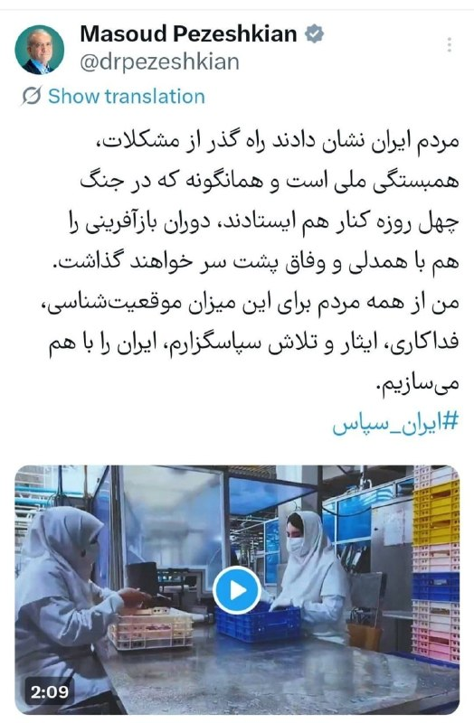

👈پزشکیان: از فداکاری و ایثار مردم سپاسگزارم، با همدیگه ایران رو میسازیم

✅ @AloNews خبر جنگ

## alonews — post 119953

  <a href="telegram/content/alonews_119953_1778770179.jpg">🎬 Download video</a>

👈 فرمانده سنتکام، دریاسالار برد کوپر: امروز، حماس، حزب‌الله و حوثی‌ها همه از تأمین سلاح و حمایت‌های ایران قطع شده‌اند. 
🔴این نتیجه از پیش تعیین‌شده نبود و نه به شانس به دست آمده است. این حاصل ماه‌ها برنامه‌ریزی دقیق و بر پایه دهه‌ها تجربه است. این نتایج همچنین…

## alonews — post 119952

  <a href="telegram/content/alonews_119952_1778770179.jpg">🎬 Download video</a>

👈منابع خبری می‌گویند کشتی باری هندی که روز گذشته به مقصد شارجه در حرکت بوده در تنگه هرمز هدف قرار گرفته و غرق شده است

✅ @AloNews خبر جنگ

## alonews — post 119951

  <a href="telegram/content/alonews_119951_1778770179.jpg">🎬 Download video</a>

👈 فرمانده سنتکام، دریاسالار برد کوپر: امروز، حماس، حزب‌الله و حوثی‌ها همه از تأمین سلاح و حمایت‌های ایران قطع شده‌اند.

🔴این نتیجه از پیش تعیین‌شده نبود و نه به شانس به دست آمده است. این حاصل ماه‌ها برنامه‌ریزی دقیق و بر پایه دهه‌ها تجربه است. این نتایج همچنین بدون هزینه به دست نیامده‌اند.

🔴برد کوپر درباره ایران: مذاکرات حساس ادامه دارد.

🔴کار ما آماده بودن است و ما آماده‌ایم.

✅ @AloNews خبر جنگ

## alonews — post 119950

  <a href="telegram/content/alonews_119950_1778770179.jpg">🎬 Download video</a>

👈فایننشال تایمز خبر داد: عربستان سعودی پیشنهاد یک پیمان عدم تعرض میان کشورهای خاورمیانه و ایران را مطرح کرده است.

🔴 به گفته دیپلمات‌ها، این ایده بخشی از گفت‌وگوهای ریاض با متحدانش درباره نحوه مدیریت تنش‌های منطقه‌ای پس از پایان جنگ آمریکا و اسرائیل با ایران است.

🔴دو دیپلمات غربی گفتند که ریاض برای این طرح، «فرآیند هلسینکی» در دهه ۱۹۷۰ را به‌عنوان الگویی بالقوه در نظر دارد؛ فرآیندی که در دوران جنگ سرد به کاهش تنش‌ها در اروپا کمک کرد.

🔴آنها افزودند که پیمان عدم تعرض یکی از چندین ایده‌ای است که در حال بررسی است

✅ @AloNews خبر جنگ

## alonews — post 119949

  <a href="telegram/content/alonews_119949_1778770180.jpg">🎬 Download video</a>

👈وزیر خزانه‌داری آمریکا: طی سه روز گذشته هیچ بارگیری در تاسیسات نفتی ایران انجام نشده است.

✅ @AloNews خبر جنگ

## alonews — post 119948

  <a href="telegram/content/alonews_119948_1778770180.jpg">🎬 Download video</a>

👈سی‌ان‌ان: ایران از چین خواسته تا برای پایان بن‌بست میانجیگری کند، در حالی که آمریکا از پکن می‌خواهد ایران را برای پذیرش شرایط خود تحت فشار قرار دهد

✅ @AloNews خبر جنگ

## alonews — post 119947

  <a href="telegram/content/alonews_119947_1778770180.jpg">🎬 Download video</a>

👈رادیوی ارتش اسرائیل: دور جدید مذاکرات میان لبنان و اسرائیل در واشنگتن آغاز شده است.

✅ @AloNews خبر جنگ

## alonews — post 119946

  <a href="telegram/content/alonews_119946_1778770180.mp4">🎬 Download video</a>

👈عارف: به هیچ قیمتی تنگۀ هرمز را از دست نخواهیم داد

🔴اصلا تنگۀ هرمز مال ماست؛ ملک ما بوده حالا مدتی از ملکمان خوب استفاده نمی‌کردیم.

✅ @AloNews خبر جنگ

## alonews — post 119945

  <a href="telegram/content/alonews_119945_1778770181.mp4">🎬 Download video</a>

👈ترور هدفمند در جنوب لبنان

✅ @AloNews خبر جنگ

## alonews — post 119944

  <a href="telegram/content/alonews_119944_1778770182.mp4">🎬 Download video</a>

👈بنیامین نتانیاهو: همان‌طور که یک متفکر زمانی گفت، به‌ویژه در روسیه، او گفت: «دولت اسرائیل یک ابرقدرت کوچک است، اما ابرقدرت است.»

🔴 ما قرار است به یک ابرقدرت بزرگ جهانی تبدیل شویم

✅ @AloNews خبر جنگ

## alonews — post 119943

  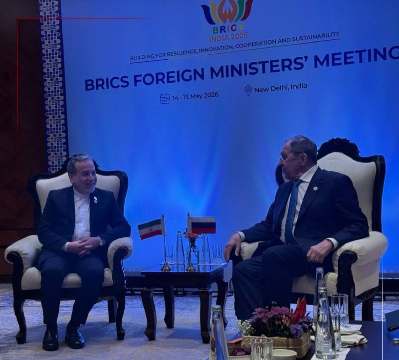

👈وزرای خارجه روسیه و ایران در دهلی‌نو دیدار کردند

✅ @AloNews خبر جنگ

## alonews — post 119942

  <a href="telegram/content/alonews_119942_1778770184.jpg">🎬 Download video</a>

👈روزنامه اعتماد: پیگیری ها نشان میدهد زمان احتمالی وصل شدن اینترنت «شاید نیمه خرداد» باشد!

🔴نخستین نشست ستاد ویژه ساماندهی و راهبری فضای مجازی قرار است طی هفته آینده به ریاست عارف برگزار شود. ضمن اینکه طبق شنیده ها این ستاد قرار است زمینه‌های لازم برای رفع انسداد اینترنتی را فراهم کرده تا احتمالا تا میانه‌های خردادماه زمینه اتصال شهروندان به اینترنت بین‌المللی فراهم شود!

✅ @AloNews خبر جنگ

## alonews — post 119941

  <a href="telegram/content/alonews_119941_1778770185.jpg">🎬 Download video</a>

👈ادعای خبرگزاری یونهاپ: یک مقام ارشد کره جنوبی گفته است که بعید به نظر می‌رسد عامل حمله به یک کشتی باری کره‌ای در نزدیکی تنگه هرمز، کشوری غیر از ایران باشد.

🔴خبرگزاری یونهاپ: یک مقام دیپلماتیک کره ای گفت که دولت در حال تمرکز بر جمع‌آوری شواهدی است تا ارزیابی خود را در مورد حملات به کشتی باری با پرچم پاناما که توسط شرکت کشتیرانی کره‌ای اچامام در تاریخ ۴ مه اداره می‌شود، پشتیبانی کند.

🔴این مقام وزارت خارجه افزود: «ممکن است همچنان احتمال حضور بازیگری غیر از ایران وجود داشته باشد، اما عقل سلیم میگوید که این احتمال بالا نیست. هیچ دزد دریایی در آن حوالی نبود.»

🔴این مقام اضافه کرد که سئول انتظار دارد در صورت اثبات این ارزیابی در تحقیقات بیشتر، «پاسخ مناسبی» از طرف ایران دریافت کند.

🔴وی همچنین گفت: «به محض اینکه (عامل حمله) به‌طور کامل شناسایی شود، یک کارزار دیپلماتیک متناسب با آن را آغاز خواهیم کرد.»

✅ @AloNews خبر جنگ

## alonews — post 119940

  <a href="telegram/content/alonews_119940_1778770185.jpg">🎬 Download video</a>

👈مارکو روبیو، وزیر خارجه آمریکا:
سرعت رشد نظامی چین در ۱۰ سال گذشته بی‌سابقه است، هیچ نمونه‌ای ندارد.

🔴آنها میلیاردها و میلیاردها دلار در سیستم خود سرمایه‌گذاری کرده‌اند. فکر نمی‌کنم این فقط محدود به تایوان باشد.

🔴فکر می‌کنم آنها آرزو دارند که در نهایت بتوانند قدرت خود را به صورت جهانی مانند ایالات متحده فعلی اعمال کنند.

🔴آنها هنوز در این زمینه عقب‌تر از ما هستند، اما با این حال، پول زیادی سرمایه‌گذاری می‌کنند. آنها اکنون بدون شک دومین نیروی نظامی قدرتمند جهان هستند

✅ @AloNews خبر جنگ

## alonews — post 119939

  <a href="telegram/content/alonews_119939_1778770185.jpg">🎬 Download video</a>

👈سخنگوی کرملین ، دیمیتری پسکوف:
اروپایی‌ها نمی‌توانند میانجی در مذاکرات بین روسیه و اوکراین باشند.

🔴آنها به طور مستقیم در جنگ در کنار کی‌یف شرکت دارند و طرفداران ایده وارد کردن ضربه‌ای کوبنده به روسیه هستند.

✅ @AloNews خبر جنگ

## alonews — post 119938

  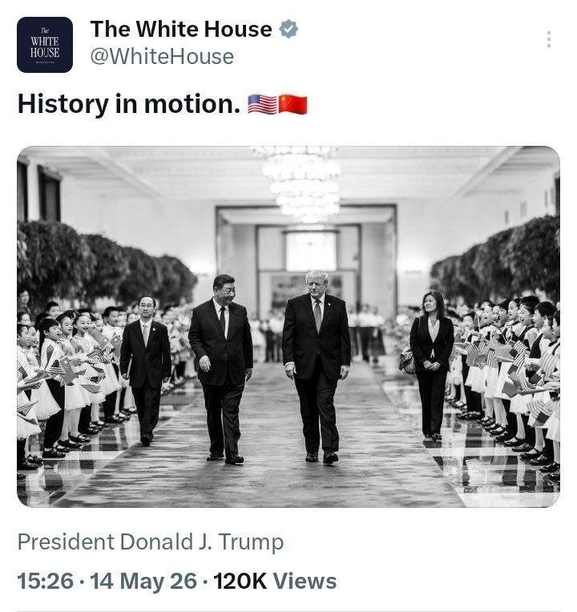

👈حساب کاخ سفید در X:
تاریخ در حرکت است🇨🇳🇺🇸

✅ @AloNews خبر جنگ

## alonews — post 119937

  <a href="telegram/content/alonews_119937_1778770186.jpg">🎬 Download video</a>

👈رویترز: وزارت بازرگانی ایالات متحده گزارش داده است که حدود ۱۰ شرکت چینی، از جمله گروه علی‌بابا، تنسنت و بایت‌دنس، مجوز خرید تراشه‌های هوش مصنوعی H200 انویدیا را تحت توافق‌نامه‌های مجوزی که اجازه خرید تا ۷۵٬۰۰۰ تراشه برای هر مشتری را می‌دهد، دریافت کرده‌اند.

🔴با این حال، تاکنون هیچ تحویلی انجام نشده است زیرا شرکت‌های چینی پس از راهنمایی‌های پکن محتاط‌تر شده‌اند، در حالی که تغییرات سیاست‌های ایالات متحده و فشارهای فزاینده در داخل چین برای مسدود کردن یا بررسی دقیق سفارش‌ها، معاملات را بیشتر به تعویق انداخته است

✅ @AloNews خبر جنگ

## alonews — post 119935

  <a href="telegram/content/alonews_119935_1778770186.mp4">🎬 Download video</a>

👈ایلان ماسک با پسرش X_AI_12 ، در سالن بزرگ مردم در پکن در جریان اجلاس رئیس جمهور ترامپ با شی جین پینگ همراه است.‌‌

✅ @AloNews خبر جنگ

<!-- MSG END -->
<!-- NAV START -->
[صفحه قبل](telegram/content/archive_1.md)
<!-- NAV END -->
