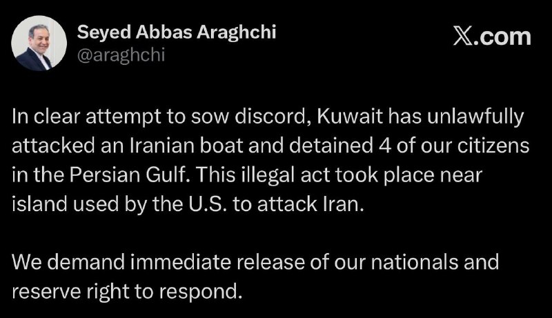
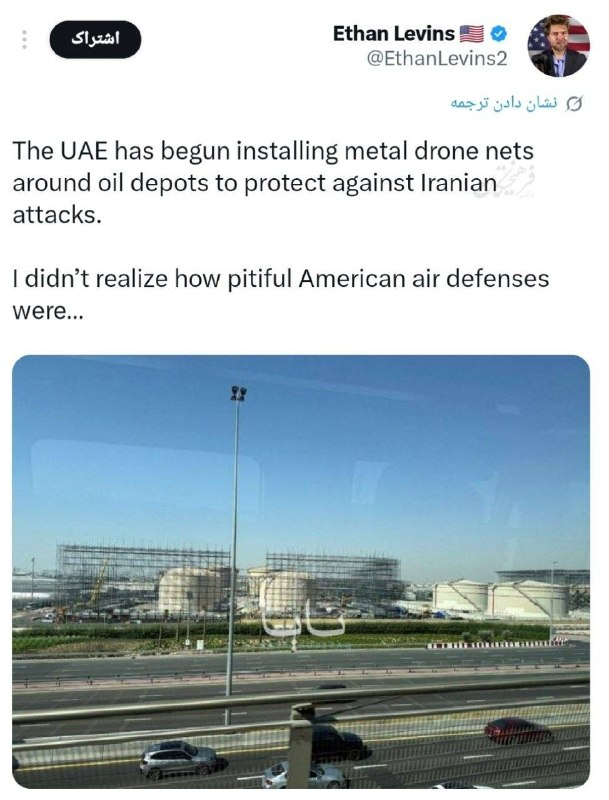
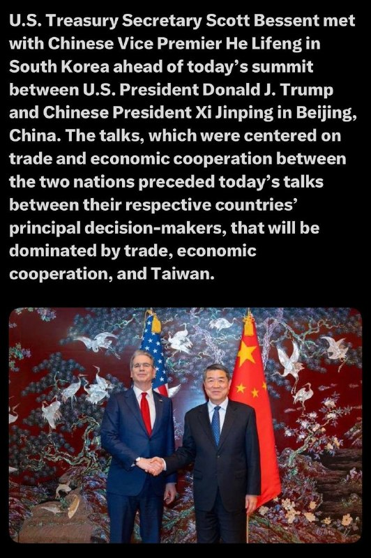
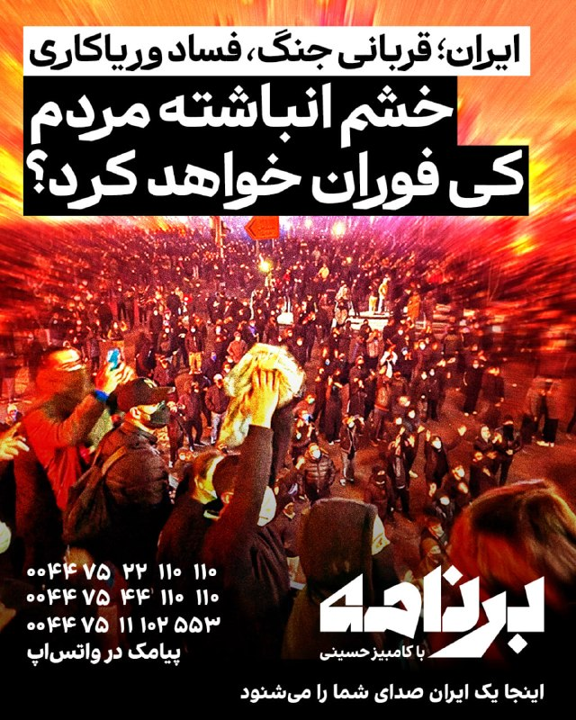
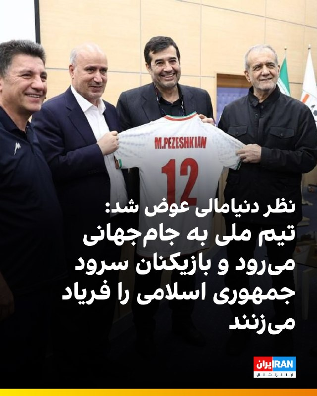
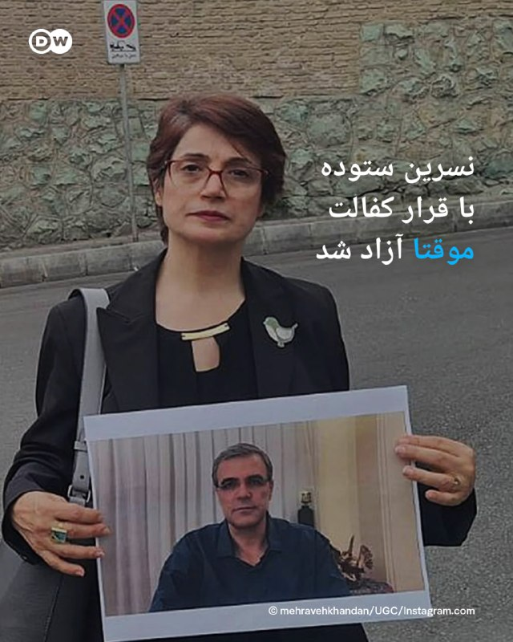
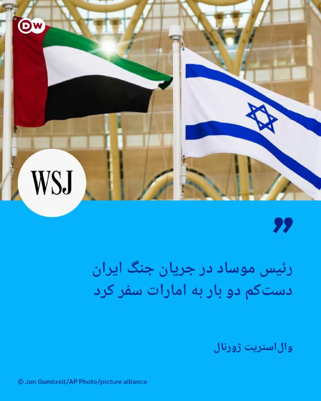
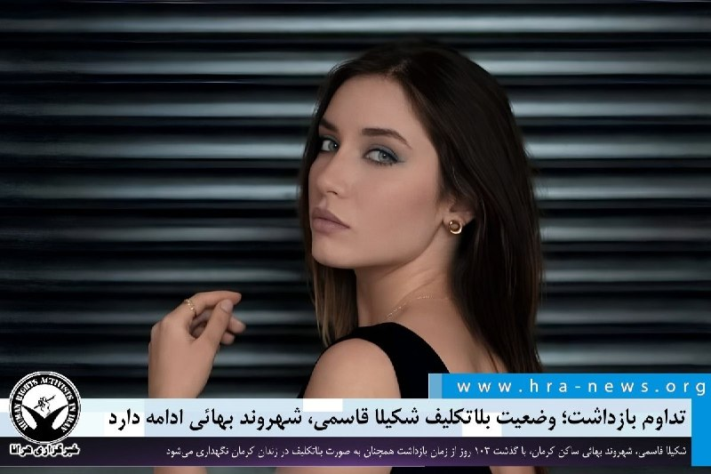

# خواننده تلگرام

<!-- MSG START -->

---
📅 بروزرسانی: 1405/02/23 21:28
---

## VahidOOnLine — post 239955

  

سی‌ان‌ان گزارش داد سنای آمریکا برای هفتمین بار در سال جاری، طرحی را که با هدف محدود کردن اختیارات جنگی دونالد ترامپ و الزام او به دریافت مجوز کنگره برای هرگونه اقدام نظامی آینده در ایران ارائه شده بود، رد کرد.

این طرح با ۵۰ رای مخالف در برابر ۴۹ رای موافق از پیشبرد بازماند. بر اساس این گزارش، جان فترمن، سناتور دموکرات، در کنار جمهوری‌خواهان به رد طرح رای داد و رند پال، سوزان کالینز و لیزا مورکوفسکی، سناتورهای جمهوری‌خواه، همراه دموکرات‌ها از آن حمایت کردند.

سی‌ان‌ان نوشت برخی جمهوری‌خواهان، از جمله مورکوفسکی که امروز برای نخستین بار از این تلاش برای محدود کردن اختیارات جنگی حمایت کرد و تام تیلیس، استدلال کرده‌اند که با ادامه یافتن درگیری‌ها به بیش از ۶۰ روز، کنگره باید در مجوز دادن به جنگ نقش داشته باشد یا دست‌کم نظارت بیشتری اعمال کند.
‌🏁 🇬🇧 IranintlTV

🤖 @VahidOOnLine

## VahidOOnLine — post 239954

  

♦️ سی‌بی‌اس نیوز در گزارشی اختصاصی فاش کرد که بنیامین نتانیاهو، نخست‌وزیر اسرائیل، اخیرا در سفری محرمانه به امارات متحده عربی با شیخ محمد بن زاید، رئیس این کشور، دیدار کرده است. دفتر نتانیاهو با تأیید این سفر که در دوران جنگ علیه جمهوری اسلامی انجام شده، آن را منجر به «گشایشی تاریخی» در روابط دو کشور توصیف کرد. دولت امارات به پیگیری‌های سی‌بی‌اس در این باره پاسخی نداده است.

این دیدار در حالی فاش می‌شود که گزارش‌هایی مبنی بر حملات نظامی امارات به ایران در ماه گذشته منتشر شده است. مایک هاکبی، سفیر آمریکا در اسرائیل، تایید کرد که اسرائیل سامانه‌های پدافند هوایی «گنبد آهنین» و نیروهای متخصص را برای تقویت توان دفاعی امارات به این کشور ارسال کرده است. منابع آگاه نیز دریافت این سامانه‌ها توسط امارات را تایید کرده‌اند.

امارات که در سال ۲۰۲۰ اولین امضاکننده پیمان ابراهیم بود، پیش از این نیز در سال ۲۰۱۸ میزبان نتانیاهو بوده است.
‌🇸🇦 Indypersian

🤖 @VahidOOnLine

## VahidOOnLine — post 239953

  

دفتر نخست‌وزیری اسرائیل اعلام کرد بنیامین نتانیاهو، نخست‌وزیر این کشور، در جریان جنگ آمریکا و اسرائیل با جمهوری اسلامی، به‌طور مخفیانه به امارات متحده عربی سفر کرده است.

بر اساس این گزارش، نتانیاهو در این سفر با محمد بن زاید آل نهیان، رییس امارات متحده عربی، دیدار کرد.

دفتر نخست‌وزیری اسرائیل گفت این سفر به یک «پیشرفت تاریخی» در روابط اسرائیل و امارات متحده عربی منجر شده است.

پیش‌تر مقام‌های ارشد آمریکایی تایید کرده بودند اسرائیل در جریان جنگ با جمهوری اسلامی، یک سامانه گنبد آهنین و نیروهایی را برای راه‌اندازی آن به امارات فرستاده بود.
‌🏁 🇬🇧 IranintlTV

🤖 @VahidOOnLine

## VahidOOnLine — post 239952

  

♦️ مجلس سنای آمریکا برای هفتمین بار در سال جاری، طرحی را که با هدف محدود کردن اختیارات جنگی دونالد ترامپ و الزام او به کسب مجوز از کنگره برای هرگونه اقدام نظامی علیه ایران تدوین شده بود، رد کرد. این مصوبه با ۴۹ رای موافق در برابر ۵۰ رای مخالف از دستور کار خارج شد؛ در این رای‌گیری، جان فترمن، سناتور دموکرات، به جمهوری‌خواهان پیوست و در مقابل، سه سناتور جمهوری‌خواه همسو با دموکرات‌ها رای دادند.

چاک شومر، رهبر اقلیت سنا، پیش‌تر اعلام کرده بود که دموکرات‌ها هر هفته این رای‌گیری را تکرار خواهند کرد. طبق «قطعنامه اختیارات جنگی»، استفاده از نیروی نظامی بدون مجوز کنگره دارای محدودیت ۶۰ روزه است که این مهلت در اول ماه مه به پایان رسیده است. با این حال، برخی جمهوری‌خواهان معتقدند روزهای آتش‌بس نباید در این بازه زمانی محاسبه شود. اگرچه سناتورهایی نظیر تام تیلیس بر ضرورت نظارت بیشتر کنگره تاکید دارند، اما اذعان می‌کنند که حتی در صورت تصویب چنین طرحی، توان مقابله با وتوی ریاست‌جمهوری وجود نخواهد داشت.
‌🇸🇦 Indypersian

🤖 @VahidOOnLine

## VahidOOnLine — post 239951

  

یک استاد ایرانی-آمریکایی دانشگاه آرکانزاس که اواخر ماه مارس به‌دلیل «فعالیت‌هایی در طرفداری از علی خامنه‌ای رهبر کشته‌شده جمهور اسلامی» از موقعیت رسمی خود برکنار شد، اکنون با تحقیقاتی درباره احتمال تخلفات علمی مواجه است.

انتشارات دانشگاه کمبریج که کتاب شیرین سعیدی، استاد ایرانی-آمریکایی دانشگاه آرکانزاس را منتشر کرده، در حال بررسی اتهاماتی است مبنی بر اینکه این اثر شامل مصاحبه‌های جعلی یا بدون مجوز با زنان قربانی حکومت ایران است. این کتاب بر پایه رساله دکترای شیرین سعیدی نوشته شده است.

ایران‌اینترنشنال دریافته است که دانشگاه کمبریج نیز در حال بررسی رساله دکترای سعیدی به‌دلیل احتمال تقلب است.

دکتر جی سیلوریا، رییس دانشگاه آرکانزاس، سعیدی را به دلایلی غیرمرتبط با تحقیقات کمبریج اخراج کرده است. او این تصمیم را به هیات امنای دانشگاه ابلاغ کرده و قرار است این هیات در ۲۱ مه پرونده اخراج او را بررسی کند.

کتاب سعیدی با عنوان «زنان و جمهوری اسلامی: چگونه شهروندی جنسیتی دولت ایران را شکل می‌دهد» اکنون در بریتانیا زیر ذره‌بین قرار دارد.

ادامه این گزارش را در وبسایت ایران‌اینترنشنال بخوانید
‌🏁 🇬🇧 IranintlTV

🤖 @VahidOOnLine

## VahidOOnLine — post 239950

  <a href="telegram/content/VahidOOnLine_239950_1778695116.mp4">🎬 Download video</a>

♦️ ستاد فرماندهی مرکزی ایالات متحده (سنتکام) روز چهارشنبه ۲۳ اردیبهشت اعلام کرد که در جریان اجرای طرح محاصره بنادر ایران، نیروهای آمریکایی مسیر ۶۷ کشتی تجاری را تغییر داده و چهار شناور را نیز از کار انداخته‌اند. طبق اعلام این نهاد، تاکنون تنها به ۱۵ شناور حامل کمک‌های بشردوستانه اجازه عبور داده شده است.

سنتکام در شبکه اجتماعی ایکس تایید کرد که در اوایل هفته جاری، نیروهای این فرماندهی با استفاده از ارتباط رادیویی و شلیک تیرهای هشدار با سلاح‌های سبک، دو کشتی تجاری دیگر را مجبور به بازگشت و تمکین از قوانین محاصره کرده‌اند. این بیانیه تاکید می‌کند که اقدامات مذکور نشان‌دهنده اجرای کامل و قاطعانه محاصره توسط نیروهای آمریکایی است.
‌🇸🇦 Indypersian

🤖 @VahidOOnLine

## VahidOOnLine — post 239949

  <a href="telegram/content/VahidOOnLine_239949_1778695118.mp4">🎬 Download video</a>

عباس عراقچی، وزیر خارجه جمهوری‌اسلامی در شبکه اکس بازداشت چهار شهروند ایرانی در خلیج فارس توسط کویت را تایید کرد. عراقچی در اکس نوشته: «در تلاشی آشکار برای ایجاد اختلاف، کویت به‌طور غیرقانونی به یک قایق ایرانی حمله کرده و چهار تن از شهروندان ما را در خلیج فارس بازداشت کرده است. این اقدام غیرقانونی در نزدیکی جزیره‌ای رخ داد که آمریکا از آن برای حمله به ایران استفاده کرده بود. ما خواستار آزادی فوری شهروندان خود هستیم و حق پاسخ‌گویی را برای خود محفوظ می‌دانیم.» کویت دیروز اعلام کرده بود چهار عضو منتسب به سپاه قصد داشتند از راه دریا وارد کویت شوند و «اقدامات خصمانه» انجام دهند. وزارت کشور کویت اعلام کرد در درگیری با نیروهای امنیتی، یک نیروی کویتی زخمی شده و دو نفر از متهمان نیز فرار کرده‌اند. سفیر جمهوری‌اسلامی نیز در این کشور احضار و یادداشت اعتراضی رسمی به او تحویل داده شده بود.
‌🏁 🇬🇧 ManotoTV

🤖 @VahidOOnLine

## VahidOOnLine — post 239948

  <a href="telegram/content/VahidOOnLine_239948_1778695118.mp4">🎬 Download video</a>

شعبه اول دادگاه تجدیدنظر استان کهگیلویه و بویراحمد، فیض‌الله آذرنوش، پدر پدرام آذرنوش از جان‌باختگان اعتراضات ۱۴۰۱، به همراه سه شهروند دیگر این پرونده را در مجموع به ۳۰ سال حبس تعزیری محکوم کرد.

بر اساس حکم صادرشده، فیض‌الله آذرنوش با اتهام‌هایی از جمله «تشکیل گروه با هدف برهم زدن امنیت کشور»، «فعالیت تبلیغی علیه جمهوری اسلامی»، «توهین به رهبری» و «اجتماع و تبانی علیه امنیت کشور» در مجموع به ۱۵ سال زندان محکوم شده که پنج سال آن قابل اجراست.

همچنین میلاد کریمی‌نسب به شش سال زندان با پنج سال حبس قابل اجرا، امیرحسین محسنی‌پور به شش سال زندان با سه سال حبس قابل اجرا و مهدی کرمی به سه سال زندان محکوم شدند.
‌🏁 🇬🇧 ManotoTV

🤖 @VahidOOnLine

## VahidOOnLine — post 239947

  

نیویورک تایمز در گزارشی اعلام کرد که کشورهای حاشیه خلیج فارس در جریان جنگ ایران، بیش از ۱۰۰ شیعه را به اتهام خیانت بازداشت کرده‌اند.
کویت، امارات متحده عربی و بحرین از جمله کشورهایی هستند که موج بازداشت‌ها در آن‌ها گزارش شده است.
در بحرین ۶۹ نفر از تابعیت محروم شده‌اند و ۴۱ نفر دیگر به اتهام ارتباط با سپاه پاسداران بازداشت شده‌اند. یک گروه حقوق بشری می‌گوید ۳۷ نفر از بازداشت‌شدگان روحانی شیعه بوده‌اند.
در امارات متحده عربی ۲۷ نفر به عضویت در «سازمان تروریستی شیعه» متهم شده‌اند. دولت تصاویر آن‌ها را منتشر کرده و برخی چهره‌های نزدیک به حکومت خواستار مجازات شدید شده‌اند.

‌🏁 🇬🇧 IranintlTV

🤖 @VahidOOnLine

## VahidOOnLine — post 239946

♦️چارلز سوم، پادشاه بریتانیا روز چهارشنبه در سخنرانی رسمی بازگشایی پارلمان این کشور در مجلس اعیان، در حالی که اعضای دولت، نمایندگان پارلمان و کی‌یر استارمر، نخست‌وزیر بریتانیا حضور داشتند، برنامه‌ها و اولویت‌های دولت را تشریح کرد.
او با اشاره مستقیم به بحران خاورمیانه گفت: «جهانی به‌طور فزاینده خطرناک و بی‌ثبات، بریتانیا را تهدید می‌کند و درگیری در خاورمیانه تنها جدیدترین نمونه آن است. تمام عناصر امنیت انرژی، دفاعی و اقتصادی کشور مورد آزمایش قرار خواهند گرفت.»
چارلز سوم در ادامه تاکید کرد دولت بریتانیا قصد دارد تصمیم‌هایی اتخاذ کند که امنیت بلندمدت انرژی، دفاع و اقتصاد این کشور را تضمین کند. او همچنین از برنامه دولت برای تصویب «قانون استقلال انرژی» خبر داد؛ طرحی که هدف آن افزایش تولید انرژی داخلی، توسعه انرژی‌های تجدیدپذیر و کاهش وابستگی بریتانیا به منابع خارجی عنوان شده است.
پادشاه بریتانیا با اشاره به تحولات اخیر خاورمیانه هشدار داد که وابستگی انرژی می‌تواند به ابزاری برای فشار اقتصادی علیه مردم بریتانیا تبدیل شود.
‌🇸🇦 Indypersian

🤖 @VahidOOnLine

## VahidOOnLine — post 239945

یک شهروند در پیامی به ایران اینترنشنال درباره سرکوب و بحران‌های اقتصادی و معیشتی می‌گوید مردم در ایران گروگان حکومت هستند. او از رهبران آمریکا و اسرائیل می‌خواهد با جمهوری اسلامی مذاکره و آتش‌بس نکنند. صدای این مخاطب با هوش مصنوعی بازخوانی شده است.
‌🏁 🇬🇧 IranintlTV

🤖 @VahidOOnLine

## VahidOOnLine — post 239944

  

♦️ به گزارش خبرگزاری فارس، در پی اختلال در واردات از بنادر جنوبی به دلیل شرایط جنگی و محاصره دریایی، نیمی از واردات دریایی ایران به مرزهای زمینی و نیمی دیگر به بنادر و مرزهای شمالی منتقل شده است. علی مدنی‌زاده، وزیر اقتصاد، با تایید این تغییر راهبردی اعلام کرد که انتقال گذرگاه‌ها پس از کندی روند واردات از جنوب در دستور کار دولت قرار گرفته است. در حالی که ظرفیت واردات سالانه بنادر جنوبی ۳۸ میلیون تن است، بنادر شمالی کشور با ظرفیت اسمی ۳۰ میلیون تن، پتانسیل بالایی برای جایگزینی دارند.

هم‌زمان، پاکستان با صدور مجوزی رسمی از سوی وزارت بازرگانی، گام مهمی در فعال‌سازی گذرگاه ترانزیتی با ایران برداشته است. این دستور اجازه می‌دهد کالاهای کشورهای ثالث از بنادر گوادر، کراچی و قاسم از طریق مسیرهای جاده‌ای به مرزهای گبد و تفتان منتقل شوند. با توجه به ناپایداری مسیرهای سنتی مانند بنادر امارات در پی محاصره دریایی، گشایش این مسیر جدید امنیت زنجیره تامین ایران را تقویت می‌کند. پیش از این نیز محموله‌های ترانزیتی با موفقیت از مبدا پاکستان و مسیر ایران به مقصد ازبکستان ارسال شده بود.
‌🇸🇦 Indypersian

🤖 @VahidOOnLine

## VahidOOnLine — post 239943

  <a href="telegram/content/VahidOOnLine_239943_1778695120.mp4">🎬 Download video</a>

.
مقام‌های سوریه در ماه مارس «هلا منیر محمد» را به اتهام شکنجه و سوءاستفاده از زندانیان در دوران حکومت بشار اسد بازداشت کردند؛ زنی که به گفته زندانیان سابق، با نام «منیره» در زندان اطلاعات نیروی هوایی دمشق شناخته می‌شد و یکی از مخوف‌ترین نگهبانان این زندان بود.
بر اساس گزارش‌ها، هلا در ظاهر یک آرایشگر شناخته‌شده و مدرس زیبایی در دمشق بود، اما چندین زندانی سابق می‌گویند او در زندان المزّه با ضرب‌وشتم، تحقیر، توهین فرقه‌ای و شکنجه زنان زندانی شناخته می‌شد.
زندانیان سابق می‌گویند تنها صدای او برای ایجاد وحشت در سلول‌ها کافی بود. برخی روایت کرده‌اند او با لوله‌های پلاستیکی زندانیان را کتک می‌زد، موهای زنان را با خشونت می‌برید و هنگام آزار آن‌ها می‌خندید.
گزارش‌ها حاکی است هلا پس از سقوط حکومت اسد همچنان در دمشق زندگی می‌کرد و به‌عنوان آرایشگر فعالیت داشت تا اینکه گروهی از بازماندگان زندان با تحقیقات مستقل او را شناسایی و به مقام‌های جدید سوریه معرفی کردند.
خانواده و برخی آشنایان هلا اتهام‌ها را رد کرده‌اند و می‌گویند او «فقط یک زن جوان» بوده که دستورات مافوق‌ها را اجرا می‌کرده است. سازمان‌های حقوق بشری می‌گویند ده‌ها هزار نفر در دوران جنگ داخلی سوریه در زندان‌های حکومت اسد ناپدید یا کشته شده‌اند و زندان اطلاعات نیروی هوایی المزّه یکی از مراکز اصلی شکنجه و بازداشت بوده است.
‌🏁 🇬🇧 ManotoTV

🤖 @VahidOOnLine

## VahidOOnLine — post 239942

  <a href="telegram/content/VahidOOnLine_239942_1778695121.mp4">🎬 Download video</a>

تصاویری از استقبال از عباس عراقچی، وزیر خارجه جمهوری‌اسلامی در پایتخت هند، توسط رسانه‌های حکومتی منتشر شده است. بر پایه گزارش‌ها او برای شرکت در نشست وزرای خارجه بریکس وارد دهلی نو شده است.
‌🏁 🇬🇧 ManotoTV

🤖 @VahidOOnLine

## VahidOOnLine — post 239941

یک شهروند در پیامی به ایران اینترنشنال درباره سرکوب و بحران‌های اقتصادی و معیشتی می‌گوید مردم در ایران گروگان حکومت هستند. او از رهبران آمریکا و اسرائیل می‌خواهد با جمهوری اسلامی مذاکره و آتش‌بس نکنند. صدای این مخاطب با هوش مصنوعی بازخوانی شده است.
‌🏁 🇬🇧 IranintlTV

🤖 @VahidOOnLine

## VahidOOnLine — post 239933

♦️دونالد ترامپ، رئیس‌جمهوری ایالات متحده همراه با تعدادی از اعضای کابینه‌اش، چهارشنبه شب ۲۳ اردیبهشت، وارد چین شد. مراسم استقبال شبانه با حضور گروهی از جوانان چینی که پرچم‌های چین و آمریکا را در دست داشتند و رژه سربازان انجام شد.

در هواپیمای ریاست جمهوری، اریک ترامپ و همسرش لارا، ایلان ماسک، میلیاردر مشهور و صاحب شرکت‌های تسلا و اسپیس‌ایکس، جن‌سن هوانگ، بنیانگذار و مدیر اجرایی انویدیا و تیم کوک، مدیرعامل اپل، رئیس‌جمهوری آمریکا را همراهی کردند. پیت هگست، وزیر جنگ و مارکو روبیو، وزیر امور خارجه ایالات متحده نیز از دیگر همراهان ترامپ بودند.

مراسم رسمی استقبال و دیدار ترامپ با شی جین‌پینگ، رئیس‌جمهوری چین قرار است روز پنجشنبه در پکن انجام شود.
‌🇸🇦 Indypersian

🤖 @VahidOOnLine

## mwarmonitor — post 9050

🔵شبکه NBC به نقل از داده‌های ناوبری: چندین کشتی باری و نفتکش مرتبط با چین طی ۲۴ ساعت گذشته از تنگه هرمز عبور کرده‌اند.

@mwarmonitor

## mwarmonitor — post 9049

🔴 فایننشال‌تایمز: اریک پسر دونالد ترامپ قرار است رئیس‌جمهور آمریکا را در یک سفر رسمی به پکن همراهی کند؛ هم‌زمان، یک گروه مرتبط با خانواده ترامپ در حال بررسی یک توافق با یک شرکت چینی سازنده تراشه است که کنگره آمریکا هشدار داده با حزب کمونیست چین ارتباط دارد.

@mwarmonitor

## mwarmonitor — post 9048

🔴وال‌استریت ژورنال: مقامات کاخ سفید در حال بررسی طرحی هستند که بر اساس آن رئیس‌جمهور ترامپ به مناسبت جشن دویست‌وپنجاهمین سالگرد تولد این کشور، ۲۵۰ عفو صادر کند.

@mwarmonitor

## mwarmonitor — post 9047

🔴 فوری: بنیامین نتانیاهو به‌طور محرمانه به امارات متحده عربی سفر کرده و در جریان عملیات «شیر غران» علیه ایران با محمد بن زاید دیدار کرده است. i24 news

@mwarmonitor

## mwarmonitor — post 9046

  

✈️مأموریت WENCH11 (بمب‌افکن رادارگریز B-2A Spirit)
🔸پس از سوخت‌گیری هوایی با پرواز DEED41 (تانکر KC-135 Stratotanker) بر فراز نوا اسکوشیا شرق کانادا، روی مسیر سوخت‌رسانی AR20NE، در باند VHF با Gander Radio در ارتباط بوده است.

@mwarmonitor

## mwarmonitor — post 9045

  

✈️ساعت 09:31 ـ 09:35 به وقت گرینویچ MISS 40 | 41 دو فروند بمب‌افکن استراتژیک B-1B از پایگاه Fairford به پرواز درآمده و با Brize در فرکانس 231.950 در حال ارتباط است. @mwarmonitor

## mwarmonitor — post 9044

🚨 «شورای صلح» به رهبری آمریکا قصد دارد اجرای طرح خود برای تشکیل یک حکومت جدید و بازسازی غزه را در بخش‌هایی از غزه که تحت کنترل حماس نیست آغاز کند.

🚨 چرا این مهم است: تصمیم برای رفتن به «طرح B» در غزه پس از آن گرفته شد که تلاش‌ها برای متقاعد کردن حماس به کنار گذاشتن سلاح‌های سنگین خود به بن‌بست رسید. اکنون آمریکا و «شورای صلح» می‌خواهند بدون حضور حماس پیش بروند. باراک راوید خبرنگار آکسیوس

@mwarmonitor

## pm_afshaa — post 90705

یکی بیاد به من بگه چرا تو افغانستان خوراکیای تولید داخل خودمونو ارزونتر از ما میتونن خرید کنن

د اخه حرومزاده ای که نشستی خفه خون گرفتی از این بیناموسا دفاع میکنی بیناموس برگرد ببین چند نفر نون شب تو کشور خودمون ندارن بخورن

د اخه من شاشیدم به اون مملکت داریتون

## pm_afshaa — post 90704

  <a href="telegram/content/pm_afshaa_90704_1778695122.jpg">🎬 Download video</a>

🔴نیویورک تایمز: کشورهای خلیج فارس در جریان جنگ ایران بیش از 100 شیعه رو به اتهام خیانت بازداشت شدن.

💧 Rainbet.com the #1 Non-KYC Crypto Casino & Sportsbook @rainbetcom

😁 @Pm_Afshaa

## pm_afshaa — post 90703

  <a href="telegram/content/pm_afshaa_90703_1778695123.jpg">🎬 Download video</a>

🔴دنیامالی، وزیر ورزش:
تیم ملی به جام جهانی میره و بازیکنان سرود جمهوری اسلامی رو فریاد میزنن.

💧 Rainbet.com the #1 Non-KYC Crypto Casino & Sportsbook @rainbetcom

😁 @Pm_Afshaa

## pm_afshaa — post 90702

🔴دفتر نخست وزیر اسرائیل:
در بحبوحه جنگ و عملیات غرش شیر، نتانیاهو به امارات سفر کرد و با شیخ محمدبن زاید، رئیس امارات متحده عربی دیدار کرد.

این سفر منجر به پیشرفتی تاریخی در روابط اسرائیل و امارات شد.

💧 Rainbet.com the #1 Non-KYC Crypto Casino & Sportsbook @rainbetcom

😁 @Pm_Afshaa

## pm_afshaa — post 90701

  <a href="telegram/content/pm_afshaa_90701_1778695123.mp4">🎬 Download video</a>

اکانت اسرائیل به فارسی:وقتی به زودی به اسرائیل سفر کنید، این منظره زیبا از پنجره هواپیما در انتظار شماست. به امید دیدار شما در تل‌آویو یا تهران

💧 Rainbet.com the #1 Non-KYC Crypto Casino & Sportsbook @rainbetcom

😁 @Pm_Afshaa

## pm_afshaa — post 90700

  

🔴عباس عراقچی:

کویت در اقدامی آشکار برای ایجاد اختلاف، به طور غیرقانونی به یک قایق ایرانی حمله کرد و چهار شهروند رو در خلیج فارس بازداشت کرد. این اقدام غیرقانونی در نزدیکی جزیره‌ای رخ داد که آمریکا از آن برای حمله به ایران استفاده میکنه. ما خواستار آزادی فوری شهروندان خود هستیم و حق پاسخگویی رو برای خود محفوظ می‌داریم.

💧 Rainbet.com the #1 Non-KYC Crypto Casino & Sportsbook @rainbetcom

😁 @Pm_Afshaa

## pm_afshaa — post 90699

  <a href="telegram/content/pm_afshaa_90699_1778695125.jpg">🎬 Download video</a>

🔴هفتمین رأی‌گیری سنای آمریکا توسط دموکرات‌ها برای محدود کردن اختیارات جنگی ترامپ و پایان جنگ با جمهوری اسلامی بازهم شکست خورد.

تعداد آرا فاصله نزدیک 50 به 49 داشت!

💧 Rainbet.com the #1 Non-KYC Crypto Casino & Sportsbook @rainbetcom

😁 @Pm_Afshaa

## pm_afshaa — post 90698

  <a href="telegram/content/pm_afshaa_90698_1778695125.jpg">🎬 Download video</a>

🔴سنتکام: از آغاز محاصره دریایی 67 کشتی مجبور به تغییر مسیر شدن.

💧 Rainbet.com the #1 Non-KYC Crypto Casino & Sportsbook @rainbetcom

😁 @Pm_Afshaa

## pm_afshaa — post 90697

  <a href="telegram/content/pm_afshaa_90697_1778695126.jpg">🎬 Download video</a>

🔴خواسته‌های احتمالی ترامپ از چین سر ایران چیه؟

1- کمک چین به ایران متوقف بشه حالا میخواد نظامی باشه یا اطلاعاتی و...

2- چین رو متقاعد کنه که نفت خودش رو از کشور های دیگه‌ای بجز ایران تامین کنه و نذاره تنگه هرمز بشه محلی برای کسب درآمد ایران.

3- به چین بگه ایندفعه دیگه قطعنامه برعلیه ایران رو تو جلسه شورای حکام وتو نکنن و بذارن رای بیاره تا اجماع جهانی برعلیه ایران شکل بگیره سر تنگه هرمز.

💧 Rainbet.com the #1 Non-KYC Crypto Casino & Sportsbook @rainbetcom

😁 @Pm_Afshaa

## DEJradio — post 4621

  <a href="telegram/content/DEJradio_4621_1778695126.mp4">🎬 Download video</a>

👑🎥 همدلی و حمایت ایرانیان ونکوور از انقلاب شیر و خورشید

#ونکوور #انقلاب_شیروخورشید
@DEJradio

## VahidOnline — post 75449

  

ستاد فرماندهی مرکزی ایالات متحده روز چهارشنبه ۲۳ اردیبهشت با تاکید بر ادامه محاصره دریایی بنادر ایران اعلام کرد که از زمان آغاز این عملیات، به ۱۵ کشتی حامل کمک‌های بشردوستانه اجازه عبور داده شده است.

سنتکام در پیامی در شبکه ایکس نوشت که نیروهای آمریکایی طی چهار هفته گذشته ۶۷ کشتی تجاری را وادار به تغییر مسیر کرده و چهار شناور را نیز برای اجرای محاصره «از کار انداخته‌اند».

این فرماندهی همچنین اعلام کرد اوایل هفته جاری، دو کشتی تجاری دیگر پس از تماس رادیویی و شلیک تیر هشدار از سوی نیروهای آمریکایی مسیر خود را تغییر داده و از ادامه حرکت به سمت بنادر ایران منصرف شدند.
@VahidHeadline

📡 @VahidOnline

## kianmeli1 — post 87384

  <a href="telegram/content/kianmeli1_87384_1778695129.mp4">🎬 Download video</a>

🔴آشنا: ایران هنوز شگفتی‌هایی برای دشمن دارد

ایران ظرفیت عبور از چالش فعلی را دارد. برای توان نظامی ایران، ۴۷ سال زحمت کشیده شده است. به‌نظر من هیچ‌کس نمی‌داند ایران چقدر قدرت دارد.

اگر قرار است مستقل باشیم آخرش اسلحه‌ها حرف می‌زنند.
https://t.me/kianmeli1

## kianmeli1 — post 87383

  <a href="telegram/content/kianmeli1_87383_1778695130.mp4">🎬 Download video</a>

🔴زنگنه: ۳۰ درصد از گرانی‌ها طبیعی جنگ است / ۳۵ درصد از گرانی‌ها به خاطر ناکارآمدی دستگاه‌هاست

محسن زنگنه، عضو کمیسیون برنامه و بودجه مجلس:
برخی از وزارتخانه‌ها آرایش جنگی ندارند

گزارشات وزارتخانه‌ها مداوم نیست و قطع می‌شود؛ به طور خاص وزارت جهاد کشاورزی اینگونه است

باید در وزارت کشاورزی برنامه ریزی بهتری داشته باشیم که در آینده چه خواهد شد
وزارت جهادکشاورزی یک مرتبه کود را هفت برابر کرده است!
https://t.me/kianmeli1

## kianmeli1 — post 87382

  <a href="telegram/content/kianmeli1_87382_1778695132.mp4">🎬 Download video</a>

🔴تیراندازی در مجلس سنای فیلیپین

به گزارش رویترز حداقل 12 گلوله در مجلس سنای فیلیپین شلیک شد اما یکی از نمایندگان تاکید کرد در این حادثه هیچ فردی زخمی یا کشته نشده است.
https://t.me/kianmeli1

## kianmeli1 — post 87381

  

🔴لبنان شکایتی رسمی به سازمان ملل ارائه کرده و ایران را به نقض کنوانسیون وین ۱۹۶۱ در مورد روابط دیپلماتیک متهم کرده است.

در این شکایت، ایران به «دخالت مستقیم و آشکار در امور داخلی لبنان» و کشاندن این کشور به جنگ متهم شده است.
https://t.me/kianmeli1

## kianmeli1 — post 87380

🔴وزیر کار دولت ابراهیم رئیسی:
در جنگ اخیر ۱۴۷ هزار نفر بیکار شدند نه دو میلیون نفر و این فاجعه نیست

حجت‌الله عبدالملکی، وزیر کار در دولت سیزدهم، در مصاحبه با خبرگزاری دانشجو گفت که در جنگ اخیر ۱۴۷ هزار نفر بیکار شدند نه دو میلیون نفر و این فاجعه نیست.

عبدالملکی افزود: «منابع دولتی برای بیمه بیکاری وجود دارد.»
https://t.me/kianmeli1

## kianmeli1 — post 87379

  <a href="telegram/content/kianmeli1_87379_1778695134.mp4">🎬 Download video</a>

🔴استقبال مقام‌های دولتی چین از ترامپ در فرودگاه پکن

گروهی از مقام‌های عالی‌رتبه دولت چین شامگاه چهارشنبه ۲۳ اردیبهشت از دونالد ترامپ و هیئت همراهش در فرودگاه پکن استقبال کردند.
ترامپ در سال ۲۰۱۷ و در دور نخست ریاست جمهوری به چین سفر کرده بود. روابط دو کشور در دوران جو بایدن به‌‌شدت سرد شد.
https://t.me/kianmeli1

## kianmeli1 — post 87378

  

🔴ایتن لوینز، تحلیلگر و روزنامه‌نگار آمریکایی: امارات متحده عربی شروع به نصب تورهای فلزی مخصوص پهپاد در اطراف انبارهای نفت کرده است تا از حملات ایران محافظت کند.
https://t.me/kianmeli1

## kianmeli1 — post 87377

  

🔴اسکات بسنت، وزیر خزانه‌داری ایالات متحده، پیش از نشست امروز بین دونالد ترامپ، رئیس جمهور ایالات متحده و شی جین پینگ، رئیس جمهور چین در پکن، چین، با هی لیفنگ، معاون نخست وزیر چین، در کره جنوبی دیدار کرد. این مذاکرات که بر همکاری تجاری و اقتصادی بین دو کشور متمرکز بود، پیش از مذاکرات امروز بین تصمیم‌گیرندگان اصلی کشورهای مربوطه که تحت سلطه تجارت، همکاری اقتصادی و تایوان خواهند بود، انجام شد.
https://t.me/kianmeli1

## kianmeli1 — post 87376

  

🔴گفته می‌شود امانوئل مکرون چندین ماه «رابطه افلاطونی» با گلشیفته فراهانی، بازیگر ایرانی، داشته است که شامل «پیام‌هایی بوده که ظاهراً بسیار فراتر رفته‌اند» و باعث ایجاد تنش‌هایی در درون این زوج ریاست جمهوری شده است که گفته می‌شود منجر به سیلی زدن شده است.
https://t.me/kianmeli1

## IranIntlTV — post 337037

  

سی‌ان‌ان گزارش داد سنای آمریکا برای هفتمین بار در سال جاری، طرحی را که با هدف محدود کردن اختیارات جنگی دونالد ترامپ و الزام او به دریافت مجوز کنگره برای هرگونه اقدام نظامی آینده در ایران ارائه شده بود، رد کرد.

این طرح با ۵۰ رای مخالف در برابر ۴۹ رای موافق از پیشبرد بازماند. بر اساس این گزارش، جان فترمن، سناتور دموکرات، در کنار جمهوری‌خواهان به رد طرح رای داد و رند پال، سوزان کالینز و لیزا مورکوفسکی، سناتورهای جمهوری‌خواه، همراه دموکرات‌ها از آن حمایت کردند.

سی‌ان‌ان نوشت برخی جمهوری‌خواهان، از جمله مورکوفسکی که امروز برای نخستین بار از این تلاش برای محدود کردن اختیارات جنگی حمایت کرد و تام تیلیس، استدلال کرده‌اند که با ادامه یافتن درگیری‌ها به بیش از ۶۰ روز، کنگره باید در مجوز دادن به جنگ نقش داشته باشد یا دست‌کم نظارت بیشتری اعمال کند.
https://iranintl.com/202605133904

## IranIntlTV — post 337036

  

دفتر نخست‌وزیری اسرائیل اعلام کرد بنیامین نتانیاهو، نخست‌وزیر این کشور، در جریان جنگ آمریکا و اسرائیل با جمهوری اسلامی، به‌طور مخفیانه به امارات متحده عربی سفر کرده است.

بر اساس این گزارش، نتانیاهو در این سفر با محمد بن زاید آل نهیان، رییس امارات متحده عربی، دیدار کرد.

دفتر نخست‌وزیری اسرائیل گفت این سفر به یک «پیشرفت تاریخی» در روابط اسرائیل و امارات متحده عربی منجر شده است.

پیش‌تر مقام‌های ارشد آمریکایی تایید کرده بودند اسرائیل در جریان جنگ با جمهوری اسلامی، یک سامانه گنبد آهنین و نیروهایی را برای راه‌اندازی آن به امارات فرستاده بود.
https://iranintl.com/202605131963

## IranIntlTV — post 337035

  <a href="telegram/content/IranIntlTV_337035_1778695138.mp4">🎬 Download video</a>

دفتر نخست‌وزیر اسرائیل اعلام کرد بنیامین نتانیاهو در دوران جنگ به امارات متحده عربی سفر کرده است.

اردوان روزبه، خبرنگار ایران‌اینترنشنال، گزارش می‌دهد

@iranintltv

## IranIntlTV — post 337034

  <a href="telegram/content/IranIntlTV_337034_1778695139.mp4">🎬 Download video</a>

گزارش‌های تازه ابعاد جدیدی از نقش و تحرکات ریاض و ابوظبی در جنگ ایران رو فاش می‌کنند. وال استریت ژورنال می‌گوید دیوید بارنیا، رییس موساد، در دوران جنگ دست‌کم دو بار، به صورت محرمانه به امارات سفر کرده است.

سمیرا قرایی و بابک اسحاقی، خبرنگاران ایران‌اینترنشنال، گزارش می‌دهند
@iranintltv

## IranIntlTV — post 337033

  

🔻خبرگزاری تسنیم، وابسته به سپاه پاسداران نوشت که مجید موسوی، فرمانده نیروی هوافضا سپاه در پیامی خطاب به بازیکنان تیم ملی پیش از حضور در جام جهانی نوشته است: «سلامی (فرمانده پیشین سپاه پاسداران) توصیه کرد: اگر می‌خواهید جام را ببرید تیمی بازی کنید.»

@iranintltvsport

## IranIntlTV — post 337032

  <a href="telegram/content/IranIntlTV_337032_1778695141.mp4">🎬 Download video</a>

تیتر اول با نیوشا صارمی، چهارشنبه ۲۳ اردیبهشت
@iranintltv

## IranIntlTV — post 337031

  

یک استاد ایرانی-آمریکایی دانشگاه آرکانزاس که اواخر ماه مارس به‌دلیل «فعالیت‌هایی در طرفداری از علی خامنه‌ای رهبر کشته‌شده جمهور اسلامی» از موقعیت رسمی خود برکنار شد، اکنون با تحقیقاتی درباره احتمال تخلفات علمی مواجه است.

انتشارات دانشگاه کمبریج که کتاب شیرین سعیدی، استاد ایرانی-آمریکایی دانشگاه آرکانزاس را منتشر کرده، در حال بررسی اتهاماتی است مبنی بر اینکه این اثر شامل مصاحبه‌های جعلی یا بدون مجوز با زنان قربانی حکومت ایران است. این کتاب بر پایه رساله دکترای شیرین سعیدی نوشته شده است.

ایران‌اینترنشنال دریافته است که دانشگاه کمبریج نیز در حال بررسی رساله دکترای سعیدی به‌دلیل احتمال تقلب است.

دکتر جی سیلوریا، رییس دانشگاه آرکانزاس، سعیدی را به دلایلی غیرمرتبط با تحقیقات کمبریج اخراج کرده است. او این تصمیم را به هیات امنای دانشگاه ابلاغ کرده و قرار است این هیات در ۲۱ مه پرونده اخراج او را بررسی کند.

کتاب سعیدی با عنوان «زنان و جمهوری اسلامی: چگونه شهروندی جنسیتی دولت ایران را شکل می‌دهد» اکنون در بریتانیا زیر ذره‌بین قرار دارد.

ادامه این گزارش را در وبسایت ایران‌اینترنشنال بخوانید
https://iranintl.com/202

## IranIntlTV — post 337030

  

نیویورک تایمز در گزارشی اعلام کرد که کشورهای حاشیه خلیج فارس در جریان جنگ ایران، بیش از ۱۰۰ شیعه را به اتهام خیانت بازداشت کرده‌اند.
کویت، امارات متحده عربی و بحرین از جمله کشورهایی هستند که موج بازداشت‌ها در آن‌ها گزارش شده است.
در بحرین ۶۹ نفر از تابعیت محروم شده‌اند و ۴۱ نفر دیگر به اتهام ارتباط با سپاه پاسداران بازداشت شده‌اند. یک گروه حقوق بشری می‌گوید ۳۷ نفر از بازداشت‌شدگان روحانی شیعه بوده‌اند.
در امارات متحده عربی ۲۷ نفر به عضویت در «سازمان تروریستی شیعه» متهم شده‌اند. دولت تصاویر آن‌ها را منتشر کرده و برخی چهره‌های نزدیک به حکومت خواستار مجازات شدید شده‌اند.

https://iranintl.com/202605137296

## IranIntlTV — post 337029

  

ایران، قربانی جنگ، فساد و ریاکاری جمهوری اسلامی است و میان مردم و حاکمیت، دریایی از خون قرار گرفته است. جمهوری اسلامی و مردم در نقطه‌ای تاریخی و بی‌بازگشت ایستاده‌اند. هزینه‌ای که به مردم ایران تحمیل شده، جامعه را خشمگین کرده است؛ خشمی که هر روز بیشتر می‌شود.

این خشم انباشتهٔ مردم چه زمانی فوران خواهد کرد؟

«برنامه» صدای شماست. ما شما را مستقیم از ایران روی خط می‌آوریم.

برای شرکت در برنامه، همین حالا در واتس‌اپ پیام بدهید:
۰۰۴۴۷۵۲۲۱۱۰۱۱۰
۰۰۴۴۷۵۴۴۱۱۰۱۱۰
۰۰۴۴۷۵۱۱۱۰۲۵۵۳

«برنامه با کامبیز حسینی»
«یک ایران صدای شما را می‌شنود»

@iranintltv

## IranIntlTV — post 337028

یک شهروند در پیامی به ایران اینترنشنال درباره سرکوب و بحران‌های اقتصادی و معیشتی می‌گوید مردم در ایران گروگان حکومت هستند. او از رهبران آمریکا و اسرائیل می‌خواهد با جمهوری اسلامی مذاکره و آتش‌بس نکنند. صدای این مخاطب با هوش مصنوعی بازخوانی شده است.

## IranIntlTV — post 337027

  <a href="telegram/content/IranIntlTV_337027_1778695144.mp4">🎬 Download video</a>

سازمان حقوق بشر برای ورزش نسبت به اجرای حکم اعدام احسان حسینی‌پور، فوتبالیست ۱۹ ساله، هشدار داد.

براساس این گزارش، حکم اعدام او در دیوان عالی تایید شده است. حسینی‌پور در اعتراضات ۱۸ دی‌ماه بازداشت شد.

گفت‌وگو با مهدی رستم‌پور، خبرنگار ورزشی
@iranintltv

## IranIntlTV — post 337026

یک شهروند در پیامی به ایران اینترنشنال درباره سرکوب و بحران‌های اقتصادی و معیشتی می‌گوید مردم در ایران گروگان حکومت هستند. او از رهبران آمریکا و اسرائیل می‌خواهد با جمهوری اسلامی مذاکره و آتش‌بس نکنند. صدای این مخاطب با هوش مصنوعی بازخوانی شده است.

## IranIntlTV — post 337025

  <a href="https://t.me/IranintlTV/337025">📎 Download file</a>

🎧نسخه صوتی اخبار شبانگاهی | چهارشنبه ۲۳ اردیبهشت
@iranintlTV

## IranIntlTV — post 337024

  <a href="telegram/content/IranIntlTV_337024_1778695146.mp4">🎬 Download video</a>

قوه قضاییه جمهوری اسلامی خبر داد احسان افرشته، جوان ۳۳ ساله‌، را به اتهام همکاری با اسرائیل، اعدام کرده اما دو منبع گفتند او، پیش از بازگشت به ایران از ترکیه، به‌طور داوطلبانه خود را به وزارت اطلاعات معرفی کرده بود اما بلافاصله در فرودگاه بازداشت شد.

گزارشی از مجتبا پورمحسن
@iranintltv

## IranIntlTV — post 337023

  <a href="telegram/content/IranIntlTV_337023_1778695147.mp4">🎬 Download video</a>

در پی موج جدید بیکاری در ایران در سایه جنگ و سرکوب، آمار رسمی از بیش از ۲۰۰هزار نفر متقاضی دریافت بیمه بیکاری خبر می‌دهد.

گفت‌وگو با نیکی محجوب، روزنامه‌نگار
@iranintltv

## IranIntlTV — post 337022

  

فیصل بن فرحان، وزیر خارجه عربستان سعودی در نشست خبری مشترک با وزیر خارجه اسپانیا در مادرید اعلام کرد که بازگشت کشتیرانی در تنگه هرمز به وضعیت پیش از ۹ اسفند ضروری است.

او اضافه کرد: «امنیت تنگه هرمز و آزادی کشتیرانی، پایه ثبات اقتصاد جهانی به شمار می‌رود. به حمایت از کاهش تنش‌ها و جلوگیری از تشدید بحران ادامه می‌دهیم.»
https://iranintl.com/202605135219

## IranIntlTV — post 337020

  

🔻احمد دنیامالی، وزیر ورزش جمهوری اسلامی در حاشیه حضور مسعود پزشکیان در اردوی تیم ملی، ضمن اعلام حضور تیم ملی در جام جهانی گفت: «بازیکنان تیم ملی تصمیم گرفته‌اند سرود جمهوری اسلامی را نخوانند، بلکه آن را فریاد بزنند.»

🔹او پیش‌تر حامیان حضور در جام جهانی را «بی‌غیرت» خوانده بود.

🔹دنیامالی در این دیدار مدعی شد: «بازیکنان و اعضای کادر تیم ملی برای دفاع از ایران هم‌قسم شده‌اند و خوش‌بین هستیم که با برنامه‌ریزی انجام گرفته و تلاش‌ کادر فنی، تیم ملی برای کشور افتخارآفرینی کند.»

@iranintltvsport

## IranIntlTV — post 337019

  

سنتکام اعلام کرد از زمان آغاز محاصره دریایی بنادر و سواحل جنوب ایران، ۶۷ کشتی تجاری مجبور به تغییر مسیر شده‌اند. به گفته این نهاد، نیروهای آمریکایی اجازه عبور ۱۵ کشتی حامل کمک‌های بشردوستانه را داده‌اند و چهار کشتی نیز در پی اقدامات این نیروها از کار افتاده‌اند.
https://iranintl.com/202605135107

## IranIntlTV — post 337018

🔻انتشارات دانشگاه کمبریج اتهامات جعل علمی یک استاد طرفدار خامنه‌ای را بررسی می‌کند

🖋بنجامین واینتال

یک استاد ایرانی-آمریکایی دانشگاه آرکانزاس که اواخر ماه مارس به‌دلیل «فعالیت‌هایی در طرفداری از علی خامنه‌ای رهبر کشته‌شده جمهور اسلامی» از موقعیت رسمی خود برکنار شد، اکنون با تحقیقاتی درباره احتمال تخلفات علمی مواجه است.

انتشارات دانشگاه کمبریج که کتاب شیرین سعیدی، استاد ایرانی-آمریکایی دانشگاه آرکانزاس را منتشر کرده، در حال بررسی اتهاماتی است مبنی بر اینکه این اثر شامل مصاحبه‌های جعلی یا بدون مجوز با زنان قربانی حکومت ایران است. این کتاب بر پایه رساله دکترای شیرین سعیدی نوشته شده است.

ایران‌اینترنشنال دریافته است که دانشگاه کمبریج نیز در حال بررسی رساله دکترای سعیدی به‌دلیل احتمال تقلب است.

دکتر جی سیلوریا، رییس دانشگاه آرکانزاس، سعیدی را به دلایلی غیرمرتبط با تحقیقات کمبریج اخراج کرده است. او این تصمیم را به هیات امنای دانشگاه ابلاغ کرده و قرار است این هیات در ۲۱ مه پرونده اخراج او را بررسی کند.

کتاب سعیدی با عنوان «زنان و جمهوری اسلامی: چگونه شهروندی جنسیتی دولت ایران را شکل می‌دهد» اکنون در بریتانیا زیر ذره‌بین قرار دارد.
سخنگوی انتشارات دانشگاه کمبریج به ایران‌اینترنشنال گفت: «انتشارات دانشگاه کمبریج تمام شکایات مربوط به آثار منتشرشده را جدی می‌گیرد و بررسی مسائل مطرح‌شده را مطابق با دستورالعمل‌های استاندارد COPE ادامه می‌دهد.»

COPE مخفف کمیته اخلاق در انتشار است که به مسائل اخلاقی در آثار علمی می‌پردازد.

ایران‌اینترنشنال نسخه‌ای از نامه‌ای را به دست آورده که مریم نوری، نویسنده خاطرات «در جست‌وجوی رهایی»، به انتشارات دانشگاه کمبریج ارسال کرده و در آن سعیدی را به ساختگی بودن روایت‌هایش متهم کرده است.

نوری، که در سال ۱۹۸۵ در حالی که باردار بود به‌دست جمهوری اسلامی زندانی شد و به‌گفته خودش مجبور شد فرزندش را در زندان به دنیا بیاورد، در نامه‌اش نوشته است: «این نامه را برای ثبت شکایت رسمی درباره استفاده غیراخلاقی و بدون مجوز از خاطرات شخصی‌ام و جعل محتوای مصاحبه از سوی دکتر شیرین سعیدی می‌نویسم.»

او تاکید کرد: «من هرگز با خانم سعیدی ملاقات نکرده‌ام و هیچ‌گونه مصاحبه‌ای با او در شهر کلن یا هیچ شهر دیگری در آلمان نداشته‌ام. او از محتوای کتاب من در رساله دکتری و کتاب منتشرشده خود بدون اجازه کتبی یا شفاهی من استفاده کرده و از آن برای منافع شخصی، از جمله ارتقای جایگاه دانشگاهی و حرفه‌ای خود بهره برده است.»

نوری افزود: «این اقدام را نقض آشکار حقوق و کرامت شخصی خود می‌دانم و آن را به‌شدت محکوم می‌کنم.»
سخنگوی دانشگاه کمبریج نیز اعلام کرد: «دانشگاه اتهامات مربوط به تخلفات علمی را جدی می‌گیرد و هرگونه نگرانی مطرح‌شده را مطابق با سیاست‌ها و رویه‌های مربوطه بررسی می‌کند. این فرایندها ذاتا محرمانه هستند.»

نسرین پروَز، که هشت سال در ایران زندانی و شکنجه شده بود، نیز در مجموعه‌ای از هفت پست در شبکه ایکس در ماه دسامبر، ادعای مصاحبه سعیدی با خود را رد کرد.

او نوشت: «من هرگز سعیدی را نمی‌شناختم و هیچ مصاحبه‌ای با او نداشته‌ام. او فقط از نسخه فارسی کتاب من که بیش از ۲۰ سال پیش منتشر شده استفاده کرده است.»

سعیدی و وکیلش، جی‌جی تامپسون، به پرسش‌های رسانه‌ای ایران‌اینترنشنال پاسخی نداده‌اند.

دانشگاه آرکانزاس پیش از اخراج سعیدی نیز او را به‌دلیل استفاده ادعایی نادرست از سربرگ دانشگاه برای درخواست آزادی حمید نوری مورد تنبیه قرار داده بود. حمید نوری در سال ۲۰۲۲ در دادگاهی در سوئد به‌دلیل مشارکت در اعدام هزاران زندانی سیاسی در زندان گوهردشت در سال ۱۹۸۸ محکوم شد.

سعیدی مدعی است برای استفاده از سربرگ دانشگاه مجوز داشته است.

پروَز در شبکه ایکس نوشت: «دفاع او از حمید نوری، یکی از عاملان اعدام‌های سال ۱۹۸۸، نشان می‌دهد او در کدام سوی تاریخ ایستاده است.»
لادن بازرگان، مدیر سازمان «ائتلاف علیه حامیان رژیم جمهوری اسلامی ایران»، نخستین کسی بود که نقش سعیدی در کمک به حمید نوری در سوئد را افشا کرد.

او که در دادگاه نوری حضور داشت، گفت مترجم دادگاه تایید کرده که سعیدی به نفع نوری مداخله کرده است.

بیژن بازرگان، برادر لادن بازرگان، از زندانیان سیاسی چپ‌گرا بود که در کشتار سال ۱۹۸۸ به‌دست حکومت ایران کشته شد.

بازرگان همچنین موارد ادعایی جعل در آثار علمی سعیدی را شناسایی کرده است.

او به ایران‌اینترنشنال گفت: «زندانیان سیاسی سابقی که نامشان در رساله و کتاب سعیدی آمده، به‌طور علنی انجام مصاحبه با او را رد کرده‌اند و اکنون پرسش‌هایی جدی درباره اسناد، ضبط‌ها، فرم‌های رضایت، دقت استنادها و حتی وجود برخی افراد ذکرشده در این آثار مطرح است.»

🔗ادامه این گزارش را اینجا بخوانید
@iranintltv

## IranIntlTV — post 337017

🔻مدیران انویدیا، تسلا، اپل و بوئینگ، ترامپ را در سفر به چین همراهی می‌کنند

دونالد ترامپ، رییس‌جمهوری آمریکا، در سفر به چین برای دیدار با شی جین‌پینگ، رییس‌جمهوری این کشور، گروهی از مدیران بزرگ‌ترین شرکت‌های آمریکایی از جمله انویدیا، تسلا، اپل، بوئینگ و گلدمن ساکس را با خود همراه کرده است.

ترامپ چهارشنبه ۲۳ اردیبهشت پیش از ورود به پکن، در شبکه اجتماعی تروث‌سوشال نوشت جنسن هوانگ، مدیرعامل انویدیا، همراه او در هواپیمای ریاست‌جمهوری آمریکا حضور دارد و گزارش شبکه سی‌ان‌بی‌سی درباره دعوت نشدن او به این سفر «خبر جعلی» است.

بر اساس آنچه ترامپ نوشت «جنسن، ایلان، تیم اپل، لری فینک، استیون شوارتزمن، کلی اورتبرگ از بوئینگ، برایان سایکس از کارگیل، جین فریزر از سیتی، لری کالپ از جی‌ای ایرواسپیس، دیوید سولومون از گلدمن ساکس، سانجی مهروترا از مایکرون، کریستیانو آمون از کوالکام و بسیاری دیگر» در این سفر حضور دارند.

رییس‌جمهوری آمریکا اعلام کرد قصد دارد در دیدار با شی جین‌پینگ از او بخواهد اقتصاد چین را بیش از پیش به روی شرکت‌ها و سرمایه‌گذاری آمریکایی باز کند.
او نوشت: «از رییس‌جمهوری شی خواهم خواست چین را باز کند تا این افراد بتوانند توانایی‌های خود را به کار بگیرند و به ارتقای جمهوری خلق چین کمک کنند.»

حل مسائل تجاری

رویترز نوشت بیشتر شرکت‌های حاضر در این سفر به دنبال حل مسائل تجاری و محدودیت‌های موجود در بازار چین هستند.

انویدیا از جمله شرکت‌هایی است که برای فروش تراشه‌های پیشرفته هوش مصنوعی خود در چین با محدودیت‌های نظارتی روبه‌رو شده است.

به گزارش رویترز، مذاکرات دو طرف علاوه بر تجارت، موضوعاتی چون جنگ ایران، فروش تسلیحات آمریکا به تایوان، صادرات فناوری‌های پیشرفته، هوش مصنوعی و کاهش تنش‌های تجاری میان واشینگتن و پکن را در بر می‌گیرد.
همزمان اسکات بسنت، وزیر خزانه‌داری آمریکا مذاکره‌کننده تجاری آمریکا، در کره جنوبی با مقام‌های چینی دیدار کرد. خبرگزاری دولتی شین‌هوا این گفت‌وگوها را «صریح، عمیق و سازنده» توصیف کرد.

رویترز نوشت ترامپ در حالی وارد مذاکرات با چین شده که ادامه جنگ ایران و افزایش تورم در آمریکا، فشار سیاسی بر او را افزایش داده است. در مقابل، شی جین‌پینگ با فشار داخلی کمتری روبه‌رو است.

انتظار می‌رود ترامپ در دیدار با شی، از چین بخواهد تهران را برای رسیدن به توافق با واشینگتن و پایان دادن به جنگ ایران ترغیب کند؛ هرچند ترامپ گفته تصور نمی‌کند به کمک پکن نیاز داشته باشد.

چین چهارشنبه بار دیگر مخالفت شدید خود را با فروش تسلیحات آمریکا به تایوان اعلام کرد. هنوز مشخص نیست آیا ترامپ بسته تسلیحاتی ۱۴ میلیارد دلاری برای تایوان را تایید خواهد کرد یا نه.

آمریکا با وجود نداشتن روابط دیپلماتیک رسمی با تایوان، بر اساس قانون موظف است ابزارهای دفاعی لازم را در اختیار این جزیره قرار دهد.
🔗وب‌سایت ایران‌اینترنشنال
@iranintltv

## Shin_Persian — post 5991

Emanuel (Mannie) Fabian ✓ @manniefabian
Wed, 13 May 2026 17:01:27 UTC

Prime Minister Benjamin Netanyahu visited the UAE during the Iran war, his office says.

فارسی

دفتر بنیامین نتانیاهو، نخست‌وزیر، اعلام کرد که وی در طول جنگ ایران از امارات متحده عربی بازدید کرده است.

𝕏 · @shin_persian

## ManotoTV — post 105410

  <a href="telegram/content/ManotoTV_105410_1778695150.mp4">🎬 Download video</a>

عباس عراقچی، وزیر خارجه جمهوری‌اسلامی در شبکه اکس بازداشت چهار شهروند ایرانی در خلیج فارس توسط کویت را تایید کرد. عراقچی در اکس نوشته: «در تلاشی آشکار برای ایجاد اختلاف، کویت به‌طور غیرقانونی به یک قایق ایرانی حمله کرده و چهار تن از شهروندان ما را در خلیج فارس بازداشت کرده است. این اقدام غیرقانونی در نزدیکی جزیره‌ای رخ داد که آمریکا از آن برای حمله به ایران استفاده کرده بود. ما خواستار آزادی فوری شهروندان خود هستیم و حق پاسخ‌گویی را برای خود محفوظ می‌دانیم.» کویت دیروز اعلام کرده بود چهار عضو منتسب به سپاه قصد داشتند از راه دریا وارد کویت شوند و «اقدامات خصمانه» انجام دهند. وزارت کشور کویت اعلام کرد در درگیری با نیروهای امنیتی، یک نیروی کویتی زخمی شده و دو نفر از متهمان نیز فرار کرده‌اند. سفیر جمهوری‌اسلامی نیز در این کشور احضار و یادداشت اعتراضی رسمی به او تحویل داده شده بود.

## ManotoTV — post 105409

  <a href="telegram/content/ManotoTV_105409_1778695151.mp4">🎬 Download video</a>

شعبه اول دادگاه تجدیدنظر استان کهگیلویه و بویراحمد، فیض‌الله آذرنوش، پدر پدرام آذرنوش از جان‌باختگان اعتراضات ۱۴۰۱، به همراه سه شهروند دیگر این پرونده را در مجموع به ۳۰ سال حبس تعزیری محکوم کرد.

بر اساس حکم صادرشده، فیض‌الله آذرنوش با اتهام‌هایی از جمله «تشکیل گروه با هدف برهم زدن امنیت کشور»، «فعالیت تبلیغی علیه جمهوری اسلامی»، «توهین به رهبری» و «اجتماع و تبانی علیه امنیت کشور» در مجموع به ۱۵ سال زندان محکوم شده که پنج سال آن قابل اجراست.

همچنین میلاد کریمی‌نسب به شش سال زندان با پنج سال حبس قابل اجرا، امیرحسین محسنی‌پور به شش سال زندان با سه سال حبس قابل اجرا و مهدی کرمی به سه سال زندان محکوم شدند.

## ManotoTV — post 105408

  <a href="telegram/content/ManotoTV_105408_1778695152.mp4">🎬 Download video</a>

.
مقام‌های سوریه در ماه مارس «هلا منیر محمد» را به اتهام شکنجه و سوءاستفاده از زندانیان در دوران حکومت بشار اسد بازداشت کردند؛ زنی که به گفته زندانیان سابق، با نام «منیره» در زندان اطلاعات نیروی هوایی دمشق شناخته می‌شد و یکی از مخوف‌ترین نگهبانان این زندان بود.
بر اساس گزارش‌ها، هلا در ظاهر یک آرایشگر شناخته‌شده و مدرس زیبایی در دمشق بود، اما چندین زندانی سابق می‌گویند او در زندان المزّه با ضرب‌وشتم، تحقیر، توهین فرقه‌ای و شکنجه زنان زندانی شناخته می‌شد.
زندانیان سابق می‌گویند تنها صدای او برای ایجاد وحشت در سلول‌ها کافی بود. برخی روایت کرده‌اند او با لوله‌های پلاستیکی زندانیان را کتک می‌زد، موهای زنان را با خشونت می‌برید و هنگام آزار آن‌ها می‌خندید.
گزارش‌ها حاکی است هلا پس از سقوط حکومت اسد همچنان در دمشق زندگی می‌کرد و به‌عنوان آرایشگر فعالیت داشت تا اینکه گروهی از بازماندگان زندان با تحقیقات مستقل او را شناسایی و به مقام‌های جدید سوریه معرفی کردند.
خانواده و برخی آشنایان هلا اتهام‌ها را رد کرده‌اند و می‌گویند او «فقط یک زن جوان» بوده که دستورات مافوق‌ها را اجرا می‌کرده است. سازمان‌های حقوق بشری می‌گویند ده‌ها هزار نفر در دوران جنگ داخلی سوریه در زندان‌های حکومت اسد ناپدید یا کشته شده‌اند و زندان اطلاعات نیروی هوایی المزّه یکی از مراکز اصلی شکنجه و بازداشت بوده است.

## ManotoTV — post 105407

  <a href="telegram/content/ManotoTV_105407_1778695152.mp4">🎬 Download video</a>

تصاویری از استقبال از عباس عراقچی، وزیر خارجه جمهوری‌اسلامی در پایتخت هند، توسط رسانه‌های حکومتی منتشر شده است. بر پایه گزارش‌ها او برای شرکت در نشست وزرای خارجه بریکس وارد دهلی نو شده است.

## ManotoTV — post 105405

  <a href="telegram/content/ManotoTV_105405_1778695153.mp4">🎬 Download video</a>

‌
تصاویر مارکو روبیو، وزیر خارجه آمریکا، با یک ست ورزشی خاکستری در هواپیمای ریاست جمهوری آمریکا، در شبکه‌های اجتماعی خبرساز شد.

در تصویری که توسط استیون چونگ، مدیر ارتباطات کاخ سفید، منتشر شده روبیو دقیقاً همان لباس ورزشی‌ای را پوشیده که نیکلاس مادورو، رئیس‌جمهوری پیشین ونزوئلا، هنگام بازداشت توسط نیروهای آمریکایی در اوایل سال جاری به تن داشت.

مدیر ارتباطات کاخ سفید در توضیح عکس‌ها به شوخی به «Nike Tech ونزوئلا» اشاره کرد.

روبیو در جریان سفر دونالد ترامپ به چین او را همراهی می‌کند؛ سفری که محور آن مسائل تجاری و امنیتی عنوان شده است.

## ManotoTV — post 105404

  <a href="telegram/content/ManotoTV_105404_1778695153.mp4">🎬 Download video</a>

سنتکام اعلام کرده یک جنگنده رادارگریز اف-۳۵آ نیروی هوایی آمریکا بر فراز آب‌های منطقه‌ای نزدیک تنگه هرمز عملیات گشت‌زنی انجام داده است و این جنگنده اف-۳۵آ توانایی حمل تا ۱۸ هزار پوند مهمات را دارد و در عین حال می‌تواند با سرعت مافوق صوت پرواز کند.

## FarsiVOA — post 217644

🔺دولت اسرائیل: نتانیاهو در جریان عملیات «غرش شیران» در سفری محرمانه با رئیس امارات دیدار کرد

▪️اسرائیل اعلام کرد که بنیامین نتانیاهو در سفری محرمانه به امارات، با رئیس دولت آن کشور دیدار کرده است.

⬇️ بیشتر بخوانید:

https://ir.voanews.com/a/netanyahu-secretly-visited-uae-met-bin-zayed/8149603.html/?nocach=1

## FarsiVOA — post 217643

  

⚡️ستاد فرماندهی ایالات متحده آمریکا، روز چهارشنبه ۲۳ اردیبهشت با انتشار عکسی از گشت‌زنی یک جت جنگنده رادارگریز اف ۳۵ ای نیروی هوایی ایالات متحده بر فراز آب‌های منطقه‌ای نزدیک تنگه هرمز نوشت: «این جت می‌تواند تا ۱۸ هزار پوند مهمات را در حالی که با سرعت مافوق صوت پرواز می‌کند، حمل کند.»

## FarsiVOA — post 217642

  <a href="telegram/content/FarsiVOA_217642_1778695154.mp4">🎬 Download video</a>

ویدیوی کاخ سفید از ورود رئیس‌جمهوری آمریکا به چین؛

دونالد ترامپ، رئیس جمهوری آمریکا، روز چهارشنبه ۲۳ اردیبهشت وارد پکن شد.

او در بدو ورود، از سوی معاون رئیس‌جمهوری چین، همراه با گارد احترام نظامی و شعار «خوش آمدید» حدود ۳۰۰ نوجوان و جوان چینی که پرچم‌های آمریکا و چین را در دست داشتند مورد استقبال قرار گرفت.

این دومین دیدار رهبران دو اقتصاد بزرگ جهان از زمان ملاقات آنها در بوسان کره جنوبی در مهر سال گذشته خواهد بود.

نسخه اصلی این ویدیو با موسیقی متن منتشر شده است.

## FarsiVOA — post 217641

گزارش‌ها می‌گویند فدراسیون فوتبال جمهوری اسلامی همزمان با تنش‌های سیاسی و پرونده جام جهانی ۲۰۲۶، حالا با بحران مالی جدی هم روبه‌رو شده است.

## FarsiVOA — post 217640

اقدام یک پروژه آتلاین در انتشار نام و عکس مخالفان جمهوری اسلامی در خارج از کشور، با درخواست توقیف اموال، سلب تابعیت، و فشار قضایی علیه آنها نگرانی‌ها درباره سرکوب فرامرزی، پرونده‌سازی سیاسی، و تهدید خانواده مخالفان در ایران را افزایش داده است.

## FarsiVOA — post 217639

ترامپ: کار رسانه‌های منتشرکننده اخبار جعلی در ستایش از توان نظامی رژیم ایران «خیانت مجازی» است

## FarsiVOA — post 217638

  <a href="telegram/content/FarsiVOA_217638_1778695156.mp4">🎬 Download video</a>

فرماندهی مرکزی ایالات متحده، سنتکام، با انتشار این ویدیو از جمع‌بندی یک ماهه از محاصره دریایی علیه جمهوری اسلامی اعلام کرد تاکنون ۶۷ کشتی تجاری را مجبور به تغییر مسیر کرده، ‌به ۱۵ کشتی حاوی کمک‌های بشردوستانه اجازه عبور داده و ۴ کشتی را از کار انداخته است.
نسخه اصلی این ویدیو با موسیقی متن منتشر شده است.

## FarsiVOA — post 217637

🔺دیدار اسکات بسنت با معاون نخست‌وزیر چین در سئول در آستانه اجلاس سران دو کشور در پکن

▪️اسکات بسنت، وزیر خزانه‌داری ایالات متحده، روز چهارشنبه ۲۳ اردیبهشت در کره جنوبی با هه لی‌فنگ، معاون نخست‌وزیر چین، دیدار کرد تا زمینه را برای دیدارهای تاریخی پنج‌شنبه و جمعه بین دونالد ترامپ، رئیس‌ جمهوری آمریکا، و همتای چینی او شی جین‌پینگ، رئیس جمهوری چین، در پکن فراهم کند.

⬇️ بیشتر بخوانید:

https://ir.voanews.com/a/south-korea-bessent-china-visit-treasury-/8149568.html/?nocach=1

## FarsiVOA — post 217636

🔺ارتش اسرائیل: برای ازسرگیری جنگ در صورت نیاز آماده‌ایم

▪️رئیس ستاد کل ارتش اسرائیل در شمال سامره اعلام کرد: «ما واقعیت امنیتی جدیدی در تمام جبهه‌ها ایجاد کرده‌ایم؛ با این حال، نبرد به پایان نرسیده است. ارتش اسرائیل برای ازسرگیری جنگ در صورت نیاز آماده است و در حالت آمادگی و هوشیاری دائمی در دفاع و حمله قرار دارد، از یهودیه و سامره تا تهران.»

⬇️ بیشتر بخوانید:

https://ir.voanews.com/a/chief-of-staff-of-the-israeli-army-war-iran/8149577.html/?nocach=1

## FarsiVOA — post 217635

  <a href="telegram/content/FarsiVOA_217635_1778695158.mp4">🎬 Download video</a>

ارتش اسرائیل یکی دیگر از عاملان کشتار ۷ اکتبر را در نوار غزه از بین برد؛
ارتش اسرائیل و شین‌بت در بیانیه‌ای مشترک تایید کردند که یکی از اعضای سازمان تروریستی حماس را که در حمله به پایگاه نحل عوز و ربایش و کشتار سربازان اسرائیلی در ۷ اکتبر ۲۰۲۳ دخیل بود کشته شده است.

«حمزه شَرباصی»، فرمانده گردان شجاعیه و عضو گروه تروریستی حماس بود که هفته گذشته در شمال نوار غزه کشته شد.

در همین عملیات «عزام الحیه»، یک عضو کلیدی دیگر از سازمان تروریستی حماس نیز از پا درآمد.

## DW_Farsi — post 124656

📸 پا به پای آخرین کوچ‌نشینان ایران

تصمیم‌های سیاسی و فشارهای اقتصادی، زندگی روزمره را بسیار فراتر از شهرهای ایران شکل می‌دهند.

در کوهستان‌های زاگرس، شمار اندکی از خانواده‌های بختیاری هنوز کوچ‌نشین‌اند؛ مهاجرتی فصلی که به شکل پیاده میان مراتع زمستانی پست و چراگاه‌های تابستانی در ارتفاع بیش از ۲۵۰۰ متری انجام می‌گیرد.

این سفر می‌تواند تا دو هفته طول بکشد و همچنان یکی از معدود مسیرهای کوچ‌نشینان در ایران است که هنوز هم کاملاً با پای پیاده طی می‌شود.

این شیوه زندگی روزبه‌روز شکننده‌تر و آسیب‌پذیرتر می‌شود. در حالی که کمبود آب، سدسازی و بارش‌های نامنظم، مسیرهای سنتی کوچ را پیش‌بینی‌ناپذیرتر کرده‌اند، افزایش هزینه‌ها و دسترسی محدود به خدمات، بسیاری از خانواده‌ها را به سوی اسکان و شهرنشینی سوق می‌دهد.

امروز تنها حدود یک تا دو درصد جمعیت ایران همچنان به سبک زندگی کوچ‌نشینی خود ادامه می‌دهند؛ در حالی که در گذشته این سهم بسیار بیشتر بود.
@dw_farsi

## DW_Farsi — post 124655

  

🔸 نسرین ستوده با قرار کفالت موقتا آزاد شد

مهرآوه خندان، فرزند نسرین ستوده، با انتشار پیامی خبر داد مادرش ساعاتی پیش به قید کفالت موقتا آزاد شده است. هنوز جزئیات بیشتری درباره مبلغ کفالت، شرایط آزادی و روند قضایی پرونده او منتشر نشده است.

این خبر در حالی منتشر شده که بازداشت نسرین ستوده با واکنش گسترده نهادهای حقوق بشری و چهره‌های مدافع آزادی‌های مدنی روبه‌رو شده بود.

آزادی او فعلا موقت است و به معنای بسته شدن پرونده قضایی‌اش نیست.
@dw_farsi

## DW_Farsi — post 124654

  

🔸 کایا کالاس: اتحادیه اروپا می‌تواند ماموریت دریایی خود را به تنگه هرمز گسترش دهد

کایا کالاس، مسئول سیاست خارجی اتحادیه اروپا، روز سه‌شنبه پس از نشست وزیران دفاع اتحادیه اروپا گفت ماموریت دریایی "آسپیدس" که اکنون از کشتیرانی در دریای سرخ حفاظت می‌کند، در صورت پایان جنگ ایران می‌تواند به تنگه هرمز هم گسترش یابد.

او گفت برخی کشورها وعده داده‌اند کشتی‌های بیشتری در اختیار این ماموریت بگذارند و همین موضوع می‌تواند در صورت تصمیم نهایی، اجرای آن را آسان‌تر کند.

کالاس گفت عملیات "آسپیدس" همین حالا هم نقش مهمی در حفاظت از کشتیرانی در دریای سرخ دارد، اما دامنه فعالیت آن می‌تواند به تنگه هرمز نیز برسد.

این موضع در حالی مطرح شده که وزیران دفاع اتحادیه اروپا در ماه مارس با مقاومت در برابر چنین پیشنهادی، از گسترش ماموریت استقبال نکرده بودند.
@dw_farsi

## DW_Farsi — post 124653

  

🔶 وال‌استریت ژورنال: رئیس موساد در جریان جنگ ایران دست‌کم دو بار به امارات سفر کرد

وال‌استریت ژورنال گزارش داد دیوید بارنیا، رئیس موساد، در جریان جنگ ایران دست‌کم دو بار، در ماه‌های مارس و آوریل، به امارات سفر کرده است تا درباره روند جنگ و هماهنگی‌های امنیتی گفت‌وگو کند.

هم‌زمان، مایک هاکبی، سفیر آمریکا در اسرائیل، تأیید کرد اسرائیل سامانه "گنبد آهنین" و نیروهایی برای راه‌اندازی آن به امارات فرستاده است.

این سفرها از تازه‌ترین نشانه‌های افزایش همکاری میان اسرائیل و امارات در خلال جنگ به شمار می‌رود. این همکاری فقط به رایزنی سیاسی محدود نبوده و شامل تبادل اطلاعات و هماهنگی در قبال درگیری با ایران نیز شده است. این روند، از نگاه منابع آگاه، یکی از آشکارترین نشانه‌های تعمیق رابطه‌ای است که پس از توافق ابراهیم شکل گرفت.

هاکبی با اشاره به مزایای توافق ابراهیم برای امارات گفت اسرائیل برای کمک به این کشور در برابر حملات ایران، سامانه "گنبد آهنین" و نیروهای لازم برای بهره‌برداری از آن را به امارات منتقل کرده است. رویترز هم این اظهارات را نخستین تأیید رسمی استقرار این سامانه در امارات توصیف کرد.
@dw_farsi

## DW_Farsi — post 124652

🎥 باج‌گیری جدید جمهوری اسلامی: طرح درآمدزایی از کابل‌های اینترنت زیر دریا

تنگه هرمز یکی از شاهراه‌های حیاتی برای انتقال نفت در جهان است. حالا به نظر می‌رسد با دخالت جمهوری اسلامی می‌تواند به عرصه چالش‌برانگیزی در حوزه اینترنت نیز تبدیل شود. برخی رسانه‌های جمهوری اسلامی موضوع درآمدزایی از کابل‌های اینترنت زیر دریا در خلیج فارس را مطرح کرده‌اند.
#dwdigital
@dw_farsi

## Persian_Trend_Official — post 14071

  

🔴دفتر نخست وزیر اسرائیل :

💢در حين عملیات «غرش شیران»، نخست وزیر نتانیاهو مخفیانه از امارات متحده عربی بازدید و با شیخ محمد بن زاید، رئیس امارات متحده عربی دیدار کرد.

💢این دیدار منجر به یک پیشرفت تاریخی در روابط بین اسرائیل و امارات متحده عربی شد.

## Persian_Trend_Official — post 14070

  <a href="telegram/content/Persian_Trend_Official_14070_1778695161.jpg">🎬 Download video</a>

https://youtube.com/live/xKXwDy6wYig?feature=share

## Persian_Trend_Official — post 14069

تا ده دقیقه دیکه لایو آغاز میشه

## Persian_Trend_Official — post 14068

🔴 رویترز مدعی حملات جنگنده‌های سعودی به مواضع گروه‌های عراقی شد

💢خبرگزاری رویترز به‌نقل از منابعی مدعی شد جنگنده‌های عربستان سعودی در جریان جنگ اخیر، مواضع گروه‌های مسلح عراقی را هدف قرار داده‌اند.

تاکنون نیز عربستان سعودی به‌صورت رسمی واکنشی به این ادعا نشان نداده است.

🫆:Tony

📌 @persian_trend_official
پرشین ترند | متفاوت‌ترین کانال نظامی

## Persian_Trend_Official — post 14067

  

🔴 عراقچی: کویت به یک قایق ایرانی حمله کرده و ۴ شهروند ایرانی را بازداشت کرده است

💢عباس عراقچی، وزیر خارجه ایران، اعلام کرد کویت در اقدامی «غیرقانونی» به یک قایق ایرانی در خلیج فارس حمله کرده و ۴ شهروند ایرانی را بازداشت کرده است.

او مدعی شد:

▪️ این اقدام با هدف ایجاد اختلاف و تنش در منطقه انجام شده است
▪️ حادثه در نزدیکی جزیره‌ای رخ داده که آمریکا از آن برای حمله به ایران استفاده کرده است
▪️ تهران خواستار آزادی فوری شهروندان بازداشت‌شده شده
▪️ ایران حق پاسخ‌گویی به این اقدام را برای خود محفوظ می‌داند

💢این اظهارات پس از آن مطرح می‌شود که کویت اعلام کرده ۴ فرد وابسته به سپاه پاسداران را هنگام ورود دریایی به جزیره بوبیان بازداشت کرده است؛ ادعایی که تهران آن را رد کرده و گفته ورود قایق به آب‌های کویت ناشی از اختلال در سامانه ناوبری بوده است.

🫆:Tony

📌 @persian_trend_official
پرشین ترند | متفاوت‌ترین کانال نظامی

## Persian_Trend_Official — post 14066

⭕️ خلاصه اخبار چند روز گذشته

🔸اینترنت بین‌الملل به گیمرها ارائه می‌شود؛ ثبت درخواست در سامانه همگرا (اینترنت طبقاتی)

🔹دولت و مجلس به دنبال حمایت تازه از پیام‌رسان‌های داخلی (رانت و فساد جدید)

🔸نماینده مردم تهران در مجلس: درباره خسارت‌های قطعی اینترنت جوسازی می‌شود. (حرف مفت)

🔹معاون رئیس‌جمهور: اینترنت بین‌الملل حتما وصل می‌شود؛ دولت قصد دائمی‌کردن محدودیت‌ها را ندارد. (حرف الکی)

🔸برآورد انجمن بلاکچین: خسارت ۳۰۰ تا ۷۰۰ هزار میلیاردی از قطعی اینترنت.

🔹معاون رئیس جمهور: محدودیت حجم و گرانی اینترنت پرو برای جلوگیری از استفاده غیرضروری است. (عجب بابا عجب)

🔸قطع اینترنت به هفتاد و پنجمین روز خود رسید.

📝 Nick

📌 @persian_trend_official
پرشین ترند | متفاوت‌ترین کانال نظامی

## RadioFarda — post 157148

  

🔸دفتر نخست‌وزیر اسرائیل روز چهارشنبه اعلام کرد که بنیامین نتانیاهو در جریان جنگ آمریکا و اسرائیل با ایران، به‌طور «محرمانه» به امارات متحده عربی سفر کرده بود.

🔸در این بیانیه آمده که نتانیاهو با شیخ محمد بن زاید، رئیس امارات متحده عربی، دیدار کرد.

🔸دفتر نخست‌وزیر اسرائیل گفت: «این سفر به یک پیشرفت تاریخی در روابط میان اسرائیل و امارات متحده عربی منجر شد.»

🔸پیش‌تر مقام‌های ارشد آمریکایی تأیید کردند که اسرائیل در جریان جنگ با ایران، یک سامانه پدافندی «گنبد آهنین» به همراه نیروهایی برای بهره‌برداری از آن به امارات اعزام کرده است.

🔸همچنین به گفته مقام‌های عرب و یک منبع آگاه که با روزنامه وال‌استریت جورنال گفت‌وگو کردند، دیوید بارنئا، رئیس موساد، دست‌کم دو بار در طول جنگ با ایران به امارات سفر کرد تا دربارهٔ هماهنگی‌های مربوط به این درگیری رایزنی کند.

@RadioFarda

## RadioFarda — post 157147

  <a href="https://t.me/radiofarda/157147">📎 Download file</a>

🔸 در این کافه فردا به رواج پدیده دوست اجاره‌ای در ایران، گزارش گاردین در مورد اموال اسحاق قالیباف در استرالیا، توهین صدا و سیما به علی دایی، حواشی تمام نشدنی اینترنت پرو و سریال‌های مطرح و پر سر و صدای سوریه‌ای می‌پردازیم.

🔸 برای تماس با ما می‌توانید به شناسه کافه فردا در تلگرام صوت و متن بفرستید.

📻 کافه فردا

## RadioFarda — post 157146

  <a href="https://t.me/radiofarda/157146">📎 Download file</a>

📻بشنوید: ایستگاه ۱۹ با رادیوفردا، ۲۳ اردیبهشت ۱۴۰۵

@RadioFarda

## RadioFarda — post 157145

  <a href="https://t.me/radiofarda/157145">📎 Download file</a>

حسین احمدی‌نیاز: هیچ ضمانت قانونی برای بازگشت ایرانیان به کشور وجود ندارد

🔸قوه قضاییه جمهوری اسلامی روز ۲۳ اردیبهشت از اجرای یک حکم اعدام دیگر در ایران خبر داد. نام احسان افراشته ۳۳ ساله، متخصص شبکه و امنیت سایبری در حالی به فهرست بلند اعدام‌شدگان هفته‌های اخیر اضافه شد که دو منبع به رادیو فردا گفتند او پیش از بازگشت به ایران از ترکیه در اوايل سال ۱۴۰۳، به‌طور «داوطلبانه» خود را به نهادهای اطلاعاتی ایران معرفی کرده و تلاش یک سرویس امنیتی خارجی برای سوءاستفاده از خود را با آن‌ها در میان گذاشته بود. منابع رادیوفردا می‌گویند احسان افراشته در پی هماهنگی با وزارت اطلاعات تصمیم به بازگشت داوطلبانه به ایران می‌گیرد، اما پس از بازگشت بلافاصله در فرودگاه بازداشت، به انفرادی منتقل و در نهایت اعدام می‌شود. ارزیابی حسین احمدی‌نیاز حقوقدان ساکن هلند را بشنوید که به رادیوفردا می‌گوید عناصر مختلفی در پرونده وجود دارد که نشان می‌دهد حکم اعدام در پی یک دادرسی ناعادلانه صادر و اجرا شده است.

@RadioFarda

## RadioFarda — post 157144

  <a href="https://t.me/radiofarda/157144">📎 Download file</a>

ادامه قطع اینترنت در ایران و «انباشت خشم» در گفت‌وگو با اشکان خسروپور

🔸مسعود پزشکیان، رئیس‌جمهور ایران، محمدرضا عارف معاون اول خود را با حفظ سمت به عنوان رئیس «ستاد ویژه ساماندهی و راهبری فضای مجازی کشور» منصوب کرد. انتصابی که به نوشته مسعود پزشکیان در حکم انتصاب «نظر به ضرورت فوری استقرار حکمرانی یکپارچه، منسجم و کارآمد در فضای مجازی» صورت می‌گیرد. این انتصاب در شرایطی انجام شده که پزشکیان در ۷۴ روز اخیر به صورت مستقیم درباره دلایل قطع دسترسی به اینترنت با مردم ایران صحبت نکرده اما سخنگوی دولت او «امنیت» را دلیل قطع اینترنت عنوان کرده اگرچه که بسیاری از ناظران این حوزه می‌گویند این تنها یک توجیه است و حکومت از جنگ برای پیشبرد اهداف بلند‌مدت‌تر استفاده می‌کند. اشکان خسروپور پژوهشگر سیاست‌گذاری اینترنت به رادیوفردا می‌گوید سال‌هاست که محدودیت در اینترنت هدف و سیاست جمهوری اسلامی بوده است.

@RadioFarda

## RadioFarda — post 157143

  <a href="https://t.me/radiofarda/157143">📎 Download file</a>

آیا توان موشکی ایران پس از آتش‌بس احیا شده است؟ گفت‌وگو با فرزین ندیمی

🔸دونالد ترامپ، رئیس‌جمهور آمریکا، گزارش شماری از رسانه‌های غربی درباره عملکرد نظامی «خوب» ایران مقابل آمریکا را «خیانت» عنوان کرد و در شبکه اجتماعی خود، تروث‌سوشال، نوشت: «وقتی رسانه‌های جعلی می‌گویند که دشمن ایرانی از نظر نظامی در برابر ما عملکرد خوبی دارد، این عملاً خیانت محسوب می‌شود، چون چنین ادعایی کاملاً دروغ و حتی مضحک است». این موضع‌گیری پس از انتشار گزارش روزنامه نیویورک تایمز در روز ۲۲ اردیبهشت، مطرح شد. گزارشی که بر مبنای «ارزیابی‌های اطلاعاتی» می‌گفت «ایران همچنان به ۳۰ سکو از ۳۳ سکوی موشکی خود در حاشیه خلیج فارس دسترسی دارد» و حدود ۷۰ درصد از پرتابگرهای متحرک خود را در سراسر کشور مستقر کرده و تقریباً ۷۰ درصد از ذخایر موشکی پیش از جنگ خود را حفظ کرده است. توصیف کدامیک از طرفین به واقعیت نزدیک‌تر است؟ توان موشکی ایران در چه سطحی است و چه میزان از آن بعد از برقراری آتش‌بس احیا شده است؟ ارزیابی فرزین ندیمی، پژوهشگر ارشد در انستیتوی واشینگتن برای خاورنزدیک در آمریکا، را در این زمینه بشنوید.

@RadioFarda

## RadioFarda — post 157142

  <a href="https://t.me/radiofarda/157142">📎 Download file</a>

علی صدرزاده: رقابت‌های بین کشورهای خلیج فارس به سادگی از بین نمی‌رود

🔸خبرگزاری رویترز روز ۲۲ اردیبهشت در گزارشی اختصاصی به نقل از دو مقام غربی و دو مقام ایرانی اعلام کرد که در جریان جنگ اخیر، عربستان سعودی در واکنش به حملات تهران به این کشور، چندین حمله به اهدافی در ایران انجام داده بود. موضوعی که برای اولین بار رسانه‌ای می‌شود، اما مقام‌های عربستان سعودی به طور رسمی آن را تایید نکرده‌اند. این گزارش چند روز پس از آن منتشر می‌شود که روزنامه وال‌استریت جورنال به نقل از منابع آگاه، از «حملات نظامی» امارات متحده عربی به ایران در جریان جنگ خبر داده بود. بر اساس این گزارش، این حملات که امارات به‌صورت علنی آن‌ها را تأیید نکرده، شامل «حمله به یک پالایشگاه در جزیره لاوان» در خلیج فارس بوده است. آیا چنین اقدامات و واکنش‌هایی می‌تواند به شکل‌گیری رویکرد متحد میان این کشورهای عربی حوزه خلیج فارس در قبال ایران منجر شود؟ ارزیابی علی صدرزاده تحلیلگر خاورمیانه در آلمان را بشنوید

@RadioFarda

## RadioFarda — post 157141

ترامپ در پکن؛ تجارت، جنگ ایران و فروش سلاح آمریکایی به تایوان، از موضوعات اصلی

🔸رئیس‌جمهور ایالات متحده و هیئت همراهش روز چهارشنبه ۲۳ اریبهشت‌ماه برای یک دیدار رسمی دو روزه وارد پکن پایتخت چین شده و با استقبال گرم مقام‌های چینی روبرو شدند.

🔸ایلان ماسک سهامدار اصلی شرکت‌های تسلا و ایکس، و جنسِن هوانگ مدیر غول تراشه‌سازی انویدیا، از جمله حاضران در هیئت همراه دونالد ترامپ هستند. رئیس‌جمهور آمریکا قصد دارد از شی ژین‌پینگ همتای چینی‌اش بخواهد بازارهای چین را به‌روی شرکت‌های آمریکایی باز کند.

🔸دونالد ترامپ به‌عنوان نخستین رئیس‌جمهور ایالات متحده که در نزدیک به یک دهۀ اخیر به پکن سفر کرده، امیدوار است در این نشست دو روزه به موفقیت‌های تجاری رسیده و «آتش‌بس شکنندۀ تجاری» میان دو ابرقدرت را، حفظ کند.

🔸مدیران ارشد تجاری و فناوری که رئیس‌جمهور آمریکا را در این سفر همراهی می‌کنند، امیدوارند بتوانند برخی موانع تجاری میان دو کشور را برطرف کنند؛ از جمله مدیر عامل شرکت انویدیا که برای دریافت مجوز فروش تراشه‌های قدرتمند هوش مصنوعی خود موسوم به اچ ۲۰۰، دردسر زیادی کشیده است.

🔸دونالد ترامپ در پستی که در شبکه اجتماعی خود، «تروث سوشال» منتشر کرد، نوشت: «از رئیس‌جمهور شی، به‌عنوان رهبری با توانایی خارق‌العاده خواهم خواست که دروازه‌های چین را باز کند تا این انسان‌های فوق‌العاده بتوانند کارشان را بکنند. این اولین خواستۀ من خواهد بود».

🔸گوئو ژیاکون سخنگوی وزارت خارجۀ چین در واکنش به این موضوع، از آمادگی پکن برای «گسترش همکاری دوجانبه، مدیریت اختلافات و تزریق ثبات و آرامش به جهان پرتلاطم کنونی» خبر داد.

🔸در آستانۀ ورود دونالد ترامپ به پکن،‌ اسکات بسنت وزیر خزانه‌داری ایالات متحده در سئول پایتخت کرۀ جنوبی، نشستی سه‌ساعته با مقام‌های چینی برگزار کرد و مذاکراتی مقدماتی داشت؛ گفت‌وگوهایی که شین‌هوا، خبرگزاری رسمی چین، «صریح، عمیق و سازنده» توصیف کرد.

🔸اما صرف نظر از تجارت، گفت‌وگوهای دو روزۀ سران دو ابرقدرت، شامل مجموعه‌‌ای از دیگر موضوعات حساس هم خواهد بود؛ از جمله جنگ ایران و فروش تسلیحات آمریکایی به تایوان.

🔸انتظار می‌رود که دونالد ترامپ از چین بخواهد که تهران را برای توافق با واشینگتن با هدف پایان دادن به جنگ، متقاعد کند؛ هرچند که رئیس‌جمهور آمریکا پیش از ترک آمریکا گفته بود که فکر نمی‌کند نیازی به کمک پکن داشته باشد.

🔸گزارش کامل را در وب‌سایت رادیوفردا بخوانید.

@RadioFarda

## RadioFarda — post 157140

  

🔸ستاد فرماندهی مرکزی ایالات متحده روز چهارشنبه ۲۳ اردیبهشت با تاکید بر ادامه محاصره دریایی بنادر ایران اعلام کرد که از زمان آغاز این عملیات، به ۱۵ کشتی حامل کمک‌های بشردوستانه اجازه عبور داده شده است.

🔸سنتکام در پیامی در شبکه ایکس نوشت که نیروهای آمریکایی طی چهار هفته گذشته ۶۷ کشتی تجاری را وادار به تغییر مسیر کرده و چهار شناور را نیز برای اجرای محاصره «از کار انداخته‌اند».

🔸این فرماندهی همچنین اعلام کرد اوایل هفته جاری، دو کشتی تجاری دیگر پس از تماس رادیویی و شلیک تیر هشدار از سوی نیروهای آمریکایی مسیر خود را تغییر داده و از ادامه حرکت به سمت بنادر ایران منصرف شدند.

🔸آمریکا و ایران بعد از یک دور مذاکره حضوری در پاکستان که چند روز بعد از برقراری آتش‌بس در اسلام‌آباد برگزار شد، با ارسال طرح‌های پیشنهادی متقابل مشغول مذاکره بودند. آمریکا بعد از بی‌نتیجه ماندن مذاکره حضوری، محاصره دریایی بنادر ایران را آغاز کرد، در حالی که ایران از ابتدای جنگ تنگهٔ هرمز را مسدود کرده است.

@RadioFarda

## IranianMinds — post 20083

  

🔴 عراقچی :

در تلاشی آشکار برای ایجاد اختلاف، کویت به ‌صورت غیرقانونی به یک قایق ایرانی در خلیج فارس حمله کرده و ۴ نفر از شهروندان ما را بازداشت کرده است. این اقدام غیرقانونی در نزدیکی جزیره ‌ای رخ داده که آمریکا از آن برای حمله به ایران استفاده میکند.

ما خواستار آزادی فوری شهروندان ‌مان هستیم و حق پاسخگویی را برای خود محفوظ می‌دانیم.

@IranianMinds

## IranianMinds — post 20082

  

🔴 برای هفتمین بار هم تلاش برای محدود کردن اختیارات جنگی ترامپ در مجلس سنای آمریکا شکست خورد !

@IranianMinds

## IranianMinds — post 20081

  

💙 خان وی‌پی‌ان
⚡️ سرعت بالا
🛡 پینگ و پایداری عالی
🔐 مناسب تلگرام، اینستا، یوتیوب، گیم و استریم
💸 قیمت اقتصادی با پلن‌های متنوع

🎁 تست ۵۰ مگ فقط ۷۵ تومن

🛎 کانال:

https://t.me/+qNjExGEJztE2OGI0

🤖 ربات خرید:
@Xan_vpn_bot

## IranianMinds — post 20080

  

🔴لبنان شکایتی رسمی به سازمان ملل ارائه داده است و ایران(جمهوری اسلامی) را به نقض کنوانسیون وین ۱۹۶۱ در مورد روابط دیپلماتیک متهم کرده است.
در این شکایت، ایران به دخالت مستقیم و آشکار در امور داخلی لبنان و کشاندن این کشور به جنگ متهم شده است.

@IranianMinds

## IranianMinds — post 20079

  <a href="telegram/content/IranianMinds_20079_1778695167.mp4">🎬 Download video</a>

🔴 اکانت اسرائیل به فارسی:

وقتی به زودی به اسرائیل سفر کنید، این منظره زیبا از پنجره هواپیما در انتظار شماست. به امید دیدار شما در تل‌آویو یا تهران.

@IranianMinds

## IranianMinds — post 20078

🔴 عباس عراقچی وارد هند شد.

@IranianMinds

## BBCPersian — post 280952

  

🔻دفتر بنیامین نتنانیاهو، نخست‌وزیر اسرائیل، اعلام کرده است که آقای نتانیاهو پیش از آتش‌بس و زمانی که جنگ با ایران در جریان بود به طور مخفیانه به امارات متحده عربی سفر کرد و با شیخ محد بن زاید، رئیس‌جمهور امارات، هم دیدار کرده است.

دفتر نخست وزیر اسرائیل در اطلاعیه‌ای اعلام کرده است: «این سفر منجر به یک پیشرفت تاریخی در روابط بین اسرائیل و امارات متحده عربی شده است.»

اخیرا روزنامه «اسرائیل هیوم» به نقل از سفیر آمریکا در سازمان ملل نوشت که اسرائیل در جریان جنگ اخیر، سامانه پدافند گنبد آهنین در اختیار امارات متحده عربی قرار داده است.

این روزنامه از مایک والتس، سفیر آمریکا در سازمان ملل، نقل کرد که «ما شاهد استفاده امارات از (سامانه) گنبد آهنین بودیم که اسرائیل در اختیار آنها قرار داده است.»

هفته پیش شدیدترین درگیری‌ها در تنگه هرمز و اطراف آن از زمان آغاز آتش‌بس یک ماه پیش به‌وقوع پیوست و امارات متحده عربی نیز روز جمعه بار دیگر هدف حمله قرار گرفت.

📷Getty Images

## BBCPersian — post 280951

🔻ترکیه می‌خواهد «چهار کشور خلیج فارس را به نشست ناتو دعوت کند»

یک رسانه ترکیه‌ای به همراه شبکه خبری بلومبرگ آمریکا گزارش داده ‌ند در حالی که موضوع جنگ ایران در در دستور کار نشست بعدی ناتو قرار دارد، ترکیه می‌خواهد چهار کشور حوزه خلیج فارس را به این نشست دعوت کند.

وب‌سایت انگلیسی‌زبان ترکیه تودی که روزنامه حامی دولت است اعلام کرده است که ترکیه امیدوار است قطر، کویت، امارات متحده عربی و بحرین را به نشست ناتو دعوت کند که قرار است از هفتم ژوئیه (۱۵ تیر) به مدت دو روز در آنکارا برگزار شود.

این چهار کشور در جریان حملات اسرائیل و آمریکا به ایران، هدف حملات متقابل نظامی جمهوری اسلامی ایران بودند.

در این گزارش، به نقل از منابع امنیتی آمده است که آنکارا در حال رایزنی با متحدان ناتو درباره دعوت از این کشورها به‌عنوان اعضای «ابتکار همکاری استانبول» است.

این گزارش می‌گوید که مشارکت اعضای این ائتلاف در نشست ناتو می‌تواند «فرصتی واقعی برای احیای سازوکاری باشد که مدت‌ها عملکرد ضعیفی داشته است».

همچنین گزارش شده است که منابع ترکیه‌ای هرگونه قصد آنکارا برای دعوت از احمد شرع، رئیس‌جمهور سوریه، به این نشست را رد کرده‌اند.
https://bbc.in/4uDhzre
@bbcpersian

## BBCPersian — post 280950

  <a href="https://t.me/bbcpersian/280950">📎 Download file</a>

پادکست رادیویی جام جهان‌نما چهارشنبه ۲۳ اردیبهشت ۱۴۰۵
در پی تحولات اخیر ایران و قطع و اختلال در اینترنت که امکان دسترسی مخاطبان در ایران به رسانه‌ها را با مشکل مواجه کرده است، بی‌بی‌سی فارسی از ۱۵ بهمن پخش رادیویی برنامه‌های خود را دوباره آغاز کرده است.

برنامه‌ جام جهان‌نما از این پس همه روزه از ساعت ۱۶:۳۰ گرینویچ (۲۰:۰۰ ایران) روی موج متوسط ۷۰۲ کیلوهرتز و موج کوتاه ۹۴۶۵ کیلوهرتز پخش می‌شود.

تکرار این برنامه از ساعت ۱۸:۰۰ گرینویچ (۲۱:۳۰ ایران) روی موج متوسط ۷۰۲ کیلوهرتز و موج کوتاه ۵۹۳۵ کیلوهرتز پخش می‌شود.
@bbcpersian

## BBCPersian — post 280949

.🔻«قیمت‌های عمده فروشی در آمریکا به بالاترین سطح از دسامبر ۲۰۲۲ تاکنون افزایش یافت»

به گفته اداره آمار کار آمریکا، قیمت‌های عمده‌فروشی در این کشور در ماه آوریل به‌شدت افزایش یافت.

این افزایش تحت تأثیر جهش هزینه‌های انرژی مرتبط با جنگ ایران رخ داد و بالاترین رشد ۱۲ ماهه در بیش از سه سال گذشته را ثبت کرد.

اداره آمار کار آمریکا امروز اعلام کرد شاخص قیمت تولیدکننده در ۱۲ ماه منتهی به آوریل به بالاترین سطح از دسامبر ۲۰۲۲ تاکنون افزایش یافت.

قیمت‌ها نسبت به ماه قبل نیز ۱/۴ درصد افزایش یافت که بسیار بالاتر از پیش‌بینی‌ها و بالاترین رشد از مارس ۲۰۲۲ است.

اقتصاد جهان از زمان همه‌گیری بیماری کرونا با تورم سرسختانه و صعودی مواجه بوده است و تعرفه‌های تجاری امضاشده توسط دونالد ترامپ، و همچنین جنگ آمریکا و اسرائیل با ایران فشار بیشتری بر قیمت‌ها وارد کرده‌اند.

https://bbc.in/4uGc0ID
@BBCPersian

## BBCPersian — post 280948

  <a href="telegram/content/BBCPersian_280948_1778695169.mp4">🎬 Download video</a>

🔻علیرضا ‌رئیسی، معاون وزیر بهداشت ایران در نشستی خبری امروز ۲۳ اردیبهشت در رابطه با احتمال ورود ویروس هانتا در ایران تاکید کرد که این ویروس «تاکنون مشاهده نشده است.»

شیوع ویروس هانتا، اوایل ماه مه در کشتی بزرگ تفریحی ام‌وی هاندی‌یوس که از آرژانتین به سمت قطب جنوب از مسیر اقیانوس اطلس در حرکت بوده، رخ داد.

معاون وزیر بهداشت با اشاره به این موضوع و بسته بودن تنگه هرمز احتمال ورود این ویروس به ایران از طریق مشابه را تقریبا محال دانست و به شوخی گفت: اگر حتی یک قایق بادی از این تنگه عبور کند در هوا می‌زنندش.»

سازمان جهانی بهداشت می‌گوید انتقال این ویروس از طریق انسان به انسان ممکن است، اما خطر گسترش عفونت در سطح جهانی همچنان پایین است.

آزمایش‌هایی برای تشخیص این عفونت وجود دارد، اما درمان اختصاصی برای آن وجود ندارد.
ادامه این گزارش را اینجا بخوانید.
@BBCPersian

## BBCPersian — post 280947

🔻آژانس بین‌المللی انرژی: عرضه جهانی نفت امسال از تقاضا کمتر است

آژانس بین‌المللی انرژی روز چهارشنبه با تغییر پیش‌بینی قبلی خود درباره وجود مازاد عرضه نفت، اعلام کرد که عرضه جهانی نفت امسال از کل تقاضا کمتر خواهد بود.

به گفته این نهاد، جنگ آمریکا و اسرائیل با ایران تولید نفت خاورمیانه را مختل کرده و حجم ذخایر را با سرعت بی‌سابقه‌ای کاهش می‌دهد.

از نظر آژانس بین‌المللی انرژی، جنگ ایالات متحده و اسرائیل با ایران و آسیب‌ به زیرساخت‌های نفتی ایران و کشورهای خلیج فارس و بسته شدن عملی تنگه هرمز، بزرگترین بحران عرضه نفت در تاریخ را رقم زده و به جهش قیمت نفت منجر شده است.

این آژانس در گزارش ماهانه خود اعلام کرد: «با توجه به اینکه تردد نفتکش‌ها در تنگه هرمز همچنان محدود است، مجموع کاهش عرضه تولیدکنندگان نفت خلیج فارس از یک میلیارد بشکه فراتر رفته و بیش از ۱۴ میلیون بشکه نفت در روز متوقف شده است که این یک شوک بی‌سابقه در عرضه محسوب می‌شود.»

آژانس بین‌المللی انرژی اعلام کرده است که به دلیل جنگ، عرضه جهانی نفت در سال ۲۰۲۶ حدود ۳‌/۹ میلیون بشکه در روز کاهش خواهد یافت.

پیش‌بینی قبلی این سازمان ۱/۵ میلیون بشکه کاهش در روز بود.

@BBCPersian

## BBCPersian — post 280946

🔻اهمیت سفر دو روزه ترامپ به چین در چیست

🖊بن هاتن، خبرنگار بی‌بی‌سی

دونالد ترامپ، رئیس‌جمهور آمریکا، برای اولین بار در نزدیک به یک دهه گذشته وارد چین شده است تا در مذاکراتی حساس با شی جین‌پینگ، همتای چینی‌اش شرکت کند.

برخی از بزرگ‌ترین چهره‌های صنعت آمریکا نیز در هواپیمای ریاست‌جمهوری آمریکا هنگام فرود در پکن حضور داشتند؛ از جمله ایلان ماسک، میلیاردر حوزه فناوری، جنسن هوانگ مدیر انویدیا، و کلی اورتبرگ از شرکت بوئینگ.

انتظار می‌رود تجارت یکی از اصلی‌ترین محورهای مذاکرات باشد. دونالد ترامپ گفته است «اولین درخواست» او این خواهد بود که چین «درهایش را باز کند تا این افراد نابغه بتوانند جادوی خود را به کار بگیرند.»

روابط آمریکا و چین در حوزه تجارت پرتنش بوده است. آقای ترامپ در آغاز دومین دوره ریاست‌جمهوری خود، جنگ تجاری‌ای را که در دوره اول آغاز کرده بود دوباره شعله‌ور کرد، هرچند دو طرف در اکتبر گذشته بر سر یک آتش‌بس تجاری توافق کردند.

اما موضوعات دیگری هم روی میز قرار دارد. به‌طور گسترده تصور می‌شود چین می‌تواند بر ایران نفوذ داشته باشد؛ کشوری که ترامپ به‌دنبال دستیابی به توافق صلح با آن است، هرچند تأکید کرده برای این کار به کمک چین نیازی ندارد. با این حال، پکن منافع خاص خود را در منطقه دارد؛ و برآورد می‌شود حدود ۹۰ درصد صادرات نفت ایران را خریداری کند.

مراسم رسمی و رویدادهای اصلی دیپلماتیک قرار است روزهای پنجشنبه و جمعه برگزار شود.

https://bbc.in/4uEGyKS
@BBCPersian

## BBCPersian — post 280945

  

🔻«تایم‌اوت»، مجله اینترنتی جهانی، لندن را به‌عنوان بهترین شهر فرهنگی جهان معرفی کرد.

در این مجله از پایتخت بریتانیا به‌دلیل برخورداری از صحنه فرهنگی گسترده، باکیفیت و در دسترس تقدیر شد؛ صحنه‌ای که شامل «تئاتر، گالری‌های هنری، موزه‌ها، جشنواره‌های ادبی، موسیقی زنده و برنامه‌های کمدی» می‌شود.

این رتبه‌بندی بر اساس نظرسنجی از بیش از ۲۴ هزار شهروند در سراسر جهان و همچنین ارزیابی کارشناسان و دبیران مجله تایم‌اوت تهیه شده است.

جاستین سایمونز، معاون شهردار لندن در امور فرهنگ و صنایع خلاق، لندن را «یک پایتخت فرهنگی جهانی» توصیف کرد و گفت: «فرهنگ بخشی از دی‌ان‌ای لندن است. این بخش ۶۴ میلیارد پوند برای اقتصاد لندن ارزش دارد و دلیل اصلی سفر بیشتر گردشگران به این شهر است.»

در این رتبه‌بندی، پاریس در جایگاه دوم و نیویورک در رتبه سوم قرار گرفتند.

📷Getty Images
@BBCPersian

## Dirty_Kids — post 389393

خمینی وقتی با فشار دولت صدام، مجبور به تَرک عراق شد، به سمت کویت رفت.
کویت او را راه نداد و آفتابه بدست در مرز عراق و کویت گرفتار شد.
چرا فرانسه رو انتخاب کرد؟
چون شهروندان ایرانی می‌توانستند بدون نیاز به ویزا تا "سه ماه" در فرانسه اقامت کنند.

@Dirty_Kids 👻

## Dirty_Kids — post 389392

  <a href="telegram/content/Dirty_Kids_389392_1778695171.mp4">🎬 Download video</a>

کپی برداری نوحه خوانی محمود کریمی از مدل اشعار برنامه های کودک تو سیرک شبانه حکومتی‌های حرامزاده؛

@Dirty_Kids 👻

## Dirty_Kids — post 389391

  <a href="telegram/content/Dirty_Kids_389391_1778695172.mp4">🎬 Download video</a>

بهمن محصص ۱۳ سال پیش گلشیفته رو اینجوری توصیف کرد...

چقد فحش خورد اون روزا

@Dirty_Kids 👻

## Dirty_Kids — post 389390

✖️ سایت بین المللی bet120x 
✖️  
👍دارای مجوز رسمی Gambling Judge سوئد
👍       
💳شارژ حساب از طریق ارز و یووچر و پرمیوم ووچر 
💳تسویه حساب دلاری سریع 💊بیمه شرط میکس 
⚠️فروش شرط 
🔔ویرایش شرط                    
3️⃣
2️⃣ 
🎁20%هدیه واریز از طریق ارز و ووچر ┅━━━━━━━━━━━…

## Dirty_Kids — post 389389

  

✖️ سایت بین المللی bet120x 
✖️

 
👍دارای مجوز رسمی Gambling Judge سوئد
👍
     

💳شارژ حساب از طریق ارز و یووچر و پرمیوم ووچر

💳تسویه حساب دلاری سریع
💊بیمه شرط میکس

⚠️فروش شرط

🔔ویرایش شرط                    
3️⃣
2️⃣

🎁20%هدیه واریز از طریق ارز و ووچر
┅━━━━━━━━━━━

🎁 10%برگشت باخت به صورت روزانه

🎁 10%برگشت باخت به صورت هفتگی

🎁10%برگشت باخت به صورت ماهانه

💻ادرس ورود به سایت:
https://bet120x.com/fa/?btag=971470
➖➖➖➖➖
   
👈 آموزش واریز و برداشت دلاری
👉

🔪کانال اطلاع رسانی:
👇

✈️https://t.me/+1Wv5nGY_a54xNzlk

## Dirty_Kids — post 389388

  <a href="telegram/content/Dirty_Kids_389388_1778695174.mp4">🎬 Download video</a>

و همچنان گلی در حال درخشیدنه

@Dirty_Kids 👻

## Dirty_Kids — post 389387

  

آلیس روزنبلوم ستاره اونلی فنز 2 میلیون دلار(360 میلیارد) از طرفدار درجه یکش دریافت کرد تا باهاش ملاقات کنه.

طرفداراش وقتی آلیس رو دیده گفته هر روز ۳ بار باهاش خودارضایی می‌کرده!
وقتی طرفدارش خواسته به بازوی آلیس دست بزنه، آلیس گفته به من دست نزن، تو خیلی چندش آوری! فورا از من دور شو وگرنه به پلیس زنگ میزنم.
اون جقی بدبختم ۳۶۰ میلیاردش بگا میره و دست از پا دراز تر برمیگرده خونه.

@Dirty_Kids 👻

## Dirty_Kids — post 389383

ببخشید من متوجه نشدم تو این مثلث عشقی فاعل کیه؟

@Dirty_Kids 👻

## Dirty_Kids — post 389382

  <a href="telegram/content/Dirty_Kids_389382_1778695176.mp4">🎬 Download video</a>

نمیدونم سوال نفهمید یا خوب توجیه نشده :)))

مصاحبه‌گر: «قبول دارید عامل گرانی‌ها محاصره آمریکا علیه ماست؟»

حامی حکومت: «نه، قبول ندارم!»

@Dirty_Kids 👻

## Dirty_Kids — post 389381

  

🌪وقتی اینترنت طوفانیه... کافیه بادبان ها رو بکشی تا

⚫️با بالاترین کیفیت ممکن
⚡️ 

⚫️100 هزار تومان شارژ هدیه 
🎁

⚫️پایین ترین قیمت گیگی 250
🌐 

⚫️و ارائه پورسانت %10 در ازای هر معرفی
💼

بتونی یه اتصال پایدار با پشتیبانی 24 ساعته داشته باشی
🚀

بادبان راهتو باز می‌کنه
⛵️

G23

🛡@BadBan_VPN | کانال 

🤖@BadBan_VPNBot | ربات 

📞@BadBan_VPNSupport | پشتیبانی

## Hranews — post 112933

فقدان ایمنی کار؛ مرگ و مصدومیت ۸ کارگر ساختمانی در تبریز

❗️
❗️
❗️
❗️
❗️– در سایه فقدان ایمنی محیط و شرایط نامناسب کار، امروز چهارشنبه ۲۳ اردیبهشت ماه، هشت #کارگر_ساختمانی در تبریز به دنبال ریزش یک ساختمان در حال ساخت، دچار حادثه شدند. در این حادثه دو #کارگر جان باختند و شش تن دیگر مصدوم شدند.

ادامه مطلب

↘️
@hranews_bot تماس ✉️ -  @Hranews  کانال هرانا 🆑

## Hranews — post 112932

  

اعتراضات دی‌ماه ۱۴۰۴؛ محمد عباسی در زندان قزلحصار کرج اعدام شد

❗️
❗️
❗️
❗️
❗️– محمد عباسی، از بازداشت شدگان اعتراضات سراسری دی‌ماه ۱۴۰۴، محبوس در زندان قزلحصار کرج سحرگاه امروز #اعدام شد. آقای عباسی در جریان اعتراضات سراسری دی‌ماه ۱۴۰۴ بازداشت شده و حکم اعدام وی به تازگی توسط دیوان عالی کشور تایید شده بود.

به گزارش خبرگزاری هرانا، ارگان خبری مجموعه فعالان حقوق بشر در ایران، یکی دیگر از معترضان بازداشت شده در جریان اعتراضات سراسری ۱۴۰۴، اعدام شد. همزمان با آغاز درگیری‌های نظامی، روند صدور و اجرای احکام اعدام در پرونده‌های سیاسی و امنیتی افزایش یافته است. با احتساب محمد عباسی، تاکنون ۳۲ زندانی با این اتهامات در بازه زمانی پس از آغاز مخاصمه بین آمریکا-اسرائیل و ایران اعدام شده‌اند.

یک منبع مطلع نزدیک به خانواده این زندانی سیاسی، در تماس با هرانا گفت: «مسئولان زندان قزلحصار کرج از خانواده محمد عباسی خواستند که برای ملاقات با وی به زندان مراجعه کنند. اما پس از حضور خانواده در زندان، این امکان از نزدیکان او سلب شد. پس از خروج خانواده عباسی از زندان، آنها در تماسی تلفنی از اجرای حکم اعدام محمد عباسی مطلع شدند.»

ادامه مطلب

#محمد_عباسی

↘️
@hranews_bot تماس ✉️ - @Hranews کانال هرانا 🆑

## Hranews — post 112931

  

روزهای نامعلوم در زندان؛ وضعیت بلاتکلیف شکیلا قاسمی، شهروند بهائی ادامه دارد

❗️
❗️
❗️
❗️
❗️– شکیلا قاسمی، شهروند بهائی ساکن کرمان، با گذشت بیش از سه ماه از زمان بازداشت، به صورت بلاتکلیف در زندان کرمان نگهداری می‌شود. وی پس از گذراندن بیش از ۴۰ روز در بازداشتگاه اطلاعات سپاه، به سلول انفرادی زندان کرمان منتقل شده است.

به گزارش خبرگزاری هرانا، ارگان خبری مجموعه فعالان حقوق بشر در ایران، شکیلا قاسمی، شهروند بهائی کماکان در بازداشت موقت به سر می‌برد.

یک منبع مطلع نزدیک به خانواده این شهروند بهائی، ضمن تایید این موضوع به هرانا گفت: «خانم قاسمی علیرغم گذشت ۱۰۳ روز از زمان بازداشت، همچنان به صورت بلاتکلیف در زندان کرمان نگهداری می‌شود. وی حدود ۴۷ روز در بازداشتگاه اطلاعات سپاه تحت بازجویی قرار داشت و سپس به سلول انفرادی در زندان کرمان منتقل شد. پس از مخالفت با آزادی او به قید وثیقه، دوران انفرادی وی در قطع ارتباط کامل با خانواده آغاز شد. فشارهای وارده در این دوران منجر به بروز حملات عصبی و انتقال او به بهداری شد. وی همچنان با این حملات دست‌ و پنجه نرم می‌کند و تحت درمان است.»

این منبع مطلع افزود: «در حال حاضر وی تماس تلفنی روزانه و ملاقات هفتگی دارد، اما با انتقال او به بند عمومی موافقت نشده است. اتهامات به طور رسمی اعلام نشده، اما به خود او تفهیم شده و وی تمامی اتهامات را رد کرده است. همچنین اعلام شده است که تا زمان برگزاری دادگاه، آزاد نخواهد شد.»

ادامه مطلب

#شکیلا_قاسمی

↘️
@hranews_bot تماس ✉️ - @Hranews کانال هرانا 🆑

## configx2ray — post 38796

Fast @ConfigX2ray (1) (1).npvt

## configx2ray — post 38795

  <a href="https://t.me/ConfigX2ray/38795">📎 Download file</a>

کانفیگ برای Npv tunnel ⭕️

به هیچ وج دانلود نزنید باهاش
❤️

رمز فایل : @ConfigX2ray

Channel : https://t.me/ConfigX2ray

## configx2ray — post 38794

بزنید بر بدن 🔥 (1).npvt

## configx2ray — post 38793

  <a href="https://t.me/ConfigX2ray/38793">📎 Download file</a>

کانفیگ برای Npv tunnel ⭕️

به هیچ وج دانلود نزنید باهاش
❤️

رمز فایل : @ConfigX2ray

Channel : https://t.me/ConfigX2ray

## configx2ray — post 38792

😈

## configx2ray — post 38791

  <a href="https://t.me/ConfigX2ray/38791">📎 Download file</a>

کانفیگ برای Npv tunnel ⭕️

به هیچ وج دانلود نزنید باهاش
❤️

رمز فایل : @ConfigX2ray

Channel : https://t.me/ConfigX2ray

## manototv — post 105410

  <a href="telegram/content/manototv_105410_1778695178.mp4">🎬 Download video</a>

عباس عراقچی، وزیر خارجه جمهوری‌اسلامی در شبکه اکس بازداشت چهار شهروند ایرانی در خلیج فارس توسط کویت را تایید کرد. عراقچی در اکس نوشته: «در تلاشی آشکار برای ایجاد اختلاف، کویت به‌طور غیرقانونی به یک قایق ایرانی حمله کرده و چهار تن از شهروندان ما را در خلیج فارس بازداشت کرده است. این اقدام غیرقانونی در نزدیکی جزیره‌ای رخ داد که آمریکا از آن برای حمله به ایران استفاده کرده بود. ما خواستار آزادی فوری شهروندان خود هستیم و حق پاسخ‌گویی را برای خود محفوظ می‌دانیم.» کویت دیروز اعلام کرده بود چهار عضو منتسب به سپاه قصد داشتند از راه دریا وارد کویت شوند و «اقدامات خصمانه» انجام دهند. وزارت کشور کویت اعلام کرد در درگیری با نیروهای امنیتی، یک نیروی کویتی زخمی شده و دو نفر از متهمان نیز فرار کرده‌اند. سفیر جمهوری‌اسلامی نیز در این کشور احضار و یادداشت اعتراضی رسمی به او تحویل داده شده بود.

## manototv — post 105409

  <a href="telegram/content/manototv_105409_1778695179.mp4">🎬 Download video</a>

شعبه اول دادگاه تجدیدنظر استان کهگیلویه و بویراحمد، فیض‌الله آذرنوش، پدر پدرام آذرنوش از جان‌باختگان اعتراضات ۱۴۰۱، به همراه سه شهروند دیگر این پرونده را در مجموع به ۳۰ سال حبس تعزیری محکوم کرد.

بر اساس حکم صادرشده، فیض‌الله آذرنوش با اتهام‌هایی از جمله «تشکیل گروه با هدف برهم زدن امنیت کشور»، «فعالیت تبلیغی علیه جمهوری اسلامی»، «توهین به رهبری» و «اجتماع و تبانی علیه امنیت کشور» در مجموع به ۱۵ سال زندان محکوم شده که پنج سال آن قابل اجراست.

همچنین میلاد کریمی‌نسب به شش سال زندان با پنج سال حبس قابل اجرا، امیرحسین محسنی‌پور به شش سال زندان با سه سال حبس قابل اجرا و مهدی کرمی به سه سال زندان محکوم شدند.

## manototv — post 105408

  <a href="telegram/content/manototv_105408_1778695179.mp4">🎬 Download video</a>

.
مقام‌های سوریه در ماه مارس «هلا منیر محمد» را به اتهام شکنجه و سوءاستفاده از زندانیان در دوران حکومت بشار اسد بازداشت کردند؛ زنی که به گفته زندانیان سابق، با نام «منیره» در زندان اطلاعات نیروی هوایی دمشق شناخته می‌شد و یکی از مخوف‌ترین نگهبانان این زندان بود.
بر اساس گزارش‌ها، هلا در ظاهر یک آرایشگر شناخته‌شده و مدرس زیبایی در دمشق بود، اما چندین زندانی سابق می‌گویند او در زندان المزّه با ضرب‌وشتم، تحقیر، توهین فرقه‌ای و شکنجه زنان زندانی شناخته می‌شد.
زندانیان سابق می‌گویند تنها صدای او برای ایجاد وحشت در سلول‌ها کافی بود. برخی روایت کرده‌اند او با لوله‌های پلاستیکی زندانیان را کتک می‌زد، موهای زنان را با خشونت می‌برید و هنگام آزار آن‌ها می‌خندید.
گزارش‌ها حاکی است هلا پس از سقوط حکومت اسد همچنان در دمشق زندگی می‌کرد و به‌عنوان آرایشگر فعالیت داشت تا اینکه گروهی از بازماندگان زندان با تحقیقات مستقل او را شناسایی و به مقام‌های جدید سوریه معرفی کردند.
خانواده و برخی آشنایان هلا اتهام‌ها را رد کرده‌اند و می‌گویند او «فقط یک زن جوان» بوده که دستورات مافوق‌ها را اجرا می‌کرده است. سازمان‌های حقوق بشری می‌گویند ده‌ها هزار نفر در دوران جنگ داخلی سوریه در زندان‌های حکومت اسد ناپدید یا کشته شده‌اند و زندان اطلاعات نیروی هوایی المزّه یکی از مراکز اصلی شکنجه و بازداشت بوده است.

## manototv — post 105407

  <a href="telegram/content/manototv_105407_1778695180.mp4">🎬 Download video</a>

تصاویری از استقبال از عباس عراقچی، وزیر خارجه جمهوری‌اسلامی در پایتخت هند، توسط رسانه‌های حکومتی منتشر شده است. بر پایه گزارش‌ها او برای شرکت در نشست وزرای خارجه بریکس وارد دهلی نو شده است.

## manototv — post 105405

  <a href="telegram/content/manototv_105405_1778695181.mp4">🎬 Download video</a>

‌
تصاویر مارکو روبیو، وزیر خارجه آمریکا، با یک ست ورزشی خاکستری در هواپیمای ریاست جمهوری آمریکا، در شبکه‌های اجتماعی خبرساز شد.

در تصویری که توسط استیون چونگ، مدیر ارتباطات کاخ سفید، منتشر شده روبیو دقیقاً همان لباس ورزشی‌ای را پوشیده که نیکلاس مادورو، رئیس‌جمهوری پیشین ونزوئلا، هنگام بازداشت توسط نیروهای آمریکایی در اوایل سال جاری به تن داشت.

مدیر ارتباطات کاخ سفید در توضیح عکس‌ها به شوخی به «Nike Tech ونزوئلا» اشاره کرد.

روبیو در جریان سفر دونالد ترامپ به چین او را همراهی می‌کند؛ سفری که محور آن مسائل تجاری و امنیتی عنوان شده است.

## manototv — post 105404

  <a href="telegram/content/manototv_105404_1778695181.mp4">🎬 Download video</a>

سنتکام اعلام کرده یک جنگنده رادارگریز اف-۳۵آ نیروی هوایی آمریکا بر فراز آب‌های منطقه‌ای نزدیک تنگه هرمز عملیات گشت‌زنی انجام داده است و این جنگنده اف-۳۵آ توانایی حمل تا ۱۸ هزار پوند مهمات را دارد و در عین حال می‌تواند با سرعت مافوق صوت پرواز کند.

## alonews — post 119796

  <a href="telegram/content/alonews_119796_1778695182.jpg">🎬 Download video</a>

👈به گزارش ان‌بی‌سی و به نقل از داده‌های ناوبری، چندین کشتی باری و نفتکش مرتبط با چین در ۲۴ ساعت گذشته از تنگه هرمز عبور کرده‌اند.

✅ @AloNews خبر جنگ

## alonews — post 119795

  <a href="telegram/content/alonews_119795_1778695182.mp4">🎬 Download video</a>

در دیسکوهای ایرانی دبی چه میگذرد

[@AloTweet]

## alonews — post 119794

اخبار جنگ الونیوز AloNews pinned «»

## alonews — post 119793

## alonews — post 119792

## alonews — post 119791

  <a href="telegram/content/alonews_119791_1778695184.jpg">🎬 Download video</a>

👈وزیر خارجه عربستان: امنیت تنگه هرمز اساس ثبات اقتصاد جهانی است

✅ @AloNews خبر جنگ

## alonews — post 119790

  <a href="telegram/content/alonews_119790_1778695184.jpg">🎬 Download video</a>

👈ادعای رویترز : منابع متعددی که از جزئیات ماجرا آگاه هستند، اعلام کردند که در جریان جنگ با ایران، جنگنده‌های عربستان سعودی اهدافی مرتبط با شبه‌نظامیان تحت حمایت تهران را در عراق بمباران کردند. بعلاوه، حملات تلافی‌جویانه‌ای نیز از کویت به داخل خاک عراق انجام شد

✅ @AloNews خبر جنگ

## alonews — post 119787

  <a href="telegram/content/alonews_119787_1778695184.jpg">🎬 Download video</a>

👈سرباز اوکراینی با دوش پرتاب FN-16 چینی مشاهده شد

✅ @AloNews خبر جنگ

## alonews — post 119786

  <a href="telegram/content/alonews_119786_1778695184.jpg">🎬 Download video</a>

👈هفتمین رأی‌گیری در سنا برای پایان جنگ علیه ایران شکست خورد 
✅ @AloNews خبر جنگ

## alonews — post 119785

  <a href="telegram/content/alonews_119785_1778695184.jpg">🎬 Download video</a>

👈دفتر نخست‌وزیری اسرائیل: در میانهٔ جنگ اخیر، بنیامین نتانیاهو سفری مخفیانه به امارات متحدهٔ عربی داشته و با شیخ محمد بن زاید، رئیس‌ امارات، دیدار کرده است!

✅ @AloNews خبر جنگ

## alonews — post 119784

  <a href="telegram/content/alonews_119784_1778695184.jpg">🎬 Download video</a>

👈هفتمین رأی‌گیری در سنا برای پایان جنگ علیه ایران شکست خورد

✅ @AloNews خبر جنگ

## alonews — post 119783

  <a href="telegram/content/alonews_119783_1778695185.jpg">🎬 Download video</a>

👈عراقچی : کویت به‌صورت غیرقانونی به یه قایق ایرانی حمله کرده و ۴ تا از شهرامون رو تو خلیج فارس بازداشت کرده

🔴ما آزادی فوری‌شون رو می‌خوایم و حق پاسخ‌گویی هم برای خودمون محفوظ می‌دونیم

✅ @AloNews خبر جنگ

## alonews — post 119782

  <a href="telegram/content/alonews_119782_1778695185.jpg">🎬 Download video</a>

👈اکونومیست: طولانی شدن بحران ایران می‌تواند آسیب جبران‌ناپذیری به کشورهای حاشیه خلیج‌ [فارس] وارد کند

✅ @AloNews خبر جنگ

## alonews — post 119781

  <a href="telegram/content/alonews_119781_1778695185.jpg">🎬 Download video</a>

👈ارتش آمریکا به دلیل عوامل متعددی از جمله جنگ با ایران با کسری بودجه غیرمنتظره‌ای مواجه است، به طوری که ذخایر مهمات از سال ۲۰۲۲ به دلیل حمایت از اوکراین کاهش یافته و اکنون با درگیری ایران بیشتر تحت فشار قرار گرفته است، طبق گفته یک مقام آمریکایی که با الجزیره صحبت کرده است.

🔴 این مقام تأکید کرد که این کسری بر آمادگی رزمی تأثیر نخواهد گذاشت اما هشدار داد که در صورت عدم تصویب بودجه دفاعی ۱.۵ تریلیون دلاری، ممکن است تصمیمات سختی لازم باشد

✅ @AloNews خبر جنگ

## alonews — post 119780

  <a href="telegram/content/alonews_119780_1778695185.jpg">🎬 Download video</a>

👈بلومبرگ: عربستان به اوپک اعلام کرد که تولید نفت خام این کشور در ماه آوریل ۶۵۱ هزار بشکه در روز  کاهش یافته و به پایین‌ترین سطح از سال ۱۹۹۰ در جریان جنگ خلیج فارس رسیده است

✅ @AloNews خبر جنگ

## alonews — post 119779

  <a href="telegram/content/alonews_119779_1778695185.jpg">🎬 Download video</a>

👈با اعلام قوه قضاییه جمهوری اسلامی، احسان افرشته به اتهام «همکاری با اسرائیل»، بامداد چهارشنبه اعدام شد. 
✅ @AloNews خبر جنگ

## alonews — post 119778

  <a href="telegram/content/alonews_119778_1778695185.jpg">🎬 Download video</a>

👈کریس رایت، وزیر انرژی آمریکا، می‌گوید ایران "به طرز ترسناکی نزدیک" به اورانیوم با درجه تسلیحاتی است — که در حال حاضر تا ۶۰٪ غنی‌سازی شده است، در حالی که برای ساخت سلاح هسته‌ای به ۹۰٪ نیاز است.

🔴او می‌گوید ایران ممکن است چند هفته تا رسیدن به این آستانه فاصله داشته باشد!

✅ @AloNews خبر جنگ

## alonews — post 119777

  <a href="telegram/content/alonews_119777_1778695185.mp4">🎬 Download video</a>

👈پست جدید نتانیاهو نخست وزیر اسرائیل داخل ایکس : ما پیروز خواهیم شد

✅ @AloNews خبر جنگ

<!-- MSG END -->
<!-- NAV START -->
[صفحه قبل](telegram/content/archive_1.md)
<!-- NAV END -->
