# خواننده تلگرام

<!-- MSG START -->

---
📅 بروزرسانی: 1405/02/28 23:41
---

## VahidOOnLine — post 240860

  <a href="telegram/content/VahidOOnLine_240860_1779135078.mp4">🎬 Download video</a>

«سکوت نکنیم، صدای فاطمه سپهری باشیم»
‌🏁 🇬🇧 ManotoTV

🤖 @VahidOOnLine

## VahidOOnLine — post 240859

  <a href="telegram/content/VahidOOnLine_240859_1779135080.mp4">🎬 Download video</a>

دونالد ترامپ، رئیس‌جمهوری آمریکا، در پیامی در شبکه اجتماعی تروث سوشال نوشت:

««امیر قطر، تمیم بن حمد آل ثانی، ولیعهد عربستان سعودی، محمد بن سلمان آل سعود، و رئیس امارات متحده عربی، محمد بن زاید آل نهیان، از من خواسته‌اند حمله نظامی برنامه‌ریزی‌شده‌مان علیه جمهوری اسلامی ایران را که قرار بود فردا انجام شود، متوقف کنم؛ زیرا اکنون مذاکرات جدی در جریان است و به اعتقاد آن‌ها، به‌عنوان رهبران بزرگ و متحدان ما، توافقی حاصل خواهد شد که برای ایالات متحده آمریکا، همه کشورهای خاورمیانه و فراتر از آن بسیار قابل قبول خواهد بود.

این توافق، مهم‌تر از همه، شامل این خواهد بود که ایران هیچ سلاح هسته‌ای نداشته باشد!

بر اساس احترامم به رهبران یادشده، به وزیر جنگ، پیت هگست، رئیس ستاد مشترک نیروهای مسلح، ژنرال دنیل کین، و ارتش ایالات متحده دستور داده‌ام که حمله برنامه‌ریزی‌شده به ایران را فردا انجام ندهند؛ اما همزمان به آن‌ها دستور داده‌ام در صورتی که توافق قابل قبولی حاصل نشود، برای اجرای یک حمله کامل و گسترده علیه ایران، در هر لحظه آماده باشند.»
‌🏁 🇬🇧 ManotoTV

🤖 @VahidOOnLine

## VahidOOnLine — post 240858

  <a href="telegram/content/VahidOOnLine_240858_1779135080.mp4">🎬 Download video</a>

‌
خبرگزاری‌های داخل ایران گزارش دادند پدافند هوایی قشم شامگاه دوشنبه فعال شده است. مقام‌های جمهوری اسلامی توضیحی درباره علت فعالیت پدافند هوایی در این جزیره ارائه نکرده‌اند.
‌🏁 🇬🇧 ManotoTV

🤖 @VahidOOnLine

## VahidOOnLine — post 240857

  <a href="telegram/content/VahidOOnLine_240857_1779135081.mp4">🎬 Download video</a>

«رشید مظاهری به خاطر بیان عقیده_اش در بازداشت است»
‌🏁 🇬🇧 ManotoTV

🤖 @VahidOOnLine

## VahidOOnLine — post 240856

  <a href="telegram/content/VahidOOnLine_240856_1779135083.mp4">🎬 Download video</a>

«صدای فاطمه سپهری باشیم»
‌🏁 🇬🇧 ManotoTV

🤖 @VahidOOnLine

## VahidOOnLine — post 240855

  <a href="telegram/content/VahidOOnLine_240855_1779135084.mp4">🎬 Download video</a>

تجمع ایرانیان در لیسبون مقابل سفارت نروژ؛ اعتراض به دیدار سیاستمداران نروژی با جمهوری اسلامی
‌🏁 🇬🇧 ManotoTV

🤖 @VahidOOnLine

## VahidOOnLine — post 240854

  

♦️اطرافیان حامد تیزرویان، عکاس و کارشناس محیط‌زیست اهل مازندران، به ایندیپندنت فارسی خبر دادند که او از ۱۴ اردیبهشت‌ماه به دست ماموران اداره اطلاعات ساری بازداشت شده و از آن زمان در زندان این شهر نگهداری می‌شود.

بر اساس اطلاعات رسیده به ایندیپندنت فارسی، انتقادهای حامد تیزرویان در صفحه اینستاگرامش از مقام‌های جمهوری اسلامی، به‌ویژه در ارتباط با سرکوب و کشتار تاریخی معترضان در جریان انقلاب ملی ایرانیان، دلیل اصلی بازداشت او بوده است. به گفته منابع مطلع، در جلسه بازپرسی نیز اتهام «اجتماع و تبانی علیه امنیت ملی» به او تفهیم شده است.

حامد تیزرویان دانشجوی مقطع دکتری مهندسی محیط‌زیست با گرایش تنوع زیستی در دانشگاه بهشتی تهران است و در سال‌های اخیر نقش مهمی در راه‌اندازی و پیشبرد کمپین‌های اجتماعی برای حفاظت از جنگل‌های هیرکانی مازندران و حیات‌وحش این منطقه ایفا کرده است.
‌🇸🇦 Indypersian

🤖 @VahidOOnLine

## VahidOOnLine — post 240853

  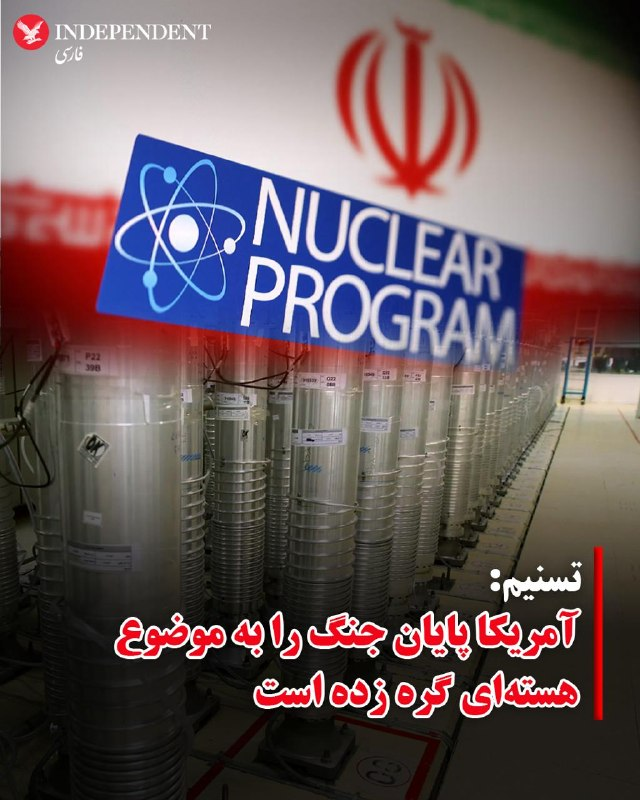

♦️خبرگزاری تسنیم وابسته به سپاه پاسداران، روز دوشنبه ۲۸ اردیبهشت‌ماه به نقل از «یک منبع نزدیک به تیم مذاکره‌کننده» جمهوری اسلامی گزارش داد با وجود برخی تغییرات در متن جدید پیشنهادی آمریکا، اختلافات اساسی میان دو طرف همچنان پابرجاست و «زیاده‌خواهی و عدم واقع‌بینی آمریکایی‌ها» ادامه دارد.

این منبع به خبرگزاری تسنیم گفت آمریکا تلاش می‌کند مذاکرات مربوط به پایان جنگ را به موضوع هسته‌ای گره بزند، اما ایران با این موضوع موافق نیست و «پایان جنگ در برابر تعهدات هسته‌ای» را نخواهد پذیرفت.
به ادعای این منبع، واشنگتن پیشنهادهایی چون «ایجاد صندوق توسعه و بازسازی» را مطرح کرده است، اما جمهوری اسلامی همچنین بر پرداخت غرامت از سوی آمریکا تاکید دارد.
تسنیم به نقل از منبع خود تاکید کرد جمهوری اسلامی از مواضع خود درباره پایان جنگ و بازگرداندن اموال بلوکه‌شده ایران عقب‌نشینی نخواهد کرد و افزود وعده‌های کاغذی برای تهران کافی نیست. او گفت با وجود برخی وعده‌ها، اختلاف درباره نحوه بازگشت پول‌های بلوکه‌شده همچنان وجود دارد.
‌🇸🇦 Indypersian

🤖 @VahidOOnLine

## VahidOOnLine — post 240852

  

♦️معاون سیاسی، امنیتی و اجتماعی استاندار هرمزگان، دوشنبه‌شب ۲۸ اردیبهشت‌ماه فعال شدن پدافند هوایی در جزیره قشم را تایید کرد و گفت این اقدام در راستای مقابله با «ریزپرنده‌های دشمن» انجام شده است.

به گزارش خبرگزاری مهر، احمد نفیسی گفت صدایی که ساعاتی پیش در جزیره قشم شنیده شد، ناشی از فعال شدن سامانه‌های پدافندی و درگیری با ریزپرنده‌ها بوده است.

او با تاکید بر آمادگی کامل نیروهای مسلح، افزود وضعیت تحت کنترل است و شرایط جزیره قشم «کاملا پایدار» است.

پیشتر خبرگزاری تسنیم وابسته به سپاه پاسداران گزارش داده بود پدافند هوایی در جزیره قشم پس از مشاهده ریزپرنده‌ها در آسمان این منطقه فعال شده و برای مقابله با «اهداف متخاصم» وارد عمل شده است.
‌🇸🇦 Indypersian

🤖 @VahidOOnLine

## VahidOOnLine — post 240851

  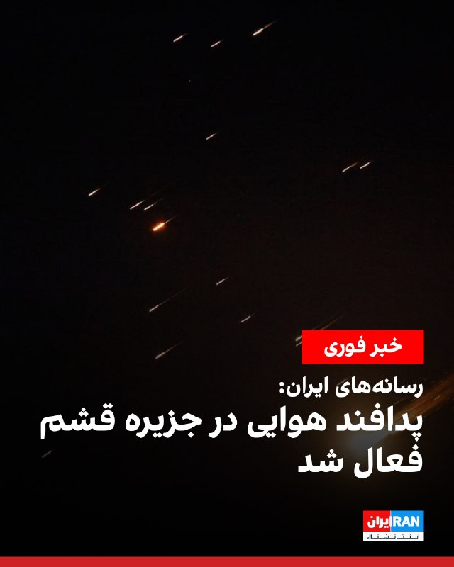

رسانه‌های ایران شامگاه دوشنبه از فعال شدن پدافند هوایی در جزیره قشم خبر دادند.

خبرگزاری تسنیم، وابسته به سپاه پاسداران، نوشت: «پس از مشاهده ریزپرنده‌ها در آسمان جزیره قشم، پدافند برای نابودی اهداف متخاصم فعال شد.»
‌🏁 🇬🇧 IranintlTV

🤖 @VahidOOnLine

## VahidOOnLine — post 240850

  

♦️خبرگزاری تسنیم وابسته به سپاه پاسداران، دوشنبه‌شب ۲۸ اردیبهشت‌ماه گزارش داد پدافند هوایی در جزیره قشم پس از مشاهده ریزپرنده‌ها در آسمان این منطقه فعال شده است.
بر اساس این گزارش، منابع مطلع به خبرنگار تسنیم گفته‌اند پدافند در جهت مقابله و نابودی «اهداف متخاصم» وارد عمل شده است.
‌🇸🇦 Indypersian

🤖 @VahidOOnLine

## VahidOOnLine — post 240849

  

♦️دونالد ترامپ، رئیس‌جمهوری آمریکا، شامگاه دوشنبه ۲۸ اردیبهشت ماه اعلام کرد به درخواست تمیم بن حمد آل ثانی، امیر قطر، محمد بن سلمان، ولیعهد عربستان سعودی، و محمد بن زاید آل نهیان، رئیس امارات متحده عربی، حمله نظامی برنامه‌ریزی‌شده آمریکا علیه جمهوری اسلامی ایران که قرار بود روز سه‌شنبه انجام شود را متوقف کرده است.
ترامپ در پیامی در شبکه اجتماعی تروث سوشال نوشت رهبران قطر، عربستان و امارات از او خواسته‌اند این عملیات را متوقف کند، زیرا مذاکراتی «جدی» در حال انجام است و به اعتقاد آن‌ها توافقی حاصل خواهد شد که نه‌تنها برای ایالات متحده، بلکه برای کشورهای خاورمیانه و دیگر کشورها نیز قابل قبول خواهد بود.
رئیس‌جمهوری آمریکا تاکید کرد این توافق، به‌ویژه شامل این اصل خواهد بود که «ایران نباید به سلاح هسته‌ای دست پیدا کند.»
ترامپ نوشت با توجه به احترامی که برای این رهبران قائل است، به پیت هگست، وزیر جنگ آمریکا، ژنرال دنیل کین، رئیس ستاد مشترک ارتش، و نیروهای نظامی آمریکا دستور داده حمله برنامه‌ریزی‌شده علیه ایران در روز آینده انجام نشود.
او در عین حال هشدار داد به مقام‌های نظامی آمریکا دستور داده است در صورتی که توافقی «قابل قبول» حاصل نشود، برای اجرای یک حمله کامل و گسترده علیه ایران در هر لحظه آماده باشند.
ترامپ در پایان پیام خود تاکید کرد نیروهای آمریکایی باید بتوانند «در کمترین زمان ممکن» عملیات احتمالی را آغاز کنند.
‌🇸🇦 Indypersian

🤖 @VahidOOnLine

## VahidOOnLine — post 240848

  

دونالد ترامپ اعلام کرد به درخواست رهبران قطر، عربستان سعودی و امارات متحده عربی، حمله نظامی برنامه‌ریزی‌شده آمریکا به جمهوری اسلامی را که قرار بود روز سه‌شنبه انجام شود، متوقف کرده است.
او گفت در صورت عدم دستیابی به توافقی قابل قبول، آمریکا آماده اجرای حمله گسترده خواهد بود.

ترامپ گفت مذاکرات جدی در حال انجام است و رهبران این کشورها، به‌عنوان متحدان، معتقدند توافقی حاصل خواهد شد که برای آمریکا و همچنین همه کشورهای خاورمیانه و فراتر از آن بسیار قابل قبول خواهد بود. این توافق، به‌طور مهم، شامل «نبود سلاح هسته‌ای برای ایران» خواهد بود.

رییس‌جمهور آمریکا اضافه کرد: به وزیر جنگ، رییس ستاد مشترک ارتش و ارتش ایالات متحده دستور داده‌ام که حمله برنامه‌ریزی‌شده فردا به ایران انجام نخواهد شد، اما همچنین به آن‌ها دستور داده‌ام در صورتی که توافق قابل قبولی حاصل نشود، برای اجرای یک حمله گسترده و تمام‌عیار علیه ایران در کوتاه‌ترین زمان ممکن آماده باشند.
‌🏁 🇬🇧 IranintlTV

🤖 @VahidOOnLine

## VahidOOnLine — post 240847

♦️همکاری تازه شرکت سواچ با نشان تجاری لوکس و مشهور «اودمار پیگه» موجی از هیجان در بازار ساعت ایجاد کرده و ساعت‌های این مجموعه محدود اکنون با قیمت‌هایی چندین برابر نرخ اولیه در بازار خرید و فروش دوباره عرضه می‌شوند. این تب خرید در برخی شهرها به ازدحام شدید، کتک‌کاری و حتی تعطیلی فروشگاه‌ها منجر شده است.
به گزارش نیویورک‌پست، طرح «رویال پاپ» که ترکیبی از طراحی مشهور «رویال اوک» اودمار پیگه و مجموعه «پاپ» سواچ در دهه ۱۹۸۰ است، با قیمت اولیه حدود ۴۰۰ دلار عرضه شد اما به‌سرعت به یکی از داغ‌ترین کالاهای بازار خرید و فروش دوباره تبدیل شد. برخی آگهی‌ها در سایت‌های فروش اینترنتی قیمت‌هایی بیش از ۹ هزار دلار برای این ساعت‌ها ثبت کرده‌اند و مجموعه کامل هشت‌تایی آن نیز تا حدود ۲۲ هزار دلار قیمت‌گذاری شده است.
فروشندگان بازار جواهرات نیویورک نیز از تقاضای بالا برای برخی رنگ‌های خاص خبر داده‌اند و می‌گویند کمیابی و عرضه محدود این همکاری تازه، عامل اصلی افزایش شدید قیمت‌ها بوده است.
هم‌زمان گزارش‌ها از هرج‌ومرج در فروشگاه‌های سواچ در نیویورک و چند شهر دیگر حکایت دارد؛ جایی که صدها نفر برای خرید این ساعت‌ها روزها در صف ماندند. ازدحام به حدی رسید که برخی شعب به دلیل نگرانی‌های امنیتی به‌طور موقت تعطیل شدند.
‌🇸🇦 Indypersian

🤖 @VahidOOnLine

## VahidOOnLine — post 240846

  

مسعود پزشکیان در شبکه ایکس نوشت: «گفت‌وگو به معنای تسلیم نیست. جمهوری اسلامی با عزت، اقتدار و حفظ حقوق ملت وارد گفت‌وگو می‌شود و به هیچ عنوان از حقوق قانونی مردم و کشور عقب‌نشینی نمی‌کند.»
او افزود: «ما با منطق و با تمام توان، تا پای جان، در خدمت مردم و حافظ منافع و عزت ایران خواهیم بود.»
‌🏁 🇬🇧 IranintlTV

🤖 @VahidOOnLine

## VahidOOnLine — post 240845

  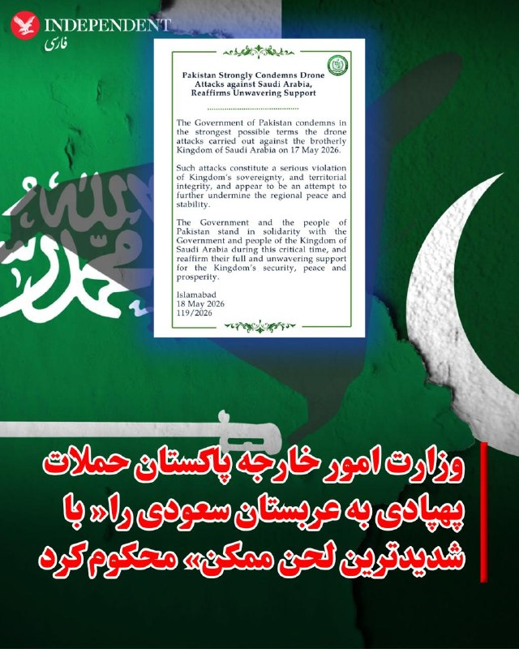

وزارت امور خارجه پاکستان روز دوشنبه ۲۸ اردیبهشت‌ماه با انتشار بیانیه‌ای، حملات پهپادی علیه عربستان سعودی را «با شدیدترین لحن ممکن» محکوم کرد و آن را نقض حاکمیت و تمامیت ارضی عربستان سعودی دانست.

در این بیانیه آمده است این حملات تلاشی برای تضعیف صلح و ثبات منطقه‌ای به شمار می‌رود و دولت و مردم پاکستان در این شرایط در کنار عربستان سعودی ایستاده‌اند.

اسلام‌آباد همچنین بار دیگر حمایت کامل و قاطع خود را از امنیت، صلح و رفاه عربستان سعودی اعلام کرد.

پیشتر وزارت دفاع عربستان سعودی اعلام کرده بود سه پهپاد که از سمت حریم هوایی عراق وارد آسمان این کشور شده بودند، رهگیری و منهدم شدند. ترکی المالکی، سخنگوی رسمی وزارت دفاع عربستان سعودی، تاکید کرده بود ریاض حق پاسخ‌گویی در زمان و مکان مناسب را برای خود محفوظ می‌داند و اقدامات لازم برای حفاظت از حاکمیت و امنیت کشور را انجام خواهد داد.
‌🇸🇦 Indypersian

🤖 @VahidOOnLine

## VahidOOnLine — post 240844

  

♦️مسعود پزشکیان، رئیس‌جمهوری ایران، شامگاه دوشنبه در پیامی در شبکه اجتماعی ایکس نوشت گفتگو به معنای تسلیم نیست و جمهوری اسلامی در مذاکرات از «حقوق مردم و کشور عقب‌نشینی» نخواهد کرد.

پزشکیان نوشت: «جمهوری اسلامی ایران با عزت، اقتدار و حفظ حقوق ملت وارد گفتگو می‌شود و به هیچ عنوان از حقوق قانونی مردم و کشور عقب‌نشینی نمی‌کند.»

رئیس‌جمهوری ایران همچنین افزود: «ما با منطق و با تمام توان، تا پای جان، در خدمت مردم و حافظ منافع و عزت ایران خواهیم بود.»

این اظهارات در شرایطی مطرح می‌شود که دونالد ترامپ از آخرین طرح ۱۴ ماده‌ای تهران برای پایان جنگ ابراز نارضایتی کرده و گفته است «به هیچ وجه حاضر به دادن امتیاز» به ایران نیست.
‌🇸🇦 Indypersian

🤖 @VahidOOnLine

## VahidOOnLine — post 240843

  

لیندسی گراهام، سناتور جمهوری‌خواه، در شبکه ایکس نوشت: «اطمینان کامل دارم که ترامپ به‌خوبی وضعیت ایران را درک می‌کند و در برابر ادامه خودداری جمهوری اسلامی از مذاکره صادقانه، همراه با اقدامات تهاجمی این کشور در تنگه هرمز و سراسر منطقه، مماشات نخواهد کرد.»

او افزود: «یک پاسخ کوتاه اما قاطع می‌تواند مسیر درگیری را به‌درستی تغییر دهد. در مواجهه با جمهوری اسلامی، ضروری است که از موضع قدرت و برتری وارد مذاکره شویم.»
‌🏁 🇬🇧 IranintlTV

🤖 @VahidOOnLine

## mwarmonitor — post 9278

  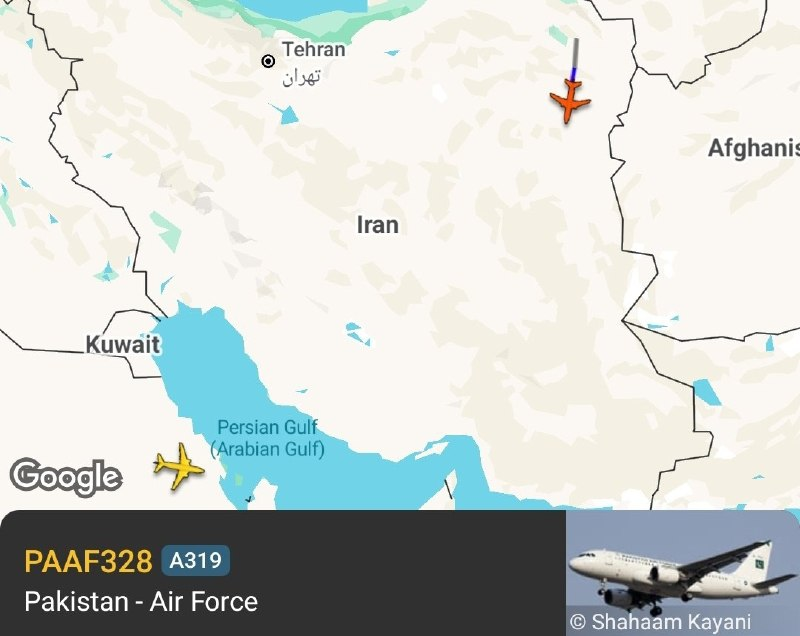

✈️🇵🇰 هواپیمای A319 نیروی هوایی پاکستان (A-1102) که وزیر کشور پاکستان را حمل می‌کرد – وی در یک سفر رسمی دو روزه برای بررسی روابط دوجانبه و گفت‌وگوها با آمریکا به سر می‌برد – از مشهد خارج شد.

@mwarmonitor

## mwarmonitor — post 9277

📝 «نظر من را می‌پرسید؟ حمله انجام خواهد شد.»

## mwarmonitor — post 9276

🔴ترامپ می‌گوید طرح حمله به ایران را به تعویق انداخته است

📝نویسنده: باراک راوید AXIOS

🔰پرزیدنت ترامپ روز دوشنبه اعلام کرد که قصد داشته «فردا» به ایران حمله کند، اما این اقدام را به تعویق انداخته تا فرصت دیگری به مذاکرات بدهد. او ادعا کرد که این تصمیم را به درخواست چند تن از رهبران کشورهای عربی گرفته است.

🔸چرا این موضوع اهمیت دارد؟
کاخ سفید پیشنهاد صلح به‌روزرسانی‌شده‌ای را که ایران روز یکشنبه ارسال کرده بود، «ناکافی» دانست؛ موضوعی که منجر به شکل‌گیری این انتظار فزاینده — حتی در داخل کاخ سفید — شد که ترامپ در آستانه حمله قرار دارد.
ترامپ از زمان آغاز جنگ، تاکنون حداقل شش بار ضرب‌الاجل‌ها را تمدید کرده و حملات برنامه‌ریزی‌شده علیه ایران را به تعویق انداخته است.

🔸دو مقام آمریکایی به اکسیوس گفتند که انتظار می‌رفت ترامپ روز سه‌شنبه تیم امنیت ملی خود را در «اتاق وضعیت» (Situation Room) برای بررسی گزینه‌های نظامی گرد هم آورد.

🔸یک مقام ارشد آمریکایی صبح دوشنبه به اکسیوس گفت اگر ایران موضع خود را تغییر ندهد، ایالات متحده ناچار خواهد بود مذاکرات را «از طریق بمب‌ها» ادامه دهد.

📌اظهارات ترامپ
ترامپ در شبکه اجتماعی «تروث سوشال» (Truth Social) نوشت: «امیر قطر، ولیعهد عربستان سعودی و رئیس امارات متحده عربی از من خواسته‌اند که حمله نظامی برنامه‌ریزی‌شده‌مان علیه جمهوری اسلامی ایران را که برای فردا برنامه‌ریزی شده بود، به تعویق بیندازم.»
او اضافه کرد که رهبران عرب به او گفته‌اند «مذاکرات جدی در حال انجام است و به نظر آن‌ها، به عنوان رهبران و متحدانی بزرگ، توافقی حاصل خواهد شد که برای ایالات متحده آمریکا و همچنین همه کشورهای خاورمیانه و فراتر از آن بسیار قابل قبول خواهد بود.»
ترامپ ادعا کرد که این توافق تضمین خواهد کرد ایران به تسلیحات هسته‌ای دست پیدا نکند.

🔸او از زمان آغاز جنگ بارها ادعاهایی درباره پیشرفت به سوی توافق مطرح کرده، اما اخیراً هیچ گشایش (تحول) خاصی رخ نداده است.

🔹مواردی که باید زیر نظر داشت
رئیس‌جمهور آمریکا گفت که به پیت هگست (وزیر دفاع) و ژنرال دن کین (رئیس ستاد مشترک ارتش) دستور داده است که طرح‌های حمله را به حالت تعلیق درآورند، اما برای اجرای یک «حمله همه‌جانبه و گسترده به ایران، در کوتاه‌ترین زمان ممکن، در صورت عدم دست‌یابی به یک توافق قابل قبول» آماده باشند.

@mwarmonitor

## mwarmonitor — post 9275

حمله پهپادی به سلیمانیه عراق

## mwarmonitor — post 9274

🚨🚨🚨 ترامپ در شبکه اجتماعی Truth Social: از من توسط امیر قطر، تمیم بن حمد آل ثانی، ولیعهد عربستان سعودی، محمد بن سلمان آل سعود، و رئیس‌جمهور امارات متحده عربی، محمد بن زاید آل نهیان، درخواست شده است که حمله نظامی برنامه‌ریزی‌شده ما به جمهوری اسلامی ایران را…

## mwarmonitor — post 9273

  

نفت از ۱۱۲ رد شد دوباره داستان تکراری

## mwarmonitor — post 9272

نفت از ۱۱۲ رد شد دوباره داستان تکراری

## mwarmonitor — post 9271

🚨🚨🚨 ترامپ در شبکه اجتماعی Truth Social:

از من توسط امیر قطر، تمیم بن حمد آل ثانی، ولیعهد عربستان سعودی، محمد بن سلمان آل سعود، و رئیس‌جمهور امارات متحده عربی، محمد بن زاید آل نهیان، درخواست شده است که حمله نظامی برنامه‌ریزی‌شده ما به جمهوری اسلامی ایران را که قرار بود فردا انجام شود متوقف کنم، زیرا در حال حاضر مذاکرات جدی در جریان است و به نظر آن‌ها، به عنوان رهبران بزرگ و متحدان، یک توافق حاصل خواهد شد که برای ایالات متحده آمریکا و همچنین تمام کشورهای خاورمیانه و فراتر از آن بسیار قابل قبول خواهد بود.

این توافق به‌طور مهم شامل «عدم وجود سلاح هسته‌ای برای ایران» خواهد بود.

با توجه به احترام من به رهبران فوق‌الذکر، به وزیر جنگ، پیت هگست، رئیس ستاد مشترک نیروهای مسلح، ژنرال دانیل کین، و ارتش ایالات متحده دستور داده‌ام که حمله برنامه‌ریزی‌شده فردا به ایران انجام نشود.

اما همچنین به آن‌ها دستور داده‌ام که در صورت عدم دستیابی به یک توافق قابل قبول، آماده باشند در هر لحظه عملیات نظامی گسترده و تمام‌عیار علیه ایران را آغاز کنند.

از توجه شما به این موضوع سپاسگزارم!

رئیس‌جمهور دونالد جی. ترامپ

@mwarmonitor

## mwarmonitor — post 9268

پدافند قشم فعال شد

## mwarmonitor — post 9267

🔴بر اساس ادعای منابع عراقی و منطقه‌ای، بیشتر حملاتی که علیه عربستان سعودی انجام شده، توسط گروه‌های شبه‌نظامی در عراق که به ایران نزدیک هستند یا از ایران حمایت می‌شوند انجام شده است. AL_MONITOR

@mwarmonitor

## pm_afshaa — post 90991

🔴ترامپ: قرار بود فردا به ایران حمله کنیم، ولی رهبران قطر، عربستان و امارات ازم خواستن فعلاً متوقفش کنیم چون مذاکرات جدی در جریانه. به ارتش دستور دادم حمله فعلاً انجام نشه، ولی اگه توافق نرسیم، هر لحظه آماده حمله کامل به ایران باشن. از سمت رهبران قطر، عربستان…

## pm_afshaa — post 90990

🔴ترامپ: قرار بود فردا به ایران حمله کنیم، ولی رهبران قطر، عربستان و امارات ازم خواستن فعلاً متوقفش کنیم چون مذاکرات جدی در جریانه. به ارتش دستور دادم حمله فعلاً انجام نشه، ولی اگه توافق نرسیم، هر لحظه آماده حمله کامل به ایران باشن. از سمت رهبران قطر، عربستان…

## pm_afshaa — post 90989

  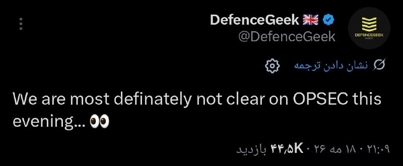

نظامی‌نویس‌های انگلیس میگن خبری تو راهه :

💧 Rainbet.com the #1 Non-KYC Crypto Casino & Sportsbook @rainbetcom

😁 @Pm_Afshaa

## pm_afshaa — post 90988

🚨از کانال خوب و معتبر «بلو‌گارد» حمایت کنید

https://t.me/BLUEGUARD_NEWSS
https://t.me/BLUEGUARD_NEWSS

🔴اینجا خبرایی می‌شنوی که بقیه بعد تو متوجه میشن

## pm_afshaa — post 90987

  <a href="telegram/content/pm_afshaa_90987_1779135095.jpg">🎬 Download video</a>

🔴خبرگزاری تسنیم: فعالیت پدافند دقایقی پیش در قشم به دلیل مقابله با ریز پرنده های آمریکایی بوده!

💧 Rainbet.com the #1 Non-KYC Crypto Casino & Sportsbook @rainbetcom

😁 @Pm_Afshaa

## pm_afshaa — post 90986

🔴ترکیه هم به جمهوری اسلامی پشت کرد

هاکان فیدان وزیر امور خارجه ترکیه:
اورانیوم غنی شده ایران باید خارج شود یا به صورت سه و نیم درصدی تغییر داده شود

💧 Rainbet.com the #1 Non-KYC Crypto Casino & Sportsbook @rainbetcom

😁 @Pm_Afshaa

## pm_afshaa — post 90985

🔴خبرآنلاین: برخی شواهد نشان می‌دهد کشورهای عربی در کنار ترامپ در حال لابی گسترده علیه جمهوری اسلامی در چین هستن

💧 Rainbet.com the #1 Non-KYC Crypto Casino & Sportsbook @rainbetcom

😁 @Pm_Afshaa

## pm_afshaa — post 90984

  

🔴ترامپ: قرار بود فردا به ایران حمله کنیم، ولی رهبران قطر، عربستان و امارات ازم خواستن فعلاً متوقفش کنیم چون مذاکرات جدی در جریانه.

به ارتش دستور دادم حمله فعلاً انجام نشه، ولی اگه توافق نرسیم، هر لحظه آماده حمله کامل به ایران باشن.

از سمت رهبران قطر، عربستان و امارات از من خواسته شد که حمله نظامی برنامه‌ریزی‌ شده‌مون علیه جمهوری اسلامی ایران رو که قرار بود فردا انجام بشه، متوقف کنم؛ چون مذاکرات جدی اکنون در حال انجامه! متحدان ما معتقدن توافقی حاصل خواهد شد که واسه ایالات متحده آمریکا، همه کشورهای خاورمیانه و فراتر از اون، بسیار قابل‌قبول خواهد بود. این توافق، مهم‌تر از همه، شامل این خواهد بود که ایران هیچ سلاح هسته‌ای نداشته باشه.
بخاطر احترامی که واسه رهبران یادشده قائلم، به وزیر جنگ، پیت هگست، رئیس ستاد مشترک ارتش، دنیل کین، و ارتش ایالات متحده دستور دادم که حمله برنامه‌ریزی‌شده به ایران رو فردا انجام ندن. ولی بهشون دستور دادم که در صورت نرسیدن به یه توافق قابل‌قبول، آماده اجرای یه حمله کامل و گسترده علیه ایران، در هر لحظه و بدون هیچ تأخیری باشن...

💧Rainbet.com the #1 Non-KYC Crypto Casino & Sportsbook @rainbetcom

😁 @Pm_Afshaa

## pm_afshaa — post 90983

  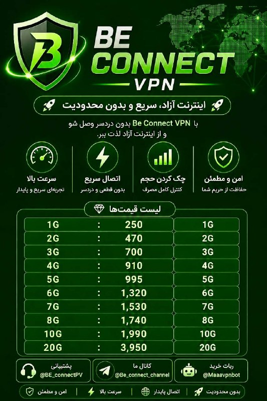

😎اینترنت بدون محدودیت، سریع و امن!
☄️

✅سرعت بالا و پینگ عالی به همراه سابلینک 

✅ مناسب برای یوتیوب، اینستاگرام، گیم و ترید 

✅ بدون قطعی و کاملاً پایدار 

✅ پشتیبانی سریع و بازگشت وجه درصورت قطعی

✅قابلیت چک کردن حجم و خرید آسان از طریق ربات 

✅ ۵۰۰ مگابایت کانفیگ رایگان با دعوت ۳ نفر

💰 
⭕️ قیمت ویژه: 
هر گیگ فقط ۲۵۰ 
💸
❗️
۵گیگ ۹۹۵ 
❗️
۱۰گیگ ۱۹۹۰ 
❗️

🎉
💘ویژه جشنواره خرید از ربات:

🍆
🍆
2⃣
0⃣ 
🔥 
🌶 
2⃣ 
🔥
🍆
🍆

برای دریافت قیمت های اوتباند پیام بدید
✉️

🤖
⚡️ خرید از ربات و پشتیبانی 
فرصتو از دست نده 
🚀
چنل:
@Be_connect_channel
ربات:
@Maaavpnbot
پشتیبانی:
@BE_connectPV

## DEJradio — post 4710

  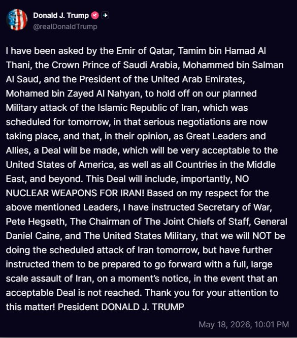

⭕️
🚨 دونالد ترامپ رئیس جمهوری ایالات متحده در پیامی در شبکه اجتماعی تروث سوشیال نوشت:

امیر قطر، تمیم بن حمد آل ثانی، ولیعهد عربستان سعودی، محمد بن سلمان آل سعود، و رئیس‌ جمهوری امارات متحده عربی، محمد بن زاید آل نهیان، از من درخواست کرده‌اند حمله نظامی برنامه‌ریزی‌شده ما علیه جمهوری اسلامی ایران را که قرار بود فردا انجام شود، متوقف کنم؛ زیرا اکنون مذاکراتی جدی در جریان است و آنان، به‌عنوان رهبران بزرگ و متحدان ما، معتقدند توافقی حاصل خواهد شد که برای ایالات متحده آمریکا، تمامی کشورهای خاورمیانه و فراتر از آن، بسیار قابل قبول خواهد بود. این توافق، مهم‌تر از همه، شامل این خواهد بود که ایران هیچ سلاح هسته‌ای نداشته باشد.
بر پایه احترامی که برای رهبران یادشده قائلم، به وزیر جنگ، پیت هگست، رئیس ستاد مشترک نیروهای مسلح، ژنرال دنیل کین، و ارتش ایالات متحده دستور داده‌ام که حمله برنامه‌ریزی‌شده علیه ایران در فردا انجام نشود. اما در عین حال، به آنان دستور داده‌ام که در صورت نرسیدن به توافقی قابل قبول، برای اجرای یک حمله کامل و گسترده علیه ایران، در هر لحظه آماده باشند.

از توجه شما به این موضوع سپاسگزارم.
رئیس‌جمهوری، دونالد جی. ترامپ

#ترامپ #جمهوری_اسلامی
@DEJradio

## VahidOnline — post 75546

  

زیرنویس شبکه خبر صدا و سیمای جمهوری اسلامی

📡 @VahidOnline

## VahidOnline — post 75545

  

☄️ ترامپ: حمله فردا را به تعویق انداختم

پست ترامپ ترجمه ماشین:
از سوی امیر قطر تمیم بن حمد آل ثانی، ولیعهد عربستان سعودی محمد بن سلمان آل سعود و رئیس امارات متحده عربی محمد بن زاید آل نهیان، از من خواسته شده است حمله نظامی برنامه‌ریزی‌شده ما علیه جمهوری اسلامی ایران را که قرار بود فردا انجام شود، به تعویق بیندازم؛
زیرا مذاکرات جدی اکنون در جریان است
و
به باور آن‌ها، به‌عنوان رهبران بزرگ و متحدان ما، توافقی حاصل خواهد شد که برای ایالات متحده آمریکا و همچنین همه کشورهای خاورمیانه و فراتر از آن بسیار قابل قبول خواهد بود.

این توافق، نکته مهمی را در بر خواهد داشت: هیچ سلاح هسته‌ای برای ایران!

بر اساس احترامی که برای رهبران نام‌برده قائلم، به وزیر جنگ، پیت هگست، رئیس ستاد مشترک ارتش، ژنرال دانیل کین، و ارتش ایالات متحده دستور داده‌ام که حمله برنامه‌ریزی‌شده فردا به ایران را انجام ندهیم؛ اما همچنین به آن‌ها دستور داده‌ام که آماده باشند، در صورت حاصل نشدن یک توافق قابل قبول، در یک لحظه و بدون درنگ، حمله‌ای کامل و گسترده علیه ایران را آغاز کنند.

از توجه شما به این موضوع سپاسگزارم!

رئیس‌جمهور دونالد جی. ترامپ
realDonaldTrump

📡 @VahidOnline

## kianmeli1 — post 87472

  

🔴زیرنویس تلویزیون جمهوری اسلامی

ترامپ برای پنجمین بار عقب نشینی کرد
https://t.me/kianmeli1

## kianmeli1 — post 87471

‏🔴خضریان: بسیاری از مسئولان ارشد نظام معتقدند که باید در برابر محاصره دریایی آمریکا، پاسخ نظامی داده شود

‏علی خضریان: آمریکا در وضعیت ضعف نظامی قرار دارد
https://t.me/kianmeli1

## kianmeli1 — post 87470

‏🔴روداو به نقل از عضو رهبری کومله زحمتکشان کردستان ایران اعلام کرد که اردوگاه «سورداش» در سلیمانیه با چهار موشک هدف حمله قرار گرفت و در پی آن دو نفر زخمی شدند
https://t.me/kianmeli1

## kianmeli1 — post 87469

‏🔴آنا کلی، معاون سخنگوی کاخ سفید، در گفت‌وگو با فاکس نیوز اعلام کرد جمهوری اسلامی اجازه نخواهد داشت اورانیوم غنی‌شده در اختیار داشته باشد و این موضوع خط قرمز دونالد ترامپ در مذاکرات است. تهران نه‌تنها نباید به سلاح هسته‌ای دست پیدا کند، بلکه باید مواد غنی‌شده را نیز تحویل دهد
https://t.me/kianmeli1

## kianmeli1 — post 87468

  <a href="telegram/content/kianmeli1_87468_1779135100.mp4">🎬 Download video</a>

🔴رزمایش مسلحانه زنان بسیجی در ارومیه

این کلیپ را اپوزسیون ببیند که بدون «سازماندهی سراسری مسلحانه» نمیشود یک کوچه در ایران را آزاد کرد٫ با مبارزه مدنی گاندی و ماندلا فقط کشتار بیشمار بر دستمان می ماند

جمهوری اسلامی سالهاست می گوید اگر میخواهید ایران را پس بگیرید٫ باید ابتدا از روی جنازه ما عبور کنید
https://t.me/kianmeli1

## kianmeli1 — post 87467

  

🔴بازی تکراری و پر از فریب ترامپ

هر زمان قیمت نفت از ۱۰۰ دلار عبور میکند٫ میگوید توافق نزدیک است
امشب نیز قیمت نفت ۱۱۲ دلار بود

دوباره با حربه ی مذاکره قیمت را پایین می آورد
https://t.me/kianmeli1

## kianmeli1 — post 87466

🔴ترامپ:

امیر قطر، تمیم بن حمد آل ثانی، ولیعهد عربستان سعودی، محمد بن سلمان آل سعود، و رئیس جمهور امارات متحده عربی، محمد بن زاید آل نهیان، از من خواسته‌اند که حمله نظامی برنامه‌ریزی شده‌مان به جمهوری اسلامی ایران را که قرار بود فردا انجام شود، به تعویق بیندازم، چرا که مذاکرات جدی اکنون در حال انجام است و به نظر آنها، به عنوان رهبران و متحدان بزرگ، توافقی حاصل خواهد شد که برای ایالات متحده آمریکا و همچنین همه کشورهای خاورمیانه و فراتر از آن بسیار قابل قبول خواهد بود. این توافق، مهم‌تر از همه، شامل عدم دستیابی ایران به سلاح هسته‌ای خواهد بود! با توجه به احترامی که برای رهبران ذکر شده در بالا قائلم، به وزیر جنگ، پیت هگزت، رئیس ستاد مشترک ارتش، ژنرال دنیل کین، و ارتش ایالات متحده دستور داده‌ام که فردا حمله برنامه‌ریزی شده به ایران را انجام نخواهیم داد، اما به آنها دستور داده‌ام که آماده باشند تا در صورت عدم دستیابی به توافق قابل قبول، فوراً حمله‌ای کامل و گسترده به ایران انجام دهند. از توجه شما به این موضوع متشکرم! رئیس جمهور دونالد جی. ترامپ
https://t.me/kianmeli1

## IranIntlTV — post 337832

  <a href="https://t.me/IranintlTV/337832">📎 Download file</a>

🎧نسخه صوتی ‌‌‏۲۴ با فرداد فرحزاد: احتمال از سرگیری جنگ؛ ترامپ: تهران می‌داند چه اتفاقی می‌افتد
@iranintlTV

## IranIntlTV — post 337831

  <a href="https://t.me/IranintlTV/337831">📎 Download file</a>

🎧نسخه صوتی دومینو: اتحاد ارتش‌های مجهز در برابر اقتصادی ورشکسته
@iranintlTV

## IranIntlTV — post 337830

  <a href="telegram/content/IranIntlTV_337830_1779135103.mp4">🎬 Download video</a>

وای‌نت گزارش داد بنیامین نتانیاهو پس از پاسخ جمهوری اسلامی به پیشنهاد آمریکا، نشست امنیتی با حضور وزیران و مشاوران ارشد برگزار می‌کند.

دونالد ترامپ نیز در تماس با نتانیاهو گفته زمان برای جمهوری اسلامی رو به پایان است.

گفت‌وگو با گابریل گرویسمن، استراتژیست حزب جمهوری‌خواه
@iranintltv

## IranIntlTV — post 337829

  <a href="telegram/content/IranIntlTV_337829_1779135105.mp4">🎬 Download video</a>

مصطفی دانشگر، تحلیل‌گر سیاسی، گفت طرح مطلوب آمریکا برای جمهوری اسلامی، مدل ونزوئلا است. او افزود تصور دونالد ترامپ و ایالات متحده این است که پس از حذف و کنار زدن برخی مقام‌های جمهوری اسلامی در جریان جنگ اخیر، اکنون می‌توانند فردی را در درون ساختار حکومت پیدا کنند.
@iranintltv

## IranIntlTV — post 337828

  

رسانه‌های ایران شامگاه دوشنبه از فعال شدن پدافند هوایی در جزیره قشم خبر دادند.

خبرگزاری تسنیم، وابسته به سپاه پاسداران، نوشت: «پس از مشاهده ریزپرنده‌ها در آسمان جزیره قشم، پدافند برای نابودی اهداف متخاصم فعال شد.»
https://iranintl.com/202605184408

## IranIntlTV — post 337827

  

دونالد ترامپ اعلام کرد به درخواست رهبران قطر، عربستان سعودی و امارات متحده عربی، حمله نظامی برنامه‌ریزی‌شده آمریکا به جمهوری اسلامی را که قرار بود روز سه‌شنبه انجام شود، متوقف کرده است.
او گفت در صورت عدم دستیابی به توافقی قابل قبول، آمریکا آماده اجرای حمله گسترده خواهد بود.

ترامپ گفت مذاکرات جدی در حال انجام است و رهبران این کشورها، به‌عنوان متحدان، معتقدند توافقی حاصل خواهد شد که برای آمریکا و همچنین همه کشورهای خاورمیانه و فراتر از آن بسیار قابل قبول خواهد بود. این توافق، به‌طور مهم، شامل «نبود سلاح هسته‌ای برای ایران» خواهد بود.

رییس‌جمهور آمریکا اضافه کرد: به وزیر جنگ، رییس ستاد مشترک ارتش و ارتش ایالات متحده دستور داده‌ام که حمله برنامه‌ریزی‌شده فردا به ایران انجام نخواهد شد، اما همچنین به آن‌ها دستور داده‌ام در صورتی که توافق قابل قبولی حاصل نشود، برای اجرای یک حمله گسترده و تمام‌عیار علیه ایران در کوتاه‌ترین زمان ممکن آماده باشند.
https://iranintl.com/202605181556

## IranIntlTV — post 337826

  

مسعود پزشکیان در شبکه ایکس نوشت: «گفت‌وگو به معنای تسلیم نیست. جمهوری اسلامی با عزت، اقتدار و حفظ حقوق ملت وارد گفت‌وگو می‌شود و به هیچ عنوان از حقوق قانونی مردم و کشور عقب‌نشینی نمی‌کند.»
او افزود: «ما با منطق و با تمام توان، تا پای جان، در خدمت مردم و حافظ منافع و عزت ایران خواهیم بود.»
https://iranintl.com/202605181966

## IranIntlTV — post 337825

  <a href="telegram/content/IranIntlTV_337825_1779135109.mp4">🎬 Download video</a>

۲۴ با فرداد فرحزاد
@iranintltv

## IranIntlTV — post 337824

  

لیندسی گراهام، سناتور جمهوری‌خواه، در شبکه ایکس نوشت: «اطمینان کامل دارم که ترامپ به‌خوبی وضعیت ایران را درک می‌کند و در برابر ادامه خودداری جمهوری اسلامی از مذاکره صادقانه، همراه با اقدامات تهاجمی این کشور در تنگه هرمز و سراسر منطقه، مماشات نخواهد کرد.»

او افزود: «یک پاسخ کوتاه اما قاطع می‌تواند مسیر درگیری را به‌درستی تغییر دهد. در مواجهه با جمهوری اسلامی، ضروری است که از موضع قدرت و برتری وارد مذاکره شویم.»
https://iranintl.com/202605181005

## IranIntlTV — post 337823

  <a href="https://t.me/IranintlTV/337823">📎 Download file</a>

🎧نسخه صوتی تیتراول با نیوشا صارمی: احتمال آغاز جنگ در همین هفته با فرمان ترامپ پس از رد آخرین پیشنهاد تهران
@iranintlTV

## Shin_Persian — post 6074

  

Shin ✓ @hey_itsmyturn
Mon, 18 May 2026 19:49:16 UTC

IRGC-owned Fars News claims UAV strikes on Pezhak (PJAK) "base" in Sulaymaniyah governorate of #Iraq 🇮🇶
#KRI

فارسی

خبرگزاری فارس وابسته به سپاه پاسداران (IRGC) مدعی حملات پهپادی به «پایگاه» پژاک (PJAK) در استان سلیمانیه #Iraq 🇮🇶 شد.
#KRI

𝕏 · @shin_persian

## Shin_Persian — post 6073

Shin ✓ @hey_itsmyturn
Mon, 18 May 2026 19:37:36 UTC

Explosion(s) in Erbil, KRI, #Iraq 🇮🇶

فارسی

انفجار(ها) در اربیل، اقلیم کردستان عراق، #Iraq 🇮🇶

𝕏 · @shin_persian

## Shin_Persian — post 6072

  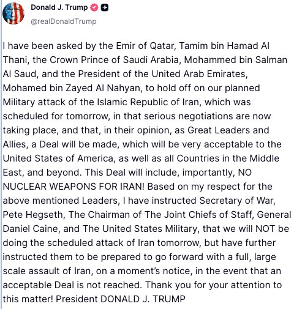

Shin ✓ @hey_itsmyturn Mon, 18 May 2026 19:06:13 UTC President Trump @POTUS: "I have been asked by the Emir of Qatar, Tamim bin Hamad Al Thani, the Crown Prince of Saudi Arabia, Mohammed bin Salman Al Saud, and the President of the United Arab Emirates, Mohamed…

## Shin_Persian — post 6071

Shin ✓ @hey_itsmyturn
Mon, 18 May 2026 19:06:13 UTC

President Trump @POTUS:
"I have been asked by the Emir of Qatar, Tamim bin Hamad Al Thani, the Crown Prince of Saudi Arabia, Mohammed bin Salman Al Saud, and the President of the United Arab Emirates, Mohamed bin Zayed Al Nahyan, to hold off on our planned Military attack of the Islamic Republic of Iran, which was scheduled for tomorrow, in that serious negotiations are now taking place, and that, in their opinion, as Great Leaders and Allies, a Deal will be made, which will be very acceptable to the United States of America, as well as all Countries in the Middle East, and beyond. This Deal will include, importantly, NO NUCLEAR WEAPONS FOR IRAN! Based on my respect for the above mentioned Leaders, I have instructed Secretary of War, Pete Hegseth, The Chairman of The Joint Chiefs of Staff, General Daniel Caine, and The United States Military, that we will NOT be doing the scheduled attack of Iran tomorrow, but have further instructed them to be prepared to go forward with a full, large scale assault of Iran, on a moment’s notice, in the event that an acceptable Deal is not reached. Thank you for your attention to this matter! President DONALD J. TRUMP"

فارسی

رئیس‌جمهور ترامپ @POTUS:
«از سوی شیخ تمیم بن حمد آل ثانی امیر قطر، محمد بن سلمان آل سعود ولیعهد عربستان سعودی و محمد بن زاید آل نهیان رئیس امارات متحده عربی از من خواسته شده است که از حمله نظامی برنامه‌ریزی شده‌مان به جمهوری اسلامی ایران که برای فردا برنامه‌ریزی شده بود، صرف‌نظر کنم؛ چرا که مذاکرات جدی در حال انجام است و به عقیده آن‌ها، به عنوان رهبرانی بزرگ و متحد، توافقی حاصل خواهد شد که برای ایالات متحده آمریکا و همچنین تمامی کشورهای خاورمیانه و فراتر از آن بسیار قابل قبول خواهد بود. این توافق، به طور مهمی، شامل عدم دستیابی ایران به سلاح هسته‌ای خواهد بود! بر اساس احترامی که برای رهبران مذکور قائل هستم، به وزیر جنگ، پیت هگست، رئیس ستاد مشترک ارتش، ژنرال دنیل کین و ارتش ایالات متحده دستور داده‌ام که حمله برنامه‌ریزی شده فردا به ایران را انجام ندهند، اما علاوه بر آن به آن‌ها دستور داده‌ام تا آماده باشند که در صورت عدم دستیابی به توافقی قابل قبول، در لحظه، یک حمله تمام‌عیار و گسترده علیه ایران را به پیش ببرند. از توجه شما به این موضوع سپاسگزارم! رئیس‌جمهور دونالد جی. ترامپ»

𝕏 · @shin_persian

## Shin_Persian — post 6070

  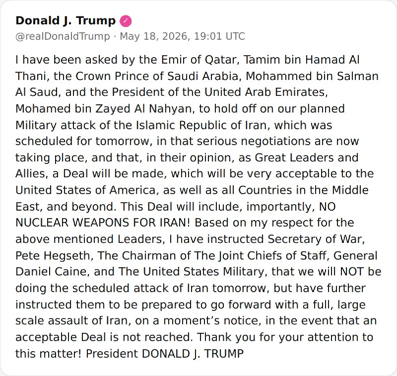

Shin ✓ @hey_itsmyturn Mon, 18 May 2026 19:06:09 UTC President Trump @POTUS: "I have been asked by the Emir of Qatar, Tamim bin Hamad Al Thani, the Crown Prince of Saudi Arabia, Mohammed bin Salman Al Saud, and the President of the United Arab Emirates, Mohamed…

## Shin_Persian — post 6069

Shin ✓ @hey_itsmyturn
Mon, 18 May 2026 19:06:09 UTC

President Trump @POTUS:
"I have been asked by the Emir of Qatar, Tamim bin Hamad Al Thani, the Crown Prince of Saudi Arabia, Mohammed bin Salman Al Saud, and the President of the United Arab Emirates, Mohamed bin Zayed Al Nahyan, to hold off on our planned Military attack of the Islamic Republic of Iran, which was scheduled for tomorrow, in that serious negotiations are now taking place, and that, in their opinion, as Great Leaders and Allies, a Deal will be made, which will be very acceptable to the United States of America, as well as all Countries in the Middle East, and beyond. This Deal will include, importantly, NO NUCLEAR WEAPONS FOR IRAN! Based on my respect for the above mentioned Leaders, I have instructed Secretary of War, Pete Hegseth, The Chairman of The Joint Chiefs of Staff, General Daniel Caine, and The United States Military, that we will NOT be doing the scheduled attack of Iran tomorrow, but have further instructed them to be prepared to go forward with a full, large scale assault of Iran, on a moment’s notice, in the event that an acceptable Deal is not reached. Thank you for your attention to this matter! President DONALD J. TRUMP"

فارسی

رئیس‌جمهور ترامپ @POTUS:

«از من توسط تمیم بن حمد آل ثانی، امیر قطر، محمد بن سلمان آل سعود، ولیعهد عربستان سعودی، و محمد بن زاید آل نهیان، رئیس امارات متحده عربی، درخواست شده است تا حمله نظامی برنامه‌ریزی‌شده‌مان علیه جمهوری اسلامی ایران را که برای فردا برنامه‌ریزی شده بود، متوقف کنم؛ چرا که اکنون مذاکرات جدی در حال انجام است و به عقیده آن‌ها، به عنوان رهبرانی بزرگ و متحد، توافقی حاصل خواهد شد که برای ایالات متحده آمریکا و همچنین تمامی کشورهای خاورمیانه و فراتر از آن، بسیار قابل قبول خواهد بود. این توافق، به طور مهمی، شامل عدم دستیابی ایران به سلاح هسته‌ای خواهد بود! بر اساس احترامی که برای رهبران مذکور قائل هستم، به پیت هگست، وزیر جنگ، ژنرال دنیل کین، رئیس ستاد مشترک ارتش، و ارتش ایالات متحده دستور داده‌ام که حمله برنامه‌ریزی‌شده فردا به ایران را انجام نخواهیم داد، اما همچنین به آن‌ها دستور داده‌ام که آماده باشند تا در صورت عدم دستیابی به یک توافق قابل قبول، در لحظه، یک حمله تمام‌عیار و گسترده علیه ایران را به پیش ببرند. از توجه شما به این موضوع سپاسگزارم! رئیس‌جمهور دونالد جی. ترامپ»

𝕏 · @shin_persian

## Shin_Persian — post 6067

  

Shin ✓ @hey_itsmyturn
Mon, 18 May 2026 18:57:46 UTC

Staten-owned MehrNews:
Air Defense activity in Qeshm island, Hormozgan Province, #Iran

فارسی

خبرگزاری دولتی مهر:
فعالیت پدافند هوایی در جزیره قشم، استان هرمزگان، #Iran_

𝕏 · @shin_persian

## ManotoTV — post 105614

  <a href="telegram/content/ManotoTV_105614_1779135114.mp4">🎬 Download video</a>

«سکوت نکنیم، صدای فاطمه سپهری باشیم»

## ManotoTV — post 105613

  <a href="telegram/content/ManotoTV_105613_1779135116.mp4">🎬 Download video</a>

دونالد ترامپ، رئیس‌جمهوری آمریکا، در پیامی در شبکه اجتماعی تروث سوشال نوشت:

««امیر قطر، تمیم بن حمد آل ثانی، ولیعهد عربستان سعودی، محمد بن سلمان آل سعود، و رئیس امارات متحده عربی، محمد بن زاید آل نهیان، از من خواسته‌اند حمله نظامی برنامه‌ریزی‌شده‌مان علیه جمهوری اسلامی ایران را که قرار بود فردا انجام شود، متوقف کنم؛ زیرا اکنون مذاکرات جدی در جریان است و به اعتقاد آن‌ها، به‌عنوان رهبران بزرگ و متحدان ما، توافقی حاصل خواهد شد که برای ایالات متحده آمریکا، همه کشورهای خاورمیانه و فراتر از آن بسیار قابل قبول خواهد بود.

این توافق، مهم‌تر از همه، شامل این خواهد بود که ایران هیچ سلاح هسته‌ای نداشته باشد!

بر اساس احترامم به رهبران یادشده، به وزیر جنگ، پیت هگست، رئیس ستاد مشترک نیروهای مسلح، ژنرال دنیل کین، و ارتش ایالات متحده دستور داده‌ام که حمله برنامه‌ریزی‌شده به ایران را فردا انجام ندهند؛ اما همزمان به آن‌ها دستور داده‌ام در صورتی که توافق قابل قبولی حاصل نشود، برای اجرای یک حمله کامل و گسترده علیه ایران، در هر لحظه آماده باشند.»

## ManotoTV — post 105612

  <a href="telegram/content/ManotoTV_105612_1779135117.mp4">🎬 Download video</a>

‌
خبرگزاری‌های داخل ایران گزارش دادند پدافند هوایی قشم شامگاه دوشنبه فعال شده است. مقام‌های جمهوری اسلامی توضیحی درباره علت فعالیت پدافند هوایی در این جزیره ارائه نکرده‌اند.

## ManotoTV — post 105611

  <a href="telegram/content/ManotoTV_105611_1779135117.mp4">🎬 Download video</a>

«رشید مظاهری به خاطر بیان عقیده_اش در بازداشت است»

## ManotoTV — post 105610

  <a href="telegram/content/ManotoTV_105610_1779135119.mp4">🎬 Download video</a>

«صدای فاطمه سپهری باشیم»

## ManotoTV — post 105609

  <a href="telegram/content/ManotoTV_105609_1779135120.mp4">🎬 Download video</a>

تجمع ایرانیان در لیسبون مقابل سفارت نروژ؛ اعتراض به دیدار سیاستمداران نروژی با جمهوری اسلامی

## FarsiVOA — post 218090

  <a href="telegram/content/FarsiVOA_218090_1779135122.mp4">🎬 Download video</a>

⚡️فاطمه حقیقت‌جو در برنامه تفسیر خبر: مشروعیت جمهوری اسلامی از بین رفته‌است
@FarsiVOA

## FarsiVOA — post 218089

  <a href="telegram/content/FarsiVOA_218089_1779135123.mp4">🎬 Download video</a>

⚡️بهزاد احمدی نیا در برنامه تفسیر خبر: جمهوری اسلامی معیشت مردم را به گروگان خود گرفته است
@FarsiVOA

## FarsiVOA — post 218088

⚡️آموزش حکومتی کار با سلاح در تلویزیون و خیابان؛ بومرنگی علیه حاکمیت جمهوری اسلامی؟
@FarsiVOA

## FarsiVOA — post 218087

  

⚡️مقامات جمهوری اسلامی از فعال شدن ضدهوایی‌ها در جزیره قشم در روز دوشنبه خبر دادند. معاون سیاسی، امنیتی و اجتماعی استاندار هرمزگان، احمد نفیسی گفت فعالیت ضدهوایی‌ها برای مقابله با «ریزپرنده‌های دشمن» بود. او در اظهاراتی که خبرگزاری فارس، وابسته به سپاه منتشر کرد، از بیان اینکه آیا حملات ادعایی پهپادها خساراتی برجای گذاشته است یا خیر خودداری کرد.
@FarsiVOA

## FarsiVOA — post 218086

⚡️عفو بین‌الملل اعلام کرد جمهوری اسلامی دست‌کم دو هزار و ۱۵۹ نفر را در سال ۲۰۲۵ میلادی اعدام کرد ‌‌و عامل اصلی جهش آمار بود
@FarsiVOA

## FarsiVOA — post 218085

⚡️روز ارتباطات در سایه خاموشی دیجیتال؛ واکنش کاربران شبکه‌های اجتماعی
@FarsiVOA

## FarsiVOA — post 218084

⚡️علی جوانمردی: جمهوری اسلامی مسئول هرگونه اقدام نظامی در ایران است
@FarsiVOA

## FarsiVOA — post 218083

⚡️در برنامه تفسیر خبر امروز، مهدی آقازمانی با کارشناسان مهمان، درباره تاکید پرزیدنت ترامپ بر نیاز شدید حکومت ایران به دستیابی به توافق با آمریکا، گفته‌های سخنگوی وزارتخارجه جمهوری اسلامی درباره ادامه مذاکرات و هشتاد روزه شدن حصر دیجیتال مردم ایران توسط جمهوری اسلامی گفتگو می‌کند
@FarsiVOA

## FarsiVOA — post 218082

  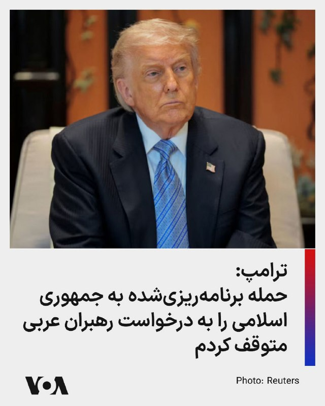

دونالد ترامپ، رئیس‌جمهوری آمریکا، روز دوشنبه اعلام کرد که حمله نظامی برنامه‌ریزی‌شده آمریکا علیه جمهوری اسلامی که قرار بود فردا انجام شود، به درخواست رهبران قطر، عربستان سعودی و امارات متحده عربی به تعویق افتاده است.

دونالد ترامپ در پیامی در شبکه تروت سوشال نوشت که امیر قطر، تمیم بن حمد آل ثانی، ولیعهد عربستان سعودی، محمد بن سلمان، و رئیس امارات متحده عربی، محمد بن زاید آل نهیان، از او خواسته‌اند که این حمله متوقف شود، زیرا به گفته او «مذاکرات جدی» در جریان است.

رئیس‌جمهوری آمریکا گفت این رهبران بر این باورند که «توافقی حاصل خواهد شد» که نه‌تنها برای ایالات متحده بلکه برای کشورهای منطقه نیز «بسیار قابل قبول» خواهد بود.

ترامپ همچنین تأکید کرد که این توافق شامل یک اصل کلیدی خواهد بود: «هیچ سلاح هسته‌ای برای حکومت ایران.»

او افزود که «بر اساس احترام» به رهبران یادشده، به پیت هگست، وزیر جنگ آمریکا، ژنرال دنیل کین رئیس ستاد مشترک نیروهای مسلح، و ارتش آمریکا دستور داده است که حمله برنامه‌ریزی‌شده انجام نشود.

https://ir.voanews.com/a/8151342.html

## FarsiVOA — post 218081

  <a href="telegram/content/FarsiVOA_218081_1779135124.mp4">🎬 Download video</a>

فرماندهی مرکزی ایالات متحده، سنتکام، اعلام کرد اجرای محاصره دریایی آمریکا علیه بنادر ایران همچنان ادامه دارد.

به گفته سنتکام، نیروهای آمریکایی تاکنون مسیر ۸۵ کشتی تجاری را برای اطمینان از اجرای کامل این اقدام تغییر داده‌اند.

@FarsiVOA

## DW_Farsi — post 124856

  

🔶 ترامپ: حمله فردا به ایران را به تعویق انداختیم

دونالد ترامپ، رئیس‌جمهور آمریکا، عصر دوشنبه، ۱۸ مه (۲۸ اردیبهشت) اعلام کرد ایالات متحده حمله نظامی "برنامه‌ریزی‌شده" علیه ایران را که قرار بود روز سه‌شنبه انجام شود، "اجرا نخواهد کرد". او این خبر را در شبکه اجتماعی تروث سوشال منتشر کرد.

ترامپ نوشت: «امیر قطر، تمیم بن حمد آل ثانی، ولیعهد عربستان محمد بن سلمان آل سعود و رئیس امارات محمد بن زاید آل نهیان از من خواستند حمله نظامی برنامه‌ریزی‌شده علیه جمهوری اسلامی ایران را که برای فردا تعیین شده بود، متوقف کنم، زیرا مذاکرات جدی اکنون در جریان است و به نظر آن‌ها، به‌عنوان رهبران و متحدان بزرگ، توافقی حاصل خواهد شد که برای ایالات متحده آمریکا، همه کشورهای خاورمیانه و فراتر از آن بسیار قابل قبول خواهد بود.»

او افزود: «این توافق، مهم‌تر از همه، شامل این خواهد بود که ایران هیچ سلاح هسته‌ای نداشته باشد.»

ترامپ همچنین گفت: «بر اساس احترامم به رهبران یادشده، به وزیر جنگ، پیت هگست، رئیس ستاد مشترک ارتش ژنرال دنیل کین و نیروهای مسلح آمریکا دستور داده‌ام که حمله برنامه‌ریزی‌شده فردا علیه ایران انجام نخواهد شد.»

@dw_farsi

## DW_Farsi — post 124855

  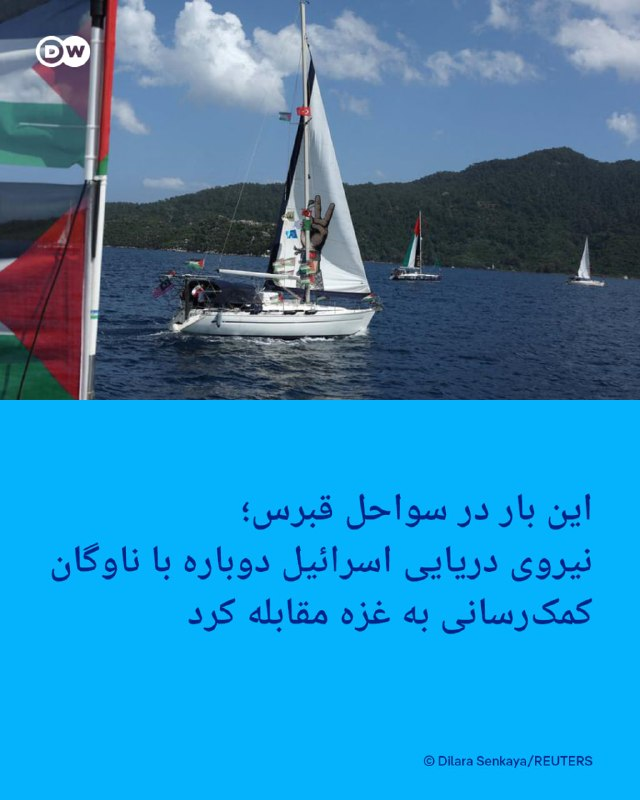

🔶 آمریکا: مذاکرات به سختی پیش می‌رود و شاید بمب‌ها سخن بگویند تنش‌ها میان ایران و آمریکا روز دوشنبه همچنان بالا باقی ماند. یک مقام آمریکایی پیشنهاد متقابل اخیر ایران برای پایان دائمی جنگ را "ناکافی" توصیف کرد و گفت مذاکرات «به‌سختی پیش می‌رود». او هشدار داد…

## DW_Farsi — post 124854

  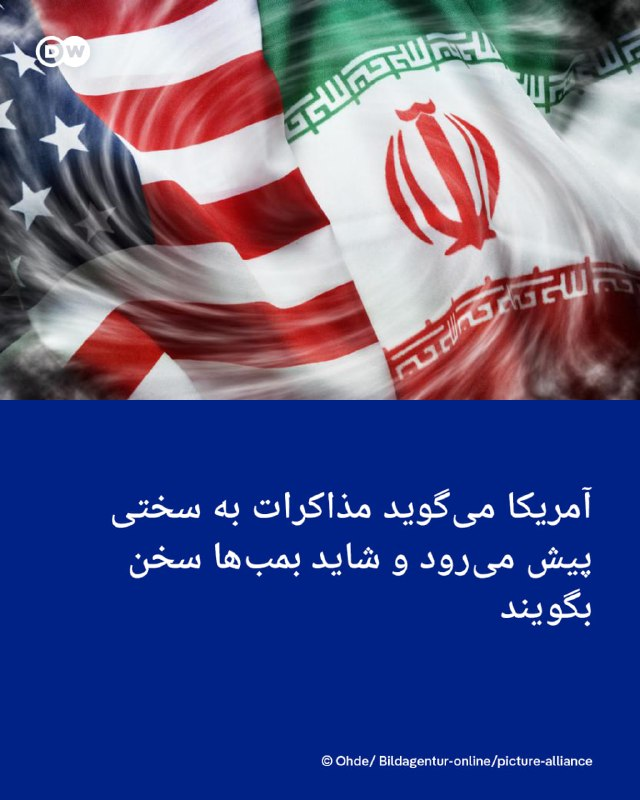

🔶 آمریکا: مذاکرات به سختی پیش می‌رود و شاید بمب‌ها سخن بگویند

تنش‌ها میان ایران و آمریکا روز دوشنبه همچنان بالا باقی ماند. یک مقام آمریکایی پیشنهاد متقابل اخیر ایران برای پایان دائمی جنگ را "ناکافی" توصیف کرد و گفت مذاکرات «به‌سختی پیش می‌رود». او هشدار داد اگر ایران همکاری بیشتری نشان ندهد، در صورت لزوم آمریکا "با بمب‌ها سخن خواهد گفت".

همزمان دونالد ترامپ، رئیس جمهور آمریکا به نیویورک پست گفت که پس از دریافت آخرین پاسخ ایران با هدف پایان دادن به جنگ، "هیچ امتیازی برای تهران" قائل نیست و افزود که ایران می‌داند "به زودی چه اتفاقی خواهد افتاد".

او در پاسخ به سوالی در مورد اظهارات قبلی خود مبنی بر اینکه ممکن است تعلیق ۲۰ ساله غنی‌سازی اورانیوم ایران را بپذیرد، گفت: «من در حال حاضر هیچ چیزی را نمی‌پذیرم»، و از ارائه جزئیات بیشتر خودداری کرد.

ترامپ در ادامه به نیویورک پست گفت: «واقعاً نمی‌توانم در مورد آن با شما صحبت کنم. اتفاقات زیادی در حال رخ دادن است.»

او افزود که از ایران "ناامید" نشده است، اما هشدار داد که تهران درک می‌کند که ایالات متحده قادر به افزایش فشار بیشتر است.

@dw_farsi

## DW_Farsi — post 124853

  

🔶 یوروپل اعلام کرد: شناسایی و تقاضای حذف هزااران پست مربوط به سپاه

یوروپل، آژانس اتحادیه اروپا برای همکاری در اجرای قانون که مدیریت اطلاعات جنایی و مبارزه با سازماندهی جنایت و جرائم سازمان‌یافته بین‌المللی مانند تروریسم را به عهده دارد، اعلام کرد که در یک اقدام هماهنگ علیه محتوای تروریستی در فضای آنلاین، مجموعاً ۱۴ هزار و ۲۰۰ پست مرتبط با سپاه پاسداران انقلاب اسلامی هدف قرار گرفت.

سپاه که اکنون از سوی اتحادیه اروپا به‌عنوان یک سازمان تروریستی شناخته می‌شود، متهم به استفاده از فضای مجازی برای تبلیغات، جذب نیرو و جمع‌آوری منابع مالی است.

این عملیات تحت هدایت "واحد ارجاع اینترنتی اتحادیه اروپا" وابسته به یوروپل انجام شد و بر شناسایی و مختل کردن حضور آنلاین سپاه تمرکز داشت.

اتحادیه اروپا در ۱۹ فوریه ۲۰۲۶ با صدور تصمیمی رسمی سپاه را در فهرست سازمان‌های تروریستی قرار داد؛ اقدامی که به نهادهای امنیتی اروپا اجازه می‌دهد علیه فعالیت‌های مرتبط با آن در کشورهای عضو اقدام کنند.

در این عملیات، ۱۹ کشور مشارکت داشتند: اتریش، بلژیک، بوسنی و هرزگوین، بلغارستان، جمهوری چک، دانمارک، استونی، فنلاند، فرانسه، آلمان، یونان، مجارستان، ایتالیا، هلند، پرتغال، اسپانیا، سوئد، اوکراین و آمریکا.

@dw_farsi

## Persian_Trend_Official — post 14455

  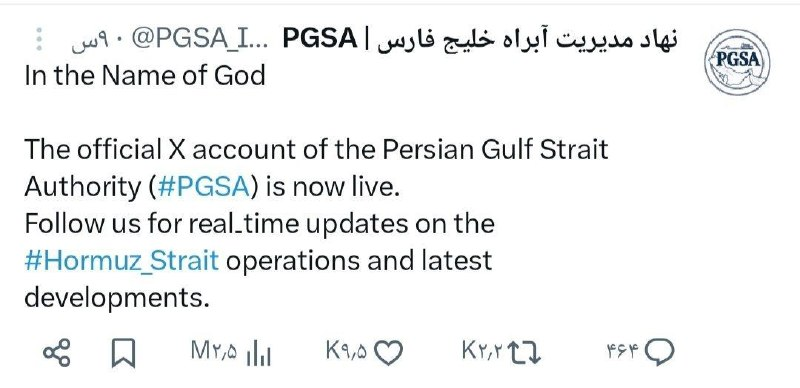

ایران سامانه «هرمز سیف» را برای ثبت‌نام کشتی‌های عبوری از تنگه هرمز راه‌اندازی کرد جمهوری اسلامی ایران سامانه‌ای تحت عنوان «هرمز سیف» را با هدف ارائه خدمات به کشتی‌های عبوری از تنگه هرمز راه‌اندازی کرده است. بر اساس این طرح، ناخدایان و شرکت‌های کشتیرانی می‌توانند…

## Persian_Trend_Official — post 14454

🔴 صدای انفجار در سلیمانیه عراق گویا سپاه دوباره به مقر پژاک حمله کرده

## Persian_Trend_Official — post 14453

  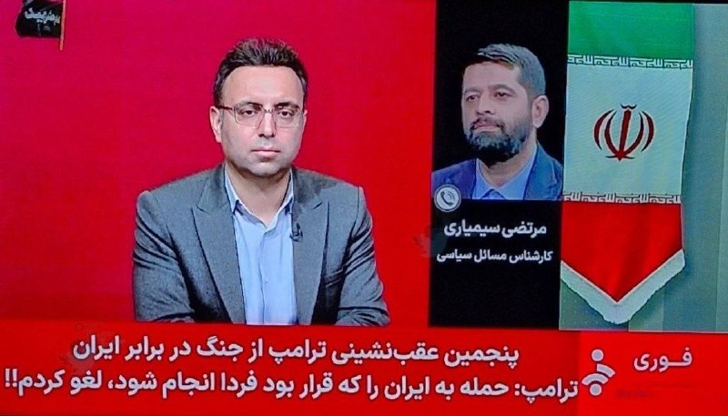

💢اینم نتیجه رفتار و عملکرد دونالد ترامپ

🫆:Tony

📌 @persian_trend_official
پرشین ترند | متفاوت‌ترین کانال نظامی

## Persian_Trend_Official — post 14452

نسخه صوتی لایو امشب :

https://castbox.fm/vd/946653632

## Persian_Trend_Official — post 14451

  

🔴 صدای انفجار در سلیمانیه عراق
گویا سپاه دوباره به مقر پژاک حمله کرده

## Persian_Trend_Official — post 14450

  <a href="telegram/content/Persian_Trend_Official_14450_1779135130.mp4">🎬 Download video</a>

🇺🇸
🇦🇫 حداقل دو نفر کشته شده‌اند و چندین نفر دیگر در یک وضعیت تیراندازی فعال در مرکز اسلامی سن دیگو، کالیفرنیا زخمی شده‌اند. ویدیوی بالا شخصی را در یک استخر خون پس از ظاهراً تیر خوردن نشان می‌دهد.

☆Phantom☆

📌 @persian_trend_official
پرشین ترند | متفاوت‌ترین کانال نظامی

## Persian_Trend_Official — post 14449

  

تیراندازی در یک مرکز اسلامی در آمریکا

🔸رسانه‌ها روز دوشنبه از حضور یک فرد مسلح و تیراندازی در مرکز اسلامی سن دیگو خبر می‌دهند.

🔹پلیس سن دیگو از مردم خواست که از حضور در این منطقه خودداری کنند.

☆Phantom☆

📌 @persian_trend_official
پرشین ترند | متفاوت‌ترین کانال نظامی

## Persian_Trend_Official — post 14448

  

💢از سوی امیر قطر، تمیم بن حمد آل ثانی، ولیعهد عربستان سعودی، محمد بن سلمان آل سعود، و رئیس امارات متحده عربی، محمد بن زاید آل نهیان، از من خواسته شد حمله نظامی برنامه‌ریزی‌شده ما علیه جمهوری اسلامی ایران که قرار بود فردا انجام شود را متوقف کنم، زیرا مذاکرات…

## Persian_Trend_Official — post 14446

فعال شدن پدافند قشم علیه ریزپرنده‌ها 💢 در پی فعالیت پدافند در جزیره قشم، خبرنگار تسنیم از منابع مطلع کسب اطلاع کرد که پس از مشاهده ریز پرنده‌ها در آسمان جزیره، پدافند در جهت نابودی اهداف متخاصم فعال شد. 🫆:Tony 📌 @persian_trend_official پرشین ترند | متفاوت‌ترین…

## Persian_Trend_Official — post 14445

  <a href="telegram/content/Persian_Trend_Official_14445_1779135132.jpg">🎬 Download video</a>

فعال شدن پدافند قشم علیه ریزپرنده‌ها

💢 در پی فعالیت پدافند در جزیره قشم، خبرنگار تسنیم از منابع مطلع کسب اطلاع کرد که پس از مشاهده ریز پرنده‌ها در آسمان جزیره، پدافند در جهت نابودی اهداف متخاصم فعال شد.

🫆:Tony

📌 @persian_trend_official
پرشین ترند | متفاوت‌ترین کانال نظامی

## Persian_Trend_Official — post 14443

⭕️ وضعیت کم سابقه‌ی آسمان منطقه، از نظر خلوت بودن. (در عکس اول فقط پرواز های نظامی آمریکا و در عکس دوم تمام پرواز های نظامی) 📝 Nick 📌 @persian_trend_official پرشین ترند | متفاوت‌ترین کانال نظامی

## Persian_Trend_Official — post 14442

  <a href="telegram/content/Persian_Trend_Official_14442_1779135132.jpg">🎬 Download video</a>

💢از سوی امیر قطر، تمیم بن حمد آل ثانی، ولیعهد عربستان سعودی، محمد بن سلمان آل سعود، و رئیس امارات متحده عربی، محمد بن زاید آل نهیان، از من خواسته شد حمله نظامی برنامه‌ریزی‌شده ما علیه جمهوری اسلامی ایران که قرار بود فردا انجام شود را متوقف کنم، زیرا مذاکرات…

## Persian_Trend_Official — post 14441

  <a href="telegram/content/Persian_Trend_Official_14441_1779135133.jpg">🎬 Download video</a>

💢از سوی امیر قطر، تمیم بن حمد آل ثانی، ولیعهد عربستان سعودی، محمد بن سلمان آل سعود، و رئیس امارات متحده عربی، محمد بن زاید آل نهیان، از من خواسته شد حمله نظامی برنامه‌ریزی‌شده ما علیه جمهوری اسلامی ایران که قرار بود فردا انجام شود را متوقف کنم، زیرا مذاکرات…

## Persian_Trend_Official — post 14440

  

💢از سوی امیر قطر، تمیم بن حمد آل ثانی، ولیعهد عربستان سعودی، محمد بن سلمان آل سعود، و رئیس امارات متحده عربی، محمد بن زاید آل نهیان، از من خواسته شد حمله نظامی برنامه‌ریزی‌شده ما علیه جمهوری اسلامی ایران که قرار بود فردا انجام شود را متوقف کنم، زیرا مذاکرات جدی اکنون در حال انجام است و آن‌ها معتقدند به‌عنوان رهبران و متحدان بزرگ، توافقی حاصل خواهد شد که برای ایالات متحده آمریکا، همه کشورهای خاورمیانه و فراتر از آن بسیار قابل قبول خواهد بود. این توافق، مهم‌تر از همه، شامل «عدم دستیابی ایران به سلاح هسته‌ای» خواهد بود.

💢بر اساس احترامی که برای رهبران یادشده قائلم، به وزیر جنگ، پیت هگست، رئیس ستاد مشترک ارتش، ژنرال دنیل کین، و ارتش ایالات متحده دستور داده‌ام که حمله برنامه‌ریزی‌شده علیه ایران را فردا انجام ندهند، اما در عین حال به آن‌ها دستور داده‌ام در صورتی که توافق قابل قبولی حاصل نشود، آماده اجرای یک حمله کامل و گسترده علیه ایران در کوتاه‌ترین زمان ممکن باشند.

▪️از توجه شما به این موضوع سپاسگزارم!

رئیس‌جمهور دونالد جی. ترامپ

🫆:Tony

📌 @persian_trend_official
پرشین ترند | متفاوت‌ترین کانال نظامی

## Persian_Trend_Official — post 14439

🚨 ترامپ در تروث سوشال اعلام کرد که حمله برنامه‌ریزی‌شده به ایران که برای فردا در نظر گرفته شده بود را لغو کرده زیرا «مذاکرات جدی» در حال انجام است. 📝 Nick 📌 @persian_trend_official پرشین ترند | متفاوت‌ترین کانال نظامی

## Persian_Trend_Official — post 14438

🚨 ترامپ در تروث سوشال اعلام کرد که حمله برنامه‌ریزی‌شده به ایران که برای فردا در نظر گرفته شده بود را لغو کرده زیرا «مذاکرات جدی» در حال انجام است.

📝 Nick

📌 @persian_trend_official
پرشین ترند | متفاوت‌ترین کانال نظامی

## Persian_Trend_Official — post 14437

  <a href="telegram/content/Persian_Trend_Official_14437_1779135134.mp4">🎬 Download video</a>

💢پیت هگست وزیر جنگ آمریکا در حال تقلید مدل صحبت و صدای ترامپ

🫆:Tony

📌 @persian_trend_official
پرشین ترند | متفاوت‌ترین کانال نظامی

## Persian_Trend_Official — post 14436

  <a href="telegram/content/Persian_Trend_Official_14436_1779135136.jpg">🎬 Download video</a>

⭕️ جمهوری اسلامی سفر بدون ویزا برای لبنانی‌ها را اعلام کرد.

سفارت جمهوری اسلامی در لبنان اعلام کرد شهروندان لبنانی دارنده گذرنامه عادی می‌توانند برای سفرهای گردشگری یا زیارتی بدون نیاز به ویزا وارد ایران شوند.

لبنانی‌ها می‌توانند هر شش ماه یک‌بار بدون ویزا به ایران سفر کنند.

مدت اقامت در این سفرها حداکثر ۱۵ روز تعیین شده است.

📝 Nick

📌 @persian_trend_official
پرشین ترند | متفاوت‌ترین کانال نظامی

## Persian_Trend_Official — post 14435

  

⭕️ علی‌حسین قاضی‌زاده:

از قشنگی‌های شبکه ایکس اینه که مدیر حکومتی که از بندبندانگشتان مدیرانش خون می‌چکه بیاد اینجا از برخورد خشن، تمامیت‌خواهی، فحاشی و استبداد گله کنه.
اون هم در شرایطی که اینترنت رو بر روی ۹۰ میلیون ایرانی بستند‌ و سر تیربار رو سمت مردم گرفتند.
اینها وقیح نیستند. لغت تازه‌ای باید در زبان فارسی برای این جماعت ساخته بشه.

📝 Nick

📌 @persian_trend_official
پرشین ترند | متفاوت‌ترین کانال نظامی

## Persian_Trend_Official — post 14434

  <a href="telegram/content/Persian_Trend_Official_14434_1779135137.mp4">🎬 Download video</a>

⭕️نمایش و استفاده دوباره از اسلحه در برنامه زنده صداوسیما

💢اینبار هدف گیری و شلیک به سمت تصویر دونالد ترامپ به یاد بچه های مظلوم جزیره اپستین ‼️

🫆:Tony

📌 @persian_trend_official
پرشین ترند | متفاوت‌ترین کانال نظامی

## RadioFarda — post 157321

  

ترامپ می‌گوید حمله نظامی گسترده به ایران را به طور موقت به تعویق انداخته است

🔸دونالد ترامپ، رئیس جمهور آمریکا، روز دوشنبه در شبکه اجتماعی خود خبر داد که حمله‌ای تازه به ایران برای روز سه‌شنبه برنامه‌ریزی شده بود، اما او فعلا آن را به عقب می‌اندازد.

🔸او توضیح داده است که این حمله را به درخواست «امیر قطر، ولیعهد عربستان سعودی و رئیس جمهور امارات متحده عربی» فعلا انجام نمی‌دهد.

🔸ساعتی پیشتر، دونالد ترامپ در واکنش به پاسخ تازه تهران به پیشنهادات آمریکا گفته بود که قرار نیست امتیازی به ایران بدهد.

🔸او در ادامه تهدید کرده بود که ایران می‌داند که «خیلی زود چه اتفاقی خواهد افتاد».

🔸ایران روز دوشنبه ۲۸ اردیبهشت اعلام کرد که به پیشنهاد جدید آمریکا با هدف پایان دادن به جنگ پاسخ داده است و افزود که تبادل نظر میان طرفین همچنان ادامه دارد.

🔸حال او در پیام تازه خود نوشته است «از آنجا که مذاکراتی جدی در جریان است و از نظر رهبران و متحدان بزرگ ما توافقی حاصل خواهد شد که برای آمریکا هم بسیار قابل قبول خواهد بود»، او حمله نظامی را که برای روز سه‌شنبه برنامه‌ریزی شده بود به تعویق می‌اندازد.

@RadioFarda

## IranianMinds — post 20363

🔴خبرگزاری مهر: پدافند هوایی قشم فعال شد. @IranianMinds

## IranianMinds — post 20362

  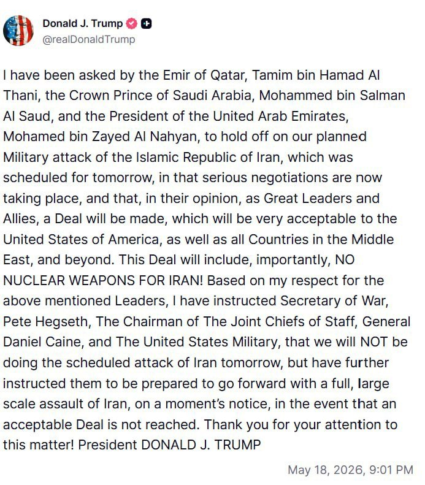

🔴ترامپ:

از سوی امیر قطر، تمیم بن حمد آل ثانی، ولیعهد عربستان سعودی، محمد بن سلمان آل سعود، و رئیس‌جمهور امارات متحده عربی، محمد بن زاید آل نهیان، از من خواسته شده است که حمله نظامی برنامه‌ریزی شده به جمهوری اسلامی ایران که برای فردا برنامه‌ریزی شده بود را به تعویق بیندازم، زیرا مذاکرات جدی در حال انجام است و به نظر آن‌ها، به عنوان رهبران بزرگ و متحدان، توافقی حاصل خواهد شد که برای ایالات متحده آمریکا و همچنین تمام کشورهای خاورمیانه و فراتر از آن بسیار قابل قبول خواهد بود.

این توافق شامل نکته مهمی است: هیچ سلاح هسته‌ای برای ایران نخواهد بود! بر اساس احترام من به رهبران مذکور، به وزیر جنگ، پیت هگستث، رئیس ستاد مشترک نیروهای مسلح، ژنرال دنیل کین، و نیروهای نظامی ایالات متحده دستور داده‌ام که حمله برنامه‌ریزی شده به ایران فردا انجام نشود، اما به آن‌ها دستور داده‌ام که آماده باشند در صورت عدم دستیابی به توافق قابل قبول، فوراً حمله‌ای کامل و گسترده به ایران را آغاز کنند.

@IranianMinds

## IranianMinds — post 20361

🔴خبرگزاری مهر:

پدافند هوایی قشم فعال شد.

@IranianMinds

## BBCPersian — post 281395

  <a href="https://t.me/bbcpersian/281395">📎 Download file</a>

🔻پادکست برنامه جام جهان‌نما دوشنبه ۲۸ اردیبهشت ۱۴۰۵
این برنامه رادیویی را می‌توانید هر شب ساعت ۲۰ به وقت ایران، روی موج متوسط ۷۰۲ کیلوهرتز و موج کوتاه ۹۴۶۵ کیلوهرتز بشنوید.
تکرار برنامه را هم می‌توانید ساعت ۲۱:۳۰ روی موج متوسط ۷۰۲ کیلوهرتز و موج کوتاه ۵۳۹۵ کیلوهرتز گوش کنید.
@BBCPersian

## BBCPersian — post 281394

  <a href="telegram/content/BBCPersian_281394_1779135141.mp4">🎬 Download video</a>

🔻آخرین خبرهای مهم دوشنبه ۲۸ اردیبهشت ۱۴۰۵
@BBCPersian

## BBCPersian — post 281393

🔻دونالد ترامپ می‌گوید که قرار بود فردا به ایران حمله نظامی کند اما به درخواست امیر قطر، ولیعهد عربستان و امارات متحده عربی این حمله را به تعویق انداخته است. او در پستی در شبکه اجتماعی تروث سوشال نوشت: «از من خواسته شده است حمله نظامی برنامه‌ریزی‌شده ما علیه…

## BBCPersian — post 281392

  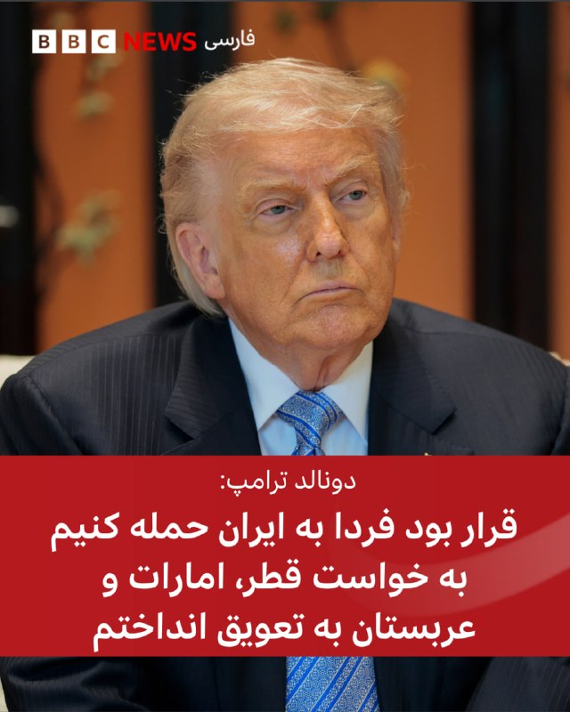

🔻دونالد ترامپ می‌گوید که قرار بود فردا به ایران حمله نظامی کند اما به درخواست امیر قطر، ولیعهد عربستان و امارات متحده عربی این حمله را به تعویق انداخته است.

او در پستی در شبکه اجتماعی تروث سوشال نوشت: «از من خواسته شده است حمله نظامی برنامه‌ریزی‌شده ما علیه جمهوری اسلامی ایران را که قرار بود فردا انجام شود، به تعویق بیندازم؛ زیرا مذاکرات جدی اکنون در جریان است و به باور آن‌ها، به‌عنوان رهبران بزرگ و متحدان ما، توافقی حاصل خواهد شد که برای ایالات متحده آمریکا و همچنین همه کشورهای خاورمیانه و فراتر از آن بسیار قابل قبول خواهد بود.»

او افزود: «این توافق نکته مهمی را در برخواهد داشت: ایران سلاح هسته‌ای نخواهد داشت.»

📷 Getty Images
https://bbc.in/3PpMOY6
@BBCPersian

## BBCPersian — post 281391

  

🔻دادگاهی در کالیفرنیا شکایت ایلان ماسک، مالک ایکس و تسلا، از شرکت اوپن اِی‌آی، سازنده هوش مصنوعی چت جی‌پی‌تی، را رد کرد.

آقای ماسک ‌هم‌بنیان‌گذار شرکت اوپن اِی‌آی بود و بعدتر این شرکت را متهم کرد که از هدف اولیه‌اش یعنی «خدمت‌رسانی به انسان» عدول کرده است.

هیئت منصفه این دادگاه رای داد که آقای ماسک «خیلی دیر» برای شکایت از سم آلتمن، رئیس اوپن اِی‌آی، اقدام کرده است.

آقای آلتمن و آقای ماسک یکدیگر را به تلاش برای «کسب منفعت مالی» از رشد هوش مصنوعی در سال‌های گذشته متهم کرده‌اند.

آقای ماسک که ثروتمندترین مرد جهان است، در سال ۲۰۱۸ از هیئت‌مدیره اوپن اِی‌آی کناره‌گیری کرد و هوش مصنوعی گروک را برای رقابت با چت جی‌پی‌تی ساخت.

دعوای حقوقی این دو میلیاردر را بسیاری از نزدیک دنبال می‌کنند چرا که معتقدند بر آینده هوش مصنوعی اثرگذار است.

📷 Getty Images
@BBCPersian

## BBCPersian — post 281390

  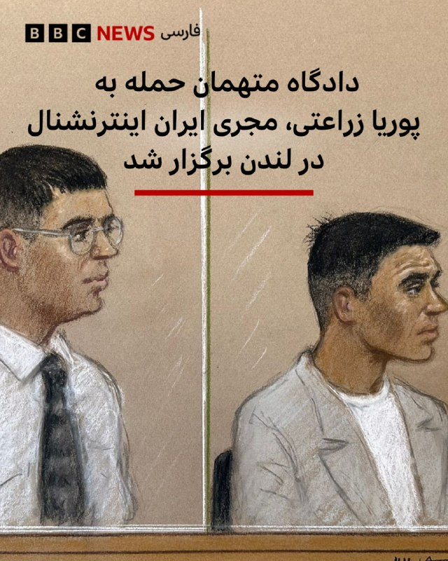

🔻دادگاه متهمان حمله به پوریا زراعتی،‌ مجری شبکه ایران اینترنشنال، در لندن برگزار شد. دو مرد رومانیایی متهم هستند که از طرف حکومت ایران این حمله را انجام دادند. یک رومانیایی دیگر هم در این رابطه بازداشت شده است.

ایران هر گونه دخالت در این جادثه را رد کرده است.

دو سال پیش، آقای زراعتی درمحله ویمبلدون،‌ در جنوب غرب لندن هدف حمله با چاقو قرار گرفت. او از ناحیه پا مجروح شد و چند روز در بیمارستان بستری بود.

به گزارش رویترز،‌ ناندیتو بدیا، ۲۱ ساله، و جورج استانا، ۲۵ ساله، هر دو در دادگاه اتهامات ایجاد جراحت عمدی و غیرقانونی را رد کردند.

دیوید آندری، سومین متهم به دست داشتن در این پرونده که در رومانی دستگیر شده است در این دادگاه محاکمه نشد.

دانکن اتکینسون،‌ دادستان در این دادگاه گفت که این حمله نه سرقت بوده و نه درگیری اتفاقی بلکه «خشونت عمدی و برنامه ریزی شده» بوده و به این افراد، شخص ثالثی که از طرف حکومت ایران عمل می‌کرده، دستور انجام این حمله را داده است.

📷 Reuters
https://bbc.in/4dj0eyg
@BBCPersian

## Dirty_Kids — post 389703

  

املاکی لحظاتی پیش پست زیر رو در تروث سوشا منتشر کرد:

«از طرف امیر قرمساق قطر، ولیعهد قرمدنگ عربستان سعودی و رئیس قرمپف امارات متحده عربی از من خواسته شده که حمله نظامی برنامه‌ریزی‌شده‌مون به رژیم هزارپدر روافض رو که قرار بود فردا انجام بشه، دست نگه داریم و انجام ندیم؛
چون الان مذاکرات جدی داره انجام میشه و به نظر این قرمساق‌‌ها به عنوان رهبران جاکش و متحدان ما، توافقی با روافض داره شکل می‌گیره که هم برای ایالات متحده آمریکا و هم برای همه کشورهای خاورمیانه و فراتر از اون، کاملاً قابل‌قبول خواهد بود.

این توافق و این نکته خیلی مهمیه، شامل هیچ سلاح هسته‌ای برای رژیم روافض نمیشه.

منم به خاطر احترامی که برای رهبرانی که نام بردم قائلم، به وزیر جنگ پیت هگست، رئیس ستاد مشترک ارتش ژنرال دانیال کین و ارتش ایالات متحده دستور دادم که حمله برنامه‌ریزی‌شده فردا به رژیم روافض رو انجام ندن.

اما در عین حال بهشون دستور دادم برای موقعی که یه توافق قابل‌قبول به دست نیومد، در اسرع وقت آماده باشن تا یک حمله تمام‌عیار و بزرگ رو علیه رژیم شیعه‌سانان رافضی شروع کنن.

ممنون از توجهتون به این موضوع!
رئیس‌جمهور دونالد جی. ترامپ»

@Dirty_Kids 👻

## Dirty_Kids — post 389702

  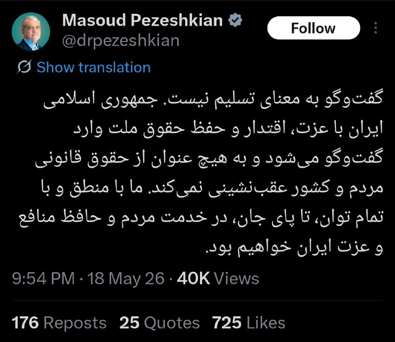

پزشکیان نخ داد که میخوان مذاکره بکنن:

گفتگو به معنای تسلیم نیست؛
جمهوری‌اسلامی ایران با عزت و اقتدار وارد گفتگو میشه و از حقوق خودش عقب‌نشینی نمیکنه.

@Dirty_Kids 👻

## Dirty_Kids — post 389701

  <a href="telegram/content/Dirty_Kids_389701_1779135146.mp4">🎬 Download video</a>

صحنه‌ای از چاه فاضلاب:
ترویج کودک همسری در صدا و سیما

+ مجری بیشعور تبعیض جنسیتی میکنه
برای پسر ولیمه باید داد
دخترو اینا آخه زنده به گور میکنن

@Dirty_Kids 👻

## Dirty_Kids — post 389700

  <a href="telegram/content/Dirty_Kids_389700_1779135148.mp4">🎬 Download video</a>

صداوسیما یه تازه عروس و داماد رو آورده تو برنامه تلویزیون؛

بی‌بی میزنه کتلت بعد میگن تقصیر مردم بود

داماد : مهریه خانمم یه پهپاد شاهده که ایشالا بخوره تو قلب تل‌آویو

مجری: حالا اگه عروس خانم مهریه‌شو بخواد میخوای چیکار کنی؟ میدونی قیمتش چقدره؟

داماد : خخخخخ



@Dirty_Kids 👻

## Dirty_Kids — post 389699

  

ثبت‌نام جان‌فدا برای جنگ بود یا واسه عروسی؟
زوج جان‌فدا چیه دیگه پدرسگا؟

معلوم نیست رهبر بوده یا سبزه ۱۳بدر

@Dirty_Kids 👻

## Dirty_Kids — post 389698

  <a href="telegram/content/Dirty_Kids_389698_1779135150.mp4">🎬 Download video</a>

حال و هوای اینترنت طبقاتی
هرچی طبقاتی‌تر عرزشی لختر

@Dirty_Kids 👻

## Dirty_Kids — post 389697

  

تراپی 😂😂😂😂😂😂😂😂

@Dirty_Kids 👻

## Hranews — post 113024

  

میان موشک و سرکوب؛ گزارش مجموعه فعالان حقوق بشر درباره مخاصمه نظامی ایالات متحده-اسرائیل و ایران منتشر شد

💥
💥
💥
💥
💥 – امروز، مجموعه فعالان حقوق بشر در ایران گزارش جدیدی را در ۲۴۰ صفحه و دو زبان منتشر کرد که به بررسی کارزار نظامی ایالات متحده و اسرائیل در ایران در فاصله ۹ اسفند ۱۴۰۴ تا ۱۹ فروردین ۱۴۰۵ (۲۸ فوریه تا ۸ آوریل ۲۰۲۶) می‌پردازد.

این گزارش بر پایه ۱۷۷ منبع تأییدشده ــ شامل گزارش‌های منابع آزاد و شبکه میدانی مجموعه فعالان حقوق بشر در داخل کشور ــ ۶٬۳۲۴ رویداد منحصربه‌فرد شامل ۱۲٬۷۹۸ حمله مجزا را مستندسازی کرده است.
مجموعه فعالان تاکید کرد این گزارش با هدف ارائه روایت جامع از کل درگیری تهیه نشده است. یافته‌های آن صرفاً به رویدادهایی محدود می‌شود که در داده‌های این نهاد مستندسازی و راستی‌آزمایی شده‌اند.

📊 یافته‌های کلیدی گزارش
◾️ ثبت ۶٬۳۲۴ رویداد منحصربه‌فرد و ۱۲٬۷۹۸ حمله مجزا
◾️ ۷۷ درصد رویدادها شامل آسیب به غیرنظامیان یا اماکن غیرنظامی
◾️ ثبت دست‌کم ۳٬۶۳۶ مورد مرگ، از جمله ۱٬۷۰۱ غیرنظامی
◾️ کشته شدن ۳۰۷ کودک و زخمی شدن ۲٬۲۱۳ کودک
◾️ تمرکز ۴۴٫۸۵ درصدی رویدادها در استان تهران
◾️ هدف قرار گرفتن یا آسیب دیدن مدارس، مراکز درمانی، مراکز فرهنگی و زیرساخت‌های حیاتی

⚠️ الگوهای نگران‌کننده
این گزارش چندین الگوی نگران‌کننده را برجسته می‌کند، از جمله:
◾️ ضعف در راستی‌آزمایی اهداف
◾️ استفاده محدود از نظارت انسانی در برخی فناوری‌های هدف‌گیری
◾️ هشدارهای ناکافی پیش از حملات
◾️ استفاده از تسلیحات انفجاری سنگین در مناطق پرجمعیت
◾️ حملات تکراری به برخی مناطق غیرنظامی
◾️ آسیب گسترده به زیرساخت‌های غیرنظامی

🚨 این گزارش همچنین به بازداشت گسترده شهروندان در ایران اشاره دارد؛ دست‌کم ۴٬۰۲۳ نفر با اتهامات مرتبط با امنیت ملی یا جنگ بازداشت شده‌اند.

از سوی دیگر تشدید محدودیت‌های امنیتی، گسترش ایست‌های بازرسی و محدودیت‌های گسترده اینترنت از دیگر پیامدهای مستندسازی‌شده عنوان شده است.

در همین بازه زمانی، ۵۰ مورد اعدام ثبت شده که ۳۲ مورد آن با اتهامات سیاسی و امنیتی مرتبط بوده است.

📎 ادامه گزارش به زبان فارسی

📎 دانلود مستقیم فایل پی دی اف گزارش از تلگرام

📎 Complete report in English

📎Direct download of the English PDF

↘️
@hranews_bot تماس ✉️ - @Hranews کانال هرانا 🆑

## Hranews — post 113023

امیرحسین شیخ‌محمدی در کرج بازداشت شد

❗️
❗️
❗️
❗️
❗️– امیرحسین شیخ‌محمدی، دانشجوی دانشگاه آزاد کرج صبح امروز توسط نیروهای امنیتی در این شهر بازداشت شد.

#امیرحسین_شیخ‌محمدی

ادامه مطلب

↘️
@hranews_bot تماس ✉️ - @Hranews کانال هرانا 🆑

## Hranews — post 113022

اجرای حکم اعدام یک زندانی در شیراز/ صدور یک حکم اعدام و رهایی ۳ زندانی از چوبه دار

❗️
❗️
❗️
❗️
❗️– سحرگاه روز گذشته، حکم یک زندانی که پیشتر بابت اتهام قتل به اعدام محکوم شده بود، در زندان عادل آباد شیراز به اجرا درآمد. از سوی دیگر، یک متهم به قتل در تهران توسط دادگاه کیفری این استان به اعدام محکوم شد. رئیس کل دادگستری مازندران نیز اعلام کرد که سه زندانی محکوم به #اعدام در شهرهای آمل و بهشهر، با اعلام رضایت اولیای دم از چوبه دار رهایی یافتند.

#سعید_رحمانی‌راد

ادامه مطلب

↘️
@hranews_bot تماس ✉️ - @Hranews کانال هرانا 🆑

## Hranews — post 113021

گزارشی از تجمع اعتراضی کارگران پتروشیمی پتروناد در بندرامام

❗️
❗️
❗️
❗️
❗️– روز جاری، گروهی از کارگران شرکت پتروشیمی پتروناد، در اعتراض به اخراج ۲۰۰ کارگر بومی این شرکت برای چهارمین روز متوالی در مقابل ساختمان فرمانداری بندرامام دست به #تجمع زدند.

ادامه مطلب

↘️
@hranews_bot تماس ✉️ - @Hranews کانال هرانا 🆑

## Hranews — post 113020

شیراز؛ ۲ شهروند به دلیل استفاده از استارلینک بازداشت شدند

❗️
❗️
❗️
❗️
❗️– فرمانده انتظامی شیراز از بازداشت دو تن به دلیل آنچه «استفاده از اینترنت ماهواره‌ای استارلینک و فروش اینترنت بدون فیلتر» عنوان کرد، خبر داد.

ادامه مطلب

↘️
@hranews_bot تماس ✉️ - @Hranews کانال هرانا 🆑

## configx2ray — post 39019

185.200.232.43
185.200.232.40
167.82.48.223
151.101.128.223
185.200.232.49
185.200.232.50
185.200.232.42
185.200.232.41
184.24.77.42
184.24.77.32
184.24.77.5
184.24.77.7
184.24.77.16
184.24.77.36
184.24.77.21
184.24.77.11
23.48.23.186
23.48.23.133
23.48.23.195
23.48.23.178
184.24.77.29
23.65.119.52
23.73.2.141
104.110.138.190
104.83.5.202
92.122.166.236
92.122.166.234
92.122.166.237
96.16.122.70
23.67.136.200
23.67.136.202
95.216.69.37
95.216.69.38
95.216.69.39
95.216.69.40
104.78.170.186
96.17.222.31
23.41.37.129
23.2.13.227
23.222.126.108
2.20.255.113
2.17.251.98
23.2.13.152
95.101.23.27
2.21.239.21
23.211.49.252
88.221.168.5
104.103.90.156
23.79.20.249
88.221.132.162
23.59.235.208
23.60.69.118
23.46.188.71
104.122.212.92
23.219.1.4
23.57.43.195
184.51.252.135
2.22.6.68
23.217.11.56
95.100.69.108
23.40.63.69
96.16.122.74
104.109.250.232
92.123.104.7
104.110.191.57
104.83.5.82
92.122.166.168
104.83.5.65
104.121.0.17
104.66.70.133
92.122.166.146
23.73.2.161
92.122.73.138
92.122.166.141
96.16.122.55
104.81.108.51
23.72.248.214
104.126.37.185
104.83.5.201
104.83.5.216
92.123.104.67
104.83.5.203
96.17.207.151
88.221.168.138
96.17.207.149
104.81.108.10
23.73.2.148
92.122.166.175
172.237.127.6
104.81.104.13
96.16.122.82
96.16.122.66
96.7.218.219
96.16.122.137
184.51.252.157
92.123.189.41
184.86.251.12
96.16.122.154
184.51.252.152
96.17.207.12
23.79.48.162
151.101.0.223
151.101.192.223
65.109.34.234
151.101.64.223
2.23.169.111
2.23.168.96
2.23.169.105
2.23.168.7
2.23.169.207
2.17.100.200
2.19.205.42
2.19.205.50
2.19.252.134
2.20.169.70
2.20.170.91
95.101.111.144
2.16.245.188
2.18.69.150
2.16.106.4
23.58.222.107
184.25.28.31
23.47.124.134
23.50.131.147
23.46.190.18
23.58.222.147
23.56.162.186
23.44.203.68
23.12.156.115
23.216.77.16
23.62.61.53
23.39.148.245
23.210.73.133
23.44.201.136
23.205.46.167
184.30.150.142
23.220.161.217
184.28.165.4
23.46.230.133
88.221.168.204
104.96.158.174
184.51.252.4
172.234.199.15
104.85.26.14
172.237.145.27
92.123.103.24
172.234.159.58
184.86.103.210
96.16.248.183
92.122.16.5
96.16.249.60
96.16.249.9
142.54.178.211
185.137.25.214
81.12.72.218
5.160.13.85
37.255.133.30
81.91.145.2
104.117.76.26
104.117.76.40
184.25.52.200
184.28.230.87
184.51.252.36
184.51.252.38
184.86.251.27
23.215.0.164

آیپی های تست شده برای متود جدید سایفون
❤️

همشو باهم وارد کنید داخل برنامه 
🔥

Channel : https://t.me/ConfigX2ray

## configx2ray — post 39018

  <a href="https://t.me/ConfigX2ray/39018">📎 Download file</a>

کانفیگ برای Npv tunnel ⭕️

به هیچ وج دانلود نزنید باهاش
❤️

رمز فایل : @ConfigX2ray

Channel : https://t.me/ConfigX2ray

## manototv — post 105614

  <a href="telegram/content/manototv_105614_1779135153.mp4">🎬 Download video</a>

«سکوت نکنیم، صدای فاطمه سپهری باشیم»

## manototv — post 105613

  <a href="telegram/content/manototv_105613_1779135155.mp4">🎬 Download video</a>

دونالد ترامپ، رئیس‌جمهوری آمریکا، در پیامی در شبکه اجتماعی تروث سوشال نوشت:

««امیر قطر، تمیم بن حمد آل ثانی، ولیعهد عربستان سعودی، محمد بن سلمان آل سعود، و رئیس امارات متحده عربی، محمد بن زاید آل نهیان، از من خواسته‌اند حمله نظامی برنامه‌ریزی‌شده‌مان علیه جمهوری اسلامی ایران را که قرار بود فردا انجام شود، متوقف کنم؛ زیرا اکنون مذاکرات جدی در جریان است و به اعتقاد آن‌ها، به‌عنوان رهبران بزرگ و متحدان ما، توافقی حاصل خواهد شد که برای ایالات متحده آمریکا، همه کشورهای خاورمیانه و فراتر از آن بسیار قابل قبول خواهد بود.

این توافق، مهم‌تر از همه، شامل این خواهد بود که ایران هیچ سلاح هسته‌ای نداشته باشد!

بر اساس احترامم به رهبران یادشده، به وزیر جنگ، پیت هگست، رئیس ستاد مشترک نیروهای مسلح، ژنرال دنیل کین، و ارتش ایالات متحده دستور داده‌ام که حمله برنامه‌ریزی‌شده به ایران را فردا انجام ندهند؛ اما همزمان به آن‌ها دستور داده‌ام در صورتی که توافق قابل قبولی حاصل نشود، برای اجرای یک حمله کامل و گسترده علیه ایران، در هر لحظه آماده باشند.»

## manototv — post 105612

  <a href="telegram/content/manototv_105612_1779135155.mp4">🎬 Download video</a>

‌
خبرگزاری‌های داخل ایران گزارش دادند پدافند هوایی قشم شامگاه دوشنبه فعال شده است. مقام‌های جمهوری اسلامی توضیحی درباره علت فعالیت پدافند هوایی در این جزیره ارائه نکرده‌اند.

## manototv — post 105611

  <a href="telegram/content/manototv_105611_1779135156.mp4">🎬 Download video</a>

«رشید مظاهری به خاطر بیان عقیده_اش در بازداشت است»

## manototv — post 105610

  <a href="telegram/content/manototv_105610_1779135157.mp4">🎬 Download video</a>

«صدای فاطمه سپهری باشیم»

## manototv — post 105609

  <a href="telegram/content/manototv_105609_1779135159.mp4">🎬 Download video</a>

تجمع ایرانیان در لیسبون مقابل سفارت نروژ؛ اعتراض به دیدار سیاستمداران نروژی با جمهوری اسلامی

## alonews — post 120961

  

دیدم صاحب اینجا، یک ساندویچ ساده به این دوست بازیافتیمان که کمی دورتر مشغول سطل زباله بود، داد. چند دقیقه بعد که ساندویچش را خورد، در حالی که حواس کسی نبود، به کناری آمد و شروع کرد به جمع کردن میز و صندلی‌ها و رفت.
ایشان رایگان نخورد.
در شگفتم از مفت‌خورها، مال مردم‌خورهای تسبیح به دست

[@AloTweet]

## alonews — post 120960

اخبار جنگ الونیوز AloNews pinned a photo

## alonews — post 120959

  

👈فیلد مارشال محسن رضایی: وزیر کشور پاکستان که به ایران سفر کرده‌ بود، علاوه بر تبادل متونی، به نظر می‌رسد، ضرب‌الاجل دو روزه‌ ترامپ را هم منتقل کرده بود؛ مبنی بر اینکه یا توافق موردنظر امریکا را امضا می‌کنید یا حملات را به صورت گسترده از سر می‌گیریم!

🔴اکنون ترامپ اعلام کرده در پاسخ به درخواست رهبران قطر، سعودی و امارات، حمله را به تعویق می‌اندازد تا مذاکرات پیش برود!

🔴علی‌رغم تلاش‌های گسترده برخی کشورهای منطقه در روزهای اخیر، همچنان فاصله انتظارات، شروط و حتی نیات طرفین بسیار زیاد است!

✅ @AloNews خبر جنگ

## alonews — post 120958

  <a href="telegram/content/alonews_120958_1779135162.jpg">🎬 Download video</a>

👈شنیده شدن صدای انفجار در سلیمانیه عراق 
✅ @AloNews خبر جنگ

## alonews — post 120957

  

👈بمب‌های نور افکن تو غزه

✅ @AloNews خبر جنگ

## alonews — post 120956

  <a href="telegram/content/alonews_120956_1779135163.mp4">🎬 Download video</a>

👈تیراندازی فعال در مرکز اسلامی سن دیگو به نظر می‌رسد حمله‌ای وحشتناک باشد.

🔴 تصاویر هلی‌کوپتر نشان می‌دهد جسدی در برکه‌ای از خون بیرون ساختمان افتاده است

✅ @AloNews خبر جنگ

## alonews — post 120955

  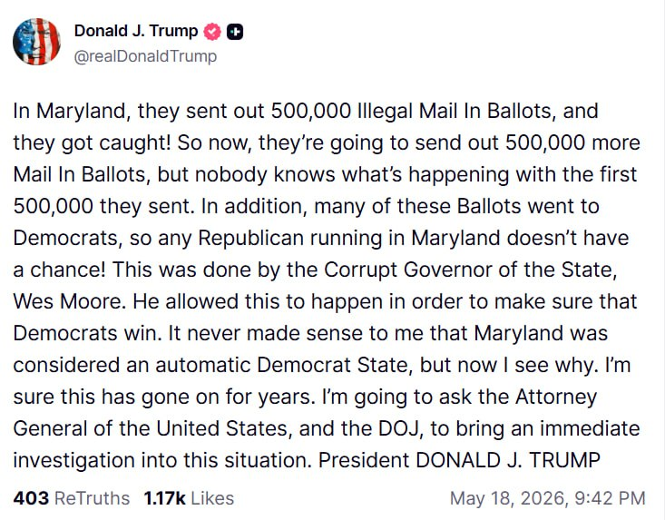

👈ترامپ از طریق Truth Social:
در مریلند، ۵۰۰,۰۰۰ رای پستی غیرقانونی ارسال کردند و گرفتار شدند! حالا قرار است ۵۰۰,۰۰۰ رای پستی دیگر ارسال کنند، اما هیچ‌کس نمی‌داند با ۵۰۰,۰۰۰ رای اول چه شده است.

🔴علاوه بر این، بسیاری از این آرا به دموکرات‌ها رفت، بنابراین هیچ جمهوری‌خواهی که در مریلند نامزد شده باشد شانسی ندارد! این کار توسط فرماندار فاسد ایالت، وس مور انجام شده است. او اجازه داد این اتفاق بیفتد تا مطمئن شود دموکرات‌ها پیروز می‌شوند.

🔴برای من هرگز منطقی نبود که مریلند به عنوان ایالتی خودکار دموکرات در نظر گرفته شود، اما حالا می‌فهمم چرا. مطمئنم این موضوع سال‌هاست که ادامه دارد. من از دادستان کل ایالات متحده و وزارت دادگستری می‌خواهم که فوراً تحقیقاتی در این باره انجام دهند

✅ @AloNews خبر جنگ

## alonews — post 120954

  <a href="telegram/content/alonews_120954_1779135165.jpg">🎬 Download video</a>

👈گفتگوی وزرای خارجه کویت و عربستان درباره آخرین تحولات در غرب آسیا

✅ @AloNews خبر جنگ

## alonews — post 120953

  <a href="telegram/content/alonews_120953_1779135165.jpg">🎬 Download video</a>

👈شنیده شدن صدای انفجار در سلیمانیه عراق

✅ @AloNews خبر جنگ

## alonews — post 120952

  

🔥تخفیف ویژه فقط به مدت 2 روز
🔥

🚀با بالاترین سرعت و کمترین قطعی

💰هر گیگ فقط و فقط 170 هزار تومان

⚡️پینگ عالی

⚡️دارای لینک ساب

⚡️پشتیبانی 24 ساعته

⚡️ بدون محدودیت کاربر و زمان و ضریب

⚡️مخصوص استفاده روزمره، هوش مصنوعی، گیم و ...

✅جهت خرید با تحویل آنی فقط به بات مراجعه کنید

✅ @Lex_Server 
👾 @LexVipBot

## alonews — post 120951

  <a href="telegram/content/alonews_120951_1779135166.jpg">🎬 Download video</a>

👈ترامپ: من به وزیر جنگ، رئیس ستاد مشترک و ارتش امریکا دستور داده‌ام که آماده باشند تا در صورت عدم دستیابی به توافق قابل قبول، حمله‌ای کامل و گسترده و همه‌جانبه به ایران را با کمترین هشدار ممکن انجام دهند این آخرین فرصت ایران برای توافق است

✅ @AloNews خبر جنگ

## alonews — post 120950

  <a href="telegram/content/alonews_120950_1779135166.jpg">🎬 Download video</a>

👈صداوسیما: ترامپ برای پنجمین بار از جنگ مقابل ایران فرار کرد.

✅ @AloNews خبر جنگ

## alonews — post 120949

  <a href="telegram/content/alonews_120949_1779135167.jpg">🎬 Download video</a>

👈 پلیس سن دیگو گزارش تیراندازی فعال در مرکز اسلامی سن دیگو را اعلام کرد

✅ @AloNews خبر جنگ

## alonews — post 120948

  <a href="telegram/content/alonews_120948_1779135167.jpg">🎬 Download video</a>

👈پدافند هوایی جزیره قشم فعال شد 
✅ @AloNews خبر جنگ

## alonews — post 120947

  <a href="telegram/content/alonews_120947_1779135167.jpg">🎬 Download video</a>

👈المانیتور: شش کریدور پاکستان برای ایران شریان حیاتی تجاری ایجاد کرده که از طریق آنها می‌تواند بحران تنگه هرمز را پشت سر بگذارد

🔴اقدام پاکستان در افتتاح شش کریدور تجاری زمینی با ایران می‌تواند به همسویی منطقه‌ای وسیع‌تر تهران سرعت ببخشد.

✅ @AloNews خبر جنگ

## alonews — post 120946

  <a href="telegram/content/alonews_120946_1779135167.mp4">🎬 Download video</a>

👈صداوسیما دوباره فریب تصویر ساخته هوش مصنوعی را خورد!

🔴کارشناس صدا و سیما مجدداً روی یک تصویر جعلی تفسیر خود را از سفر ترامپ به چین ارائه کرد

✅ @AloNews خبر جنگ

## alonews — post 120945

🔴فوری/ترامپ: حمله به ایران را که قرار بود فردا انجام دهم به تعویق انداختم 
✅ @AloNews خبر جنگ

## alonews — post 120944

  <a href="telegram/content/alonews_120944_1779135169.jpg">🎬 Download video</a>

🔴فوری/ترامپ: حمله به ایران را که قرار بود فردا انجام دهم به تعویق انداختم

✅ @AloNews خبر جنگ

## alonews — post 120943

  <a href="telegram/content/alonews_120943_1779135169.mp4">🎬 Download video</a>

👈خضریان، عضو کمیسیون امنیت ملی مجلس: خیلی از مسئولان ارشد نظام معتقد دارند که باید در مقابل اقدام محاصره نظامی آمریکا، پاسخ نظامی به اسرائیل و آمریکا بدهیم

✅ @AloNews خبر جنگ

## alonews — post 120942

  <a href="telegram/content/alonews_120942_1779135172.jpg">🎬 Download video</a>

👈پدافند هوایی جزیره قشم فعال شد

✅ @AloNews خبر جنگ

---
📅 بروزرسانی: 1405/02/28 21:49
---

## VahidOOnLine — post 240842

  <a href="telegram/content/VahidOOnLine_240842_1779128384.mp4">🎬 Download video</a>

تماسی از ایران:
از سیروان شعبانی، ۲۲ ساله از اسلامشهر گفت…
استاد موسیقی که نوزدهم دی بازداشت شد و حالا در اوین است
‌🏁 🇬🇧 ManotoTV

🤖 @VahidOOnLine

## VahidOOnLine — post 240841

  <a href="telegram/content/VahidOOnLine_240841_1779128385.mp4">🎬 Download video</a>

دونالد ترامپ، رئیس‌جمهوری آمریکا، در گفت‌وگو با نیویورک پست اعلام کرد پس از دریافت تازه‌ترین پاسخ «ناامیدکننده» جمهوری اسلامی در مذاکرات مربوط به توافق صلح، «برای هیچ‌گونه امتیازدهی به تهران آمادگی ندارد.»

ترامپ همچنین در اظهاراتی هشدارآمیز گفت جمهوری اسلامی می‌داند «به‌زودی چه اتفاقی قرار است بیفتد.»

او در این گفت‌وگوی کوتاه تلفنی، به نظر می‌رسید پیشنهاد جمهوری اسلامی برای ادامه مذاکرات دیپلماتیک، که روز یکشنبه مطرح شده بود، را رد کرده است.

ترامپ در پاسخ به سوالی درباره اظهارات روز جمعه‌اش مبنی بر آمادگی برای پذیرش توقف ۲۰ ساله غنی‌سازی اورانیوم در ایران گفت: «در حال حاضر برای هیچ چیزی آمادگی ندارم.»

رئیس‌جمهوری آمریکا از ارائه جزئیات بیشتر خودداری کرد و گفت: «واقعاً نمی‌توانم درباره‌اش صحبت کنم. اتفاقات زیادی در حال رخ دادن است.»

بر اساس این گزارش، ترامپ پس از بازگشت از سفرش به چین، آخر هفته را در باشگاه گلف خود در ویرجینیا همراه با تیم امنیت ملی آمریکا به بررسی گام‌های بعدی درباره جمهوری اسلامی گذرانده است.

نیویورک پست نوشت انتظار می‌رود نشست‌های بیشتری روز سه‌شنبه برگزار شود؛ در حالی که برخی متحدان تندرو ترامپ، از جمله لیندسی گراهام، سناتور جمهوری‌خواه، از او خواسته‌اند با متوقف شدن روند دیپلماسی، عملیات نظامی علیه جمهوری اسلامی را از سر بگیرد.

ترامپ همچنین گفت از تهران «ناامید» نشده، اما تاکید کرد جمهوری اسلامی به‌خوبی می‌داند آمریکا توان وارد کردن «فشار و آسیب بیشتر» را دارد.

او گفت: «می‌توانم بگویم آن‌ها بیشتر از هر زمان دیگری می‌خواهند توافق کنند، چون می‌دانند ما… چه اتفاقی قرار است به‌زودی بیفتد.»

ترامپ در پاسخ به سوالی درباره گزارش‌هایی مبنی بر تلاش جمهوری اسلامی برای «وقت‌کشی» در موضوع هسته‌ای و بازگشایی تنگه هرمز گفت چنین چیزی نشنیده است.

او افزود: «چیزی نمی‌شنوم. نمی‌توانم درباره‌اش با شما صحبت کنم.»

ترامپ در پایان گفت: «این یک مذاکره است. نمی‌خواهم احمق باشم.»
‌🏁 🇬🇧 ManotoTV

🤖 @VahidOOnLine

## VahidOOnLine — post 240840

  <a href="telegram/content/VahidOOnLine_240840_1779128386.mp4">🎬 Download video</a>

تماسی از ایران:
« از جاویدنام علی اباذری می‌گفت…
با گذشت ماه‌ها، درد هنوز تازه‌ست؛ انگار همین دیروز اتفاق افتاده.»
‌🏁 🇬🇧 ManotoTV

🤖 @VahidOOnLine

## VahidOOnLine — post 240839

  

♦️هیئت منصفه یک دادگاه فدرال در آمریکا روز دوشنبه به زیان ایلان ماسک در پرونده حقوقی علیه اوپن‌ای‌آی رای داد و یکی از جنجالی‌ترین نبردهای قضایی سیلیکون‌ولی را به پایان رساند.

به گزارش خبرگزاری فرانسه، هیئت منصفه دادگاه فدرال اوکلند اعلام کرد ماسک برای طرح شکایت علیه اوپن‌ای‌آی و بنیان‌گذاران آن بیش از حد تاخیر کرده و ادعاهای او مشمول محدودیت زمانی قانونی شده است. قاضی ایوون گونزالس راجرز نیز رای هیئت منصفه را تایید کرد.

در این پرونده، ایلان ماسک از سم آلتمن، مدیرعامل اوپن‌ای‌آی، گرگ براکمن، رئیس این شرکت، بنیاد اوپن‌ای‌آی و همچنین مایکروسافت شکایت کرده بود، اما هیئت منصفه استدلال‌های اصلی او را نپذیرفت.

ایلان ماسک، میلیاردر حوزه فناوری و مالک شبکه اجتماعی ایکس، در شکایت خود مدعی شده بود سم آلتمن، از هم‌بنیان‌گذاران اوپن‌ای‌آی که این شرکت را همراه با ماسک تأسیس کرده، از مسیر و مأموریت اولیه این پروژه فاصله گرفته و وعده فعالیت غیرانتفاعی چت‌جی‌پی‌تی و اوپن‌ای‌آی را کنار گذاشته است. ماسک همچنین او را به سوءاستفاده مالی و فریب متهم کرده بود.
‌🇸🇦 Indypersian

🤖 @VahidOOnLine

## VahidOOnLine — post 240838

  <a href="telegram/content/VahidOOnLine_240838_1779128389.mp4">🎬 Download video</a>

♦️همزمان با ادامه محاصره دریایی بنادر جنوبی ایران از سوی آمریکا، ستاد فرماندهی مرکزی آمریکا «سنتکام» روز دوشنبه ۲۸ اردیبهشت‌ماه با انتشار ویدیویی اعلام کرد نیروهای تحت فرماندهی این نهاد در آب‌های منطقه تاکنون ۸۵ کشتی تجاری را وادار به تغییر مسیر کرده‌اند.

سنتکام اعلام کرد این اقدام در چارچوب ادامه محاصره دریایی علیه جمهوری اسلامی انجام شده و مانع ورود یا خروج این کشتی‌ها به بنادر ایران شده است.
‌🇸🇦 Indypersian

🤖 @VahidOOnLine

## VahidOOnLine — post 240837

  <a href="telegram/content/VahidOOnLine_240837_1779128389.mp4">🎬 Download video</a>

♦️در ادامه تبلیغات حکومتی در دوران آتش‌بس و تلاش جمهوری اسلامی برای مدیریت فضای رسانه‌ای، یک زوج حامی حکومت در برنامه صداوسیما اعلام کردند مهریه عروس یک «پهپاد شاهد» تعیین شده است.

در این برنامه تلویزیونی، داماد که از حامیان جمهوری اسلامی معرفی شد، گفت امیدوار است این پهپاد «به قلب اسرائیل اصابت کند.»

این اظهارات در حالی مطرح شد که در هفته‌های اخیر، استفاده نمادین از پهپادها و تجهیزات نظامی در تجمع‌های حکومتی و برنامه‌های رسانه‌ای جمهوری اسلامی افزایش یافته است.
‌🇸🇦 Indypersian

🤖 @VahidOOnLine

## VahidOOnLine — post 240836

  <a href="telegram/content/VahidOOnLine_240836_1779128390.mp4">🎬 Download video</a>

‌
داده‌های ردیابی پروازها نشان می‌دهد انتقال هوایی تجهیزات و نیروهای نظامی آمریکا به خاورمیانه همچنان ادامه دارد.

بر اساس گزارش الجزیره از داده‌های پروازی، دست‌کم ۲۶ پرواز نظامی آمریکا بین ۱۵ تا ۱۷ مه از آلمان به مقصد خاورمیانه انجام شده است.

این گزارش می‌گوید این جابه‌جایی‌ها همزمان با افزایش حضور نظامی آمریکا در اطراف تنگه هرمز، دریای عمان و دریای عرب انجام شده است.

بر اساس داده‌های ردیابی، تمام پروازهای ثبت‌شده با هواپیماهای نظامی «بوئینگ سی-۱۷ اِی گلوب‌مستر ۳» انجام شده‌اند؛ هواپیماهای ترابری سنگینی که نیروی هوایی آمریکا از آن‌ها برای انتقال نیرو و تجهیزات نظامی استفاده می‌کند.
‌🏁 🇬🇧 ManotoTV

🤖 @VahidOOnLine

## VahidOOnLine — post 240835

  <a href="telegram/content/VahidOOnLine_240835_1779128391.mp4">🎬 Download video</a>

‌
وزارت خزانه‌داری آمریکا اعلام کرد مجوزی عمومی و موقت ۳۰ روزه صادر کرده تا «آسیب‌پذیرترین کشورها» بتوانند به‌طور موقت به نفت روسیه‌ای که در دریا سرگردان مانده، دسترسی پیدا کنند.

وزارت خزانه‌داری آمریکا گفت این تمدید «انعطاف‌پذیری بیشتری» فراهم می‌کند و واشینگتن در صورت نیاز، مجوزهای مشخص‌تری نیز برای این کشورها صادر خواهد کرد.

در این بیانیه آمده است این مجوز عمومی به «ثبات بازار فیزیکی نفت خام» کمک می‌کند و تضمین می‌کند نفت به کشورهایی برسد که بیشترین آسیب‌پذیری را در حوزه انرژی دارند.

وزارت خزانه‌داری آمریکا همچنین اعلام کرد این اقدام با کاهش توانایی چین برای انبار کردن نفت ارزان‌قیمت، به هدایت دوباره عرضه موجود به سمت کشورهای نیازمند کمک خواهد کرد.
‌🏁 🇬🇧 ManotoTV

🤖 @VahidOOnLine

## VahidOOnLine — post 240834

  

دونالد ترامپ در گفت‌وگویی کوتاه با نیویورک پست اعلام کرد که پس از دریافت پاسخ اخیر جمهوری اسلامی درباره مذاکرات، «هیچ تمایلی» به دادن هیچ‌گونه امتیاز به تهران ندارد.
او همچنین هشدار داد جمهوری اسلامی می‌داند «به‌زودی چه اتفاقی خواهد افتاد»، بدون آنکه جزئیات بیشتری ارائه کند.

ترامپ در پاسخ به پرسشی درباره اظهارنظرش درباره آمادگی برای پذیرش توقف ۲۰ ساله غنی‌سازی اورانیوم جمهوری اسلامی گفت: در حال حاضرآماده دادن هیچ امتیازی نیستم. واقعا نمی‌توانم درباره این موضوع صحبت کنم. اتفاقات زیادی در حال رخ دادن است.

ترامپ افزود که از تهران «عصبانی یا ناراحت» نیست، اما تاکید کرد جمهوری اسلامی به‌خوبی می‌داند آمریکا توان وارد کردن فشار و خسارت بیشتر را دارد. می‌توانم بگویم آن‌ها بیش از هر زمان دیگری خواهان توافق هستند، چون می‌دانند به‌زودی چه اتفاقی در راه است.

ترامپ: این یک مذاکره است و نمی‌خواهم اقدام احمقانه‌ای انجام دهم.
‌🏁 🇬🇧 IranintlTV

🤖 @VahidOOnLine

## VahidOOnLine — post 240833

  

♦️دونالد ترامپ، رئیس جمهوری آمریکا، روز دوشنبه در گفتگو با نیویورک پست اعلام کرد که پس از دریافت آخرین پاسخ ناامیدکننده تهران در مذاکرات توافق صلح، «به هیچ وجه حاضر به دادن امتیاز» به ایران نیست.
ترامپ در مصاحبه تلفنی کوتاه، ضمن ابراز نارضایتی از آخرین پیشنهاد تهران گفت ایران می‌داند «به‌زودی چه اتفاقی خواهد افتاد».
به گزارش نیویورک پست، وقتی از ترامپ درباره اظهارنظر روز جمعه‌اش مبنی بر اینکه مایل به پذیرش تعلیق ۲۰ ساله غنی‌سازی اورانیوم ایران است سوال شد، جواب داد: «در حال حاضر به هیچ وجه آماده دادن امتیاز نیستم».
ترامپ ادامه داد: «من واقعا نمی‌توانم در این مورد با شما صحبت کنم. چیزهای بسیار زیادی در حال رخ دادن است».
رئیس جمهوری آمریکا همچنین گفت از تهران «ناامید یا کلافه» نشده، اما هم‌زمان تأکید کرد ایران به‌خوبی آگاه است که ایالات متحده می‌تواند فشار بیشتری وارد کند.
ترامپ گفت: «می‌توانم به شما بگویم آن‌ها بیش از هر زمان دیگری خواستار توافق هستند، زیرا آن‌ها می‌دانند ما...به‌زودی چه اتفاقی قرار است بیفتد».
وقتی درباره ادعاهای منابع منطقه‌ای مبنی بر اینکه ایران تلاش می‌کند در قبال هر دو مسئله هسته‌ای و بازگشایی تنگه هرمز در برابر واشنگتن «سیاست صبر و انتظار» پیش بگیرد، سوال شد، ترامپ گفت «چنین چیزی نشنیده است».
‌🇸🇦 Indypersian

🤖 @VahidOOnLine

## VahidOOnLine — post 240832

  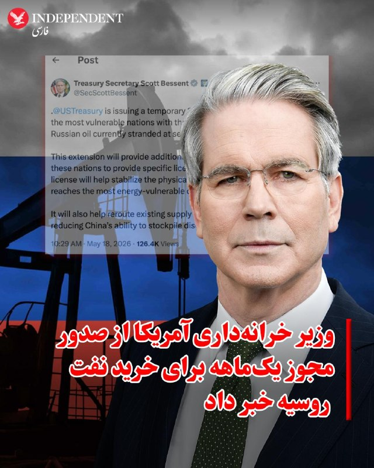

♦️اسکات بسنت، وزیر خزانه‌داری آمریکا، روز دوشنبه ۲۸ اردیبهشت ماه اعلام کرد واشنگتن یک مجوز عمومی موقت سی روزه صادر کرده است تا آسیب‌پذیرترین کشورها بتوانند به‌طور موقت به نفت روسیه که در دریا سرگردان مانده، دسترسی پیدا کنند.
بسنت در پیامی در شبکه اجتماعی ایکس نوشت این تمدید، انعطاف بیشتری فراهم می‌کند و آمریکا با این کشورها برای ارائه مجوزهای اختصاصی در صورت نیاز همکاری خواهد کرد. او افزود این مجوز عمومی به تثبیت بازار فیزیکی نفت خام کمک می‌کند و باعث می‌شود نفت به کشورهایی برسد که بیشترین آسیب‌پذیری را در حوزه انرژی دارند.
ایالات متحده پیشتر در پی افزایش بهای نفت در اثر جنگ در خلیج فارس، تحریم نفت رسیه را برای سی روز لغو کرده بود. این معافیت یک‌ماهه پیش از این با هدف جبران کمبود عرضه نفت و کنترل قیمت‌های جهانی پس از انسداد تنگه هرمز توسط جمهوری اسلامی، به کشورهایی مانند هند اعطا شده بود.
‌🇸🇦 Indypersian

🤖 @VahidOOnLine

## VahidOOnLine — post 240831

  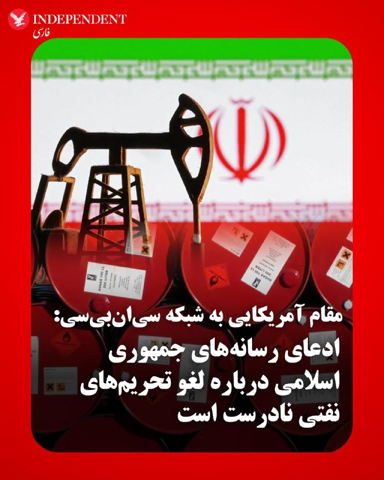

♦️خبرنگار شبکه سی‌ان‌بی‌سی روز دوشنبه ۲۸ اردیبهشت‌ماه در شبکه اجتماعی اکس به نقل از یک مقام آمریکایی گزارش داد ادعای رسانه‌های حکومتی جمهوری اسلامی مبنی بر موافقت واشنگتن با لغو تحریم‌های نفتی تهران در جریان مذاکرات، نادرست است.

این در حالی است که پیش‌تر رسانه‌های حکومتی جمهوری اسلامی از موافقت ایالات متحده برای لغو برخی تحریم‌های نفتی علیه ایران در طول مذاکرات خبر داده بودند. همزمان آکسیوس به نقل از یک مقام آمریکایی نوشت: «هیچ کاهش تحریمی بدون اقدام متقابل ایران رایگان اتفاق نخواهد افتاد.»

رسانه آکسیوس عصر دوشنبه گزارش داده بود کاخ سفید پیشنهاد جدید تهران را برای دستیابی به توافق کافی نمی‌داند و معتقد است پیشرفت قابل‌توجهی در مذاکرات حاصل نشده است.
‌🇸🇦 Indypersian

🤖 @VahidOOnLine

## VahidOOnLine — post 240830

  <a href="telegram/content/VahidOOnLine_240830_1779128393.mp4">🎬 Download video</a>

مستند «تمرین‌هایی برای یک انقلاب» ساخته پگاه آهنگرانی، در حاشیه جشنواره فیلم کن، جایزه ویژه هیئت داوران رویداد مستند «گلدن گلوبز» را با همکاری بنیاد «آرتمیس رایزینگ» دریافت کرد؛ رویدادی که با همکاری بخش «کن داکس»، مجله ورایتی و بازار فیلم کن برگزار می‌شود.
این برنامه به مستندهای اجتماعی و سیاسی اختصاص دارد و برگزارکنندگان آن می‌گویند هدفش حمایت از فیلم‌سازی مستند، به‌عنوان ابزاری برای شکل دادن به روایت‌ها و گفت‌وگوهای جهانی، است.
‌🏁 🇬🇧 IranintlTV

🤖 @VahidOOnLine

## VahidOOnLine — post 240829

  

اسکات بسنت، وزیر خزانه‌داری ایالات متحده، دوشنبه گفت که آمریکا در حال صدور یک مجوز عمومی ۳۰ روزه برای فراهم کردن دسترسی موقت به آن بخش از نفت روسیه‌ است که در دریا سرگردان مانده است.

بسنت در شبکه ایکس نوشت: «این تمدید، انعطاف‌پذیری بیشتری فراهم خواهد کرد و ما با این کشورها همکاری خواهیم کرد تا در صورت نیاز، مجوزهای مشخص صادر کنیم.»

او افزود: «این مجوز عمومی به ثبات بازار فیزیکی نفت خام کمک خواهد کرد و اطمینان می‌دهد که نفت به آسیب‌پذیرترین کشورهای از نظر انرژی برسد.»
‌🏁 🇬🇧 IranintlTV

🤖 @VahidOOnLine

## VahidOOnLine — post 240828

  <a href="telegram/content/VahidOOnLine_240828_1779128395.mp4">🎬 Download video</a>

‌
نهاد« مدیریت آبراه خلیج فارس» با راه‌اندازی حساب کاربری در شبکه ایکس اعلام کرد عبور کشتی‌ها از تنگه هرمز بدون دریافت مجوز از این نهاد «غیرقانونی» خواهد بود.

این نهاد که با نام PGSA معرفی شده، در بیانیه‌ای نوشت تردد در محدوده‌های تعیین‌شده در تنگه هرمز باید با هماهنگی کامل با نیروهای مسلح و مقام‌های جمهوری اسلامی انجام شود.

در این بیانیه آمده است: «عبور بدون مجوز، غیرقانونی تلقی خواهد شد.»
‌🏁 🇬🇧 ManotoTV

🤖 @VahidOOnLine

## VahidOOnLine — post 240827

  

خبرنگار سی‌ان‌بی‌سی، به نقل از یک مقام آمریکایی در شبکه ایکس نوشت گزارش رسانه‌های ایران مبنی بر این‌که آمریکا در حالی که مذاکرات ادامه دارد با لغو تحریم‌های نفتی موافقت کرده، نادرست است.

پیش‌تر خبرگزاری تسنیم وابسته به سپاه پاسداران، به نقل از یک منبع ناشناس نزدیک به تیم مذاکره‌کننده جمهوری اسلامی گزارش داد که آمریکا با تعلیق تحریم‌های صادرات نفت ایران در طول مذاکرات موافقت کرده است.

این منبع آگاه گفت: «آمریکایی‌ها برخلاف متون پیشین خود، در متن جدید پذیرفته‌اند که در طول دوره مذاکره، تحریم‌های نفتی ایران را ویو (Waive) کنند.»

این خبرگزاری افزود: «"ویو کردن" تحریم‌ها به معنای معافیت یا اسقاط موقت تحریم‌هاست.»
‌🏁 🇬🇧 IranintlTV

🤖 @VahidOOnLine

## VahidOOnLine — post 240826

  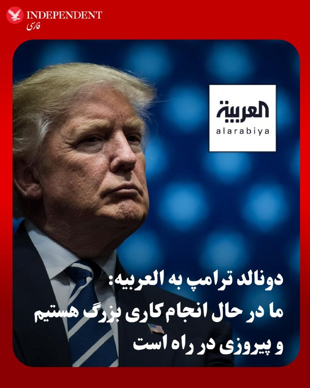

♦️دونالد ترامپ، رئیس‌جمهوری آمریکا، روز دوشنبه ۲۸ اردیبهشت‌ماه، در گفتگو با شبکه العربیه گفت ایالات متحده در حال انجام «کاری بزرگ» است و افزود که «پیروزی در راه است.»

ترامپ جزئیات بیشتری درباره منظور خود ارائه نکرد، اما این اظهارات در حالی مطرح می‌شود که تنش‌ها میان آمریکا و جمهوری اسلامی و مذاکرات مربوط به جنگ و تنگه هرمز ادامه دارد.
‌🇸🇦 Indypersian

🤖 @VahidOOnLine

## VahidOOnLine — post 240825

  

دونالد ترامپ به العربیه گفت: «ما در حال انجام کاری بزرگ هستیم و پیروزی در راه است.»

او پیش‌تر در تروث سوشال نوشت حتی اگر جمهوری اسلامی کاملا تسلیم شود و شکست خود را بپذیرد، رسانه‌هایی مانند نیویورک تایمز، وال‌استریت ژورنال و سی‌ان‌ان آن را پیروزی تهران جلوه خواهند داد.
او افزود رسانه‌های جعلی و دموکرات‌ها «کاملا راه خود را گم کرده‌اند و دیوانه شده‌اند.»

‌🏁 🇬🇧 IranintlTV

🤖 @VahidOOnLine

## VahidOOnLine — post 240824

  

سازمان عملیات تجارت دریایی بریتانیا اعلام کرد که در روزهای ۲۶ و ۲۷ اردیبهشت هیچ حادثه‌ای در خلیج فارس و دریای عمان گزارش نشده است.

با این حال، وضعیت امنیتی منطقه همچنان ناپایدار است و تهدید علیه کشتیرانی تجاری ادامه دارد.
‌🏁 🇬🇧 IranintlTV

🤖 @VahidOOnLine

## mwarmonitor — post 9266

🔴«یک منبع آگاه از برنامه‌ریزی‌های آمریکا به Israel Hayom گفته است که حملهٔ دیگری از سوی آمریکا به ایران «مسئلهٔ اگر نیست، بلکه مسئلهٔ چه زمانی است».

🔸مقام‌های امنیتی اسرائیل اعلام کردند که تدارکات برای دور جدیدی از حملات تکمیل شده است. انتظار می‌رود این عملیات چند روز به طول بینجامد و سایت‌هایی را هدف قرار دهد که ترامپ پیش‌تر از حمله به آن‌ها خودداری کرده بود.»

@mwarmonitor

## mwarmonitor — post 9265

🔴آلتمن و OpenAI در دادگاه تاریخی هوش مصنوعی، ماسک را شکست دادند

🔰یک هیئت منصفه علیه ایلان ماسک در پرونده شکایت او از OpenAI رای داد.

🔸یک هیئت منصفه فدرال به اتفاق آرا رای داد که ایلان ماسک در شکایت خود علیه OpenAI و مدیران ارشد آن بیش از حد تعلل کرده است؛ یک شکست بزرگ برای رئیس تسلا در رویارویی با رقیب دیرینه‌اش، سم آلتمن.

🔹چرا این موضوع اهمیت دارد: ماسک به دنبال میلیاردها دلار خسارت و همچنین برکناری آلتمن از OpenAI بود و استدلال می‌کرد که او مأموریت اولیه و غیرانتفاعی این سازمان را به خاطر سود مالی رها کرده است. اما، مگر اینکه قاضی حکم هیئت منصفه را وتو کند، ماسک دست خالی از این دادگاه خارج خواهد شد.

🔸تحولات فوری خبر: یک هیئت منصفه فدرال روز دوشنبه به اتفاق آرا شکایت ۱۵۰ میلیارد دلاری ایلان ماسک علیه OpenAI و سم آلتمن را رد کرد.

🔹اعضای هیئت منصفه همچنین رای دادند که ادعاهای ماسک درباره «خیانت در امانت خیریه» علیه OpenAI، آلتمن، گرگ براکمن و مایکروسافت، به دلیل مشمول زمان شدن (اتمام مهلت قانونی شکایت) فاقد اعتبار است.

🔸این تصمیم، پرونده‌ای را که ساختار قدرت در صنعت هوش مصنوعی را تهدید به دگرگونی می‌کرد، به سرعت متوقف ساخت.

📌نکات پنهان خبر: این تصمیم به این معنی است که نه OpenAI، نه مدیران آن و نه مایکروسافت، در قبال ادعاهای مطرح شده توسط ماسک مسئولیتی نخواهند داشت.
قاضی دادگاه تصمیم هیئت منصفه را تایید کرد.
کلام آخر: ماسک خیلی دیر اقدام کرد.

@mwarmonitor

## mwarmonitor — post 9264

🇮🇱🇺🇸«شبکه Channel 12 Israel گزارش داد: واشنگتن به اسرائیل اطلاع داده است که هواپیماهای سوخت‌رسان آمریکا تا پایان سال در Ben Gurion Airport باقی خواهند ماند.»

@mwarmonitor

## mwarmonitor — post 9263

🔴✈️«ساعت ۱۸:۲۴ به وقت گرینویچ— هواپیمای بمب‌افکن استراتژیک B-1B با شناسه PAVER 04 به‌صورت تکی از پایگاه RAF Fairford به پرواز درآمده و در حال برقراری ارتباط/فعالیت با RAF Brize Norton روی فرکانس ۲۳۱٫۹۵۰ است.»

@mwarmonitor

## mwarmonitor — post 9262

🇺🇸«رئیس‌جمهور ترامپ به من گفت که پس از دریافت تازه‌ترین پاسخ ناامیدکننده ایران در مذاکرات توافق صلح، «به هیچ‌گونه امتیازدهی به تهران» باز نیست — و در هشداری نگران‌کننده افزود که ایران می‌داند «به‌زودی چه اتفاقی قرار است بیفتد.»

New York post

@mwarmonitor

## mwarmonitor — post 9261

  

🇫🇷🇦🇪نیروی فرانسوی مستقر در امارات متحده عربی تصاویری از یک رزمایش مشترک منتشر کرده است که در آن جنگنده‌های رافال فرانسوی به‌همراه جنگنده‌های میراژ اماراتی و یک هواپیمای سوخت‌رسان شرکت دارند.

@mwarmonitor

## mwarmonitor — post 9260

🇺🇸وزارت خزانه‌داری آمریکا در حال صدور یک مجوز عمومی موقت ۳۰روزه است تا به آسیب‌پذیرترین کشورها اجازه دهد به‌طور موقت به نفت روسیه‌ای که هم‌اکنون در دریا سرگردان مانده دسترسی پیدا کنند.

🔸این تمدید، انعطاف‌پذیری بیشتری فراهم می‌کند و ما با این کشورها همکاری خواهیم کرد تا در صورت نیاز مجوزهای اختصاصی صادر شود. این مجوز عمومی به تثبیت بازار فیزیکی نفت خام کمک می‌کند و تضمین می‌کند که نفت به دست کشورهایی برسد که بیشترین آسیب‌پذیری انرژی را دارند.

🔸همچنین با کاهش توان چین برای انباشت نفت ارزان‌قیمت، به هدایت مجدد عرضه موجود به کشورهایی که بیشترین نیاز را دارند کمک خواهد کرد.

@mwarmonitor

## mwarmonitor — post 9259

📝 دیدن این تصاویر تهوع‌آور بر فراز برج‌های تهران، آن هم در کشوری که توده‌ی مردمش زیر خط فقر مطلق برای یک تکه نان شب سگ‌دو می‌زنند، هیچ چیز جز یک وقاحت آشکار و سادیسم اجتماعی نیست. این لاشخورهای مرفهی که به لطف رانت و وابستگی، جیب‌هایشان از پول این ملت مغبون…

## pm_afshaa — post 90979

  <a href="telegram/content/pm_afshaa_90979_1779128398.jpg">🎬 Download video</a>

🔴تسنیم به نقل از یک منبع نزدیک به تیم مذاکره‌کننده: آمریکا در متن جدید خودش پذیرفته که تحریم‌های نفتی ایران رو در طول دوره مذاکرات به‌صورت موقت تعلیق (Waive) کنه. طبق این گزارش، جمهوری اسلامی همچنان بر لغو کامل همه تحریم‌ها تاکید داره، اما آمریکا فعلا فقط…

## pm_afshaa — post 90978

  

🔴تیتر نیویورک پست:
ایالات متحده در آستانه از سرگیری نبرد با ایران با تمام توان است!

💧 Rainbet.com the #1 Non-KYC Crypto Casino & Sportsbook @rainbetcom

😁 @Pm_Afshaa

## pm_afshaa — post 90977

  <a href="telegram/content/pm_afshaa_90977_1779128400.jpg">🎬 Download video</a>

🔴ترامپ به العربیه: ما در حال انجام کاری بزرگ هستیم و پیروزی در راهه.

💧 Rainbet.com the #1 Non-KYC Crypto Casino & Sportsbook @rainbetcom

😁 @Pm_Afshaa

## pm_afshaa — post 90976

  <a href="telegram/content/pm_afshaa_90976_1779128400.jpg">🎬 Download video</a>

🔴ترامپ به نیویورک پست: ایران میدونه که به‌زودی چه اتفاقی براش میوفته.

💧 Rainbet.com the #1 Non-KYC Crypto Casino & Sportsbook @rainbetcom

😁 @Pm_Afshaa

## pm_afshaa — post 90975

🔴ترامپ به نیویورک پست: حاضر نیستم هیچ امتیازی به ایران واسه توافق بدم.

جمهوری اسلامی بیش از هر زمان دیگه‌ای خواهان توافقه؛ این یک مذاکره‌ست و نمی‌خوام اقدام احمقانه‌ای انجام بدم.

💧 Rainbet.com the #1 Non-KYC Crypto Casino & Sportsbook @rainbetcom

😁 @Pm_Afshaa

## pm_afshaa — post 90974

🔴یه مقام اسرائیلی امشب به i24NEWS گفت:سطح آماده‌باش واسه احتمال از سرگیری جنگ تا آخر همین هفته، فوق‌العاده بالاست

💧 Rainbet.com the #1 Non-KYC Crypto Casino & Sportsbook @rainbetcom

😁 @Pm_Afshaa

## pm_afshaa — post 90973

🔴آکسیوس: بمب‌ها مذاکره خواهند کرد

💧 Rainbet.com the #1 Non-KYC Crypto Casino & Sportsbook @rainbetcom

😁 @Pm_Afshaa

## pm_afshaa — post 90971

  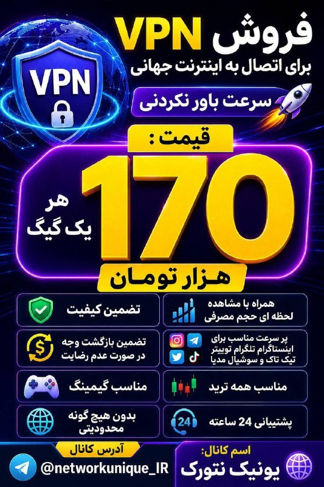

پراتون بریزه که کانفیگ آوردیم زیر قیمت! 😰🤑

هر یک گیگ کانفیگ 170 هزار تومن 🤑
پینگ کانفیگ ها زیر 100 🚀

، مناسب برای چرخ زدن تو اینستا ، یوتیوب ▶️، تلگرام ✈️، توییتر 🐦 و تیک تاک 🎧
مناسب برای تمام گیم‌ها 🎮 و تریدرها ↗️

هم لینک ساب بهتون ارائه میشه 🔗، هم می‌تونید داخل خود ربات حجم مصرفی و باقی مونده رو چک کنید 🤖📊

با تضمین برگشت وجه ✅

ادرس ربات برای تهیه سرویس🫴
@Unique_vpnbot

لینک کانال یونیک. 🔽
@networkunique_IR

## pm_afshaa — post 90970

🔴وزیر خزانه داری آمریکا: مجوز موقت 30 روزه برای خرید نفت روسیه صادر شد

💧 Rainbet.com the #1 Non-KYC Crypto Casino & Sportsbook @rainbetcom

😁 @Pm_Afshaa

## pm_afshaa — post 90969

🔴واشنگتن پست:اسرائیل منتظر چراغ سبز آمریکا برای شروع عملیات است

💧 Rainbet.com the #1 Non-KYC Crypto Casino & Sportsbook @rainbetcom

😁 @Pm_Afshaa

## pm_afshaa — post 90968

🔴العربیه: وزیر کشور پاکستان بعد از رد آخرین پیشنهاد ایران توسط آمریکا، دقایقی پیش ایران رو ترک کرد

💧 Rainbet.com the #1 Non-KYC Crypto Casino & Sportsbook @rainbetcom

😁 @Pm_Afshaa

## pm_afshaa — post 90967

  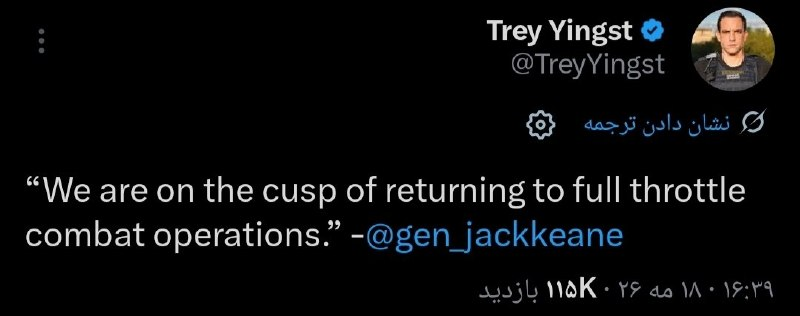

یینگست، خبرنگار فاکس‌ نیوز: ما تو آستانه بازگشت به عملیات‌های رزمی تمام‌عیار هستیم

💧 Rainbet.com the #1 Non-KYC Crypto Casino & Sportsbook @rainbetcom

😁 @Pm_Afshaa

## pm_afshaa — post 90966

⭕️رسانه های عبری : ترامپ‌ امشب دستور بمباران را صادر میکند

💧 Rainbet.com the #1 Non-KYC Crypto Casino & Sportsbook @rainbetcom

😁 @Pm_Afshaa

## DEJradio — post 4709

  <a href="telegram/content/DEJradio_4709_1779128402.mp4">🎬 Download video</a>

👑🎥 مراسم یادبود سامان دل‌آرام؛ "از خون جوانان وطن لاله دمیده"

#خون_جوانان_وطن #دی۱۴۰۴
@DEJradio

## DEJradio — post 4708

  <a href="telegram/content/DEJradio_4708_1779128404.jpg">🎬 Download video</a>

🔺🎤 خشم سیاسی و مرگ روابط

گفت‌وگو با دکتر مصطفی میررمضانی

#خشم_سیاسی #حکومت_آخوندی
@DEJradio

## DEJradio — post 4707

  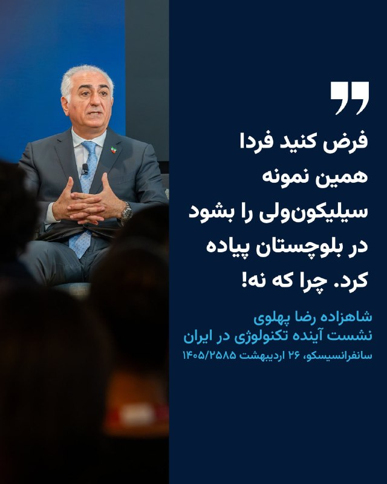

👑
🔺 شاهزاده رضا پهلوی: «فرض کنید همین نمونه سیلیکون ولی را بشود در بلوچستان پیاده کرد. چرا که نه!»

نشست آینده تکنولوژی در ایران
سان‌فرانسیسکو، ۲۶ اردیبهشت ۲۵۸۵/۱۴۰۵

#شاهزاده_رضا_پهلوی #سیستان_بلوچستان

@DEJradio

## mamlekate — post 103555

📝 اعتراف پزشکیان به فروپاشی زیرساخت‌های انرژی و بن‌بست اقتصادی: گفت‌وگو نکنیم، چه کنیم؟

مسعود پزشکیان، رییس دولت جمهوری اسلامی، با اذعان به آسیب گسترده به زیرساخت های انرژی، کاهش تولید و کسری روزانه ۵۰ میلیون لیتر بنزین، دشواری صادرات نفت و گرانی پیش رو، روایت رسمی درباره بی اثر بودن حملات را زیر سوال برد و به مخالفان مذاکره گفت: «اگر گفت وگو نکنیم، چه کار کنیم؟»

@mamlekate

## VahidOnline — post 75544

  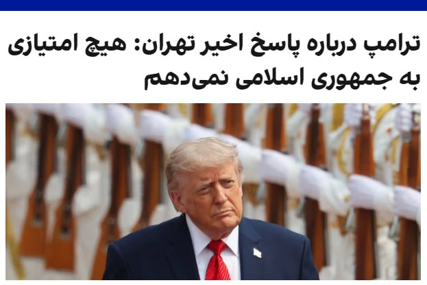

دونالد ترامپ، رئیس جمهوری آمریکا، روز دوشنبه در گفتگو با نیویورک پست اعلام کرد که پس از دریافت آخرین پاسخ ناامیدکننده تهران در مذاکرات توافق صلح، «به هیچ وجه حاضر به دادن امتیاز» به ایران نیست.
ترامپ در مصاحبه تلفنی کوتاه، ضمن ابراز نارضایتی از آخرین پیشنهاد تهران گفت ایران می‌داند «به‌زودی چه اتفاقی خواهد افتاد».
به گزارش نیویورک پست، وقتی از ترامپ درباره اظهارنظر روز جمعه‌اش مبنی بر اینکه مایل به پذیرش تعلیق ۲۰ ساله غنی‌سازی اورانیوم ایران است سوال شد، جواب داد: «در حال حاضر به هیچ وجه آماده دادن امتیاز نیستم».
ترامپ ادامه داد: «من واقعا نمی‌توانم در این مورد با شما صحبت کنم. چیزهای بسیار زیادی در حال رخ دادن است».
رئیس جمهوری آمریکا همچنین گفت از تهران «ناامید یا کلافه» نشده، اما هم‌زمان تأکید کرد ایران به‌خوبی آگاه است که ایالات متحده می‌تواند فشار بیشتری وارد کند.
ترامپ گفت: «می‌توانم به شما بگویم آن‌ها بیش از هر زمان دیگری خواستار توافق هستند، زیرا آن‌ها می‌دانند ما...به‌زودی چه اتفاقی قرار است بیفتد».
وقتی درباره ادعاهای منابع منطقه‌ای مبنی بر اینکه ایران تلاش می‌کند در قبال هر دو مسئله هسته‌ای و بازگشایی تنگه هرمز در برابر واشنگتن «سیاست صبر و انتظار» پیش بگیرد، سوال شد، ترامپ گفت «چنین چیزی نشنیده است».
@VahidOOnLine

📡 @VahidOnline

## VahidOnline — post 75543

  

اسکات بسنت، وزیر خزانه‌داری ایالات متحده، دوشنبه گفت که آمریکا در حال صدور یک مجوز عمومی ۳۰ روزه برای فراهم کردن دسترسی موقت به آن بخش از نفت روسیه‌ است که در دریا سرگردان مانده است.
بسنت در شبکه ایکس نوشت: «این تمدید، انعطاف‌پذیری بیشتری فراهم خواهد کرد و ما با این کشورها همکاری خواهیم کرد تا در صورت نیاز، مجوزهای مشخص صادر کنیم.»
او افزود: «این مجوز عمومی به ثبات بازار فیزیکی نفت خام کمک خواهد کرد و اطمینان می‌دهد که نفت به آسیب‌پذیرترین کشورهای از نظر انرژی برسد.»
@VahidOOnLine

📡 @VahidOnline

## VahidOnline — post 75541

وب‌سایت اکسیوس، روز دوشنبه ۲۸ اردیبهشت ۱۴۰۵ به نقل از یک مقام ارشد آمریکایی و یک منبع آگاه گزارش داد که تهران پیشنهاد تازه‌ای برای توافق ارایه کرده، اما کاخ سفید آن را «پیشرفت معنادار» ندانسته و برای دستیابی به توافق کافی نمی‌داند.

به گفته مقام ارشد آمریکایی، اگر ایران موضع خود را تغییر ندهد، مذاکرات «از طریق بمب‌ها» ادامه خواهد یافت.

بر اساس گزارش اکسیوس، مقام‌های آمریکایی می‌گویند دونالد ترامپ خواهان دستیابی به توافقی برای پایان جنگ است، اما هم‌زمان به دلیل رد بسیاری از خواسته‌های واشنگتن از سوی ایران و خودداری تهران از ارایه امتیازهای قابل‌توجه در برنامه هسته‌ای، گزینه ازسرگیری حملات را نیز بررسی می‌کند.

دو مقام آمریکایی گفته‌اند ترامپ قرار است روز سه‌شنبه نشست تیم ارشد امنیت ملی خود را در اتاق وضعیت کاخ سفید برگزار کند تا گزینه‌های نظامی را بررسی کند.

آکسیوس گزارش داده پیشنهاد تازه ایران که شامگاه یک‌شنبه از طریق میانجی‌گران پاکستانی به آمریکا منتقل شده، تنها تغییرات محدودی نسبت به نسخه قبلی دارد.
بر اساس این گزارش، در پیشنهاد جدید، توضیحات بیشتری درباره تعهد ایران به نساختن سلاح هسته‌ای آمده، اما هیچ تعهد مشخصی درباره توقف غنی‌سازی اورانیوم یا تحویل ذخایر اورانیوم با غنای بالا ارایه نشده است.

در حالی که رسانه‌های دولتی ایران گزارش داده بودند آمریکا در جریان مذاکرات با لغو برخی تحریم‌های نفتی موافقت کرده، مقام آمریکایی به آکسیوس گفته است هیچ کاهش تحریمی «رایگان» و بدون اقدام متقابل از سوی ایران انجام نخواهد شد.

این مقام آمریکایی همچنین گفته است: «ما واقعا پیشرفت زیادی نداشته‌ایم. اکنون در نقطه بسیار حساسی قرار داریم و فشار بر ایران است تا به شکل درستی پاسخ دهد.»

او افزوده است: «زمان آن رسیده که ایرانی‌ها امتیاز واقعی بدهند. ما به گفت‌وگوهای جدی، دقیق و جزیی درباره برنامه هسته‌ای نیاز داریم. اگر این اتفاق رخ ندهد، گفت‌وگو از طریق بمب‌ها انجام خواهد شد و این مایه تاسف است.»

در ادامه این گزارش آمده است که ایران و آمریکا هنوز مذاکرات مستقیم درباره جزییات توافق ندارند و گفت‌وگوها به‌صورت غیرمستقیم برای رسیدن به چارچوبی مشترک ادامه دارد.
این مقام آمریکایی مدعی شده که ارایه پیشنهاد تازه از سوی ایران، با وجود تغییرات اندک، نشان می‌دهد تهران نگران اقدام نظامی بیشتر آمریکا است.
در مقابل، مقام‌های ایرانی همواره تاکید کرده‌اند که این ترامپ است که برای دستیابی به توافق عجله دارد و زمان به سود ایران پیش می‌رود.
@VahidHeadline

📡 @VahidOnline

## VahidOnline — post 75540

  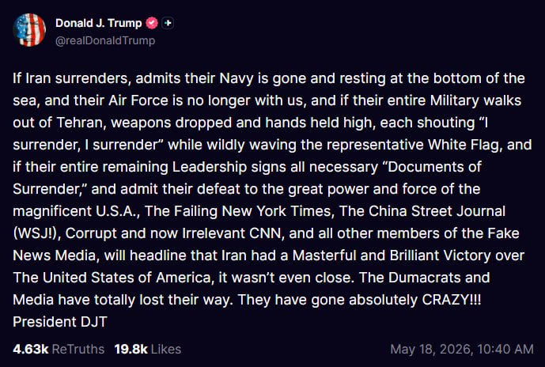

پست ترامپ، ترجمه ماشین:
اگر ایران تسلیم شود، اعتراف کند که نیروی دریایی‌اش از بین رفته و در قعر دریا آرمیده است، و نیروی هوایی‌اش دیگر در میان ما نیست، و اگر تمام ارتشش از تهران خارج شود، سلاح‌ها را زمین بیندازد و دست‌ها را بالا بگیرد، هرکدام فریاد بزنند «تسلیمم، تسلیمم» و در حالی‌ که پرچم سفیدِ نمادین را دیوانه‌وار تکان می‌دهند، و اگر تمام رهبران باقی‌مانده‌اش همه «اسناد تسلیم» لازم را امضا کنند و شکست خود را در برابر قدرت و نیروی عظیم ایالات متحده باشکوه آمریکا بپذیرند، نیویورک تایمزِ رو به افول، چاینا استریت ژورنال (وال‌استریت ژورنال!)، سی‌ان‌انِ فاسد و اکنون بی‌اهمیت، و همه دیگر اعضای رسانه‌های اخبار جعلی، تیتر خواهند زد که ایران پیروزی‌ای استادانه و درخشان بر ایالات متحده آمریکا به دست آورد و حتی رقابت نزدیکی هم نبود.

دموکرات‌های احمق و رسانه‌ها کاملاً راه خود را گم کرده‌اند. آن‌ها کاملاً دیوانه شده‌اند!!!

پرزیدنت دونالد جی ترامپ
realDonaldTrump

📡 @VahidOnline

## kianmeli1 — post 87465

🔴ترامپ در مورد ایران به «العربیه»: کار با عظمتی انجام می‌دهیم و پیروزی پیش روی ما است.
https://t.me/kianmeli1

## IranIntlTV — post 337822

پای فراخوان‌‌های شبانه و نمایش حکومتی سلاح در خیابان‌های ایران و صدا و سیمای جمهوری اسلامی به رسانه‌های بین‌المللی هم رسید. سی‌ان‌ان در گزارشی نوشت جمهوری اسلامی حامیانش را برای نمایش آمادگی برای جنگ بسیج می‌کند و با گذشت بیش از ده هفته از زمان شروع جنگ این تجمعات با حمایت نهادهای حکومتی و نظامی همچنان ادامه دارد.

گفت‌وگو با حسین قاضیان، جامعه‌شناس
@iranintltv

## IranIntlTV — post 337821

  

دادستان‌ها در دادگاه رسیدگی به پرونده حمله با چاقو به «پوریا زراعتی»، مجری شبکه ایران‌اینترنشنال، در لندن اعلام کردند این حمله را گروهی از اتباع رومانیایی انجام دادند که به‌عنوان نیروهای نیابتی جمهوری اسلامی عمل می‌کردند.

به گفته دادستان‌ها، این حمله را طرف سومی که به نمایندگی از حکومت ایران عمل می‌کرد، سفارش داده بود.
دادستان در جریان این جلسه که برای محاکمه دو نفر از سه متهم در دادگاه کیفری، برگزار شد، این حادثه را «عملی خشونت‌آمیز، برنامه‌ریزی‌شده و مبتنی بر شناسایی قبلی هدف» توصیف کردند.

دادستان اتکینسون گفت: «در سال‌های اخیر، از سال ۲۰۰۵ به این سو، جمهوری اسلامی کمتر به عوامل خود اتکا کرده و بیش از پیش به استفاده از نیروهای نیابتی، از جمله باندهای جنایی، روی آورده است تا تهدیدهای خشونت‌آمیز خود را از طریق آن‌ها عملی کند.»
https://iranintl.com/202605189885

## IranIntlTV — post 337820

  <a href="telegram/content/IranIntlTV_337820_1779128406.mp4">🎬 Download video</a>

مهدی مهدوی‌آزاد در برنامه «چشم‌انداز» گفت برخی افراد در ساختار جمهوری اسلامی، با وجود آن‌که ازسرگیری عملیات نظامی را قریب‌الوقوع و اجتناب‌ناپذیر می‌دانند، با طرح درخواست قتل بنیامین نتانیاهو و دونالد ترامپ به آتش جنگ دامن می‌زنند و زیرساخت‌های ایران را در معرض خطر قرار می‌دهند.
@iranintltv

## IranIntlTV — post 337819

چند ساعت بعد از این‌که تهران اعلام کرد به پیشنهاد آخر واشینگتن پاسخ داده، یک مقام ارشد آمریکایی به آکسیوس گفت پاسخ جمهوری اسلامی ناکافی بوده و احتمال از سرگیری جنگ را بیش از پیش می‌کند. پنتاگون گزینه‌های نظامی علیه جمهوری اسلامی را آماده و به دونالد ترامپ ارائه کرده. براساس گزارش‌ها ده‌‌ها هوایپمای حامل مهمات و تجهیزات نظامی ایالات متحده به اسرائیل منتقل شدن. نیویورک‌تایمز اقدامات آمریکا و اسرائیل را بزرگ‌ترین آماده‌سازی از زمان آتش‌بس توصیف کرده و نوشته دو کشور برای ازسرگیری احتمالی حملات به ایران، حتی در همین هفته آماده می‌شوند.

گفت‌وگو با سمیرا قرائی و بابک اسحاقی، خبرنگاران ایران‌اینترنشنال

@iranintltv

## IranIntlTV — post 337818

  

دونالد ترامپ در گفت‌وگویی کوتاه با نیویورک پست اعلام کرد که پس از دریافت پاسخ اخیر جمهوری اسلامی درباره مذاکرات، «هیچ تمایلی» به دادن هیچ‌گونه امتیاز به تهران ندارد.
او همچنین هشدار داد جمهوری اسلامی می‌داند «به‌زودی چه اتفاقی خواهد افتاد»، بدون آنکه جزئیات بیشتری ارائه کند.

ترامپ در پاسخ به پرسشی درباره اظهارنظرش درباره آمادگی برای پذیرش توقف ۲۰ ساله غنی‌سازی اورانیوم جمهوری اسلامی گفت: در حال حاضرآماده دادن هیچ امتیازی نیستم. واقعا نمی‌توانم درباره این موضوع صحبت کنم. اتفاقات زیادی در حال رخ دادن است.

ترامپ افزود که از تهران «عصبانی یا ناراحت» نیست، اما تاکید کرد جمهوری اسلامی به‌خوبی می‌داند آمریکا توان وارد کردن فشار و خسارت بیشتر را دارد. می‌توانم بگویم آن‌ها بیش از هر زمان دیگری خواهان توافق هستند، چون می‌دانند به‌زودی چه اتفاقی در راه است.

ترامپ: این یک مذاکره است و نمی‌خواهم اقدام احمقانه‌ای انجام دهم.
https://iranintl.com/202605186094

## IranIntlTV — post 337817

  <a href="telegram/content/IranIntlTV_337817_1779128408.mp4">🎬 Download video</a>

کانال ۱۲ اسرائیل گزارش داد انتظار می‌رود دونالد ترامپ ظرف ۲۴ ساعت آینده درباره اقدام نظامی احتمالی علیه جمهوری اسلامی تصمیم‌گیری کند.

گفت‌وگو با فرزین ندیمی، پژوهش‌گر امور دفاعی و امنیتی
@iranintltv

## IranIntlTV — post 337816

  <a href="telegram/content/IranIntlTV_337816_1779128410.mp4">🎬 Download video</a>

کانال ۱۳ اسرائیل گزارش داد هدف حمله احتمالی آمریکا، آسیب به حکومت ایران و بازگرداندن جمهوری اسلامی به میز مذاکره از موضع ضعف است.

این در حالی است که دونالد ترامپ در ابتدای جنگ پیشین با جمهوری اسلامی بر تغییر رژیم تاکید کرده بود.

گفت‌وگو با نجات بهرامی، تحلیل‌گر سیاسی
@iranintltv

## IranIntlTV — post 337815

  <a href="telegram/content/IranIntlTV_337815_1779128412.mp4">🎬 Download video</a>

مستند «تمرین‌هایی برای یک انقلاب» ساخته پگاه آهنگرانی، در حاشیه جشنواره فیلم کن، جایزه ویژه هیئت داوران رویداد مستند «گلدن گلوبز» را با همکاری بنیاد «آرتمیس رایزینگ» دریافت کرد؛ رویدادی که با همکاری بخش «کن داکس»، مجله ورایتی و بازار فیلم کن برگزار می‌شود.
این برنامه به مستندهای اجتماعی و سیاسی اختصاص دارد و برگزارکنندگان آن می‌گویند هدفش حمایت از فیلم‌سازی مستند، به‌عنوان ابزاری برای شکل دادن به روایت‌ها و گفت‌وگوهای جهانی، است.

## IranIntlTV — post 337814

  

اسکات بسنت، وزیر خزانه‌داری ایالات متحده، دوشنبه گفت که آمریکا در حال صدور یک مجوز عمومی ۳۰ روزه برای فراهم کردن دسترسی موقت به آن بخش از نفت روسیه‌ است که در دریا سرگردان مانده است.

بسنت در شبکه ایکس نوشت: «این تمدید، انعطاف‌پذیری بیشتری فراهم خواهد کرد و ما با این کشورها همکاری خواهیم کرد تا در صورت نیاز، مجوزهای مشخص صادر کنیم.»

او افزود: «این مجوز عمومی به ثبات بازار فیزیکی نفت خام کمک خواهد کرد و اطمینان می‌دهد که نفت به آسیب‌پذیرترین کشورهای از نظر انرژی برسد.»
https://iranintl.com/202605188532

## IranIntlTV — post 337813

  <a href="https://t.me/IranintlTV/337813">📎 Download file</a>

🎧نسخه صوتی اخبار شبانگاهی | دوشنبه ۲۸ اردیبهشت
@iranintlTV

## IranIntlTV — post 337812

  

خبرنگار سی‌ان‌بی‌سی، به نقل از یک مقام آمریکایی در شبکه ایکس نوشت گزارش رسانه‌های ایران مبنی بر این‌که آمریکا در حالی که مذاکرات ادامه دارد با لغو تحریم‌های نفتی موافقت کرده، نادرست است.

پیش‌تر خبرگزاری تسنیم وابسته به سپاه پاسداران، به نقل از یک منبع ناشناس نزدیک به تیم مذاکره‌کننده جمهوری اسلامی گزارش داد که آمریکا با تعلیق تحریم‌های صادرات نفت ایران در طول مذاکرات موافقت کرده است.

این منبع آگاه گفت: «آمریکایی‌ها برخلاف متون پیشین خود، در متن جدید پذیرفته‌اند که در طول دوره مذاکره، تحریم‌های نفتی ایران را ویو (Waive) کنند.»

این خبرگزاری افزود: «"ویو کردن" تحریم‌ها به معنای معافیت یا اسقاط موقت تحریم‌هاست.»
https://iranintl.com/202605186046

## IranIntlTV — post 337811

  <a href="telegram/content/IranIntlTV_337811_1779128415.mp4">🎬 Download video</a>

تیتر اول با نیوشا صارمی، دوشنبه ۲۸ اردیبهشت
@iranintltv

## IranIntlTV — post 337810

  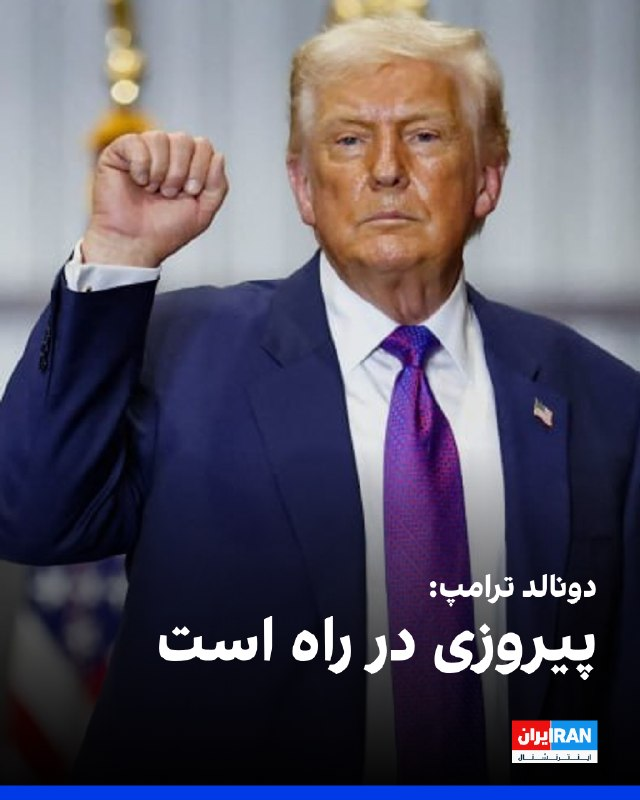

دونالد ترامپ به العربیه گفت: «ما در حال انجام کاری بزرگ هستیم و پیروزی در راه است.»

او پیش‌تر در تروث سوشال نوشت حتی اگر جمهوری اسلامی کاملا تسلیم شود و شکست خود را بپذیرد، رسانه‌هایی مانند نیویورک تایمز، وال‌استریت ژورنال و سی‌ان‌ان آن را پیروزی تهران جلوه خواهند داد.
او افزود رسانه‌های جعلی و دموکرات‌ها «کاملا راه خود را گم کرده‌اند و دیوانه شده‌اند.»

https://iranintl.com/202605180267

## IranIntlTV — post 337809

  

سازمان عملیات تجارت دریایی بریتانیا اعلام کرد که در روزهای ۲۶ و ۲۷ اردیبهشت هیچ حادثه‌ای در خلیج فارس و دریای عمان گزارش نشده است.

با این حال، وضعیت امنیتی منطقه همچنان ناپایدار است و تهدید علیه کشتیرانی تجاری ادامه دارد.
https://iranintl.com/202605183328

## Shin_Persian — post 6066

Shin ✓ @hey_itsmyturn
Mon, 18 May 2026 18:03:50 UTC

Something might be cooking, and I hope it’s a batch of Kotlets.

فارسی

ممکن است خبری در راه باشد، و امیدوارم که یک دوجین کتلت باشد.

𝕏 · @shin_persian

## Shin_Persian — post 6065

📦 mhrv-rs v1.9.30 released

• Make the Full mode CodeFull.gs path a little lighter

Files (Android APKs, Windows, macOS, Linux, OpenWRT) on the files channel:

👉 v1.9.30 — all files with SHA-256

Channel:
https://t.me/mhrv_rs
or: https://t.me/+R1OyoHX2boA1ZDgx

#v1930

## Shin_Persian — post 6064

  <a href="telegram/content/Shin_Persian_6064_1779128417.mp4">🎬 Download video</a>

U.S. Central Command ✓ @CENTCOM
Mon, 18 May 2026 17:00:05 UTC

CENTCOM continues to strictly enforce the U.S. blockade against Iranian ports. U.S. forces have now redirected 85 commercial vessels to ensure full compliance.

فارسی

سنتکام (ستاد فرماندهی مرکزی ایالات متحده) به اجرای دقیق محاصره ایالات متحده علیه بنادر ایران ادامه می‌دهد. نیروهای آمریکایی اکنون جهت حرکت ۸۵ کشتی تجاری را برای تضمین پایبندی کامل تغییر داده‌اند.

𝕏 · @shin_persian

## ManotoTV — post 105608

  <a href="telegram/content/ManotoTV_105608_1779128419.mp4">🎬 Download video</a>

تماسی از ایران:
از سیروان شعبانی، ۲۲ ساله از اسلامشهر گفت…
استاد موسیقی که نوزدهم دی بازداشت شد و حالا در اوین است

## ManotoTV — post 105607

  <a href="telegram/content/ManotoTV_105607_1779128420.mp4">🎬 Download video</a>

دونالد ترامپ، رئیس‌جمهوری آمریکا، در گفت‌وگو با نیویورک پست اعلام کرد پس از دریافت تازه‌ترین پاسخ «ناامیدکننده» جمهوری اسلامی در مذاکرات مربوط به توافق صلح، «برای هیچ‌گونه امتیازدهی به تهران آمادگی ندارد.»

ترامپ همچنین در اظهاراتی هشدارآمیز گفت جمهوری اسلامی می‌داند «به‌زودی چه اتفاقی قرار است بیفتد.»

او در این گفت‌وگوی کوتاه تلفنی، به نظر می‌رسید پیشنهاد جمهوری اسلامی برای ادامه مذاکرات دیپلماتیک، که روز یکشنبه مطرح شده بود، را رد کرده است.

ترامپ در پاسخ به سوالی درباره اظهارات روز جمعه‌اش مبنی بر آمادگی برای پذیرش توقف ۲۰ ساله غنی‌سازی اورانیوم در ایران گفت: «در حال حاضر برای هیچ چیزی آمادگی ندارم.»

رئیس‌جمهوری آمریکا از ارائه جزئیات بیشتر خودداری کرد و گفت: «واقعاً نمی‌توانم درباره‌اش صحبت کنم. اتفاقات زیادی در حال رخ دادن است.»

بر اساس این گزارش، ترامپ پس از بازگشت از سفرش به چین، آخر هفته را در باشگاه گلف خود در ویرجینیا همراه با تیم امنیت ملی آمریکا به بررسی گام‌های بعدی درباره جمهوری اسلامی گذرانده است.

نیویورک پست نوشت انتظار می‌رود نشست‌های بیشتری روز سه‌شنبه برگزار شود؛ در حالی که برخی متحدان تندرو ترامپ، از جمله لیندسی گراهام، سناتور جمهوری‌خواه، از او خواسته‌اند با متوقف شدن روند دیپلماسی، عملیات نظامی علیه جمهوری اسلامی را از سر بگیرد.

ترامپ همچنین گفت از تهران «ناامید» نشده، اما تاکید کرد جمهوری اسلامی به‌خوبی می‌داند آمریکا توان وارد کردن «فشار و آسیب بیشتر» را دارد.

او گفت: «می‌توانم بگویم آن‌ها بیشتر از هر زمان دیگری می‌خواهند توافق کنند، چون می‌دانند ما… چه اتفاقی قرار است به‌زودی بیفتد.»

ترامپ در پاسخ به سوالی درباره گزارش‌هایی مبنی بر تلاش جمهوری اسلامی برای «وقت‌کشی» در موضوع هسته‌ای و بازگشایی تنگه هرمز گفت چنین چیزی نشنیده است.

او افزود: «چیزی نمی‌شنوم. نمی‌توانم درباره‌اش با شما صحبت کنم.»

ترامپ در پایان گفت: «این یک مذاکره است. نمی‌خواهم احمق باشم.»

## ManotoTV — post 105606

  <a href="telegram/content/ManotoTV_105606_1779128421.mp4">🎬 Download video</a>

تماسی از ایران:
« از جاویدنام علی اباذری می‌گفت…
با گذشت ماه‌ها، درد هنوز تازه‌ست؛ انگار همین دیروز اتفاق افتاده.»

## ManotoTV — post 105605

  <a href="telegram/content/ManotoTV_105605_1779128423.mp4">🎬 Download video</a>

ایرانیان مقیم مادرید امروز دوشنبه ۱۸ می، مقابل سفارت نروژ در پایتخت اسپانیا تجمع کردند. این تجمع در اعتراض به دیدار برخی سیاستمداران نروژی با مقام‌های جمهوری اسلامی و در حمایت از شاهزاده رضا پهلوی برگزار شد.

معترضان خواستار پایان دادن به مماشات با جمهوری اسلامی و شنیده شدن صدای مردم ایران شدند.

## ManotoTV — post 105604

  <a href="telegram/content/ManotoTV_105604_1779128425.mp4">🎬 Download video</a>

‌
داده‌های ردیابی پروازها نشان می‌دهد انتقال هوایی تجهیزات و نیروهای نظامی آمریکا به خاورمیانه همچنان ادامه دارد.

بر اساس گزارش الجزیره از داده‌های پروازی، دست‌کم ۲۶ پرواز نظامی آمریکا بین ۱۵ تا ۱۷ مه از آلمان به مقصد خاورمیانه انجام شده است.

این گزارش می‌گوید این جابه‌جایی‌ها همزمان با افزایش حضور نظامی آمریکا در اطراف تنگه هرمز، دریای عمان و دریای عرب انجام شده است.

بر اساس داده‌های ردیابی، تمام پروازهای ثبت‌شده با هواپیماهای نظامی «بوئینگ سی-۱۷ اِی گلوب‌مستر ۳» انجام شده‌اند؛ هواپیماهای ترابری سنگینی که نیروی هوایی آمریکا از آن‌ها برای انتقال نیرو و تجهیزات نظامی استفاده می‌کند.

## ManotoTV — post 105603

  <a href="telegram/content/ManotoTV_105603_1779128426.mp4">🎬 Download video</a>

‌
وزارت خزانه‌داری آمریکا اعلام کرد مجوزی عمومی و موقت ۳۰ روزه صادر کرده تا «آسیب‌پذیرترین کشورها» بتوانند به‌طور موقت به نفت روسیه‌ای که در دریا سرگردان مانده، دسترسی پیدا کنند.

وزارت خزانه‌داری آمریکا گفت این تمدید «انعطاف‌پذیری بیشتری» فراهم می‌کند و واشینگتن در صورت نیاز، مجوزهای مشخص‌تری نیز برای این کشورها صادر خواهد کرد.

در این بیانیه آمده است این مجوز عمومی به «ثبات بازار فیزیکی نفت خام» کمک می‌کند و تضمین می‌کند نفت به کشورهایی برسد که بیشترین آسیب‌پذیری را در حوزه انرژی دارند.

وزارت خزانه‌داری آمریکا همچنین اعلام کرد این اقدام با کاهش توانایی چین برای انبار کردن نفت ارزان‌قیمت، به هدایت دوباره عرضه موجود به سمت کشورهای نیازمند کمک خواهد کرد.

## ManotoTV — post 105602

  <a href="telegram/content/ManotoTV_105602_1779128426.mp4">🎬 Download video</a>

‌
نهاد« مدیریت آبراه خلیج فارس» با راه‌اندازی حساب کاربری در شبکه ایکس اعلام کرد عبور کشتی‌ها از تنگه هرمز بدون دریافت مجوز از این نهاد «غیرقانونی» خواهد بود.

این نهاد که با نام PGSA معرفی شده، در بیانیه‌ای نوشت تردد در محدوده‌های تعیین‌شده در تنگه هرمز باید با هماهنگی کامل با نیروهای مسلح و مقام‌های جمهوری اسلامی انجام شود.

در این بیانیه آمده است: «عبور بدون مجوز، غیرقانونی تلقی خواهد شد.»

## FarsiVOA — post 218080

🔺اختصاصی؛ مقام دولت آمریکا درباره ادعای «لغو تحریم‌های رژیم ایران در زمان مذاکرات»: نادرست است

▪️دولت ایالات متحده روز دوشنبه ۲۸ اردیبهشت گزارش منتشرشده در رسانه‌های نزدیک به حکومت ایران درباره تعلیق تحریم‌های نفتی تهران در جریان مذاکرات با آمریکا را رد کرد و آن را «نادرست» خواند.

⬇️ بیشتر بخوانید:

https://ir.voanews.com/a/white-house-official-says-iran-sanctions-continue-during-peace-negotiations/8151252.html/?nocach=1

## FarsiVOA — post 218079

  <a href="telegram/content/FarsiVOA_218079_1779128427.mp4">🎬 Download video</a>

گلایه یک شهروند از گرانی؛ «دیگر برنج هم نمی‌توانیم بخریم.»

در سایه بی‌ثباتی اقتصادی و فشارهای مداوم، زندگی روزمره بسیاری از مردم به میدان مبارزه‌ای خاموش برای تأمین حداقل‌ها تبدیل شده است.

## FarsiVOA — post 218078

سازمان عفو بین‌الملل در گزارش سالانه خود در مورد اجرای مجازات در سال ۲۰۲۵، اعلام کرد که در مجموع دو هزار و ۷۰۷ اعدام در سراسر جهان به ثبت رسیده که نشان دهنده افزایش یک هزار و ۵۱۸ اعدام نسبت به سال ۲۰۲۴ است. این رقم البته موارد اعدام در سه کشور چین، کره شمالی و ویتنام که آماری از آنها در دست نیست، در بر نمی‌گیرد.

بر اساس گزارش عفو بین‌الملل، در سال ۲۰۲۵ در حالی در مجموع ۱۷ کشور از مجازات اعدام استفاده کردند، جمهوری اسلامی به تنهایی دو هزار و ۱۵۹ نفر را اعدام کرده، که حدود ۸۰ درصد از آمار کلی اعدام‌ها در جهان است.

تعداد اعدام‌ها در ایران توسط جمهوری اسلامی در سال ۲۰۲۴، حدود ۹۷۲ نفر ثبت شده که افزایش آن در سال ۲۰۲۵، موجب جهش چشمگیر تعداد اعدام‌ها در سراسر جهان شده است.

زارش کامل را در وب‌سایت صدای آمریکا بخوانید.

@FarsiVOA

## FarsiVOA — post 218077

گفت‌و‌گو با یاسین اهوازی، کارشناس مسائل خاورمیانه، درباره تشدید اقدامات بی‌ثبات‌کننده رژیم ایران با ادامه حملات به کشورهای منطقه

## FarsiVOA — post 218076

گفت‌و‌گو با آرش حسن‌نیا، روزنامه‌نگار اقتصادی، درباره تشدید بحران‌های معیشتی مردم در پی افزایش روزانه قیمت‌ها در ایران

## FarsiVOA — post 218075

در گفت‌وگو با مهرداد خوانساری، دیپلمات پیشین ایران در سازمان ملل متحد، به هشدار صریح دونالد ترامپ، بررسی گزینه‌های نظامی آمریکا، پایان عملیات «خشم حماسی»، و استراتژی جدید آمریکا و چین بر بازگشایی تنگه هرمز پرداختیم و پرسیدیم جمهوری اسلامی در این مرحله چه گزینه‌ای برای بقا دارد؟

## FarsiVOA — post 218074

🔺محکومیت گسترده حمله پهپادی به عربستان سعودی از خاک عراق

▪️حمله پهپادی به عربستان سعودی از داخل خاک عراق در شامگاه یکشنبه ۲۷ اردبیهشت، با واکنش‌های گسترده منطقه‌ای رو‌به‌رو شده است و چندین کشور ضمن محکوم کردن این حملات، با عربستان سعودی اعلام همبستگی کرده‌اند.

⬇️ بیشتر بخوانید:

https://ir.voanews.com/a/drones-attack-saudi-arabia-iran-proxy/8151209.html/?nocach=1

## FarsiVOA — post 218072

در گفت‌وگو با حسن هاشمیان، همکار صدای آمریکا، به روند خلع سلاح شدن برخی گروه‌های شبه‌نظامی وابسته به رژیم ایران پرداختیم.

## DW_Farsi — post 124852

🔶 جیره‌بندی بنزین در ایران؛مسیر هموار شکل‌گیری بازار سیاه سوخت

🔺 گزارشی از النا فرهادی

واقعیت عریان صف‌های بنزین و شکل‌گیری بازار سیاه، از آغاز یک بحران ساختاری و فرسایش تاب‌آوری معیشت مردم خبر می‌دهد.

در حالی که مقام‌های جمهوری اسلامی همچنان از "مدیریت مصرف" و نبود بحران در تامین سوخت سخن می‌گویند، روایت‌های روزهای اخیر از شهرهای مختلف ایران تصویر دیگری را نشان می‌دهد؛ صف‌های طولانی مقابل پمپ‌بنزین‌ها، محدودیت‌های غیررسمی در عرضه سوخت، حذف یا کاهش سهمیه کارت‌های آزاد و شکل‌گیری بازار سیاه بنزین، به‌ویژه در استان‌های جنوبی و مرزی.

هم‌زمان، دولت نیز برای نخستین‌بار به‌صراحت از آسیب دیدن بخشی از زیرساخت‌های سوخت و انرژی در جریان جنگ اخیر آمریکا و اسرائیل علیه ایران سخن گفته است؛ جنگی که از ۲۸ فوریه آغاز شد و حتی با وجود آتش‌بس شکننده، همچنان سایه آن بر بازار انرژی ایران باقی مانده است.

در چنین فضایی، پرسش اصلی دیگر فقط قیمت بنزین نیست، بلکه این است که آیا ایران وارد مرحله‌ای از بحران ساختاری در تامین سوخت شده است؟ گفت‌وگوی دویچه وله فارسی با دالغا خاتین‌اوغلو، کارشناس حوزه نفت و انرژی.

@dw_farsi

## DW_Farsi — post 124851

  

🔶 ادعای تازه در باره وضعیت مجتبی خامنه‌ای: «جراحات مختصر او بهبود یافته است»

حسین کرمان‌پور، مدیر مرکز روابط عمومی و اطلاع‌رسانی وزارت بهداشت، روز دوشنبه، ۲۸ اردیبهشت در گردهمایی روابط عمومی‌های دستگاه‌های اجرایی کشور با طرح این موضوع که مجتبی خامنه‌ای مجروح را در پی حمله آمریکا و اسرائیل به بیت پدرش به بیمارستان سینا بردند، مدعی شد که او جراحات مختصری داشته و حالا در سلامت کامل است: « خوشبختانه اتفاق خاصی برای رهبر انقلاب نیفتاده بود. فردی که در محل چنین حادثه‌ای باشد، طبیعتا چندین زخم بر روی بدن خود خواهد داشت. این زخم‌ها نیز زخم‌هایی نبود که بخواهد چهره رهبر انقلاب را مخدوش کند یا اینکه قطع عضو داشته باشند. اصلا اینگونه نیست. چند تا بخیه در محل جراحات زده شد. بخشی که همانجا تصمیم گرفته شد که بخیه زده شود روی پای ایشان بود.»

کرمان‌پور در ادامه می‌گوید که در پی انتقال مجتبی خامنه‌ای"به این فکر افتادیم که چگونه باید روایت‌سازی کنیم. همه جای دنیا در حال ساختن روایت بودند. برای ما کار خیلی سختی بود". ا و جزئیات بیشتری شرح نمی‌دهد که روایت برای چه می‌بایست تولید می‌شد و قراربود چه چیزی به مردم اطلاع داده شود یا از آنها پنهان نگه داشته شود.

حدود ده روز پیش مظاهر حسینی، مسئول دیدارهای دفتر علی خامنه‌ای، رهبر سابق جمهوری اسلامی، روایتی کمی متفاوت از وضعیت جراحات مجتبی خامنه‌ای بر اثر "موج انفجار" ارائه کرد و گفت که زمانی که مجتبی خامنه‌ای در حال بالا رفتن از پله‌ها بوده، بر اثر شلیک موشک "بین راه به زمین می‌افتد و کشکک پا و کمرش آسیب می‌بیند. کمر او در این ایام خوب شده و پا هم به زودی خوب خواهد شد".

@dw_farsi

## DW_Farsi — post 124850

  

🔶 رسیدگی به دادخواهی جعفر پناهی در دادگاهی در تهران

روز چهارشنبه ۳۰ اردیبهشت، شعبه ۲۶ دادگاه انقلاب اسلامی تهران به ریاست قاضی ایمان افشاری، به پرونده جعفر پناهی رسیدگی خواهد کرد.

به گزارش خبرگزاری ایسنا پناهی که سال گذشته به‌صورت غیابی به اتهام "تبلیغ علیه نظام" به یک سال زندان محکوم شده بود، در شعبه‌ای از دادگاه انقلاب تهران حاضر خواهد شد.

پناهی به رغم خطر بازداشت و زندانی‌ شدن روز ۱۰ فروردین امسال به ایران بازگشت.

بر اساس گزارش ایسنا، جلسه رسیدگی پس از آن برگزار می‌شود که وکلای پناهی به حکم غیابی اعتراض و درخواست تجدیدنظر کرده‌اند. ریاست جلسه را ایمان افشاری، قاضی شناخته‌شده دادگاه‌های انقلاب که به صدور احکام سختگیرانه علیه مخالفان مشهور است، بر عهده خواهد داشت. اتحادیه اروپا افشاری را تحریم کرده است.

جعفر پناهی سال گذشته برای فیلم "یک تصادف ساده" نخل طلای جشنواره کن را دریافت کرد و نامزد جایزه اسکار نیز شد. او در آذرماه گذشته به‌صورت غیابی به یک سال زندان و همچنین دو سال ممنوعیت خروج از کشور محکوم شد.

پناهی پیش‌تر نیز در ایران زندانی شده بود؛ یک بار در سال ۱۳۹۹ به مدت نزدیک سه ماه و بار دیگر در سال‌ ۱۴۰۱ حدود هفت ماه در زندان بود. مقام‌های جمهوری اسلامی همچنین سال‌ها او را با ممنوعیت فیلمسازی و ممنوع‌الخروجی روبه‌رو کرده بودند.

@dw_farsi

## DW_Farsi — post 124849

  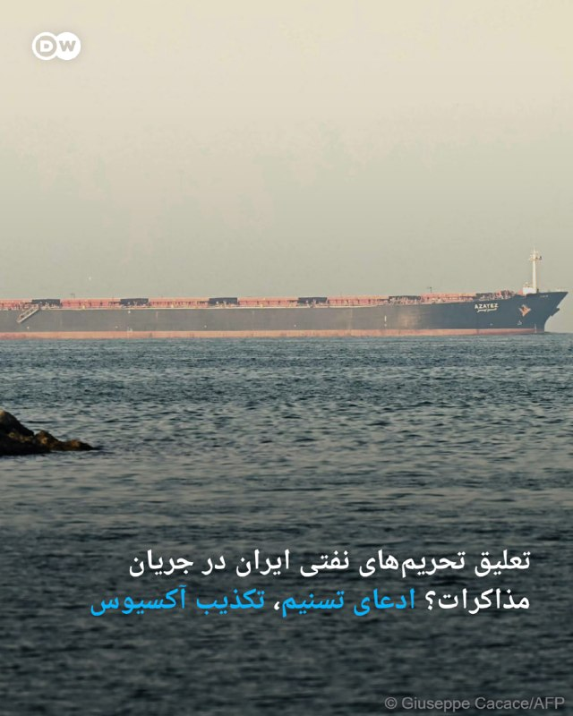

🔶 تعلیق تحریم‌های نفتی ایران در جریان مذاکرات؟ ادعای تسنیم، تکذیب آکسیوس

خبرگزاری تسنیم، نزدیک به سپاه پاسداران، به نقل از یک منبع نزدیک به تیم مذاکره‌کننده ایران مدعی شد که "آمریکا در متن جدید خود اسقاط تحریم‌های نفتی ایران را پذیرفته است".

بنا بر این خبر، "آمریکایی‌ها برخلاف متون پیشین خود، در متن جدید پذیرفته‌اند که در طول دوره مذاکره، تحریم‌های نفتی ایران را Waive کنند". "ویو" کردن تحریم‌ها به معنای معافیت یا اسقاط موقت تحریم‌هاست.

ایران تاکید دارد که لغو همه‌ تحریم‌های ایران باید جزو تعهدات آمریکا باشد. آمریکا اما اسقاطی اوفک را تا زمان تفاهم نهایی مطرح کرده است.

منبع مورد استناد تسنیم همچنین گفته است که "با وجود برخی وعده‌ها، اختلاف درباره بازگشت پول‌های بلوکه شده وجود دارد".

در همین رابطه خبرگزاری رویترز به نقل از یک منبع ایرانی خبر داد که ایالات متحده در مذاکرات جاری، از جمله در مورد بحث هسته‌ای، انعطاف‌ پذیری نشان داده است.

@dw_farsi

## Persian_Trend_Official — post 14432

  

وزیر خزانه‌داری ایالات متحده، مجوزی ۳۰ روزه صادر کرد که به کشورهای آسیب‌پذیر اجازه می‌دهد نفت روسیه‌ای را که در دریا سرگردان مانده است خریداری کنند.
دولت آمریکا تاکنون حداقل ۳ بار این معافیت موقت خرید نفت روسیه را تمدید/احیا کرده است.
▪️ ۱۹ مارس ۲۰۲۶
▪️ ۲۲ آوریل ۲۰۲۶
▪️ ۱۸ مه ۲۰۲۶
تمام این تمدیدها به‌صورت دوره‌های ۳۰ روزه صادر شده‌اند.

🦁Phantom
🦁

📌 @persian_trend_official
پرشین ترند | متفاوت‌ترین کانال نظامی

## Persian_Trend_Official — post 14431

کانال رسمی پرشین ترند pinned «https://youtube.com/live/7aZKWyXxQog?feature=share»

## Persian_Trend_Official — post 14430

https://youtube.com/live/7aZKWyXxQog?feature=share

## Persian_Trend_Official — post 14429

  

📰پرزیدنت ترامپ به العربیه :
کار با عظمتی انجام می‌دهیم، و پیروزی پیش روی ماست.

🦁Phantom
🦁

✍@persian_trend_official
پرشین ترند | متفاوت‌ترین کانال نظامی

## Persian_Trend_Official — post 14428

کانال رسمی پرشین ترند pinned «ساعت 21 لایو رو آغاز میکنم»

## Persian_Trend_Official — post 14427

ساعت 21 لایو رو آغاز میکنم

## Persian_Trend_Official — post 14426

  

کانال ۱۲ اسرائیل:

ایران تنها چند روز، نه هفته‌ها، فرصت دارد تا چیزی به رئیس‌جمهور ترامپ ارائه دهد که بن‌بست را بشکند.

رئیس‌جمهور ترامپ تمایل دارد اقدام نظامی انجام دهد مگر اینکه ظرف چند روز چیزی از ایران دریافت کند.

🦁Phantom
🦁

✍persian_trend_official
پرشین ترند | متفاوت‌ترین کانال نظامی

## Persian_Trend_Official — post 14425

  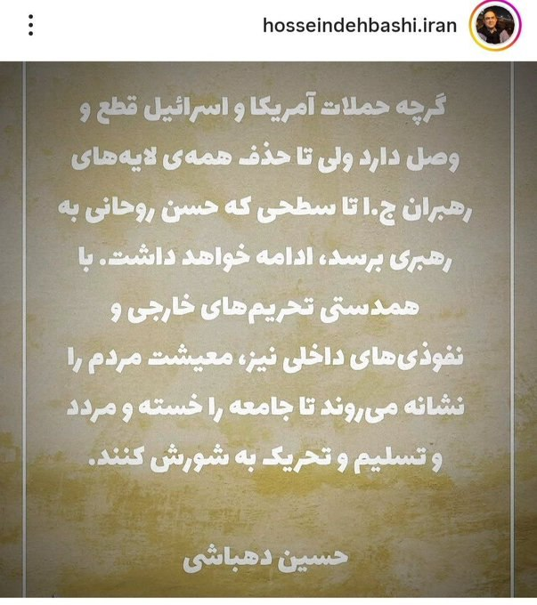

وقتی یک مستندسازِ ورشکستهٔ سیاسی، سناریوی«ترور شخصیت دکتر #روحانی»را برای دیده‌شدن کارگردانی می‌کند،دیگر مستندساز نیست؛کاسبِ التهاب است. اتهام‌زنی با این ادبیات،نه شجاعت است نه افشاگری؛سقوط اخلاقیِ کسی‌ است که روزی تاریخ شفاهی می‌ساخت و امروز برای دیده‌شدن، تاریخ را تحریف می‌کند.

کامبیز مهدیزاده داماد حسن روحانی !

📌 @persian_trend_official
پرشین ترند | متفاوت‌ترین کانال نظامی

## Persian_Trend_Official — post 14424

  <a href="telegram/content/Persian_Trend_Official_14424_1779128433.jpg">🎬 Download video</a>

❤️ اگر از مخاطبان پرشین ترند هستید و تلگرام پرمیوم دارید،
با بوست کردن کانال کمک بزرگی به رشد و دیده‌شدن بیشتر پرشین ترند می‌کنید.
این بوست‌ها باعث می‌شود امکانات بیشتری برای انتشار محتوا، استوری و قابلیت‌های ویژه کانال فعال شود و در شرایط فعلی، به ادامه پوشش سریع و تحلیل‌های روزانه کمک زیادی می‌کند.
🙏 اگر مایل بودید، از طریق لینک زیر کانال را بوست کنید:
https://t.me/boost/persian_trend_official
📌 @persian_trend_official
پرشین ترند | متفاوت‌ترین کانال نظامی

## Persian_Trend_Official — post 14423

  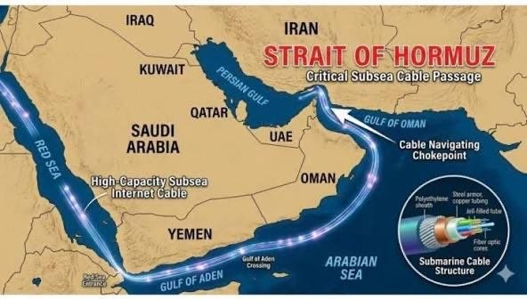

🇮🇷ایران از شرکت‌های بزرگ فناوری آمریکا از جمله گوگل، مایکروسافت، متا و آمازون درخواست دریافت هزینه مجوز برای «کابل‌های اینترنت زیرآبی» واقع در تنگه هرمز و خلیج فارس کرده است.

🐣
🪙
🛒
🖥
🖥

🇮🇷سپاه پاسداران تهدید کرده است که در صورت عدم رعایت مقررات محلی توسط این شرکت‌ها، ترافیک را محدود خواهد کرد که ممکن است «اتصال داده‌ها بین اروپا، آسیا و خاورمیانه را مختل کند».

کابل‌های عبوری از تنگه هرمز و دریای سرخ ۱۷٪ از ترافیک جهانی را حمل می‌کنند.

🦁Phantom
🦁

🌏@persian_trend_official
پرشین ترند | متفاوت‌ترین کانال نظامی

## RadioFarda — post 157320

معافیت روسیه از تحریم‌های نفتی آمریکا یک ماه دیگر تمدید شد

🔸وزیر خزانه‌داری آمریکا روز دوشنبه، ۲۸ اردیبهشت، اعلام کرد که آمریکا به مدت ۳۰ روز دیگر فروش نفت روی آبِ روسیه از تحریم‌های ایالات متحده را تمدید کرده است.

🔸این اقدام همزمان با عدم موفقیت تهران و واشینگتن در رسیدن به توافق برای پایان جنگ و ادامه افزایش قیمت سوخت در سراسر دنیا انجام می‌شود.

🔸این دومین بار است که در پی حمله مشترک آمریکا و اسرائیل به خاک ایران معافیت روسیه از فروش نفت در دنیا تمدید می‌شود.

🔸بار اول، همزمان با ادامه بسته ماندن تنگه هرمز و افزایش قیمت نفت در بازارهای جهانی، دولت آمریکا روز جمعه، ۲۸ فروردین، معافیتی را که پیشتر برای امکان موقت فروش نفت روسیه قائل شده بود، تمدید کرد.

🔸این مجوز خرید بخشی از نفت تولیدی روسیه را که پیش از اعلام معافیت، در نفتکش‌ها بارگیری شده و روی آب بودند به مدت یک ماه مجاز اعلام می‌کرد.

🔸اسکات بِسِنت، وزیر خزانه‌داری آمریکا، روز دوشنبه در پیامی در شبکه ایکس نوشت که این معافیت دوباره کمکی است به «آسیب‌پذیرترین کشورها برای دسترسی یافتن به نفت روی آبِ روسیه».

🔸از زمان آغاز جنگ ایران، قیمت جهانی نفت و به‌تبع آن قیمت سوخت در بسیاری از کشورها از جمله ایالات متحده بالا رفته است. به نوشته خبرگزاری فرانسه، در حال حاضر قیمت بنزین در آمریکا ۵۰ درصد بالاتر از قیمت این کالا در روز آغاز جنگ است.

@RadioFarda

## RadioFarda — post 157319

  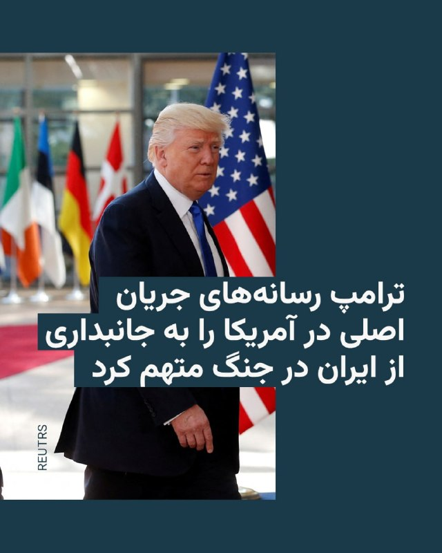

🔸دونالد ترامپ، رئیس جمهور آمریکا، روز دوشنبه در پیامی تازه در شبکه اجتماعی خود با حمله به چند رسانه جریان اصلی در این کشور آنها را به جانبداری از ایران در جنگ متهم کرد.

🔸او نوشته است: «اگر ایران تسلیم شود و اقرار کند که نیروی دریایی‌اش در قعر دریاست و نیروی هوایی‌اش دیگر وجود ندارد و کل ارتش ایران هم از تهران خارج شود و سلاح‌ها را زمین بگذارند و فریاد بزنند که تسلیم، تسلیم»، باز هم نیویورک تایمز و وال استریت جورنال و سی‌ان‌ان و باقی «رسانه‌های خبری دروغگو تیتر خواهند زد که ایران به پیروزی‌ای درخشان علیه ایالات متحده آمریکا دست یافته است.»

🔸به گفته ترامپ در این پیام، دموکرات‌ها و رسانه‌ها «کاملا دیوانه شده‌اند».

🔸بیش از یک ماه پس از برقراری آتش‌بس میان ایران و آمریکا، در حالی که دو طرف هنوز نتوانسته‌اند به توافقی برای پایان جنگ برسند، فشار بر رئیس جمهور آمریکا که با گرانی روزافزون سوخت و اجناس در کشور خود روبه‌روست و هر روز به زمان برگزاری انتخابات میان‌دوره‌ای نزدیک‌تر می‌شود افزایش یافته است.

@RadioFarda

## RadioFarda — post 157318

  <a href="https://t.me/radiofarda/157318">📎 Download file</a>

📻بشنوید: ایستگاه ۱۹ با رادیوفردا، ۲۸ اردیبهشت ۱۴۰۵

@RadioFarda

## RadioFarda — post 157317

سامانه‌های دفاعی عراق «هیچ پهپادی را در مسیر عربستان شناسایی نکردند»

🔸در پی انتشار خبری از ورود سه پهپاد به حریم هوایی عربستان سعودی، وزارت امور خارجه عراق روز دوشنبه اعلام کرد که سامانه‌های دفاعی این کشور هیچ پهپادی را در مسیر عربستان شناسایی و رهگیری نکرده‌اند.

🔸عربستان سعودی روز یکشنبه ۲۷ اردیبهشت اعلام کرد سه پهپاد را که از حریم هوایی عراق وارد این کشور شده بودند، رهگیری و منهدم کرده است.

🔸ترکی مالکی، سخنگوی وزارت دفاع عربستان، گفت این پهپادها روز یکشنبه وارد حریم هوایی عربستان شدند که نیروی دفاعی این کشور موفق به رهگیری و نابودی آن‌ها شد.

🔸سخنگوی وزارت دفاع عربستان تأکید کرد وزارت دفاع این‌ کشور حق پاسخ‌گویی در زمان و مکان مناسب را برای خود محفوظ می‌داند.

🔸در پاسخ به این خبر، دولت عراق می‌گوید روند تحقیق در این باره را آغاز کرده است.

🔸وزارت خارجه عراق هم روز دوشنبه ضمن اشاره به این که هیچ پهپادی در فضای عراق شناسایی نشده از ریاض خواست «اطلاعات مربوطه» را در اختیار بغداد بگذارد تا «از آن برای تضمین تقویت امنیت و ثبات در دو کشور دوست و برادر استفاده شود».

@RadioFarda

## IranianMinds — post 20360

  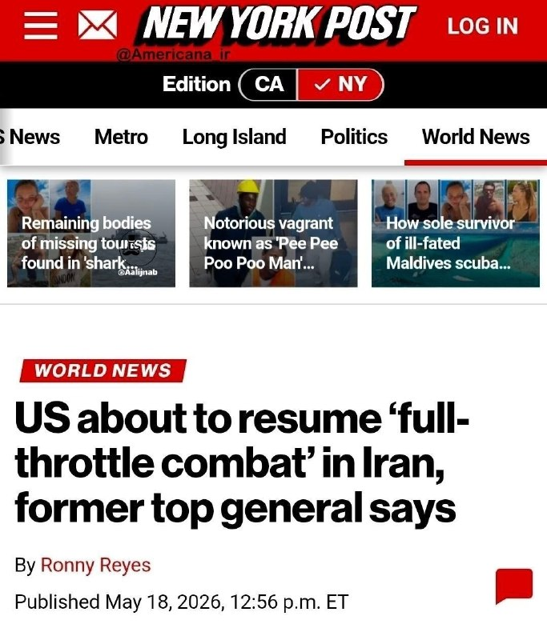

🔴تیتر خبرگزاری نیویورک‌پست:

ایالات متحده در آستانه از سرگیری نبرد با ایران با تمام توان است.

@IranianMinds

## IranianMinds — post 20359

🔴 ترامپ به نیویورک پست :

هیچ امتیازی برای تهران «باز نیست» و ایران می‌داند «به زودی چه اتفاقی قرار است بیفتد».

@IranianMinds

## IranianMinds — post 20358

  

سمت چپ : مدرسه ابتدایی خمینی در موصل عراق ، هدیه جمهوری اسلامی ، سمت راست : کلاس درس بدون سقف یک مدرسه ابتدایی در ایران ...

@IranianMinds

## IranianMinds — post 20357

  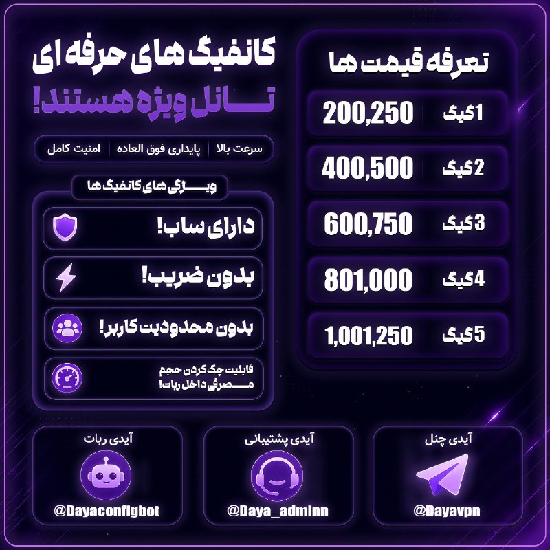

✅ (فقط ۲۰۰ هزار تومن)🥺

🌱 قیمت اقتصادی + پشتیبانی حرفه‌ای

🚀 سریع و پایدار، بدون قطعی
🦋پشتیبانی واقعی، همیشه در دسترس

ربات ما🌴
📩 @dayaconfigbot

کانال ما🌳
📩 @dayavpn

## IranianMinds — post 20356

  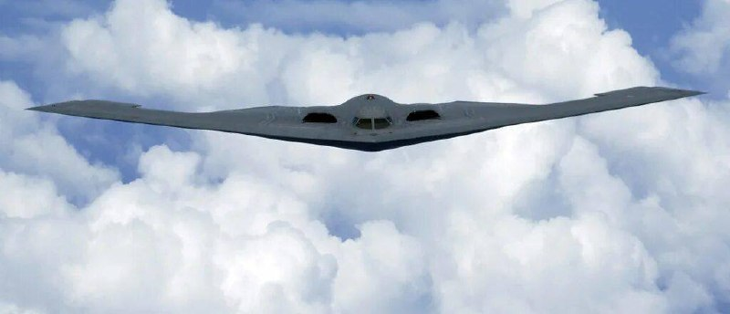

🔴 کانال ۱۲ اسرائیل : آمریکا پیشنهاد جدید و بازنگری شده ایران را رد کرده است. @IranianMinds

## IranianMinds — post 20355

🔴 کانال ۱۲ اسرائیل :

آمریکا پیشنهاد جدید و بازنگری شده ایران را رد کرده است.

@IranianMinds

## IranianMinds — post 20354

ما و جمهوری اسلامی، دوتا هستیم و یکی نخواهیم شد.
سعی بر این است که توسط ابزاری چون “ وحشت از لولوی خارجی ( دشمن ) “ مردم و حکومت را یکی و یکپارچه کنند.
بله وطن ، پایگاه و خانه ای مشترک و کارخانه ای وحدت ساز است اما نه بین مردم و حکومت. ما و این حکومت، هیچ وجه اشتراکی باهم نداریم.
ما و رژیم جمهوری اسلامی، دوتا ایم.

## IranianMinds — post 20353

  

🔴وزیر خزانه‌داری ایالات متحده، مجوزی ۳۰ روزه صادر کرد که به کشورهای آسیب‌پذیر اجازه می‌دهد نفت روسیه‌ای را که در دریا سرگردان مانده است خریداری کنند.
@IranianMinds

## IranianMinds — post 20352

  <a href="telegram/content/IranianMinds_20352_1779128437.mp4">🎬 Download video</a>

🔴افغانی هستی؟
بله.
پس،،،،، ننت😂😂😂

@IranianMinds

## IranianMinds — post 20350

🔴 العربیه: وزیر کشور پاکستان بعد از رد آخرین پیشنهاد ایران توسط آمریکا، دقایقی پیش ایران رو ترک کرد!

@IranianMinds

## IranianMinds — post 20349

🔴ترامپ به العربیه:

کار با عظمتی انجام می‌دهیم و پیروزی پیش روی ما است.

@IranianMinds

## BBCPersian — post 281389

🔻اکسیوس به نقل از مقام آمریکایی: از نظر کاخ سفید پاسخ جدید ایران برای توافق صلح کافی نیست

سایت خبری اکسیوس به نقل از یک مقام بلندپایه آمریکا و یک منبع آگاه گزارش داده است که کاخ سفید پیشنهاد جدید ایران را دریافت کرده است اما به عقیده کاخ سفید این پاسخ برای حصول توافق صلح کافی نیست.

این مقام آمریکایی که نامش ذکر نشده است، به اکسیوس گفت که اگر ایران مواضعش را تغییر ندهد آمریکا مجبور خواهد شد مذاکرات را «از طریق بمباران» ادامه دهد.

به گفته این مقام، پیشنهاد جدید ایران که روز یکشنبه از طریق میانجیگران پاکستانی به آمریکا منتقل شده است، فقط تغییراتی «نمادین و جزئی» با پاسخ قبلی ایران دارد.

در حالی که رسانه‌های ایران گزارش داده‌اند که آمریکا با لغو برخی تحریم‌های نفتی در جریان مذاکرات موافقت کرده است، این مقام آمریکایی گفت که هیچ تحریمی «مجانی» و بدون اقدام متقابل از سوی ایران لغو نخواهد شد.

اکسیوس از این مقام نقل کرده است که «پیشرفت چندانی صورت نگرفته است. به نقطه‌ای بسیار جدی رسیده‌ایم. آنها تحت فشارند که به شکلی درست پاسخ بدهند.»

«وقت آن رسیده است که ایرانی‌ها کمی شیرینی بدهند. ما به گفت‌و‌گویی محکم و با جزئیات (در مورد برنامه هسته‌ای) نیاز داریم. اگر این اتفاق نیفتد از طریق بمباران صحبت خواهیم کرد که واقعا مایه تاسف خواهد بود.»

در همین حال خبرگزاری رویترز از یک مقام بلندپایه ایرانی که نامش ذکر نشده، نقل کرده است که آمریکا مواضعش را در مورد برخی مسائل «نرمتر» کرده است.

این مقام ایرانی به رویترز گفته که آمریکا موافقت کرده است که یک چهارم دارایی‌های توقیف شده ایران به ارزش ده‌ها میلیارد دلار را آزاد کند.

این منبع ایرانی همچنین گفت که آمریکا در مورد اجازه دادن به ایران برای ادامه فعالیت‌های صلح‌آمیز هسته‌ای زیر نظر آژانس بین‌المللی انرژی اتمی انعطاف بیشتری نشان داده است.

https://bbc.in/4wD3mfW
@BBCPersian

## BBCPersian — post 281388

🔻انتشار تصاویری از آموزش کار با اسلحه یا مسابقات آمادگی دفاعی در تجمعات شبانه حامیان جمهوری اسلامی ایران واکنش‌برانگیز شده است. در این تصاویر از غرفه‌هایی در بعضی مساجد و میدان‌ها، کار با سلاح انفرادی به شهروندان، زنان، نوجوانان و حتی کودکان هم آموزش داده می‌شود.

دو روز پیش هم اسلحه به‌دست گرفتن مجریان‌ چند برنامه در صداوسیما و آموزش تلویزیونی کار با سلاح‌های انفرادی انتقادهایی را در بعضی رسانه‌های ایران برانگیخت.

این آموزش‌ها که به سبک درس‌های عملی «آمادگی دفاعی» طرز مسلح کردن و شلیک با سلاح‌های انفرادی را یاد می‌دهد، همزمان با افزایش گمانه‌زنی‌ درباره آغاز دوباره جنگ و عملیات زمینی احتمالی نیروهای متخاصم در خاک ایران است.

گروهی از کاربران در شبکه‌های اجتماعی این آموزش‌ها را «ترویج نظامی‌گری و خشونت در جامعه» دانسته‌اند. بعضی رسانه‌های ایران از جمله روزنامه سازندگی و وبسایت عصر ایران به «پادگان شدن رسانه ملی» انتقاد کرده‌اند.

در مقابل حامیان حکومت این برنامه‌ها را نشانه این دانسته‌اند که «ایران و مردمش بالاترین سطح از اقتدار و آمادگی نظامی» را دارند.

https://bbc.in/4ePspWH
@BBCPersian

## BBCPersian — post 281387

  

🔻سازمان جهانی کار وابسته به سازمان ملل متحد هشدار داد که جنگ در خاورمیانه بر دستمزدها و شرایط کاری تاثیر منفی خواهد داشت و این تاثیر بسیار فراتر از مناطق درگیر جنگ خواهد بود. سازمان جهانی کار اعلام کرد که خاورمیانه و کشورهای حوزه خلیج فارس و منطقه آسیا و اقیانوسیه بیشترین آسیب را خواهند دید که می‌تواند از دوران همه‌گیری کرونا بدتر باشد.

سانگ هورن لی،‌ اقتصاددان ارشد سازمان جهانی کار و نویسنده این گزارش، گفت: «بحران خاورمیانه، فراتر از خسارت انسانی،‌ یک اختلال کوتاه مدت نیست و می‌تواند اثرات طولانی‌مدت داشته باشد که به‌تدریج به تغییر شکل بازارهای کار منجر شود.»

سازمان جهانی کار در گزارشی که امروز منتشر کرد، پیش‌بینی کرد که این جنگ ممکن است به قیمت از دست رفتن میلیون‌ها شغل تمام شود و دنیا شاهد کاهش دستمزد در ادامه امسال و سال آینده میلادی خواهد بود به‌ویژه برای مهاجرانی که به کشورهای خودشان پول می‌فرستند از جمله در جنوب و جنوب شرقی آسیا.

ادامه خبر را از لینک زیر در وبسایت بی‌بی‌سی فارسی بخوانید.

📷 EPA
https://bbc.in/4diJ6bZ
@BBCPersian

## BBCPersian — post 281386

🔻اتحادیه اروپا برخی تحریم‌های سوریه را لغو کرد اما تحریم‌های مرتبط با حکومت اسد را برقرار نگه داشت
اتحادیه اروپا تحریم‌ها علیه افراد و نهادهای مرتبط با حکومت سابق سوریه به رهبری بشار اسد را برای یک سال دیگر تمدید کرد اما همزمان به برخی از تحریم‌های حکومت فعلی سوریه، پایان داد.

رفع تحریم‌ها شامل هفت نهاد سوری است، از جمله وزارتخانه‌های دفاع و کشور.

اتحادیه اروپا اعلام کرده که این تصمیم با هدف تقویت تعامل اتحادیه اروپا با سوریه انجام شده است.

اتحادیه اروپا یک سال پیش تمامی تحریم‌های اقتصادی علیه سوریه را با هدف «حمایت از گذار مسالمت‌آمیز و فراگیر این کشور، بهبود وضعیت اجتماعی-اقتصادی و بازسازی» لغو کرد و تحریم‌های مرتبط با حکومت بشار اسد را برقرار نگه داشت.

اتحادیه اروپا در بیانیه‌ای گفت که «بر این باور است که شبکه‌های وابسته به رژیم پیشین اسد همچنان نفوذ خود را حفظ کرده‌اند و خطر تضعیف روند گذار سیاسی و مانع‌تراشی در مسیر آشتی ملی و پاسخ‌گویی را به همراه دارند.»

اتحادیه اروپا اولین بار در سال ۲۰۱۱ و در واکنش به سرکوب خشونت‌آمیز غیرنظامیان از سوی حکومت اسد، تحریم‌هایی را علیه سوریه اعمال کرده بود.

https://bbc.in/4ukERmj
@BBCPersian

## BBCPersian — post 281385

  

🔻استاندار خراسان جنوبی از افزایش شدید میزان واردات از افغانستان به ایران از زمان آغاز جنگ آمریکا و اسرائیل با ایران خبر داد.

به گزارش ایرنا، محمدرضا هاشمی گفت که از ابتدای جنگ اخیر میزان واردات از افغانستان به خراسان جنوبی از مسیر گذرگاه مرزی ماهیرود به فراه «۸۴۶ درصد» و از نظر ارزش دلاری ۴۴۱ درصد افزایش داشته است.

به گزارش بی‌بی‌سی دری، به گفته وزارت صنعت و تجارت حکومت طالبان، «پنبه، پیاز، انجیر، زعفران، نوشابه، گیاه‌های طبی و مواد معدنی» از مهمترین اقلام صادراتی افغانستان به ایران است و در مقابل، «نفت و گاز، مواد ساختمانی، فرش، مواد خوراکی، وسایل الکترونیک و انواع شوینده‌ها» از مهمترین کالاهای صادراتی ایران به افغانستان است.

حسین زارعی،‌ مدیرعامل منطقه ویژه اقتصادی خراسان جنوبی، هم به خبرگزاری ایرنا گفت که خدمات مرزی قبلا تا ساعت ۱۶ انجام می‌شد اما با افزایش حجم مراجعه و فعالیت‌ تجاری،‌ ساعت کار خدمات مرزی به ساعت ۱۰ حتی ۱۱ شب افزایش پیدا کرد و همین باعث افزایش قابل توجه میزان صادرات و واردات شده است.

📷 AFP via Getty Images
https://bbc.in/4uOLJbc
@BBCPersian

## Dirty_Kids — post 389696

رادان گفته: از وقتی جنگ شروع شده 6500نفرو دستگیر کردیم، بازم میکنیم..

شش هزار و پانصد بار کُص ننت🖕

‌

@Dirty_Kids 👻

## Dirty_Kids — post 389695

  <a href="telegram/content/Dirty_Kids_389695_1779128440.mp4">🎬 Download video</a>

خیلی تاثیرگذار بود
آخرش قشنگ تموم شد

+ خیلی منطقی عربستان و پاکستان با خودشون جمع میبندن:)))) امروز پاکستان نیرو فرستاده عربستان واسه مقابله احتمالی

@Dirty_Kids 👻

## Dirty_Kids — post 389694

  

به بابات بگو هرکی صحبت از خایه کرد اشکال نداره ولی تو یکی گوه نخور…

@Dirty_Kids 👻

## Dirty_Kids — post 389693

  

چجوری تو هوای روشن پیتزا میخورین؟!
بابا یه سری غذاها مال روشناییه یه سریاش مال تاریکی.

@Dirty_Kids 👻

## Dirty_Kids — post 389692

  <a href="telegram/content/Dirty_Kids_389692_1779128443.mp4">🎬 Download video</a>

انتقاد تند همشهری به سریال «تهران کنارت»

بچه جون بزرگترات مجوز دادن چون اوضاع‌ خیته، اسکل تو خیابون مجوز عرقخوری هم دادن به پرستوهاتون:))))

به خودتم مجوز دادن که بیای انتقاد کنی که مثلا قشر خرمذهبی رو راضی کنی و همچنین این فیلم‌رو وایرال کنی ذهن‌هارو منحرف کنی از فلاکت مملکت

ولی این وسط توئیت سوگند عالی بود، ندیده بودم

@Dirty_Kids 👻

## Dirty_Kids — post 389691

✖️ سایت بین المللی bet120x 
✖️  
👍دارای مجوز رسمی Gambling Judge سوئد
👍       
💳شارژ حساب از طریق ارز و یووچر و پرمیوم ووچر 
💳تسویه حساب دلاری سریع 💊بیمه شرط میکس 
⚠️فروش شرط 
🔔ویرایش شرط                    
3️⃣
2️⃣ 
🎁20%هدیه واریز از طریق ارز و ووچر ┅━━━━━━━━━━━…

## Dirty_Kids — post 389690

  

✖️ سایت بین المللی bet120x 
✖️

 
👍دارای مجوز رسمی Gambling Judge سوئد
👍
     

💳شارژ حساب از طریق ارز و یووچر و پرمیوم ووچر

💳تسویه حساب دلاری سریع
💊بیمه شرط میکس

⚠️فروش شرط

🔔ویرایش شرط                    
3️⃣
2️⃣

🎁20%هدیه واریز از طریق ارز و ووچر
┅━━━━━━━━━━━

🎁 10%برگشت باخت به صورت روزانه

🎁 10%برگشت باخت به صورت هفتگی

🎁10%برگشت باخت به صورت ماهانه

💻ادرس ورود به سایت:
https://bet120x.com/fa/?btag=971470
➖➖➖➖➖
   
👈 آموزش واریز و برداشت دلاری
👉

🔪کانال اطلاع رسانی:
👇

✈️https://t.me/+1Wv5nGY_a54xNzlk

## Dirty_Kids — post 389689

  <a href="telegram/content/Dirty_Kids_389689_1779128446.mp4">🎬 Download video</a>

حکومتی‌ها پرچم مبارزه با امریکا رو بلند میکنن ولی تا خشتک امریکایی هستن و کمک به اقتصاد امریکا میکنن

@Dirty_Kids 👻

## Dirty_Kids — post 389688

  

شورتش کو :))))))
#تراپی

@Dirty_Kids 👻

## Dirty_Kids — post 389687

  

🌪وقتی اینترنت طوفانیه... کافیه بادبان ها رو بکشی تا

⚫️با بالاترین کیفیت ممکن
⚡️ 

⚫️100 هزار تومان شارژ هدیه 
🎁

⚫️پایین ترین قیمت گیگی 250
🌐 

⚫️و ارائه پورسانت %10 در ازای هر معرفی
💼

بتونی یه اتصال پایدار با پشتیبانی 24 ساعته داشته باشی
🚀

بادبان راهتو باز می‌کنه
⛵️

G28

🛡@BadBan_VPN | کانال 

🤖@BadBan_VPNBot | ربات 

📞@BadBan_VPNSupport | پشتیبانی

## Hranews — post 113019

اعتراضات دی‌ماه؛ تداوم بازداشت و بی‌خبری از سرنوشت آسو کیخسروی، نوجوان ۱۷ ساله

❗️
❗️
❗️
❗️
❗️– آسو کیخسروی، نوجوان ۱۷ ساله که در جریان اعتراضات دی ۱۴۰۴ در جوانرود بازداشت شده است، همچنان در بلاتکلیفی به‌سر می‌برد. بی‌خبری از سرنوشت وی علیرغم گذشت بیش از چهار ماه از زمان بازداشت، منجر به افزایش نگرانی‌های خانواده وی شده است.

ادامه مطلب

#آسو_کیخسروی #اعتراضات۱۴۰۴ #اعتراضات_بازار

↘️
@hranews_bot تماس ✉️ - @Hranews کانال هرانا 🆑

## Hranews — post 113018

گزارشی از معوقات مزدی کارگران معدن زغال‌سنگ هشونی کرمان

❗️
❗️
❗️
❗️
❗️– جمعی از #کارگران معدن زغال‌سنگ هشونی کرمان از عدم دریافت دستمزد و معوقات مزدی فروردین‌ماه خود خبر دادند.

ادامه مطلب

↘️
@hranews_bot تماس ✉️ - @Hranews کانال هرانا 🆑

## configx2ray — post 39016

فروش مجدد سرور اختصاصی 3 گیگابایتی قیمت با بیشترین تخفیف تقدیم میشه 490 هزار تومان
❤️

سرور کاملا تضمینی میباشد بدونه ضریب همراه با ساب جهت استعلام حجم مصرفیتون
🌟

سرور ها بدونه هیچ گونه ضریب می‌باشند 
❤️

مدت زمان سرور ها نامحدود میباشد محدودیت زمانی ندارند 
👍

نیاز داشتید میتونید به ایدی زیر پیام بدید
⭐️ :

ID : https://t.me/servrfast2 
💠

## configx2ray — post 39015

95.38.201.199
5.144.129.174
37.191.76.110
81.12.72.218
80.191.243.226
79.175.169.59
5.160.13.85
185.137.25.214

آیپی های تست شده برای متود جدید سایفون
❤️

همشو باهم وارد کنید داخل برنامه 
🔥

Channel : https://t.me/ConfigX2ray

## manototv — post 105608

  <a href="telegram/content/manototv_105608_1779128448.mp4">🎬 Download video</a>

تماسی از ایران:
از سیروان شعبانی، ۲۲ ساله از اسلامشهر گفت…
استاد موسیقی که نوزدهم دی بازداشت شد و حالا در اوین است

## manototv — post 105607

  <a href="telegram/content/manototv_105607_1779128450.mp4">🎬 Download video</a>

دونالد ترامپ، رئیس‌جمهوری آمریکا، در گفت‌وگو با نیویورک پست اعلام کرد پس از دریافت تازه‌ترین پاسخ «ناامیدکننده» جمهوری اسلامی در مذاکرات مربوط به توافق صلح، «برای هیچ‌گونه امتیازدهی به تهران آمادگی ندارد.»

ترامپ همچنین در اظهاراتی هشدارآمیز گفت جمهوری اسلامی می‌داند «به‌زودی چه اتفاقی قرار است بیفتد.»

او در این گفت‌وگوی کوتاه تلفنی، به نظر می‌رسید پیشنهاد جمهوری اسلامی برای ادامه مذاکرات دیپلماتیک، که روز یکشنبه مطرح شده بود، را رد کرده است.

ترامپ در پاسخ به سوالی درباره اظهارات روز جمعه‌اش مبنی بر آمادگی برای پذیرش توقف ۲۰ ساله غنی‌سازی اورانیوم در ایران گفت: «در حال حاضر برای هیچ چیزی آمادگی ندارم.»

رئیس‌جمهوری آمریکا از ارائه جزئیات بیشتر خودداری کرد و گفت: «واقعاً نمی‌توانم درباره‌اش صحبت کنم. اتفاقات زیادی در حال رخ دادن است.»

بر اساس این گزارش، ترامپ پس از بازگشت از سفرش به چین، آخر هفته را در باشگاه گلف خود در ویرجینیا همراه با تیم امنیت ملی آمریکا به بررسی گام‌های بعدی درباره جمهوری اسلامی گذرانده است.

نیویورک پست نوشت انتظار می‌رود نشست‌های بیشتری روز سه‌شنبه برگزار شود؛ در حالی که برخی متحدان تندرو ترامپ، از جمله لیندسی گراهام، سناتور جمهوری‌خواه، از او خواسته‌اند با متوقف شدن روند دیپلماسی، عملیات نظامی علیه جمهوری اسلامی را از سر بگیرد.

ترامپ همچنین گفت از تهران «ناامید» نشده، اما تاکید کرد جمهوری اسلامی به‌خوبی می‌داند آمریکا توان وارد کردن «فشار و آسیب بیشتر» را دارد.

او گفت: «می‌توانم بگویم آن‌ها بیشتر از هر زمان دیگری می‌خواهند توافق کنند، چون می‌دانند ما… چه اتفاقی قرار است به‌زودی بیفتد.»

ترامپ در پاسخ به سوالی درباره گزارش‌هایی مبنی بر تلاش جمهوری اسلامی برای «وقت‌کشی» در موضوع هسته‌ای و بازگشایی تنگه هرمز گفت چنین چیزی نشنیده است.

او افزود: «چیزی نمی‌شنوم. نمی‌توانم درباره‌اش با شما صحبت کنم.»

ترامپ در پایان گفت: «این یک مذاکره است. نمی‌خواهم احمق باشم.»

## manototv — post 105606

  <a href="telegram/content/manototv_105606_1779128451.mp4">🎬 Download video</a>

تماسی از ایران:
« از جاویدنام علی اباذری می‌گفت…
با گذشت ماه‌ها، درد هنوز تازه‌ست؛ انگار همین دیروز اتفاق افتاده.»

## manototv — post 105605

  <a href="telegram/content/manototv_105605_1779128452.mp4">🎬 Download video</a>

ایرانیان مقیم مادرید امروز دوشنبه ۱۸ می، مقابل سفارت نروژ در پایتخت اسپانیا تجمع کردند. این تجمع در اعتراض به دیدار برخی سیاستمداران نروژی با مقام‌های جمهوری اسلامی و در حمایت از شاهزاده رضا پهلوی برگزار شد.

معترضان خواستار پایان دادن به مماشات با جمهوری اسلامی و شنیده شدن صدای مردم ایران شدند.

## manototv — post 105604

  <a href="telegram/content/manototv_105604_1779128454.mp4">🎬 Download video</a>

‌
داده‌های ردیابی پروازها نشان می‌دهد انتقال هوایی تجهیزات و نیروهای نظامی آمریکا به خاورمیانه همچنان ادامه دارد.

بر اساس گزارش الجزیره از داده‌های پروازی، دست‌کم ۲۶ پرواز نظامی آمریکا بین ۱۵ تا ۱۷ مه از آلمان به مقصد خاورمیانه انجام شده است.

این گزارش می‌گوید این جابه‌جایی‌ها همزمان با افزایش حضور نظامی آمریکا در اطراف تنگه هرمز، دریای عمان و دریای عرب انجام شده است.

بر اساس داده‌های ردیابی، تمام پروازهای ثبت‌شده با هواپیماهای نظامی «بوئینگ سی-۱۷ اِی گلوب‌مستر ۳» انجام شده‌اند؛ هواپیماهای ترابری سنگینی که نیروی هوایی آمریکا از آن‌ها برای انتقال نیرو و تجهیزات نظامی استفاده می‌کند.

## manototv — post 105603

  <a href="telegram/content/manototv_105603_1779128454.mp4">🎬 Download video</a>

‌
وزارت خزانه‌داری آمریکا اعلام کرد مجوزی عمومی و موقت ۳۰ روزه صادر کرده تا «آسیب‌پذیرترین کشورها» بتوانند به‌طور موقت به نفت روسیه‌ای که در دریا سرگردان مانده، دسترسی پیدا کنند.

وزارت خزانه‌داری آمریکا گفت این تمدید «انعطاف‌پذیری بیشتری» فراهم می‌کند و واشینگتن در صورت نیاز، مجوزهای مشخص‌تری نیز برای این کشورها صادر خواهد کرد.

در این بیانیه آمده است این مجوز عمومی به «ثبات بازار فیزیکی نفت خام» کمک می‌کند و تضمین می‌کند نفت به کشورهایی برسد که بیشترین آسیب‌پذیری را در حوزه انرژی دارند.

وزارت خزانه‌داری آمریکا همچنین اعلام کرد این اقدام با کاهش توانایی چین برای انبار کردن نفت ارزان‌قیمت، به هدایت دوباره عرضه موجود به سمت کشورهای نیازمند کمک خواهد کرد.

## manototv — post 105602

  <a href="telegram/content/manototv_105602_1779128455.mp4">🎬 Download video</a>

‌
نهاد« مدیریت آبراه خلیج فارس» با راه‌اندازی حساب کاربری در شبکه ایکس اعلام کرد عبور کشتی‌ها از تنگه هرمز بدون دریافت مجوز از این نهاد «غیرقانونی» خواهد بود.

این نهاد که با نام PGSA معرفی شده، در بیانیه‌ای نوشت تردد در محدوده‌های تعیین‌شده در تنگه هرمز باید با هماهنگی کامل با نیروهای مسلح و مقام‌های جمهوری اسلامی انجام شود.

در این بیانیه آمده است: «عبور بدون مجوز، غیرقانونی تلقی خواهد شد.»

## alonews — post 120929

  <a href="telegram/content/alonews_120929_1779128456.jpg">🎬 Download video</a>

👈خبرآنلاین: برخی شواهد نشان می‌دهد کشورهای عربی در کنار ترامپ در حال لابی گسترده علیه جمهوری اسلامی در چین هستند.

🔴این کشورها به چین قول داده‌اند نفت آن کشور را تامین کرده و کالاهای صادراتی آن را به قیمت‌های بالاتر و نامتعارف خریداری کنند.

✅ @AloNews خبر جنگ

## alonews — post 120928

  <a href="telegram/content/alonews_120928_1779128456.mp4">🎬 Download video</a>

👈 یک زوج حامی حکومت در برنامه صداوسیما اعلام کردند مهریه عروس یک «پهپاد شاهد» تعیین شده است.

🔴در این برنامه تلویزیونی، داماد گفت امیدوار است این پهپاد «به قلب اسرائیل اصابت کند.»

این اظهارات در حالی مطرح شد که در هفته‌های اخیر، استفاده نمادین از پهپادها و تجهیزات نظامی در تجمع‌ها و برنامه‌های رسانه‌ای جمهوری اسلامی افزایش یافته است.

✅ @AloNews خبر جنگ

## alonews — post 120925

  <a href="telegram/content/alonews_120925_1779128457.jpg">🎬 Download video</a>

👈روز گذشته در غرب جزیره هرمز یک نفتکش در حال نشت مشاهده شد

✅ @AloNews خبر جنگ

## alonews — post 120924

  <a href="telegram/content/alonews_120924_1779128457.jpg">🎬 Download video</a>

👈حزب‌الله: یک جنگندهٔ اسرائیلی را با موشک زمین به هوا هدف قرار دادیم

✅ @AloNews خبر جنگ

## alonews — post 120923

  

👈تیتر نیویورک پست:
ایالات متحده در آستانه از سرگیری نبرد با ایران با تمام توان است!

✅ @AloNews خبر جنگ

## alonews — post 120922

  <a href="telegram/content/alonews_120922_1779128458.jpg">🎬 Download video</a>

👈ترامپ: از دست تهران «کلافه» نیستم

✅ @AloNews خبر جنگ

## alonews — post 120921

  <a href="telegram/content/alonews_120921_1779128458.jpg">🎬 Download video</a>

👈وقتی از ترامپ در مورد ادعای منابع منطقه‌ای مبنی بر اینکه ایران سعی دارد در هر دو موضوع هسته‌ای و بازگشایی تنگه هرمز، واشنگتن را «خسته کند»، سوال شد، ترامپ گفت: «این را نشنیده‌ام».

🔴او گفت: «نمی‌توانم در این مورد با شما صحبت کنم.»

🔴ترامپ افزود «این یک مذاکره است. من نمی‌خواهم احمق باشم.»

✅ @AloNews خبر جنگ

## alonews — post 120920

  <a href="telegram/content/alonews_120920_1779128458.jpg">🎬 Download video</a>

👈وقتی از ترامپ در مورد اظهار نظر جمعه‌اش مبنی بر اینکه حاضر است مهلت ۲۰ ساله برای غنی‌سازی اورانیوم ایران را بپذیرد، سوال شد، ترامپ در میان صحبت ادعا کرد: «من الان اماده پذیرش هیچ چیزی نیستم.»

✅ @AloNews خبر جنگ

## alonews — post 120919

  

👈ترامپ به نیویورک پست : ایران می‌دونه که به زودی چه اتفاقی براش میوفته، هیچ امتیازی داده نخواهد شد

✅ @AloNews خبر جنگ

## alonews — post 120918

  <a href="telegram/content/alonews_120918_1779128459.jpg">🎬 Download video</a>

👈سنتکام: تا الان 85کشتی تجاری رو برگردوندیم

✅ @AloNews خبر جنگ

## alonews — post 120917

  <a href="telegram/content/alonews_120917_1779128459.jpg">🎬 Download video</a>

👈شاخص صف پمپ بنزین تو ایران رفت بالا

✅ @AloNews خبر جنگ

## alonews — post 120916

  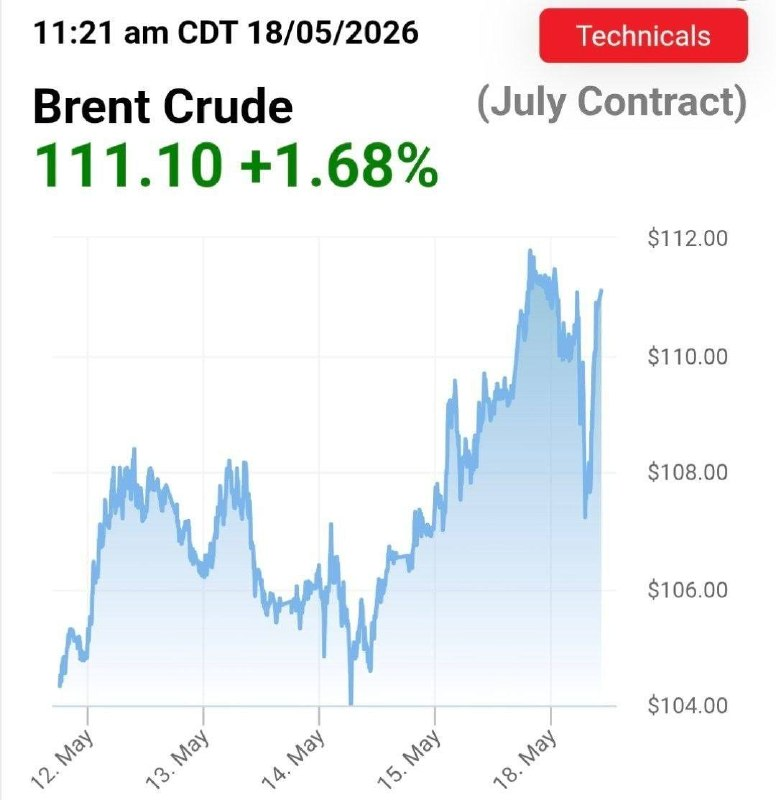

👈آخرین قیمت نفت ۱۱۱.۱۰ دلار

✅ @AloNews خبر جنگ

## alonews — post 120915

  <a href="telegram/content/alonews_120915_1779128460.jpg">🎬 Download video</a>

👈وزیر خزانه داری آمریکا: مجوز موقت 30 روزه برای خرید نفت روسیه صادر شد

✅ @AloNews خبر جنگ

## alonews — post 120914

  <a href="telegram/content/alonews_120914_1779128460.jpg">🎬 Download video</a>

👈آکسیوس: بمب‌ها مذاکره خواهند کرد

✅ @AloNews خبر جنگ

## alonews — post 120913

  <a href="telegram/content/alonews_120913_1779128460.jpg">🎬 Download video</a>

👈جلسه کابینه امنیتی اسرائیل، با نتانیاهو دقایقی پیش شروع شد

✅ @AloNews خبر جنگ

## alonews — post 120912

  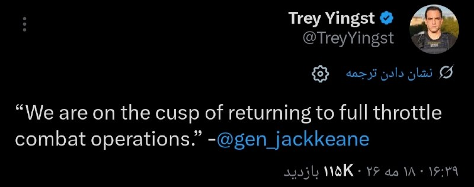

👈تری یینگست، خبرنگار فاکس‌ :
- ما تو آستانه بازگشت به عملیات‌های رزمی تمام‌عیار هستیم

✅ @AloNews خبر جنگ

## alonews — post 120911

  <a href="telegram/content/alonews_120911_1779128461.jpg">🎬 Download video</a>

👈وزیر کشور پاکستان که در سفری دو روزه برای آخرین میانجیگری میان ایران و آمریکا به تهران سفر کرده بود، پس از رد آخرین پیشنهاد ایران توسط آمریکا، دقایقی پیش تهران را ترک کرد.

✅ @AloNews خبر جنگ

## alonews — post 120910

  <a href="telegram/content/alonews_120910_1779128461.jpg">🎬 Download video</a>

🔴فوری / کاخ سفید: آخرین پیشنهاد ایران که امروز ارائه شد نیز به دلیل ناکافی‌ بودن به صورت کامل رد شد، دیگر بمب ها مذاکره خواهند کرد

✅ @AloNews خبر جنگ

---
📅 بروزرسانی: 1405/02/28 19:50
---

## VahidOOnLine — post 240823

  

مستند «تمرین‌هایی برای یک انقلاب» ساخته پگاه آهنگرانی در حاشیه جشنواره فیلم کن، جایزه ویژه هیئت داوران رویداد مستند «گلدن گلوبز» با همکاری بنیاد «آرتمیس رایزینگ» را دریافت کرد؛ رویدادی که با همکاری بخش «کن داکس»، مجله ورایتی و بازار فیلم کن برگزار می‌شود.

این برنامه به مستندهای اجتماعی و سیاسی اختصاص دارد و برگزارکنندگان آن می‌گویند هدفش حمایت از فیلمسازی مستند به‌عنوان ابزاری برای شکل دادن به روایت‌ها و گفت‌وگوهای جهانی است.
‌🏁 🇬🇧 IranintlTV

🤖 @VahidOOnLine

## VahidOOnLine — post 240822

  

♦️حسین کرمان‌پور، مدیر مرکز روابط عمومی و اطلاع‌رسانی وزارت بهداشت، روز دوشنبه در یک گردهمایی دولتی اعلام کرد در جریان بمباران پاستور در روز دهم اسفند ماه، « اتفاق خاصی» برای مجتبی خامنه‌ای نیفتاده و او «جانباز یا قطع عضو» نشده است.
کرمان‌پور گفت: «دوستان شنیده‌اند و بارها نیز گفته‌ایم. اقدامات لازم انجام شد. خوشبختانه اتفاق خاصی برای رهبر انقلاب نیفتاده بود. فردی که در محل چنین حادثه‌ای باشد، طبیعتا چندین زخم بر روی بدن خود خواهد داشت.
این مقام وزارت بهداشت بدون اشاره به اخبار مبنی بر سوختی و قطع عضو رهبر جدید جمهوری اسلامی ادامه داد: «این زخم‌ها نیز زخم‌هایی نبود که بخواهد چهره رهبر انقلاب را مخدوش کند یا اینکه همانند امام شهید ما جانبازی بگیرند یا قطع عضو داشته باشند.»

کرمان‌پور در ادامه ادعاهای خود گفت: «چند تا بخیه در محل جراحات زده شد. بخشی که همانجا تصمیم گرفته شد که بخیه زده شود روی پای ایشان بود.»

پیشتر، روزنامه نیویورک تایمز با استناد به گزارش تحقیقی فرناز فصیحی اعلام کرده بود، مجتبی خامنه‌ای در پی آسیب‌دیدگی جدی از ناحیه پا در انتظار دریافت پای مصنوعی است و به دلیل سوختگی‌های شدید، در تکلم نیز با دشواری جدی روبه‌روست؛ وضعیتی که باعث شده او عملا در مخفی‌گاه و به دور از دید عموم، تنها از طریق پیام‌های کتبی با دنیای بیرون در ارتباط باشد.
‌🇸🇦 Indypersian

🤖 @VahidOOnLine

## VahidOOnLine — post 240821

  

اکسیوس به نقل از یک مقام ارشد آمریکایی و یک منبع مطلع گزارش داد تهران پیشنهاد تازه‌ای برای توافق به‌منظور پایان جنگ ارائه کرده، اما کاخ سفید این پیشنهاد را پیشرفت معناداری نمی‌داند و آن را برای دستیابی به توافق کافی ارزیابی نکرده است.

به گفته مقام‌های آمریکایی، دونالد ترامپ همچنان خواهان توافق برای پایان جنگ است، اما به‌دلیل رد بسیاری از خواسته‌های واشینگتن از سوی تهران و خودداری جمهوری اسلامی از ارائه امتیازهای قابل‌توجه در برنامه هسته‌ای، گزینه ازسرگیری حملات نظامی را نیز بررسی می‌کند.
‌🏁 🇬🇧 IranintlTV

🤖 @VahidOOnLine

## VahidOOnLine — post 240820

  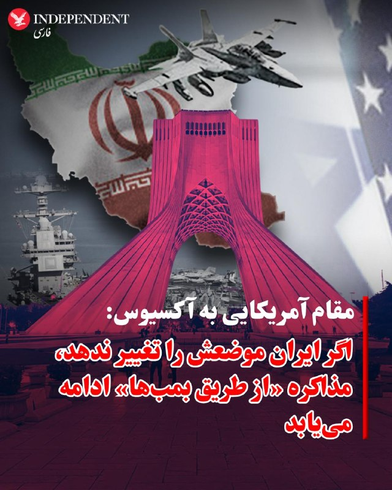

♦️رسانه آکسیوس به نقل از یک مقام آمریکایی گزارش کرد، اگر تهران مواضع خود را در مذاکرات تغییر ندهد، واشنگتن ناچار خواهد شد گفتگوها را «از طریق بمب‌ها» ادامه دهد.

آکسیوس به نقل از این مقام کاخ سفید که نامش فاش نشده نوشت زمان آن رسیده که طرف ایرانی چیزی فراتر از امتیازهای نمادین روی میز بگذارند: «ما به گفتگویی واقعی، جدی و جزئی‌نگر درباره برنامه هسته‌ای نیاز داریم. اگر چنین چیزی اتفاق نیفتد، گفتگو از طریق بمب‌ها انجام خواهد شد و این تأسف‌بار خواهد بود.»

مقام آمریکایی به آکسیوس گفت، ارائه پیشنهاد متقابل تازه از سوی ایران، با وجود تغییرات محدود در آن، نشان می‌دهد تهران نسبت به احتمال اقدام نظامی بیشتر از سوی آمریکا نگران است. او گفت فشار اکنون بر ایران است تا پاسخی ارائه دهد که بتواند مسیر مذاکرات را تغییر دهد.

به گفته این مقام آمریکایی، ارائه پیشنهاد متقابل تازه از سوی ایران، با وجود تغییرات محدود، نشان می‌دهد تهران نسبت به احتمال اقدامات نظامی بیشتر از سوی آمریکا نگران است.
‌🇸🇦 Indypersian

🤖 @VahidOOnLine

## VahidOOnLine — post 240819

  <a href="telegram/content/VahidOOnLine_240819_1779121203.mp4">🎬 Download video</a>

♦️محسن نقوی، وزیر کشور پاکستان، عصر دوشنبه ۲۸ اردیبهشت‌ماه در تهران با عباس عراقچی، وزیر خارجه جمهوری اسلامی، دیدار و گفتگو کرد.

بر اساس گزارش رسمی رسانه‌های ایران، دو طرف درباره روابط دوجانبه، تحولات منطقه‌ای و گسترش همکاری‌های مرزی گفتگو کردند. همچنین اسکندر مومنی، وزیر کشور جمهوری اسلامی و محسن نقوی بر تقویت روابط دو کشور و توسعه مبادلات مرزی تاکید کردند.

در این دیدار درباره اوضاع منطقه نیز بحث و تبادل نظر شد. این دومین دیدار مقام‌های ارشد دو کشور در دو روز گذشته است.

وزیر کشور پاکستان در سفر خود به تهران با مسعود پزشکیان، رئیس‌جمهوری اسلامی ایران، و محمدباقر قالیباف، رئیس مجلس شورای اسلامی نیز دیدار کرده است.
‌🇸🇦 Indypersian

🤖 @VahidOOnLine

## VahidOOnLine — post 240818

  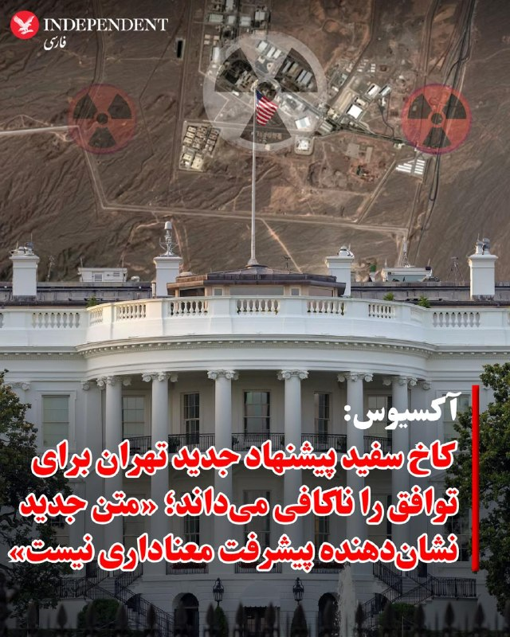

♦️ رسانه آکسیوس، روز دوشنبه ۲۸ اردیبهشت ماه، به نقل از یک مقام ارشد آمریکایی و یک منبع آگاه گزارش داد واشنگتن پیشنهاد به‌روز شده‌ تهران برای توافق پایان جنگ را دریافت کرده است، اما کاخ سفید معتقد است این پیشنهاد، «پیشرفت معناداری نیست و برای یک توافق کافی نیست».
بر اساس این گزارش، نسخه جدید شامل توضیحات بیشتری درباره تعهد ایران به دنبال نکردن سلاح هسته‌ای است، اما همچنان فاقد تعهدات مشخص درباره توقف غنی‌سازی اورانیوم یا واگذاری ذخایر کنونی اورانیوم با غنای بالا است: «این پیشنهاد جدید شامل کلمات بیشتری در مورد تعهد ایران به عدم پیگیری سلاح هسته‌ای است، اما هیچ تعهد دقیقی در مورد تعلیق غنی‌سازی اورانیوم یا تحویل ذخایر موجود اورانیوم با غنای بالا ارائه نمی‌دهد.»
در حالی که رسانه‌های حکومتی جمهوری اسلامی از موافقت ایالات متحده برای لغو برخی تحریم‌های نفتی علیه ایران در طول مذاکرات گزارش داده‌اند، آکسیوس به نقل از مقام آمریکایی نوشت: «هیچ کاهش تحریمی بدون اقدام متقابل ایران «رایگان» اتفاق نخواهد افتاد.»
آکسیوس همچنین نوشت کاخ سفید این پیشنهاد را برای دستیابی به توافق کافی نمی‌داند و معتقد است پیشرفت قابل‌توجهی در مذاکرات حاصل نشده است.
‌🇸🇦 Indypersian

🤖 @VahidOOnLine

## VahidOOnLine — post 240817

  <a href="telegram/content/VahidOOnLine_240817_1779121205.mp4">🎬 Download video</a>

تماسی از ایران:
«خانواده‌های بچه‌های دربند رو برای کمک‌رساندن دریابیم»
‌🏁 🇬🇧 ManotoTV

🤖 @VahidOOnLine

## VahidOOnLine — post 240816

  <a href="telegram/content/VahidOOnLine_240816_1779121207.mp4">🎬 Download video</a>

عفو بین‌الملل اعلام کرد شمار اعدام‌ها در جهان در سال ۲۰۲۵ به بالاترین سطح ثبت‌شده در ۴۴ سال گذشته رسیده و ایران با ثبت دست‌کم ۲۱۵۹ اعدام، عامل اصلی این افزایش بوده است.

بر اساس گزارش سالانه این سازمان، در مجموع دست‌کم ۲۷۰۷ نفر در ۱۷ کشور اعدام شده‌اند؛ آماری که نسبت به سال ۲۰۲۴ حدود ۷۸ درصد افزایش نشان می‌دهد.

عفو بین‌الملل اعلام کرد شمار اعدام‌ها در ایران بیش از دو برابر سال گذشته شده و ایران پس از چین، که آمار رسمی اعدام‌هایش منتشر نمی‌شود، در صدر کشورهای مجری اعدام قرار دارد.

در این گزارش آمده است عربستان سعودی با دست‌کم ۳۵۶ اعدام در رتبه بعدی قرار گرفته و بخش قابل توجهی از این احکام به جرایم مرتبط با مواد مخدر مربوط بوده است.

بر اساس این گزارش، آمریکا نیز شمار اعدام‌های خود را از ۲۵ مورد در سال ۲۰۲۴ به ۴۷ مورد در سال ۲۰۲۵ افزایش داده است. شمار اعدام‌ها در مصر، سنگاپور و کویت نیز نسبت به سال قبل افزایش یافته است.

عفو بین‌الملل همچنین اعلام کرد چین، مصر، جمهوری اسلامی، عراق، کره شمالی، عربستان سعودی، سومالی، آمریکا، ویتنام و یمن در پنج سال گذشته به‌طور مداوم اعدام انجام داده‌اند.
‌🏁 🇬🇧 ManotoTV

🤖 @VahidOOnLine

## VahidOOnLine — post 240815

  

مدیر مرکز روابط عمومی و اطلاع‌رسانی وزارت بهداشت درباره وضعیت مجتبی خامنه‌ای گفت: «اتفاق خاصی برای او رخ نداده بود و صرفا چند زخم برداشته بودند.»
این مقام وزارت بهداشت تاکید کرد: «زخم‌ها از نوعی نبودند که چهره ایشان را مخدوش کنند» و اضافه کرد مجتبی خامنه‌ای جانباز نشده و قطع عضو نداشته و تنها در محل جراحت روی پای او چند بخیه زده شده است.
‌🏁 🇬🇧 IranintlTV

🤖 @VahidOOnLine

## VahidOOnLine — post 240814

  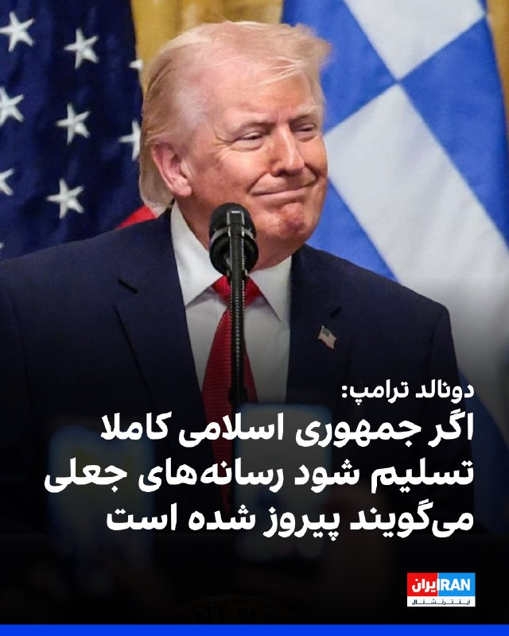

دونالد ترامپ، رییس‌جمهور آمریکا در پستی در شبکه اجتماعی تروث سوشال از برخی رسانه‌ها و دموکرات‌ها در زمینه جنگ علیه جمهوری اسلامی انتقاد کرد.

او نوشت: «اگر ایران تسلیم شود، اعتراف کند که نیروی دریایی‌اش نابود شده و در کف دریا آرام گرفته است، و نیروی هوایی‌اش دیگر در میان ما نیست، و اگر کل ارتش آن‌ها در حالی که سلاح‌ها را زمین گذاشته و دست‌ها را بالا برده‌اند از تهران خارج شوند و هر کدام با فریاد "من تسلیم می‌شوم، من تسلیم می‌شوم" پرچم سفید تسلیم را به شدت تکان دهند، و اگر تمام رهبری باقی‌مانده آن‌ها همه «اسناد تسلیم» لازم را امضا کنند و شکست خود را در برابر قدرت و نیروی عظیم ایالات متحده باشکوه بپذیرند، آن‌وقت روزنامه شکست‌خورده نیویورک تایمز، چاینا استریت ژورنال (همان وال‌استریت ژورنال!)، سی‌ان‌انِ فاسد و اکنون بی‌اهمیت، و همه اعضای دیگر رسانه‌های اخبار جعلی (فیک نیوز)، تیتر خواهند زد که ایران یک پیروزی استادانه و درخشان بر ایالات متحده آمریکا داشته و اصلاً حتی نزدیک هم نبوده است.»

ترامپ افزود: «دموکرات‌های احمق و رسانه‌ها کاملا راه خود را گم کرده‌اند. آن‌ها کاملا دیوانه شده‌اند!!!»
‌🏁 🇬🇧 IranintlTV

🤖 @VahidOOnLine

## VahidOOnLine — post 240813

  

♦️لیندزی گراهام، سناتور جمهوری‌خواه آمریکا، روز دوشنبه ۲۸ اردیبهشت‌ماه در پیامی در شبکه اجتماعی اکس نوشت جمهوری اسلامی با وجود تضعیف شدید نظامی و اقتصادی، «جسورتر و پرخاشگرتر» شده است.

او نوشت اطمینان دارد دونالد ترامپ وضعیت جمهوری اسلامی را به‌خوبی درک می‌کند و دیگر «امتناع از مذاکره با حسن نیت» و اقدامات جمهوری اسلامی در تنگه هرمز و منطقه را تحمل نخواهد کرد.

گراهام افزود: «برای من کاملا روشن است که جمهوری اسلامی از نظر نظامی و اقتصادی بسیار ضعیف شده، اما همزمان جسورتر و پرخاشگرتر هم شده است.»

این سناتور آمریکایی تاکید کرد آمریکا باید از «موضع قدرت و تسلط» با جمهوری اسلامی مذاکره کند و گفت یک «پاسخ کوتاه اما قاطع» می‌تواند مسیر درگیری را تغییر دهد.
‌🇸🇦 Indypersian

🤖 @VahidOOnLine

## VahidOOnLine — post 240812

  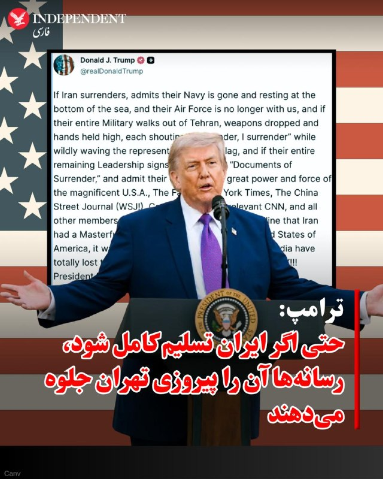

♦️دونالد ترامپ، رئیس‌جمهوری آمریکا، روز دوشنبه در پیامی در شبکه اجتماعی تروث سوشال نوشت: «حتی اگر ایران به‌طور کامل تسلیم شود، رسانه‌ها این وضعیت را به‌عنوان پیروزی تهران توصیف خواهند کرد.»
ترامپ در این پیام نوشت اگر ایران اعتراف کند نیروی دریایی‌اش نابود شده، نیروی هوایی‌اش دیگر وجود ندارد، همه نیروهای نظامی از تهران خارج شوند، پرچم سفید برافرازند و رهبران جمهوری اسلامی نیز اسناد تسلیم را امضا کنند، باز هم برخی رسانه‌های آمریکایی نتیجه را «پیروزی ایران» معرفی خواهند کرد.
رئیس جمهوری آمریکا در ادامه به‌شدت از رسانه‌هایی مانند نیویورک تایمز، وال‌استریت ژورنال و سی‌ان‌ان انتقاد کرد و آن‌ها را بخشی از «رسانه‌های اخبار جعلی» خواند.
‌🇸🇦 Indypersian

🤖 @VahidOOnLine

## VahidOOnLine — post 240811

  <a href="telegram/content/VahidOOnLine_240811_1779121212.mp4">🎬 Download video</a>

با تهدید «حق تیر داریم» مانع برگزاری مراسم زادروز بهار شاه‌مهری شدند

بر اساس ویدیوی ارسالی به منوتو، نیروهای حکومتی با تهدید خانواده بهار شاه‌مهری و گفتن جمله «ما حق تیر داریم»، اجازه برگزاری مراسم زادروز این جاویدنام را در ۱۹ اردیبهشت ندادند.

بهار شاه‌مهری، نوجوان ۱۷ ساله اهل نیشابور، غروب ۱۹ دی‌ماه ۱۴۰۴ در جریان انقلاب شیر و خورشید ایران، در کوچه‌ای خلوت از پشت سر هدف شلیک مستقیم تک‌تیرانداز نیروهای سرکوبگر جمهوری اسلامی قرار گرفت و جان باخت.

به گفته نزدیکان او، چند روز پیش از سالروز تولد بهار، اعضای خانواده‌اش بازداشت و بازجویی شدند و مسیرهای منتهی به مزار او در روز تولدش بسته شد تا از برگزاری مراسم جلوگیری شود.

همچنین گزارش شده است که سنگ مزار بهار شاه‌مهری روز دوم فروردین ۱۴۰۶ شکسته شده بود.
این فشارها بخشی از روند گسترده‌تر سرکوب خانواده‌های جان‌باختگان است؛ حتی بعد از کشتن، از گل گذاشتن و تولد گرفتن هم می‌ترسند. عجب شجاعتی، حکومت با سنگ قبر می‌جنگد.
‌🏁 🇬🇧 ManotoTV

🤖 @VahidOOnLine

## VahidOOnLine — post 240810

  <a href="telegram/content/VahidOOnLine_240810_1779121214.mp4">🎬 Download video</a>

دونالد ترامپ، رئیس‌جمهوری آمریکا، در پیامی در تروث‌سوشال ، رسانه‌های آمریکایی را متهم کرد که حتی در صورت «تسلیم کامل ایران» نیز آن را به‌عنوان پیروزی توصیف خواهند کرد.

ترامپ در این پیام نوشت اگر جمهوری اسلامی شکست خود را بپذیرد، نیروهای نظامی‌اش تسلیم شوند و رهبرانش «اسناد تسلیم» را امضا کنند، باز هم رسانه‌هایی چون نیویورک‌تایمز، وال‌استریت ژورنال و سی‌ان‌ان این اتفاق را «پیروزی ایران» جلوه خواهند داد.

او با اشاره به نابودی نیروی دریایی و نیروی هوایی ایران نوشت: «اگر ایران تسلیم شود، بپذیرد که نیروی دریایی‌اش در کف دریا نابود شده و نیروی هوایی‌اش دیگر وجود ندارد، و اگر نیروهای نظامی‌اش با دست‌های بالا و پرچم سفید از تهران خارج شوند، باز هم رسانه‌های فیک‌نیوز خواهند گفت ایران پیروزی درخشانی مقابل آمریکا به دست آورده است.»

ترامپ همچنین رسانه‌های جریان اصلی آمریکا را «فاسد» و «بی‌اهمیت» توصیف کرد و نوشت: «دموکرات‌ها و رسانه‌ها کاملا راه خود را گم کرده‌اند. آن‌ها کاملا دیوانه شده‌اند.»
‌🏁 🇬🇧 ManotoTV

🤖 @VahidOOnLine

## VahidOOnLine — post 240809

  

وزارت خارجه عمان حمله پهپادی یک‌شنبه به عربستان سعودی را محکوم کرد.
عمان در بیانیه‌ای اعلام کرد هرگونه اقدام خصمانه را مردود می‌داند و از عربستان سعودی برای حفظ امنیت و ثبات خود حمایت می‌کند.
مسقط همچنین بر خویشتنداری و حل مسائل منطقه‌ای از مسیرهای دیپلماتیک تاکید کرد.
‌🏁 🇬🇧 IranintlTV

🤖 @VahidOOnLine

## VahidOOnLine — post 240808

  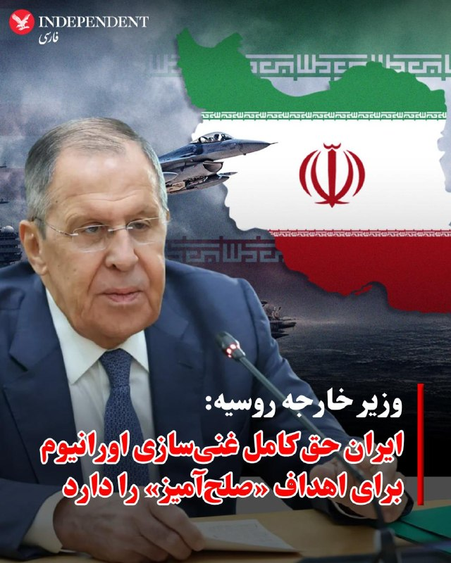

♦️سرگئی لاوروف، وزیر خارجه روسیه، در بحبوحه فشارهای دولت ترامپ بر تهران، روز دوشنبه ۲۸ اردیبهشت‌ماه اعلام کرد ایران مانند دیگر اعضای پیمان منع گسترش سلاح‌های هسته‌ای، «حق کامل» دارد برای اهداف صلح‌آمیز اورانیوم غنی‌سازی کند.

لاوروف در نشست خبری در مسکو گفت روسیه در روند مذاکرات میان واشنگتن و تهران دخالت نخواهد کرد و از هر توافقی که دو طرف بپذیرند، حمایت می‌کند.
‌🇸🇦 Indypersian

🤖 @VahidOOnLine

## VahidOOnLine — post 240807

  

فرماندهی مرکزی ایالات متحده، سنتکام، اعلام کرد از زمان آغاز محاصره دریایی بنادر و سواحل جنوبی ایران، ۸۴ کشتی تجاری مجبور به تغییر مسیر شده‌اند و چهار شناور دیگر نیز پس از هدف قرار گرفتن، از کار افتاده‌اند تا اجرای این محاصره تضمین شود.
‌🏁 🇬🇧 IranintlTV

🤖 @VahidOOnLine

## VahidOOnLine — post 240806

  

♦️رویترز به نقل از یک منبع ارشد ایرانی گزارش داد ایالات متحده درباره ادامه فعالیت‌های محدود هسته‌ای صلح‌آمیز ایران تحت نظارت آژانس بین‌المللی انرژی اتمی انعطاف نشان داده است.

این منبع روز دوشنبه ۲۸ اردیبهشت‌ماه به رویترز گفت واشنگتن تاکنون فقط با آزادسازی یک‌چهارم دارایی‌های مسدودشده ایران، آن هم بر اساس یک جدول زمانی مرحله‌ای، موافقت کرده و تهران خواستار بازنگری آمریکا در این مواضع شده است.

بر اساس این گزارش، ایران در پیشنهاد تازه خود بر پایان جنگ، بازگشایی تنگه هرمز و لغو تحریم‌های دریایی تمرکز کرده و موضوعات بحث‌برانگیزتر مانند غنی‌سازی اورانیوم و برنامه هسته‌ای را به مراحل بعدی مذاکرات موکول کرده است.
‌🇸🇦 Indypersian

🤖 @VahidOOnLine

## VahidOOnLine — post 240805

  

محمدجعفر قائم‌پناه، معاون اجرایی پزشکیان، گفت: «بر اساس نظرسنجی مرکز ریاست‌جمهوری، ۷۰ درصد مردم مخالف محدودیت اینترنت هستند.»

او افزود: «محدودیت‌ها در دی‌ماه و در زمان جنگ، با منطق مدیریت بحران، صیانت از امنیت ملی، جان و آرامش عمومی صورت گرفت.»

قائم‌پناه اضافه کرد: «جامعه‌ای که صادقانه با آن سخن گفته شود، تاب‌آورتر و همراه‌تر خواهد بود.»
‌🏁 🇬🇧 IranintlTV

🤖 @VahidOOnLine

## VahidOOnLine — post 240804

  

♦️دونالد ترامپ، رئیس جمهوری آمریکا، روز یکشنبه تصویری ساخته شده با هوش مصنوعی، از قدم زدن با یک موجود فضایی را در صفحه تروث سوشال به اشتراک گذاشت.

وزارت دفاع ایالات متحده، پیشتر در پی دستور مستقیم دونالد ترامپ، مجموعه‌ای از اسناد طبقه‌بندی‌شده و «دیده‌نشده» مربوط به اشیاء ناشناس پرنده (UFO) را که اکنون با نام رسمی «پدیده‌های ناهنجار ناشناخته» (UAP) معرفی می‌شوند، منتشر کرد.

پنتاگون گفته است، با دستور دونالد ترامپ از این پس شهروندان می‌توانند بدون نیاز به سطح دسترسی امنیتی، به ویدیوها، تصاویر و اسناد اصلی دولتی در این زمینه دسترسی داشته باشند.
‌🇸🇦 Indypersian

🤖 @VahidOOnLine

## mwarmonitor — post 9258

  <a href="telegram/content/mwarmonitor_9258_1779121219.mp4">🎬 Download video</a>

📝 دیدن این تصاویر تهوع‌آور بر فراز برج‌های تهران، آن هم در کشوری که توده‌ی مردمش زیر خط فقر مطلق برای یک تکه نان شب سگ‌دو می‌زنند، هیچ چیز جز یک وقاحت آشکار و سادیسم اجتماعی نیست. این لاشخورهای مرفهی که به لطف رانت و وابستگی، جیب‌هایشان از پول این ملت مغبون پر شده، با فیلترشکن‌های نجومی و اکانت‌های پرو که هزینه‌اش دستمزد ماهانه‌ی یک کارگر است، سیرکِ رذالت و بی‌عاری خود را به نمایش می‌گذارند تا عقده‌های حقارتشان را با لایک‌های مجازی تسکین دهند.

🔸ورزش کردن و شاد بودن بهانه‌ی کثیفی است برای توجیه این بی‌شرفی مفرط؛ این تصاویر، استوری کردنِ صلح و آرامش نیست، رسماً تف کردن به صورت مردمی است که زیر بار تورم کمرشان شکسته است. جامعه‌ی ما امروز از چند سو مورد هجوم این جانوران قرار گرفته است: یک طرف آن ارزشی‌های جیره‌خوار با پرچم‌گردانی و عربده‌کشی‌های شبانه، طرف دیگر تفنگ‌به‌دستانِ رسانه‌ای که بذر وحشت می‌کارند، و در این میان، این روسپی‌های مدرنِ حکومتی که با بی‌شرمیِ تمام روی زخم مردم نمک می‌پاشند.

@mwarmonitor

## mwarmonitor — post 9257

🇺🇸🇨🇳رئیس‌جمهور ترامپ می‌گوید گفت‌وگوها با رئیس‌جمهور چین، شی جین‌پینگ، به توافق‌های جدیدی منجر شده که هدف آن‌ها «صلح و رفاه» میان آمریکا و چین است.

🔸از جمله توافق‌های گزارش‌شده: چین ۲۰۰ فروند هواپیمای بوئینگ خریداری خواهد کرد، طی سه سال آینده بیش از ۱۷ میلیارد دلار محصولات کشاورزی آمریکا را می‌خرد، مجوز فعالیت بیش از ۴۰۰ مرکز آمریکایی تولید گوشت گاو تمدید می‌شود و واردات گوشت مرغ از برخی ایالت‌های آمریکا از سر گرفته خواهد شد.

@mwarmonitor

## mwarmonitor — post 9255

🇺🇸🇮🇷 رویترز: آمریکا پیشنهاد جدید ایران را رد کرد.

@mwarmonitor

## mwarmonitor — post 9254

🚨 آمریکا جدیدترین پیشنهاد صلح ایران را رد کرد، پیش از جلسه روز سه‌شنبه در «اتاق وضعیت» (Situation Room). بلومبرگ

@mwarmonitor

## mwarmonitor — post 9253

🔴ایران پیشنهاد جدیدی ارائه داد؛ مقام ارشد آمریکایی: این پیشنهاد کافی نیست و خطر ازسرگیری جنگ را به همراه دارد

📝نویسنده: باراک راوید (AXIOS)

🔰ایران پیشنهاد به‌روزشده‌ای را برای دستیابی به توافقی جهت پایان دادن به جنگ ارائه کرده است، اما یک مقام ارشد آمریکایی و یک منبع آگاه از این موضوع به «آکسیوس» گفتند که کاخ سفید معتقد است این پیشنهاد پیشرفت معناداری به‌شمار نمی‌رود و برای دستیابی به توافق کافی نیست.

📌چرا این موضوع اهمیت دارد؟
مقامات آمریکایی می‌گویند پرزیدنت ترامپ خواهان توافقی برای پایان دادن به جنگ است، اما به دلیل رد بسیاری از خواسته‌های او از سوی ایران و امتناع این کشور از دادن امتیازات معنادار در برنامه هسته‌ای خود، در حال بررسی گزینه ازسرگیری جنگ است.

🔸به گفته دو مقام آمریکایی، انتظار می‌رود ترامپ روز سه‌شنبه تیم امنیت ملی خود را در «اتاق وضعیت» (Situation Room) کاخ سفید برای بررسی گزینه‌های نظامی تشکیل دهد.

🔹یک مقام ارشد آمریکایی گفت اگر ایران موضع خود را تغییر ندهد، ایالات متحده مجبور خواهد شد مذاکرات را «از طریق بمب‌ها» ادامه دهد.

🔸ترامپ روز یکشنبه در یک تماس تلفنی با آکسیوس (پیش از آنکه آمریکا پیشنهاد جدید ایران را دریافت کند) گفت: «زمان در حال از دست رفتن است» و اگر ایران انعطاف نشان ندهد، «ضربات بسیار سخت‌تری دریافت خواهند کرد.»

📌جزئیات بیشتر
این مقام ارشد آمریکایی گفت که پیش‌نویس پیشنهادیِ متقابل ایران، که یکشنبه‌شب از طریق میانجی‌های پاکستانی به دست آمریکا رسیده، تنها حاوی بهبودهای جزئی و نمادین نسبت به نسخه قبلی است.

🔸مسئله هسته‌ای: پیشنهاد جدید شامل عبارات و کلمات بیشتری درباره تعهد ایران به عدم تلاش برای دستیابی به سلاح هسته‌ای است، اما هیچ تعهد دقیقی درباره تعلیق غنی‌سازی اورانیوم یا تحویل ذخایر موجود اورانیوم با غنای بالا در آن دیده نمی‌شود.
مسئله تحریم‌ها: در حالی که رسانه‌های دولتی ایران گزارش دادند که آمریکا موافقت کرده است در طول مذاکرات برخی از تحریم‌های نفتی ایران را لغو کند، این مقام آمریکایی گفت که هیچ‌گونه لغو تحریمی «به صورت رایگان» و بدون اقدام متقابل از سوی ایران رخ نخواهد داد.

🔹اظهارات مقامات
این مقام ارشد آمریکایی گفت:
«ما واقعاً پیشرفت زیادی نداشته‌ایم. امروز در موقعیت بسیار حساسی قرار داریم. اکنون فشار روی آن‌هاست تا پاسخ مناسبی بدهند.»

🔰او در ادامه افزود:
«زمان آن رسیده که ایرانی‌ها امتیاز واقعی روی میز بگذارند. ما به یک گفتگوی واقعی، محکم و دقیق [در مورد برنامه هسته‌ای] نیاز داریم. اگر قرار نباشد این اتفاق بیفتد، ما از طریق بمب‌ها گفتگو خواهیم کرد که این مایه تاسف خواهد بود.»

📌پشت پرده
به گفته این مقام ارشد آمریکایی، ایالات متحده و ایران در حال حاضر مذاکرات مستقیمی روی متن و محتوای توافق ندارند، بلکه در حال انجام گفتگوهای غیرمستقیم هستند تا به یک اجماع درباره شکل و ساختار این مذاکرات دست یابند.
این مقام آمریکایی مدعی شد همین که ایران با وجود تغییرات بسیار ناچیز، پیشنهاد متقابل جدیدی ارائه کرده است، نشان می‌دهد ایرانی‌ها نگران اقدامات نظامی بیشتر از سوی ایالات متحده هستند. در مقابل، ایرانی‌ها مدت‌هاست ادعا می‌کنند این ترامپ است که برای توافق دستپاچه و عجول است و زمان به نفع آن‌ها (ایران) پیش می‌رود.

@mwarmonitor

## mwarmonitor — post 9252

  

🇺🇸ملوانان نیروی دریایی آمریکا در مرکز اطلاعات رزمی (CIC) ناو USS Delbert D. Black (DDG 119) در حال نگهبانی هستند، در حالی که این ناو در حال عبور از دریای عرب است و از «محاصره دریایی آمریکا علیه ایران» پشتیبانی می‌کند.

🔸طبق گزارش، تا ۱۸ مه، نیروهای فرماندهی مرکزی آمریکا (CENTCOM) مسیر ۸۴ کشتی تجاری را تغییر داده‌اند و ۴ فروند را از کار انداخته‌اند.

@mwarmonitor

## mwarmonitor — post 9251

اگر ایران تسلیم شود، اعتراف کند که نیروی دریایی‌اش نابود شده و در کف دریا آرام گرفته است، و نیروی هوایی‌اش دیگر در میان ما نیست، و اگر تمام ارتش آن‌ها با دست‌های بالا رفته و سلاح‌های زمین‌گذاشته از تهران خارج شوند و هر کدام در حالی که پرچم سفید نمادین را به شدت تکان می‌دهند فریاد بزنند «من تسلیم می‌شوم، من تسلیم می‌شوم»، و اگر تمام رهبران باقی‌مانده آن‌ها همه «اسناد تسلیم» لازم را امضا کنند و شکست خود را در برابر قدرت و نیروی عظیم ایالات متحده باشکوه آمریکا بپذیرند، [باز هم] «نیویورک تایمز در حال سقوط»، «چاینا استریت ژورنال (همان وال استریت ژورنال!)»، «سی‌ان‌انِ فاسد و اکنون بی‌اهمیت» و همه اعضای دیگر رسانه‌های اخبار جعلی، تیتر خواهند زد که ایران یک پیروزی استادانه و درخشان بر ایالات متحده آمریکا داشته است و [این رقابت] حتی نزدیک هم نبود. دموکرات‌ها و رسانه‌ها کاملاً راه خود را گم کرده‌اند. آن‌ها کاملاً دیوانه شده‌اند!!!

رئیس‌جمهور دونالد جی ترامپ (DJT)

@mwarmonitor

## mwarmonitor — post 9250

🇮🇷 منبع ایرانی به رویترز: آمریکا در مورد محدودیت‌های اعمال‌شده بر برنامه هسته‌ای انعطاف نشان داده است؛ ما موضوع هسته‌ای را در مراحل بعدی مورد بحث قرار خواهیم داد. @mwarmonitor

## mwarmonitor — post 9249

🔴 منبع آمریکایی به الجزیره: صبر رئیس‌جمهور ترامپ به‌دلیل عدم پیشرفت در پرونده ایران رو به پایان است.

@mwarmonitor

## mwarmonitor — post 9248

🔴پیشنهاد اصلاح‌شده تهران به آمریکا شامل پایان دائمی جنگ، لغو تحریم‌ها، بازگشایی تنگه هرمز و آزادسازی دارایی‌های بلوکه‌شده ایران است. 🔸گزارش‌ها حاکی است که ایران درباره برنامه هسته‌ای خود در مراحل بعدی مذاکرات گفت‌وگو خواهد کرد - رویترز @mwarmonitor

## mwarmonitor — post 9247

🇺🇸🇵🇰🇮🇷پاکستان شامگاه یکشنبه یک پیشنهاد اصلاح‌شده از سوی ایران را با ایالات متحده به اشتراک گذاشت که هدف آن پایان دادن به جنگ است — رویترز @mwarmonitor

## mwarmonitor — post 9246

🇮🇷🇺🇸ایران بنا بر گزارش‌ها با یک «فریز بلندمدت برنامه هسته‌ای» به‌جای برچیدن کامل آن موافقت کرده و در مقابل، به‌دنبال امتیازات اقتصادی به‌جای غرامت است؛ این موضوع طبق جزئیات افشاشده از پیشنهاد اصلاح‌شده ایران که توسط شبکه سعودی «العربیه» به دست آمده، گزارش شده است.

@mwarmonitor

## mwarmonitor — post 9245

  <a href="telegram/content/mwarmonitor_9245_1779121222.mp4">🎬 Download video</a>

📝این فاحشه‌خانه‌ی فکری و لجن‌زارِ متعفنِ صداوسیما، غایتِ وقاحت و مسخ‌شدگیِ جماعتی است که مغزشان با خون، خشونت و باروت شستشو داده شده است. موجودی متوهم با لبخندی کریه، ابزارِ آدم‌کشی و پهپاد انتحاری را به عنوان مهریه به زنی ذوب‌شده در حماقت پیشکش می‌کند؛ و در کنارشان، آن آخوندِ دوزاری و مجریِ جیره‌خوار که شغلِ شریفشان سال‌هاست شرعی‌سازیِ کثافت‌کاری‌ها، صیغه‌بازی و دلالتِ مذهبی است، با رذالتی مشمئزکننده برای قیمتِ این آلتِ قتل چرتکه می‌اندازند. این نمایشِ مالامال از نجاست، ویترینِ سقوطِ مطلقِ شرف و انسانیتِ قشری است که از فلاکت و مرگ تغذیه می‌کنند و حتی پیوند ازدواج را هم به گندِ ایدئولوژیِ خون‌بار و وحشیانه‌ی خود می‌کشند.

@mwarmonitor

## mwarmonitor — post 9244

🔴سناتور لیندسی گراهام ؛

🔸من کاملاً اطمینان دارم که رئیس‌جمهور ترامپ به‌طور کامل وضعیت مربوط به ایران را درک می‌کند و دیگر ادامه نخواهد داد که عدم تمایل به مذاکره با حسن نیت، همراه با اقدامات تهاجمی و سرکشانه ایران در تنگه هرمز و سراسر منطقه را تحمل کند.

🔸برای من کاملاً روشن است که ایران از نظر نظامی و اقتصادی به‌شدت تضعیف شده است. اما در عین حال، جسورتر و تهاجمی‌تر نیز شده است.

🔸یک پاسخ کوتاه اما قاطع در این مقطع می‌تواند کل این درگیری را به شکل درستی بازتنظیم کند.

🔸در مورد ایران، ضروری است که از موضع قدرت و برتری وارد مذاکره شویم. باید کاری را که آغاز کرده‌ایم به پایان برسانیم. من نگرانم که ادامه مذاکرات بدون یک پاسخ قاطع، این درگیری را طولانی‌تر کند، باعث تردید در میان متحدان ما شود و رژیم تروریستی ایران را بیش از پیش جسورتر سازد.

@mwarmonitor

## pm_afshaa — post 90965

یه حسی بهم میگه امشب میزننن...

## pm_afshaa — post 90964

  <a href="telegram/content/pm_afshaa_90964_1779121223.jpg">🎬 Download video</a>

🔴آکسیوس: آمریکا پیشنهاد امروز ایران رو هم ناکافی دانست و کاملا ردش کرد؛ طبق گفته مقام آمریکایی در نقطه بسیار حساسی هستیم! 
💧 Rainbet.com the #1 Non-KYC Crypto Casino & Sportsbook @rainbetcom 
😁 @Pm_Afshaa

## pm_afshaa — post 90963

🔴اسرائیل هیوم: وزارت دفاع از نتانیاهو خواسته بودجه ارتش را 14میلیارد دلار افزایش دهد

💧 Rainbet.com the #1 Non-KYC Crypto Casino & Sportsbook @rainbetcom

😁 @Pm_Afshaa

## pm_afshaa — post 90962

  <a href="telegram/content/pm_afshaa_90962_1779121224.jpg">🎬 Download video</a>

🔴رویترز: آمریکا پیشنهاد جدید ایران رو رد کرد.

💧 Rainbet.com the #1 Non-KYC Crypto Casino & Sportsbook @rainbetcom

😁 @Pm_Afshaa

## pm_afshaa — post 90961

  <a href="telegram/content/pm_afshaa_90961_1779121225.jpg">🎬 Download video</a>

🔴تسنیم: ایران یه پیشنهاد 14 بندی اصلاح شده به پاکستان داد تا به آمریکا برسونه و اونا هم بررسیش کنن و جواب بدن. 
😁 @Pm_Afshaa

## pm_afshaa — post 90960

  

🔴پست جدید ترامپ:

اگر ایران تسلیم شود، اعتراف کند که نیروی دریایی‌شان از بین رفته و در ته دریا است، و نیروی هوایی‌شان دیگر با ما نیست، و اگر کل ارتش‌شان از تهران خارج شود، سلاح‌ها را رها کرده و دست‌ها را بالا ببرند، هر کدام فریاد بزنند «من تسلیم می‌شوم، من تسلیم می‌شوم» در حالی که پرچم سفید نماینده را به شدت تکان می‌دهند، و اگر تمام رهبران باقی‌مانده‌شان همه «اسناد تسلیم» لازم را امضا کنند و شکست خود را در برابر قدرت و نیروی عظیم و باشکوه ایالات متحده آمریکا بپذیرند، روزنامه‌های در حال سقوط نیویورک تایمز، وال استریت ژورنال چین (WSJ!)، سی‌ان‌ان فاسد و اکنون بی‌اهمیت، و همه اعضای دیگر رسانه‌های خبری جعلی، تیتر خواهند زد که ایران پیروزی استادانه و درخشانی بر ایالات متحده آمریکا داشته است، حتی نزدیک هم نبود. دموکرات‌ها و رسانه‌ها کاملاً راه خود را گم کرده‌اند. آنها کاملاً دیوانه شده‌اند!!!

💧 Rainbet.com the #1 Non-KYC Crypto Casino & Sportsbook @rainbetcom

😁 @Pm_Afshaa

## pm_afshaa — post 90959

  <a href="telegram/content/pm_afshaa_90959_1779121226.jpg">🎬 Download video</a>

🔴تسنیم: ایران یه پیشنهاد 14 بندی اصلاح شده به پاکستان داد تا به آمریکا برسونه و اونا هم بررسیش کنن و جواب بدن. 
😁 @Pm_Afshaa

## pm_afshaa — post 90958

  <a href="telegram/content/pm_afshaa_90958_1779121227.jpg">🎬 Download video</a>

🔴کان نیوز: نتانیاهو امروز جلسه امنیتی محدودی با مقامات ارشد دفاعی و چند وزیر درباره ایران برگزار خواهد کرد.

💧 Rainbet.com the #1 Non-KYC Crypto Casino & Sportsbook @rainbetcom

😁 @Pm_Afshaa

## pm_afshaa — post 90957

  <a href="telegram/content/pm_afshaa_90957_1779121228.jpg">🎬 Download video</a>

🔴الجزیره به نقل از یک منبع آمریکایی:
صبر ترامپ به خاطر اینکه با ایران پیشرفتی حاصل نشده داره تموم میشه؛ ترامپ حاضره دست به کار نظامی بزنه، مگر اینکه تو چند روز آینده یه چیزی از ایران بشنوه.

💧 Rainbet.com the #1 Non-KYC Crypto Casino & Sportsbook @rainbetcom

😁 @Pm_Afshaa

## pm_afshaa — post 90956

🔴رئیس‌جمهور کوبا: هر حمله نظامی به کوبا به حمام خون و عواقب غیرقابل پیش‌بینی منجر می‌شود

💧 Rainbet.com the #1 Non-KYC Crypto Casino & Sportsbook @rainbetcom

😁 @Pm_Afshaa

## pm_afshaa — post 90954

  

👩‍💻کانفیگ اضطراری موجود شد! 
🛍 series Basic • 1G 140 
💵 • 2G 280
💵 • 3G 420
💵 • 4G 560
💵 • 5G 700
💵 • 10G 1400
💵 • 20G 2800 
💵 • 30G 4200
💵 
📌مناسب استفاده روزمره و اقتصادی 
📌سرعت مناسب برای استفاده عادی 
📌پینگ 140تا350 
📌مناسب تلگرام.وب گردی . اینستاگرام 
❗️ممکنه…

## pm_afshaa — post 90952

👩‍💻کانفیگ اضطراری موجود شد!

🛍 series Basic

• 1G 140 
💵
• 2G 280
💵
• 3G 420
💵
• 4G 560
💵
• 5G 700
💵
• 10G 1400
💵
• 20G 2800 
💵
• 30G 4200
💵

📌مناسب استفاده روزمره و اقتصادی

📌سرعت مناسب برای استفاده عادی

📌پینگ 140تا350

📌مناسب تلگرام.وب گردی . اینستاگرام

❗️ممکنه در بعضی ساعات شلوغی افت سرعت داشته باشه

✔️ بدونه محدودیت زمان و کاربر هستن

✔️ساب لینک جهت دیدن حجم

✔️بدونه حتی ۱ درصد ضریب تمامی سرور ها

⚠️همه سرویس ضمانت بازگشت وجه دارند

@n9neebot

## pm_afshaa — post 90951

  <a href="telegram/content/pm_afshaa_90951_1779121229.jpg">🎬 Download video</a>

🔴نیویورک تایمز: پنتاگون برای از سرگیری جنگ با ایران در روزهای آینده آماده می‌شود 
💧 Rainbet.com the #1 Non-KYC Crypto Casino & Sportsbook @rainbetcom 
😁 @Pm_Afshaa

## pm_afshaa — post 90950

  <a href="telegram/content/pm_afshaa_90950_1779121230.jpg">🎬 Download video</a>

🔴سناتور لیندسی گراهام: من کاملاً اطمینان دارم که رئیس‌جمهور ترامپ به‌طور کامل وضعیت مربوط به ایران رو درک میکنه و دیگه عدم تمایل به مذاکره با حسن نیت، همراه با اقدامات تهاجمی و سرکشانه ایران تو تنگه هرمز و سراسر منطقه رو تحمل نخواهد کرد.

💧 Rainbet.com the #1 Non-KYC Crypto Casino & Sportsbook @rainbetcom

😁 @Pm_Afshaa

## pm_afshaa — post 90949

  <a href="telegram/content/pm_afshaa_90949_1779121231.jpg">🎬 Download video</a>

🔴تسنیم به نقل از یک منبع نزدیک به تیم مذاکره‌کننده:

آمریکا در متن جدید خودش پذیرفته که تحریم‌های نفتی ایران رو در طول دوره مذاکرات به‌صورت موقت تعلیق (Waive) کنه.

طبق این گزارش، جمهوری اسلامی همچنان بر لغو کامل همه تحریم‌ها تاکید داره، اما آمریکا فعلا فقط معافیت موقت تحریم‌ها تا زمان رسیدن به تفاهم نهایی رو مطرح کرده.

💧 Rainbet.com the #1 Non-KYC Crypto Casino & Sportsbook @rainbetcom

😁 @Pm_Afshaa

## pm_afshaa — post 90948

🔴نیویورک تایمز: پنتاگون برای از سرگیری جنگ با ایران در روزهای آینده آماده می‌شود

💧 Rainbet.com the #1 Non-KYC Crypto Casino & Sportsbook @rainbetcom

😁 @Pm_Afshaa

## DEJradio — post 4706

  <a href="telegram/content/DEJradio_4706_1779121231.mp4">🎬 Download video</a>

🚨
🔸 اشتباه محاسباتی همون جاییی که یک نقشه به‌ظاهر هوشمندانه، به یک شکست مفتضحانه ختم می‌شه!

پس پیش از آغاز یک حمله فقط دیدنِ حرکت‌های خودت کافی نیست؛ باید زنجیره‌ی واکنش‌های حریف رو هم دقیق حساب کنی!♟🧠

اما در دنیایی سیال و پر از فاکتورهای ناشناخته این محاسبه واقعا چطور ممکنه؟

در قسمت هفتم از «تمام‌رخ» می‌ریم سراغ قهرمان اشتباهات محاسباتی:
حکومت آخوندی ⚠️

#تمام_رخ #حکومت_آخوندی
@DEJradio

## DEJradio — post 4705

  <a href="telegram/content/DEJradio_4705_1779121234.mp4">🎬 Download video</a>

🤡
🔺 “مهریه خانمم پهپاد شاهد است!

در ادامه تبلیغات صدا و سیما برای بازارگرمی تجمعات شبانه و سازماندهی رزمی هوادارانش، با تبلیغ جفت‌گیری و صیغه، داماد حکومتی، روی آنتن زنده تلویزیون میگوید «مهریه خانمم پهپاد شاهده که ایشالا بخوره تو قلب تل‌آویو».

#صیغه #صداوسیما
@DEJradio

## DEJradio — post 4704

  <a href="telegram/content/DEJradio_4704_1779121236.mp4">🎬 Download video</a>

🔺🎥 پیام یک شهروند از تهران:
رژیم مردم رو انداخته به زباله‌گردی

یک شهروند از تهران با ارسال ویدیویی محله شمشیری تهران، می‌گوید رژیم ما رو انداخته به زباله‌گردی، نه عزت داریم نه احترام.

#زباله_گردی #تهران
@DEJradio

## DEJradio — post 4703

  <a href="telegram/content/DEJradio_4703_1779121238.mp4">🎬 Download video</a>

🤡
🔺 آمستردام؛ "مزدورای بدردنخور رژیم پرچم گرفتن دستشون"

یک از ایرانیان میهن‌دوست ساکن آمستردام با ارسال ودیدیویی از تجمع حامیان نظام می‌گوید: مزدورای بدردنخور حامی رژیم پرچم گرفتن دستشون"

#آمستردام #تجمعات_حکومتی
@DEJradio

## DEJradio — post 4702

  <a href="telegram/content/DEJradio_4702_1779121241.mp4">🎬 Download video</a>

🔺📢 پیام یک شهروند از نقده:
بانک‌ها زودتر موعود می‌بندند و عابر بانک‌ها کار نمی‌کنند

«ساکن شهرستان نقده در استان آذربایجان غربی هستم و این فیلم کوتاه رو براتون می‌فرستم.

امروز مشاهده کردم که این بانک هم مثل خیلی از بانک‌های دیگه زودتر از موعد درها رو به روی مراجعین بسته. چند شخص بازنشسته الان مدتی طولانی منتظر هستند ولی نه از باجه و نه از عابر بانک نمیتونن حقوقشون رو دریافت کنن.

این حکومت ضدملی با فساد و جنگ افروزی‌هاش اقتصاد و معاش مردم رو نابود کرده!»

#آذربایجان_غربی #ورشکستگی_اقتصادی
@DEJradio

## DEJradio — post 4701

  <a href="telegram/content/DEJradio_4701_1779121244.mp4">🎬 Download video</a>

🔺🎥 تصاویر منتشر شده از فراز تنگه هرمز از نگاه یک هواپیمای مسافربری.

#تنگه_هرمز
@DEJradio

## DEJradio — post 4700

  <a href="telegram/content/DEJradio_4700_1779121247.mp4">🎬 Download video</a>

🔺📢 یک شهروند از ورامین:
امیدوارم هرچه زودتر از دست مستبده رها بشیم

یک شهروند ساکن ورامین [جنوب تهران] با ارسال این ویدیو نوشت: «ما در کشوری غنی از منابع طبیعی و با نیروی انسانی سخت‌کوش زندگی می‌کنیم ولی جمهوری اسلامی با جنگ افروزی‌هاش اقتصاد کشور رو نابود و ملت رو به فقر و گرسنگی رسونده. امیدوارم هر چه زودتر از دست این حکومت فاسد و مستبد رها بشیم تا اقتصاد کشور و معاش مردم نجات پیدا کنه!»

#اقتصاد_ایران #تورم
@DEJradio

## mamlekate — post 103554

📝 ۲۸ اردیبهشت؛ روز خیام؛
فیلسوف، دانشمند و شاعری که خرد و آزادی را ستود

@mamlekate

## mamlekate — post 103553

📝 رسانه‌های آمریکایی: ترامپ روز شنبه با مشاوران ارشد امنیت ملی خود درباره ایران جلسه گذاشت؛ سه‌شنبه نیز جلسه دیگری دارد

سایت خبری آکسیوس روز یک‌شنبه ۲۷ اردیبهشت گزارش داد که دونالد ترامپ، رئیس‌جمهوری آمریکا قرار است روز سه‌شنبه در «اتاق وضعیت» کاخ سفید با مشاوران ارشد امنیت ملی خود جلسه‌ای درباره ایران برگزار کند.

📝 ترامپ می‌گوید اگر ایران خیلی سریع توافق نکند، چیزی از آن باقی نخواهد ماند

ترامپ با انتشار چند تصویر مختلف گرافیکی که حاکی از هدف قرار دادن ایران و نیز آغاز دوباره جنگ با فشاردادن یک دکمه توسط او بود، تهدیدات خود علیه جمهوری اسلامی را تکرار کرد.

📝 گزارش‌ها از شروط ایران و آمریکا برای ازسرگیری مذاکرات

📝 رویترز: پاکستان «پیشنهاد اصلاح‌شده» تهران برای پایان درگیری را به واشنگتن تحویل داد

📝 تشدید محاصره نفتی ایران؛ ازدحام بی‌سابقه نفتکش‌ها در اطراف جزیره خارگ

در حالی که محاصره دریایی آمریکا علیه بنادر جمهوری اسلامی ایران ادامه دارد، تصاویر ماهواره‌ای از تجمع حدود ۲۳ نفتکش در نزدیکی جزیره خارگ، مهم‌ترین پایانه صادرات نفت ایران حکایت دارد، که بزرگ‌ترین تجمع شناورها در این منطقه از زمان آغاز این محاصره است.

📝 گزارش کاخ سفید از دستاوردهای سفر ترامپ به پکن؛ چین و آمریکا توافق کردند جمهوری اسلامی نباید در تنگه هرمز عوارض بگیرد

کاخ سفید، توضیحاتی درباره دستاوردهای سفر دونالد ترامپ، رئيس‌جمهوری آمریکا به چین و دیدارش با شی جین‌پینگ، رئيس‌جمهوری این کشور، منتشر کرد.

@mamlekate

## mamlekate — post 103552

  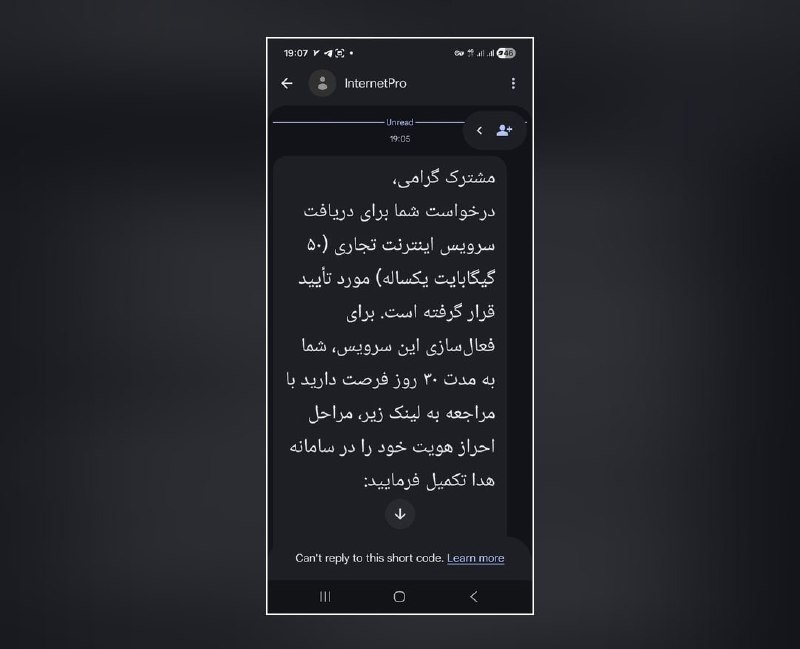

سلام. من هیچ درخواستی برا اینترنت طبقاتی پرو ندادم. نه پروانه کسب دارم نه کارمندم. کلا اینترنتو بستن تا به اسم پرو گرونش کنن

@mamlekate

## mamlekate — post 103551

  <a href="telegram/content/mamlekate_103551_1779121250.mp4">🎬 Download video</a>

📞 این آموزش همگانی استفاده از تیربار تو صداوسیما دیگه کار موساده چون این یکی کلاش نیست اینو تو پایگاه به مزدورای خودشون میتونن آموزش بدن.

@mamlekate

## mamlekate — post 103550

  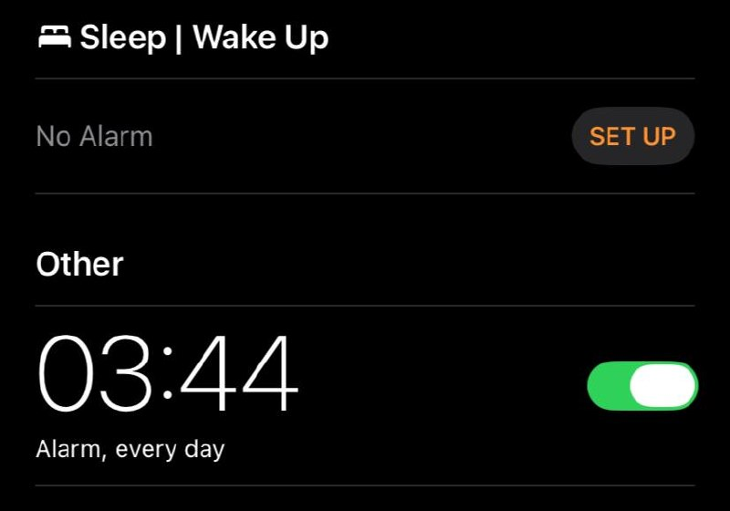

💎 الو
سلام مملکته
این پیامو دارم می‌دم به همراه کلی فحش چون دیگه هیچ کاری از دستم برنمیاد و واقعا عصبی هستم، این ساعتی که تنظیم کردم و نصفه بیدار شدم به خاطر بنزین هست. لعنت به قبر اول و اخرشون، لعنت به مرده و زنده‌شون با این مملکتشون که زندگی برای مردم نذاشتن، این مدت دیگه از بس فحش دادم به اینا خسته شدم.
دیگه حتی خواب هم از مردم گرفتن، روز که مثل سگ داریم برای یه لقمه نون میدویم، الان کار به جایی رسیده باید ساعت بذاریم نصفه شب بریم توی صف بنزین و دیگه خواب شب هم نداشته باشیم.

📝 جیره‌بندی بنزین در ایران؛مسیر هموار شکل‌گیری بازار سیاه سوخت

در حالی که مقامات از مدیریت مصرف سخن می‌گویند، شواهد از سهمیه‌بندی پنهان، شکل‌گیری بازار سیاه و افت شدید کیفیت سوخت حکایت دارد؛ بحرانی زیرساختی که پیوند ناگسستنی سیاست خارجی و معیشت جامعه را عیان‌تر از همیشه می‌کند.

@mamlekate

## VahidOnline — post 75539

  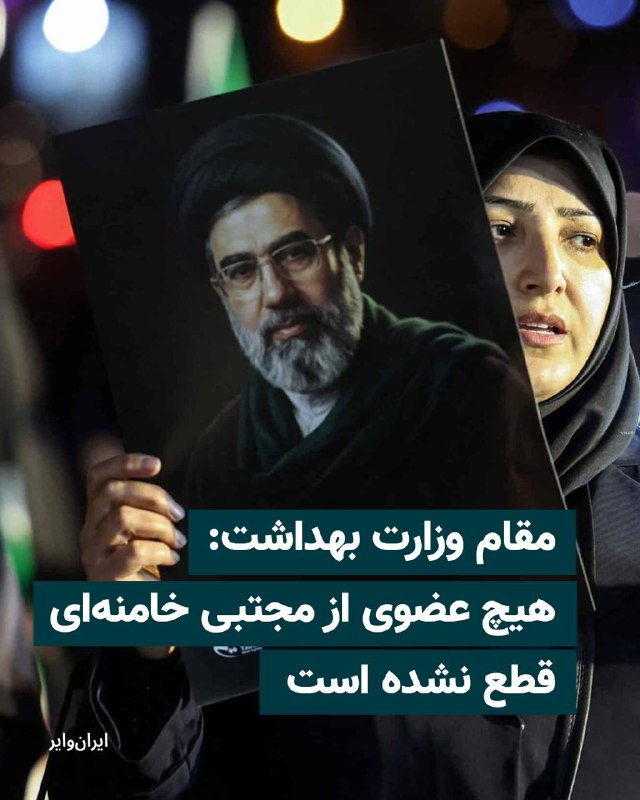

مدیر مرکز روابط عمومی وزارت بهداشت جمهوری اسلامی، روز دوشنبه ۲۸ اردیبهشت مدعی شد که در حمله اسراییل به بیت خامنه‌ای «اتفاق خاصی» برای مجتبی خامنه‌ای نیفتاده و زخم‌های او نه چهره‌اش را مخدوش کرده و نه به قطع عضو انجامیده است.
@VahidHeadline

📡 @VahidOnline

## VahidOnline — post 75538

  

فردریش مرتس گفت که «ما حملات هوایی تازه ایران به امارات و دیگر شرکا را به‌شدت محکوم می‌کنیم.»

صدر‌اعظم آلمان در شبکه اجتماعی ایکس، حمله به «تاسیسات هسته‌ای» را تهدیدی برای ایمنی مردم سراسر منطقه خواند.

امارات متحده دیروز گفت که در حمله پهپادی، ژانراتور برق بیرون محوطه نیروگاه هسته‌ای براکه در نزدیکی ابوظبی آتش گرفته است. امارات در بیانیه‌هایش نامی از کشوری نبرد و فقط گفت پهپاد از «مرز غربی» وارد شده بود.

آقای مرتس در این پست نوشت که «ایران باید وارد مذاکره جدی با آمریکا شود، از تهدید همسایگان خود دست بردارد و تنگه هرمز را بدون هیچ محدودیتی مجددا باز کند.»

اظهارات آقای مرتس درباره مذاکرات ایران و آمریکا اخیرا به تنش لفظی او با دونالد ترامپ منجر شد. او گفته بود مذاکره‌کنندگان ایران آمریکا را «تحقیر» کرده‌اند.
@VahidHeadline

📡 @VahidOnline

## VahidOnline — post 75536

خبرگزاری تسنیم، وابسته به سپاه پاسداران، روز دوشنبه ۲۸ اردیبهشت ماه به نقل از «یک منبع نزدیک به تیم مذاکره‌کننده» جمهوری اسلامی نوشت که تهران «جدیدترین متن خود را در ۱۴ بند به واسطه پاکستانی تحویل داده است و میانجی پاکستانی آن را به آمریکایی‌ها ارائه می‌کند.»
ساعتی پیش از انتشار این خبر رویترز به نقل از یک مقام پاکستانی گزارش کرده بود که اسلام‌آباد یکشنبه شب طرح پیشنهادی اصلاح‌شده جمهوری اسلامی ایران را به واشنگتن تحویل داده است.
@VahidOOnLine
خبرگزاری العربیه، روز دوشنبه ۲۸ اردیبهشت ماه، بر اساس «جزئیات درزکرده» از آخرین نسخه پیشنهادی ایران به آمریکا، از مجموعه‌ای از خواسته‌ها و پیشنهادهای تازه تهران که بر آتش‌بس، تنگه هرمز و پرونده هسته‌ای تمرکز دارد، خبر داد.
طبق این گزارش، ایران خواستار یک آتش‌بس طولانی‌مدت و چندمرحله‌ای شده و همچنین درخواست کرده بازگشایی تنگه هرمز به‌صورت تدریجی و با تضمین‌های امنیتی انجام شود.
بر پایه این اطلاعات، تهران به‌جای برچیدن کامل برنامه هسته‌ای، با یک توقف طولانی‌مدت فعالیت‌های هسته‌ای موافقت کرده است. همچنین پیشنهاد شده انتقال ذخایر اورانیوم غنی‌شده به‌جای آمریکا، به‌صورت مشروط به روسیه انجام شود.
العربیه همچنین گزارش داده ایران از مطالبه دریافت غرامت عقب‌نشینی کرده، اما به‌جای آن خواستار تسهیلات و امتیازات اقتصادی شده است.
بر اساس این گزارش، ایران همچنین خواهان دریافت چندین تضمین بین‌المللی برای هرگونه توافق احتمالی است و تلاش دارد پرونده دریایی و موضوع تنگه هرمز را از پیچیدگی‌های مربوط به مذاکرات هسته‌ای جدا کند.
در بخش دیگری از این گزارش آمده است تهران خواستار نقش‌آفرینی پاکستان و عمان در مدیریت هرگونه تنش یا اصطکاک احتمالی در تنگه هرمز شده و همچنین بر استفاده از ادبیات و چارچوب سیاسی‌ای تاکید دارد که امکان «حفظ وجهه سیاسی جمهوری اسلامی» را فراهم کند
@VahidOOnLine

📡 @VahidOnline

## VahidOnline — post 75535

  

♦️خبرگزاری تسنیم وابسته به سپاه پاسداران، روز دوشنبه ۲۸ اردیبهشت، به نقل از یک منبع نزدیک به تیم مذاکره‌کننده گزارش داد آمریکا در متن جدید پیشنهادی خود، برخلاف متون پیشین، پذیرفته است تحریم‌های نفتی ایران را «در طول دوره مذاکرات» به‌طور موقت تعلیق کند.
به گفته این منبع، آمریکایی‌ها در متن جدید با «تعلیق موقت» (Waive) تحریم‌های نفتی ایران موافقت کرده‌اند. «ویو» به معنای معافیت یا چشم‌پوشی موقت از اجرای تحریم‌ها است و به معنای لغو کامل و دائمی آن‌ها محسوب نمی‌شود.
بر اساس این گزارش، تیم مذاکره‌کننده ایرانی همچنان بر این موضع تاکید دارد که لغو همه تحریم‌های ایران باید بخشی از تعهدات آمریکا باشد. در مقابل، واشنگتن پیشنهاد داده است معافیت‌های مرتبط با اوفک (دفتر کنترل دارایی‌های خارجی وزارت خزانه‌داری آمریکا) تنها تا زمان دستیابی به تفاهم نهایی اعمال شود.
به گزارش تسنیم، این تغییر در متن جدید آمریکا نسبت به پیشنهادهای قبلی، تحول تازه‌ای در روند مذاکرات به شمار می‌رود.
@VahidOOnLine

📡 @VahidOnline

## VahidOnline — post 75534

  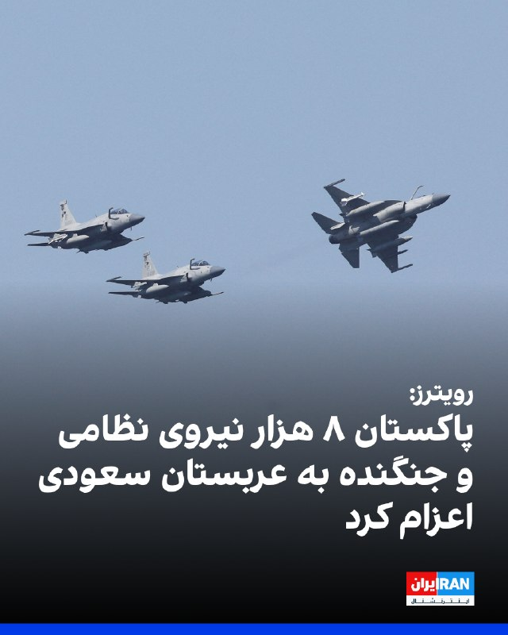

خبرگزاری رویترز به نقل از منابع آگاه گزارش داد پاکستان در چارچوب پیمان دفاعی خود با عربستان سعودی، ۸ هزار نیروی نظامی به همراه یک اسکادران جنگنده و سامانه پدافند هوایی به این کشور اعزام کرده است.

به گزارش رویترز، این نیروها از توان عملیاتی برخوردارند و با هدف حمایت از عربستان سعودی در صورت ازسرگیری حملات علیه این کشور مستقر شده‌اند.

این تحرک نظامی در حالی صورت می‌گیرد که پاکستان نقش اصلی میانجی‌گری میان تهران و واشینگتن را بر عهده دارد.
@VahidOOnLine

📡 @VahidOnline

## VahidOnline — post 75533

  

رئیس کل دادگستری آذربایجان غربی روز دوشنبه ۲۸ اردیبهشت از توقیف اموال ۱۲۹ نفر در این استان با اتهامات امنیتی خبر داد.

ناصر عتباتی از این افراد با عنوان «گروهک‌های ضدانقلاب و تجزیه‌طلب» نام برد و آن‌ها را به «اقدامات ضدامنیتی و همکاری با کشورهای متخاصم» متهم و اعلام کرد که اموال آن‌ها به «نفع ملت» مصادره شده است.

دادگستری آذربایجان غربی اسامی این افراد را اعلام نکرده و برای اتهامات علیه این افراد شواهد و مدارکی ارائه نداده است.

پیش از این نیز گزارش‌های متعددی از توقیف اموال شماری از روزنامه‌نگاران، فعالان سیاسی و مدنی، هنرمندان، ورزشکاران و چهره‌های شناخته‌شده با اتهامات مشابه منتشر شده بود.
@VahidHeadline

📡 @VahidOnline

## VahidOnline — post 75532

  

دونالد ترامپ، رئیس‌جمهور آمریکا می‌گوید مقامات حکومت ایران برای امضای توافق با آمریکا «می‌میرند».

او در گفت‌و‌گو با نشریه تجاری «فورچون» افزوده با این حال آنها در جریان مذاکرات، «روی یک چیزی توافق می‌کنند»، اما «بعد یک کاغذی برایتان می‌فرستند که هیچ ارتباطی با توافقی که کرده‌اید ندارد. من می‌گویم: ‘شما دیوانه‌اید؟’»

ترامپ در این گفت‌و‌گو همچنین بر این نکته تأکید کرده که مقامات جمهوری اسلامی «مدام فریاد می‌زنند» و سروصدا می‌کنند، اما در عمل «تشنه توافق» هستند.
@VahidHeadline

📡 @VahidOnline

## VahidOnline — post 75530

سخنگوی وزارت خارجه ایران می‌گوید روند مذاکرات تهران و واشینگتن، «ادامه‌دار» است و حکومت ایران از ایالات متحده، «اصلاحاتی» در پاسخ به طرح پیشنهادی خود دریافت کرده است.
اسماعیل بقائی در نشست خبری روز دوشنبه ۲۸ اردیبهشت گفت: هفته گذشته، علی‌رغم این‌که طرف‌های آمریکایی به‌صورت علنی اعلام کردند طرح پیشنهادی ایران مردود است «اما ما از طرف میانجی پاکستانی مجموعه نکات و ملاحظات اصلاحی را از نظر آن‌ها دریافت کردیم».
او افزود ایران بعد از این‌که طرح ۱۴ بندی خود را ارائه کرد، «طرف آمریکایی ملاحظاتش را مطرح کرد. متقابلاً ما نیز ملاحظات خود را مطرح کردیم. از روز بعد از ارسال نقطه‌نظر آمریکایی از طرف پاکستان، ما با مجموعه‌ای از پیشنهادات طرف مقابل مواجه شدیم که در این چند روز بررسی شد».
سخنگوی وزارت خارجه ایران به‌دلیل آنچه تبادل «نقطه‌نظرات متقابل» طرفین به یکدیگر نامیده، تأکید کرد که «بنابراین، روند [مذاکرات ]از طریق پاکستان ادامه دارد».
بقائی جزئیاتی در مورد اصلاحات مدنظر ایالات متحده ارائه نکرد.
@VahidHeadline
او همچنین آمریکا را به «خیانت به دیپلماسی» متهم کرد و گفت واشینگتن دیگر «به‌عنوان یک طرف معتبر» در عرصه بین‌المللی تلقی نمی‌شود.
سخنگوی وزارت خارجه جمهوری اسلامی تاکید کرد تهران در مذاکرات با آمریکا همچنان خواهان آزادسازی دارایی‌های بلوکه‌شده ایران و دریافت غرامت جنگی است و این مطالبات را «حق ایران» توصیف کرد.
بقایی همچنین درباره تردد کشتی‌ها در تنگه هرمز گفت موضوع ترتیبات جدید امنیتی در این آبراه صرفا «مالی» نیست و هدف اصلی، حفظ امنیت تردد دریایی و صیانت از «حاکمیت ملی ایران» است.
او همچنین در واکنش به گزارش حمله به یک کشتی کره جنوبی در تنگه هرمز، بدون اشاره مستقیم به عامل حمله گفت «نباید عملیات‌های پرچم دروغین را دست‌کم گرفت» و مدعی شد هنوز مشخص نیست این حادثه توسط چه بازیگری در منطقه انجام شده است.
@VahidHeadline
اسماعیل بقایی، سخنگوی وزارت خارجه جمهوری اسلامی، در پاسخ به پرسشی درباره گزارش‌ها از قصد امارات متحده عربی برای حمله به جمهوری اسلامی و سفر مقام‌های اسرائیلی به این کشور گفت: «ما قرار نیست با گزارش‌ها این واقعیت را از یاد ببریم که تهدید اصلی کدام طرف است.»
بقایی با تهدید کشورهای منطقه از جمله امارات متحده عربی گفت: « اماراتی‌ها از اتفاقاتی که در دو سه ماه اخیر افتاد باید درس بگیرند.»
@VahidOOnLine

📡 @VahidOnline

## VahidOnline — post 75529

  

«نت‌بلاکس» نهاد ناظر بر آزادی اینترنت اعلام کرد قطعی و محدودیت اینترنت در ایران وارد هشتادمین روز خود شده و مدت این خاموشی تاکنون از ۱۸۹۶ ساعت عبور کرده است.

نت‌بلاکس همچنین گزارش داده که هم‌زمان با ادامه محدودیت‌های اینترنتی، محتواهایی در حمایت از حکومت، شبکه‌های اجتماعی در ایران را پر کرده است.

بر اساس این گزارش، برخی شهروندان ایرانی که تلاش کرده‌اند به اینترنت موسوم به «سیم کارت سفید» یا اینترنت ویژه (اینترنت پرو) دسترسی پیدا کنند، گفته‌اند از آن‌ها خواسته شده سهمیه مشخصی از پست‌های تبلیغاتی روزانه در حمایت از حکومت را در صفحات اجتماعی خود منتشر کنند.
@VahidHeadline

📡 @VahidOnline

## VahidOnline — post 75528

  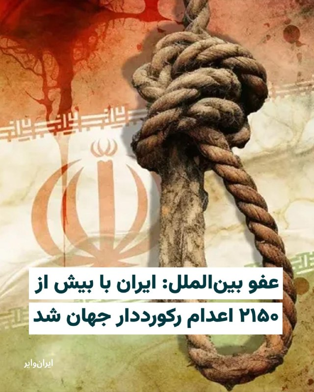

سازمان عفو بین‌الملل روز دوشنبه ۲۸ اردیبهشت گزارش داد که ایران در سال ۲۰۲۵ تعداد «بی‌سابقه» دو هزار و ۱۵۹ نفر را اعدام کرده است؛ رقمی که باعث افزایش آمار جهانی تا بالاترین سطح از سال ۱۹۸۱ به این سو شده است.

این سازمان مستقر در لندن اعلام کرد که در سال ۲۰۲۵ دست‌کم دو هزار و ۷۰۷ نفر در سراسر جهان اعدام شده‌اند، هرچند اعدام‌های انجام‌شده در چین در این آمار لحاظ نشده است.
عفو بین‌الملل گفت «هزاران اعدام» در چین، که بیشترین استفاده را از مجازات اعدام در جهان دارد، انجام شده، اما جزئیات به‌دلیل «محرمانه بودن داده‌های دولتی» در این کشور کمونیستی نامشخص است.

این سازمان افزود که آمار جهانی سال ۲۰۲۵، شامل اعدام‌ها در عربستان سعودی، کویت، مصر، یمن، سنگاپور و ایالات متحده، نسبت به مجموع سال ۲۰۲۴ بیش از دو سوم افزایش داشته است.

در این گزارش آمده است: «این روند بیشترین شدت را در کشورهایی داشته که مقامات در آن‌ها با محدود کردن فضای مدنی، خاموش کردن صداهای مخالف و بی‌اعتنایی به حمایت‌های مقرر در قوانین و استانداردهای بین‌المللی حقوق بشر، کنترل خود بر قدرت را تشدید کرده‌اند».
به نوشته عفو بین‌الملل، «افزایش بی‌سابقه اعدام‌های ثبت‌شده در ایران» در حالی رخ داده که مقام‌های جمهوری اسلامی، به‌ویژه پس از جنگ ۱۲ روزه تابستان پارسال با اسرائیل، «استفاده از مجازات اعدام را به‌عنوان ابزاری برای سرکوب و کنترل سیاسی تشدید کرده‌اند».
عفو بین‌الملل و دیگر گروه‌های حقوق بشری گفته‌اند که پس از اعتراضات گسترده ضدحکومتی در دی‌ماه پارسال و همچنین پس از آغاز جنگ با اسرائیل و ایالات متحده در اسفندماه، استفاده از مجازات اعدام در ایران افزایش یافته است.
@VahidHeadline

📡 @VahidOnline

## kianmeli1 — post 87464

🔴طبق گزارش‌ها، جزیره خارک ایران حداقل ۱۰ روز است که هیچ نفتکشی بارگیری نشده است.
https://t.me/kianmeli1

## kianmeli1 — post 87463

  

🔴کاخ سفید:
آخرین پیشنهاد ایران که امروز ارائه شد نیز به دلیل ناکافی‌ بودن به صورت کامل رد شد،
دیگر بمب ها مذاکره خواهند کرد.
https://t.me/kianmeli1

## kianmeli1 — post 87462

  <a href="telegram/content/kianmeli1_87462_1779121259.mp4">🎬 Download video</a>

🔴آموزش کار با اسلحه در مساجد توسط بسیج
https://t.me/kianmeli1

## kianmeli1 — post 87461

  

🔴خبرگزاری رویترز در گزارشی مدعی شد که پاکستان در طول جنگ ایران، ۸۰۰۰ نیرو، جت جنگنده، پهپاد و سامانه‌های پدافند هوایی را در عربستان سعودی مستقر کرده است. این نیرو شامل جت‌های JF-17، سامانه‌های HQ-9 چینی و تجهیزات تحت مدیریت پاکستان با تأمین مالی ریاض است. این ظرفیت اعزامی از پاکستان، آماده نبرد است و در صورت نیاز می‌تواند به ۸۰۰۰۰ نیرو افزایش یابد.

عربستان و پاکستان سال گذشته پیمان دفاعی مشترک امضا کردند. وزیر پاکستان بعد از آن اعلام کرد که «عربستان سعودی تحت چتر هسته‌ای پاکستان محافظت می‌شود.»
https://t.me/kianmeli1

## kianmeli1 — post 87459

🔴ارتش اسرائیل: IDF در طول شب (یکشنبه) به منطقه بعلبک حمله کرد و وائل محمود عبدالحلیم، که فرمانده جهاد اسلامی فلسطین در منطقه بقاع در لبنان بود را از بین برد.

تنها دو نفر از فرماندهان نظامی حماس که در 7 اکتبر شرکت داشتند زنده مانده‌اند، محمد عوده، رئیس ستاد اطلاعات، و عماد عاقل، رئیس ستاد جبهه داخلی.
https://t.me/kianmeli1

## IranIntlTV — post 337808

  <a href="telegram/content/IranIntlTV_337808_1779121264.mp4">🎬 Download video</a>

صبح دوشنبه مسعود پزشکیان گفت در پی محاصره دریایی از سوی آمریکا، صادرات نفت ایران متوقف شده است. ساعتی پس از انتشار این اظهارات، رسانه‌های دولتی از جمله ایرنا اقدام به حذف صحبت‌های پزشکیان از خروجی خود کردند.

گفت‌وگو با جمشید برزگر، روزنامه‌نگار و تحلیل‌گر سیاسی
@iranintltv

## IranIntlTV — post 337807

  

مستند «تمرین‌هایی برای یک انقلاب» ساخته پگاه آهنگرانی در حاشیه جشنواره فیلم کن، جایزه ویژه هیئت داوران رویداد مستند «گلدن گلوبز» با همکاری بنیاد «آرتمیس رایزینگ» را دریافت کرد؛ رویدادی که با همکاری بخش «کن داکس»، مجله ورایتی و بازار فیلم کن برگزار می‌شود.

این برنامه به مستندهای اجتماعی و سیاسی اختصاص دارد و برگزارکنندگان آن می‌گویند هدفش حمایت از فیلمسازی مستند به‌عنوان ابزاری برای شکل دادن به روایت‌ها و گفت‌وگوهای جهانی است.
https://iranintl.com/202605180953

## IranIntlTV — post 337806

  <a href="telegram/content/IranIntlTV_337806_1779121267.mp4">🎬 Download video</a>

همزمان با ارسال تازه‌ترین پیشنهاد تهران، یک مقام ارشد جمهوری اسلامی به رویترز گفت آمریکا درباره فعالیت‌های هسته‌ای محدود تهران انعطاف نشان داده. اما سی‌ان‌ان خبر داد پنتاگون گزینه‌های نظامی مختلف علیه ایران را روی میز گذاشته و ترامپ سه‌شنبه تصمیم می‌گیرد.
گزارشی از مجتبا پورمحسن
@iranintltv

## IranIntlTV — post 337805

  <a href="telegram/content/IranIntlTV_337805_1779121270.mp4">🎬 Download video</a>

یک شهروند با ارسال پیامی به ایران‌اینترنشنال می‌گوید به دلیل قطعی اینترنت، حدود سه ماه است که بیکار شده است.

## IranIntlTV — post 337804

  

اکسیوس به نقل از یک مقام ارشد آمریکایی و یک منبع مطلع گزارش داد تهران پیشنهاد تازه‌ای برای توافق به‌منظور پایان جنگ ارائه کرده، اما کاخ سفید این پیشنهاد را پیشرفت معناداری نمی‌داند و آن را برای دستیابی به توافق کافی ارزیابی نکرده است.

به گفته مقام‌های آمریکایی، دونالد ترامپ همچنان خواهان توافق برای پایان جنگ است، اما به‌دلیل رد بسیاری از خواسته‌های واشینگتن از سوی تهران و خودداری جمهوری اسلامی از ارائه امتیازهای قابل‌توجه در برنامه هسته‌ای، گزینه ازسرگیری حملات نظامی را نیز بررسی می‌کند.
https://iranintl.com/202605182409

## IranIntlTV — post 337803

  

مدیر مرکز روابط عمومی و اطلاع‌رسانی وزارت بهداشت درباره وضعیت مجتبی خامنه‌ای گفت: «اتفاق خاصی برای او رخ نداده بود و صرفا چند زخم برداشته بودند.»
این مقام وزارت بهداشت تاکید کرد: «زخم‌ها از نوعی نبودند که چهره ایشان را مخدوش کنند» و اضافه کرد مجتبی خامنه‌ای جانباز نشده و قطع عضو نداشته و تنها در محل جراحت روی پای او چند بخیه زده شده است.
https://iranintl.com/202605189680

## IranIntlTV — post 337802

  

دونالد ترامپ، رییس‌جمهور آمریکا در پستی در شبکه اجتماعی تروث سوشال از برخی رسانه‌ها و دموکرات‌ها در زمینه جنگ علیه جمهوری اسلامی انتقاد کرد.

او نوشت: «اگر ایران تسلیم شود، اعتراف کند که نیروی دریایی‌اش نابود شده و در کف دریا آرام گرفته است، و نیروی هوایی‌اش دیگر در میان ما نیست، و اگر کل ارتش آن‌ها در حالی که سلاح‌ها را زمین گذاشته و دست‌ها را بالا برده‌اند از تهران خارج شوند و هر کدام با فریاد "من تسلیم می‌شوم، من تسلیم می‌شوم" پرچم سفید تسلیم را به شدت تکان دهند، و اگر تمام رهبری باقی‌مانده آن‌ها همه «اسناد تسلیم» لازم را امضا کنند و شکست خود را در برابر قدرت و نیروی عظیم ایالات متحده باشکوه بپذیرند، آن‌وقت روزنامه شکست‌خورده نیویورک تایمز، چاینا استریت ژورنال (همان وال‌استریت ژورنال!)، سی‌ان‌انِ فاسد و اکنون بی‌اهمیت، و همه اعضای دیگر رسانه‌های اخبار جعلی (فیک نیوز)، تیتر خواهند زد که ایران یک پیروزی استادانه و درخشان بر ایالات متحده آمریکا داشته و اصلاً حتی نزدیک هم نبوده است.»

ترامپ افزود: «دموکرات‌های احمق و رسانه‌ها کاملا راه خود را گم کرده‌اند. آن‌ها کاملا دیوانه شده‌اند!!!»
https://iranintl.com/20

## IranIntlTV — post 337801

  <a href="telegram/content/IranIntlTV_337801_1779121275.mp4">🎬 Download video</a>

مجله آتلانتیک در مقاله‌ای تحلیلی، نحوه حکمرانی جمهوری اسلامی و امارات را با یکدیگر مقایسه کرده است. این مقایسه فقط به سیاست محدود نمی‌شود و در آن اقتصاد، کیفیت زندگی و آینده مردم نیز بررسی شده است.

مهدی بیگی، عضو تحریریه ایران‌اینترنشنال، در «پیوست» امروز نگاهی دارد به آنچه آتلانتیک آن را «نبرد شاهین و لاشخور» نامیده است.
@iranintltv

## IranIntlTV — post 337800

  <a href="telegram/content/IranIntlTV_337800_1779121277.mp4">🎬 Download video</a>

یک دانش‌آموز با ارسال پیامی به ایران‌اینترنشنال می‌گوید: «نمی‌دانم باید امتحانات رو چکار کنم. یک اینترنت داخلی داریم که آن هم کار نمی‌کند تا بتوانیم درس بخوانیم.»

## IranIntlTV — post 337799

  <a href="telegram/content/IranIntlTV_337799_1779121280.mp4">🎬 Download video</a>

در میانه تلاش‌های میانجی‌گرانه پاکستان برای انتقال پیام‌ها میان جمهوری اسلامی و آمریکا، دونالد ترامپ به مجله فورچون گفت مقام‌های جمهوری اسلامی برای امضای توافق «بی‌تاب» هستند.

گفت‌وگو با سمیرا قرایی و بابک اسحاقی، خبرنگاران ایران‌اینترنشنال
@iranintltv

## IranIntlTV — post 337798

  <a href="telegram/content/IranIntlTV_337798_1779121282.mp4">🎬 Download video</a>

آژانس رسمی همکاری پلیس در اتحادیه اروپا اعلام کرد در یک عملیات هماهنگ، شبکه تبلیغاتی آنلاین مرتبط با سپاه پاسداران را هدف قرار داده است. یوروپل گزارش داد در جریان تحقیقات درباره این شبکه، محتوایی شامل ویدیوهای تولیدشده با هوش مصنوعی، پیام‌های تبلیغاتی و فراخوان‌هایی برای انتقام‌گیری از کشته شدن علی خامنه‌ای شناسایی شده است.

علی حسن‌پور، خبرنگار ایران‌اینترنشنال، گزارش می‌دهد
@iranintltv

## IranIntlTV — post 337797

  <a href="telegram/content/IranIntlTV_337797_1779121285.mp4">🎬 Download video</a>

آژانس رسمی همکاری پلیس در اتحادیه اروپا اعلام کرد در یک عملیات هماهنگ، شبکه تبلیغاتی آنلاین مرتبط با سپاه پاسداران را هدف قرار داده است. یوروپل گزارش داد در جریان تحقیقات درباره این شبکه، محتوایی شامل ویدیوهای تولیدشده با هوش مصنوعی، پیام‌های تبلیغاتی و فراخوان‌هایی برای انتقام‌گیری از کشته شدن علی خامنه‌ای شناسایی شده است.

علی حسن‌پور، خبرنگار ایران‌اینترنشنال، گزارش می‌دهد
@iranintltv

## IranIntlTV — post 337796

  

وزارت خارجه عمان حمله پهپادی یک‌شنبه به عربستان سعودی را محکوم کرد.
عمان در بیانیه‌ای اعلام کرد هرگونه اقدام خصمانه را مردود می‌داند و از عربستان سعودی برای حفظ امنیت و ثبات خود حمایت می‌کند.
مسقط همچنین بر خویشتنداری و حل مسائل منطقه‌ای از مسیرهای دیپلماتیک تاکید کرد.
https://iranintl.com/202605188454

## IranIntlTV — post 337795

  <a href="telegram/content/IranIntlTV_337795_1779121287.mp4">🎬 Download video</a>

سرخط خبرهای دوشنبه ۲۸ اردیبهشت
@iranintltv

## IranIntlTV — post 337794

  <a href="telegram/content/IranIntlTV_337794_1779121289.mp4">🎬 Download video</a>

🔻باشگاه استقلال در حالی مدت‌هاست مدیرعامل ندارد که علی تاجرنیا همه‌کاره این باشگاه است و انتشار سندهای مالی این باشگاه نشان می‌دهد که استقلال با بحران مالی شدید مواجه است و خطر توقیف اموال این باشگاه را تهدید می‌کند.

🔹توضیحات مزدک میرزایی، ایران‌اینترنشنال در برنامه هت‌تریک

🔹تماشای نسخه کامل هت‌تریک؛👇
https://youtu.be/gw3eJ0R9R5Y

@iranintltvsport

## IranIntlTV — post 337793

  

فرماندهی مرکزی ایالات متحده، سنتکام، اعلام کرد از زمان آغاز محاصره دریایی بنادر و سواحل جنوبی ایران، ۸۴ کشتی تجاری مجبور به تغییر مسیر شده‌اند و چهار شناور دیگر نیز پس از هدف قرار گرفتن، از کار افتاده‌اند تا اجرای این محاصره تضمین شود.
https://iranintl.com/202605181759

## IranIntlTV — post 337792

  <a href="telegram/content/IranIntlTV_337792_1779121292.mp4">🎬 Download video</a>

تیم ملی فوتبال برای برپایی آخرین اردوی آماده‌سازی پیش از حضور در جام جهانی ۲۰۲۶ وارد ترکیه شد. مهدی محمدنبی درباره وضعیت صدور ویزای اعضای تیم برای سفر به‌ آمریکا گفت در صورت صادر نشدن ویزای برخی بازیکنان، فدراسیون برنامه‌های مختلفی در نظر دارد.

گفت‌وگو با محمد تقوی، ایران‌اینترنشنال
@iranintltv

## IranIntlTV — post 337791

  

محمدجعفر قائم‌پناه، معاون اجرایی پزشکیان، گفت: «بر اساس نظرسنجی مرکز ریاست‌جمهوری، ۷۰ درصد مردم مخالف محدودیت اینترنت هستند.»

او افزود: «محدودیت‌ها در دی‌ماه و در زمان جنگ، با منطق مدیریت بحران، صیانت از امنیت ملی، جان و آرامش عمومی صورت گرفت.»

قائم‌پناه اضافه کرد: «جامعه‌ای که صادقانه با آن سخن گفته شود، تاب‌آورتر و همراه‌تر خواهد بود.»
https://iranintl.com/202605183897

## IranIntlTV — post 337790

  <a href="telegram/content/IranIntlTV_337790_1779121295.mp4">🎬 Download video</a>

وزیران اقتصاد گروه هفت، دوشنبه ۲۸ اردیبهشت در پاریس گردهم آمدند تا برای مقابله با تنش‌های اقتصاد جهانی گفت‌وگو کنند. وزیر خزانه‌داری آمریکا در حاشیه روز اول نشست، خواستار از کار انداختن ماشین جنگی جمهوری اسلامی شد.

گفت‌وگو با ساجده شریفی، روزنامه‌نگار
@iranintltv

## IranIntlTV — post 337789

  <a href="telegram/content/IranIntlTV_337789_1779121297.mp4">🎬 Download video</a>

وزارت دادگستری ایالات متحده اعلام کرد محمدباقر الساعدی، عضو ارشد کتائب حزب‌الله عراق، با ۶ اتهام تروریستی در نیویورک محاکمه می‌شود. حمله به کنسولگری آمریکا در تورنتو و دو حمله در کانادا، بخشی از اتهامات اوست.

گزارش مهسا مرتضوی، خبرنگار ایران‌اینترنشنال
@iranintltv

## Shin_Persian — post 6063

Shin ✓ @hey_itsmyturn
Mon, 18 May 2026 14:45:44 UTC

President Trump @POTUS:
"If Iran surrenders, admits their Navy is gone and resting at the bottom of the sea, and their Air Force is no longer with us, and if their entire Military walks out of Tehran, weapons dropped and hands held high, each shouting “I surrender, I surrender” while wildly waving the representative White Flag, and if their entire remaining Leadership signs all necessary “Documents of Surrender,” and admit their defeat to the great power and force of the magnificent U.S.A., The Failing New York Times, The China Street Journal (WSJ!), Corrupt and now Irrelevant CNN, and all other members of the Fake News Media, will headline that Iran had a Masterful and Brilliant Victory over The United States of America, it wasn’t even close. The Dumacrats and Media have totally lost their way. They have gone absolutely CRAZY!!! President DJT"

فارسی

رئیس‌جمهور ترامپ @POTUS:

«اگر ایران تسلیم شود، اعتراف کند که نیروی دریایی‌شان نابود شده و در کف دریا آرمیده است، و نیروی هوایی‌شان دیگر در میان ما نیست، و اگر تمام نظامیانشان از تهران خارج شوند، در حالی که سلاح‌ها را زمین گذاشته و دست‌ها را بالا برده‌اند و هر یک فریاد می‌زنند "من تسلیم هستم، من تسلیم هستم" و همزمان پرچم سفیدِ نشان‌دهنده تسلیم را دیوانه‌وار تکان می‌دهند، و اگر تمام رهبریِ باقی‌مانده آن‌ها همه "اسناد تسلیم" لازم را امضا کنند، و شکست خود را در برابر قدرت و نیروی عظیم ایالات متحده (USA) باشکوه بپذیرند، نیویورک تایمزِ در حال شکست، چاینا استریت ژورنال (وال استریت ژورنال!)، سی‌ان‌انِ فاسد و حالا بی‌ارزش، و تمام دیگر اعضای رسانه‌های اخبار جعلی، تیتر خواهند زد که ایران پیروزی مقتدرانه و درخشانی بر ایالات متحده آمریکا داشته است و [شکست آمریکا] حتی نزدیک هم نبوده است. دموکرات‌ها و رسانه‌ها کاملاً راه خود را گم کرده‌اند. آن‌ها مطلقاً دیوانه شده‌اند!!! رئیس‌جمهور دی.جی.تی»

𝕏 · @shin_persian

## Shin_Persian — post 6062

  

Shin ✓ @hey_itsmyturn
Mon, 18 May 2026 13:07:22 UTC

1246Z
Smoke rising from southern Tehran,
Camera POV: Yadegar Highway -&gt; South

#Tehran Province, #Iran

فارسی

۱۲۴۶ زولو (۱۶:۱۶ به وقت تهران)
برخاستن دود از جنوب تهران،
زاویه دوربین: بزرگراه یادگار امام -> جنوب

#Tehran Province, #Iran

𝕏 · @shin_persian

## ManotoTV — post 105601

  <a href="telegram/content/ManotoTV_105601_1779121300.mp4">🎬 Download video</a>

تماسی از ایران:
«خانواده‌های بچه‌های دربند رو برای کمک‌رساندن دریابیم»

## ManotoTV — post 105600

  <a href="telegram/content/ManotoTV_105600_1779121303.mp4">🎬 Download video</a>

عفو بین‌الملل اعلام کرد شمار اعدام‌ها در جهان در سال ۲۰۲۵ به بالاترین سطح ثبت‌شده در ۴۴ سال گذشته رسیده و ایران با ثبت دست‌کم ۲۱۵۹ اعدام، عامل اصلی این افزایش بوده است.

بر اساس گزارش سالانه این سازمان، در مجموع دست‌کم ۲۷۰۷ نفر در ۱۷ کشور اعدام شده‌اند؛ آماری که نسبت به سال ۲۰۲۴ حدود ۷۸ درصد افزایش نشان می‌دهد.

عفو بین‌الملل اعلام کرد شمار اعدام‌ها در ایران بیش از دو برابر سال گذشته شده و ایران پس از چین، که آمار رسمی اعدام‌هایش منتشر نمی‌شود، در صدر کشورهای مجری اعدام قرار دارد.

در این گزارش آمده است عربستان سعودی با دست‌کم ۳۵۶ اعدام در رتبه بعدی قرار گرفته و بخش قابل توجهی از این احکام به جرایم مرتبط با مواد مخدر مربوط بوده است.

بر اساس این گزارش، آمریکا نیز شمار اعدام‌های خود را از ۲۵ مورد در سال ۲۰۲۴ به ۴۷ مورد در سال ۲۰۲۵ افزایش داده است. شمار اعدام‌ها در مصر، سنگاپور و کویت نیز نسبت به سال قبل افزایش یافته است.

عفو بین‌الملل همچنین اعلام کرد چین، مصر، جمهوری اسلامی، عراق، کره شمالی، عربستان سعودی، سومالی، آمریکا، ویتنام و یمن در پنج سال گذشته به‌طور مداوم اعدام انجام داده‌اند.

## ManotoTV — post 105599

  <a href="telegram/content/ManotoTV_105599_1779121304.mp4">🎬 Download video</a>

با تهدید «حق تیر داریم» مانع برگزاری مراسم زادروز بهار شاه‌مهری شدند

بر اساس ویدیوی ارسالی به منوتو، نیروهای حکومتی با تهدید خانواده بهار شاه‌مهری و گفتن جمله «ما حق تیر داریم»، اجازه برگزاری مراسم زادروز این جاویدنام را در ۱۹ اردیبهشت ندادند.

بهار شاه‌مهری، نوجوان ۱۷ ساله اهل نیشابور، غروب ۱۹ دی‌ماه ۱۴۰۴ در جریان انقلاب شیر و خورشید ایران، در کوچه‌ای خلوت از پشت سر هدف شلیک مستقیم تک‌تیرانداز نیروهای سرکوبگر جمهوری اسلامی قرار گرفت و جان باخت.

به گفته نزدیکان او، چند روز پیش از سالروز تولد بهار، اعضای خانواده‌اش بازداشت و بازجویی شدند و مسیرهای منتهی به مزار او در روز تولدش بسته شد تا از برگزاری مراسم جلوگیری شود.

همچنین گزارش شده است که سنگ مزار بهار شاه‌مهری روز دوم فروردین ۱۴۰۶ شکسته شده بود.
این فشارها بخشی از روند گسترده‌تر سرکوب خانواده‌های جان‌باختگان است؛ حتی بعد از کشتن، از گل گذاشتن و تولد گرفتن هم می‌ترسند. عجب شجاعتی، حکومت با سنگ قبر می‌جنگد.

## ManotoTV — post 105598

  <a href="telegram/content/ManotoTV_105598_1779121306.mp4">🎬 Download video</a>

دونالد ترامپ، رئیس‌جمهوری آمریکا، در پیامی در تروث‌سوشال ، رسانه‌های آمریکایی را متهم کرد که حتی در صورت «تسلیم کامل ایران» نیز آن را به‌عنوان پیروزی توصیف خواهند کرد.

ترامپ در این پیام نوشت اگر جمهوری اسلامی شکست خود را بپذیرد، نیروهای نظامی‌اش تسلیم شوند و رهبرانش «اسناد تسلیم» را امضا کنند، باز هم رسانه‌هایی چون نیویورک‌تایمز، وال‌استریت ژورنال و سی‌ان‌ان این اتفاق را «پیروزی ایران» جلوه خواهند داد.

او با اشاره به نابودی نیروی دریایی و نیروی هوایی ایران نوشت: «اگر ایران تسلیم شود، بپذیرد که نیروی دریایی‌اش در کف دریا نابود شده و نیروی هوایی‌اش دیگر وجود ندارد، و اگر نیروهای نظامی‌اش با دست‌های بالا و پرچم سفید از تهران خارج شوند، باز هم رسانه‌های فیک‌نیوز خواهند گفت ایران پیروزی درخشانی مقابل آمریکا به دست آورده است.»

ترامپ همچنین رسانه‌های جریان اصلی آمریکا را «فاسد» و «بی‌اهمیت» توصیف کرد و نوشت: «دموکرات‌ها و رسانه‌ها کاملا راه خود را گم کرده‌اند. آن‌ها کاملا دیوانه شده‌اند.»

## ManotoTV — post 105597

  

ارتش اسرائیل می‌گوید در حمله‌ای هوایی به منطقه بعلبک در شرق لبنان، وائل محمود عبدالحلیم، فرمانده جهاد اسلامی در منطقه بقاع، کشته شده است. به گفته ارتش اسرائیل، او در هماهنگی عملیات‌های جهاد اسلامی در کنار حزب‌الله لبنان نقش داشته است.

## ManotoTV — post 105596

  <a href="telegram/content/ManotoTV_105596_1779121308.mp4">🎬 Download video</a>

رویترز در گزارشی اختصاصی نوشت پاکستان در جریان جنگ ایران، هشت هزار نیرو، یک اسکادران جنگنده و یک سامانه پدافند هوایی به عربستان سعودی اعزام کرده است.

بر اساس این گزارش، این اعزام در چارچوب پیمان دفاعی دوجانبه اسلام‌آباد و ریاض انجام شده و شامل حدود ۱۶ جنگنده، عمدتا از نوع جی‌اف‌ـ۱۷ ساخت مشترک پاکستان و چین، دو اسکادران پهپاد و سامانه پدافند هوایی چینی اچ‌کیو‌ـ۹ است. منابع رویترز گفتند عربستان هزینه این اعزام را تامین می‌کند و تجهیزات را نیروهای پاکستانی اداره می‌کنند.

پنج منبع امنیتی و دولتی به رویترز گفتند این نیروها با هدف حمایت از ارتش عربستان در صورت حملات بیشتر به این کشور مستقر شده‌اند.

## ManotoTV — post 105595

  <a href="telegram/content/ManotoTV_105595_1779121309.mp4">🎬 Download video</a>

رسانه‌های ترکیه گزارش دادند فرخنده قائم‌مقامی، زن ایرانی ساکن منطقه مال‌تپه استانبول، پس از قتل، جسدش در استان قرشهر پیدا شده است.

بر اساس گزارش خبرگزاری «دمیراورن»، خانم قائم‌مقامی از ۲۲ فروردین ناپدید شده بود و نزدیکان او پس از بی‌خبری، در ۲۳ اردیبهشت گزارش مفقودی ثبت کردند.

پلیس ترکیه در تحقیقات خود «ارکان ب»، ۴۹ ساله، را به‌عنوان آخرین فردی شناسایی کرد که با این زن ایرانی در تماس بوده است. بنا بر این گزارش، او ابتدا اتهام‌ها را رد کرد، اما بعدا به قتل اعتراف کرد.

دمیراورن نوشت مظنون در اعترافات خود گفته است پس از مشاجره در خودرو، قائم‌مقامی را با قلاده سگش خفه کرده، جسد او را تکه‌تکه کرده و در زمینی خالی در شهرستان موجور استان قرشهر رها کرده است.

در ادامه تحقیقات، دو مظنون دیگر نیز بازداشت شدند. سه مظنون این پرونده پس از پایان بازجویی در اداره پلیس، به دادگاه منتقل شدند.

## ManotoTV — post 105594

  <a href="telegram/content/ManotoTV_105594_1779121310.mp4">🎬 Download video</a>

بر اساس گزارش رسانه‌های حقوق بشری، نیروهای حکومتی روز ۱۵ اردیبهشت با یورش به خانه «افسانه جذابی (راسخی)»، شهروند بهائی ساکن شیراز، منزل او را تفتیش کردند و بخشی از اموال شخصی او را با خود بردند.

در این گزارش‌ها آمده است یک زن و سه مرد با ارائه حکمی با عنوان «همکاری با اسرائیل» وارد خانه این خانواده شدند و خانم جذابی و مادر ۸۵ ساله او را مورد تهدید و تحقیر قرار دادند. خانم جذابی به‌تازگی همسر خود را از دست داده و از مادر سالخورده و بیمار خود مراقبت می‌کند.

به گفته این رسانه‌ها، ماموران حکومتی به او گفتند فرزندش در خارج از کشور در فضای مجازی و کمپین‌های حقوق بشری فعالیت می‌کند و تهدید کردند در صورت ادامه این فعالیت‌ها، «هم برای شما و هم برای آنها گران تمام می‌شود.» آنها همچنین این خانواده را به مصادره خانه تهدید کردند.

بر اساس این گزارش‌ها، نیروهای امنیتی همچنین این خانواده را با عباراتی مانند «فرقه» و «همدست اسرائیل» خطاب کردند و چند بار خانم جذابی را به دستبند زدن و انتقال به مکانی نامعلوم تهدید کردند.

این یورش چند ساعت ادامه داشت و در پایان، خانم جذابی و مادر سالخورده‌اش که دچار افت فشار خون شده بود، مجبور شدند برگه‌ای را امضا کنند که در آن نوشته شده بود هیچ خسارتی به خانه و وسایل وارد نشده است. در این رویداد هیچ‌یک از اعضای خانواده بازداشت نشدند.

## ManotoTV — post 105593

  <a href="telegram/content/ManotoTV_105593_1779121311.mp4">🎬 Download video</a>

روزنامه ایران وابسته به دولت جمهوری اسلامی در گزارشی نوشت محدودیت دسترسی به اینترنت بین‌الملل، بازار خرید و فروش سیم‌کارت‌های عراقی را در برخی مناطق مرزی غرب ایران رونق داده است.

بر اساس این گزارش، بیشترین متقاضیان این سیم‌کارت‌ها تجار، بازرگانان، صاحبان بار، رانندگان ترانزیتی و فعالان اقتصادی مرزی هستند که برای ارتباط با طرف‌های عراقی، ارسال اسناد، حواله‌های مالی، رسیدها، عکس و فیلم کالاها از پیام‌رسان‌هایی مانند واتس‌اپ و تلگرام استفاده می‌کنند.

نعیم احمدی، مدیر روابط عمومی استانداری خوزستان، به این روزنامه گفت این سیم‌کارت‌ها در عمق یک تا دو کیلومتری خاک ایران قابل استفاده‌اند و در مناطقی مانند شلمچه، چذابه، خرمشهر، اروندکنار و جزیره مینو به گزینه‌ای در دسترس برای فعالان اقتصادی تبدیل شده‌اند. به گفته او، ارزانی این سیم‌کارت‌ها در مقایسه با هزینه فیلترشکن‌ها از عوامل گرایش به آنهاست.

در همین حال، محمد شفیعی، فرماندار قصرشیرین، استفاده از سیم‌کارت‌های عراقی در کرمانشاه را عمدتا محدود به تجار، صاحبان بار، رانندگان ترانزیتی و فعالان اقتصادی دانست و فراگیر شدن آن در میان عموم مردم را رد کرد.

## ManotoTV — post 105592

  

فریدریش مرتس، صدراعظم آلمان، حملات تازه جمهوری اسلامی علیه کشورهای منطقه را به‌شدت محکوم کرد و گفت حمله به تأسیسات هسته‌ای «تهدیدی برای امنیت مردم در سراسر منطقه» است.

او در پیامی در ایکس تأکید کرد که نباید خشونت‌ها بیش از این تشدید شود و از جمهوری اسلامی خواست وارد مذاکرات جدی با آمریکا شود، تهدید همسایگانش را متوقف کند و تنگه هرمز را بدون محدودیت باز کند.

این موضع‌گیری پس از آن مطرح شد که امارات از آتش‌سوزی در محدوده نیروگاه هسته‌ای براکه پس از حمله پهپادی خبر داد. مقام‌های اماراتی اعلام کردند این حادثه تلفات جانی و خطر تشعشعاتی نداشته است. عربستان سعودی نیز هم‌زمان از رهگیری حملات پهپادی تازه خبر داده است.

فریدریش مرتس، صدراعظم آلمان، حملات تازه منسوب به جمهوری اسلامی علیه کشورهای منطقه را محکوم کرد و گفت حمله به تأسیسات هسته‌ای امنیت مردم منطقه را تهدید می‌کند.

او از جمهوری اسلامی خواست وارد مذاکرات جدی با آمریکا شود، تهدید همسایگانش را متوقف کند و تنگه هرمز را بدون محدودیت باز کند. این موضع‌گیری پس از حمله پهپادی به محدوده نیروگاه هسته‌ای براکه در امارات و رهگیری حملات پهپادی تازه از سوی عربستان مطرح شده است.

## FarsiVOA — post 218071

🔺جمهوری اسلامی در مقابل مردم ایران؛ سرکوب و برخورد با مخالفان در دستورکار روزانه قوه قضائیه

▪️جمهوری اسلامی که در ماه‌های گذشته و به ویژه پس از اعتراضات دی و عملیات نظامی آمریکا و اسرائیل علیه رژیم، سرکوب را شدت بخشیده است، همه روزه احکام تازه‌ای را علیه مخالفان خود صادر می‌کند.

⬇️ بیشتر بخوانید:

https://ir.voanews.com/a/iran-protests-jale-mohseni-ejei-rules/8150913.html/?nocach=1

## FarsiVOA — post 218070

🔺نرگس محمدی از بیمارستان مرخص شد؛ هشدار درباره نیاز به فیزیوتراپی در بیمارستان

▪️بنیاد نرگس روز دوشنبه ۲۸ اردیبهشت، از ترخیص نرگس محمدی از بیمارستان پارس تهران خبر داد و اعلام کرد این زندانی سیاسی باید دست‌کم به‌مدت یک ماه هر روز با مراجعه به بیمارستان، تحت فیزیوتراپی قرار بگیرد.

⬇️ بیشتر بخوانید:

https://ir.voanews.com/a/narges-mohammadi-jale-hospital-/8151229.html/?nocach=1

## FarsiVOA — post 218069

🔺دیدگاه | داستان‌سرایان پسامرگ خامنه‌ای؛ هدف مجیزگویی، نتیجه تخریب

◾️روند قصه‌گویی افراد از دیدار و بده‌بستان با علی خامنه‌ای، رهبر پیشین جمهوری اسلامی، بعد از مرگ او، همچنان ادامه دارد. گاه شتاب این قصه‌ها که روشن نیست کدام‌شان و چه قدر از هر کدام، برساخته ذهن آدم‌ها است و چند درصدشان به واقع روی داده‌، چنان زیاد می‌شود که ممکن است این روزها بسیاری از آنها از دستمان در رفته باشد

⬇️ بیشتر بخوانید:

https://ir.voanews.com/a/ali-khamenei-posthumous-miraculous/8150892.html

## FarsiVOA — post 218068

اگرچه جهان به روزنامه‌نگاری مستقل در ایران احترام می‌گذارد اما روزنامه‌نگاران ایرانی نه فقط از سوی جمهوری اسلامی سرکوب می‌شوند که هدف حملات برخی گروه‌های مخالف حکومت هم هستند. آیا این شرایط توانسته روایتگریِ روزنامه‌نگاران را متوقف کند؟

## FarsiVOA — post 218067

  <a href="telegram/content/FarsiVOA_218067_1779121313.mp4">🎬 Download video</a>

از نمایش پهپاد صورتی رنگ در تجمع‌های شبانه حکومتی تا پهپاد در عقدنامه ازدواج؛ در ادامه تبلیغات دوران آتش‌بس جمهوری اسلامی و تلاش برای مدیریت محتوا در اوج تنش، یک عروس و داماد حامی حکومت در برنامه صداوسیما اعلام کردند مهریه عروس یک «پهپاد شاهد» تعیین شده است.

این نوع محتوای تبلیغاتی شامل حضور زنان بی‌حجاب و نمایش تسلیحات جنگی در تجمع‌های شبانه‌ طرفداران حکومت، مجریان مسلح در صداوسیما، معرفی ابزار جنگ به عنوان مهریه و تلاش برای عادی‌سازی خشونت و ترویج فضای امنیتی در ایران واکنش‌های کاربران را در این باره برانگیخته است که چگونه جمهوری اسلامی از فاجعه جنگ برای خود تبلیغات درست می‌کند.

## FarsiVOA — post 218066

پگاه آهنگرانی با «تمرین‌هایی برای یک انقلاب» برنده جایزه ویژه هیئت داوران گلدن گلوب شد. این جایزه، که برای دومین سال متوالی در کن اهدا می‌شود، از فیلمسازانی تقدیر می‌کند که اثرشان روایتگری استثنایی و سهمی معنادار در سینمای مستند داشته باشد، به‌ویژه آثاری که به مسائل فوری جهانی و اجتماعی می‌پردازند.امسال جایزه «گلدن گلوب» به کارگردان فیلم «گراندزوِل» اهدا شد.

## FarsiVOA — post 218065

  

«یواس‌اس دلبرت دی. بلک» هنگام عبور از دریای عرب در حمایت از عملیات دریایی آمریکا علیه حوثی‌های مورد حمایت جمهوری اسلامی ایران در حال انجام ماموریت هستند.

سنتکام اعلام کرد تا روز ۲۸ اردیبهشت، نیروهای این فرماندهی مسیر ۸۴ کشتی تجاری را تغییر داده‌اند و چهار هدف را نیز از کار انداخته‌اند.

@FarsiVOA

## FarsiVOA — post 218064

🔺انتقاد پرزیدنت ترامپ از رویکرد برخی رسانه‌ها در رابطه با عملیات نظامی علیه رژیم ایران

▪️دونالد ترامپ، رئیس جمهوری ایالات متحده، روز دوشنبه ۲۸ اردیبهشت در پیامی در شبکه «تروت سوشال» ضمن تاکید دوباره بر شکست نظامی رژیم ایران، نوشت که رسانه‌های منتقد دولت او حتی در صورت تسلیم کامل جمهوری اسلامی نیز واقعیت را وارونه جلوه خواهند داد.

⬇️ بیشتر بخوانید:

https://ir.voanews.com/a/president-trump-truth-social-criticism-of-media-coverage-of-iran-war/8151224.html/?nocach=1

## FarsiVOA — post 218063

عراق دوباره در کانون تنش؛ حمله پهپادی به عربستان سعودی و بازگشت پرونده پهپادهای عراقی

## FarsiVOA — post 218062

نت‌بلاکس اعلام کرد خاموشی اینترنت در ایران وارد روز هشتادم شده و از مرز ۱۸۹۶ ساعت گذشته است. هم‌زمان رسانه‌های داخلی از ممنوعیت تبلیغ و فروش «اینترنت پرو» خبر دادند.

به گفته نت‌بلاکس، نهاد ناظر بر اختلالات اینترنت، هم‌زمان با قطع دسترسی گسترده کاربران ایرانی به اینترنت جهانی، محتوای حامی جمهوری اسلامی در شبکه‌های اجتماعی افزایش یافته است.

نت‌بلاکس همچنین نوشت برخی ایرانیانی که برای دریافت دسترسی ویژه یا قرار گرفتن در «فهرست سفید» اقدام کرده‌اند، می‌گویند از آنها خواسته شده برای حفظ این دسترسی، سهمیه‌ای از پست‌های تبلیغاتی روزانه منتشر کنند؛ روندی که به گفته این نهاد، با هوش مصنوعی کنترل می‌شود.

گزارش کامل را در وب‌سایت صدای آمریکا بخوانید.

@FarsiVOA

## FarsiVOA — post 218061

🔺کشته شدن یک فرمانده جهاد اسلامی در حمله ارتش اسرائیل به بقاع

▪️ارتش اسرائیل روز دوشنبه ۲۸ اردیبهشت، از کشته شدن وائل محمود عبدالحلیم، از فرماندهان جهاد اسلامی فلسطینی، در منطقه بقاع لبنان خبر داد.

⬇️ بیشتر بخوانید:

https://ir.voanews.com/a/palestinian-islamic-jihad-commander-israel-army-killed/8151197.html/?nocach=1

## FarsiVOA — post 218060

  

⚡️سناتور گراهام می‌گوید که رژیم جمهوری اسلامی به رغم ضعف شدید نظامی و اقتصادی «جسورتر و پرخاشگرتر شده‌ است» و آمریکا باید «کار را تمام کند.»

لیندزی گراهام، سناتور جمهوری‌خواه کنگره آمریکا، روز دوشنبه ۲۸ اردیبهشت، با انتشار پیامی در حساب کاربری خود در شبکه اجتماعی ایکس، گفت: «من کاملاً مطمئنم که دونالد ترامپ، رئیس جمهوری آمریکا، وضعیت [رژیم] ایران را کاملاً درک می‌کند و به تحمل امتناع از مذاکره با حسن‌نیت در کنار تجاوزگری‌های جسورانه [رژیم] ایران در تنگه هرمز و سراسر منطقه ادامه نخواهد داد.»

این سناتور ارشد ایالت کارولینای جنوبی در ادامه پیام خود نوشته است: «برای من کاملاً واضح است که [رژیم] ایران از نظر نظامی و اقتصادی بسیار ضعیف شده است، اما در عین حال، آنها جسورتر و پرخاشگرتر شده‌اند.»

او با اشاره به این که در حال حاضر یک «پاسخ کوتاه، اما قاطع» می‌تواند درگیری را «به شیوه‌ای درست از نو آغاز کند»، تاکید کرد: «وقتی صحبت از [رژیم] ایران می‌شود، ضروری است که ما [آمریکا] از موضع قدرت و تسلط مذاکره کنیم.»

## FarsiVOA — post 218059

🔺رویترز: پاکستان «پیشنهاد اصلاح‌شده» تهران برای پایان درگیری را به واشنگتن تحویل داد

▪️یک منبع پاکستانی روز دوشنبه ۲۸ اردیبهشت به خبرگزاری رویترز گفت پاکستان، که میانجی‌گری صلح بین تهران و واشنگتن را بر عهده دارد، «پیشنهاد اصلاح‌شده» حکومت ایران برای پایان دادن به جنگ در خاورمیانه را به ایالات متحده تحویل داده و هشدار داده است که دو طرف‌ «زمان زیادی» برای کاهش اختلافات خود ندارند.

⬇️ بیشتر بخوانید:

https://ir.voanews.com/a/reuters-pakistan-delivers-irans-revised-proposal-to-washington/8151203.html/?nocach=1

## FarsiVOA — post 218058

  <a href="telegram/content/FarsiVOA_218058_1779121317.mp4">🎬 Download video</a>

ارتش اسرائیل ویدیویی از انهدام انبار تسلیحات ضدزره حزب‌الله و فعالیت نیروهای تیپ ۷۶۹ در جنوب لبنان منتشر و اعلام کرد این نیروها «با پشتیبانی نیروی هوایی، در یک واکنش عملیاتی سریع، یک انبار سلاح‌های ضدزره را که توسط سازمان تروریستی حزب‌الله علیه نیروهای فعال در منطقه مورد استفاده قرار می‌گرفت، منهدم کردند.»

ارتش اسرائیل همچنین در یک عملیات دیگر در منطقه روستای الخیام، انبارهای تسلیحاتی و مراکز استقرار سازمان تروریستی حزب‌الله را منهدم کرد و مقادیری سلاح از جمله پرتابگرهای ضدزره، مواد منفجره و سلاح‌های سبک را کشف کردند.

## FarsiVOA — post 218057

خاموشی اینترنت مستقیما روی کار روزنامه‌نگاران ایرانی اثر گذاشته است؛ آن هم درست در روزهایی که گزارش‌گری مستقل و راستی‌آزمایی از همیشه ضرورتی‌تر است. تیم میدان در این داده‌نما به وضعیت روزنامه‌نگاری در ایران پرداخته است

## FarsiVOA — post 218056

  

فرماندهی مرکزی ایالات متحده، سنتکام، با انتشار این تصویر اعلام کرد یک جنگنده رادارگریز اف-۳۵ در جریان گشت‌زنی معمول بر فراز آب‌های منطقه خاورمیانه سوخت‌گیری هوایی کرده است.

@FarsiVOA

## FarsiVOA — post 218055

  <a href="telegram/content/FarsiVOA_218055_1779121320.mp4">🎬 Download video</a>

جمهوری اسلامی به عنوان یکی از حکومت‌های دشمن روزنامه‌نگاری شناخته می‌شود. با این حال، روزنامه‌نگاران ایرانی در این سال‌ها هرگز گزارش‌های میدانی، خبررسانی‌، پرده‌برداری‌ از حقیقت و مستندسازی دردهای اجتماعی را متوقف نکرده‌اند

## DW_Farsi — post 124848

  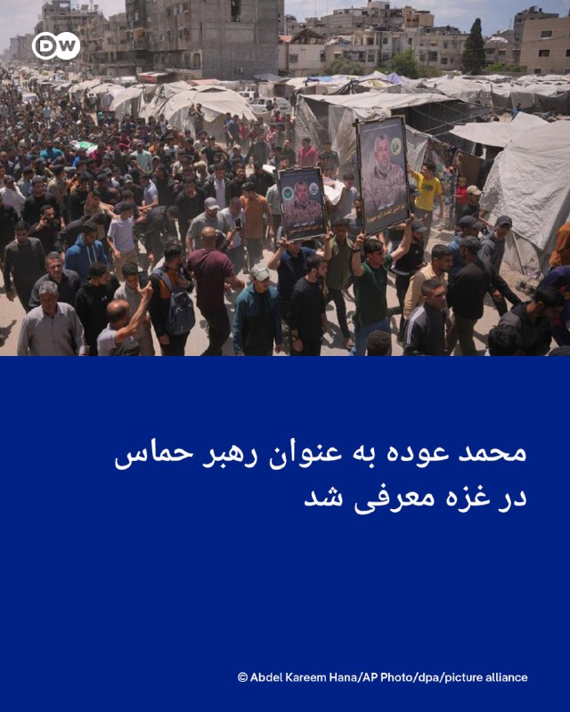

🔶 محمد عوده به عنوان رهبر حماس در غزه معرفی شد

سازمان تروریستی حماس محمد عوده را به‌عنوان جانشین عزالدین حداد و رهبر این گروه در نوار غزه منصوب کرد.

بر اساس گزارش پایگاه خبری سعودی الشرق الاوسط، محمد عوده، رئیس دستگاه اطلاعاتی حماس، به‌عنوان جانشین عزالدین حداد و رهبر این گروه در نوار غزه و فرمانده شاخه نظامی آن منصوب شده است.

عزالدین حداد روز جمعه در یک حمله اسرائیل کشته شد.

گفته می‌شود عوده که در زمان حملات ۷ اکتبر ۲۰۲۳ رئیس اطلاعات نظامی گردان‌های القسام بود، رابطه نزدیکی با حداد داشته و پس از ترور رهبران پیشین، محمد ضیف و محمد سنوار، برای بازسازی "ساختار سازمانی" حماس با او همکاری کرده است.

الشرق الاوسط به نقل از یک منبع آگاه گزارش داده است که عوده پس از کشته شدن سنوار در ماه مه سال گذشته، ابتدا برای رهبری گردان‌های القسام پیشنهاد شده بود، اما این مسئولیت را نپذیرفت.

طبق این گزارش، عوده مأمور جمع‌آوری اطلاعات درباره پایگاه‌های ارتش اسرائیل در نزدیکی مرز غزه و همچنین نقاط ضعف لشکر غزه پیش از حملات ۷ اکتبر بوده است.

پیش‌تر روزنامه اسرائیلی هیوم نوشته بود که محمد عوده، "فرمانده کهنه‌کار حماس که از ترور جان سالم به در برد، نباید مشکلی برای انتصاب به سمت فرماندهی داشته باشد".

طبق همین گزارش "عوده که گاهی به عنوان فرمانده تیپ در شاخه نظامی خدمت کرده از لحاظ تئوری گزینه ایده‌آلی برای فرماندهی قسام است".

@dw_farsi

## DW_Farsi — post 124847

🔶 هزینه ده میلیارد یورویی دولت آلمان برای تقویت دفاع غیرنظامی

به گزارش روزنامه بیلد، الکساندر دوبرینت، وزیر کشور آلمان، در حال برنامه‌ریزی برای اجرای یک برنامه چند میلیارد یورویی جهت توسعه حفاظت از مردم و دفاع غیرنظامی است.

این روزنامه آلمانی، به نقل از پیش‌نویس مصوبه کابینه گزارش داده است که برای این منظور ۱۰ میلیارد یورو اختصاص داده خواهد شد. این بودجه از جمله قرار است برای تجهیزات اضافی، ساختمان‌ها، نیروی انسانی و فناوری، از جمله برای سازمان امداد فنی آلمان، هزینه شود.

الکساندر دوبرینت به این روزنامه گفت: «ما در زمینه حفاظت از جمعیت و دفاع غیرنظامی در حال تقویت توان خود هستیم.» به گفته این وزیر سوسیال مسیحی، هدف "اتخاذ موضعی قاطع در برابر تهدیدات هیبریدی" و نیز "حمایت پیگیرانه از نیروهای داوطلب" است.

بر این اساس، قرار است در وزارت کشور آلمان یک واحد جدید با عنوان "فرماندهی دفاع غیرنظامی" ایجاد شود. این واحد همچنین مسئول هماهنگی همکاری با ارتش آلمان در صورت بروز تهدیدهای احتمالی خواهد بود.

@dw_farsi

## DW_Farsi — post 124846

🔶 اعزام اسکادران جنگنده و هزاران سرباز پاکستانی به عربستان

پاکستان در گرماگرم میانجی‌گری میان آمریکا و ایران به تقویت بی‌سابقه همکاری نظامی خود با عربستان پرداخته است. اسلام‌آباد در چارچوب یک پیمان دفاعی مشترک، ۸ هزار نیروی نظامی، یک اسکادران جنگنده و یک سامانه پدافند هوایی به عربستان سعودی اعزام کرده است.

خبرگزاری رویترز در گزارشی اختصاصی از ابعاد گسترده  همکاری‌های نظامی پاکستان و عربستان که بر مبنای توافقی در شهریور گذشته به اجرا درآمده است خبر داده است.

مضمون گزارش رویترز که "توسط سه مقام امنیتی و دو منبع دولتی تأیید شده" از جمله این است که نیروهای اعزام‌شده به عربستان  یک یگان "قابل‌توجه و آماده عملیات رزمی" هستند که هدف آن حمایت از ارتش عربستان در صورت حملات بیشتر به این کشور است.

جزئیات کامل توافق دفاعی که سال گذشته امضا شد محرمانه است، اما دو طرف پیش‌تر گفته‌اند که این توافق، پاکستان و عربستان را ملزم می‌کند در صورت حمله به یکی از آن‌ها، از یکدیگر دفاع کنند. خواجه آصف، وزیر دفاع پاکستان، پیش‌تر تلویحاً گفته بود که این توافق عربستان را زیر "چتر هسته‌ای" پاکستان قرار می‌دهد.

@dw_farsi

## DW_Farsi — post 124844

🔶 اعتراض به غول رسانه‌ای؛ بینوش و ۶۰۰ سینماگر در فهرست سیاه

در فرانسه این روزها نبردی فرهنگی بر سر سینمای ملی در جریان است. اوایل هفته و همزمان با افتتاح جشنواره فیلم کن، بیش از ۶۰۰ فعال حوزه سینما از طریق روزنامه "لیبراسیون" طوماری علیه ونسان بولوره، سرمایه‌دار راستگرا، امضا کردند. بولوره طی سال‌های گذشته امپراتوری رسانه‌ای گسترده‌ای ایجاد کرده که تا شرکت بزرگ سرگرمی کانال پلاس (Canal+) نیز امتداد یافته است.

در میان امضاکنندگان نام‌های شناخته‌شده‌ای همچون ژولیت بینوش و آدل انل از میان بازیگران، و نیز کارگردانانی مانند ریموند دپاردون و دومینیک مول دیده می‌شود. در این بیانیه آمده است: «اگر سینمای فرانسه را به دست یک مالک راست‌افراطی بسپاریم، نه تنها خطر همگن‌سازی فیلم‌ها را می‌پذیریم، بلکه با خطر تصرف فاشیستی تخیل جمعی نیز روبه‌رو خواهیم شد.»

اکنون مدیران کانال پلاس واکنش نشان داده‌اند. ماکسیم سعدا، مدیرعامل این شرکت، اعلام کرد که کانال پلاس در آینده دیگر با هنرمندانی که بیانیه علیه بولوره را امضا کرده‌اند همکاری نخواهد کرد. او گفت این طومار در حق کارکنان کانال پلاس که به گفته او، همواره برای استقلال در کار خود کوشیده‌اند، ناعادلانه است.

@dw_farsi

## DW_Farsi — post 124843

  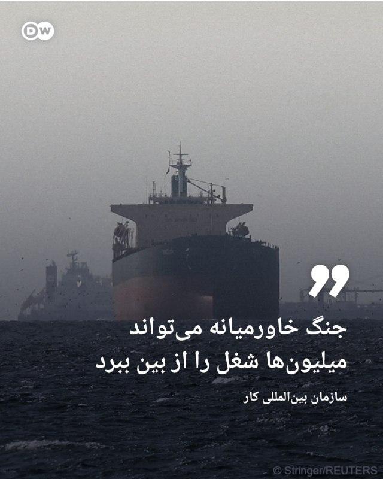

🔶 سازمان بین‌المللی کار: جنگ خاورمیانه می‌تواند میلیون‌ها شغل را از بین ببرد

سازمان بین‌المللی کار هشدار داد جنگ خاورمیانه می‌تواند در سال‌های ۲۰۲۶ و ۲۰۲۷ میلیون‌ها شغل را در جهان از بین ببرد و موجب کاهش دستمزدهای واقعی شود. به گفته این نهاد وابسته به سازمان ملل، پیامدهای این بحران بسیار فراتر از منطقه تحت درگیری خواهد بود.

این سازمان روز دوشنبه ۱۸ مه در گزارشی اعلام کرد افزایش بهای انرژی، اختلال در حمل‌ونقل، فشار بر زنجیره‌های تامین، کاهش گردشگری و افت تقاضا برای نیروی کار مهاجر، اقتصاد کشورهای مختلف را تحت تاثیر قرار داده است.

سازمان بین‌المللی کار در این گزارش پیش‌بینی کرده اگر قیمت نفت حدود ۵۰ درصد بالاتر از میانگین پیش از آغاز حملات آمریکا و اسرائیل به ایران در ۲۸ فوریه باقی بماند، میزان ساعات کار در جهان در سال ۲۰۲۶ حدود نیم درصد و در سال ۲۰۲۷ حدود ۱.۱ درصد کاهش خواهد یافت.

به گفته این نهاد، این کاهش معادل از بین رفتن ۱۴ میلیون شغل تمام‌وقت در سال جاری و ۴۳ میلیون شغل در سال ۲۰۲۷ میلادی است. همچنین نرخ بیکاری جهانی در سال ۲۰۲۶ حدود ۱.۰ درصد و در سال ۲۰۲۷ حدود ۵.۰ درصد افزایش خواهد یافت.

در گزارش سازمان بین‌المللی کار آمده است که درآمد واقعی نیروی کار نیز کاهش خواهد یافت؛ به‌طوری‌که دستمزدهای واقعی در سال جاری ۱.۱ درصد و در سال ۲۰۲۷ حدود سه درصد افت می‌کند.

@dw_farsi

## DW_Farsi — post 124842

🔶 نارضایتی سعودی‌ها از آمریکا و سیاستی چندجانبه در قبال ایران

گزارش  روزنامه آلمانی دی ولت با توضیح شروع می‌شود که عربستان در در میانه جنگ آمریکا و اسرائیل علیه ایران، هم از نظر ژئوپولیتیکی و هم امنیتی در حال بازتعریف جایگاه خود است. محور اصلی گزارش این است که ریاض دیگر مانند گذشته به حمایت مطلق آمریکا اطمینان ندارد و به‌دنبال تنوع‌بخشیدن به ائتلاف‌هایش است.
عربستان برای دورزدن پیامدهای بسته‌شدن تنگه هرمز، سال‌ها پیش زیرساخت جایگزین ایجاد کرده بود؛ از جمله خط لوله شرق به غرب و بندر نفتی ینبع در ساحل دریای سرخ. اکنون این بندر به شریان حیاتی صادرات نفت سعودی تبدیل شده است. در گزارش آمده است: « در ینبع محله‌های مسکونی جدید، فرودگاه و تأسیسات آب‌شیرین‌کنِ مجهز به انرژی خورشیدی ساخته شد. حتی در زمان جنگ خلیج فارس در سال ۱۹۹۰ نیز نگرانی زیادی وجود داشت که صدام حسین، دیکتاتور عراق، تنگه هرمز را مسدود یا میدان‌های نفتی آن منطقه را هدف قرار دهد، اما آن زمان تنگه بسته نشد.»

امروز عربستان سعودی می‌تواند روزانه تا هفت میلیون بشکه نفت را از طریق خط لوله شرق به غرب به بندر ینبع منتقل کند و از آنجا به عنوان محصولات فرآوری شده پتروشیمی یا به صورت نفت خام صادر کند.

@dw_farsi

## DW_Farsi — post 124832

📸 کن ۲۰۲۶ در قاب تصویر؛ سینماگران ایرانی در کنار ستاره‌های جهان

هفتادونهمین جشنواره فیلم کن ۲۰۲۶ به رسم هر سال با حضور چهره‌های مطرح سینمای جهان، فرش قرمز و نشست‌های خبری همراه بود. در این دوره، پگاه آهنگرانی نیز با فیلم "تمرین‌هایی برای یک انقلاب" در جشنواره حضور داشت و اثر خود را به نمایش گذاشت. برخی از مشهورترین چهره‌هایی را که در جشنواره امسال حضور یافته‌اند، ببینید.
@dw_farsi

## DW_Farsi — post 124830

  

🔶 مرتس حمله ایران به تاسیسات اتمی امارات را محکوم کرد

فریدریش مرتس، صدراعظم آلمان، حمله به یک نیروگاه هسته‌ای در امارات متحده عربی را محکوم کرد. او روز دوشنبه در شبکه اجتماعی ایکس نوشت: «حملات هوایی دوباره ایران علیه امارات متحده عربی و دیگر شرکا را به‌شدت محکوم می‌کنیم. حمله به تأسیسات هسته‌ای تهدیدی برای امنیت مردم سراسر منطقه است.»

به گفته او، نباید هیچ تشدید خشونت دیگری رخ دهد.

روز یکشنبه، ۱۷ مه (۲۷ اردیبهشت) در پی حمله پهپادی به یک نیروگاه هسته‌ای در امارات، آتش‌سوزی رخ داد. مقام‌های اماراتی اعلام کردند که این حادثه هیچ مجروحی و هیچ افزایش غیرعادی در سطح تشعشعات نداشته است. وزارت خارجه امارات این حمله را "اقدامی تروریستی و بدون تحریک قبلی" توصیف و به‌شدت محکوم کرد، اما مستقیماً هیچ طرفی را مسئول ندانست.

جمهوری اسلامی نسبت به حمله به نیروگاه هسته‌ای امارات واکنش رسمی نشان نداده است.

مرتس در ادامه پیام خود در شبکه ایکس همچنین از رهبری ایران خواست وارد مذاکرات جدی برای پایان دادن به جنگ شود.

او همچنین خواستار آن شد که ایران "تهدید همسایگانش را متوقف کند و تنگه هرمز را بدون محدودیت بازگشایی کند".

در جنگی که با حملات هوایی آمریکا و اسرائیل علیه ایران آغاز شد، اکنون آتش‌بسی برقرار است، اما مذاکرات برای پایان دائمی درگیری‌ها تاکنون به نتیجه مشخصی نرسیده است.

@dw_farsi

## Persian_Trend_Official — post 14422

  

📌توی این روزا که بازار فروش vpn داغه
یه تیم که پشتیبانی خوبی داشته باشه و خدماتش گارانتی داشته باشه کم پیدا میشه

تراست vpn همه اینارو داره و من با خیال راحت معرفیش می‌کنم

همین الان برای خرید بهشون پیام بدین

@trusstvpnn_admin
@trusstvpnn_admin
@trusstvpnn_admin

## Persian_Trend_Official — post 14421

*هنوز جنگ تموم نشده

## Persian_Trend_Official — post 14420

  <a href="telegram/content/Persian_Trend_Official_14420_1779121324.jpg">🎬 Download video</a>

هیچوقت قبل از تموم شدن ماجرا خوشحالی نکنید ! 📌 @persian_trend_official پرشین ترند | متفاوت‌ترین کانال نظامی

## Persian_Trend_Official — post 14419

  <a href="telegram/content/Persian_Trend_Official_14419_1779121325.mp4">🎬 Download video</a>

هیچوقت قبل از تموم شدن ماجرا خوشحالی نکنید !

📌 @persian_trend_official
پرشین ترند | متفاوت‌ترین کانال نظامی

## Persian_Trend_Official — post 14418

پست کنایه آمیز پرزیدنت ترامپ : اگر ایران تسلیم شود، اعتراف کند که نیروی دریایی‌اش نابود شده و در کف دریا آرمیده است، و نیروی هوایی‌اش دیگر وجود ندارد، و اگر تمام ارتش آن با انداختن سلاح‌ها و بالا بردن دست‌ها از تهران خارج شود و هر کدام فریاد بزنند «من تسلیم…

## Persian_Trend_Official — post 14417

  

پست کنایه آمیز پرزیدنت ترامپ :
اگر ایران تسلیم شود، اعتراف کند که نیروی دریایی‌اش نابود شده و در کف دریا آرمیده است، و نیروی هوایی‌اش دیگر وجود ندارد، و اگر تمام ارتش آن با انداختن سلاح‌ها و بالا بردن دست‌ها از تهران خارج شود و هر کدام فریاد بزنند «من تسلیم می‌شوم، من تسلیم می‌شوم» در حالی که دیوانه‌وار پرچم سفید را تکان می‌دهند، و اگر تمام رهبران باقی‌مانده‌شان همه «اسناد تسلیم» لازم را امضا کنند و شکست خود را در برابر قدرت و نیروی عظیم و باشکوه ایالات متحده آمریکا بپذیرند، نیویورک تایمزِ شکست‌خورده، وال‌استریت ژورنالِ چینی (WSJ!)، سی‌ان‌انِ فاسد و حالا بی‌ربط، و تمام دیگر اعضای رسانه‌های اخبار جعلی تیتر خواهند زد که ایران یک پیروزی استادانه و درخشان بر ایالات متحده آمریکا به دست آورده است؛ حتی نزدیک هم نبود. دموکرات‌ها و رسانه‌ها کاملاً راه خود را گم کرده‌اند. آن‌ها کاملاً دیوانه شده‌اند!!!!

رئیس‌جمهور Donald John Trump

## Persian_Trend_Official — post 14416

  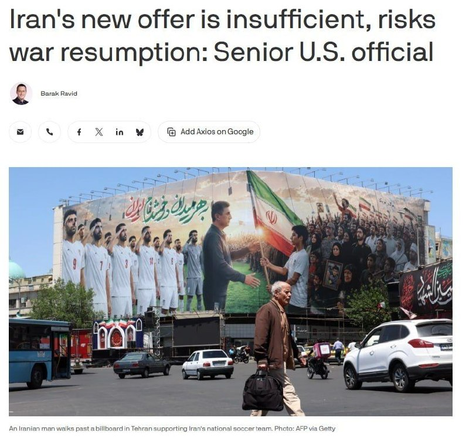

💥
💥
💥

📰:کاخ سفید پیشنهاد تجدیدنظر شده ایران برای پایان دادن به درگیری جاری را رد کرده و آن را ناکافی دانسته است.

🇮🇷
🇺🇸مقامات آمریکایی هشدار داده‌اند که اگر تهران در برنامه هسته‌ای خود امتیازات عمده‌ای ندهد، ممکن است اقدامات نظامی از سر گرفته شود. (منبع Axios)

🦁Phantom
🦁

✉️@persian_trend_official
پرشین ترند | متفاوت‌ترین کانال نظامی

## Persian_Trend_Official — post 14415

  <a href="telegram/content/Persian_Trend_Official_14415_1779121329.jpg">🎬 Download video</a>

⚠️ هشدار مهم!

یه تکنیک جدید هکرها پیدا شده که دارن از کپچا استفاده می‌کنن برای نفوذ به گوشی و کامپیوترت!

🔴 چطور کار می‌کنه؟

وقتی می‌خوای وارد یه سایت بشی، یه صفحه شبیه کپچای معمولی (با لوگوی Cloudflare) باز می‌شه. بعد ازت می‌خواد:
• کلیدهای Win + R رو فشار بدی
• یه دستور آماده رو پیست کنی
• اینتر بزنی

نتیجه؟ 🔥
بدون اینکه بفهمی، تروجان و جاسوس‌افزار روی سیستمت نصب می‌شه و اطلاعاتت به سرقت می‌ره!

📈 آمار ترسناک:
موارد این نوع حمله امسال ۵۶۳ درصد افزایش یافته!

✅ چطور تشخیص بدی؟
کپچای واقعی هیچ‌وقت ازت نمی‌خواد وارد Run ویندوز بشی یا دستوری اجرا کنی. هرچیزی غیر از انتخاب تصویر = تقلبی!

👆 مراقب باشید، به دوستاتون هم بگید!

📝 Nick

📌 @persian_trend_official
پرشین ترند | متفاوت‌ترین کانال نظامی

## Persian_Trend_Official — post 14414

  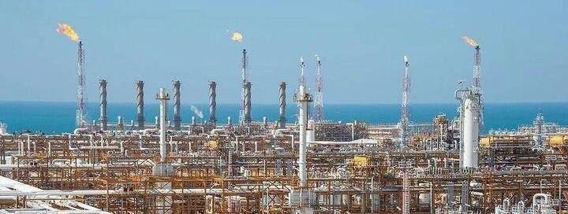

⭕️بازسازی زیرساخت‌های آسیب‌دیده پارس جنوبی در ۲ سال

سخنگوی کمیسیون انرژی مجلس:
💢برای بازسازی و نوسازی زیرساخت‌های پالایشگاهی و پتروشیمی منطقه پارس جنوبی با تکیه بر دانش بومی برنامه‌ریزی شده است.

💢این مراکز با طراحی و فناوری‌های جدید و با ظرفیتی بیش از قبل، به مدار تولید بازخواهند گشت.

💢پیش‌بینی می‌شود حدود ۵۰ درصد از بازسازی‌ها تا پیش از آغاز فصل سرد سال به سرانجام برسد.

💢کل فرآیند آواربرداری، بازسازی و نوسازی زیرساخت‌ها در مدت حداکثر ۲ سال تکمیل شود.

🫆:Tony

📌 @persian_trend_official
پرشین ترند | متفاوت‌ترین کانال نظامی

## Persian_Trend_Official — post 14413

  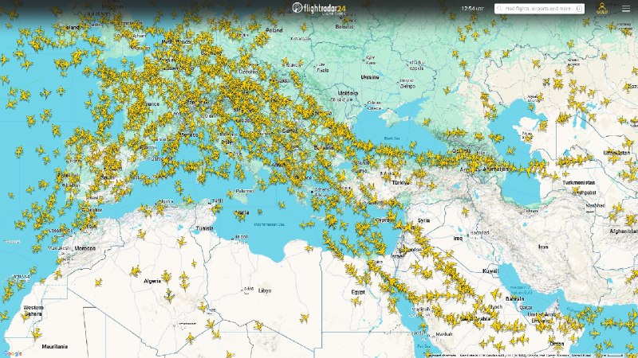

⭕️ وضعیت کم سابقه‌ی آسمان منطقه، از نظر خلوت بودن. (در عکس اول فقط پرواز های نظامی آمریکا و در عکس دوم تمام پرواز های نظامی) 📝 Nick 📌 @persian_trend_official پرشین ترند | متفاوت‌ترین کانال نظامی

## Persian_Trend_Official — post 14410

⭕️ وضعیت کم سابقه‌ی آسمان منطقه، از نظر خلوت بودن.

(در عکس اول فقط پرواز های نظامی آمریکا
و در عکس دوم تمام پرواز های نظامی)

📝 Nick

📌 @persian_trend_official
پرشین ترند | متفاوت‌ترین کانال نظامی

## RadioFarda — post 157316

فرماندار سقز ادعای خبرگزاری سپاه درباره حمله پژاک به یک معدن را دروغ خواند

🔸ساعاتی پس از آن که خبرگزاری فارس، نزدیک به سپاه پاسداران، مدعی حمله گروه کرد پژاک، حیات آزاد کردستان، به یک معدن در حوالی شهر سقز شد، فرماندار این شهر خبر را «کذب» خواند.

🔸خبرگزاری فارس صبح دوشنبه بدون اشاره به نام منبع یا منابع خبر خود نوشت: «حوالی ساعت یک بامداد امروز [دوشنبه] گروهک تروریستی پژاک با ۳ خودرو به معدن میرگه نقشینه در سقز حمله کرد. تروریست‌ها ابتدا دست‌وپای هردو نگهبان معدن را بستند و تلفن همراه آن‌ها را خاموش کردند، سپس اقدام به آتش‌ زدن تجهیزات معدن کردند.»

🔸حال ضیاالدین نعمانی، فرماندار سقز، به رسانه‌ها گفته است که «ادعای وقوع حمله تروریستی به این معدن صحت ندارد».

🔸نعمانی در ادامه چنین توضیح داده است: «سال گذشته نیز اتفاقی مشابه در معدن قلقله رخ داده بود که شباهت زیادی به حادثه اخیر دارد و به نظر می‌رسد این اقدامات با هدف باج‌خواهی و تعرض به معادن انجام شده باشد.»

@RadioFarda

## RadioFarda — post 157315

🔸مدیر مرکز روابط عمومی و اطلاع‌رسانی وزارت بهداشت جمهوری اسلامی روز دوشنبه ادعا کرد که در حمله اسرائیل به بیت خامنه‌ای «اتفاق خاصی» برای مجتبی خامنه‌ای نیفتاده است. 🔸در روز ۹ اسفندماه سال گذشته که حمله اسرائیل به بیت علی خامنه‌ای در مرکز تهران جان او و ده‌ها…

## RadioFarda — post 157314

  

🔸مدیر مرکز روابط عمومی و اطلاع‌رسانی وزارت بهداشت جمهوری اسلامی روز دوشنبه ادعا کرد که در حمله اسرائیل به بیت خامنه‌ای «اتفاق خاصی» برای مجتبی خامنه‌ای نیفتاده است.

🔸در روز ۹ اسفندماه سال گذشته که حمله اسرائیل به بیت علی خامنه‌ای در مرکز تهران جان او و ده‌ها مقام ارشد حکومت را گرفت، مجتبی خامنه‌ای نیز در این محل حضور داشت و به‌شدت آسیب دید، اما به گفته حکومت زنده ماند.

🔸در بیش از دو ماه گذشته که نام او به عنوان رهبر سوم جمهوری اسلامی اعلام شد، نه فایلی صوتی از او منتشر شده و نه ویدئویی که تصویری تازه از او نشان دهد؛ این در حالی است که در و دیوار شهرها در کشور از عکس او پوشیده شده و حامیان حکومت گه‌گاه عکسی ساخته‌شده با هوش مصنوعی هم از او منتشر می‌کنند.

🔸با این همه خبرگزاری ایسنا به نقل از حسین کرمانپور نوشته است: «خوشبختانه اتفاق خاصی برای رهبر انقلاب نیفتاده بود. فردی که در محل چنین حادثه‌ای باشد، طبیعتا چندین زخم بر روی بدن خود خواهد داشت. این زخم‌ها نیز زخم‌هایی نبود که بخواهد چهره رهبر انقلاب را مخدوش کند یا اینکه همانند امام شهید ما جانبازی بگیرند یا قطع عضو داشته باشند.»

@RadioFarda

## RadioFarda — post 157313

  

🔸خبرگزاری رویترز روز دوشنبه، ۲۸ اردیبهشت، در گزارشی اختصاصی به نقل از سه مقام امنیتی و دو مقام دولتی که به نام‌شان اشاره نکرد خبر داد که پاکستان در عین میانجی‌گری میان ایران و‌ آمریکا، هزاران نیرو و تجهیزات نظامی به عربستان سعودی فرستاده است.

🔸خبر اعزام نیرو از پاکستان ماه گذشته منتشر شده، اما از جزئیات آن چیزی منتشر نشده بود.

🔸از زمان آغاز آتش‌بس میان ایران و آمریکا و پادرمیانی اسلام‌آباد برای رسیدن به صلح که بیش از یک ماه پیش برقرار شد، کارشناسان یکی از دلایل این اقدام پاکستان را پیمان دفاعی این کشور با عربستان سعودی عنوان کرده‌اند.

🔸بر اساس این پیمان، در صورت بالا گرفتن جنگ و حمله به عربستان سعودی توسط ایران، اسلام‌آباد مجبور خواهد بود به نفع ریاض در مقابل همسایه غربی خود یعنی ایران بایستد که می‌تواند برای خود پاکستان عواقبی سخت داشته باشد.

🔸حال در گزارش اختصاصی رویترز آمده است که اسلام‌آباد در عین تلاش برای برقرار کردن صلح میان تهران و واشینگتن، هشت هزار نفر نیروی نظامی، چند جت جنگنده و یک سامانه دفاع هوایی به عربستان اعزام کرده است.

@RadioFarda

## IranianMinds — post 20348

🔴رویترز هم تأیید کرده که پیشنهاد جدید و آخر جمهوری اسلامی توسط آمریکا رد شده.

@IranianMinds

## IranianMinds — post 20347

🔴 مقامات رژیم :

پالایشگاه و زیرساخت‌های پتروشیمی آسیب‌دیده در منطقه پارس جنوبی طی حدود دو سال بازسازی خواهند شد و انتظار می‌رود حدود نیمی از ظرفیت آن‌ها پیش از زمستان احیا شود.

مقام‌ها گفته‌اند این تأسیسات با فناوری ارتقایافته و ظرفیت تولید بالاتر دوباره به مدار بازخواهند گشت.

@IranianMunds

## IranianMinds — post 20346

🔴روزنامه ایران:

از وقتی اینترنت تو ایران قطع شده فروش سیمکارت عراقی زیاد شده؛
چون این سیمکارتا تا 2کیلومتری داخل ایران جواب میدن و مردم تو شهرهای مرزی با عراق میرن سیمکارت عراقی میخرن و میرن 2 کیلومتری مرز تا کارشونو انجام بدن.

@IranianMinds

## IranianMinds — post 20345

  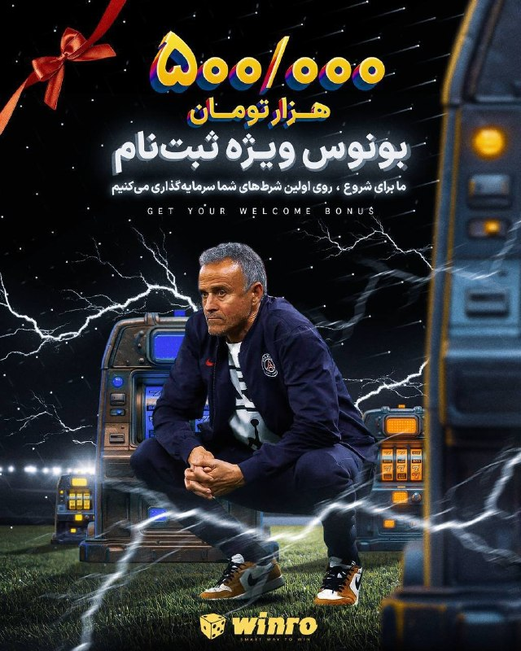

💥 با هر ثبت نام 
🅰️
🅰️
🅰️ هزار تومن جایزه بگیرید

✔️ میتونید شرط‌بندی کنید و بونوس را به موجودی واقعی تبدیل کنید

⚽️  پوشش کامل مسابقات ورزشی 

💯  پیش‌بینی با بهترین ضرایب 

⭐️ تجربه سریع و حرفه‌ای

💰پرداخت مستقیم و سریع بدون واسطه، بدون دردسر، واریز و برداشت در سریع‌ترین زمان ممکن

☑️ کانال تلگرام: 

➡️ @winro_io  

🎁 هدیه خود را با ثبت نام در سایت دریافت کنید: 

➡️ Winro.io
G28
سایت اصلی در روزهای آینده بازگشایی خواهد شد A
💎

## IranianMinds — post 20344

🔴 فوری - آکسیوس به نقل از مقامات آمریکایی:

آخرین پیشنهاد ایران توسط آمریکا رد شد.
این پیشنهاد حتی چیزی نزدیک به خواسته های آمریکا برای رسیدن به یک توافق نیست.

@IranianMinds

## IranianMinds — post 20343

🔴 فوری - یک مقام آمریکایی :

آمریکا مجبور است مذاکرات را از طریق بمب ها ادامه دهد

@IranianMinds

## IranianMinds — post 20342

  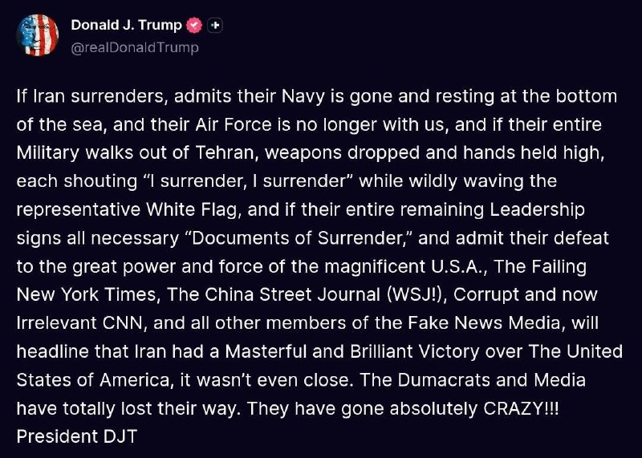

🔴ترامپ:
«اگر ایران تسلیم شود، اعتراف کند که نیروی دریایی‌اش از بین رفته و در ته دریا است، و نیروی هوایی‌اش دیگر با ما نیست، و اگر کل ارتش‌شان از تهران خارج شود، سلاح‌ها را رها کرده و دست‌ها را بالا ببرند، هر کدام فریاد بزنند «من تسلیم می‌شوم، من تسلیم می‌شوم» در حالی که پرچم سفید نماینده را به شدت تکان می‌دهند، و اگر تمام رهبران باقی‌مانده‌شان همه «اسناد تسلیم» لازم را امضا کنند و شکست خود را در برابر قدرت و نیروی بزرگ و باشکوه ایالات متحده آمریکا بپذیرند، روزنامه‌های در حال سقوط نیویورک تایمز، وال استریت ژورنال چین (WSJ!)، سی‌ان‌ان فاسد و اکنون بی‌اهمیت، و همه اعضای دیگر رسانه‌های خبری جعلی، تیتر خواهند زد که ایران پیروزی استادانه و درخشانی بر ایالات متحده آمریکا داشته است، حتی نزدیک هم نبود. دموکرات‌ها و رسانه‌ها کاملاً راه خود را گم کرده‌اند. آنها کاملاً دیوانه شده‌اند!!!» رئیس‌جمهور دی‌جی‌تی

@IranianMinds

## IranianMinds — post 20341

🔴منبع آمریکایی به الجزیره:

صبر رئیس‌جمهور ترامپ به دلیل عدم پیشرفت در پرونده ایران، رو به پایان است.

@IranianMinds

## IranianMinds — post 20340

🔴رویترز:

پیشنهاد اصلاح شده تهران به آمریکا شامل:

۱- پایان دائمی جنگ.
۲- لغو تحریم‌ها.
۳- بازگشایی تنگه هرمز.
۴- آزاد‌سازی دارایی‌های بلوکه شده ایران.

گزارش‌ها حاکی است که ایران درباره برنامه هسته‌ای خود در مراحل بعدی مذاکرات گفت‌‌و‌گو خواهد کرد.

@IranianMinds

## IranianMinds — post 20339

🔴سناتور لیندسی گراهام:

من کاملأ اطمینان دارم که رئیس جمهور ترامپ به طور کامل، وضعیت مربوط به ایران را درک می‌کنه و دیگه عدم تمایل به مذاکره با حسن‌نیت، همراه با اقدامات تهاجمی و سرکشانه ایران در تنگه هرمز و سراسر منطقه را تحمل نخواهد کرد.

@IranianMinds

## IranianMinds — post 20336

  <a href="telegram/content/IranianMinds_20336_1779121334.mp4">🎬 Download video</a>

🔴 اسرائیل‌ همچنان داره لبنان رو‌ شخم میزنه

@IranianMinds

## IranianMinds — post 20335

  

🔴 نیویورک تایمز:

آمریکا و اسرائیل در حال انجام شدیدترین آمادگی‌های خود از زمان آغاز آتش‌بس هستند، چرا که احتمال حملات مجدد به ایران حتی از همین هفته وجود دارد.

پنتاگون نیز خود را برای از سرگیری احتمالی «عملیات خشم‌ حماسی» آماده میکند.

@IranianMinds

## IranianMinds — post 20334

  <a href="telegram/content/IranianMinds_20334_1779121337.mp4">🎬 Download video</a>

🔴ناو‌شکن با صلابت و سرافراز به صورت عمودی غرق شد.
یادآوری😂😂😂

@IranianMinds

## BBCPersian — post 281384

یکی از این منابع گفت که پاکستان همچنین دو اسکادران پهپاد ارسال کرده است. هر پنج منبع به رویترز گفتند که ۸۰۰۰ سرباز در عربستان مستقر شدند و وعده داده شده است که در صورت نیاز تعداد بیشتری اعزام شود. به گفته این منابع، سیستم دفاع هوایی چینی اچ‌‌کیو-۹ هم به این کشور ارسال شده است.
بر اساس این گزارش، مسئولیت اداره تجهیزات بر عهده پرسنل پاکستانی است اما عربستان سعودی هزینه آن را می‌پردازد.
شهریور ماه گذشته، پاکستان و عربستان سعودی از امضای یک پیمان دفاعی خبر داده بودند که بر اساس آن، هرگونه تجاوز علیه هر یک از دو کشور به‌عنوان اقدامی خصمانه علیه هر دو تلقی می‌شود. در مقابل قرار شد که عربستان سعودی به پاکستان که یک قدرت هسته‌ای است، نفت ارزان و کمک مالی دهد.
افزایش همکاری نظامی پاکستان و عربستان در حالی است که اسلام‌آباد در جنگ آمریکا و اسرائیل با ایران نقش میانجی را بر عهده داشته است.

@BBCPersian

## BBCPersian — post 281383

  

🔻خبرگزاری رویترز به نقل از دو منبع می‌گوید که پاکستان در چارچوب پیمان دفاعی خود با ریاض، ۸۰۰۰ نیرو،‌ یک اسکادران هواپیمای جنگی و یک سامانه پدافند هوایی در عربستان مستقر کرده است.

پیشتر وزارت دفاع عربستان بدون اشاره به جزئیات، استقرار شماری جنگنده و نیروی پاکستان در چارچوب توافق دو کشور را اعلام کرده بود اما حالا رویترز برای اولین بار جزییات بیشتری ارائه کرده است.

رویترز در گزارش اختصاصی خود، از سه مقام امنیتی و دو منبع دولتی نقل کرده است که نیروی مستقر شده دارای قابلیت رزمی است و هدف از اعزام آن، دفاع از عربستان در صورت حملات بیشتر به آن کشور است.

رویترز می‌گوید که وزارت خارجه و دفتر مطبوعاتی ارتش پاکستان و دفتر رسانه‌ای دولت عربستان سعودی به درخواست این خبرگزاری برای اظهارنظر پاسخی ندادند.

به گفته این منابع، هواپیماهای جنگی شامل حدود ۱۶ هواپیماست که عمدتا از جنگنده‌های «جی‌اف-۱۷» است که مشترکا با چین ساخته شده‌اند؛ این هواپیماها اوایل ماه آویل به پاکستان فرستاده شده بودند.

📷 AFP via Getty Images
https://bbc.in/49G1IjH
@BBCPersian

## BBCPersian — post 281382

🔻ایران: طرح خاصی درباره پیمان عدم تعرض از کشورهای منطقه دریافت نکردیم
ایران گزارش‌های اخیر درباره پیشنهاد عربستان سعودی برای امضای توافق منع تعرض را تکذیب کرد.

اسماعیل بقایی، سخنگوی وزارت خارجه ایران، در پاسخ به سوالی در این باره گفت: «نمی‌توانم بگویم طرح خاصی مطرح شده است.»

در روزهای اخیر گزارش‌هایی، از جمله در روزنامه آمریکایی وال‌استریت جورنال، منتشر شده بود که می‌گفت عربستان سعودی پیشنهاد امضای یک پیمان عدم تعرض بین ایران و کشورهای منطقه را مطرح کرده است.

ایران در جنگ با اسرائیل و آمریکا که نهم اسفند (۲۸ فوریه) آغاز شد، برخی اهداف در کشورهای منطقه را با موشک و پهپاد هدف قرار داد.

https://bbc.in/3R7PVV9
@BBCPersian

## BBCPersian — post 281381

  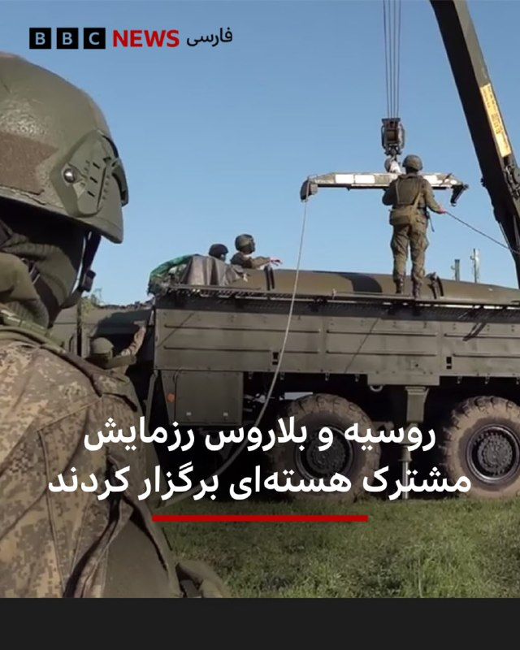

🔻‌روسیه و بلاروس امروز رزمایش مشترک هسته‌ای برگزار کردند. به گفته وزارت دفاع بلاروس، در رزمایش امروز «تحویل مهمات هسته‌ای و آماده‌سازی برای استفاده از آن» تمرین می‌شود.

این وزارتخانه تاکید کرد که این آموزش از پیش برنامه‌ریزی شده است و «علیه کشورهای ثالث نیست و تهدیدی برای امنیت منطقه محسوب نمی‌شود.» نیروی هوایی و یگان‌های موشکی در این رزمایش شرکت داشتند.

این اولین رزمایش هسته‌ای مشترک دو کشور نیست؛ در دو سال گذشته دو کشور هر سال یک رزمایش هسته‌ای مشترک داشته‌اند.

روسیه سال گذشته موشک «اورشنیک»، جدیدترین موشک هایپرسونیک با قابلیت حمل کلاهک هسته‌‌ای، را در بلاروس مستقر کرد و تنش با ائتلاف کشورهای غربی را وارد مرحله‌ای حساس‌تر کرد.

وزارت دفاع بلاروس امروز گفت: «در جریان این رزمایش، برنامه‌ریزی این است که موضوعات مربوط به تحویل مهمات هسته‌ای و آماده‌سازی برای استفاده از آنها در همکاری با طرف روسی تمرین شود.»

ادامه خبر را از لینک زیر در وبسایت بی‌بی‌سی فارسی بخوانید.

شرح تصویر: عکسی که ارتش روسیه از رزمایش مشترک با بلاروس در سال ۲۰۲۴ منتشر کرد
📷 Russian Defense Ministry
https://bbc.in/4uSiQLf
@BBCPersian

## BBCPersian — post 281380

  <a href="telegram/content/BBCPersian_281380_1779121341.mp4">🎬 Download video</a>

🔻سرخط خبرهای دوشنبه ۲۸ اردیبهشت ۱۴۰۵
@BBCPersian

## BBCPersian — post 281379

🔻آژانس بین‌المللی انرژی در مورد کاهش سریع ذخایر تجاری نفت در جهان هشدار داد. فاتح بیرول، رئیس آژانس بین‌المللی انرژی، گفت که علی‌رغم آزاد شدن بخشی از ذخایر نفت استراتژیک دولت‌ها در سراسر جهان، ذخایر تجاری به‌دلیل اختلال در عرضه نفت در خلیج فارس، «بسیار سریع»…

## BBCPersian — post 281378

  

🔻آژانس بین‌المللی انرژی در مورد کاهش سریع ذخایر تجاری نفت در جهان هشدار داد.

فاتح بیرول، رئیس آژانس بین‌المللی انرژی، گفت که علی‌رغم آزاد شدن بخشی از ذخایر نفت استراتژیک دولت‌ها در سراسر جهان، ذخایر تجاری به‌دلیل اختلال در عرضه نفت در خلیج فارس، «بسیار سریع» در حال کاهش است.

با نزدیک شدن به فصل سفرهای تابستانی در نیمکره شمالی، نگرانی‌ درباره کمبود سوخت افزایش یافته است.

خطوط هوایی هشدار داده‌اند که در صورت تداوم اختلالات عرضه، در هفته‌های آینده با کمبود سوخت جت مواجه خواهند شد.

آقای بیرول هنگام ورود به نشست وزرای دارایی گروه هفت (جی-۷) در پاریس به خبرنگاران گفت: «موجودی‌های تجاری در حال کاهش است... فکر می‌کنم اکنون خیلی سریع در حال اتمام است.»

او گفت: «ما هنوز چند هفته فرصت داریم، اما باید از این واقعیت آگاه باشیم که ذخایر به‌سرعت در حال کاهش است.»

📷 AFP via Getty Images
https://bbc.in/4tJk5LV
@BBCPersian

## BBCPersian — post 281377

🔻فلج شدن حمل‌و‌نقل در کنیا، در پی اعتصاب به دلیل گرانی سوخت
اعتصاب کارکنان شبکه حمل‌و‌نقل کنیا در اعتراض به افزایش اخیر قیمت سوخت، باعث سرگردانی هزاران مسافر در این کشور شده است.

با ادامه بحران تنگه هرمز و گران شدن نفت، قیمت بنزین اخیرا در کنیا بیش از ۲۰ درصد افزایش یافته است.

اعتصاب امروز باعث خالی شدن خیابان‌های منتهی به نایروبی، پایتخت، شده و بسیاری از مردم ناچار شده‌‌اند با پای پیاده سر کار بروند؛ برخی از مغازه‌ها و کسبه هم کار خود را تعطیل کرده‌اند و مدارس از دانش‌آموزان خواسته‌اند که در خانه بمانند.

کنیا هم مانند بسیاری از کشورهای آفریقایی دیگر برای تامین سوخت خود به شدت به واردات از خلیج فارس وابسته است. اما جنگ آمریکا و اسرائیل با ایران و محدود شدن رفت‌و‌آمد در تنگه هرمز، این کشورها را با چالش مواجه کرده است.

https://bbc.in/4dOLHua
@BBCPersian

## idfinfarsi — post 11595

  <a href="telegram/content/idfinfarsi_11595_1779121344.mp4">🎬 Download video</a>

‼️مستند از انهدام انبار سلاح‌های ضدزره سازمان تروریستی حزب‌الله: نیروهای تیپ ۷۶۹ زیرساخت‌های تروریستی را منهدم کرده و تسلیحات را کشف کردند

⭕️نیروهای تیپ ۷۶۹ تحت فرماندهی لشکر ۹۱، به عملیات خود در جنوب خط دفاعی مقدم با هدف رفع تهدیدها علیه شهروندان کشور اسرائیل ادامه می‌دهند.

⭕️این نیروها با پشتیبانی نیروی هوایی، در یک واکنش عملیاتی سریع، یک انبار سلاح‌های ضدزره را که توسط سازمان تروریستی حزب‌الله علیه نیروهای فعال در منطقه مورد استفاده قرار می‌گرفت، منهدم کردند.

⭕️در یک عملیات دیگر در منطقه روستای الخیام، نیروها انبارهای تسلیحاتی و مراکز استقرار سازمان تروریستی حزب‌الله را منهدم کرده و مقادیری سلاح از جمله پرتابگرهای ضدزره، مواد منفجره و سلاح‌های سبک را کشف کردند.

## Dirty_Kids — post 389686

🔴 باراک راوید خبرنگار ارشد آکسیوس | axios:

یه مقام ارشد آمریکایی به من گفته که پیشنهاد جدید ایران به آمریکا کافی نیست و خطر شروع دوباره‌ی جنگ رو به همراه داره.

اگر جمهوری اسلامی موضع خودشو تغییر نده، آمریکا مجبوره مذاکرات رو از طریق بمب ادامه بده.

@Dirty_Kids 👻

## Dirty_Kids — post 389685

  

🔴 پست جدید شیر کارد به استخوان رسیده‌ی خدا در تروث‌سوشال در خصوص فیک‌نیوزهایی که کله‌ی شیر خدا رو کیری می‌کنن:

«حتی اگه رژیم شیعه‌سانان پدرخراب رافضی تسلیم شن و اعتراف کنن که نیروی دریایی‌‌شون [یا خدا شروع کرد خاطره گفتن] نابود شده و کف دریا جا خوش کرده، و بگه که نیروی هوایی‌‌شون دیگه وجود خارجی نداره و اگه تمام ارتش‌شون سلاح‌ها رو زمین بذارن و دست‌ها رو بالا ببرند، در حالی که پرچم سفید تسلیم رو به شدت تکون می‌دن و همگی ضجه‌بزنن «ما پدرخرابا تسلیمم، ما پدرقحبه‌ها تسلیمم» و از تهران بیرون برن؛

و اگه تمام رهبران مادرخراب باقی‌مانده‌شون پای تمام اسناد تسلیم رو امضا کنند و شکست‌شون رو در برابر قدرت عظیم و ارتش باشکوه ایالات متحده آمریکا بپذیرند،

باز هم روزنامه‌ی ورشکسته نیویورک تایمز و چاینا استریت ژورنال[ وال استریت ژورنال] و شبکه‌ی فاسد و الان دیگه مسشر سی‌ان‌ان و بقیه‌ی اعضای رسانه‌های دروغ‌پرداز، تیتر خواهند زد: رژیم قحبه‌ی روافض به یک پیروزی مقتدرانه و درخشان در برابر ایالات متحده آمریکا دست پیدا کرد و آمریکا حتی به گرد پاشونم هم نرسید».

دموکرات‌های قرمساق احمق و رسانه‌های قرمدنگ‌شون کاملاً مسیرشون رو گم کردن.

این پدرقحبه‌ها رسماً کسخل و دیوونه شدن.

رئيس‌جمهور دی‌جی‌تی، یل کارد به استخوان رسیده‌ی خاک‌سفید»

@Dirty_Kids 👻

## Dirty_Kids — post 389684

  <a href="telegram/content/Dirty_Kids_389684_1779121347.mp4">🎬 Download video</a>

احمد ایران‌دوست، بازیگر:
«مشروب می‌خورم، کلاب می‌رم، اون‌ور که هستم با شهناز تهرانی می‌رقصم، این‌ور که میام دست‌بوس حاج قاسم‌ام، نمی‌خوره بهم؟»

+ با همین فرمون جلو برن تو صداسیما خودشون شعار میدن #جاویدشاه

@Dirty_Kids 👻

## Dirty_Kids — post 389683

  <a href="telegram/content/Dirty_Kids_389683_1779121349.mp4">🎬 Download video</a>

جمهوری‌اسهالی مثل سگ از حمله زمینی ارتش آمریکا ترسیده و داره تو مساجد به حکومتی‌ها آموزش کار با اسلحه رو آموزش میده!

+ اینا اولین سرباز آمریکایی رو ببینن میرینن به خودشون و فرار میکنن😂😂

@Dirty_Kids 👻

## Dirty_Kids — post 389680

  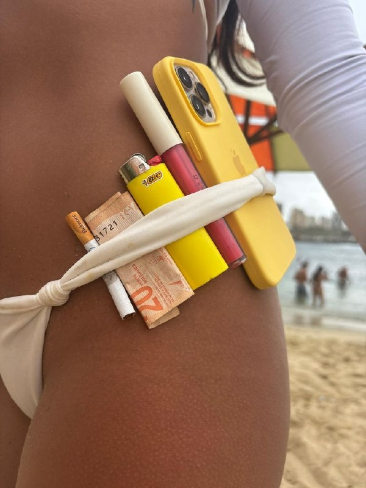

یک ن‍ــــــــه بزرگ به کیف.

@Dirty_Kids 👻

## Dirty_Kids — post 389679

  <a href="telegram/content/Dirty_Kids_389679_1779121352.mp4">🎬 Download video</a>

توقعی که از ایرانیای امریکا دارم

این تیم بی‌غیرتان سپاه رو اینجوری ادب نکنید و براشون جهنم نسازید، خیلی ازتون ناامید میشم

@Dirty_Kids 👻

## Dirty_Kids — post 389678

  <a href="telegram/content/Dirty_Kids_389678_1779121355.mp4">🎬 Download video</a>

یه فمبویِ مشهدی رفته حرم؛

اونجا هرکی از راه می‌رسه میگه شما چرا چادر نداری؟ اینم میگه بابا بخدا من پسرم...

@Dirty_Kids 👻

## Dirty_Kids — post 389677

  <a href="telegram/content/Dirty_Kids_389677_1779121357.mp4">🎬 Download video</a>

این خبرو این وسط خوندم خیلی خندیدم گفتم شماهم ببینید روحیه‌تون عوض شه:
تو ترکیه یه دستگاه گذاشتن به گربه ها غذا میده اتوماتیک با صدای میو کردن گربه؛ بعد این مرغ دریاییای پدرسوخته یادگرفتن میرن جلوش میو میو میکنن غذا بگیرن :)))

@Dirty_Kids 👻

## Dirty_Kids — post 389675

جورجینا (زن رونالدو) بلوند کرده

@Dirty_Kids 👻

## Dirty_Kids — post 389674

  <a href="telegram/content/Dirty_Kids_389674_1779121359.mp4">🎬 Download video</a>

نه داداش ببین...

@Dirty_Kids 👻

## Dirty_Kids — post 389673

  

از راست به چپ به ترتیب:
گلشیفته، نرگس محمدی، مصی علینژاد و لیلی بازرگان اگه رضاشاهِ اول نبود.

@Dirty_Kids 👻

## Hranews — post 113017

  

با حکم دادگاه تجدیدنظر استان آذربایجان شرقی؛ ۱۳ شهروند به حبس محکوم شدند

❗️
❗️
❗️
❗️
❗️– با حکم دادگاه تجدیدنظر استان آذربایجان شرقی، یوروش مهرعلی بیگلو، حامد یگانه‌پور، ابراهیم عوض‌زاده، آراز ابراهیم‌نژاد، حسین آزادی، امیرحسین آقایی، ناصر رزمجو، داوود شیری، جواد سودبر، مهرداد قادری، علی بابایی، مرتضی نورمحمدی و محمدرضا موحد، فعالان ترک (آذربایجانی)، مجموعا به ۸۱ سال و پنج ماه حبس محکوم شدند.

به گزارش خبرگزاری هرانا، ارگان خبری مجموعه فعالان حقوق بشر در ایران، رأی دادگاه تجدیدنظر استان آذربایجان شرقی به وکیل مدافع متهمان ابلاغ شده است.

این حکم روز شنبه ۲۶ اردیبهشت ماه توسط #دادگاه_تجدیدنظر استان آذربایجان شرقی، به وکیل این افراد ابلاغ شده است. طبق رای صادره، این افراد مجموعا به ۸۱ سال و پنج ماه حبس محکوم شدند.
شرح عناوین اتهامی هر یک از متهمان به همراه میزان محکومیت قطعی صادره به شرح زیر است:

ادامه مطلب

↘️
@hranews_bot تماس ✉️ -  @Hranews  کانال هرانا 🆑

## Hranews — post 113016

  

سخنگوی سازمان غذا و دارو اعلام کرد که زنجیره تامین مواد اولیه و واردات #دارو به کشور دچار اختلال شده است. به گفته محمد هاشمی، با توجه به اختلال در مسیرهای معمول تامین نهاده‌های دارویی، فعال‌سازی کریدورهای زمینی و ریلی منطقه‌ای در دستور کار سازمان غذا و دارو، وزارت راه و شهرسازی و دیگر دستگاه‌های ذی‌ربط قرار گرفته است.

↘️
@hranews_bot تماس ✉️ -  @Hranews  کانال هرانا 🆑

## configx2ray — post 39014

104.109.250.240
92.122.17.124
96.16.122.153
151.101.64.223
151.101.0.223
185.200.232.43  
2.17.100.200
2.19.205.42
2.19.205.50
2.19.252.134
2.20.169.70
2.20.170.91
95.101.111.144
2.16.245.188
2.18.69.150
2.16.106.4
23.58.222.107
184.25.28.31
23.47.124.134
23.50.131.147
23.46.190.18
23.58.222.147
23.56.162.186
23.44.203.68
23.12.156.115
23.216.77.16
23.62.61.53
23.39.148.245
23.210.73.133
23.44.201.136
23.205.46.167
184.30.150.142
23.220.161.217
184.28.165.4
23.46.230.133
88.221.168.204
104.96.158.174
184.51.252.4
172.234.199.15
104.85.26.14
172.237.145.27
92.123.103.24
172.234.159.58
184.86.103.210
96.16.248.183
92.122.16.5
96.16.249.60
96.16.249.9
184.26.57.149
2.17.211.216
2.19.205.66
2.20.135.163
2.21.176.57
2.21.239.16
2.21.240.15
2.23.169.12
2.23.97.122
23.12.147.134
23.193.117.5
23.196.14.11
23.196.3.200
23.2.13.154
23.2.13.226
23.200.79.136
23.200.87.22
23.202.230.211
23.204.136.169
23.204.9.130
23.205.106.74
23.205.165.21
23.212.110.33
23.212.250.11
23.212.250.25
23.213.158.26
23.214.139.250
23.215.0.40
23.216.77.154
23.216.77.162
23.216.77.50
23.216.77.70
23.217.124.170
23.37.198.164
23.44.201.234
23.44.203.86
23.44.215.152
23.52.182.11
23.54.127.42
23.55.110.208
23.55.161.161
23.61.250.82
23.9.187.41
23.217.47.193
23.40.179.202
184.27.225.90
23.53.13.19
95.101.50.88
23.204.115.108
2.21.240.147
184.24.232.70
2.22.255.47
23.49.248.8
23.213.158.12
23.210.216.145
23.33.90.150
23.44.201.134
23.208.64.159
23.216.77.140
2.22.255.17
23.209.72.174
2.19.204.225
23.44.201.152
23.55.176.84
2.19.204.211
23.219.36.106
23.215.0.134
2.21.2.97
23.61.202.70
23.44.201.206
23.218.239.132
23.212.253.232

آیپی های تست شده برای متود جدید سایفون❤️

همشو باهم وارد کنید داخل برنامه 🔥

Channel : https://t.me/ConfigX2ray

## configx2ray — post 39011

23.219.36.80
23.56.109.144
2.23.7.25
2.16.106.34
2.17.251.104
23.216.77.62
23.216.77.63
23.216.77.71
23.55.110.67
23.48.203.186
96.16.53.161
96.16.122.156
96.16.122.60
184.51.97.129
185.200.232.43
185.200.232.40

آیپی های تست شده برای متود جدید سایفون
❤️

همشو باهم وارد کنید داخل برنامه 
🔥

Channel : https://t.me/ConfigX2ray

## configx2ray — post 39010

23.73.2.141
104.83.5.202
23.67.136.200
23.67.136.202
23.65.119.52
96.16.122.70
92.122.166.236
92.122.166.234
92.122.166.237
104.110.138.190
173.222.200.5
184.51.252.36
184.51.252.38
104.83.5.208
96.16.122.146
96.17.206.214
92.122.166.197
104.94.100.73
104.83.15.66
88.221.213.81
172.239.57.117
104.117.76.40
184.51.252.4
96.17.207.30
96.16.122.83
96.16.122.150
23.73.207.11
96.16.122.77
96.17.207.155
92.123.189.82
96.16.122.82
96.16.122.66
96.7.218.219
96.16.122.137
184.51.252.157
92.123.189.41
184.86.251.12
96.16.122.154
96.16.122.157
184.51.252.152
96.17.207.12
23.79.48.162

آیپی های تست شده برای متود جدید سایفون
❤️

همشو باهم وارد کنید داخل برنامه 
🔥

Channel : https://t.me/ConfigX2ray

## configx2ray — post 39008

184.51.252.152
184.51.252.157
184.86.103.210
184.86.251.12
184.86.251.27
184.24.77.42
184.25.28.31
184.25.52.200
184.28.165.4
184.28.230.87
184.30.150.142
184.51.252.4
184.51.252.36
184.51.252.38
184.51.252.135
185.200.232.40
185.200.232.41
185.200.232.42
185.200.232.43
185.200.232.49
185.200.232.50

آیپی های تست شده برای متود جدید سایفون
❤️

همشو باهم وارد کنید داخل برنامه 
🔥

Channel : https://t.me/ConfigX2ray

## configx2ray — post 39005

  <a href="telegram/content/configx2ray_39005_1779121362.jpg">🎬 Download video</a>

vless://aa2b0e7a-6af9-4dc0-a378-04de4e801a92@arvancloud.ir:2095?path=%2FAar%2Cd-F%3Fed%3D2086&security=none&encryption=none&host=jswq678j.exinasy.site&type=ws#10https://t.me/ConfigX2ray

vless://71b308e0-e718-41b5-8c33-13cbebce3fe9@arvancloud.ir:2095?path=%2FAar%2Cd-F%3Fed%3D2086&security=none&encryption=none&host=jswq678j.exinasy.site&type=ws#9https://t.me/ConfigX2ray

vless://e757b0a0-d217-41c8-8177-05b7f2ab3462@arvancloud.ir:2095?path=%2FAar%2Cd-F%3Fed%3D2086&security=none&encryption=none&host=jswq678j.exinasy.site&type=ws#8https://t.me/ConfigX2ray

vless://da992858-3123-4aea-9bb5-6c8f8d74688d@arvancloud.ir:2095?path=%2FAar%2Cd-F%3Fed%3D2086&security=none&encryption=none&host=jswq678j.exinasy.site&type=ws#7https://t.me/ConfigX2ray

vless://693d989f-7d83-4b64-92d8-f65a01b00426@arvancloud.ir:2095?path=%2FAar%2Cd-F%3Fed%3D2086&security=none&encryption=none&host=jswq678j.exinasy.site&type=ws#6https://t.me/ConfigX2ray

vless://bd6e4c14-9d2b-4fa8-a3cf-1b74dd78ede7@arvancloud.ir:2095?path=%2FAar%2Cd-F%3Fed%3D2086&security=none&encryption=none&host=jswq678j.exinasy.site&type=ws#5https://t.me/ConfigX2ray

vless://ec3ec6ca-6e64-48b2-964a-5d0cfecfabd0@arvancloud.ir:2095?path=%2FAar%2Cd-F%3Fed%3D2086&security=none&encryption=none&host=jswq678j.exinasy.site&type=ws#4https://t.me/ConfigX2ray

vless://78c82ae4-596b-45f6-8d21-2f136db7d205@arvancloud.ir:2095?path=%2FAar%2Cd-F%3Fed%3D2086&security=none&encryption=none&host=jswq678j.exinasy.site&type=ws#3https://t.me/ConfigX2ray

vless://6408f8f3-4d00-4c36-aa0e-b49d09a26a34@arvancloud.ir:2095?path=%2FAar%2Cd-F%3Fed%3D2086&security=none&encryption=none&host=jswq678j.exinasy.site&type=ws#2https://t.me/ConfigX2ray

vless://80dd98cd-b501-4e3e-98e0-274e01916f94@arvancloud.ir:2095?path=%2FAar%2Cd-F%3Fed%3D2086&security=none&encryption=none&host=jswq678j.exinasy.site&type=ws#1https://t.me/ConfigX2ray

ترکیبی با سایفون وصله 
✅

آموزش استفادع : 
👇
https://t.me/ConfigX2ray0/1665

## configx2ray — post 39004

2.17.100.200
2.19.205.42
2.19.205.50
2.19.252.134
2.20.169.70
2.20.170.91
95.101.111.144
2.16.245.188
2.18.69.150
2.16.106.4
23.58.222.107
184.25.28.31
23.47.124.134
23.50.131.147
23.46.190.18
23.58.222.147
23.56.162.186
23.44.203.68
23.12.156.115
23.216.77.16
23.62.61.53
23.39.148.245
23.210.73.133
23.44.201.136
23.205.46.167
184.30.150.142
23.220.161.217
184.28.165.4
23.46.230.133
88.221.168.204
104.96.158.174
184.51.252.4
172.234.199.15
104.85.26.14
172.237.145.27
92.123.103.24
172.234.159.58
184.86.103.210
96.16.248.183
92.122.16.5
96.16.249.60

آیپی های تست شده برای متود جدید سایفون
❤️

همشو باهم وارد کنید داخل برنامه 
🔥

Channel : https://t.me/ConfigX2ray

## manototv — post 105601

  <a href="telegram/content/manototv_105601_1779121363.mp4">🎬 Download video</a>

تماسی از ایران:
«خانواده‌های بچه‌های دربند رو برای کمک‌رساندن دریابیم»

## manototv — post 105600

  <a href="telegram/content/manototv_105600_1779121366.mp4">🎬 Download video</a>

عفو بین‌الملل اعلام کرد شمار اعدام‌ها در جهان در سال ۲۰۲۵ به بالاترین سطح ثبت‌شده در ۴۴ سال گذشته رسیده و ایران با ثبت دست‌کم ۲۱۵۹ اعدام، عامل اصلی این افزایش بوده است.

بر اساس گزارش سالانه این سازمان، در مجموع دست‌کم ۲۷۰۷ نفر در ۱۷ کشور اعدام شده‌اند؛ آماری که نسبت به سال ۲۰۲۴ حدود ۷۸ درصد افزایش نشان می‌دهد.

عفو بین‌الملل اعلام کرد شمار اعدام‌ها در ایران بیش از دو برابر سال گذشته شده و ایران پس از چین، که آمار رسمی اعدام‌هایش منتشر نمی‌شود، در صدر کشورهای مجری اعدام قرار دارد.

در این گزارش آمده است عربستان سعودی با دست‌کم ۳۵۶ اعدام در رتبه بعدی قرار گرفته و بخش قابل توجهی از این احکام به جرایم مرتبط با مواد مخدر مربوط بوده است.

بر اساس این گزارش، آمریکا نیز شمار اعدام‌های خود را از ۲۵ مورد در سال ۲۰۲۴ به ۴۷ مورد در سال ۲۰۲۵ افزایش داده است. شمار اعدام‌ها در مصر، سنگاپور و کویت نیز نسبت به سال قبل افزایش یافته است.

عفو بین‌الملل همچنین اعلام کرد چین، مصر، جمهوری اسلامی، عراق، کره شمالی، عربستان سعودی، سومالی، آمریکا، ویتنام و یمن در پنج سال گذشته به‌طور مداوم اعدام انجام داده‌اند.

## manototv — post 105599

  <a href="telegram/content/manototv_105599_1779121367.mp4">🎬 Download video</a>

با تهدید «حق تیر داریم» مانع برگزاری مراسم زادروز بهار شاه‌مهری شدند

بر اساس ویدیوی ارسالی به منوتو، نیروهای حکومتی با تهدید خانواده بهار شاه‌مهری و گفتن جمله «ما حق تیر داریم»، اجازه برگزاری مراسم زادروز این جاویدنام را در ۱۹ اردیبهشت ندادند.

بهار شاه‌مهری، نوجوان ۱۷ ساله اهل نیشابور، غروب ۱۹ دی‌ماه ۱۴۰۴ در جریان انقلاب شیر و خورشید ایران، در کوچه‌ای خلوت از پشت سر هدف شلیک مستقیم تک‌تیرانداز نیروهای سرکوبگر جمهوری اسلامی قرار گرفت و جان باخت.

به گفته نزدیکان او، چند روز پیش از سالروز تولد بهار، اعضای خانواده‌اش بازداشت و بازجویی شدند و مسیرهای منتهی به مزار او در روز تولدش بسته شد تا از برگزاری مراسم جلوگیری شود.

همچنین گزارش شده است که سنگ مزار بهار شاه‌مهری روز دوم فروردین ۱۴۰۶ شکسته شده بود.
این فشارها بخشی از روند گسترده‌تر سرکوب خانواده‌های جان‌باختگان است؛ حتی بعد از کشتن، از گل گذاشتن و تولد گرفتن هم می‌ترسند. عجب شجاعتی، حکومت با سنگ قبر می‌جنگد.

## manototv — post 105598

  <a href="telegram/content/manototv_105598_1779121369.mp4">🎬 Download video</a>

دونالد ترامپ، رئیس‌جمهوری آمریکا، در پیامی در تروث‌سوشال ، رسانه‌های آمریکایی را متهم کرد که حتی در صورت «تسلیم کامل ایران» نیز آن را به‌عنوان پیروزی توصیف خواهند کرد.

ترامپ در این پیام نوشت اگر جمهوری اسلامی شکست خود را بپذیرد، نیروهای نظامی‌اش تسلیم شوند و رهبرانش «اسناد تسلیم» را امضا کنند، باز هم رسانه‌هایی چون نیویورک‌تایمز، وال‌استریت ژورنال و سی‌ان‌ان این اتفاق را «پیروزی ایران» جلوه خواهند داد.

او با اشاره به نابودی نیروی دریایی و نیروی هوایی ایران نوشت: «اگر ایران تسلیم شود، بپذیرد که نیروی دریایی‌اش در کف دریا نابود شده و نیروی هوایی‌اش دیگر وجود ندارد، و اگر نیروهای نظامی‌اش با دست‌های بالا و پرچم سفید از تهران خارج شوند، باز هم رسانه‌های فیک‌نیوز خواهند گفت ایران پیروزی درخشانی مقابل آمریکا به دست آورده است.»

ترامپ همچنین رسانه‌های جریان اصلی آمریکا را «فاسد» و «بی‌اهمیت» توصیف کرد و نوشت: «دموکرات‌ها و رسانه‌ها کاملا راه خود را گم کرده‌اند. آن‌ها کاملا دیوانه شده‌اند.»

## manototv — post 105597

  

ارتش اسرائیل می‌گوید در حمله‌ای هوایی به منطقه بعلبک در شرق لبنان، وائل محمود عبدالحلیم، فرمانده جهاد اسلامی در منطقه بقاع، کشته شده است. به گفته ارتش اسرائیل، او در هماهنگی عملیات‌های جهاد اسلامی در کنار حزب‌الله لبنان نقش داشته است.

## manototv — post 105596

  <a href="telegram/content/manototv_105596_1779121371.mp4">🎬 Download video</a>

رویترز در گزارشی اختصاصی نوشت پاکستان در جریان جنگ ایران، هشت هزار نیرو، یک اسکادران جنگنده و یک سامانه پدافند هوایی به عربستان سعودی اعزام کرده است.

بر اساس این گزارش، این اعزام در چارچوب پیمان دفاعی دوجانبه اسلام‌آباد و ریاض انجام شده و شامل حدود ۱۶ جنگنده، عمدتا از نوع جی‌اف‌ـ۱۷ ساخت مشترک پاکستان و چین، دو اسکادران پهپاد و سامانه پدافند هوایی چینی اچ‌کیو‌ـ۹ است. منابع رویترز گفتند عربستان هزینه این اعزام را تامین می‌کند و تجهیزات را نیروهای پاکستانی اداره می‌کنند.

پنج منبع امنیتی و دولتی به رویترز گفتند این نیروها با هدف حمایت از ارتش عربستان در صورت حملات بیشتر به این کشور مستقر شده‌اند.

## manototv — post 105595

  <a href="telegram/content/manototv_105595_1779121372.mp4">🎬 Download video</a>

رسانه‌های ترکیه گزارش دادند فرخنده قائم‌مقامی، زن ایرانی ساکن منطقه مال‌تپه استانبول، پس از قتل، جسدش در استان قرشهر پیدا شده است.

بر اساس گزارش خبرگزاری «دمیراورن»، خانم قائم‌مقامی از ۲۲ فروردین ناپدید شده بود و نزدیکان او پس از بی‌خبری، در ۲۳ اردیبهشت گزارش مفقودی ثبت کردند.

پلیس ترکیه در تحقیقات خود «ارکان ب»، ۴۹ ساله، را به‌عنوان آخرین فردی شناسایی کرد که با این زن ایرانی در تماس بوده است. بنا بر این گزارش، او ابتدا اتهام‌ها را رد کرد، اما بعدا به قتل اعتراف کرد.

دمیراورن نوشت مظنون در اعترافات خود گفته است پس از مشاجره در خودرو، قائم‌مقامی را با قلاده سگش خفه کرده، جسد او را تکه‌تکه کرده و در زمینی خالی در شهرستان موجور استان قرشهر رها کرده است.

در ادامه تحقیقات، دو مظنون دیگر نیز بازداشت شدند. سه مظنون این پرونده پس از پایان بازجویی در اداره پلیس، به دادگاه منتقل شدند.

## manototv — post 105594

  <a href="telegram/content/manototv_105594_1779121373.mp4">🎬 Download video</a>

بر اساس گزارش رسانه‌های حقوق بشری، نیروهای حکومتی روز ۱۵ اردیبهشت با یورش به خانه «افسانه جذابی (راسخی)»، شهروند بهائی ساکن شیراز، منزل او را تفتیش کردند و بخشی از اموال شخصی او را با خود بردند.

در این گزارش‌ها آمده است یک زن و سه مرد با ارائه حکمی با عنوان «همکاری با اسرائیل» وارد خانه این خانواده شدند و خانم جذابی و مادر ۸۵ ساله او را مورد تهدید و تحقیر قرار دادند. خانم جذابی به‌تازگی همسر خود را از دست داده و از مادر سالخورده و بیمار خود مراقبت می‌کند.

به گفته این رسانه‌ها، ماموران حکومتی به او گفتند فرزندش در خارج از کشور در فضای مجازی و کمپین‌های حقوق بشری فعالیت می‌کند و تهدید کردند در صورت ادامه این فعالیت‌ها، «هم برای شما و هم برای آنها گران تمام می‌شود.» آنها همچنین این خانواده را به مصادره خانه تهدید کردند.

بر اساس این گزارش‌ها، نیروهای امنیتی همچنین این خانواده را با عباراتی مانند «فرقه» و «همدست اسرائیل» خطاب کردند و چند بار خانم جذابی را به دستبند زدن و انتقال به مکانی نامعلوم تهدید کردند.

این یورش چند ساعت ادامه داشت و در پایان، خانم جذابی و مادر سالخورده‌اش که دچار افت فشار خون شده بود، مجبور شدند برگه‌ای را امضا کنند که در آن نوشته شده بود هیچ خسارتی به خانه و وسایل وارد نشده است. در این رویداد هیچ‌یک از اعضای خانواده بازداشت نشدند.

## manototv — post 105593

  <a href="telegram/content/manototv_105593_1779121374.mp4">🎬 Download video</a>

روزنامه ایران وابسته به دولت جمهوری اسلامی در گزارشی نوشت محدودیت دسترسی به اینترنت بین‌الملل، بازار خرید و فروش سیم‌کارت‌های عراقی را در برخی مناطق مرزی غرب ایران رونق داده است.

بر اساس این گزارش، بیشترین متقاضیان این سیم‌کارت‌ها تجار، بازرگانان، صاحبان بار، رانندگان ترانزیتی و فعالان اقتصادی مرزی هستند که برای ارتباط با طرف‌های عراقی، ارسال اسناد، حواله‌های مالی، رسیدها، عکس و فیلم کالاها از پیام‌رسان‌هایی مانند واتس‌اپ و تلگرام استفاده می‌کنند.

نعیم احمدی، مدیر روابط عمومی استانداری خوزستان، به این روزنامه گفت این سیم‌کارت‌ها در عمق یک تا دو کیلومتری خاک ایران قابل استفاده‌اند و در مناطقی مانند شلمچه، چذابه، خرمشهر، اروندکنار و جزیره مینو به گزینه‌ای در دسترس برای فعالان اقتصادی تبدیل شده‌اند. به گفته او، ارزانی این سیم‌کارت‌ها در مقایسه با هزینه فیلترشکن‌ها از عوامل گرایش به آنهاست.

در همین حال، محمد شفیعی، فرماندار قصرشیرین، استفاده از سیم‌کارت‌های عراقی در کرمانشاه را عمدتا محدود به تجار، صاحبان بار، رانندگان ترانزیتی و فعالان اقتصادی دانست و فراگیر شدن آن در میان عموم مردم را رد کرد.

## manototv — post 105592

  

فریدریش مرتس، صدراعظم آلمان، حملات تازه جمهوری اسلامی علیه کشورهای منطقه را به‌شدت محکوم کرد و گفت حمله به تأسیسات هسته‌ای «تهدیدی برای امنیت مردم در سراسر منطقه» است.

او در پیامی در ایکس تأکید کرد که نباید خشونت‌ها بیش از این تشدید شود و از جمهوری اسلامی خواست وارد مذاکرات جدی با آمریکا شود، تهدید همسایگانش را متوقف کند و تنگه هرمز را بدون محدودیت باز کند.

این موضع‌گیری پس از آن مطرح شد که امارات از آتش‌سوزی در محدوده نیروگاه هسته‌ای براکه پس از حمله پهپادی خبر داد. مقام‌های اماراتی اعلام کردند این حادثه تلفات جانی و خطر تشعشعاتی نداشته است. عربستان سعودی نیز هم‌زمان از رهگیری حملات پهپادی تازه خبر داده است.

فریدریش مرتس، صدراعظم آلمان، حملات تازه منسوب به جمهوری اسلامی علیه کشورهای منطقه را محکوم کرد و گفت حمله به تأسیسات هسته‌ای امنیت مردم منطقه را تهدید می‌کند.

او از جمهوری اسلامی خواست وارد مذاکرات جدی با آمریکا شود، تهدید همسایگانش را متوقف کند و تنگه هرمز را بدون محدودیت باز کند. این موضع‌گیری پس از حمله پهپادی به محدوده نیروگاه هسته‌ای براکه در امارات و رهگیری حملات پهپادی تازه از سوی عربستان مطرح شده است.

## alonews — post 120907

  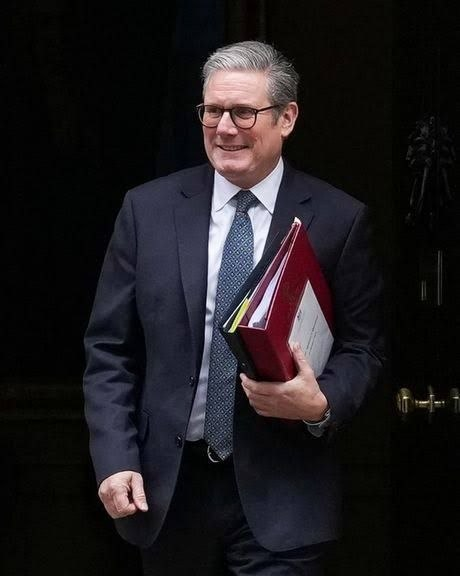

👈کیر:به هیچ عنوان استعفا نمیدم

✅ @AloNews خبر جنگ

## alonews — post 120906

  <a href="telegram/content/alonews_120906_1779121377.jpg">🎬 Download video</a>

👈وزارت بهداشت لبنان اعلام کرد که از آغاز حمله اسرائیل در ۲ مارس تاکنون، ۳٬۰۲۰ نفر شهید و ۹٬۲۷۳ نفر دیگر زخمی شده‌اند

✅ @AloNews خبر جنگ

## alonews — post 120905

❤️امروز فقط با گیگی 159 تومن کانفیگ اختصاصی خودت رو بخر
❤️ 
🤩
🤩
🤩
🤩
🤩
🤩
🤩
🤩
🤩
🤩
🤩
🤩 ساب
✅ ضریب
❌ ضمانت بازگشت وجه
✅ پشتیبانی مادام
✅ پس دیگه معطل هیچی نباش و بدون واسطه خرید کن
😁 خرید مستقیم از ربات: @manageuser_robot پرداخت ریالی فعال هست 
‼️ پشتیبانی درصورت بروز هرگونه…

## alonews — post 120904

  

❤️امروز فقط با گیگی 159 تومن کانفیگ اختصاصی خودت رو بخر
❤️

🤩
🤩
🤩
🤩
🤩
🤩
🤩
🤩
🤩
🤩
🤩
🤩
ساب
✅
ضریب
❌
ضمانت بازگشت وجه
✅
پشتیبانی مادام
✅
پس دیگه معطل هیچی نباش و بدون واسطه خرید کن
😁

خرید مستقیم از ربات:
@manageuser_robot
پرداخت ریالی فعال هست 
‼️

پشتیبانی درصورت بروز هرگونه مشکل:
@Niiiiiimaaaaa

## alonews — post 120903

  <a href="telegram/content/alonews_120903_1779121379.jpg">🎬 Download video</a>

👈عکس‌ها و ویدیوهای دریافتی از فرودگاه بین‌المللی تل‌آویو نشان می‌دهد که حدود ۴۰ تا ۵۰ فروند تانکر هوایی (هواپیمای سوخت‌رسان) نیروی هوایی آمریکا در محوطه پارکینگ فرودگاه حضور دارند.

🔴در چند هفته گذشته، حدود ۲۰ هواپیمای نظامی در فرودگاه اسرائیل مشاهده شده بود

✅ @AloNews خبر جنگ

## alonews — post 120902

  <a href="telegram/content/alonews_120902_1779121379.jpg">🎬 Download video</a>

👈رادیو ملی آمریکا (ان‌پی‌آر): عکس‌ها و ویدیوهای دریافتی از فرودگاه بین‌المللی تل‌آویو نشان می‌دهد که حدود ۴۰ تا ۵۰ فروند تانکر هوایی (هواپیمای سوخت‌رسان) نیروی هوایی آمریکا در محوطه پارکینگ فرودگاه حضور دارند.

🔴در چند هفته گذشته، حدود ۲۰ هواپیمای نظامی در فرودگاه اسرائیل مشاهده شده بود.

✅ @AloNews خبر جنگ

## alonews — post 120901

  <a href="telegram/content/alonews_120901_1779121379.jpg">🎬 Download video</a>

👈 سردار طلایی‌نیک: بخش قابل توجهی از توانمندی‌های ما هنوز مورد استفاده قرار نگرفته.

🔴آمریکایی‌ها یا باید در برابر دیپلماسی و شروط ما تسلیم شوند یا در برابر قدرت موشکی ما

✅ @AloNews خبر جنگ

## alonews — post 120900

  <a href="telegram/content/alonews_120900_1779121380.jpg">🎬 Download video</a>

👈خبرنگاران مستقر در اسلام‌آباد و واشینگتن گزارش داده‌اند که پیش از ارسال متن تازه از سوی ایران، درخواست و پیشنهادی از تیم ترامپ ارائه نشده بود و هنوز به متن تازه ایران نیز پاسخ داده نشده است.

✅ @AloNews خبر جنگ

## alonews — post 120899

  <a href="telegram/content/alonews_120899_1779121380.mp4">🎬 Download video</a>

👈دیدار وزیر کشور پاکستان با عراقچی

✅ @AloNews خبر جنگ

## alonews — post 120898

  <a href="telegram/content/alonews_120898_1779121382.jpg">🎬 Download video</a>

👈اسرائیل هیوم: وزارت دفاع از نتانیاهو خواسته بودجه ارتش را 14میلیارد دلار افزایش دهد

✅ @AloNews خبر جنگ

## alonews — post 120897

  <a href="telegram/content/alonews_120897_1779121382.jpg">🎬 Download video</a>

🔴فوری / رویترز: آمریکا پیشنهاد جدید ایران را رد کرد

✅ @AloNews خبر جنگ

## alonews — post 120896

  <a href="telegram/content/alonews_120896_1779121382.jpg">🎬 Download video</a>

🔴فوری / آکسیوس: ترامپ در حال بررسی از سرگیری جنگ است

✅ @AloNews خبر جنگ

## alonews — post 120895

  <a href="telegram/content/alonews_120895_1779121382.jpg">🎬 Download video</a>

👈کمیسر اقتصادی اتحادیه اروپا: در نتیجه جنگ با ایران با شوک رکود تورمی مواجه هستیم

✅ @AloNews خبر جنگ

## alonews — post 120894

  <a href="telegram/content/alonews_120894_1779121383.jpg">🎬 Download video</a>

👈ادعای اکسیوس به نقل از یک مقام ارشد آمریکایی: ایران یک پیشنهاد به‌روز شده برای توافق جهت پایان دادن به جنگ ارائه کرده است، اما کاخ سفید معتقد است که این پیشنهاد، بهبود قابل توجهی نیست و برای حصول توافق کافی نیست

🔴پیشنهاد ایران که شامگاه یکشنبه از طریق میانجی‌های پاکستانی با آمریکا به اشتراک گذاشته شده، تنها بهبودهای نمادین نسبت به نسخه قبلی دارد.

🔴پیشنهاد جدید شامل کلمات بیشتری درباره تعهد ایران به عدم پیگیری سلاح هسته‌ای است، اما هیچ تعهد دقیقی درباره تعلیق غنی‌سازی اورانیوم یا تحویل ذخایر موجود اورانیوم با غنای بالا ندارد

✅ @AloNews خبر جنگ

## alonews — post 120893

  <a href="telegram/content/alonews_120893_1779121383.jpg">🎬 Download video</a>

👈وزیر خارجه ترکیه: اولویت، حفظ آتش‌بس در جنگ ایران است

🔴هیچ دلیلی وجود ندارد که ایران و آمریکا نتوانند در مذاکرات بر روی یک زمینه مشترک به توافق برسند.

✅ @AloNews خبر جنگ

## alonews — post 120892

  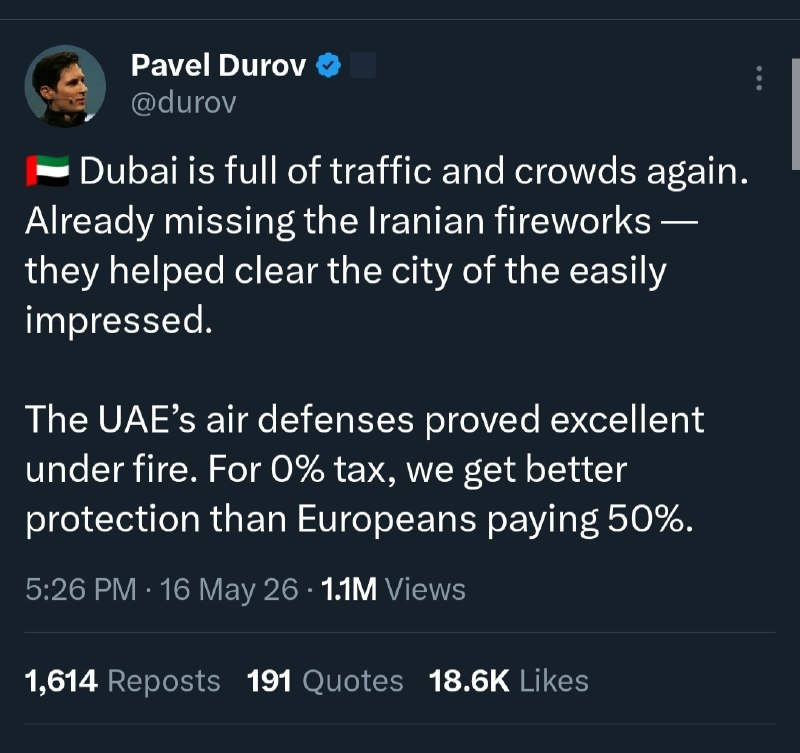

👈پاول دوروف، مالک تلگرام: دلمان برای موشک‌های ایرانی در دبی تنگ شده. دبی پر از ترافیک شده است

✅ @AloNews خبر جنگ

## alonews — post 120891

  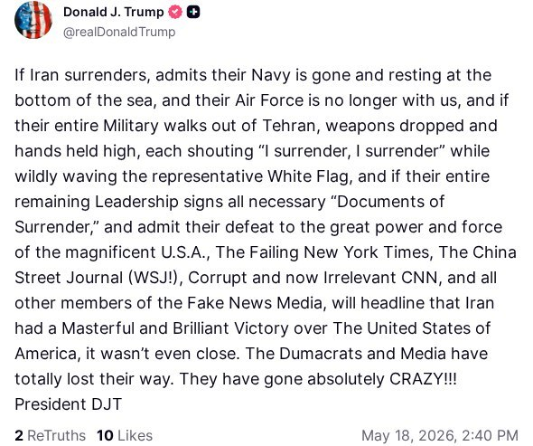

👈ترامپ: اگر ایران تسلیم شود، اعتراف کند که ناوگانشان نابود شده و در کف دریا آرام گرفته است، و نیروی هوایی‌شان دیگر وجود ندارد، و اگر تمام ارتششان تهران را ترک کند، اسلحه‌ها را رها کرده و دست‌هایشان را بالا ببرند و فریاد بزنند «من تسلیم می‌شوم، من تسلیم می‌شوم» و پرچم سفید نمادین را به شدت تکان دهند،

🔴 و اگر تمام رهبران باقی‌مانده همه «اسناد تسلیم» لازم را امضا کنند و شکست خود را در برابر قدرت بزرگ و عظمت ایالات متحده آمریکا بپذیرند، آنگاه روزنامه‌های The Failing New York Times، The China Street Journal (WSJ!)، شبکه فاسد و اکنون بی‌اهمیت CNN و همه نمایندگان دیگر رسانه‌های خبری جعلی اعلام خواهند کرد که ایران پیروزی درخشان و استادانه‌ای بر ایالات متحده آمریکا به دست آورده است، حتی قابل مقایسه هم نیست.

🔴 دموکرات‌ها و رسانه‌ها کاملاً از مسیر خارج شده‌اند. آنها کاملاً دیوانه شده‌اند!!! رئیس‌جمهور دونالد ج. ترامپ

✅ @AloNews خبر جنگ

## alonews — post 120890

  <a href="telegram/content/alonews_120890_1779121385.jpg">🎬 Download video</a>

👈کابینه ارتش اسرائیل امشب تشکیل جلسه میده - طبق گزارش رسانه‌‌های اسرائیلی 
✅ @AloNews خبر جنگ

## alonews — post 120889

  <a href="telegram/content/alonews_120889_1779121385.jpg">🎬 Download video</a>

👈کابینه ارتش اسرائیل امشب تشکیل جلسه میده - طبق گزارش رسانه‌‌های اسرائیلی

✅ @AloNews خبر جنگ

## alonews — post 120887

  <a href="telegram/content/alonews_120887_1779121385.mp4">🎬 Download video</a>

👈صحنه‌هایی از تول، جنوب لبنان، پس از حمله اسرائیل

✅ @AloNews خبر جنگ

---
📅 بروزرسانی: 1405/02/28 16:14
---

## VahidOOnLine — post 240788

  

♦️خبرگزاری تسنیم وابسته به سپاه پاسداران، روز دوشنبه ۲۸ اردیبهشت، به نقل از یک منبع نزدیک به تیم مذاکره‌کننده گزارش داد آمریکا در متن جدید پیشنهادی خود، برخلاف متون پیشین، پذیرفته است تحریم‌های نفتی ایران را «در طول دوره مذاکرات» به‌طور موقت تعلیق کند.
به گفته این منبع، آمریکایی‌ها در متن جدید با «تعلیق موقت» (Waive) تحریم‌های نفتی ایران موافقت کرده‌اند. «ویو» به معنای معافیت یا چشم‌پوشی موقت از اجرای تحریم‌ها است و به معنای لغو کامل و دائمی آن‌ها محسوب نمی‌شود.
بر اساس این گزارش، تیم مذاکره‌کننده ایرانی همچنان بر این موضع تاکید دارد که لغو همه تحریم‌های ایران باید بخشی از تعهدات آمریکا باشد. در مقابل، واشنگتن پیشنهاد داده است معافیت‌های مرتبط با اوفک (دفتر کنترل دارایی‌های خارجی وزارت خزانه‌داری آمریکا) تنها تا زمان دستیابی به تفاهم نهایی اعمال شود.
به گزارش تسنیم، این تغییر در متن جدید آمریکا نسبت به پیشنهادهای قبلی، تحول تازه‌ای در روند مذاکرات به شمار می‌رود.
‌🇸🇦 Indypersian

🤖 @VahidOOnLine

## VahidOOnLine — post 240787

♦️بیست‌وهشتم اردیبهشت در تقویم ایران روز بزرگداشت حکیم عمر خیام نیشابوری، فیلسوف، ادیب، ریاضی‌دان و اخترشناس بزرگ ایرانی است.

آرامگاه خیام در شهر نیشابور، به همت استاد هوشنگ سیحون، یکی از پیشگامان معماری نوین ایران، در سال ۱۳۴۲ بنا شد.

این معمار صاحب‌نام ایرانی چند سال پیش در گفتگو با رسانه محلی عصر نیشابور گفته بود: «این بنا را بر اساس شعر خود خیام و غرق در گل و سبزه ساخته است.»
‌🇸🇦 Indypersian

🤖 @VahidOOnLine

## VahidOOnLine — post 240786

  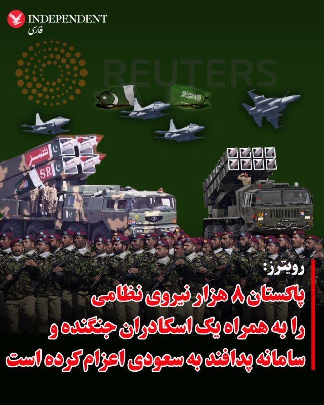

♦️خبرگزاری رویترز به نقل از منابع آگاه گزارش داد پاکستان در چارچوب پیمان دفاعی خود با عربستان سعودی، ۸ هزار نیروی نظامی به همراه یک اسکادران جنگنده و سامانه پدافند هوایی به این کشور اعزام کرده است.
بر اساس این گزارش، این نیروها از آمادگی عملیاتی برخوردارند و با هدف حمایت از عربستان در صورت ازسرگیری حملات علیه این کشور مستقر شده‌اند.

این تحرک نظامی در شرایطی انجام می‌شود که اسلام‌آباد هم‌زمان نقش مهمی در میانجی‌گری میان تهران و واشنگتن ایفا می‌کند.
‌🇸🇦 Indypersian

🤖 @VahidOOnLine

## VahidOOnLine — post 240785

  

خبرگزاری رویترز به نقل از منابع آگاه گزارش داد پاکستان در چارچوب پیمان دفاعی خود با عربستان سعودی، ۸ هزار نیروی نظامی به همراه یک اسکادران جنگنده و سامانه پدافند هوایی به این کشور اعزام کرده است.

به گزارش رویترز، این نیروها از توان عملیاتی برخوردارند و با هدف حمایت از عربستان سعودی در صورت ازسرگیری حملات علیه این کشور مستقر شده‌اند.

این تحرک نظامی در حالی صورت می‌گیرد که پاکستان نقش اصلی میانجی‌گری میان تهران و واشینگتن را بر عهده دارد.
‌🏁 🇬🇧 IranintlTV

🤖 @VahidOOnLine

## VahidOOnLine — post 240784

  

♦️جمهوری اسلامی ایران روز دوشنبه ۲۸ اردیبهشت‌ماه حساب کاربری «نهاد مدیریت آبراهه خلیج فارس» را در شبکه اجتماعی اکس فعال کرد.

این حساب در اولین پیام خود به دو زبان فارسی و انگلیسی نوشت: «حساب رسمی مدیریت آبراه خلیج فارس (#PGSA) در ایکس به منظور اطلاع‌رسانی فعالیت‌های این سازمان آغاز به کار می‌نماید.
برای اطلاع از آخرین وضعیت تنگه هرمز ما را دنبال کنید.»

خبرگزاری فرانسه گزارش کرد که شورای امنیت ملی ایران این حساب کاربری را به راه انداخته و حساب کاربری سپاه پاسداران هم اولین پیام آن را بازنشر کرده است.

ابراهیم عزیزی، رئیس کمیسیون امنیت ملی مجلس ایران، روز شنبه ۲۶ اردیبهشت با انتشار پیامی در شبکه اجتماعی اکس اعلام کرده بود که تهران سازوکاری «حرفه‌ای» برای مدیریت تردد در تنگه هرمز از طریق یک مسیر تعیین‌شده آماده کرده است که به‌زودی جزئیات آن را اعلام می‌کند.

عزیزی در این پیام نوشته بود: «فقط کشتی‌های تجاری و طرف‌های همکاری با ایران از آن بهره‌مند خواهند شد. حقوق لازم در ازای خدمات تخصصی ارائه شده، با این سازوکار برای ایران اخذ می‌شود. این مسیر کماکان برای عاملین پروژه به اصطلاح آزادی بسته خواهد ماند.»
‌🇸🇦 Indypersian

🤖 @VahidOOnLine

## VahidOOnLine — post 240783

  

نِت‌بلاکس اعلام کرد خاموشی اینترنت در ایران وارد هشتادمین روز شده و مدت این اختلال از ۱۸۹۶ ساعت گذشته است.

نِت‌بلاکس، نهاد ناظر بر اختلالات اینترنتی، در گزارشی اعلام کرد خاموشی اینترنت در ایران وارد هشتادمین روز شده و از ۱۸۹۶ ساعت عبور کرده است. این نهاد هم‌زمان نوشته که در حالی‌ که دسترسی آزاد شهروندان به اینترنت همچنان محدود است، محتوای حامی جمهوری اسلامی در شبکه‌های اجتماعی به‌طور گسترده منتشر می‌شود.

بر اساس گزارش نِت‌بلاکس، برخی کاربران در ایران گفته‌اند برای دریافت دسترسی‌های ویژه یا «سفید»، از آن‌ها خواسته شده روزانه سهمیه‌ای از محتوای تبلیغاتی منتشر کنند؛ روندی که گفته می‌شود با ابزارهای هوش مصنوعی هم کنترل می‌شود.
‌🏁 🇬🇧 ManotoTV

🤖 @VahidOOnLine

## VahidOOnLine — post 240782

  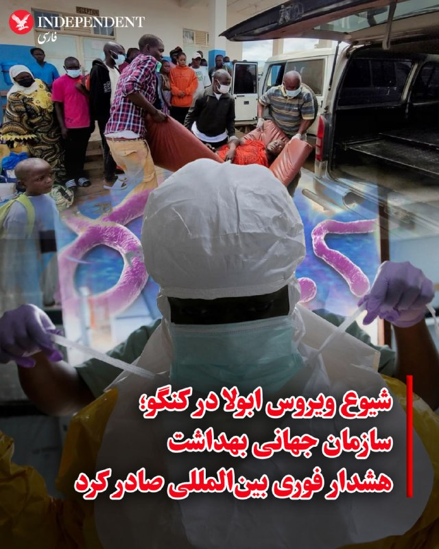

♦️ در پی مرگ دست‌کم ۱۰۰ نفر در جمهوری دموکراتیک کنگو براثر ابتلا به گونه جدید ویروس ابولا، سازمان جهانی بهداشت روز یکشنبه هشدار فوری بین‌المللی صادر کرد.

به گزارش خبرگزاری فرانسه، این دومین سطح بالای هشدار سازمان جهانی بهداشت به‌شمار می‌رود. این نهاد وابسته به سازمان ملل اعلام کرد این گونه  که  بوندی بوگیو نام دارد نه واکسنی دارد و نه درمانی.

کشورهای آفریقایی در دهه گذشته و سال‌ها پیش از شیوع جهانی ویروس کووید، با بیماری ابولا درگیر شده بودند؛ بیماری که هزاران قربانی برجا گذاشت اما شیوع آن مانند کووید تبدیل به همه‌گیری جهانی نشد.
‌🇸🇦 Indypersian

🤖 @VahidOOnLine

## VahidOOnLine — post 240781

  <a href="telegram/content/VahidOOnLine_240781_1779108297.mp4">🎬 Download video</a>

ویدیوهای رسیده به ایران‌اینترنشنال، نصب بنرهای اعتراضی را در مناطق مختلف کرج نشان می‌دهد که روی آنها نوشته شده: «ما چیزی برای خوردن نداریم. بچه‌هایمان گرسنه هستن. همه‌چیز به ما بستگی دارد.»
‌🏁 🇬🇧 IranintlTV

🤖 @VahidOOnLine

## VahidOOnLine — post 240780

  

احمد ابوالغیط، دبیرکل اتحادیه عرب، حمله به عربستان سعودی با سه پهپاد را به‌شدت محکوم کرد و آن را نقضی آشکار حاکمیت و تمامیت ارضی این کشور دانست.

احمد ابوالغیط گفت: «این حمله بزدلانه به هیچ‌وجه قابل قبول یا توجیه نیست.»

او با اشاره به نقض حریم هوایی عربستان سعودی تاکید کرد این اقدام تجاوزی آشکار به حاکمیت این کشور بوده است.

جمال رشدی، سخنگوی دبیرکل اتحادیه عرب، نیز اعلام کرد دبیرکل همبستگی کامل خود را با پادشاهی عربستان سعودی در اقداماتی که برای حفاظت از اراضی و شهروندان خود مطابق با احکام حقوق بین‌الملل اتخاذ می‌کند، ابراز کرده است.
‌🏁 🇬🇧 IranintlTV

🤖 @VahidOOnLine

## VahidOOnLine — post 240779

  

♦️ فردریش مرتس، صدراعظم آلمان روز دوشنبه ۲۸ اردیبهشت‌ماه با انتشار پیامی در اکس، حملات «اخیر» به امارات متحده عربی و دیگر کشورهای خلیج فارس را به‌شدت محکوم کرد و از جمهوری اسلامی ایران خواست تا به جدیت به میز مذاکرات با آمریکا بازگردد.

مرتس در این پیام، تلویحا حمله به محوطه نیروگاه هسته‌ای براکه را کار جمهوری اسلامی ایران توصیف کرد و نوشت: «حملات به تاسیسات هسته‌ای، تهدیدی برای امنیت مردم در سراسر منطقه است. نباید خشونت‌ها بیش از این تشدید شود. ایران باید وارد مذاکرات جدی با ایالات متحده شود، تهدید همسایگان خود را متوقف کند و تنگه هرمز را بدون محدودیت باز کند.»

امارات متحده عربی دیروز اعلام کرد در حال تحقیق درباره منشا حمله پهپادی به نیروگاه هسته‌ای براکه این کشور است.
‌🇸🇦 Indypersian

🤖 @VahidOOnLine

## VahidOOnLine — post 240778

  

♦️خبرگزاری تسنیم، وابسته به سپاه پاسداران، روز دوشنبه ۲۸ اردیبهشت ماه به نقل از «یک منبع نزدیک به تیم مذاکره‌کننده» جمهوری اسلامی نوشت که تهران «جدیدترین متن خود را در ۱۴ بند به واسطه پاکستانی تحویل داده است و میانجی پاکستانی آن را به آمریکایی‌ها ارائه می‌کند.»

ساعتی پیش از انتشار این خبر رویترز به نقل از یک مقام پاکستانی گزارش کرده بود که اسلام‌آباد یکشنبه شب طرح پیشنهادی اصلاح‌شده جمهوری اسلامی ایران را به واشنگتن تحویل داده است.

تسنیم در گزارش خود به نقل از این منبع نوشت: « آمریکایی‌ها اخیرا در پاسخ به متن پیشین ایران که آن هم در ۱۴ بند ارائه شده بود، متنی ارسال کرده بودند. ایران نیز مجددا بر اساس روال چند وقت اخیر در تبادل پیام، متن خود را پس از انجام اصلاحاتی مجددا در ۱۴ بند به واسطه پاکستانی ارائه کرد. متن جدید ایران بر موضوع مذاکرات پایان جنگ و اقدامات اعتمادساز طرف آمریکایی متمرکز است.»

آمریکا هنوز واکنشی به این خبر نشان نداده است. دونالد ترامپ پیش از این گفته بود پس از خواندن خط اول طرح پیشنهادی قبلی جمهوری اسلامی ایران از آن خوشش نیامده و آن را کنار انداخته است.
‌🇸🇦 Indypersian

🤖 @VahidOOnLine

## VahidOOnLine — post 240777

  

فریدریش مرتس، صدراعظم آلمان، روز دوشنبه اعلام کرد برلین حملات جمهوری اسلامی به امارات متحده عربی و سایر کشورها را محکوم می‌کند و افزود تهران باید تهدید همسایگان خود را متوقف کرده و تنگه هرمز را بدون محدودیت باز نگه دارد.

فریدریش مرتس در پیامی در شبکه ایکس نوشت: «حملات به تاسیسات هسته‌ای تهدیدی برای امنیت مردم در سراسر منطقه است. نباید هیچ‌گونه تشدید بیشتر خشونت رخ دهد.»

او همچنین تاکید کرد حکومت ایران باید وارد مذاکرات جدی با آمریکا شود.
‌🏁 🇬🇧 IranintlTV

🤖 @VahidOOnLine

## VahidOOnLine — post 240776

  

⭕️آژانس بین‌المللی انرژی: ذخایر نفت تجاری جهان فقط برای چند هفته کافی است

♦️فاتح بیرول، مدیر آژانس بین‌المللی انرژی، هشدار داد که در پی جنگ ایران و بسته ماندن تنگه هرمز، ذخایر تجاری نفت جهان با سرعت زیادی در حال کاهش است و این ذخایر فقط برای چند هفته دیگر دوام خواهد داشت.

بیرول در نشست گروه هفت در پاریس گفت آزادسازی ذخایر راهبردی نفت تاکنون روزانه حدود ۲.۵ میلیون بشکه نفت به بازار اضافه کرده است، اما تاکید کرد که این ذخایر نامحدود نیستند.

او هشدار داد ادامه اختلال در مسیرهای اصلی انتقال انرژی، به‌ویژه تنگه هرمز، می‌تواند فشار بیشتری بر بازار جهانی نفت وارد کند و کشورها را با بحران تازه‌ای در تامین انرژی روبه‌رو سازد.

تنگه هرمز یکی از مهم‌ترین گذرگاه‌های انرژی جهان است و بسته ماندن آن در جریان جنگ ایران، بازار نفت و گاز را با نوسان شدید و نگرانی گسترده روبه‌رو کرده است.
‌🇸🇦 Indypersian

🤖 @VahidOOnLine

## VahidOOnLine — post 240775

  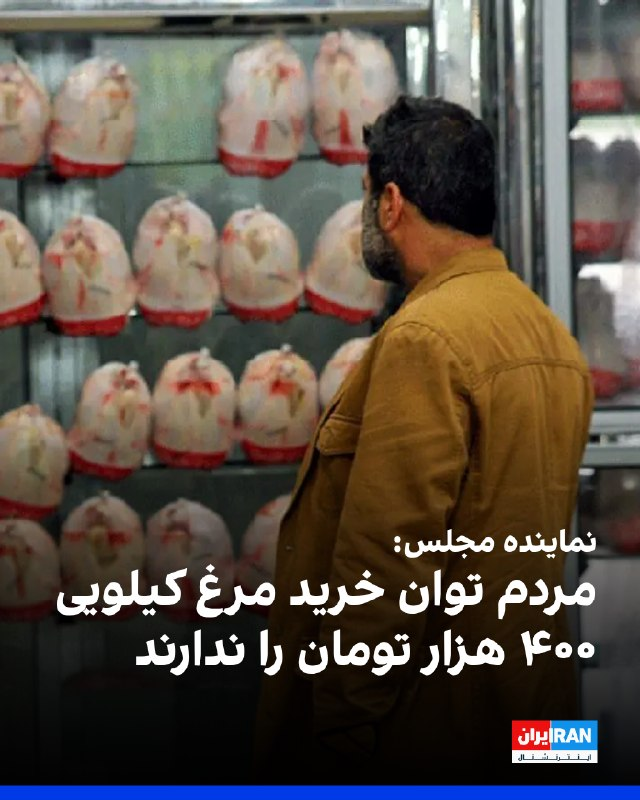

رمضان‌علی سنگدوینی، نماینده مجلس، هشدار داد برخی اقلام با «قیمت‌های گزاف و چندبرابر» وارد بازار می‌شوند. او افزود: «آیا مردم با کالابرگ یک میلیون تومانی توان خرید مرغ کیلویی ۴۰۰ هزار تومانی را دارند؟»

زهرا سعیدی مبارکه، دیگر نماینده مجلس، با اشاره به افزایش قیمت مواد غذایی در کشور گفت هر کیلو برنج پاکستانی در پاکستان کمتر از یک دلار و در آلمان یک یورو است، اما در ایران سه دلار به مردم فروخته می‌شود.

علی خزائی، نماینده مجلس، هم سیاست‌های ارزی دولت و افزایش مداوم نرخ ارز از سوی بانک مرکزی را «کاملا اشتباه» دانست و گفت این سیاست‌ها به گرانی و تورم در ایران دامن می‌زنند.
‌🏁 🇬🇧 IranintlTV

🤖 @VahidOOnLine

## VahidOOnLine — post 240774

  

♦️ رسانه‌های داخلی ایران روز دوشنبه ۲۸ اردیبهشت ماه از بسته شدن بزرگراه تهران-کرج در نیمه‌شب گذشته و در جریان یک تعقیب و گریز پلیسی خبر دادند.

به گزارش ایرنا به نقل از فرماندهی پلیس راهور تهران، یک خودروی «شوتی» (حامل کالای قاچاق) در زمان فرار از دست ماموران روی اتوبان میخ «سه‌پر» ریخت و باعث پنچر شدن دست‌کم ۲۹ خودروی دیگر شد.

به گفته پلیس، این خودرو شناسایی و توقیف شده است. هنوز گزارشی درباره محموله این خودرو منتشر نشده است.
‌🇸🇦 Indypersian

🤖 @VahidOOnLine

## VahidOOnLine — post 240773

  <a href="telegram/content/VahidOOnLine_240773_1779108302.mp4">🎬 Download video</a>

یوروپل، آژانس همکاری پلیسی اتحادیه اروپا، اعلام کرد در یک اقدام هماهنگ برای مقابله با محتوای «تروریستی» در فضای مجازی، ۱۴ هزار و ۲۰۰ پیوند مرتبط با فعالیت‌های سپاه پاسداران شناسایی شده است.

بر اساس اعلام یوروپل، این عملیات با هدف مقابله با «زیست‌بوم تبلیغاتی» سپاه پاسداران در اینترنت انجام شد و محققان، هزاران پست و پیوند را برای ارجاع به ارائه‌دهندگان خدمات آنلاین هدف قرار دادند.
‌🏁 🇬🇧 ManotoTV

🤖 @VahidOOnLine

## VahidOOnLine — post 240772

  <a href="telegram/content/VahidOOnLine_240772_1779108303.mp4">🎬 Download video</a>

امروز، ۲۸ اردیبهشت ۱۴۰۵، هم‌زمان با زادروز محمدرشید مظاهری، دروازه‌بان سابق تیم ملی فوتبال ایران، جمعی از ایرانیان و اعضای «حزب پادشاهی‌خواه میهن‌پرستان ایران» مقابل کنسولگری جمهوری اسلامی در هامبورگ تجمع کردند.

تجمع‌کنندگان با گرامی‌داشت زادروز این ورزشکار، خواستار آزادی بی‌قیدوشرط او و همه زندانیان سیاسی شدند.

رشید مظاهری، بازیکن سابق استقلال، سپاهان، تراکتور و ذوب‌آهن، در ۵ اسفند ۱۴۰۴ پس از انتشار پستی انتقادی علیه علی خامنه‌ای بازداشت شد و بر اساس گزارش‌ها، نزدیک به سه ماه است در وضعیت ناپدیدشدن قهری قرار دارد.

گزارش‌ها و ویدیوهای خود را از طریق واتس‌اپ یا تلگرام برای منوتو بفرستید:

۰۰۴۴۷۵۹۰۸۹۹۹۹۹
‌🏁 🇬🇧 ManotoTV

🤖 @VahidOOnLine

## VahidOOnLine — post 240771

  

یوروپل، آژانس اتحادیه اروپا برای همکاری در اجرای قانون، اعلام کرد در اقدامی هماهنگ برای مقابله با محتوای «تروریستی» در فضای مجازی، در مجموع ۱۴ هزار و ۲۰۰ پست و پیوند مرتبط با سپاه پاسداران هدف قرار گرفته است.

به گفته یوروپل، این اقدام با هدایت واحد ارجاع اینترنتی اتحادیه اروپا انجام شد و بر شناسایی و اخلال در حضور آنلاین سپاه که برای انتشار تبلیغات، جذب حامیان و تامین مالی به کار می‌رفت، تمرکز داشت. این تصمیم به نهادهای اجرای قانون اجازه می‌دهد علیه فعالیت اعضا و نهادهای پشتیبان آن در اتحادیه اروپا اقدام کنند.

در این عملیات، ۱۹ کشور شامل اتریش، بلژیک، بوسنی و هرزگوین، بلغارستان، چک، دانمارک، استونی، فنلاند، فرانسه، آلمان، یونان، مجارستان، ایتالیا، هلند، پرتغال، اسپانیا، سوئد، اوکراین و آمریکا مشارکت داشتند. مقام‌ها بین ۲۲ اسفند تا هشتم اردیبهشت در مراحل هماهنگ زیر نظر یوروپل اقدام به جمع‌آوری اطلاعات، تطبیق اهداف و ارجاع مشترک محتوا به پلتفرم‌های آنلاین کردند.
‌🏁 🇬🇧 IranintlTV

🤖 @VahidOOnLine

## VahidOOnLine — post 240770

  <a href="telegram/content/VahidOOnLine_240770_1779108305.mp4">🎬 Download video</a>

♦️اسماعیل بقایی، سخنگوی وزارت امور خارجه جمهوری اسلامی روز دوشنبه ۲۸ اردیبهشت‌ماه و همزمان با ادامه «بن‌بست» در گفتگوهای تهران و واشنگتن  گفت: مذاکرات در این مرحله بر پایان جنگ متمرکز است و بنابراین ما از حقوق خودمان بر اساس معاهده منع گسترش تسلیحات هسته‌ای عدول نخواهیم کرد.

دونالد ترامپ، رئیس جمهوری آمریکا تاکید می‌کند که پایان دادن به برنامه هسته‌ای جمهوری اسلامی یکی از پیش‌شرط‌های دستیابی به هر توافقی برای پایان دادن به جنگ است.
‌🇸🇦 Indypersian

🤖 @VahidOOnLine

## VahidOOnLine — post 240769

  <a href="telegram/content/VahidOOnLine_240769_1779108306.mp4">🎬 Download video</a>

رویترز روز دوشنبه ۲۸ اردیبهشت به نقل از یک منبع پاکستانی گزارش داد پاکستان پیشنهاد بازنگری‌شده جمهوری اسلامی برای پایان دادن به درگیری در خاورمیانه را به آمریکا منتقل کرده است.

این منبع پاکستانی گفت مذاکرات صلح همچنان در بن‌بست به نظر می‌رسد و «زمان زیادی» برای کاهش اختلاف‌ها باقی نمانده است. او افزود هر دو طرف «مدام مواضع خود را تغییر می‌دهند.»
‌🏁 🇬🇧 ManotoTV

🤖 @VahidOOnLine

## mwarmonitor — post 9243

  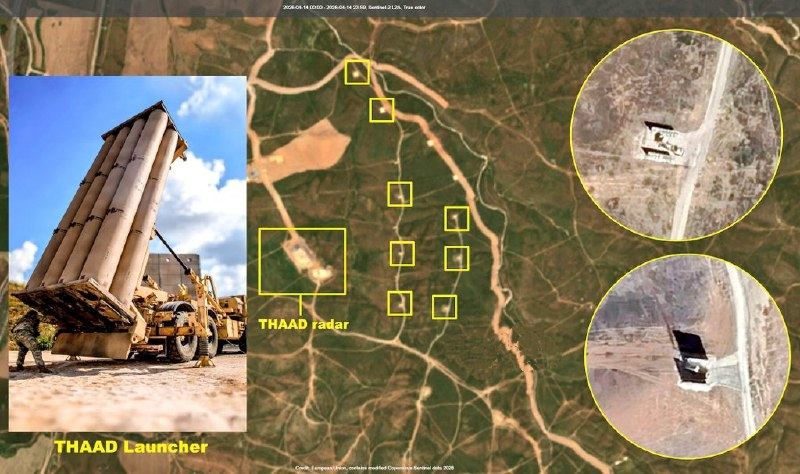

🔴یک عکس منتشرشده در DVIDS در تاریخ ۷ مه، یک پرتابگر سامانه THAAD ارتش آمریکا را در منطقه مسئولیت فرماندهی مرکزی آمریکا (CENTCOM) نشان می‌دهد.

🔸به نظر می‌رسد این تصویر در واقع در محل استقرار THAAD در بیابان نقب اسرائیل گرفته شده باشد (مختصات: 31°30'04.5"N 34°48'33.3"E)، با توجه به تطابق زمین اطراف و دیوارهای بتنی ضد انفجار مشابه.

@mwarmonitor

## mwarmonitor — post 9242

  

🔴سیستم راکت‌انداز M142 HIMARS ارتش آمریکا در تصاویری که در وب‌سایت DVIDS منتشر شده و مربوط به ۱۴ مه و ۶ مه است، در منطقه تحت مسئولیت فرماندهی مرکزی آمریکا (CENTCOM) مشاهده شده است.

🔸این سامانه‌ها احتمالاً در بحرین یا کویت مستقر هستند؛ جایی که پیش‌تر نیز در جریان عملیات «Epic Fury» حملاتی علیه ایران انجام داده بودند.

@mwarmonitor

## mwarmonitor — post 9240

🇸🇦🇵🇰پاکستان در چارچوب یک پیمان دفاعی مشترک، ۸۰۰۰ سرباز، یک اسکادران جنگنده و یک سامانه پدافند هوایی را به عربستان سعودی اعزام کرده است. این اقدام همکاری نظامی اسلام‌آباد با ریاض را تقویت می‌کند، در حالی که اسلام‌آباد همچنان به‌عنوان میانجی اصلی در جنگ ایران عمل می‌کند. رویترز

@mwarmonitor

## mwarmonitor — post 9239

🇮🇱🇺🇸ایالات متحده و اسرائیل در حال انجام آماده‌سازی‌های فشرده‌ای هستند — بزرگ‌ترین سطح آماده‌سازی از زمان برقراری آتش‌بس — برای احتمال ازسرگیری حملات علیه ایران، که ممکن است از همین هفته آغاز شود، به گفته دو مقام خاورمیانه‌ای — نیویورک تایمز

@mwarmonitor

## mwarmonitor — post 9238

  <a href="telegram/content/mwarmonitor_9238_1779108308.mp4">🎬 Download video</a>

🚢این نفتکش LPG که تحت تحریم‌های آمریکا قرار دارد، دو روز پیش (۱۶ مهٔ ۲۰۲۶) موفق شد در جزیره خارک ایران در مختصات 29.21431، 50.33619 گاز مایع بارگیری کند.

🚢این کشتی آخرین بار حدود دو هفته پیش در سامانه AIS در سواحل هند سیگنال ارسال کرده بود و سپس بدون شناسایی، از خط محاصره نیروی دریایی آمریکا عبور کرد. TANKER TRACKER

🔴بلومبرگ به نقل از تصاویر ماهواره‌ای: حدود ۲۳ نفتکش در نزدیکی جزیره خارک مشاهده شده‌اند که این بزرگ‌ترین تجمع از زمان آغاز محاصره آمریکا است.

@mwarmonitor

## mwarmonitor — post 9237

  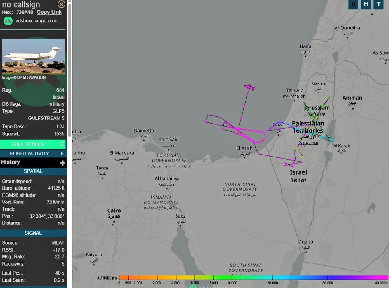

✈️یک فروند هواپیمای گلف‌استریم G-V «نخشون شاویت» نیروی هوایی اسرائیل، که برای شنود سیگنالی (SIGINT) و شناسایی به‌کار می‌رود، هم‌اکنون در حال انجام مأموریت ISR (اطلاعات، مراقبت و شناسایی) بر فراز شرق دریای مدیترانه و در سواحل مصر است.

@mwarmonitor

## mwarmonitor — post 9236

  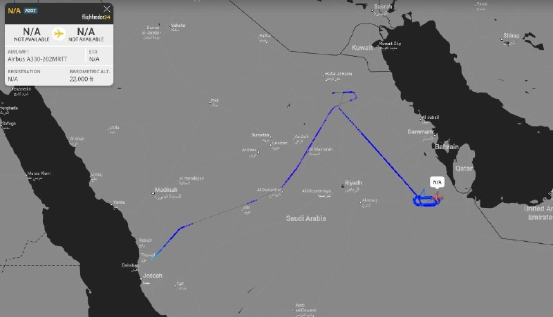

✈️🇸🇦یک فروند ایرباس سوخت رسان - ترابری A330 MRTT نیروی هوایی سلطنتی عربستان سعودی در حال حاضر بر فراز شرق عربستان سعودی فعال است؛ این هواپیما پیش‌تر نیز در نزدیکی حَفَرالباطن و نزدیک مرز عراق عملیات داشته است.

🔸آیا این تحرکات می‌تواند نشانه‌ای از حملات احتمالی علیه شبه‌نظامیان عراقی در پی حمله پهپادی روز گذشته باشد!!

@mwarmonitor

## mwarmonitor — post 9235

🔴 خبرنگار الجزیره به نقل از منبعی در وزارت کشور پاکستان: وزیر کشور، سفر خود به تهران را برای روز سوم نیز تمدید کرده است. @mwarmonitor

## mwarmonitor — post 9234

📝تحلیل اختصاصی کانال 🇵🇰🇮🇷سفر از پیش‌اعلام‌نشده وزیر کشور پاکستان به تهران، بیش از آنکه یک رایزنی سنتی باشد، یک آفند دیپلماتیک پیشگیرانه است. در عرف بین‌الملل، حضور فیزیکی یک مقام ارشد از کشوری غیردرگیر در پایتختِ هدف، به عنوان یک ضربه‌گیر امنیتی عمل می‌کند؛…

## mwarmonitor — post 9233

🇺🇸🇵🇰🇮🇷پاکستان شامگاه یکشنبه یک پیشنهاد اصلاح‌شده از سوی ایران را با ایالات متحده به اشتراک گذاشت که هدف آن پایان دادن به جنگ است — رویترز @mwarmonitor

## pm_afshaa — post 90947

  <a href="telegram/content/pm_afshaa_90947_1779108310.jpg">🎬 Download video</a>

🔴رویترز: پاکستان 8 هزار نیروی نظامی به همراه یک اسکادران جنگنده و سامانه پدافند هوایی به عربستان سعودی اعزام کرده.

طبق این گزارش، این نیروها برای حمایت از عربستان در صورت ازسرگیری حملات احتمالی مستقر شدن. این تحرک در حالی انجام میشه که پاکستان همزمان نقش میانجی میان تهران و واشینگتن رو هم بر عهده داره.

💧 Rainbet.com the #1 Non-KYC Crypto Casino & Sportsbook @rainbetcom

😁 @Pm_Afshaa

## pm_afshaa — post 90946

  <a href="telegram/content/pm_afshaa_90946_1779108311.jpg">🎬 Download video</a>

🔴ترامپ: اونا یه برگه می‌فرستن که هیچ ربطی به چیزی که توافق کرده بودیم نداره، منم میگم، شماها دیوونه‌اید یا چی؟

💧 Rainbet.com the #1 Non-KYC Crypto Casino & Sportsbook @rainbetcom

😁 @Pm_Afshaa

## pm_afshaa — post 90945

🔴کانال 12 اسرائیل: در پیشنهاد جدید ایران هیچ اشاره‌ای به هرمز و اورانیوم غنی‌شده نشده

💧 Rainbet.com the #1 Non-KYC Crypto Casino & Sportsbook @rainbetcom

😁 @Pm_Afshaa

## pm_afshaa — post 90944

  <a href="telegram/content/pm_afshaa_90944_1779108311.jpg">🎬 Download video</a>

🔴کانال 13 اسرائیل: طی 24 ساعت گذشته ده‌ها هواپیمای باری خالی از اسرائیل به پایگاه‌های آمریکایی در آلمان رفتن، مهمات بارگیری کردن و سپس به اسرائیل بازگشتن.

ارتش اسرائیل در روزهای اخیر در سطح بالایی از آماده‌باش قرار داشته، اما جزئیاتی درباره نوع مهمات یا هدف این انتقال‌ها منتشر نشده.

💧 Rainbet.com the #1 Non-KYC Crypto Casino & Sportsbook @rainbetcom

😁 @Pm_Afshaa

## pm_afshaa — post 90943

  <a href="telegram/content/pm_afshaa_90943_1779108312.jpg">🎬 Download video</a>

🔴منابع پاکستانی:آخرین پیشنهاد ایران برای پایان جنگ، یکشنبه شب(دیشب) به طرف آمریکایی ارسال شد 
💧 Rainbet.com the #1 Non-KYC Crypto Casino & Sportsbook @rainbetcom 
😁 @Pm_Afshaa

## pm_afshaa — post 90942

🔴گسترش آلودگی نفتی ایران به سواحل کویت؛ زنگ خطر فاجعه در خلیج فارس؛بر اساس تصاویر منتشر شده در شبکه‌های اجتماعی، تداوم نشت نفت از زیرساخت‌های ایران، اکنون با عبور از مرزهای آبی، به سواحل کویت رسیده

💧 Rainbet.com the #1 Non-KYC Crypto Casino & Sportsbook @rainbetcom

😁 @Pm_Afshaa

## pm_afshaa — post 90941

🔴ترامپ : ایران داره التماس می‌کنه که یه توافق امضا بشه

💧 Rainbet.com the #1 Non-KYC Crypto Casino & Sportsbook @rainbetcom

😁 @Pm_Afshaa

## iaghapour — post 2618

  

⭕️ دیگه پول فیلترشکن نده! آموزش ساخت فیلترشکن شخصی و رایگان با سرعت بالا 😎

🔹در این آموزش قدم‌به‌قدم بهت یاد می‌دم که چطور بدون نیاز به دانش خاصی، یک فیلترشکن (VPN) شخصی، امن و کاملاً رایگان برای خودت بسازی. این روش روی تمام اینترنت‌ها جواب می‌ده و سرعت خوبی برای تماشای یوتیوب، وب‌گردی و … داره.

🔗 تماشا ویدیو در یوتیوب

🔗 دانلود ویدیو با لینک مستقیم (بزودی)

#آموزش #فیلترشکن #رایگان #novaproxy
برای دور زدن فیلترینگ و آموزش تکنولوژی و هوش مصنوعی ما رو دنبال کنید 💚
🆔@iaghapour

## DEJradio — post 4699

  <a href="telegram/content/DEJradio_4699_1779108313.mp4">🎬 Download video</a>

🤡
🔺 ترس حکومت از نارضایتی‌های عمومی؛ آموزش کاربرد سلاح در تجمعات شبانه!

#تجمعات_حکومتی #شیفت_شب
@DEJradio

## DEJradio — post 4698

  <a href="telegram/content/DEJradio_4698_1779108314.mp4">🎬 Download video</a>

🔺🎥 ‏ماه‌ها پیش از آنکه دو پایگاه مخفی اسرائیل در عراق شناسایی شوند، یک چوپان ویدیویی از پرواز دو هواپیمای ترابری در بیابان‌های میان عراق و اردن منتشر کرد. اکنون رسانه‌ها با استناد به این ویدیو فعالیت پایگاه‌های مخفی اسرائیل را تایید می‌کنند.

#اسرائیل #عراق
@DEJradio

## DEJradio — post 4695

  <a href="telegram/content/DEJradio_4695_1779108316.jpg">🎬 Download video</a>

🚨📢 روزنامه «نیویورک‌تایمز» گزارش داد اسرائیل ماه‌ها دو پایگاه مخفی را در بیابان‌های عراق برای پشتیبانی از عملیات علیه رژیم ایران پنهان نگه داشته بود.

بر اساس این گزارش، اسرائیل بیش از یک سال برای آماده‌سازی یکی از این پایگاه‌ها برنامه‌ریزی و فعالیت کرده بود. نیویورک‌تایمز به نقل از مقام‌های منطقه‌ای نوشت این تأسیسات به‌صورت محرمانه برای پشتیبانی از عملیات اسرائیل علیه جمهوری اسلامی ایران مورد استفاده قرار می‌گرفت.

این روزنامه همچنین گزارش داد مقام‌های عراقی بعداً وجود دومین پایگاه مخفی را نیز تأیید کرده‌اند.

ادعا شده این پایگاه را نیز یک چوپان کشف کرده است. سرلشکر علی الحمدانی فرمانده نیروهای فرات غربی ارتش عراق، گفت ارتش یک ماه قبل از آنکه یک چوپان پایگاه را شناسایی کند، به حضور اسرائیل در بیابان مشکوک شده بود اما سپهبد سعد معن، سخنگوی نیروهای امنیتی عراق، به تایمز گفت: «عراق هیچ اطلاعاتی درباره مکان هیچ پایگاه نظامی اسرائیلی ندارد.»

به گفته ژنرال الحمدانی، برای هفته‌ها بادیه‌نشین‌ها در بیابان غربی عراق فعالیت‌های نظامی غیرعادی را به فرماندهی منطقه‌ای عراق گزارش می‌کردند.
او گفت ارتش تصمیم گرفت نزدیک نشود و در عوض از فاصله دور «نظارت اطلاعاتی» انجام دهد؛ زیرا فرماندهان مشکوک بودند نیروهای اسرائیلی در منطقه حضور دارند. آن‌ها از همتایان آمریکایی خود درخواست اطلاعات کردند، اما پاسخی دریافت نکردند.

پیش از این فیلمی که از سوی یک چوپان در مرزهای عراق منتشر شده بود، نشان می‌داد که دو هواپیمای سی۱۳۰ در ارتفاع پایین در غرب عراق در حال پرواز هستند و با انتشار این گزارش، این فیلم مورد توجه جدی قرار گرفته است.
اکنون مشخص نیست آیا عدم شناسایی پایگاه‌های اسراییل در عراق ناتوانی و بی‌عرضگی ارتش عراق است یا همکاری غیرمستقیم آنها با ارتش اسرائیل.

#اسرائیل #جنگ #عراق
@DEJradio

## DEJradio — post 4694

  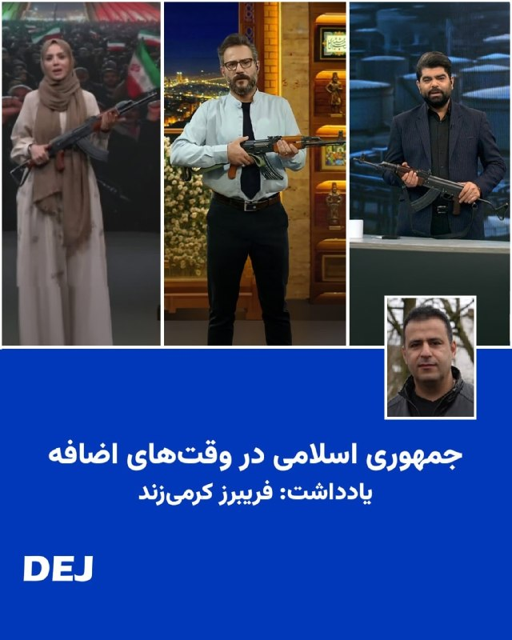

🔺📢 جمهوری اسلامی در وقت‌های اضافه
یادداشت: فریبرز کرمی‌زند

در روزهای گذشته تصاویری از صداوسیمای حکومتی پخش شد که در استودیوهای آن، یکی از نیروهای سـ.ـپاه پاسداران در حال آموزش استفاده از سلاح‌های انفرادی مانند AK-47 و تیربار چندمنظوره PK بود. هرچند از نحوه گفتار و توضیحات ناقص او به‌ وضوح پیداست که خود نیز نیاز به آموزش دارد، اما مسئله اصلی هدف از پخش چنین برنامه‌هایی است.

زمانیکه حکومت‌های تروریستی و خشن به پایان مسیر خود نزدیک می‌شوند، رفتارهایی از آنان سر می‌زند که لزوماً نمی‌توان برایشان توجیه منطقی یافت اما آنچه مسلم است، ترس عمیق حکومت از مردم ایران است؛ زیرا به‌ خوبی می‌داند ضربه نهایی را مردم وارد خواهند کرد.

به نظر می‌رسد نمایش سلاح در رسانه حکومتی تلاشی برای ارسال این پیام باشد که هرگونه اعتراض مردمی با واکنش سخت مواجه خواهد شد؛ تکرار همان ادبیاتی که پیش‌تر نیز از برخی چهره‌های نزدیک به حکومت مانند حسین یکتا از صداوسیما پخش شده بود، این‌بار در قالب تصویر و نمایش رسانه‌ای.

اما چنین نمایش‌هایی نه ‌تنها مانع خواست مردم برای آزادی نخواهد شد، بلکه شکاف میان حکومت و جامعه را عمیق‌تر و اراده معترضان برای تغییر را تقویت خواهد کرد و آنها را به سمت و سویی سوق خواهد داد که برای ایستادن در برابر حکومت به دنبال ابزارهای لازم بروند زیرا دست خالی ایستادن در برابر این جنایتکاران اشتباه است. لازم به ذکر است از این سلاح‌ها در دی‌ماه ۱۴۰۴ بر علیه مردم استفاده شده بود.

#صداوسیما #وقت_اضافه
@DEJradio

## DEJradio — post 4693

  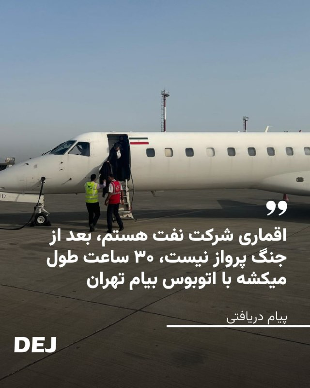

🔺📢 "اقماری شرکت نفت هستم، بعد از جنگ پرواز نیست، ۳۰ ساعت طول می‌کشه با اتوبوس بیام تهران...

پیام دریافتی

#شرکت_نفت #تهران
@DEJradio

## DEJradio — post 4692

  <a href="telegram/content/DEJradio_4692_1779108317.jpg">🎬 Download video</a>

🚨
🔸 چرا اصغر فرهادی در درون آشوویتس نقش بی‌طرف را بازی می‌کند؟

*پژمان گلچین، پژوهشگر فلسفه

#اصغر_فرهادی #آشوویتس
@DEJradio

## DEJradio — post 4690

  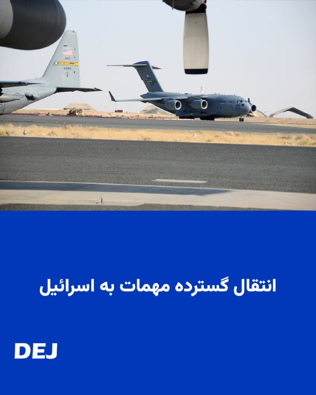

🚨
⭕️ انتقال گسترده مهمات به اسرائیل

شبکه ۱۳ اسرائیل از انتقال گسترده مهمات از پایگاه‌های آمریکایی در آلمان به اسرائیل خبر داد. بر اساس این گزارش، در شبانه‌روز گذشته ده‌ها هواپیمای باری اسرائیلی بدون بار به آلمان پرواز کرده، پس از دریافت محموله‌های تسلیحاتی به اسرائیل بازگشته‌اند.

این شبکه همچنین گزارش داد ارتش اسرائیل طی روزهای اخیر در وضعیت آماده‌باش گسترده قرار داشته و برای سناریوهای احتمالی، زمان‌بندی مشخصی تعیین کرده است.

#جنگ #حمله_نظامی
@DEJradio

## DEJradio — post 4689

  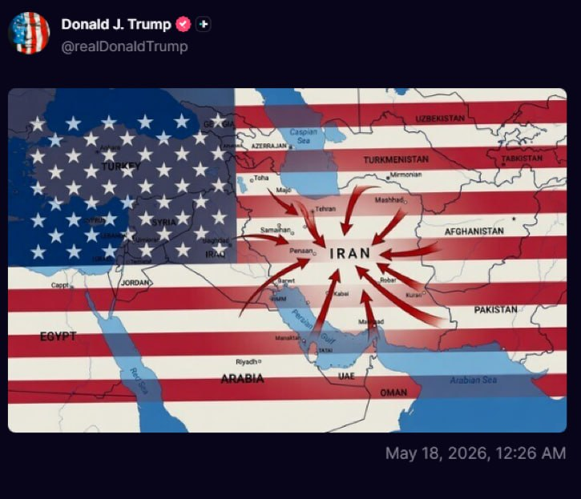

🕐
🔺 جمهوری اسلامی در محاصره

#ترامپ #جمهوری_اسلامی
@DEJradio

## IranIntlTV — post 337772

  <a href="telegram/content/IranIntlTV_337772_1779108319.mp4">🎬 Download video</a>

مستند کوتاه «هنر مقاومت» به تهیه‌کنندگی ایران‌اینترنشنال و کارگردانی مهران عباسیان، خبرنگار این شبکه، برنده جایزه بهترین مستند کوتاه و بهترین کارگردانی فستیوال فیلم خانه سینمای سوئد شد.
گزارش مهسا مرتضوی، خبرنگار ایران‌اینترنشنال
@iranintltv

## IranIntlTV — post 337771

  <a href="telegram/content/IranIntlTV_337771_1779108320.mp4">🎬 Download video</a>

یک شهروند با ارسال ویدیویی به ایران‌اینترنشنال می‌گوید: «برنج آنقدر گران شده که توان خریدش را نداریم. قیمت برنج از دو میلیون تومان شروع می‌شود.»

## IranIntlTV — post 337770

  <a href="telegram/content/IranIntlTV_337770_1779108321.mp4">🎬 Download video</a>

اطلاعات رسیده به ایران‌اینترنشنال، جزییات تازه‌ای از چگونگی کشته شدن جاویدنام امیرپارسا اشکبوس، دانشجوی ترم آخر رشته میکروبیولوژی، در جریان انقلاب ملی ایرانیان روایت می‌کند.

گفت‌وگو با فرنوش فرجی، عضو تحریریه ایران‌اینترنشنال

@iranintltv

## IranIntlTV — post 337769

  

خبرگزاری رویترز به نقل از منابع آگاه گزارش داد پاکستان در چارچوب پیمان دفاعی خود با عربستان سعودی، ۸ هزار نیروی نظامی به همراه یک اسکادران جنگنده و سامانه پدافند هوایی به این کشور اعزام کرده است.

به گزارش رویترز، این نیروها از توان عملیاتی برخوردارند و با هدف حمایت از عربستان سعودی در صورت ازسرگیری حملات علیه این کشور مستقر شده‌اند.

این تحرک نظامی در حالی صورت می‌گیرد که پاکستان نقش اصلی میانجی‌گری میان تهران و واشینگتن را بر عهده دارد.
https://iranintl.com/202605187837

## IranIntlTV — post 337768

  <a href="telegram/content/IranIntlTV_337768_1779108323.mp4">🎬 Download video</a>

مسعود پزشکیان با اشاره به وضعیت وخیم اقتصادی در پی محاصره دریایی بندرهای ایران، از کاهش درآمدهای کشور خبر داد و گفت: «دولت به‌دلیل مشکلات تجارت و بازار، امکان اخذ مالیات را ندارد.»

گفت‌وگو با آرش آزرمی، دبیر بخش اقتصادی ایران‌اینترنشنال
@iranintltv

## IranIntlTV — post 337767

  

🔻روزنامه سان گزارش داد که بازیکنان تیم ملی فوتبال انگلستان در جریان جام جهانی ۲۰۲۶ در آمریکا، رختخواب‌های شخصی خود را همراه خواهند داشت تا کیفیت خواب و روند ریکاوری آن‌ها حفظ شود.

🔹این تصمیم پس از شکایت‌های متعدد درباره تخت‌های خشک و سفت هتل محل اقامت آن‌ها گرفته شده است. اتحادیه فوتبال انگلیس (FA) برای تضمین خواب راحت و باکیفیت بازیکنان، تشک‌های اسفنجی سبک و بالش‌های ویژه‌ای تهیه کرده است. از بازیکنان خواسته شده پتوهای شخصی خود را هم بیاورند تا اتاق هتل حس خانه را داشته باشند.

🔹بر اساس این گزارش، کادر فنی تیم ملی انگلستان به رهبری توماس توخل قصد دارد برای جلوگیری از خستگی و مشکلات ناشی از سفرهای طولانی در آمریکا، شرایط اقامت بازیکنان را تا حد ممکن مشابه خانه فراهم کند.

🔹این تصمیم در حالی گرفته شده که فاصله زیاد شهرهای میزبان جام جهانی ۲۰۲۶، یکی از نگرانی‌های اصلی تیم‌های حاضر در این رقابت‌ها عنوان شده است.

@iranintltvsport

## IranIntlTV — post 337766

  <a href="telegram/content/IranIntlTV_337766_1779108325.mp4">🎬 Download video</a>

دادگاه رسیدگی‌ به پرونده متهمان حمله با چاقو به پوریا زراعتی، مجری تلویزیون ایران‌اینترنشنال، در لندن آغاز می‌شود.

رضا محدث، خبرنگار ایران‌اینترنشنال، گزارش می‌دهد
@iranintltv

## IranIntlTV — post 337765

  <a href="telegram/content/IranIntlTV_337765_1779108327.mp4">🎬 Download video</a>

مروری بر روزنامه‌های ایران، دوشنبه ۲۸ اردیبهشت، با مجتبی هاشمی، روزنامه‌نگار
@iranintltv

## IranIntlTV — post 337764

  <a href="telegram/content/IranIntlTV_337764_1779108328.mp4">🎬 Download video</a>

مسعود پزشکیان به عوارض اقتصادی محاصره دریایی آمریکا اذعان کرد و گفت: «کشور امکان صادرات نفت و تامین دلار برای واردات بنزین را ندارد.»

گفت‌وگو با مرتضی کاظمیان، عضو تحریریه ایران‌اینترنشنال
@iranintltv

## IranIntlTV — post 337763

  <a href="telegram/content/IranIntlTV_337763_1779108330.mp4">🎬 Download video</a>

ویدیوهای رسیده به ایران‌اینترنشنال، نصب بنرهای اعتراضی را در مناطق مختلف کرج نشان می‌دهد که روی آنها نوشته شده: «ما چیزی برای خوردن نداریم. بچه‌هایمان گرسنه هستن. همه‌چیز به ما بستگی دارد.»

## IranIntlTV — post 337762

  

احمد ابوالغیط، دبیرکل اتحادیه عرب، حمله به عربستان سعودی با سه پهپاد را به‌شدت محکوم کرد و آن را نقضی آشکار حاکمیت و تمامیت ارضی این کشور دانست.

احمد ابوالغیط گفت: «این حمله بزدلانه به هیچ‌وجه قابل قبول یا توجیه نیست.»

او با اشاره به نقض حریم هوایی عربستان سعودی تاکید کرد این اقدام تجاوزی آشکار به حاکمیت این کشور بوده است.

جمال رشدی، سخنگوی دبیرکل اتحادیه عرب، نیز اعلام کرد دبیرکل همبستگی کامل خود را با پادشاهی عربستان سعودی در اقداماتی که برای حفاظت از اراضی و شهروندان خود مطابق با احکام حقوق بین‌الملل اتخاذ می‌کند، ابراز کرده است.
https://iranintl.com/202605184256

## IranIntlTV — post 337761

  <a href="telegram/content/IranIntlTV_337761_1779108332.mp4">🎬 Download video</a>

عفو بین‌الملل گزارش داد شمار اعدام‌ها در جهان در سال گذشته میلادی به بالاترین سطح در ۴۴ سال گذشته رسیده است؛ افزایشی که جمهوری اسلامی، نقش اول را در آن دارد.

گفت‌وگو با احمد صمدی، خبرنگار ایران‌اینترنشنال
@iranintltv

## IranIntlTV — post 337760

  <a href="telegram/content/IranIntlTV_337760_1779108333.mp4">🎬 Download video</a>

سرخط خبرهای دوشنبه ۲۸ اردیبهشت
@iranintltv

## IranIntlTV — post 337759

  

فریدریش مرتس، صدراعظم آلمان، روز دوشنبه اعلام کرد برلین حملات جمهوری اسلامی به امارات متحده عربی و سایر کشورها را محکوم می‌کند و افزود تهران باید تهدید همسایگان خود را متوقف کرده و تنگه هرمز را بدون محدودیت باز نگه دارد.

فریدریش مرتس در پیامی در شبکه ایکس نوشت: «حملات به تاسیسات هسته‌ای تهدیدی برای امنیت مردم در سراسر منطقه است. نباید هیچ‌گونه تشدید بیشتر خشونت رخ دهد.»

او همچنین تاکید کرد حکومت ایران باید وارد مذاکرات جدی با آمریکا شود.
https://iranintl.com/202605188672

## IranIntlTV — post 337758

  <a href="telegram/content/IranIntlTV_337758_1779108335.mp4">🎬 Download video</a>

دونالد ترامپ، رییس‌جمهور آمریکا، گفت: «مقام‌های جمهوری اسلامی برای امضای توافق بی‌تاب هستند، اما پس از رسیدن به توافق، متنی ارسال می‌کنند که هیچ ربطی به توافق انجام‌شده ندارد.»

گفت‌وگو با علی‌حسین قاضی‌زاده، عضو تحریریه ایران‌اینترنشنال
@iranintltv

## IranIntlTV — post 337757

  <a href="telegram/content/IranIntlTV_337757_1779108336.mp4">🎬 Download video</a>

انور قرقاش، مشاور دیپلماتیک رییس امارات متحده عربی، نیروهای نیابتی مورد حمایت جمهوری اسلامی را مسئول حملات پهپادی یک‌شنبه به خاک این کشور دانست و آن را «اقدامی تروریستی» خواند.

گفت‌وگو با تروسکه صادقی، خبرنگار ایران‌اینترنشنال
@iranintltv

## IranIntlTV — post 337756

  <a href="telegram/content/IranIntlTV_337756_1779108338.mp4">🎬 Download video</a>

تیم اعزامی فوتبال ایران برای برگزاری اردوی آماده‌سازی پیش از جام جهانی و همچنین گرفتن ویزای آمریکا راهی ترکیه شد. این در حالی است که هنوز مشخص نیست کدام بازیکنان بتوانند ویزای آمریکا را دریافت کنند.
گفت‌وگو با مهدی رستم‌پور، خبرنگار ورزشی

@iranintltv

## IranIntlTV — post 337755

  

رمضان‌علی سنگدوینی، نماینده مجلس، هشدار داد برخی اقلام با «قیمت‌های گزاف و چندبرابر» وارد بازار می‌شوند. او افزود: «آیا مردم با کالابرگ یک میلیون تومانی توان خرید مرغ کیلویی ۴۰۰ هزار تومانی را دارند؟»

زهرا سعیدی مبارکه، دیگر نماینده مجلس، با اشاره به افزایش قیمت مواد غذایی در کشور گفت هر کیلو برنج پاکستانی در پاکستان کمتر از یک دلار و در آلمان یک یورو است، اما در ایران سه دلار به مردم فروخته می‌شود.

علی خزائی، نماینده مجلس، هم سیاست‌های ارزی دولت و افزایش مداوم نرخ ارز از سوی بانک مرکزی را «کاملا اشتباه» دانست و گفت این سیاست‌ها به گرانی و تورم در ایران دامن می‌زنند.
https://iranintl.com/202605181032

## IranIntlTV — post 337754

  <a href="telegram/content/IranIntlTV_337754_1779108340.mp4">🎬 Download video</a>

یک شهروند با ارسال پیامی به ایران‌اینترنشنال، نحوه قتل یک شهروند را به دست ماموران جمهوری اسلامی در شامگاه ۱۸ دی ۱۴۰۴ در اعتراضات وکیل‌آباد مشهد روایت می‌کند.

## IranIntlTV — post 337753

  

🔻اسماعیل بقایی، سخنگوی وزارت خارجه جمهوری اسلامی در نشست خبری درباره صدور روادید برای کادر فنی و تیم ملی فوتبال از سوی آمریکا گفت: «صدور روادید برای حضور تیم ملی فوتبال و کادر فنی، طبق مقررات فیفا، وظیفه دولت‌های میزبان است؛ بنابراین در اینجا فیفا طرف‌حسابِ ماست.»

🔹او گفت: «دو روز پیش در ترکیه، دیدار خوبی میان مسئولان فدراسیون فوتبال و مدیران ارشد فیفا برگزار شد و به ما اطمینان داده شد که فیفا تمام تلاش خود را به کار خواهد گرفت تا اطمینان حاصل شود که مقررات فیفا توسط میزبان‌ها رعایت می‌شود.»

🔹بقایی ادامه داد: «در عین حال، تردیدی نیست که آمریکا بارها تعهدات میزبانی خود را نقض کرده است. همچنین، اظهارنظرهایی که مطرح می‌شود مبنی بر اینکه ممکن است برای برخی از اعضای تیم ملی فوتبال به بهانه‌های خودساخته ویزا صادر نشود، اصلاً قابل قبول نیست و فدراسیون به صورت جدی این موضوع را پیگیری می‌کند.»

@iranintltvsport

## Shin_Persian — post 6061

Bundeskanzler Friedrich Merz @bundeskanzler
Mon, 18 May 2026 10:13:01 UTC

Die erneuten iranischen Luftschläge gegen die Vereinigten Arabischen Emirate und weitere Partner verurteilen wir scharf. Angriffe auf Nuklearanlagen sind eine Bedrohung für die Sicherheit der Menschen in der gesamten Region. Es darf zu keiner weiteren Gewalteskalation kommen.

فارسی

ما حملات هوایی مجدد ایران علیه امارات متحده عربی و سایر شرکا را به شدت محکوم می‌کنیم. حمله به تأسیسات هسته‌ای تهدیدی برای امنیت مردم در تمام منطقه است. نباید اجازه داد تنش و خشونت بیشتری رخ دهد.

𝕏 · @shin_persian

## Shin_Persian — post 6058

DefenceGeek 🇬🇧 ✓ @DefenceGeek Mon, 18 May 2026 09:46:18 UTC UPDATE: Fairford Bomber Training Flights #FreeIran‌ --- Operation EPIC FURY / Project FREEDOM --- As of a short while ago, @MATA_osint team members have tracked/identified a total of 50 training…

## Shin_Persian — post 6057

DefenceGeek 🇬🇧 ✓ @DefenceGeek
Mon, 18 May 2026 09:46:18 UTC

UPDATE: Fairford Bomber Training Flights #FreeIran‌
--- Operation EPIC FURY / Project FREEDOM ---

As of a short while ago, @MATA_osint team members have tracked/identified a total of 50 training sorties by US Air Force B-1B "Lancer" and B-52H "Stratofortress" bombers from RAF Fairford (EGVA) since the ceasefire began.

These comprise:
- 19 missions by B-52s (30 launches by 8 aircraft)
- 31 missions by B-1s (54 launches by 13 aircraft)
- 2 of the B-1s have not flown a single training sortie (yet)

Huge thanks as always to our team members @jamjake01 @Saint1Mil @Andyyyyrrrr @ArmchairAdml @LHA2709 @havoc_aviation

(Photos used with permission @havoc_aviation )

فارسی

به‌روزرسانی: پروازهای آموزشی بمب‌افکن‌های فایرفورد #FreeIran‌
--- عملیات خشم حماسی (Operation EPIC FURY) / پروژه آزادی ---

تا لحظاتی پیش، اعضای تیم @MATA_osint در مجموع ۵۰ سورتی پرواز آموزشی توسط بمب‌افکن‌های نیروی هوایی ایالات متحده (USAF) از نوع B-1B "Lancer" و B-52H "Stratofortress" را از پایگاه هوایی سلطنتی فایرفورد (EGVA) از زمان آغاز آتش‌بس ردیابی و شناسایی کرده‌اند.

این موارد شامل:
- ۱۹ ماموریت توسط B-52ها (۳۰ پرواز توسط ۸ فروند هواپیما)
- ۳۱ ماموریت توسط B-1ها (۵۴ پرواز توسط ۱۳ فروند هواپیما)
- ۲ فروند از B-1ها (هنوز) حتی یک سورتی پرواز آموزشی انجام نداده‌اند.

سپاس فراوان طبق معمول از اعضای تیم ما:
@jamjake01 @Saint1Mil @Andyyyyrrrr @ArmchairAdml @LHA2709 @havoc_aviation

(عکس‌ها با کسب اجازه استفاده شده است @havoc_aviation )

𝕏 · @shin_persian

## ManotoTV — post 105591

  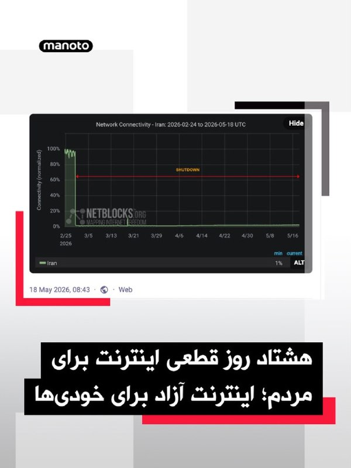

نِت‌بلاکس اعلام کرد خاموشی اینترنت در ایران وارد هشتادمین روز شده و مدت این اختلال از ۱۸۹۶ ساعت گذشته است.

نت‌بلاکس، نهاد ناظر بر اختلالات اینترنتی، در گزارشی اعلام کرد خاموشی اینترنت در ایران وارد هشتادمین روز شده و از ۱۸۹۶ ساعت عبور کرده است. این قطعی در حالی است‌ که دسترسی آزاد شهروندان به اینترنت همچنان محدود است، محتوای حامی جمهوری اسلامی در شبکه‌های اجتماعی به‌طور گسترده منتشر می‌شود.

بر اساس گزارش‌ها، برخی کاربران در ایران گفته‌اند برای دریافت دسترسی‌های ویژه یا «سفید»، از آن‌ها خواسته شده روزانه سهمیه‌ای از محتوای تبلیغاتی منتشر کنند؛ روندی که گفته می‌شود با ابزارهای هوش مصنوعی هم کنترل می‌شود.

## ManotoTV — post 105590

  <a href="telegram/content/ManotoTV_105590_1779108343.mp4">🎬 Download video</a>

یوروپل، آژانس همکاری پلیسی اتحادیه اروپا، اعلام کرد در یک اقدام هماهنگ برای مقابله با محتوای «تروریستی» در فضای مجازی، ۱۴ هزار و ۲۰۰ پیوند مرتبط با فعالیت‌های سپاه پاسداران شناسایی شده است.

بر اساس اعلام یوروپل، این عملیات با هدف مقابله با «زیست‌بوم تبلیغاتی» سپاه پاسداران در اینترنت انجام شد و محققان، هزاران پست و پیوند را برای ارجاع به ارائه‌دهندگان خدمات آنلاین هدف قرار دادند.

## ManotoTV — post 105589

  <a href="telegram/content/ManotoTV_105589_1779108343.mp4">🎬 Download video</a>

امروز، ۲۸ اردیبهشت ۱۴۰۵، هم‌زمان با زادروز محمدرشید مظاهری، دروازه‌بان سابق تیم ملی فوتبال ایران، جمعی از ایرانیان و اعضای «حزب پادشاهی‌خواه میهن‌پرستان ایران» مقابل کنسولگری جمهوری اسلامی در هامبورگ تجمع کردند.

تجمع‌کنندگان با گرامی‌داشت زادروز این ورزشکار، خواستار آزادی بی‌قیدوشرط او و همه زندانیان سیاسی شدند.

رشید مظاهری، بازیکن سابق استقلال، سپاهان، تراکتور و ذوب‌آهن، در ۵ اسفند ۱۴۰۴ پس از انتشار پستی انتقادی علیه علی خامنه‌ای بازداشت شد و بر اساس گزارش‌ها، نزدیک به سه ماه است در وضعیت ناپدیدشدن قهری قرار دارد.

گزارش‌ها و ویدیوهای خود را از طریق واتس‌اپ یا تلگرام برای منوتو بفرستید:

۰۰۴۴۷۵۹۰۸۹۹۹۹۹

## ManotoTV — post 105588

  <a href="telegram/content/ManotoTV_105588_1779108345.mp4">🎬 Download video</a>

رویترز روز دوشنبه ۲۸ اردیبهشت به نقل از یک منبع پاکستانی گزارش داد پاکستان پیشنهاد بازنگری‌شده جمهوری اسلامی برای پایان دادن به درگیری در خاورمیانه را به آمریکا منتقل کرده است.

این منبع پاکستانی گفت مذاکرات صلح همچنان در بن‌بست به نظر می‌رسد و «زمان زیادی» برای کاهش اختلاف‌ها باقی نمانده است. او افزود هر دو طرف «مدام مواضع خود را تغییر می‌دهند.»

## FarsiVOA — post 218054

  <a href="telegram/content/FarsiVOA_218054_1779108345.mp4">🎬 Download video</a>

فرماندهی آمریکا در آفریقا، آفریکام، اعلام کرد در هماهنگی با دولت نیجریه، روز ۲۷ اردیبهشت مواضع گروه داعش در شمال شرقی این کشور را هدف حملات هوایی قرار داده است.

به گفته آفریکام، در این عملیات هیچ‌یک از نیروهای آمریکایی یا نیجریه‌ای آسیب ندیدند.

@FarsiVOA

## FarsiVOA — post 218053

  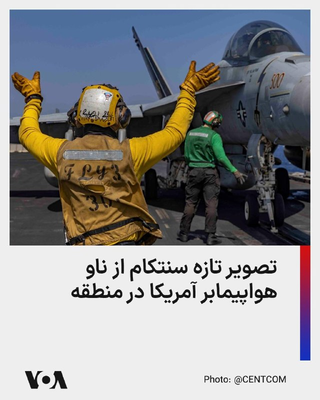

فرماندهی مرکزی ایالات متحده، سنتکام، با انتشار این تصویر اعلام کرد ملوانان آمریکایی در ناو هواپیمابر آبراهام لینکلن در دریای عرب از عملیات پروازی پشتیبانی می‌کنند.

سنتکام نوشت: «هر موفقیت عملیاتی در حوزه مسئولیت این فرماندهی با زنان و مردان آمریکایی در یونیفرم آغاز و پایان می‌یابد.»

@FarsiVOA

## FarsiVOA — post 218052

🔺پاکستان یک اسکادران جنگنده و هزاران نیروی نظامی به عربستان سعودی اعزام کرد

▪️پاکستان تحت پیمان دفاعی دوجانبه، ۸ هزار نیروی نظامی، یک اسکادران جنگنده و یک سامانه پدافند هوایی به عربستان سعودی اعزام کرده است.

▪️این همکاری نظامی که هدف آن حمایت از ارتش عربستان در صورت مواجهه این کشور با حملات بیشتر است، در شرایطی است که اسلام‌آباد هم‌زمان نقش اصلی میانجی‌گری میان جمهوری اسلامی و آمریکا را بر عهده دارد.

▪️بر اساس اظهارات منابع آگاه، پاکستان یک اسکادران کامل شامل حدود ۱۶ هواپیما، عمدتاً جنگنده‌های جی‌اف-۱۷ که به‌طور مشترک با چین ساخته شده‌اند، به عربستان اعزام کرده است.

▪️این اقدام همچنین شامل اعزام حدود ۸ هزار نیروی نظامی است، همراه با تعهد برای اعزام نیروهای بیشتر در صورت نیاز.

⬇️ بیشتر بخوانید:
https://ir.voanews.com/a/8151190.html

## FarsiVOA — post 218051

🔺بلومبرگ: واردات ال‌ان‌جی اروپا برای دومین ماه متوالی کاهش می‌یابد

▪️بلومبرگ گزارش داد واردات گاز طبیعی مایع، ال‌ان‌جی، اروپا در ماه مه برای دومین ماه متوالی در مسیر کاهش قرار دارد؛ آن هم در شرایطی که جنگ اخلال جمهوری اسلامی در تنگه هرمز، جریان این سوخت را مختل کرده و محموله‌های بیشتری به سمت بازارهای آسیایی هدایت می‌شوند.

▪️حمله جمهوری اسلامی به تأسیسات رأس‌لفان قطر، ظرفیت تولید ال‌ان‌جی قطر را حدود ۱۷ درصد کاهش داد و قیمت‌های ال‌ان‌جی در آسیا را بیش از ۱۴۰ درصد بالا برد.

▪️اروپا پس از کاهش وابستگی به گاز روسیه، بیش از گذشته به واردات ال‌ان‌جی متکی شده است. اما افت واردات در ماه‌های آوریل و مه نشان می‌دهد این جایگزینی، اروپا را آسیب‌پذیر کرده است.

⬇️ بیشتر بخوانید:
https://ir.voanews.com/a/8151188.html

## FarsiVOA — post 218050

  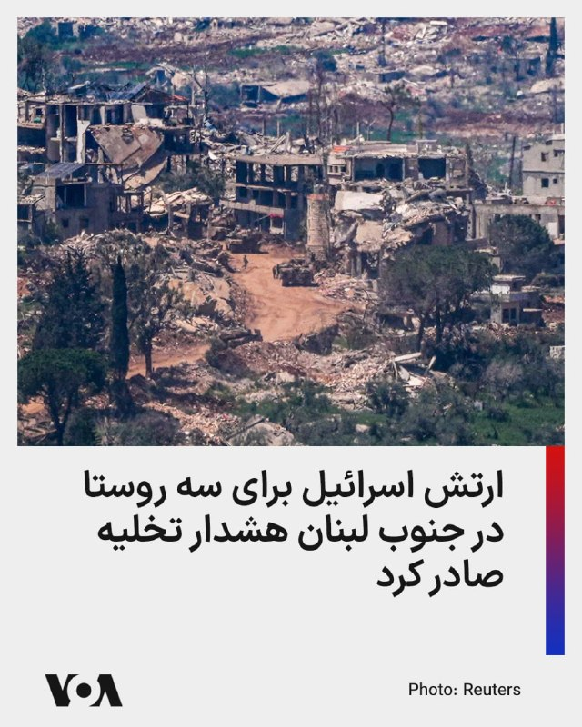

ارتش اسرائیل پیش از حملات هوایی که قرار است در روز دوشنبه علیه گروه تروریستی حزب‌الله تحت حمایت جمهوری اسلامی انجام شود، برای سه روستا در جنوب لبنان هشدار تخلیه صادر کرد.

بر اساس اعلام ارتش اسرائیل، به ساکنان این مناطق دستور داده شده دست‌کم یک کیلومتر از محل دور شوند.

سرهنگ آویخای ادرعی، سخنگوی ارتش اسرائیل، هشدار داد: «در پی نقض توافق آتش‌بس از سوی سازمان تروریستی حزب‌الله، ارتش اسرائیل ناچار است با قدرت علیه آن اقدام کند و قصد آسیب رساندن به شما را ندارد.»

پیشتر ارتش اسرائیل اعلام کرد که ده‌ها زیرساخت «سازمان تروریستی حزب‌الله» را در جنوب لبنان هدف قرار داده است؛ این اهداف شامل انبارهای تسلیحات، مواضع دیده‌بانی و زیرساخت‌هایی است که به گفته ارتش اسرائیل «برای پیشبرد طرح‌های تروریستی علیه نیروهای ما استفاده می‌شدند».
@FarsiVOA

## FarsiVOA — post 218049

  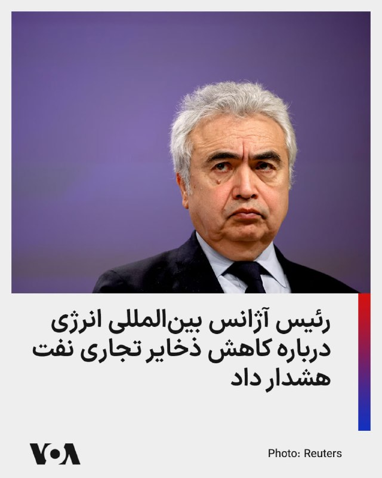

رئیس آژانس بین‌المللی انرژی اعلام کرد که به‌دلیل بسته شدن تنگه هرمز به روی کشتیرانی، ذخایر تجاری نفت به‌سرعت در حال کاهش است و تنها چند هفته از این ذخایر باقی مانده است.

فاتح بیرول، روز دوشنبه ۲۸ اردیبهشت در حاشیه نشست رهبران مالی گروه هفت در پاریس، به خبرنگاران گفت که آزادسازی ذخایر راهبردی نفت، روزانه ۲.۵ میلیون بشکه نفت به بازار اضافه کرده اما این ذخایر «بی‌پایان نیستند».

او افزود آغاز فصل کشت بهاره و فصل سفرهای تابستانی در نیم‌کره شمالی باعث خواهد شد ذخایر سریع‌تر کاهش یابند، زیرا تقاضا برای گازوئیل، کود، سوخت جت و بنزین افزایش می‌یابد.

رئیس آژانس بین‌المللی انرژی در نشست وزیران دارایی و روسای بانک مرکزی کشورهای عضو گروه هفت درباره اختلاف میان بازار واقعی نفت و بازار مالی نفت صحبت کرد.

هفته گذشته، آژانس بین‌المللی انرژی اعلام کرد که عرضه جهانی نفت در سال جاری میلادی کمتر از مجموع تقاضا خواهد بود، زیرا جنگ علیه رژیم ایران تولید نفت خاورمیانه را به‌شدت مختل کرده و ذخایر با سرعتی بی‌سابقه در حال کاهش هستند.

این آژانس پیش‌تر برای امسال مازاد عرضه پیش‌بینی کرده بود.
@FarsiVOA

## FarsiVOA — post 218048

  

یک مقام وزارت نفت هند گفت دهلی‌نو خرید نفت از روسیه را صرف‌نظر از تمدید یا پایان معافیت‌های تحریمی آمریکا ادامه می‌دهد؛ موضعی که پس از پایان مهلت معافیت واشنگتن برای خرید نفت دریابرد روسیه اعلام شد.

رویترز گزارش داد سوجاتا شارما، از مقام‌های وزارت نفت هند، روز دوشنبه گفت هند «پیش از معافیت، در دوره معافیت و اکنون هم» از روسیه نفت خریده است. او افزود تصمیم دهلی‌نو بر پایه «منطق تجاری» است و معافیت یا نبود معافیت آمریکا، تأثیری بر خرید نفت روسیه نخواهد داشت.

با این حال، هند در برابر محموله‌های پرریسک‌تر محتاط‌تر عمل کرده است. رویترز پیش‌تر گزارش داده بود هند از خرید گاز طبیعی مایع روسیه که مشمول تحریم‌های آمریکا بود، خودداری کرده و یک محموله ال‌ان‌جی روسیه از تأسیسات پورتووایا، پس از رد شدن از سوی هند، نزدیک آب‌های سنگاپور بدون مقصد روشن مانده است. داده‌های مرین‌ترافیک نیز نشان می‌دهد کشتی «کونپنگ»، که تحت تحریم بریتانیا و اوکراین قرار دارد، پس از تغییر مسیر از هنگ‌کنگ به هند، دوباره سرگردان شده است.
@FarsiVOA

## FarsiVOA — post 218047

  

صدراعظم آلمان اعلام کرد که کشورش حملات جمهورس اسلامی به امارات متحده عربی و دیگر کشورها را محکوم می‌کند.

فریدریش مرتس روز دوشنبه در شبکه اجتماعی ایکس افزود که تهران باید تهدید همسایگان خود را متوقف کند و تنگه هرمز را بدون هیچ محدودیتی باز نگه دارد.

او در این پیام نوشت: «حملات به تأسیسات هسته‌ای، امنیت مردم در سراسر منطقه را تهدید می‌کند. نباید هیچ‌گونه تشدید بیشتر خشونت رخ دهد». او همچنین گفت که جمهوری اسلامی باید وارد مذاکراتی جدی با ایالات متحده شود.

مقام‌های ابوظبی اعلام کردند که یک حمله پهپادی روز یکشنبه باعث آتش‌سوزی در نزدیکی یک نیروگاه هسته‌ای در امارات متحده عربی شده است. کشورهای عربی منطقه این حمله را محکوم کردند.
@FarsiVOA

## FarsiVOA — post 218046

  <a href="telegram/content/FarsiVOA_218046_1779108348.mp4">🎬 Download video</a>

ارتش اسرائیل از کشتن یکی از اعضای حماس در غزه خبر داد؛

ارتش اسرائیل اعلام کرد که یکی از اعضای سازمان تروریستی حماس را که قصد اجرای طرح‌های تک‌تیراندازی علیه نیروهای این ارتش در آینده نزدیک داشت، کشته است.

ارتش اسرائیل با انتشار بیانیه‌ای نوشت: «یک هواگرد نیروی هوایی، با هدایت نیروهای لشکر غزه، روز یکشنبه یک تروریست از سازمان تروریستی حماس را که در حال پیشبرد طرح‌های تک‌تیراندازی در آینده نزدیک علیه نیروهای ارتش اسرائیل در جنوب نوار غزه بود، به هلاکت رساند.»

به نوشته ارتش اسرائیل، این عضو حماس «تهدیدی فوری برای نیروهای ارتش اسرائیل محسوب می‌شد و به‌صورت هدفمند برای رفع این تهدید» کشته شد.

بر اساس این گزارش، نیروهای ارتش اسرائیل تحت فرماندهی جبهه جنوب مطابق با توافق مستقر هستند و به فعالیت برای «رفع هرگونه تهدید فوری» ادامه خواهند داد.
@FarsiVOA

## FarsiVOA — post 218045

  <a href="telegram/content/FarsiVOA_218045_1779108349.mp4">🎬 Download video</a>

لحظه برخورد دو جنگنده نیروی دریایی آمریکا در نمایش هوایی؛

در دومین روز از نمایش هوایی «گانفایتر اسکایز» در پایگاه هوایی مانتین هوم در آبداهو، دو جت جنگنده ائی‌اِی-۱۸جی گرولر متعلق به نیروی دریایی ایالات متحده با یکدیگر برخورد کردند.

هر چهار سرنشین این دو جنگنده موفق به خروج اضطراری شدند و بر اساس تأیید نیروی دریایی، در حال حاضر تحت مراقبت‌های پزشکی هستند.

تحقیقات درباره علت دقیق این سانحه هوایی توسط مقامات نظامی آغاز شده است.
@FarsiVOA

## FarsiVOA — post 218044

  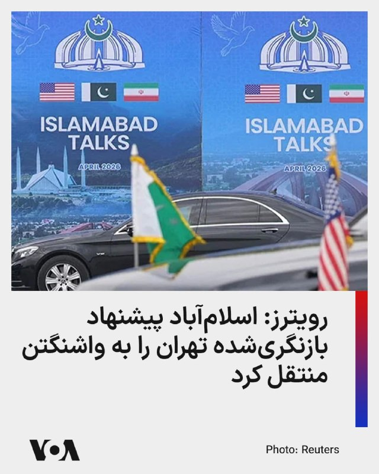

رویترز به نقل از یک منبع پاکستانی گزارش داد اسلام‌آباد نسخه بازنگری‌شده پیشنهاد تهران برای پایان دادن به درگیری در خاورمیانه را به ایالات متحده منتقل کرده است؛ گزارشی که در ادامه تلاش‌های میانجی‌گرانه پاکستان و پس از رد پاسخ قبلی تهران از سوی دونالد ترامپ منتشر می‌شود.

این منبع پاکستانی به رویترز گفت «وقت زیادی نداریم» و افزود دو طرف همچنان مواضع و خواسته‌های خود را تغییر می‌دهند.

چند روز پیش، ترامپ پاسخ قبلی جمهوری اسلامی به طرح آمریکا را رد کرده و آن را «کاملاً غیرقابل قبول» خوانده بود.

انتشار خبر پیشنهاد بازنگری‌شده تهران هم‌زمان با سخنان تازه ترامپ درباره نیاز جمهوری اسلامی به توافق صورت می‌گیرد. رئیس جمهوری آمریکا در گفت‌وگویی با نشریه فورچون که روز دوشنبه منتشر شد، گفت مقام‌های جمهوری اسلامی با وجود اظهارات تند علنی، «به‌شدت» به امضای توافق با واشنگتن نیاز دارند. او همچنین گفت مقام‌های تهران «یک توافق می‌کنند و بعد کاغذی می‌فرستند که ربطی به توافق ندارد.»

ترامپ روز یکشنبه نیز هشدار داده بود تهران باید «سریع» اقدام کند، وگرنه با پیامدهای وخیم روبه‌رو خواهد شد.
@FarsiVOA

## FarsiVOA — post 218043

🔺خانوار ایرانی در وضعیت بقا؛ افت خرید زیر فشار تورم، جنگ و قطعی اینترنت

▪️آمار تازه شاپرک از فروردین ۱۴۰۵ نشان می‌دهد خانوارهای ایرانی زیر فشار تورم، جنگ، قطعی اینترنت و نااطمینانی اقتصادی، خریدهای خود را کاهش داده و بخشی از مصرف خود را به نیازهای فوری و حداقل‌های معیشتی محدود کرده‌اند.

▪️بر اساس این داده‌ها، حتی پس از حذف اثر تورم، هم ارزش حقیقی هر تراکنش و هم تعداد تراکنش‌ها در فروردین ۱۴۰۵ نسبت به فروردین سال قبل کاهش یافته است.

▪️در اسفند ۱۴۰۴، هم‌زمان با جنگ، رکود گسترده کسب‌وکارها و محدودیت اینترنت، ارزش حقیقی هر خرید بیش از ۲۰ درصد افت کرد؛ رقمی قابل توجه، چون اسفند به‌طور سنتی فصل افزایش خرید خانوارها پیش از نوروز است.

⬇️ بیشتر بخوانید:
https://ir.voanews.com/a/8151181.html

## FarsiVOA — post 218042

🔺عفو بین‌الملل: جمهوری اسلامی در سال ۲۰۲۵، دو هزار و ۱۵۹ نفر را اعدام کرده است

▪️عفو بین‌الملل می‌گوید در سال ۲۰۲۵، در مجموع دو هزار و ۷۰۷ اعدام در سراسر جهان به ثبت رسیده که نشان دهنده افزایش یک هزار و ۵۱۸ اعدام نسبت به سال ۲۰۲۴ است.

▪️افزایش چشمگیر تعداد اعدام‌ها در ایران، دلیل اصلی افزایش آمار جهانی اعدام‌ها اعلام شده است.

▪️جمهوری اسلامی در سال ۲۰۲۵، در مجموع دو هزار و ۱۵۹ مجازات اعدام به اجرا گذاشته است. این رقم در سال ۲۰۲۴، ۹۷۲ مورد ثبت شده است.

▪️عفو بین‌الملل یادآور شده که به دلیل عدم اطلاع‌رسانی و محرمانه بودن احکام اعدام در کشورهای چین، کره شمالی و ویتنام، به آمار این کشورها به صورت مستقل و دقیق دسترسی ندارد.

⬇️ بیشتر بخوانید:
https://ir.voanews.com/a/8151180.html

## FarsiVOA — post 218041

  

وزیر دارایی آلمان اعلام کرد که نشست گروه هفت محل مناسبی برای گفت‌وگو درباره چگونگی پایان دادن پایدار به جنگ ایران است.

لارس کلینگبایل که روز دوشنبه برای شرکت در نشست وزیران دارایی و روسای بانک‌های مرکزی کشورهای عضو گروه هفت به پاریس سفر خواهد کرد، گفت: «مسیر ما به‌عنوان اروپایی‌ها همچنان روشن است: ما به همکاری تکیه می‌کنیم، نه به تقابل.»

پیشتر دونالد ترامپ، رئیس‌جمهور آمریکا از کشورهای اروپایی به دلیل عملکردشان در قبال جنگ علیه جمهوری اسلامی انتقاد کرده است.

نشست گروه هفت در روزهای دوشنبه و سه‌شنبه برگزار می‌شود و به گفته وزیر دارایی آلمان در حاشیه آن همچنین گفت‌وگوهایی با وزیران دارایی برزیل، هند، کره جنوبی و کنیا انجام خواهد شد.

قرار است کلینگ‌بایل در پاریس، یک توافق‌نامه با اوکراین در زمینه اجتناب از اخذ مالیات مضاعف را امضا کند.
@FarsiVOA

## FarsiVOA — post 218040

  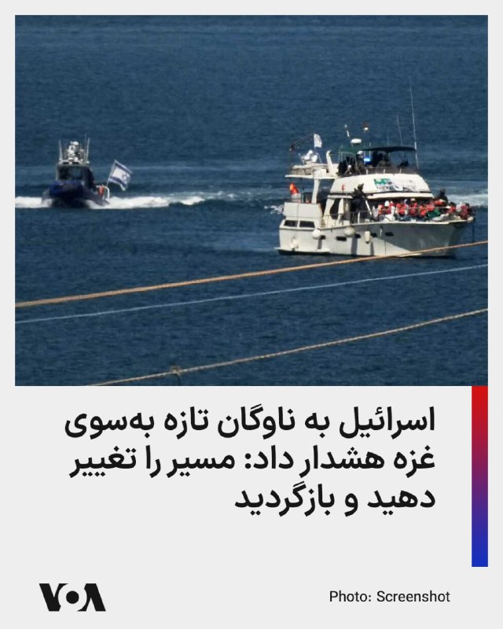

وزارت خارجه اسرائیل با انتشار بیانیه‌ای، حرکت تازه یک ناوگان به‌سوی غزه را «تحریک‌آمیز» خواند و اعلام کرد این اقدام با عنوان کمک‌های بشردوستانه انجام می‌شود، اما به گفته این وزارتخانه، فاقد کمک واقعی است.

در این بیانیه آمده است که دو گروه ترکیه‌ای، از جمله مایوی مرمره و آی‌اچ‌اچ، در این حرکت نقش دارند. اسرائیل، آی‌اچ‌اچ را سازمانی تروریستی می‌داند.

وزارت خارجه اسرائیل هدف این ناوگان را خدمت به حماس، منحرف کردن افکار عمومی از خودداری حماس برای خلع سلاح و مانع‌تراشی در مسیر پیشبرد طرح صلح رئیس‌جمهور ایالات متحده آمریکا اعلام کرد.

این وزارتخانه همچنین به نقل از شورای صلح، نهاد ناظر بر فعالیت‌های بشردوستانه در غزه بر اساس قطعنامه ۲۸۰۳ شورای امنیت سازمان ملل، تأکید کرد که این ناوگان صرفاً اقدامی تبلیغاتی است.

در ادامه بیانیه آمده است که غزه از کمک‌های بشردوستانه پر شده و تنها از اکتبر ۲۰۲۵ تاکنون، بیش از یک میلیون و ۵۸۰ هزار تن کمک بشردوستانه و هزاران تن تجهیزات پزشکی وارد این منطقه شده است.
@FarsiVOA

## FarsiVOA — post 218039

  

وزارت دفاع چین پس از دیدار شی جین‌پینگ و دونالد ترامپ هفته گذشته، اعلام کرد آماده تقویت اعتماد با واشنگتن است.

به نوشته بلومبرگ، سرهنگ ارشد جیانگ بین، سخنگوی این وزارتخانه، در نشست خبری روز دوشنبه گفت روابط نظامی پایدار در راستای منافع مشترک هر دو کشور است. چین آمادگی دارد با آمریکا برای تقویت گفتگو، «مدیریت اختلافات، افزایش اعتماد و رفع سوءتفاهم‌ها» همکاری کند.

در جریان سفر ترامپ به پکن، شی جین‌پینگ اعلام کرد دوران تازه‌ای در روابط دو کشور آغاز شده؛ دوره‌ای که مقامات چینی آن را «ثبات راهبردی سازنده» نامیده‌اند.

هیئت همراه ترامپ در این سفر شامل پیت هگست، وزیر دفاع آمریکا بود. هگست در ضیافت شام رسمی به‌اختصار با دونگ جون، وزیر دفاع چین گفتگو کرد. دو وزیر دفاع پیش از این در اکتبر گذشته نیز دیدار داشتند و احتمال دارد در نشست دیالوگ شانگریلا سنگاپور در پایان همین ماه دوباره ملاقات کنند.
@FarsiVOA

## FarsiVOA — post 218038

  

معاون آموزشی وزارت علوم اعلام کرد که در برخی کشورها تا ۸۵ درصد دانش‌آموختگان در سال‌های نخست پس از فارغ‌التحصیلی جذب بازار کار می‌شوند، اما در ایران از هر ۱۰ فرد بیکار، چهار نفر دارای مدرک دانشگاهی هستند.

ابوالفضل واحدی در گفتگو با خبرگزاری ایسنا، یکی از دلایل این امر را «کارآموزی‌ صوری و کاغذی» به جای «آموزش‌ مهارتی واقعی» توصیف کرد.

خبرگزاری تسنیم وابسته به سپاه نیز با اشاره به تازه‌ترین داده‌های آماری مربوط به زمستان ۱۴۰۴، اعلام کرد که سهم فارغ‌التحصیلان آموزش عالی از کل جمعیت بیکار کشور به بیش از ۳۶ درصد رسیده است.

این خبرگزاری نوشت:‌ بیش از یک‌سوم بیکاران کشور، افرادی هستند که سال‌ها وقت خود را صرف کسب تخصص کرده‌اند.
@FarsiVOA

## FarsiVOA — post 218037

🔺آمریکا از اعضای گروه هفت می‌خواهد از رژیم تحریم‌ها علیه جمهوری اسلامی پیروی کنند

▪️وزیر خزانه‌داری ایالات متحده اعلام کرد که این کشور از وزیران دارایی کشورهای عضو گروه هفت خواهد خواست تا از رژیم تحریم‌های اقتصادی علیه جمهوری اسلامی پیروی کنند.

▪️اسکات بسنت در آستانه برگزاری نشست وزیران دارایی و روسای بانک‌های مرکزی کشورهای گروه ۷ در پاریس گفت که پیوستن این کشورها به کارزار تحریم‌ها علیه جمهوری اسلامی مانع از رسیدن منابع مالی به «ماشین جنگی» حکومت ایران خواهد شد.

▪️پیشتر دونالد ترامپ، رئیس‌جمهور آمریکا از کشورهای اروپایی به دلیل عملکردشان در قبال جنگ علیه جمهوری اسلامی انتقاد کرده است.

▪️اعضای گروه هفت کشور صنعتی جهان شامل آمریکا، کانادا، بریتانیا، فرانسه، آلمان، ایتالیا و ژاپن هستند.

⬇️ بیشتر بخوانید:
https://ir.voanews.com/a/8151178.html

## FarsiVOA — post 218036

🔺قطع اینترنت در ایران هشتادروزه شد؛ ممنوعیت تبلیغ «اینترنت پرو» پس از هشدارهای اژه‌ای

▪️نت‌بلاکس اعلام کرد خاموشی اینترنت در ایران وارد روز هشتادم شده و از مرز ۱۸۹۶ ساعت گذشته است.

▪️به گفته نت‌بلاکس، نهاد ناظر بر اختلالات اینترنت، هم‌زمان با قطع دسترسی گسترده کاربران ایرانی به اینترنت جهانی، محتوای حامی جمهوری اسلامی در شبکه‌های اجتماعی افزایش یافته است.

▪️نت‌بلاکس همچنین نوشت برخی ایرانیانی که برای دریافت دسترسی ویژه یا قرار گرفتن در «فهرست سفید» اقدام کرده‌اند، می‌گویند از آنها خواسته شده برای حفظ این دسترسی، سهمیه‌ای از پست‌های تبلیغاتی روزانه منتشر کنند؛ روندی که به گفته این نهاد، با هوش مصنوعی کنترل می‌شود.

▪️هم‌زمان رسانه‌های داخلی از ممنوعیت تبلیغ و فروش «اینترنت پرو» خبر دادند.

⬇️ بیشتر بخوانید:
https://ir.voanews.com/a/8151177.html

## FarsiVOA — post 218035

🔺ترامپ: جمهوری اسلامی به شدت به توافق نیاز دارد

▪️دونالد ترامپ، رئیس‌جمهور آمریکا، اعلام کرد که مقامات حکومت ایران علی‌رغم اظهارات تند علنی خود، به شدت به امضای یک توافق با واشنگتن نیاز دارند.

▪️ترامپ در گفت‌وگویی با نشریه فورچون که پیش از سفر او به چین انجام شده اما روز دوشنبه ۲۸ اردیبهشت منتشر شد، درباره جمهوری اسلامی گفت: «آن‌ها [مقامات جمهوری اسلامی] مدام داد و فریاد می‌زنند. یک چیز را به شما می‌گویم: آن‌ها واقعاً دارند از شدت نیاز برای امضای [یک توافق] بی‌تابی می‌کنند.»

▪️او افزود: «اما یک توافق می‌کنند و بعد یک کاغذ برایت می‌فرستند که هیچ ربطی به توافقی که کرده بودی ندارد. من می‌گویم: شما دیوانه‌اید؟»

⬇️ بیشتر بخوانید:
https://ir.voanews.com/a/8151179.html

## DW_Farsi — post 124829

🔶 سفر ترامپ به چین؛ آیا تهران در پی میانجی تازه است؟

اگر هدف سفر ترامپ به چین، رسیدن به یک تفاهم روشن و علنی با پکن بر سر ایران بود، دست‌کم در ظاهر چنین نتیجه‌ای حاصل نشد. نه بیانیه مشترکی منتشر شد و نه نشانه‌ای از یک توافق نهایی در موضوعات حساس دیده شد. با این حال، مجموعه پیام‌ها و واکنش‌ها نشان می‌دهد ایران یکی از محورهای مهم این سفر بوده است. در چنین فضایی، انتصاب فوری محمدباقر قالیباف به سمت نماینده ویژه ایران در امور چین، بیش از آنکه یک جابه‌جایی اداری ساده باشد، می‌تواند نشانه تلاش تهران برای بازتعریف کانال چین در میانه جنگ، فشار آمریکا و ابهام در آینده مذاکرات باشد.

به گزارش رویترز، جیمیسون گریر، نماینده تجاری ایالات متحده، گفت واشنگتن از چین نخواسته مستقیما برای بازگشایی تنگه هرمز وارد عمل شود، بلکه تمرکز اصلی بر این بوده که پکن از ارائه حمایت مادی به ایران خودداری کند. او همچنین گفت چین به دلیل وابستگی‌اش به مسیرهای انرژی و تجارت جهانی، به‌طور طبیعی از باز ماندن تنگه هرمز حمایت می‌کند. رویترز همچنین گزارش داده که موضع واشنگتن و پکن دست‌کم در مخالفت با محدودیت‌های تازه بر عبور و مرور در تنگه هرمز تا حدی به هم نزدیک شده است.

اما در سوی دیگر، موضع چین محتاط‌تر به نظر می‌رسد. همان گزارش‌ها نشان می‌دهد پکن بیش از آنکه به زبان فشار مستقیم علیه تهران سخن بگوید، بر کاهش تنش، باز ماندن مسیرهای انرژی و حل‌وفصل بحران از طریق دیپلماسی تاکید کرده است. این همان نقطه‌ای است که فاصله دیدگاه چین و آمریکا درباره ایران آشکار می‌شود: واشنگتن به‌دنبال مهار تهران از مسیر فشار و بازدارندگی است، اما چین ظاهرا هنوز می‌خواهد در چارچوب "مدیریت بحران" حرکت کند، نه در قالب همسویی آشکار با سیاست فشار آمریکا.

@dw_farsi

## DW_Farsi — post 124828

🔶 گفت‌وگوی تلفنی نتانیاهو و ترامپ درباره "حمله به ایران"

دفتر نخست‌وزیر اسرائیل در پاسخ به "تایمز اسرائیل" تأیید کرده است که بنیامین نتانیاهو، نخست‌وزیر این کشور، شامگاه یکشنبه ۱۷ مه (۲۷ اردیبهشت) در تماسی تلفنی با دونالد ترامپ، رئیس جمهور آمریکا، درباره جنگ با ایران گفت‌وگو کرده است.

بر اساس گزارش رسانه‌های عبری‌زبان، دو طرف درباره احتمال از سرگیری جنگ با ایران و همچنین سفر اخیر ترامپ به چین گفت‌وگو کرده‌اند.

به گزارش تایمز اسرائیل، نتانیاهو قرار بوده پس از این تماس، شماری از دستیاران ارشد و وزیران کابینه‌اش را برای یک نشست امنیتی در دفتر خود در اورشلیم گرد هم آورد.

چنین نشست‌هایی در دفتر نخست‌وزیری که اغلب "کابینه امنیتی کوچک" نامیده می‌شوند، معمولاً شامل گیدئون ساعر، وزیر خارجه، یسرائیل کاتس، وزیر دفاع، بتسالل اسموتریچ، وزیر دارایی، ایتامار بن‌گویر، وزیر امنیت ملی، و آریه درعی، رهبر حزب شاس، هستند.

هفته گذشته گزارش شده بود که اسرائیل و آمریکا در حال انجام آماده‌سازی‌های فشرده برای ازسرگیری حملات به ایران هستند و احتمال دارد این حملات حتی از همین هفته آغاز شوند. گفت‌وگوهای روز یکشنبه پس از آن انجام گرفته که حمله‌ای پهپادی نیروگاه هسته‌ای امارات متحده عربی را هدف قرار داد؛ کشوری که پس از اسرائیل، در جریان جنگ بیشترین ضربه‌ها را از ایران خورده است.

به گزارش اکسیوس به نقل از دو مقام آمریکایی، انتظار می‌رود ترامپ فردا سه‌شنبه نیز نشستی در "اتاق وضعیت" کاخ سفید با مشاوران ارشد امنیت ملی خود برای بررسی گزینه‌های نظامی علیه ایران برگزار کند.

@dw_farsi

## DW_Farsi — post 124827

  

🔶 ایران یک نهاد جدید برای مدیریت تنگه هرمز معرفی کرد

شورای عالی امنیت ملی ایران از تشکیل نهادی برای مدیریت تنگه هرمز خبر داد. این شورا روز دوشنبه با انتشار پستی در شبکه ایکس با اعلام راه‌اندازی حساب کاربری این نهاد تازه تأسیس با نام "مدیریت آبراه خلیج فارس" نوشت "به‌روز رسانی‌های لحظه‌ای در مورد عملیات تنگه هرمز و آخرین تحولات" در این رابطه از طریق این حساب منتشر خواهد شد.

با این حال تاکنون جزئیات بیشتری درباره ساختار، اختیارات یا مأموریت‌های دقیق این نهاد تازه ‌تأسیس منتشر نشده است.

این اقدام در حالی صورت می‌گیرد که تنگه هرمز در ماه‌های اخیر به یکی از کانون‌های اصلی تنش‌های منطقه‌ای تبدیل شده و نقش آن در امنیت انرژی و حمل‌ونقل جهانی اهمیت بیشتری یافته است.

@dw_farsi

## DW_Farsi — post 124826

  

🔶 آژانس بین‌المللی انرژی: ذخایر تجاری نفت جهان به‌سرعت در حال کاهش است

آژانس بین‌المللی انرژی اعلام کرد که با ادامه اختلال در صادرات نفت خلیج فارس بر اثر جنگ خاورمیانه، ذخایر تجاری نفت جهان "بسیار سریع" در حال کاهش است؛ این روند حتی با وجود آزادسازی ذخایر راهبردی توسط دولت‌ها ادامه دارد.

فاتح بیرول، مدیر آژانس، روز دوشنبه، ۱۸ مه (۲۸ اردیبهشت) در حاشیه نشست وزیران دارایی گروه هفت در پاریس گفت: «ذخایر تجاری (انرژی) در حال کاهش‌اند… و به‌نظر من اکنون با سرعت زیادی تخلیه می‌شوند.»
او هشدار داد که اگرچه هنوز چند هفته زمان باقی مانده، اما این ذخایر "بی‌پایان نیستند".

نگرانی‌ها درباره کمبود انرژی هم‌زمان با نزدیک شدن فصل سفرهای تابستانی در نیمکره شمالی افزایش یافته است. شرکت‌های هواپیمایی هشدار داده‌اند که در صورت ادامه اختلالات، ممکن است طی چند هفته با کمبود سوخت جت روبه‌رو شوند.

پس از حملات آمریکا و اسرائیل به ایران در اواخر فوریه، ایران عملاً عبور نفتکش‌ها از تنگه هرمز را متوقف کرده؛ اقدامی که باعث اختلال شدید در انتقال نفت و گاز و جهش قیمت‌ها شده است.

@dw_farsi

## DW_Farsi — post 124825

  <a href="telegram/content/DW_Farsi_124825_1779108355.mp4">🎬 Download video</a>

🎥 خاویر باردم در کن؛ حمله به ترامپ، پوتین و نتانیاهو

خاویر باردم، بازیگر برنده اسکار، که در جشنواره فیلم کن جضور دارد، در سخنانی دونالد ترامپ، ولادیمیر پوتین و بنیامین نتانیاهو را به "رفتار مردانه سمی" متهم کرد. آسوشیتدپرس می‌نویسد باردم این رفتار را عامل جنگ‌های کنونی در ایران، غزه و اوکراین دانسته است.

باردم این سخنان را در نشست خبری فیلم "El Ser Quierdo" که نامزد دریافت نخل طلای جشنواره کن شده، بیان کرده است.

@dw_farsi

## DW_Farsi — post 124824

  

🔶 ترخیص نرگس محمدی از بیمارستان و تداوم نگرانی‌ها نسبت به وضعیت فاطمه سپهری

بنیاد نرگس محمدی روز دوشنبه ۲۸ اردیبهشت (۱۸ مه) اعلام کرد این فعال سیاسی پس از ۱۶ روز، از بیمارستان مرخص شد.

نرگس محمدی از ۱۱ تا ۲۰ اردیبهشت در بیمارستان زنجان و از ۲۰ تا ۲۷ اردیبهشت در بخش مراقبت‌های ویژه در بیمارستان پارس در تهران بستری بود و به گفته این بنیاد "تحت عمل آنژیوپلاستی و آزمایشات مربوط به اختلالات شدید فشار خون از جمله Tilt Test" قرار گرفت.

این فعال سیاسی برنده جایزه نوبل صلح آذرماه سال گذشته در جریان مراسم خاکسپاری خسرو علیکردی، وکیل دادگستری، در مشهد بازداشت و به زندان محکوم شد.

بنیاد نرگس محمدی گفته است که "طبق نظر پزشکان متخصص از جمله قلب و مغز، ضرورت بر تحت نظر و مراقبت‌های درمانی خاص برای او وجود دارد و تا یک ماه حداقل هر‌ روز در بیمارستان تحت فیزیوتراپی قرار خواهد داشت".

@dw_farsi

## DW_Farsi — post 124823

  

🔶 قطعی اینترنت در ایران از ۸۰ روز گذشت

نت‌بلاکس که در زمینه پایش، تحلیل و مستندسازی وضعیت اینترنت در جهان فعالیت می‌کند، روز دوشنبه ۲۸ اردیبهشت (۱۸ مه) با اشاره به تداوم قطعی سراسری اینترنت در ایران اعلام کرد این اختلال اکنون وارد هشتادمین روز خود شده و از ۱۸۹۶ ساعت فراتر رفته است.

نت بلاکس با اشاره به فعالیت قابل توجه کاربران و فعالان رسانه‌ای نزدیک به حکومت با استفاده از اینترنت موسوم به "سفید" در شبکه‌های اجتماعی، خاطرنشان ساخت محتوای تولید شده توسط این افراد در حمایت از جمهوری اسلامی شبکه‌های اجتماعی را "اشباع" کرده است.

در پیام نت بلاکس که در شبکه ایکس منتشر شده، آمده است: «ایرانیانی که به‌دنبال دریافت دسترسی ویژه یا دسترسی فهرست سفید هستند، می‌گویند از آن‌ها خواسته می‌شود سهمیه‌ای از پست‌های روزانه تبلیغاتی را منتشر کنند که این روند با استفاده از هوش مصنوعی پایش می‌شود.»

@dw_farsi

## DW_Farsi — post 124822

  

🔶 ترامپ: مقام‌های ایران به شدت مشتاق امضای توافق‌اند

دونالد ترامپ در گفت‌وگویی مفصل با مجله "فورچون" که روز دوشنبه ۲۸ اردیبهشت منتشر شد، گفت که مقام‌های جمهوری اسلامی به شدت به دنبال امضای یک توافق با آمریکا هستند، اما بعد از اینکه توافق می‌کنند، سندی را می‌فرستند که "هیچ ربطی با توافق ندارد".

رئیس جمهور آمریکا در این مصاحبه درباره ایرانی‌ها گفت: «آنها مدام فریاد می‌زنند.»

ترامپ افزود: «یک چیز را می‌توانم به شما بگویم، آن‌ها به‌شدت مشتاق امضای توافق هستند. اما یک توافق می‌کنند و بعد سندی برایتان می‌فرستند که هیچ ارتباطی با توافقی که کرده‌اید ندارد. من می‌گویم: شماها دیوانه‌اید؟»

ترامپ بارها در گفت‌وگو با رسانه‌ها و خبرنگاران در کاخ سفید اظهار داشته است که جمهوری اسلامی "مشتاق توافق" است. او تهدید کرده است چنانچه رهبران ایران با آمریکا به توافق نرسند، ایالات متحده حملات شدیدتری را علیه این کشور انجام خواهد داد.

او روز یکشنبه با انتشار پیامی در شبکه تروث سوشال هشدار داده بود که زمان برای ایران "در حال پایان است و آن‌ها بهتر است خیلی سریع اقدام کنند وگرنه چیزی ازشان باقی نخواهد ماند".

@dw_farsi

## DW_Farsi — post 124821

🔶 گزارش عفو بین‌الملل؛ ایران عامل اصلی جهش جهانی اعدام‌ها

شمار اعدام‌ها در جهان به بالاترین سطح ثبت‌شده در ۴۴ سال گذشته رسیده است. عفو بین‌الملل می‌گوید ایران موتور اصلی این افزایش بوده است. در این میان، همزمان نشانه‌هایی از حرکت جهانی به سوی لغو اعدام نیز دیده می‌شود.

سازمان عفو بین‌الملل در تازه‌ترین گزارش سالانه خود درباره مجازات اعدام از ثبت رکوردی بی‌سابقه در چهار دهه اخیر خبر داده است؛ رکوردی که بیش از هر چیز نام ایران را در مرکز خود دارد.

بر اساس گزارش "احکام اعدام و اعدام‌های ۲۰۲۵"، دست‌کم ۲۷۰۷ نفر در ۱۷ کشور جهان اعدام شده‌اند؛ رقمی که نسبت به سال پیش از آن نزدیک به ۸۰ درصد افزایش نشان می‌دهد و بالاترین سطح ثبت‌شده از سوی این سازمان حقوق بشری از سال ۱۹۸۱ بدین‌سو به شمار می‌رود. بخش مهمی از این جهش به ایران مربوط می‌شود.

عفو بین‌الملل می‌گوید مقام‌های جمهوری اسلامی در سال ۲۰۲۵ دست‌کم ۲۱۵۹ نفر را اعدام کرده‌اند؛ یعنی بیش از دو برابر سال قبل از آن. این رقم به‌تنهایی نزدیک به چهارپنجم کل اعدام‌های ثبت‌شده در جهان را شامل می‌شود و ایران را، پس از چین، در جایگاه دوم جهان قرار می‌دهد. چین همچنان بزرگترین اجراکننده اعدام در جهان محسوب می‌شود، اما به دلیل محرمانه بودن آمار رسمی، هزاران مورد اعدام احتمالی در این کشور در محاسبات عفو بین‌الملل لحاظ نشده‌اند.

@dw_farsi

## DW_Farsi — post 124820

  

🔶بقائی: از آمریکا ملاحظات اصلاحی دریافت کردیم و پاسخ دادیم

اسماعیل بقائی، سخنگوی وزارت خارجه ایران، روز دوشنبه ۲۸ اردیبهشت در نشست خبری هفتگی خود اظهار داشت تهران در حال "مذاکره و تدوین سازوکاری" با عمان در رابطه با تردد کشتی‌ها از تنگه هرمز است.

او افزود: «هفته گذشته دیداری بین بخش‌های کارشناسی در مسقط برگزار شد، در این باره به صورت مفصل و مستمر صحبت شده است و تماس‌ها ادامه دارد.»

بقائی در پاسخ به پرسشی در مورد گزارش‌ها مبنی بر دریافت هزینه برای تردد از تنگه هرمز، طرح چنین امری را "انحراف از اصل موضوع" خواند اما با این حال دریافت هزینه را رد نکرده و گفت: «طبیعی است که هر کشور ساحلی بابت خدماتی که ارائه می‌دهد هزینه‌هایی را دریافت کند اما اصل موضوع اطمینان از تردد ایمن و اقدام برای حفظ امنیت ملی است. اینکه ایران و عمان به عنوان دو کشور ساحلی سازوکاری را بر اساس حقوق بین‌الملل برای تردد ایمن ایجاد کنند، حتما انجام این امر هزینه‌هایی را در پی دارد.»

@dw_farsi

## Persian_Trend_Official — post 14409

  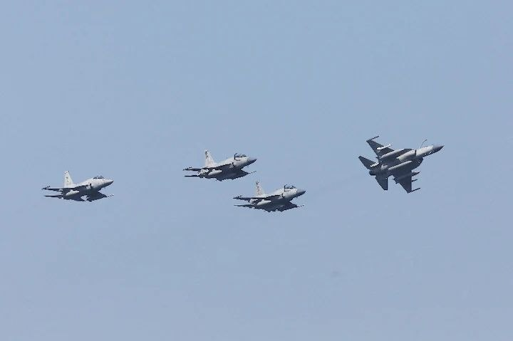

📰
🇸🇦
🇵🇰طبق گزارش رویترز، پاکستان در چارچوب «توافق دفاع مشترک» با عربستان:

🔢حدود ۸ هزار نیروی نظامی،

🔢یک اسکادران جنگنده عمدتاً از نوع JF-17،

🔢دو اسکادران پهپادی

🔢 سامانه پدافند هوایی HQ-9 ساخت چین
را در خاک عربستان مستقر کرده است.

❎بر اساس این گزارش، این اقدام با هدف تقویت همکاری‌های دفاعی و امنیتی میان اسلام‌آباد و ریاض انجام شده است.
❎

☆Phantom☆

📌 @persian_trend_official
پرشین ترند | متفاوت‌ترین کانال نظامی

## Persian_Trend_Official — post 14408

  

ایران سامانه «هرمز سیف» را برای ثبت‌نام کشتی‌های عبوری از تنگه هرمز راه‌اندازی کرد

جمهوری اسلامی ایران سامانه‌ای تحت عنوان «هرمز سیف» را با هدف ارائه خدمات به کشتی‌های عبوری از تنگه هرمز راه‌اندازی کرده است. بر اساس این طرح، ناخدایان و شرکت‌های کشتیرانی می‌توانند از طریق این سامانه درخواست خدمات مختلف از جمله بیمه، کترینگ، خدمات اضطراری و همراهی اسکورت نظامی را ثبت کنند.جالبه که اسکورت نظامی رو هم جزو «خدمات» گذاشتن، کنارِ کترینگ! 😂

با این حال، این سامانه با یک چالش فنی قابل توجه مواجه است؛ وب‌سایت مذکور از خارج از ایران قابل دسترسی نیست و کاربران خارجی برای ثبت‌نام ملزم به استفاده از اینترنت ایرانی هستند.

آدرس سامانه: hormuzsafe.ir

☆Phantom☆

📌 @persian_trend_official
پرشین ترند | متفاوت‌ترین کانال نظامی

## Persian_Trend_Official — post 14407

  <a href="telegram/content/Persian_Trend_Official_14407_1779108359.jpg">🎬 Download video</a>

⭕️ تسنیم: ایران متن جدید ۱۴ بندی به آمریکا ارائه کرد

💢خبرگزاری تسنیم به نقل از یک منبع نزدیک به تیم مذاکره‌کننده گزارش داد تهران از طریق میانجی پاکستانی، متن جدیدی شامل ۱۴ بند به طرف آمریکایی تحویل داده است.

▪️پیش تر اخباری از منابع پاکستانی نسبت به ارسال پیشنهاد جدید جمهوری اسلامی به آمریکا توسط این کشور منتشر شده بود.

🫆:Tony

📌 @persian_trend_official
پرشین ترند | متفاوت‌ترین کانال نظامی

## Persian_Trend_Official — post 14406

  

🕊
👨‍🦲 سفر پوتین به چین تنها ۴ روز پس از حضور ترامپ

🔹رئیس‌جمهور چین کمتر از یک هفته پس از سفر رئیس‌جمهور آمریکا به پکن، اکنون برای میزبانی همتای روس خود آماده می‌شود.

🔹دیدارهای روسای جمهور آمریکا و روسیه نشان می‌دهد که پکن «به سرعت در حال ظهور به عنوان نقطه کانونی دیپلماسی جهانی» است.

🔹تجارت دوجانبه چین و روسیه از سال ۲۰۲۲ بعد از جنگ اوکراین به بالاترین سطح خود رسیده است، به طوری که چین بیش از یک‌چهارم صادرات روسیه را خریداری می‌کند.

☆Phantom☆

📌 @persian_trend_official
پرشین ترند | متفاوت‌ترین کانال نظامی

## Persian_Trend_Official — post 14405

  <a href="telegram/content/Persian_Trend_Official_14405_1779108360.jpg">🎬 Download video</a>

#طنز

جدیدا سرورهای سوپر اپلیکیشن بله وقت ناهار و نماز همراه کارمندان شرکت استراحت می‌کنند. 😌

📝 Nick

📌 @persian_trend_official
پرشین ترند | متفاوت‌ترین کانال نظامی

## Persian_Trend_Official — post 14404

  <a href="telegram/content/Persian_Trend_Official_14404_1779108360.mp4">🎬 Download video</a>

🇵🇰انفجار مرگبار در وزیرستان پاکستان و ترور یکی از بزرگان قبایل

🔹در پی انفجار بمب در بازار «رستم» شهر وانا، ۳ نفر کشته و ۴ نفر زخمی شدند.
🔹منابع محلی اعلام کردند در میان کشته‌شدگان، «ملک طارق وزیر» از بزرگان بانفوذ قبایل منطقه نیز حضور دارد که در حل اختلافات قومی نقش مهمی داشت.

PHANTOM

📌 @persian_trend_official
پرشین ترند | متفاوت‌ترین کانال نظامی

## Persian_Trend_Official — post 14403

⭕️ سخنگوی دولت: اینترنت پرو مصوبۀ شورای‌عالی امنیت ملی است که آقای رئیس‌جمهور ریاست آن را برعهده دارد 💢پاسخ مهاجرانی به اصرار یک خبرنگار دربارۀ وضعیت اینترنت: در شرایطی که ترامپ اعلام می‌کند آتش‌بس به دستگاه تنفس مصنوعی وصل است پاسخ شما چیست؟! 💢در خصوص اینترنت…

## Persian_Trend_Official — post 14402

  <a href="telegram/content/Persian_Trend_Official_14402_1779108361.mp4">🎬 Download video</a>

🔴 ورود نیروی دریایی اسرائیل به عملیات در میانه دریا برای مقابله با شکستن محاصره

💢منابع عبری از آغاز عملیات یگان ۱۳ نیروی دریایی اسرائیل علیه کاروانی خبر می‌دهند که در مسیر غزه در حرکت بوده است. این عملیات در فاصله صدها مایلی از سواحل فلسطین اشغالی انجام شده و طبق گزارش‌ها، هدف آن توقیف یا کنترل کامل کاروان بوده است.

💢بر اساس اطلاعات اولیه، این کاروان شامل ۵۸ شناور بوده که بخشی از آن‌ها به سازمان ترکیه‌ای «آی‌اچ‌اچ» نسبت داده شده‌اند؛ همان مجموعه‌ای که در ماجرای کشتی مرمره نیز نقش داشت.

گزارش‌ها حاکی است صدها نفر در این کاروان حضور دارند و ده‌ها تن از آن‌ها شهروند ترکیه هستند؛ موضوعی که می‌تواند ابعاد سیاسی و امنیتی ماجرا را پیچیده‌تر کند.

💢منابع اسرائیلی، این عملیات را یکی از پرریسک‌ترین مأموریت‌های دریایی سال‌های اخیر توصیف کرده‌اند.

🫆:Tony

📌 @persian_trend_official
پرشین ترند | متفاوت‌ترین کانال نظامی

## RadioFarda — post 157312

  

🔸 نت بلاکس، که وضعیت اینترنت را در جهان رصد می‌کند، روز دوشنبه ۲۸ اردیبهشت خبر داد که قطع اینترنت در ایران وارد هشتادمین روز خود شد و این خاموشی از ۱۸۹۶ ساعت گذشته است.

🔸 این شبکه در حساب کاربری خود در ایکس نوشت که در همین حال، شبکه‌های اجتماعی پر از محتواهای حامی حکومت است و ایرانیانی که به‌دنبال دریافت اینترنت پرو هستند می‌گویند از آن‌ها خواسته می‌شود سهمیه‌ای از پست‌های تبلیغاتی روزانه را منتشر کنند که توسط هوش مصنوعی نظارت می‌شود.

🔸 اینترنت در ایران، به‌رغم سانسور و اعمال فیلترینگ گسترده، از ۹ اسفند پارسال همزمان با شروع جنگ آمریکا و اسرائیل با ایران و به بهانهٔ آن، به‌طور کامل قطع شده است.

🔸 در این مدت، شمار قابل‌توجهی از فعالان رسانه‌ای نزدیک به حکومت با استفاده از اینترنت موسوم به «سفید» در شبکه‌های اجتماعی از عملکرد جمهوری اسلامی حمایت کرده‌اند.

🔸 همزمان، در هفته‌های اخیر برخی اپراتورها اقدام به تبلیغ و فروش اینترنت موسوم به «طبقاتی» یا «پرو» کرده‌اند؛ اینترنتی که با عنوان ویژهٔ «کسب‌وکارها» و با هزینه‌ای بسیار بالا عرضه می‌شود.

@RadioFarda

## RadioFarda — post 157311

  <a href="https://t.me/radiofarda/157311">📎 Download file</a>

📻بشنوید: ساعت ۱۴ با رادیوفردا، ۲۸ اردیبهشت ۱۴۰۵‌

@Radiofarda

## RadioFarda — post 157310

  

🔸صدراعظم آلمان آنچه که «از سرگیری حملات ایران» به امارات متحده عربی و دیگر شرکا خواند، را «قویاً» محکوم کرد و گفت تهران باید تهدید همسایگان خود را متوقف کرده و تنگه هرمز را بدون محدودیت باز نگه دارد.

🔸فردریش مرتس روز دوشنبه ۲۸ اردیبهشت در پیامی در شبکه ایکس نوشت: «حملات به تأسیسات هسته‌ای تهدیدی برای امنیت مردم در سراسر منطقه است. نباید هیچ‌گونه تشدید بیشتری در خشونت رخ دهد».

🔸او همچنین گفت که ایران باید وارد مذاکرات جدی با ایالات متحده شود.

🔸مقام‌های امارات روز یکشنبه اعلام کردند که یک حمله پهپادی باعث آتش‌سوزی در یک نیروگاه هسته‌ای این کشور شده است.

@RadioFarda

## RadioFarda — post 157309

  

🔸رئیس کل دادگستری آذربایجان غربی روز دوشنبه ۲۸ اردیبهشت از توقیف اموال ۱۲۹ نفر در این استان با اتهامات امنیتی خبر داد.

🔸ناصر عتباتی از این افراد با عنوان «گروهک‌های ضدانقلاب و تجزیه‌طلب» نام برد و آن‌ها را به «اقدامات ضدامنیتی و همکاری با کشورهای متخاصم» متهم و اعلام کرد که اموال آن‌ها به «نفع ملت» مصادره شده است.

🔸دادگستری آذربایجان غربی اسامی این افراد را اعلام نکرده و برای اتهامات علیه این افراد شواهد و مدارکی ارائه نداده است.

🔸پیش از این نیز گزارش‌های متعددی از توقیف اموال شماری از روزنامه‌نگاران، فعالان سیاسی و مدنی، هنرمندان، ورزشکاران و چهره‌های شناخته‌شده با اتهامات مشابه منتشر شده بود.

@RadioFarda

## RadioFarda — post 157308

پاراگراف اول؛ آیا کارزارهای تحریمی، تیم ملی فوتبال را به سمت حکومت هل داد؟

🔸«اجازه دادن به تیم رژیم ایران برای شرکت در جام جهانی یک فاجعه اخلاقی است»؛ این را یک ایرانی طرفدارِ دوآتشه فوتبال در یادداشتی برای هفته‌نامه بریتانیایی «اسپکتیتور» نوشته است.

🔸نام او آتبین معیدی است و در متن خود تأکید می‌کند که از طرفداران دو آتشه سردار آزمون و مهدی طارمی است؛ زوجی در خط حمله تیم ملی ایران که این هوادار فوتبال برای توصیف عملکردشان از تعبیر تله‌پاتیک (دورآگاهانه) استفاده می‌کند.

🔸با این حال، او اصرار دارد که مخالفتش با حضور تیم ملی فوتبال ایران در جام جهانی صرفاً سلیقه شخصی‌اش نیست و آن را «خواستی عمومی» معرفی می‌کند؛ به‌گونه‌ای که می‌نویسد، مسئله برای «ایرانیان» نه یک بحث سیاسی، بلکه مسئله‌ای درباره حقوق بشر و عدالت است.

🔸در ذهنیت او، سردار آزمون یک ترکمن ایرانیِ خونسرد، بی‌تکلف و دوست‌داشتنی است که در سال‌های اخیر علیه رژیم صحبت کرده است؛ و در مقابل، مهدی طارمی چهره‌ای آرام و کم‌حرف که در نگاه او حامی رژیم و ایدئولوژی آن بوده است. هرچند این هوادار فوتبال در ادامه می‌نویسد نشانه‌هایی وجود دارد که ستاره پیشین اینترمیلان موضع خود را تغییر داده است.

🔸این هوادار فوتبال، تابستان امسال به دیدار خانواده‌اش در لس‌آنجلس می‌رود؛ شهری که میزبان دو بازی ایران در جام جهانی است.

🔸نسخه کامل این گزارش را در وب‌سایت رادیوفردا بخوانید.

@RadioFarda

## RadioFarda — post 157307

جنگ ایران «۲۵ میلیارد دلار» هزینه اضافی روی دوش شرکت‌های جهانی گذاشته است

🔸خبرگزاری رویترز در یک گزارش تحلیلی نوشته که جنگ آمریکا و اسرائیل با ایران تاکنون «دست‌کم ۲۵ میلیارد دلار» برای شرکت‌های سراسر جهان هزینه به بار آورده است.

🔸بر اساس این گزارش که روز دوشنبه ۲۸ اردیبهشت منتشر شد، آمده که این رقم همچنان در حال افزایش است.

🔸بررسی بیانیه‌های شرکت‌های ثبت‌شده در آمریکا، اروپا و آسیا از زمان آغاز حملات مشترک آمریکا و اسرائیل به ایران در ۹ اسفند پارسال، تصویری «نگران‌کننده» از پیامدهای آن ارائه می‌دهد؛ چرا که کسب‌وکارها به‌دلیل کنترل تنگه هرمز توسط ایران، با افزایش شدید قیمت انرژی، زنجیره‌های تأمین و مسیرهای تجاری دچار اختلال دست‌وپنجه نرم می‌کنند.

🔸تحلیل رویترز نشان می‌دهد دست‌کم ۲۷۹ شرکت اعلام کرده‌اند جنگ باعث شده که برای کاستن از اثرات مالی، اقدامات دفاعی از جمله افزایش قیمت‌ها و کاهش تولید انجام دهند. برخی دیگر نیز سود سهام یا برنامه‌های بازخرید سهام را متوقف کرده، کارکنان را به مرخصی اجباری فرستاده، هزینه اضافی سوخت اعمال کرده یا درخواست کمک اضطراری دولتی داده‌اند.

🔸نسخه کامل این گزارش را در وب‌سایت رادیوفردا بخوانید.

@RadioFarda

## RadioFarda — post 157306

  

🔸بنیاد نرگس محمدی اعلام کرد که این برنده جایزه صلح نوبل از بیمارستان مرخص شده است.

🔸خانم محمدی از یازدهم تا بیستم اردیبهشت در بخش مراقبت‌های ویژه بیمارستان موسوی زنجان و از بیستم تا ۲۷ اردیبهشت در همین بخش در بیمارستان پارس تهران بستری بود.

🔸او بیستم اردیبهشت، پس از ۱۵۰ روز بازداشت در مشهد و زنجان و پس از ۱۰ روز بستری در بیمارستانی در شهر زنجان، در پی تشدید فشارهای بین‌المللی از مرکز درمانی زنجان توسط آمبولانس به بیمارستان پارس تهران منتقل شد.

🔸بر اساس گزارش بنیاد نرگس محمدی، این فعال حقوق بشر، در بیمارستان، «تحت عمل آنژیوپلاستی و آزمایشات مربوط به اختلالاتِ شدید فشار خون از جمله Tilt Test قرار داشت».

🔸این بنیاد تأکید کرده که «طبق نظر پزشکان متخصص از جمله قلب و مغز، ضرورت بر تحت نظر و مراقبت‌های درمانی خاص برای او وجود دارد و تا یک ماه حداقل هر‌ روز در بیمارستان تحت فیزیوتراپی قرار خواهد داشت».

@RadioFarda

## RadioFarda — post 157305

  

🔸دونالد ترامپ، رئیس‌جمهور آمریکا می‌گوید مقامات حکومت ایران برای امضای توافق با آمریکا «می‌میرند».

🔸او در گفت‌و‌گو با نشریه تجاری «فورچون» افزوده با این حال آنها در جریان مذاکرات، «روی یک چیزی توافق می‌کنند»، اما «بعد یک کاغذی برایتان می‌فرستند که هیچ ارتباطی با توافقی که کرده‌اید ندارد. من می‌گویم: ‘شما دیوانه‌اید؟’»

🔸ترامپ در این گفت‌و‌گو همچنین بر این نکته تأکید کرده که مقامات جمهوری اسلامی «مدام فریاد می‌زنند» و سروصدا می‌کنند، اما در عمل «تشنه توافق» هستند.

🔸پیش از انتشار این گفت‌و‌گو، اسماعیل بقائی، سخنگوی وزارت خارجه ایران، گفته بود علی‌رغم این‌که طرف‌های آمریکایی به‌صورت علنی اعلام کردند طرح پیشنهادی ایران مردود است «اما ما از طرف میانجی پاکستانی مجموعه نکات و ملاحظات اصلاحی را از نظر آن‌ها دریافت کردیم».

🔸بقائی جزئیاتی در مورد اصلاحات مدنظر ایالات متحده ارائه نکرد.

@RadioFarda

## RadioFarda — post 157304

  

🔸رسانه‌های ایران روز دوشنبه ۲۸ اردیبهشت به نقل از یک «منبع آگاه» در نیروی انتظامی خبر دادند که «۲۴ دستگاه خودرو» به‌دلیل ریخته شدن میخ‌های چندپر در یک اتوبان پنچر شدند.

🔸بر اساس این گزارش، «راننده یک خودروی شوتی» یکشنبه‌شب «با هدف ایجاد اختلال در تردد و نارضایتی عمومی، اقدام به ریختن میخ‌های چندپر در مسیر اتوبان تهران-کرج کرد».

🔸این منبع افزوده که این اقدام موجب آسیب‌دیدگی لاستیک‌های ۲۴ دستگاه خودرو شد و خسارت‌هایی به اموال شهروندان وارد کرد.

🔸به گزارش رسانه‌های ایران، برای این راننده پرونده قضایی تشکیل شده «و پلیس راهور تهران بزرگ با استفاده از تصاویر دوربین‌های نظارتی، فرد خاطی را تحت تعقیب قرار داده است».

🔸پیشتر گزارش شده بود که ۴۰۰ خودرو در این حادثه پنچر شده‌اند ولی نیروی انتظامی می‌گوید که این رقم درست نیست.

🔸خبرگزاری فارس از آسیب دیدن ۲۰ خودرو خبر داده است.

@RadioFarda

## IranianMinds — post 20333

  

🔴 ارتش اسرائیل :

امروز‌ فرمانده جهاد اسلامی فلسطین رو از بین بردیم.

@IranianMinds

## IranianMinds — post 20332

  

🔴 رویترز :

پاکستان در جریان جنگ ایران، طبق یک توافق پنهان دفاعی، ۸۰۰۰ نیرو، جنگنده، پهپاد و سیستم‌های دفاع هوایی به عربستان فرستاده است.

این نیروها شامل جنگنده‌های JF-17، سیستم‌های چینی HQ-9 و تجهیزات تحت عملیات پاکستان است که توسط ریاض تأمین مالی شده‌اند.

این استقرار آماده عملیات رزمی است و در صورت نیاز می‌تواند تا ۸۰,۰۰۰ نیرو گسترش یابد.

@IranianMinds

## IranianMinds — post 20331

🔴 خبرگزاری فوق معتبر تسنیم:

گفته میشه تو پیش‌نویس تازه مذاکرات، آمریکا موافقت کرده موقتا تحریم‌های نفتی ایران رو در طول مذاکرات برداره.

ایران می‌خواد همه تحریم‌ها کامل برداشته بشه، اما آمریکا فعلا فقط پیشنهاد معافیت موقت از تحریم‌های OFAC رو تا رسیدن به توافق نهایی داده

@IranianMinds

## IranianMinds — post 20330

  

🔴 بعضی جوونا و‌ نوجوونا تو‌ این کشور یه خوشی داشتن اونم میخوان ازشون بگیرن

معاون نظارت بنیاد ملی بازی های رایانه جمهوری اسلامی اعلام کرد که قراره یه «گیم سنتر مرکزی» بسازن که همه سایت‌های دانلود بازی، لینک‌هاشون رو از اون رد کنن تا قبل از انتشار بازی‌ها رو چک کنن که با قوانین اسلامی سازگار باشه و روی نوجوونا تاثیری نداشته باشه !

@IranianMinds

## IranianMinds — post 20329

  

🔴نت‌بلاکس دوشنبه ۲۸ اردیبهشت اعلام کرد هشتادمین روز از قطع اینترنت در ایران است و مدتش به ۱۸۹۶ ساعت رسیده است.

بر اساس گزارش این نهاد ناظر بر اینترنت جهانی، همزمان با تداوم این وضعیت، محتوای حامی حکومت، شبکه‌های اجتماعی را پر کرده است.
این نهاد همچنین اعلام کرد برخی از ایرانیانی که برای دریافت اینترنت«پرو» یا دسترسی سیم‌کارت سفید اقدام کرده‌اند می‌گویند از آن‌ها خواسته می‌شود سهمیه‌ایی از پست‌های تبلیغاتی روزانه منتشر کنند.
نت‌بلاکس افزود: این فعالیت‌ها با استفاده از هوش مصنوعی نظارت می‌شود.

@IranianMinds

## IranianMinds — post 20328

در حالی که‌ مردم دنیا هیجان دارن واسه جام جهانی و‌ منتظرن شروع شه

ما ایرانیا دغدغمون اینه که کی بزنن و‌ دوباره جنگ شه که شاید از دست این آخوندا زودتر نجات پیدا کردیم :)

یعنی خورشید یه روزی تو‌این سرزمین هم طلوع میکنه دوباره؟

@IranianMinds

## IranianMinds — post 20327

  <a href="telegram/content/IranianMinds_20327_1779108367.mp4">🎬 Download video</a>

🔴 اکانت اسرائیل به فارسی:

هرچه بیشتر به سقوط نزدیک می‌شوند، اسلحه‌ها بزرگ‌تر می‌شوند.

@IranianMinds

## IranianMinds — post 20326

🔴 پاکستان :

تمام تلاشمونو میکنیم که آتش بس رو‌ زنده نگه داریم.

@IranianMinds

## IranianMinds — post 20325

🔴 بلومبرگ به نقل از تصاویر ماهواره‌ ای:

حدود ۲۳ نفتکش نزدیک جزیره خارک رصد شدند که این بزرگ‌ترین تجمع از زمان شروع محاصره آمریکا است.

@IranianMinds

## IranianMinds — post 20324

  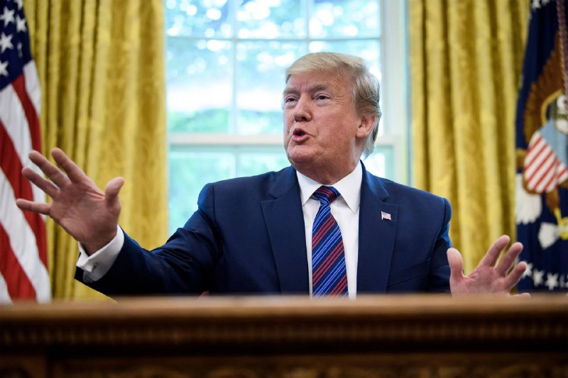

🔴 ترامپ :

ایرانی‌ها همیشه فریاد می‌زنند.

آن‌ها مشتاق امضای توافق هستند، اما بعد مدارکی می‌فرستند که هیچ ربطی به آنچه توافق کرده‌ایم ندارد.

من میگویم: شماها دیوانه‌اید؟

@IranianMinds

## IranianMinds — post 20323

  

💥 با هر ثبت نام 
🅰️
🅰️
🅰️ هزار تومن جایزه بگیرید

✔️ میتونید شرط‌بندی کنید و بونوس را به موجودی واقعی تبدیل کنید

⚽️  پوشش کامل مسابقات ورزشی 

💯  پیش‌بینی با بهترین ضرایب 

⭐️ تجربه سریع و حرفه‌ای

💰پرداخت مستقیم و سریع بدون واسطه، بدون دردسر، واریز و برداشت در سریع‌ترین زمان ممکن

☑️ کانال تلگرام: 

➡️ @winro_io  

🎁 هدیه خود را با ثبت نام در سایت دریافت کنید: 

➡️ Winro.io
R28
سایت اصلی در روزهای آینده بازگشایی خواهد شد
💎

## IranianMinds — post 20321

  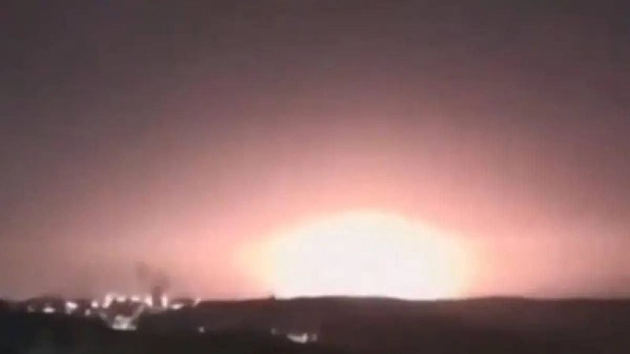

🔴 ارتش اسرائیل یک‌ بمب قوی جدید رو در‌ نزدیکی شهر بیت شمس اورشلیم آزمایش کرد

@IranianMinds

## IranianMinds — post 20320

🔴 ترامپ :

ایرانیا دارن برای توافق بهم التماس میکنن.

@IranianMinds

## BBCPersian — post 281376

🔻گزارش سالانه عفو بین‌الملل نشان می‌دهد که اعدام در سال ۲۰۲۵ به رقم بی‌سابقه‌ای رسیده است. بنابر این گزارش، این سازمان در سال گذشته میلادی ۲۷۷۰ مورد اعدام در ۱۷ کشور را ثبت کرده است که بالاترین رقم از سال ۱۹۸۱ است که عفو بین‌الملل ثبت آمار اعدام را آغاز کرد.…

## BBCPersian — post 281375

  

🔻گزارش سالانه عفو بین‌الملل نشان می‌دهد که اعدام در سال ۲۰۲۵ به رقم بی‌سابقه‌ای رسیده است.

بنابر این گزارش، این سازمان در سال گذشته میلادی ۲۷۷۰ مورد اعدام در ۱۷ کشور را ثبت کرده است که بالاترین رقم از سال ۱۹۸۱ است که عفو بین‌الملل ثبت آمار اعدام را آغاز کرد.

بنا بر آخرین گزارش عفو بین‌الملل، این افزایش چشمگیر به‌دلیل چند دولتی بوده است که می‌خواهند «از طریق ارعاب» حکومت کنند: «مقام‌های ایران عامل اصلی این جهش بودند که دست‌کم ۲۱۵۹ نفر را اعدام کردند، بیش از دو برابر آمار سال ۲۰۲۴.»

گزارش عفو بین‌الملل به چند کشور دیگر هم می‌پردازد: «عربستان سعودی شمار اعدام‌ را به دست‌کم ۳۵۶ مورد رساند، از مجازات اعدام برای جرایم مرتبط با مواد مخدر استفاده فراوانی کرد. تعداد اعدام‌ها در کویت تقریبا سه برابر شد (از ۶ به ۱۷)، و تقریبا دو برابر در مصر (از ۱۳ به ۲۳)، سنگاپور (از ۹ به ۱۷) و ایالات متحده آمریکا (از ۲۵ به ۴۷).

ادامه خبر را از لینک زیر در وبسایت بی‌بی‌سی فارسی بخوانید.

📷 NurPhoto via Getty Images
https://bbc.in/4ulEtDY
@BBCPersian

## BBCPersian — post 281374

  

🔻دیوان عالی اسپانیا حکم کرد که سازمان‌های مالیاتی حدود ۷۰ میلیون دلار به شکیرا، ستاره موسیقی پاپ، غرامت بپردازند. پرونده‌ شکایت این خواننده از هشت سال پیش در جریان بود.

شکیرا از این رای استقبال کرد و گفت که دادگاه به «سال‌ها تلاش هماهنگ برای نابودی شهرتش» پایان داد.

شکیرا این پیروزی را به «شهروندان عادی» تقدیم کرد که از «موارد مشابه» رنج دیده‌اند.

دیوان عالی نتیجه گرفت این هنرمند اهل کلمبیا در سال مالی ۲۰۱۱ ساکن اسپانیا نبوده، بنابراین به اشتباه به پرداخت میلیون‌ها دلار مالیات بر درآمد در آن سال ملزم شده بود.

دستور دادگاه اسپانیا شامل پرداخت کامل مبلغ به‌علاوه سود به شکیرا است.

📷 Getty Images
@BBCPersian

## BBCPersian — post 281373

  

🔻فردریش مرتس گفت که «ما حملات هوایی تازه ایران به امارات و دیگر شرکا را به‌شدت محکوم می‌کنیم.»

صدر‌اعظم آلمان در شبکه اجتماعی ایکس، حمله به «تاسیسات هسته‌ای» را تهدیدی برای ایمنی مردم سراسر منطقه خواند.

امارات متحده دیروز گفت که در حمله پهپادی، ژانراتور برق بیرون محوطه نیروگاه هسته‌ای براکه در نزدیکی ابوظبی آتش گرفته است. امارات در بیانیه‌هایش نامی از کشوری نبرد و فقط گفت پهپاد از «مرز غربی» وارد شده بود.

آقای مرتس در این پست نوشت که «ایران باید وارد مذاکره جدی با آمریکا شود، از تهدید همسایگان خود دست بردارد و تنگه هرمز را بدون هیچ محدودیتی مجددا باز کند.»

اظهارات آقای مرتس درباره مذاکرات ایران و آمریکا اخیرا به تنش لفظی او با دونالد ترامپ منجر شد. او گفته بود مذاکره‌کنندگان ایران آمریکا را «تحقیر» کرده‌اند.

📷Getty Images
https://bbc.in/42ChAjs
@BBCPersian

## BBCPersian — post 281372

🔻سازمان غذا و داروی ایران: تأمین مواد اولیه و واردات دارو دچار اختلال شده است
سخنگوی سازمان غذا و داروی ایران می‌گوید که تأمین مواد اولیه و واردات دارو در ایران دچار اختلال شده است.

محمد هاشمی به خبرگزاری کار ایران، ایلنا، گفت که برای شناسایی و مدیریت به‌موقع هرگونه کمبود در بازار، سامانه‌ای فعال شده است که موجودی انبارها و خطوط تولید را به‌طور لحظه‌ای زیر نظر دارد.

آقای هاشمی افزود: «اولویت‌بندی واردات بر اساس ضرورت درمانی داروها در دستور کار قرار گرفته و نهاده‌های مربوط به داروهای حیاتی، مزمن و خاص در صدر فهرست تخصیص ارز و ترخیص قرار دارند.»

هدف قرار گرفتن برخی موسسات مرتبط با تولید دارو در حملات آمریکا و اسرائیل و همچنین محدود شدن واردات به دلیل اختلال در تنگه هرمز و مسیرهای هوایی، به کمبود دارو در ایران دامن زده است.

علاوه بر اینها، تخصیص ارز به واردات دارو هم کاهش یافته است.

پیشتر سخنگو و عضو هیات‌مدیره انجمن داروسازان ایران گفته بود: «محدود شدن منابع ارزی دولت به معنی کاهش امکان اختصاص یارانه به تولید و عرضه دارو است که منجر به افزایش قیمت بین ۳۰ تا ۳۰۰ درصدی قیمت دارو شده است.»

روزنامه اعتماد هفته پیش در گزارشی گفت که مصرف‌کنندگان داروهای خاص‌، با چالش بزرگی روبرو شده‌اند.

روایت‌های بیماران از نبود کیت آزمایش، کمیابی انسولین، افزایش چندبرابری قیمت داروهای حیاتی و توقف واردات برخی داروهای سرطان، از بحرانی حکایت دارد که مستقیما با جان انسان‌ها گره خورده است.

https://bbc.in/4uUCoPk
@BBCPersian

## BBCPersian — post 281371

  

🔻خبرگزای رسمی ایران (ایرنا) می‌گوید که با تداوم قطع اینترنت استفاده از سیم‌کارت‌های عراقی در شهرهای مرزی ایران رونق گرفته است.

ایرنا از کاربران نقل کرده است که به‌دلیل نزدیکی جغرافیایی آبادان و خرمشهر به خاک عراق، آنتن‌دهی اپراتورهای عراقی در برخی نقاط این شهرها، بویژه در مناطق نزدیک اروندرود، قابل دریافت است.

این گزارش می‌گوید خیابان‌های منتهی به رودخانه مرزی ایران و عراق در آبادان محل «تجمع خودروها و افراد پیاده است که در نگاه اول تداعی‌کننده یک تفریحگاه است اما در این مرز خبری از تفریح نیست، گوشی‌های به‌دست گرفته شده و سرهایی که در گوشی‌ها فرو رفته، حکایت از مهاجرت دیجیتال در نقطه صفر مرزی دارد.»

بر اساس این گزارش، قیمت این سیم‌کارت‌ها در بازار غیررسمی خوزستان حدود دو میلیون تومان است و در صورت فعال‌سازی اینترنت و خرید بسته‌های اولیه، هزینه آن گاهی به حدود پنج میلیون تومان نیز می‌رسد.

📷Reuters
@BBCPersian

## BBCPersian — post 281370

  <a href="telegram/content/BBCPersian_281370_1779108372.mp4">🎬 Download video</a>

🔻مقام‌های آمریکایی اعلام کردند که پس از برخورد و سقوط دو جت نیروی دریایی این کشور در جریان نمایش هوایی، وضعیت سلامتی چهار خدمه پایدار است. جت‌های بوئینگ EA18-G گرولر که ویژه جنگ الکترونیک هستند، در حال انجام حرکات نمایشی با هم برخورد و سقوط کردند، اما هر چهار سرنشین آنها با پرتاب اضطراری صندلی پیش از سقوط از هواپیماها خارج شدند.

این حادثه یکشنبه، در دومین و آخرین روز از نمایش هوایی گان‌فایتر اسکایز (Gunfighter Skies) در آیداهو رخ داد.

در پی این برخورد آتش‌سوزی رخ داد و بقیه نمایش هوایی لغو شد. تحقیقات در حال انجام است.

پایگاه هوایی مانتین ایر فورس گانفایترز در بیانیه‌ای که روز یکشنبه در شبکه‌های اجتماعی منتشر شد، اعلام کرد: «خدمه هوایی که در این حادثه درگیر بودند، در وضعیت پایداری قرار دارند.»

سخنگوی نیروی دریایی گفت که خدمه توسط پرسنل پزشکی معاینه می‌شوند.

هواپیماهای EA-18G گرولر متعلق به یک اسکادران جنگ الکترونیکی از ایالت واشنگتن بودند. نیروی دریایی ایالات متحده می‌گوید هر یک از این جت‌ها حدود ۶۷ میلیون دلار قیمت داشته است.

https://bbc.in/4fpKU47
@BBCPersian

## BBCPersian — post 281369

  

🔻تیم ملی فوتبال ایران صبح امروز با حضور ۲۲ بازیکن و اعضای کادر فنی برای برگزاری یک بازی دوستانه عازم آنتالیا در ترکیه شد.

این بازی دوستانه قرار است آخرین مسابقه تیم ملی با هدف آماده‌سازی برای حضور در جام جهانی و سفر به ایالات متحده باشد.

۲۲ بازیکن اعزام شده به ترکیه، بازکنان شاغل در باشگاه‌های داخلی ایران هستند.

امیر قلعه‌نویی، سرمربی تیم فوتبال ایران، گفته است که ۲۸ فوتبالیست برای حضور در تیم ملی انتخاب شده‌اند و ابراز امیدواری کرده که به همه آنها روادید ورود به آمریکا داده شود.

دو روز پیش مهدی تاج، رئیس فدراسیون فوتبال ایران، در استانبول با ماتیاس گرافستروم، دبیر کل فیفا، دیدار و گفت‌گو کرد.

آقای تاج گفت که در این دیدار مقامات فیفا به «۱۰ نکته‌ای که ایران مطرح کرد، گوش دادند و برای هر یک از آنها راه‌ حل ارائه کردند.»

او ابراز امیدواری کرد که تیم ملی فوتبال ایران بتواند بدون هیچ مشکلی به جام جهانی برود.

قرار است ایران هر سه بازی مرحله گروهی جام جهانی را در ایالات متحده برگزار کند.
@BBCPersian
📷IRAN MEDIA

## idfinfarsi — post 11594

  

❌در یک حمله دقیق در بعلبک: ارتش اسرائیل فرمانده جهاد اسلامی فلسطین در منطقه بقاع لبنان را به هلاکت رساند

‼️ارتش اسرائیل در‌طول شب (یکشنبه) در منطقه بعلبک حمله کرده و وائل محمود عبدالحلیم، فرمانده جهاد اسلامی فلسطین در منطقه بقاع لبنان را به هلاکت رساند.

⭕️عبدالحلیم رهبری پیوستن تروریست‌های سازمان تروریستی جهاد اسلامی فلسطین به نبرد در کنار تروریست‌های سازمان تروریستی حزب‌الله در لبنان را بر عهده داشت و در دوره اخیر برای پیشبرد طرح‌های تروریستی علیه نیروهای ارتش اسرائیل فعالیت می‌کرد.

## Dirty_Kids — post 389672

  

نشریه چپولیستی گاردین رسما اعلام کرده:
"اگه از بوی شاش و عرق حال‌تون به هم می‌خوره، شما راست افراطیِ ترامپ‌یستید" 😭😂
یعنی اینا برای حموم نرفتن و بوی تعفن هم دارن مشروعیت سیاسی صادر می‌کنن!!!!

@Dirty_Kids 👻

## Dirty_Kids — post 389671

🔴خبرگزاری تسنیم:

ایران از طریق پاکستان، یه پیشنهاد 14 بندیِ اصلاح شده به آمریکا داد تا اونا هم بررسیش کنن و جواب بدن.

@Dirty_Kids 👻

## Dirty_Kids — post 389670

  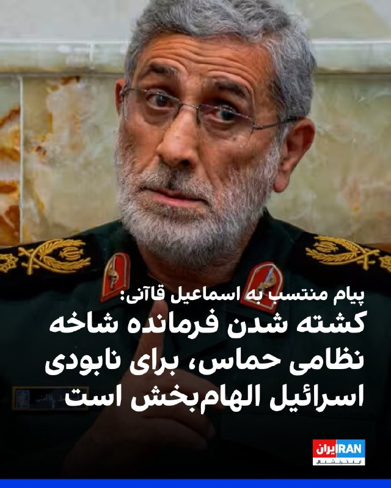

اینا نه تنها باخت ندارن 😂
حتی یه مورد مساوی هم ندارن
فقط بردددد

@Dirty_Kids 👻

## Dirty_Kids — post 389669

  <a href="https://t.me/Dirty_Kids/389669">📎 Download file</a>

✅ اپلیکیشن اندروید سایت جهانی دربی بت

💰اولین سایت جهانی با امکان شارژ و برداشت ریالی(کارت به کارت)

🔗 برای ورود فیلترشکن روی کشور مناسب قرار دهید مانند فنلاند و المان و....

😀Telegram Channel
👇
https://t.me/+bcynkEgSW2dlYTc0

## Dirty_Kids — post 389668

  

😤دنبال یه سایت شرط بندی بین المللی بودی که به ایرانیا خدمات بده؟!
⛔

👍دربی بت همون انتخاب  100%

💎ویژگی های سایت جهانی Derby Bet:

⬅️امکان شارژ امن با کارت بانکی

⬅️واریز اول دوبل شارژ می شوید(بونوس۱۰۰٪)

⬅️پر اپشن ترین سایت فعال در ایران

⬅️تسویه حساب کمتر از 5 دقیقه

⬅️برگشت بخشی از باخت به صورت هفتگی

🚨کد هدیه ثبت نام:GG007

⚠️برای دانلود اپلکیشن کلیک کنید
👉

🔔کانال دربی بت :

🪙https://t.me/+bcynkEgSW2dlYTc0

## Dirty_Kids — post 389667

نگاهی عمیق‌تر به بیضه‌های بهزاد فراهانی

@Dirty_Kids 👻

## Dirty_Kids — post 389666

  <a href="telegram/content/Dirty_Kids_389666_1779108376.mp4">🎬 Download video</a>

Coming soon… 🐺⚽️

موزیک‌ویدئو شکیرا که با پله و مارادونا شروع می‌شه و قراره برای افتتاحیه‌ی جام جهانی اجراش کنه

@Dirty_Kids 👻

## Dirty_Kids — post 389665

  <a href="telegram/content/Dirty_Kids_389665_1779108378.mp4">🎬 Download video</a>

قاضی‌زاده‌هم گرفت رو بهزاد سگ‌سیبیل

@Dirty_Kids 👻

## Dirty_Kids — post 389664

  

🌪وقتی اینترنت طوفانیه... کافیه بادبان ها رو بکشی تا

⚫️با بالاترین کیفیت ممکن
⚡️ 

⚫️100 هزار تومان شارژ هدیه 
🎁

⚫️پایین ترین قیمت گیگی 250
🌐 

⚫️و ارائه پورسانت %10 در ازای هر معرفی
💼

بتونی یه اتصال پایدار با پشتیبانی 24 ساعته داشته باشی
🚀

بادبان راهتو باز می‌کنه
⛵️

R28

🛡@BadBan_VPN | کانال 

🤖@BadBan_VPNBot | ربات 

📞@BadBan_VPNSupport | پشتیبانی

## Dirty_Kids — post 389663

  <a href="telegram/content/Dirty_Kids_389663_1779108379.mp4">🎬 Download video</a>

رقابت شدیدی هست بین ورزش کردن با کافه رفتن تو عادیسازی..

خب اصن گیریم دو ساعت ورزش کردیم بعدش، گوشت مرغ‌تخم‌مرغ ارزون میشه؟

+ اینارو من نمیشناسم کلی مشاهداتمو میگم..

@Dirty_Kids 👻

## Hranews — post 113015

خبرگزاری هرانا pinned a photo

## Hranews — post 113014

  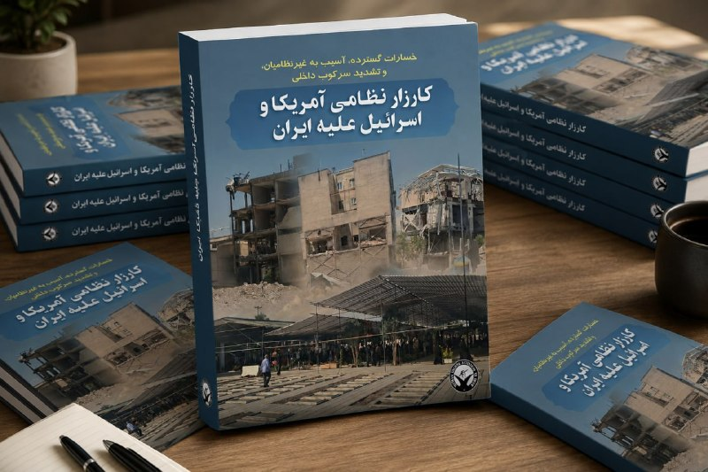

میان موشک و سرکوب؛ گزارش مجموعه فعالان حقوق بشر درباره مخاصمه نظامی ایالات متحده-اسرائیل و ایران منتشر شد

💥
💥
💥
💥
💥 – امروز، مجموعه فعالان حقوق بشر در ایران گزارش جدیدی را در ۲۴۰ صفحه و دو زبان منتشر کرد که به بررسی کارزار نظامی ایالات متحده و اسرائیل در ایران در فاصله ۹ اسفند ۱۴۰۴ تا ۱۹ فروردین ۱۴۰۵ (۲۸ فوریه تا ۸ آوریل ۲۰۲۶) می‌پردازد.

این گزارش بر پایه ۱۷۷ منبع تأییدشده ــ شامل گزارش‌های منابع آزاد و شبکه میدانی مجموعه فعالان حقوق بشر در داخل کشور ــ ۶٬۳۲۴ رویداد منحصربه‌فرد شامل ۱۲٬۷۹۸ حمله مجزا را مستندسازی کرده است.
مجموعه فعالان تاکید کرد این گزارش با هدف ارائه روایت جامع از کل درگیری تهیه نشده است. یافته‌های آن صرفاً به رویدادهایی محدود می‌شود که در داده‌های این نهاد مستندسازی و راستی‌آزمایی شده‌اند.

📊 یافته‌های کلیدی گزارش
◾️ ثبت ۶٬۳۲۴ رویداد منحصربه‌فرد و ۱۲٬۷۹۸ حمله مجزا
◾️ ۷۷ درصد رویدادها شامل آسیب به غیرنظامیان یا اماکن غیرنظامی
◾️ ثبت دست‌کم ۳٬۶۳۶ مورد مرگ، از جمله ۱٬۷۰۱ غیرنظامی
◾️ کشته شدن ۳۰۷ کودک و زخمی شدن ۲٬۲۱۳ کودک
◾️ تمرکز ۴۴٫۸۵ درصدی رویدادها در استان تهران
◾️ هدف قرار گرفتن یا آسیب دیدن مدارس، مراکز درمانی، مراکز فرهنگی و زیرساخت‌های حیاتی

⚠️ الگوهای نگران‌کننده
این گزارش چندین الگوی نگران‌کننده را برجسته می‌کند، از جمله:
◾️ ضعف در راستی‌آزمایی اهداف
◾️ استفاده محدود از نظارت انسانی در برخی فناوری‌های هدف‌گیری
◾️ هشدارهای ناکافی پیش از حملات
◾️ استفاده از تسلیحات انفجاری سنگین در مناطق پرجمعیت
◾️ حملات تکراری به برخی مناطق غیرنظامی
◾️ آسیب گسترده به زیرساخت‌های غیرنظامی

🚨 این گزارش همچنین به بازداشت گسترده شهروندان در ایران اشاره دارد؛ دست‌کم ۴٬۰۲۳ نفر با اتهامات مرتبط با امنیت ملی یا جنگ بازداشت شده‌اند.

از سوی دیگر تشدید محدودیت‌های امنیتی، گسترش ایست‌های بازرسی و محدودیت‌های گسترده اینترنت از دیگر پیامدهای مستندسازی‌شده عنوان شده است.

در همین بازه زمانی، ۵۰ مورد اعدام ثبت شده که ۳۲ مورد آن با اتهامات سیاسی و امنیتی مرتبط بوده است.

📎 ادامه گزارش به زبان فارسی

📎 دانلود مستقیم فایل پی دی اف گزارش از تلگرام

📎 Read the report in English

📎Direct download of the PDF file of this report

↘️
@hranews_bot تماس ✉️ - @Hranews کانال هرانا 🆑

## Hranews — post 113013

دستکم ۳۲ نفر با اتهامات امنیتی در چند استان بازداشت شدند

❗️
❗️
❗️
❗️
❗️– سازمان اطلاعات سپاه از #بازداشت دستکم ۳۲ تن در استان‌های قزوین، کرمان و چهارمحال و بختیاری خبر داد. این نهاد، اتهامات مطرح‌ شده علیه این افراد را «جاسوسی، ارتباط با گروه‌های مخالف نظام، اقدامات تروریستی و خرابکارانه» عنوان کرده است.

ادامه مطلب

↘️
@hranews_bot تماس ✉️ -  @Hranews  کانال هرانا 🆑

## Hranews — post 113012

  

مهدی ابطحی، معاون پژوهشی وزیر علوم با اشاره به #قطع_اینترنت در کشور و محدودیت‌های موجود، به ویژه برای دانشجویان مقطع تحصیلات تکمیلی، اعلام کرد که تداوم این وضعیت باعث تنزل جایگاه ایران از جمع ۲۰ کشور برتر در حوزه تولید علم خواهد شد.

↘️
@hranews_bot تماس ✉️ -  @Hranews  کانال هرانا 🆑

## Hranews — post 113011

  

گزارشی از آخرین وضعیت پژمان زارع، شهروند بهائی در زندان عادل‌آباد

❗️
❗️
❗️
❗️
❗️– پژمان زارع، شهروند #بهائی ساکن شیراز، علیرغم گذشت ۶۵ روز از زمان دستگیری، همچنان در بازداشت و بلاتکلیفی به سر می‌برد. وی اخیراً به زندان عادل‌آباد این شهر منتقل شده است.

به گزارش خبرگزاری هرانا، ارگان خبری مجموعه فعالان حقوق بشر در ایران، پژمان زارع کماکان در بازداشت به‌سر می‌برد.

یک منبع مطلع نزدیک به خانواده این #شهروند_بهائی ضمن تایید این موضوع به هرانا گفت: آقای زارع پس از ۵۸ روز نگهداری در مکانی نامعلوم و بی‌خبری خانواده از وضعیتش، اخیراً به زندان عادل‌آباد شیراز منتقل شده و تاکنون تنها یک ملاقات از پشت شیشه با خانواده‌اش داشته است. وی همچنان از حق دسترسی به وکیل محروم بوده و تاکنون تفهیم اتهام نشده است.
این منبع مطلع افزود: «علیرغم تامین وثیقه توسط خانواده و ارائه آن به دادسرا، تاکنون با آزادی موقت وی موافقت نشده است.»

ادامه مطلب

#پژمان_زارع

↘️
@hranews_bot تماس ✉️ -  @Hranews  کانال هرانا 🆑

## Hranews — post 113010

  

نت‌بلاکس، که محدودیت دسترسی به #اینترنت در جهان را رصد می‌کند، اعلام کرد که قطع سراسری اینترنت در ایران اکنون از ۱۸۹۶ ساعت گذشته و وارد هشتادمین روز خود شده است.

↘️
@hranews_bot تماس ✉️ -  @Hranews  کانال هرانا 🆑

## Hranews — post 113009

  

امروز دوشنبه ۲۸ اردیبهشت‌ماه، جمعی از کارگران شرکت پتروشیمی پتروناد برای چهارمین روز متوالی در مقابل ساختمان فرمانداری بندرامام دست به #تجمع_اعتراضی زدند.

#تجمع این کارگران در اعتراض به اخراج ۲۰۰ کارگر بومی این شرکت صورت گرفته است.

↘️
@hranews_bot تماس ✉️ -  @Hranews  کانال هرانا 🆑

## configx2ray — post 39002

هر مشکلی سوالی درخواستی پیشنهادی انتقادی هرچی بود میتونید پیوی بگید در خدمتتونم 
❤️

@Mehrabhabo

## configx2ray — post 39001

96.17.207.135
104.109.250.232
92.122.166.175
2.23.168.250
2.23.168.254
2.23.168.144
50.7.5.83
2.23.168.96
2.23.168.47
2.21.239.29
2.23.170.80
185.200.232.16
2.23.168.174
2.16.19.136
185.200.232.8
185.200.232.9
185.200.232.16
185.200.232.17
185.200.232.19
185.200.232.24
185.200.232.25
185.200.232.26
185.200.232.27
185.200.232.32
185.200.232.40
185.200.232.41
185.200.232.42
185.200.232.43
185.200.232.48
185.200.232.49
185.200.232.50
185.200.232.56
185.200.232.57
185.200.232.58
185.200.232.59
185.200.232.64
185.200.232.65
185.200.232.66
185.200.232.67

آیپی های تست شده برای متود جدید سایفون
❤️

همشو باهم وارد کنید داخل برنامه 
🔥
Channel : https://t.me/ConfigX2ray

## configx2ray — post 39000

151.101.64.223
151.101.0.223
151.101.128.223
151.101.192.223
92.122.123.128
2.16.186.20
2.16.186.31
2.16.186.44
2.16.186.58
2.16.186.69
2.16.186.81
2.19.204.19
2.19.204.87
2.19.204.137
2.19.204.144
2.19.204.145
2.19.204.170
2.19.204.184
2.19.204.185
2.19.204.202
2.19.204.210
2.19.204.211
2.19.204.217
2.19.204.218
2.19.204.225
2.19.204.232
2.19.204.234
2.19.204.240
2.19.204.249
2.19.204.250
2.19.204.251
2.19.205.8
2.19.205.9
2.19.205.11
2.19.205.27
2.19.205.33
2.19.205.34
2.19.205.40
2.19.205.41
2.19.205.42
2.19.205.49
2.19.205.50
2.19.205.58
2.19.205.59
2.19.205.64
2.19.205.65
2.19.205.82
2.19.205.83
2.19.205.88
2.19.205.97
2.19.205.98
2.19.205.105
2.22.151.4
2.22.151.9
2.22.151.12
2.22.151.13
2.22.151.15
2.22.151.17
2.22.151.20
2.22.151.22
2.22.151.23
2.22.151.32
2.22.151.36
2.22.151.37
2.22.151.39
2.22.151.47
2.22.151.51
2.22.151.53
2.22.151.54
2.22.151.58
2.22.151.60
2.22.151.62
2.22.151.135
2.22.151.138
2.22.151.139
2.22.151.141
2.22.151.142
2.22.151.143
2.22.151.144
2.22.151.146
2.22.151.149
2.22.151.150
2.22.151.151
2.22.151.152
2.22.151.153
2.22.151.154
2.22.151.155
2.22.151.156
2.22.151.157
2.22.151.158
2.22.151.159
2.22.151.161
2.22.151.162
2.22.151.163
2.22.151.164
2.22.151.168
2.22.151.169
2.22.151.170
2.22.151.171
2.22.151.173
2.22.151.175
2.22.151.179
2.22.151.181
2.22.151.182
2.22.151.183
2.22.151.184
2.22.151.185
2.22.151.186
2.22.151.188
2.22.151.189
2.22.151.190
2.22.151.191
2.22.151.193
2.22.151.194
2.22.151.195
23.32.5.18
23.32.5.44
23.32.5.71
23.32.5.96
23.32.5.118
23.32.5.141
23.32.5.167
23.32.5.193
23.32.5.214
23.32.5.236
23.53.35.146
23.53.35.158
23.53.35.171
23.53.35.182
23.53.35.194
23.53.35.207
23.67.253.11
23.67.253.24
23.67.253.55
23.67.253.77
23.67.253.101
23.67.253.120
23.195.81.72
23.195.81.84
23.195.81.96
23.195.81.108
50.7.5.83
63.141.252.203
65.109.34.234
92.122.123.128
94.130.13.19
94.130.33.41
94.130.50.12
94.130.70.160
95.216.69.37
96.16.97.82
96.16.97.104
96.16.97.126
96.16.97.148
96.16.97.169
96.16.97.191
104.124.148.191
104.124.148.203
138.201.54.122
142.54.178.211
144.76.1.88
184.26.163.12
184.26.163.24
184.26.163.38
184.26.163.51
184.26.163.66
184.26.163.79
184.31.169.195
184.31.169.252
184.31.170.97
184.31.170.185
184.50.87.22
184.50.87.44
184.50.87.66
184.50.87.88
184.24.77
184.24.77.42
184.24.77.32
184.24.77.5
184.24.77.7
184.24.77.16
184.24.77.36
184.24.77.21
184.24.77.11
185.200.232.49
185.200.232.50
185.200.232.42
185.200.232.41
23.48.23.186
23.48.23.133
23.48.23.195
23.48.23.178
184.24.77.29
23.65.119.52
23.73.2.141
104.110.138.190
104.83.5.202
92.122.166.236
92.122.166.234
92.122.166.237
96.16.122.70
23.67.136.200
23.67.136.202
185.89.22.66
185.89.22.67
185.89.22.10
185.89.22.71
185.89.22.210
185.89.22.73
2.21.101.117
2.21.102.89
2.23.244.110
23.219.138.67
23.220.113.51
23.45.99.92
2.23.115.240
23.201.242.44
2.16.106.4
2.16.168.101
23.46.188.6
194.233.166.21
104.116.96.159
2.17.147.8
23.43.133.89
2.17.241.112
2.20.255.113
23.55.110.208
95.101.202.99
2.19.126.143
23.44.51.97
104.121.16.95
23.50.185.91
2.21.173.27
23.220.112.170
23.48.23.146
2.20.253.86
23.201.242.145
23.222.250.150
23.211.27.127
2.20.169.249
2.16.56.72
23.207.210.83
23.207.210.84
23.218.225.40
104.109.143.29
2.21.173.144
23.55.110.153
23.32.238.203
23.209.125.169
23.54.210.170
23.48.23.175
23.44.201.142
2.16.106.29
23.55.176.85
23.53.35.196
23.48.23.11
23.40.179.66
23.210.73.151
23.37.185.178
23.222.124.192
23.219.9.186
2.19.193.194
23.32.39.52
23.201.183.230
23.207.193.67
23.56.109.141
23.43.237.18
23.210.216.97
2.17.128.181
104.108.237.97
23.38.153.140
23.50.131.111
23.52.171.161
81.91.145.2
65.109.34.234
81.12.72.218
144.76.1.88
138.201.54.122
94.130.33.41
95.216.69.37
94.130.50.12
94.130.70.160
185.137.25.214
185.143.232.122
5.160.13.85
37.255.133.30
142.54.178.211
63.141.252.203
96.16.53.132
23.220.113.51
23.48.23.165

آیپی های تست شده برای متود جدید سایفون
❤️

همشو باهم وارد کنید داخل برنامه 
🔥
Channel : https://t.me/ConfigX2ray

## configx2ray — post 38999

184.24.77.42
2.23.168.213
2.23.168.174
2.23.168.7
184.24.77.32
184.24.77.5
184.24.77.7
184.24.77.16
184.24.77.36
184.24.77.21
2.23.169.111
2.23.169.105
184.24.77.11
184.24.77.29
185.200.232.49
185.200.232.50
185.200.232.42
185.200.232.41
23.48.23.186
23.48.23.133
23.48.23.195
23.48.23.178
104.78.170.186
96.17.222.31
23.41.37.129
23.2.13.227
23.222.126.108
2.20.255.113
2.17.251.98
23.2.13.152
95.101.23.27
2.21.239.21
23.211.49.252
88.221.168.5
104.103.90.156
23.79.20.249
88.221.132.162
23.59.235.208
23.60.69.118
23.46.188.71
104.122.212.92
23.219.1.4
23.57.43.195
184.51.252.135
2.22.6.68
23.217.11.56
95.100.69.108
23.40.63.69
96.16.122.74
104.109.250.232
92.123.104.7
104.110.191.57
104.83.5.82
92.122.166.168
104.83.5.65
104.121.0.17
104.66.70.133
92.122.166.146
23.73.2.161
92.122.73.138
92.122.166.141
96.16.122.55
104.81.108.51
23.72.248.214
104.126.37.185
104.83.5.201
104.83.5.216
92.123.104.67
104.83.5.203
96.17.207.151
88.221.168.138
96.17.207.149
104.81.108.10
23.73.2.148
92.122.166.175
172.237.127.6
104.81.104.13
96.17.207.137
92.123.112.7
96.16.122.75
96.16.122.70
92.122.166.182
104.109.128.153
104.96.143.134
23.73.2.141
104.83.5.202
23.67.136.200
23.67.136.202
23.65.119.52
92.122.166.236
92.122.166.234
92.122.166.237
104.110.138.190
173.222.200.5
184.51.252.36
184.51.252.38
104.83.5.208
96.16.122.146
96.17.206.214
92.122.166.197
104.94.100.73
104.83.15.66
88.221.213.81
172.239.57.117
104.117.76.40
184.51.252.4
96.17.207.30
96.16.122.83
96.16.122.150
23.73.207.11
96.16.122.77
96.17.207.155
92.123.189.82
96.16.122.82
96.16.122.66
96.7.218.219
96.16.122.137
184.51.252.157
92.123.189.41
184.86.251.12
96.16.122.154
184.51.252.152
96.17.207.12
23.79.48.162
151.101.0.223
151.101.128.223
151.101.192.223
151.101.64.223
65.109.34.234
142.54.178.211
2.23.168.47
2.23.168.96
2.23.168.144
2.23.169.207
2.23.170.80

آیپی های تست شده برای متود جدید سایفون
❤️

همشو باهم وارد کنید داخل برنامه 
🔥
Channel : https://t.me/ConfigX2ray

## configx2ray — post 38998

185.137.25.214
144.76.1.88
138.201.54.122
81.91.145.2
142.54.178.211
94.130.33.41
65.109.34.234
63.141.252.203
2.23.168.254
37.255.133.30
5.160.13.85
2.23.170.80
2.23.168.47
2.23.168.213
2.23.168.174
2.23.168.144

آیپی های تست شده برای متود جدید سایفون
❤️

همشو باهم وارد کنید داخل برنامه 
🔥
Channel : https://t.me/ConfigX2ray

## configx2ray — post 38997

  <a href="telegram/content/configx2ray_38997_1779108384.jpg">🎬 Download video</a>

{"remarks":"https://t.me/ConfigX2ray ☀️","log":{"loglevel":"warning"},"inbounds":[{"tag":"socks","port":10808,"protocol":"socks","settings":{"auth":"noauth","udp":true,"userLevel":8},"sniffing":{"enabled":true,"destOverride":["http","tls","fakedns","fakedns"],"routeOnly":false}},{"tag":"dns-in","port":10853,"protocol":"dokodemo-door","listen":"127.0.0.1","settings":{"address":"1.1.1.1","port":53,"network":"tcp,udp"}}],"outbounds":[{"tag":"proxy","protocol":"socks","settings":{"servers":[{"address":"62.220.126.92","ota":false,"port":30871,"level":8}]},"streamSettings":{"network":"tcp"},"mux":{"enabled":false,"concurrency":-1,"xudpConcurrency":8,"xudpProxyUDP443":""}},{"tag":"direct","protocol":"freedom","settings":{"domainStrategy":"UseIP"},"mux":{"enabled":false,"concurrency":8,"xudpConcurrency":8,"xudpProxyUDP443":""}},{"tag":"block","protocol":"blackhole","settings":{"response":{"type":"http"}},"mux":{"enabled":false,"concurrency":8,"xudpConcurrency":8,"xudpProxyUDP443":""}},{"tag":"dns-out","protocol":"dns","mux":{"enabled":false,"concurrency":8,"xudpConcurrency":8,"xudpProxyUDP443":""}}],"dns":{"servers":[{"address":"fakedns","domains":["geosite:cn"]},"1.1.1.1"],"hosts":{"domain:googleapis.cn":"googleapis.com","dns.alidns.com":["223.5.5.5","223.6.6.6","2400:3200::1","2400:3200:baba::1"],"one.one.one.one":["1.1.1.1","1.0.0.1","2606:4700:4700::1111","2606:4700:4700::1001"],"dot.pub":["1.12.12.12","120.53.53.53"],"dns.google":["8.8.8.8","8.8.4.4","2001:4860:4860::8888","2001:4860:4860::8844"],"dns.quad9.net":["9.9.9.9","149.112.112.112","2620:fe::fe","2620:fe::9"],"common.dot.dns.yandex.net":["77.88.8.8","77.88.8.1","2a02:6b8::feed:0ff","2a02:6b8:0:1::feed:0ff"]}},"routing":{"domainStrategy":"IPIfNonMatch","rules":[{"type":"field","outboundTag":"dns-out","inboundTag":["dns-in"]},{"type":"field","ip":["1.1.1.1"],"outboundTag":"proxy","port":"53"},{"type":"field","ip":["223.5.5.5"],"outboundTag":"direct","port":"53"},{"type":"field","outboundTag":"dns-out","inboundTag":["dns-in"]},{"type":"field","ip":["1.1.1.1"],"outboundTag":"proxy","port":"53"},{"type":"field","ip":["223.5.5.5"],"outboundTag":"direct","port":"53"}]},"fakedns":[{"ipPool":"198.18.0.0/15","poolSize":10000}]}

ترکیبی با سایفون وصله 
✅

آموزش استفادع : 
👇
https://t.me/ConfigX2ray0/1665

## configx2ray — post 38996

تنظیمات سیمکارت 
🛜
🛜
🛜
APN Settings 
❤️
Name Google.com
APN Google.com
Just  IPv4

Shir khorshid Sni:

🔹Google.com

رو ایرانسل جواب داده ، بقیه اپراتورها هم تست کنید

Channel : https://t.me/ConfigX2ray

## configx2ray — post 38995

خوابم نمیبره یه اسلیپ بزاریم همه وصل شند
❤️

## configx2ray — post 38994

2.23.167.64
23.2.13.136
2.23.167.113
2.23.245.35
2.22.250.149
72.246.28.37
184.86.251.12
96.16.122.154
96.16.53.134
96.16.122.141
96.16.53.152

آیپی های تست شده برای متود جدید سایفون
❤️

همشو باهم وارد کنید داخل برنامه 
🔥

Channel : https://t.me/ConfigX2ray

## configx2ray — post 38993

37.255.133.30
95.216.69.37
81.12.72.218
65.109.34.234
185.143.232.122
5.160.13.85
23.73.2.161
142.54.178.211
23.220.113.51
23.2.13.201
184.24.77.16
96.17.207.137
92.122.166.237
151.101.64.223
81.91.145.2
104.83.5.65
2.18.190.27
2.23.168.254
2.23.168.144
23.56.162.186
184.51.252.36
96.17.207.155
2.23.168.96
96.16.249.60
95.101.29.30
95.101.23.82
185.200.232.16
185.137.25.214
2.16.19.136
2.23.170.80
96.17.207.135
2.23.168.174
2.23.168.213
2.23.168.47

آیپی های تست شده برای متود جدید سایفون
❤️

همشو باهم وارد کنید داخل برنامه 
🔥

Channel : https://t.me/ConfigX2ray

## configx2ray — post 38992

23.44.201.17
23.62.54.24
23.58.95.144
104.83.198.44
92.123.102.153
184.51.252.134
23.53.40.147
184.51.252.176
2.18.64.212
172.104.251.198
2.18.79.101
23.216.77.181
92.123.102.89
23.216.77.80
96.16.53.132
23.53.40.139
23.48.165.70
2.21.20.143
23.43.85.155
23.48.23.184
23.207.210.83
23.209.125.169
23.48.23.172
2.21.240.22
23.55.110.82
23.216.77.35
23.58.95.138
23.33.40.149
23.48.23.146
23.209.125.145
92.123.102.130
23.53.40.121
23.48.23.11
23.201.248.171
23.209.125.27
23.48.23.176
23.207.210.86
23.55.161.151
92.123.103.89
2.23.7.34
23.207.210.80
23.48.23.165
23.48.23.173
23.48.23.156
23.55.110.74
173.222.107.202
23.213.161.140
23.48.23.134
23.204.152.160
2.23.97.120
185.200.232.49
185.200.232.50
185.200.232.42
185.200.232.41
184.24.77.42
184.24.77.32
184.24.77.5
184.24.77.7
184.24.77.16
184.24.77.36
184.24.77.21
184.24.77.11
23.48.23.186
23.48.23.133
23.48.23.195
23.48.23.178
184.24.77.29

آیپی های تست شده برای متود جدید سایفون
❤️

همشو باهم وارد کنید داخل برنامه 
🔥

Channel : https://t.me/ConfigX2ray

## manototv — post 105591

  

نِت‌بلاکس اعلام کرد خاموشی اینترنت در ایران وارد هشتادمین روز شده و مدت این اختلال از ۱۸۹۶ ساعت گذشته است.

نت‌بلاکس، نهاد ناظر بر اختلالات اینترنتی، در گزارشی اعلام کرد خاموشی اینترنت در ایران وارد هشتادمین روز شده و از ۱۸۹۶ ساعت عبور کرده است. این قطعی در حالی است‌ که دسترسی آزاد شهروندان به اینترنت همچنان محدود است، محتوای حامی جمهوری اسلامی در شبکه‌های اجتماعی به‌طور گسترده منتشر می‌شود.

بر اساس گزارش‌ها، برخی کاربران در ایران گفته‌اند برای دریافت دسترسی‌های ویژه یا «سفید»، از آن‌ها خواسته شده روزانه سهمیه‌ای از محتوای تبلیغاتی منتشر کنند؛ روندی که گفته می‌شود با ابزارهای هوش مصنوعی هم کنترل می‌شود.

## manototv — post 105590

  <a href="telegram/content/manototv_105590_1779108385.mp4">🎬 Download video</a>

یوروپل، آژانس همکاری پلیسی اتحادیه اروپا، اعلام کرد در یک اقدام هماهنگ برای مقابله با محتوای «تروریستی» در فضای مجازی، ۱۴ هزار و ۲۰۰ پیوند مرتبط با فعالیت‌های سپاه پاسداران شناسایی شده است.

بر اساس اعلام یوروپل، این عملیات با هدف مقابله با «زیست‌بوم تبلیغاتی» سپاه پاسداران در اینترنت انجام شد و محققان، هزاران پست و پیوند را برای ارجاع به ارائه‌دهندگان خدمات آنلاین هدف قرار دادند.

## manototv — post 105589

  <a href="telegram/content/manototv_105589_1779108385.mp4">🎬 Download video</a>

امروز، ۲۸ اردیبهشت ۱۴۰۵، هم‌زمان با زادروز محمدرشید مظاهری، دروازه‌بان سابق تیم ملی فوتبال ایران، جمعی از ایرانیان و اعضای «حزب پادشاهی‌خواه میهن‌پرستان ایران» مقابل کنسولگری جمهوری اسلامی در هامبورگ تجمع کردند.

تجمع‌کنندگان با گرامی‌داشت زادروز این ورزشکار، خواستار آزادی بی‌قیدوشرط او و همه زندانیان سیاسی شدند.

رشید مظاهری، بازیکن سابق استقلال، سپاهان، تراکتور و ذوب‌آهن، در ۵ اسفند ۱۴۰۴ پس از انتشار پستی انتقادی علیه علی خامنه‌ای بازداشت شد و بر اساس گزارش‌ها، نزدیک به سه ماه است در وضعیت ناپدیدشدن قهری قرار دارد.

گزارش‌ها و ویدیوهای خود را از طریق واتس‌اپ یا تلگرام برای منوتو بفرستید:

۰۰۴۴۷۵۹۰۸۹۹۹۹۹

## manototv — post 105588

  <a href="telegram/content/manototv_105588_1779108387.mp4">🎬 Download video</a>

رویترز روز دوشنبه ۲۸ اردیبهشت به نقل از یک منبع پاکستانی گزارش داد پاکستان پیشنهاد بازنگری‌شده جمهوری اسلامی برای پایان دادن به درگیری در خاورمیانه را به آمریکا منتقل کرده است.

این منبع پاکستانی گفت مذاکرات صلح همچنان در بن‌بست به نظر می‌رسد و «زمان زیادی» برای کاهش اختلاف‌ها باقی نمانده است. او افزود هر دو طرف «مدام مواضع خود را تغییر می‌دهند.»

## alonews — post 120852

  <a href="telegram/content/alonews_120852_1779108387.jpg">🎬 Download video</a>

👈 تیم اقتصادی ترامپ از اول جنگ، 3600 معامله روی سهام انجام دادن. %80 رشد نسبت به قبل

✅ @AloNews خبر جنگ

## alonews — post 120850

  <a href="telegram/content/alonews_120850_1779108387.mp4">🎬 Download video</a>

👈ارتش اسرائیل، یه منطقه از جنوب لبنان رو با خاک یکسان کرد

✅ @AloNews خبر جنگ

## alonews — post 120849

  <a href="telegram/content/alonews_120849_1779108388.jpg">🎬 Download video</a>

🔴فوری/نیویورک تایمز:
آمریکا و اسرائیل در حال آماده‌سازی گسترده برای ازسرگیری جنگ با ایران در همین هفته هستند.

✅ @AloNews خبر جنگ

## alonews — post 120848

  <a href="telegram/content/alonews_120848_1779108388.mp4">🎬 Download video</a>

👈فرماندهی آفریقای ایالات متحده، با هماهنگی دولت نیجریه، به حملات علیه تروریست‌های داعش در شمال شرقی نیجریه ادامه می‌دهد.

🔴 فیلمی از حمله هوایی به گروهی از تروریست‌ها دیروز نشان داده شده است

✅ @AloNews خبر جنگ

## alonews — post 120847

  

🎁 ربات رسمی دریافت کانفیگ رایگان فلش‌نت راه‌اندازی شد!

از این پس می‌توانید با دعوت دوستان خود به ربات،

🎉 کانفیگ اختصاصی و رایگان دریافت کنید.

✅ بدون ضریب

✅ کاملاً اختصاصی

✅ فعال‌سازی سریع

🤖 آیدی ربات:

https://t.me/Flashnetgiftbot?start=5011918694

📌 همین حالا دوستان خود را دعوت کنید و جایزه بگیرید!

🙏 تیم فلش نت

## alonews — post 120846

  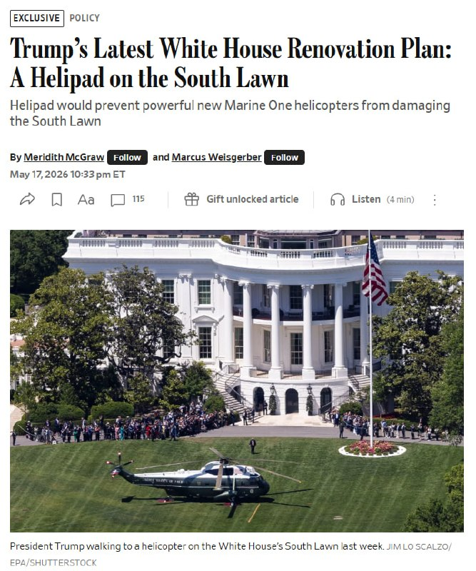

👈 ترامپ در حال بررسی برنامه‌هایی برای نصب یک هلی‌پد در کاخ سفید است تا از آسیب دیدن چمن جنوبی توسط هلیکوپترهای جدید VH-92A پاتریوت که برای پروازهای مارین وان استفاده می‌شوند، جلوگیری شود، گزارش وال استریت ژورنال.

🔴 هلیکوپترهای قدرتمندتر VH-92A دود و هوایی تولید می‌کنند که به اندازه‌ای قوی است که می‌تواند بر چمن تأثیر بگذارد، که این موضوع باعث شده تا نصب یک هلی‌پد اختصاصی در نظر گرفته شود

✅ @AloNews خبر جنگ

## alonews — post 120845

  <a href="telegram/content/alonews_120845_1779108390.mp4">🎬 Download video</a>

👈فیلمی نشان می‌دهد که یک کشتی از ناوگان جهانی صمود به سمت غزه توسط سربازان ارتش اسرائیل تصرف می‌شود

✅ @AloNews خبر جنگ

## alonews — post 120844

  <a href="telegram/content/alonews_120844_1779108391.jpg">🎬 Download video</a>

👈نخست‌وزیر پاکستان: تلاش‌های میانجی‌گرانه برای دستیابی به توافق بین آمریکا و ایران ادامه دارد.

🔴 تمام توان خود را برای تضمین برقراری صلحی پایدار به کار می‌بندیم

✅ @AloNews خبر جنگ

## alonews — post 120843

  <a href="telegram/content/alonews_120843_1779108391.jpg">🎬 Download video</a>

👈ادعای رویترز به نقل از منابع: پاکستان بر اساس توافقنامه دفاع مشترک، ناوگانی از جت‌های جنگنده، هشت هزار سرباز و سامانه دفاع هوایی در عربستان سعودی مستقر کرده است

✅ @AloNews خبر جنگ

## alonews — post 120842

  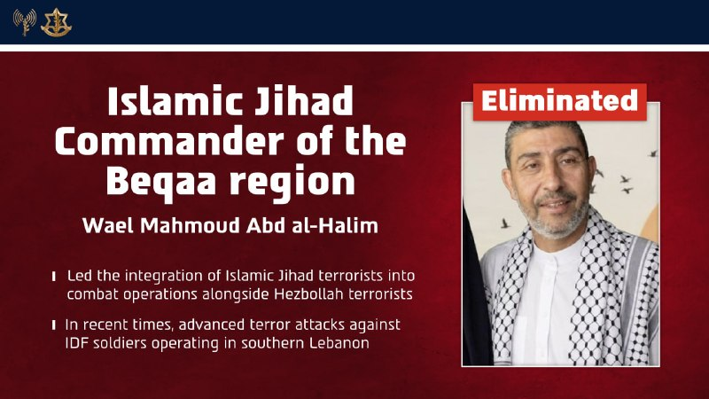

👈ارتش دفاعی اسرائیل تأیید می‌کند که فرمانده ارشد جهاد اسلامی فلسطین، وائل محمود عبدالحلیم، در حمله هوایی اسرائیل به دره بقاع شرقی لبنان در طول شب کشته شده است.

🔴ارتش اسرائیل می‌گوید او به عنوان فرمانده گروه در منطقه بقاع خدمت می‌کرد

✅ @AloNews خبر جنگ

## alonews — post 120841

  <a href="telegram/content/alonews_120841_1779108392.jpg">🎬 Download video</a>

👈کوثری عضو کمیسیون امنیت ملی و سیاست خارجی مجلس: قطعا و یقینا از طریق مذاکره به نتیجه نمی‌رسیم

🔴ترامپ جنگ را باخته و می‌خواهد یک جوری خودش را برنده نشان بدهد

✅ @AloNews خبر جنگ

## alonews — post 120840

  <a href="telegram/content/alonews_120840_1779108392.mp4">🎬 Download video</a>

👈 نمایی از تنگه هرمز از داخل یک هواپیمای مسافربری و کشتی های خاموش

✅ @AloNews خبر جنگ

## alonews — post 120839

  <a href="telegram/content/alonews_120839_1779108393.jpg">🎬 Download video</a>

👈آمریکا در متن جدید خود اسقاط تحریم‌های نفتی ایران را پذیرفته است

🔴تسنیم نوشت: یک منبع نزدیک به تیم مذاکره‌کننده گفت که آمریکایی‌ها برخلاف متون پیشین خود، در متن جدید پذیرفته‌اند که در طول دوره مذاکره، تحریم‌های نفتی ایران را Wave کنند.

🔴 ویو کردن تحریم‌ها به معنای اسقاط موقت تحریم‌هاست

🔴ایران تاکید دارد که لغو همه‌ی تحریم‌های ایران باید جزو تعهدات آمریکا باشد. آمریکا اما اسقاطی اوفک را تا زمان تفاهم نهایی مطرح کرده است.

✅ @AloNews خبر جنگ

## alonews — post 120838

  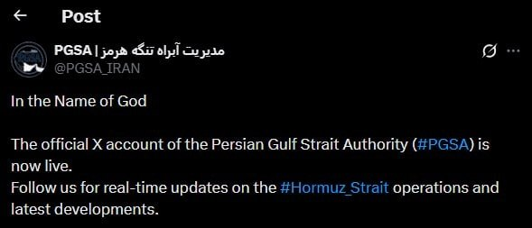

👈در شبکه ایکس یک حساب کاربری جدید به اسم  « مدیریت بر تنگه خلیج فارس» ساخته شد

🔴امروز جمهوری اسلامی از ایجاد نهادی مسئول بر مدیریت تنگه هرمز خبر داده بود

✅ @AloNews خبر جنگ

## alonews — post 120837

  <a href="telegram/content/alonews_120837_1779108394.jpg">🎬 Download video</a>

👈نیویورک‌تایمز: امارات بیش از ۶ میلیون دلار به شرکت مدیریت شهرت «تراکیت» پرداخت کرده تا نتایج جستجوی گوگل را دستکاری کند و گزارش‌های انتقادی درباره «یوسف العتیبه»، سفیر امارات در آمریکا را سرکوب کند

🔴 این گزارش‌ها اتهاماتی درباره ارتباط «العتیبه» با قاچاق جنسی را بررسی می‌کرد

🔴 شرکت «تراکیت» اقدام به ایجاد پروفایل‌های مثبت و ویرایش ویکی پدیا با حساب‌های ناشناس کرد

✅ @AloNews خبر جنگ

## alonews — post 120836

  <a href="telegram/content/alonews_120836_1779108394.jpg">🎬 Download video</a>

👈ادعای رویترز به نقل از منابع: پاکستان بر اساس توافقنامه دفاع مشترک، ناوگانی از جت‌های جنگنده، هشت هزار سرباز و سامانه دفاع هوایی در عربستان سعودی مستقر کرده است

✅ @AloNews خبر جنگ

## alonews — post 120835

  <a href="telegram/content/alonews_120835_1779108394.jpg">🎬 Download video</a>

👈لاوروف: پروژه نیروگاه هسته‌ای بوشهر به هیچ‌کس جز روسیه و ایران تعلق ندارد.

✅ @AloNews خبر جنگ

## alonews — post 120834

  <a href="telegram/content/alonews_120834_1779108394.jpg">🎬 Download video</a>

👈معاون وزیر ارتباطات: باید دسترسی امن مردم به اینترنت پایدار را به رسمیت بشناسیم

✅ @AloNews خبر جنگ

## alonews — post 120833

  <a href="telegram/content/alonews_120833_1779108394.jpg">🎬 Download video</a>

👈حزب الله: ما یک سکوی گنبد آهنین متعلق به ارتش اسرائیل در اردوگاه جنگل های جلیل را با یک پهپاد هدف قرار دادیم.

✅ @AloNews خبر جنگ

<!-- MSG END -->
<!-- NAV START -->
[صفحه قبل](telegram/content/archive_1.md)
<!-- NAV END -->
