# خواننده تلگرام

<!-- MSG START -->

---
📅 بروزرسانی: 1405/02/21 11:51
---

## VahidOOnLine — post 239476

  

علی خزایی، نماینده ورامین در مجلس گفت: «شرایط مدیریت تنگه هرمز هیچ‌گاه مانند گذشته نخواهد شد و این تنگه به وضع سابق بازنمی‌گردد و هیچ شناوری بدون اجازه جمهوری اسلامی حق عبور ندارد.»

او افزود: «شناورهای آمریکا و کشورهای همکار با این کشور، اجازه عبور از تنگه هرمز را نخواهند داشت.»
iranintl
‌🏁 🇬🇧 IranintlTV

🤖 @VahidOOnLine

## VahidOOnLine — post 239475

  <a href="telegram/content/VahidOOnLine_239475_1778487665.mp4">🎬 Download video</a>

سن‌فرانسیسکو| گردهمایی ایرانیان، ۲۰ اردیبهشت
‌🏁 🇬🇧 ManotoTV

🤖 @VahidOOnLine

## VahidOOnLine — post 239474

  

اسماعیل بقائی، سخنگوی وزارت خارجه جمهوری اسلامی گفت: «ما به کشورهای اروپایی صریحا اعلام کردیم که اجازه ندهند وسوسه‌های آمریکا یا اسرائیل در موضوعات منطقه‌ای، آن‌ها را ناخواسته به بحرانی بکشاند که سودی برایشان نخواهد داشت.»

او اضافه کرد: «این آگاهی نسبی در بسیاری از کشورهای اروپایی وجود دارد. آنها مطمئن هستند که این جنگ، جنگی غیرقانونی، غیراخلاقی و تجاوزکارانه بوده است. به همین دلیل، اجازه ندادند فشارهای آمریکا آنان را به‌طور علنی بخشی از این اقدام غیرقانونی و مخرب صلح و امنیت بین‌المللی کند.»
‌🏁 🇬🇧 IranintlTV

🤖 @VahidOOnLine

## VahidOOnLine — post 239473

  

عباس مقتدایی، نایب‌رییس کمیسیون امنیت ملی مجلس، گفت که اگر آمریکا بخواهد بر «تخیلات» خود علیه منافع جمهوری اسلامی اصرار بورزد، «تاوان سختی» برای این لجاجت در شهرهای آمریکا خواهد پرداخت.

او افزود نیروهای مسلح جمهوری اسلامی «مدیریت هوشمند» تنگه هرمز را برای مقابله با «زیاده‌خواهی دشمنان» در دست گرفتند و اگر لازم باشد، برای عبور و مرور کشتی‌ها عوارض دریافت خواهند کرد.

نایب‌رییس کمیسیون امنیت ملی مجلس گفت برخی کشورهای منطقه با در اختیار قرار دادن خاک خود، با آمریکا و اسرائیل در حمله به ما همکاری کردند و جمهوری اسلامی در دفاع از خود «هر اقدامی» در برابر دشمنی آنها انجام می‌دهد.
iranintl
‌🏁 🇬🇧 IranintlTV

🤖 @VahidOOnLine

## VahidOOnLine — post 239472

  

اسماعیل بقائی، سخنگوی وزارت خارجه جمهوری اسلامی، در خصوص پاسخ تهران به پیشنهاد واشینگتن برای خاتمه جنگ گفت: «هرچه در متن پیشنهاد کردیم معقول و سخاوتمندانه بود. نه‌تنها برای منافع ملی ایران بلکه برای خیر و صلاح منطقه و جهان اما طرف‌های آمریکایی همچنان بر خواسته‌های نامعقول خود پافشاری می‌کنند.»

او افزود: «جمهوری اسلامی ثابت کرده قدرت مسئولیت‌پذیر در منطقه است. ما قلدر نیستیم؛ قلدرستیز هستیم.» او ادامه داد: «پیشنهاد ما برای تردد ایمن در تنگه هرمز آیا زیاده خواهانه است؟ موضوع مهمی همچون برقراری صلح و امنیت در تمام منطقه غیرمسئولانه است؟»

پیش‌تر دونالد ترامپ پیشنهاد جمهوری اسلامی را «غیرقابل قبول» خوانده بود.
iranintl
‌🏁 🇬🇧 IranintlTV

🤖 @VahidOOnLine

## VahidOOnLine — post 239471

  

♦️ علی مطهری، عضو پیشین مجلس شورای اسلامی و همسر خواهر برادران لاریجانی شامگاه یکشنبه ۲۰ اردیبهشت در گفتگو با ایرنا درباره آخرین دیدار با علی لاریجانی، دبیر پیشین شورای عالی امنیت ملی حکومت ایران صحبت کرد.

مطهری گفت  حدود یک ماه قبل  از کشته شدن علی لاریجانی او به همراه مرتضی فرزندش به طور سرزده به منزل ما آمدند و حدود دو ساعت نشستیم و صحبت کردیم... احساس کردم ایشان از سبک زندگی که با استتار، تغییر مداوم مکان و رفت و آمد همراه بود، کمی خسته شده بودند و برای استراحت، گپ زدن و شاید تبادل نظر آمده بودند.

علی مطهری گفت: «جالب اینکه وقتی می‌خواستند خداحافظی کنند، همسرم به آقای لاریجانی گفت که طبقه بالای ما تقریبا خالی است و می‌توانند آنجا بیایند. من با شوخی گفتم: نه، تو رو خدا نیایید اینجا، همه ما با هم کشته می‌شویم. ایشان خنده‌ عمیقی کردند.»
‌🇸🇦 Indypersian

🤖 @VahidOOnLine

## VahidOOnLine — post 239470

  <a href="telegram/content/VahidOOnLine_239470_1778487668.mp4">🎬 Download video</a>

ویدیوهای رسیده به ایران‌اینترنشنال نشان می‌دهند ایرانیان مقیم اسپانیا و یونان، یکشنبه ۲۰ اردیبهشت در تجمع‌های اعتراضی برگزارشده در شهرهای مادرید و آتن، علیه جمهوری اسلامی پرفورمنس اعتراضی برگزار کردند.
‌🏁 🇬🇧 IranintlTV

🤖 @VahidOOnLine

## VahidOOnLine — post 239469

  <a href="telegram/content/VahidOOnLine_239469_1778487670.mp4">🎬 Download video</a>

ونکوور| راهمپیمایی ایرانیان در حمایت از مردم ایران، ۲۰ اردیبهشت
‌🏁 🇬🇧 ManotoTV

🤖 @VahidOOnLine

## VahidOOnLine — post 239468

  <a href="telegram/content/VahidOOnLine_239468_1778487671.mp4">🎬 Download video</a>

بر اساس ویدیوهای رسیده به ایران‌اینترنشنال، ایرانیان مقیم کانادا روز یکشنبه در پی فراخوان شاهزاده رضا پهلوی و علیه اعدام‌های جمهوری اسلامی، در اتاوا و ونکوور تجمع کردند.
‌🏁 🇬🇧 IranintlTV

🤖 @VahidOOnLine

## VahidOOnLine — post 239467

  <a href="telegram/content/VahidOOnLine_239467_1778487673.mp4">🎬 Download video</a>

پایگاه تحلیل تصاویر ماهواره‌ای «سور اطلس» اعلام کرد تصاویر ماهواره‌ای ظاهرا یک نفتکش بزرگ را در تنگه هرمز نشان می‌دهد که پس از یک حمله، ردی از نفت در آب برجای گذاشته است. در این تصاویر همچنین رفت‌وآمد گسترده قایق‌های تندرو کوچک در نزدیکی نفتکش دیده می‌شود.

وب‌سایت «تنکر ترکرز» این نفتکش را ابرنفتکش «باراکا» (برکت) معرفی کرده و نوشته است که این شناور متعلق به شرکت ملی نفت ابوظبی، ادنوک، است. به گفته این نهاد ردیابی نفتکش‌ها، باراکا روز ۱۴ اردیبهشت هدف پهپادهای جمهوری اسلامی قرار گرفت و در زمان حمله، پس از یک انتقال محرمانه محموله به نفتکشی دیگر در شرق امارات، خالی از نفت بوده است.
‌🏁 🇬🇧 ManotoTV

🤖 @VahidOOnLine

## VahidOOnLine — post 239466

  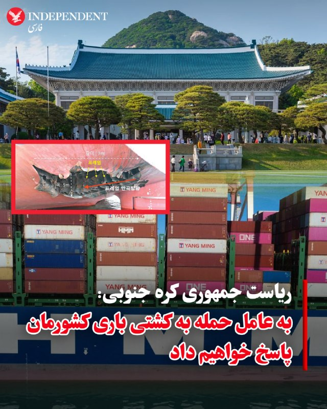

♦️ کاخ آبی، دفتر ریاست جمهوری کره جنوبی روز دوشنبه ۲۱ اردیبهشت ماه با تائید خبر حمله به یکی ازکشتی‌‌ها باری این کشور در تنگه هرمز اعلام کرد به «برنامه دارد تا به عامل این تهاجم» پاسخ دهد.

به گزارش خبرگزاری رویترز در بیانیه ریاست جمهوری کره جنوبی آمده است برخورد یک «پرتابه به کشتی باری اچ‌ام‌ام نامو/ HMM NAMU را به شدت محکوم می‌کند اما در این مرحله از تحقیقات هنوز معلوم نیست این پرتابه از کجا شلیک شده و آیا ایران در آن نقشی داشته است یا نه.»

ساعاتی پیش وزارت خارجه کره‌جنوبی روز یکشنبه اعلام کرده بود که کشتی باری متعلق به این کشور که پیشتر در تنگه هرمز دچار حادثه شده بود،  هدف حمله «هواگردهای ناشناس» قرار گرفته است.
پارک ایل، سخنگوی وزارت خارجه کره‌جنوبی، در یک نشست خبری گفت دو هواگرد ناشناس بخش بیرونی مخزن تعادل سمت چپ در قسمت عقب کشتی «اچ‌ام‌ام نامو» را با فاصله حدود یک دقیقه هدف قرار دادند که در پی آن آتش و دود ایجاد شد.
او بدون اشاره به نوع این هواگردها گفت تصاویر آن‌ها در دوربین‌های مداربسته ثبت شده، اما «محدودیت‌هایی برای شناسایی دقیق نوع، مبدا پرتاب و اندازه فیزیکی این اشیا وجود دارد.»
به گفته مقام‌های کره‌جنوبی، بررسی‌های بیشتری روی بقایای موتور و دیگر قطعات به‌جا مانده انجام خواهد شد.
سخنگوی وزارت خارجه کره‌جنوبی افزود آسیب وارد شده به این کشتی باری که ۲۴ خدمه در آن حضور داشتند، حدود پنج متر عرض داشته و تا حدود هفت متر در بدنه کشتی در بخش عقب سمت چپ امتداد یافته است.
او همچنین گفت آتش‌سوزی در اتاق موتور احتمالا در اثر نخستین حمله آغاز شده و حمله دوم باعث گسترش سریع آتش شده است.
دولت کره‌جنوبی روز دوشنبه ۱۴ اردیبهشت اعلام کرد در حال بررسی اطلاعاتی است که نشان می‌دهد یک کشتی با پرچم این کشور در تنگه هرمز هدف حمله قرار گرفته است.
دونالد ترامپ، رئیس‌جمهوری آمریکا، پس از این حادثه گفت ایران به این کشتی با پرچم پاناما «شلیک‌هایی» انجام داده و از کره‌جنوبی خواست به عملیات آمریکا برای بازگرداندن امنیت کشتیرانی در تنگه هرمز بپیوندد.
جمهوری اسلامی دخالت در این حمله را رد کرده است. سفارت ایران در سئول در بیانیه‌ای اعلام کرد تهران «هرگونه ادعا درباره دخالت نیروهایش» را قاطعانه تکذیب می‌کند.
‌🇸🇦 Indypersian

🤖 @VahidOOnLine

## VahidOOnLine — post 239465

  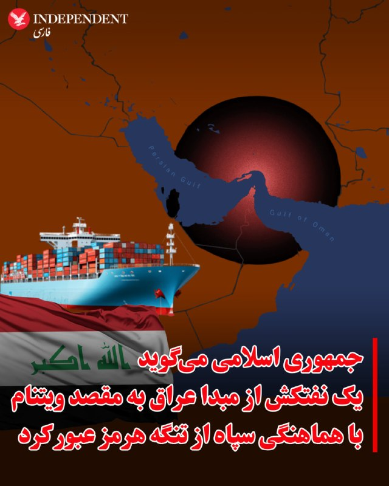

♦️خبرگزاری تسنیم، وابسته به سپاه پاسداران روز دوشنبه ۲۱ اردیبهشت‌ماه از عبور یک نفت‌کش حامل نفت خام عراق از تنگه هرمز خبر داد.

براساس این گزارش، «یک فروند نفتکش وی‌ال‌سی‌سی (VLCC) به نام  «آگوس  فانوریوس ۱/AGOIS FANOURIOS I» روز یکشنبه  ۲۰ اردیبهشت از مسیر تعیین‌شده ایران در تنگه هرمز عبور کرد.»

تسنیم گزارش کرده است این نفتکش حامل نفت خام عراق، به سمت ویتنام حرکت می‌کند.

هفته گذشته و همزمان با تشدید درگیری‌ها میان نیروهای دریایی آمریکا و جمهوری اسلامی در تنگه هرمز، گزارش‌ها از توقف کامل تردد میان خلیج فارس و دریای عمان حکایت داشت.
‌🇸🇦 Indypersian

🤖 @VahidOOnLine

## VahidOOnLine — post 239464

  <a href="telegram/content/VahidOOnLine_239464_1778487675.mp4">🎬 Download video</a>

قوه قضاییه جمهوری اسلامی اعلام کرد حکم اعدام عرفان شکورزاده به اتهام همکاری با سرویس اطلاعاتی آمریکا و موساد اجرا شده است. خبرگزاری قوه قضاییه، او را به ارتباط با دو نهاد اطلاعاتی خارجی و انتقال اطلاعات طبقه‌بندی‌شده متهم کرده است.

رسانه‌های حقوق بشری و منتقد جمهوری اسلامی پیش‌تر درباره خطر اجرای حکم اعدام او هشدار داده و نوشته بودند که شکورزاده دانشجوی کارشناسی ارشد مهندسی هوافضا و فناوری ماهواره در دانشگاه علم و صنعت بوده است.
‌🏁 🇬🇧 ManotoTV

🤖 @VahidOOnLine

## VahidOOnLine — post 239463

  <a href="telegram/content/VahidOOnLine_239463_1778487676.mp4">🎬 Download video</a>

بریتانیا و فرانسه امروز دوشنبه میزبان نشستی با حضور بیش از ۴۰ کشور خواهند بود تا درباره میزان مشارکت نظامی آنها در ماموریت اروپایی اسکورت کشتی‌ها در تنگه هرمز گفت‌وگو شود.

این ماموریت قرار است پس از برقراری یک آتش‌بس پایدار آغاز شود و هدف آن همراهی کشتی‌های تجاری در عبور از تنگه هرمز است. بلومبرگ نوشت کشورهای شرکت‌کننده قرار است درباره توانایی‌هایی مانند مین‌روبی، اسکورت دریایی و گشت هوایی گفت‌وگو کنند.

بریتانیا پیش‌تر ناوشکن «اچ‌ام‌اس دراگون» را برای آمادگی در یک ماموریت احتمالی در خاورمیانه اعزام کرده و فرانسه نیز ناوگروه «شارل دوگل» را به دریای سرخ فرستاده است.
‌🏁 🇬🇧 ManotoTV

🤖 @VahidOOnLine

## VahidOOnLine — post 239462

  <a href="telegram/content/VahidOOnLine_239462_1778487676.mp4">🎬 Download video</a>

فرماندهی مرکزی ارتش آمریکا اعلام کرد تفنگداران دریایی ایالات متحده روز ۱۸ اردیبهشت، در جریان تمرینی روی عرشه ناو آبی‌خاکی «یواس‌اس تریپولی»، از یک بالگرد «سی‌هاوک» فرود آمدند.

سنتکام گفت این تمرین برای حفظ آمادگی تفنگداران دریایی انجام شده است تا در صورت لزوم، برای ورود به کشتی‌هایی که در جریان انسداد دریایی آمریکا علیه ایران از دستورها تبعیت نمی‌کنند، به کار گرفته شوند.
‌🏁 🇬🇧 ManotoTV

🤖 @VahidOOnLine

## VahidOOnLine — post 239461

  <a href="telegram/content/VahidOOnLine_239461_1778487677.mp4">🎬 Download video</a>

روزنامه گاردین استرالیا در گزارشی نوشت اسحاق قالیباف، پسر محمدباقر قالیباف برای چند سال در ملبورن زندگی و تحصیل کرده و در همین مدت با بازار ملک و دانشگاه ملبورن ارتباط داشته است. بر اساس این گزارش، اسحاق قالیباف با وجود رد شدن درخواست ویزای او در کانادا، توانسته بود اقامت موقت بلندمدت در استرالیا بگیرد.

گاردین نوشته اسحاق قالیباف از اوایل سال ۲۰۱۴ وارد ملبورن شد، ابتدا دوره زبان و دوره مقدماتی گذراند و سپس از سال ۲۰۱۵ تا ۲۰۱۸ در رشته مهندسی در دانشگاه ملبورن تحصیل کرد. بر اساس مدارکی که او در پرونده مهاجرتی خود در دادگاه فدرال کانادا ارائه کرده بود، او در سال‌های ۲۰۱۶ تا ۲۰۱۸ به‌عنوان دستیار پژوهشی در مرکز زیرساخت‌های داده‌های مکانی و مدیریت زمین دانشگاه ملبورن کار کرده است.

به نوشته گاردین، اسحاق قالیباف در سال ۲۰۲۲ در یک استشهادیه گفته بود تا پایان سپتامبر همان سال اقامت موقت استرالیا داشته، اما به‌دلیل انتظار برای دریافت اقامت دائم کانادا، برای تبدیل آن به اقامت دائم استرالیا اقدام نکرده است. کانادا در نهایت در فوریه ۲۰۲۴ درخواست اقامت دائم او را رد کرد.
‌🏁 🇬🇧 ManotoTV

🤖 @VahidOOnLine

## VahidOOnLine — post 239460

  <a href="telegram/content/VahidOOnLine_239460_1778487677.mp4">🎬 Download video</a>

بر اساس تصاویر و گزارش‌های منتشرشده، یک مرد در پایان تجمع ایرانیان در ریچموندهیل، در شمال تورنتو، با خودروی خود به چند خودرو برخورد کرد و به گفته شاهدان، پس از آن پرچم جمهوری اسلامی را از خودرو بیرون آورد و تکان داد. این تجمع روز یکشنبه ۲۰ اردیبهشت برگزار شده بود.

در گزارش‌های منتشرشده آمده است که این مرد پس از برخورد با چند خودرو و دست‌کم یک نفر، توسط ماموران پلیس بازداشت شد.
‌🏁 🇬🇧 ManotoTV

🤖 @VahidOOnLine

## VahidOOnLine — post 239459

  

خبرگزاری تسنیم، وابسته به سپاه پاسداران، گزارش داد یک نفتکش وی‌ال‌سی‌سی به نام «آگویس فانوریوس ۱» که حامل نفت خام عراق است، یکشنبه با هماهنگی تهران و از مسیر تعیین‌شده از سوی جمهوری اسلامی در تنگه هرمز عبور کرد.
‌🏁 🇬🇧 IranintlTV

🤖 @VahidOOnLine

## VahidOOnLine — post 239458

  

♦️ سازمان حفاظت محیط زیست ایران روز دوشنبه ۲۱ اردیبهشت ماه اعلام کرد لکه بزرگ مشاهده شده در آب‌های خلیج فارس در نزدیکی جزیره خارگ ناشی از تخلیه آب آلوده توازن یک نفت‌کش آسیب دیده بوده است.

پیش از این رسانه‌های بین‌المللی با استناد به تصاویر ماهواره‌ای گزارش کرده بودند که احتمال دارد یک لکه نفتی ناشی از آسیب دیدن نفت‌کش‌ها در نزدیکی جزیره خارگ به‌وجود آمده باشد. مقام‌های جمهوری اسلامی این گزارش را رد کردند.

رسانه‌های ایران به نقل از سازمان حفاظت محیط زیست گزارش کردند:
«هیچگونه نشت نفت از خطوط لوله، تاسیسات پایانه‌های نفتی و یا سکوهای متعلق به شرکت نفت فلات قاره ایران در جزیره خارگ مشاهده یا گزارش نشده است.»
‌🇸🇦 Indypersian

🤖 @VahidOOnLine

## VahidOOnLine — post 239457

  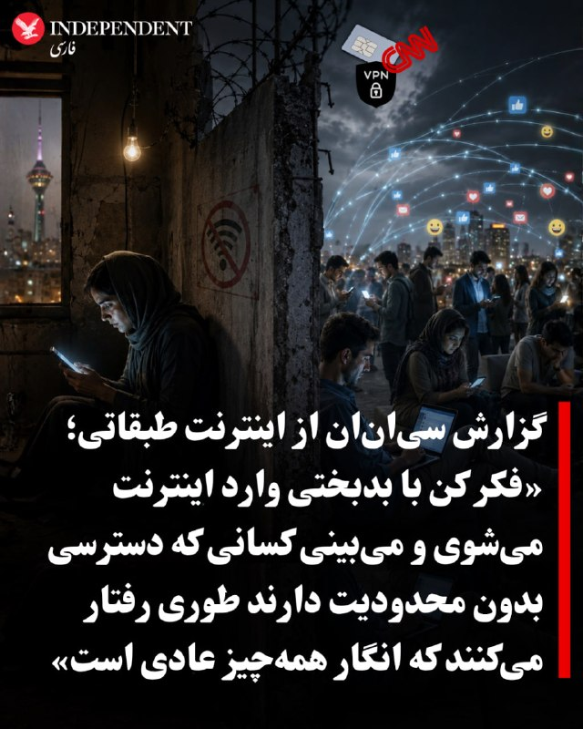

⭕️گزارش سی‌ان‌ان از اینترنت طبقاتی؛ «فکر کن با بدبختی وارد اینترنت می‌شوی و می‌بینی کسانی که دسترسی بدون محدودیت دارند طوری رفتار می‌کنند که انگار همه‌چیز عادی است»

♦️سی‌ان‌ان در گزارشی میدانی با اشاره قطع اینترنت و رواج اینترنت طبقاتی در ایران می‌نویسد، قطع اینترنت در ایران اکنون بیش از دو ماه ادامه داشته و طولانی‌ترین اختلال ثبت‌شده تاکنون به‌شمار می‌رود.

برای میلیون‌ها نفری که زندگی و درآمدشان به اینترنت وابسته است، این وضعیت ویرانگر بوده است. فراز، ساکن ۳۸ ساله تهران، به سی‌ان‌ان گفت: «تصور کنید با بیکاری و تورم دیوانه‌کننده دست‌وپنجه نرم می‌کنید و به ترتیبی موفق می‌شوید ۵۰۰ هزار تا یک میلیون تومان جور کنید، فقط برای خرید چند گیگابایت وی‌پی‌ان تا بتوانید وارد اکس یا پلتفرم‌های دیگر شوید، خبرها را ببینید و صدایی داشته باشید.»

او افزود: «بعد وسط همه این استرس و خشم، وقتی بالاخره موفق می‌شوی اکس یا تلگرام را باز کنی، می‌بینی کسانی که دسترسی بدون محدودیت دارند طوری رفتار می‌کنند که انگار همه‌چیز عادی است؛ واقعا مثل مشت به سینه آدم می‌ماند.»

متوسط حقوق ماهانه در ایران بین ۲۰ تا ۳۵ میلیون تومان برآورد می‌شود. سی‌ان‌ان می‌نویسد، اینترنت پرو، شکاف عظیم میان فقیر و غنی را عمیق‌تر کرده است.

وب‌سایت «خبرآنلاین» نوشت این طرح «جامعه ایران را به دو طبقه متمایز تقسیم کرده است: نخبگان دیجیتال که از اینترنت سریع و بدون فیلتر برای تجارت، آموزش و ارتباطات بهره‌مندند، و رعایای دیجیتال که در محدودیت شدید، سرعت پایین و هزینه‌های سنگین بازار سیاه وی‌پی‌ان گرفتار شده‌اند.»

قیمت وی‌پی‌ان‌های بازار سیاه به‌شدت افزایش یافته و بر اساس اعلام سازمان «فعالان حقوق بشر در ایران» مستقر در خارج از کشور، قطع اینترنت طی دو ماه گذشته حدود ۱.۸ میلیارد دلار به ایرانیان خسارت زده است؛ رقمی که با برآورد اتاق بازرگانی ایران نیز همخوانی دارد.

روزنامه اطلاعات نوشت: «قطع اینترنت ــ که خود منبع درآمد شمار بسیار زیادی از کسب‌وکارهای مجازی بود ــ وضعیت بحرانی و پیچیده‌ای ایجاد کرده است.»گزارش‌های داخل ایران نشان می‌دهد «اینترنت پرو» از طریق «فهرست سفید» در سطح اپراتورهای مخابراتی و بر پایه «سیم‌کارت‌های سفید» عمل می‌کند؛ یعنی برخی سیم‌کارت‌ها، حساب‌های موبایل یا نهادها از سیستم فیلترینگ کشور مستثنا می‌شوند.

برخلاف وی‌پی‌ان که با رمزگذاری ترافیک اینترنت سانسور را دور می‌زند، «اینترنت پرو» ظاهرا کاربران تاییدشده را از مسیرهایی با محدودیت کمتر عبور می‌دهد. گفته می‌شود دارندگان سیم‌کارت سفید همچنان به اینترنت جهانی کامل دسترسی دارند.

بر اساس گزارش‌ها، هزینه اینترنت پرو برای بسته سالانه ۵۰ گیگابایتی حدود دو میلیون تومان است، علاوه بر هزینه فعال‌سازی ۲.۸ میلیون تومانی و حدود ۴۰ هزار تومان برای هر گیگابایت اضافی. در مقابل، اینترنت عادی ــ که اکنون به‌شدت محدود شده ــ هر گیگابایت حدود ۸ هزار تومان هزینه دارد و همین باعث شده بسیاری ناچار به استفاده از وی‌پی‌ان شوند.
‌🇸🇦 Indypersian

🤖 @VahidOOnLine

## mwarmonitor — post 8871

🇺🇸مسافران آمریکایی کشتی تفریحی که به هانتاویروس دچار شده بود — از جمله یک نفر که احتمالاً آزمایش مثبت دارد — برای انجام ارزیابی‌های پزشکی وارد ایالت نبراسکا شدند. CNN

@mwarmonitor

## mwarmonitor — post 8870

  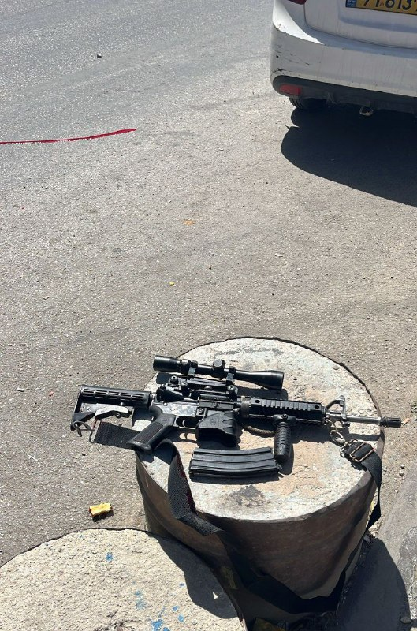

🔴 کرانه باختری: یک تروریست مسلح پس از تلاش برای تیراندازی به نیروهای پلیس مرزی اسرائیل، از پا درآمد.

@mwarmonitor

## mwarmonitor — post 8869

🇨🇳🇺🇸چین اعلام کرد که در یک عملیات مشترک با ایالات متحده، یک شبکه فرامرزی قاچاق مواد مخدر را منهدم کرده است. Bloomberg

@mwarmonitor

## pm_afshaa — post 90534

🔴به گفته GB News، نخست‌وزیر بریتانیا کیر استارمر «به نظر می‌رسد این هفته استعفا دهد

💧 Rainbet.com the #1 Non-KYC Crypto Casino & Sportsbook @rainbetcom

😁 @Pm_Afshaa

## pm_afshaa — post 90533

10 گیگ 2560 5 گیگ 1440 فقط تا ساعت 24 امروز با سرعت موشک بدون قطعی

## pm_afshaa — post 90532

10 گیگ 2560 5 گیگ 1440 فقط تا ساعت 24 امروز با سرعت موشک بدون قطعی

## pm_afshaa — post 90531

فقط تا ساعت 24 امشب رو این قیمتا 20% تخفیف گذاشتم هر کی خواست میتونه از طریق دایرکت خرید کنه

## pm_afshaa — post 90530

🔴بلومبرگ: ترامپ قصد دارد در سفر به چین، شی جین‌پینگ را در ارتباط با فروش تسلیحات و خرید نفت از ایران تحت فشار قرار دهد

💧 Rainbet.com the #1 Non-KYC Crypto Casino & Sportsbook @rainbetcom

😁 @Pm_Afshaa

## pm_afshaa — post 90529

  

کانفینگ با سرعت موشک شارژ کردم هر کی خواست بیاد دایرکت چنل هم پرداخت ریالی داریم هم ارزی 5 گیگ 1800 10 گیگ 3200

## pm_afshaa — post 90528

  

با اذان صبح امروز عرفان شکورزاده 29 ساله و نخبه ی دانشگاه علم و صنعت توسط جمهوری اسلامی امروز اعدام شد

💧 Rainbet.com the #1 Non-KYC Crypto Casino & Sportsbook @rainbetcom

😁 @Pm_Afshaa

## pm_afshaa — post 90527

🔴زیردریایی آلاسکا از کلاس اوهایو معروف به سلاح روز قیامت برای بازدارندگی آمریکا وارد منطقه شد

💧 Rainbet.com the #1 Non-KYC Crypto Casino & Sportsbook @rainbetcom

😁 @Pm_Afshaa

## mamlekate — post 103501

  <a href="telegram/content/mamlekate_103501_1778487682.mp4">🎬 Download video</a>

تصاویر ماهواره‌ای یک نفتکش بزرگ را در تنگه هرمز نشان می‌دهند که بنظر می‌رسد پس از یک حمله احتمالی، ردی از نفت را نشت می‌دهد. فعالیت قایق‌های تندرو کوچک نیز در نزدیکی آن دیده می‌شود. [شنبه ۱۹ اردیبهشت]
SoarAtlas

📝 بریتانیا و فرانسه نشستی چندملیتی برای بازگرداندن جریان تجارت در تنگه هرمز برگزار می‌کنند

📝 سازمان حفاظت محیط‌زیست وجود آلودگی آب در اطراف خارک را تأیید کرد

در حالی که پیشتر مقامات جمهوری اسلامی آلودگی آب‌های اطراف جزیره خارک را تکذیب کرده بودند، سازمان حفاظت محیط‌زیست ایران، وجود این آلودگی را تأیید و اعلام کرد که ناشی از «نشت آب توازن یک نفتکش» بوده است.

@mamlekate

## mamlekate — post 103500

📝 گاردین از سرمایه‌گذاری پسر قالیباف در بازار املاک استرالیا خبر داد

روزنامه گاردین در گزارشی از ارتباط اسحاق قالیباف، پسر رییس مجلس جمهوری اسلامی، با یک مرکز پژوهشی در دانشگاه ملبورن و سرمایه‌گذاری او در حوزه املاک در استرالیا خبر داد. به نوشته این روزنامه، او از طریق اجاره دادن دست‌کم یک ملک در این کشور کسب درآمد می‌کرده است.

@mamlekate

## VahidOnline — post 75393

  

خبرگزاری میزان، رسانه قوه قضاییه جمهوری اسلامی، صبح دوشنبه، ۲۱ اردیبهشت از اجرای حکم اعدام عرفان شکورزاده، زندانی سیاسی، با اتهام «همکاری با سرویس‌های اطلاعاتی آمریکا و اسرائیل» خبر داد.
شکورزاده بهمن‌ماه ۱۴۰۳ از سوی اطلاعات سپاه با اتهام «جاسوسی و همکاری با کشورهای متخاصم» بازداشت و به اعدام محکوم شد و حکم صادر شده علیه او به‌تازگی در دیوان عالی کشور تایید شده بود.
@VahidOOnLine

📡 @VahidOnline

## IranIntlTV — post 336611

یک شهروند با ارسال پیام صوتی به ایران‌اینترنشنال می‌گوید مدرس کاشت ناخن است و کسب‌وکار او به مشکل خورده: «شغل ما را غیرضروری دانسته‌اند و دستگاه کارتخوان‌مان را قطع کردند.»

## IranIntlTV — post 336610

  

علی خزایی، نماینده ورامین در مجلس گفت: «شرایط مدیریت تنگه هرمز هیچ‌گاه مانند گذشته نخواهد شد و این تنگه به وضع سابق بازنمی‌گردد و هیچ شناوری بدون اجازه جمهوری اسلامی حق عبور ندارد.»

او افزود: «شناورهای آمریکا و کشورهای همکار با این کشور، اجازه عبور از تنگه هرمز را نخواهند داشت.»
iranintl.com/202605117967

## IranIntlTV — post 336609

  <a href="telegram/content/IranIntlTV_336609_1778487684.mp4">🎬 Download video</a>

دونالد ترامپ پاسخ جمهوری اسلامی به آمریکا را «کاملا غیر قابل قبول» ارزیابی کرد. همزمان تسنیم، خبرگزاری وابسته به سپاه به نقل از یک منبع مطلع نوشت تهران برای خوشایند ترامپ، طرح نمی‌نویسد.

مرتضی کاظمیان، عضو تحریریه ایران‌اینترنشنال، از دو راهی تسلیم یا تغییر رژیم برای جمهوری اسلامی می‌گوید

@iranintltv

## IranIntlTV — post 336608

  <a href="telegram/content/IranIntlTV_336608_1778487686.mp4">🎬 Download video</a>

بنیامین نتانیاهو، نخست‌وزیر اسرائیل، تغییر حکومت در ایران را ممکن دانست ولی گفت این موضوع تضمین‌ شده‌ نیست. او به ضرورت مهار برنامه هسته‌ای، نیروهای نیابتی و برنامه موشکی جمهوری اسلامی اشاره کرد و گفت این جنگ هنوز تمام نشده‌ است.

گفت‌وگو با مئیر جاودانفر، تحلیل‌گر مسائل اسرائیل

@iranintltv

## IranIntlTV — post 336607

  

اسماعیل بقائی، سخنگوی وزارت خارجه جمهوری اسلامی گفت: «ما به کشورهای اروپایی صریحا اعلام کردیم که اجازه ندهند وسوسه‌های آمریکا یا اسرائیل در موضوعات منطقه‌ای، آن‌ها را ناخواسته به بحرانی بکشاند که سودی برایشان نخواهد داشت.»

او اضافه کرد: «این آگاهی نسبی در بسیاری از کشورهای اروپایی وجود دارد. آنها مطمئن هستند که این جنگ، جنگی غیرقانونی، غیراخلاقی و تجاوزکارانه بوده است. به همین دلیل، اجازه ندادند فشارهای آمریکا آنان را به‌طور علنی بخشی از این اقدام غیرقانونی و مخرب صلح و امنیت بین‌المللی کند.»
https://iranintl.com/202605110407

## IranIntlTV — post 336606

  

عباس مقتدایی، نایب‌رییس کمیسیون امنیت ملی مجلس، گفت که اگر آمریکا بخواهد بر «تخیلات» خود علیه منافع جمهوری اسلامی اصرار بورزد، «تاوان سختی» برای این لجاجت در شهرهای آمریکا خواهد پرداخت.

او افزود نیروهای مسلح جمهوری اسلامی «مدیریت هوشمند» تنگه هرمز را برای مقابله با «زیاده‌خواهی دشمنان» در دست گرفتند و اگر لازم باشد، برای عبور و مرور کشتی‌ها عوارض دریافت خواهند کرد.

نایب‌رییس کمیسیون امنیت ملی مجلس گفت برخی کشورهای منطقه با در اختیار قرار دادن خاک خود، با آمریکا و اسرائیل در حمله به ما همکاری کردند و جمهوری اسلامی در دفاع از خود «هر اقدامی» در برابر دشمنی آنها انجام می‌دهد.
iranintl.com/202605116225

## IranIntlTV — post 336605

  

اسماعیل بقائی، سخنگوی وزارت خارجه جمهوری اسلامی، در خصوص پاسخ تهران به پیشنهاد واشینگتن برای خاتمه جنگ گفت: «هرچه در متن پیشنهاد کردیم معقول و سخاوتمندانه بود. نه‌تنها برای منافع ملی ایران بلکه برای خیر و صلاح منطقه و جهان اما طرف‌های آمریکایی همچنان بر خواسته‌های نامعقول خود پافشاری می‌کنند.»

او افزود: «جمهوری اسلامی ثابت کرده قدرت مسئولیت‌پذیر در منطقه است. ما قلدر نیستیم؛ قلدرستیز هستیم.» او ادامه داد: «پیشنهاد ما برای تردد ایمن در تنگه هرمز آیا زیاده خواهانه است؟ موضوع مهمی همچون برقراری صلح و امنیت در تمام منطقه غیرمسئولانه است؟»

پیش‌تر دونالد ترامپ پیشنهاد جمهوری اسلامی را «غیرقابل قبول» خوانده بود.
iranintl.com/202605116908

## IranIntlTV — post 336604

  

🔻خبرگزاری میزان، رسانه قوه قضاییه جمهوری اسلامی، از توقیف بخشی از املاک منتسب به علی کریمی، بازیکن پیشین تیم ملی فوتبال و از چهره‌های مخالف جمهوری اسلامی خبر داد و نوشت یکی از املاک شناسایی‌شده، یک پلاک ثبتی به نام هاوش، فرزند او، شامل دو واحد تجاری و چهار واحد مسکونی، است.

🔹براساس اطلاعیه منتشرشده از سوی قوه قضاییه جمهوری اسلامی، با استعلام از سازمان ثبت اسناد و املاک کشور، برخی املاک علی کریمی که به گفته قوه قضاییه جمهوری اسلامی «سعی در اختفای آن‌ها شده بود» شناسایی و توقیف شد.

🔹پیش‌تر نیز قوه قضاییه جمهوری اسلامی از توقیف اموال علی دایی، علی کریمی، مسعود شجاعی، زهرا قنبری و علیرضا فغانی به‌دلیل مخالفت با جمهوری اسلامی خبر داده بود.

@iranintltvsport

## IranIntlTV — post 336603

  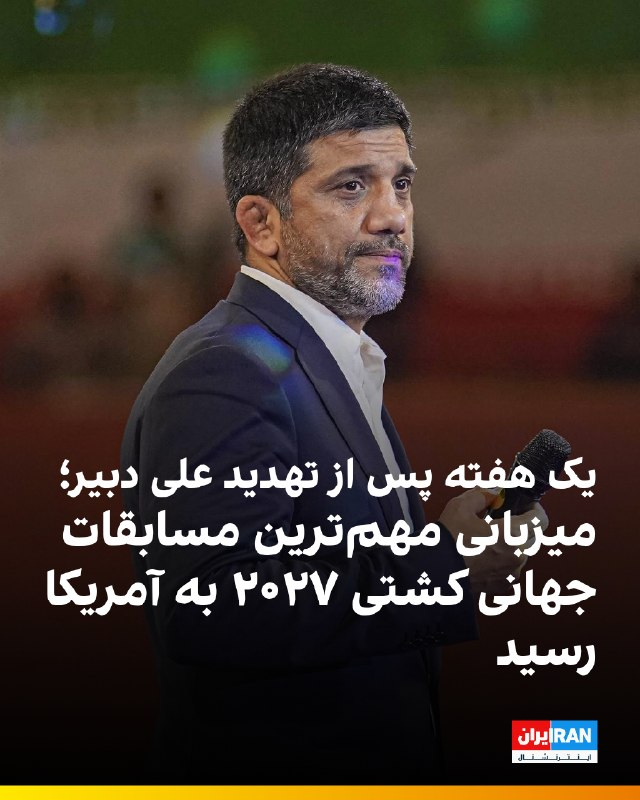

🔻اتحادیه جهانی کشتی اعلام کرد که مسابقات قهرمانی بزرگسالان جهان از ۱۱ تا ۱۹ سپتامبر ۲۰۲۷ در لاس‌وگاس برگزار خواهد شد. این رقابت‌ها نخستین مرحله انتخابی بازی‌های المپیک ۲۰۲۸ لس‌آنجلس نیز خواهد بود.

🔹اعطای میزبانی مهم‌ترین رویداد کشتی سال ۲۰۲۷ به آمریکا در حالی انجام شد که علیرضا دبیر، رییس فدراسیون کشتی، تهدید کرده بود اگر آمریکا با تیم ملی کشتی زیر ۲۳ سال ایران رفتاری مشابه تیم ملی فوتبال داشته باشد، تلاش می‌کند با همکاری «کشورهای صاحب کشتی» میزبانی مسابقات جهانی ۲۰۲۷ را از آمریکا بگیرد.

🔹آمریکا در سال‌های اخیر برای برخی ورزشکاران، اعضا و همراهان تیم‌های ملی کشتی ایران، از جمله علیرضا دبیر، ویزا صادر نکرده است. از سوی دیگر، ابهام‌هایی درباره صدور ویزا برای اعضای تیم ملی فوتبال ایران مطرح شده است.

🔹مارکو روبیو، وزیر خارجه آمریکا، گفته است ایالات متحده با حضور تیم ملی فوتبال ایران در مسابقات جام جهانی در این کشور مخالفتی ندارد، اما درباره همراهان تیم گفته است: «آن‌ها نمی‌توانند یک مشت «تروریست» عضو سپاه را به‌عنوان روزنامه‌نگار یا مربی ورزشی وارد کشور ما کنند.»

@iranintltvsport

## IranIntlTV — post 336602

  <a href="telegram/content/IranIntlTV_336602_1778487690.mp4">🎬 Download video</a>

ویدیوهای رسیده به ایران‌اینترنشنال نشان می‌دهند ایرانیان مقیم اسپانیا و یونان، یکشنبه ۲۰ اردیبهشت در تجمع‌های اعتراضی برگزارشده در شهرهای مادرید و آتن، علیه جمهوری اسلامی پرفورمنس اعتراضی برگزار کردند.

## IranIntlTV — post 336601

  <a href="telegram/content/IranIntlTV_336601_1778487692.mp4">🎬 Download video</a>

بر اساس ویدیوهای رسیده به ایران‌اینترنشنال، ایرانیان مقیم کانادا روز یکشنبه در پی فراخوان شاهزاده رضا پهلوی و علیه اعدام‌های جمهوری اسلامی، در اتاوا و ونکوور تجمع کردند.

## IranIntlTV — post 336600

  <a href="telegram/content/IranIntlTV_336600_1778487694.mp4">🎬 Download video</a>

روزنامه گاردین در گزارشی از ارتباط اسحاق قالیباف، پسر رییس مجلس جمهوری اسلامی، با یک مرکز پژوهشی در دانشگاه ملبورن و سرمایه‌گذاری او در حوزه املاک در استرالیا خبر داد.

علیرضا محبی، خبرنگار ایران‌اینترنشنال،‌ گزارش می‌دهد
@iranintltv

## IranIntlTV — post 336599

  <a href="telegram/content/IranIntlTV_336599_1778487696.mp4">🎬 Download video</a>

خبرگزاری میزان، وابسته به قوه قضاییه جمهوری اسلامی، از اعدام عرفان شکورزاده، زندانی سیاسی، به اتهام «همکاری با سرویس اطلاعاتی آمریکا و سرویس جاسوسی موساد» خبر داد.

گفت‌وگو با رضا حاجی‌حسینی، روزنامه‌نگار

@iranintltv

## IranIntlTV — post 336598

  <a href="telegram/content/IranIntlTV_336598_1778487697.mp4">🎬 Download video</a>

ایرانیان مقیم تورنتو کانادا در پاسخ به فراخوان شاهزاده رضا پهلوی برای اعتراض به خاموشی سراسری اینترنت در ایران، بازداشت‌های گسترده و اعدام بی‌وقفه معترضان تجمع کردند.

مهسا مرتضوی، خبرنگار ایران‌اینترنشنال، گزارش می‌دهد

@iranintltv

## IranIntlTV — post 336597

  <a href="telegram/content/IranIntlTV_336597_1778487698.mp4">🎬 Download video</a>

ایرانیان ساکن ونکوور کانادا در اعتراض به خاموشی سراسری اینترنت در ایران، بازداشت‌های گسترده و اعدام بی‌وقفه معترضان بار دیگر گرد هم آمدند.

@iranintltv

## IranIntlTV — post 336596

  <a href="telegram/content/IranIntlTV_336596_1778487699.mp4">🎬 Download video</a>

ایرانیان مقیم فرانکفورت آلمان هم‌زمان با معترضان در ده‌ها شهر جهان، در حمایت از فراخوان شاهزاده رضا پهلوی و انقلاب ملی تجمع اعتراضی برگزار کردند.

مهدی تهرانی، خبرنگار ایران‌اینترنشنال، گزارش می‌دهد
@iranintltv

## IranIntlTV — post 336595

  <a href="telegram/content/IranIntlTV_336595_1778487701.mp4">🎬 Download video</a>

نرگس محمدی، برنده جایزه نوبل صلح، پس از صدور دستور توقف اجرای حکم برای انجام روند درمان، در بیمارستان پارس تهران بستری شد. بنیاد نرگس اعلام کرد این انتقال با «تودیع وثیقه سنگین» انجام شده است.

گفت‌وگو با ایمان آقایاری، فعال سیاسی
@iranintltv

## IranIntlTV — post 336594

  <a href="telegram/content/IranIntlTV_336594_1778487702.mp4">🎬 Download video</a>

بنیامین نتانیاهو، نخست‌وزیر اسرائیل، در مصاحبه با شبکه سی‌بی‌اس با اشاره به توانمندی‌های هسته‌ای تهران گفت اسرائیل بخش زیادی از آن‌ها را تضعیف کرده، اما همچنان بخشی از این تهدیدها باقی مانده و باید اقدامات بیشتری انجام شود.

گفت‌وگو با کامیار بهرنگ، عضو تحریریه ایران‌اینترنشنال
@iranintltv

## IranIntlTV — post 336593

  

خبرگزاری تسنیم، وابسته به سپاه پاسداران، گزارش داد یک نفتکش وی‌ال‌سی‌سی به نام «آگویس فانوریوس ۱» که حامل نفت خام عراق است، یکشنبه با هماهنگی تهران و از مسیر تعیین‌شده از سوی جمهوری اسلامی در تنگه هرمز عبور کرد.
https://iranintl.com/202605119586

## IranIntlTV — post 336592

  <a href="telegram/content/IranIntlTV_336592_1778487704.mp4">🎬 Download video</a>

ایرانیان مخالف جمهوری اسلامی در واشینگتن دی‌سی، در اعتراض به اعدام، سرکوب معترضان و قطع اینترنت در ایران تظاهرات کردند.

اردوان روزبه، خبرنگار ایران‌اینترنشنال، گزارش می‌دهد

@iranintltv

## ManotoTV — post 105294

  <a href="telegram/content/ManotoTV_105294_1778487706.mp4">🎬 Download video</a>

سن‌فرانسیسکو| گردهمایی ایرانیان، ۲۰ اردیبهشت

## ManotoTV — post 105293

  <a href="telegram/content/ManotoTV_105293_1778487707.mp4">🎬 Download video</a>

ونکوور| راهمپیمایی ایرانیان در حمایت از مردم ایران، ۲۰ اردیبهشت

## ManotoTV — post 105292

  <a href="telegram/content/ManotoTV_105292_1778487708.mp4">🎬 Download video</a>

پایگاه تحلیل تصاویر ماهواره‌ای «سور اطلس» اعلام کرد تصاویر ماهواره‌ای ظاهرا یک نفتکش بزرگ را در تنگه هرمز نشان می‌دهد که پس از یک حمله، ردی از نفت در آب برجای گذاشته است. در این تصاویر همچنین رفت‌وآمد گسترده قایق‌های تندرو کوچک در نزدیکی نفتکش دیده می‌شود.

وب‌سایت «تنکر ترکرز» این نفتکش را ابرنفتکش «باراکا» (برکت) معرفی کرده و نوشته است که این شناور متعلق به شرکت ملی نفت ابوظبی، ادنوک، است. به گفته این نهاد ردیابی نفتکش‌ها، باراکا روز ۱۴ اردیبهشت هدف پهپادهای جمهوری اسلامی قرار گرفت و در زمان حمله، پس از یک انتقال محرمانه محموله به نفتکشی دیگر در شرق امارات، خالی از نفت بوده است.

## ManotoTV — post 105291

  <a href="telegram/content/ManotoTV_105291_1778487709.mp4">🎬 Download video</a>

قوه قضاییه جمهوری اسلامی اعلام کرد حکم اعدام عرفان شکورزاده به اتهام همکاری با سرویس اطلاعاتی آمریکا و موساد اجرا شده است. خبرگزاری قوه قضاییه، او را به ارتباط با دو نهاد اطلاعاتی خارجی و انتقال اطلاعات طبقه‌بندی‌شده متهم کرده است.

رسانه‌های حقوق بشری و منتقد جمهوری اسلامی پیش‌تر درباره خطر اجرای حکم اعدام او هشدار داده و نوشته بودند که شکورزاده دانشجوی کارشناسی ارشد مهندسی هوافضا و فناوری ماهواره در دانشگاه علم و صنعت بوده است.

## ManotoTV — post 105290

  <a href="telegram/content/ManotoTV_105290_1778487710.mp4">🎬 Download video</a>

بریتانیا و فرانسه امروز دوشنبه میزبان نشستی با حضور بیش از ۴۰ کشور خواهند بود تا درباره میزان مشارکت نظامی آنها در ماموریت اروپایی اسکورت کشتی‌ها در تنگه هرمز گفت‌وگو شود.

این ماموریت قرار است پس از برقراری یک آتش‌بس پایدار آغاز شود و هدف آن همراهی کشتی‌های تجاری در عبور از تنگه هرمز است. بلومبرگ نوشت کشورهای شرکت‌کننده قرار است درباره توانایی‌هایی مانند مین‌روبی، اسکورت دریایی و گشت هوایی گفت‌وگو کنند.

بریتانیا پیش‌تر ناوشکن «اچ‌ام‌اس دراگون» را برای آمادگی در یک ماموریت احتمالی در خاورمیانه اعزام کرده و فرانسه نیز ناوگروه «شارل دوگل» را به دریای سرخ فرستاده است.

## ManotoTV — post 105289

  <a href="telegram/content/ManotoTV_105289_1778487710.mp4">🎬 Download video</a>

فرماندهی مرکزی ارتش آمریکا اعلام کرد تفنگداران دریایی ایالات متحده روز ۱۸ اردیبهشت، در جریان تمرینی روی عرشه ناو آبی‌خاکی «یواس‌اس تریپولی»، از یک بالگرد «سی‌هاوک» فرود آمدند.

سنتکام گفت این تمرین برای حفظ آمادگی تفنگداران دریایی انجام شده است تا در صورت لزوم، برای ورود به کشتی‌هایی که در جریان انسداد دریایی آمریکا علیه ایران از دستورها تبعیت نمی‌کنند، به کار گرفته شوند.

## ManotoTV — post 105288

  <a href="telegram/content/ManotoTV_105288_1778487711.mp4">🎬 Download video</a>

روزنامه گاردین استرالیا در گزارشی نوشت اسحاق قالیباف، پسر محمدباقر قالیباف برای چند سال در ملبورن زندگی و تحصیل کرده و در همین مدت با بازار ملک و دانشگاه ملبورن ارتباط داشته است. بر اساس این گزارش، اسحاق قالیباف با وجود رد شدن درخواست ویزای او در کانادا، توانسته بود اقامت موقت بلندمدت در استرالیا بگیرد.

گاردین نوشته اسحاق قالیباف از اوایل سال ۲۰۱۴ وارد ملبورن شد، ابتدا دوره زبان و دوره مقدماتی گذراند و سپس از سال ۲۰۱۵ تا ۲۰۱۸ در رشته مهندسی در دانشگاه ملبورن تحصیل کرد. بر اساس مدارکی که او در پرونده مهاجرتی خود در دادگاه فدرال کانادا ارائه کرده بود، او در سال‌های ۲۰۱۶ تا ۲۰۱۸ به‌عنوان دستیار پژوهشی در مرکز زیرساخت‌های داده‌های مکانی و مدیریت زمین دانشگاه ملبورن کار کرده است.

به نوشته گاردین، اسحاق قالیباف در سال ۲۰۲۲ در یک استشهادیه گفته بود تا پایان سپتامبر همان سال اقامت موقت استرالیا داشته، اما به‌دلیل انتظار برای دریافت اقامت دائم کانادا، برای تبدیل آن به اقامت دائم استرالیا اقدام نکرده است. کانادا در نهایت در فوریه ۲۰۲۴ درخواست اقامت دائم او را رد کرد.

## ManotoTV — post 105287

  <a href="telegram/content/ManotoTV_105287_1778487711.mp4">🎬 Download video</a>

بر اساس تصاویر و گزارش‌های منتشرشده، یک مرد در پایان تجمع ایرانیان در ریچموندهیل، در شمال تورنتو، با خودروی خود به چند خودرو برخورد کرد و به گفته شاهدان، پس از آن پرچم جمهوری اسلامی را از خودرو بیرون آورد و تکان داد. این تجمع روز یکشنبه ۲۰ اردیبهشت برگزار شده بود.

در گزارش‌های منتشرشده آمده است که این مرد پس از برخورد با چند خودرو و دست‌کم یک نفر، توسط ماموران پلیس بازداشت شد.

## FarsiVOA — post 217409

  <a href="telegram/content/FarsiVOA_217409_1778487712.mp4">🎬 Download video</a>

برای نخستین بار در بیش از ۱۵ سال گذشته، اولین تراکنش آزمایشی موفق کارت‌های اعتباری «ویزا» و «مسترکارت» توسط شرکت «بیمرا» در سوریه انجام شد.

این شرکت تایید کرد که تمامی مراحل فنی برای پردازش، مسیریابی و تسویه تراکنش‌های ویزا و مسترکارت در داخل شبکه بانکی سوریه با موفقیت تست شده است.

به دلیل تحریم‌ها و شرایط سیاسی، استفاده از شبکه‌های پرداخت بین‌المللی در سوریه برای بیش از یک دهه متوقف شده بود.

این اقدام نتیجه یک تفاهم‌نامه است که در سپتامبر ۲۰۲۵ بین بانک مرکزی سوریه و شرکت مسترکارت امضا شده بود. همچنین بانک مرکزی سوریه در تاریخ ۴ مه ۲۰۲۶ رسماً به بانک‌های داخلی و شرکت‌های پرداخت الکترونیک اجازه داد تا با شبکه‌های جهانی وارد همکاری شوند.

دولت سوریه این اقدام را بخشی از استراتژی چهار ساله خود تا سال ۲۰۳۰ برای گذار از اقتصاد نقدی به اقتصاد دیجیتال می‌داند. هدف اصلی، کاهش وابستگی شدید به نقدینگی، که ۸۰٪ معاملات را شامل می‌شود، و جذب سرمایه‌گذاران خارجی است.

این گشایش، راه را برای استارتاپ‌ها و کسب‌ و کارهای آنلاین در سوریه باز می‌کند تا بتوانند در سطح بین‌المللی فعالیت کنند.
@FarsiVOA

## FarsiVOA — post 217408

🔺رد پای پسر قالیباف در استرالیا؛ از اقامت و ملک تا ارتباط با داماد قاسم سلیمانی

◾️گاردین در گزارشی تحقیقی نوشته اسحاق قالیباف، پسر محمدباقر قالیباف، رئیس مجلس جمهوری اسلامی، طی بیش از یک دهه گذشته ارتباط‌های گسترده‌ای با استرالیا داشته است؛ از تحصیل و کار در دانشگاه ملبورن تا دریافت درآمد اجاره از دو آپارتمان در این کشور.

◾️اهمیت این گزارش در زمان انتشار آن است. محمدباقر قالیباف اکنون یکی از چهره‌های اصلی جمهوری اسلامی در مدیریت جنگ و مذاکرات با آمریکا معرفی می‌شود.

◾️همزمان، اما اسناد دادگاه فدرال کانادا نشان می‌دهد پسر قالیباف در سال‌های گذشته در استرالیا زندگی و کار کرده، اقامت بلندمدت داشته و با وجود رد شدن دو تلاشش برای ورود یا اقامت در کانادا، توانسته در استرالیا بماند.

⬇️ بیشتر بخوانید:
https://ir.voanews.com/a/8148761.html

## FarsiVOA — post 217407

  

کره جنوبی حمله به یک کشتی باری متعلق به یک شرکت کشتیرانی این کشور در ماه جاری میلادی در تنگه هرمز را شدیدا محکوم کرد.

دفتر ریاست‌جمهوری کره جنوبی، معروف به «کاخ آبی»، روز دوشنبه اعلام کرد که قصد دارد پس از شناسایی منبع حمله، به آن پاسخ دهد. یک مقام ارشد کاخ آبی به خبرنگاران گفت که کارشناسان کره جنوبی بررسی اولیه جرم‌شناسی از آسیب واردشده به بخش عقبی کشتی انجام داده‌اند.

این حمله باعث آتش‌سوزی در اتاق موتور کشتی شده بود.

پیشتر پرزیدنت ترامپ از حمله جمهوری اسلامی به «کشورهای غیرمرتبط» در تنگه هرمز خبر داده و در تروت سوشال نوشته بود که رژیم ایران در رابطه با عبور و مرور کشتی‌ها، به کشورهای غیرمرتبط - از جمله یک کشتی باری کره جنوبی - حمله کرده است.

در ادامه این پیام آمده بود:‌ «شاید وقت آن رسیده است که کره جنوبی هم به این مأموریت بپیوندد!»
@FarsiVOA

## FarsiVOA — post 217406

🔺افزایش قیمت نان؛ فشار هزینه‌ها در سفره مردم بیشتر شد

◾️گزارش‌های رسیده به صدای آمریکا نشان می‌دهد پس از افزایش رسمی قیمت نان در همدان، نان در برخی شهرها با نرخ‌های تازه عرضه می‌شود.

◾️بر اساس این گزارش‌ها، در استان‌ها و شهرهایی از جمله اصفهان، یزد، مشهد و قم، نانوایی‌ها در روزهای اخیر نان را با قیمت‌های جدید عرضه کرده‌اند.

◾️در تهران نیز گزارش‌های میدانی حاکی است که قیمت‌های مصوب رعایت نمی‌شود و در برخی مناطق، نانوایی‌های سنگک و بربری عملاً آزادپز شده‌اند و دیگر نان را با نرخ دولتی عرضه نمی‌کنند.

◾️عصر ایران در گزارشی درباره گران‌فروشی نان نوشته یک نانوایی سنگک، نانی را که باید با آرد دولتی ۷ هزار و ۶۰۰ تومان عرضه کند، ۲۰ هزار تومان فروخته است.

⬇️ بیشتر بخوانید:
https://ir.voanews.com/a/8148760.html

## FarsiVOA — post 217405

  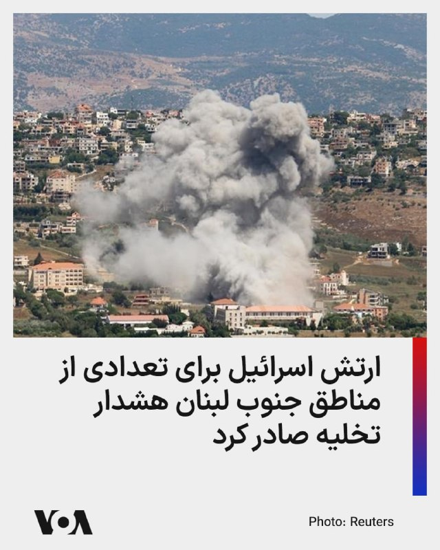

ارتش اسرائیل با انتشار بیانیه‌ای از ساکنان تعدادی از مناطق جنوب لبنان خواست که خانه‌های خود را ترک کنند. در بیانیه ارتش اسرائیل که دوشنبه منتشر شد به شهرها و روستاهای الریحان (جزین)، جرجوع، کفر رمان، النمیریه، عرب‌صالیم، جمیجمه، مشغره، قلیا (البقاع الغربی) و حاروف اشاره شده است.

این نوع هشدارها معمولا پیش از حملات هوایی صادر می‌شود.

در بیانیه ارتش اسرائیل آمده است: «در پی نقض توافق آتش‌بس از سوی حزب‌اللهِ تروریستی، ارتش دفاعی ناچار است با قدرت علیه آن اقدام کند، اما قصد آسیب رساندن به شما را ندارد.»

ارتش اسرائیل از ساکنان این مناطق خواسته «فوراً خانه‌های خود را تخلیه کرده و دست‌کم تا فاصله ۱۰۰۰ متری از روستاها و شهرها، به مناطق باز دور» شوند. این ارتش هشدار داده که «هر کسی که در نزدیکی عناصر حزب‌الله، تأسیسات و تجهیزات رزمی آن حضور داشته باشد، جان خود را در معرض خطر قرار می‌دهد.»
@FarsiVOA

## FarsiVOA — post 217404

  

بر اساس ویدیوی منتشرشده از سوی تانکرترکرز، نفتکش بسیار بزرگ «برکه» متعلق به شرکت دولتی نفت ابوظبی، در حمله پهپادی چهاردهم اردیبهشت‌ماه هدف قرار گرفته است.

رویترز پیش‌تر گزارش داده بود امارات، جمهوری اسلامی را به حمله با دو پهپاد به این نفتکش خالی در زمان عبور از تنگه هرمز متهم کرده و شرکت ادنوک اعلام کرده بود در این حادثه کسی آسیب ندیده است.

تانکرترکرز می‌گوید این نفتکش پیش از حمله، محموله خود را در انتقالی پنهانی در شرق امارات به نفتکش دیگری منتقل کرده بود و هنگام بازگشت برای بارگیری دوباره هدف قرار گرفت.

رویترز نیز گزارش داده ادنوک و خریدارانش برای خروج نفت گرفتارمانده در خلیج فارس، از روش‌هایی مانند خاموش کردن ردیاب‌ها و انتقال کشتی‌به‌کشتی استفاده کرده‌اند.
@FarsiVOA

## FarsiVOA — post 217403

🔺دیدار ترامپ و شی؛ از ایران و پرونده هسته‌ای تا تجارت و هوش مصنوعی

◾️دونالد ترامپ، رئیس‌جمهور آمریکا، این هفته به چین می‌رود تا با شی جین‌پینگ، رئیس‌جمهور این کشور، دیدار کند.

◾️این دیدار قرار است طیف گسترده‌ای از پرونده‌های امنیتی، اقتصادی و فناورانه را دربر بگیرد؛ از جنگ ایران و برنامه هسته‌ای جمهوری اسلامی تا تایوان، تجارت، تسلیحات هسته‌ای، هوش مصنوعی و مواد معدنی کمیاب.

◾️در پرونده ایران، انتظار واشنگتن روشن است و ترامپ می‌خواهد چین از نفوذ خود بر تهران استفاده کند.

◾️چین بزرگ‌ترین خریدار نفت از جمهوری اسلامی است و در ماه‌های اخیر، آمریکا چند شرکت چینی را به اتهام کمک به بخش نظامی و زنجیره تأمین جمهوری اسلامی تحریم کرده است.

⬇️ بیشتر بخوانید:
https://ir.voanews.com/a/8148757.html

## FarsiVOA — post 217402

🔺سازمان حفاظت محیط‌زیست وجود آلودگی آب در اطراف خارک را تأیید کرد

◾️در حالی که پیشتر مقامات جمهوری اسلامی آلودگی آب‌های اطراف جزیره خارک را تکذیب کرده بودند، سازمان حفاظت محیط‌زیست ایران، وجود این آلودگی را تأیید و اعلام کرد که ناشی از «نشت آب توازن یک نفتکش» بوده است.

◾️بر اساس این اعلام، انتشار این آب توازن آلوده، منجر به بروز آلودگی در مجاورت جزیره خارک شد.

◾️«آب توازن» آبی است که کشتی‌ها و نفتکش‌ها برای حفظ تعادل، پایداری و ایمنی خود در مخازن مخصوص ذخیره می‌کنند.

◾️پیشتر مدیرعامل شرکت پایانه‌های نفتی ایران، از اساس هرگونه آلودگی در این منطقه را رد کرده بود.

⬇️ بیشتر بخوانید:
https://ir.voanews.com/a/8148758.html

## FarsiVOA — post 217401

🔺پاریس و لندن ریاست نشستی درباره تنگه هرمز را بر عهده خواهند داشت

◾️پاریس و لندن ریاست نشستی مجازی با حضور وزیران دفاع کشورهای مختلف درباره تنگه هرمز را بر عهده خواهند داشت. این کشورها آماده مشارکت در مأموریتی برای تأمین امنیت تنگه هرمز هستند.

◾️بر اساس اعلام وزارت دفاع بریتانیا، حدود چهل کشور در نشست روز سه‌شنبه که به صورت ویدئو-کنفرانس برگزار می‌شود، حضور خواهد داشت.

◾️برگزاری این نشست در شرایطی است که جمهوری اسلامی یکشنبه هشدار داد که در صورت استقرار نیروهای فرانسوی و بریتانیایی در تنگه هرمز، به آن «پاسخی قاطع و فوری» خواهد داد.

◾️انسداد تنگه هرمز به دست جمهوری اسلامی اقتصاد جهانی را متزلزل کرده و حدود ۱۵۰۰ کشتی و ۲۰ هزار نفر از خدمه کشتی‌ها در آن گرفتار شده‌اند.

⬇️ بیشتر بخوانید:
https://ir.voanews.com/a/8148756.html

## FarsiVOA — post 217400

  

🔺اعدام یک دانشجوی نخبه توسط دستگاه قضایی به اتهام ادعایی «جاسوسی»

◾️قوه قضائیه اعلام کرد عرفان شکورزاده، به اتهام همکاری با سازمان اطلاعات مرکزی آمریکا و موساد اعدام شده است.

ادعا شده او در یکی از سازمان‌های علمی فعال در حوزه ماهواره جذب شده بود و اطلاعات طبقه‌بندی‌شده را در اختیار سرویس‌های خارجی قرار داده است.

◾️صدای آمریکا پیش‌تر گزارش داده بود منابع حقوق بشری شکورزاده را دانشجوی نخبه ۲۹ ساله دانشگاه علم و صنعت معرفی کرده و گفته بودند او پس از ماه‌ها سلول انفرادی و اعترافات اجباری، به اعدام محکوم شده بود.

◾️جمهوری اسلامی از آغاز جنگ با آمریکا و اسرائیل در ۹ اسفند ۱۴۰۴، دستکم ۳۱ تن را به بهانه حضور در اعتراضات یا عضویت در گروه‌های مخالف یا «جاسوسی» اعدام کرده است.

⬇️ بیشتر بخوانید:
https://ir.voanews.com/a/8148759.html

## FarsiVOA — post 217399

  

وزارت امور خارجه عربستان سعودی، تداوم حملات به اراضی و آب‌های سرزمینی امارات متحده عربی، قطر و کویت را «خائنانه» توصیف و حمایت خود از امنیت و ثبات کشورهای عربی خلیج فارس را اعلام کرد.

در بیانیه وزارت امور خارجه عربستان سعودی، این حملات به شدت محکوم شده، اما به منشأ آن اشاره‌ای نشده است. در این بیانیه، عربستان همچنین خواستار توقف فوری هرگونه تلاش برای «بستن تنگه هرمز» یا اختلال در مسیرهای آبی بین‌المللی شد و بر اهمیت پایبندی به حفاظت از مسیرهای دریایی تأکید کرده است.

در تداوم حملات موشکی و پهپادی جمهوری اسلامی به کشورهای منطقه، روز یکشنبه ۲۰ اردیبهشت نیز امارات اعلام کرد که پدافند هوایی این کشور با دو پهپاد منتسب به جمهوری اسلامی مقابله کرده است.

همزمان، کویت از شناسایی چند پهپاد «متخاصم» در حریم هوایی خود و مقابله با آن‌ها خبر داد، و رسانه‌ها از اصابت یک پرتابه ناشناس به یک کشتی در شمال شرق دوحه، پایتخت قطر خبر دادند.
@FarsiVOA

## FarsiVOA — post 217398

  

رویترز به نقل از داده‌های شرکت کپلر و ال‌اس‌ای‌جی گزارش داد سه نفتکش حامل نفت خام، هفته گذشته با خاموش کردن سامانه‌های ردیابی خود از تنگه هرمز خارج شده‌اند؛ اقدامی که به نوشته رویترز برای کاهش خطر حملات جمهوری اسلامی انجام شده است.

بر اساس این گزارش، دو نفتکش بزرگ «آگیوس فانوریوس ۱» و «کیارا ام» روز یکشنبه از تنگه عبور کردند و هرکدام دو میلیون بشکه نفت خام عراق حمل می‌کردند. آگیوس فانوریوس ۱ به سمت ویتنام در حرکت است و قرار است محموله خود را ۲۶ مه در پالایشگاه نگی سون تخلیه کند.

نفتکش سوم، «بصره انرژی»، پیش‌تر دو میلیون بشکه نفت خام آپر زاکوم را از پایانه زرکوی ادنوک بارگیری کرده بود، ششم مه از تنگه خارج شد و دو روز بعد محموله را در فجیره تخلیه کرد.

به نوشته رویترز شرکت ادنوک و خریداران آن در روزهای اخیر چند نفتکش حامل نفت خام را از تنگه هرمز عبور داده‌اند تا نفتی را که به دلیل درگیری‌های خاورمیانه در خلیج فارس گرفتار مانده بود، جابه‌جا کنند.
@FarsiVOA

## FarsiVOA — post 217397

  

بنیامین نتانیاهو نخست‌وزیر اسرائیل اعلام کرد معتقد است که مجتبی خامنه‌ای، رهبر جمهوری اسلامی، زنده است؛ اما به‌عنوان جانشین پدرش که نهم اسفند در حمله مشترک آمریکا و اسرائیل کشته شد، اقتدار کمتری دارد.

نتانیاهو به شبکه سی‌بی‌اس آمریکا در پاسخ به پرسشی درباره نظرش پیرامون وضعیت جسمانی و میزان نفوذ عملیاتی مجتبی خامنه‌ای گفت: «فکر می‌کنم او زنده است. این‌که وضعیتش چگونه است، گفتنش سخت است، می‌دانید؟ او در یک پناهگاه یا مکانی مخفی پنهان شده است.»

نخست‌وزیر اسرائیل افزود که مجتبی «در تلاش است اقتدار خود را اعمال کند»، اما به عقیده نتانیاهو، این اقتدار در مقایسه با اقتداری که علی خامنه‌ای داشت، کمتر است.

پیشتر وال‌استریت ژورنال در گزارشی نوشت مجتبی خامنه‌ای که در انظار عمومی دیده نمی‌شود، درباره مذاکرات سکوت کرده و مشخص نیست تا چه اندازه در تصمیم‌گیری واقعی حضور دارد.

مقام‌های جمهوری اسلامی می‌گویند دلیل این غیبت، مسائل امنیتی است. به نوشته وال‌استریت ژورنال، آن‌ها می‌گویند اسرائیل پیش از آتش‌بس، مقام‌های ارشد جمهوری اسلامی را هدف قرار می‌داد و مجتبی خامنه‌ای همچنان در فهرست اهداف اسرائیل قرار دارد.
@FarsiVOA

## DW_Farsi — post 124546

  

🔶 نتانیاهو: مجتبی خامنه‌ای زنده است ولی قدرت و نفوذ پدرش را ندارد

بنیامین نتانیاهو، نخست‌وزیر اسرائیل، می‌گوید که باور دارد مجتبی خامنه‌ای، رهبر جمهوری اسلامی ایران، هنوز زنده است، با وجود آن‌که از زمان معرفی او به‌ عنوان جانشین پدرش، علی خامنه‌ای در اواخر اسفند سال گذشته، در انظار عمومی دیده نشده و پیامی صوتی یا تصویری از او نیز منتشر نشده است.

نتانیاهو در گفت‌وگو با برنامه "۶۰ دقیقه" شبکه سی‌بی‌اس، در پاسخ به پرسشی درباره وضعیت جسمانی و میزان نفوذ عملیاتی مجتبی خامنه‌ای گفت: «فکر می‌کنم او زنده است. اما این‌که حالش چگونه است، سخت می‌شود گفت. او در یک پناهگاه یا مکان مخفی پنهان شده است.»

نتانیاهو همچنین گفت که مجتبی خامنه‌ای تلاش می‌کند "اقتدار خود را تثبیت کند"، اما میزان نفوذ و قدرت او را کمتر از پدرش، علی خامنه‌ای، ارزیابی کرد.

مقام‌های جمهوری اسلامی در باره وضعیت مجتبی‌ خامنه‌ای اطلاعات دقیقی ارائه نمی‌کنند.

@dw_farsi

## DW_Farsi — post 124545

  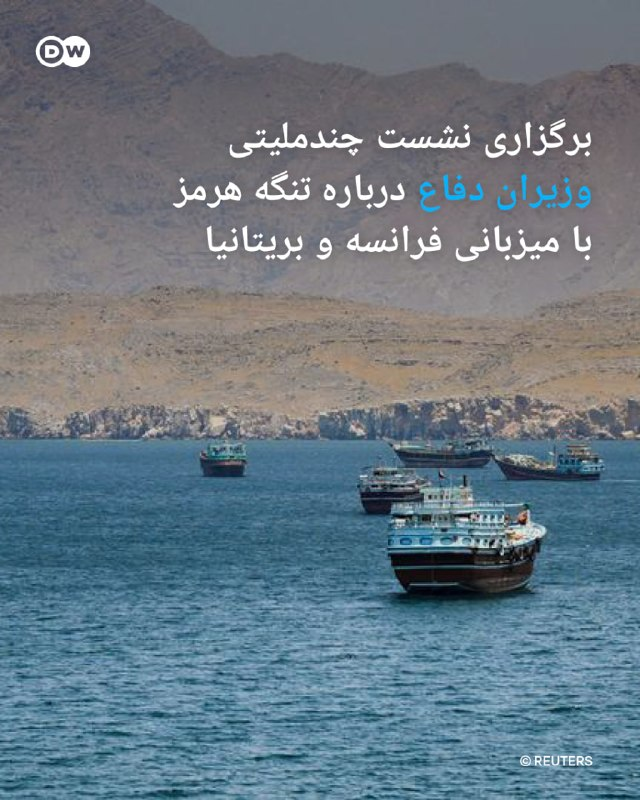

🔶 برگزاری نشست چندملیتی وزیران دفاع درباره تنگه هرمز با میزبانی فرانسه و بریتانیا

به گفته دولت بریتانیا، این کشور در همراهی با فرانسه روز سه‌شنبه، ۱۲ مه، میزبان نشست چندملیتی وزیران دفاع درباره برنامه‌های نظامی برای بازگرداندن جریان تجارت از طریق تنگه هرمز خواهد بود.

این اعلام از سوی بریتانیا چند ساعت پس از آن صورت گرفت که ایران به لندن و پاریس درباره اعزام ناوهای جنگی به منطقه هشدار داد.

وزارت دفاع بریتانیا روز یکشنبه اعلام کرد که جان هیلی، وزیر دفاع، همراه با همتای فرانسوی خود، کاترین ووترن، ریاست نخستین نشست وزیران دفاع مأموریت چندملیتی را با حضور بیش از ۴۰ کشور برعهده خواهد داشت.

این نشست مجازی در ادامه گردهمایی دو روزه برنامه‌ریزان نظامی در لندن در ماه آوریل برگزار می‌شود؛ نشستی که در آن جزئیات عملیاتی مأموریتی چندملیتی به رهبری بریتانیا و فرانسه برای حفاظت از کشتیرانی در این آبراه راهبردی پس از برقراری یک آتش‌بس پایدار بررسی شد.

جان هیلی گفت: «ما در حال تبدیل توافق‌های دیپلماتیک به برنامه‌های عملی نظامی برای بازگرداندن اعتماد به کشتیرانی از طریق تنگه هرمز هستیم.»

@dw_farsi

## DW_Farsi — post 124544

  

🔶 نرگس محمدی با تودیع "وثیقه سنگین" برای مداوا به تهران منتقل شد

بنیاد نرگس محمدی روز یکشنبه، ۲۰ اردیبهشت، اعلام کرد که این فعال حقوق بشر و برنده جایزه نوبل صلح، "پس از ۱۰ روز بستری در بیمارستانی در زنجان، با تودیع وثیقه سنگین و تعویق در اجرای حکم، با آمبولانس به بیمارستان پارس تهران منتقل و جهت درمان فوری توسط تیم پزشکی خود بستری شد".

انتقال محمدی پس از روزها درخواست و هشدار خانواده و نزدیکانش درباره وضعیت بحرانی سلامتی‌اش انجام شد.

بنا بر داده‌های بنیاد نرگس محمدی حکم زندان او با قرار وثیقه به حالت تعلیق درآمده، اما مدت این تعلیق مشخص نیست.

محمدی که از آذرماه در زندان زنجان محبوس بود، اواسط اردیبهشت دو بار بیهوش شده و به بیمارستان محلی منتقل شده بود.

بیانیه بنیاد محمدی می‌گوید که تعلیق حکم کافی نیست و نرگس محمدی به "مراقبت دائمی و تخصصی" نیاز دارد.

این بیانیه تأکید می‌کند: ««باید اطمینان حاصل کنیم که او هرگز برای گذراندن ۱۸ سال باقی‌مانده محکومیتش به زندان بازگردانده نشود. اکنون زمان آن است که آزادی بی‌قید و شرط او و لغو تمام اتهام‌ها مطالبه شود.»

@dw_farsi

## DW_Farsi — post 124543

  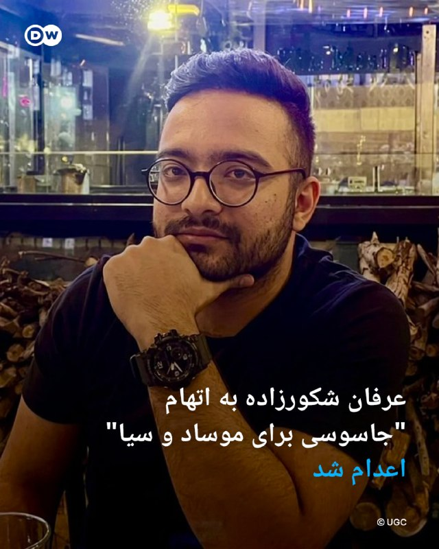

🔶عرفان شکورزاده به اتهام "جاسوسی برای موساد و سیا" اعدام شد

میزان، خبرگزاری قوه قضائیه جمهوری اسلامی، از اعدام عرفان شکورزاده به اتهام "همکاری اطلاعاتی با موساد و سیا" خبر داد.

طبق این گزارش، شکورزاده که در یک مجموعه علمی مرتبط با پروژه‌های ماهواره‌ای فعالیت می‌کرد، متهم شده بود که "به‌صورت آگاهانه با سرویس‌های اطلاعاتی اسرائیل و آمریکا ارتباط برقرار کرده و اطلاعات طبقه‌بندی‌شده را در اختیار آن‌ها قرار داده است".

در گزارش میزان ادعا می‌شود که ارتباط شکورزاده ابتدا از طریق "ایمیل و فرم همکاری موساد" آغاز شد و بعداً از طریق "لینکدین، واتساپ و گوگل‌میت" ادامه یافت. طبق ادعای این گزارش، "فردی که خود را ایرانی مقیم کانادا معرفی کرده بود، در واقع افسر موساد" معرفی شده است.

به ادعای مقام‌های قضایی، شکورزاده "اطلاعاتی درباره محل کار، پروژه‌های ماهواره‌ای، کارکنان، شماره تماس‌ها، ساختار پروژه‌ها و جزئیات فنی را منتقل می‌کرده و در مقابل، ارز دیجیتال دریافت می‌کرده است".

@dw_farsi

## DW_Farsi — post 124542

  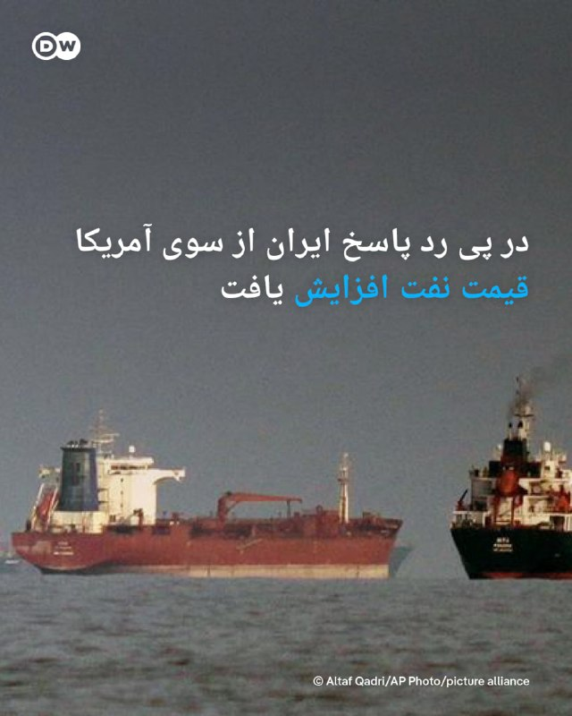

🔶در پی رد پاسخ ایران از سوی آمریکا قیمت نفت افزایش یافت

پس از مردودشمرده شدن پاسخ جمهوری اسلامی ایران به پیشنهاد صلح آمریکا از سوی دونالد ترامپ، قیمت نفت روز دوشنبه ۱۱ مه (۲۱ اردیبهشت) به‌طور قابل‌توجهی افزایش پیدا کرد.

نفت برنت دریای شمال ۳٫۱۴ درصد رشد قیمت پیدا کرد و به ۱۰۴٫۴۷ دلار در هر بشکه رسید، در حالی که نفت سبک آمریکا (WTI) نیز با افزایش ۳٫۲۴ درصدی به ۹۸٫۵۱ دلار رسید.

پس از آن‌که رئیس‌جمهور آمریکا روز یکشنبه پاسخ ایران به پیشنهاد صلح واشنگتن را "کاملاً غیرقابل قبول" توصیف کرد، امیدها به پایان سریع درگیری‌هایی که ده هفته پیش شروع شد و همچنین بازگشایی تنگه هرمز، مسیر حیاتی انتقال نفت، کاهش یافت،

اکنون توجه‌ها به سفر ترامپ به پکن در روز چهارشنبه معطوف شده است؛ جایی که طبق گفته منابع دولتی آمریکا، او قرار است با شی جین‌پینگ، رهبر چین، درباره ایران نیز گفت‌وگو کند.

@dw_farsi

## DW_Farsi — post 124541

  

🔶نتانیاهو: هنوز کارهای زیادی در ایران باقی مانده است

بنیامین نتانیاهو، نخست‌وزیر اسرائیل، روز یکشنبه، ۱۰ مه (۲۰ اردیبهشت) در گفت‌وگو با برنامه "۶۰ دقیقه" شبکه آمریکایی سی‌بی‌اس گفت که "هنوز کارهای زیادی" در ایران باقی مانده و رئیس‌جمهور آمریکا، با او درباره اهمیت نابودی ذخایر اورانیوم با غنای بالا در ایران هم‌نظر است.

نخست‌وزیر اسرائیل با بیان این که جنگ اخیر با ایران "دستاوردهای بزرگی" داشته، افزود: «این جنگ اما هنوز پایان نیافته، زیرا هنوز تأسیسات غنی‌سازی اورانیومی هست که باید برچیده شوند. هنوز نیروهای نیابتی وجود دارند که ایران از آنها حمایت می‌کند و موشک‌های بالستیکی که آنها می‌خواهند تولید کنند. ما بخش زیادی از آن را تضعیف کردیم، اما کارهایی باقی مانده است که باید انجام شود.»

@dw_farsi

## DW_Farsi — post 124540

  

🔶 ترامپ: پاسخ ایران به پیشنهاد صلح آمریکا غیرقابل قبول است

دونالد ترامپ، رئیس جمهور روز یکشنبه، ۱۰ مه (۲۰ اردیبهشت) پاسخ ایران به طرح پیشنهادی واشنگتن را غیرقابل خواند. او گفت: «این پاسخ نظر من را جلب نکرد و کاملاَ مردود است.»

ترامپ اشاره‌ای به جزئیات پاسخ تهران نکرد و نگفت که با کدام بخش آن مخالف است.

شبکه المیادین که نزدیک به جمهوری اسلامی است، نوشته پاسخ ایران شامل درخواست برای پایان دادن به محاصره دریایی و آزادی صادرات نفت است.

پایان فوری جنگ و تضمین‌هایی در باره آتش‌بس در لبنان به علاوه لغو تحریم‌های آمریکا و آزادسازی دارایی‌های بلوکه‌شده ایران نیز در پاسخ جمهوری اسلامی به طرح ۱۴ ماده‌ای دولت ترامپ موضوعات محوری هستند. پذیرش "مدیریت جدیدی" بر تنگه هرمز از سوی ایران نیز از دیگر خواسته‌های تهران است.

صدا و سیمای جمهوری اسلامی نیز به نقل از یک مقام مسئول گزارش داده است که تهران در پاسخ خود "بر ضرورت پرداخت خسارت‌های جنگ توسط آمریکا و پذیرش حاکمیت ایران بر تنگه هرمز تأکید داشته است".

@dw_farsi

## Persian_Trend_Official — post 13882

  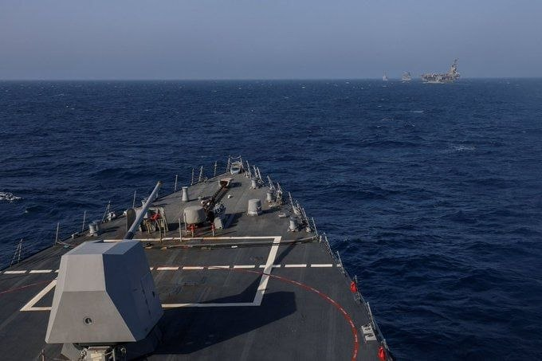

⭕️ تصویری از عرشه ناوشکن یو‌اس‌اس جان فین (DDG 113) که پشت سر ناوشکن یو‌اس‌اس میلیوس (DDG 69) و یو‌اس‌ان‌اس کارل براشیر (T-AKE-7) و ناو هواپیمابر جورج اچ.دبلیو. بوش (CVN 77) در دریای عرب در حال حرکت است.

طبق گفته سنتکام، بیش از 20 ناو جنگی ارتش این کشور در حال اجرای محاصره علیه ایران هستند. نیروهای سنتکام 61 کشتی تجاری را تغییر مسیر داده و 4 کشتی را از کار انداختند تا اطمینان حاصل شود که قوانین محاصره رعایت می‌شوند.

📝 Nick

📌 @persian_trend_official
پرشین ترند | متفاوت‌ترین کانال نظامی

## Persian_Trend_Official — post 13881

  

⭕️ اظهارات جنجالی ظهره‌وند درباره سلاح سری ایران: من جاها و ظرفیت هایی رو دیدم که اتفاقی میوفته که بمب اتم جلوش ترقه است/ شما میتونید زمان رو پشت سر بزارید، چیزی که در چند ثانیه از تهران تا واشنگتن برود/میشه یه کارهایی کرد که بمب اتم جلوش بچه بازیه! پ.ن:…

## Persian_Trend_Official — post 13880

  <a href="telegram/content/Persian_Trend_Official_13880_1778487722.mp4">🎬 Download video</a>

⭕️ تصاویر ماهواره‌ای یک نفتکش بزرگ را در تنگه هرمز نشان می‌دهند که بنظر می‌رسد پس از یک حمله احتمالی، ردی از نفت را نشت می‌دهد. فعالیت قایق‌های تندرو کوچک نیز در نزدیکی آن دیده می‌شود.

📝 Nick

📌 @persian_trend_official
پرشین ترند | متفاوت‌ترین کانال نظامی

## Persian_Trend_Official — post 13879

  <a href="telegram/content/Persian_Trend_Official_13879_1778487723.mp4">🎬 Download video</a>

هیچکس مثل جبهه پایداری به اهداف اسرائیل کمک نمیکنه !
فکر میکنم در حق این نماینده های خدوم جفا شده 😄

📌 @persian_trend_official
پرشین ترند | متفاوت‌ترین کانال نظامی

## Persian_Trend_Official — post 13878

  <a href="telegram/content/Persian_Trend_Official_13878_1778487725.mp4">🎬 Download video</a>

⭕️ اظهارات جنجالی ظهره‌وند درباره سلاح سری ایران:

من جاها و ظرفیت هایی رو دیدم که اتفاقی میوفته که بمب اتم جلوش ترقه است/ شما میتونید زمان رو پشت سر بزارید، چیزی که در چند ثانیه از تهران تا واشنگتن برود/میشه یه کارهایی کرد که بمب اتم جلوش بچه بازیه!

پ.ن: شعر گوی اعظم

📝 Nick

📌 @persian_trend_official
پرشین ترند | متفاوت‌ترین کانال نظامی

## Persian_Trend_Official — post 13877

  <a href="telegram/content/Persian_Trend_Official_13877_1778487727.mp4">🎬 Download video</a>

⭕️ به گفته GB News، نخست‌وزیر بریتانیا کیر استارمر «به نظر می‌رسد این هفته استعفا دهد.»

📝 Nick

📌 @persian_trend_official
پرشین ترند | متفاوت‌ترین کانال نظامی

## Persian_Trend_Official — post 13876

  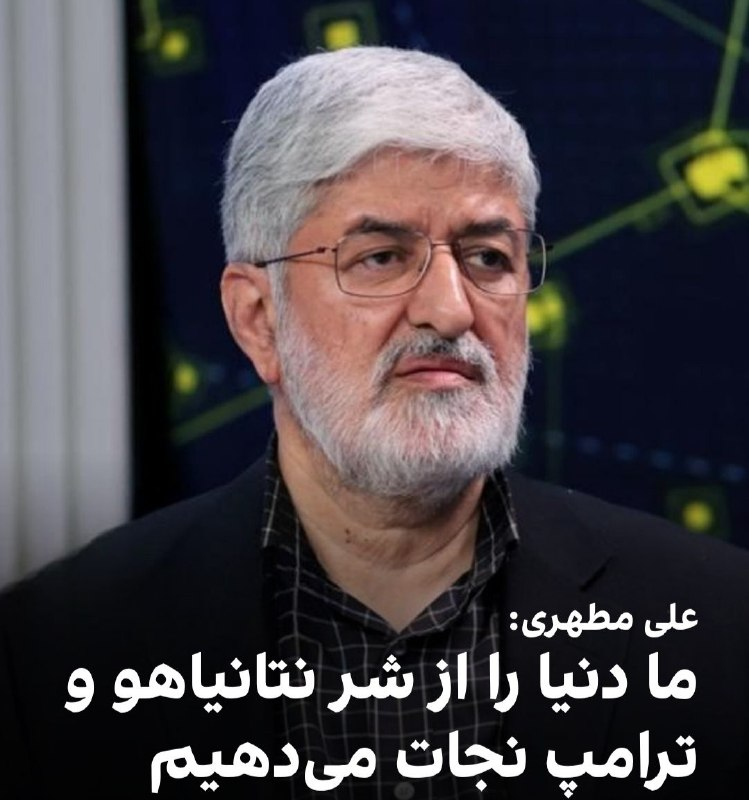

⭕️ علی مطهری، نایب‌رئیس پیشین مجلس شورای اسلامی:

«ما داریم کار بزرگی انجام می‌دهیم که در تاریخ ثبت خواهد شد و آن این است که داریم دنیا را از شر دو آدم روانی، ترامپ و نتانیاهو نجات می‌دهیم و انشاالله به نتیجه برسیم.»

📝 Nick

📌 @persian_trend_official
پرشین ترند | متفاوت‌ترین کانال نظامی

## Persian_Trend_Official — post 13875

  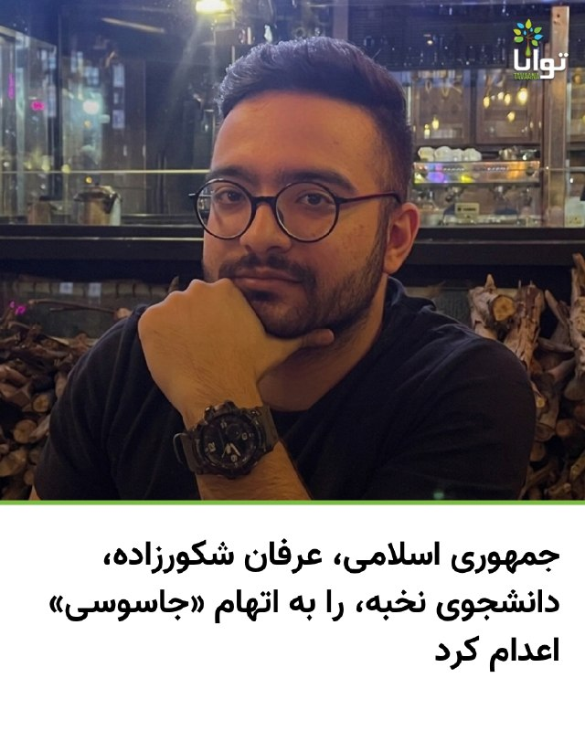

اعدام عرفان شکورزاده؛ جمهوری اسلامی دانشجوی نخبه دانشگاه علم و صنعت را به «همکاری با موساد و سیا» متهم کرد

قوه قضائیه جمهوری اسلامی اعلام کرد عرفان شکورزاده، فرزند جعفر، به اتهام «همکاری با سرویس اطلاعاتی آمریکا و اسرائیل» اعدام شده است.

به ادعای قوه قضائیه، او از طریق یک سازمان علمی فعال در حوزه ماهواره جذب شده و اطلاعات طبقه‌بندی‌شده را در اختیار سرویس‌های خارجی قرار داده بود. جمهوری اسلامی همچنین مدعی شده است که عرفان شکورزاده در سه مرحله با موساد و سیا ارتباط برقرار کرده و از او تجهیزات و اطلاعات مرتبط با فعالیتش در یک مرکز علمی به دست آمده است.

آموزشکده توانا پیش‌تر گزارش داده بود که عرفان شکورزاده، دانشجوی ۲۹ ساله و نخبه دانشگاه علم و صنعت، پس از ماه‌ها نگهداری در سلول انفرادی و تحت فشار برای اخذ اعترافات اجباری، به اعدام محکوم شده بود.

چند روز پیش نیز گزارش شده بود که عرفان شکورزاده، دانشجوی کارشناسی ارشد مهندسی هوافضا ـ فناوری ماهواره دانشگاه علم و صنعت ایران، از زندان اوین به قزل‌حصار منتقل شده است؛ انتقالی که نگرانی‌ها درباره اجرای قریب‌الوقوع حکم اعدام او را افزایش داده بود.

بر اساس اطلاعات رسیده به آموزشکده توانا، او را به بهانه «ملاقات با ضابط» از بند خارج کرده و سپس به زندان قزل‌حصار منتقل کرده بودند. منابع مطلع گفته بودند که او پیش‌تر در وضعیت «توقف حکم اعدام» قرار داشته، اما انتقال ناگهانی‌اش به قزل‌حصار، نگرانی‌ها از اجرای حکم را تشدید کرده بود.

عرفان شکورزاده، متولد ۱۳۷۶، دانش‌آموخته مهندسی برق دانشگاه تبریز و دانشجوی کارشناسی ارشد دانشگاه علم و صنعت تهران بود. بر اساس سوابق علمی منتشرشده، او در حوزه نرم‌افزارهای تست ماهواره، کنترل و موقعیت‌یابی ماهواره فعالیت پژوهشی داشت و رتبه نخست مقطع کارشناسی ارشد را نیز کسب کرده بود.

طبق اطلاعات منتشرشده، او در بهمن‌ماه ۱۴۰۳ توسط اطلاعات سپاه با اتهام «جاسوسی و همکاری با کشورهای متخاصم» بازداشت شد. منابع نزدیک به پرونده گفته بودند که عرفان شکورزاده حدود ۹ ماه را در سلول انفرادی سپری کرده و تحت فشار و شکنجه برای اخذ اعترافات اجباری قرار داشته است.

در یادداشتی که به گفته منابع نزدیک به پرونده توسط او نوشته شده بود، آمده است:

«من عرفان شکورزاده ۲۹ ساله، یکی از معدود به اصطلاح نخبگانی که حاضر به مهاجرت نشدم.
چند ماه پیش از جنگ ۱۲ روزه، به اتهام واهی جاسوسی و همکاری با کشورهای متخاصم توسط اطلاعات سپاه بازداشت شدم و در مدت ۸ ماه و نیم شکنجه و زندان انفرادی مجبور به اعتراف اجباری شدم.
نگذارید یک جان بی‌گناه دیگر در سکوت و بی‌خبری از دست برود.»

#عرفان_شکورزاده #نه_به‌_اعدام #نه_به_جمهوری_اسلامی

@Tavaana_TavaanaTech

## Persian_Trend_Official — post 13874

  <a href="telegram/content/Persian_Trend_Official_13874_1778487729.mp4">🎬 Download video</a>

کانال تلگرامی صدا و سیما اولین تصاویر از عرفان شکورزاده که بعنوان جاسوس دو جانبه سیا و موساد متهم کرده بودنش و صبح امروز اورا اعدام کردن منتشرکرد.

☆Phantom☆

📌 @persian_trend_official
پرشین ترند | متفاوت‌ترین کانال نظامی

## Persian_Trend_Official — post 13873

عرفان شکورزاده به اتهام جاسوس مشترک سیا و موساد در ایران صبح امروز اعدام شد.

میزان خبرگزاری رسمی قوه قضائیه /از ارتباطات گسترده عرفان شکورزاده با سازمان های موساد و سیا در فروش اطلاعات علمی کشور

براساس محتویات پرونده، نامبرده به عنوان پروژه و با توجه به تخصصی که داشته، جذب یکی از سازمان‌های علمی کشور که در حوزه ماهواره فعالیت داشته، شده بود.

محکوم‌علیه در حین همکاری با مجموعه مهم علمی کشور، اقدام به ارتباط‌گیری با سرویس‌های جاسوسی دشمن از جمله CIA و به طور ویژه سرویس اطلاعاتی تروریستی موساد کرد.

نام‌برده با سرویس‌های اطلاعاتی دشمن در سه مرحله اقدام به ارتباط‌گیری کرده که مرحله اول و سوم مربوط به موساد و مرحله دوم مربوط به سیا بوده است.

براساس مفاد پرونده، محکوم‌علیه بصورت آگاهانه با میل خود اقدام به ارتباط با سرویس‌ جاسوسی آمریکا CIA و موساد کرده و اطلاعات در اختیارش را نزد عوامل دشمن بازگو کرده است.

🔹اطلاعاتی که محکوم‌علیه تلاش داشته به سرویس‌های دشمن ارائه کند؛ دارای طبقه‌بندی بوده است.

متن از خبرگزاری میزان می‌باشند....

☆Phantom☆

📌 @persian_trend_official
پرشین ترند | متفاوت‌ترین کانال نظامی

## Persian_Trend_Official — post 13872

  

📰بلومبرگ:

بیش از ۴۰ کشور قرار است روز دوشنبه برای بحث در مورد مشارکت‌های نظامی در یک ماموریت به رهبری اروپا جهت اسکورت کشتی‌های تجاری از تنگه هرمز پس از برقراری آتش‌بس پایدار، دیدار کنند.

عملیات دفاعی دریایی پیشنهادی که به رهبری بریتانیا و فرانسه است.

انتظار می‌رود شامل عملیات پاک‌سازی مین، اسکورت‌های دریایی و پلیس هوایی باشد که هدف آن حفاظت و اطمینان‌بخشی به کشتی‌رانی تجاری در منطقه است.

☆Phantom☆

📌 @persian_trend_official
پرشین ترند | متفاوت‌ترین کانال نظامی

## Persian_Trend_Official — post 13871

  

ایران به فرانسه و بریتانیا هشدار داد هرگونه حضور نظامی در تنگه هرمز با پاسخ مستقیم مواجه خواهد شد.

کاظم غریب‌آبادی، معاون وزیر امور خارجه ایران، اعلام کرد، استقرار ناوشکن‌ها و شناورهای جنگی فرانسه یا بریتانیا تحت عنوان «حفاظت از کشتیرانی» اقدامی تحریک‌آمیز و دخالت در امنیت منطقه تلقی می‌شود.

وی در پیامی در شبکه اجتماعی ایکس نوشت:
«تنگه هرمز قلمرو نفوذ قدرت‌های فرامنطقه‌ای نیست و جمهوری اسلامی ایران اجازه نخواهد داد هیچ طرف خارجی امنیت این آبراه راهبردی را به چالش بکشد.»

غریب‌آبادی تأکید کرد هرگونه حضور نظامی هماهنگ با «اقدامات غیرقانونی» آمریکا، با واکنش «فوری، قاطع و پشیمان‌کننده» نیروهای مسلح ایران روبه‌رو خواهد شد.

این مقام ایرانی همچنین هشدار داد تهران هر تحرک نظامی خارجی در اطراف تنگه هرمز را به‌دقت رصد می‌کند و مسئولیت هرگونه تشدید تنش بر عهده کشورهای مداخله‌گر خواهد بود.
☆Phantom☆

📌 @persian_trend_official
پرشین ترند | متفاوت‌ترین کانال نظامی

## Persian_Trend_Official — post 13869

در پی اظهارات مقام‌های نظامی فرانسه درباره اعزام ناو هواپیمابر «شارل دوگل» به دریای سرخ و خلیج عدن، حسین شریعتمداری، مدیرمسئول روزنامه کیهان، خواستار واکنش «پیشدستانه» ایران علیه ناوهای فرانسه و بریتانیا شد...

شریعتمداری در سرمقاله روزنامه کیهان نوشت اعزام این ناو در چارچوب همکاری‌های نظامی پاریس و لندن و با هدف «تقویت آزادی کشتیرانی در منطقه تنگه هرمز» انجام شده است. او این اقدام را «دخالت آشکار در امور حاکمیتی ایران» توصیف کرد و آن را معادل «اعلام جنگ» دانست.

وی همچنین از مقام‌های جمهوری اسلامی خواست دو اقدام فوری را در دستور کار قرار دهند؛
1️⃣صدور بیانیه‌ای خطاب به شهروندان
کشورهای اروپایی درباره هزینه‌های نظامی دولت‌هایشان در حمایت از آمریکا و اسرائیل،

2️⃣ «مقابله پیشدستانه» با ناوهای جنگی فرانسه و بریتانیا.

شریعتمداری مدعی شد که این ناوها در برد موشک‌های دوربرد ایران قرار دارند و همچنین به توانایی نیروهای انصارالله یمن در دریای سرخ و باب‌المندب اشاره کرد.

☆Phantom☆

📌 @persian_trend_official
پرشین ترند | متفاوت‌ترین کانال نظامی

## RadioFarda — post 157050

  

🔸نرگس رشیدی، بازیگر ایرانی-آلمانی، به‌خاطر بازی در نقش نازنین زاغری-رتکلیف در سریال «زندانی ۹۵۱»، برنده جایزه بهترین بازیگر زن نقش اول بفتا (جوایز آکادمی فیلم بریتانیا) شد.

🔸این سریال که نوامبر پارسال از نت‌فلیکس هم پخش شد، بر اساس داستان واقعی زندگی نازنین زاغری و از روی کتابی که او از خاطرات زندانی‌شدنش برای شش سال در ایران نوشته، ساخته شده است.

🔸خانم زاغری، کارمند بنیاد تامسون رویترز، فروردین ۱۳۹۵ در پایان سفرش به ایران که برای دیدار با خانواده خود رفته بود، در فرودگاه تهران به اتهام «جاسوسی» بازداشت و به پنج سال زندان محکوم شد.

🔸نرگس رشیدی برای آماده شدن برای این نقش، پیش از ساخت این سریال، خاطرات در شُرف انتشار زاغری-رتکلیف را که با همکاری ریچارد همسرش نوشته شده است، مطالعه کرد.

🔸او که در ایران متولد شده و تا هفت سالگی آن‌جا زندگی کرده است، این جایزه را به نازنین زاغری-رتکلیف و خانواده‌اش تقدیم کرد.

@RadioFarda

## RadioFarda — post 157049

  

🔸ایران می‌گوید به یک نفتکش عراقی که حامل نفت خام عراق است، اجازه داده تا از تنگه هرمز عبور کند.

🔸خبرگزاری تسنیم، وابسته به سپاه پاسداران روز دوشنبه ۲۱ اردیبهشت‌ماه اعلام کرد که یک فروند نفتکش وی‌ال‌سی‌سی (VLCC) به نام «آگوس فانوریوس ۱/AGOIS FANOURIOS I» روز یکشنبه از مسیر تعیین‌شده ایران در تنگه هرمز عبور کرد.»

🔸بنا بر این گزارش این نفتکش که حامل نفت خام عراق است و به سمت ویتنام حرکت می‌کند، هم‌اکنون در دریای عمان قرار دارد.

🔸روز شنبه نیز همزمان با دیدار وزیر خارجه آمریکا با نخست وزیر قطر در میامی یک نفتکش قطری حامل گاز مایع در راه پاکستان از تنگه هرمز گذشت.

🔸خبرگزاری رویترز به نقل از منابعی نوشت که گذر این نفتکش «با تأیید» جمهوری اسلامی صورت می‌گیرد و اقدامی برای اعتمادسازی با دو کشور قطر و پاکستان که هر دو در جنگ آمریکا و اسرائیل با ایران نقش میانجی را ایفا کرده‌اند.

@RadioFarda

## RadioFarda — post 157048

ترامپ پاسخ ایران درباره توافق پایان جنگ را «کاملاً غیر قابل قبول» خواند

🔸رئیس‌جمهور آمریکا شامگاه یکشنبه ۲۰ اردیبهشت، پاسخ ایران به طرح پیشنهادی واشینگتن برای پایان جنگ را «کاملاً غیر قابل‌ قبول» توصیف کرد.

🔸دونالد ترامپ در پیام کوتاهی در شبکه اجتماعی خود، تروث سوشال، نوشت: «من همین حالا پاسخ به‌اصطلاح "نمایندگان" ایران را خواندم. از آن خوشم نمی‌آید. کاملاً غیرقابل‌قبول است!»

🔸ایران پیش‌تر در همان روز به تازه‌ترین پیشنهاد صلح واشینگتن پاسخ داده و هم‌زمان هشدار داده بود که هرگونه حملهٔ جدید آمریکا را تلافی خواهد کرد و اجازه حضور بیشتر ناوهای جنگی خارجی در تنگهٔ هرمز را نخواهد داد.

🔸ترامپ جزئیاتی از پیشنهاد متقابل تهران به طرح آمریکا ارائه نکرده، اما پیام کوتاه او در تروث‌سوشال نشان می‌دهد که پیشنهادهای جمهوری اسلامی ایران را به‌طور کامل رد می‌کند.

🔸رئیس‌جمهور آمریکا پیش‌تر نیز پیشنهادات ارائه‌شده توسط حکومت ایران را غیر قابل قبول و ناکافی خوانده بود.

🔸آمریکا و ایران بعد از یک دور مذاکره حضوری در پاکستان که چند روز بعد از برقراری آتش‌بس در اسلام‌آباد برگزار شد، با ارسال طرح‌های پیشنهادی متقابل مشغول مذاکره بودند. آمریکا بعد از بی‌نتیجه ماندن مذاکره حضوری، محاصره دریایی بنادر ایران را آغاز کرد، در حالی که ایران از ابتدای جنگ تنگهٔ هرمز را مسدود کرده است.

🔸این مذاکرات برای پایان دادن به جنگی است که از ۹ اسفند پارسال با حملات آمریکا و اسرائیل به ایران آغاز و خیلی زود به یک درگیری منطقه‌ای تبدیل شد.

🔸بر اساس گزارش خبرگزاری رسمی دولت ایران، ایرنا، پاسخ تهران به طرح آمریکا، بر پایان جنگ «در همه جبهه‌ها، به‌ویژه لبنان»، جایی که اسرائیل همچنان با این گروه مورد حمایت ایران درگیر است، و نیز بر «تضمین امنیت کشتیرانی» تمرکز دارد.

🔸نسخه کامل این گزارش را در وب‌سایت رادیوفردا بخوانید.

@RadioFarda

## RadioFarda — post 157047

عرفان شکورزاده، دانشجوی ۲۹ ساله، به اتهام «جاسوسی» برای آمریکا و اسرائیل اعدام شد

🔸خبرگزاری رسمی قوه قضائیه، میزان، روز دوشنبه ۲۱ اردیبهشت گزارش داد که ایران یک متهم دیگر با ادعای «جاسوسی مشترک» برای آمریکا و اسرائیل را اعدام شد.

🔸این خبرگزاری هویت فرد اعدام‌شده را «عرفان شکورزاده» اعلام و ادعا کرده که او «با دشمن در فروش اطلاعات علمی کشور» همکاری داشته است.

🔸میزان بدون اشاره به شغل این متهم، افزوده که او در چارچوب یک «پروژه» و «با توجه به تخصصی که داشته، جذب یکی از سازمان‌های علمی کشور شده بود که در حوزهٔ ماهواره فعالیت داشته است».

🔸بر اساس این ادعا، فرد اعدام‌شده «آگاهانه» و «با میل خود» در «سه مرحله اقدام به ارتباط‌گیری کرده که مرحله اول و سوم مربوط به موساد و مرحله دوم مربوط به سی‌آی‌ای بوده است».

🔸میزان می‌افزاید: «اطلاعاتی که محکوم‌علیه تلاش داشته به سرویس‌های دشمن ارائه کند، دارای طبقه‌بندی بوده است».

🔸سازمان حقوق بشر ایران در این زمینه گزارش داده که عرفان شکورزاده ۲۹ ساله، دانشجوی کارشناسی ارشد مهندسی هوافضا در دانشگاه علم و صنعت ایران بود.

🔸گزارش‌ها حاکی است که او بهمن سال ۱۴۰۳ به اتهام «جاسوسی و همکاری با کشورهای متخاصم» توسط اطلاعات سپاه پاسداران بازداشت شد و حدود ۹ ماه در سلول انفرادی نگهداری می‌شد و تحت فشار مجبور به «اعتراف اجباری» شد.

🔸نسخه کامل این گزارش را در وب‌سایت رادیوفردا بخوانید.

@RadioFarda

## RadioFarda — post 157046

  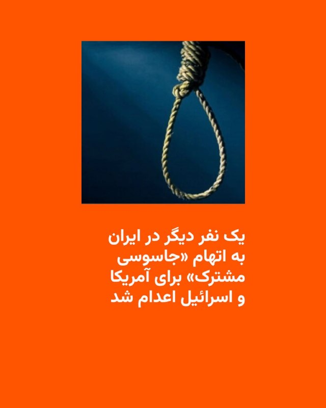

🔸خبرگزاری رسمی قوه قضائیه، میزان، روز دوشنبه ۲۱ اردیبهشت گزارش داد که یک متهم دیگر با ادعای «جاسوسی مشترک» برای آمریکا و اسرائیل اعدام شد.

🔸این خبرگزاری هویت فرد اعدام‌شده را «عرفان شکورزاده» اعلام کرده و گفته که او «با دشمن در فروش اطلاعات علمی کشور» همکاری داشته است.

🔸میزان بدون اشاره به شغل این متهم، گفته که او در چارچوب یک «پروژه» و «با توجه به تخصصی که داشته، جذب یکی از سازمان‌های علمی کشور شده بود که در حوزه ماهواره فعالیت داشته است».

🔸بر اساس این ادعا، فرد اعدام‌شده «آگاهانه» و «با میل خود» در «سه مرحله اقدام به ارتباط‌گیری کرده که مرحله اول و سوم مربوط به موساد و مرحله دوم مربوط به سی‌آی‌ای بوده است».

🔸میزان می‌افزاید: «اطلاعاتی که محکوم‌علیه تلاش داشته به سرویس‌های دشمن ارائه کند، دارای طبقه‌بندی بوده است».

🔸ایران در ماه‌های اخیر با موج تازه‌ای از اعدام‌ها، بازداشت‌ها و صدور احکام سنگین روبه‌رو بوده است؛ موجی که به گفتهٔ نهادها و سازمان‌های حقوق بشری، در فضای جنگ، بحران امنیتی و اعتراضات، به‌عنوان ابزاری برای ایجاد ترس و کنترل جامعه عمل می‌کند.

@RadioFarda

## RadioFarda — post 157045

  

🔸گزارش رسانه‌ها حاکی است که قیمت نفت در بازارهای آسیایی در روز دوشنبه ۲۱ اردیبهشت پس از رد پیشنهادهای ایران از سوی آمریکا برای توافق بر سر پایان جنگ، افزایش یافت.

🔸قیمت نفت برنت با ۴.۵ درصد افزایش به حدود ۱۰۶ دلار به ازای هر بشکه نفت رسید. نفت وست تگزاس اینترمدیت نیز به ۱۰۵ دلار برای هر بشکه رسید.

🔸دونالد ترامپ، رئیس‌جمهور آمریکا، شامگاه یکشنبه بدون ارائه توضیحی، پاسخ ایران به پیشنهادهای واشینگتن برای پایان جنگ بین دو کشور را «کاملاً غیرقابل قبول» خواند و آن را رد کرد.

🔸دلار نیز برای دومین روز متوالی در معاملات آسیایی در برابر ارزهای اصلی تقویت شد.

🔸به گزارش خبرگزاری فرانسه، این روند تحت تأثیر داده‌های قوی اشتغال در آمریکا و تقاضا برای دارایی‌های امن در پی آتش‌بس متزلزل میان آمریکا و ایران بود.

🔸بازارهای سهام آسیایی در روز دوشنبه نیز شاهد کاهش ارزش بودند.

@RadioFarda

## RadioFarda — post 157043

  

🔸روزنامه وال‌استریت جورنال روز دوشنبه ۲۱ اردیبهشت گزارش داد که رئیس‌جمهور آمریکا قصد دارد در سفر هفتهٔ جاری خود به پکن، همتای چینی‌اش را برای میانجی‌گری و پایان جنگ در خاورمیانه تحت فشار بگذارد.

🔸به نوشتهٔ این روزنامه، در حالی که رهبران دو ابرقدرت جهان این هفته با هم دیدار می‌کنند، دونالد ترامپ و شی جین‌پینگ، با حضور سایه‌وار کشوری دیگر بر نشست خود روبه‌رو خواهند بود: ایران.

🔸این دیدار که مدت‌ها انتظارش می‌رفت، پیش‌تر یک‌بار به‌دلیل جنگ آمریکا و اسرائیل با ایران که به بسته شدن تنگهٔ هرمز انجامیده، به تعویق افتاده بود.

🔸وال‌استریت جورنال می‌نویسد که ترامپ مشتاق است از جنگ خاورمیانه عبور کند، جنگی که قدرت داخلی او را تحلیل می‌برد و اقتصاد جهانی را تحت فشار قرار داده است.

🔸به گفتهٔ مقام‌های آمریکایی، او در حالی وارد پکن می‌شود که آماده است چین را تحت فشار بگذارد تا برای میانجی‌گری و دستیابی به توافقی که به این درگیری پایان دهد، کمک کند.

@RadioFarda

## IranianMinds — post 19930

  

🔴 صبح امروز همزمان با اذان صبح جمهوری اسلامی یکی دیگه از جوونای وطنمونو ازمون گرفت

عرفان شکورزاده ۲۹ ساله و نخبه ی دانشگاه علم و صنعت توسط جمهوری اسلامی امروز اعدام شد …

@IranianMinds

## IranianMinds — post 19929

🔴 صدا و سیما:

آخرین پیشنهاد آمریکا رو رد کردیم و پیشنهاد متقابل خودمونو ارائه دادیم.

ما فقط خواستار رفع تحریم‌ها، آزادسازی دارایی‌های مسدود شده ایران، جبران خسارات ناشی از جنگ٬ به رسمیت شناختن نقش ایران در تنگه هرمز و به عقد درآوردن دائمی ملانیا زن‌ ترامپ برای مسعود پزشکیان شدیم ولی آمریکا این پیشنهادات رو هم قبول نکرده و خیلی زیاده خواهه.

@IranianMinds

## IranianMinds — post 19928

  <a href="telegram/content/IranianMinds_19928_1778487735.mp4">🎬 Download video</a>

🔴 نتانیاهو:

در ایران، خیابان‌ها را به اسم من نامگذاری می‌کنند. می‌دانستید؟ خب، البته به اسم رئیس‌جمهور ترامپ هم هست، چون او رهبری مبارزه را برعهده دارد.

من فارسی بلد نیستم ولی میدونم ایرانیا منو «بی بی جون» صدا می‌کنند، بیبی عزیز

@IranianMinds

## IranianMinds — post 19927

  <a href="https://t.me/IranianMinds/19927">📎 Download file</a>

📲#اپلیکیشن اندروید سایت جهانی دربی بت

👍اسپانسر لیگ انگلیس
👍
🔥امکان شارژ امن از طریق کارت بانکی
➖➖➖➖➖➖➖➖➖

🪙همین حالا عضو شوید 👇
https://t.me/+aCbq7yy8QY80NzQ0

## IranianMinds — post 19926

  

😤دنبال یه سایت شرط بندی بین المللی بودی که به ایرانیا خدمات بده؟!
⛔

👍دربی بت همون انتخاب  100%

💎ویژگی های سایت جهانی Derby Bet:

⬅️امکان شارژ امن با کارت بانکی

⬅️واریز اول دوبل شارژ می شوید(بونوس۱۰۰٪)

⬅️پر اپشن ترین سایت فعال در ایران

⬅️تسویه حساب کمتر از 5 دقیقه

⬅️برگشت بخشی از باخت به صورت هفتگی

🚨کد هدیه ثبت نام:GG007

⚠️برای دانلود اپلکیشن کلیک کنید
👉
re21

🔔کانال دربی بت :

🪙https://t.me/+aCbq7yy8QY80NzQ0

## IranianMinds — post 19925

  <a href="telegram/content/IranianMinds_19925_1778487737.mp4">🎬 Download video</a>

🔴 نتانیاهو:

حتی هیتلر هم نمیگفت «مرگ بر آمریکا، مرگ بر بریتانیا.»

@IranianMinds

## IranianMinds — post 19924

  <a href="telegram/content/IranianMinds_19924_1778487738.mp4">🎬 Download video</a>

🔴 نتانیاهو:

فکر می‌کنم مجتبی خامنه‌ای هنوز زنده است. وضعیتش را نمی‌توان دقیق گفت. احتمالا در یک پناهگاه یا جای مخفی قایم شده.

@IranianMinds

## BBCPersian — post 280738

در پی انتشار تصاویر ماهواره‌ای که نشان‌دهنده نشت احتمالی نفت در محدوده‌ای در نزدیکی جزیره خارگ است، سازمان حفاظت محیط زیست ایران می‌گوید: «منشا آلودگی مشاهده‌ شده در اطراف جزیره خارگ ناشی از تخلیه آب توازن آلوده یک نفتکش آسیب‌دیده بوده است.» این نهاد گفت:…

## BBCPersian — post 280737

  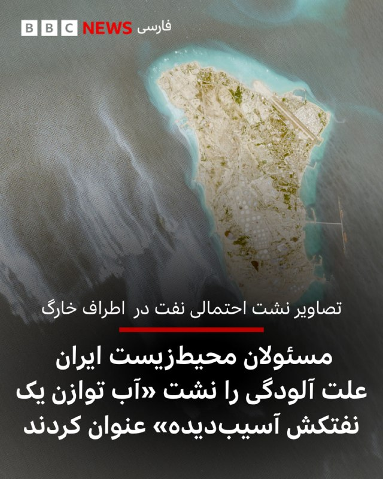

در پی انتشار تصاویر ماهواره‌ای که نشان‌دهنده نشت احتمالی نفت در محدوده‌ای در نزدیکی جزیره خارگ است، سازمان حفاظت محیط زیست ایران می‌گوید: «منشا آلودگی مشاهده‌ شده در اطراف جزیره خارگ ناشی از تخلیه آب توازن آلوده یک نفتکش آسیب‌دیده بوده است.»

این نهاد گفت: «هیچ‌گونه نشت نفت از خطوط لوله، تاسیسات پایانه‌های نفتی و یا سکوهای متعلق به شرکت نفت فلات قاره ایران در جزیره خارگ مشاهده یا گزارش نشده است.»

سه روز پیش یک عکس ماهواره‌ سنتینل پروژه کوپرنیکوس اتحادیه اروپا منتشر شد که به نظر می‌رسید یک لکه بزرگ نفتی در اطراف خارگ را نشان می‌دهد.

روز گذشته هم مدیرعامل شرکت پایانه‌های نفتی ایران ایجاد یک لکه نفتی در سواحل جزیره خارگ را «ادعای کذب و به دور از واقعیت» خواند و گفت: «به محض انتشار این اخبار، گروه‌های متخصص اچ‌اس‌ئی [سلامت و ایمنی]، اداره شیمیایی و آزمایشگاه، همه منطقه را پایش کردند اما حتی کوچک‌ترین موردی یافت نشد.»
تحولات ایران و منطقه را از لینک ⬇️‌ در سایت بی‌بی‌سی فارسی بخوانید:

https://bbc.in/4u5EtI8
📷COPERNICUS SENTINEL-2/Reuters
@BBCPersian

## BBCPersian — post 280736

سخنگوی ارتش اسرائیل، هشدار جدیدی برای جنوب لبنان صادر کرده و به ساکنان ۹ منطقه گفت که پیش از حملات اسرائیل، از این مناطق خارج شوند.

صبح دوشنبه ۲۱ اردیبهشت، اسرائیل کشته شدن یکی از سربازانش را در جنوب لبنان تایید کرد و گزارش‌ها از حملات متقابل حزب‌الله و اسرائیل به مواضع یکدیگر حکایت دارد.

شبکه تلویزیونی الجزیره گزارش کرده که اسرائیل در یک سلسله حملات هوایی چندین شهر در جنوب لبنان را بمباران کرده است.

براساس این گزارش شهرهای کفرتبنیت و شوكين هدف حملات اسرائیل قرار گرفته است.

تازه‌ترین تحولات ایران و منطقه را در صفحه زنده در سایت بی‌بی‌سی فارسی بخوانید:

https://bbc.in/4uJoBeo
@BBCPersian

## BBCPersian — post 280726

در طول دهه‌ها، چتر امنیتی آمریکا در خلیج فارس امری بدیهی و تضمین‌شده تلقی می‌شد، اما جنگ آمریکا و اسرائیل با ایران ممکن است این معادله را تغییر دهد.

در جریان این جنگ و در اوج چالش‌های دفاعی ناشی از حملات موشکی و پهپادی ایران و هدف قرار گرفتن تاسیسات حیاتی کشورهای عضو شورای همکاری خلیج فارس، این کشورها تنها مسیر موشک‌ها را زیر نظر نداشتند، بلکه واکنش‌ واشنگتن را نیز با دقت رصد می‌کردند؛ زیرا خود را در صحنه جنگی یافتند که به گفته مقام‌های منطقه، درباره آن با آن‌ها مشورت نشده بود.

آیا این بحران محدودیت توافق‌های امنیتی میان واشنگتن و کشورهای عرب خلیج فارس را آشکار کرده است؟ آیا این جنگ باعث کاهش وابستگی این کشورها به قدرت نظامی آمریکا خواهد شد یا برعکس، این وابستگی را تقویت خواهد کرد؟

از لینک ⬇️ این مطلب را در سایت بی‌بی‌سی فارسی بخوانید.

https://bbc.in/4wnt5Zu

📸GettyImages/ Universal Images Group via Getty Images/GettyImages/
Reuters/ Anadolu via Getty Images/ AFP via Getty Image
@BBCPersian

## BBCPersian — post 280725

  

‌دستگاه قضایی ایران می‌گوید که امروز عرفان شکورزاده را به جرم «همکاری با سرویس اطلاعاتی آمریکا و سرویس جاسوسی موساد» اعدام کرده است.

میزان، خبرگزاری قوه قضائیه ایران گفته آقای شکورزاده اقدام به ارائه اطلاعات به «سرویس‌های دشمن» کرده و این اطلاعات «دارای طبقه‌بندی» بوده است.

در روزهای گذشته فعالان حقوق بشر در خصوص احتمال اعدام این زندانی ابراز نگرانی کرده بودند.

به نوشته رسانه‌ها، آقای شکورزاده، ۲۹ ساله و دانشجوی نخبه دانشگاه علم‌وصنعت بوده که حکم اعدام برای او پس از «ماه‌ها نگهداری در سلول انفرادی و اخذ اعترافات اجباری» صادر شده بود.

عرفان شکورزاده در بهمن‌ماه ۱۴۰۳، توسط اطلاعات سپاه بازداشت شد.

پس از جنگ اخیر که نهم اسفند با حملات اسرائیل و آمریکا به ایران آغاز شد، شتاب بیشتری گرفته است.

نهادهای حقوق بشر از افزایش اعدام اظهار نگرانی کرده‌اند و روند دادرسی و شرایط صدور این احکام را ناقض حقوق انسانی می‌دانند.

به گفته گزارشگر حقوق بشر سازمان ملل در امور ایران «مجازات اعدام به‌عنوان ابزارى براى سركوب مخالفت‌هاى سياسی در شرايط جنگى استفاده می‌کند.»

https://bbc.in/3PvLcMo
📷UGC
@BBCPersian

## BBCPersian — post 280724

  

🔻مسعود پزشکیان، رئیس جمهور ایران، همزمان با ارسال پاسخ ایران از طریق پاکستان به پیشنهادهای آمریکا، گفته کشورش «هرگز در برابر دشمن سر خم نخواهیم کرد و اگر سخنی از گفت‌وگو یا مذاکره مطرح می‌شود، معنای آن تسلیم یا عقب‌نشینی نیست. بلکه هدف، احقاق حقوق ملت ایران و دفاع مقتدرانه از منافع ملی است.»

روز یکشنبه پاسخ رسمی ایران به طرحی که دولت دونالد ترامپ در آن خواست‌ها و پیشنهادهای خود را برای ایران تشریح کرده بود، از طریق دولت پاکستان به واشنگتن ارسال کرد.

پاسخی که از محتوای دقیق آن هنوز گزارش رسمی منتشر نشده اما رسانه‌های نیمه رسمی در داخل ایران به نقل از منابعی که نام آنها فاش نشده، نوشته‌اند ایران خواستار پایان تضمینی جنگ، رفع محاصره دریایی و لغو تحریم‌ها و آزادسازی دارایی‌های بلوکه شده این کشور شده و در برابر باز کردن تدریجی تنگه هرمز، رقیق کردن بخشی از اورانیوم غنی‌شده و توقف زمان‌بندی شده برنامه هسته‌ای این کشور را پیشنهاد کرده است.

دونالد ترامپ، رئیس جمهور آمریکا هم روز یکشنبه بدون اشاره به جزییات پاسخ ایران، آن را «کاملا غیرقابل قبول» خواند.

📸 Reuters

https://bbc.in/4u8t8He
@BBCPersian

## Dirty_Kids — post 389252

  <a href="telegram/content/Dirty_Kids_389252_1778487741.mp4">🎬 Download video</a>

نتانیاهو:

"در ایران، خیابان‌ها را به نام من نامگذاری می‌کنند. می‌دانید؟ خب، البته بعد از رئیس‌جمهور ترامپ هم، چون او رهبری مبارزه را بر عهده دارد.
اما آن‌ها این را دارند؛ من فارسی صحبت نمی‌کنم، اما مرا «بی بی جون» صدا می‌کنند: بی بی عزیز."

@Dirty_Kids 👻

## Hranews — post 112876

  

آخرین داده‌های نت‌بلاکس نشان می‌دهد که قطع سراسری #اینترنت در ایران پس از ۱۷۲۸ ساعت اختلال و محدودیت گسترده، وارد هفتادوسومین روز خود شده است. این نهاد ناظر بر وضعیت اینترنت در جهان اعلام کرد که دسترسی آزاد به اینترنت حق مردم است و محرومیت از آن توانایی عموم را برای مستندسازی و اصلاح نقض‌های اساسی حقوق بشر به شدت محدود می‌کند.

↘️
@hranews_bot تماس ✉️ -  @Hranews  کانال هرانا 🆑

## Hranews — post 112875

بخشی از اموال علی کریمی، بازیکن سابق فوتبال توقیف شد
 

❗️
❗️
❗️
❗️
❗️ – مرکز رسانه قوه قضاییه از توقیف بخشی از اموال علی کریمی بازیکن سابق فوتبال ساکن خارج از کشور و فرزند وی خبر داد. این اقدام به دلیل آنچه قوه قضاییه «حمایت از دشمن و همکاری با دولت‌های متخاصم» عنوان کرده، صورت گرفته است.
 
ادامه مطلب
 
#علی_کریمی #توقیف_اموال

↘️
@hranews_bot تماس ✉️ -  @Hranews  کانال هرانا 🆑

## Hranews — post 112874

  

عرفان شکورزاده، دانشجوی مهندسی هوافضا به اتهام «جاسوسی» اعدام شد
 

❗️
❗️
❗️
❗️
❗️ – مرکز رسانه قوه قضاییه از اجرای حکم #اعدام عرفان شکورزاده، دانشجوی کارشناسی ارشد مهندسی هوافضا، خبر داد. آقای شکورزاده پیشتر به اتهام «همکاری اطلاعاتی با موساد و سیا» به مجازات مرگ محکوم شده بود.
 
ادامه مطلب
 
#عرفان_شکورزاده

↘️
@hranews_bot تماس ✉️ -  @Hranews  کانال هرانا 🆑

## configx2ray — post 38729

  <a href="telegram/content/configx2ray_38729_1778487744.jpg">🎬 Download video</a>

socks://Og@45.149.76.86:81#https://t.me/ConfigX2ray

ترکیبی با سایفون وصله 
✅

آموزش استفادع : 
👇
https://t.me/ConfigX2ray0/1665

Channel : https://t.me/ConfigX2ray

## manototv — post 105294

  <a href="telegram/content/manototv_105294_1778487744.mp4">🎬 Download video</a>

سن‌فرانسیسکو| گردهمایی ایرانیان، ۲۰ اردیبهشت

## manototv — post 105293

  <a href="telegram/content/manototv_105293_1778487745.mp4">🎬 Download video</a>

ونکوور| راهمپیمایی ایرانیان در حمایت از مردم ایران، ۲۰ اردیبهشت

## manototv — post 105292

  <a href="telegram/content/manototv_105292_1778487747.mp4">🎬 Download video</a>

پایگاه تحلیل تصاویر ماهواره‌ای «سور اطلس» اعلام کرد تصاویر ماهواره‌ای ظاهرا یک نفتکش بزرگ را در تنگه هرمز نشان می‌دهد که پس از یک حمله، ردی از نفت در آب برجای گذاشته است. در این تصاویر همچنین رفت‌وآمد گسترده قایق‌های تندرو کوچک در نزدیکی نفتکش دیده می‌شود.

وب‌سایت «تنکر ترکرز» این نفتکش را ابرنفتکش «باراکا» (برکت) معرفی کرده و نوشته است که این شناور متعلق به شرکت ملی نفت ابوظبی، ادنوک، است. به گفته این نهاد ردیابی نفتکش‌ها، باراکا روز ۱۴ اردیبهشت هدف پهپادهای جمهوری اسلامی قرار گرفت و در زمان حمله، پس از یک انتقال محرمانه محموله به نفتکشی دیگر در شرق امارات، خالی از نفت بوده است.

## manototv — post 105291

  <a href="telegram/content/manototv_105291_1778487747.mp4">🎬 Download video</a>

قوه قضاییه جمهوری اسلامی اعلام کرد حکم اعدام عرفان شکورزاده به اتهام همکاری با سرویس اطلاعاتی آمریکا و موساد اجرا شده است. خبرگزاری قوه قضاییه، او را به ارتباط با دو نهاد اطلاعاتی خارجی و انتقال اطلاعات طبقه‌بندی‌شده متهم کرده است.

رسانه‌های حقوق بشری و منتقد جمهوری اسلامی پیش‌تر درباره خطر اجرای حکم اعدام او هشدار داده و نوشته بودند که شکورزاده دانشجوی کارشناسی ارشد مهندسی هوافضا و فناوری ماهواره در دانشگاه علم و صنعت بوده است.

## manototv — post 105290

  <a href="telegram/content/manototv_105290_1778487748.mp4">🎬 Download video</a>

بریتانیا و فرانسه امروز دوشنبه میزبان نشستی با حضور بیش از ۴۰ کشور خواهند بود تا درباره میزان مشارکت نظامی آنها در ماموریت اروپایی اسکورت کشتی‌ها در تنگه هرمز گفت‌وگو شود.

این ماموریت قرار است پس از برقراری یک آتش‌بس پایدار آغاز شود و هدف آن همراهی کشتی‌های تجاری در عبور از تنگه هرمز است. بلومبرگ نوشت کشورهای شرکت‌کننده قرار است درباره توانایی‌هایی مانند مین‌روبی، اسکورت دریایی و گشت هوایی گفت‌وگو کنند.

بریتانیا پیش‌تر ناوشکن «اچ‌ام‌اس دراگون» را برای آمادگی در یک ماموریت احتمالی در خاورمیانه اعزام کرده و فرانسه نیز ناوگروه «شارل دوگل» را به دریای سرخ فرستاده است.

## manototv — post 105289

  <a href="telegram/content/manototv_105289_1778487748.mp4">🎬 Download video</a>

فرماندهی مرکزی ارتش آمریکا اعلام کرد تفنگداران دریایی ایالات متحده روز ۱۸ اردیبهشت، در جریان تمرینی روی عرشه ناو آبی‌خاکی «یواس‌اس تریپولی»، از یک بالگرد «سی‌هاوک» فرود آمدند.

سنتکام گفت این تمرین برای حفظ آمادگی تفنگداران دریایی انجام شده است تا در صورت لزوم، برای ورود به کشتی‌هایی که در جریان انسداد دریایی آمریکا علیه ایران از دستورها تبعیت نمی‌کنند، به کار گرفته شوند.

## manototv — post 105288

  <a href="telegram/content/manototv_105288_1778487749.mp4">🎬 Download video</a>

روزنامه گاردین استرالیا در گزارشی نوشت اسحاق قالیباف، پسر محمدباقر قالیباف برای چند سال در ملبورن زندگی و تحصیل کرده و در همین مدت با بازار ملک و دانشگاه ملبورن ارتباط داشته است. بر اساس این گزارش، اسحاق قالیباف با وجود رد شدن درخواست ویزای او در کانادا، توانسته بود اقامت موقت بلندمدت در استرالیا بگیرد.

گاردین نوشته اسحاق قالیباف از اوایل سال ۲۰۱۴ وارد ملبورن شد، ابتدا دوره زبان و دوره مقدماتی گذراند و سپس از سال ۲۰۱۵ تا ۲۰۱۸ در رشته مهندسی در دانشگاه ملبورن تحصیل کرد. بر اساس مدارکی که او در پرونده مهاجرتی خود در دادگاه فدرال کانادا ارائه کرده بود، او در سال‌های ۲۰۱۶ تا ۲۰۱۸ به‌عنوان دستیار پژوهشی در مرکز زیرساخت‌های داده‌های مکانی و مدیریت زمین دانشگاه ملبورن کار کرده است.

به نوشته گاردین، اسحاق قالیباف در سال ۲۰۲۲ در یک استشهادیه گفته بود تا پایان سپتامبر همان سال اقامت موقت استرالیا داشته، اما به‌دلیل انتظار برای دریافت اقامت دائم کانادا، برای تبدیل آن به اقامت دائم استرالیا اقدام نکرده است. کانادا در نهایت در فوریه ۲۰۲۴ درخواست اقامت دائم او را رد کرد.

## manototv — post 105287

  <a href="telegram/content/manototv_105287_1778487749.mp4">🎬 Download video</a>

بر اساس تصاویر و گزارش‌های منتشرشده، یک مرد در پایان تجمع ایرانیان در ریچموندهیل، در شمال تورنتو، با خودروی خود به چند خودرو برخورد کرد و به گفته شاهدان، پس از آن پرچم جمهوری اسلامی را از خودرو بیرون آورد و تکان داد. این تجمع روز یکشنبه ۲۰ اردیبهشت برگزار شده بود.

در گزارش‌های منتشرشده آمده است که این مرد پس از برخورد با چند خودرو و دست‌کم یک نفر، توسط ماموران پلیس بازداشت شد.

## alonews — post 119212

  <a href="telegram/content/alonews_119212_1778487751.jpg">🎬 Download video</a>

👈سخنگوی وزارت خارجه درباره اظهارات نتانیاهو در خصوص اینکه جنگ با ایران تمام نشده، گفت: ما با کسانی که علیه ملت ایران اقدام کردند، تسویه حساب نکردیم، حتما فرصتی به نیروهای مسلح ما داده شود به بهترین وجه از آن استفاده می‌شود.

✅ @AloNews خبر جنگ

## alonews — post 119211

  <a href="telegram/content/alonews_119211_1778487751.jpg">🎬 Download video</a>

👈احتمال شنیده شدن صدای انفجارهای کنترل‌شده در جنوب تهران

✅ @AloNews خبر جنگ

## alonews — post 119210

  <a href="telegram/content/alonews_119210_1778487751.jpg">🎬 Download video</a>

👈بقایی : آمریکا سابقه خوبی نداره

✅ @AloNews خبر جنگ

## alonews — post 119209

  <a href="telegram/content/alonews_119209_1778487751.jpg">🎬 Download video</a>

👈بقایی: ایران قلدر نیست، قلدرستیز است

✅ @AloNews خبر جنگ

## alonews — post 119208

  <a href="telegram/content/alonews_119208_1778487751.mp4">🎬 Download video</a>

👈بقایی در واکنش به انتقال اورانیوم غنی‌شده ونزوئلا به آمریکا : ما خسیس نیستیم؛ اینکه آمریکا بخواد برای خودش از این ماجرا دستاورد بسازه، به خودش مربوطه

✅ @AloNews خبر جنگ

## alonews — post 119207

  <a href="telegram/content/alonews_119207_1778487753.jpg">🎬 Download video</a>

👈سخنگوی وزارت خارجه: هرگونه مداخله در امور تنگه هرمز باعث پیچیده‌تر شدن موضوع می‌شود

✅ @AloNews خبر جنگ

## alonews — post 119206

  <a href="telegram/content/alonews_119206_1778487753.jpg">🎬 Download video</a>

👈سخنگوی وزارت امورخارجه: طرف رسمی میانجی کماکان پاکستان است. طرف قطری هم ایده‌هایی دارد که هرموقع ضرورت داشته باشد در میان می‌گذارد.

✅ @AloNews خبر جنگ

## alonews — post 119205

  <a href="telegram/content/alonews_119205_1778487753.jpg">🎬 Download video</a>

👈سخنگوی وزارت خارجه: سفر ترامپ به چین یک سفر دوجانبه است و به خودشان مربوط است. با چین به عنوان شریک راهبردی و کشور اثرگذار در شورای امنیت در ارتباط مستمر هستیم.

🔴 عراقچی اخیرا سفری به چین داشت و نقطه نظرات و ملاحظات خود را بیان کردیم و چین از مواضع ما آگاه است.

🔴چین می‌داند جنگ تحمیلی علیه ایران بخشی از یک روند جهانی در راستای تشدید یکجانبه گرایی از سوی آمریکاست که هنجارهای بین‌المللی را مورد آسیب قرار داده است

✅ @AloNews خبر جنگ

## alonews — post 119204

  <a href="telegram/content/alonews_119204_1778487753.jpg">🎬 Download video</a>

👈سخنگوی وزارت خارجه: ایران ثابت کرده و قدرت مسئولیت پذیر در منطقه است. ما قلدر نیستیم، قلدر ستیز هستیم. کافی است به عملکرد ما نگاه شود. آیا ما بودیم که به آمریکا لشکرکشی کردیم.

🔴آیا ما هستیم که در نیمکره غربی علیه کوبا و ونزوئلا و ... قلدری می‌کنیم. آیا ما بودیم که در روند دیپلماتیک دو نوبت مرتکب این جنایت شدیم.

✅ @AloNews خبر جنگ

## alonews — post 119203

  <a href="telegram/content/alonews_119203_1778487753.jpg">🎬 Download video</a>

👈سخنگوی وزارت خارجه: ما هیچ امتیازی مطالبه نکردیم. تنها چیزی که مطالبه کردیم حقوق مشروع ایران است

🔴قضاوت را به شما و مردم واگذار می‌کنم که آیا مطالبه ایران برای خاتمه جنگ در منطقه، توقف راهزنی دریایی علیه کشتی‌های ایران (محاصره دریایی)، آزاد شدن دارایی‌های متعلق به مردم ایران که سال‌هاست به ناحق در بانک‌های خارجی مسدود شده، آیا این‌ها مطالبه زیاده خواهانه است.

🔴هر آنچه در متن پیشنهاد کردیم معقول و سخاوتمندانه بود. نه تنها برای منافع ملی ایران بلکه برای خیر و صلاح منطقه و جهان.

🔴طرف‌های آمریکایی همچنان بر خواسته‌های نامعقول خود پافشاری می‌کنند

✅ @AloNews خبر جنگ

## alonews — post 119202

  <a href="telegram/content/alonews_119202_1778487753.jpg">🎬 Download video</a>

👈وزارت خارجه ایران: پاسخ ما به آمریکا شامل مطالبات منطقی است و در واکنش به پیشنهاد واشینگتن نیز همین رویکرد را دنبال می‌کنیم

✅ @AloNews خبر جنگ

## alonews — post 119201

  

👈۲۰ سال حضور عباس عراقچی در مذاکرات؛ از مونیخ ۲۰۰۶ تا تهران ۲۰۲۶

✅ @AloNews خبر جنگ

## alonews — post 119200

  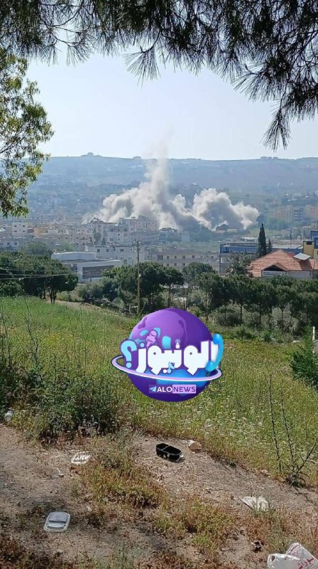

👈جنگنده‌های اسرائیلی شهر کفر رومانی در جنوب لبنان را بمباران کردند.

✅ @AloNews خبر جنگ

## alonews — post 119199

  <a href="telegram/content/alonews_119199_1778487755.mp4">🎬 Download video</a>

👈اظهارات جنجالی ظهره‌وند درباره سلاح سری ایران: من جاها و ظرفیت هایی رو دیدم که اتفاقی میوفته که بمب اتم جلوش ترقه است

🔴شما میتونید زمان رو پشت سر بزارید، چیزی که در چند ثانیه از تهران تا واشنگتن برود

🔴میشه یه کارهایی کرد که بمب اتم جلوش بچه بازیه!

✅ @AloNews خبر جنگ

## alonews — post 119198

  <a href="telegram/content/alonews_119198_1778487756.mp4">🎬 Download video</a>

👈به گفته GB News، نخست‌وزیر بریتانیا کیر استارمر «به نظر می‌رسد این هفته استعفا دهد»

✅ @AloNews خبر جنگ

## alonews — post 119197

  <a href="telegram/content/alonews_119197_1778487758.jpg">🎬 Download video</a>

👈اولین مورد آلوده به ویروس هانتا در فرانسه ثبت شد

✅ @AloNews خبر جنگ

## alonews — post 119196

  

👈لیست دموکرات‌هایی که خواستار آشکار شدن جزئیات برنامه هسته‌ای اسرائیل شده‌اند!

✅ @AloNews خبر جنگ

## alonews — post 119195

  <a href="telegram/content/alonews_119195_1778487759.mp4">🎬 Download video</a>

👈 لحظه تصادف عجیب و پرواز موتور سیکلت بر فراز چراغ راهنمایی!

✅ @AloNews خبر جنگ

## alonews — post 119194

  <a href="telegram/content/alonews_119194_1778487760.jpg">🎬 Download video</a>

👈ریاست جمهوری کره جنوبی: ما حمله به کشتی باری کره‌ای را به شدت محکوم می‌کنیم |پس از شناسایی عامل این حمله، به آن واکنش نشان خواهیم داد

🔴تا کنون درباره نقش ایران در این حمله نمی دانیم

✅ @AloNews خبر جنگ

## alonews — post 119193

👈جهت رزرو تبلیغات برای VPN در کانال #الونیوز به کانال زیر مراجعه کنید👇

📃https://t.me/ads_alonews

📃https://t.me/ads_alonews

<!-- MSG END -->
<!-- NAV START -->
[صفحه قبل](telegram/content/archive_1.md)
<!-- NAV END -->
