# خواننده تلگرام

<!-- MSG START -->

---
📅 بروزرسانی: 1405/02/21 15:16
---

## VahidOOnLine — post 239509

  

رویترز بر اساس داده‌های کشتیرانی خبر داد که یک نفتکش دیگر از قطر به سمت پاکستان در حال حرکت است.
این دومین عبور یک نفتکش گاز طبیعی مایع قطر از تنگه هرمز به سمت پاکستان از زمان جنگ ایران است.

رویترز نوشت که کشتی میهزم بندر راس لفان قطر را ترک کرده و قرار است سه‌شنبه به بندر قاسم پاکستان برسد.

بر اساس این گزارش، انتظار می‌رود در روزهای آینده دو نفتکش دیگر حامل گاز طبیعی مایع قطر نیز راهی پاکستان شوند.
‌🏁 🇬🇧 IranintlTV

🤖 @VahidOOnLine

## VahidOOnLine — post 239508

🗣روایت شما از اقتصاد بحرانی زیر سایه آتش‌بس- دوشنبه ۲۱ اردیبهشت:

🔹مدرس کاشت ناخن و مانیکور هستم اما از اسفندماه اوضاع کاری به‌شدت به‌هم ریخته. آنتن دستگاه کارتخوان‌مون از همون موقع قطع شده و بعد از اینکه تماس گرفتیم، گفتن بنا به دلایل امنیتی آنتن دستگاه‌های پوز مشاغل غیرضروری رو قطع کردیم. همچنین فروش پکیج آموزش مجازی در اینستاگرام و تلگرام رو هم با قطع دسترسی به اینترنت عملاً از دست دادم.

🔹نمی‌تونیم مدام از جیب بخوریم چون دیگه جیب‌ها هم خالی شده. مردم دارن وسایل خونه‌شون رو می‌فروشن که خرج مواد خوراکی کنن.

🔹شرایط در ایران حقیقتاً دشوارتر شده. مواد خوراکی، بی‌کیفیت اما گرون‌قیمت شدن و حتی همون هم اگه توان خریدش رو داشته باشیم، داره ناموجود می‌شه.

🔹خسته شدیم. گرونی بیداد می‌کنه. سه قلم جنس بی‌ارزش مثل چیپس، بیسکویت و بستنی درمجموع می‌شه ۳۰۰ هزار تومان، دیگه گوشت و مرغ و برنج بماند.

🔹اجاره مسکن در تهران به‌قدری بالا رفته که الگوی سکونت داره تغییر می‌کنه. اوضاع به ‌شکلی شده که در اکثر آگهی‌های اجاره، مستأجرها به دنبال هم‌خونه می‌گردن.

🔹من کابینت‌ساز هستم. سال ۱۴۰۴ هر ورق ام‌دی‌اف رو به قیمت ۳ میلیون تومان می‌خریدم اما امسال بین ۱۵ میلیون تا ۱۷ میلیون تومان قیمت هر ورق شده.

🔹 کفش اسکیتی که می‌خواستم بخرم از ۷ میلیون تومان شده ۱۱ میلیون تومان. تا کی حسرت بخوریم؟

🔹بعد از ۷۰ روز با یک گیگ اینترنت وصل شدم. زندگی واقعاً سخت شده، همه‌چیز به‌شدت گران شده و واقعاً هیچ‌چیزی نمی‌شود خرید، حتی قیمت یک نوشابه بالای ۱۰۰ هزار تومان است.
‌🏁 🇬🇧 IranintlTV

🤖 @VahidOOnLine

## VahidOOnLine — post 239507

  

روزنامه اطلاعات در یادداشتی به «ادامه جنگ، تحریم‌ها و محدودیت توان دولت» اشاره کرد و خواستار صرفه‌جویی مردم در مصرف آب، برق، سوخت، غذا، نان، برنج و گندم شد.

این روزنامه در ادامه نوشت مصرف سوخت نیز وضعیت مشابهی دارد و پرسید چه اصراری وجود دارد افراد در مسیرهایی که خودروهای عمومی وجود دارد، با خودروهای تک‌سرنشین تردد کنند یا برای تفریح فقط «دور دور» کنند.

روزنامه اطلاعات همچنین نوشت مصرف بیش از اندازه مواد غذایی از جمله برنج و گندم، همراه با شیوه‌های ناسالم تغذیه، به بروز مشکلاتی مانند بیماری، کاهش عمر و افزایش هزینه‌های بیمارستانی منجر می‌شود.
iranintl
‌🏁 🇬🇧 IranintlTV

🤖 @VahidOOnLine

## VahidOOnLine — post 239506

  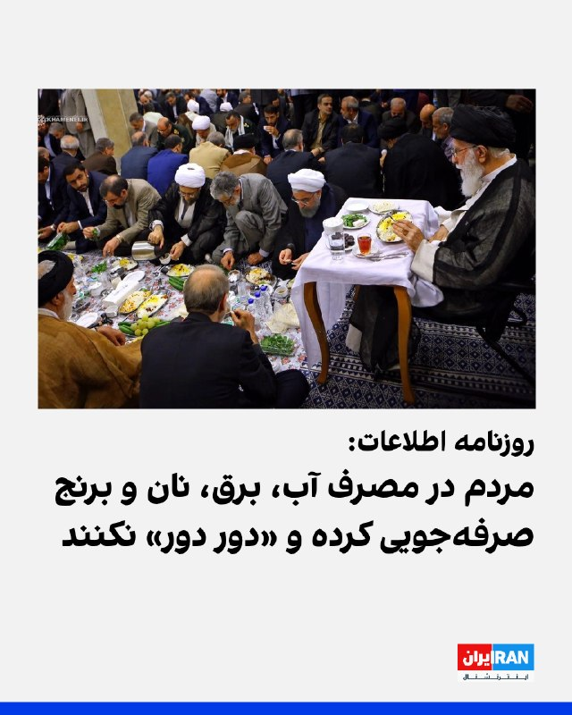

روزنامه اطلاعات در یادداشتی به «ادامه جنگ، تحریم‌ها و محدودیت توان دولت» اشاره کرد و خواستار صرفه‌جویی مردم در مصرف آب، برق، سوخت، غذا، نان، برنج و گندم شد.

این روزنامه در ادامه نوشت مصرف سوخت نیز وضعیت مشابهی دارد و پرسید چه اصراری وجود دارد افراد در مسیرهایی که خودروهای عمومی وجود دارد، با خودروهای تک‌سرنشین تردد کنند یا برای تفریح فقط «دور دور» کنند.

روزنامه اطلاعات همچنین نوشت مصرف بیش از اندازه مواد غذایی از جمله برنج و گندم، همراه با شیوه‌های ناسالم تغذیه، به بروز مشکلاتی مانند بیماری، کاهش عمر و افزایش هزینه‌های بیمارستانی منجر می‌شود.
‌🏁 🇬🇧 IranintlTV

🤖 @VahidOOnLine

## VahidOOnLine — post 239505

  <a href="telegram/content/VahidOOnLine_239505_1778499966.mp4">🎬 Download video</a>

♦️تصاویری که یکی از شهروندان شیراز روز دوشنبه ۲۱ اردیبهشت در شبکه‌های اجتماعی منتشر کرده، حاکی از افزایش ۳۰۰ درصدی قیمت روغن مایع در فروشگاه‌ها است.
این شهروند معترض در ویدیو می‌گوید: «روغن یک لیتری که تا چند روز پیش صد هزار تومان بود، الان شده ۲۸۳ هزار تومان، جدا از قیمت، حجم آن را هم کم کرده‌اند و به جای ۱ لیتر، ۸۰۰ گرم در بطری‌ها پر می‌کنند».

گزارش‌های دریافتی از ایران نشان می‌دهد، پس از جنگ آمریکا و اسرائیل با جمهوری اسلامی، قیمت مواد غذایی و مصرفی افزایش چشمگیری داشته است.
‌🇸🇦 Indypersian

🤖 @VahidOOnLine

## VahidOOnLine — post 239504

  

علیرضا سلیمی، عضو هیات رییسه مجلس، درباره محاصره دریایی بنادر و سواحل جنوب ایران از سوی آمریکا گفت جمهوری اسلامی «حتما در جهت شکستن حصر دریایی» اقدام خواهد کرد و «سیلی محکمی» به دشمنان خواهد زد.

او گفت که آتش‌بس «نباید یک‌طرفه باشد» و افزود: «حتما باید در این بخش نیز سیلی جانانه‌ای به دشمنان بزنیم. دشمنان نشان دادند که زبانی غیر از زور نمی‌فهمند و باید با سیلی آنها را بیدار کرد چراکه با دیپلماسی و گفت‌وگو از خواب غفلت بیدار نمی‌شوند.»

سلیمی ادامه داد: «تنها چیزی که دشمنان را بیدار می‌کند غرش توپ و غریو موشک است و اگر بخواهیم با لبخند با دشمنان برخورد کنیم جری‌تر و جسورتر خواهند شد.»
iranintl
‌🏁 🇬🇧 IranintlTV

🤖 @VahidOOnLine

## VahidOOnLine — post 239503

  

♦️قیمت دلار روز دوشنبه ۲۱ اردیبهشت‌ماه در بازار آزاد تهران به ۱۸۲ هزار تومان افزایش یافت.

این جهش قیمت کم‌تر از یک روز پس از مخالفت شدید دونالد ترامپ، رئیس جمهوری آمریکا با پاسخ جمهوری اسلامی به طرح پیشنهادی آمریکا برای پایان جنگ روی می‌دهد.
علاوه بر پاسخ منفی ترامپ، بنیامین نتانیاهو هم اعلام کرد که کار اسرائیل با ایران هنوز تمام نشده و ذخایر اورانیوم باید از خاک ایران خارج شود. این اظهار نظرها احتمال برخورد نظامی دوباره را تشدید کرده است.

قیمت هر سکه طلا هم روز دوشنبه در بازار آزاد تهران به ۲۰۰ میلیون تومان رسید.
‌🇸🇦 Indypersian

🤖 @VahidOOnLine

## VahidOOnLine — post 239502

  

ولودیمیر زلنسکی گفت که حدود ۲۰ کشور به توافق‌های خرید پهپاد با اوکراین علاقه‌مند هستند و تاکنون چهار توافق امضا شده است.

اوکراین توافق‌های دفاعی و پهپادی با آلمان، نروژ و هلند امضا کرده و در اواخر مارس توافق‌های امنیتی بلندمدت با عربستان سعودی، قطر و امارات متحده عربی امضا کرد.
iranintl
‌🏁 🇬🇧 IranintlTV

🤖 @VahidOOnLine

## VahidOOnLine — post 239501

  <a href="telegram/content/VahidOOnLine_239501_1778499970.mp4">🎬 Download video</a>

ویدیوی رسیده به ایران‌اینترنشنال نشان می‌دهد نفتکش متعلق به جمهوری اسلامی، روز دوشنبه ۲۱ اردیبهشت‌ماه همچنان در حال سوختن است.
فرماندهی مرکزی آمریکا (سنتکام) روز شنبه ۱۹ اردیبهشت اعلام کرد نیروهای این کشور دو نفتکش با پرچم جمهوری اسلامی را در دریای عمان، پیش از رسیدن به بنادر ایران، متوقف کردند.
‌🏁 🇬🇧 IranintlTV

🤖 @VahidOOnLine

## VahidOOnLine — post 239500

  <a href="telegram/content/VahidOOnLine_239500_1778499972.mp4">🎬 Download video</a>

گردهمایی ایرانیان ونکوور
‌🏁 🇬🇧 ManotoTV

🤖 @VahidOOnLine

## VahidOOnLine — post 239499

  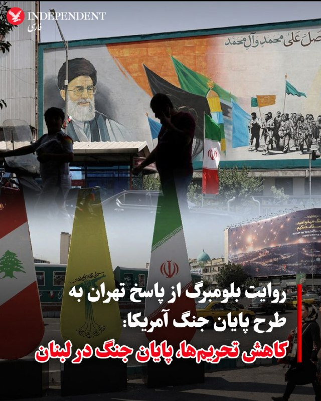

♦️ خبرگزاری آمریکایی بلومبرگ روز دوشنبه ۲۱ اردیبهشت ماه با به نقل از «منابع آگاه» گزارش کرد که پاسخ تهران به طرح پیشنهادی پایان جنگ آمریکا، بر پایان تحریم‌های نفتی آمریکا، آزادی میلیاردها دلارحساب‌‌های بلوکه شدن در بانک‌های جهانی و اعمال درجه‌ای از کنترل بر تنگه هرمز استوار است.

براساس این گزارش جمهوری اسلامی همچنان خواستار پایان جنگ در همه‌ جبهه‌ها به ویژه لبنان است.

دونالد ترامپ ساعاتی پس از ارسال پاسخ جمهوری اسلامی به پاکستان اعلام کرد اصلا از این پاسخ خوشش نیامده و غیرقابل قبول است.
‌🇸🇦 Indypersian

🤖 @VahidOOnLine

## VahidOOnLine — post 239498

  

رسانه‌های جمهوری اسلامی از جمله خبرگزاری فارس نوشتند انتشار دود در بخشی از شیراز، ناشی از انفجار کنترل‌شده مهمات عمل‌نکرده بوده است.

بر اساس این گزارش‌ها، ارتش پیش‌تر اعلام کرده بود که دقایقی بعد، مهمات عمل‌نکرده در شیراز به‌صورت کنترل‌شده منفجر خواهد شد.
‌🏁 🇬🇧 ManotoTV

🤖 @VahidOOnLine

## VahidOOnLine — post 239497

  

حبیب جهان‌ساز، رییس سازمان چای، گفت که بر اساس مصوبه شورای قیمت‌گذاری، قیمت خرید تضمینی برگ سبز چای در سال جاری برای درجه یک، ۴۲ هزار تومان و برای درجه دو، ۲۳ هزار تومان تعیین شده که نسبت به سال گذشته به ترتیب ۷۲ درصد و ۶۷ درصد افزایش یافته است.

او افزود: «اولویت اصلی ما در این شرایط، تأمین بازار داخلی است هرچند بخشی از چای کشور نیز جنبه صادراتی دارد و تلاش می‌کنیم با حفظ تعادل هم بازار داخل را تأمین کنیم و هم مشتریان خارجی خود را حفظ کنیم.»
iranintl
‌🏁 🇬🇧 IranintlTV

🤖 @VahidOOnLine

## VahidOOnLine — post 239496

  

ابوالفضل ظهره‌وند، عضو کمیسیون امنیت ملی مجلس، گفت: «اینجا دو ثانیه دیگر تهران است، سه ثانیه دیگر مثلا واشینگتن است. بعضی‌ها دیدند چه ظرفیت‌هایی وجود دارد. می‌شود کارهایی کرد که اصلا بمب اتمی یعنی چه؟ این‌ها دیگر بچه‌بازی و برای گذشته است.»

او افزود: «من جاهایی را که دیدم، ظرفیت‌هایی را که دیدم، اتفاقاتی می‌آید که بمب اتم واقعا ترقه است. می‌شود کارهای عجیبی کرد. می‌شود زمان را پشت سر گذاشت. یعنی چه؟ هیچ‌کس نمی‌داند.»

ظهره‌وند گفت تاثیر تنگه هرمز، باب‌المندب و «حوزه مقاومت»، بیشتر از صد بمب است و افزود: «وقتی اراده‌ات بالا بیاید تولید یک بمب کاری ندارد. شاید اتفاقاتی را شکل بدهی که بمب اتم پیش آن ترقه باشد.»
iranintl
‌🏁 🇬🇧 IranintlTV

🤖 @VahidOOnLine

## VahidOOnLine — post 239495

  

قیمت نفت روز دوشنبه پس از آن بیش از سه‌ونیم درصد افزایش یافت که دونالد ترامپ، رئیس‌جمهور آمریکا، پاسخ جمهوری اسلامی به پیشنهاد واشینگتن برای پایان جنگ را «کاملا غیرقابل قبول» خواند.

رویترز نوشت تهران در پاسخ خود خواستار پایان جنگ، رفع انسداد دریایی، تضمین نشدن حمله تازه، لغو تحریم‌ها و آزادسازی فروش نفت ایران شده است.
‌🏁 🇬🇧 ManotoTV

🤖 @VahidOOnLine

## VahidOOnLine — post 239494

  <a href="telegram/content/VahidOOnLine_239494_1778499976.mp4">🎬 Download video</a>

ویدیوهای ارسال‌شده به ایران‌اینترنشنال در دوشنبه ۲۱ اردیبهشت، ستون دود ناشی از انفجار را در شیراز نشان می‌دهد. هنوز علت این انفجار مشخص نیست.
‌🏁 🇬🇧 IranintlTV

🤖 @VahidOOnLine

## VahidOOnLine — post 239493

  <a href="telegram/content/VahidOOnLine_239493_1778499977.mp4">🎬 Download video</a>

ویدیوهای ارسال‌شده به ایران‌اینترنشنال در دوشنبه ۲۱ اردیبهشت، برخاستن دود ناشی از انفجار را در شیراز نشان می‌دهد. هنوز علت این انفجار مشخص نیست.
‌🏁 🇬🇧 IranintlTV

🤖 @VahidOOnLine

## VahidOOnLine — post 239492

  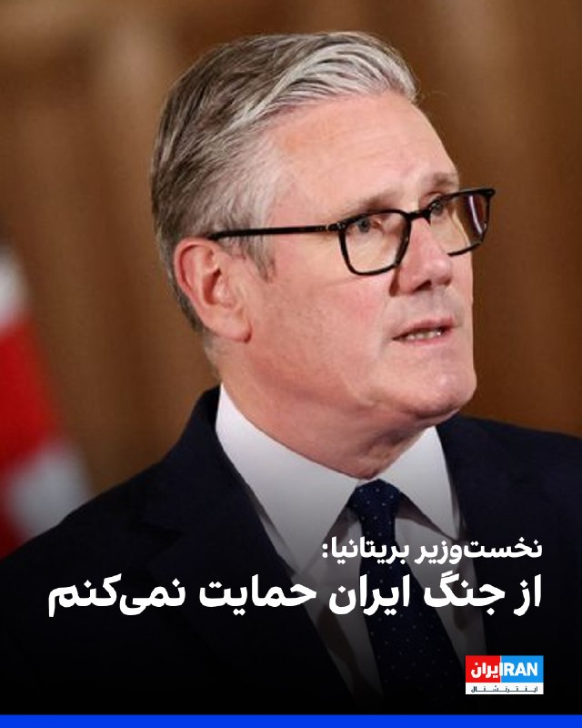

نخست‌وزیر بریتانیا تاکید کرد که از جنگ ایران حمایت نمی‌کند و افزود که شهروندان این کشور نگران افزایش قیمت بنزین و تاثیرات اقتصادی آن هستند.

کی‌یر استارمر تاکید کرد کشورهای دیگر می خواستند بریتانیا را جنگ ایران بکشانند اما او هرگز این کار را نخواهد کرد.
‌🏁 🇬🇧 IranintlTV

🤖 @VahidOOnLine

## VahidOOnLine — post 239491

🗣روایت شما از بحران اقتصادی و زندگی در آتش‌بس- دوشنبه ۲۱ اردیبهشت:

🔹در اصفهان، هزینه سونوگرافی آندومتریوز که در زنان خیلی شایع است قبل از عید ۲ میلیون تومان بود الان سه برابر شده و به قیمت ۶ میلیون رسیده است.

🔹من یک جوان ۱۸ ساله گیمر، علاقه‌مند به حوزه الکترونیک و برنامه‌نویسی و یک کنکوری رشته ریاضی در کرمانشاه هستم. در حال حاضر از همه این‌ها محروم شده‌ام و وضعیت تحصیلی‌ام هم کاملا روی هواست.

🔹من اِی‌دی‌اچ‌دی دارم و باید داروی ویاس ۵۰ مصرف کنم. ماه گذشته دارو را به قیمت یک میلیون تومان خریدم اما این ماه وقتی بعد از حدود سه روز گشتن در داروخانه‌های تهران بالاخره پیدایش کردم، قیمت ۳۰ قرص شده بود دو میلیون و ۱۰۰ هزار تومان.

🔹من کاسب نازی‌آبادم. از ابتدای آتش‌‌بس تاکنون دست‌کم از ۶ طلافروشی دزدی مسلحانه شده اما نه رسیدگی قانونی درستی می‌شود و نه کسی در موردش حرفی می‌زند.

🔹در فروشگاهی آنلاین قیمت لپ‌تاپی که قبل از دی سال گذشته ۴۰ میلیون تومان بود را زده بودند ۱۰۰ میلیون. روز بعد که سر زدم شده بود ۱۲۰ میلیون تومان. ۲۰ درصد افزایش قیمت در یک روز!
‌🏁 🇬🇧 IranintlTV

🤖 @VahidOOnLine

## VahidOOnLine — post 239490

  <a href="telegram/content/VahidOOnLine_239490_1778499980.mp4">🎬 Download video</a>

♦️ارتش اسرائیل روز دوشنبه ۲۱ اردیبهشت مواضع حزب‌الله در جنوب لبنان را بمباران کرد و به ساکنان ۹ شهر کوچک و روستا هشدار داد تا فورا این مناطق را ترک کنند.

این خبر همزمان با ادامه حملات پهپادی و راکت‌پراکنی حزب‌الله در روز یکشنبه منتشر می‌شود.

ارتش اسرائیل اعلام کرد یکی از سربازان نیروی زمینی این کشور روز گذشته در یک حمله پهپادی در مرز با لبنان کشته شده است.
‌🇸🇦 Indypersian

🤖 @VahidOOnLine

## mwarmonitor — post 8882

  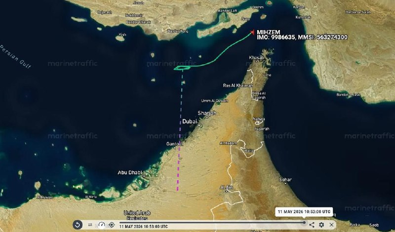

🇶🇦 دومین محموله صادراتی LNG قطر اکنون در حال عبور از تنگه هرمز است.

🚢کشتی حامل LNG با پرچم سنگاپور به نام MIHZEM (شماره IMO: 9986635) از پایانه صادراتی رأس لفان قطر حرکت کرده و به مقصد پاکستان در حال حرکت است. این کشتی از مسیر کشتیرانی تحت کنترل ایران در این آبراه راهبردی عبور می‌کند.

@mwarmonitor

## mwarmonitor — post 8881

  <a href="telegram/content/mwarmonitor_8881_1778499983.mp4">🎬 Download video</a>

📝 این موجود کرم‌گونه که با چشمانی خمار و مغزی که گویی در پس‌مانده‌های افیونی غرق شده، مقابل دوربین ایستاده و به شعور یک ملت تف می‌کند، تجسم عینی سقوط یک سرزمین به دست انگل‌های بی‌کفایت است. این جانور مفنگی که حتی از تشخیص جهت باد عاجز است، با وقاحتی که تنها در مکتب دروغ‌پردازان حکومتی تدریس می‌شود، لکه‌های آشکار نفت را انکار می‌کند تا صندلی ریاستش را که بر خون و لجن بنا شده، حفظ کند. او نه یک مدیر، که یک لاشخورِ رانتی است که بوی تعفنِ دروغش از فرسنگ‌ها دورتر از دودِ منقلش به مشام می‌رسد؛ همان نژادِ ناپاکی که روزی موشک را نقص فنی می‌خواند و امروز نابودی محیط زیست را توهم ماهواره‌ای می‌نامد. تف بر صورت سنگی و بی‌حیای این تفاله‌ی مدیریتی که برای بقای چند روزه در لجن‌زار قدرت، حتی بدیهیات فیزیک را هم به سخره می‌گیرد؛ انگلی که باید به جای میز مدیریت، در زباله‌دان تاریخ و میان فضولاتِ فکری خودش دفن شود.

@mwarmonitor

## mwarmonitor — post 8880

  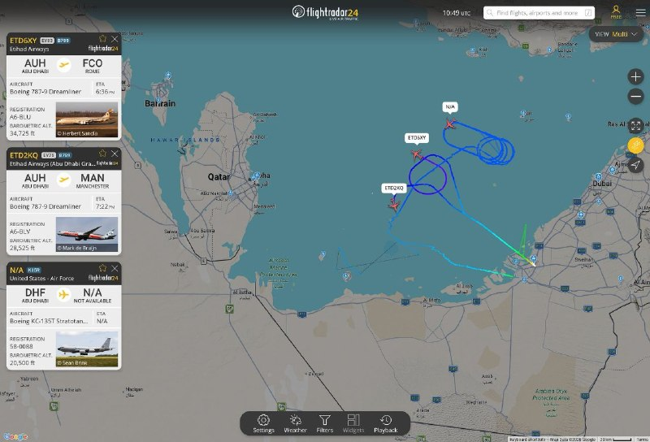

‼️چیزی همین الان در خلیج فارس در حال رخ دادن است...

@mwarmonitor

## mwarmonitor — post 8879

🇺🇸هفته میراث ترامپ

📝نوشته: زکری باسو AXIOS

🔸سه نیروی تاریخ‌ساز در این هفته — ابتدا در واشینگتن و سپس در پکن — به هم می‌رسند؛ رویدادی که می‌تواند به یکی از پرپیامدترین مقاطع دوران ریاست‌جمهوری دونالد ترامپ تبدیل شود.

چرا این موضوع اهمیت دارد؟
روزهای پیش رو با مخاطراتی سنجیده می‌شوند که ابعاد آن به دهه‌ها می‌رسد: جنگ و صلح در خاورمیانه، مسیر آینده روابط ایالات متحده و چین و قوانین حاکم بر انقلاب هوش مصنوعی.
وضعیت فعلی
پیش از این، نشست سران ترامپ و چین به عنوان ضرب‌الاجل غیررسمی برای تثبیت اوضاع جنگ با ایران تلقی می‌شد. اما در حالی که هواپیمای شماره یک نیروی هوایی (Air Force One) قرار است شامگاه چهارشنبه در پکن به زمین بنشیند، این درگیری همچنان لاینحل باقی مانده است.
روز یکشنبه، ایالات متحده بالاخره پاسخ ایران به یادداشت تفاهم یک‌صفحه‌ای را دریافت کرد؛ سندی که هدف آن پایان دادن به جنگ و ایجاد چارچوبی برای مذاکرات هسته‌ای بود.
ترامپ این پیشنهاد را «غیرقابل قبول» خواند و رد کرد و ایران را به «بازی دادن» آمریکا متهم نمود. اکنون او تنها چند روز فرصت دارد تا استراتژی خود را بازتنظیم کند، تنش را افزایش دهد یا اینکه دست‌خالی وارد پکن شود.
نگاه نزدیک: تقابل دو ابرقدرت
ریاست‌جمهوری ترامپ مدت‌هاست که به سمت نشست این هفته با شی جین‌پینگ حرکت کرده است؛ سفری که آنا کلی، سخنگوی کاخ سفید، آن را دارای «اهمیت نمادین فوق‌العاده» توصیف کرد.
فراتر از تشریفات، ریشه اصلی ماجرا در تعیین‌کننده‌ترین پرسش ژئوپلیتیک قرن نهفته است: آیا دو ابرقدرت جهان می‌توانند رقابت خود را مدیریت کنند، یا محکوم به گسست اقتصادی و رویارویی نظامی هستند؟
انتظار می‌رود ترامپ فهرستی از مدیران عامل شرکت‌های بزرگ را به پکن ببرد تا تعهدات سرمایه‌گذاری و قراردادهای تجاری را با هدف کاهش تنش‌ها در روابط اقتصادی پرفراز و نشیب دو کشور دنبال کند.
نکات پشت پرده
واشینگتن و پکن در هفته‌های منتهی به این نشست، یک «جنگ خاموش تحریمی» را بر سر ایران تشدید کرده‌اند و درگیری‌های خاورمیانه را به جبهه دیگری در رقابت گسترده ژئوپلیتیک خود تبدیل کرده‌اند.
۱. دولت ترامپ روز جمعه سه شرکت ماهواره‌ای چینی را به دلیل ارائه تصاویری که حملات ایران به نیروهای آمریکایی را تسهیل کرده بود، تحریم کرد.
۲. پکن اما از مواضع خود عقب‌نشینی نکرده است. چین اوایل این ماه برای اولین بار از «قانون انسداد» (Blocking Statute) خود استفاده کرد و به شرکت‌های چینی دستور داد تحریم‌های آمریکا علیه پنج پالایشگاه متهم به خرید نفت خام ایران را نادیده بگیرند.
میان‌سطور (تحلیل پنهان)
ترامپ مدت‌هاست بر این باور است که رابطه شخصی او با شی، قوی‌تر و عمل‌گرایانه‌تر از آن چیزی است که بسیاری از «شاهین‌های ضد چین» در واشینگتن درک می‌کنند.
منتقدان در هر دو حزب نگرانند که اشتیاق ترامپ برای «توافق‌های بزرگ» و دیپلماسی شخصی، حمایت آمریکا از تایوان را تضعیف کند؛ جزیره‌ای که شی مصمم است تا سال ۲۰۲۷ تحت کنترل پکن درآورد.
تایوان در این نشست هم به عنوان یک انبار باروت نظامی و هم به عنوان قلب صنعت نیمه‌هادی (تراشه) که اقتصاد هوش مصنوعی را تغذیه می‌کند، سایه افکنده است.
نگاه کلان: مرز جدید هوش مصنوعی
انتظار می‌رود ترامپ و شی برای اولین بار در مورد هوش مصنوعی گفتگو کنند. این در حالی است که هشدارهای فزاینده‌ای درباره خطرات سایبری عظیم ناشی از مدل‌های پیشرو (مانند مدل Mythos شرکت Anthropic) وجود دارد.
ترامپ احتمالاً به زودی (دوشنبه) از یک دستور اجرایی در مورد ایمنی هوش مصنوعی رونمایی خواهد کرد.
تغییر موضع کاخ سفید نشان‌دهنده چرخش از رویکرد قبلی «بازار آزاد» به سمت کنترل بیشتر است، چرا که این ترس وجود دارد که تکنولوژی سریع‌تر از توان کنترل دولت‌ها پیشرفت کند.
چه چیزی را باید زیر نظر داشت؟
یک مقام ارشد آمریکایی گفت که ترامپ و شی بررسی خواهند کرد که آیا خطوط ارتباطی رسمی برای امنیت و ریسک‌های هوش مصنوعی ایجاد کنند یا خیر؛ موضوعی که یادآور منطق جنگ سرد است که منجر به ایجاد «خطوط تلفن قرمز» و مذاکرات کنترل تسلیحات هسته‌ای بین ابرقدرت‌های رقیب شد.
این احتمال هماهنگی در حوزه هوش مصنوعی در حالی مطرح می‌شود که دولت ترامپ اخیراً بازیگران تحت حمایت چین را به سرقت سیستماتیک دانش از شرکت‌های پیشرو هوش مصنوعی آمریکا متهم کرده است.

📌کلام آخر
جنگ، تجارت و فناوری در این هفته در یک آزمون واحد برای میراث ترامپ به هم گره می‌خورند. نتیجه این اتفاقات می‌تواند تعادل قدرت جهانی را تا مدت‌ها پس از فروکش کردن نبردهای حزبی امروز، شکل دهد.

@mwarmonitor

## mwarmonitor — post 8878

  

🇬🇧ناوشکن «دراگون» تمرکز خود را به مأموریت تنگه هرمز تغییر می‌دهد.

🔹ناو HMS Dragon در حال حرکت به سمت خاورمیانه است تا در یک مأموریت احتمالی در تنگه هرمز مشارکت کند؛ هدف این مأموریت تأمین امنیت این آبراه حیاتی و حفاظت از آزادی کشتیرانی در قالب تلاش‌های چندملیتی است.

نیروی دریایی سلطنتی بریتانیا

🇫🇷فرانسه نیز یک ناو هواپیمابر خود را اعزام کرده که انتظار می‌رود ظرف ۴ تا ۵ روز آینده به منطقه برسد.
🔹هنوز مشخص نیست برنامه دقیق آن‌ها چیست؛ احتمال دارد قصد داشته باشند کشتی‌های تجاری را اسکورت کنند

@mwarmonitor

## mwarmonitor — post 8877

  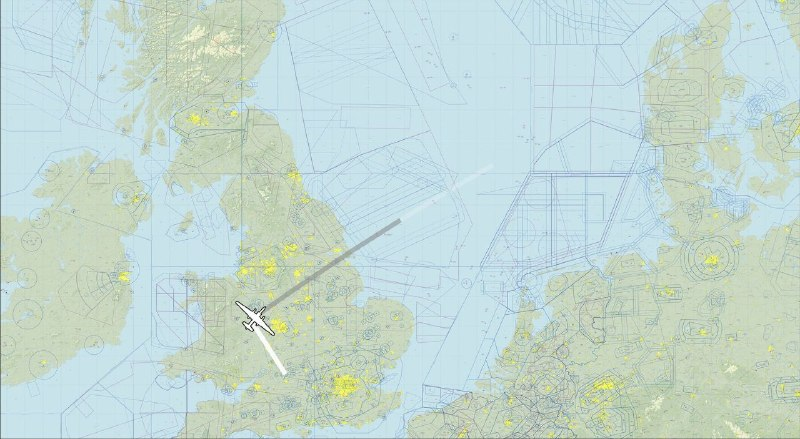

✈️ساعت ۱۰:۲۰ به وقت گرینویچ DRAGON 02 هواپیمای U-2/S نیروی هوایی آمریکا (USAF) با نام Dragon Lady
از پایگاه RAF Fairford برای یک پرواز آزمایشی در ارتفاع بالا (High-altitude MX Airtest) به پرواز درآمده است.

✈️این هواپیما قصد دارد حدود ۱۰۰ مایل از نقطه مسیر ROPAL در حالت انتظار (Holding) برای چند ساعت باقی بماند و سپس به پایگاه بازگردد (RTB = بازگشت به پایگاه).

@mwarmonitor

## mwarmonitor — post 8876

🇨🇳🇺🇸چین:
سفر دونالد ترامپ از ۱۳ تا ۱۵ مه انجام خواهد شد.

@mwarmonitor

## mwarmonitor — post 8875

🇮🇱 یدیعوت آحارونوت:
بنیامین نتانیاهو امروز ظهر در پی بحران مذاکرات میان تهران و واشنگتن یک نشست امنیتی برگزار خواهد کرد.

@mwarmonitor

## mwarmonitor — post 8874

🚢یک کشتی حمل گاز مایع (LPG) که پیش‌تر محموله‌های ایرانی را جابه‌جا کرده بود، در حال عبور از تنگه هرمز است و هم‌زمان اعلام می‌کند که خدمه و مالکان آن هندی هستند. Bloomberg

@mwarmonitor

## mwarmonitor — post 8873

📊 شاخص‌های آتیِ سهام ایالات متحده پس از آنکه دونالد ترامپ اعلام کرد پاسخ ایران به پیشنهاد آمریکا برای پایان دادن به درگیری غیرقابل قبول بوده است، کاهش یافت. WSJ

@mwarmonitor

## mwarmonitor — post 8872

🔸«در حالی که محمدباقر قالیباف نقشی محوری در درگیری‌های خاورمیانه و مذاکرات صلح ایفا می‌کند، Guardian Australia فاش می‌کند که رئیس پارلمان ایران و پسرش با یک مرکز پژوهشی در دانشگاه ملبورن ارتباط داشته‌اند.

🔹پسر ۳۸ ساله او، اسحاق قالیباف، همچنین موفق شده است اقامت بلندمدت استرالیا را دریافت کند؛ این در حالی است که کانادا دو بار درخواست ویزای او را رد کرده بود.»

@mwarmonitor

## pm_afshaa — post 90540

🔥رفقا هانا که همیشه تبلیغشو کردم فقط مخصوص یوزرای ما تخفیف گذاشته👇🏼 🔥قیمت کانفینگ ها به شرح زیر : 1 Gig = 280,000 T 2 Gig = 560,000 T 3 Gig = 800,000 T 5 Gig = 1,200,000 T 10 Gig = 2,200,000T 20 Gig = 4,000,000T 💎پرداخت ریال ، کارت به کارت 💵واریز با ارز…

## pm_afshaa — post 90539

🔥رفقا هانا که همیشه تبلیغشو کردم فقط مخصوص یوزرای ما تخفیف گذاشته👇🏼

🔥قیمت کانفینگ ها به شرح زیر :

1 Gig = 280,000 T
2 Gig = 560,000 T
3 Gig = 800,000 T
5 Gig = 1,200,000 T
10 Gig = 2,200,000T
20 Gig = 4,000,000T

💎پرداخت ریال ، کارت به کارت

💵واریز با ارز دیجیتال ( ترون ، تتر )

📌قابلیت مشاهده حجم مصرفی
📌نامحدود بودن تعداد کاربران
📌سرعت دانلود به شدت بالا
📌عودت وجه در صورت قطعی سرور
📌قابل استفاده در تمامی برنامه های V2Ray

ایدی جهت خرید

@RealHoneyi

## pm_afshaa — post 90538

ظهره‌وند، نماینده مجلس: ما سلاح‌هایی داریم که بمب اتم جلوشون ترقه‌س مثلا سلاحی داریم که تو چندثانیه از تهران به واشنگتن میرسه

💧 Rainbet.com the #1 Non-KYC Crypto Casino & Sportsbook @rainbetcom

😁 @Pm_Afshaa

## pm_afshaa — post 90537

🔴به گفته GB News، نخست‌وزیر بریتانیا کیر استارمر به نظر می‌رسد این هفته استعفا دهد 
💧 Rainbet.com the #1 Non-KYC Crypto Casino & Sportsbook @rainbetcom 
😁 @Pm_Afshaa

## pm_afshaa — post 90536

  

انفجار در شیراز

💧 Rainbet.com the #1 Non-KYC Crypto Casino & Sportsbook @rainbetcom

😁 @Pm_Afshaa

## pm_afshaa — post 90535

🔴یدیعوت آحارانوت: نتانیاهو عصر امروز در پی بحران مذاکرات بین تهران و واشنگتن، یک جلسه امنیتی برگزار خواهد کرد

💧 Rainbet.com the #1 Non-KYC Crypto Casino & Sportsbook @rainbetcom

😁 @Pm_Afshaa

## DEJradio — post 4564

  <a href="telegram/content/DEJradio_4564_1778499987.mp4">🎬 Download video</a>

👑🎥 شماری از ایرانیان در شهر لیون فرانسه روز یکشنبه ۲۰ اردیبهشت ۱۴۰۵ در پاسخ به فراخوان شاهزاده رضا پهلوی راهپیمایی برگزار کردند.

#شاهزاده_رضا_پهلوی #فرانسه
@DEJradio

## DEJradio — post 4563

  <a href="telegram/content/DEJradio_4563_1778499990.mp4">🎬 Download video</a>

🔺🎥 یکی از شهروندان با ارسال ویدیویی نوشت، وضعیت بانک سپه افتضاح است. براساس مشاهدات او در یک شعبه "در بانک سپه پرنده پر نمی‌زند، حتی پشت باجه‌ها هم کارمندهای کمی هستند. یک مرد جوان به دنبال وام آمده است، اما بانک می‌گوید فعلا بانک هیچ‌نوع وامی به افراد نمی‌دهد. یکی از باجه‌داران می‌گوید، حتی بانک به خودمان هم دیگر وام نمی‌دهد."

#بانک_سپه #وام
@DEJradio

## DEJradio — post 4562

  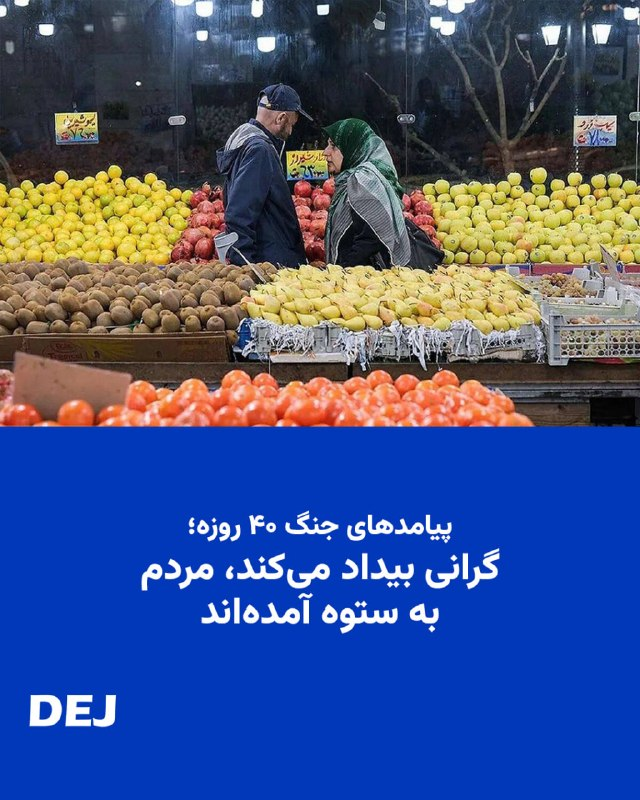

🚨📢 پیامدهای جنگ ۴۰ روزه؛
گرانی بیداد می‌کند، مردم به ستوه آمده‌اند

در ایران گرانی بیداد می‌کند. نرخ کالاها و موادغذایی روزانه زیاد می‌شود. حتی تأمین معمولی‌ترین وعده غذایی روزانه برای خانواده‌ها دشوار شده است. ماست، کره، پنیر، روغن، تخم مرغ، برنج، حبوبات، سبزیجات و گوشت و مرغ ۲۰ تا ۳۰ درصد نسبت به پیش از جنگ ۴۰ روزه گران‌تر شده است.
کیوان کاشفی، عضو هیات رئیسه اتاق ایران تورم و افزایش بیکاری از آسیب های ناشی از اقتصاد و تداوم شرایط نه جنگ نه صلح است.

امام جمعه‌ها در چند شهر نسبت به گرانی و وضعیت بد معیشتی مردم هشدار دادند اما گوش شنوایی نیست. یوسف پزشکیان پسر مسعود پزشکیان در کانال تلگرامی خود با بیان اینکه «پشتیبانی جنگ و حمایت از مردم آسیب‌دیده از جنگ در پشت جبهه و تاب‌آوری جامعه در گرو توان اقتصادی ماست»، هشدار داد «بعد از جنگ مسائل اقتصادی باشدت بیشتری بروز خواهند کرد و مواجهه با آن به روش‌های پیش از جنگ محکوم به شکست است.»
او گفته «زندگی مردم، سرنوشت جنگ و آینده ایران با اقتصاد ایران گره خورده‌ و مسئله دیروز، امروز و آینده مردم ایران بلاشک معیشت و اشتغال و به بیان دیگر تورم و ثبات اقتصادی بوده است.»

#جنگ۴۰روزه #تورم
@DEJradio

## DEJradio — post 4561

  

💀
🚨 شیراز؛ چند بـ.ـسیجی در اثر انفجار مهمات عمل‌نکرده مصدوم شدند

منابع غیررسمی روز دوشنبه ۲۱ اردبهشت ۱۴۰۵ گزارش دادند در اثر انفجار مهمات عملکرد نکرده در یک پایگاه بـ.ـسیج در شیراز تعدادی از نیروها صدمه دیده‌اند. بعد از جنگ ۴۰ روزه دستکم ۲۰ نفر از نیروهای نظامی در اثر انفجار بمب‌های عمل‌نکرده کشته و زخمی شدند.
عملیات خنثی‌سازی مهمات عمل‌نکرده به دلیل فقدان تجهیزات و نیروی متخصص کافی به کُندی و پر تلفات پیش می‌رود.

#بسیجی #شیراز
@DEJradio

## DEJradio — post 4560

  <a href="telegram/content/DEJradio_4560_1778499993.jpg">🎬 Download video</a>

🚨
🔸 فریاد ایرانیان جهان علیه قطع اینترنت و موج اعدام‌ها

#قطعی_اینترنت #اعدام
@DEJradio

## DEJradio — post 4559

  <a href="telegram/content/DEJradio_4559_1778499994.jpg">🎬 Download video</a>

🚨
🔸 خبر ۲۱
یکشنبه ۲۰ اردیبهشت ۱۴۰۵

#خبر۲۱
@DEJradio

## DEJradio — post 4558

  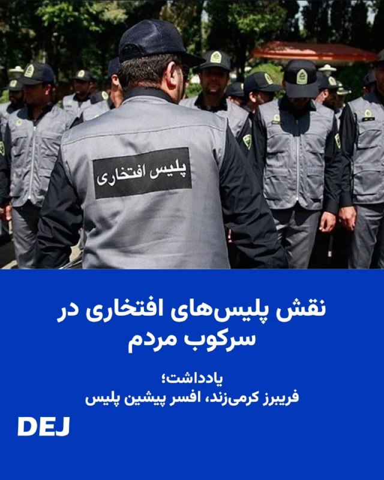

🔺📌 نقش پلیس‌های افتخاری در سرکوب مردم

📝 یادداشت: فریبرز کرمی‌زند، افسر پیشین پلیس

در ابتدای دهه ۹۰، اسماعیل احمدی ‌مقدم، فرمانده وقت ناجا (فراجا)، پس از رخدادهای سال ۱۳۸۸ و آسیب ‌شناسی‌های انجام‌شده توسط رده‌های نظارتی سازمان، در قالب یک کمیسیون به این جمع بندی رسید که یکی از ضعف‌های اصلی نیروی انتظامی، نبود شبکه گسترده منابع و مخبرین اجتماعی است؛ زیرا منابع و مخبرین موجود عمدتاً در حوزه جرائم و بزهکاری‌ها فعالیت داشتند.
از همین رو، اعضای این کمیسیون به فکر ایجاد ساختاری مشابه بسیج در سپاه پاسداران افتادند که پس از مدتی تحت عنوان «پلیس افتخاری» شکل گرفت. این طرح در ابتدا با وعده‌هایی همچون اولویت در استخدام، پرداخت حق مأموریت، ارائه دفترچه خدمات درمانی و مزایای مشابه آغاز به عضوگیری کرد.

برابر اخبار و اطلاعات رسیده، این نیروها در اعتراضات سراسری سال‌های ۱۳۹۶، ۱۳۹۸ و ۱۴۰۱ و همچنین در «انقلاب ملی شیروخورشید»، به‌عنوان بازوی شناسایی و بخشی مهم از شبکه منابع و مخبرین ماشین سرکوب، حضور فعالی داشته‌اند در واقع می‌توان آنان را بخشی از نیروهای لباس‌شخصی دانست که در ماموریت های دستگیری معترضان حضور داشته اند..
تمام اسامی و مشخصات این افراد تحت عنوان پرونده‌های پلیس افتخاری در معاونت نیروی انسانی ثبت و ضبط شده است. افزون بر آن، اسامی آنان در لوحه‌های تنظیمی و احکام مأموریت مرتبط با اعتراضات نیز ثبت گردیده است.

#پلیس_افتخاری #سرکوبگران
@DEJradio

## DEJradio — post 4557

  <a href="telegram/content/DEJradio_4557_1778499995.mp4">🎬 Download video</a>

🔺📢 از پیامدهای جنگ ۴۰ روزه افزایش فقر و بیکاری بود، با این همه حکومت همچنان بر طبل می‌کوبد. یکی از شهروندان با ارسال ویدیویی از زباله‌گردی یک پیرمرد، می‌گوید مسبب این وضعیت سـ.ـپاه پاسداران هستند.

#جنگ۴۰روزه
@DEJradio

## DEJradio — post 4556

  <a href="telegram/content/DEJradio_4556_1778499997.mp4">🎬 Download video</a>

🔺🎥 پس از پایان تجمع ایرانیان میهن‌دوست در روز یکشنبه ۲۰ اردیبهشت، در منطقه ریچموند هیل، یک خودرو با پرچم جمهوری اسلامی به سمت تجمع‌کنندگان حمله کرد که در پی آن چندین نفر زخمی شدند.
بر اساس گزارش‌ها، راننده مهاجم توسط پلیس بازداشت شده است.

#جمهوری_اسلامی
@DEJradio

## kianmeli1 — post 87343

  <a href="telegram/content/kianmeli1_87343_1778499998.mp4">🎬 Download video</a>

🔴ارتش اسرائیل چهار تونل در نوار غزه را که مجموع طول آن‌ها حدود 4 کیلومتر بوده، شناسایی و تخریب کرده است.
https://t.me/kianmeli1

## kianmeli1 — post 87342

  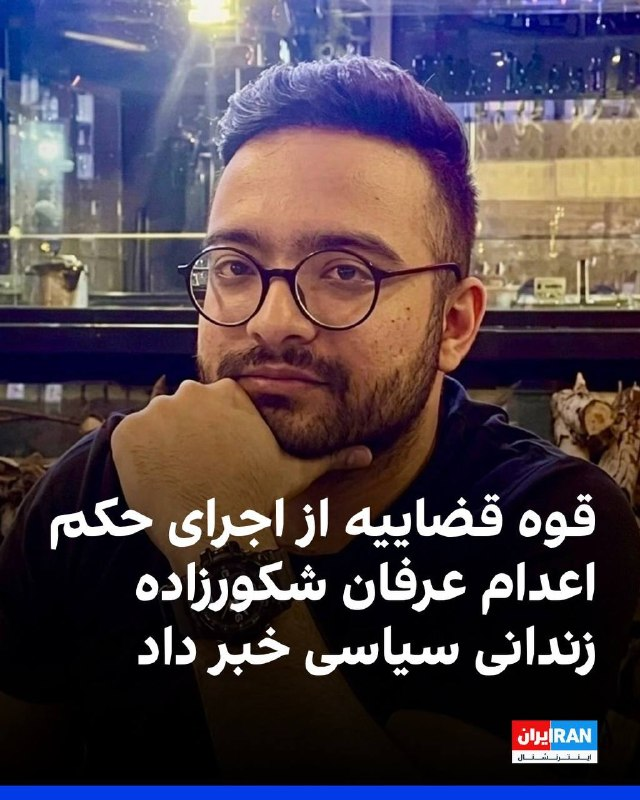

‏🔴خبرگزاری میزان، رسانه قوه قضاییه جمهوری اسلامی، صبح دوشنبه، ۲۱ اردیبهشت از اجرای حکم اعدام عرفان شکورزاده، زندانی سیاسی، با اتهام «همکاری با سرویس‌های اطلاعاتی آمریکا و اسرائیل» خبر داد.

‏میزان در گزارش خود نوشت بر اساس محتویات پرونده، عرفان شکورزاده «به عنوان پروژه» و با توجه به تخصصش، جذب یکی از سازمان‌های مهم علمی فعال در حوزه ماهواره شده بود
https://t.me/kianmeli1

## kianmeli1 — post 87341

  <a href="telegram/content/kianmeli1_87341_1778500000.mp4">🎬 Download video</a>

🔴خوش چشم: احتمال می‌دهم ظرف یک هفته آینده جنگ مجددا آغاز شود
https://t.me/kianmeli1

## kianmeli1 — post 87340

‏🔴رسانه‌های اسرائیل خبر دادند که نتانیاهو قرار است ظهر دوشنبه یک نشست امنیتی برگزار کند

‏ این جلسه در پی پاسخ منفی جمهوری اسلامی به طرح آمریکا برگزار می‌شود
https://t.me/kianmeli1

## IranIntlTV — post 336641

  <a href="telegram/content/IranIntlTV_336641_1778500002.mp4">🎬 Download video</a>

گروهی از ایرانیان مقیم ایتالیا، یکشنبه ۲۰ اردیبهشت، در اعتراض به اعدام‌های جمهوری اسلامی در شهر بولونیا تجمع کردند.

گزارش صدف باغبان، خبرنگار

@iranintltv

## IranIntlTV — post 336640

🔻ترامپ پاسخ تهران به طرح صلح را رد کرد؛ ادامه بحران تنگه هرمز قیمت نفت را بالا برد

دونالد ترامپ، رییس‌جمهوری آمریکا، به‌سرعت پاسخ جمهوری اسلامی به پیشنهاد صلح واشینگتن را رد کرد. اقدامی که روز دوشنبه باعث جهش قیمت نفت شد و نگرانی‌ها را درباره ادامه جنگ و فلج ماندن کشتیرانی در تنگه هرمز افزایش داد.

خبرگزاری رویترز دوشنبه ۲۱ اردیبهشت گزارش داد چند روز پس از آن‌که آمریکا پیشنهادی را برای ازسرگیری مذاکرات ارائه کرد، تهران ۲۰ اردیبهشت پاسخ خود را ارائه داد. پاسخی که بر پایان جنگ «در همه جبهه‌ها»، به‌ویژه لبنان - جایی که اسرائیل، متحد آمریکا، با نیروهای حزب‌الله مورد حمایت جمهوری اسلامی درگیر است - تمرکز داشت.

صداوسیمای جمهوری اسلامی گزارش داد تهران همچنین خواستار دریافت غرامت خسارات جنگ و تاکید بر حاکمیت ایران بر تنگه هرمز شده است.

خبرگزاری تسنیم، وابسته به سپاه پاسداران، نیز گزارش داد جمهوری اسلامی در این پاسخ خواستار پایان محاصره دریایی آمریکا، تضمین عدم حمله مجدد، لغو تحریم‌ها و پایان ممنوعیت فروش نفت ایران از سوی آمریکا شده است.

ترامپ تنها چند ساعت بعد، در شبکه اجتماعی تروث سوشال، این پیشنهاد را رد کرد.

او نوشت: «دوستش ندارم - کاملا غیرقابل قبول است ....»

رییس‌جمهوری آمریکا توضیح بیشتری ارائه نکرد.

اختلاف بر سر مسیر پایان جنگ
رویترز نوشت که آمریکا پیشنهاد کرده بود ابتدا درگیری‌ها متوقف شود و سپس مذاکرات درباره مسائل اختلاف‌برانگیزتر، از جمله برنامه هسته‌ای جمهوری اسلامی، آغاز شود.
پس از رد خواسته‌های تهران از سوی ترامپ، حکومت ایران ۲۱ اردیبهشت اعلام کرد پیشنهادش برای پایان جنگ «سخاوتمندانه و مسئولانه» بوده است.
اسماعیل بقایی، سخنگوی وزارت امور خارجه جمهوری اسلامی، گفت: «خواسته ما مشروع است؛ پایان جنگ، لغو محاصره و دزدی دریایی آمریکا و آزادسازی دارایی‌های ایران که تحت فشار آمریکا به‌طور ناعادلانه در بانک‌ها مسدود شده‌اند.»
او افزود: «عبور امن از تنگه هرمز و برقراری امنیت در منطقه و لبنان نیز از دیگر خواسته‌های ایران بود که پیشنهادی سخاوتمندانه و مسئولانه برای امنیت منطقه محسوب می‌شود.»
بقایی همچنین گفت جمهوری اسلامی هنوز با کسانی که «علیه ما چنین جنایتی مرتکب شدند»، تسویه‌حساب نکرده و اگر فرصتی در اختیار نیروهای مسلح قرار گیرد، «به بهترین وجه» از آن استفاده خواهد شد.

جهش قیمت نفت و ادامه بحران تنگه هرمز
در پی تداوم بن‌بست میان تهران و واشینگتن، قیمت نفت ۲۱ اردیبهشت بیش از ۳.۵ درصد افزایش یافت.
پیش از آغاز جنگ میان آمریکا و اسرائیل با جمهوری اسلامی در ۹ اسفند ۱۴۰۴، حدود یک‌پنجم نفت و گاز طبیعی مایع جهان از تنگه هرمز عبور می‌کرد. این آبراه اکنون به یکی از مهم‌ترین نقاط فشار در جنگ تبدیل شده است.
اگرچه تردد کشتی‌ها در تنگه هرمز در مقایسه با پیش از جنگ بسیار کاهش یافته، داده‌های شرکت‌های کپلر و ال‌اس‌یی‌جی نشان می‌دهد هفته گذشته سه نفتکش حامل نفت خام از این مسیر عبور کردند.
بر اساس این داده‌ها، این کشتی‌ها برای جلوگیری از حمله احتمالی جمهوری اسلامی، سامانه‌های ردیابی خود را خاموش کرده بودند.
درگیری‌های پراکنده در اطراف تنگه هرمز طی روزهای اخیر، آتش‌بسی را که از اواسط فروردین ۱۴۰۵ جنگ گسترده را متوقف کرده بود، بار دیگر تحت فشار قرار داده است.

🔗متن کامل گزارش را اینجا بخوانید

@iranintltv

## IranIntlTV — post 336639

  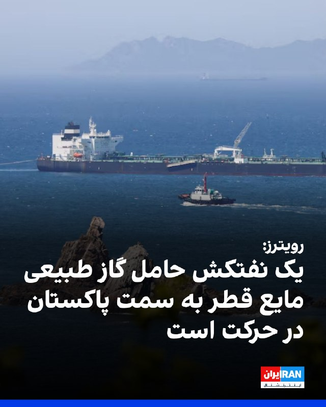

رویترز بر اساس داده‌های کشتیرانی خبر داد که یک نفتکش دیگر از قطر به سمت پاکستان در حال حرکت است.
این دومین عبور یک نفتکش گاز طبیعی مایع قطر از تنگه هرمز به سمت پاکستان از زمان جنگ ایران است.

رویترز نوشت که کشتی میهزم بندر راس لفان قطر را ترک کرده و قرار است سه‌شنبه به بندر قاسم پاکستان برسد.

بر اساس این گزارش، انتظار می‌رود در روزهای آینده دو نفتکش دیگر حامل گاز طبیعی مایع قطر نیز راهی پاکستان شوند.
https://iranintl.com/202605117638

## IranIntlTV — post 336638

🗣روایت شما از اقتصاد بحرانی زیر سایه آتش‌بس- دوشنبه ۲۱ اردیبهشت:

🔹مدرس کاشت ناخن و مانیکور هستم اما از اسفندماه اوضاع کاری به‌شدت به‌هم ریخته. آنتن دستگاه کارتخوان‌مون از همون موقع قطع شده و بعد از اینکه تماس گرفتیم، گفتن بنا به دلایل امنیتی آنتن دستگاه‌های پوز مشاغل غیرضروری رو قطع کردیم. همچنین فروش پکیج آموزش مجازی در اینستاگرام و تلگرام رو هم با قطع دسترسی به اینترنت عملاً از دست دادم.

🔹نمی‌تونیم مدام از جیب بخوریم چون دیگه جیب‌ها هم خالی شده. مردم دارن وسایل خونه‌شون رو می‌فروشن که خرج مواد خوراکی کنن.

🔹شرایط در ایران حقیقتاً دشوارتر شده. مواد خوراکی، بی‌کیفیت اما گرون‌قیمت شدن و حتی همون هم اگه توان خریدش رو داشته باشیم، داره ناموجود می‌شه.

🔹خسته شدیم. گرونی بیداد می‌کنه. سه قلم جنس بی‌ارزش مثل چیپس، بیسکویت و بستنی درمجموع می‌شه ۳۰۰ هزار تومان، دیگه گوشت و مرغ و برنج بماند.

🔹اجاره مسکن در تهران به‌قدری بالا رفته که الگوی سکونت داره تغییر می‌کنه. اوضاع به ‌شکلی شده که در اکثر آگهی‌های اجاره، مستأجرها به دنبال هم‌خونه می‌گردن.

🔹من کابینت‌ساز هستم. سال ۱۴۰۴ هر ورق ام‌دی‌اف رو به قیمت ۳ میلیون تومان می‌خریدم اما امسال بین ۱۵ میلیون تا ۱۷ میلیون تومان قیمت هر ورق شده.

🔹 کفش اسکیتی که می‌خواستم بخرم از ۷ میلیون تومان شده ۱۱ میلیون تومان. تا کی حسرت بخوریم؟

🔹بعد از ۷۰ روز با یک گیگ اینترنت وصل شدم. زندگی واقعاً سخت شده، همه‌چیز به‌شدت گران شده و واقعاً هیچ‌چیزی نمی‌شود خرید، حتی قیمت یک نوشابه بالای ۱۰۰ هزار تومان است.

## IranIntlTV — post 336637

  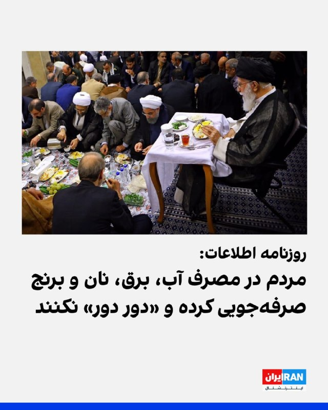

روزنامه اطلاعات در یادداشتی به «ادامه جنگ، تحریم‌ها و محدودیت توان دولت» اشاره کرد و خواستار صرفه‌جویی مردم در مصرف آب، برق، سوخت، غذا، نان، برنج و گندم شد.

این روزنامه در ادامه نوشت مصرف سوخت نیز وضعیت مشابهی دارد و پرسید چه اصراری وجود دارد افراد در مسیرهایی که خودروهای عمومی وجود دارد، با خودروهای تک‌سرنشین تردد کنند یا برای تفریح فقط «دور دور» کنند.

روزنامه اطلاعات همچنین نوشت مصرف بیش از اندازه مواد غذایی از جمله برنج و گندم، همراه با شیوه‌های ناسالم تغذیه، به بروز مشکلاتی مانند بیماری، کاهش عمر و افزایش هزینه‌های بیمارستانی منجر می‌شود.
iranintl.com/202605111279

## IranIntlTV — post 336635

🔻گزارش گاردین از سایه‌ سنگین تنش با جمهوری اسلامی بر امنیت جام‌جهانی ۲۰۲۶

روزنامه گاردین در گزارشی نوشت هم‌زمانی مسابقات جام جهانی فوتبال ۲۰۲۶ با افزایش تنش‌ها با جمهوری اسلامی، خطر انجام حملات «تروریستی» در خاک آمریکا را افزایش داده است.

براساس این گزارش، کارشناسان امنیتی هشدار داده‌اند که مهم‌ترین تهدیدها می‌تواند از سوی مهاجمان تک‌نفره یا گروه‌های افراطی الهام‌گرفته از ایدئولوژی‌های جهادی یا جریان‌های تندرو داخل آمریکا باشد.

قرار است جام جهانی ۲۰۲۶ با ۱۰۴ مسابقه برگزار شود که ۷۸ بازی آن در آمریکا خواهد بود. مسابقات در شهرهایی مانند لس‌آنجلس، میامی و نیویورک برگزار می‌شود و به نوشته‌ی گاردین، گستردگی جغرافیایی این رویداد، چالش بزرگی برای نیروهای امنیتی ایجاد کرده است.

تنها مسابقه فینال در ایست رادرفورد نیوجرسی در سطح «رویداد ویژه امنیت ملی» قرار گرفته و بسیاری از مسابقات دیگر نیز در رده پرخطر ارزیابی شده‌اند و نیازمند حضور گسترده‌ی نهادهای فدرال امنیتی هستند.

کارشناسان به «اهداف نرم» مانند هتل‌ها، مراکز حمل‌ونقل و محل تجمع هواداران به‌عنوان نقاط آسیب‌پذیر اشاره کرده‌اند. همچنین احتمال حملات سایبری و استفاده از پهپادها از دیگر نگرانی‌های مطرح‌شده در این گزارش است.

این گزارش در شرایطی منتشر شده که تنش‌ها میان آمریکا، اسرائیل و جمهوری اسلامی در ماه‌های اخیر افزایش یافته و موضوع حضور تیم ملی فوتبال ایران در جام جهانی ۲۰۲۶ نیز با بحث‌های سیاسی و امنیتی همراه شده است.

🔗وب‌سایت ایران‌اینترنشنال
@iranintltv

## IranIntlTV — post 336634

روزنامه اعتماد در گزارشی از ناراحتی مقامات ورزشی و برخی نهادهای جمهوری اسلامی از سفر مهدی تاج به کانادا برای شرکت در کنگره فیفا خبر داد.

گفت‌وگو با آیدین مقیمی، عضو تحریریه ایران‌اینترنشنال

@iranintltv

## IranIntlTV — post 336633

سرخط خبرهای دوشنبه ۲۱ اردیبهشت

@iranintltv

## IranIntlTV — post 336632

  <a href="telegram/content/IranIntlTV_336632_1778500005.mp4">🎬 Download video</a>

پیام‌های رسیده به ایران‌اینترنشنال نشان می‌دهد گرانی قهوه در کافه‌ها و کاهش مشتریان، باعث تعدیل و اخراج پرسنل و همچنین تعطیلی برخی از کافه‌ها شده‌ است.

لیلا سعادتی، عضو تحریریه ایران‌اینترنشنال، گزارش می‌دهد

@iranintltv

## IranIntlTV — post 336631

  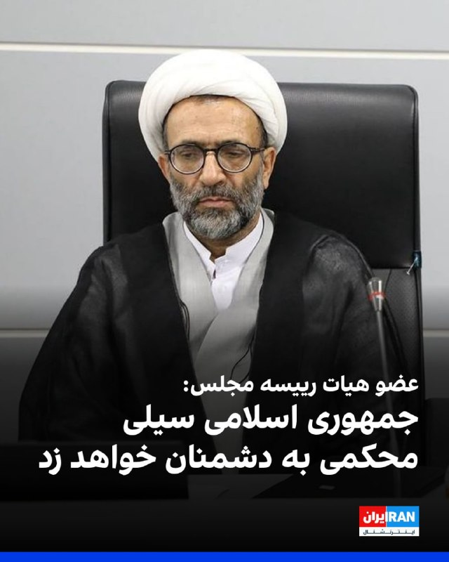

علیرضا سلیمی، عضو هیات رییسه مجلس، درباره محاصره دریایی بنادر و سواحل جنوب ایران از سوی آمریکا گفت جمهوری اسلامی «حتما در جهت شکستن حصر دریایی» اقدام خواهد کرد و «سیلی محکمی» به دشمنان خواهد زد.

او گفت که آتش‌بس «نباید یک‌طرفه باشد» و افزود: «حتما باید در این بخش نیز سیلی جانانه‌ای به دشمنان بزنیم. دشمنان نشان دادند که زبانی غیر از زور نمی‌فهمند و باید با سیلی آنها را بیدار کرد چراکه با دیپلماسی و گفت‌وگو از خواب غفلت بیدار نمی‌شوند.»

سلیمی ادامه داد: «تنها چیزی که دشمنان را بیدار می‌کند غرش توپ و غریو موشک است و اگر بخواهیم با لبخند با دشمنان برخورد کنیم جری‌تر و جسورتر خواهند شد.»
iranintl.com/202605115658

## IranIntlTV — post 336630

  <a href="telegram/content/IranIntlTV_336630_1778500007.mp4">🎬 Download video</a>

یک شهروند با ارسال پیام صوتی از قزوین به ایران‌اینترنشنال می گوید: «باید از هموطنان خارج از کشور تشکر کنم که دغدغه‌شان ایرانیان داخل از کشور است؛ کسانی که به اسارت گرفته شده‌اند. ما دیگر صدایی نداریم و نمی‌توانیم ابراز وجود کنیم. همه امیدمان به شماست.»

## IranIntlTV — post 336629

  

ولودیمیر زلنسکی گفت که حدود ۲۰ کشور به توافق‌های خرید پهپاد با اوکراین علاقه‌مند هستند و تاکنون چهار توافق امضا شده است.

اوکراین توافق‌های دفاعی و پهپادی با آلمان، نروژ و هلند امضا کرده و در اواخر مارس توافق‌های امنیتی بلندمدت با عربستان سعودی، قطر و امارات متحده عربی امضا کرد.
iranintl.com/202605114647

## IranIntlTV — post 336628

  <a href="telegram/content/IranIntlTV_336628_1778500011.mp4">🎬 Download video</a>

بریتانیا و فرانسه قرار است سه‌شنبه میزبان نشستی آنلاین با حضور وزیران دفاع بیش از ۴۰ کشور جهان باشند. محور این نشست، بررسی برنامه‌های نظامی برای بازگرداندن جریان تجارت در تنگه هرمز عنوان شده است.

گفت‌وگو با مهدی بیگی، خبرنگار ایران‌اینترنشنال

@iranintltv

## IranIntlTV — post 336627

  <a href="telegram/content/IranIntlTV_336627_1778500012.mp4">🎬 Download video</a>

هاکان فیدان، وزیر خارجه ترکیه، با عباس عراقچی و بدر عبدالعاطی، وزیران خارجه جمهوری اسلامی و مصر، درباره تحولات مربوط به مذاکرات صلح میان تهران و واشینگتن تلفنی گفت‌وگو کرد.

گفت‌وگو با نرگس هورخش، خبرنگار ایران‌اینترنشنال

@iranintltv

## IranIntlTV — post 336626

  <a href="telegram/content/IranIntlTV_336626_1778500014.mp4">🎬 Download video</a>

ویدیوی رسیده به ایران‌اینترنشنال نشان می‌دهد نفتکش متعلق به جمهوری اسلامی، روز دوشنبه ۲۱ اردیبهشت‌ماه همچنان در حال سوختن است.
فرماندهی مرکزی آمریکا (سنتکام) روز شنبه ۱۹ اردیبهشت اعلام کرد نیروهای این کشور دو نفتکش با پرچم جمهوری اسلامی را در دریای عمان، پیش از رسیدن به بنادر ایران، متوقف کردند.

## IranIntlTV — post 336625

  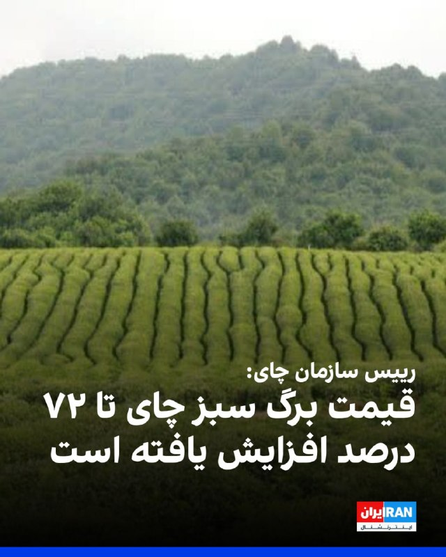

حبیب جهان‌ساز، رییس سازمان چای، گفت که بر اساس مصوبه شورای قیمت‌گذاری، قیمت خرید تضمینی برگ سبز چای در سال جاری برای درجه یک، ۴۲ هزار تومان و برای درجه دو، ۲۳ هزار تومان تعیین شده که نسبت به سال گذشته به ترتیب ۷۲ درصد و ۶۷ درصد افزایش یافته است.

او افزود: «اولویت اصلی ما در این شرایط، تأمین بازار داخلی است هرچند بخشی از چای کشور نیز جنبه صادراتی دارد و تلاش می‌کنیم با حفظ تعادل هم بازار داخل را تأمین کنیم و هم مشتریان خارجی خود را حفظ کنیم.»
iranintl.com/202605110813

## IranIntlTV — post 336624

  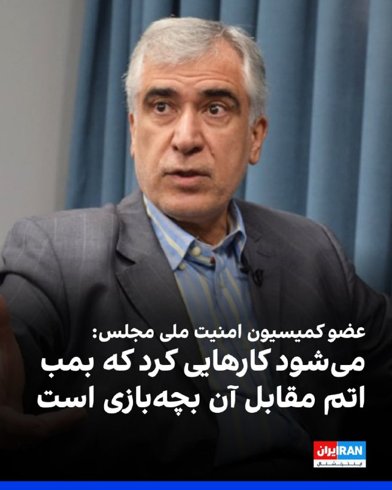

ابوالفضل ظهره‌وند، عضو کمیسیون امنیت ملی مجلس، گفت: «اینجا دو ثانیه دیگر تهران است، سه ثانیه دیگر مثلا واشینگتن است. بعضی‌ها دیدند چه ظرفیت‌هایی وجود دارد. می‌شود کارهایی کرد که اصلا بمب اتمی یعنی چه؟ این‌ها دیگر بچه‌بازی و برای گذشته است.»

او افزود: «من جاهایی را که دیدم، ظرفیت‌هایی را که دیدم، اتفاقاتی می‌آید که بمب اتم واقعا ترقه است. می‌شود کارهای عجیبی کرد. می‌شود زمان را پشت سر گذاشت. یعنی چه؟ هیچ‌کس نمی‌داند.»

ظهره‌وند گفت تاثیر تنگه هرمز، باب‌المندب و «حوزه مقاومت»، بیشتر از صد بمب است و افزود: «وقتی اراده‌ات بالا بیاید تولید یک بمب کاری ندارد. شاید اتفاقاتی را شکل بدهی که بمب اتم پیش آن ترقه باشد.»
iranintl.com/202605114129

## IranIntlTV — post 336623

  <a href="telegram/content/IranIntlTV_336623_1778500017.mp4">🎬 Download video</a>

ویدیوهای ارسال‌شده به ایران‌اینترنشنال در دوشنبه ۲۱ اردیبهشت، ستون دود ناشی از انفجار را در شیراز نشان می‌دهد.
طبق اعلام ارتش، مهمات عمل‌نکرده به‌صورت کنترل‌شده منفجر شده است.

## IranIntlTV — post 336622

  <a href="telegram/content/IranIntlTV_336622_1778500019.mp4">🎬 Download video</a>

یک شهروند با ارسال ویدیویی به ایران‌اینترنشنال از گرانی چندین برابری روغن خوراکی خبر می‌دهد و می‌گوید: «سپاه ما را به خواری و ذلت انداخته است.»

## IranIntlTV — post 336621

  <a href="telegram/content/IranIntlTV_336621_1778500021.mp4">🎬 Download video</a>

ویدیوهای ارسال‌شده به ایران‌اینترنشنال در دوشنبه ۲۱ اردیبهشت، برخاستن دود ناشی از انفجار را در شیراز نشان می‌دهد.
طبق اعلام ارتش، مهمات عمل‌نکرده به‌صورت کنترل‌شده منفجر شده است.

## Shin_Persian — post 5955

  

Shin ✓ @hey_itsmyturn
Mon, 11 May 2026 09:09:25 UTC

UXO went off.
(No official statement, but it was possibly due to EOD)
Shiraz, Fars Province, #Iran

(Image: not mine)

فارسی

مهمات عمل‌نکرده (UXO) منفجر شد.
(بیانیه رسمی منتشر نشده است، اما احتمالا ناشی از عملیات انهدام مهمات (EOD) بوده است)
شیراز، استان فارس، #Iran

(تصویر: متعلق به من نیست)

𝕏 · @shin_persian

## Shin_Persian — post 5954

  

Shin ✓ @hey_itsmyturn
Mon, 11 May 2026 09:05:06 UTC

Earlier @ ~ 0820Z
Single blast in Shiraz
"It was one blast, but strong"
#Fars Province, #Iran

فارسی

پیش‌تر در حدود ۰۸۲۰Z (۱۱:۵۰ به وقت تهران)
یک انفجار در شیراز
«یک انفجار بود، اما قوی»
#Fars Province, #Iran

𝕏 · @shin_persian

## Shin_Persian — post 5953

  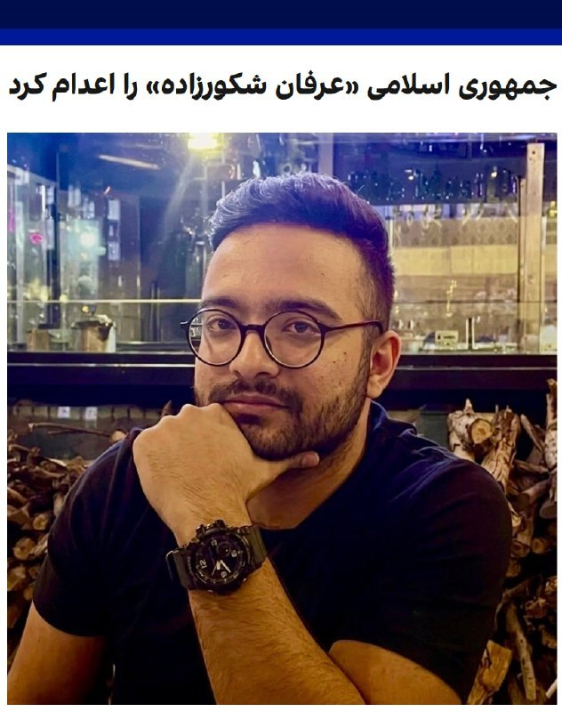

Shin ✓ @hey_itsmyturn Mon, 11 May 2026 08:54:26 UTC Today, political prisoner Erfan Shakurzadeh executed by Islamic Regime. Charged with "espionage for US and Israeli intelligence services". His message from the prison: "I, Erfan Shakourzadeh, am 29 years…

## Shin_Persian — post 5952

Shin ✓ @hey_itsmyturn
Mon, 11 May 2026 08:54:26 UTC

Today, political prisoner Erfan Shakurzadeh executed by Islamic Regime. Charged with "espionage for US and Israeli intelligence services".

His message from the prison:
"I, Erfan Shakourzadeh, am 29 years old, and I am one of the so-called 'elites' who chose not to leave the country.
After months of torture and solitary confinement in a cell, I was forced to make false confessions. Do not let another innocent life disappear into silence."

#Iran

فارسی

امروز، زندانی سیاسی عرفان شکورزاده توسط رژیم اسلامی اعدام شد. او به «جاسوسی برای سرویس‌های اطلاعاتی ایالات متحده و اسرائیل (موساد)» متهم شده بود.

پیام او از زندان:
«من، عرفان شکورزاده، ۲۹ سال سن دارم و یکی از کسانی هستم که به اصطلاح "نخبه" نامیده می‌شوند و انتخاب کردم که کشور را ترک نکنم.
پس از ماه‌ها شکنجه و حبس در سلول انفرادی، مجبور به اعترافات اجباری شدم. اجازه ندهید جان بی‌گناه دیگری در سکوت از دست برود.»

#Iran

𝕏 · @shin_persian

## ManotoTV — post 105300

  <a href="telegram/content/ManotoTV_105300_1778500024.mp4">🎬 Download video</a>

گردهمایی ایرانیان ونکوور

## ManotoTV — post 105299

  

رسانه‌های جمهوری اسلامی از جمله خبرگزاری فارس نوشتند انتشار دود در بخشی از شیراز، ناشی از انفجار کنترل‌شده مهمات عمل‌نکرده بوده است.

بر اساس این گزارش‌ها، ارتش پیش‌تر اعلام کرده بود که دقایقی بعد، مهمات عمل‌نکرده در شیراز به‌صورت کنترل‌شده منفجر خواهد شد.

## ManotoTV — post 105298

  

قیمت نفت روز دوشنبه پس از آن بیش از سه‌ونیم درصد افزایش یافت که دونالد ترامپ، رئیس‌جمهور آمریکا، پاسخ جمهوری اسلامی به پیشنهاد واشینگتن برای پایان جنگ را «کاملا غیرقابل قبول» خواند.

رویترز نوشت تهران در پاسخ خود خواستار پایان جنگ، رفع انسداد دریایی، تضمین نشدن حمله تازه، لغو تحریم‌ها و آزادسازی فروش نفت ایران شده است.

## ManotoTV — post 105297

  <a href="telegram/content/ManotoTV_105297_1778500027.mp4">🎬 Download video</a>

دنهاخ | هلند؛ گردهمایی ایرانیان مقابل دادگاه لاهه

## ManotoTV — post 105296

  <a href="telegram/content/ManotoTV_105296_1778500029.mp4">🎬 Download video</a>

نت‌بلاکس، نهاد ناظر بر دسترسی به اینترنت، اعلام کرد اختلال و قطعی اینترنت در ایران وارد هفتادوسومین روز خود شده و مدت این وضعیت از ۱۷۲۸ ساعت گذشته است. به گفته نت‌بلاکس، این قطعی گسترده همچنان ایران را تا حد زیادی از اینترنت جهانی جدا نگه داشته است.

## ManotoTV — post 105295

  <a href="telegram/content/ManotoTV_105295_1778500029.mp4">🎬 Download video</a>

اسماعیل بقایی، سخنگوی وزارت خارجه جمهوری اسلامی، گفت خواسته‌های ایران در پاسخ اخیر به پیشنهاد آمریکا «حقوق مشروع ایران» بوده و تهران در این متن، مطالباتی مانند پایان جنگ در منطقه، توقف آنچه او «راهزنی دریایی علیه کشتی‌های ایران» خواند، آزادسازی دارایی‌های مسدودشده و تضمین تردد ایمن در تنگه هرمز را مطرح کرده است.

او با رد این‌که مطالبات ایران «زیاده‌خواهانه» باشد، گفت پیشنهاد تهران نه فقط برای منافع ملی ایران، بلکه برای «ثبات و امنیت کل منطقه و جهان» تنظیم شده بود. بقایی همچنین گفت موضوع امنیت و صلح در منطقه، از جمله لبنان، بخشی از بسته پیشنهادی ایران بوده است.

سخنگوی وزارت خارجه جمهوری اسلامی در ادامه، آمریکا و اسرائیل را به اخلال در آزادی دریانوردی و تعرض به کشتی‌های ایرانی در آب‌های آزاد متهم کرد و گفت قرار بود این مسائل در چارچوب بسته پیشنهادی ایران مورد بحث و تصمیم‌گیری قرار گیرد.

بقایی در بخش دیگری از سخنانش از رویکرد آمریکا انتقاد کرد و گفت طرف آمریکایی همچنان بر اساس ذهنیت‌هایی که به گفته او «ساخت‌پرداخته اسرائیل» است، بر دیدگاه‌های یک‌سویه و خواسته‌های نامعقول خود پافشاری می‌کند.

دونالد ترامپ پیشتر از پاسخ جمهوری اسلامی ابراز نارضایتی کرد.

## FarsiVOA — post 217425

یکی از پیشرفته‌ترین ناوهای جنگی بریتانیا در راه خاورمیانه

## FarsiVOA — post 217424

  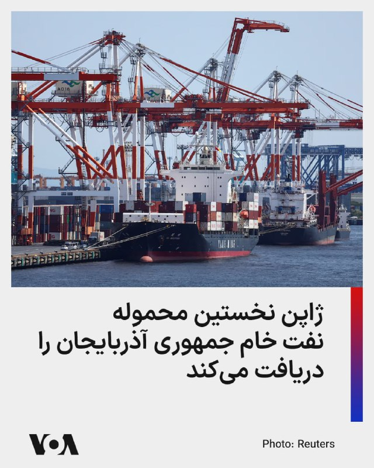

وزارت صنعت ژاپن گزارش داد یک نفتکش حامل نفت خام جمهوری آذربایجان، احتمالاً از روز سه‌شنبه وارد بندر یوکوهاما می‌شود. این نخستین محموله نفتی از این مسیر برای ژاپن از زمان آغاز جنگ ایران در فوریه است.

ژاپن پیش از جنگ آمریکا و اسرائیل با جمهوری اسلامی، حدود ۹۵ درصد نفت خام وارداتی خود را از خاورمیانه تأمین می‌کرد. اما بسته شدن بخش عمده تردد نفتکش‌ها در تنگه هرمز از سوی ایران، جریان این واردات را محدود کرده و توکیو را به جست‌وجوی منابع جایگزین واداشته است.

این محموله برای شرکت انئوس ارسال می‌شود. ژاپن همچنین از آمریکا نفت وارد کرده و یک محموله نفت خام از پروژه ساخالین-۲ روسیه را که از تحریم‌ها معاف بوده، دریافت کرده است.

توکیو برای کنترل بحران عرضه، بخشی از ذخایر نفتی خود را نیز آزاد کرده است.
@FarsiVOA

## FarsiVOA — post 217423

  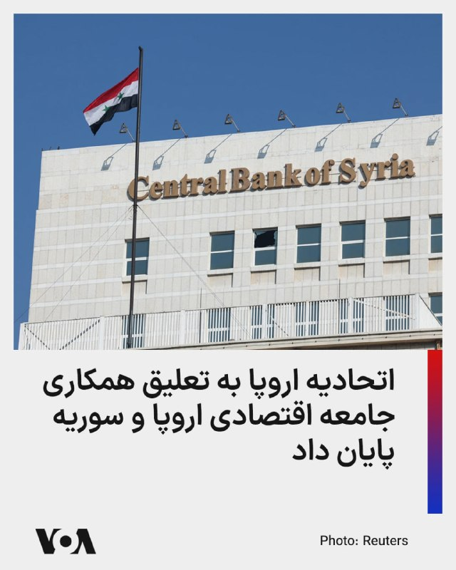

شورای اتحادیه اروپا تصمیمی را برای پایان دادن به تعلیق جزئی توافق همکاری میان جامعه اقتصادی اروپا و جمهوری عربی سوریه تصویب کرد.

بر اساس گزارش رویترز، شورای اروپا دوشنبه اعلام کرد که این تصمیم، نشانه‌ای سیاسی و روشن از تعهد اتحادیه اروپا به ازسرگیری تعامل با سوریه و حمایت از بهبود اقتصادی آن است. شورای اروپا افزود که این اقدام، گامی مهم در جهت تقویت روابط دوجانبه میان اتحادیه اروپا و سوریه محسوب می‌شود.

پیشتر وزرای کشورهای عضو اتحادیه اروپا روز دوشنبه ۶ اسفند در نشستی در بروکسل، پایتخت بلژیک، بر سر تعلیق تحریم‌های سوریه در حوزه انرژی مشتمل بر نفت، گاز، برق و تحریم‌های مرتبط با امور حمل‌ونقل علیه این کشور توافق کرده بودند.

بر پایه این توافق، تحریم‌ها علیه دارایی‌های مسدود شده پنج بانک سوری رفع شده، محدودیت‌ها علیه بانک مرکزی سوریه برچیده شده و معافیت‌های کنونی با هدف تسهیل ارائه کمک‌های بشردوستانه به سوریه به شکل نامحدود تمدید شده است.
@FarsiVOA

## FarsiVOA — post 217422

  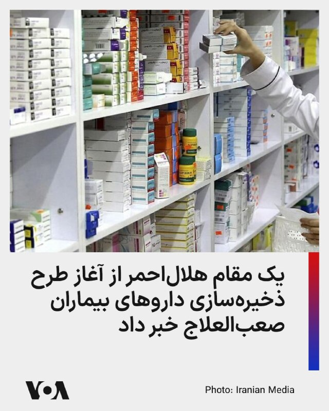

با نمایان شدن نشانه‌های کمبود دارو در کشور به واسطه شرایط جنگی، رئیس سازمان تدارکات پزشکی جمعیت هلال‌ احمر، از اجرای طرحی با هدف ذخیره‌سازی داروهای بیماران صعب‌العلاج خبر داد.

محمدرضا شانه‌ساز با بیان اینکه سرمایه‌گذاری لازم برای اجرای طرح فوق صورت گرفته، گفت: در حوزه داروهای بیماران صعب‌العلاج، سعی کردیم حدود شش ماه و حتی بیشتر، نیاز بیماران را تأمین کنیم.

این مقام جمهوری اسلامی یادآور شد که با اولویت ۱۰ استان کشور، پروژه ذخیره‌سازی دارویی آغاز شده تا ذخایر دارویی به شش ماه افزایش یابد.

در همین رابطه فاطمه پوررضاقلی، دبیر انجمن پیوند کلیه ایران از کاهش ذخایر دارویی و نایاب شدن برخی آنتی‌بیوتیک‌ها خبر داده و هشدار داده است که ادامه این وضعیت می‌تواند برای بیماران دیالیزی و پیوندی مشکل‌ساز شود.

پیشتر، صدای آمریکا به نقل از منابع خود در بیمارستان‌ها و داروخانه‌ها گزارش داده بود که دستورالعمل‌هایی برای کاهش مصرف سرم و آنتی‌بیوتیک ابلاغ شده و توزیع این اقلام در داروخانه‌ها با تأخیر و کمتر از میزان تقاضا انجام می‌شود.
@FarsiVOA

## FarsiVOA — post 217421

🔺تهران در صدر فهرست تنش آبی؛ ۳۵ میلیون ایرانی با مشکل کم‌آبی مواجهند

◾️سخنگوی صنعت آب ایران، با بیان اینکه ۱۱ استان کشور همچنان بیش از ۱۰ درصد کاهش بارش دارند، گفت: تهران در صدر این استان‌ها قرار دارد و اکنون وارد ششمین سال متوالی کم‌آبی شده است.

◾️عیسی بزرگ‌زاده گفت: وضعیت بارش کشور در محدوده نرمال قرار دارد، اما این نرمال بودن به معنای حل مشکل کم‌آبی در برخی استان‌ها نیست.

◾️به تازگی خبرگزاری ایلنا در گزارشی نوشته بود که علیرغم افزایش موجودی مخازن سدهایی مانند کارون و کرخه، موجودی آب سدهای استان‌های تهران، اصفهان، خراسان رضوی، قم، زنجان و مرکزی در وضعیت نامطلوبی قرار دارند، و تأمین آب شرب از جمله در تهران، کرج، مشهد، اراک، قم، اصفهان، یزد با محدودیت مواجه است.

⬇️ بیشتر بخوانید:
https://ir.voanews.com/a/8148766.html

## FarsiVOA — post 217420

  

بلومبرگ به نقل از داده‌های ردیابی کشتی‌ها گزارش داد یک نفتکش حامل گاز مایع نفتی که پیش‌تر محموله‌های ایران را جابه‌جا کرده بود، هنگام عبور از تنگه هرمز اعلام کرده خدمه و مالکان آن هندی هستند.

بر اساس این گزارش، نفتکش تارا گس صبح دوشنبه از آب‌های نزدیک دبی به سمت شمال‌شرق حرکت کرده و هنگام عبور از کنار جزیره لارک ایران در تنگه هرمز دیده شده است؛ مسیری که به نوشته بلومبرگ نشان می‌دهد کشتی در مسیر مورد تأیید تهران حرکت می‌کند.

داده‌های مربوط به آبخور کشتی نیز نشان می‌دهد این نفتکش کاملاً بارگیری شده و حامل گاز مایع نفتی است؛ هرچند سامانه‌های ردیابی مشخص نکرده‌اند محموله آن از کجا بارگیری شده است.

بلومبرگ نوشته کشتی‌های گرفتار در خلیج فارس برای خروج امن از منطقه، از روش‌های مختلف استفاده می‌کنند. برخی دولت‌ها، از جمله هند، تایلند و مالزی، با تهران مذاکره کرده‌اند تا محموله‌های انرژی آزاد شود و برخی کشتی‌ها نیز هنگام عبور، وابستگی ملی یا مالکیتی خود را به‌طور آشکار اعلام می‌کنند.
@FarsiVOA

## FarsiVOA — post 217419

  <a href="telegram/content/FarsiVOA_217419_1778500034.mp4">🎬 Download video</a>

سخنگوی ارتش اسرائیل از شناسایی و انهدام چهار مسیر زیرزمینی استراتژیک در منطقه جنوب نوار غزه خبر داد.

نیروهای تیپ ۱۸۸ با همکاری یگان مهندسی ویژه، مجموعه‌ای از تونل‌ها به طول ۴ کیلومتر را در منطقه شرق «خط زرد» نابود کردند.

طبق بیانیه ارتش، یکی از این مسیرها بخشی از یک شبکه پیچیده بوده که پیش از این برای نگهداری گروگان‌های اسرائیلی استفاده می‌شد.

در جریان بازرسی از این تونل‌ها، اتاق‌هایی کشف شد که در اختیار مقامات ارشد نظامی خان‌یونس وابسته به گروه تروریستی حماس قرار داشت.

ارتش اسرائیل تأکید کرد که نیروهای فرماندهی جنوب مطابق با چارچوب توافق آتش‌بس در منطقه مستقر هستند، اما برای رفع هرگونه «تهدید فوری» به فعالیت‌های عملیاتی خود ادامه می‌دهند.

این عملیات بخشی از تلاش‌های مستمر برای پاکسازی زیرساخت‌های زیرزمینی در نوار غزه توصیف شده است.
@FarsiVOA

## FarsiVOA — post 217418

🔺نخست‌وزیر لبنان: از صلح با اسرائیل پس از برآورده شدن خواسته‌هایمان حمایت می‌کنیم

◾️نخست‌وزیر لبنان، درباره این که آیا مذاکرات این کشور با اسرائیل با هدف آتش‌بس است یا توافق صلح، گفت: «ما از صلح حمایت می‌کنیم، اما این صلح شرایطی دارد. این مسئله‌ای است که در مرحله‌ای بعدی به آن خواهیم رسید.»

◾️به گفته نواف سلام خواسته‌های لبنان شامل آتش‌بس، عقب‌نشینی کامل اسرائیل از خاک لبنان، و آزادی زندانیان لبنانی در زندان‌های اسرائیل است که در جریان درگیری‌ها در لبنان بازداشت شده‌اند.

◾️قرار است دور دیگری از مذاکرات میان اسرائیل و لبنان در واشنگتن برگزار شود.

◾️سلام اذعان کرد که گروه حزب‌الله با مذاکرات با اسرائیل مخالف است اما اشاره کرد که لبنان پیش‌تر در سال ۱۹۸۳ وارد مذاکراتی با اسرائیل شده بود.

⬇️ بیشتر بخوانید:
https://ir.voanews.com/a/8148765.html

## FarsiVOA — post 217417

  

خبرآنلاین، در گزارشی از بلاتکلیفی برای برگزاری امتحانات نهایی و کنکور امسال و سردرگمی دانش‌‌آموزان پسر که باید به خدمت سربازی اجباری اعزام شوند، خبر داد.

تاکنون زمان دقیق برگزاری امتحانات نهایی پایه دوازدهم و همچنین کنکور سراسری به دلیل شرایط جنگی، اعلام نشده است.

در گزارش خبرآنلاین، به نقل از یعقوب محمدی، رئیس گروه آیین‌نامه‌ها و مقررات تحصیلی وزارت آموزش‌وپرورش، درباره اینکه پسران دانش‌آموز تا چه زمانی دانش‌آموزان پایه دوازدهم از اعزام به سربازی اجباری معاف هستند، توضیحاتی ارائه شده است.

به گفته محمدی، با توجه به شرایط خاص کشور و احتمال تعویق برگزاری کنکور سراسری، ممکن است فرصت دو بار شرکت دوازدهمی‌ها در کنکور، به یکبار تقلیل یاید.

او یادآورد شد: البته احتمال اینکه نظام وظیفه برای سال بعد یکبار دیگر هم مهلت شرکت در کنکور را تمدید کند، بسیار زیاد است. اما این احتمال است و تصمیم نهایی صرفا توسط سازمان نظام وظیفه اعلام می‌شود.
@FarsiVOA

## FarsiVOA — post 217416

  

سازمان حقوق بشری هه‌نگاو، از بلاتکلیفی یک صد روزه و تهدید به سلب تابعیت زهرا موسوی، شهروند ۲۱ ساله ایرانی-افغان و از بازداشت‌شدگان اعتراضات دی ‌ماه ۱۴۰۴ خبر داد.

خانم موسوی هم اکنون در «بند آرامش» زندان وکیل‌آباد مشهد در وضعیت بلاتکلیفی به‌سر می‌برد و با تهدیدهای جدیدی از جمله سلب تابعیت و تبعید مواجه شده است.

زهرا موسوی اوایل بهمن‌ ماه ۱۴۰۴ در جریان اعتراضات سراسری دی ماه بازداشت شده بود. نهادهای حکومتی اتهاماتی از جمله «حضور در اعتراضات دی‌ ماه»، «ایجاد گروه»، «آموزش، ساخت و استفاده از کوکتل مولوتوف» و «ترغیب افراد به برهم زدن نظم و امنیت ملی» را به وی نسبت داده‌اند.

زهرا موسوی متولد ایران است؛ با این حال، نهادهای حکومتی با سلب شناسنامه ایرانی خانم موسوی، او را به سلب تابعیت و تبعید تهدید کرده‌اند.

اسماعیل بقایی، سخنگوی وزارت امور خارجه جمهوری اسلامی، در واکنش به سلب تابعیت مدافعان جمهوری اسلامی در کشور بحرین گفته است: سلب تابعیت از شهروندان بحرینی یک مجازات قرون‌وسطایی است که سال‌هاست اساساً منسوخ شده و خلاف اصول بنیادین حقوق بشر محسوب می‌شود.
@FarsiVOA

## FarsiVOA — post 217415

  

پلیس اسرائیل اعلام کرد که نیروهای مرزی این کشور حمله یک فلسطینی ساکن کرانه باختری را خنثی کردند. بر اساس اعلام پلیس، این مرد در اردوگاه قلندیا به سمت نیروهای اسرائیلی تیراندازی کرده بود.

پلیس افزود که نیروهای اسرائیلی در حال عملیات در داخل اردوگاه بودند که مردی از خودروی خود پیاده شد و با یک تفنگ تهاجمی به سمت آن‌ها شلیک کرد و نیروهای پلیس مرزی نیز در پاسخ، به سمت او آتش گشودند.

رسانه «معاریو» گزارش داد که مهاجم کشته شده است. در میان نیروهای اسرائیلی نیز هیچ زخمی گزارش نشده است.
@FarsiVOA

## FarsiVOA — post 217414

  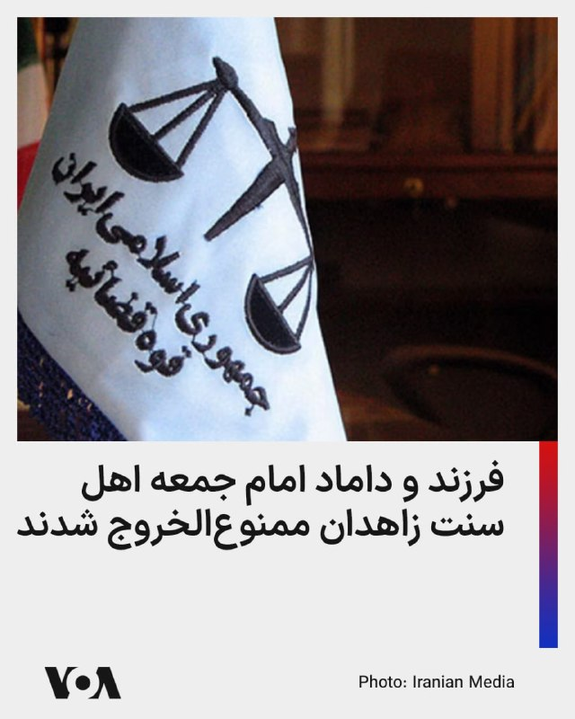

سایت حقوق بشری «حال‌وش» که اخبار و رویدادهای استان سیستان و بلوچستان را پوشش می‌دهد، از ممنوع‌الخروج شدن مولوی طیب اسماعیل‌زهی، و حافظ اسماعیل ملازهی، فرزند و داماد مولوی عبدالحمید اسماعیل‌زهی، امام‌جمعه اهل‌سنت زاهدان خبر داد.

این اقدام با حکم دستگاه قضایی جمهوری اسلامی انجام و ابلاغیه ممنوع‌الخروجی، روز دوشنبه ۲۱ اردیبهشت از طریق سامانه ثنا به آنان ابلاغ شده است.

پیشتر مولوی طیب اسماعیل‌زهی، در ۲۷ بهمن‌ ۱۴۰۴ برای چند ساعت توسط دادگاه ویژه روحانیت مشهد بازداشت و با تودیع قرار وثیقه پنج میلیارد تومانی آزاد شده بود. همچنین حافظ اسماعیل ملازهی نیز در ۱۱ بهمن ‌ماه به همین دادگاه احضار و برای ساعاتی مورد بازجویی قرار گرفته بود.

حال‌وش، از اتهامات احتمالی، دلایل احضار یا علت صدور حکم ممنوع‌الخروجی این دو نفر ابراز بی‌اطلاعی کرده است.
@FarsiVOA

## FarsiVOA — post 217413

  <a href="telegram/content/FarsiVOA_217413_1778500039.mp4">🎬 Download video</a>

ارتش اسرائیل اعلام کرد که عملیات نظامی خود را در شهر بنت جبیل، واقع در جنوب لبنان، به پایان رسانده و کنترل کامل این شهر را به دست گرفته است.

نیروهای ارتش اسرائیل پس از درگیری‌های گسترده، ماموریت خود را در این منطقه نهایی کردند.

بنت جبیل به عنوان یکی از مهم‌ترین پایگاه‌های حزب‌الله در جنوب لبنان شناخته می‌شد.

این شهر که به «پایتخت مقاومت» شهرت داشت، پس از سخنرانی مشهور حسن نصرالله در سال ۲۰۰۰ (موسوم به سخنرانی تار عنکبوت)، اهمیت نمادین بسیار بالایی برای حزب‌الله داشت.

تصرف این شهر توسط نیروهای اسرائیلی، ضربه‌ای جدی به ساختار دفاعی و پرستیژ نظامی حزب‌الله در مناطق مرزی تلقی می‌شود.

مقامات نظامی اسرائیل تصرف این منطقه را گامی کلیدی در جهت عقب راندن نیروهای حزب‌الله از مرزهای شمالی توصیف کرده‌اند.
@FarsiVOA

## FarsiVOA — post 217412

🔺تضعیف بازار اروپا با بن‌بست در مذاکرات واشنگتن و تهران

◾️بازارهای اروپا روز دوشنبه زیر فشار بن‌بست در مذاکرات آمریکا و جمهوری اسلامی کم‌رمق آغاز شدند.

◾️براساس این گزارش شاخص اروپایی استاکس ۶۰۰ در آغاز معاملات تقریباً بدون تغییر و در سطح ۶۱۱.۶۷ واحد ایستاد؛ در حالی که فوتسی لندن ۰.۲ درصد رشد کرد و شاخص کک فرانسه ۰.۵ درصد افت داشت.

◾️در بازار انرژی، نفت برنت در معاملات آسیایی بیش از ۴ درصد رشد کرد و به حدود ۱۰۵ دلار رسید. همزمان، دلار تقویت شد؛ چون سرمایه‌گذاران در فضای ریسک‌گریزی به دارایی‌های نقدشونده‌تر پناه بردند.

⬇️ بیشتر بخوانید:
https://ir.voanews.com/a/8148764.html

## FarsiVOA — post 217411

🔺یوروویژن امسال چگونه برگزار می‌شود؟

◾️هفتادمین دوره از جشن‌ها و برنامه‌های مسابقه آواز «یوروویژن» در حالی آغاز به کار کرده که جهان تحت تنش‌های اقتصادی و ژئوپولیتیک جنگ خاورمیانه قرار دارد.

◾️امسال یوروویژن بیش از ۱۷۰ میلیون نفر را از طریق تلویزیون و اینترنت در سراسر جهان جذب می‌کند و محتوای آن میلیاردها بازدید در پلتفرم‌های دیجیتال به دست می‌آورد.

◾️یوروویژن امسال روز یکشنبه با حضور هزاران هوادار از سراسر جهان در وین، پایتخت اتریش کار خود را آغاز کرد و قرار است فینال آن در شنبه برگزار شود.

◾️نام بتان، نمایندهٔ اسرائیل، نیز ممکن است با قطعه‌ای که بخشی از آن به زبان مولیر اجرا می‌شود، موفقیت چشمگیری به دست آورد.

⬇️ بیشتر بخوانید:
https://ir.voanews.com/a/8148763.html

## FarsiVOA — post 217410

🔺خاموشی اینترنت در روز هفتادوسوم؛ هشدار درباره تهدید شغل ۱۰ میلیون نفر

◾️نت‌بلاکس اعلام کرده خاموشی اینترنت در ایران وارد هفتادوسومین روز شده و مدت اختلال از هزار و ۷۲۸ ساعت گذشته است.

◾️این نهاد مستقل پایش دسترسی به اینترنت نوشته دسترسی آزاد به اینترنت، حقی بنیادین است که بسیاری از آزادی‌های دیگر بر آن تکیه دارند و محروم کردن مردم از آن، توان جامعه برای ثبت، پیگیری و مقابله با نقض حقوق اساسی را به‌شدت محدود می‌کند.

◾️اما مسئله فقط نقض حقوق اساسی نیست؛ قطع اینترنت، نه‌تنها کسب‌وکارها را مختل کرده، بلکه در شرایطی که حکومت بیش از هر زمان به همراهی مردم نیاز دارد، خودش به عامل نارضایتی تبدیل شده است.

⬇️ بیشتر بخوانید:
https://ir.voanews.com/a/8148762.html

## DW_Farsi — post 124558

  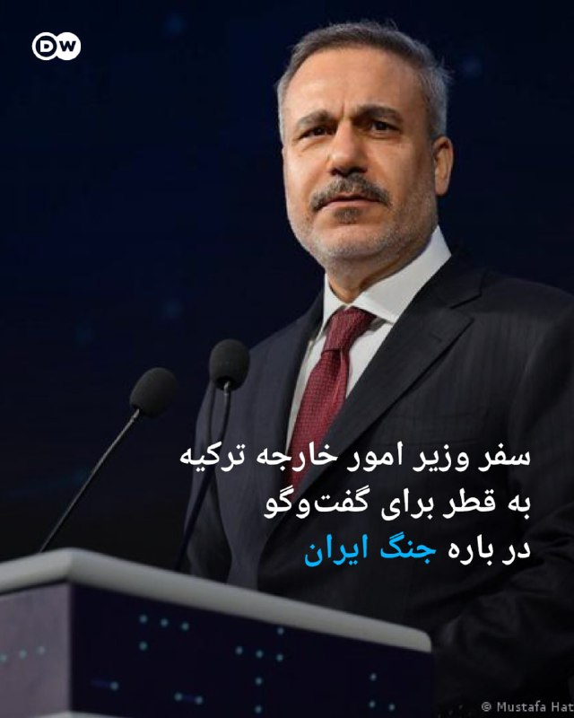

🔶 سفر وزیر امور خارجه ترکیه به قطر برای گفت‌وگو در باره جنگ ایران

به گزارش خبرگزاری رویترز به نقل از یک منبع دیپلماتیک در آنکارا، هاکان فیدان، وزیر خارجه ترکیه، قرار است روز سه‌شنبه، ۱۲ مه (۲۲ اردیبهشت) برای گفت‌وگو درباره جنگ ایران، پیامدهای آن برای منطقه خلیج فارس و وضعیت تنگه هرمز به قطر سفر کند.

طبق این گزارش، ترکیه که عضو ناتو و همسایه ایران است، از زمان آغاز درگیری‌ها در تماس نزدیک با آمریکا، ایران و همچنین پاکستان به‌عنوان میانجی بوده است.

هاکان فیدان که آخرین بار در ماه مارس به دوحه سفر کرده بود، در آخر هفته نیز دو تماس تلفنی جداگانه با عباس عراقچی، وزیر خارجه ایران، داشته است.

به گفته منبع مورد استناد رویترز، فیدان در سفر خود حمایت ترکیه از متحدش قطر را در برابر حملات ایران مورد تأکید قرار خواهد داد.

@dw_farsi

## DW_Farsi — post 124557

  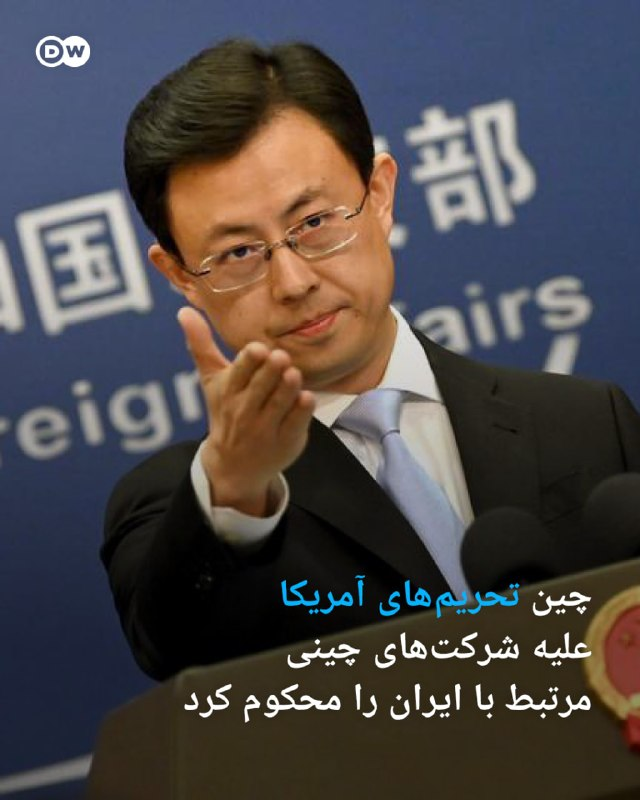

🔶 چین تحریم‌های آمریکا علیه شرکت‌های چینی مرتبط با ایران را محکوم کرد

چین به‌شدت با تحریم‌های آمریکا علیه سه شرکت مستقر در چین که به گفته واشنگتن در عملیات نظامی ایران نقش داشته‌اند، مخالفت کرده و این تحریم‌ها را "غیرقانونی" و "یک‌جانبه" خواند.

گوئو جیاکون، سخنگوی وزارت خارجه چین، روز دوشنبه ۱۱ مه (۲۱ اردیبهشت) در یک نشست خبری گفت: «ما همواره از شرکت‌های چینی خواسته‌ایم فعالیت‌های خود را مطابق قوانین و مقررات انجام دهند و قاطعانه از حقوق و منافع مشروع شرکت‌های چینی دفاع خواهیم کرد.»

او همچنین افزود: «فوری‌ترین اولویت این است که با هر وسیله‌ای از بازگشت درگیری‌ها جلوگیری شود، نه این‌که از جنگ به‌عنوان ابزاری برای بدنام کردن و تخریب دیگر کشورها استفاده شود.»

@dw_farsi

## DW_Farsi — post 124556

  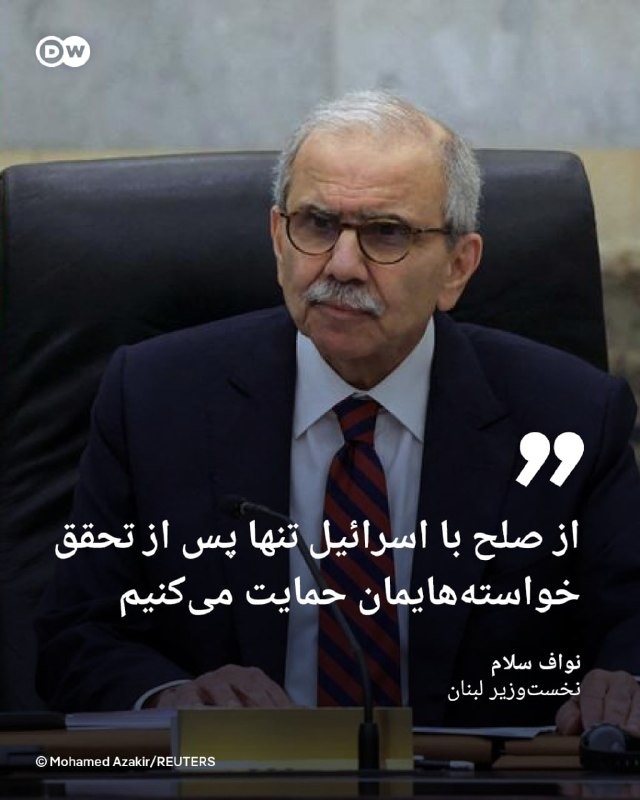

🔶 نخست‌وزیر لبنان: از صلح با اسرائیل تنها پس از تحقق خواسته‌هایمان حمایت می‌کنیم

نواف سلام، نخست‌وزیر لبنان، در گفت‌وگو با شبکه سعودی "العربیه" در پاسخ به این پرسش که آیا مذاکرات با اسرائیل برای آتش‌بس است یا توافق صلح، گفت: «ما از صلح حمایت می‌کنیم، اما این صلح شرایطی دارد. این موضوعی است که در مرحله‌ بعدی به آن خواهیم رسید.»

او تأکید کرد که لبنان در حال حاضر در گفت‌وگوهای مقدماتی با اسرائیل در واشنگتن حضور دارد تا زمینه برای مذاکرات جدی‌تر فراهم شود.

به گفته نواف سلام، خواسته‌های بیروت شامل این موارد می‌شود: برقراری آتش‌بس، خروج کامل اسرائیل از خاک لبنان و آزادی زندانیان لبنانی که در جریان درگیری‌ها بازداشت و در زندان‌های اسرائیل نگهداری می‌شوند.

او افزود: «پس از اجرای خواست‌های لبنان، ما آماده گفت‌وگو درباره شرایط صلح در چارچوبی گسترده‌تر و عربی هستیم، زیرا این موضوع بر کشورهای عربی نیز تأثیر می‌گذارد.»

@dw_farsi

## DW_Farsi — post 124555

  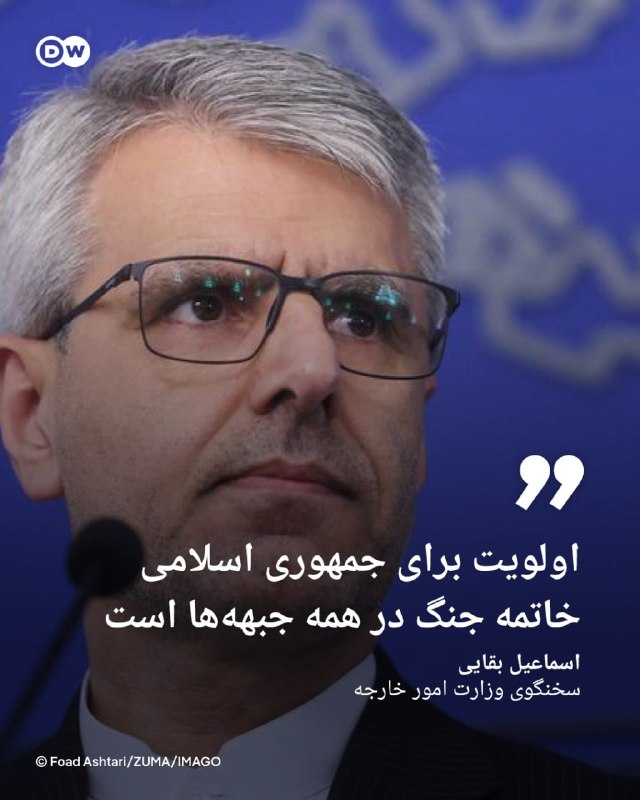

🔶 بقایی: اولویت برای جمهوری اسلامی خاتمه جنگ در همه جبهه‌ها است

سخنگوی وزارت امور خارجه جمهوری اسلامی ایران تایید کرده است که در پاسخ این کشور به پیشنهادات دولت ترامپ برای حل مناقشه میان دو کشور، بستن پرونده اتمی موضوعیت نداشته است.

اسماعیل بقایی روز دوشنبه، ۲۱ اردیبهشت، در کنفرانس خبری هفتگی با خبرنگاران گفت: «ما قبلا هم گفته بودیم که در این مرحله تمرکز ما بر چیزی است که فوریت دارد و آن خاتمه جنگ در همه جبهه‌ها به شمول لبنان و تأمین ایمنی و امنیت دریانوردی در خلیج فارس و تنگه هرمز و همزمان توقف اقدامات خلاف قانون و راهزنی دریایی آمریکا علیه کشتی‌های تجاری است.»

بقایی این موضع را "بسیار مسئولانه و معقول" خواند که در وضعیت کنونی "اولویت‌ها را ببینیم و برای حل و فصل آن‌ها متمرکز شویم، تا اینکه درباره موضوعاتی صحبت کنیم که سابقا حداقل دو بار منجر به جنگ شده است".

ترامپ این پاسخ را "کاملا غیرقابل قبول" خوانده است.

سخنگوی وزارت خارجه در واکنش به ناخشنودی دونالد ترامپ از پاسخ تهران گفت: «برای ما رضایت دیگران مهم نیست.»

@dw_farsi

## DW_Farsi — post 124554

  

🔶 تنش در واشنگتن بر سر بحران ذخایر موشکی و هزینه‌های جنگ ایران
مارک کلی، سناتور دموکرات آمریکایی، اعلام کرد که جنگ ایران باعث تضعیف ایالات متحده شده و ذخایر مهمات و موشک‌های ارتش این کشور به‌شدت کاهش یافته است.

این سناتور دموکرات در برنامه‌ای در شبکه تلویزیونی "سی‌بی‌اس" گفت: «شوکه‌کننده است که تا چه حد این

مارک کلی، در برنامه‌ای در شبکه تلویزیونی "سی‌بی‌اس" گفت: «شوکه‌کننده است که تا چه حد این ذخایر را مصرف کرده‌ایم.»

این فضانورد پیشین و کهنه‌سرباز جنگ عراق افزود که دونالد ترامپ، رئیس جمهور آمریکا، ایالات متحده را وارد جنگی "بدون هدف راهبردی، بدون برنامه و بدون جدول زمانی" کرده است.

به گفته این سناتور از ایالت آریزونا، پنتاگون او را در مقام عضو کمیته نیروهای مسلح سنا، در جریان وضعیت برخی انواع مهمات این کشور قرار داده است.

به گفته او، این اطلاعات شامل موشک‌هایی مانند تاماهاک، اتاکمز، اس‌ام−۳ و موشک‌های سامانه پاتریوت بوده است. کلی بدون اشاره به جزئیات گفت که بازسازی این ذخایر "سال‌ها" زمان خواهد برد.

@dw_farsi

## DW_Farsi — post 124553

🎥 آمستردام تبلیغات گوشت را ممنوع کرد

آمستردام اولین شهری است که تبلیغات محصولات بسیار آلاینده، از جمله گوشت و محصولات مرتبط با سوخت‌های فسیلی را ممنوع کرد. آیا چنین اقدامی رفتار مردم را تغییر خواهد داد؟

@dw_farsi

## DW_Farsi — post 124552

  

🔶 کره جنوبی حمله به کشتی باری را محکوم کرد و وعده واکنش داد

دفتر ریاست جمهوری کره جنوبی روز دوشنبه، ۱۱ مه (۲۱ اردیبهشت) حمله به یک کشتی باری متعلق به یک شرکت کشتیرانی کره‌ای در تنگه هرمز در ماه جاری را شدیداَ محکوم کرد.

یک مقام ارشد کاخ ریاست جمهوری با تأکید بر این که کره جنوبی "پس از شناسایی منبع حمله، قصد دارد به آن پاسخ دهد"، افزود که سئول حملات به کشتی‌های غیرنظامی را "غیر قابل‌تحمل" می‌داند.

او به خبرنگاران گفت که کارشناسان کره جنوبی بررسی‌های اولیه‌ای از خسارت وارده به کشتی را انجام داده‌اند.

تحقیقات صورت‌گرفته تایید می‌کند که کشتی توسط دو "پرتابه ناشناس" مورد اصابت قرار گرفته است. این حمله منجر به آتش‌سوزی در موتورخانه کشتی شده است.

سئول اعلام کرده است که اکنون در حال هماهنگی برای واکنش قاطع به این حادثه برای تضمین امنیت شهروندان و مسیرهای دریایی خود است.

دونالد ترامپ انفجار و آتش‌سوزی در این کشتی تحت مدیریت کره جنوبی را به حمله‌ای از سوی ایران نسبت داده است. جمهوری اسلامی این ادعا را رد کرده است.

@dw_farsi

## DW_Farsi — post 124551

  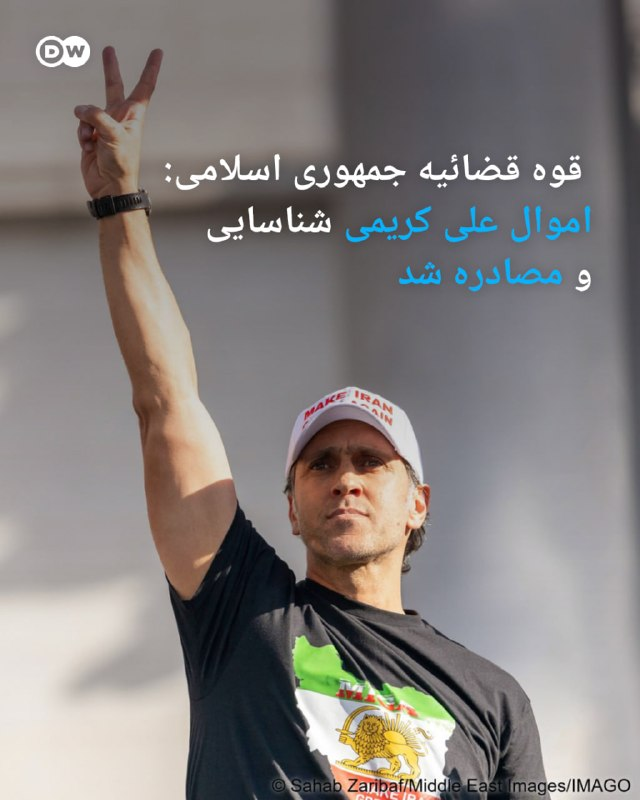

🔶 قوه قضائیه جمهوری اسلامی: اموال علی کریمی شناسایی و مصادره شد

قوه قضاییه جمهوری اسلامی اعلام کرد که موفق به "شناسایی" بخشی از اموال علی کریمی، ستاره سابق تیم ملی فوتبال ایران، شده و آنها را مصادره کرده است.

در اطلاعیه قوه قضائیه ادعا شده است: «با استعلامات صورت‌ گرفته از سازمان ثبت اسناد و املاک کشور، برخی از املاک ‌علی کریمی که سعی در اختفای آنها داشته شناسایی شده است.»

این اطلاعیه همچنین مدعی است که "دو واحد تجاری و ۴ واحد مسکونی از علی کریمی شناسایی و به دستور قضایی به نفع مردم توقیف شده است".

علی کریمی که از هواداران فعال رضا پهلوی، فرزند آخرین پادشاه ایران به شمار می‌آید پس از جنبش "زن زندگی آزادی" در سال ۱۴۰۱ از ایران خارج شد.

خبرگزاری میزان، رسانه وابسته به قوه قضائیه، علی کریمی را "خائن به وطن" خوانده است.

@dw_farsi

## DW_Farsi — post 124550

  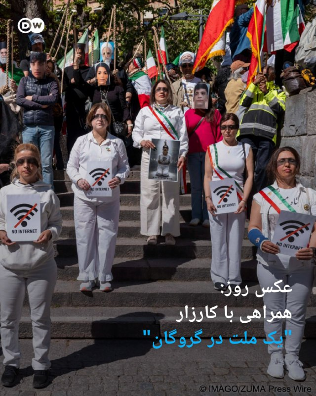

📸 عکس روز: همراهی با کارزار "یک ملت در گروگان"

ایرانیان در خارج از کشور در پی فراخوان شاهزاده رضا پهلوی برای همراهی با کارزار "یک ملت در گروگان" روز یکشنبه ۱۰ مه در بسیاری از شهرهای جهان تظاهرات کردند. تظاهرکنندگان در استکهلم تصاویر و پلاکاردهایی را در اعتراض به قطعی اینترنت و افزایش اعدام‌ها در دست داشتند. به گزارش نت‌بلاکس قطعی اینترنت وارد ۷۳‌مین روز شده و مردم ایران همچنان در خاموشی دیجیتال بسر می‌برند و بسیاری از کسب‌وکارها از بین رفته‌اند.

@dw_farsi

## DW_Farsi — post 124549

  

🔶 ۲۰ هزار استاد دانشگاه در ایران انتظار در دسترسی به اینترنت

بیژن رنجبر، رئیس دانشگاه آزاد، اعلام کرد که برای بهبود دسترسی به اینترنت در واحدهای دانشگاهی، مجوزهای آی‌پی برای ۲۴۵۰ واحد دانشگاهی دریافت شده است تا استادان و دانشجویان بتوانند در داخل دانشگاه به اینترنت متصل شوند.

او در مصاحبه با خبرگزاری ایسنا همچنین گفت که درخواست تأمین اینترنت برای حدود ۲۰ هزار عضو هیئت علمی ارائه شده و دانشگاه در انتظار تأیید نهایی این موضوع است.

به گفته رنجبر، این اقدامات "با هدف تقویت زیرساخت‌های ارتباطی و تسهیل دسترسی به منابع دیجیتال برای اعضای هیئت علمی و دانشجویان انجام می‌شود و امید است که رضایت کاربران در دانشگاه افزایش یابد".

در همین حال تداوم قطع اینترنت، اثرات منفی آن بر زندگی مردم و به‌خصوص تبعیضی که تحت عنوان "اینترنت پرو" در حق بخش بزرگی از جامعه اعمال می‌‌شود، بحث داغ روز در ایران است.

@dw_farsi

## DW_Farsi — post 124548

🎥 مالیات شکر به آلمان می‌آید؟

آلمان در حال برنامه‌ریزی برای وضع مالیات شکر از سال ۲۰۲۸ است تا با چاقی مقابله کند و فشار بر سیستم سلامت را کاهش دهد. منتقدان می‌گویند چنین اقداماتی بی‌اثر هستند، اما سازمان جهانی بهداشت خواهان مالیات‌های بسیار بالاتر بر محصولات ناسالم در سراسر جهان است.

@dw_farsi

## DW_Farsi — post 124547

🔶 جام ۱۹۳۴؛ ماتیاس سیندلار؛ آزادمرد فوتبال اتریش

در اواخر دهه ۲۰ تا اوایل دهه ۳۰ میلادی قرن بیستم، تیم ملی اتریش یکی از قدرت‌های بزرگ فوتبال اروپا محسوب می‌شد و ستاره‌اش که به "مرد کاغذی" شهرت داشت، یکی از چهره‌های درخشان آن دوره به شمار می‌رفت: مایتاس سیندلار.

به اعقتاد کارشناسان فوتبال ماتیاس سیندلار بزرگ‌ترین ستاره‌ای است که اتریش به این ورزش ارائه کرده است. سیندلار مهره‌ کلیدی تیمی بود که در اواخر دهه بیست و اوایل دهه سی میلادی قرن بیستم به "تیم شگفت‌انگیز" شهرت داشت.

ملی‌پوشان اتریش که در سال ۱۹۳۲ قهرمان اروپا شده بودند، در جام جهانی ۱۹۳۴ در ایتالیا به عنوان یکی از مدعیان قهرمانی قدم به میدان گذاشتند. پشتوانه‌ موفقیت‌های پیشین انتظارات زیادی را میان اتریشی‌ها برانگیخته بود که این بار به قهرمانی جهان امید بسته بودند.

اتریش اما در نیمه‌نهایی این مسابقات یک بر صفر از میزبان بازی‌ها شکست خورد. داور سوئدی این دیدار که یک روز پیش از برگزاری مسابقه مهمان ویژه بنیتو موسولینی بود، تک‌گل این دیدار را که در پی خطایی روی درواز‌ه‌بان اتریش حاصل شده بود، پذیرفت و در نیمه دوم نیز کم و بیش به نفع ایتالیایی‌ها سوت زد.

@dw_farsi

## Persian_Trend_Official — post 13900

  <a href="telegram/content/Persian_Trend_Official_13900_1778500046.mp4">🎬 Download video</a>

⭕️ اسرائیل به فارسی:

نخست وزیر نتانیاهو صدای شما را می‌شنود:
در ایران، خیابان‌ها را به نام من نامگذاری می‌کنند. آیا این را می‌دانید؟ البته به نام رئیس جمهور ترامپ هم، بدیهی است، زیرا او رهبری مبارزه را بر عهده دارد. من فارسی صحبت نمی‌کنم اما آن‌ها مرا «بی‌بی جون»، بی‌بی عزیزم صدا می‌زنند.

📝 Nick

📌 @persian_trend_official
پرشین ترند | متفاوت‌ترین کانال نظامی

## Persian_Trend_Official — post 13899

🔴 ۱۰ محور راهبردی رهبر جمهوری اسلامی درباره خلیج فارس و تنگه هرمز

▪️۱. حضور و استقرار نیروهای آمریکایی در خلیج فارس، مهم‌ترین عامل ناامنی در منطقه است

▪️۲. پایگاه‌های آمریکا در منطقه، حتی توان تأمین امنیت خود را ندارند

▪️۳. آینده خلیج فارس بدون آمریکا و در خدمت پیشرفت، رفاه و توسعه ملت‌های منطقه خواهد بود

▪️۴. ایران و کشورهای همسایه در خلیج فارس و دریای عمان دارای «سرنوشت مشترک» هستند

▪️۵. برای بیگانگان شرور در خلیج فارس جایی جز کف آب‌های آن وجود ندارد

▪️۶. پیروزی‌های ایران در خلیج فارس، نشانه شکل‌گیری نظم جدید منطقه‌ای و جهانی است

▪️۷. امنیت خلیج فارس از طریق مدیریت ایران بر تنگه هرمز تضمین خواهد شد

▪️۸. بهره‌برداری دشمنان متجاوز از تنگه هرمز باید پایان یابد

▪️۹. مدیریت جدید تنگه هرمز می‌تواند موجب رفاه و پیشرفت ملت‌های منطقه بر پایه قواعد حقوقی شود

▪️۱۰. دستاوردهای اقتصادی ناشی از مدیریت جدید تنگه هرمز، موجب رضایت و خوشحالی مردم ایران خواهد شد|نایا

🫆:Tony

📌 @persian_trend_official
پرشین ترند | متفاوت‌ترین کانال نظامی

## Persian_Trend_Official — post 13895

🔴 ناو هواپیمابر «شارل دو گل» وارد دریای سرخ شد

💢ناو هواپیمابر هسته‌ای «شارل دو گل» فرانسه در تاریخ ۸ مه، پس از عبور از کانال سوئز، در دریای سرخ مشاهده شد.

این ناو به همراه گروه ضربتی خود در چارچوب همکاری مشترک فرانسه و بریتانیا به‌سمت منطقه خلیج فارس در حال حرکت است؛ در شرایطی که تنش‌ها در تنگه هرمز و خاورمیانه همچنان در سطح بالایی قرار دارد.

گروه هوایی مستقر روی این ناو شامل مجموعه‌ای از جنگنده‌ها، هواپیماهای هشدار زودهنگام و بالگردهای رزمی و پشتیبانی است.

💢ظرفیت کلی ناو حدود ۳۰ تا ۴۰ هواگرد عنوان می‌شود، اما در مأموریت‌های عملیاتی معمولاً بین ۲۵ تا ۳۰ فروند روی آن مستقر هستند.

🫆:Tony

📌 @persian_trend_official
پرشین ترند | متفاوت‌ترین کانال نظامی

## Persian_Trend_Official — post 13894

  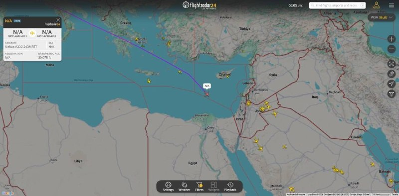

از ساعاتي قبل دسته‌ای جنگنده فرانسوی با همراهی یک یا چند سوخت‌رسان متعلق به نیروی هوایی فرانسه، بسوی خاورمیانه می آید.

پایگاه{صلح ابوظبی امارات} میزبان چند اسکادران رافائل های فرانسوی میباشد.

☆Phantom☆

📌 @persian_trend_official
پرشین ترند | متفاوت‌ترین کانال نظامی

## Persian_Trend_Official — post 13893

  <a href="telegram/content/Persian_Trend_Official_13893_1778500048.jpg">🎬 Download video</a>

🔴 انفجار در اراک؛ یک خانه مسکونی تخریب شد

در پی وقوع انفجار در یک منزل مسکونی واقع در خیابان جهانگیری اراک، ساختمان به‌طور گسترده تخریب شد.

بر اساس گزارش‌ها:

▪️ نیروهای امدادی و آتش‌نشانی در محل حادثه حضور دارند
▪️ عملیات آواربرداری و ایمن‌سازی آغاز شده است
▪️ علت دقیق انفجار هنوز مشخص نیست
▪️ آمار احتمالی مصدومان و میزان خسارات در دست بررسی است

💢خبرگزاری مهر اعلام کرده کارشناسان در حال بررسی منشأ حادثه هستند.

🫆:Tony

📌 @persian_trend_official
پرشین ترند | متفاوت‌ترین کانال نظامی

## Persian_Trend_Official — post 13892

🔴 ارتش اسرائیل: فرود اضطراری بالگرد در جنوب لبنان به‌دلیل نقص فنی بود

ارتش اسرائیل اعلام کرد امروز دوشنبه، در جریان عملیات نیروی هوایی برای انتقال نیروهای زخمی در جنوب لبنان، یکی از بالگردها پس از فرود در محل تخلیه به‌دلیل نقص فنی قادر به برخاستن نبوده است.

بر اساس بیانیه ارتش:

▪️ یک بالگرد دیگر برای انتقال نیروهای زخمی به منطقه اعزام شد
▪️ نیروهای فنی نیروی هوایی مشکل ایجادشده را برطرف کردند
▪️ بالگرد پس از تعمیر، منطقه را با امنیت کامل ترک کرد
▪️ ارتش اسرائیل تأکید کرده این بالگرد هدف آتش حزب‌الله قرار نگرفته است

🫆:Tony

📌 @persian_trend_official
پرشین ترند | متفاوت‌ترین کانال نظامی

## Persian_Trend_Official — post 13891

  

♨️ عکس زیر از متن تورات، کتاب اشعيا، باب ۱۴، آیه ۱۸ تا ۲۱ است.

پ.ن: طبیعیه که حاکمان شرور و ویرانگر عاقبت مشابه داشته باشند ولی این حد از شباهت تعجب برانگیزه. 😬

📝 Nick

📌 @persian_trend_official
پرشین ترند | متفاوت‌ترین کانال نظامی

## Persian_Trend_Official — post 13890

  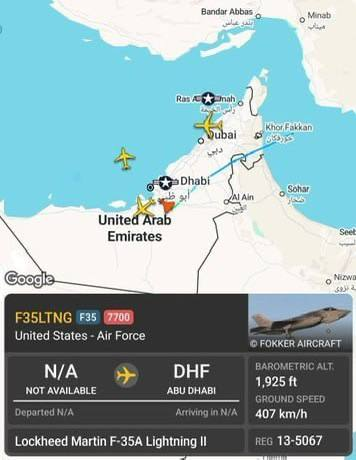

💢برای دومین بار در 24ساعت گذشته، یک جنگنده اف-35 آمریکا بر فراز امارات سیگنال درخواست کمک ارسال کرده است

🫆:Tony

📌 @persian_trend_official
پرشین ترند | متفاوت‌ترین کانال نظامی

## Persian_Trend_Official — post 13889

  <a href="telegram/content/Persian_Trend_Official_13889_1778500049.mp4">🎬 Download video</a>

⭕️ استاد خوش چشم، کارشناس صدا سیما: احتمال می‌دهم ظرف یک هفته آینده جنگ مجددا آغاز شود.

+خب فعلا جنگ کنسل شد. 🗿

📝 Nick

📌 @persian_trend_official
پرشین ترند | متفاوت‌ترین کانال نظامی

## Persian_Trend_Official — post 13888

  

🔴 احتمال سفر عراقچی به هند برای نشست بریکس

💢رسانه‌های هندی گزارش داده‌اند «عباس عراقچی» وزیر امور خارجه ایران احتمالاً روز ۱۴ مه برای شرکت در نشست وزیران خارجه بریکس راهی دهلی‌نو خواهد شد.

💢این نشست مقدمه‌ای برای هجدهمین اجلاس سران بریکس است که قرار است سپتامبر امسال در هند برگزار شود. هند در حال حاضر ریاست دوره‌ای این ائتلاف اقتصادی را برعهده دارد.

💢گزارش‌ها همچنین حاکی است در حاشیه این نشست، موضوع امنیت کشتیرانی و عبور کشتی‌ها از تنگه هرمز نیز میان تهران و دهلی‌نو مورد گفت‌وگو قرار خواهد گرفت.

🫆:Tony

📌 @persian_trend_official
پرشین ترند | متفاوت‌ترین کانال نظامی

## Persian_Trend_Official — post 13887

  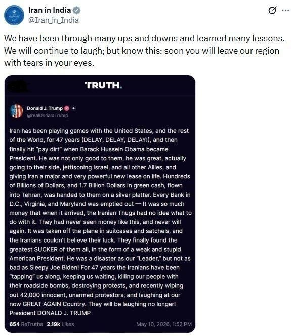

⭕️ توییت جدید سفارت جمهوری اسلامی در هند خطاب به ترامپ:

ما همچنان خواهیم خندید؛ اما این را بدان: به زودی با چشمانی اشکبار منطقه ما را ترک خواهی کرد.

ما فراز و نشیب‌های زیادی را پشت سر گذاشته‌ایم و درس‌های زیادی آموخته‌ایم.

📝 Nick

📌 @persian_trend_official
پرشین ترند | متفاوت‌ترین کانال نظامی

## Persian_Trend_Official — post 13886

قبل از شروع جنگ و قطعی اینترنت درخواست فیبر نوری دادم و حالا اومدن نصب و فعالش کردن.
با تشکر از شاتل بابت سرویس خوبشون؛ در واقع قبل از نصب اینترنت نداشتم، ولی الان با سرعت خیلی بیشتری اینترنت ندارم.

© itsmralii

📝 Nick

📌 @persian_trend_official
پرشین ترند | متفاوت‌ترین کانال نظامی

## Persian_Trend_Official — post 13885

## Persian_Trend_Official — post 13884

  

سهم من هم با رضایت خودم، ایشون گاز بزنه .

فقط اورانیوم میتونه نسل اینجور افراد رو منقرض کنه

## Persian_Trend_Official — post 13883

  <a href="telegram/content/Persian_Trend_Official_13883_1778500052.mp4">🎬 Download video</a>

میدونید منظورش از نیروی مسلح کجاست دیگه ؟!
جنگ زمینی قطعااااااااااا تخصص جمهوری اسلامی هست ...

📌 @persian_trend_official
پرشین ترند | متفاوت‌ترین کانال نظامی

## RadioFarda — post 157059

  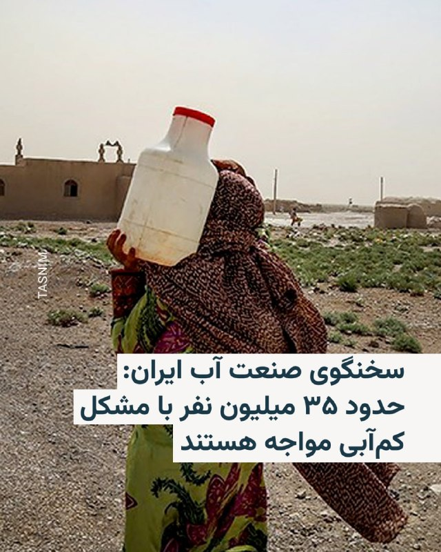

🔸سخنگوی صنعت آب ایران می‌گوید ۳۵ میلیون نفر از جمعیت کشور با مشکل کم‌آبی مواجه‌ هستند.

🔸عیسی بزرگ‌زاده، روز دوشنبه ۲۱ اردیبهشت در یک نشست خبری با اشاره به وضعیت ذخایر آب در ایران،‌ گفت: در حال حاضر حدود ۳۵ میلیون نفر از جمعیت کشور با مشکل کم‌آبی مواجه هستند و به همین دلیل همچنان برای عبور از این شرایط، نیازمند صرفه‌جویی در مصرف آب هستیم.

🔸بزرگ‌زاده با اشاره به تفاوت‌های منطقه‌ای در بارش‌ها گفت: توزیع بارش در کشور بسیار نامتوازن است و با وجود آنکه در استان‌هایی مانند بوشهر، هرمزگان، ایلام و کرمان بارش‌های بسیار خوبی ثبت شده، اما در استان‌هایی مانند تهران، قم، یزد، مرکزی و اصفهان با بارش بسیار کم مواجه بوده‌ایم.

🔸او با بیان اینکه در حال حاضر ۱۱ استان کشور همچنان شرایط بارشی زیر نرمال دارند تاکید کرد که «به هیچ‌وجه نمی‌توان گفت کشور وارد دوره ترسالی شده است.»

🔸در دهه‌های اخیر خشکسالی مداوم، برداشت بی‌رویه از آب‌های زیرزمینی و سوء‌مدیریت سبب شده است که بسیاری از شهرهای بزرگ ایران با بحران کم آبی روبرو شوند.

@RadioFarda

## RadioFarda — post 157058

  <a href="https://t.me/radiofarda/157058">📎 Download file</a>

📻بشنوید: ساعت ۱۴ با رادیوفردا، ۲۱ اردیبهشت ۱۴۰۵‌

@Radiofarda

## RadioFarda — post 157057

  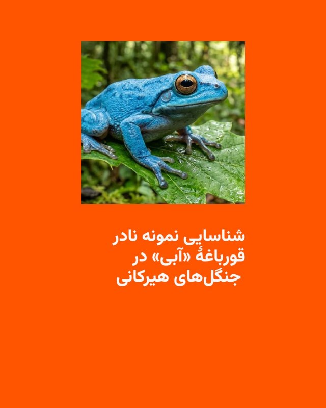

🔸معاون محیط‌زیست طبیعی استان گیلان از شناسایی قورباغۀ «آبی» در جنگل‌های هیرکانی خبر داد.

🔸عباس عاشوری، معاون محیط‌زیست طبیعی گیلان روز دوشنبه ۲۱ اردیبهشت با اعلام این خبر گفت: «قورباغۀ درختی خاوری با نام علمی Hyla orientalis یکی از ۲۲ گونه دوزیستان ایران محسوب می‌شود که بیشتر در مناطق جنگلی و مرطوب شمال کشور زیست می‌کند.»

🔸به گفته او این ‌گونه معمولاً به رنگ سبز مایل به زرد یا کرم مایل به قهوه‌ای دیده می‌شود و در برخی شرایط خاص، ناهنجاری رنگی یا «کالر آنومالی» در برخی موارد می‌تواند موجب تغییر رنگ بدنش شود که یکی از نادرترین حالت‌های آن، ظهور رنگ آبی است.

🔸این اختلال در اثر عوامل محیطی و به‌ویژه نوسانات شدید دمایی ایجاد می‌شود و از هر ۲۰ هزار قورباغۀ درختی، احتمالاً تنها یک نمونه آبی‌رنگ مشاهده می‌شود.

@RadioFarda

## RadioFarda — post 157056

دیپلمات ارشد پیشین آمریکا: مذاکرات ایران و ایالات متحده احتمالاً ادامه خواهد یافت

🔸گوردون گری، دیپلمات ارشد پیشین آمریکا که در دولت جرج دبلیو بوش معاون دستیار وزیر خارجه در امور خاور نزدیک بود و همچنین به‌عنوان سفیر آمریکا در تونس و معاون رئیس هیئت دیپلماتیک آمریکا در مصر خدمت کرده است، می‌گوید مذاکرات غیرمستقیم میان واشینگتن و تهران، با وجود «فشار و درد قابل‌توجه» بر هر دو طرف، احتمالاً ادامه خواهد یافت.

🔸تهران از طریق پاکستان پیشنهادی ارسال کرده که در آن خواستار پایان عملیات نظامی در منطقه، کاهش تحریم‌ها و تضمین امنیت دریانوردی، از جمله بازگشایی تنگهٔ هرمز شده است. دونالد ترامپ، رئیس‌جمهور آمریکا، روز ۲۰ اردیبهشت این موضع ایران را رد کرد، اما همزمان نارضایتی خود از کندی روند دیپلماسی را نیز نشان داد.

🔸این تحولات در شرایطی رخ می‌دهد که فشار اقتصادی بر ایران افزایش یافته، نگرانی‌ها دربارهٔ عرضهٔ جهانی انرژی ادامه دارد و بحث‌ها دربارهٔ فعالیت‌های هسته‌ای تهران دوباره شدت گرفته است. گفته می‌شود پاسخ جمهوری اسلامی که در حال بررسی است، شامل محدودیت غنی‌سازی اورانیوم ایران برای دست‌کم ۱۲ سال در برابر کاهش تحریم‌ها و آزادسازی دارایی‌های مسدودشدهٔ ایران است.

🔸رادیو اروپای آزاد/رادیو آزادی با آقای گری، که اکنون استاد امور خلیج فارس و شبه‌جزیرهٔ عربستان در مدرسهٔ روابط بین‌الملل الیوت دانشگاه جرج واشینگتن است، دربارهٔ آخرین وضعیت مذاکرات صلح ایران، محاسبات راهبردی در واشینگتن و تهران، و این‌که آیا هنوز فضایی برای ادامهٔ دیپلماسی وجود دارد یا نه، گفت‌وگو کرده است.

🔸نسخه کامل این گفت‌وگو را در وب‌سایت رادیوفردا بخوانید.

@RadioFarda

## RadioFarda — post 157055

  

🔸شیرین اردکانی، وکیل نرگس محمدی، برنده جایزه حقوق بشر، می‌گوید انتقال موکلش از زندان به بیمارستان، «به لطف بسیج جامعه مدنی جهانی و تلاش‌های دیپلماسی حقوق بشر که بر حکومت فشار وارد کردند، به دست آمد».

🔸اظهارات خانم اردکانی را حساب کاربری بنیاد نرگس محمدی در شبکه ایکس منتشر کرده و نوشته انتقال او به بیمارستان به «دلایل جدی پزشکی» صورت گرفت.

🔸اردکانی خواستار ادامه کمپین جهانی در حمایت از نرگس محمدی تا لغو همه اتهامات علیه او و آزادی زندانیان سیاسی که به‌صورت خودسرانه بازداشت شده‌اند، شد.

🔸او گفته:‌ «ما از همه دستگاه‌های دیپلماسی جهان می‌خواهیم فشار بر مقام‌های ایرانی را حفظ کنند تا خواستار پایان دادن به اعدام‌هایی شوند که همچنان در کشور ادامه دارد.»

🔸بنیاد نرگس محمدی در کنار این خبر، تصویری از این فعال حقوق بشر روی تخت بیمارستان هم منتشر کرده است.

🔸مصطفی نیلی، وکیل دادگستری، روز یکشنبه ۲۰ اردیبهشت خبر داد که محمدی برای طی کردن مراحل درمان به بیمارستانی در تهران منتقل شده است.

@RadioFarda

## RadioFarda — post 157054

  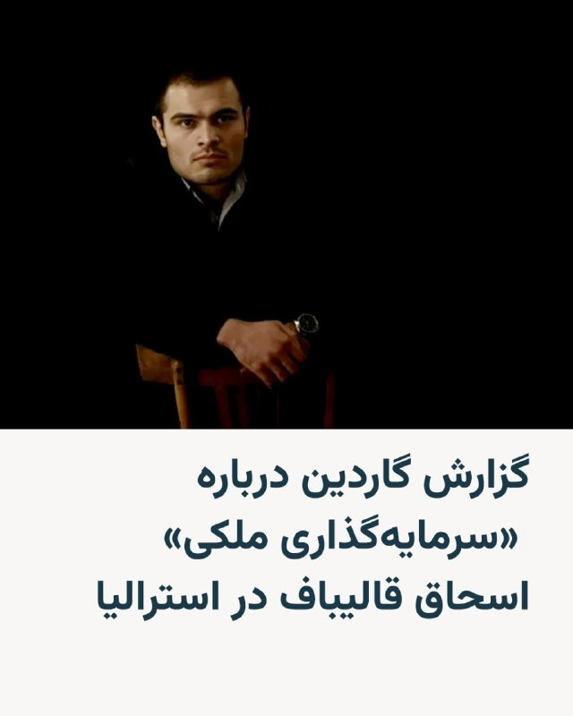

🔸روزنامه «گاردین» در گزارشی از ارتباط اسحاق قالیباف، پسر محمدباقر قالیباف، رئیس مجلس شورای اسلامی، با یک مرکز پژوهشی در دانشگاه ملبورن و سرمایه‌گذاری او در حوزه املاک در استرالیا خبر می‌دهد.

🔸آن‌طور که در این گزارش آمده، او از طریق «اجاره دادن دست‌کم یک ملک در این کشور کسب درآمد می‌کرده است».

🔸گاردین نوشته اسحاق قالیباف چند سال در ملبورن زندگی و تحصیل کرده و طی این مدت با بازار سرمایه‌گذاری املاک و نیز دانشگاه ملبورن ارتباط داشته است.

🔸این روزنامه نوشته که اسحاق قالیباف، ۳۸ ساله، همچنین موفق شده بود اقامت بلندمدت استرالیا را دریافت کند؛ این در حالی است که کانادا دو بار درخواست ویزای او را رد کرده بود.

🔸در این گزارش این پرسش مطرح شده که علیرغم اینکه قالیباف، از فرماندهان سابق سپاه پاسداران و رئیس سابق پلیس ایران بوده و به نقش خود در سرکوب و کتک‌زدن دانشجویان معترض افتخار کرده، فرزند او چطور توانسته از املاک در استرالیا درآمد دریافت کند و در این کشور اقامت موقت بگیرد.

@RadioFarda

## RadioFarda — post 157053

  

🔸ارگان رسمی قوه قضائیه ایران اعلام کرد بخشی از املاک علی کریمی، فوتبالیست سابق تیم ملی ایران و از مخالفان جمهوری اسلامی، را توقیف کرده است.

🔸آن‌طور که خبرگزاری میزان‌ روز دوشنبه ۲۱ اردیبهشت نوشته، «دو واحد تجاری و چهار واحد مسکونی از علی کریمی شناسایی و به دستور قضایی توقیف شده است».

🔸در این گزارش همچنین ادعا شده که یکی از املاک توقیف‌شده، «یک پلاک ثبتی به نام هاوش، فرزند علی کریمی» است.

🔸پیش از این نیز گزارش‌های متعددی از توقیف اموال شماری از روزنامه‌نگاران، فعالان سیاسی و مدنی و هنرمندان با اتهاماتی چون «خیانت» به وطن و «وابستگی» به اسرائیل و کشورهای متخاصم منتشر شده بود.

🔸قوه قضائیه برای اتهامات خود علیه این افراد شواهد و مدارکی ارائه نداده است.

🔸قوه قضائیه می‌گوید کلیه اموال منقول و غیرمنقول این افراد، حساب‌های بانکی و سایر دارایی‌های آن‌ها را توقیف کرده و ممنوعیت انجام هرگونه نقل و انتقال مالی و معاملاتی برای آنان اعمال کرده است.

@RadioFarda

## RadioFarda — post 157052

  

🔸سخنگوی وزارت خارجه ایران می‌گوید تهران در پاسخ به آخرین پیشنهاد آمریکا، خواستار پایان جنگ در منطقه و آزادسازی دارایی‌های مسدودشده در خارج شده است.

🔸اسماعیل بقائی روز دوشنبه ۲۱ اردیبهشت در نشست خبری هفتگی خود گفت: «ما هیچ امتیازی را از طرف آمریکایی مطالبه نکردیم تنها چیزی که مطالبه کردیم حقوق مشروع ایران است».

🔸او افزود مطالبات ایران شامل «توقف جنگ»، «رفع محاصره و دزدی دریایی» و «آزادی دارایی‌های ایران» است که به گفته بقائی، «به ناحق با فشار آمریکا در بانک‌ها مسدود شده است».

🔸سخنگوی وزارت خارجه ایران در ادامه گفت: «تردد ایمن از تنگه هرمز و برقراری امنیت در منطقه و لبنان از دیگر مطالبه‌های ایران بود که پیشنهاد سخاوتمندانه و مشروع برای امنیت منطقه محسوب می‌شود».

🔸رئیس‌جمهور آمریکا شامگاه یکشنبه، پاسخ ایران به طرح پیشنهادی واشینگتن برای پایان جنگ را «کاملاً غیر قابل‌ قبول» توصیف کرد.

🔸وزارت خارجه ایران روز دوشنبه مدعی شد که «طرف‌های آمریکایی کماکان بر اساس ذهنیت‌هایی که عمدتاً ساخته‌پرداخته رژیم صهیونیستی است، بر دیدگاه‌های یک‌سویه خود و خواسته‌های نامعقول‌شان پافشاری می‌کنند».

@RadioFarda

## RadioFarda — post 157051

  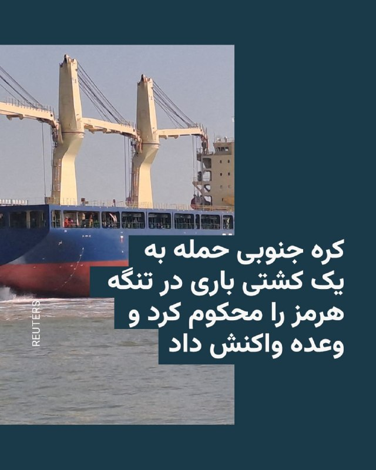

🔸دفتر ریاست‌جمهوری کره جنوبی روز دوشنبه ۲۱ اردیبهشت حمله به یک کشتی باری متعلق به یک شرکت کشتیرانی کره‌ای در تنگهٔ هرمز در اوایل همین ماه را به‌شدت محکوم کرد و گفت که پس از شناسایی عامل این حمله، واکنش نشان خواهد داد.

🔸به گفته یکی از مقامات این دفتر، این حمله باعث آتش‌سوزی در اتاق موتور کشتی شده بود.

🔸این مقام افزود کشتی «نامو» که توسط شرکت «اچ‌ام‌ام» اداره می‌شود، در زمان حادثه هیچ‌یک از مقررات جاری در آب‌های نزدیک امارات متحده عربی را نقض نکرده بود و این رویداد حمله‌ای غیرقابل توجیه به یک کشتی تجاری محسوب می‌شود.

🔸وی سونگ-لاک، مشاور امنیت ملی رئیس‌جمهور کره جنوبی، در یک نشست خبری گفت: «ما این اقدام را به‌شدت محکوم می‌کنیم».

🔸او افزود که خسارات واردشده در جریان بررسی‌های کارشناسی توسط مقامات و متخصصان کره‌ای در دوبی شناسایی شده است.

🔸تهران پیش‌تر هرگونه دخالت در این حادثه را رد کرده بود.

🔸رئیس‌جمهور آمریکا، اندکی پس از این حادثه گفته بود ایران به این کشتی کره‌ای شلیک کرده و از سئول خواسته بود به تلاش‌های تحت رهبری ایالات متحده برای تأمین امنیت کشتیرانی در این تنگه بپیوندد.

@RadioFarda

## IranianMinds — post 19937

  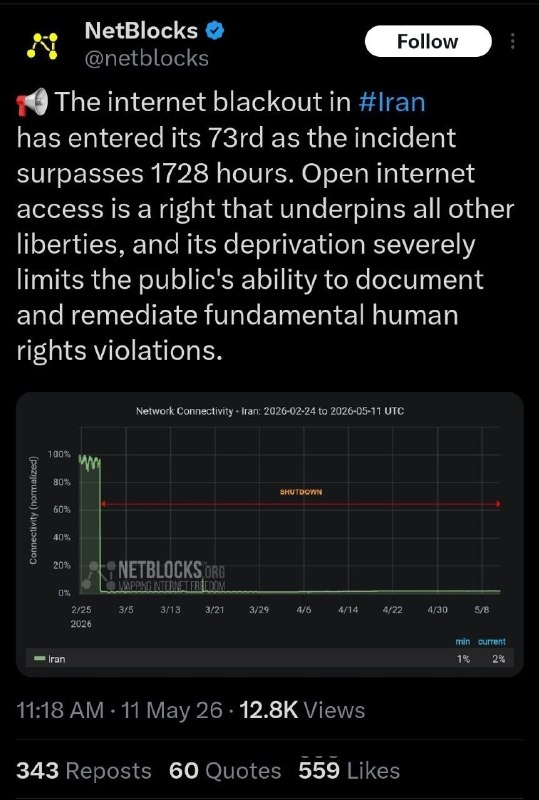

🔴قطع اینترنت در ایران وارد روز ۷۳ شد.
۱۷۲۸ ساعت.

@IranianMinds

## IranianMinds — post 19936

  <a href="telegram/content/IranianMinds_19936_1778500058.mp4">🎬 Download video</a>

🔴ایلان ماسک تأیید کرد که تمام‌قد وارد میدان می‌شود و به جمهوری‌خواهان در انتخابات میان‌دوره‌ای کمک می‌کند.
این یک پیروزی بزرگ برای آمریکاست!

@IranianMinds

## IranianMinds — post 19935

🔴مهر:

یک ساختمان در اراک منفجر شد و چندین نفر مجروح شدند.

@IranianMinds

## IranianMinds — post 19934

🔴کارشناس صداوسیما پس از مصرف شیشه:

موساد ساعتی ۳ دلار به مردم پول می‌دهد که بیان میدون ولیعصر و با تاپ و شلوار قدم بزنن.

@IranianMinds

## IranianMinds — post 19933

  

🔴عباس عراقچی ۲۰ سال در مذاکره، از مونیخ ۲۰۰۶ تا تهران ۲۰۲۶.

@IranianMinds

## IranianMinds — post 19932

🔴خوش‌چشم، کارشناس صداوسیما:

احتمال می‌دهم ظرف یک هفته آینده، جنگ دوباره آغاز شود.

@IranianMinds

## IranianMinds — post 19931

🔴یدیعوت آحارونوت:

نخست‌وزیر نتانیاهو عصر امروز در پی بحران مذاکرات بین تهران و واشنگتن، یک جلسه امنیتی برگزار می‌کند.

@IranianMinds

## BBCPersian — post 280752

‌
سئول در بیانیه‌ای حمله به کشتی باری کره جنوبی در خلیج فارس را به شدت محکوم کرد و گفت که «پس از شناسایی مبدا حمله، به آن پاسخ» خواهد داد.

خبرگزاری رویترز گزارش داده است که کارشناسان کره‌ جنوبی «تجزیه و تحلیل اولیه خسارت» به این کشتی را انجام داده‌اند.

ایران پیشتر هرگونه نقش داشتن در واقعه انفجار و آتش‌سوزی در این کشتی را تکذیب کرده بود.

وزارت خارجه کره‌ جنوبی هم امروز عکس‌هایی را از این کشتی آسیب‌دیده در خلیج‌ فارس منتشر کرد.

کشتی فله‌بر متعلق به شرکت کشتیرانی اچ‌ام‌ام کره جنوبی هفته پیش در چهارم ماه مه در حالی که در تنگه هرمز سرگردان بود، هدف دو پرتابه ناشناس قرار گرفت.

این حمله خسارت جانی نداشت.

این کشتی که نامش اچ‌اچ‌ام نامو اعلام شده است، بر اساس پایگاه اطلاعات دریایی «مارین ترافیک» حدود ۱۸۰ متر طول دارد و با پرچم پاناما حرکت می‌کرده است.

📷South Korean Foreign Ministry/Reuters
@BBCPersian

## BBCPersian — post 280751

🔻خبرگزاری رویترز گزارش کرد که سه نفتکش با خاموش کردن سامانه‌های اعلام موقعیت برای جلوگیری از حملات ایران توانسته‌اند از تنگه هرمز عبور کنند و به آب‌های بین‌المللی بروند.

براساس داده‌های کشتیرانی کپلر و ال‌اس‌ای‌جی، سه نفتکش حامل نفت خام در هفته گذشته و روز یکشنبه با خاموش کردن سامانه‌های اعلام موقعیت از تنگه هرمز خارج شدند.

این داده‌ها نشان می‌دهد که دو نفتکش بسیار بزرگ آگیوس فانوریوس ۱ و کیارا ام، که هر کدام دو میلیون بشکه نفت خام عراق را حمل می‌کنند، یکشنبه از این تنگه عبور کردند.

پیش از ایران اعلام کرده بود که نفتکش آگیوس فانوریوس با هماهنگی از تنگه هرمز عبور کرده است. این تفتکش پیش از این دو بار سعی کرده بود که از این تنگه عبور کند که موفق نشده بود.
https://bbc.in/3PePlEc
@BBCPersian

## BBCPersian — post 280750

🔻اسرائیل می‌گوید سه سربازش در حمله پهپادی مجروح شدند

ارتش اسرائیل اعلام کرد که سه سربازش بر اثر انفجار یک حامل مواد منفجره در جنوب لبنان زخمی شده‌اند.
جزییات بیشتری از محل این انفجار اعلام نشده است.
پیشتر حزب‌الله اعلام کرده بود که محل تجمع سربازان اسرائیلی را در منطقه طیبه در جنوب لبنان هدف قرار داده و نیروهای اسرائیلی برای تخلیه مجروحان از هلیکوپتر استفاده کرده‌اند.
صبح امروز هم اسرائیل اعلام کرده بود که یک سربازش در حمله پهپادی در منطقه‌ای نزدیک به مرز لبنان کشته شده است.
در همین حال خبرگزاری ملی لبنان گزارش داده است که اسرائیل صبح امروز به روستای شمالی عابا حمله هوایی کرده است که دو نفر کشته و پنج زخمی برجا گذاشته است.
براساس این گزارش منطقه كفر رمان در جنوب لبنان هم امروز، دو بار و در کمتر از یک ساعت، هدف حمله جنگنده‌های اسرائیل قرار گرفته است.

https://bbc.in/3PePlEc
@BBCPersian

## BBCPersian — post 280749

🔻نتبلاکس: قطع اینترنت در ایران وارد هفتادوسومین روز متوالی شد

نتبلاکس که وضعیت اینترنت در جهان را بررسی می‌کند می‌گوید که قطع اینترنت در ایران اکنون وارد هفتادوسومین روز شده و مدت این اختلال از ۱۷۲۸ ساعت فراتر رفته است.

نتبلاکس می‌گوید: «دسترسی آزاد به اینترنت یک حق اساسی است که زمینه‌ساز سایر آزادی‌ها محسوب می‌شود، و محرومیت از آن، توان عمومی برای ثبت، مستندسازی و پیگیری نقض‌ اساسی حقوق بشر را به‌شدت محدود می‌کند.»

مقام‌های جمهوری اسلامی ایران از ۹ اسفند (۲۸ فوریه) و همزمان با حملات اسرائیل و آمریکا، دسترسی به اینترنت بین‌الملل را قطع کردند. تماس‌ تلفنی با خارج از ایران هم با اختلال جدی رو‌به‌رو است.

حکومت ایران برای حامیان یا نزدیکان خود اتصال به اینترنت بین‌الملل را فراهم کرده است که این افراد به دارندگان «سیم‌کارت سفید» مشهور شده‌‌‌‌‌‌‌‌‌‌اند.

ایران استفاده از اینترنت ماهواره‌ای استارلینک را جرم‌انگاری کرده است و کاربران را تحت تعقیب قرار می‌دهد.

تازه‌ترین تحولات ایران و منطقه را از لینک ⬇️ در سایت بی‌بی‌سی فارسی دنبال کنید.

https://bbc.in/4u5EtI8
@BBCPersian

## BBCPersian — post 280741

‌ ‌ ‌
هر زمان که به اینترنت وصل می‌شوید، کسی در حال گردآوری اطلاعاتی است که از خود به جا می‌گذارید؛ چه ارائه‌دهنده خدمات اینترنتی شما باشد، چه سرور صفحه‌ای که از آن بازدید می‌کنید، یا مرورگری که با آن به این صفحه دسترسی دارید.

همه این داده‌ها به شرکت‌ها کمک می‌کند رفتار مشتریان خود را بهتر بشناسند و راهبردها و محصولاتی طراحی کنند که نیازهای مصرف‌کنندگان را دقیق‌تر برآورده کند.

به همین شکل، از داده‌ها می‌توان برای شناسایی افرادی نیز استفاده کرد که تهدید تلقی می‌شوند. ایالات متحده از همین روش برای یافتن پناهگاه اسامه بن‌لادن در پاکستان بهره برد.

https://bbc.in/4eFt50H
📸GettyImages / NurPhoto via Getty Images/ AFP via Getty Images
@BBCPersian

## BBCPersian — post 280740

  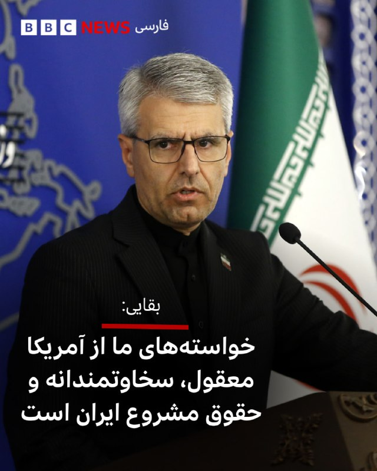

‌
سخنگوی وزارت خارجه ایران خواسته‌های این کشور را «معقول، مسئولانه و سخاوتمندانه» توصیف و آمریکا را به پافشاری بر دیدگاه‌های «یکسویه و نامعقول» متهم کرده است.

اظهارات اسماعیل بقایی پس از آن است که دونالد ترامپ پاسخ تهران به پیشنهاد آمریکا را «کاملا غیرقابل قبول» خواند و ایران را به «فریبکاری» متهم کرد.

آقای بقایی مواردی از خواسته‌های ایران را برشمرد و گفت که هرآنچه که مطالبه شده «حقوق مشروع ایران» بوده است:

«آیا مطالبه ایران برای خاتمه جنگ در منطقه ... مطالبه ایران برای توقف راهزنی دریایی علیه کشتی‌های ایران در منطقه که از آن به عنوان محاصره دریایی یاد می‌کنند ... مطالبه ایران برای آزاد شدن دارایی‌های متعلق به مردم ایران... که در بانک‌های خارجی محبوس شده ... پیشنهاد ما برای اینکه در تنگه هرمز تردد ایمن صورت بگیرد، آیا زیاده خواهانه است... موضوع مهمی چون برقراری صلح در همه منطقه به شمول لبنان آیا زیاده‌خواهانه است؟»

📷Anadolu via Getty Images

تازه‌ترین تحولات ایران و منطقه را از لینک ⬇️ در سایت بی‌بی‌سی فارسی دنبال کنید.

https://bbc.in/4u5EtI8
@BBCPersian

## BBCPersian — post 280739

  

‌ ‌ ‌ ‌ ‌
جسد خوزه مانوئل گارسیا، زندانی سیاسی که از ماه فوریه در ونزوئلا در زندان به سر می‌برد، پیدا شده است.

این عضو سابق شورای شهر به کلاهبرداری و اخاذی متهم شده بود.

براساس گزارش‌ها جسد او در یک پاسگاه پلیس در اناکو در شمال شرقی ونزوئلا پیدا شده است.

حزب دموکراتیک متحد، که اپوزیسیون حکومت مرکزی است، مرگ آقای گارسیا را محکوم کرده است.

روز پنجشنبه هم مقامات ونزوئلا مرگ یک زندانی سیاسی دیگر به نام ویکتور هوگو کوئرو ناواس را که از نه ماه پیش در بازداشت بود، تایید کردند.

از سال ۲۰۱۴ تاکنون، بیست زندانی سیاسی در بازداشت در ونزوئلا جان خود را از دست داده‌اند.

📷 Carlos Becerra/Getty Images
@BBCPersian

## Dirty_Kids — post 389258

  <a href="telegram/content/Dirty_Kids_389258_1778500062.mp4">🎬 Download video</a>

آخوند در صداوسیما:
امام علی شوهر زنی را کشت اما چون مهربان بود با زن بیوه دوست شد با او به خونه‌‌اش رفت، بعد شام هم با بچه‌های زن بیوه بازی کرد هم با خود زن بیوه

یه جورى با جزييات رابطه رو تعريف ميكنه انگار كه ۱۴۰۰ سال قبل اونجا نشسته بوده،
ولی عجب بازیکنی بوده علی‌شون😂😂


@Dirty_Kids 👻

## Dirty_Kids — post 389257

  <a href="telegram/content/Dirty_Kids_389257_1778500063.mp4">🎬 Download video</a>

علیرضا پناهیان سخنران بیت تخریب شده خامنه‌ای با حمله به قالیباف و پزشکیان از آنها خواست مقابل ترامپ ایستاده و شعار حذف اسرائیل را عملی کنند.

@Dirty_Kids 👻

## Dirty_Kids — post 389256

  <a href="https://t.me/Dirty_Kids/389256">📎 Download file</a>

✅ اپلیکیشن اندروید سایت جهانی دربی بت

💰اولین سایت جهانی با امکان شارژ و برداشت ریالی(کارت به کارت)

🔗 برای ورود فیلترشکن روی کشور مناسب قرار دهید مانند فنلاند و المان و....

😀Telegram Channel
👇
https://t.me/+bcynkEgSW2dlYTc0

## Dirty_Kids — post 389255

  

😤دنبال یه سایت شرط بندی بین المللی بودی که به ایرانیا خدمات بده؟!
⛔

👍دربی بت همون انتخاب  100%

💎ویژگی های سایت جهانی Derby Bet:

⬅️امکان شارژ امن با کارت بانکی

⬅️واریز اول دوبل شارژ می شوید(بونوس۱۰۰٪)

⬅️پر اپشن ترین سایت فعال در ایران

⬅️تسویه حساب کمتر از 5 دقیقه

⬅️برگشت بخشی از باخت به صورت هفتگی

🚨کد هدیه ثبت نام:GG007

⚠️برای دانلود اپلکیشن کلیک کنید
👉

🔔کانال دربی بت :

🪙https://t.me/+bcynkEgSW2dlYTc0

## Dirty_Kids — post 389254

  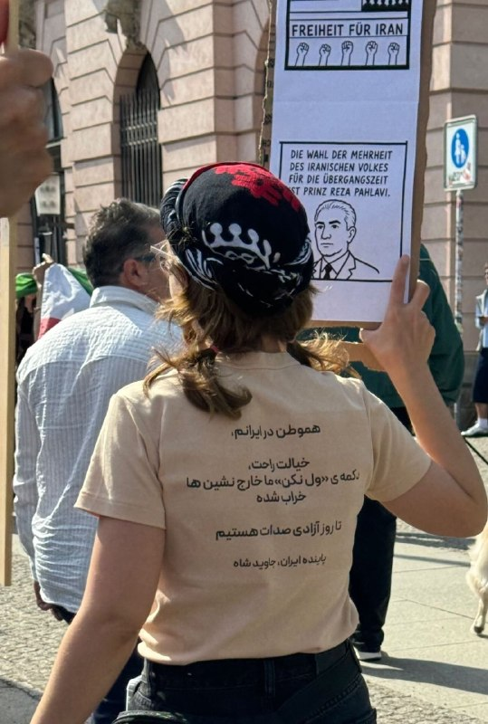

هموطن در ایرانم،
خیالت راحت،
دکمه‌ی «ول نکن» ما خارج نشین ها خراب شده
تا روز آزادی صدات هستیم
پاینده ایران، جاوید شاه

نوشته‌ی روی لباس یکی از حاضران در تجمع امروز در شهر برلین

@Dirty_Kids 👻

## Dirty_Kids — post 389253

  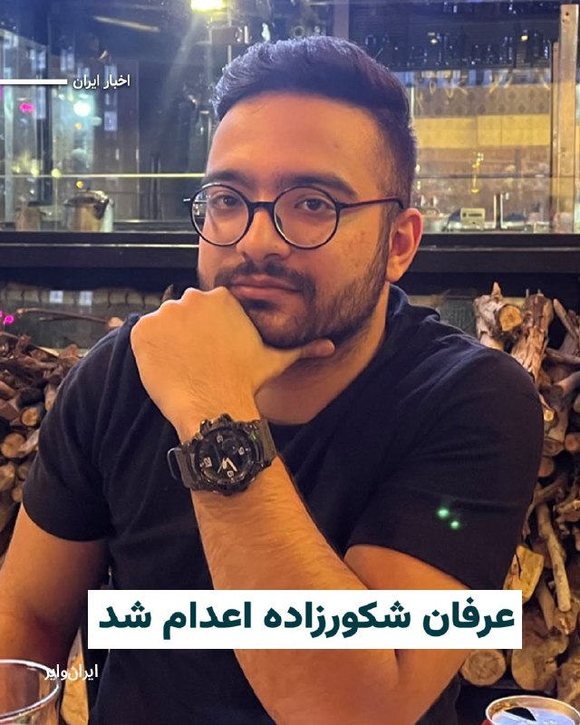

خبرگزاری «میزان» وابسته به قوه قضاییه جمهوری اسلامی از اعدام «عرفان شکورزاده» با اتهام «همکاری با سازمان اطلاعات مرکزی آمریکا (سیا) و موساد» خبر داد.

عرفان شکورزاده متولد ۱۳۷۶ و
دانش‌آموخته مهندسی برق دانشگاه تبریز بود که در مقطع کارشناسی ارشد در دانشگاه علم و صنعت تهران تحصیل می‌کرد. در سوابق علمی منتشرشده از او، کسب رتبه نخست مقطع کارشناسی ارشد، فعالیت در حوزه نرم‌افزارهای تست ماهواره و انتشار مقالات علمی در زمینه کنترل و موقعیت‌یابی ماهواره دیده می‌شود.


@Dirty_Kids 👻

## Hranews — post 112880

تداوم بازداشت پیشوا آقاپور در ارومیه
 

❗️
❗️
❗️
❗️
❗️ – با گذشت ۶۸ روز از دستگیری پیشوا آقاپور، شهروند اهل بوکان، او همچنان در بازداشت به سر می‌برد. وی اخیرا از زندان ارومیه به یکی از بازداشتگاه‌های امنیتی در این شهر منتقل شده است.
 
ادامه مطلب
 
#پیشوا_آقاپور
 
↘️
@hranews_bot تماس ✉️ -  @Hranews  کانال هرانا 🆑

## Hranews — post 112879

یک شهروند توسط نیروهای امنیتی در نیکشهر بازداشت شد
 

❗️
❗️
❗️
❗️
❗️ – روز جمعه ۱۸ اردیبهشت ماه، شهیم بهرامی، شهروند اهل نیکشهر توسط ماموران اداره اطلاعات در این شهرستان بازداشت و به یکی از بازداشتگاه‌های این نهاد امنیتی در زاهدان منتقل شد.
 
ادامه مطلب

#شهیم_بهرامی

↘️
@hranews_bot تماس ✉️ -  @Hranews  کانال هرانا 🆑

## Hranews — post 112878

  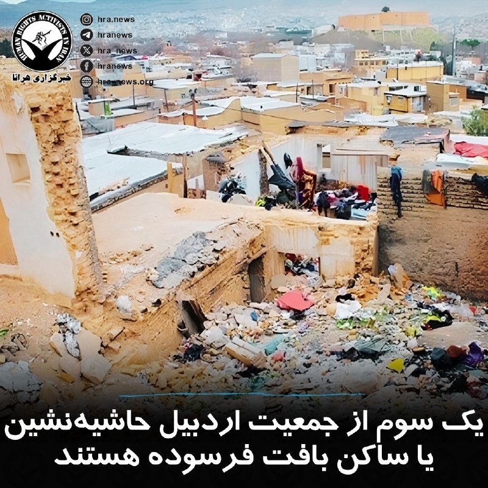

مدیرکل راه و شهرسازی اردبیل در خصوص آمار حاشیه نشینی در این استان اعلام کرد که ۶۷ محله به مساحت ۱،۹۳۰ هکتار در سکونتگاه‌های غیررسمی واقع شده است. به گفته محبوب حیدری، یک سوم از جمعیت شهری اردبیل در سکونت‌گاه‌های غیررسمی، سکونت‌گاه‌هایی با بافت‌های تاریخی، بافت ناکارآمد و بافت ناسازگار شهری ساکن هستند.

از سوی دیگر، صدیف بدری، عضو هیئت رئیسه مجلس شورای اسلامی با اشاره به ضرورت نوسازی بافت‌های فرسوده در تمام استان‌ها، گفت: حدود ۲۲ تا ۲۳ میلیون نفر از مردم در بافت‌های فرسوده و مسکن‌های ناپایدار زندگی می‌کنند که این نشان دهنده اهمیت نوسازی و بهسازی بافت فرسوده است.

↘️
@hranews_bot تماس ✉️ -  @Hranews  کانال هرانا 🆑

## Hranews — post 112877

  

رئیس انجمن صنفی گچ‌کاران قم، با انتقاد از عدم تخصیص سهمیه بیمه #کارگران ساختمانی و طرح افزایش سهم پرداختی #بیمه، گفت: بسیاری از کارگران توان پرداخت هزینه‌های فعلی را هم ندارند و این روند می‌تواند به محرومیت شمار بیشتری از آنان از پوشش بیمه‌ای منجر شود.

داود کشوری با انتقاد از عملکرد وزارت کار و سازمان تامین اجتماعی تاکید کرد که با گذشت حدود ۵۰ سال از تصویب قانون بیمه کارگران ساختمانی، بخش زیادی از این کارگران همچنان از ابتدایی‌ترین حمایت‌های بیمه‌ای محروم مانده‌اند.

↘️
@hranews_bot تماس ✉️ -  @Hranews  کانال هرانا 🆑

## configx2ray — post 38736

Free 🔥 اختصاصی @ConfigX2ray.npvt

## configx2ray — post 38735

  <a href="https://t.me/ConfigX2ray/38735">📎 Download file</a>

کانفیگ برای Npv tunnel ⭕️

به هیچ وج دانلود نزنید باهاش
❤️

رمز فایل : @ConfigX2ray

Channel : https://t.me/ConfigX2ray

## configx2ray — post 38732

  <a href="https://t.me/ConfigX2ray/38732">📎 Download file</a>

کانفیگ برای Npv tunnel ⭕️

به هیچ وج دانلود نزنید باهاش
❤️

رمز فایل : @ConfigX2ray

Channel : https://t.me/ConfigX2ray

## configx2ray — post 38731

45.82.136.180

22888

پروکسی برای سایفونتون 
⚡️

Channel : https://t.me/ConfigX2ray

## manototv — post 105300

  <a href="telegram/content/manototv_105300_1778500069.mp4">🎬 Download video</a>

گردهمایی ایرانیان ونکوور

## manototv — post 105299

  

رسانه‌های جمهوری اسلامی از جمله خبرگزاری فارس نوشتند انتشار دود در بخشی از شیراز، ناشی از انفجار کنترل‌شده مهمات عمل‌نکرده بوده است.

بر اساس این گزارش‌ها، ارتش پیش‌تر اعلام کرده بود که دقایقی بعد، مهمات عمل‌نکرده در شیراز به‌صورت کنترل‌شده منفجر خواهد شد.

## manototv — post 105298

  

قیمت نفت روز دوشنبه پس از آن بیش از سه‌ونیم درصد افزایش یافت که دونالد ترامپ، رئیس‌جمهور آمریکا، پاسخ جمهوری اسلامی به پیشنهاد واشینگتن برای پایان جنگ را «کاملا غیرقابل قبول» خواند.

رویترز نوشت تهران در پاسخ خود خواستار پایان جنگ، رفع انسداد دریایی، تضمین نشدن حمله تازه، لغو تحریم‌ها و آزادسازی فروش نفت ایران شده است.

## manototv — post 105297

  <a href="telegram/content/manototv_105297_1778500072.mp4">🎬 Download video</a>

دنهاخ | هلند؛ گردهمایی ایرانیان مقابل دادگاه لاهه

## manototv — post 105296

  <a href="telegram/content/manototv_105296_1778500073.mp4">🎬 Download video</a>

نت‌بلاکس، نهاد ناظر بر دسترسی به اینترنت، اعلام کرد اختلال و قطعی اینترنت در ایران وارد هفتادوسومین روز خود شده و مدت این وضعیت از ۱۷۲۸ ساعت گذشته است. به گفته نت‌بلاکس، این قطعی گسترده همچنان ایران را تا حد زیادی از اینترنت جهانی جدا نگه داشته است.

## manototv — post 105295

  <a href="telegram/content/manototv_105295_1778500074.mp4">🎬 Download video</a>

اسماعیل بقایی، سخنگوی وزارت خارجه جمهوری اسلامی، گفت خواسته‌های ایران در پاسخ اخیر به پیشنهاد آمریکا «حقوق مشروع ایران» بوده و تهران در این متن، مطالباتی مانند پایان جنگ در منطقه، توقف آنچه او «راهزنی دریایی علیه کشتی‌های ایران» خواند، آزادسازی دارایی‌های مسدودشده و تضمین تردد ایمن در تنگه هرمز را مطرح کرده است.

او با رد این‌که مطالبات ایران «زیاده‌خواهانه» باشد، گفت پیشنهاد تهران نه فقط برای منافع ملی ایران، بلکه برای «ثبات و امنیت کل منطقه و جهان» تنظیم شده بود. بقایی همچنین گفت موضوع امنیت و صلح در منطقه، از جمله لبنان، بخشی از بسته پیشنهادی ایران بوده است.

سخنگوی وزارت خارجه جمهوری اسلامی در ادامه، آمریکا و اسرائیل را به اخلال در آزادی دریانوردی و تعرض به کشتی‌های ایرانی در آب‌های آزاد متهم کرد و گفت قرار بود این مسائل در چارچوب بسته پیشنهادی ایران مورد بحث و تصمیم‌گیری قرار گیرد.

بقایی در بخش دیگری از سخنانش از رویکرد آمریکا انتقاد کرد و گفت طرف آمریکایی همچنان بر اساس ذهنیت‌هایی که به گفته او «ساخت‌پرداخته اسرائیل» است، بر دیدگاه‌های یک‌سویه و خواسته‌های نامعقول خود پافشاری می‌کند.

دونالد ترامپ پیشتر از پاسخ جمهوری اسلامی ابراز نارضایتی کرد.

## alonews — post 119273

  <a href="telegram/content/alonews_119273_1778500076.jpg">🎬 Download video</a>

👈ارتش اسرائیل در حال آماده‌سازی برای گسترش عملیات زمینی خود در لبنان در پی ادامه نقض‌های حزب‌الله است و موقعیت نظامی را برای امکان تصمیم‌گیری رهبری سیاسی فراهم می‌کند، به گزارش کانال ۱۲ و به نقل از منابع نظامی اسرائیلی

✅ @AloNews خبر جنگ

## alonews — post 119272

  <a href="telegram/content/alonews_119272_1778500076.jpg">🎬 Download video</a>

👈وزیر نفت : ما برنامه‌هایی برای مقابله با پیامدهای تحریم‌های آمریکا تدوین کرده‌ایم و تولید ما در طول ۴۰ روز جنگ کاهش نیافته است

✅ @AloNews خبر جنگ

## alonews — post 119269

  <a href="telegram/content/alonews_119269_1778500076.jpg">🎬 Download video</a>

👈حملات هوایی اسرائیل شهرهای صدّیقین، عرب‌سلیم و النمریه در جنوب لبنان را هدف قرار داده‌اند

✅ @AloNews خبر جنگ

## alonews — post 119268

  <a href="telegram/content/alonews_119268_1778500077.jpg">🎬 Download video</a>

👈وزیر خارجه سوریه: امیدواریم در آینده «روابطی باثبات و آرام» میان ما با اسرائیل شکل بگیرد.

✅ @AloNews خبر جنگ

## alonews — post 119267

  <a href="telegram/content/alonews_119267_1778500077.jpg">🎬 Download video</a>

👈موج گسترده ای از حملات هوایی اسرائیل در سراسر جنوب لبنان در حال وقوع است

✅ @AloNews خبر جنگ

## alonews — post 119266

  <a href="telegram/content/alonews_119266_1778500077.jpg">🎬 Download video</a>

👈یک جنگنده F35 آمریکایی برای دومین بار طی شبانه روز گذشته، بر فراز خلیج عمان پیام اضطراری فرستاد و در امارات متحده عربی فرود اضطراری کرد.

✅ @AloNews خبر جنگ

## alonews — post 119264

  <a href="telegram/content/alonews_119264_1778500077.mp4">🎬 Download video</a>

👈حملات هوایی اسرائیل مدتی پیش مناطق نبطیه و زبدین در جنوب لبنان را هدف قرار داد.

✅ @AloNews خبر جنگ

## alonews — post 119263

  <a href="telegram/content/alonews_119263_1778500078.jpg">🎬 Download video</a>

👈وزیر رفاه: مشکلی در تأمین نیازهای دارویی کشور وجود ندارد

✅ @AloNews خبر جنگ

## alonews — post 119262

  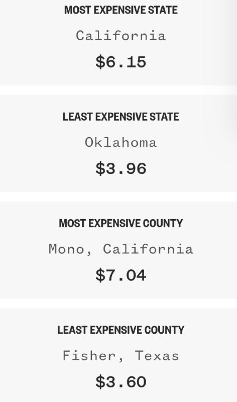

👈قیمت بنزین در آمریکا به روایت ان‌بی‌سی

🔴گران‌ترین ایالت: کالیفرنیا 6.15 دلار

🔴ارزان‌ترین ایالت: اوکلاهما 3.96 دلار

🔴گران‌ترین شهرستان:مونو، کالیفرنیا 7.04 دلار

🔴ارزان‌ترین شهرستان: فیشر، تگزاس 3.60 دلار

✅ @AloNews خبر جنگ

## alonews — post 119261

  <a href="telegram/content/alonews_119261_1778500079.mp4">🎬 Download video</a>

⭕️ایلان ماسک تأیید کرد که تمام‌قد وارد میدان می‌شود و جمهوری‌خواهان را در انتخابات میان‌دوره‌ای (Midterms) تأمین مالی می‌کند تا به ترامپ کمک کند.

🔴این یک پیروزی بزرگ برای آمریکاست!

✅@AloNews

## alonews — post 119260

  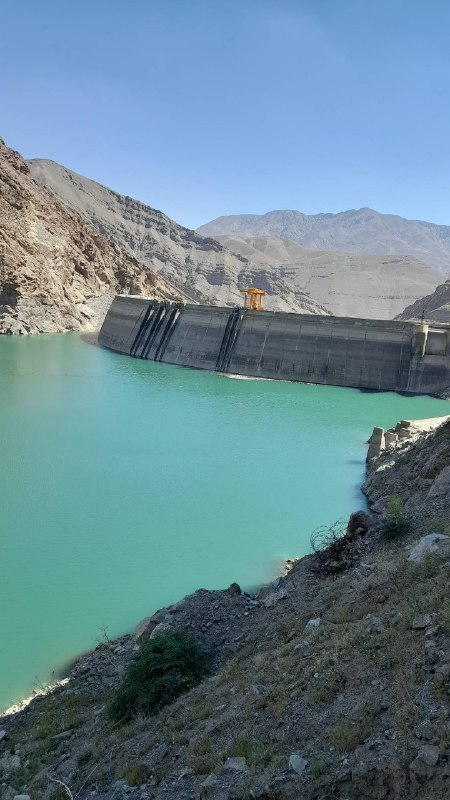

👈وضعیت سد کرج، که در آستانه پر شدن است

🔴سازمان آب و فاضلاب گفته که ۴۰ درصد کلا پر شده است

✅ @AloNews خبر جنگ

## alonews — post 119259

  <a href="telegram/content/alonews_119259_1778500081.jpg">🎬 Download video</a>

👈نماینده حزب کارگر دیوید اسمیت خواستار استعفای نخست‌وزیر بریتانیا، کیر استارمر، پس از سخنرانی او شده است

✅ @AloNews خبر جنگ

## alonews — post 119258

  <a href="telegram/content/alonews_119258_1778500081.jpg">🎬 Download video</a>

👈همراه اول و رایتل و ایرانسل دارن اینترنت پرو میفروشن، یعنی همون فیلترشکن اما کسی بهشون چیزی نمیگه

✅ @AloNews خبر جنگ

## alonews — post 119257

  <a href="telegram/content/alonews_119257_1778500082.jpg">🎬 Download video</a>

👈پورابراهیمی، رئیس کمیسیون اقتصادی مجمع تشخیص مصلحت نظام: آرایش سیاسی آمریکا از جنگ نظامی به جنگ اقتصادی با ایران تغییر کرده است

✅ @AloNews خبر جنگ

## alonews — post 119256

  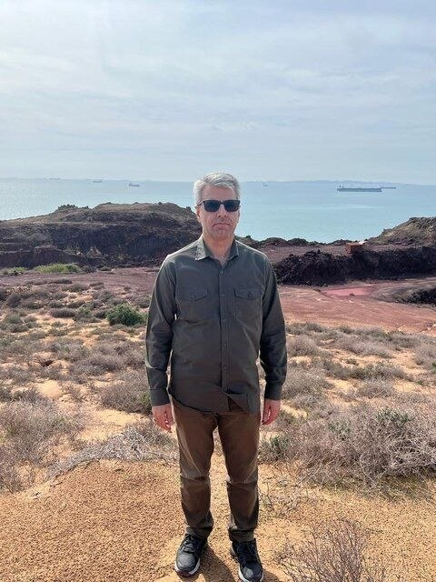

👈اسماعیل بقائی:
ایران قلدر نیست قلدر ستيز است.

✅ @AloNews خبر جنگ

## alonews — post 119255

  <a href="telegram/content/alonews_119255_1778500082.jpg">🎬 Download video</a>

👈گفتگوی تلفنی وزرای خارجه ایران و عربستان

✅ @AloNews خبر جنگ

## alonews — post 119254

  <a href="telegram/content/alonews_119254_1778500083.jpg">🎬 Download video</a>

👈قیمت بنزین کمی کاهش یافته است اما طبق گفته انجمن خودروی آمریکا، همچنان تقریباً ۵۱٪ بالاتر از ابتدای جنگ باقی مانده است

✅ @AloNews خبر جنگ

---
📅 بروزرسانی: 1405/02/21 11:51
---

## VahidOOnLine — post 239476

  

علی خزایی، نماینده ورامین در مجلس گفت: «شرایط مدیریت تنگه هرمز هیچ‌گاه مانند گذشته نخواهد شد و این تنگه به وضع سابق بازنمی‌گردد و هیچ شناوری بدون اجازه جمهوری اسلامی حق عبور ندارد.»

او افزود: «شناورهای آمریکا و کشورهای همکار با این کشور، اجازه عبور از تنگه هرمز را نخواهند داشت.»
iranintl
‌🏁 🇬🇧 IranintlTV

🤖 @VahidOOnLine

## VahidOOnLine — post 239475

  <a href="telegram/content/VahidOOnLine_239475_1778487665.mp4">🎬 Download video</a>

سن‌فرانسیسکو| گردهمایی ایرانیان، ۲۰ اردیبهشت
‌🏁 🇬🇧 ManotoTV

🤖 @VahidOOnLine

## VahidOOnLine — post 239474

  

اسماعیل بقائی، سخنگوی وزارت خارجه جمهوری اسلامی گفت: «ما به کشورهای اروپایی صریحا اعلام کردیم که اجازه ندهند وسوسه‌های آمریکا یا اسرائیل در موضوعات منطقه‌ای، آن‌ها را ناخواسته به بحرانی بکشاند که سودی برایشان نخواهد داشت.»

او اضافه کرد: «این آگاهی نسبی در بسیاری از کشورهای اروپایی وجود دارد. آنها مطمئن هستند که این جنگ، جنگی غیرقانونی، غیراخلاقی و تجاوزکارانه بوده است. به همین دلیل، اجازه ندادند فشارهای آمریکا آنان را به‌طور علنی بخشی از این اقدام غیرقانونی و مخرب صلح و امنیت بین‌المللی کند.»
‌🏁 🇬🇧 IranintlTV

🤖 @VahidOOnLine

## VahidOOnLine — post 239473

  

عباس مقتدایی، نایب‌رییس کمیسیون امنیت ملی مجلس، گفت که اگر آمریکا بخواهد بر «تخیلات» خود علیه منافع جمهوری اسلامی اصرار بورزد، «تاوان سختی» برای این لجاجت در شهرهای آمریکا خواهد پرداخت.

او افزود نیروهای مسلح جمهوری اسلامی «مدیریت هوشمند» تنگه هرمز را برای مقابله با «زیاده‌خواهی دشمنان» در دست گرفتند و اگر لازم باشد، برای عبور و مرور کشتی‌ها عوارض دریافت خواهند کرد.

نایب‌رییس کمیسیون امنیت ملی مجلس گفت برخی کشورهای منطقه با در اختیار قرار دادن خاک خود، با آمریکا و اسرائیل در حمله به ما همکاری کردند و جمهوری اسلامی در دفاع از خود «هر اقدامی» در برابر دشمنی آنها انجام می‌دهد.
iranintl
‌🏁 🇬🇧 IranintlTV

🤖 @VahidOOnLine

## VahidOOnLine — post 239472

  

اسماعیل بقائی، سخنگوی وزارت خارجه جمهوری اسلامی، در خصوص پاسخ تهران به پیشنهاد واشینگتن برای خاتمه جنگ گفت: «هرچه در متن پیشنهاد کردیم معقول و سخاوتمندانه بود. نه‌تنها برای منافع ملی ایران بلکه برای خیر و صلاح منطقه و جهان اما طرف‌های آمریکایی همچنان بر خواسته‌های نامعقول خود پافشاری می‌کنند.»

او افزود: «جمهوری اسلامی ثابت کرده قدرت مسئولیت‌پذیر در منطقه است. ما قلدر نیستیم؛ قلدرستیز هستیم.» او ادامه داد: «پیشنهاد ما برای تردد ایمن در تنگه هرمز آیا زیاده خواهانه است؟ موضوع مهمی همچون برقراری صلح و امنیت در تمام منطقه غیرمسئولانه است؟»

پیش‌تر دونالد ترامپ پیشنهاد جمهوری اسلامی را «غیرقابل قبول» خوانده بود.
iranintl
‌🏁 🇬🇧 IranintlTV

🤖 @VahidOOnLine

## VahidOOnLine — post 239471

  

♦️ علی مطهری، عضو پیشین مجلس شورای اسلامی و همسر خواهر برادران لاریجانی شامگاه یکشنبه ۲۰ اردیبهشت در گفتگو با ایرنا درباره آخرین دیدار با علی لاریجانی، دبیر پیشین شورای عالی امنیت ملی حکومت ایران صحبت کرد.

مطهری گفت  حدود یک ماه قبل  از کشته شدن علی لاریجانی او به همراه مرتضی فرزندش به طور سرزده به منزل ما آمدند و حدود دو ساعت نشستیم و صحبت کردیم... احساس کردم ایشان از سبک زندگی که با استتار، تغییر مداوم مکان و رفت و آمد همراه بود، کمی خسته شده بودند و برای استراحت، گپ زدن و شاید تبادل نظر آمده بودند.

علی مطهری گفت: «جالب اینکه وقتی می‌خواستند خداحافظی کنند، همسرم به آقای لاریجانی گفت که طبقه بالای ما تقریبا خالی است و می‌توانند آنجا بیایند. من با شوخی گفتم: نه، تو رو خدا نیایید اینجا، همه ما با هم کشته می‌شویم. ایشان خنده‌ عمیقی کردند.»
‌🇸🇦 Indypersian

🤖 @VahidOOnLine

## VahidOOnLine — post 239470

  <a href="telegram/content/VahidOOnLine_239470_1778487668.mp4">🎬 Download video</a>

ویدیوهای رسیده به ایران‌اینترنشنال نشان می‌دهند ایرانیان مقیم اسپانیا و یونان، یکشنبه ۲۰ اردیبهشت در تجمع‌های اعتراضی برگزارشده در شهرهای مادرید و آتن، علیه جمهوری اسلامی پرفورمنس اعتراضی برگزار کردند.
‌🏁 🇬🇧 IranintlTV

🤖 @VahidOOnLine

## VahidOOnLine — post 239469

  <a href="telegram/content/VahidOOnLine_239469_1778487670.mp4">🎬 Download video</a>

ونکوور| راهمپیمایی ایرانیان در حمایت از مردم ایران، ۲۰ اردیبهشت
‌🏁 🇬🇧 ManotoTV

🤖 @VahidOOnLine

## VahidOOnLine — post 239468

  <a href="telegram/content/VahidOOnLine_239468_1778487671.mp4">🎬 Download video</a>

بر اساس ویدیوهای رسیده به ایران‌اینترنشنال، ایرانیان مقیم کانادا روز یکشنبه در پی فراخوان شاهزاده رضا پهلوی و علیه اعدام‌های جمهوری اسلامی، در اتاوا و ونکوور تجمع کردند.
‌🏁 🇬🇧 IranintlTV

🤖 @VahidOOnLine

## VahidOOnLine — post 239467

  <a href="telegram/content/VahidOOnLine_239467_1778487673.mp4">🎬 Download video</a>

پایگاه تحلیل تصاویر ماهواره‌ای «سور اطلس» اعلام کرد تصاویر ماهواره‌ای ظاهرا یک نفتکش بزرگ را در تنگه هرمز نشان می‌دهد که پس از یک حمله، ردی از نفت در آب برجای گذاشته است. در این تصاویر همچنین رفت‌وآمد گسترده قایق‌های تندرو کوچک در نزدیکی نفتکش دیده می‌شود.

وب‌سایت «تنکر ترکرز» این نفتکش را ابرنفتکش «باراکا» (برکت) معرفی کرده و نوشته است که این شناور متعلق به شرکت ملی نفت ابوظبی، ادنوک، است. به گفته این نهاد ردیابی نفتکش‌ها، باراکا روز ۱۴ اردیبهشت هدف پهپادهای جمهوری اسلامی قرار گرفت و در زمان حمله، پس از یک انتقال محرمانه محموله به نفتکشی دیگر در شرق امارات، خالی از نفت بوده است.
‌🏁 🇬🇧 ManotoTV

🤖 @VahidOOnLine

## VahidOOnLine — post 239466

  

♦️ کاخ آبی، دفتر ریاست جمهوری کره جنوبی روز دوشنبه ۲۱ اردیبهشت ماه با تائید خبر حمله به یکی ازکشتی‌‌ها باری این کشور در تنگه هرمز اعلام کرد به «برنامه دارد تا به عامل این تهاجم» پاسخ دهد.

به گزارش خبرگزاری رویترز در بیانیه ریاست جمهوری کره جنوبی آمده است برخورد یک «پرتابه به کشتی باری اچ‌ام‌ام نامو/ HMM NAMU را به شدت محکوم می‌کند اما در این مرحله از تحقیقات هنوز معلوم نیست این پرتابه از کجا شلیک شده و آیا ایران در آن نقشی داشته است یا نه.»

ساعاتی پیش وزارت خارجه کره‌جنوبی روز یکشنبه اعلام کرده بود که کشتی باری متعلق به این کشور که پیشتر در تنگه هرمز دچار حادثه شده بود،  هدف حمله «هواگردهای ناشناس» قرار گرفته است.
پارک ایل، سخنگوی وزارت خارجه کره‌جنوبی، در یک نشست خبری گفت دو هواگرد ناشناس بخش بیرونی مخزن تعادل سمت چپ در قسمت عقب کشتی «اچ‌ام‌ام نامو» را با فاصله حدود یک دقیقه هدف قرار دادند که در پی آن آتش و دود ایجاد شد.
او بدون اشاره به نوع این هواگردها گفت تصاویر آن‌ها در دوربین‌های مداربسته ثبت شده، اما «محدودیت‌هایی برای شناسایی دقیق نوع، مبدا پرتاب و اندازه فیزیکی این اشیا وجود دارد.»
به گفته مقام‌های کره‌جنوبی، بررسی‌های بیشتری روی بقایای موتور و دیگر قطعات به‌جا مانده انجام خواهد شد.
سخنگوی وزارت خارجه کره‌جنوبی افزود آسیب وارد شده به این کشتی باری که ۲۴ خدمه در آن حضور داشتند، حدود پنج متر عرض داشته و تا حدود هفت متر در بدنه کشتی در بخش عقب سمت چپ امتداد یافته است.
او همچنین گفت آتش‌سوزی در اتاق موتور احتمالا در اثر نخستین حمله آغاز شده و حمله دوم باعث گسترش سریع آتش شده است.
دولت کره‌جنوبی روز دوشنبه ۱۴ اردیبهشت اعلام کرد در حال بررسی اطلاعاتی است که نشان می‌دهد یک کشتی با پرچم این کشور در تنگه هرمز هدف حمله قرار گرفته است.
دونالد ترامپ، رئیس‌جمهوری آمریکا، پس از این حادثه گفت ایران به این کشتی با پرچم پاناما «شلیک‌هایی» انجام داده و از کره‌جنوبی خواست به عملیات آمریکا برای بازگرداندن امنیت کشتیرانی در تنگه هرمز بپیوندد.
جمهوری اسلامی دخالت در این حمله را رد کرده است. سفارت ایران در سئول در بیانیه‌ای اعلام کرد تهران «هرگونه ادعا درباره دخالت نیروهایش» را قاطعانه تکذیب می‌کند.
‌🇸🇦 Indypersian

🤖 @VahidOOnLine

## VahidOOnLine — post 239465

  

♦️خبرگزاری تسنیم، وابسته به سپاه پاسداران روز دوشنبه ۲۱ اردیبهشت‌ماه از عبور یک نفت‌کش حامل نفت خام عراق از تنگه هرمز خبر داد.

براساس این گزارش، «یک فروند نفتکش وی‌ال‌سی‌سی (VLCC) به نام  «آگوس  فانوریوس ۱/AGOIS FANOURIOS I» روز یکشنبه  ۲۰ اردیبهشت از مسیر تعیین‌شده ایران در تنگه هرمز عبور کرد.»

تسنیم گزارش کرده است این نفتکش حامل نفت خام عراق، به سمت ویتنام حرکت می‌کند.

هفته گذشته و همزمان با تشدید درگیری‌ها میان نیروهای دریایی آمریکا و جمهوری اسلامی در تنگه هرمز، گزارش‌ها از توقف کامل تردد میان خلیج فارس و دریای عمان حکایت داشت.
‌🇸🇦 Indypersian

🤖 @VahidOOnLine

## VahidOOnLine — post 239464

  <a href="telegram/content/VahidOOnLine_239464_1778487675.mp4">🎬 Download video</a>

قوه قضاییه جمهوری اسلامی اعلام کرد حکم اعدام عرفان شکورزاده به اتهام همکاری با سرویس اطلاعاتی آمریکا و موساد اجرا شده است. خبرگزاری قوه قضاییه، او را به ارتباط با دو نهاد اطلاعاتی خارجی و انتقال اطلاعات طبقه‌بندی‌شده متهم کرده است.

رسانه‌های حقوق بشری و منتقد جمهوری اسلامی پیش‌تر درباره خطر اجرای حکم اعدام او هشدار داده و نوشته بودند که شکورزاده دانشجوی کارشناسی ارشد مهندسی هوافضا و فناوری ماهواره در دانشگاه علم و صنعت بوده است.
‌🏁 🇬🇧 ManotoTV

🤖 @VahidOOnLine

## VahidOOnLine — post 239463

  <a href="telegram/content/VahidOOnLine_239463_1778487676.mp4">🎬 Download video</a>

بریتانیا و فرانسه امروز دوشنبه میزبان نشستی با حضور بیش از ۴۰ کشور خواهند بود تا درباره میزان مشارکت نظامی آنها در ماموریت اروپایی اسکورت کشتی‌ها در تنگه هرمز گفت‌وگو شود.

این ماموریت قرار است پس از برقراری یک آتش‌بس پایدار آغاز شود و هدف آن همراهی کشتی‌های تجاری در عبور از تنگه هرمز است. بلومبرگ نوشت کشورهای شرکت‌کننده قرار است درباره توانایی‌هایی مانند مین‌روبی، اسکورت دریایی و گشت هوایی گفت‌وگو کنند.

بریتانیا پیش‌تر ناوشکن «اچ‌ام‌اس دراگون» را برای آمادگی در یک ماموریت احتمالی در خاورمیانه اعزام کرده و فرانسه نیز ناوگروه «شارل دوگل» را به دریای سرخ فرستاده است.
‌🏁 🇬🇧 ManotoTV

🤖 @VahidOOnLine

## VahidOOnLine — post 239462

  <a href="telegram/content/VahidOOnLine_239462_1778487676.mp4">🎬 Download video</a>

فرماندهی مرکزی ارتش آمریکا اعلام کرد تفنگداران دریایی ایالات متحده روز ۱۸ اردیبهشت، در جریان تمرینی روی عرشه ناو آبی‌خاکی «یواس‌اس تریپولی»، از یک بالگرد «سی‌هاوک» فرود آمدند.

سنتکام گفت این تمرین برای حفظ آمادگی تفنگداران دریایی انجام شده است تا در صورت لزوم، برای ورود به کشتی‌هایی که در جریان انسداد دریایی آمریکا علیه ایران از دستورها تبعیت نمی‌کنند، به کار گرفته شوند.
‌🏁 🇬🇧 ManotoTV

🤖 @VahidOOnLine

## VahidOOnLine — post 239461

  <a href="telegram/content/VahidOOnLine_239461_1778487677.mp4">🎬 Download video</a>

روزنامه گاردین استرالیا در گزارشی نوشت اسحاق قالیباف، پسر محمدباقر قالیباف برای چند سال در ملبورن زندگی و تحصیل کرده و در همین مدت با بازار ملک و دانشگاه ملبورن ارتباط داشته است. بر اساس این گزارش، اسحاق قالیباف با وجود رد شدن درخواست ویزای او در کانادا، توانسته بود اقامت موقت بلندمدت در استرالیا بگیرد.

گاردین نوشته اسحاق قالیباف از اوایل سال ۲۰۱۴ وارد ملبورن شد، ابتدا دوره زبان و دوره مقدماتی گذراند و سپس از سال ۲۰۱۵ تا ۲۰۱۸ در رشته مهندسی در دانشگاه ملبورن تحصیل کرد. بر اساس مدارکی که او در پرونده مهاجرتی خود در دادگاه فدرال کانادا ارائه کرده بود، او در سال‌های ۲۰۱۶ تا ۲۰۱۸ به‌عنوان دستیار پژوهشی در مرکز زیرساخت‌های داده‌های مکانی و مدیریت زمین دانشگاه ملبورن کار کرده است.

به نوشته گاردین، اسحاق قالیباف در سال ۲۰۲۲ در یک استشهادیه گفته بود تا پایان سپتامبر همان سال اقامت موقت استرالیا داشته، اما به‌دلیل انتظار برای دریافت اقامت دائم کانادا، برای تبدیل آن به اقامت دائم استرالیا اقدام نکرده است. کانادا در نهایت در فوریه ۲۰۲۴ درخواست اقامت دائم او را رد کرد.
‌🏁 🇬🇧 ManotoTV

🤖 @VahidOOnLine

## VahidOOnLine — post 239460

  <a href="telegram/content/VahidOOnLine_239460_1778487677.mp4">🎬 Download video</a>

بر اساس تصاویر و گزارش‌های منتشرشده، یک مرد در پایان تجمع ایرانیان در ریچموندهیل، در شمال تورنتو، با خودروی خود به چند خودرو برخورد کرد و به گفته شاهدان، پس از آن پرچم جمهوری اسلامی را از خودرو بیرون آورد و تکان داد. این تجمع روز یکشنبه ۲۰ اردیبهشت برگزار شده بود.

در گزارش‌های منتشرشده آمده است که این مرد پس از برخورد با چند خودرو و دست‌کم یک نفر، توسط ماموران پلیس بازداشت شد.
‌🏁 🇬🇧 ManotoTV

🤖 @VahidOOnLine

## VahidOOnLine — post 239459

  

خبرگزاری تسنیم، وابسته به سپاه پاسداران، گزارش داد یک نفتکش وی‌ال‌سی‌سی به نام «آگویس فانوریوس ۱» که حامل نفت خام عراق است، یکشنبه با هماهنگی تهران و از مسیر تعیین‌شده از سوی جمهوری اسلامی در تنگه هرمز عبور کرد.
‌🏁 🇬🇧 IranintlTV

🤖 @VahidOOnLine

## VahidOOnLine — post 239458

  

♦️ سازمان حفاظت محیط زیست ایران روز دوشنبه ۲۱ اردیبهشت ماه اعلام کرد لکه بزرگ مشاهده شده در آب‌های خلیج فارس در نزدیکی جزیره خارگ ناشی از تخلیه آب آلوده توازن یک نفت‌کش آسیب دیده بوده است.

پیش از این رسانه‌های بین‌المللی با استناد به تصاویر ماهواره‌ای گزارش کرده بودند که احتمال دارد یک لکه نفتی ناشی از آسیب دیدن نفت‌کش‌ها در نزدیکی جزیره خارگ به‌وجود آمده باشد. مقام‌های جمهوری اسلامی این گزارش را رد کردند.

رسانه‌های ایران به نقل از سازمان حفاظت محیط زیست گزارش کردند:
«هیچگونه نشت نفت از خطوط لوله، تاسیسات پایانه‌های نفتی و یا سکوهای متعلق به شرکت نفت فلات قاره ایران در جزیره خارگ مشاهده یا گزارش نشده است.»
‌🇸🇦 Indypersian

🤖 @VahidOOnLine

## VahidOOnLine — post 239457

  

⭕️گزارش سی‌ان‌ان از اینترنت طبقاتی؛ «فکر کن با بدبختی وارد اینترنت می‌شوی و می‌بینی کسانی که دسترسی بدون محدودیت دارند طوری رفتار می‌کنند که انگار همه‌چیز عادی است»

♦️سی‌ان‌ان در گزارشی میدانی با اشاره قطع اینترنت و رواج اینترنت طبقاتی در ایران می‌نویسد، قطع اینترنت در ایران اکنون بیش از دو ماه ادامه داشته و طولانی‌ترین اختلال ثبت‌شده تاکنون به‌شمار می‌رود.

برای میلیون‌ها نفری که زندگی و درآمدشان به اینترنت وابسته است، این وضعیت ویرانگر بوده است. فراز، ساکن ۳۸ ساله تهران، به سی‌ان‌ان گفت: «تصور کنید با بیکاری و تورم دیوانه‌کننده دست‌وپنجه نرم می‌کنید و به ترتیبی موفق می‌شوید ۵۰۰ هزار تا یک میلیون تومان جور کنید، فقط برای خرید چند گیگابایت وی‌پی‌ان تا بتوانید وارد اکس یا پلتفرم‌های دیگر شوید، خبرها را ببینید و صدایی داشته باشید.»

او افزود: «بعد وسط همه این استرس و خشم، وقتی بالاخره موفق می‌شوی اکس یا تلگرام را باز کنی، می‌بینی کسانی که دسترسی بدون محدودیت دارند طوری رفتار می‌کنند که انگار همه‌چیز عادی است؛ واقعا مثل مشت به سینه آدم می‌ماند.»

متوسط حقوق ماهانه در ایران بین ۲۰ تا ۳۵ میلیون تومان برآورد می‌شود. سی‌ان‌ان می‌نویسد، اینترنت پرو، شکاف عظیم میان فقیر و غنی را عمیق‌تر کرده است.

وب‌سایت «خبرآنلاین» نوشت این طرح «جامعه ایران را به دو طبقه متمایز تقسیم کرده است: نخبگان دیجیتال که از اینترنت سریع و بدون فیلتر برای تجارت، آموزش و ارتباطات بهره‌مندند، و رعایای دیجیتال که در محدودیت شدید، سرعت پایین و هزینه‌های سنگین بازار سیاه وی‌پی‌ان گرفتار شده‌اند.»

قیمت وی‌پی‌ان‌های بازار سیاه به‌شدت افزایش یافته و بر اساس اعلام سازمان «فعالان حقوق بشر در ایران» مستقر در خارج از کشور، قطع اینترنت طی دو ماه گذشته حدود ۱.۸ میلیارد دلار به ایرانیان خسارت زده است؛ رقمی که با برآورد اتاق بازرگانی ایران نیز همخوانی دارد.

روزنامه اطلاعات نوشت: «قطع اینترنت ــ که خود منبع درآمد شمار بسیار زیادی از کسب‌وکارهای مجازی بود ــ وضعیت بحرانی و پیچیده‌ای ایجاد کرده است.»گزارش‌های داخل ایران نشان می‌دهد «اینترنت پرو» از طریق «فهرست سفید» در سطح اپراتورهای مخابراتی و بر پایه «سیم‌کارت‌های سفید» عمل می‌کند؛ یعنی برخی سیم‌کارت‌ها، حساب‌های موبایل یا نهادها از سیستم فیلترینگ کشور مستثنا می‌شوند.

برخلاف وی‌پی‌ان که با رمزگذاری ترافیک اینترنت سانسور را دور می‌زند، «اینترنت پرو» ظاهرا کاربران تاییدشده را از مسیرهایی با محدودیت کمتر عبور می‌دهد. گفته می‌شود دارندگان سیم‌کارت سفید همچنان به اینترنت جهانی کامل دسترسی دارند.

بر اساس گزارش‌ها، هزینه اینترنت پرو برای بسته سالانه ۵۰ گیگابایتی حدود دو میلیون تومان است، علاوه بر هزینه فعال‌سازی ۲.۸ میلیون تومانی و حدود ۴۰ هزار تومان برای هر گیگابایت اضافی. در مقابل، اینترنت عادی ــ که اکنون به‌شدت محدود شده ــ هر گیگابایت حدود ۸ هزار تومان هزینه دارد و همین باعث شده بسیاری ناچار به استفاده از وی‌پی‌ان شوند.
‌🇸🇦 Indypersian

🤖 @VahidOOnLine

## mwarmonitor — post 8871

🇺🇸مسافران آمریکایی کشتی تفریحی که به هانتاویروس دچار شده بود — از جمله یک نفر که احتمالاً آزمایش مثبت دارد — برای انجام ارزیابی‌های پزشکی وارد ایالت نبراسکا شدند. CNN

@mwarmonitor

## mwarmonitor — post 8870

  

🔴 کرانه باختری: یک تروریست مسلح پس از تلاش برای تیراندازی به نیروهای پلیس مرزی اسرائیل، از پا درآمد.

@mwarmonitor

## mwarmonitor — post 8869

🇨🇳🇺🇸چین اعلام کرد که در یک عملیات مشترک با ایالات متحده، یک شبکه فرامرزی قاچاق مواد مخدر را منهدم کرده است. Bloomberg

@mwarmonitor

## pm_afshaa — post 90534

🔴به گفته GB News، نخست‌وزیر بریتانیا کیر استارمر «به نظر می‌رسد این هفته استعفا دهد

💧 Rainbet.com the #1 Non-KYC Crypto Casino & Sportsbook @rainbetcom

😁 @Pm_Afshaa

## pm_afshaa — post 90533

10 گیگ 2560 5 گیگ 1440 فقط تا ساعت 24 امروز با سرعت موشک بدون قطعی

## pm_afshaa — post 90532

10 گیگ 2560 5 گیگ 1440 فقط تا ساعت 24 امروز با سرعت موشک بدون قطعی

## pm_afshaa — post 90531

فقط تا ساعت 24 امشب رو این قیمتا 20% تخفیف گذاشتم هر کی خواست میتونه از طریق دایرکت خرید کنه

## pm_afshaa — post 90530

🔴بلومبرگ: ترامپ قصد دارد در سفر به چین، شی جین‌پینگ را در ارتباط با فروش تسلیحات و خرید نفت از ایران تحت فشار قرار دهد

💧 Rainbet.com the #1 Non-KYC Crypto Casino & Sportsbook @rainbetcom

😁 @Pm_Afshaa

## pm_afshaa — post 90529

  

کانفینگ با سرعت موشک شارژ کردم هر کی خواست بیاد دایرکت چنل هم پرداخت ریالی داریم هم ارزی 5 گیگ 1800 10 گیگ 3200

## pm_afshaa — post 90528

  

با اذان صبح امروز عرفان شکورزاده 29 ساله و نخبه ی دانشگاه علم و صنعت توسط جمهوری اسلامی امروز اعدام شد

💧 Rainbet.com the #1 Non-KYC Crypto Casino & Sportsbook @rainbetcom

😁 @Pm_Afshaa

## pm_afshaa — post 90527

🔴زیردریایی آلاسکا از کلاس اوهایو معروف به سلاح روز قیامت برای بازدارندگی آمریکا وارد منطقه شد

💧 Rainbet.com the #1 Non-KYC Crypto Casino & Sportsbook @rainbetcom

😁 @Pm_Afshaa

## mamlekate — post 103501

  <a href="telegram/content/mamlekate_103501_1778487682.mp4">🎬 Download video</a>

تصاویر ماهواره‌ای یک نفتکش بزرگ را در تنگه هرمز نشان می‌دهند که بنظر می‌رسد پس از یک حمله احتمالی، ردی از نفت را نشت می‌دهد. فعالیت قایق‌های تندرو کوچک نیز در نزدیکی آن دیده می‌شود. [شنبه ۱۹ اردیبهشت]
SoarAtlas

📝 بریتانیا و فرانسه نشستی چندملیتی برای بازگرداندن جریان تجارت در تنگه هرمز برگزار می‌کنند

📝 سازمان حفاظت محیط‌زیست وجود آلودگی آب در اطراف خارک را تأیید کرد

در حالی که پیشتر مقامات جمهوری اسلامی آلودگی آب‌های اطراف جزیره خارک را تکذیب کرده بودند، سازمان حفاظت محیط‌زیست ایران، وجود این آلودگی را تأیید و اعلام کرد که ناشی از «نشت آب توازن یک نفتکش» بوده است.

@mamlekate

## mamlekate — post 103500

📝 گاردین از سرمایه‌گذاری پسر قالیباف در بازار املاک استرالیا خبر داد

روزنامه گاردین در گزارشی از ارتباط اسحاق قالیباف، پسر رییس مجلس جمهوری اسلامی، با یک مرکز پژوهشی در دانشگاه ملبورن و سرمایه‌گذاری او در حوزه املاک در استرالیا خبر داد. به نوشته این روزنامه، او از طریق اجاره دادن دست‌کم یک ملک در این کشور کسب درآمد می‌کرده است.

@mamlekate

## VahidOnline — post 75393

  

خبرگزاری میزان، رسانه قوه قضاییه جمهوری اسلامی، صبح دوشنبه، ۲۱ اردیبهشت از اجرای حکم اعدام عرفان شکورزاده، زندانی سیاسی، با اتهام «همکاری با سرویس‌های اطلاعاتی آمریکا و اسرائیل» خبر داد.
شکورزاده بهمن‌ماه ۱۴۰۳ از سوی اطلاعات سپاه با اتهام «جاسوسی و همکاری با کشورهای متخاصم» بازداشت و به اعدام محکوم شد و حکم صادر شده علیه او به‌تازگی در دیوان عالی کشور تایید شده بود.
@VahidOOnLine

📡 @VahidOnline

## IranIntlTV — post 336611

یک شهروند با ارسال پیام صوتی به ایران‌اینترنشنال می‌گوید مدرس کاشت ناخن است و کسب‌وکار او به مشکل خورده: «شغل ما را غیرضروری دانسته‌اند و دستگاه کارتخوان‌مان را قطع کردند.»

## IranIntlTV — post 336610

  

علی خزایی، نماینده ورامین در مجلس گفت: «شرایط مدیریت تنگه هرمز هیچ‌گاه مانند گذشته نخواهد شد و این تنگه به وضع سابق بازنمی‌گردد و هیچ شناوری بدون اجازه جمهوری اسلامی حق عبور ندارد.»

او افزود: «شناورهای آمریکا و کشورهای همکار با این کشور، اجازه عبور از تنگه هرمز را نخواهند داشت.»
iranintl.com/202605117967

## IranIntlTV — post 336609

  <a href="telegram/content/IranIntlTV_336609_1778487684.mp4">🎬 Download video</a>

دونالد ترامپ پاسخ جمهوری اسلامی به آمریکا را «کاملا غیر قابل قبول» ارزیابی کرد. همزمان تسنیم، خبرگزاری وابسته به سپاه به نقل از یک منبع مطلع نوشت تهران برای خوشایند ترامپ، طرح نمی‌نویسد.

مرتضی کاظمیان، عضو تحریریه ایران‌اینترنشنال، از دو راهی تسلیم یا تغییر رژیم برای جمهوری اسلامی می‌گوید

@iranintltv

## IranIntlTV — post 336608

  <a href="telegram/content/IranIntlTV_336608_1778487686.mp4">🎬 Download video</a>

بنیامین نتانیاهو، نخست‌وزیر اسرائیل، تغییر حکومت در ایران را ممکن دانست ولی گفت این موضوع تضمین‌ شده‌ نیست. او به ضرورت مهار برنامه هسته‌ای، نیروهای نیابتی و برنامه موشکی جمهوری اسلامی اشاره کرد و گفت این جنگ هنوز تمام نشده‌ است.

گفت‌وگو با مئیر جاودانفر، تحلیل‌گر مسائل اسرائیل

@iranintltv

## IranIntlTV — post 336607

  

اسماعیل بقائی، سخنگوی وزارت خارجه جمهوری اسلامی گفت: «ما به کشورهای اروپایی صریحا اعلام کردیم که اجازه ندهند وسوسه‌های آمریکا یا اسرائیل در موضوعات منطقه‌ای، آن‌ها را ناخواسته به بحرانی بکشاند که سودی برایشان نخواهد داشت.»

او اضافه کرد: «این آگاهی نسبی در بسیاری از کشورهای اروپایی وجود دارد. آنها مطمئن هستند که این جنگ، جنگی غیرقانونی، غیراخلاقی و تجاوزکارانه بوده است. به همین دلیل، اجازه ندادند فشارهای آمریکا آنان را به‌طور علنی بخشی از این اقدام غیرقانونی و مخرب صلح و امنیت بین‌المللی کند.»
https://iranintl.com/202605110407

## IranIntlTV — post 336606

  

عباس مقتدایی، نایب‌رییس کمیسیون امنیت ملی مجلس، گفت که اگر آمریکا بخواهد بر «تخیلات» خود علیه منافع جمهوری اسلامی اصرار بورزد، «تاوان سختی» برای این لجاجت در شهرهای آمریکا خواهد پرداخت.

او افزود نیروهای مسلح جمهوری اسلامی «مدیریت هوشمند» تنگه هرمز را برای مقابله با «زیاده‌خواهی دشمنان» در دست گرفتند و اگر لازم باشد، برای عبور و مرور کشتی‌ها عوارض دریافت خواهند کرد.

نایب‌رییس کمیسیون امنیت ملی مجلس گفت برخی کشورهای منطقه با در اختیار قرار دادن خاک خود، با آمریکا و اسرائیل در حمله به ما همکاری کردند و جمهوری اسلامی در دفاع از خود «هر اقدامی» در برابر دشمنی آنها انجام می‌دهد.
iranintl.com/202605116225

## IranIntlTV — post 336605

  

اسماعیل بقائی، سخنگوی وزارت خارجه جمهوری اسلامی، در خصوص پاسخ تهران به پیشنهاد واشینگتن برای خاتمه جنگ گفت: «هرچه در متن پیشنهاد کردیم معقول و سخاوتمندانه بود. نه‌تنها برای منافع ملی ایران بلکه برای خیر و صلاح منطقه و جهان اما طرف‌های آمریکایی همچنان بر خواسته‌های نامعقول خود پافشاری می‌کنند.»

او افزود: «جمهوری اسلامی ثابت کرده قدرت مسئولیت‌پذیر در منطقه است. ما قلدر نیستیم؛ قلدرستیز هستیم.» او ادامه داد: «پیشنهاد ما برای تردد ایمن در تنگه هرمز آیا زیاده خواهانه است؟ موضوع مهمی همچون برقراری صلح و امنیت در تمام منطقه غیرمسئولانه است؟»

پیش‌تر دونالد ترامپ پیشنهاد جمهوری اسلامی را «غیرقابل قبول» خوانده بود.
iranintl.com/202605116908

## IranIntlTV — post 336604

  

🔻خبرگزاری میزان، رسانه قوه قضاییه جمهوری اسلامی، از توقیف بخشی از املاک منتسب به علی کریمی، بازیکن پیشین تیم ملی فوتبال و از چهره‌های مخالف جمهوری اسلامی خبر داد و نوشت یکی از املاک شناسایی‌شده، یک پلاک ثبتی به نام هاوش، فرزند او، شامل دو واحد تجاری و چهار واحد مسکونی، است.

🔹براساس اطلاعیه منتشرشده از سوی قوه قضاییه جمهوری اسلامی، با استعلام از سازمان ثبت اسناد و املاک کشور، برخی املاک علی کریمی که به گفته قوه قضاییه جمهوری اسلامی «سعی در اختفای آن‌ها شده بود» شناسایی و توقیف شد.

🔹پیش‌تر نیز قوه قضاییه جمهوری اسلامی از توقیف اموال علی دایی، علی کریمی، مسعود شجاعی، زهرا قنبری و علیرضا فغانی به‌دلیل مخالفت با جمهوری اسلامی خبر داده بود.

@iranintltvsport

## IranIntlTV — post 336603

  

🔻اتحادیه جهانی کشتی اعلام کرد که مسابقات قهرمانی بزرگسالان جهان از ۱۱ تا ۱۹ سپتامبر ۲۰۲۷ در لاس‌وگاس برگزار خواهد شد. این رقابت‌ها نخستین مرحله انتخابی بازی‌های المپیک ۲۰۲۸ لس‌آنجلس نیز خواهد بود.

🔹اعطای میزبانی مهم‌ترین رویداد کشتی سال ۲۰۲۷ به آمریکا در حالی انجام شد که علیرضا دبیر، رییس فدراسیون کشتی، تهدید کرده بود اگر آمریکا با تیم ملی کشتی زیر ۲۳ سال ایران رفتاری مشابه تیم ملی فوتبال داشته باشد، تلاش می‌کند با همکاری «کشورهای صاحب کشتی» میزبانی مسابقات جهانی ۲۰۲۷ را از آمریکا بگیرد.

🔹آمریکا در سال‌های اخیر برای برخی ورزشکاران، اعضا و همراهان تیم‌های ملی کشتی ایران، از جمله علیرضا دبیر، ویزا صادر نکرده است. از سوی دیگر، ابهام‌هایی درباره صدور ویزا برای اعضای تیم ملی فوتبال ایران مطرح شده است.

🔹مارکو روبیو، وزیر خارجه آمریکا، گفته است ایالات متحده با حضور تیم ملی فوتبال ایران در مسابقات جام جهانی در این کشور مخالفتی ندارد، اما درباره همراهان تیم گفته است: «آن‌ها نمی‌توانند یک مشت «تروریست» عضو سپاه را به‌عنوان روزنامه‌نگار یا مربی ورزشی وارد کشور ما کنند.»

@iranintltvsport

## IranIntlTV — post 336602

  <a href="telegram/content/IranIntlTV_336602_1778487690.mp4">🎬 Download video</a>

ویدیوهای رسیده به ایران‌اینترنشنال نشان می‌دهند ایرانیان مقیم اسپانیا و یونان، یکشنبه ۲۰ اردیبهشت در تجمع‌های اعتراضی برگزارشده در شهرهای مادرید و آتن، علیه جمهوری اسلامی پرفورمنس اعتراضی برگزار کردند.

## IranIntlTV — post 336601

  <a href="telegram/content/IranIntlTV_336601_1778487692.mp4">🎬 Download video</a>

بر اساس ویدیوهای رسیده به ایران‌اینترنشنال، ایرانیان مقیم کانادا روز یکشنبه در پی فراخوان شاهزاده رضا پهلوی و علیه اعدام‌های جمهوری اسلامی، در اتاوا و ونکوور تجمع کردند.

## IranIntlTV — post 336600

  <a href="telegram/content/IranIntlTV_336600_1778487694.mp4">🎬 Download video</a>

روزنامه گاردین در گزارشی از ارتباط اسحاق قالیباف، پسر رییس مجلس جمهوری اسلامی، با یک مرکز پژوهشی در دانشگاه ملبورن و سرمایه‌گذاری او در حوزه املاک در استرالیا خبر داد.

علیرضا محبی، خبرنگار ایران‌اینترنشنال،‌ گزارش می‌دهد
@iranintltv

## IranIntlTV — post 336599

  <a href="telegram/content/IranIntlTV_336599_1778487696.mp4">🎬 Download video</a>

خبرگزاری میزان، وابسته به قوه قضاییه جمهوری اسلامی، از اعدام عرفان شکورزاده، زندانی سیاسی، به اتهام «همکاری با سرویس اطلاعاتی آمریکا و سرویس جاسوسی موساد» خبر داد.

گفت‌وگو با رضا حاجی‌حسینی، روزنامه‌نگار

@iranintltv

## IranIntlTV — post 336598

  <a href="telegram/content/IranIntlTV_336598_1778487697.mp4">🎬 Download video</a>

ایرانیان مقیم تورنتو کانادا در پاسخ به فراخوان شاهزاده رضا پهلوی برای اعتراض به خاموشی سراسری اینترنت در ایران، بازداشت‌های گسترده و اعدام بی‌وقفه معترضان تجمع کردند.

مهسا مرتضوی، خبرنگار ایران‌اینترنشنال، گزارش می‌دهد

@iranintltv

## IranIntlTV — post 336597

  <a href="telegram/content/IranIntlTV_336597_1778487698.mp4">🎬 Download video</a>

ایرانیان ساکن ونکوور کانادا در اعتراض به خاموشی سراسری اینترنت در ایران، بازداشت‌های گسترده و اعدام بی‌وقفه معترضان بار دیگر گرد هم آمدند.

@iranintltv

## IranIntlTV — post 336596

  <a href="telegram/content/IranIntlTV_336596_1778487699.mp4">🎬 Download video</a>

ایرانیان مقیم فرانکفورت آلمان هم‌زمان با معترضان در ده‌ها شهر جهان، در حمایت از فراخوان شاهزاده رضا پهلوی و انقلاب ملی تجمع اعتراضی برگزار کردند.

مهدی تهرانی، خبرنگار ایران‌اینترنشنال، گزارش می‌دهد
@iranintltv

## IranIntlTV — post 336595

  <a href="telegram/content/IranIntlTV_336595_1778487701.mp4">🎬 Download video</a>

نرگس محمدی، برنده جایزه نوبل صلح، پس از صدور دستور توقف اجرای حکم برای انجام روند درمان، در بیمارستان پارس تهران بستری شد. بنیاد نرگس اعلام کرد این انتقال با «تودیع وثیقه سنگین» انجام شده است.

گفت‌وگو با ایمان آقایاری، فعال سیاسی
@iranintltv

## IranIntlTV — post 336594

  <a href="telegram/content/IranIntlTV_336594_1778487702.mp4">🎬 Download video</a>

بنیامین نتانیاهو، نخست‌وزیر اسرائیل، در مصاحبه با شبکه سی‌بی‌اس با اشاره به توانمندی‌های هسته‌ای تهران گفت اسرائیل بخش زیادی از آن‌ها را تضعیف کرده، اما همچنان بخشی از این تهدیدها باقی مانده و باید اقدامات بیشتری انجام شود.

گفت‌وگو با کامیار بهرنگ، عضو تحریریه ایران‌اینترنشنال
@iranintltv

## IranIntlTV — post 336593

  

خبرگزاری تسنیم، وابسته به سپاه پاسداران، گزارش داد یک نفتکش وی‌ال‌سی‌سی به نام «آگویس فانوریوس ۱» که حامل نفت خام عراق است، یکشنبه با هماهنگی تهران و از مسیر تعیین‌شده از سوی جمهوری اسلامی در تنگه هرمز عبور کرد.
https://iranintl.com/202605119586

## IranIntlTV — post 336592

  <a href="telegram/content/IranIntlTV_336592_1778487704.mp4">🎬 Download video</a>

ایرانیان مخالف جمهوری اسلامی در واشینگتن دی‌سی، در اعتراض به اعدام، سرکوب معترضان و قطع اینترنت در ایران تظاهرات کردند.

اردوان روزبه، خبرنگار ایران‌اینترنشنال، گزارش می‌دهد

@iranintltv

## ManotoTV — post 105294

  <a href="telegram/content/ManotoTV_105294_1778487706.mp4">🎬 Download video</a>

سن‌فرانسیسکو| گردهمایی ایرانیان، ۲۰ اردیبهشت

## ManotoTV — post 105293

  <a href="telegram/content/ManotoTV_105293_1778487707.mp4">🎬 Download video</a>

ونکوور| راهمپیمایی ایرانیان در حمایت از مردم ایران، ۲۰ اردیبهشت

## ManotoTV — post 105292

  <a href="telegram/content/ManotoTV_105292_1778487708.mp4">🎬 Download video</a>

پایگاه تحلیل تصاویر ماهواره‌ای «سور اطلس» اعلام کرد تصاویر ماهواره‌ای ظاهرا یک نفتکش بزرگ را در تنگه هرمز نشان می‌دهد که پس از یک حمله، ردی از نفت در آب برجای گذاشته است. در این تصاویر همچنین رفت‌وآمد گسترده قایق‌های تندرو کوچک در نزدیکی نفتکش دیده می‌شود.

وب‌سایت «تنکر ترکرز» این نفتکش را ابرنفتکش «باراکا» (برکت) معرفی کرده و نوشته است که این شناور متعلق به شرکت ملی نفت ابوظبی، ادنوک، است. به گفته این نهاد ردیابی نفتکش‌ها، باراکا روز ۱۴ اردیبهشت هدف پهپادهای جمهوری اسلامی قرار گرفت و در زمان حمله، پس از یک انتقال محرمانه محموله به نفتکشی دیگر در شرق امارات، خالی از نفت بوده است.

## ManotoTV — post 105291

  <a href="telegram/content/ManotoTV_105291_1778487709.mp4">🎬 Download video</a>

قوه قضاییه جمهوری اسلامی اعلام کرد حکم اعدام عرفان شکورزاده به اتهام همکاری با سرویس اطلاعاتی آمریکا و موساد اجرا شده است. خبرگزاری قوه قضاییه، او را به ارتباط با دو نهاد اطلاعاتی خارجی و انتقال اطلاعات طبقه‌بندی‌شده متهم کرده است.

رسانه‌های حقوق بشری و منتقد جمهوری اسلامی پیش‌تر درباره خطر اجرای حکم اعدام او هشدار داده و نوشته بودند که شکورزاده دانشجوی کارشناسی ارشد مهندسی هوافضا و فناوری ماهواره در دانشگاه علم و صنعت بوده است.

## ManotoTV — post 105290

  <a href="telegram/content/ManotoTV_105290_1778487710.mp4">🎬 Download video</a>

بریتانیا و فرانسه امروز دوشنبه میزبان نشستی با حضور بیش از ۴۰ کشور خواهند بود تا درباره میزان مشارکت نظامی آنها در ماموریت اروپایی اسکورت کشتی‌ها در تنگه هرمز گفت‌وگو شود.

این ماموریت قرار است پس از برقراری یک آتش‌بس پایدار آغاز شود و هدف آن همراهی کشتی‌های تجاری در عبور از تنگه هرمز است. بلومبرگ نوشت کشورهای شرکت‌کننده قرار است درباره توانایی‌هایی مانند مین‌روبی، اسکورت دریایی و گشت هوایی گفت‌وگو کنند.

بریتانیا پیش‌تر ناوشکن «اچ‌ام‌اس دراگون» را برای آمادگی در یک ماموریت احتمالی در خاورمیانه اعزام کرده و فرانسه نیز ناوگروه «شارل دوگل» را به دریای سرخ فرستاده است.

## ManotoTV — post 105289

  <a href="telegram/content/ManotoTV_105289_1778487710.mp4">🎬 Download video</a>

فرماندهی مرکزی ارتش آمریکا اعلام کرد تفنگداران دریایی ایالات متحده روز ۱۸ اردیبهشت، در جریان تمرینی روی عرشه ناو آبی‌خاکی «یواس‌اس تریپولی»، از یک بالگرد «سی‌هاوک» فرود آمدند.

سنتکام گفت این تمرین برای حفظ آمادگی تفنگداران دریایی انجام شده است تا در صورت لزوم، برای ورود به کشتی‌هایی که در جریان انسداد دریایی آمریکا علیه ایران از دستورها تبعیت نمی‌کنند، به کار گرفته شوند.

## ManotoTV — post 105288

  <a href="telegram/content/ManotoTV_105288_1778487711.mp4">🎬 Download video</a>

روزنامه گاردین استرالیا در گزارشی نوشت اسحاق قالیباف، پسر محمدباقر قالیباف برای چند سال در ملبورن زندگی و تحصیل کرده و در همین مدت با بازار ملک و دانشگاه ملبورن ارتباط داشته است. بر اساس این گزارش، اسحاق قالیباف با وجود رد شدن درخواست ویزای او در کانادا، توانسته بود اقامت موقت بلندمدت در استرالیا بگیرد.

گاردین نوشته اسحاق قالیباف از اوایل سال ۲۰۱۴ وارد ملبورن شد، ابتدا دوره زبان و دوره مقدماتی گذراند و سپس از سال ۲۰۱۵ تا ۲۰۱۸ در رشته مهندسی در دانشگاه ملبورن تحصیل کرد. بر اساس مدارکی که او در پرونده مهاجرتی خود در دادگاه فدرال کانادا ارائه کرده بود، او در سال‌های ۲۰۱۶ تا ۲۰۱۸ به‌عنوان دستیار پژوهشی در مرکز زیرساخت‌های داده‌های مکانی و مدیریت زمین دانشگاه ملبورن کار کرده است.

به نوشته گاردین، اسحاق قالیباف در سال ۲۰۲۲ در یک استشهادیه گفته بود تا پایان سپتامبر همان سال اقامت موقت استرالیا داشته، اما به‌دلیل انتظار برای دریافت اقامت دائم کانادا، برای تبدیل آن به اقامت دائم استرالیا اقدام نکرده است. کانادا در نهایت در فوریه ۲۰۲۴ درخواست اقامت دائم او را رد کرد.

## ManotoTV — post 105287

  <a href="telegram/content/ManotoTV_105287_1778487711.mp4">🎬 Download video</a>

بر اساس تصاویر و گزارش‌های منتشرشده، یک مرد در پایان تجمع ایرانیان در ریچموندهیل، در شمال تورنتو، با خودروی خود به چند خودرو برخورد کرد و به گفته شاهدان، پس از آن پرچم جمهوری اسلامی را از خودرو بیرون آورد و تکان داد. این تجمع روز یکشنبه ۲۰ اردیبهشت برگزار شده بود.

در گزارش‌های منتشرشده آمده است که این مرد پس از برخورد با چند خودرو و دست‌کم یک نفر، توسط ماموران پلیس بازداشت شد.

## FarsiVOA — post 217409

  <a href="telegram/content/FarsiVOA_217409_1778487712.mp4">🎬 Download video</a>

برای نخستین بار در بیش از ۱۵ سال گذشته، اولین تراکنش آزمایشی موفق کارت‌های اعتباری «ویزا» و «مسترکارت» توسط شرکت «بیمرا» در سوریه انجام شد.

این شرکت تایید کرد که تمامی مراحل فنی برای پردازش، مسیریابی و تسویه تراکنش‌های ویزا و مسترکارت در داخل شبکه بانکی سوریه با موفقیت تست شده است.

به دلیل تحریم‌ها و شرایط سیاسی، استفاده از شبکه‌های پرداخت بین‌المللی در سوریه برای بیش از یک دهه متوقف شده بود.

این اقدام نتیجه یک تفاهم‌نامه است که در سپتامبر ۲۰۲۵ بین بانک مرکزی سوریه و شرکت مسترکارت امضا شده بود. همچنین بانک مرکزی سوریه در تاریخ ۴ مه ۲۰۲۶ رسماً به بانک‌های داخلی و شرکت‌های پرداخت الکترونیک اجازه داد تا با شبکه‌های جهانی وارد همکاری شوند.

دولت سوریه این اقدام را بخشی از استراتژی چهار ساله خود تا سال ۲۰۳۰ برای گذار از اقتصاد نقدی به اقتصاد دیجیتال می‌داند. هدف اصلی، کاهش وابستگی شدید به نقدینگی، که ۸۰٪ معاملات را شامل می‌شود، و جذب سرمایه‌گذاران خارجی است.

این گشایش، راه را برای استارتاپ‌ها و کسب‌ و کارهای آنلاین در سوریه باز می‌کند تا بتوانند در سطح بین‌المللی فعالیت کنند.
@FarsiVOA

## FarsiVOA — post 217408

🔺رد پای پسر قالیباف در استرالیا؛ از اقامت و ملک تا ارتباط با داماد قاسم سلیمانی

◾️گاردین در گزارشی تحقیقی نوشته اسحاق قالیباف، پسر محمدباقر قالیباف، رئیس مجلس جمهوری اسلامی، طی بیش از یک دهه گذشته ارتباط‌های گسترده‌ای با استرالیا داشته است؛ از تحصیل و کار در دانشگاه ملبورن تا دریافت درآمد اجاره از دو آپارتمان در این کشور.

◾️اهمیت این گزارش در زمان انتشار آن است. محمدباقر قالیباف اکنون یکی از چهره‌های اصلی جمهوری اسلامی در مدیریت جنگ و مذاکرات با آمریکا معرفی می‌شود.

◾️همزمان، اما اسناد دادگاه فدرال کانادا نشان می‌دهد پسر قالیباف در سال‌های گذشته در استرالیا زندگی و کار کرده، اقامت بلندمدت داشته و با وجود رد شدن دو تلاشش برای ورود یا اقامت در کانادا، توانسته در استرالیا بماند.

⬇️ بیشتر بخوانید:
https://ir.voanews.com/a/8148761.html

## FarsiVOA — post 217407

  

کره جنوبی حمله به یک کشتی باری متعلق به یک شرکت کشتیرانی این کشور در ماه جاری میلادی در تنگه هرمز را شدیدا محکوم کرد.

دفتر ریاست‌جمهوری کره جنوبی، معروف به «کاخ آبی»، روز دوشنبه اعلام کرد که قصد دارد پس از شناسایی منبع حمله، به آن پاسخ دهد. یک مقام ارشد کاخ آبی به خبرنگاران گفت که کارشناسان کره جنوبی بررسی اولیه جرم‌شناسی از آسیب واردشده به بخش عقبی کشتی انجام داده‌اند.

این حمله باعث آتش‌سوزی در اتاق موتور کشتی شده بود.

پیشتر پرزیدنت ترامپ از حمله جمهوری اسلامی به «کشورهای غیرمرتبط» در تنگه هرمز خبر داده و در تروت سوشال نوشته بود که رژیم ایران در رابطه با عبور و مرور کشتی‌ها، به کشورهای غیرمرتبط - از جمله یک کشتی باری کره جنوبی - حمله کرده است.

در ادامه این پیام آمده بود:‌ «شاید وقت آن رسیده است که کره جنوبی هم به این مأموریت بپیوندد!»
@FarsiVOA

## FarsiVOA — post 217406

🔺افزایش قیمت نان؛ فشار هزینه‌ها در سفره مردم بیشتر شد

◾️گزارش‌های رسیده به صدای آمریکا نشان می‌دهد پس از افزایش رسمی قیمت نان در همدان، نان در برخی شهرها با نرخ‌های تازه عرضه می‌شود.

◾️بر اساس این گزارش‌ها، در استان‌ها و شهرهایی از جمله اصفهان، یزد، مشهد و قم، نانوایی‌ها در روزهای اخیر نان را با قیمت‌های جدید عرضه کرده‌اند.

◾️در تهران نیز گزارش‌های میدانی حاکی است که قیمت‌های مصوب رعایت نمی‌شود و در برخی مناطق، نانوایی‌های سنگک و بربری عملاً آزادپز شده‌اند و دیگر نان را با نرخ دولتی عرضه نمی‌کنند.

◾️عصر ایران در گزارشی درباره گران‌فروشی نان نوشته یک نانوایی سنگک، نانی را که باید با آرد دولتی ۷ هزار و ۶۰۰ تومان عرضه کند، ۲۰ هزار تومان فروخته است.

⬇️ بیشتر بخوانید:
https://ir.voanews.com/a/8148760.html

## FarsiVOA — post 217405

  

ارتش اسرائیل با انتشار بیانیه‌ای از ساکنان تعدادی از مناطق جنوب لبنان خواست که خانه‌های خود را ترک کنند. در بیانیه ارتش اسرائیل که دوشنبه منتشر شد به شهرها و روستاهای الریحان (جزین)، جرجوع، کفر رمان، النمیریه، عرب‌صالیم، جمیجمه، مشغره، قلیا (البقاع الغربی) و حاروف اشاره شده است.

این نوع هشدارها معمولا پیش از حملات هوایی صادر می‌شود.

در بیانیه ارتش اسرائیل آمده است: «در پی نقض توافق آتش‌بس از سوی حزب‌اللهِ تروریستی، ارتش دفاعی ناچار است با قدرت علیه آن اقدام کند، اما قصد آسیب رساندن به شما را ندارد.»

ارتش اسرائیل از ساکنان این مناطق خواسته «فوراً خانه‌های خود را تخلیه کرده و دست‌کم تا فاصله ۱۰۰۰ متری از روستاها و شهرها، به مناطق باز دور» شوند. این ارتش هشدار داده که «هر کسی که در نزدیکی عناصر حزب‌الله، تأسیسات و تجهیزات رزمی آن حضور داشته باشد، جان خود را در معرض خطر قرار می‌دهد.»
@FarsiVOA

## FarsiVOA — post 217404

  

بر اساس ویدیوی منتشرشده از سوی تانکرترکرز، نفتکش بسیار بزرگ «برکه» متعلق به شرکت دولتی نفت ابوظبی، در حمله پهپادی چهاردهم اردیبهشت‌ماه هدف قرار گرفته است.

رویترز پیش‌تر گزارش داده بود امارات، جمهوری اسلامی را به حمله با دو پهپاد به این نفتکش خالی در زمان عبور از تنگه هرمز متهم کرده و شرکت ادنوک اعلام کرده بود در این حادثه کسی آسیب ندیده است.

تانکرترکرز می‌گوید این نفتکش پیش از حمله، محموله خود را در انتقالی پنهانی در شرق امارات به نفتکش دیگری منتقل کرده بود و هنگام بازگشت برای بارگیری دوباره هدف قرار گرفت.

رویترز نیز گزارش داده ادنوک و خریدارانش برای خروج نفت گرفتارمانده در خلیج فارس، از روش‌هایی مانند خاموش کردن ردیاب‌ها و انتقال کشتی‌به‌کشتی استفاده کرده‌اند.
@FarsiVOA

## FarsiVOA — post 217403

🔺دیدار ترامپ و شی؛ از ایران و پرونده هسته‌ای تا تجارت و هوش مصنوعی

◾️دونالد ترامپ، رئیس‌جمهور آمریکا، این هفته به چین می‌رود تا با شی جین‌پینگ، رئیس‌جمهور این کشور، دیدار کند.

◾️این دیدار قرار است طیف گسترده‌ای از پرونده‌های امنیتی، اقتصادی و فناورانه را دربر بگیرد؛ از جنگ ایران و برنامه هسته‌ای جمهوری اسلامی تا تایوان، تجارت، تسلیحات هسته‌ای، هوش مصنوعی و مواد معدنی کمیاب.

◾️در پرونده ایران، انتظار واشنگتن روشن است و ترامپ می‌خواهد چین از نفوذ خود بر تهران استفاده کند.

◾️چین بزرگ‌ترین خریدار نفت از جمهوری اسلامی است و در ماه‌های اخیر، آمریکا چند شرکت چینی را به اتهام کمک به بخش نظامی و زنجیره تأمین جمهوری اسلامی تحریم کرده است.

⬇️ بیشتر بخوانید:
https://ir.voanews.com/a/8148757.html

## FarsiVOA — post 217402

🔺سازمان حفاظت محیط‌زیست وجود آلودگی آب در اطراف خارک را تأیید کرد

◾️در حالی که پیشتر مقامات جمهوری اسلامی آلودگی آب‌های اطراف جزیره خارک را تکذیب کرده بودند، سازمان حفاظت محیط‌زیست ایران، وجود این آلودگی را تأیید و اعلام کرد که ناشی از «نشت آب توازن یک نفتکش» بوده است.

◾️بر اساس این اعلام، انتشار این آب توازن آلوده، منجر به بروز آلودگی در مجاورت جزیره خارک شد.

◾️«آب توازن» آبی است که کشتی‌ها و نفتکش‌ها برای حفظ تعادل، پایداری و ایمنی خود در مخازن مخصوص ذخیره می‌کنند.

◾️پیشتر مدیرعامل شرکت پایانه‌های نفتی ایران، از اساس هرگونه آلودگی در این منطقه را رد کرده بود.

⬇️ بیشتر بخوانید:
https://ir.voanews.com/a/8148758.html

## FarsiVOA — post 217401

🔺پاریس و لندن ریاست نشستی درباره تنگه هرمز را بر عهده خواهند داشت

◾️پاریس و لندن ریاست نشستی مجازی با حضور وزیران دفاع کشورهای مختلف درباره تنگه هرمز را بر عهده خواهند داشت. این کشورها آماده مشارکت در مأموریتی برای تأمین امنیت تنگه هرمز هستند.

◾️بر اساس اعلام وزارت دفاع بریتانیا، حدود چهل کشور در نشست روز سه‌شنبه که به صورت ویدئو-کنفرانس برگزار می‌شود، حضور خواهد داشت.

◾️برگزاری این نشست در شرایطی است که جمهوری اسلامی یکشنبه هشدار داد که در صورت استقرار نیروهای فرانسوی و بریتانیایی در تنگه هرمز، به آن «پاسخی قاطع و فوری» خواهد داد.

◾️انسداد تنگه هرمز به دست جمهوری اسلامی اقتصاد جهانی را متزلزل کرده و حدود ۱۵۰۰ کشتی و ۲۰ هزار نفر از خدمه کشتی‌ها در آن گرفتار شده‌اند.

⬇️ بیشتر بخوانید:
https://ir.voanews.com/a/8148756.html

## FarsiVOA — post 217400

  

🔺اعدام یک دانشجوی نخبه توسط دستگاه قضایی به اتهام ادعایی «جاسوسی»

◾️قوه قضائیه اعلام کرد عرفان شکورزاده، به اتهام همکاری با سازمان اطلاعات مرکزی آمریکا و موساد اعدام شده است.

ادعا شده او در یکی از سازمان‌های علمی فعال در حوزه ماهواره جذب شده بود و اطلاعات طبقه‌بندی‌شده را در اختیار سرویس‌های خارجی قرار داده است.

◾️صدای آمریکا پیش‌تر گزارش داده بود منابع حقوق بشری شکورزاده را دانشجوی نخبه ۲۹ ساله دانشگاه علم و صنعت معرفی کرده و گفته بودند او پس از ماه‌ها سلول انفرادی و اعترافات اجباری، به اعدام محکوم شده بود.

◾️جمهوری اسلامی از آغاز جنگ با آمریکا و اسرائیل در ۹ اسفند ۱۴۰۴، دستکم ۳۱ تن را به بهانه حضور در اعتراضات یا عضویت در گروه‌های مخالف یا «جاسوسی» اعدام کرده است.

⬇️ بیشتر بخوانید:
https://ir.voanews.com/a/8148759.html

## FarsiVOA — post 217399

  

وزارت امور خارجه عربستان سعودی، تداوم حملات به اراضی و آب‌های سرزمینی امارات متحده عربی، قطر و کویت را «خائنانه» توصیف و حمایت خود از امنیت و ثبات کشورهای عربی خلیج فارس را اعلام کرد.

در بیانیه وزارت امور خارجه عربستان سعودی، این حملات به شدت محکوم شده، اما به منشأ آن اشاره‌ای نشده است. در این بیانیه، عربستان همچنین خواستار توقف فوری هرگونه تلاش برای «بستن تنگه هرمز» یا اختلال در مسیرهای آبی بین‌المللی شد و بر اهمیت پایبندی به حفاظت از مسیرهای دریایی تأکید کرده است.

در تداوم حملات موشکی و پهپادی جمهوری اسلامی به کشورهای منطقه، روز یکشنبه ۲۰ اردیبهشت نیز امارات اعلام کرد که پدافند هوایی این کشور با دو پهپاد منتسب به جمهوری اسلامی مقابله کرده است.

همزمان، کویت از شناسایی چند پهپاد «متخاصم» در حریم هوایی خود و مقابله با آن‌ها خبر داد، و رسانه‌ها از اصابت یک پرتابه ناشناس به یک کشتی در شمال شرق دوحه، پایتخت قطر خبر دادند.
@FarsiVOA

## FarsiVOA — post 217398

  

رویترز به نقل از داده‌های شرکت کپلر و ال‌اس‌ای‌جی گزارش داد سه نفتکش حامل نفت خام، هفته گذشته با خاموش کردن سامانه‌های ردیابی خود از تنگه هرمز خارج شده‌اند؛ اقدامی که به نوشته رویترز برای کاهش خطر حملات جمهوری اسلامی انجام شده است.

بر اساس این گزارش، دو نفتکش بزرگ «آگیوس فانوریوس ۱» و «کیارا ام» روز یکشنبه از تنگه عبور کردند و هرکدام دو میلیون بشکه نفت خام عراق حمل می‌کردند. آگیوس فانوریوس ۱ به سمت ویتنام در حرکت است و قرار است محموله خود را ۲۶ مه در پالایشگاه نگی سون تخلیه کند.

نفتکش سوم، «بصره انرژی»، پیش‌تر دو میلیون بشکه نفت خام آپر زاکوم را از پایانه زرکوی ادنوک بارگیری کرده بود، ششم مه از تنگه خارج شد و دو روز بعد محموله را در فجیره تخلیه کرد.

به نوشته رویترز شرکت ادنوک و خریداران آن در روزهای اخیر چند نفتکش حامل نفت خام را از تنگه هرمز عبور داده‌اند تا نفتی را که به دلیل درگیری‌های خاورمیانه در خلیج فارس گرفتار مانده بود، جابه‌جا کنند.
@FarsiVOA

## FarsiVOA — post 217397

  

بنیامین نتانیاهو نخست‌وزیر اسرائیل اعلام کرد معتقد است که مجتبی خامنه‌ای، رهبر جمهوری اسلامی، زنده است؛ اما به‌عنوان جانشین پدرش که نهم اسفند در حمله مشترک آمریکا و اسرائیل کشته شد، اقتدار کمتری دارد.

نتانیاهو به شبکه سی‌بی‌اس آمریکا در پاسخ به پرسشی درباره نظرش پیرامون وضعیت جسمانی و میزان نفوذ عملیاتی مجتبی خامنه‌ای گفت: «فکر می‌کنم او زنده است. این‌که وضعیتش چگونه است، گفتنش سخت است، می‌دانید؟ او در یک پناهگاه یا مکانی مخفی پنهان شده است.»

نخست‌وزیر اسرائیل افزود که مجتبی «در تلاش است اقتدار خود را اعمال کند»، اما به عقیده نتانیاهو، این اقتدار در مقایسه با اقتداری که علی خامنه‌ای داشت، کمتر است.

پیشتر وال‌استریت ژورنال در گزارشی نوشت مجتبی خامنه‌ای که در انظار عمومی دیده نمی‌شود، درباره مذاکرات سکوت کرده و مشخص نیست تا چه اندازه در تصمیم‌گیری واقعی حضور دارد.

مقام‌های جمهوری اسلامی می‌گویند دلیل این غیبت، مسائل امنیتی است. به نوشته وال‌استریت ژورنال، آن‌ها می‌گویند اسرائیل پیش از آتش‌بس، مقام‌های ارشد جمهوری اسلامی را هدف قرار می‌داد و مجتبی خامنه‌ای همچنان در فهرست اهداف اسرائیل قرار دارد.
@FarsiVOA

## DW_Farsi — post 124546

  

🔶 نتانیاهو: مجتبی خامنه‌ای زنده است ولی قدرت و نفوذ پدرش را ندارد

بنیامین نتانیاهو، نخست‌وزیر اسرائیل، می‌گوید که باور دارد مجتبی خامنه‌ای، رهبر جمهوری اسلامی ایران، هنوز زنده است، با وجود آن‌که از زمان معرفی او به‌ عنوان جانشین پدرش، علی خامنه‌ای در اواخر اسفند سال گذشته، در انظار عمومی دیده نشده و پیامی صوتی یا تصویری از او نیز منتشر نشده است.

نتانیاهو در گفت‌وگو با برنامه "۶۰ دقیقه" شبکه سی‌بی‌اس، در پاسخ به پرسشی درباره وضعیت جسمانی و میزان نفوذ عملیاتی مجتبی خامنه‌ای گفت: «فکر می‌کنم او زنده است. اما این‌که حالش چگونه است، سخت می‌شود گفت. او در یک پناهگاه یا مکان مخفی پنهان شده است.»

نتانیاهو همچنین گفت که مجتبی خامنه‌ای تلاش می‌کند "اقتدار خود را تثبیت کند"، اما میزان نفوذ و قدرت او را کمتر از پدرش، علی خامنه‌ای، ارزیابی کرد.

مقام‌های جمهوری اسلامی در باره وضعیت مجتبی‌ خامنه‌ای اطلاعات دقیقی ارائه نمی‌کنند.

@dw_farsi

## DW_Farsi — post 124545

  

🔶 برگزاری نشست چندملیتی وزیران دفاع درباره تنگه هرمز با میزبانی فرانسه و بریتانیا

به گفته دولت بریتانیا، این کشور در همراهی با فرانسه روز سه‌شنبه، ۱۲ مه، میزبان نشست چندملیتی وزیران دفاع درباره برنامه‌های نظامی برای بازگرداندن جریان تجارت از طریق تنگه هرمز خواهد بود.

این اعلام از سوی بریتانیا چند ساعت پس از آن صورت گرفت که ایران به لندن و پاریس درباره اعزام ناوهای جنگی به منطقه هشدار داد.

وزارت دفاع بریتانیا روز یکشنبه اعلام کرد که جان هیلی، وزیر دفاع، همراه با همتای فرانسوی خود، کاترین ووترن، ریاست نخستین نشست وزیران دفاع مأموریت چندملیتی را با حضور بیش از ۴۰ کشور برعهده خواهد داشت.

این نشست مجازی در ادامه گردهمایی دو روزه برنامه‌ریزان نظامی در لندن در ماه آوریل برگزار می‌شود؛ نشستی که در آن جزئیات عملیاتی مأموریتی چندملیتی به رهبری بریتانیا و فرانسه برای حفاظت از کشتیرانی در این آبراه راهبردی پس از برقراری یک آتش‌بس پایدار بررسی شد.

جان هیلی گفت: «ما در حال تبدیل توافق‌های دیپلماتیک به برنامه‌های عملی نظامی برای بازگرداندن اعتماد به کشتیرانی از طریق تنگه هرمز هستیم.»

@dw_farsi

## DW_Farsi — post 124544

  

🔶 نرگس محمدی با تودیع "وثیقه سنگین" برای مداوا به تهران منتقل شد

بنیاد نرگس محمدی روز یکشنبه، ۲۰ اردیبهشت، اعلام کرد که این فعال حقوق بشر و برنده جایزه نوبل صلح، "پس از ۱۰ روز بستری در بیمارستانی در زنجان، با تودیع وثیقه سنگین و تعویق در اجرای حکم، با آمبولانس به بیمارستان پارس تهران منتقل و جهت درمان فوری توسط تیم پزشکی خود بستری شد".

انتقال محمدی پس از روزها درخواست و هشدار خانواده و نزدیکانش درباره وضعیت بحرانی سلامتی‌اش انجام شد.

بنا بر داده‌های بنیاد نرگس محمدی حکم زندان او با قرار وثیقه به حالت تعلیق درآمده، اما مدت این تعلیق مشخص نیست.

محمدی که از آذرماه در زندان زنجان محبوس بود، اواسط اردیبهشت دو بار بیهوش شده و به بیمارستان محلی منتقل شده بود.

بیانیه بنیاد محمدی می‌گوید که تعلیق حکم کافی نیست و نرگس محمدی به "مراقبت دائمی و تخصصی" نیاز دارد.

این بیانیه تأکید می‌کند: ««باید اطمینان حاصل کنیم که او هرگز برای گذراندن ۱۸ سال باقی‌مانده محکومیتش به زندان بازگردانده نشود. اکنون زمان آن است که آزادی بی‌قید و شرط او و لغو تمام اتهام‌ها مطالبه شود.»

@dw_farsi

## DW_Farsi — post 124543

  

🔶عرفان شکورزاده به اتهام "جاسوسی برای موساد و سیا" اعدام شد

میزان، خبرگزاری قوه قضائیه جمهوری اسلامی، از اعدام عرفان شکورزاده به اتهام "همکاری اطلاعاتی با موساد و سیا" خبر داد.

طبق این گزارش، شکورزاده که در یک مجموعه علمی مرتبط با پروژه‌های ماهواره‌ای فعالیت می‌کرد، متهم شده بود که "به‌صورت آگاهانه با سرویس‌های اطلاعاتی اسرائیل و آمریکا ارتباط برقرار کرده و اطلاعات طبقه‌بندی‌شده را در اختیار آن‌ها قرار داده است".

در گزارش میزان ادعا می‌شود که ارتباط شکورزاده ابتدا از طریق "ایمیل و فرم همکاری موساد" آغاز شد و بعداً از طریق "لینکدین، واتساپ و گوگل‌میت" ادامه یافت. طبق ادعای این گزارش، "فردی که خود را ایرانی مقیم کانادا معرفی کرده بود، در واقع افسر موساد" معرفی شده است.

به ادعای مقام‌های قضایی، شکورزاده "اطلاعاتی درباره محل کار، پروژه‌های ماهواره‌ای، کارکنان، شماره تماس‌ها، ساختار پروژه‌ها و جزئیات فنی را منتقل می‌کرده و در مقابل، ارز دیجیتال دریافت می‌کرده است".

@dw_farsi

## DW_Farsi — post 124542

  

🔶در پی رد پاسخ ایران از سوی آمریکا قیمت نفت افزایش یافت

پس از مردودشمرده شدن پاسخ جمهوری اسلامی ایران به پیشنهاد صلح آمریکا از سوی دونالد ترامپ، قیمت نفت روز دوشنبه ۱۱ مه (۲۱ اردیبهشت) به‌طور قابل‌توجهی افزایش پیدا کرد.

نفت برنت دریای شمال ۳٫۱۴ درصد رشد قیمت پیدا کرد و به ۱۰۴٫۴۷ دلار در هر بشکه رسید، در حالی که نفت سبک آمریکا (WTI) نیز با افزایش ۳٫۲۴ درصدی به ۹۸٫۵۱ دلار رسید.

پس از آن‌که رئیس‌جمهور آمریکا روز یکشنبه پاسخ ایران به پیشنهاد صلح واشنگتن را "کاملاً غیرقابل قبول" توصیف کرد، امیدها به پایان سریع درگیری‌هایی که ده هفته پیش شروع شد و همچنین بازگشایی تنگه هرمز، مسیر حیاتی انتقال نفت، کاهش یافت،

اکنون توجه‌ها به سفر ترامپ به پکن در روز چهارشنبه معطوف شده است؛ جایی که طبق گفته منابع دولتی آمریکا، او قرار است با شی جین‌پینگ، رهبر چین، درباره ایران نیز گفت‌وگو کند.

@dw_farsi

## DW_Farsi — post 124541

  

🔶نتانیاهو: هنوز کارهای زیادی در ایران باقی مانده است

بنیامین نتانیاهو، نخست‌وزیر اسرائیل، روز یکشنبه، ۱۰ مه (۲۰ اردیبهشت) در گفت‌وگو با برنامه "۶۰ دقیقه" شبکه آمریکایی سی‌بی‌اس گفت که "هنوز کارهای زیادی" در ایران باقی مانده و رئیس‌جمهور آمریکا، با او درباره اهمیت نابودی ذخایر اورانیوم با غنای بالا در ایران هم‌نظر است.

نخست‌وزیر اسرائیل با بیان این که جنگ اخیر با ایران "دستاوردهای بزرگی" داشته، افزود: «این جنگ اما هنوز پایان نیافته، زیرا هنوز تأسیسات غنی‌سازی اورانیومی هست که باید برچیده شوند. هنوز نیروهای نیابتی وجود دارند که ایران از آنها حمایت می‌کند و موشک‌های بالستیکی که آنها می‌خواهند تولید کنند. ما بخش زیادی از آن را تضعیف کردیم، اما کارهایی باقی مانده است که باید انجام شود.»

@dw_farsi

## DW_Farsi — post 124540

  

🔶 ترامپ: پاسخ ایران به پیشنهاد صلح آمریکا غیرقابل قبول است

دونالد ترامپ، رئیس جمهور روز یکشنبه، ۱۰ مه (۲۰ اردیبهشت) پاسخ ایران به طرح پیشنهادی واشنگتن را غیرقابل خواند. او گفت: «این پاسخ نظر من را جلب نکرد و کاملاَ مردود است.»

ترامپ اشاره‌ای به جزئیات پاسخ تهران نکرد و نگفت که با کدام بخش آن مخالف است.

شبکه المیادین که نزدیک به جمهوری اسلامی است، نوشته پاسخ ایران شامل درخواست برای پایان دادن به محاصره دریایی و آزادی صادرات نفت است.

پایان فوری جنگ و تضمین‌هایی در باره آتش‌بس در لبنان به علاوه لغو تحریم‌های آمریکا و آزادسازی دارایی‌های بلوکه‌شده ایران نیز در پاسخ جمهوری اسلامی به طرح ۱۴ ماده‌ای دولت ترامپ موضوعات محوری هستند. پذیرش "مدیریت جدیدی" بر تنگه هرمز از سوی ایران نیز از دیگر خواسته‌های تهران است.

صدا و سیمای جمهوری اسلامی نیز به نقل از یک مقام مسئول گزارش داده است که تهران در پاسخ خود "بر ضرورت پرداخت خسارت‌های جنگ توسط آمریکا و پذیرش حاکمیت ایران بر تنگه هرمز تأکید داشته است".

@dw_farsi

## Persian_Trend_Official — post 13882

  

⭕️ تصویری از عرشه ناوشکن یو‌اس‌اس جان فین (DDG 113) که پشت سر ناوشکن یو‌اس‌اس میلیوس (DDG 69) و یو‌اس‌ان‌اس کارل براشیر (T-AKE-7) و ناو هواپیمابر جورج اچ.دبلیو. بوش (CVN 77) در دریای عرب در حال حرکت است.

طبق گفته سنتکام، بیش از 20 ناو جنگی ارتش این کشور در حال اجرای محاصره علیه ایران هستند. نیروهای سنتکام 61 کشتی تجاری را تغییر مسیر داده و 4 کشتی را از کار انداختند تا اطمینان حاصل شود که قوانین محاصره رعایت می‌شوند.

📝 Nick

📌 @persian_trend_official
پرشین ترند | متفاوت‌ترین کانال نظامی

## Persian_Trend_Official — post 13881

  

⭕️ اظهارات جنجالی ظهره‌وند درباره سلاح سری ایران: من جاها و ظرفیت هایی رو دیدم که اتفاقی میوفته که بمب اتم جلوش ترقه است/ شما میتونید زمان رو پشت سر بزارید، چیزی که در چند ثانیه از تهران تا واشنگتن برود/میشه یه کارهایی کرد که بمب اتم جلوش بچه بازیه! پ.ن:…

## Persian_Trend_Official — post 13880

  <a href="telegram/content/Persian_Trend_Official_13880_1778487722.mp4">🎬 Download video</a>

⭕️ تصاویر ماهواره‌ای یک نفتکش بزرگ را در تنگه هرمز نشان می‌دهند که بنظر می‌رسد پس از یک حمله احتمالی، ردی از نفت را نشت می‌دهد. فعالیت قایق‌های تندرو کوچک نیز در نزدیکی آن دیده می‌شود.

📝 Nick

📌 @persian_trend_official
پرشین ترند | متفاوت‌ترین کانال نظامی

## Persian_Trend_Official — post 13879

  <a href="telegram/content/Persian_Trend_Official_13879_1778487723.mp4">🎬 Download video</a>

هیچکس مثل جبهه پایداری به اهداف اسرائیل کمک نمیکنه !
فکر میکنم در حق این نماینده های خدوم جفا شده 😄

📌 @persian_trend_official
پرشین ترند | متفاوت‌ترین کانال نظامی

## Persian_Trend_Official — post 13878

  <a href="telegram/content/Persian_Trend_Official_13878_1778487725.mp4">🎬 Download video</a>

⭕️ اظهارات جنجالی ظهره‌وند درباره سلاح سری ایران:

من جاها و ظرفیت هایی رو دیدم که اتفاقی میوفته که بمب اتم جلوش ترقه است/ شما میتونید زمان رو پشت سر بزارید، چیزی که در چند ثانیه از تهران تا واشنگتن برود/میشه یه کارهایی کرد که بمب اتم جلوش بچه بازیه!

پ.ن: شعر گوی اعظم

📝 Nick

📌 @persian_trend_official
پرشین ترند | متفاوت‌ترین کانال نظامی

## Persian_Trend_Official — post 13877

  <a href="telegram/content/Persian_Trend_Official_13877_1778487727.mp4">🎬 Download video</a>

⭕️ به گفته GB News، نخست‌وزیر بریتانیا کیر استارمر «به نظر می‌رسد این هفته استعفا دهد.»

📝 Nick

📌 @persian_trend_official
پرشین ترند | متفاوت‌ترین کانال نظامی

## Persian_Trend_Official — post 13876

  

⭕️ علی مطهری، نایب‌رئیس پیشین مجلس شورای اسلامی:

«ما داریم کار بزرگی انجام می‌دهیم که در تاریخ ثبت خواهد شد و آن این است که داریم دنیا را از شر دو آدم روانی، ترامپ و نتانیاهو نجات می‌دهیم و انشاالله به نتیجه برسیم.»

📝 Nick

📌 @persian_trend_official
پرشین ترند | متفاوت‌ترین کانال نظامی

## Persian_Trend_Official — post 13875

  

اعدام عرفان شکورزاده؛ جمهوری اسلامی دانشجوی نخبه دانشگاه علم و صنعت را به «همکاری با موساد و سیا» متهم کرد

قوه قضائیه جمهوری اسلامی اعلام کرد عرفان شکورزاده، فرزند جعفر، به اتهام «همکاری با سرویس اطلاعاتی آمریکا و اسرائیل» اعدام شده است.

به ادعای قوه قضائیه، او از طریق یک سازمان علمی فعال در حوزه ماهواره جذب شده و اطلاعات طبقه‌بندی‌شده را در اختیار سرویس‌های خارجی قرار داده بود. جمهوری اسلامی همچنین مدعی شده است که عرفان شکورزاده در سه مرحله با موساد و سیا ارتباط برقرار کرده و از او تجهیزات و اطلاعات مرتبط با فعالیتش در یک مرکز علمی به دست آمده است.

آموزشکده توانا پیش‌تر گزارش داده بود که عرفان شکورزاده، دانشجوی ۲۹ ساله و نخبه دانشگاه علم و صنعت، پس از ماه‌ها نگهداری در سلول انفرادی و تحت فشار برای اخذ اعترافات اجباری، به اعدام محکوم شده بود.

چند روز پیش نیز گزارش شده بود که عرفان شکورزاده، دانشجوی کارشناسی ارشد مهندسی هوافضا ـ فناوری ماهواره دانشگاه علم و صنعت ایران، از زندان اوین به قزل‌حصار منتقل شده است؛ انتقالی که نگرانی‌ها درباره اجرای قریب‌الوقوع حکم اعدام او را افزایش داده بود.

بر اساس اطلاعات رسیده به آموزشکده توانا، او را به بهانه «ملاقات با ضابط» از بند خارج کرده و سپس به زندان قزل‌حصار منتقل کرده بودند. منابع مطلع گفته بودند که او پیش‌تر در وضعیت «توقف حکم اعدام» قرار داشته، اما انتقال ناگهانی‌اش به قزل‌حصار، نگرانی‌ها از اجرای حکم را تشدید کرده بود.

عرفان شکورزاده، متولد ۱۳۷۶، دانش‌آموخته مهندسی برق دانشگاه تبریز و دانشجوی کارشناسی ارشد دانشگاه علم و صنعت تهران بود. بر اساس سوابق علمی منتشرشده، او در حوزه نرم‌افزارهای تست ماهواره، کنترل و موقعیت‌یابی ماهواره فعالیت پژوهشی داشت و رتبه نخست مقطع کارشناسی ارشد را نیز کسب کرده بود.

طبق اطلاعات منتشرشده، او در بهمن‌ماه ۱۴۰۳ توسط اطلاعات سپاه با اتهام «جاسوسی و همکاری با کشورهای متخاصم» بازداشت شد. منابع نزدیک به پرونده گفته بودند که عرفان شکورزاده حدود ۹ ماه را در سلول انفرادی سپری کرده و تحت فشار و شکنجه برای اخذ اعترافات اجباری قرار داشته است.

در یادداشتی که به گفته منابع نزدیک به پرونده توسط او نوشته شده بود، آمده است:

«من عرفان شکورزاده ۲۹ ساله، یکی از معدود به اصطلاح نخبگانی که حاضر به مهاجرت نشدم.
چند ماه پیش از جنگ ۱۲ روزه، به اتهام واهی جاسوسی و همکاری با کشورهای متخاصم توسط اطلاعات سپاه بازداشت شدم و در مدت ۸ ماه و نیم شکنجه و زندان انفرادی مجبور به اعتراف اجباری شدم.
نگذارید یک جان بی‌گناه دیگر در سکوت و بی‌خبری از دست برود.»

#عرفان_شکورزاده #نه_به‌_اعدام #نه_به_جمهوری_اسلامی

@Tavaana_TavaanaTech

## Persian_Trend_Official — post 13874

  <a href="telegram/content/Persian_Trend_Official_13874_1778487729.mp4">🎬 Download video</a>

کانال تلگرامی صدا و سیما اولین تصاویر از عرفان شکورزاده که بعنوان جاسوس دو جانبه سیا و موساد متهم کرده بودنش و صبح امروز اورا اعدام کردن منتشرکرد.

☆Phantom☆

📌 @persian_trend_official
پرشین ترند | متفاوت‌ترین کانال نظامی

## Persian_Trend_Official — post 13873

عرفان شکورزاده به اتهام جاسوس مشترک سیا و موساد در ایران صبح امروز اعدام شد.

میزان خبرگزاری رسمی قوه قضائیه /از ارتباطات گسترده عرفان شکورزاده با سازمان های موساد و سیا در فروش اطلاعات علمی کشور

براساس محتویات پرونده، نامبرده به عنوان پروژه و با توجه به تخصصی که داشته، جذب یکی از سازمان‌های علمی کشور که در حوزه ماهواره فعالیت داشته، شده بود.

محکوم‌علیه در حین همکاری با مجموعه مهم علمی کشور، اقدام به ارتباط‌گیری با سرویس‌های جاسوسی دشمن از جمله CIA و به طور ویژه سرویس اطلاعاتی تروریستی موساد کرد.

نام‌برده با سرویس‌های اطلاعاتی دشمن در سه مرحله اقدام به ارتباط‌گیری کرده که مرحله اول و سوم مربوط به موساد و مرحله دوم مربوط به سیا بوده است.

براساس مفاد پرونده، محکوم‌علیه بصورت آگاهانه با میل خود اقدام به ارتباط با سرویس‌ جاسوسی آمریکا CIA و موساد کرده و اطلاعات در اختیارش را نزد عوامل دشمن بازگو کرده است.

🔹اطلاعاتی که محکوم‌علیه تلاش داشته به سرویس‌های دشمن ارائه کند؛ دارای طبقه‌بندی بوده است.

متن از خبرگزاری میزان می‌باشند....

☆Phantom☆

📌 @persian_trend_official
پرشین ترند | متفاوت‌ترین کانال نظامی

## Persian_Trend_Official — post 13872

  

📰بلومبرگ:

بیش از ۴۰ کشور قرار است روز دوشنبه برای بحث در مورد مشارکت‌های نظامی در یک ماموریت به رهبری اروپا جهت اسکورت کشتی‌های تجاری از تنگه هرمز پس از برقراری آتش‌بس پایدار، دیدار کنند.

عملیات دفاعی دریایی پیشنهادی که به رهبری بریتانیا و فرانسه است.

انتظار می‌رود شامل عملیات پاک‌سازی مین، اسکورت‌های دریایی و پلیس هوایی باشد که هدف آن حفاظت و اطمینان‌بخشی به کشتی‌رانی تجاری در منطقه است.

☆Phantom☆

📌 @persian_trend_official
پرشین ترند | متفاوت‌ترین کانال نظامی

## Persian_Trend_Official — post 13871

  

ایران به فرانسه و بریتانیا هشدار داد هرگونه حضور نظامی در تنگه هرمز با پاسخ مستقیم مواجه خواهد شد.

کاظم غریب‌آبادی، معاون وزیر امور خارجه ایران، اعلام کرد، استقرار ناوشکن‌ها و شناورهای جنگی فرانسه یا بریتانیا تحت عنوان «حفاظت از کشتیرانی» اقدامی تحریک‌آمیز و دخالت در امنیت منطقه تلقی می‌شود.

وی در پیامی در شبکه اجتماعی ایکس نوشت:
«تنگه هرمز قلمرو نفوذ قدرت‌های فرامنطقه‌ای نیست و جمهوری اسلامی ایران اجازه نخواهد داد هیچ طرف خارجی امنیت این آبراه راهبردی را به چالش بکشد.»

غریب‌آبادی تأکید کرد هرگونه حضور نظامی هماهنگ با «اقدامات غیرقانونی» آمریکا، با واکنش «فوری، قاطع و پشیمان‌کننده» نیروهای مسلح ایران روبه‌رو خواهد شد.

این مقام ایرانی همچنین هشدار داد تهران هر تحرک نظامی خارجی در اطراف تنگه هرمز را به‌دقت رصد می‌کند و مسئولیت هرگونه تشدید تنش بر عهده کشورهای مداخله‌گر خواهد بود.
☆Phantom☆

📌 @persian_trend_official
پرشین ترند | متفاوت‌ترین کانال نظامی

## Persian_Trend_Official — post 13869

در پی اظهارات مقام‌های نظامی فرانسه درباره اعزام ناو هواپیمابر «شارل دوگل» به دریای سرخ و خلیج عدن، حسین شریعتمداری، مدیرمسئول روزنامه کیهان، خواستار واکنش «پیشدستانه» ایران علیه ناوهای فرانسه و بریتانیا شد...

شریعتمداری در سرمقاله روزنامه کیهان نوشت اعزام این ناو در چارچوب همکاری‌های نظامی پاریس و لندن و با هدف «تقویت آزادی کشتیرانی در منطقه تنگه هرمز» انجام شده است. او این اقدام را «دخالت آشکار در امور حاکمیتی ایران» توصیف کرد و آن را معادل «اعلام جنگ» دانست.

وی همچنین از مقام‌های جمهوری اسلامی خواست دو اقدام فوری را در دستور کار قرار دهند؛
1️⃣صدور بیانیه‌ای خطاب به شهروندان
کشورهای اروپایی درباره هزینه‌های نظامی دولت‌هایشان در حمایت از آمریکا و اسرائیل،

2️⃣ «مقابله پیشدستانه» با ناوهای جنگی فرانسه و بریتانیا.

شریعتمداری مدعی شد که این ناوها در برد موشک‌های دوربرد ایران قرار دارند و همچنین به توانایی نیروهای انصارالله یمن در دریای سرخ و باب‌المندب اشاره کرد.

☆Phantom☆

📌 @persian_trend_official
پرشین ترند | متفاوت‌ترین کانال نظامی

## RadioFarda — post 157050

  

🔸نرگس رشیدی، بازیگر ایرانی-آلمانی، به‌خاطر بازی در نقش نازنین زاغری-رتکلیف در سریال «زندانی ۹۵۱»، برنده جایزه بهترین بازیگر زن نقش اول بفتا (جوایز آکادمی فیلم بریتانیا) شد.

🔸این سریال که نوامبر پارسال از نت‌فلیکس هم پخش شد، بر اساس داستان واقعی زندگی نازنین زاغری و از روی کتابی که او از خاطرات زندانی‌شدنش برای شش سال در ایران نوشته، ساخته شده است.

🔸خانم زاغری، کارمند بنیاد تامسون رویترز، فروردین ۱۳۹۵ در پایان سفرش به ایران که برای دیدار با خانواده خود رفته بود، در فرودگاه تهران به اتهام «جاسوسی» بازداشت و به پنج سال زندان محکوم شد.

🔸نرگس رشیدی برای آماده شدن برای این نقش، پیش از ساخت این سریال، خاطرات در شُرف انتشار زاغری-رتکلیف را که با همکاری ریچارد همسرش نوشته شده است، مطالعه کرد.

🔸او که در ایران متولد شده و تا هفت سالگی آن‌جا زندگی کرده است، این جایزه را به نازنین زاغری-رتکلیف و خانواده‌اش تقدیم کرد.

@RadioFarda

## RadioFarda — post 157049

  

🔸ایران می‌گوید به یک نفتکش عراقی که حامل نفت خام عراق است، اجازه داده تا از تنگه هرمز عبور کند.

🔸خبرگزاری تسنیم، وابسته به سپاه پاسداران روز دوشنبه ۲۱ اردیبهشت‌ماه اعلام کرد که یک فروند نفتکش وی‌ال‌سی‌سی (VLCC) به نام «آگوس فانوریوس ۱/AGOIS FANOURIOS I» روز یکشنبه از مسیر تعیین‌شده ایران در تنگه هرمز عبور کرد.»

🔸بنا بر این گزارش این نفتکش که حامل نفت خام عراق است و به سمت ویتنام حرکت می‌کند، هم‌اکنون در دریای عمان قرار دارد.

🔸روز شنبه نیز همزمان با دیدار وزیر خارجه آمریکا با نخست وزیر قطر در میامی یک نفتکش قطری حامل گاز مایع در راه پاکستان از تنگه هرمز گذشت.

🔸خبرگزاری رویترز به نقل از منابعی نوشت که گذر این نفتکش «با تأیید» جمهوری اسلامی صورت می‌گیرد و اقدامی برای اعتمادسازی با دو کشور قطر و پاکستان که هر دو در جنگ آمریکا و اسرائیل با ایران نقش میانجی را ایفا کرده‌اند.

@RadioFarda

## RadioFarda — post 157048

ترامپ پاسخ ایران درباره توافق پایان جنگ را «کاملاً غیر قابل قبول» خواند

🔸رئیس‌جمهور آمریکا شامگاه یکشنبه ۲۰ اردیبهشت، پاسخ ایران به طرح پیشنهادی واشینگتن برای پایان جنگ را «کاملاً غیر قابل‌ قبول» توصیف کرد.

🔸دونالد ترامپ در پیام کوتاهی در شبکه اجتماعی خود، تروث سوشال، نوشت: «من همین حالا پاسخ به‌اصطلاح "نمایندگان" ایران را خواندم. از آن خوشم نمی‌آید. کاملاً غیرقابل‌قبول است!»

🔸ایران پیش‌تر در همان روز به تازه‌ترین پیشنهاد صلح واشینگتن پاسخ داده و هم‌زمان هشدار داده بود که هرگونه حملهٔ جدید آمریکا را تلافی خواهد کرد و اجازه حضور بیشتر ناوهای جنگی خارجی در تنگهٔ هرمز را نخواهد داد.

🔸ترامپ جزئیاتی از پیشنهاد متقابل تهران به طرح آمریکا ارائه نکرده، اما پیام کوتاه او در تروث‌سوشال نشان می‌دهد که پیشنهادهای جمهوری اسلامی ایران را به‌طور کامل رد می‌کند.

🔸رئیس‌جمهور آمریکا پیش‌تر نیز پیشنهادات ارائه‌شده توسط حکومت ایران را غیر قابل قبول و ناکافی خوانده بود.

🔸آمریکا و ایران بعد از یک دور مذاکره حضوری در پاکستان که چند روز بعد از برقراری آتش‌بس در اسلام‌آباد برگزار شد، با ارسال طرح‌های پیشنهادی متقابل مشغول مذاکره بودند. آمریکا بعد از بی‌نتیجه ماندن مذاکره حضوری، محاصره دریایی بنادر ایران را آغاز کرد، در حالی که ایران از ابتدای جنگ تنگهٔ هرمز را مسدود کرده است.

🔸این مذاکرات برای پایان دادن به جنگی است که از ۹ اسفند پارسال با حملات آمریکا و اسرائیل به ایران آغاز و خیلی زود به یک درگیری منطقه‌ای تبدیل شد.

🔸بر اساس گزارش خبرگزاری رسمی دولت ایران، ایرنا، پاسخ تهران به طرح آمریکا، بر پایان جنگ «در همه جبهه‌ها، به‌ویژه لبنان»، جایی که اسرائیل همچنان با این گروه مورد حمایت ایران درگیر است، و نیز بر «تضمین امنیت کشتیرانی» تمرکز دارد.

🔸نسخه کامل این گزارش را در وب‌سایت رادیوفردا بخوانید.

@RadioFarda

## RadioFarda — post 157047

عرفان شکورزاده، دانشجوی ۲۹ ساله، به اتهام «جاسوسی» برای آمریکا و اسرائیل اعدام شد

🔸خبرگزاری رسمی قوه قضائیه، میزان، روز دوشنبه ۲۱ اردیبهشت گزارش داد که ایران یک متهم دیگر با ادعای «جاسوسی مشترک» برای آمریکا و اسرائیل را اعدام شد.

🔸این خبرگزاری هویت فرد اعدام‌شده را «عرفان شکورزاده» اعلام و ادعا کرده که او «با دشمن در فروش اطلاعات علمی کشور» همکاری داشته است.

🔸میزان بدون اشاره به شغل این متهم، افزوده که او در چارچوب یک «پروژه» و «با توجه به تخصصی که داشته، جذب یکی از سازمان‌های علمی کشور شده بود که در حوزهٔ ماهواره فعالیت داشته است».

🔸بر اساس این ادعا، فرد اعدام‌شده «آگاهانه» و «با میل خود» در «سه مرحله اقدام به ارتباط‌گیری کرده که مرحله اول و سوم مربوط به موساد و مرحله دوم مربوط به سی‌آی‌ای بوده است».

🔸میزان می‌افزاید: «اطلاعاتی که محکوم‌علیه تلاش داشته به سرویس‌های دشمن ارائه کند، دارای طبقه‌بندی بوده است».

🔸سازمان حقوق بشر ایران در این زمینه گزارش داده که عرفان شکورزاده ۲۹ ساله، دانشجوی کارشناسی ارشد مهندسی هوافضا در دانشگاه علم و صنعت ایران بود.

🔸گزارش‌ها حاکی است که او بهمن سال ۱۴۰۳ به اتهام «جاسوسی و همکاری با کشورهای متخاصم» توسط اطلاعات سپاه پاسداران بازداشت شد و حدود ۹ ماه در سلول انفرادی نگهداری می‌شد و تحت فشار مجبور به «اعتراف اجباری» شد.

🔸نسخه کامل این گزارش را در وب‌سایت رادیوفردا بخوانید.

@RadioFarda

## RadioFarda — post 157046

  

🔸خبرگزاری رسمی قوه قضائیه، میزان، روز دوشنبه ۲۱ اردیبهشت گزارش داد که یک متهم دیگر با ادعای «جاسوسی مشترک» برای آمریکا و اسرائیل اعدام شد.

🔸این خبرگزاری هویت فرد اعدام‌شده را «عرفان شکورزاده» اعلام کرده و گفته که او «با دشمن در فروش اطلاعات علمی کشور» همکاری داشته است.

🔸میزان بدون اشاره به شغل این متهم، گفته که او در چارچوب یک «پروژه» و «با توجه به تخصصی که داشته، جذب یکی از سازمان‌های علمی کشور شده بود که در حوزه ماهواره فعالیت داشته است».

🔸بر اساس این ادعا، فرد اعدام‌شده «آگاهانه» و «با میل خود» در «سه مرحله اقدام به ارتباط‌گیری کرده که مرحله اول و سوم مربوط به موساد و مرحله دوم مربوط به سی‌آی‌ای بوده است».

🔸میزان می‌افزاید: «اطلاعاتی که محکوم‌علیه تلاش داشته به سرویس‌های دشمن ارائه کند، دارای طبقه‌بندی بوده است».

🔸ایران در ماه‌های اخیر با موج تازه‌ای از اعدام‌ها، بازداشت‌ها و صدور احکام سنگین روبه‌رو بوده است؛ موجی که به گفتهٔ نهادها و سازمان‌های حقوق بشری، در فضای جنگ، بحران امنیتی و اعتراضات، به‌عنوان ابزاری برای ایجاد ترس و کنترل جامعه عمل می‌کند.

@RadioFarda

## RadioFarda — post 157045

  

🔸گزارش رسانه‌ها حاکی است که قیمت نفت در بازارهای آسیایی در روز دوشنبه ۲۱ اردیبهشت پس از رد پیشنهادهای ایران از سوی آمریکا برای توافق بر سر پایان جنگ، افزایش یافت.

🔸قیمت نفت برنت با ۴.۵ درصد افزایش به حدود ۱۰۶ دلار به ازای هر بشکه نفت رسید. نفت وست تگزاس اینترمدیت نیز به ۱۰۵ دلار برای هر بشکه رسید.

🔸دونالد ترامپ، رئیس‌جمهور آمریکا، شامگاه یکشنبه بدون ارائه توضیحی، پاسخ ایران به پیشنهادهای واشینگتن برای پایان جنگ بین دو کشور را «کاملاً غیرقابل قبول» خواند و آن را رد کرد.

🔸دلار نیز برای دومین روز متوالی در معاملات آسیایی در برابر ارزهای اصلی تقویت شد.

🔸به گزارش خبرگزاری فرانسه، این روند تحت تأثیر داده‌های قوی اشتغال در آمریکا و تقاضا برای دارایی‌های امن در پی آتش‌بس متزلزل میان آمریکا و ایران بود.

🔸بازارهای سهام آسیایی در روز دوشنبه نیز شاهد کاهش ارزش بودند.

@RadioFarda

## RadioFarda — post 157043

  

🔸روزنامه وال‌استریت جورنال روز دوشنبه ۲۱ اردیبهشت گزارش داد که رئیس‌جمهور آمریکا قصد دارد در سفر هفتهٔ جاری خود به پکن، همتای چینی‌اش را برای میانجی‌گری و پایان جنگ در خاورمیانه تحت فشار بگذارد.

🔸به نوشتهٔ این روزنامه، در حالی که رهبران دو ابرقدرت جهان این هفته با هم دیدار می‌کنند، دونالد ترامپ و شی جین‌پینگ، با حضور سایه‌وار کشوری دیگر بر نشست خود روبه‌رو خواهند بود: ایران.

🔸این دیدار که مدت‌ها انتظارش می‌رفت، پیش‌تر یک‌بار به‌دلیل جنگ آمریکا و اسرائیل با ایران که به بسته شدن تنگهٔ هرمز انجامیده، به تعویق افتاده بود.

🔸وال‌استریت جورنال می‌نویسد که ترامپ مشتاق است از جنگ خاورمیانه عبور کند، جنگی که قدرت داخلی او را تحلیل می‌برد و اقتصاد جهانی را تحت فشار قرار داده است.

🔸به گفتهٔ مقام‌های آمریکایی، او در حالی وارد پکن می‌شود که آماده است چین را تحت فشار بگذارد تا برای میانجی‌گری و دستیابی به توافقی که به این درگیری پایان دهد، کمک کند.

@RadioFarda

## IranianMinds — post 19930

  

🔴 صبح امروز همزمان با اذان صبح جمهوری اسلامی یکی دیگه از جوونای وطنمونو ازمون گرفت

عرفان شکورزاده ۲۹ ساله و نخبه ی دانشگاه علم و صنعت توسط جمهوری اسلامی امروز اعدام شد …

@IranianMinds

## IranianMinds — post 19929

🔴 صدا و سیما:

آخرین پیشنهاد آمریکا رو رد کردیم و پیشنهاد متقابل خودمونو ارائه دادیم.

ما فقط خواستار رفع تحریم‌ها، آزادسازی دارایی‌های مسدود شده ایران، جبران خسارات ناشی از جنگ٬ به رسمیت شناختن نقش ایران در تنگه هرمز و به عقد درآوردن دائمی ملانیا زن‌ ترامپ برای مسعود پزشکیان شدیم ولی آمریکا این پیشنهادات رو هم قبول نکرده و خیلی زیاده خواهه.

@IranianMinds

## IranianMinds — post 19928

  <a href="telegram/content/IranianMinds_19928_1778487735.mp4">🎬 Download video</a>

🔴 نتانیاهو:

در ایران، خیابان‌ها را به اسم من نامگذاری می‌کنند. می‌دانستید؟ خب، البته به اسم رئیس‌جمهور ترامپ هم هست، چون او رهبری مبارزه را برعهده دارد.

من فارسی بلد نیستم ولی میدونم ایرانیا منو «بی بی جون» صدا می‌کنند، بیبی عزیز

@IranianMinds

## IranianMinds — post 19927

  <a href="https://t.me/IranianMinds/19927">📎 Download file</a>

📲#اپلیکیشن اندروید سایت جهانی دربی بت

👍اسپانسر لیگ انگلیس
👍
🔥امکان شارژ امن از طریق کارت بانکی
➖➖➖➖➖➖➖➖➖

🪙همین حالا عضو شوید 👇
https://t.me/+aCbq7yy8QY80NzQ0

## IranianMinds — post 19926

  

😤دنبال یه سایت شرط بندی بین المللی بودی که به ایرانیا خدمات بده؟!
⛔

👍دربی بت همون انتخاب  100%

💎ویژگی های سایت جهانی Derby Bet:

⬅️امکان شارژ امن با کارت بانکی

⬅️واریز اول دوبل شارژ می شوید(بونوس۱۰۰٪)

⬅️پر اپشن ترین سایت فعال در ایران

⬅️تسویه حساب کمتر از 5 دقیقه

⬅️برگشت بخشی از باخت به صورت هفتگی

🚨کد هدیه ثبت نام:GG007

⚠️برای دانلود اپلکیشن کلیک کنید
👉
re21

🔔کانال دربی بت :

🪙https://t.me/+aCbq7yy8QY80NzQ0

## IranianMinds — post 19925

  <a href="telegram/content/IranianMinds_19925_1778487737.mp4">🎬 Download video</a>

🔴 نتانیاهو:

حتی هیتلر هم نمیگفت «مرگ بر آمریکا، مرگ بر بریتانیا.»

@IranianMinds

## IranianMinds — post 19924

  <a href="telegram/content/IranianMinds_19924_1778487738.mp4">🎬 Download video</a>

🔴 نتانیاهو:

فکر می‌کنم مجتبی خامنه‌ای هنوز زنده است. وضعیتش را نمی‌توان دقیق گفت. احتمالا در یک پناهگاه یا جای مخفی قایم شده.

@IranianMinds

## BBCPersian — post 280738

در پی انتشار تصاویر ماهواره‌ای که نشان‌دهنده نشت احتمالی نفت در محدوده‌ای در نزدیکی جزیره خارگ است، سازمان حفاظت محیط زیست ایران می‌گوید: «منشا آلودگی مشاهده‌ شده در اطراف جزیره خارگ ناشی از تخلیه آب توازن آلوده یک نفتکش آسیب‌دیده بوده است.» این نهاد گفت:…

## BBCPersian — post 280737

  

در پی انتشار تصاویر ماهواره‌ای که نشان‌دهنده نشت احتمالی نفت در محدوده‌ای در نزدیکی جزیره خارگ است، سازمان حفاظت محیط زیست ایران می‌گوید: «منشا آلودگی مشاهده‌ شده در اطراف جزیره خارگ ناشی از تخلیه آب توازن آلوده یک نفتکش آسیب‌دیده بوده است.»

این نهاد گفت: «هیچ‌گونه نشت نفت از خطوط لوله، تاسیسات پایانه‌های نفتی و یا سکوهای متعلق به شرکت نفت فلات قاره ایران در جزیره خارگ مشاهده یا گزارش نشده است.»

سه روز پیش یک عکس ماهواره‌ سنتینل پروژه کوپرنیکوس اتحادیه اروپا منتشر شد که به نظر می‌رسید یک لکه بزرگ نفتی در اطراف خارگ را نشان می‌دهد.

روز گذشته هم مدیرعامل شرکت پایانه‌های نفتی ایران ایجاد یک لکه نفتی در سواحل جزیره خارگ را «ادعای کذب و به دور از واقعیت» خواند و گفت: «به محض انتشار این اخبار، گروه‌های متخصص اچ‌اس‌ئی [سلامت و ایمنی]، اداره شیمیایی و آزمایشگاه، همه منطقه را پایش کردند اما حتی کوچک‌ترین موردی یافت نشد.»
تحولات ایران و منطقه را از لینک ⬇️‌ در سایت بی‌بی‌سی فارسی بخوانید:

https://bbc.in/4u5EtI8
📷COPERNICUS SENTINEL-2/Reuters
@BBCPersian

## BBCPersian — post 280736

سخنگوی ارتش اسرائیل، هشدار جدیدی برای جنوب لبنان صادر کرده و به ساکنان ۹ منطقه گفت که پیش از حملات اسرائیل، از این مناطق خارج شوند.

صبح دوشنبه ۲۱ اردیبهشت، اسرائیل کشته شدن یکی از سربازانش را در جنوب لبنان تایید کرد و گزارش‌ها از حملات متقابل حزب‌الله و اسرائیل به مواضع یکدیگر حکایت دارد.

شبکه تلویزیونی الجزیره گزارش کرده که اسرائیل در یک سلسله حملات هوایی چندین شهر در جنوب لبنان را بمباران کرده است.

براساس این گزارش شهرهای کفرتبنیت و شوكين هدف حملات اسرائیل قرار گرفته است.

تازه‌ترین تحولات ایران و منطقه را در صفحه زنده در سایت بی‌بی‌سی فارسی بخوانید:

https://bbc.in/4uJoBeo
@BBCPersian

## BBCPersian — post 280726

در طول دهه‌ها، چتر امنیتی آمریکا در خلیج فارس امری بدیهی و تضمین‌شده تلقی می‌شد، اما جنگ آمریکا و اسرائیل با ایران ممکن است این معادله را تغییر دهد.

در جریان این جنگ و در اوج چالش‌های دفاعی ناشی از حملات موشکی و پهپادی ایران و هدف قرار گرفتن تاسیسات حیاتی کشورهای عضو شورای همکاری خلیج فارس، این کشورها تنها مسیر موشک‌ها را زیر نظر نداشتند، بلکه واکنش‌ واشنگتن را نیز با دقت رصد می‌کردند؛ زیرا خود را در صحنه جنگی یافتند که به گفته مقام‌های منطقه، درباره آن با آن‌ها مشورت نشده بود.

آیا این بحران محدودیت توافق‌های امنیتی میان واشنگتن و کشورهای عرب خلیج فارس را آشکار کرده است؟ آیا این جنگ باعث کاهش وابستگی این کشورها به قدرت نظامی آمریکا خواهد شد یا برعکس، این وابستگی را تقویت خواهد کرد؟

از لینک ⬇️ این مطلب را در سایت بی‌بی‌سی فارسی بخوانید.

https://bbc.in/4wnt5Zu

📸GettyImages/ Universal Images Group via Getty Images/GettyImages/
Reuters/ Anadolu via Getty Images/ AFP via Getty Image
@BBCPersian

## BBCPersian — post 280725

  

‌دستگاه قضایی ایران می‌گوید که امروز عرفان شکورزاده را به جرم «همکاری با سرویس اطلاعاتی آمریکا و سرویس جاسوسی موساد» اعدام کرده است.

میزان، خبرگزاری قوه قضائیه ایران گفته آقای شکورزاده اقدام به ارائه اطلاعات به «سرویس‌های دشمن» کرده و این اطلاعات «دارای طبقه‌بندی» بوده است.

در روزهای گذشته فعالان حقوق بشر در خصوص احتمال اعدام این زندانی ابراز نگرانی کرده بودند.

به نوشته رسانه‌ها، آقای شکورزاده، ۲۹ ساله و دانشجوی نخبه دانشگاه علم‌وصنعت بوده که حکم اعدام برای او پس از «ماه‌ها نگهداری در سلول انفرادی و اخذ اعترافات اجباری» صادر شده بود.

عرفان شکورزاده در بهمن‌ماه ۱۴۰۳، توسط اطلاعات سپاه بازداشت شد.

پس از جنگ اخیر که نهم اسفند با حملات اسرائیل و آمریکا به ایران آغاز شد، شتاب بیشتری گرفته است.

نهادهای حقوق بشر از افزایش اعدام اظهار نگرانی کرده‌اند و روند دادرسی و شرایط صدور این احکام را ناقض حقوق انسانی می‌دانند.

به گفته گزارشگر حقوق بشر سازمان ملل در امور ایران «مجازات اعدام به‌عنوان ابزارى براى سركوب مخالفت‌هاى سياسی در شرايط جنگى استفاده می‌کند.»

https://bbc.in/3PvLcMo
📷UGC
@BBCPersian

## BBCPersian — post 280724

  

🔻مسعود پزشکیان، رئیس جمهور ایران، همزمان با ارسال پاسخ ایران از طریق پاکستان به پیشنهادهای آمریکا، گفته کشورش «هرگز در برابر دشمن سر خم نخواهیم کرد و اگر سخنی از گفت‌وگو یا مذاکره مطرح می‌شود، معنای آن تسلیم یا عقب‌نشینی نیست. بلکه هدف، احقاق حقوق ملت ایران و دفاع مقتدرانه از منافع ملی است.»

روز یکشنبه پاسخ رسمی ایران به طرحی که دولت دونالد ترامپ در آن خواست‌ها و پیشنهادهای خود را برای ایران تشریح کرده بود، از طریق دولت پاکستان به واشنگتن ارسال کرد.

پاسخی که از محتوای دقیق آن هنوز گزارش رسمی منتشر نشده اما رسانه‌های نیمه رسمی در داخل ایران به نقل از منابعی که نام آنها فاش نشده، نوشته‌اند ایران خواستار پایان تضمینی جنگ، رفع محاصره دریایی و لغو تحریم‌ها و آزادسازی دارایی‌های بلوکه شده این کشور شده و در برابر باز کردن تدریجی تنگه هرمز، رقیق کردن بخشی از اورانیوم غنی‌شده و توقف زمان‌بندی شده برنامه هسته‌ای این کشور را پیشنهاد کرده است.

دونالد ترامپ، رئیس جمهور آمریکا هم روز یکشنبه بدون اشاره به جزییات پاسخ ایران، آن را «کاملا غیرقابل قبول» خواند.

📸 Reuters

https://bbc.in/4u8t8He
@BBCPersian

## Dirty_Kids — post 389252

  <a href="telegram/content/Dirty_Kids_389252_1778487741.mp4">🎬 Download video</a>

نتانیاهو:

"در ایران، خیابان‌ها را به نام من نامگذاری می‌کنند. می‌دانید؟ خب، البته بعد از رئیس‌جمهور ترامپ هم، چون او رهبری مبارزه را بر عهده دارد.
اما آن‌ها این را دارند؛ من فارسی صحبت نمی‌کنم، اما مرا «بی بی جون» صدا می‌کنند: بی بی عزیز."

@Dirty_Kids 👻

## Hranews — post 112876

  

آخرین داده‌های نت‌بلاکس نشان می‌دهد که قطع سراسری #اینترنت در ایران پس از ۱۷۲۸ ساعت اختلال و محدودیت گسترده، وارد هفتادوسومین روز خود شده است. این نهاد ناظر بر وضعیت اینترنت در جهان اعلام کرد که دسترسی آزاد به اینترنت حق مردم است و محرومیت از آن توانایی عموم را برای مستندسازی و اصلاح نقض‌های اساسی حقوق بشر به شدت محدود می‌کند.

↘️
@hranews_bot تماس ✉️ -  @Hranews  کانال هرانا 🆑

## Hranews — post 112875

بخشی از اموال علی کریمی، بازیکن سابق فوتبال توقیف شد
 

❗️
❗️
❗️
❗️
❗️ – مرکز رسانه قوه قضاییه از توقیف بخشی از اموال علی کریمی بازیکن سابق فوتبال ساکن خارج از کشور و فرزند وی خبر داد. این اقدام به دلیل آنچه قوه قضاییه «حمایت از دشمن و همکاری با دولت‌های متخاصم» عنوان کرده، صورت گرفته است.
 
ادامه مطلب
 
#علی_کریمی #توقیف_اموال

↘️
@hranews_bot تماس ✉️ -  @Hranews  کانال هرانا 🆑

## Hranews — post 112874

  

عرفان شکورزاده، دانشجوی مهندسی هوافضا به اتهام «جاسوسی» اعدام شد
 

❗️
❗️
❗️
❗️
❗️ – مرکز رسانه قوه قضاییه از اجرای حکم #اعدام عرفان شکورزاده، دانشجوی کارشناسی ارشد مهندسی هوافضا، خبر داد. آقای شکورزاده پیشتر به اتهام «همکاری اطلاعاتی با موساد و سیا» به مجازات مرگ محکوم شده بود.
 
ادامه مطلب
 
#عرفان_شکورزاده

↘️
@hranews_bot تماس ✉️ -  @Hranews  کانال هرانا 🆑

## configx2ray — post 38729

  <a href="telegram/content/configx2ray_38729_1778487744.jpg">🎬 Download video</a>

socks://Og@45.149.76.86:81#https://t.me/ConfigX2ray

ترکیبی با سایفون وصله 
✅

آموزش استفادع : 
👇
https://t.me/ConfigX2ray0/1665

Channel : https://t.me/ConfigX2ray

## manototv — post 105294

  <a href="telegram/content/manototv_105294_1778487744.mp4">🎬 Download video</a>

سن‌فرانسیسکو| گردهمایی ایرانیان، ۲۰ اردیبهشت

## manototv — post 105293

  <a href="telegram/content/manototv_105293_1778487745.mp4">🎬 Download video</a>

ونکوور| راهمپیمایی ایرانیان در حمایت از مردم ایران، ۲۰ اردیبهشت

## manototv — post 105292

  <a href="telegram/content/manototv_105292_1778487747.mp4">🎬 Download video</a>

پایگاه تحلیل تصاویر ماهواره‌ای «سور اطلس» اعلام کرد تصاویر ماهواره‌ای ظاهرا یک نفتکش بزرگ را در تنگه هرمز نشان می‌دهد که پس از یک حمله، ردی از نفت در آب برجای گذاشته است. در این تصاویر همچنین رفت‌وآمد گسترده قایق‌های تندرو کوچک در نزدیکی نفتکش دیده می‌شود.

وب‌سایت «تنکر ترکرز» این نفتکش را ابرنفتکش «باراکا» (برکت) معرفی کرده و نوشته است که این شناور متعلق به شرکت ملی نفت ابوظبی، ادنوک، است. به گفته این نهاد ردیابی نفتکش‌ها، باراکا روز ۱۴ اردیبهشت هدف پهپادهای جمهوری اسلامی قرار گرفت و در زمان حمله، پس از یک انتقال محرمانه محموله به نفتکشی دیگر در شرق امارات، خالی از نفت بوده است.

## manototv — post 105291

  <a href="telegram/content/manototv_105291_1778487747.mp4">🎬 Download video</a>

قوه قضاییه جمهوری اسلامی اعلام کرد حکم اعدام عرفان شکورزاده به اتهام همکاری با سرویس اطلاعاتی آمریکا و موساد اجرا شده است. خبرگزاری قوه قضاییه، او را به ارتباط با دو نهاد اطلاعاتی خارجی و انتقال اطلاعات طبقه‌بندی‌شده متهم کرده است.

رسانه‌های حقوق بشری و منتقد جمهوری اسلامی پیش‌تر درباره خطر اجرای حکم اعدام او هشدار داده و نوشته بودند که شکورزاده دانشجوی کارشناسی ارشد مهندسی هوافضا و فناوری ماهواره در دانشگاه علم و صنعت بوده است.

## manototv — post 105290

  <a href="telegram/content/manototv_105290_1778487748.mp4">🎬 Download video</a>

بریتانیا و فرانسه امروز دوشنبه میزبان نشستی با حضور بیش از ۴۰ کشور خواهند بود تا درباره میزان مشارکت نظامی آنها در ماموریت اروپایی اسکورت کشتی‌ها در تنگه هرمز گفت‌وگو شود.

این ماموریت قرار است پس از برقراری یک آتش‌بس پایدار آغاز شود و هدف آن همراهی کشتی‌های تجاری در عبور از تنگه هرمز است. بلومبرگ نوشت کشورهای شرکت‌کننده قرار است درباره توانایی‌هایی مانند مین‌روبی، اسکورت دریایی و گشت هوایی گفت‌وگو کنند.

بریتانیا پیش‌تر ناوشکن «اچ‌ام‌اس دراگون» را برای آمادگی در یک ماموریت احتمالی در خاورمیانه اعزام کرده و فرانسه نیز ناوگروه «شارل دوگل» را به دریای سرخ فرستاده است.

## manototv — post 105289

  <a href="telegram/content/manototv_105289_1778487748.mp4">🎬 Download video</a>

فرماندهی مرکزی ارتش آمریکا اعلام کرد تفنگداران دریایی ایالات متحده روز ۱۸ اردیبهشت، در جریان تمرینی روی عرشه ناو آبی‌خاکی «یواس‌اس تریپولی»، از یک بالگرد «سی‌هاوک» فرود آمدند.

سنتکام گفت این تمرین برای حفظ آمادگی تفنگداران دریایی انجام شده است تا در صورت لزوم، برای ورود به کشتی‌هایی که در جریان انسداد دریایی آمریکا علیه ایران از دستورها تبعیت نمی‌کنند، به کار گرفته شوند.

## manototv — post 105288

  <a href="telegram/content/manototv_105288_1778487749.mp4">🎬 Download video</a>

روزنامه گاردین استرالیا در گزارشی نوشت اسحاق قالیباف، پسر محمدباقر قالیباف برای چند سال در ملبورن زندگی و تحصیل کرده و در همین مدت با بازار ملک و دانشگاه ملبورن ارتباط داشته است. بر اساس این گزارش، اسحاق قالیباف با وجود رد شدن درخواست ویزای او در کانادا، توانسته بود اقامت موقت بلندمدت در استرالیا بگیرد.

گاردین نوشته اسحاق قالیباف از اوایل سال ۲۰۱۴ وارد ملبورن شد، ابتدا دوره زبان و دوره مقدماتی گذراند و سپس از سال ۲۰۱۵ تا ۲۰۱۸ در رشته مهندسی در دانشگاه ملبورن تحصیل کرد. بر اساس مدارکی که او در پرونده مهاجرتی خود در دادگاه فدرال کانادا ارائه کرده بود، او در سال‌های ۲۰۱۶ تا ۲۰۱۸ به‌عنوان دستیار پژوهشی در مرکز زیرساخت‌های داده‌های مکانی و مدیریت زمین دانشگاه ملبورن کار کرده است.

به نوشته گاردین، اسحاق قالیباف در سال ۲۰۲۲ در یک استشهادیه گفته بود تا پایان سپتامبر همان سال اقامت موقت استرالیا داشته، اما به‌دلیل انتظار برای دریافت اقامت دائم کانادا، برای تبدیل آن به اقامت دائم استرالیا اقدام نکرده است. کانادا در نهایت در فوریه ۲۰۲۴ درخواست اقامت دائم او را رد کرد.

## manototv — post 105287

  <a href="telegram/content/manototv_105287_1778487749.mp4">🎬 Download video</a>

بر اساس تصاویر و گزارش‌های منتشرشده، یک مرد در پایان تجمع ایرانیان در ریچموندهیل، در شمال تورنتو، با خودروی خود به چند خودرو برخورد کرد و به گفته شاهدان، پس از آن پرچم جمهوری اسلامی را از خودرو بیرون آورد و تکان داد. این تجمع روز یکشنبه ۲۰ اردیبهشت برگزار شده بود.

در گزارش‌های منتشرشده آمده است که این مرد پس از برخورد با چند خودرو و دست‌کم یک نفر، توسط ماموران پلیس بازداشت شد.

## alonews — post 119212

  <a href="telegram/content/alonews_119212_1778487751.jpg">🎬 Download video</a>

👈سخنگوی وزارت خارجه درباره اظهارات نتانیاهو در خصوص اینکه جنگ با ایران تمام نشده، گفت: ما با کسانی که علیه ملت ایران اقدام کردند، تسویه حساب نکردیم، حتما فرصتی به نیروهای مسلح ما داده شود به بهترین وجه از آن استفاده می‌شود.

✅ @AloNews خبر جنگ

## alonews — post 119211

  <a href="telegram/content/alonews_119211_1778487751.jpg">🎬 Download video</a>

👈احتمال شنیده شدن صدای انفجارهای کنترل‌شده در جنوب تهران

✅ @AloNews خبر جنگ

## alonews — post 119210

  <a href="telegram/content/alonews_119210_1778487751.jpg">🎬 Download video</a>

👈بقایی : آمریکا سابقه خوبی نداره

✅ @AloNews خبر جنگ

## alonews — post 119209

  <a href="telegram/content/alonews_119209_1778487751.jpg">🎬 Download video</a>

👈بقایی: ایران قلدر نیست، قلدرستیز است

✅ @AloNews خبر جنگ

## alonews — post 119208

  <a href="telegram/content/alonews_119208_1778487751.mp4">🎬 Download video</a>

👈بقایی در واکنش به انتقال اورانیوم غنی‌شده ونزوئلا به آمریکا : ما خسیس نیستیم؛ اینکه آمریکا بخواد برای خودش از این ماجرا دستاورد بسازه، به خودش مربوطه

✅ @AloNews خبر جنگ

## alonews — post 119207

  <a href="telegram/content/alonews_119207_1778487753.jpg">🎬 Download video</a>

👈سخنگوی وزارت خارجه: هرگونه مداخله در امور تنگه هرمز باعث پیچیده‌تر شدن موضوع می‌شود

✅ @AloNews خبر جنگ

## alonews — post 119206

  <a href="telegram/content/alonews_119206_1778487753.jpg">🎬 Download video</a>

👈سخنگوی وزارت امورخارجه: طرف رسمی میانجی کماکان پاکستان است. طرف قطری هم ایده‌هایی دارد که هرموقع ضرورت داشته باشد در میان می‌گذارد.

✅ @AloNews خبر جنگ

## alonews — post 119205

  <a href="telegram/content/alonews_119205_1778487753.jpg">🎬 Download video</a>

👈سخنگوی وزارت خارجه: سفر ترامپ به چین یک سفر دوجانبه است و به خودشان مربوط است. با چین به عنوان شریک راهبردی و کشور اثرگذار در شورای امنیت در ارتباط مستمر هستیم.

🔴 عراقچی اخیرا سفری به چین داشت و نقطه نظرات و ملاحظات خود را بیان کردیم و چین از مواضع ما آگاه است.

🔴چین می‌داند جنگ تحمیلی علیه ایران بخشی از یک روند جهانی در راستای تشدید یکجانبه گرایی از سوی آمریکاست که هنجارهای بین‌المللی را مورد آسیب قرار داده است

✅ @AloNews خبر جنگ

## alonews — post 119204

  <a href="telegram/content/alonews_119204_1778487753.jpg">🎬 Download video</a>

👈سخنگوی وزارت خارجه: ایران ثابت کرده و قدرت مسئولیت پذیر در منطقه است. ما قلدر نیستیم، قلدر ستیز هستیم. کافی است به عملکرد ما نگاه شود. آیا ما بودیم که به آمریکا لشکرکشی کردیم.

🔴آیا ما هستیم که در نیمکره غربی علیه کوبا و ونزوئلا و ... قلدری می‌کنیم. آیا ما بودیم که در روند دیپلماتیک دو نوبت مرتکب این جنایت شدیم.

✅ @AloNews خبر جنگ

## alonews — post 119203

  <a href="telegram/content/alonews_119203_1778487753.jpg">🎬 Download video</a>

👈سخنگوی وزارت خارجه: ما هیچ امتیازی مطالبه نکردیم. تنها چیزی که مطالبه کردیم حقوق مشروع ایران است

🔴قضاوت را به شما و مردم واگذار می‌کنم که آیا مطالبه ایران برای خاتمه جنگ در منطقه، توقف راهزنی دریایی علیه کشتی‌های ایران (محاصره دریایی)، آزاد شدن دارایی‌های متعلق به مردم ایران که سال‌هاست به ناحق در بانک‌های خارجی مسدود شده، آیا این‌ها مطالبه زیاده خواهانه است.

🔴هر آنچه در متن پیشنهاد کردیم معقول و سخاوتمندانه بود. نه تنها برای منافع ملی ایران بلکه برای خیر و صلاح منطقه و جهان.

🔴طرف‌های آمریکایی همچنان بر خواسته‌های نامعقول خود پافشاری می‌کنند

✅ @AloNews خبر جنگ

## alonews — post 119202

  <a href="telegram/content/alonews_119202_1778487753.jpg">🎬 Download video</a>

👈وزارت خارجه ایران: پاسخ ما به آمریکا شامل مطالبات منطقی است و در واکنش به پیشنهاد واشینگتن نیز همین رویکرد را دنبال می‌کنیم

✅ @AloNews خبر جنگ

## alonews — post 119201

  

👈۲۰ سال حضور عباس عراقچی در مذاکرات؛ از مونیخ ۲۰۰۶ تا تهران ۲۰۲۶

✅ @AloNews خبر جنگ

## alonews — post 119200

  

👈جنگنده‌های اسرائیلی شهر کفر رومانی در جنوب لبنان را بمباران کردند.

✅ @AloNews خبر جنگ

## alonews — post 119199

  <a href="telegram/content/alonews_119199_1778487755.mp4">🎬 Download video</a>

👈اظهارات جنجالی ظهره‌وند درباره سلاح سری ایران: من جاها و ظرفیت هایی رو دیدم که اتفاقی میوفته که بمب اتم جلوش ترقه است

🔴شما میتونید زمان رو پشت سر بزارید، چیزی که در چند ثانیه از تهران تا واشنگتن برود

🔴میشه یه کارهایی کرد که بمب اتم جلوش بچه بازیه!

✅ @AloNews خبر جنگ

## alonews — post 119198

  <a href="telegram/content/alonews_119198_1778487756.mp4">🎬 Download video</a>

👈به گفته GB News، نخست‌وزیر بریتانیا کیر استارمر «به نظر می‌رسد این هفته استعفا دهد»

✅ @AloNews خبر جنگ

## alonews — post 119197

  <a href="telegram/content/alonews_119197_1778487758.jpg">🎬 Download video</a>

👈اولین مورد آلوده به ویروس هانتا در فرانسه ثبت شد

✅ @AloNews خبر جنگ

## alonews — post 119196

  

👈لیست دموکرات‌هایی که خواستار آشکار شدن جزئیات برنامه هسته‌ای اسرائیل شده‌اند!

✅ @AloNews خبر جنگ

## alonews — post 119195

  <a href="telegram/content/alonews_119195_1778487759.mp4">🎬 Download video</a>

👈 لحظه تصادف عجیب و پرواز موتور سیکلت بر فراز چراغ راهنمایی!

✅ @AloNews خبر جنگ

## alonews — post 119194

  <a href="telegram/content/alonews_119194_1778487760.jpg">🎬 Download video</a>

👈ریاست جمهوری کره جنوبی: ما حمله به کشتی باری کره‌ای را به شدت محکوم می‌کنیم |پس از شناسایی عامل این حمله، به آن واکنش نشان خواهیم داد

🔴تا کنون درباره نقش ایران در این حمله نمی دانیم

✅ @AloNews خبر جنگ

## alonews — post 119193

👈جهت رزرو تبلیغات برای VPN در کانال #الونیوز به کانال زیر مراجعه کنید👇

📃https://t.me/ads_alonews

📃https://t.me/ads_alonews

<!-- MSG END -->
<!-- NAV START -->
[صفحه قبل](telegram/content/archive_1.md)
<!-- NAV END -->
