# خواننده تلگرام

<!-- MSG START -->

---
📅 بروزرسانی: 1405/02/25 20:37
---

## VahidOOnLine — post 240352

  <a href="telegram/content/VahidOOnLine_240352_1778864826.mp4">🎬 Download video</a>

یک شهروند با ارسال ویدیویی خریدهای خود را نشان می‌دهد و با اشاره به افزایش قیمت می‌گوید که برای یک شیر و چند قلم کالای دیگر ۴۵۰ هزار تومان پرداخت کرده است.
‌🏁 🇬🇧 IranintlTV

🤖 @VahidOOnLine

## VahidOOnLine — post 240351

  

♦️ امارات متحده عربی روز جمعه ۲۵ اردیبهشت، با رد اتهام‌های مطرح شده از سوی تهران مبنی بر «مشارکت فعال» این کشور در جنگ، این اظهارات را «تلاشی برای توجیه حملات تروریستی ایران» دانست.

خلیفه بن شاهین المرر، وزیر مشاور در امور خارجه امارات، در بیانیه‌ای اعلام کرد که کشورش «تلاش‌های ایران برای توجیه حملات تروریستی هدفمند علیه امارات» و دیگر کشورها را به شدت رد می‌کند.

پیش از این در روز جمعه، عباس عراقچی، وزیر امور خارجه جمهوری اسلامی، بار دیگر با تکرار مواضع تهران علیه امارات، گفته بود که این کشور در طول جنگ «در کنار ایالات متحده و اسرائیل» ایستاده و «حریم هوایی، خاک، امکانات و خدمات لجستیکی خود را در اختیار نیروهای آمریکایی قرار داده است.»

تنش دیپلماتیک میان تهران و ابوظبی، در روزهای اخیر و با انتشار گزارش سفر محرمانه بنیامین نتانیاهو به امارات و نیز گزارش حمله مستقیم امارات به خاک ایران، شدت گرفته است. امارات سفر نتانیاهو به این کشور را تکذیب کرده است.
‌🇸🇦 Indypersian

🤖 @VahidOOnLine

## VahidOOnLine — post 240350

  

تام کاتن، سناتور جمهوری‌خواه، طرحی با عنوان «قانون عدم پناه امن برای خانواده تروریست‌ها» معرفی کرده است که هدف آن لغو ویزاهای فعلی و جلوگیری از صدور ویزای جدید برای اعضای نزدیک خانواده افراد مرتبط با تروریسم است.

این اقدام پس از آن مطرح شد که گزارش‌ها نشان داد دو تن از بستگان قاسم سلیمانی، فرمانده پیشین نیروی قدس سپاه، به‌صورت قانونی در ایالات متحده زندگی می‌کردند.

بر اساس اعلام وزارت امنیت داخلی آمریکا، حمیده سلیمانی افشار ۴۷ ساله و سارینا سادات حسینی ۲۵ ساله، که به‌ترتیب خواهرزاده و نوه‌خواهرزاده قاسم سلیمانی هستند، در ماه آوریل بازداشت شدند. این وزارتخانه اعلام کرد هر دو نفر در سال ۲۰۱۹ از سوی قضات مهاجرت آمریکا پناهندگی دریافت کرده بودند.

به گفته وزارت امنیت داخلی آمریکا، حمیده سلیمانی افشار با وجود دریافت گرین‌کارت از طریق پناهندگی، در درخواست تابعیت خود در ژوئیه ۲۰۲۵ اعلام کرده بود که دست‌کم چهار بار پس از دریافت اقامت دائم به ایران سفر کرده است.
‌🏁 🇬🇧 IranintlTV

🤖 @VahidOOnLine

## VahidOOnLine — post 240349

  

♦️ سی‌بی‌اس نیوز به نقل از یکی از مقامات وزارت امور خارجه آمریکا، گزارش داد که دور جدید مذاکرات میان اسرائیل و لبنان صبح روز جمعه ۲۵ اردیبهشت برای دومین روز متوالی از سر گرفته شد. این دور از گفتگوها بدون حضور مقام‌های ارشد و میان سفیران دو کشور و با حضور نمایندگانی از وزارت امور خارجه آمریکا انجام می‌شود.

این دور از گفتگوها که از روز پنجشنبه در واشنگتن آغاز شده، سومین مرحله از مذاکرات دو کشور است و تنها چند روز پیش از پایان مهلت آتش‌بس انجام می‌شود. آتش‌بس فعلی که از ۱۷ آوریل (۲۸ فروردین) آغاز شده بود، تا روز یکشنبه ادامه خواهد داشت.

یک مقام ارشد وزارت امور خارجه در گفتگو با شبکه سی‌بی‌اس، مذاکرات روز پنجشنبه را که از ساعت ۹ صبح تا ۵ بعدازظهر به طول انجامید، «سازنده» و «مثبت» ارزیابی کرد. این گفتگوها در حالی دنبال می‌شود که دو طرف برای دستیابی به توافقی پایدار پیش از انقضای مهلت آتش‌بس تحت فشار هستند.
‌🇸🇦 Indypersian

🤖 @VahidOOnLine

## VahidOOnLine — post 240348

  <a href="telegram/content/VahidOOnLine_240348_1778864832.mp4">🎬 Download video</a>

«صدای فاطمه سپهری و همه زندانیان سیاسی باشیم»
‌🏁 🇬🇧 ManotoTV

🤖 @VahidOOnLine

## VahidOOnLine — post 240347

  <a href="telegram/content/VahidOOnLine_240347_1778864833.mp4">🎬 Download video</a>

دونالد ترامپ در گفت‌وگو با برت بایر، خبرنگار و مجری فاکس‌نیوز از عملکرد آمریکا در جنگ با جمهوری اسلامی دفاع کرد و گفت واشینگتن با وجود توانایی نابودی کامل زیرساخت‌های ایران، خویشتنداری نشان داده است.

ترامپ در پاسخ به منتقدانی که می‌گویند او وضعیت جنگ را دست‌کم گرفته، گفت: «من هیچ چیزی را دست‌کم نگرفتم. ما ضربه‌ای فوق‌العاده سنگین به آن‌ها زدیم.»

رئیس‌جمهوری آمریکا افزود: «ما پل‌هایشان را باقی گذاشتیم. ظرفیت برقشان را باقی گذاشتیم. می‌توانیم همه آن را ظرف دو روز نابود کنیم. همه‌چیز.»

ترامپ همچنین گفت آمریکا جز بخش مربوط به شیرهای خروج نفت، جزیره خارگ را هدف قرار داده است.
‌🏁 🇬🇧 ManotoTV

🤖 @VahidOOnLine

## VahidOOnLine — post 240346

  <a href="telegram/content/VahidOOnLine_240346_1778864836.mp4">🎬 Download video</a>

«شما هم به کمپین حمایت از خانم سپهری بپیوندید»
‌🏁 🇬🇧 ManotoTV

🤖 @VahidOOnLine

## VahidOOnLine — post 240345

  

یک مقام وزارت خارجه آمریکا به الجزیره گفت فضای دومین روز مذاکرات میان لبنان و اسرائیل بسیار مثبت بوده و روند گفت‌وگوها فراتر از انتظارها پیش رفته است.

این دومین روز از سومین دور مذاکرات میان اسرائیل و لبنان با میانجی‌گری ایالات متحده بود.
‌🏁 🇬🇧 IranintlTV

🤖 @VahidOOnLine

## VahidOOnLine — post 240344

بیمارستان الغدیر تهران شامگاه ۱۸ و ۱۹ دی‌ماه ۱۴۰۴، شاهد گوشه‌ای از جنایتی بود که جمهوری اسلامی علیه معترضان مرتکب شد. ده‌ها پیکر بی‌جان و شمار زیادی از مجروحان به این بیمارستان منتقل شدند و به دلیل کمبود فضای سردخانه، تعدادی از کشته‌شدگان، پتوپیچ در حیاط پشت بیمارستان رها شدند. ایران‌اینترنشنال تاکنون هویت ۹ نفر از آن‌ها را شناسایی کرده که در این ویدیو چهار تن از آنها معرفی شده‌اند.
فرنوش فرجی، خبرنگار ایران‌اینترنشنال گزارش می‌دهد.
‌🏁 🇬🇧 IranintlTV

🤖 @VahidOOnLine

## VahidOOnLine — post 240343

  

♦️ کریس رایت، وزیر انرژی ایالات متحده، اعلام کرد که با افزایش ظرفیت خطوط لوله انتقال انرژی از طریق عربستان سعودی، امارات متحده عربی و دیگر کشورهای خاورمیانه، پیش‌بینی می‌کند اهمیت استراتژیک تنگه هرمز برای حمل‌ونقل جهانی نفت و گاز کاهش یابد.

رایت در گفتگو با شبکه سی‌ان‌بی‌سی اظهار داشت: «مسیرهای جایگزین دیگری برای خروج انرژی از منطقه خلیج فارس ایجاد خواهد شد. من فکر می‌کنم شاهد کاهش اهمیت تنگه هرمز خواهیم بود، اما این به معنای کاهش اهمیت تولید و عرضه انرژی این کشورها نیست.»

او همچنین افزود: «این کشورها متحدان بزرگ ایالات متحده و تامین‌کنندگان کلیدی انرژی در جهان هستند؛ ما خواهان بازگشت شکوفایی، صلح و رشد اقتصادی به این منطقه هستیم.»
‌🇸🇦 Indypersian

🤖 @VahidOOnLine

## VahidOOnLine — post 240342

♦️سرگئی لاوروف، وزیر امور خارجه روسیه، در جریان نشستی در دهلی‌نو از یک خبرنگار هندی خواست به‌دلیل برهم زدن نظم جلسه، سالن را ترک کند.
بر اساس گزارش‌ها، این خبرنگار به‌دلیل تماس‌های مکرر تلفنی، دو بار سخنان لاوروف را قطع کرده بود. در پی این اتفاق، وزیر خارجه روسیه به زبان انگلیسی از او خواست هرچه سریع‌تر محل کنفرانس را ترک کند.
‌🇸🇦 Indypersian

🤖 @VahidOOnLine

## VahidOOnLine — post 240341

  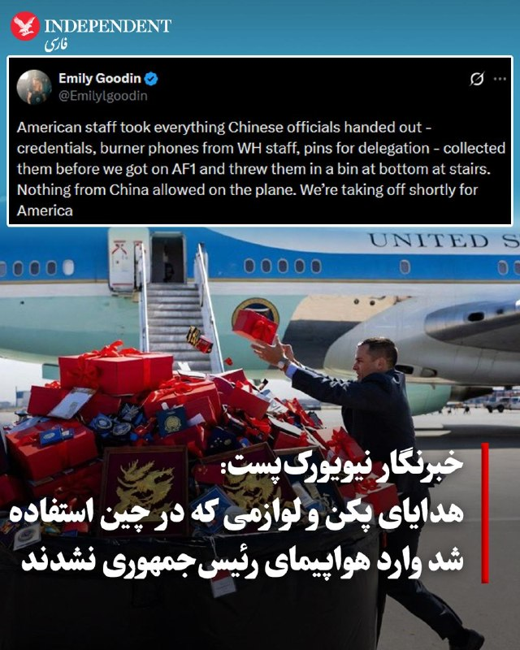

♦️امیلی گودین، خبرنگار نیویورک‌پست که در سفر به چین دونالد ترامپ را همراهی کرده بود، دقایقی پیش از ترک پکن در شبکه اجتماعی ایکس اعلام کرد که از همه سرنشینان هواپیمای ریاست‌جمهوری خواسته شد قبل از سوار شدن تمام هدایایی که در پکن دریافت کرده‌اند، لوازم الکترونیکی که استفاده کرده‌اند و حتی سنجاق‌های تزئینی مربوط به این سفر را تحویل دهند.

تصویری که در شبکه‌های اجتماعی منتشر شده، نشان می‌دهد که این لوازم همه در کیسه سیاه‌رنگ بزرگی جمع‌آوری شده و احتمالا با هواپیمای دیگری از چین خارج خواهند شد.
‌🇸🇦 Indypersian

🤖 @VahidOOnLine

## VahidOOnLine — post 240340

  

محمد اسحاق دار، وزیر خارجه پاکستان، اعلام کرد که ۱۱ شهروند پاکستانی و ۲۰ شهروند ایرانی که در کشتی‌های توقیف‌شده از سوی آمریکا حضور داشتند، به کشورهایشان بازگردانده شده‌اند.
به گفته او قرار است همه این افراد امشب به اسلام آباد برسند و سپس بازگشت شهروندان ایران تسهیل خواهد شد.
‌🏁 🇬🇧 IranintlTV

🤖 @VahidOOnLine

## VahidOOnLine — post 240339

  <a href="telegram/content/VahidOOnLine_240339_1778864841.mp4">🎬 Download video</a>

یکی از مخاطبان ایران‌اینترنشنال با اشاره به وضعیت اقتصادی می‌گوید مردم ایران برای چه «منفعت ملی» این حجم از فشار اقتصادی و نگرانی را تحمل می‌کنند. این پیام با هوش مصنوعی خوانده شده است.
‌🏁 🇬🇧 IranintlTV

🤖 @VahidOOnLine

## VahidOOnLine — post 240338

  

محمدمهدی حسینی‌همدانی، امام جمعه کرج، ۲۵ اردیبهشت در نماز جمعه این شهر گفت: بر اساس توصیه قرآن باید تا پایان «فتنه»، جنگ را ادامه داد و تاکید کرد مجازات اسرائیل، محو کامل آن است.

او همچنین اطاعت از مجتبی خامنه‌ای را عامل پیروزی خواند و گفت باید عوامل نافرمانی را از میان برداشت.
‌🏁 🇬🇧 IranintlTV

🤖 @VahidOOnLine

## VahidOOnLine — post 240337

  <a href="telegram/content/VahidOOnLine_240337_1778864845.mp4">🎬 Download video</a>

‌
اسحاق دار، وزیر خارجه پاکستان، اعلام کرد ۲۰ شهروند ایرانی که در کشتی‌های توقیف‌شده آمریکا در آب‌های بین‌المللی حضور داشتند، از طریق پاکستان به تهران بازگردانده خواهند شد.

دار گفت این افراد همراه با ۱۱ شهروند پاکستانی، از سنگاپور به بانکوک منتقل شدند و سپس با پرواز راهی اسلام‌آباد شدند. به گفته او، شهروندان ایرانی پس از ورود به پاکستان، برای انتقال به تهران همراهی خواهند شد.

وزیر خارجه پاکستان از وزیر خارجه آمریکا برای «هماهنگی نزدیک» در این عملیات، و از وزیر خارجه جمهوری اسلامی بابت «اعتماد به پاکستان» در روند بازگرداندن شهروندان ایرانی قدردانی کرد.
‌🏁 🇬🇧 ManotoTV

🤖 @VahidOOnLine

## VahidOOnLine — post 240336

  

♦️عباس عراقچی، وزیر امور خارجه جمهوری اسلامی، در پایان نشست وزرای خارجه «بریکس» در دهلی‌نو اعلام کرد که صدور بیانیه پایانی این نشست به دلیل مخالفت یکی از اعضا که «روابط خاصی با اسرائیل دارد»، متوقف شده است. اگرچه عراقچی مستقیما نامی از امارات متحده عربی نبرد، اما تاکید کرد که این کشور به دلیل حمایت از اسرائیل و ایالات متحده در درگیری‌های اخیر، مانع تصویب بخش‌هایی از بیانیه شده است.

وزیر خارجه جمهوری اسلامی با «تاسف‌بار» خواندن این اقدام، ادعا کرد که ایران در طول جنگ جاری هیچ اختلافی با امارات نداشته و تنها پایگاه‌های نظامی آمریکا را هدف قرار داده است.

عراقچی در ادامه ابراز امیدواری کرد که مقامات ابوظبی تا نشست سران بریکس به این درک برسند که ایران همسایه‌ای دائمی است و دو کشور باید قرن‌ها در کنار هم زندگی کنند.

همزمان با این اظهارات، بلومبرگ در گزارشی جدید به نقل از منابع آگاه اعلام کرد که امارات در دوران جنگ تلاش کرده است که با جلب حمایت عربستان سعودی و قطر، حملات مشترکی علیه ایران انجام دهد؛ پیشنهادی که با مخالفت صریح ریاض و دوحه مواجه شده است.
‌🇸🇦 Indypersian

🤖 @VahidOOnLine

## VahidOOnLine — post 240335

  

رسانه‌های ایران اعلام کردند نمایشگاه کتاب تهران امسال به صورت «مجازی» برگزار خواهد شد.
بر اساس این خبر، نمایشگاه کتاب تهران از روز شنبه، ۲۶ اردیبهشت و به صورت آنلاین آغاز خواهد شد.
باوجود آتش‌بس میان جمهوری اسلامی و آمریکا، بسیاری از برنامه‌های عادی در ایران همچنان تعطیل بوده یا به‌صورت مجازی برگزار می‌شود.
‌🏁 🇬🇧 IranintlTV

🤖 @VahidOOnLine

## mwarmonitor — post 9136

  

✈️ هم‌اکنون یک فروند هواپیمای Boeing E-3B Sentry در حال گشت زنی برفراز خلیج فارس

@mwarmonitor

## mwarmonitor — post 9135

  

🇦🇪به همین دلیل است که امارات متحده عربی با شدت به‌دنبال توسعه خط لوله حبشان است.
🔹صادرات این کشور از ابوظبی و الرویس تقریباً به صفر نزدیک شده است.
❗️در بیش از ۳۰ روز گذشته تعداد بسیار کمی نفتکش در این بنادر پهلو گرفته‌اند.
🔸در نتیجه، برای جلوگیری از آسیب‌های ناشی از توقف تولید (shut-in)، امارات ناچار شده در چندین ایستگاه پمپاژ نفت و گاز به‌طور گسترده اقدام به سوزاندن گاز (فلرینگ) کند.

@mwarmonitor

## pm_afshaa — post 90801

🔴سفارت آمریکا در اسرائیل در حال بررسی صدور دستورالعمل برای خروج فوری شهروندان آمریکایی از تل‌آویو است

💧 Rainbet.com the #1 Non-KYC Crypto Casino & Sportsbook @rainbetcom

😁 @Pm_Afshaa

## pm_afshaa — post 90800

🔴مارکو روبیو: اگر جمهوری اسلامی تصور می‌کند که ما برای رسیدن به یک توافق امتیازاتی خواهيم داد، سخت در اشتباه است؛ تحت هیچ شرایطی یک توافق بد با ایران را نخواهیم پذیرفت

💧 Rainbet.com the #1 Non-KYC Crypto Casino & Sportsbook @rainbetcom

😁 @Pm_Afshaa

## pm_afshaa — post 90799

🔴طبق گزارش خبرنگاران آمریکایی، پیش از سوار شدن به «ایرفورس وان»، سرویس مخفی آمریکا تمام وسایل و هدایایی را که طرف چینی داده بود از جمله کارت‌ها، نشان‌ها، تلفن‌های موقت و اقلام هدیه جمع کردند و داخل سطل زباله انداختند و اجازه ندادند چیزی از چین وارد هواپیما شود

💧 Rainbet.com the #1 Non-KYC Crypto Casino & Sportsbook @rainbetcom

😁 @Pm_Afshaa

## pm_afshaa — post 90798

  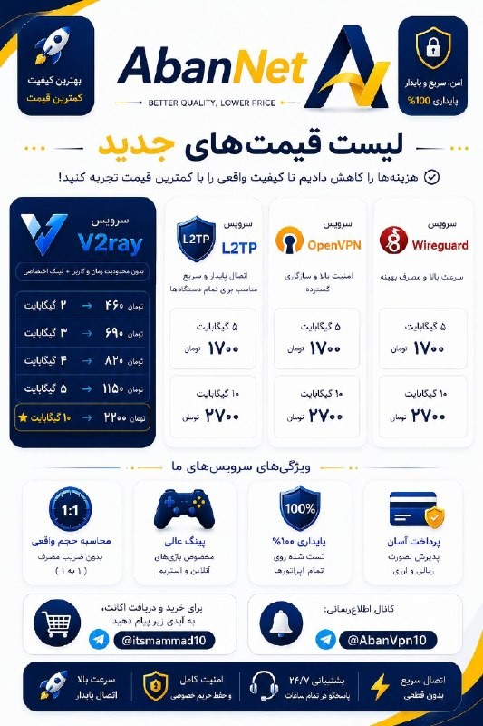

🚀 آبان‌نت؛ سرعت بی‌مرز، بدون تاریخ انقضا!

⚡دنبال کیفیتی می‌گردی که حجمت رو بی‌دلیل تموم نکنه؟

💎 ویژگی‌های طلایی:
• 
✅ بدون محدودیت زمان و کاربر: تا آخرین کیلوبایت حجمت معتبره!
• 
✅ مصرف واقعی (۱ به ۱): بدون ضریب مصرف و دزدی حجم.
• 
✅ پینگ عالی: مخصوص گیمرهای حرفه‌ای و یوتیوب.
• 
☄️ تنوع سرویس: V2ray، OpenVPN،L2tp و Wireguard.

💳 پرداخت راحت بصورت ریالی و ارزی

💰 قیمت‌های ما را مقایسه کنید!
برای استعلام قیمت استثنایی و مشاوره به آیدی زیر پیام دهید:

🆔 @itsmammad10
🔗 کانال اصلی ما:

🆔 @AbanVpn10

## pm_afshaa — post 90797

  <a href="telegram/content/pm_afshaa_90797_1778864850.jpg">🎬 Download video</a>

🔴وزیر خارجه چین:
رئیس‌جمهور شی جین‌پینگ طبق دعوت ترامپ در پاییز به آمریکا سفر خواهد کرد

💧 Rainbet.com the #1 Non-KYC Crypto Casino & Sportsbook @rainbetcom

😁 @Pm_Afshaa

## pm_afshaa — post 90796

  <a href="telegram/content/pm_afshaa_90796_1778864851.jpg">🎬 Download video</a>

🔴صدر اعظم آلمان: با ترامپ صحبت کردم؛ ایران نباید سلاح هسته‌ای داشته باشه.

💧 Rainbet.com the #1 Non-KYC Crypto Casino & Sportsbook @rainbetcom

😁 @Pm_Afshaa

## VahidOnline — post 75486

  <a href="telegram/content/VahidOnline_75486_1778864852.mp4">🎬 Download video</a>

کاوه مدنی: وضعیت دردآور جزیره مارو (شیدور) ملقب به «مالدیو ایران»
نشت نفت به #خلیج_فارس پس از حمله به تأسیسات نفتی جزیره لاوان در فروردین ماه عامل این فاجعه بود.
#جزیره_مارو
[با کیفیت بیشتر: ۶۰ مگابایت]
KavehMadani
برشی از سی‌ثانیه سوم ویدیوی بالا درباره وضعیت ساحل بیشتر مورد توجه قرار گرفته: AzamBahrami

📡 @VahidOnline

## VahidOnline — post 75485

  

وزیر خارجه پاکستان اعلام کرد که یازده شهروند پاکستانی و ۲۰ شهروند ایرانی که در کشتی‌های توقیف‌شده توسط آمریکا در آب‌های آزاد گرفتار شده بودند، به اسلام‌آباد منتقل می‌شوند.

اسحاق دار افزوده که «تمامی این افراد از سنگاپور به بانکوک رسیده‌اند و اکنون سوار پروازی شده‌اند که قرار است اواخر امشب به اسلام‌آباد برسد. سپس بازگشت برادران ایرانی به وطن خود تسهیل خواهد شد».
@VahidHeadline

📡 @VahidOnline

## IranIntlTV — post 337356

  

رضا سپهوند، عضو کمیسیون انرژی مجلس گفت: «روزانه ۳۰ میلیون لیتر کمبود بنزین داریم و چون در کوتاه‌مدت امکان افزایش تولید وجود ندارد، باید مدیریت مصرف سوخت را جدی گرفت.»

او ادامه داد: «تولید روزانه بنزین در ایران ۱۰۵ میلیون لیتر و مصرف ۱۳۵ میلیون لیتر است.»

این نماینده مجلس افزود: «بخشی از تولید بنزین به دلیل بمباران در جنگ کاهش یافته و همچنین واردات کمتر شده است.»
https://iranintl.com/202605158254

## IranIntlTV — post 337355

  <a href="telegram/content/IranIntlTV_337355_1778864856.mp4">🎬 Download video</a>

یک شهروند با ارسال ویدیویی خریدهای خود را نشان می‌دهد و با اشاره به افزایش قیمت می‌گوید که برای یک شیر و چند قلم کالای دیگر ۴۵۰ هزار تومان پرداخت کرده است.

## IranIntlTV — post 337354

در میانه تنش‌ها با تهران، ابوظبی روابط دفاعی و انرژی خود با هند را گسترش می‌دهد

وزارت امور خارجه هند اعلام کرد که این کشور و امارات متحده عربی بر سر چارچوب یک مشارکت راهبردی دفاعی به توافق رسیده‌اند. این توافق در جریان سفر نارندرا مودی به ابوظبی و در میانه تشدید تنش‌ها میان امارات و جمهوری اسلامی به دست آمده است.

وزارت امور خارجه هند، جمعه ۲۵اردیبهشت، افزود که دو کشور در جریان این سفر، همچنین توافق‌نامه‌هایی درباره ذخایر راهبردی نفت و تأمین گاز نفتی مایع (ال‌پی‌جی) امضا کرده‌اند.

در بیانیه وزارت امور خارجه هند آمده است: «دو طرف بر تعمیق همکاری‌های صنعتی دفاعی و همکاری در زمینه نوآوری و فناوری پیشرفته، آموزش، رزمایش‌ها، امنیت دریایی، دفاع سایبری، ارتباطات امن و تبادل اطلاعات توافق کرده‌اند.»

پیش از این سفر، منابع هندی به رویترز گفته بودند که مودی احتمالا درباره قراردادهای بلندمدت تامین انرژی گفت‌وگو خواهد کرد و همچنین به‌دنبال جلب حمایت برای گسترش ذخایر راهبردی نفت هند خواهد بود.

تقویت روابط دفاعی و انرژی امارات و هند در شرایطی صورت می‌گیرد که در جریان جنگ اخیر، روابط تهران و ابوظبی به شدت تیره شد و جمهوری اسلامی حملات پهپادی و موشکی را علیه تاسیسات نفت و انرژی امارات انجام داد.

همچنین روزنامه وال‌استریت ژورنال ۲۱ اردیبهشت به‌نقل از منابع آگاه خبر داد که امارات متحده عربی به‌طور مخفیانه  حملاتی علیه جمهوری اسلامی انجام و در یکی از این حملات در ماه آوریل پالایشگاه نفتی جزیره لاوان ایران را هدف قرار داده است.

در حالی که هند، امارات و جمهوری اسلامی عضو بریکس هستند، وزارت امور خارجه هند جمعه در پایان نشست سالانه وزیران امور خارجه این گروه در دهلی نو به جای انتشار بیانیه مشترک، بیانیه‌ای به عنوان رییس نشست صادر کرد و اعلام کرد میان برخی اعضا درباره وضعیت خاورمیانه اختلاف نظر وجود دارد.

بسته شدن تنگه هرمز از سوی جمهوری اسلامی بازارهای جهانی انرژی را متلاطم و حمل‌ونقل و تجارت در سراسر منطقه را مختل کرده است.

تاثیر خروج امارات از اوپک بر کمک به هند
با تصمیم امارات برای خروج از اوپک در ماه گذشته، انتظار می‌رود ظرفیت تولید این کشور افزایش یابد و به واردکنندگانی مانند هند کمک کند.

طبق توافق نفتی اعلام‌شده در روز جمعه، احتمال افزایش ذخیره‌سازی نفت خام شرکت دولتی نفت ابوظبی «ادنوک» در هند تا سقف ۳۰ میلیون بشکه وجود دارد. این شرکت در بیانیه‌ای جداگانه اعلام کرد که این توافق همچنین امکان ذخیره‌سازی نفت خام در فجیره امارات را به‌عنوان بخشی از ذخایر راهبردی هند بررسی می‌کند.

شرکت «ادنوک» همچنین اعلام کرد که گسترش تامین و فرصت‌های تجاری گاز نفتی مایع (ال‌پی‌جی) با شرکت «ایندین اویل کورپوریشن» را بررسی خواهد کرد.

سلطان احمد الجابر، مدیرعامل و مدیر اجرایی «ادنوک»، گفت: «مقیاس و مسیر رشد هند، آن را به یکی از تعیین‌کننده‌ترین بازارهای انرژی عصر ما تبدیل کرده است. با شتاب گرفتن تقاضا هم‌زمان با رشد سریع جمعیت، اهمیت مشارکت انرژی میان امارات و هند بیش از پیش حیاتی می‌شود.»

نگاه امارات و هند به روابط نزدیک‌ عربستان و پاکستان
امارات متحده عربی سومین شریک تجاری بزرگ هند است. دهلی نو و ابوظبی در ماه ژانویه قراردادی سه میلیارد دلاری برای خرید گاز طبیعی مایع (ال‌ان‌جی) امارات از سوی هند امضا کرده بودند. همچنین نامه‌ای برای همکاری در جهت شکل‌گیری یک مشارکت راهبردی دفاعی میان دو کشور امضا شد.

این توافق‌ها پس از آن صورت گرفت که پاکستان، رقیب دیرینه هند، سال گذشته توافق دفاعی متقابلی با عربستان سعودی امضا کرد.

پاکستان به میانجی اصلی میان واشینگتن و تهران برای پایان دادن به جنگی تبدیل شده که با حملات ایالات متحده و اسرائیل به جمهوری اسلامی در نهم اسفند آغاز شد. همچنین پاکستان برای تقویت دفاع عربستان سعودی پس از آنکه این کشور هدف صدها حمله موشکی و پهپادی جمهوری اسلامی قرار گرفت، اقدام کرده است.

ریاض ماه گذشته اعلام کرد که سه میلیارد دلار دیگر برای کمک به پاکستان در پوشش بازپرداخت بدهی اسلام‌آباد به امارات ارائه خواهد کرد.

وزارت امور خارجه هند همچنین جمعه از سرمایه‌گذاری‌های پنج میلیارد دلاری امارات متحده عربی خبر داد و به توافق‌های پیشین از جمله خرید ۶۰ درصد سهام بانک «آر‌بی‌ال» از سوی «امیراتس ان‌بی‌دی» به ارزش سه میلیارد دلار در سال گذشته، و سرمایه‌گذاری یک میلیارد دلاری شرکت «آی‌اچ‌سی» ابوظبی در پروژه «سمّان» اشاره کرد.
 
🔗وب‌سایت ایران‌اینترنشنال
@iranintltv

## IranIntlTV — post 337353

  

تام کاتن، سناتور جمهوری‌خواه، طرحی با عنوان «قانون عدم پناه امن برای خانواده تروریست‌ها» معرفی کرده است که هدف آن لغو ویزاهای فعلی و جلوگیری از صدور ویزای جدید برای اعضای نزدیک خانواده افراد مرتبط با تروریسم است.

این اقدام پس از آن مطرح شد که گزارش‌ها نشان داد دو تن از بستگان قاسم سلیمانی، فرمانده پیشین نیروی قدس سپاه، به‌صورت قانونی در ایالات متحده زندگی می‌کردند.

بر اساس اعلام وزارت امنیت داخلی آمریکا، حمیده سلیمانی افشار ۴۷ ساله و سارینا سادات حسینی ۲۵ ساله، که به‌ترتیب خواهرزاده و نوه‌خواهرزاده قاسم سلیمانی هستند، در ماه آوریل بازداشت شدند. این وزارتخانه اعلام کرد هر دو نفر در سال ۲۰۱۹ از سوی قضات مهاجرت آمریکا پناهندگی دریافت کرده بودند.

به گفته وزارت امنیت داخلی آمریکا، حمیده سلیمانی افشار با وجود دریافت گرین‌کارت از طریق پناهندگی، در درخواست تابعیت خود در ژوئیه ۲۰۲۵ اعلام کرده بود که دست‌کم چهار بار پس از دریافت اقامت دائم به ایران سفر کرده است.
https://iranintl.com/202605158980

## IranIntlTV — post 337352

  <a href="telegram/content/IranIntlTV_337352_1778864860.mp4">🎬 Download video</a>

منابع اسرائیلی و آمریکایی به کانال ۱۱ اسرائیل گفته‌اند این کشور در پیامی روشن به واشینگتن خواستار از سرگیری جنگ با تهران شده است.

براساس این گزارش، یکی از گزینه‌ها انجام حملات محدود و هدفمند علیه تاسیسات سوخت و انرژی ایران است.

گزارش اشکان صفایی، خبرنگار ایران‌اینترنشنال
@iranintltv

## IranIntlTV — post 337351

  <a href="telegram/content/IranIntlTV_337351_1778864862.mp4">🎬 Download video</a>

ستاد فرماندهی مرکزی ایالات متحده، سنتکام، اعلام کرد از زمان آغاز محاصره دریایی ایران، ۷۵ کشتی تجاری تغییر مسیر داده و چهار کشتی دیگر از کار افتاده‌اند.

سنتکام این موضوع را نشانه اجرای کامل محاصره تنگه هرمز دانست.

گزارش اردوان روزبه، خبرنگار ایران‌اینترنشنال
@iranintltv

## IranIntlTV — post 337350

  <a href="telegram/content/IranIntlTV_337350_1778864864.mp4">🎬 Download video</a>

دونالد ترامپ در مسیر بازگشت از چین گفت اگر اورانیوم غنی‌شده ایران تحویل داده نشود، آمریکا در «مقطعی مناسب» وارد ایران خواهد شد.

او همچنین گفت شاید نیاز به «پاکسازی مجدد» در ایران باشد.

گزارش سمیرا قرایی، خبرنگار ایران‌اینترنشنال
@iranintltv

## IranIntlTV — post 337349

  <a href="https://t.me/IranintlTV/337349">📎 Download file</a>

🎧نسخه صوتی دومینو: تاکید ترامپ بر برچیدن کامل برنامه هسته‌ای
@iranintlTV

## IranIntlTV — post 337348

  

یک مقام وزارت خارجه آمریکا به الجزیره گفت فضای دومین روز مذاکرات میان لبنان و اسرائیل بسیار مثبت بوده و روند گفت‌وگوها فراتر از انتظارها پیش رفته است.

این دومین روز از سومین دور مذاکرات میان اسرائیل و لبنان با میانجی‌گری ایالات متحده بود.
https://iranintl.com/202605151409

## IranIntlTV — post 337347

بیمارستان الغدیر تهران شامگاه ۱۸ و ۱۹ دی‌ماه ۱۴۰۴، شاهد گوشه‌ای از جنایتی بود که جمهوری اسلامی علیه معترضان مرتکب شد. ده‌ها پیکر بی‌جان و شمار زیادی از مجروحان به این بیمارستان منتقل شدند و به دلیل کمبود فضای سردخانه، تعدادی از کشته‌شدگان، پتوپیچ در حیاط پشت بیمارستان رها شدند. ایران‌اینترنشنال تاکنون هویت ۹ نفر از آن‌ها را شناسایی کرده که در این ویدیو چهار تن از آنها معرفی شده‌اند.
فرنوش فرجی، خبرنگار ایران‌اینترنشنال گزارش می‌دهد.

## IranIntlTV — post 337346

  <a href="telegram/content/IranIntlTV_337346_1778864868.mp4">🎬 Download video</a>

وزیر خارجه ایتالیا اعلام کرد به دنبال راه‌حلی سریع برای مشکلات تمدید اقامت و گذرنامه ایرانیان مقیم این کشور است و این موضوع را در سطح اروپا نیز پیگیری می‌کند. آنتونیو تایانی تاکید کرد ایتالیا در کنار مردم ایران و خواست آزادی و دموکراسی ایستاده است.
جزییات بیشتر با صدف باغبانی، روزنامه‌نگار
@iranintltv

## IranIntlTV — post 337345

  

محمد اسحاق دار، وزیر خارجه پاکستان، اعلام کرد که ۱۱ شهروند پاکستانی و ۲۰ شهروند ایرانی که در کشتی‌های توقیف‌شده از سوی آمریکا حضور داشتند، به کشورهایشان بازگردانده شده‌اند.
به گفته او قرار است همه این افراد امشب به اسلام آباد برسند و سپس بازگشت شهروندان ایران تسهیل خواهد شد.
https://iranintl.com/202605151087

## IranIntlTV — post 337344

  <a href="telegram/content/IranIntlTV_337344_1778864871.mp4">🎬 Download video</a>

یکی از مخاطبان ایران‌اینترنشنال با اشاره به وضعیت اقتصادی می‌گوید مردم ایران برای چه «منفعت ملی» این حجم از فشار اقتصادی و نگرانی را تحمل می‌کنند. این پیام با هوش مصنوعی خوانده شده است.

## IranIntlTV — post 337343

در این قسمت چرتکه، محمد ماشین‌چیان، قدرت خرید یک درآمد ماهانه ۴۰ میلیون تومانی را با در نظر گرفتن سناریوهای رشد نرخ دلار، تا پایان ۱۴۰۵ بررسی و پیش‌بینی می‌کند.

مساله فرسایش زندگی، محدود به کارگران ما نیست. حتی هموطنانی که در گذشته‌ای نه‌چندان دور، زندگی متوسط و قابل قبولی داشتند نیز از آسیب نوسانات دلار مصون نخواهند ماند.

تماشای نسخه کامل «چرتکه» در یوتیوب:
https://youtu.be/1W2RoMvSqPQ

@iranintltv

## IranIntlTV — post 337342

  

محمدمهدی حسینی‌همدانی، امام جمعه کرج، ۲۵ اردیبهشت در نماز جمعه این شهر گفت: بر اساس توصیه قرآن باید تا پایان «فتنه»، جنگ را ادامه داد و تاکید کرد مجازات اسرائیل، محو کامل آن است.

او همچنین اطاعت از مجتبی خامنه‌ای را عامل پیروزی خواند و گفت باید عوامل نافرمانی را از میان برداشت.
https://iranintl.com/202605155975

## IranIntlTV — post 337341

  <a href="telegram/content/IranIntlTV_337341_1778864876.mp4">🎬 Download video</a>

پیام‌های ارسالی مخاطبان به ایران‌اینترنشنال از کمبود و گرانی داروهای حوزه سلامت حکایت دارد. یک شهروند شاغل در صنعت دارو می‌گوید شربت «لیسکانتین» برای بیماران صرع و تشنج نایاب شده و قیمت آن از ۹۰۰ هزار تومان به ۴ میلیون و ۲۰۰ هزار تومان افزایش یافته است.
جزییات بیشتر با سبا حیدرخانی، عضو تحریریه ایران‌اینترنشنال
@iranintltv

## IranIntlTV — post 337340

  <a href="telegram/content/IranIntlTV_337340_1778864878.mp4">🎬 Download video</a>

در تازه‌ترین نظرسنجی جهانی، کانادا برای نخستین‌بار به‌عنوان جذاب‌ترین مقصد سرمایه‌گذاری زیرساختی معرفی شد. انجمن سرمایه‌گذاران زیرساخت جهانی، سیاست‌های جذب سرمایه خصوصی و ایجاد صندوق ثروت ۲۵ میلیارد دلاری را از عوامل اصلی این جایگاه دانست.
مهسا مرتضوی، خبرنگار ایران‌اینترنشنال، گزارش می‌دهد
@iranintltv

## IranIntlTV — post 337339

پیام‌های ارسالی مخاطبان به مدیا بات ایران‌اینترنشنال از گرانی، کمبود و نایاب شدن دارو و اقلام حوزه سلامت حکایت دارد. یک شهروند می‌گوید حتی داروهای ساده و مسکن‌هایی مانند قرص کدئین نیز نایاب شده‌اند.
@iranintltv

## IranIntlTV — post 337338

  

رسانه‌های ایران اعلام کردند نمایشگاه کتاب تهران امسال به صورت «مجازی» برگزار خواهد شد.
بر اساس این خبر، نمایشگاه کتاب تهران از روز شنبه، ۲۶ اردیبهشت و به صورت آنلاین آغاز خواهد شد.
باوجود آتش‌بس میان جمهوری اسلامی و آمریکا، بسیاری از برنامه‌های عادی در ایران همچنان تعطیل بوده یا به‌صورت مجازی برگزار می‌شود.
https://iranintl.com/202605157688

## Shin_Persian — post 6015

Shin ✓ @hey_itsmyturn
Fri, 15 May 2026 17:04:22 UTC

Gazans report a blitz airstrike on western Gaza, highly likely a targeted assassination.

فارسی

ساکنان غزه از یک حمله هوایی برق‌آسا به غرب غزه خبر می‌دهند که به احتمال بسیار زیاد یک ترور هدفمند بوده است.

𝕏 · @shin_persian

## ManotoTV — post 105495

  <a href="telegram/content/ManotoTV_105495_1778864882.mp4">🎬 Download video</a>

«صدای فاطمه سپهری و همه زندانیان سیاسی باشیم»

## ManotoTV — post 105494

  <a href="telegram/content/ManotoTV_105494_1778864883.mp4">🎬 Download video</a>

دونالد ترامپ در گفت‌وگو با برت بایر، خبرنگار و مجری فاکس‌نیوز از عملکرد آمریکا در جنگ با جمهوری اسلامی دفاع کرد و گفت واشینگتن با وجود توانایی نابودی کامل زیرساخت‌های ایران، خویشتنداری نشان داده است.

ترامپ در پاسخ به منتقدانی که می‌گویند او وضعیت جنگ را دست‌کم گرفته، گفت: «من هیچ چیزی را دست‌کم نگرفتم. ما ضربه‌ای فوق‌العاده سنگین به آن‌ها زدیم.»

رئیس‌جمهوری آمریکا افزود: «ما پل‌هایشان را باقی گذاشتیم. ظرفیت برقشان را باقی گذاشتیم. می‌توانیم همه آن را ظرف دو روز نابود کنیم. همه‌چیز.»

ترامپ همچنین گفت آمریکا جز بخش مربوط به شیرهای خروج نفت، جزیره خارگ را هدف قرار داده است.

## ManotoTV — post 105493

  <a href="telegram/content/ManotoTV_105493_1778864885.mp4">🎬 Download video</a>

«شما هم به کمپین حمایت از خانم سپهری بپیوندید»

## ManotoTV — post 105492

  <a href="telegram/content/ManotoTV_105492_1778864887.mp4">🎬 Download video</a>

‌
اسحاق دار، وزیر خارجه پاکستان، اعلام کرد ۲۰ شهروند ایرانی که در کشتی‌های توقیف‌شده آمریکا در آب‌های بین‌المللی حضور داشتند، از طریق پاکستان به تهران بازگردانده خواهند شد.

دار گفت این افراد همراه با ۱۱ شهروند پاکستانی، از سنگاپور به بانکوک منتقل شدند و سپس با پرواز راهی اسلام‌آباد شدند. به گفته او، شهروندان ایرانی پس از ورود به پاکستان، برای انتقال به تهران همراهی خواهند شد.

وزیر خارجه پاکستان از وزیر خارجه آمریکا برای «هماهنگی نزدیک» در این عملیات، و از وزیر خارجه جمهوری اسلامی بابت «اعتماد به پاکستان» در روند بازگرداندن شهروندان ایرانی قدردانی کرد.

## FarsiVOA — post 217823

🔺تلاش عراق برای دریافت وام از سازمان‌های بین‌المللی با ادامه بحران در تنگه هرمز

▪️با ادامه یافتن بحران تنگه هرمز و کاهش شدید صادرات نفت عراق، این کشور که با کمبود درآمدهای ارزی مواجه است، اکنون تلاش می‌کند از دو نهاد مالی بین‌المللی - یعنی بانک جهانی و صندوق بین‌المللی پول - وام بگیرد.

⬇️ بیشتر بخوانید:

https://ir.voanews.com/a/iraq-export-oil-strait-hormuz/8150380.html/?nocach=1

## FarsiVOA — post 217822

ناسا روز جمعه ۲۵ اردیبهشت تصاویری از آزمایشگاه شبیه‌سازی سطح ماه در مرکز پژوهشی «ایمز» را منتشر کرد.

در این آزمایشگاه، جعبه‌های بزرگی از خاک شبیه‌سازی‌شده ماه برای آزمایش ابزارهای علمی، ربات‌ها، و مریخ‌نوردهای آینده استفاده می‌شود.

ناسا می‌گوید این مرکز به آماده‌سازی فناوری‌های مورد نیاز برای ماموریت‌های آینده به ماه کمک می‌کند.

@FarsiVOA

## DW_Farsi — post 124737

  

🔶 شکاف در گروه بریکس در پی جنگ ایران؛ عدم صدور بیانیه پایانی

جنگ آمریکا و اسرائیل علیه جمهوری اسلامی ایران، کشورهای غیرغربی را نیز دچار اختلاف کرده است.

نشست وزرای خارجه کشورهای عضو گروه بریکس در دهلی نو به خاطر اختلافات جدی میان ایران و امارات متحده عربی بدون صدور بیانیه مشترک، به پایان رسید.

در این راستا تنها هند، به عنوان کشور میزبان بیانیه‌ای منتشر و در آن به وجود "دیدگاه‌های متفاوت" درباره وضعیت خاورمیانه اشاره کرد.
ایران در این نشست خواستار محکومیت جنگ آمریکا و اسرائیل علیه کشور خود شد و همچنین امارات متحده عربی را به مشارکت مستقیم در عملیات نظامی متهم کرد.

عباس عراقچی، وزیر امور خارجه جمهوری اسلامی در یک نشست خبری مدعی شد، "یکی از اعضای بریکس که نامش فاش نشده، بخش‌هایی از بیانیه را مسدود کرده است".

عراقچی همچنین گفت: «ایران با این کشور خاص مشکلی ندارد بلکه صرفا پایگاه‌های نظامی ایالات متحده را هدف قرار می‌دهد که متاسفانه در خاک آن کشور واقع شده‌اند.»
@dw_farsi

## DW_Farsi — post 124736

🔶 آمادگی آمریکا برای گفت‌وگو با کوبا به شرط تغییرات اساسی

به گزارش رسانه‌های آمریکایی و اعلام دولت کوبا، جان رتکلیف، رئیس سازمان سیا در هاوانا با مقام‌های ارشد وزارت کشور کوبا دیدار کرده است. به‌گفته یک مقام سازمان سیا، او در این سفر پیام دونالد ترامپ را منتقل کرده مبنی بر اینکه آمریکا آماده گفت‌وگوی جدی درباره مسائل اقتصادی و امنیتی است، اما فقط در صورتی که کوبا تغییرات اساسی انجام دهد.

دولت کوبا اعلام کرد این دیدار به درخواست دولت آمریکا انجام شده و هدف آن، پیشبرد گفت‌وگوی سیاسی میان دو کشور در شرایطی بوده که روابط دو طرف همچنان "پیچیده" توصیف می‌شود.

بر اساس گزارش‌ها، رتکلیف در این سفر با لازارو آلوارز کاساس، وزیر کشور کوبا، و همچنین رائول گی‌یرمو رودریگز کاسترو، نوه رائول کاسترو، دیدار کرده است.

مقام‌های آمریکایی گفته‌اند رتکلیف برای انتقال این پیام به کوبا سفر کرده که واشنگتن آماده ورود به گفت‌وگو درباره مسائل اقتصادی و امنیتی است، اما این آمادگی "بدون شرط نیست و به انجام تغییرات بنیادی از سوی هاوانا بستگی دارد".

در مقابل، دولت کوبا گفت نمایندگان این کشور در این دیدار به‌روشنی تأکید کرده‌اند که کوبا هیچ تهدیدی برای امنیت ملی آمریکا نیست و دلیلی ندارد نام این کشور همچنان در فهرست دولت‌های حامی تروریسم باقی بماند.

هاوانا تصریح کرد که نه از سازمان‌های تروریستی حمایت می‌کند و نه هیچ‌گاه از فعالیت خصمانه‌ای علیه آمریکا پشتیبانی کرده است.

هم‌زمان با سفر هیأت آمریکایی، وزارت خارجه آمریکا اعلام کرد سیسی آباسکال سامورا، منتقد ۲۷ ساله دولت کوبا ، پس از آزادی از زندان همراه خانواده‌اش راهی تبعید در آمریکا شده است. او پس از اعتراضات گسترده ۱۱ ژوئیه ۲۰۲۱ به شش سال زندان محکوم شده بود.

روابط آمریکا و کوبا از زمان انقلاب ۱۹۵۹ همواره پرتنش بوده، اما با بازگشت ترامپ به کاخ سفید بار دیگر سخت‌تر شد.

او در ژانویه ۲۰۲۵ یکی از نخستین تصمیم‌های خود را به بازگرداندن نام کوبا به فهرست دولت‌های حامی تروریسم اختصاص داد. اکنون سفر رئیس سیا به هاوانا نشان می‌دهد دو طرف، با وجود فشار و بی‌اعتمادی، کانال گفت‌وگو را کاملا نبسته‌اند.
@dw_farsi

## DW_Farsi — post 124735

  

🔶 رهبران ۲۶ کشور جهان خواستار آزادی کشتیرانی در تنگه هرمز شدند

رهبران ۲۶ کشور جهان از جمله آلمان با صدور بیانیه‌ای مشترک، خواستار بازگشت وضعیت عادی دریانوردی در تنگه هرمز شده و حمایت خود را از یک ماموریت نظامی چندملیتی در این منطقه اعلام کردند.

به گزارش شبکه خبری سی‌ان‌ان، رهبران ۲۶ کشور جهان از جمله آلمان، فرانسه، بریتانیا، کانادا، بحرین، کره جنوبی و قطر در این بیانیه بر تعهد جمعی‌ برای به‌کارگیری منابع دیپلماتیک، اقتصادی و نظامی برای حمایت از آزادی کشتیرانی در تنگه هرمز تاکید کردند.

این کشورها خاطرنشان کردند، "کشتیرانی باید مطابق با کنوانسیون سازمان ملل متحد در مورد حقوق دریاها (UNCLOS) و قوانین بین‌المللی، آزاد باقی بماند".

همچنین در این بیانیه از یک ماموریت نظامی چندملیتی مستقل و دفاعی، شامل عملیات‌های مین‌روبی اعلام حمایت شده است.

در بخشی از این بیانیه تصریح شده است: «ماموریت نظامی چندملیتی به عنوان مکمل تلاش‌های دیپلماتیک و تنش‌زدایی جاری عمل خواهد کرد و اجرای چنین طرح‌هایی تنها در صورت ایجاد یک فضای مساعد میسر خواهد بود.»
@dw_farsi

## DW_Farsi — post 124734

  

🔶 گفت‌وگوی تلفنی مرتس و ترامپ پس از هفته‌ها تنش؛ تفاهم درباره نحوه ادامه اقدام علیه ایران

سکوت خبری میان دونالد ترامپ و فریدریش مرتس پس از هفته‌ها تنش‌ بر سر اظهارات صدراعظم آلمان درباره جنگ ایران پایان یافت.
مرتس اعلام کرد که در طی سفر بازگشت ترامپ از چین به‌صورت تلفنی با او گفت‌وگو کرده است. صدراعظم آلمان با انتشار پیامی در شبکه اجتماعی ایکس این گفت‌وگو را "خوب" توصیف و بر وجود تفاهم و اشتراک نظر درباره نحوه ادامه اقدام در مسئله ایران تاکید کرد.

مرتس درباره این گفت‌وگو نوشت: «ما با هم هم‌نظر هستیم. ایران اکنون باید به میز مذاکره بازگردد. تنگه هرمز باید بازگشایی شود و تهران نباید به سلاح هسته‌ای دست یابد.»

ترامپ روز جمعه ۱۵ مه (۲۵ اردیبهشت) سفر خود به چین را به پایان رساند. به گفته او، "شی جین‌پینگ تمایل خود را برای کمک به بازگشایی تنگه هرمز ابراز کرده و همچنین تعهد داده از ایران به‌صورت نظامی حمایت نکند".
@dw_farsi

## DW_Farsi — post 124733

  

🔶 ترامپ: آمریکا ممکن است در مقطعی برای خارج کردن مواد هسته‌ای وارد ایران شود

دونالد ترامپ، رئیس‌جمهور ایالات متحده در پایان سفر خود به چین در جمع خبرنگاران در هواپیمای ریاست جمهوری (ایر فورس وان) اعلام کرد، "ایالات متحده ممکن است در مقطعی برای خارج کردن مواد هسته‌ای وارد ایران شود".

او گفت: «یا وارد می‌شویم یا آن را می‌گیریم. فکر می‌کنم احتمالا آن را خواهیم گرفت اما اگر نه، وارد می‌شویم.»

ترامپ همچنین بار دیگر با تاکید بر اینکه "ایران به‌طور کامل شکست خورده است" افزود: «ما اصلا با خطری روبرو نیستیم و تمام تجهیزات لازم برای خارج کردن مواد هسته‌ای را داریم، هیچ‌کس دیگری چنین تجهیزاتی ندارد؛ شاید چین داشته باشد.»

ترامپ پیش‌تر در ماه مارس سال جاری میلادی نیز در کاخ سفید درباره ذخایر اورانیوم غنی‌شده جمهوری اسلامی هشدار مشابهی داده و گفته بود: «یا آن را پس می‌گیریم یا آن را برمی‌داریم.»
@dw_farsi

## DW_Farsi — post 124732

  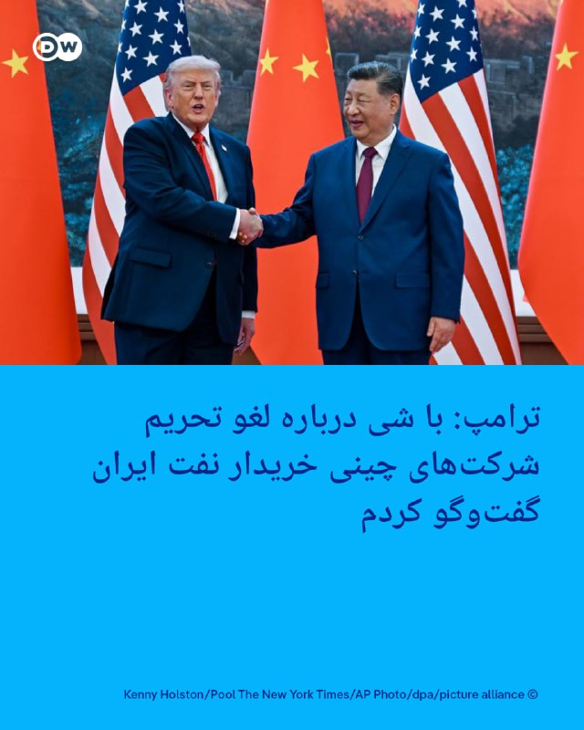

🔶 ترامپ: با شی درباره لغو تحریم شرکت‌های چینی خریدار نفت ایران گفت‌وگو کردم

دونالد ترامپ، رئیس‌جمهور آمریکا اعلام کرد، در جریان سفر خود به پکن درباره لغو تحریم‌ها علیه شرکت‌های چینی خریدار نفت ایران گفت‌وگو کرده و به‌زودی درباره این موضوع تصمیم‌گیری خواهد کرد.

ایالات متحده اخیرا تحریم‌هایی را علیه چند پالایشگاه نفت چین از جمله شرکت "هنگ‌لی" (Hengli) را که یکی از بزرگ‌ترین پالایشگاه‌های خصوصی این کشور و نمادی از تلاش پکن برای نوسازی و ارتقای این صنعت به شمار می‌رود، به دلیل خرید نفت ایران اعمال کرد.

ترامپ اندکی پس از ترک پکن در پایان نشست دوروزه خود با شی جین‌پینگ، همتای چینی خود در جمع خبرنگاران در هواپیما گفت: «ما در این باره صحبت کردیم و من طی چند روز آینده تصمیم خواهم گرفت.»

مقام‌های آمریکایی از جمله ترامپ، در حالی موضوع احتمال خرید بیشتر انرژی آمریکا توسط چین را مطرح کردند که هنوز در گزارش‌های رسمی چین از این دیدار هیچ اشاره‌ای به توافقی در این زمینه نشده است.
@dw_farsi

## DW_Farsi — post 124731

🔶 کاهش مهاجرت غیرقانونی به اروپا و انتقاد از عملکرد آلمان

بر اساس آمار آژانس حفاظت از مرزهای اتحادیه اروپا (فرانتکس) که به صورت اختصاصی در اختیار سرویس خبری شبکه اول تلویزیون آلمان (تاگس‌شاو) قرار گرفته است، "عبور غیرقانونی از مرزهای اتحادیه اروپا، به‌ویژه از طریق مسیر مدیترانه به‌طور قابل‌توجهی کاهش یافته است".

فرانتکس در ارتباط با بازه زمانی ژانویه تا پایان آوریل سال جاری میلادی (۲۰۲۶) از کاهش ۴۰ درصدی ورود غیرقانونی به اتحادیه اروپا در مقایسه با مدت مشابه سال گذشته خبر داده است.

گفته شده است، تاکنون در سال جاری میلادی نزدیک به ۲۹ هزار نفر به‌صورت غیرقانونی (یعنی بدون مدارک معتبر یا بدون مجوز ورود و اقامت) وارد اتحادیه اروپا شده‌اند و این پایین‌ترین میزان مهاجرت غیرقانونی در سال‌های اخیر محسوب می‌شود.

اصلی‌ترین مسیر ورود مهاجران غیرقانونی همچنان مدیترانه مرکزی است که اغلب با نقطه شروع لیبی و ورود به سواحلی نظیر ایتالیا انجام می‌شود. پس از آن، مسیر مدیترانه شرقی قرار دارد که مهاجران از طریق ترکیه به مقصد یونان و قبرس وارد می‌شوند.

بر اساس آماری که آژانس حفاظت از مرزهای اتحادیه اروپا ثبت کرده است، هر یک از این دو مسیر، حدود یک‌سوم از کل ورودهای غیرقانونی به اتحادیه اروپا را به خود اختصاص می‌دهند.

به گفته فرانتکس همکاری با کشورهای شریک، از جمله در سواحل شمال آفریقا از جمله دلایل کاهش ورودهای غیرقانونی به اتحادیه اروپا بوده است.

این کشورها در ازای دریافت بودجه از اتحادیه اروپا، مانع از عبور افراد شده و به‌طور فزاینده‌ای فعالیت قاچاقچیان را متوقف می‌کنند. علاوه‌بر این، احتمالا شرایط نامساعد جوی در آغاز سال میلادی جاری نیز برخی افراد را از مهاجرت خطرناک بازداشته است.

اما با وجود کاهش میزان ورود مهاجران غیرقانونی به اتحادیه اروپا، شمار قربانیان همچنان بالاست. بر اساس اعلام سازمان بین‌المللی مهاجرت، از ابتدای سال ۲۰۲۶ تاکنون بیش از هزار و ۲۰۰ نفر در دریای مدیترانه جان خود را در پی تلاش برای رسیدن به اتحادیه اروپا از دست داده‌اند.

در یکی از آخرین موارد، به دلیل از کار افتادن قایق قاچاقچیان، ۴۸ مهاجر چندین روز در دریای مدیترانه سرگردان بودند و دست‌کم ۲۲ تن از آنان به دلیل کمبود آب و غذا، جان باختند و اجسادشان "به دستور یکی از قاچاقچیان" به دریا انداخته شده بود.

از سوی دیگر در حالی که کمتر از یک ماه دیگر به اجرای کامل پیمان اتحادیه اروپا درباره مهاجرت و پناهندگی باقی مانده است، تازه‌ترین تحلیل کمیسیون اتحادیه اروپا، نشان می‌دهد که آلمان در آماده‌سازی برای اصلاحات پناهندگی به کندی عمل کرده است.

پیمان مهاجرت و پناهندگی جدید اتحادیه اروپا از ۱۲ ژوئن (۲۲ خرداد) امسال به طور کامل اجرایی خواهد شد. این پیمان اصلاحات گسترده‌ای نظیر تقویت حفاظت مرزی با هماهنگی فرونتکس، تسریع روند رسیدگی به درخواست‌های پناهندگی در مرزهای خارجی اتحادیه اروپا، اخراج سریع و ثبت دیجیتالی تمام ورود و خروج‌ها در سراسر اتحادیه اروپا را در بر می‌گیرد.

اما بر اساس گزارش‌ها، آلمان تاکنون ظرفیت‌های کافی برای اجرای روند سریع رسیدگی به درخواست پناهندگی در مرزها، به‌ویژه در فرودگاه‌ها ایجاد نکرده است.
این در حالی است که به گفته کمیسیون اتحادیه اروپا، ۱۵ کشور دیگر عضو اتحادیه اروپا بهتر از آلمان به تعهدات خود عمل کرده‌اند.

بررسی‌های مربوط به روند اجرایی شدن "پیمان مهاجرت و پناهندگی جدید اتحادیه اروپا" در آلمان نشان می‌دهد، هنوز منابع لازم در فرآیند موسوم به "غربالگری" متقاضیان پناهندگی وجود ندارد و سامانه‌ای که در آن افراد موظف‌ شوند، اثر انگشت و سایر داده‌های بیومتریک خود را ثبت کنند با مشکل روبرو است.

گفتنی است، تعداد درخواست‌های پناهندگی در آلمان در سه‌ماهه نخست سال جاری (از اول ژانویه تا ۳۱ مارس ۲۰۲۶) در مقایسه با دوره مشابه سال گذشته نزدیک به یک‌چهارم (۲۳ درصد) کاهش یافته و به سطحی بی‌سابقه تنزل کرده است.

بدین ترتیب، این کشور برای نخستین بار از سال ۲۰۱۵ تاکنون، در رتبه چهارم آمار پناهندگی اروپا قرار گرفته است.
@dw_farsi

## Persian_Trend_Official — post 14202

## Persian_Trend_Official — post 14201

  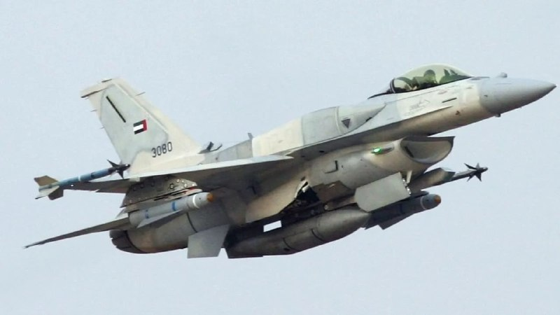

منابع آگاه روز جمعه به بلومبرگ گفتند، امارات متحده عربی تلاش کرد کشورهای همسایه خلیج فارس، از جمله عربستان سعودی و قطر، را متقاعد کند تا در جریان جنگ اخیر، واکنش نظامی هماهنگ به حملات موشکی، راکتی و پهپادی ایران داشته باشند، اما پاسخ آنها امارات را ناامید کرد !
چرا؟
امشب در لایو توضیح میدم ...

📌 @persian_trend_official
پرشین ترند | متفاوت‌ترین کانال نظامی

## Persian_Trend_Official — post 14200

  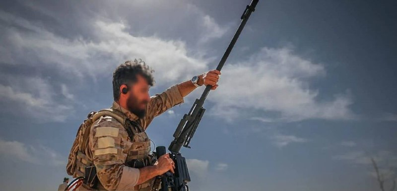

بجا مانده از رزمایش خامنه ای !!! به نظر شما چه چیزی در این تصویر جلب توجه میکند ؟ اضافه وزن نیروی سپاه پاسداران که اصلا شبیه یک نظامی ورزیده نیست . به مدل نشستن رو زاپاس هم اصلا نمیپردازیم ! وقتی میگم سپاه پاسداران از یک ارتش حرفه ای به یک گروه مسلح تبدیل…

## Persian_Trend_Official — post 14199

  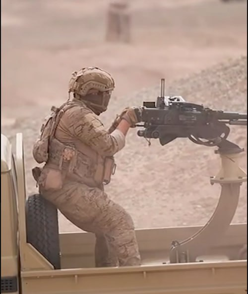

بجا مانده از رزمایش خامنه ای !!!

به نظر شما چه چیزی در این تصویر جلب توجه میکند ؟

اضافه وزن نیروی سپاه پاسداران که اصلا شبیه یک نظامی ورزیده نیست .
به مدل نشستن رو زاپاس هم اصلا نمیپردازیم !

وقتی میگم سپاه پاسداران از یک ارتش حرفه ای به یک گروه مسلح تبدیل شده دلیلش این هست.
تازه عرزشی ها اعتقاد دارن جنگ زمینی تخصص اون هاست !

📌 @persian_trend_official
پرشین ترند | متفاوت‌ترین کانال نظامی

## Persian_Trend_Official — post 14198

  

واقعا چرا ؟

📌 @persian_trend_official
پرشین ترند | متفاوت‌ترین کانال نظامی

## Persian_Trend_Official — post 14197

  <a href="telegram/content/Persian_Trend_Official_14197_1778864895.mp4">🎬 Download video</a>

محمد منان رئیسی، نماینده مجلس: خسارت مستقیم جنگ به ایران فقط ۳۰ میلیارد دلار برآورد می‌شود در حالی که درآمد هر سال عوارض تنگه هرمز ۵۰ میلیارد دلار خواهد بود !!!

📌 @persian_trend_official
پرشین ترند | متفاوت‌ترین کانال نظامی

## RadioFarda — post 157231

🔸تصاویری از نشت نفت و آلودگی شدید زیست محیطی در اطراف جزیره مارو به دلیل حمله هوایی در جنگ اخیر به تاسیسات نفتی مستقر در جزیره لاوان در شبکه‌های اجتماعی منتشر شده است.

🔸 کاوه مدنی، دانشمند ایرانی و مدیر مؤسسه آب، محیط‌زیست و سلامت دانشگاه سازمان ملل، با انتشار این ویدئو در صفحه ایکس خود نوشته است: «‏وضعیت دردآور جزیره مارو (شیدور) ملقب به «مالدیو ایران»، نشت نفت به خلیج فارس پس از حمله به تأسیسات نفتی جزیره لاوان در فروردین ماه عامل این فاجعه بود.»

🔸جزیره لاوان دارای محیط زیستی ارزشمند و تنوع زیستی قابل‌توجهی در خلیج فارس است. سواحل بکر، آب‌های شفاف و زیستگاه گونه‌های دریایی و پرندگان مهاجر از ویژگی‌های طبیعی این جزیره به شمار می‌رود.

@RadioFarda

## RadioFarda — post 157230

🔸امارات متحده عربی روز جمعه ۲۵ اردیبهشت «تلاش‌ها برای توجیه حملات تروریستی ایران» را رد کرد و گفت که حق پاسخگویی به هرگونه تهدید، ادعا یا اقدام خصمانه ایران را برای خود محفوظ می‌دارد. 🔸در بیانیه وزارت خارجه امارات آمده است که خلیفه بن شاهین المرر، وزیر مشاور…

## RadioFarda — post 157229

  

🔸امارات متحده عربی روز جمعه ۲۵ اردیبهشت «تلاش‌ها برای توجیه حملات تروریستی ایران» را رد کرد و گفت که حق پاسخگویی به هرگونه تهدید، ادعا یا اقدام خصمانه ایران را برای خود محفوظ می‌دارد.

🔸در بیانیه وزارت خارجه امارات آمده است که خلیفه بن شاهین المرر، وزیر مشاور در امور خارجه، «به‌طور قاطع ادعاهای ایران و تلاش‌ها برای توجیه حملات تروریستی ایران که امارات و دیگر کشورها را هدف قرار داده است، رد کرد».

🔸این بیانیه در پی نشست روز ۲۴ اردیبهشت بریکس در دهلی نو منتشر شد که در آن‌جا عباس عراقچی، وزیر خارجه ایران، با اشاره به حملات آمریکا و اسرائیل، گفت: «امارات شریک فعال این تجاوز است و هیچ تردیدی در این باره وجود ندارد».

@RadioFarda

## RadioFarda — post 157228

  <a href="https://t.me/radiofarda/157228">📎 Download file</a>

🔸 در این کافه‌ فردا به صحبت‌های معاون وزیر بهداشت در مورد هانتاویروس، سر دادن نوحه‌های کودکانه برای مجتبی‌ خامنه‌ای در تجمعات، گزارش‌های کذب رسانه‌های حکومتی در مورد اعطای نشان به سفیر جمهوری اسلامی در واتیکان، شروع پخش سریال فصل جدید سریال برلین می‌پردازیم و زندگی و آثار منوچهر سخایی و ادل را مرور می‌کنیم.

🔸 برای تماس با ما می‌توانید به شناسه کافه فردا در تلگرام صوت و متن بفرستید.

📻 کافه فردا

## RadioFarda — post 157227

  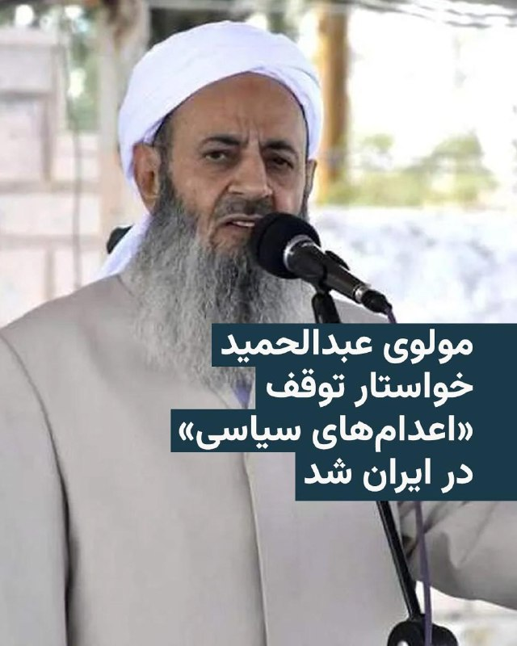

🔸مولوی عبدالحمید اسماعیل‌زهی، امام جمعه اهل سنت زاهدان، روز جمعه ۲۵ اردیبهشت از افزایش اعدام‌ها در ایران انتقاد کرد و خواستار توقف «اعدام‌های سیاسی» شد.

🔸او در سخنرانی نماز جمعه زاهدان گفت این اعدام‌ها «به خیر کشور و به مصلحت حاکم و مردم نیستند» و افزود اعدام راه‌حل مشکلات کشور نیست.

🔸مولوی عبدالحمید همچنین با انتقاد از «اعتراف اجباری» در بازداشتگاه‌ها گفت چنین اعترافاتی با شریعت اسلام، قانون اساسی ایران و قوانین بین‌المللی «مطابقت ندارد» و نباید مبنای صدور حکم قرار گیرد.

🔸از زمان حملات آمریکا و اسرائیل به ایران، جمهوری اسلامی اجرای احکام اعدام را افزایش داده است و در برخی روزها چند نفر را اعدام کرده است.

🔸بر اساس گزارش مشترک سازمان «حقوق بشر ایران» مستقر در نروژ و سازمان «با هم علیه مجازات اعدام» مستقر در پاریس، که ۲۴ فروردین امسال منتشر شد، ایران در سال ۲۰۲۵ دست‌کم «یک هزار و ۶۳۹ نفر» را اعدام کرده‌ است. این «بالاترین» تعداد اعدام طی یک‌سال در ایران از سال ۱۳۶۸ تاکنون است.

@RadioFarda

## RadioFarda — post 157226

  

🔸وزیر خارجه پاکستان اعلام کرد که یازده شهروند پاکستانی و ۲۰ شهروند ایرانی که در کشتی‌های توقیف‌شده توسط آمریکا در آب‌های آزاد گرفتار شده بودند، به اسلام‌آباد منتقل می‌شوند.

🔸اسحاق دار روز جمعه ۲۵ اردیبهشت در شبکه ایکس نوشت: «خوشحالم که اعلام کنم ما در بازگرداندن یازده شهروند پاکستانی، همراه با ۲۰ شهروند کشور برادر ایران، از طریق سنگاپور موفق بوده‌ایم؛ افرادی که در کشتی‌های توقیف‌شده توسط ایالات متحده در آب‌های آزاد حضور داشتند».

🔸وزیر خارجه پاکستان افزوده که همه این افراد در «سلامت کامل» هستند و «روحیه خوبی» دارند.

🔸اسحاق دار افزوده که «تمامی این افراد از سنگاپور به بانکوک رسیده‌اند و اکنون سوار پروازی شده‌اند که قرار است اواخر امشب به اسلام‌آباد برسد. سپس بازگشت برادران ایرانی به وطن خود تسهیل خواهد شد».

🔸او از دولت آمریکا و مارکو روبیو، وزیر خارجه این کشور، و نیز وزیر خارجه سنگاپور و مقام‌های دولت این کشور و عباس عراقچی، وزیر خارجه ایران، بابت «اعتمادی که به پاکستان برای بازگرداندن برادران ایرانی‌مان داشت»، قدردانی کرده است.

@RadioFarda

## IranianMinds — post 20204

🔴 امام جمعه کرج:

بر اساس توصیه قرآن باید تا پایان «فتنه»، جنگ رو ادامه بدیم؛ مجازات اسرائیل، محو کردن کامل اونه.

@IranianMinds

## IranianMinds — post 20203

قرارداد تبلیغاتی ۱ ماهه میبندم
غیر اخلاقی چیزی نمیزارم
دزدی و سیگنال ارز دیجیتال و این چیزا نمیزارم
خواستید پیام بزارید
اگر فیلترشکن میفروشید باید مدارک رضایت فروش بدید خیال راحتی باشه

«بازدهی تضمینی»
@AmirrPower

## IranianMinds — post 20202

  

🔴ترامپ چند دقیقه پیش از آلاسکا به سمت واشنگتن پرواز کرد. پس از توقف برای سوخت‌گیری در انکوریج

@IranianMinds

## IranianMinds — post 20201

🔴 طبق گزارش خبرنگاران آمریکایی، پیش از سوار شدن به «ایرفورس وان»، سرویس مخفی آمریکا تمام وسایل و هدایایی را که طرف چینی داده بود از جمله کارت‌ها، نشان‌ها، تلفن‌های موقت و اقلام هدیه جمع کردند و داخل سطل زباله انداختند و اجازه ندادند چیزی از چین وارد هواپیما شود.

@IranianMinds

## IranianMinds — post 20200

🔴 یک مقام وزارت خارجه آمریکا به الجزیره گفت فضای دومین روز مذاکرات میان لبنان و اسرائیل بسیار مثبت بوده و روند گفت‌وگوها فراتر از انتظارها پیش رفته است.

این دومین روز از سومین دور مذاکرات میان اسرائیل و لبنان با میانجی‌گری ایالات متحده بود.

@IranianMinds

## IranianMinds — post 20199

  <a href="https://t.me/IranianMinds/20199">📎 Download file</a>

📲#اپلیکیشن اندروید سایت جهانی دربی بت
👍اسپانسر لیگ انگلیس👍
🔥امکان شارژ امن از طریق کارت بانکی
➖➖➖➖➖➖➖➖➖
🪙همین حالا عضو شوید 👇
https://t.me/+aCbq7yy8QY80NzQ0

## IranianMinds — post 20198

  

😤دنبال یه سایت شرط بندی بین المللی بودی که به ایرانیا خدمات بده؟!⛔

👍دربی بت همون انتخاب  100%

💎ویژگی های سایت جهانی Derby Bet:
⬅️امکان شارژ امن با کارت بانکی
⬅️واریز اول دوبل شارژ می شوید(بونوس۱۰۰٪)
⬅️پر اپشن ترین سایت فعال در ایران
⬅️تسویه حساب کمتر از 5 دقیقه
⬅️برگشت بخشی از باخت به صورت هفتگی

🚨کد هدیه ثبت نام:GG007

⚠️برای دانلود اپلکیشن کلیک کنید👉
ge25
🔔کانال دربی بت :
🪙https://t.me/+aCbq7yy8QY80NzQ0

## IranianMinds — post 20197

🔴کان‌نیوز:

علاوه بر نخست‌وزیر نتانیاهو، ایال زامیر رئیس کل ارتش اسرائیل هم سفری مخفیانه به امارات داشته است.

@IranianMinds

## IranianMinds — post 20196

🔴موسوی‌فرد، امام جمعه اهواز:

جمهوری اسلامی، آمریکا را در شرایطی قرار داده است که نه راه پس دارد و نه راه پیش.

@IranianMinds

## IranianMinds — post 20195

  

🔴خبرنگار نیویورک‌‌پست:

اعضای هیئت امریکایی همراه ترامپ، قبل از سوار شدن به ایر‌فورس‌وان و ترک چین، همه هدیه‌هایی که چینی‌ها بهشون داده بودند رو درون سطل زباله ریختند.

@IranianMinds

## IranianMinds — post 20194

  

🔴پست کاخ سفید در ایکس:
حمایت از آلبوم دریک.

@IranianMinds

## BBCPersian — post 281145

با وصل شدن اندک اندک بعضی شهروندان ایران به اینترنت که بیش از دو ماه و نیم از قطع آن می‌گذرد، تصاویر جدیدی از  جنگ و آسیب‌های آن منتشر می‌شود.
 
یکی از شهروندان به تازگی تصاویری از جزیره شیدور (مارو) در نزدیکی جزیره لاوان در اینستاگرامش منتشر کرده که نشان می‌دهد در پی حمله هوایی ۱۹ فروردین ۱۴۰۵ به پالایشگاه لاوان در خلیج فارس، آلودگی نفتی این منطقه و جانوران بومی آن را آلوده کرده است.

مدیرکل حفاظت محیط زیست استان هرمزگان با تائید آلودگی نفتی در لاوان و مارو، ۱۰ اردیبهشت اعلام کرد این آلودگی نفتی «تبعات ماندگاری بر ساحل صخره‌ای و مرجان‌های این جزیره خواهد گذاشت.»
@BBCPersian

## BBCPersian — post 281144

🔻امارات ایران را به «تلاش برای توجیه» حملاتش به آن کشور متهم کرد

امارات متحده عربی یک روز پس از اینکه عباس عراقچی این کشور را به داشتن «نقش فعال» در حملات به ایران متهم کرد، این اظهارات را «تلاش‌ برای توجیه حملات تروریستی ایران» خواند و آن را رد کرد.

خلیفه بن شاهین المرار، از مقامات وزارت خارجه امارات متحده عربی که به نمایندگی این کشور در نشست وزرای خارجه بریکس در دهلی‌نو شرکت داشت، گفت «امارات متحده عربی به دنبال حمایت سایر کشورها نیست و کاملا قادر به جلوگیری از این تجاوز بی‌دلیل است.»

بر اساس بیانیه وزارت خارجه امارات،‌ آقای المرار به حملات ایران به امارات متحده در طول جنگ اخیر اشاره کرد و گفت: «از ۲۸ فوریه (۹ اسفند) امارات متحده عربی در معرض حملات تروریستی مکرر و غیرقابل توجیه ایران قرار گرفته است. پدافند هوایی امارات حدود سه هزار حمله شامل موشک‌های بالستیک، موشک‌های کروز و پهپادها را که عمدا و مستقیما تاسیسات غیرنظامی و زیرساخت‌های حیاتی از جمله فرودگاه‌ها، بنادر، تاسیسات نفتی، کارخانه‌های آب شیرین‌کن،‌ شبکه‌های انرژی، تاسیسات خدماتی و مناطق مسکونی را هدف قرار دادند،‌ رهگیری کرده است.»

این مقام اماراتی تاکید کرد که کشورش حق کامل و مشروع خود را برای دفاع از حاکمیت و تمامیت ارضی خود و تضمین امنیت شهروندان و ساکنان و بازدیدکنندگان از این کشور مطابق با ماده ۵۱ منشور سازمان ملل محفوظ می‌داند.

عباس عراقچی دیروز در حاشیه نشست بریکس، در تلگرامش امارات متحده عربی را «شریک فعال» آمریکا و اسرائیل در حمله به ایران توصیف کرده و گفته بود که این کشور مستقیما در جنگ آمریکا و اسرائیل با ایران «دخیل» بوده است.

https://bbc.in/3RIul9G
@BBCPersian

## BBCPersian — post 281143

  

⚽️شکیرا،‌ مدونا و گروه پاپ کره‌ای بی‌تی‌اس قرار است بین دو نیمه فینال جام جهانی ۲۰۲۶ در ۱۹ جولای در نیوجرسی کنسرتی برگزار کنند.

این اجرا برای نخستین بار در تاریخ جام جهانی برگزار می‌شود و مشابه شوهای بین دو نیمه «سوپربال» فوتبال آمریکایی طراحی شده است. زمانش حدود ۱۱ دقیقه پیش‌بینی شده، هرچند برخی گزارش‌ها از طولانی‌تر بودن آن خبر داده‌اند.

شکیرا که پیش‌تر آهنگ «واکا واکا» را برای جام جهانی ۲۰۱۰ خوانده، قرار است دوباره ترانه رسمی جدیدی منتشر کند. مدونا در آستانه انتشار آلبوم جدید خود است و بی‌تی‌اس هم پس از وقفه‌ خدمت سربازی، در حال بازگشت و برگزاری تور جهانی هستند.

این برنامه را کریس مارتین، خواننده گروه راک کلدپلی سازماندهی می‌کند و هدف آن جمع‌آوری کمک مالی برای آموزش کودکان در جهان است. رئیس فیفا این رویداد را «لحظه‌ای تاریخی برای بزرگ‌ترین رویداد ورزشی جهان» توصیف کرده است.

طبق قوانین فوتبال، استراحت بین دو نیمه نباید بیش از ۱۵ دقیقه باشد
اما تجربه‌های مشابه، مانند فینال جام باشگاه‌های جهان ۲۰۲۵ در آمریکا، نشان داد که این اجراها زمان استراحت را به بیش از ۲۴ دقیقه هم می‌رسانند.
@bbcpersian

## Dirty_Kids — post 389513

  <a href="telegram/content/Dirty_Kids_389513_1778864906.mp4">🎬 Download video</a>

سهمیه بندی حوری برای شهدا ! 🤣🤣🤣

ارزش دانلود ۱۰/۱۰

@Dirty_Kids 👻

## Dirty_Kids — post 389512

  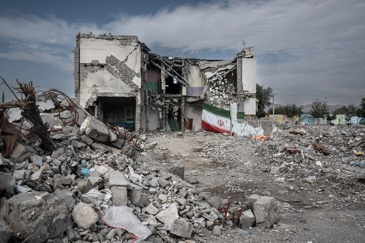

سنتکام رسماً تأیید کرد که حمله به مدرسه میناب توسط آمریکا صورت گرفته.

❌ این خبر که تو فضای مجازی داره دست به دست میشه، فیکه؛ سنتکام تأیید نکرده و ترامپ هم امروز گفت که هنوز داریم بررسی می‌کنیم.

@Dirty_Kids 👻

## Dirty_Kids — post 389511

✖️ سایت بین المللی bet120x 
✖️  
👍دارای مجوز رسمی Gambling Judge سوئد
👍       
💳شارژ حساب از طریق ارز و یووچر و پرمیوم ووچر 
💳تسویه حساب دلاری سریع 💊بیمه شرط میکس 
⚠️فروش شرط 
🔔ویرایش شرط                    
3️⃣
2️⃣ 
🎁20%هدیه واریز از طریق ارز و ووچر ┅━━━━━━━━━━━…

## Dirty_Kids — post 389510

  

✖️ سایت بین المللی bet120x 
✖️

 
👍دارای مجوز رسمی Gambling Judge سوئد
👍
     

💳شارژ حساب از طریق ارز و یووچر و پرمیوم ووچر

💳تسویه حساب دلاری سریع
💊بیمه شرط میکس

⚠️فروش شرط

🔔ویرایش شرط                    
3️⃣
2️⃣

🎁20%هدیه واریز از طریق ارز و ووچر
┅━━━━━━━━━━━

🎁 10%برگشت باخت به صورت روزانه

🎁 10%برگشت باخت به صورت هفتگی

🎁10%برگشت باخت به صورت ماهانه

💻ادرس ورود به سایت:
https://bet120x.com/fa/?btag=971470
➖➖➖➖➖
   
👈 آموزش واریز و برداشت دلاری
👉

🔪کانال اطلاع رسانی:
👇

✈️https://t.me/+1Wv5nGY_a54xNzlk

## Dirty_Kids — post 389505

این شما و این منتخب ژانر از کِی فهمیدین کسخلید توی توییتر :))

@Dirty_Kids 👻

## Dirty_Kids — post 389504

  <a href="telegram/content/Dirty_Kids_389504_1778864909.mp4">🎬 Download video</a>

مبارزه بانو هایده در برابر معین به کمک مدل Seedance 2.0 در سرویس PolloAI!

@Dirty_Kids 👻

## Dirty_Kids — post 389503

  <a href="telegram/content/Dirty_Kids_389503_1778864911.mp4">🎬 Download video</a>

بحران زیست‌محیطی در خلیج فارس در پی نشت نفت از جزیره مارو

@Dirty_Kids 👻

## Dirty_Kids — post 389502

  

🌪وقتی اینترنت طوفانیه... کافیه بادبان ها رو بکشی تا

⚫️با بالاترین کیفیت ممکن
⚡️ 

⚫️100 هزار تومان شارژ هدیه 
🎁

⚫️پایین ترین قیمت گیگی 250
🌐 

⚫️و ارائه پورسانت %10 در ازای هر معرفی
💼

بتونی یه اتصال پایدار با پشتیبانی 24 ساعته داشته باشی
🚀

بادبان راهتو باز می‌کنه
⛵️

G25

🛡@BadBan_VPN | کانال 

🤖@BadBan_VPNBot | ربات 

📞@BadBan_VPNSupport | پشتیبانی

## Hranews — post 112954

  

مولوی عبدالحمید اسماعیل‌زهی، امام جمعه اهل سنت زاهدان، با انتقاد از افزایش اعدام‌ها در ایران خواستار توقف «اعدام‌های سیاسی» در کشور شد. او امروز در خطبه‌های نماز جمعه با تأکید بر اینکه اعدام‌ها به مصلحت کشور و مردم نیست، گفت: اعدام نمی‌تواند راه‌حل مشکلات جامعه باشد.

وی همچنین با انتقاد از «اعترافات اجباری» در بازداشتگاه‌ها تأکید کرد که این اعترافات با موازین شرعی، قانون اساسی و قوانین بین‌المللی مغایرت دارد و نباید مبنای صدور حکم قرار گیرد.

همزمان با آغاز درگیری‌های نظامی، روند صدور و اجرای احکام #اعدام در پرونده‌های سیاسی و امنیتی افزایش یافته و تاکنون ۳۲ زندانی با این اتهامات در این بازه زمانی اعدام شده‌اند.

↘️
@hranews_bot تماس ✉️ - @Hranews کانال هرانا 🆑

## Hranews — post 112952

  

سخنگوی اتاق اصناف ایران با اشاره به گسترش نقش اقتصاد دیجیتال در بازار کشور اعلام کرد که تنها ۱۰ هزار کسب‌وکار مجازی دارای پروانه، طی سال گذشته حدود ۲۱۰۰ همت گردش مالی داشته‌اند. مهدی امیدوار در ادامه افزود: این آمار نشان می‌دهد اقتصاد دیجیتال به یکی از بخش‌های مهم و تأثیرگذار بازار تبدیل شده و عملکرد این گروه‌ها به «دسترسی پایدار و مؤثر» به #اینترنت وابسته است. به گفته وی، ناپایداری اخیر موجب کند شدن فرآیند خدمات‌رسانی و آسیب به بخشی از اقتصاد دیجیتال شده است. این در حالی است که فعالان این حوزه نیز تأکید دارند تداوم اختلال و ناپایداری اینترنت می‌تواند چرخه اقتصادی و روند فعالیت کسب‌وکارهای آنلاین را با مشکل مواجه کند.

↘️
@hranews_bot تماس ✉️ - @Hranews کانال هرانا 🆑

## configx2ray — post 38898

184.24.77.42 184.24.77.32 184.24.77.5 184.24.77.7 184.24.77.16 184.24.77.36 184.24.77.21 184.24.77.11 185.200.232.49 185.200.232.50 185.200.232.42 185.200.232.41 23.48.23.186 23.48.23.133 23.48.23.195 23.48.23.178 184.24.77.29 لیست ایپی های تست شده برای متود…

## configx2ray — post 38897

184.24.77.42
184.24.77.32
184.24.77.5
184.24.77.7
184.24.77.16
184.24.77.36
184.24.77.21
184.24.77.11
185.200.232.49
185.200.232.50
185.200.232.42
185.200.232.41
23.48.23.186
23.48.23.133
23.48.23.195
23.48.23.178
184.24.77.29

لیست ایپی های تست شده برای متود جدید سایفون
🔥

همشو باهم وارد کنید داخل برنامه 
🔥

Channel : https://t.me/ConfigX2ray

## manototv — post 105495

  <a href="telegram/content/manototv_105495_1778864917.mp4">🎬 Download video</a>

«صدای فاطمه سپهری و همه زندانیان سیاسی باشیم»

## manototv — post 105494

  <a href="telegram/content/manototv_105494_1778864918.mp4">🎬 Download video</a>

دونالد ترامپ در گفت‌وگو با برت بایر، خبرنگار و مجری فاکس‌نیوز از عملکرد آمریکا در جنگ با جمهوری اسلامی دفاع کرد و گفت واشینگتن با وجود توانایی نابودی کامل زیرساخت‌های ایران، خویشتنداری نشان داده است.

ترامپ در پاسخ به منتقدانی که می‌گویند او وضعیت جنگ را دست‌کم گرفته، گفت: «من هیچ چیزی را دست‌کم نگرفتم. ما ضربه‌ای فوق‌العاده سنگین به آن‌ها زدیم.»

رئیس‌جمهوری آمریکا افزود: «ما پل‌هایشان را باقی گذاشتیم. ظرفیت برقشان را باقی گذاشتیم. می‌توانیم همه آن را ظرف دو روز نابود کنیم. همه‌چیز.»

ترامپ همچنین گفت آمریکا جز بخش مربوط به شیرهای خروج نفت، جزیره خارگ را هدف قرار داده است.

## manototv — post 105493

  <a href="telegram/content/manototv_105493_1778864921.mp4">🎬 Download video</a>

«شما هم به کمپین حمایت از خانم سپهری بپیوندید»

## manototv — post 105492

  <a href="telegram/content/manototv_105492_1778864922.mp4">🎬 Download video</a>

‌
اسحاق دار، وزیر خارجه پاکستان، اعلام کرد ۲۰ شهروند ایرانی که در کشتی‌های توقیف‌شده آمریکا در آب‌های بین‌المللی حضور داشتند، از طریق پاکستان به تهران بازگردانده خواهند شد.

دار گفت این افراد همراه با ۱۱ شهروند پاکستانی، از سنگاپور به بانکوک منتقل شدند و سپس با پرواز راهی اسلام‌آباد شدند. به گفته او، شهروندان ایرانی پس از ورود به پاکستان، برای انتقال به تهران همراهی خواهند شد.

وزیر خارجه پاکستان از وزیر خارجه آمریکا برای «هماهنگی نزدیک» در این عملیات، و از وزیر خارجه جمهوری اسلامی بابت «اعتماد به پاکستان» در روند بازگرداندن شهروندان ایرانی قدردانی کرد.

## alonews — post 120235

  <a href="telegram/content/alonews_120235_1778864923.jpg">🎬 Download video</a>

👈مرکل صدراعظم سابق آلمان: خروج آمریکا از ناتو به ضرر خود آمریکا است

✅ @AloNews خبر جنگ

## alonews — post 120234

  

👈ترامپ چند دقیقه پیش از آلاسکا به سمت واشنگتن پرواز کرد. پس از توقف برای سوخت‌ گیری در انکوریج

✅ @AloNews خبر جنگ

## alonews — post 120233

  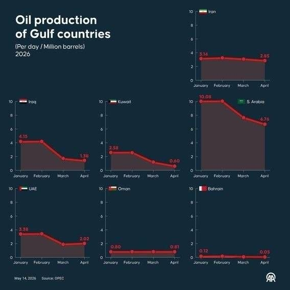

👈کاهش چشمگیر تولید نفت کشورهای حاشیه خلیج فارس

✅ @AloNews خبر جنگ

## alonews — post 120232

  <a href="telegram/content/alonews_120232_1778864925.jpg">🎬 Download video</a>

👈کانال ۱۲ عبری: حزب‌الله در عرض یک ساعت و نیم، ۱۰ پهپاد به سمت اسرائیل پرتاب کرد.

✅ @AloNews خبر جنگ

## alonews — post 120231

  <a href="telegram/content/alonews_120231_1778864925.jpg">🎬 Download video</a>

👈قیمت جهانی نفت به ۱۰۹ دلار برای هر بشکه رسیده است

✅ @AloNews خبر جنگ

## alonews — post 120230

  <a href="telegram/content/alonews_120230_1778864926.jpg">🎬 Download video</a>

👈علی واعظ عضو ارشد گروه بین‌المللی بحران به نشریه فایننشال تایمز: ایران با موافقت برای عبور نفتکش‌های چینی، به صورت پیش‌دستانه توانایی ترامپ برای چانه‌زنی با چین بر سر باز کردن تنگه را خنثی کرد

✅ @AloNews خبر جنگ

## alonews — post 120229

  <a href="telegram/content/alonews_120229_1778864926.jpg">🎬 Download video</a>

👈منابع اسرائیلی و آمریکایی به کانال ۱۱ اسرائیل گفته‌اند این کشور در پیامی روشن به واشینگتن خواستار از سرگیری جنگ با تهران شده است.

🔴براساس این گزارش، یکی از گزینه‌ها انجام حملات محدود و هدفمند علیه تاسیسات سوخت و انرژی ایران است.

✅ @AloNews خبر جنگ

## alonews — post 120228

  <a href="telegram/content/alonews_120228_1778864926.jpg">🎬 Download video</a>

👈سفارت آمریکا در اسرائیل در حال بررسی صدور دستورالعمل برای خروج فوری شهروندان آمریکایی از تل‌آویو است.

✅ @AloNews خبر جنگ

## alonews — post 120227

  <a href="telegram/content/alonews_120227_1778864927.jpg">🎬 Download video</a>

👈کی‌سی.سینگ سفیر اسبق هند در امارات، درمورد افشای سفر نتانیاهو به ابوظبی:

🔴«دولت اسرائیل می‌خواهد مطمئن شود که رئیس‌ امارات، محمد بن زاید (MbZ)، آن‌قدر از نزدیکی و تعامل صمیمانه‌اش با اسرائیل آسیب ببیند که دیگر نتواند با ایران به توافق برسد یا هیچ نقش مستقلی در شورای همکاری خلیج فارس (GCC) ـ جدا از اسرائیل ـ ایفا کند.

🔴 با توجه به اینکه من بن زاید را می‌شناسم، این موضوع برایم ناراحت‌کننده است.»

✅ @AloNews خبر جنگ

## alonews — post 120226

  <a href="telegram/content/alonews_120226_1778864927.jpg">🎬 Download video</a>

👈ترامپ به فاکس نیوز: من تاب‌آوری ایران را دست کم نگرفتم

✅ @AloNews خبر جنگ

## alonews — post 120225

  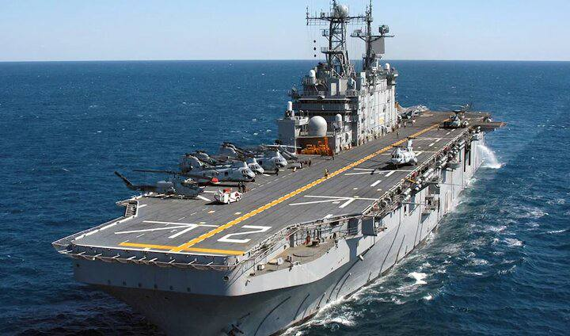

👈فرانسه حضور ناو هواپیمابر شارل دوگل در تنگه هرمز را تکذیب کرد

وزارت نیروهای مسلح فرانسه:

🔴تحرکات این نا‌و بخشی از یک مأموریت دریایی گسترده‌تر در دریای سرخ و منطقه خلیج عدن است.

🔴گروه ضربت این ناو به انجام مأموریت‌های مربوط به تضمین آزادی ناوبری در آبراه‌های بین‌المللی، در چارچوب همکاری‌های چندملیتی در منطقه، بدون ورود مستقیم به تنگه هرمز ادامه می‌دهد.

✅ @AloNews خبر جنگ

## alonews — post 120224

  <a href="telegram/content/alonews_120224_1778864928.jpg">🎬 Download video</a>

👈سواحل شمال‌غربی زیبای دریاچه ارومیه، امروز ۲۵ اردیبهشت

✅ @AloNews خبر جنگ

## alonews — post 120223

  <a href="telegram/content/alonews_120223_1778864929.jpg">🎬 Download video</a>

👈فرمانده سنتکام گزارش‌ها درباره باقی ماندن توان موشکی جمهوری اسلامی را رد کرد

وال استریت ژورنال گزارش داد فرمانده سنتکام ادعاهای منتشرشده درباره باقی ماندن بخش بزرگی از موشک‌ها و پرتابگرهای جمهوری اسلامی را رد کرده است.

پیشتر واشنگتن پست نوشته بود ایران هنوز حدود ۷۵ درصد پرتابگرهای متحرک و حدود ۷۰ درصد ذخایر موشکی پیش از جنگ را در اختیار دارد، اما فرمانده سنتکام این روایت را زیر سوال برده است.

این تناقض مهم است، چون جنگ فقط با موشک و پهپاد ادامه ندارد، با عددسازی و تصویرسازی هم ادامه پیدا میکند. جمهوری اسلامی میخواهد نشان دهد هنوز دست بالا را دارد، اما واشنگتن تلاش میکند بگوید ستون تهدید موشکی تهران ضربه جدی خورده و دیگر مثل قبل قابل اتکا نیست.

✅ @AloNews خبر جنگ

## alonews — post 120221

  <a href="telegram/content/alonews_120221_1778864929.jpg">🎬 Download video</a>

👈حمله‌های امروزِ ارتش اسرائیل به جنوب لبنان

✅ @AloNews خبر جنگ

## alonews — post 120220

  <a href="telegram/content/alonews_120220_1778864929.jpg">🎬 Download video</a>

👈رئیس ستاد کل ارتش اسرائیل هم به امارات سفر مخفیانه داشته

🔴به گزارش خبرگزاری کان اسرائیل، ایال زمیر، رئیس ستاد کل ارتش اسرائیل، در طول جنگ ایران سفری مخفیانه به امارات متحده عربی داشت و در آنجا با محمد بن زاید آل نهیان، رئیس امارات متحده عربی، گفتگو کرد.

✅ @AloNews خبر جنگ

---
📅 بروزرسانی: 1405/02/25 18:36
---

## VahidOOnLine — post 240334

  

♦️اسحاق دار، وزیر امور خارجه پاکستان، در پیامی در شبکه اجتماعی ایکس از موفقیت این کشور در بازگرداندن ۱۱ دریانورد پاکستانی و ۲۰ دریانورد ایرانی خبر داد که پیش‌تر در جریان توقیف کشتی‌ها در آب‌های آزاد توسط ایالات متحده بازداشت شده بودند.

وزیر خارجه پاکستان با اعلام اینکه تمامی این افراد در سلامت کامل به سر می‌برند، تشریح کرد که این گروه از سنگاپور به بانکوک منتقل شده و از آنجا راهی اسلام‌آباد شده‌اند. به گفته او، اتباع ایرانی پس از توقفی کوتاه در پاکستان، برای بازگشت به کشورشان همراهی و تسهیلات لازم را دریافت خواهند کرد.

اسحاق دار در این پیام از دولت‌های سنگاپور و تایلند بابت همکاری در فرآیند انتقال و همچنین از مارکو روبیو، وزیر امور خارجه ایالات متحده، بابت هماهنگی‌های نزدیک جهت تسهیل بازگشت این افراد قدردانی کرد. او همچنین از عباس عراقچی، وزیر امور خارجه جمهوری اسلامی، بابت اعتماد به پاکستان در فرآیند بازگرداندن «برادران ایرانی» تشکر و تاکید کرد که رسیدگی به وضعیت اتباع در بند، اولویت نخست دولت پاکستان است.
‌🇸🇦 Indypersian

🤖 @VahidOOnLine

## VahidOOnLine — post 240333

  <a href="telegram/content/VahidOOnLine_240333_1778857593.mp4">🎬 Download video</a>

‌
وانگ یی، وزیر خارجه چین، گفت پکن معتقد است حل بحران تنگه هرمز در گرو دستیابی به «آتش‌بسی دائمی و جامع» میان آمریکا و جمهوری اسلامی است.

به گزارش خبرگزاری شینهوا، وانگ یی گفت رئیس‌جمهور چین در گفت‌وگو با دونالد ترامپ تأکید کرده که «زور نمی‌تواند مشکلات را حل کند و گفت‌وگو تنها مسیر درست است.»

وزیر خارجه چین افزود: «مذاکرات یک‌شبه به نتیجه نمی‌رسد، اما وقتی درِ گفت‌وگو باز شد، نباید دوباره بسته شود.»

او همچنین گفت چین برای پیشبرد مذاکرات صلح تلاش کرده و به ایفای نقش خود برای پایان سریع درگیری‌ها و بازگشت ثبات به خاورمیانه ادامه خواهد داد.
‌🏁 🇬🇧 ManotoTV

🤖 @VahidOOnLine

## VahidOOnLine — post 240332

  <a href="telegram/content/VahidOOnLine_240332_1778857593.mp4">🎬 Download video</a>

‌
کریس رایت، وزیر انرژی آمریکا، گفت به‌دلیل جنگ و تنش‌ها در خلیج فارس، چین احتمالاً خرید نفت از آمریکا را افزایش خواهد داد.

او در گفت‌وگو با سی‌ان‌بی‌سی گفت: «فکر می‌کنم چین به خرید مقادیر بیشتری از نفت آمریکا ادامه خواهد داد.»

رایت همچنین گفت جهان نیاز دارد تنگه هرمز دوباره به‌طور کامل باز شود و افزود: «تلاش ایران برای گروگان گرفتن جهان، موقتی است.»

وزیر انرژی آمریکا در پاسخ به این پرسش که بازگشت شرایط به وضعیت عادی چقدر زمان می‌برد، گفت: «بخش زیادی از آن به ایران بستگی دارد.»

او افزود: «به هر شکلی، برنامه هسته‌ای ایران پایان خواهد یافت و عبور آزادانه کشتی‌ها از تنگه هرمز برقرار خواهد شد. این می‌تواند در صورت توافق با ایران، نسبتاً سریع رخ دهد.»
‌🏁 🇬🇧 ManotoTV

🤖 @VahidOOnLine

## VahidOOnLine — post 240331

  <a href="telegram/content/VahidOOnLine_240331_1778857594.mp4">🎬 Download video</a>

عباس عراقچی، وزیر خارجه جمهوری اسلامی، با انتشار تصویری از دیدار با سابرامانیام جایشانکار، وزیر خارجه هند، در شبکه اِکس نوشت: «ایران همواره وظیفه تاریخی خود به‌عنوان حافظ امنیت در تنگه هرمز» را انجام خواهد داد.

عراقچی افزود در گفت‌وگویی «سازنده» با همتای هندی خود، درباره تحولات منطقه گفت‌وگو کرده و مدعی شد جمهوری اسلامی «شریکی قابل اعتماد برای همه کشورهای دوست» است و این کشورها می‌توانند به امنیت تجارت و کشتیرانی اعتماد کنند.
‌🏁 🇬🇧 ManotoTV

🤖 @VahidOOnLine

## VahidOOnLine — post 240330

  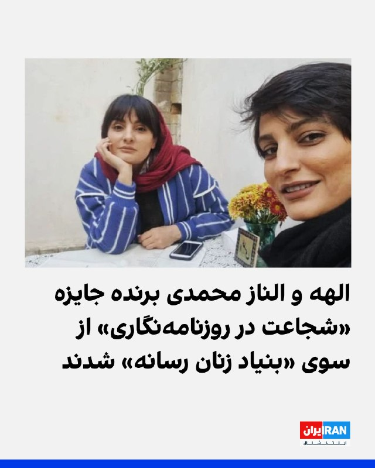

الهه محمدی و الناز محمدی، دو روزنامه‌نگار ایرانی، از سوی بنیاد بین‌المللی زنان رسانه مستقر در آمریکا به عنوان دریافت‌کنندگان جایزه «شجاعت در روزنامه‌نگاری» در سال ۲۰۲۶ معرفی شدند.
این نهاد با اعلام اسامی برگزیدگان امسال تاکید کرد که این روزنامه‌نگاران با وجود فشارها، تهدیدها و محدودیت‌های گسترده، به فعالیت حرفه‌ای خود ادامه داده‌اند.

بنیاد بین‌المللی زنان رسانه هر سال این جایزه را به روزنامه‌نگارانی اهدا می‌کند که در شرایط پرخطر و محدودکننده، فعالیت رسانه‌ای خود را ادامه می‌دهند. امسال علاوه بر دو روزنامه‌نگار ایرانی، خبرنگارانی از آمریکا، میانمار و فیلیپین نیز در میان برگزیدگان قرار دارند.
‌🏁 🇬🇧 IranintlTV

🤖 @VahidOOnLine

## VahidOOnLine — post 240329

♦️اصغر فرهادی، کارگردان سرشناس ایرانی، روز جمعه ۲۵ اردیبهشت در نشست خبری جشنواره کن با اشاره به تحولات اخیر در ایران، از کشته شدن غیرنظامیان در جریان جنگ و همچنین جان‌باختن معترضان در اعتراضات دی‌ماه ابراز تاسف کرد.
او این دو رویداد را «به یک اندازه دردناک» توصیف کرد و گفت مخالفت با کشته شدن گروهی از انسان‌ها به معنای پذیرش کشته شدن گروهی دیگر نیست. فرهادی تأکید کرد از دست رفتن جان انسان‌ها در هر شرایطی، چه در جنگ، چه در اعدام و چه در سرکوب اعتراضات، غیرقابل قبول است.
این کارگردان ایرانی با انتقاد از تداوم خشونت در جهان افزود که با وجود پیشرفت‌های بشری، همچنان هر روز خبرهایی از کشته شدن انسان‌های بی‌گناه منتشر می‌شود؛ موضوعی که به گفته او «دردناک و تاسف‌بار» است.
‌🇸🇦 Indypersian

🤖 @VahidOOnLine

## VahidOOnLine — post 240328

  

♦️عباس عراقچی، وزیر امور خارجه جمهوری اسلامی، روز جمعه ۲۵ اردیبهشت اعلام کرد که جمهوری اسلامی از هرگونه حمایتی، از جمله از سوی چین، برای کمک به حل درگیری‌ها در خاورمیانه استقبال می‌کند.

عراقچی در گفتگو با خبرنگاران در دهلی‌نو، پایتخت هند، جایی که برای شرکت در نشست کشورهای عضو گروه «بریکس» حضور داشت، گفت: «ما از هر کشوری که توانایی کمک داشته باشد، به‌ویژه چین، قدردانی می‌کنیم.»

او افزود: «ما روابط بسیار خوبی با چین داریم و شرکای استراتژیک یکدیگر هستیم. می‌دانیم که چینی‌ها حسن نیت دارند؛ بنابراین از هر اقدامی که آن‌ها بتوانند برای کمک به دیپلماسی انجام دهند، استقبال خواهیم کرد.»
‌🇸🇦 Indypersian

🤖 @VahidOOnLine

## VahidOOnLine — post 240327

  

امارات متحده عربی اعلام کرد که اظهارات جمهوری اسلامی و تلاش‌هایش برای توجیه حملات علیه امارات متحده عربی را نمی‌پذیرد و تاکید کرد فشارهای تهران تاثیری بر مواضع ابوظبی نخواهد داشت.

پیش‌تر عباس عراقچی، وزیر خارجه جمهوری اسلامی گفته بود: «اماراتی‌ها اجازه دادند از سرزمین‌شان برای شلیک توپخانه و تجهیزات علیه ما استفاده شود.»
‌🏁 🇬🇧 IranintlTV

🤖 @VahidOOnLine

## VahidOOnLine — post 240326

  <a href="telegram/content/VahidOOnLine_240326_1778857596.mp4">🎬 Download video</a>

سازمان اطلاعات مرکزی آمریکا با انتشار تصاویری از هاوانا، حضور جان رتکلیف، رئیس این سازمان، در پایتخت کوبا را تایید کرد.

بر اساس گزارش فوربس مکزیک، رتکلیف در جریان این سفر با مقام‌های ارشد دولت کوبا دیدار کرد. این رسانه نوشت گفت‌وگوها درباره همکاری‌های اطلاعاتی، امنیت منطقه‌ای و وضعیت اقتصادی کوبا انجام شده است.

به نوشته فوربس مکزیک، رئیس سیا برای گفت‌وگوهای مستقیم با مقام‌های وزارت کشور کوبا و مسئولان نهادهای اطلاعاتی این کشور به هاوانا رفت. این گزارش، دیدار رتکلیف با مقام‌های کوبایی را نشستی کم‌سابقه در سطح بالا میان دو کشور توصیف کرده است.

در این گزارش آمده است که در جریان این سفر، رتکلیف با رائول رودریگز کاسترو، نوه رائول کاسترو و مشاور امنیتی، و همچنین لازارو آلوارز کاساس، وزیر کشور کوبا، دیدار کرد.
‌🏁 🇬🇧 ManotoTV

🤖 @VahidOOnLine

## VahidOOnLine — post 240325

  <a href="telegram/content/VahidOOnLine_240325_1778857596.mp4">🎬 Download video</a>

«جمهوری اسلامی قصد کشتن فاطمه سپهری را دارد»
‌🏁 🇬🇧 ManotoTV

🤖 @VahidOOnLine

## VahidOOnLine — post 240324

  <a href="telegram/content/VahidOOnLine_240324_1778857598.mp4">🎬 Download video</a>

«صدای بانو سپهری باشیم»
‌🏁 🇬🇧 ManotoTV

🤖 @VahidOOnLine

## VahidOOnLine — post 240323

  <a href="telegram/content/VahidOOnLine_240323_1778857599.mp4">🎬 Download video</a>

دونالد ترامپ در پاسخ به پرسشی درباره حمله به یک مدرسه دخترانه در روز نخست جنگ گفت این موضوع «در دست بررسی» است.

خبرنگاری از ترامپ پرسید که سنتکام روز گذشته درباره حمله به مدرسه دخترانه در روز اول جنگ مورد پرسش قرار گرفته بود. ترامپ در پاسخ گفت: «این در دست بررسی است.» او افزود چند موضوع دیگر نیز در دست بررسی قرار دارد، اما تاکید کرد که این مورد هم جزو پرونده‌های در حال بررسی است.

در ادامه، خبرنگار پرسید آیا امکان دریافت اطلاعات بیشتر درباره این موضوع وجود دارد و اشاره کرد که این حمله با یک واحد موشکی آمریکایی مرتبط بوده است.

ترامپ در پاسخ وارد موضوع بی‌بی‌سی شد و این رسانه را به جعل گفته‌هایش متهم کرد. او گفت بی‌بی‌سی «حرف‌های بدی» در دهان او گذاشته و بعد ناچار شده بپذیرد که آن گفته‌ها درست نبوده است.
‌🏁 🇬🇧 ManotoTV

🤖 @VahidOOnLine

## VahidOOnLine — post 240322

  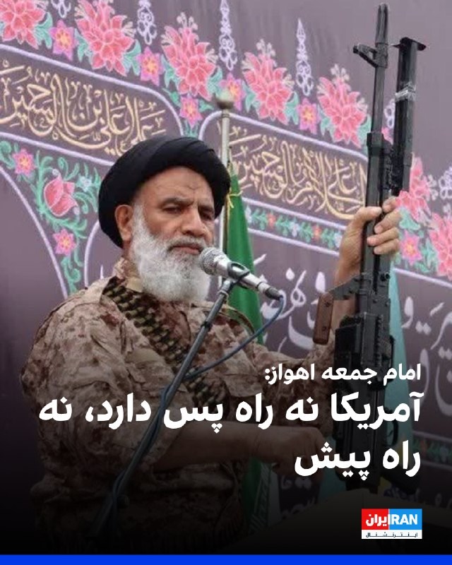

محمدنبی موسوی‌فرد، امام جمعه اهواز گفت: «در حال حاضر جمهوری اسلامی شرایطی برای آمریکا ایجاد کرده که نه راه پس دارد و نه راه پیش؛ دشمن باید بداند جمهوری اسلامی کاری کرده است که هیچ راه‌حل نظامی نمی‌تواند از عزت و اقتدار دفاعی و نظامی ما بکاهد.»

او ادامه داد: «نیروهای مسلح و بسیج نیز مانند گذشته، آمادگی کامل و کوبنده‌ای برای برخورد قاطع با هرگونه تجاوز دشمن را دارند.»
‌🏁 🇬🇧 IranintlTV

🤖 @VahidOOnLine

## VahidOOnLine — post 240321

  <a href="telegram/content/VahidOOnLine_240321_1778857601.mp4">🎬 Download video</a>

یک شهروند در پیام ارسالی خود به ایران اینترنشنال با اشاره به افزایش شدید قیمت داروها گفت که هزینه گچ گرفتن پای شکسته‌اش ۹ میلیون تومان شده است. پیام این مخاطب با هوش مصنوعی خوانده شده است.
‌🏁 🇬🇧 IranintlTV

🤖 @VahidOOnLine

## VahidOOnLine — post 240320

  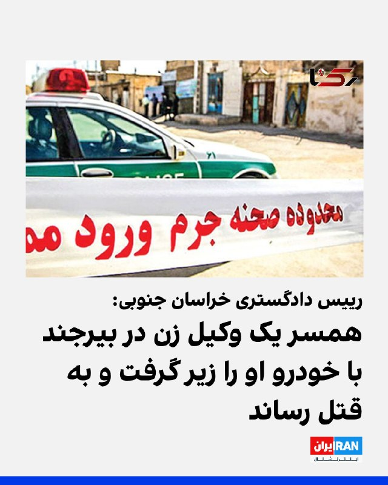

رییس‌کل دادگستری خراسان جنوبی اعلام کرد یک وکیل دادگستری در بیرجند در جریان اختلاف خانوادگی جان باخته است.

او گفت این وکیل زن پس از آن‌که همسرش با خودرو او را زیر گرفت، جان خود را از دست داد و پرونده این حادثه برای رسیدگی ویژه در دستگاه قضایی در حال بررسی است.

به گفته این مقام قضایی، متهم خود را به قوه قضاییه معرفی کرده است.
‌🏁 🇬🇧 IranintlTV

🤖 @VahidOOnLine

## VahidOOnLine — post 240319

  

♦️اسماعیل بقایی، سخنگوی وزارت خارجه جمهوری اسلامی با انتشار پیامی کوتاه به زبان عربی در شبکه اجتماعی ایکس، به گزارش‌ها درباره اقدامات امارات متحده عربی در دوران جنگ واکنش نشان داد و نوشت: «کسی که پنهانی خیانت کند، آشکارا رسوا می‌شود.» این پیام در حساب رسمی وزارت خارجه جمهوری اسلامی نیز با توضیح «خیانت به همسایه پنهان نمی‌ماند» بازتاب یافت.

در روزهای گذشته، گزارشی از سفر محرمانه بنیامین نتانیاهو، نخست‌وزیر اسرائیل به امارات متحده مطرح شد. دفتر نخست‌وزیر اسرائیل این گزارش را تایید کرد و این سفر را آغاز «یک پیشرفت تاریخی» دانست. امارات متحده عربی، این گزارش را تکذیب کرد. همچنین گزارش‌هایی از انجام حملات مستقیم به خاک ایران از سوی امارات مطرح شده است. عباس عراقچی، وزیر امور خارجه جمهوری اسلامی که برای شرکت در نشست وزیران خارجه کشورهای عضو بریکس در هند حضور دارد، این گزارش‌ها را تایید کرد.
‌🇸🇦 Indypersian

🤖 @VahidOOnLine

## VahidOOnLine — post 240318

  <a href="telegram/content/VahidOOnLine_240318_1778857603.mp4">🎬 Download video</a>

♦️ویدیوهای منتشر شده در شبکه‌های اجتماعی که گفته می‌شود مربوط به یکی از جزایر ایران است، آلودگی نفتی در سواحل این منطقه را در روز جمعه ۲۵ اردیبهشت نشان می‌دهد. در این تصاویر، لکه‌های نفتی در آب و آلودگی گسترده در نوار ساحلی قابل مشاهده است.

رویترز با انتشار تصاویر ماهواره‌ای که بین ۶ تا ۸ می (۱۶ تا ۱۸ اردیبهشت) ثبت شده‌اند، از وقوع یک نشت نفت گسترده در نزدیکی جزیره خارگ، اصلی‌ترین پایانه صادرات نفت ایران، خبر می‌دهند. این لکه نفتی که در تصاویر ماهواره‌های کوپرنیک به‌صورت توده‌ای خاکستری و سفید دیده می‌شود، منطقه‌ای به وسعت تقریبی ۴۵ تا ۹۵ کیلومتر مربع را در غرب این جزیره پوشانده است.

این درحالی است سازمان حفاظت محیط زیست ایران روز دوشنبه ۲۱ اردیبهشت ماه اعلام کرد لکه بزرگ مشاهده شده در آب‌های خلیج فارس در نزدیکی جزیره خارگ ناشی از تخلیه آب آلوده توازن یک نفت‌کش آسیب دیده بوده است.
‌🇸🇦 Indypersian

🤖 @VahidOOnLine

## VahidOOnLine — post 240317

  

سنتکام اعلام کرد از زمان آغاز محاصره دریایی بنادر و سواحل جنوب ایران، ۷۵ کشتی تجاری مجبور به تغییر مسیر شده‌اند و چهار کشتی نیز در پی حمله نیروهای آمریکا از کار افتاده‌اند.

پیش از این، سنتکام با انتشار تصویری از گشت‌زنی یک جنگنده پنهان‌کار اف-۳۵-ای نیروی هوایی بر فراز آب‌های منطقه‌ای نزدیک تنگه هرمز خبر داد.
‌🏁 🇬🇧 IranintlTV

🤖 @VahidOOnLine

## VahidOOnLine — post 240316

  

مجتبی خامنه‌ای در پیامی منتسب به او به مناسبت روز پاسداشت زبان فارسی و بزرگداشت فردوسی، زبان فارسی را یکی از پایه‌های هویت ایرانیان توصیف کرد و گفت تقویت این زبان می‌تواند به گسترش «تمدن ایرانی‌اسلامی» کمک کند.
او همچنین با اشاره به شاهنامه، از آن به‌عنوان اثری برای حفظ هویت، استقلال و ایستادگی ایرانیان یاد کرد.
در بخشی از این پیام نوشته شده: «داستانهای اسطوره‌ای فردوسی، واقعیت زندگی و شخصیت قهرمانانه‌ آنان بوده و مفاهیم انسان‌ساز، سلحشورانه، و قرآنی شاهنامه، همه‌ اقوام و اقشار ایران را در حفظ هویت، اصالت و استقلال خود و مبارزه با ضحاک‌وشان متجاوز، همدل و همراه و همساز می کند.»
‌🏁 🇬🇧 IranintlTV

🤖 @VahidOOnLine

## VahidOOnLine — post 240315

  

♦️ فریدریش مرتس، صدراعظم آلمان، روز جمعه ۲۵ اردیبهشت، از گفتگوی تلفنی «مثبت و سازنده» با دونالد ترامپ، رئیس‌جمهوری آمریکا، خبر داد. این تماس در حالی انجام شد که اخیرا اعلام خبر خروج ۵ هزار سرباز آمریکایی از خاک آلمان، روابط دو کشور را دچار تنش کرده بود؛ اما پیام اخیر مرتس نشان‌دهنده تلاش برای عبور از این اختلافات است.

مرتس در شبکه اجتماعی ایکس اعلام کرد که دو طرف بر سر اهداف کلیدی واشنگتن در قبال جمهوری اسلامی اتفاق نظر دارند. او تاکید کرد: «ما توافق داریم که ایران باید فورا به میز مذاکره بازگردد، تنگه هرمز را باز کند و تحت هیچ شرایطی نباید اجازه دستیابی به سلاح هسته‌ای به تهران داده شود.»

علاوه بر موضوع ایران، رهبران دو کشور درباره دستیابی به راهکاری صلح‌آمیز برای اوکراین و هماهنگی مواضع پیش از نشست آتی ناتو در آنکارا گفتگو کردند. آلمان که بزرگ‌ترین اقتصاد اروپا و حامی اصلی نظامی اوکراین محسوب می‌شود، در دوران مرتس تقویت توان دفاعی خود را برای کاهش وابستگی به ایالات متحده و مقابله با تهدیدات روسیه در اولویت قرار داده است.
‌🇸🇦 Indypersian

🤖 @VahidOOnLine

## mwarmonitor — post 9134

🇦🇪معالی خلیفه بن شاهین المرر، وزیر مشاور، در نشست وزیران امور خارجه گروه بریکس که در دهلی نو در جمهوری هند برگزار شد، شرکت کرد.
🇦🇪وی در جریان این نشست، مخالفت قاطع دولت امارات متحده عربی را با ادعاهای طرف ایرانی و تلاش‌ها برای توجیه حملات تروریستی ایران که امارات و کشورهای برادر و دوست در منطقه را هدف قرار داده است، اعلام کرد؛ اقداماتی که نقض آشکار منشور سازمان ملل متحد، حقوق بین‌الملل و اصول حسن همجواری به‌شمار می‌آید.

معالیه همچنین تأکید کرد که دولت امارات به‌طور قاطع هرگونه ادعا یا تهدیدی را که حاکمیت، امنیت ملی یا استقلال تصمیم‌گیری این کشور را مخدوش کند، رد می‌کند و تصریح نمود که امارات تمامی حقوق حاکمیتی، قانونی، دیپلماتیک و نظامی خود را برای مقابله با هر تهدید، ادعا یا اقدام خصمانه محفوظ می‌دارد.

وی خاطرنشان ساخت که هیچ‌گونه تلاش برای اعمال فشار، طرح اتهام یا ترویج ادعاهای مغرضانه، خللی در مواضع ثابت دولت ایجاد نخواهد کرد و امارات را از حفاظت از منافع عالی ملی و صیانت از حاکمیت و استقلال تصمیم‌گیری بازنخواهد داشت.

معالیه افزود که از ۲۸ فوریه ۲۰۲۶، دولت امارات در معرض حملات تروریستی مکرر و غیرقابل توجیه ایران قرار گرفته است؛ به‌گونه‌ای که سامانه‌های پدافند هوایی امارات با حدود ۳۰۰۰ حمله شامل موشک‌های بالستیک و کروز و پهپادها مقابله کرده‌اند. این حملات به‌طور مستقیم و عامدانه تأسیسات غیرنظامی و زیرساخت‌های حیاتی، از جمله فرودگاه‌ها، بنادر، تأسیسات نفتی، ایستگاه‌های آب‌شیرین‌کن، شبکه‌های انرژی، مراکز خدماتی و مناطق مسکونی را هدف قرار داده است.

وی گفت: «با وجود صدور قطعنامه‌ها و محکومیت‌های متعدد بین‌المللی و منطقه‌ای، ایران به حملات تروریستی خود علیه امارات و کشورهای منطقه ادامه داده است و اجماع جهانی را نادیده گرفته؛ از جمله قطعنامه شماره ۲۸۱۷ (۲۰۲۶) شورای امنیت سازمان ملل متحد که با مشارکت ۱۳۶ کشور به تصویب رسید، و نیز قطعنامه صادره از شورای حقوق بشر که در ۲۵ مارس ۲۰۲۶ در مقر سازمان ملل در ژنو برگزار شد و به‌طور اجماعی حملات ایران را محکوم کرد.» وی تأکید کرد این حملات نقض حقوق بین‌الملل و تهدیدی برای صلح و امنیت بین‌المللی است و این قطعنامه با حمایت بیش از ۱۰۰ کشور تصویب شد.

وی افزود: «جامعه بین‌المللی همچنان به محکومیت حملات تروریستی ایران ادامه داده است؛ به‌طوری که کمیته حفاظت از محیط‌زیست دریایی سازمان بین‌المللی دریانوردی قطعنامه‌ای را تصویب کرد که خواستار توقف فوری حملات و تهدیدات علیه کشتی‌های تجاری و نفتکش‌ها و زیرساخت‌های حیاتی بنادر است. همچنین شورای اتحادیه بین‌المللی مخابرات در ژنو به‌طور اجماعی قطعنامه‌ای را در محکومیت حملات علیه زیرساخت‌های غیرنظامی ارتباطات و فناوری اطلاعات تصویب کرد. از سوی دیگر، شورای سازمان خواربار و کشاورزی ملل متحد نیز قطعنامه‌ای را به تصویب رساند که اقدامات ایران را به‌دلیل به خطر انداختن امنیت غذایی محکوم می‌کند.»

معالیه تأکید کرد که این قطعنامه‌ها بیانگر اجماع روشن بین‌المللی در رد این حملات تروریستی است و از حق امارات و کشورهای برادر و دوست برای دفاع از حاکمیت خود مطابق با حقوق بین‌الملل حمایت می‌کند؛ و پیامی واحد و صریح می‌فرستد مبنی بر اینکه جامعه جهانی حملات تروریستی ایران به حاکمیت کشورها یا هدف قرار دادن عمدی غیرنظامیان و زیرساخت‌های حیاتی را تحمل نخواهد کرد.

وی توضیح داد که ایران با ایجاد اخلال و تعطیلی مسیرهای کشتیرانی بین‌المللی، از جمله بسته شدن عملی تنگه هرمز ـ یکی از مهم‌ترین گذرگاه‌های آبی جهان ـ مرتکب نقض آشکار حقوق بین‌الملل شده است. وی تأکید کرد که هدف قرار دادن کشتیرانی تجاری و استفاده از تنگه هرمز به‌عنوان ابزار فشار یا باج‌گیری اقتصادی، مصداق دزدی دریایی بوده و تهدیدی مستقیم برای ثبات منطقه، ملت‌های آن و امنیت جهانی انرژی به‌شمار می‌آید.

معالیه تصریح کرد که دولت امارات منتظر حمایت هیچ طرفی نیست و توان بازدارندگی و پاسخ به تجاوز آشکار را دارد و حق کامل و مشروع خود را برای دفاع از حاکمیت و تمامیت ارضی خویش، مطابق با ماده ۵۱ منشور سازمان ملل متحد، محفوظ می‌داند؛ به‌گونه‌ای که امنیت شهروندان، مقیمان و بازدیدکنندگان تضمین شود.


🇦🇪در پایان، وی ایران را مسئول کامل این حملات تروریستی و پیامدهای آن دانست و تأکید کرد که احترام به حاکمیت کشورها، گفت‌وگو، توقف حملات تروریستی و پایبندی سخت‌گیرانه به حقوق بین‌الملل، پایه‌های ضروری هرگونه ثبات واقعی و پایدار به‌شمار می‌رود.

@mwarmonitor

## mwarmonitor — post 9131

  

✈️🇬🇧نیروی هوایی سلطنتی بریتانیا (RAF) استقرار جنگنده‌های لایتنینگ

دو فروند تانکر Airbus KC.2 Voyager
43C6F4 ZZ331 – ASCOT 9211
43C6FB ZZ338 – ASCOT 9212

✈️دو تانکر KC.2 Voyager بعدازظهر امروز از RAF Akrotiri به سمت RAF Brize Norton در حال پرواز هستند. هم‌زمان، دو دسته پروازی از جنگنده‌های F-35B نیز در مسیر بازگشت به پایگاه RAF Marham قرار دارند.

✈️در مجموع شش فروند F-35B به آکروتیری اعزام شده بودند و با توجه به استفاده از دو تانکر در این مأموریت، به احتمال زیاد هر شش فروند در حال بازگشت به کشور هستند.

@mwarmonitor

## mwarmonitor — post 9129

  

🇺🇸یک بالگرد MH-60R Sea Hawk از عرشه ناو جنگی USS Rafael Peralta (DDG 115) در حالی که نیروهای آمریکایی در دریای عرب در حال اجرای محاصره دریایی علیه ایران هستند، برخاست. تا امروز، ۷۵ کشتی تجاری منحرف شده و ۴ کشتی برای تضمین رعایت مقررات از کار افتاده‌اند.

@mwarmonitor

## mwarmonitor — post 9128

🇺🇸فرمانده سنتکام: عملیات «خشم حماسی» ایران را فلج و مشارکت‌های نظامی در منطقه را تقویت کرد

وزارت جنگ ایالات متحده 🇺🇸

🔸به گفته رهبران وزارت جنگ، ایالات متحده در اواخر فوریه عملیات «خشم حماسی» (Epic Fury) را آغاز کرد و از آن زمان، نیروهای نظامی آمریکا در منطقه عملیاتی فرماندهی مرکزی (سنتکام)، توان نظامی ایران و قدرت نفوذ آن را فلج کرده‌اند. این عملیات همچنین نقش شرکای نظامی در منطقه را برجسته کرد.

دریاسالار برد کوپر، فرمانده سنتکام، امروز در واشینگتن در برابر کمیته نیروهای مسلح سنا شهادت داد. این جلسه بخشی از بررسی‌های مربوط به وضعیت نیروها در منطقه و بخش مربوط به این فرماندهی در درخواست بودجه ریاست‌جمهوری برای سال مالی ۲۰۲۷ بود. محور اصلی گفتگوها در کپیتال هیل بر موفقیت‌های عملیات «خشم حماسی» متمرکز بود.
کوپر خطاب به قانون‌گذاران گفت: «در کمتر از ۴۰ روز، نیروهای سنتکام به اهداف نظامی خود دست یافتند. قابل‌توجه‌ترین دستاورد این بود که ما توانایی ایران برای صدور قدرت به خارج از مرزهایش و تهدید منطقه و منافعمان را تضعیف کردیم.»
کوپر به یاد قانون‌گذاران آورد که در آوریل و اکتبر سال گذشته، ایران صدها موشک را بر سر اسرائیل فرود آورد؛ اما اکنون پس از آنکه نیروهای آمریکایی به‌طور مؤثری ظرفیت موشک‌های متعارف ایران را از بین بردند، این کشور دیگر چنین توانایی ندارد.
او گفت: «امروز ایران دیگر نمی‌تواند با آن حجم و مقیاس حمله کند. علاوه بر این، با نابودی ۹۰ درصد از پایگاه‌های صنایع دفاعی ایران، این کشور تا سال‌ها قادر به بازسازی آن سلاح‌ها نخواهد بود.»
اهداف راهبردی و نابودی توان نظامی
رئیس‌جمهور دونالد جی. ترامپ و دیگر مقامات دولت تصریح کرده‌اند که ایرانی‌ها هرگز به سلاح هسته‌ای دست نخواهند یافت. کوپر بیان کرد که اهداف نظامی در قالب عملیات «خشم حماسی» برای حمایت از این سیاست طراحی شده بود؛ از جمله تضعیف توانمندی موشک‌های بالستیک و نیروی دریایی ایران و همچنین نابودی توانایی صنایع این کشور برای بازسازی این تجهیزات.
صنایع دفاعی: ۹۰ درصد از زیرساخت‌های پهپادی، موشکی و دریایی تخریب شده و تنها ۱۰ درصد باقی مانده است.
نیروی دریایی: طبق ارزیابی نظامی، بازسازی نیروی دریایی ایران ۵ تا ۱۰ سال زمان خواهد برد.
گروه‌های نیابتی: حماس، حزب‌الله و حوثی‌ها به دلیل این عملیات، از تدارکات تسلیحاتی و پشتیبانی ایران قطع شده‌اند.
تقویت ائتلاف‌های منطقه‌ای
کوپر به قانون‌گذاران گفت که در حال حاضر هیچ منبع یا تجهیزاتی از ایران به سمت گروه‌های تروریستی نیابتی سرازیر نمی‌شود. او تأکید کرد که آغاز عملیات «خشم حماسی» نشان داد شرکای منطقه‌ای تا چه حد توانمند هستند و این عملیات باعث تقویت روابط نظامی شده است.
او افزود: «در حال حاضر، ما پنج کشور متحد خاص داریم که نه تنها در تئوری، بلکه در عمل شانه به شانه ایالات متحده در امور دفاعی ایستاده‌اند.»
شرکای کلیدی مورد تقدیر:
امارات متحده عربی، بحرین، کویت، قطر و عربستان سعودی (به عنوان شرکای استثنایی).
پادشاهی اردن (نقش حیاتی در موفقیت عملیات).

🔴دولت اسرائیل (همکاری بسیار نزدیک).
کوپر در پایان خاطرنشان کرد: «این نتیجه از پیش تعیین شده نبود و بر حسب تصادف به دست نیامد؛ بلکه حاصل ماه‌ها برنامه‌ریزی دقیق بر پایه دهه‌ها تجربه است.»

@mwarmonitor

## pm_afshaa — post 90795

  <a href="telegram/content/pm_afshaa_90795_1778857606.jpg">🎬 Download video</a>

🔴ترامپ: آمریکا ممکنه در مقطعی برای خارج کردن «گرد و غبار هسته‌ای» ایران، وارد عمل بشه؛ یا اونو به دست میاریم، یا اگر نشد، وارد میشیم؛ آمریکا تجهیزات لازم برای این کار رو در اختیار داره.

💧 Rainbet.com the #1 Non-KYC Crypto Casino & Sportsbook @rainbetcom

😁 @Pm_Afshaa

## pm_afshaa — post 90794

  <a href="telegram/content/pm_afshaa_90794_1778857607.jpg">🎬 Download video</a>

🔴وزیر امور خارجه چین: ما خواستار بازگشایی هرچه سریع‌تر تنگه هرمز هستیم.

همچنین ما از آمریکا و ایران حمایت می‌کنیم تا به حل اختلافات و منازعات خود از طریق گفتگوها ادامه بدن.

💧 Rainbet.com the #1 Non-KYC Crypto Casino & Sportsbook @rainbetcom

😁 @Pm_Afshaa

## pm_afshaa — post 90793

  

جهت تبلیغات با بازدهی بالا میتونین دایرکت کانال پیام بدین

## pm_afshaa — post 90792

🔴ترامپ خطاب به خبرنگار نیویورک تایمز:من در ایران یک پیروزی کامل نظامی داشتم. اما فیک نیوزها، افرادی مثل تو، اخبار نادرست می‌نویسند. تو یک آدم جعلی هستی. ما یک پیروزی کامل نظامی داشتیم. من در واقع فکر می‌کنم آنچه می‌نویسی نوعی خیانت است. باید از خودت خجالت بکشی. من واقعاً فکر می‌کنم این خیانت است

💧 Rainbet.com the #1 Non-KYC Crypto Casino & Sportsbook @rainbetcom

😁 @Pm_Afshaa

## pm_afshaa — post 90791

  <a href="telegram/content/pm_afshaa_90791_1778857608.jpg">🎬 Download video</a>

🔴سنتکام: تا امروز، 75 کشتی تجاری تغییر مسیر دادن و 4 کشتی غیرفعال شده تا اطمینان حاصل بشه که قوانین رعایت میشه.

💧 Rainbet.com the #1 Non-KYC Crypto Casino & Sportsbook @rainbetcom

😁 @Pm_Afshaa

## pm_afshaa — post 90790

  <a href="telegram/content/pm_afshaa_90790_1778857608.jpg">🎬 Download video</a>

🔴تهران‌تایمز: آمریکا پیشنهاد 14 ماده‌ای جمهوری اسلامی برای پایان جنگ رو رد کرده و بار دیگر بر مواضع خود، به‌ویژه درباره پرونده هسته‌ای، تأکید کرده.

💧 Rainbet.com the #1 Non-KYC Crypto Casino & Sportsbook @rainbetcom

😁 @Pm_Afshaa

## pm_afshaa — post 90789

🔴دقایقی پیش ترامپ رسماً اعلام کرد که یه دور دیگر از عملیات نظامی آمریکا در ایران در راه است

+ترامپ:ما همه چیز را تمام نکردیم،
برمی‌گردیم و آن را تکمیل می‌کنیم،
حتی شاید بیشتر

💧 Rainbet.com the #1 Non-KYC Crypto Casino & Sportsbook @rainbetcom

😁 @Pm_Afshaa

## pm_afshaa — post 90788

♨️
♨️
♨️
♨️

## iaghapour — post 2612

کل ریپازیتوری گیت هاب علیرضا که شامل X-UI و S-UI میشد بسته شده و هنوز دلیلش مشخص نیست.

## DEJradio — post 4652

  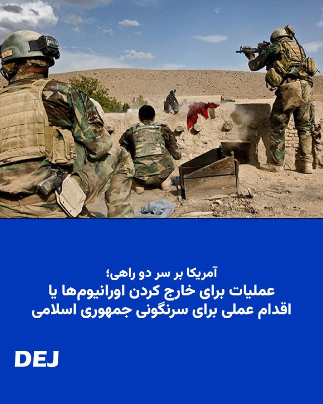

🔺📢 آمریکا بر سر دو راهی؛
عملیات برای خارج کردن اورانیوم‌ها یا اقدام عملی برای سرنگونی جمهوری اسلامی

یکی از کارشناسان نظامی ایرانی‌الاصل که سابقه عضویت در ارتش ایالات متحده را دارد، به دژ گفت: در بین سیاستمداران و نظامیان آمریکا دیدگاهی وجود دارد که می‌گوید اگر قرار بر این باشد که برای خروج اورانیوم‌ها، اعزام نیرو و تجهیزات به داخل خاک ایران انجام شود، با توجه به حساسیت، زمان‌بر بودن این عملیات و پیش‌نیازهای آن از جمله:
•انهدام کامل سامانه‌های پدافند هوایی جمهوری اسلامی
•ایجاد فرودگاه موقت
•ایجاد کمربند امنیتی به شعاع چند کیلومتر
•استقرار سامانه‌های پدافند هوایی برد کوتاه برای مقابله با موشک‌های کوتاه‌برد و پهپادهای نظام
•انتقال تجهیزات و ماشین‌آلات لازم برای خاک‌برداری
•لزوم حضور کارشناسان اتمی غیرنظامی و لباس‌های مخصوص ضد تشعشعات
•چالش انتقال سیلندرهای سنگین حاوی اورانیوم غنی‌شده
•احتمال هدف قرار گرفتن پرنده حامل سیلندر اورانیوم و ایجاد یک فاجعه انسانی و محیط‌ زیستی
•زمان‌بر بودن این عملیات که ممکن است چند هفته طول بکشد
با توجه به موارد فوق که صرفاً بخشی از چالش‌های این عملیات است، دیدگاه دیگری نیز وجود دارد که به‌نظر می‌رسد حمایت بیشتری از سوی اسرائیل داشته باشد؛ اعزام نیروی زمینی و انتقال نیرو از طریق هوابرد و هلی‌برن جهت سرنگون کردن حکومت که البته این عملیات هم چالش های خود را خواهد داشت.

#جنگ #حمله_زمینی
@DEJradio

## DEJradio — post 4651

  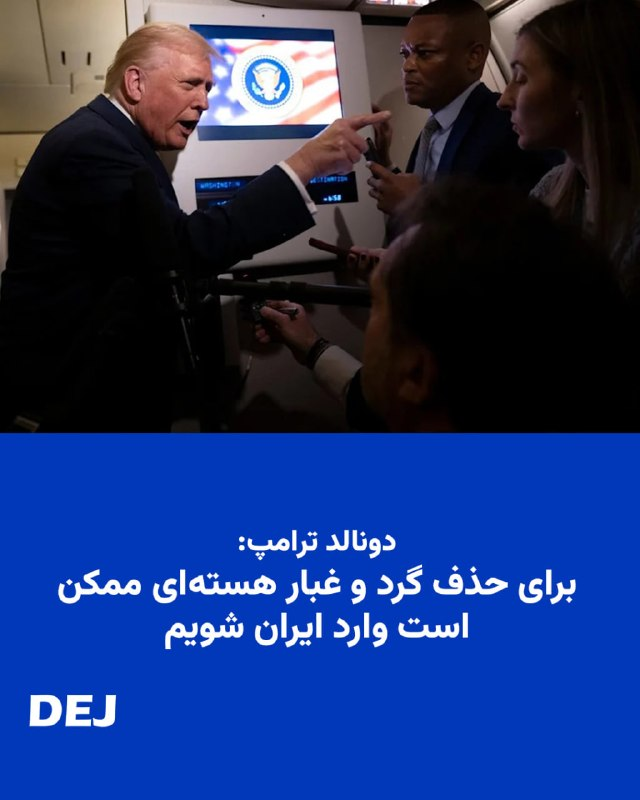

🚨📢 دونالد ترامپ:
برای حذف گرد و غبار هسته‌ای ممکن است وارد ایران شویم

دونالد ترامپ گفت آمریکا ممکن است در مقطعی برای حذف آنچه «گرد و غبار هسته‌ای» نامید وارد ایران شود. ترامپ در مسیر بازگشت به آمریکا و در هواپیمای ریاست‌جمهوری، ایر فورس وان، به خبرنگاران گفت: «در زمان مناسب، یا وارد می‌شویم یا آن را به دست می‌آوریم. فکر می‌کنم احتمالا آن را به دست می‌آوریم، اما اگر به دست نیاوریم، وارد خواهیم شد.»

او افزود: «فکر می‌کنم آنها کاملا شکست خواهند خورد و ما هیچ خطری نخواهیم داشت. ما تجهیزات لازم برای خارج کردن آن را داریم، هیچ‌کس دیگر ندارد؛ شاید چین چنین تجهیزاتی داشته باشد.»

ترامپ پیش‌تر نیز در ماه مارس در کاخ سفید درباره ذخایر اورانیوم غنی‌شده جمهوری اسلامی هشدار مشابهی داده و گفته بود: «یا آن را از آنها پس می‌گیریم یا آن را برمی‌داریم.»

#ترامپ #حملات_هدفمند
@DEJradio

## DEJradio — post 4650

  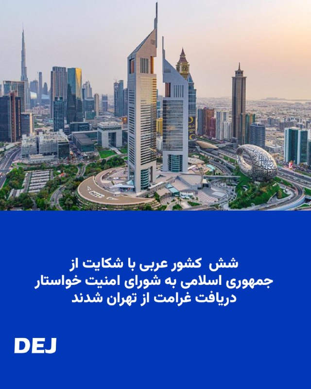

🚨
⭕️ شش کشور عربی با شکایت از جمهوری اسلامی به شورای امنیت خواستار دریافت غرامت از تهران شدند

شش کشور عربی حوزه خلیج فارس در نامه‌ای به شورای امنیت سازمان ملل ادعای حکومت ایران درباره اداره یا وضع قواعد جدید برای تنگه هرمز را محکوم کردند. امارات متحده عربی نیز در نامه‌ای جداگانه به همین نهاد، جمهوری اسلامی را به حملات «عامدانه» به زیرساخت‌های حیاتی و غیرنظامی متهم کرد.
نسخه‌هایی از هر دو نامه در اختیار خبرنگار ایران‌اینترنشنال در سازمان ملل متحد قرار گرفته است.

خبرگزاری بنا، رسانه رسمی دولت بحرین، نیز پنج‌شنبه ۲۴ اردیبهشت اعلام کرد که این کشور همراه با امارات متحده عربی، عربستان سعودی، کویت، قطر و اردن در نامه‌ای فوری به دبیرکل سازمان ملل و شورای امنیت نسبت اظهارات مقام‌های جمهوری اسلامی درباره «مدیریت» تنگه هرمز و ایجاد «قوانین حقوقی» تازه برای این آبراه بین‌المللی را رد و محکوم کردند.

در این نامه، بر حق تمام این کشورها به «اتخاذ تصمیم‌های مشروع حاکمیتی در زمینه امنیت و مشارکت‌های بین‌المللی خود» تاکید شده است.
این کشورها نوشته‌اند که تنگه هرمز «یک آبراه بین‌المللی حیاتی برای کشتیرانی، تجارت و انرژی» است و هیچ کشوری، صرف‌نظر از موقعیت جغرافیایی‌اش، حق ندارد به‌تنهایی برای آن «اداره یک‌جانبه» یا «قواعد حقوقی منفرد» وضع کند.

#شورای_امنیت_سازمان_ملل #تنگه_هرمز
@DEJradio

## mamlekate — post 103528

  <a href="telegram/content/mamlekate_103528_1778857611.mp4">🎬 Download video</a>

دونالد ترامپ در پاسخ به پرسشی درباره پیشنهاد اخیر جمهوری اسلامی گفت این پیشنهاد را بررسی کرده، اما به گفته او، اگر از جمله نخست یک متن خوشش نیاید، بقیه آن را کنار می‌گذارد.

ترامپ در پاسخ به این پرسش که جمله نخست چه بوده است، آن را «غیرقابل قبول» توصیف کرد و گفت مسئله اصلی از نگاه او این است که ایران نباید «هیچ شکل» از برنامه هسته‌ای داشته باشد.

در ادامه، خبرنگار از ترامپ پرسید آیا دوره ۲۰ ساله برای او کافی نیست. ترامپ پاسخ داد که «۲۰ سال کافی است»، اما به گفته او، سطح تضمین‌هایی که جمهوری اسلامی ارائه می‌دهد اهمیت دارد.

ترامپ گفت که اگر قرار است توافقی ۲۰ ساله مطرح باشد، باید «۲۰ سال واقعی» باشد و نباید به گفته او، توافقی مبهم یا ظاهری باشد.

ManotoTV
@mamlekate

## mamlekate — post 103527

  

📞 سلام مملکته. درباره چندتا از دانشجویان دانشگاه پزشکی بلاروس پیام میدم. سفیر بیشرف جمهوری اسلامی در مینسک علیرضا صانعی مزدور دست نشانده جمهوری اسلامی به وزارت کشور بلاروس یادداشت فرستاده و دانشجویان مقیم و افراد مقیمی که در بلاروس زندگی میکنند و مخالف جمهوری اسلامی هستند را افراد خطرناک برای شهروندان بلاروس و حامی تروریسم معرفی کرده و با پیگیری پی در پی خود و دیپلماتهای سفارت و یادداشت های فراوان خواستار دیپورت این افراد از بلاروس به ایران و دستگیری آنها در ایران میباشد. لطفا صدای مارو به جهانیان برسونید. دولت بلاروس بخاطر یادداشتهای سفارت و ترس از ایجاد مشکلات دیپلماتی مجبور به این اقدام شده است حتی پس از پایان بازداشت بعضی افرادی که آزاد شدند سفیر مجدد پیگیری کرده و خواستار دیپورت آنها شده است. یکی از این افراد خاطره خدادادی و یکی دیگر دکتر سپهر فرشادی که نزدیک به دوهفته در بازداشت انفرادی بسر میبره و در آستانه ی دیپورت میباشد. دوستان دیگه ای هم در همین وضعیت هستند.

@mamlekate

## VahidOnline — post 75484

  

صدراعظم آلمان می‌گوید در جریان گفت‌و‌گوی تلفنی با دونالد ترامپ، رئیس‌جمهور آمریکا، هر دو بر سر ضرورت باز کردن تنگهٔ هرمز توسط ایران و ممانعت از دسترسی تهران به سلاح هسته‌ای، توافق داشته‌اند.

فریدریش مرتس روز جمعه ۲۵ اردیبهشت در شبکهٔ ایکس نوشت که در مسیر بازگشت رئیس‌جمهور آمریکا از چین، «تماس تلفنی خوبی» با او داشته است.

او افزود که آن‌ها توافق دارند که «ایران باید همین حالا پای میز مذاکره بیاید. باید تنگهٔ هرمز را باز کند. نباید اجازه داده شود تهران به سلاح هسته‌ای دست پیدا کند».
@VahidHeadline

📡 @VahidOnline

## VahidOnline — post 75479

  <a href="telegram/content/VahidOnline_75479_1778857613.mp4">🎬 Download video</a>

دونالد ترامپ، رئیس‌جمهوری ایالات متحده، روز جمعه ۲۵ اردیبهشت در مسیر بازگشت از چین در پاسخ به خبرنگاران، درباره آخرین پیشنهاد ایران در مذاکرات هسته‌ای گفت که آن را «از همان جمله اول» رد کرده است.
او با بیان اینکه محتوای ابتدایی این پیشنهاد «غیرقابل قبول» بوده، افزود: «حتی ادامه آن را هم نخواندم.» ترامپ تأکید کرد که صرف تعیین بازه زمانی مانند ۲۰ سال کافی نیست و آنچه اهمیت دارد، ارائه تضمین‌های واقعی و قابل اجرا از سوی ایران است.
رئیس‌جمهوری آمریکا همچنین تصریح کرد که، هرگونه توافق باید شامل انتقال کامل مواد و سوخت هسته‌ای از ایران باشد و افزود که توافقی مبتنی بر «حرف‌های توخالی» قابل پذیرش نخواهد بود.
@VahidOOnLine
دونالد ترامپ در پاسخ به پرسشی درباره پیشنهاد اخیر جمهوری اسلامی گفت این پیشنهاد را بررسی کرده، اما به گفته او، اگر از جمله نخست یک متن خوشش نیاید، بقیه آن را کنار می‌گذارد.
ترامپ در پاسخ به این پرسش که جمله نخست چه بوده است، آن را «غیرقابل قبول» توصیف کرد و گفت مسئله اصلی از نگاه او این است که ایران نباید «هیچ شکل» از برنامه هسته‌ای داشته باشد.
در ادامه، خبرنگار از ترامپ پرسید آیا دوره ۲۰ ساله برای او کافی نیست. ترامپ پاسخ داد که «۲۰ سال کافی است»، اما به گفته او، سطح تضمین‌هایی که جمهوری اسلامی ارائه می‌دهد اهمیت دارد.
ترامپ گفت که اگر قرار است توافقی ۲۰ ساله مطرح باشد، باید «۲۰ سال واقعی» باشد و نباید به گفته او، توافقی مبهم یا ظاهری باشد.
@VahidOOnLine
دونالد ترامپ، رئیس جمهوری آمریکا روز جمعه ۲۵ اردیبهشت و در زمان بازگشت از چین به آمریکا در هواپیمای ایرفورس وان به خبرنگاران گفت با وجود آنکه نیروهای مسلح ایران در جنگ نابود شده‌اند، ممکن است نیاز به «یک پاکسازی کوچک» وجود داشته باشد.
ترامپ ساعاتی پیش در گفتگویی با فاکس‌نیوز هم گفته بود که نیروهای مسلح جمهوری اسلامی در چهار هفته گذشته، تلاش کرده‌اند تا تعدادی از پرتابگرهای موشکی را از زیر خاک بیرون بکشند و جای بعضی تجهیزات را عوض کنند، با این حال «آمریکا قادر است در دو روز همه این‌ها را نابود کند.»
@VahidOOnLine
دونالد ترامپ در پاسخ به پرسشی درباره اینکه آیا شی جین‌پینگ، رئیس‌جمهوری چین، تعهدی قاطع برای فشار بر جمهوری اسلامی به منظور بازگشایی تنگه هرمز داده است، گفت از کسی «درخواست لطف» نمی‌کند.
ترامپ گفت: «من درخواست هیچ لطفی نمی‌کنم، چون وقتی درخواست لطف می‌کنید، باید در مقابل لطفی انجام دهید.» او افزود که آمریکا به چنین کمکی نیاز ندارد.
رئیس‌جمهوری آمریکا در ادامه گفت نیروهای مسلح طرف مقابل «اساسا از بین رفته‌اند» و ممکن است به گفته او «کمی کار پاکسازی» لازم باشد. او همچنین به آتش‌بس اشاره کرد و گفت این آتش‌بس به درخواست کشورهای دیگر انجام شد.
ترامپ گفت شخصا چندان موافق آتش‌بس نبوده، اما آن را به عنوان لطفی به پاکستان پذیرفته است. او از مقام‌های پاکستانی، از جمله نخست‌وزیر و فیلدمارشال این کشور، با تعبیر «افرادی فوق‌العاده» یاد کرد.
@VahidOOnLine
دونالد ترامپ گفت آمریکا ممکن است در مقطعی برای حذف آنچه «گرد و غبار هسته‌ای» نامید وارد ایران شود. ترامپ در مسیر بازگشت به آمریکا و در هواپیمای ریاست‌جمهوری، ایر فورس وان، به خبرنگاران گفت: «در زمان مناسب، یا وارد می‌شویم یا آن را به دست می‌آوریم. فکر می‌کنم احتمالا آن را به دست می‌آوریم، اما اگر به دست نیاوریم، وارد خواهیم شد.»
او افزود: «فکر می‌کنم آنها کاملا شکست خواهند خورد و ما هیچ خطری نخواهیم داشت. ما تجهیزات لازم برای خارج کردن آن را داریم، هیچ‌کس دیگر ندارد؛ شاید چین چنین تجهیزاتی داشته باشد.»
ترامپ پیش‌تر نیز در ماه مارس در کاخ سفید درباره ذخایر اورانیوم غنی‌شده جمهوری اسلامی هشدار مشابهی داده و گفته بود: «یا آن را از آنها پس می‌گیریم یا آن را برمی‌داریم.»
@VahidOOnLine

📡 @VahidOnline

## VahidOnline — post 75478

  

نشست وزیران خارجهٔ کشورهای عضو بریکس در دهلی‌نو، پایتخت هند، به‌دلیل اختلاف‌نظر میان اعضا به‌خصوص بین ایران و امارات متحدهٔ عربی بر سر جنگ ایران، بدون صدور بیانیهٔ مشترک پایان یافت.

به‌گزارش رویترز، هند روز جمعه ۲۵ اردیبهشت اعلام کرد به‌جای بیانیهٔ مشترک، «بیانیهٔ رئیس» منتشر شده است، زیرا برخی اعضا دربارهٔ تحولات خاورمیانه دیدگاه‌های متفاوتی داشتند.

گروه بریکس شامل برزیل، روسیه، هند، چین، آفریقای جنوبی، اتیوپی، مصر، ایران، امارات متحدهٔ عربی و اندونزی است.

روز پنجشنبه رسانه‌های ایران از تنش لفظی در این نشست خبر دادند و نوشتند عباس عراقچی، وزیر خارجه ایران، امارات را به مشارکت مستقیم در جنگ آمریکا و اسرائیل علیه ایران متهم کرد و گفت میزبانی پایگاه‌های نظامی آمریکا از سوی ابوظبی و همکاری امنیتی این کشور با اسرائیل، آن را به بخشی از جنگ تبدیل کرده است.

روزنامهٔ لبنانی الاخبار نوشت که در مقابل، هیئت اماراتی خواهان آن بود که هر بیانیهٔ نهایی، حملات موشکی جمهوری اسلامی ایران به این کشور و توقیف کشتی‌ها را محکوم کند، در حالی که تهران بر درج محکومیت صریح حملات آمریکا و اسرائیل اصرار داشت.
@VahidHeadline

📡 @VahidOnline

## VahidOnline — post 75477

  

امارات متحده عربی اعلام کرد این کشور ساخت یک خط لوله جدید نفتی را برای دو برابر کردن ظرفیت صادرات نفت از طریق بندر فجیره تا سال ۲۰۲۷ تسریع خواهد کرد. این اقدام توانایی ابوظبی برای دور زدن تنگه هرمز را به‌طور چشمگیری افزایش خواهد داد.

دفتر رسانه‌ای دولت ابوظبی روز جمعه ۲۵ اردیبهشت اعلام کرد شیخ خالد بن محمد بن زاید، ولیعهد ابوظبی، به شرکت ملی نفت ابوظبی، ادنوک، دستور داده است اجرای پروژه خط لوله «غرب به شرق» را سرعت ببخشد. به‌گفتهٔ این نهاد، این خط لوله اکنون در حال ساخت است و انتظار می‌رود در سال ۲۰۲۷ به بهره‌برداری برسد.

در بیانیهٔ دولت امارات اشاره‌ای به زمان‌بندی اولیه این پروژه نشده است.

خط لولهٔ کنونی نفت خام ابوظبی، موسوم به «حبشان ـ فجیره»، ظرفیت انتقال روزانه تا یک میلیون و ۸۰۰ هزار بشکه نفت را دارد و نقش مهمی در افزایش صادرات مستقیم نفت امارات از سواحل دریای عمان ایفا کرده است.
@VahidHeadline

📡 @VahidOnline

## IranIntlTV — post 337337

  <a href="telegram/content/IranIntlTV_337337_1778857614.mp4">🎬 Download video</a>

یک شهروند با ارسال پیامی به ایران اینترنشنال درباره گرانی‌ها از افزایش شدید نوشیدنی‌های الکلی در ایران خبر داده و می‌گوید هر لیتر «عرق سگی» یک میلیون و ۵۰۰ هزار تومان شده است. پیام این مخاطب با هوش مصنوعی خوانده شده است.

## IranIntlTV — post 337336

  <a href="telegram/content/IranIntlTV_337336_1778857616.mp4">🎬 Download video</a>

عباس عراقچی، وزیر خارجه جمهوری اسلامی، گفت موضوع اورانیوم غنی‌شده به دلیل پیچیدگی‌ها به بن‌بست رسیده و تصمیم گرفته شده در مراحل بعدی مذاکرات بررسی شود. او افزود تهران زمانی به مذاکرات بازمی‌گردد که مطمئن شود آمریکا برای یک توافق «عادلانه» آمادگی دارد.
گفت‌وگو با شایان سمیعی، کارشناس امنیت ملی
@iranintltv

## IranIntlTV — post 337335

  

الهه محمدی و الناز محمدی، دو روزنامه‌نگار ایرانی، از سوی بنیاد بین‌المللی زنان رسانه مستقر در آمریکا به عنوان دریافت‌کنندگان جایزه «شجاعت در روزنامه‌نگاری» در سال ۲۰۲۶ معرفی شدند.
این نهاد با اعلام اسامی برگزیدگان امسال تاکید کرد که این روزنامه‌نگاران با وجود فشارها، تهدیدها و محدودیت‌های گسترده، به فعالیت حرفه‌ای خود ادامه داده‌اند.

بنیاد بین‌المللی زنان رسانه هر سال این جایزه را به روزنامه‌نگارانی اهدا می‌کند که در شرایط پرخطر و محدودکننده، فعالیت رسانه‌ای خود را ادامه می‌دهند. امسال علاوه بر دو روزنامه‌نگار ایرانی، خبرنگارانی از آمریکا، میانمار و فیلیپین نیز در میان برگزیدگان قرار دارند.
https://iranintl.com/202605155076

## IranIntlTV — post 337334

  <a href="telegram/content/IranIntlTV_337334_1778857618.mp4">🎬 Download video</a>

سرخط خبرهای جمعه ۲۵ اردیبهشت
@iranintltv

## IranIntlTV — post 337333

  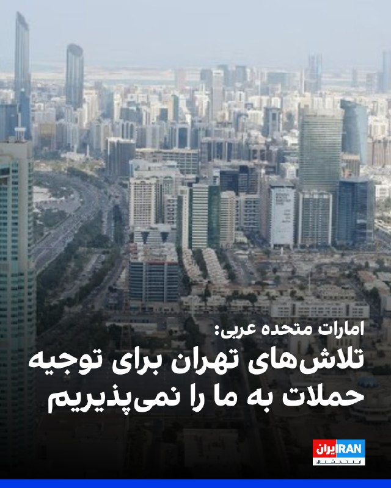

امارات متحده عربی اعلام کرد که اظهارات جمهوری اسلامی و تلاش‌هایش برای توجیه حملات علیه امارات متحده عربی را نمی‌پذیرد و تاکید کرد فشارهای تهران تاثیری بر مواضع ابوظبی نخواهد داشت.

پیش‌تر عباس عراقچی، وزیر خارجه جمهوری اسلامی گفته بود: «اماراتی‌ها اجازه دادند از سرزمین‌شان برای شلیک توپخانه و تجهیزات علیه ما استفاده شود.»
https://iranintl.com/202605151790

## IranIntlTV — post 337332

  

محمدنبی موسوی‌فرد، امام جمعه اهواز گفت: «در حال حاضر جمهوری اسلامی شرایطی برای آمریکا ایجاد کرده که نه راه پس دارد و نه راه پیش؛ دشمن باید بداند جمهوری اسلامی کاری کرده است که هیچ راه‌حل نظامی نمی‌تواند از عزت و اقتدار دفاعی و نظامی ما بکاهد.»

او ادامه داد: «نیروهای مسلح و بسیج نیز مانند گذشته، آمادگی کامل و کوبنده‌ای برای برخورد قاطع با هرگونه تجاوز دشمن را دارند.»
https://iranintl.com/202605158432

## IranIntlTV — post 337331

  <a href="telegram/content/IranIntlTV_337331_1778857620.mp4">🎬 Download video</a>

یک شهروند در پیام ارسالی خود به ایران اینترنشنال با اشاره به افزایش شدید قیمت داروها گفت که هزینه گچ گرفتن پای شکسته‌اش ۹ میلیون تومان شده است. پیام این مخاطب با هوش مصنوعی خوانده شده است.

## IranIntlTV — post 337330

  

رییس‌کل دادگستری خراسان جنوبی اعلام کرد یک وکیل دادگستری در بیرجند در جریان اختلاف خانوادگی جان باخته است.

او گفت این وکیل زن پس از آن‌که همسرش با خودرو او را زیر گرفت، جان خود را از دست داد و پرونده این حادثه برای رسیدگی ویژه در دستگاه قضایی در حال بررسی است.

به گفته این مقام قضایی، متهم خود را به قوه قضاییه معرفی کرده است.
https://iranintl.com/202605153493

## IranIntlTV — post 337329

  <a href="telegram/content/IranIntlTV_337329_1778857622.mp4">🎬 Download video</a>

دونالد ترامپ پس از دیدار با رییس‌جمهوری چین گفت پکن و واشینگتن توافق دارند که ایران هرگز نباید به سلاح هسته‌ای دست پیدا کند و تنگه هرمز باید باز بماند. او همچنین تاکید کرد دو کشور مسائلی را حل‌وفصل کرده‌اند که دیگران قادر به حل آن نبودند.
جزییات بیشتر با مریم رحمتی، عضو تحریریه ایران‌اینترنشنال
@iranintltv

## IranIntlTV — post 337328

  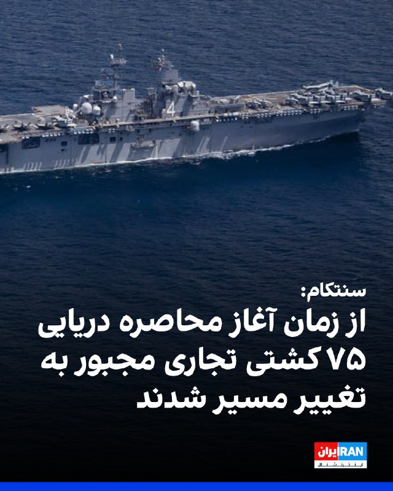

سنتکام اعلام کرد از زمان آغاز محاصره دریایی بنادر و سواحل جنوب ایران، ۷۵ کشتی تجاری مجبور به تغییر مسیر شده‌اند و چهار کشتی نیز در پی حمله نیروهای آمریکا از کار افتاده‌اند.

پیش از این، سنتکام با انتشار تصویری از گشت‌زنی یک جنگنده پنهان‌کار اف-۳۵-ای نیروی هوایی بر فراز آب‌های منطقه‌ای نزدیک تنگه هرمز خبر داد.
https://iranintl.com/202605150606

## IranIntlTV — post 337327

  

مجتبی خامنه‌ای در پیامی منتسب به او به مناسبت روز پاسداشت زبان فارسی و بزرگداشت فردوسی، زبان فارسی را یکی از پایه‌های هویت ایرانیان توصیف کرد و گفت تقویت این زبان می‌تواند به گسترش «تمدن ایرانی‌اسلامی» کمک کند.
او همچنین با اشاره به شاهنامه، از آن به‌عنوان اثری برای حفظ هویت، استقلال و ایستادگی ایرانیان یاد کرد.
در بخشی از این پیام نوشته شده: «داستانهای اسطوره‌ای فردوسی، واقعیت زندگی و شخصیت قهرمانانه‌ آنان بوده و مفاهیم انسان‌ساز، سلحشورانه، و قرآنی شاهنامه، همه‌ اقوام و اقشار ایران را در حفظ هویت، اصالت و استقلال خود و مبارزه با ضحاک‌وشان متجاوز، همدل و همراه و همساز می کند.»
https://iranintl.com/202605152075

## IranIntlTV — post 337326

🗣روایت شما از بحران اقتصادی و زندگی در آتش‌بس- جمعه ۲۵ اردیبهشت:

🔹برای پایان‌نامه مجبور شدم اینترنت پرو بخرم، با مالیاتش شد ۲ میلیون و ۱۷۰ هزار تومان. قبلش هم اشتراک چت‌جی‌پی‌تی و سامانه «شکن» را گرفته بودم ولی جوابگو نبود. چند میلیون باید برای چیزی هزینه کنی که حقته اما ازت گرفتنش.

🔹 از زمان شروع جنگ تا الان قطعی اینترنت کلی هزینه اضافی رو دستمون گذاشته. ۱۰ گیگ یک ماهه خریدم، ولی ظرف دو هفته تمام شد.

🔹 من اختلال دوقطبی دارم و باید دارو مصرف گنم اما داروهای اعصاب و روان به‌شدت گران و نایاب شده و این موضوع من را به‌شدت نگران کرده، چون تاثیر بدی در روند درمانم دارد.

🔹 مغازه‌ام در پاساژ ارغوان بود که ۱۵ اردیبهشت سوخت و هیچی ازش نموند. حکومت تلاشی برای خاموش کردن آتش نکرد. من و کسبه ارغوان از کجا می‌خواهیم الان کار کنیم، جنس بخریم و تو این وضعیت خرج خونه دربیاریم؟

🔹 من یک زن ۲۵ ساله هستم. سال‌ها امیدم این بود که یک روز مهاجرت می‌کنم و برای همان تلاش کردم. الان با این وضعیت که آیلتس دیگر در ایران برگزار نمی‌شود، اینترنت قطع شده و همه‌چیز ۱۰ برابر گران‌تر شده، حتی نمی‌دانم دیگر به چه آینده‌ای دل ببندم. تمام آرزوهایی که داشتم یکی‌یکی ازم گرفته شدند و الان فقط به این فکر می‌کنم که هفته بعد چطور پولم را نگه دارم که به آخر ماه برسد و چطور قسطی دستمال کاغذی و گوشت و روغن بخرم.

🔹 گناه ما چیست که نمی‌توانیم مثل بقیه آدم‌های این دنیا یک زندگی عادی داشته باشیم؟ برای خوشبختی‌های ساده باید فقط از تخیلاتمان استفاده کنیم. تمام دوستام کارشان با اینترنت بود و الان کارشان را از دست دادند و همه اطرافیانم فقط منتظرند ببینند «چی می‌شه». تا کی باید در این برزخ زندگی کنیم؟

## IranIntlTV — post 337325

  

دونالد ترامپ گفت آمریکا ممکن است در مقطعی برای حذف آنچه «گرد و غبار هسته‌ای» نامید وارد ایران شود. ترامپ در مسیر بازگشت به آمریکا و در هواپیمای ریاست‌جمهوری، ایر فورس وان، به خبرنگاران گفت: «در زمان مناسب، یا وارد می‌شویم یا آن را به دست می‌آوریم. فکر می‌کنم احتمالا آن را به دست می‌آوریم، اما اگر به دست نیاوریم، وارد خواهیم شد.»

او افزود: «فکر می‌کنم آنها کاملا شکست خواهند خورد و ما هیچ خطری نخواهیم داشت. ما تجهیزات لازم برای خارج کردن آن را داریم، هیچ‌کس دیگر ندارد؛ شاید چین چنین تجهیزاتی داشته باشد.»

ترامپ پیش‌تر نیز در ماه مارس در کاخ سفید درباره ذخایر اورانیوم غنی‌شده جمهوری اسلامی هشدار مشابهی داده و گفته بود: «یا آن را از آنها پس می‌گیریم یا آن را برمی‌داریم.»
https://iranintl.com/202605154083

## IranIntlTV — post 337324

  

احمد علم‌الهدی، امام جمعه مشهد گفت: «آمریکا اگر بخواهد جنگ را ادامه بدهد، قطعا شکست بیشتری عاید او می‌شود، چون امروز قدرت و توان ما با روز اول جنگ خیلی تفاوت دارد، اگرچه ما در روز اول جنگ کمی غافلگیر شدیم اما اکنون رزمندگان ما آماده‌تر شدند و مسلما شکست آمریکا از اول بیشتر خواهد بود و کمتر نیست.»

او افزود: «در این جنگ ثابت شد که پدافند آمریکایی اصلا کارآمد نیست و حتی نتوانست یکی از موشک‌های ما را رهگیری کند، موشک‌های ما نیز با موفقیت به محل مورد نظر اصابت می‌کرد.»

او ادامه داد: «رزمندگان ما توانستند یک ابرقدرت روی کره زمین را به زانو درآورند و از مقام ابرقدرتی ساقط کنند.»
https://iranintl.com/202605151888

## IranIntlTV — post 337323

  <a href="telegram/content/IranIntlTV_337323_1778857626.mp4">🎬 Download video</a>

یک شهروند از اراک با ارسال ویدیویی به ایران اینترنشنال می‌گوید یک بسته حاوی سه تکه مرغ که سال گذشته حدود ۳۰۰ تا ۴۰۰ هزار تومان خریداری می‌کرده را ۲۵ اردیبهشت به قیمت یک میلیون و ۲۰۰ هزار تومان خریده است.

## IranIntlTV — post 337322

  <a href="telegram/content/IranIntlTV_337322_1778857627.mp4">🎬 Download video</a>

دونالد ترامپ گفت تعلیق ۲۰ ساله غنی‌سازی اورانیوم در ایران مدنظر است و از هم‌نظری چین با آمریکا درباره برنامه هسته‌ای جمهوری اسلامی سخن گفت. همزمان عباس عراقچی تاکید کرد تهران درباره پرونده هسته‌ای مذاکره نخواهد کرد.
گفت‌وگو با امید شمس، حقوق‌دان و تحلیل‌گر امور بین‌الملل
@iranintltv

## IranIntlTV — post 337321

  <a href="telegram/content/IranIntlTV_337321_1778857629.mp4">🎬 Download video</a>

وزارت امور خارجه ایالات متحده اعلام کرد دومین روز از دور تازه گفت‌وگوها میان نمایندگان لبنان و اسرائیل در ساختمان این وزارتخانه در واشینگتن برگزار می‌شود و فضای مذاکرات «مثبت و سازنده» ارزیابی شده‌ است.
می فرحات، خبرنگار ایران‌اینترنشنال، گزارش می‌دهد
@iranintltv

## IranIntlTV — post 337320

  <a href="telegram/content/IranIntlTV_337320_1778857630.mp4">🎬 Download video</a>

فیلم «داستان‌های موازی» ساخته اصغر فرهادی که در بخش مسابقه جشنواره فیلم کن به نمایش درآمد، روایتگر داستان نویسنده‌ای است که برای الهام گرفتن، زندگی همسایه‌های خانه روبه‌رویی را زیر نظر می‌گیرد. او برای پیشبرد کارش دستیاری استخدام می‌کند، اما ورود این دستیار، مسیر روایت و زندگی شخصیت‌های فیلم را دستخوش تغییر می‌کند.

لی‌لی نیکفر، خبرنگار ایران‌اینترنشنال، گزارش می‌دهد
@iranintltv

## IranIntlTV — post 337319

  

فریدریش مرتس، صدراعظم آلمان، روز جمعه اعلام کرد پس از سفر دونالد ترامپ به چین با او تماس تلفنی داشته و دو طرف درباره ضرورت بازگشت جمهوری اسلامی به میز مذاکره توافق کرده‌اند.

مرتس گفت در این گفت‌وگو تاکید شده است که جمهوری اسلامی باید تنگه هرمز را باز کند و نباید اجازه داده شود به سلاح هسته‌ای دست یابد.

صدراعظم آلمان در پیام‌هایی در شبکه ایکس افزود او و ترامپ همچنین درباره دستیابی به راه‌حل مسالمت‌آمیز برای اوکراین گفت‌وگو کرده و پیش از نشست ناتو در آنکارا مواضع خود را هماهنگ کرده‌اند.

او تاکید کرد ایالات متحده و آلمان شریکانی قدرتمند در چارچوب ناتوی قدرتمند هستند.
https://iranintl.com/202605158703

## IranIntlTV — post 337318

🗣روایت شما از بحران اقتصادی و زندگی در آتش‌بس- جمعه ۲۵ اردیبهشت:

🔹در وضعیت بدی قرار داریم اما در حال حاضر کاری از دست ما برنمیاد جز صبور بودن و منتظر زمان درست بودن. با این سفره‌های خالی و جنایات انقلاب شیر و خورشید، مردم از قبل بیشتر عصبانی شده‌اند و این عصبانیت یک روزی از یک جایی بیرون خواهد زد.

🔹از اصفهان پیام می‌دم من یه جوان ۲۵ ساله‌ام با شغل فنی که دیگه امیدی به آینده‌م ندارم. هر چقدر بیشتر کار می‌کنم کمتر درآمد دارم. با وام و قرض گرفتن ابزار کار خریدم که کار کنم ولی الان ۳ ماهه که بیکارم. فکر کنم تا چند وقت دیگه یا باید برم زندان یا متواری بشم.

🔹مردم از بی اینترنتی خسته شدن، قیمت کانفیگ‌ها بسیار بالاست. گرونی بی‌داد می‌کنه. یک نوشابه ۱.۵ لیتری ۱۱۰ هزار تومانه، لیوان یک بار مصرف به‌شدت گران شده.

🔹ما کشاورزیم، اوضاع برامون خیلی سخت شده، قیمت یک کیسه کود شیمیایی فسفات به ۱۰ میلیون تومان رسیده.

🔹برای اکثر معلولان ماهیانه تنها دو میلیون و ۱۰۰ هزار تومان به عنوان مستمری یا کمک مالی واریز می‌شه که برای تهیه ارزان‌ترین غذا (تخم‌مرغ) هم کافی نیست.

🔹در ایلام اوضاع خیلی خیلی خرابه. اگه در همه شهرها گرونی و کمبود خیلی چیزا هست اما این‌جا وضعیت در حد سونامی و انفجاره. کرایه خونه تو ایلام ۱۲۰ برابر شده. صاحبخونه ۱۰ روز بهم فرصت داده خونه رو خالی کنم اما جایی رو پیدا نمی‌کنم.

🔹یک قوطی رنگ روغن اول اردیبهشت در مشهد ۴۰۰ هزار تومان بود امروز شده ۶۵۰ هزار تومان.

## Shin_Persian — post 6014

  <a href="telegram/content/Shin_Persian_6014_1778857633.mp4">🎬 Download video</a>

Rapid Response 47 ✓ @RapidResponse47 Fri, 15 May 2026 14:28:16 UTC .@POTUS says he discussed Taiwan and Iran with President Xi: "He does not want to see a fight for independence... I didn’t make a comment on it... on Iran, it’s very interesting. He feels…

## Shin_Persian — post 6013

Rapid Response 47 ✓ @RapidResponse47
Fri, 15 May 2026 14:28:16 UTC

.@POTUS says he discussed Taiwan and Iran with President Xi: "He does not want to see a fight for independence... I didn’t make a comment on it... on Iran, it’s very interesting. He feels strongly they can’t have a nuclear weapon... and he wants them to open up the strait."

فارسی

.@POTUS می‌گوید که با رئیس‌جمهور شی در مورد تایوان و ایران گفتگو کرده است: «او نمی‌خواهد شاهد جنگی برای استقلال باشد... من در این مورد نظری ندادم... درباره ایران، موضوع بسیار جالب است. او با قدرت احساس می‌کند که آنها نباید سلاح هسته‌ای داشته باشند... و او می‌خواهد که آنها تنگه را باز کنند.»

𝕏 · @shin_persian

## Shin_Persian — post 6012

  <a href="telegram/content/Shin_Persian_6012_1778857634.mp4">🎬 Download video</a>

Rapid Response 47 ✓ @RapidResponse47
Fri, 15 May 2026 14:22:14 UTC

.@POTUS on Iran's latest proposal: "I looked at it, and if I don't like the first sentence, I just throw it away... if they have any nuclear of any form, I don't read the rest of their letter."

فارسی

.@POTUS درباره آخرین پیشنهاد ایران: «نگاهی به آن انداختم، و اگر از جمله اول خوشم نیاید، فقط آن را دور می‌اندازم... اگر آن‌ها هر شکلی از [توانمندی] هسته‌ای داشته باشند، بقیه نامه‌شان را نمی‌خوانم.»

𝕏 · @shin_persian

## Shin_Persian — post 6011

📦 mhrv-rs v1.9.26 released

• Optimize Full mode Apps Script by batching Edge-DNS cache lookups (PR #958)
• The safe fallback behavior is preserved

Files (Android APKs, Windows, macOS, Linux, OpenWRT) on the files channel:

👉 v1.9.26 — all files with SHA-256

Channel:
https://t.me/mhrv_rs
or: https://t.me/+R1OyoHX2boA1ZDgx

#v1926

## ManotoTV — post 105491

  <a href="telegram/content/ManotoTV_105491_1778857637.mp4">🎬 Download video</a>

‌
وانگ یی، وزیر خارجه چین، گفت پکن معتقد است حل بحران تنگه هرمز در گرو دستیابی به «آتش‌بسی دائمی و جامع» میان آمریکا و جمهوری اسلامی است.

به گزارش خبرگزاری شینهوا، وانگ یی گفت رئیس‌جمهور چین در گفت‌وگو با دونالد ترامپ تأکید کرده که «زور نمی‌تواند مشکلات را حل کند و گفت‌وگو تنها مسیر درست است.»

وزیر خارجه چین افزود: «مذاکرات یک‌شبه به نتیجه نمی‌رسد، اما وقتی درِ گفت‌وگو باز شد، نباید دوباره بسته شود.»

او همچنین گفت چین برای پیشبرد مذاکرات صلح تلاش کرده و به ایفای نقش خود برای پایان سریع درگیری‌ها و بازگشت ثبات به خاورمیانه ادامه خواهد داد.

## ManotoTV — post 105490

  <a href="telegram/content/ManotoTV_105490_1778857637.mp4">🎬 Download video</a>

‌
کریس رایت، وزیر انرژی آمریکا، گفت به‌دلیل جنگ و تنش‌ها در خلیج فارس، چین احتمالاً خرید نفت از آمریکا را افزایش خواهد داد.

او در گفت‌وگو با سی‌ان‌بی‌سی گفت: «فکر می‌کنم چین به خرید مقادیر بیشتری از نفت آمریکا ادامه خواهد داد.»

رایت همچنین گفت جهان نیاز دارد تنگه هرمز دوباره به‌طور کامل باز شود و افزود: «تلاش ایران برای گروگان گرفتن جهان، موقتی است.»

وزیر انرژی آمریکا در پاسخ به این پرسش که بازگشت شرایط به وضعیت عادی چقدر زمان می‌برد، گفت: «بخش زیادی از آن به ایران بستگی دارد.»

او افزود: «به هر شکلی، برنامه هسته‌ای ایران پایان خواهد یافت و عبور آزادانه کشتی‌ها از تنگه هرمز برقرار خواهد شد. این می‌تواند در صورت توافق با ایران، نسبتاً سریع رخ دهد.»

## ManotoTV — post 105489

  <a href="telegram/content/ManotoTV_105489_1778857638.mp4">🎬 Download video</a>

عباس عراقچی، وزیر خارجه جمهوری اسلامی، با انتشار تصویری از دیدار با سابرامانیام جایشانکار، وزیر خارجه هند، در شبکه اِکس نوشت: «ایران همواره وظیفه تاریخی خود به‌عنوان حافظ امنیت در تنگه هرمز» را انجام خواهد داد.

عراقچی افزود در گفت‌وگویی «سازنده» با همتای هندی خود، درباره تحولات منطقه گفت‌وگو کرده و مدعی شد جمهوری اسلامی «شریکی قابل اعتماد برای همه کشورهای دوست» است و این کشورها می‌توانند به امنیت تجارت و کشتیرانی اعتماد کنند.

## ManotoTV — post 105488

  <a href="telegram/content/ManotoTV_105488_1778857638.mp4">🎬 Download video</a>

سازمان اطلاعات مرکزی آمریکا با انتشار تصاویری از هاوانا، حضور جان رتکلیف، رئیس این سازمان، در پایتخت کوبا را تایید کرد.

بر اساس گزارش فوربس مکزیک، رتکلیف در جریان این سفر با مقام‌های ارشد دولت کوبا دیدار کرد. این رسانه نوشت گفت‌وگوها درباره همکاری‌های اطلاعاتی، امنیت منطقه‌ای و وضعیت اقتصادی کوبا انجام شده است.

به نوشته فوربس مکزیک، رئیس سیا برای گفت‌وگوهای مستقیم با مقام‌های وزارت کشور کوبا و مسئولان نهادهای اطلاعاتی این کشور به هاوانا رفت. این گزارش، دیدار رتکلیف با مقام‌های کوبایی را نشستی کم‌سابقه در سطح بالا میان دو کشور توصیف کرده است.

در این گزارش آمده است که در جریان این سفر، رتکلیف با رائول رودریگز کاسترو، نوه رائول کاسترو و مشاور امنیتی، و همچنین لازارو آلوارز کاساس، وزیر کشور کوبا، دیدار کرد.

## ManotoTV — post 105487

  <a href="telegram/content/ManotoTV_105487_1778857638.mp4">🎬 Download video</a>

«جمهوری اسلامی قصد کشتن فاطمه سپهری را دارد»

## ManotoTV — post 105486

  <a href="telegram/content/ManotoTV_105486_1778857640.mp4">🎬 Download video</a>

«صدای بانو سپهری باشیم»

## ManotoTV — post 105485

  <a href="telegram/content/ManotoTV_105485_1778857641.mp4">🎬 Download video</a>

دونالد ترامپ در پاسخ به پرسشی درباره حمله به یک مدرسه دخترانه در روز نخست جنگ گفت این موضوع «در دست بررسی» است.

خبرنگاری از ترامپ پرسید که سنتکام روز گذشته درباره حمله به مدرسه دخترانه در روز اول جنگ مورد پرسش قرار گرفته بود. ترامپ در پاسخ گفت: «این در دست بررسی است.» او افزود چند موضوع دیگر نیز در دست بررسی قرار دارد، اما تاکید کرد که این مورد هم جزو پرونده‌های در حال بررسی است.

در ادامه، خبرنگار پرسید آیا امکان دریافت اطلاعات بیشتر درباره این موضوع وجود دارد و اشاره کرد که این حمله با یک واحد موشکی آمریکایی مرتبط بوده است.

ترامپ در پاسخ وارد موضوع بی‌بی‌سی شد و این رسانه را به جعل گفته‌هایش متهم کرد. او گفت بی‌بی‌سی «حرف‌های بدی» در دهان او گذاشته و بعد ناچار شده بپذیرد که آن گفته‌ها درست نبوده است.

## ManotoTV — post 105484

  <a href="telegram/content/ManotoTV_105484_1778857642.mp4">🎬 Download video</a>

وزارت خارجه آمریکا اعلام کرد این کشور در عملیاتی محرمانه، حدود ۱۳ و نیم کیلوگرم اورانیوم غنی‌شده را از یک رآکتور تحقیقاتی تعطیل‌شده در ونزوئلا خارج کرده است.

بر اساس اعلام وزارت خارجه آمریکا، این عملیات به رهبری واشینگتن و با همکاری شرکای بین‌المللی انجام شد و هدف آن کاهش خطر سوءاستفاده از مواد هسته‌ای و تقویت امنیت هسته‌ای عنوان شده است.

اداره ملی امنیت هسته‌ای آمریکا، وابسته به وزارت انرژی، نیز اعلام کرده است همه اورانیوم غنی‌شده باقی‌مانده از یک رآکتور تحقیقاتی قدیمی در ونزوئلا خارج شده است. این نهاد گفت این عملیات در چند ماه انجام شد، در حالی که در شرایط عادی ممکن بود سال‌ها طول بکشد.

## FarsiVOA — post 217821

  

به گفته فرماندهی مرکزی ایالات متحده، سنتکام، نیروهای آمریکایی در چارچوب اجرای محاصره دریایی علیه جمهوری اسلامی ایران تاکنون مسیر ۷۵ کشتی تجاری را تغییر داده و چهار شناور را از کار انداخته‌اند.

سنتکام تصویر یک بالگرد سی‌هاوک که از عرشه ناوشکن «یو‌اس‌اس رافائل پرالتا» در دریای عرب به پرواز درآمده را منتشر کرده است.

@FarsiVOA

## FarsiVOA — post 217820

دونالد ترامپ، رئیس‌جمهوری آمریکا، که پس از یک سفر سه‌روزه پکن را به مقصد واشنگتن ترک کرد، از پیشرفت‌های تجاری میان دو کشور خبر داده است

## FarsiVOA — post 217819

🔺ترامپ: با تعلیق ۲۰ ساله برنامه هسته‌ای ایران موافقم، «اگر یک تعهد واقعی باشد»

▪️پرزیدنت ترامپ با غیرقابل قبول خواندن تازه‌ترین پیشنهاد رژیم ایران، اشاره کرد که تعلیق ۲۰ساله، به شرط این که واقعا ۲۰ سال تضمین شده باشد، کافی است.

⬇️ بیشتر بخوانید:

https://ir.voanews.com/a/8150374.html/?nocach=1

## FarsiVOA — post 217818

  <a href="telegram/content/FarsiVOA_217818_1778857643.mp4">🎬 Download video</a>

جنگنده‌های اف-۱۶ امارات متحده عربی، هواپیمای حامل نارندرا مودی، نخست‌وزیر هند، را هنگام عبور از حریم هوایی امارات اسکورت کردند.

@FarsiVOA

## FarsiVOA — post 217817

  <a href="telegram/content/FarsiVOA_217817_1778857643.mp4">🎬 Download video</a>

تصاویر منتشرشده در شبکه‌های اجتماعی، لحظه وقوع حمله هوایی اسرائیل به منطقه العباسیه در شهرستان صور در جنوب لبنان را نشان می‌دهد.

@FarsiVOA

## DW_Farsi — post 124730

  <a href="telegram/content/DW_Farsi_124730_1778857644.mp4">🎬 Download video</a>

🎥 مدیر انویدیا در خیابان‌های پکن نودل خورد

پس از حواشی حضور ایلان ماسک در پکن، حالا ویدیوهایی از "جن سن هوانگ"، مدیر انویدیا منتشر شده که او را در خیابان‌های پکن در حال نودل‌ خوردن نشان می‌دهد.
@dw_farsi

## DW_Farsi — post 124729

  <a href="telegram/content/DW_Farsi_124729_1778857645.mp4">🎬 Download video</a>

🎥 هانتاویروس تکرار تجربه کووید-۱۹ است؟

با افزایش نگرانی‌ها درباره هانتاویروس، این پرسش مطرح شده که آیا ممکن است این ویروس نیز مانند کووید-۱۹ به یک پاندمی جهانی تبدیل شود.
 متخصصان تاکید می‌کنند که نحوه انتقال این بیماری بسیار محدودتر از کروناست و برای ابتلا نیاز به تماس نزدیک و طولانی‌مدت وجود دارد.
به همین دلیل، احتمال گسترش جهانی آن در حد کووید-۱۹ بسیار پایین ارزیابی می‌شود.
@dw_farsi

## DW_Farsi — post 124728

🔶 روسیه از "رهگیری ۳۵۵ پهپاد اوکراینی" خبر داد

رسانه‌های روسی و مقام‌های رسمی این کشور اعلام کردند ارتش روسیه در طول شامگاه پنجشنبه ۱۴ مه (۲۴ اردیبهشت) ۳۵۵ پهپاد اوکراینی را "رهگیری و منهدم" کرده است.

به گفته مسکو، این حملات به مناطق بلگورود، بریانسک و کورسک در نزدیکی مرز اوکراین صورت گرفته بود.

بنا بر اظهارات پاول مالکوف، فرماندار منطقه،در شهر ریازان در مرکز روسیه، سه نفر کشته و ۱۲ نفر دیگر زخمی شدند. او همچنین گفت دو ساختمان مسکونی و یک واحد صنعتی آسیب دیده‌اند.

بر اساس گزارش‌های منتشرشده در کانال‌های تلگرامی، این واحد صنعتی پالایشگاه ریازان بوده است؛ پالایشگاهی که از آن به‌عنوان سومین پالایشگاه بزرگ روسیه یاد می‌شود. در این گزارش‌ها از مشاهده آتش‌سوزی گسترده در محل هم سخن گفته شده است.

این حمله پس از یکی از طولانی‌ترین و شدیدترین حملات هوایی روسیه به اوکراین انجام شد. در کی‌یف، نیروهای امدادی تا صبح جمعه ۱۵ مه (۲۵ اردیبهشت) پیکر ۲۴ کشته را از زیر آوار یک ساختمان مسکونی بیرون آوردند که سه کودک نیز در میان آنها بودند.

در پایتخت اوکراین یک روز عزای عمومی اعلام شد و ولودیمیر زلنسکی به ارتش کشورش دستور داد برای این تلافی این حمله، برنامه‌ریزی‌های لازم را انجام دهد.

اوکراین در هفته‌های اخیر حملات خود به پالایشگاه‌ها، انبارهای نفت و بنادر روسیه را افزایش داده و می‌گوید هدف از این حملات، "تضعیف مهم‌ترین منبع درآمد مسکو برای ادامه جنگ" است.

با این حال، شمار دقیق کشته‌ها، زخمی‌ها و همچنین تعداد واقعی پهپادهای به‌کاررفته و سرنگون‌شده به‌طور مستقل قابل راستی‌آزمایی نیست.

از مناطق اطراف کی‌یف و دیگر شهرهای اوکراین نیز گزارش‌هایی از خسارات و تلفات انسانی منتشر شده است. مناطق خارکیف، اودسا و سومی نیز هدف گلوله‌باران شدید قرار گرفتند.

به گفته اولکسی کولبا، معاون نخست‌وزیر اوکراین در اودسا بنادر و تأسیسات راه‌آهن از جمله اهداف حملات روسیه بودند.

به گفته زلنسکی، در شهر خرسون یک خودروی متعلق به دفتر هماهنگی امور بشردوستانه سازمان ملل با پهپاد هدف قرار گرفت. او تصویری از یک خودروی آسیب‌دیده با نشان سازمان ملل را منتشر کرد. با این حال، گزارشی از مجروح شدن کسی منتشر نشده است. روسیه تاکنون واکنشی به این مسئله نشان نداده است.

در طول روز پنج‌شنبه ۱۴ مه نیز ارتش روسیه حملات پهپادی علیه اوکراین انجام داد؛ حملاتی که در طول روز نسبتاً غیرمعمول محسوب می‌شوند. بنا بر اعلام اوکراین، دست‌کم شش نفر در این حملات کشته و ده‌ها نفر زخمی شدند.

حملات شدید روسیه پس از سه روز آتش‌بس شکننده از شنبه تا دوشنبه انجام شد. به نظر می‌رسد روسیه می‌خواهد پیش از مذاکرات احتمالی بعدی، فشار بر اوکراین را افزایش دهد.

گفت‌وگوهای طرفین با میانجی‌گری آمریکا برای پایان دادن به جنگ تاکنون به نتیجه‌ای نرسیده‌اند. همچنین جنگ آمریکا علیه ایران از اواخر فوریه، روند این مذاکرات را بیش از پیش دچار وقفه کرده است.
@dw_farsi

## DW_Farsi — post 124727

🔶 حکایت "گوسالە طلایی"؛ ترامپ از کردها چه می‌خواهد؟

🔻گزارشی از امید برین

دونالد ترامپ در هفته‌های گذشته بارها کردها را متهم کرد که سلاح‌های ارسالی آمریکا برای معترضان داخل ایران را نگه داشته و تحویل نداده‌اند.
دویچه وله فارسی در این‌باره با رهبران احزاب کرد و تحلیل‌گران کرد مصاحبه کرده است.
دونالد ترامپ، رئیس‌جمهور ایالات متحده در هفته‌های گذشته بار دیگر در اظهاراتی جنجالی "کردها" را متهم کرده که سلاح‌های ارسالی آمریکا برای معترضان داخل ایران را نگه داشته و تحویل نداده‌اند.

او در گفته‌هایش مشخص نمی‌کند که سلاح‌های مورد ادعای او تحویل چه حزب و نهادی داده شده است. همین مسئله به بحث‌های زیادی دامن زده است.

در همین حال گفته‌های او اعتراضات بسیاری را از سوی جامعه سیاسی کردها در کشورهای مختلف از جمله در ایران و حتی در منطقه به دنبال داشته است.

دویچه وله فارسی برای بررسی این ادعا و ارزیابی نقش کردها در تحولات ایران، مصاحبه‌هایی با چند تن از رهبران و تحلیل‌گران کرد انجام داده است.

بسیاری از احزاب و نهادهای کرد، ضمن رد گفته‌های ترامپ آماده به صحبت در این‌باره نیستند.

منابعی از حزب کارگران کردستان (پ.ک.ک)، شاخص‌ترین تشکل سیاسی - نظامی کردهای ترکیه، حزب اتحاد دموکراتیک، بزرگترین تشکل سیاسی کردهای سوریه و همچنین حزب دمکرات کردستان عراق و اتحادیه میهنی کردستان که حکومت اقلیم کردستان را در کنترل دارند، در گفت‌وگوهای جداگانه با دویچه ولە فارسی گفته‌های ترامپ را رد و نامسئولانه خواندند.

همه این احزاب و سازمان‌ها دریافت هرگونه اسلحه از آمریکا به منظور ارسال آن‌ها "به معترضان ایرانی" را رد می‌کنند.

احزاب و سازمان‌های کردستان ایران نیز از پیش در بیانیه‌های جداگانه این موضوع را رد کرده‌اند.

دویچه وله فارسی به منظور کنکاش بیشتر درباره این موضوع با فریبا محمدی، معاون دبیرکل حزب کومله زحمتکشان کردستان، ادیب وطندوست، عضو کمیته مرکزی کومله، سازمان کردستان حزب کمونیست ایران، مصطفی مولودی، معاون دبیرکل حزب دمکرات کردستان ایران، کمال چومانی، سردبیر نشریه آمارگی و دکتر کامران متین دانشیار روابط بین‌الملل دانشگاه ساسکس گفت‌وگو کرده است.

فریبا محمدی در گفت‌وگو با دویچه ولە فارسی با تأکید بر موضع رسمی احزاب کرد، ادعای ترامپ را رد کرد و گفت: «ما پیش‌تر نیز این ادعاها را به‌طور رسمی رد کرده‌ایم. در واقع تقریباً تمامی احزاب و جریان‌های سیاسی کردستان این موضوع را تکذیب کرده‌اند. هرگز چنین سلاح‌هایی به دست احزاب و نیروهای سیاسی کرد نرسیده است.»

متن کامل گزارش را در وب سایت دویچه وله فارسی بخوانید.
@dw_farsi

## DW_Farsi — post 124726

  <a href="telegram/content/DW_Farsi_124726_1778857646.mp4">🎬 Download video</a>

🎥 چرا جنگ ایران اتوبان‌های آلمان را تهدید می‌کند؟

با بالا گرفتن تنش‌ها و جهش قیمت جهانی نفت، پروژه‌های جاده‌سازی در آلمان با بحران تازه‌ای روبه‌رو شده‌اند؛ زیرا قیر، ماده اصلی آسفالت اتوبان‌ها، به‌دلیل افزایش بهای نفت به‌شدت گران شده است.
@dw_farsi

## Persian_Trend_Official — post 14195

  

بیا تا جهان را به بد نسپریم
به کوشش همه دست نیکی بریم
نباشد همی نیک و بد پایدار
همان به که نیکی بود یادگار

🔹امروز روز گرامیداشت حکیم ابولقاسم فردوسی و پاسداشت زبان فارسی است

🫆:Tony

📌 @persian_trend_official
پرشین ترند | متفاوت‌ترین کانال نظامی

## Persian_Trend_Official — post 14194

  

💢ترامپ:

💢چین یک سالن رقص دارد، و آمریکا هم باید داشته باشد!

💢این سالن در حال ساخت است، جلوتر از برنامه زمان‌بندی، و بهترین مرکز از نوع خود در سراسر آمریکا خواهد بود. از تمام حمایت‌هایی که برای پیشبرد این پروژه دریافت کرده‌ام، سپاسگزارم. افتتاح برنامه‌ریزی شده حدود سپتامبر ۲۰۲۸ خواهد بود.

💢مردی که با او قدم می‌زنم، رئیس‌جمهور شی، از چین، یکی از رهبران بزرگ جهان است!

🫆:Tony

📌 @persian_trend_official
پرشین ترند | متفاوت‌ترین کانال نظامی

## Persian_Trend_Official — post 14193

  <a href="telegram/content/Persian_Trend_Official_14193_1778857649.mp4">🎬 Download video</a>

#طنز_تلخ

روش تضمینی پولدار شدن. ✅️

پ.ن: صداش رو در نیارید که الان دلار 1,800,000 ریال هست. 🤫🗿

📝 Nick

📌 @persian_trend_official
پرشین ترند | متفاوت‌ترین کانال نظامی

## Persian_Trend_Official — post 14192

  <a href="telegram/content/Persian_Trend_Official_14192_1778857650.mp4">🎬 Download video</a>

🔴ترامپ در پاسخ به گفتگو در مورد حملات سایبری با شی جین پینگ پاسخ داد :

💢آره، بهش گفتم . اونم شروع کرد درباره کارایی که ما تو چین کردیم حرف زد

💢خب میدونی ، هرکاری اونا بکنن ماهم میکنیم . ماهم ازشون جاسوسی میکنیم .

💢بهش گفتم ما یه عالمه کارها علیه شما میکنیم که اصلا خبر ندارین

پ ن : نخود در دهن ترامپ خیس نمیخورد ...

🫆:Tony

📌 @persian_trend_official
پرشین ترند | متفاوت‌ترین کانال نظامی

## Persian_Trend_Official — post 14191

🔴 صدراعظم آلمان: ایران باید فوراً به میز مذاکره بازگردد

💢فریدریش مرتس، صدراعظم آلمان، اعلام کرد در مسیر بازگشت از چین با دونالد ترامپ گفت‌وگوی تلفنی داشته است.

💢مرتس گفت:

▪️ او و ترامپ توافق دارند ایران باید فوراً به مذاکرات بازگردد
▪️ ایران نباید به سلاح هسته‌ای دست پیدا کند
▪️ تهران باید تنگه هرمز را باز کند

💢این اظهارات در حالی مطرح می‌شود که عباس عراقچی، وزیر خارجه ایران، پیش‌تر گفته بود تنگه هرمز برای کشورهای «دوست» باز است؛ مشروط به هماهنگی با مقام‌های ایرانی، اما این موضوع شامل کشورهای «دشمن» نمی‌شود.

🫆:Tony

📌 @persian_trend_official
پرشین ترند | متفاوت‌ترین کانال نظامی

## Persian_Trend_Official — post 14190

🔴 حزب‌الله مدعی حمله به تجهیزات و نیروهای اسرائیلی در جنوب لبنان شد

💢حزب‌الله لبنان در چند بیانیه جداگانه اعلام کرد مواضع و تجهیزات ارتش اسرائیل را در جنوب لبنان هدف قرار داده است.

بر اساس ادعای حزب‌الله:

▪️ یک تانک اسرائیلی در نزدیکی منطقه «البیاضه» هدف قرار گرفته است
▪️ سه بولدوزر نظامی ارتش اسرائیل در شهر «الخيام» مورد حمله قرار گرفته‌اند
▪️ همچنین تجمعی از نیروهای اسرائیلی در منطقه «رشاف» با راکت و توپخانه هدف قرار گرفته است

🫆:Tony

📌 @persian_trend_official
پرشین ترند | متفاوت‌ترین کانال نظامی

## RadioFarda — post 157225

ایران روزانه دست‌کم «شش میلیون لیتر» سوخت به پاکستان قاچاق می‌کند

🔸بازرگانان و فعالان حمل‌ونقل در پاکستان به رادیو اروپای آزاد/رادیو آزادی خبر دادند که ایران روزانه دست‌کم «شش میلیون لیتر» سوخت را به‌صورت قاچاق به پاکستان منتقل می‌کند، اقدامی که نقض تحریم‌های آمریکا علیه جمهوری اسلامی محسوب می‌شود.

🔸قاچاق سوخت برای ایران که دچار کمبود نقدینگی است یک راه حیاتی برای تأمین درآمد به شمار می‌رود؛ کشوری که تحت محاصره دریایی آمریکا قرار دارد و صادرات سودآور نفت آن مختل شده است. هفته‌ها بمباران آمریکا و اسرائیل نیز به شدت به زیرساخت‌ها و صنایع کلیدی کشور آسیب زده است.

🔸ایران از حدود سال ۲۰۱۳، زمانی که آمریکا تحریم‌های اقتصادی علیه تهران را به‌طور قابل‌توجهی تشدید کرد، بنزین و گازوئیل را به پاکستان قاچاق می‌کند. اما نشانه‌هایی وجود دارد که حجم این قاچاق از زمان آغاز جنگ در ۹ اسفند ۱۴۰۴ افزایش یافته است.

🔸در واکنش به حملات آمریکا و اسرائیل، ایران تنگه هرمز را که یکی از شریان‌های اصلی تأمین نفت جهان است، بست؛ اقدامی که باعث جهش قیمت جهانی سوخت و بی‌ثباتی اقتصاد جهانی شد.

🔸کارشناسان می‌گویند پاکستان، که متحد آمریکا محسوب می‌شود، ممکن است تحت فشار قرار گیرد تا با قاچاق نفت سوخت از سوی ایران مقابله کند. اسلام‌آباد همچنین در مذاکرات میان واشینگتن و تهران برای پایان دادن به جنگ نقش میانجی داشته است.

🔸گزارش کامل را در وب‌سایت رادیوفردا بخوانید.

@RadioFarda

## RadioFarda — post 157224

  <a href="https://t.me/radiofarda/157224">📎 Download file</a>

کدام راه: دیپلماسی یا جنگ؟ گفت‌وگو با دامون گلریز

🔸حالا سفر دونالد ترامپ، رئیس‌جمهوری ایالات متحده، به چین هم انجام شده و صحبت از مسیر پیش‌رو برای تهران و واشینگتن بار دیگر داغ شده است و سوال این است که آیا دو طرف به سمت یک مسیر دیپلماتیک قدم برخواهند داشت یا تنها راه‌حل باقی‌مانده، بازگشت به میدان جنگ است؟ درباره این وضعیت، ارزیابی دامون گلریز، تحلیلگر امور بین‌الملل در هلند، را بشنوید.

@RadioFarda

## RadioFarda — post 157223

  <a href="https://t.me/radiofarda/157223">📎 Download file</a>

رضا معینی: روزنامه‌نگاران برای بهبود شرایط خود به سازمان ملی صنفی نیاز دارند

🔸در شرایطی که سرکوب فضای رسانه‌ای در ایران ادامه دارد، قطع دسترسی به اینترنت جهانی ۷۷ روزه شده و مشقت‌های اقتصادی به بیکاری بسیاری از روزنامه‌نگاران منجر شده، دو روزنامه‌نگار ایرانی، دو خواهر، الهه و الناز محمدی، برنده جایزه ««شجاعت در روزنامه‌نگاری ۲۰۲۶» بنیاد بین‌المللی رسانه‌های زنان معرفی شدند. الناز محمدی هفته گذشته نیز به عنوان یکی از نامزدهای دریافت جایزه آزادی مطبوعات سازمان گزارشگران بدون مرز معرفی شده بود. این دو از جمله روزنامه‌نگاران پرکارِ حوزه اجتماعی هستند که سابقه بازداشت دارند و روزنامه‌ای که در آن فعالیت می‌کردند، هم‌میهن، هم از دی‌ماه ۱۴۰۴ در توقیف است. رضا معینی فعال حوزه رسانه از فرانسه درباره گرامی داشتن تلاش این زنان روزنامه نگار و همچنین اهمیت روزنامه‌نگاری در این مقطع از تاریخ ایران به پرسش‌های رادیوفردا پاسخ‌ داده است.

@RadioFarda

## RadioFarda — post 157222

  

🔸سازمان پن آمریکا در مراسم سالانه ادبی خود در نیویورک، جایزه «آزادی نوشتن» را به گلرخ ابراهیمی ایرایی و علی اسداللهی، دو نویسنده ایرانی، اهدا کرد.

🔸این جایزه هر سال به نویسندگانی تعلق می‌گیرد که به دلیل فعالیت‌های ادبی و دفاع از آزادی بیان زندانی شده‌اند. پن آمریکا اعلام کرد گلرخ ایرایی از شهریور ۱۴۰۱ در زندان تهران به‌سر می‌برد و علی اسداللهی نیز پس از بازداشت در دی‌ماه، در پی فشارهای بین‌المللی با وثیقه آزاد شده است.

🔸در این مراسم، امیر احمدی آریان، نویسنده و روزنامه‌نگار ایرانی، و فریبا راد، فعال حقوق بشر، جایزه را به نمایندگی از این دو نویسنده دریافت کردند.

🔸پن آمریکا همچنین در گزارش تازه خود اعلام کرده شمار نویسندگان زندانی در جهان افزایش یافته و ایران یکی از کشورهایی است که در آن بازداشت نویسندگان رشد چشمگیری داشته است.

@RadioFarda

## RadioFarda — post 157221

  <a href="https://t.me/radiofarda/157221">📎 Download file</a>

🔸مقاومت در خیابان، موضوع مشترکی است که هم حکومت و هم بخشی از مخالفان جمهوری اسلامی که پس از خشونت‌های سیاسی مرگبار دی‌ماه ۱۴۰۴ حضور میدانی گسترده‌تری یافته‌اند، بر آن تأکید دارند. با این حال به نظر می‌رسد خیابان‌هایی که این‌بار شاهد حضور معترضان ایرانی خارج از کشور بوده‌اند، با شکل و محتوایی تازه روبه‌رو شده‌اند.

🔸این معترضان در اشکال نمادین متفاوتی ظاهر شده‌اند؛ در مواردی با پوشش «سیاه‌جامگان»، در مواردی با لباس نظامی و اجرای رژه، و در آخرین نمونه با پوشیدن لباس‌هایی منقش به نشان سازمان اطلاعات و امنیت حکومت پهلوی (ساواک).

🔸این حضورها این پرسش را برانگیخته است که پیام این کنش‌ها چیست؟ بازتولید نوعی نوستالژی سیاسی، یا نوعی فانتزی مبتنی بر ترس؟

🔸در برنامهٔ رادیویی «پاراگراف اول»، ایرج مصداقی عضو «کمیته تدوین مقررات عدالت انتقالی» که پس از خشونت‌های سیاسی دی‌ماه ۱۴۰۴ و با دستور شاهزاده رضا پهلوی تشکیل شده از سوئد و احمد پورمندی عضو مجمع تازه‌تأسیس «کنگره آزادی ایران» از آلمان به این موضوع پرداخته‌اند.

🔸متن این برنامه را در وب‌سایت رادیوفردا بخوانید یا به فایل صوتی آن گوش دهید.

@RadioFarda

## RadioFarda — post 157219

  

🔸رئیس‌جمهور ایالات متحده می‌گوید با تعلیق برنامه هسته‌ای ایران به مدت ۲۰ سال به شرطی که تهران «تعهد واقعی» در این زمینه بدهد، «موافق» است.

🔸دونالد ترامپ روز جمعه ۲۵ اردیبهشت این اظهارات را اندکی پس از ترک پکن، در هواپیمای ویژه ریاست‌جمهوری آمریکا در گفت‌و‌گو با خبرنگاران مطرح کرد.

🔸او گفت: «بیست سال کافی است، اما سطح تضمینی که از طرف آن‌ها ارائه می‌شود باید واقعاً یک تعهد واقعی برای این ۲۰ سال باشد».

🔸آقای ترامپ بارها بر جلوگیری از دستیابی ایران به سلاح هسته‌ای تأکید کرده و پیشنهادات ایران در جریان مذاکرات میان تهران و واشینگتن را «ناکافی» و حتی «غیرقابل قبول» دانسته است.

🔸پیش از این گزارش‌هایی مبنی بر شروط ایران برای پایان جنگ و رفع محاصره بنادر کشور و در مرحله بعد مذاکره بر سر برنامه هسته‌ای منتشر شده بود که واشینگتن همه این پیشنهادات را رد کرده است.

🔸جمهوری اسلامی ایران درخواست‌ها و شروط آمریکا در جریان مذاکرات را «زیاده‌خواهانه» معرفی می‌کند.

@RadioFarda

## RadioFarda — post 157218

🔸صدراعظم آلمان می‌گوید در جریان گفت‌و‌گوی تلفنی با دونالد ترامپ، رئیس‌جمهور آمریکا، هر دو بر سر ضرورت باز کردن تنگهٔ هرمز توسط ایران و ممانعت از دسترسی تهران به سلاح هسته‌ای، توافق داشته‌اند. 🔸فریدریش مرتس روز جمعه ۲۵ اردیبهشت در شبکهٔ ایکس نوشت که در مسیر…

## RadioFarda — post 157217

  

🔸صدراعظم آلمان می‌گوید در جریان گفت‌و‌گوی تلفنی با دونالد ترامپ، رئیس‌جمهور آمریکا، هر دو بر سر ضرورت باز کردن تنگهٔ هرمز توسط ایران و ممانعت از دسترسی تهران به سلاح هسته‌ای، توافق داشته‌اند.

🔸فریدریش مرتس روز جمعه ۲۵ اردیبهشت در شبکهٔ ایکس نوشت که در مسیر بازگشت رئیس‌جمهور آمریکا از چین، «تماس تلفنی خوبی» با او داشته است.

🔸او افزود که آن‌ها توافق دارند که «ایران باید همین حالا پای میز مذاکره بیاید. باید تنگهٔ هرمز را باز کند. نباید اجازه داده شود تهران به سلاح هسته‌ای دست پیدا کند».

@RadioFarda

## IranianMinds — post 20193

🔴وزیر امور‌خارجه چین:

ما خواستار بازگشایی هرچه سریعتر تنگه هرمز هستیم.

@IranianMinds

## IranianMinds — post 20192

🔴تهران‌تایمز:

آمریکا پیشنهاد ۱۴ ماده‌ای جمهوری اسلامی برای پایان جنگ را رد کرده و بار دیگر بر مواضع خود، به ویژه درباره پرونده هسته‌ای تأکید کرده است.

@IranianMinds

## BBCPersian — post 281142

  

🔻اصغر فرهادی، کارگردان ایرانی برنده اسکار، در یک کنفرانس مطبوعاتی در جشنواره کن گفته است که سال گذشته خورشیدی دو «اتفاق خیلی دردناک» در ایران رخ داد و هر دوی آنها را محکوم کرد.

آقای فرهادی هم حملات آمریکا و اسرائیل به ایران و هم سرکوب معترضان دی ۱۴۰۴ از سوی جمهوری اسلامی را محکوم کرد و گفت «کشته شدن هر انسانی، یک جنایت است چه در جنگ چه با اعدام و چه در اعتراضات.»

آقای فرهادی که برای اکران اولیه فیلم تازه‌اش «داستان‌های موازی» در جشنواره کن حضور دارد، روز جمعه گفت: «یکی از این اتفاقات کشته شدن شمار زیادی از انسان‌های بی‌گناه، کودکان و غیرنظامیانی در جریان جنگ بود و مدتی قبل از آن، کشته شدن تعداد زیادی از معترضان در خیابان‌ها در دی ماه، انسان‌های بی‌گناه که معترض بودند. هردو بسیار دردناک است و هرگز فراموش نخواهد شد.»

او اضافه کرد که «مخالفت با کشته شدن بی‌گناهان و غیرنظامیان و انسان‎‌های عادی در جنگ به معنی موافقت با کشته شدن معترضان نیست.»

اصغر فرهادی در ادامه گفت: «کشته شدن هر انسانی، یک جنایت است و با هر دیدگاهی، کشتن و قتل انسان‌ها برای من قابل پذیرش نیست، چه با جنگ، چه اعدام، چه کشتن معترضان.»

## BBCPersian — post 281141

🔻مرتس: در گفتگو با ترامپ بر بازگشت ایران به مذاکره و جلوگیری از دستیابی به سلاح هسته‌ای تأکید کردیم

فریدریش مرتس، صدراعظم آلمان روز جمعه گفت «پس از سفر دونالد ترامپ به چین، گفت‌وگوی تلفنی خوبی با او داشته است و دو طرف بر این موضوع توافق کرده‌اند که ایران باید به میز مذاکره بازگردد، تنگه هرمز را باز کند و اجازه نداشته باشد به سلاح هسته‌ای دست یابد.»

آقای مرتس در پستی در شبکه اجتماعی ایکس گفت که او و دونالد ترامپ همچنین درباره راه‌حل صلح‌آمیز برای اوکراین گفت‌وگو کرده و مواضع خود را پیش از نشست ناتو در آنکارا هماهنگ کرده‌اند.

او افزود که «ایالات متحده و آلمان شرکای قوی در یک ناتوی قدرتمند هستند.»

https://bbc.in/3RIul9G
@BBCPersian

## BBCPersian — post 281140

🔻ثبت ۲۵۰ هزار شکایت در ایران علیه «جنایات جنگی آمریکا و اسرائیل»

مقام‌های قضایی ایران گفته‌اند حدود ۲۵۰ هزار شکایت حقوقی و کیفری درباره «جنایات جنگی آمریکا و اسرائیل» در دادگاه‌های ایران ثبت شده و در دست بررسی است.

عبدالصمد میرحسینی، معاون قضایی دادستان کل به میزان، خبرگزاری قوه قضائیه ایران گفته است که این پرونده‌ها در«شعب ویزه دادسرا و دادگاه» بررسی می‌شوند و روند «مستندسازی» آنها با همکاری نهادهای مختلف ادامه دارد.

او همچنین از شکایت ایران علیه ایالات متحده آمریکا در «دیوان داوری لاهه» در هلند بر اساس مفاد بیانیه‌های الجزایر خبر داد و گفت که تهران امیدوار است احکام احتمالی بتواند به «توقیف اموال» و دریافت غرامت منجر شود.

در سال‌های گذشته مقامات جمهوری اسلامی ایران بارها ایالات متحده آمریکا و اسرائیل را به دست داشتن در حملات، تحریم‌ها و اقداماتی متهم کرده‌اند که به گفته آنها سبب خسارت جانی و مالی به شهروندان ایرانی شده است.

آقای میرحسینی در این گفت‌وگو به جزئیات دقیق این پرونده‌ها اشاره نکرده است.

ایران پیش از این هم در برخی پرونده‌ها از جمله اختلافات ناشی از تحریم‌های آمریکا، دعاوی حقوقی را در مراجع بین‌المللی دنبال کرده است.

https://bbc.in/3RIul9G
@BBCPersian

## BBCPersian — post 281139

  <a href="telegram/content/BBCPersian_281139_1778857654.mp4">🎬 Download video</a>

🔻سرخط خبرهای جمعه ۲۵ اردیبهشت
@BBCPersian

## BBCPersian — post 281138

  

🔻وزیر خارجه جمهوری اسلامی می‌گوید که ایران پیام‌هایی از واشنگتن دریافت کرده است که نشان‌ می‌دهد آمریکا مایل به ادامه مذاکرات با ایران است.

عباس عراقچی که در کنفرانس خبری در حاشیه اجلاس بریکس در دهلی نو صحبت می‌کرد، گفت گزارش‌ها مبنی بر اینکه آمریکا پاسخ ایران را رد کرده است «مربوط به چند روز پیش بوده که ترامپ توییت زد و نوشت که 'غیرقابل قبول' است، اما بعد از آن مجددا پیام‌هایی را از طرف آمریکایی‌ها گرفتیم که مایل به گفت‌وگو و تعامل هستند.»

با این حال آقای عراقچی در مورد جدی بودن آمریکا ابراز تردید کرد: «در مورد جدیت آمریکایی‌ها در مذاکرات تردید داریم؛ اما به محض اینکه احساس کنیم و اطمینان حاصل کنیم آنها جدی هستند و آماده یک توافق عادلانه هستند ما به مذاکرات برمی‌گردیم.»

📷 EPA
https://bbc.in/3PKqg4i
@BBCPersian

## BBCPersian — post 281136

🔻کره جنوبی بقایای یک کشتی آسیب‌دیده در تنگه هرمز را برای بررسی به کشور بازگرداند

وزارت خارجه کره جنوبی روز جمعه اعلام کرد بقایای یک کشتی باری آسیب‌دیده در اثر آتش‌سوزی را به این کشور منتقل کرده است. این کشتی در تنگه هرمز هدف حمله هواپیماهای ناشناس قرار گرفته بود.

از زمان آغاز جنگ آمریکا و اسرائیل با ایران، این کشور تا حد زیادی عبور کشتی‌ها از تنگه هرمز را محدود کرده است.

به گفته مقام‌های سئول، کشتی باری «اچ‌ام‌ام نامو» در چهارم مه (۱۴ اردیبهشت) هدف «دو هواپیمای ناشناس» قرار گرفت. این حمله باعث آسیب رسیدن به کشتی و آتش‌سوزی در موتورخانه شد.

این کشتی با پرچم پاناما و تحت مدیریت شرکت کشتیرانی کره‌ای «اچ‌ام‌ام» هفته گذشته برای بررسی به دوبی منتقل شده بود.

وزارت خارجه کره جنوبی اعلام کرد بقایای این کشتی پس از هماهنگی با دولت امارات متحده عربی، روز جمعه از طریق هوایی به کره جنوبی منتقل شده است.

به گفته این وزارتخانه، قرار است یک نهاد تخصصی، بقایای کشتی را تحلیل دقیق و بررسی کند.

سئول همچنین اعلام کرد هواپیماهای دخیل در این حمله در تصاویر دوربین‌های مداربسته ثبت شده‌اند، اما شناسایی دقیق نوع، محل پرتاب و ابعاد آن‌ها امکان‌پذیر نیست.

یک مقام ارشد دولت کره جنوبی این هفته به رسانه‌های محلی گفته بود که «احتمال این که عامل این حمله کشوری غیر از ایران باشد، پایین است.»

تهران مسئولیت این حمله را رد کرده و سفارت ایران در سئول هم در بیانیه‌ای اعلام کرده است که «هرگونه ادعا درباره دخالت نیروهای ایرانی را قاطعانه رد می‌کند.»

کره جنوبی این حمله را به‌شدت محکوم کرده و گفته است امیدوار است از طریق تحقیقات کامل، عاملان آن شناسایی شوند.

کره جنوبی، چهارمین اقتصاد بزرگ آسیا، وابستگی زیادی به واردات سوخت از خاورمیانه دارد؛ وارداتی که در شرایط عادی عمدتاً از طریق تنگه هرمز انجام می‌شود.

بسته شدن این آبراه، کره جنوبی را که یکی از تولیدکنندگان بزرگ پتروشیمی و پالایش‌کنندگان نفت است، وادار کرده که نخستین بار در نزدیک به ۳۰ سال گذشته برای قیمت سوخت، سقف تعیین کند.

@BBCPersian

## BBCPersian — post 281134

🔻نارندرا مودی، نخست‌وزیر هند در دیدار با محمد بن زاید آل نهیان،‌ رئیس امارات، ضمن قدرانی از او برای حمایت از جامعه هندی‌های مقیم امارات،‌ حملات به این کشور را «به‌شدت» محکوم کرد. آقای مودی روز جمعه ۲۵ اردیبهشت پیش از آغاز مجموعه سفرش به کشورهای اروپایی هلند،…

## BBCPersian — post 281133

  

🔻نارندرا مودی، نخست‌وزیر هند در دیدار با محمد بن زاید آل نهیان،‌ رئیس امارات، ضمن قدرانی از او برای حمایت از جامعه هندی‌های مقیم امارات،‌ حملات به این کشور را «به‌شدت» محکوم کرد.

آقای مودی روز جمعه ۲۵ اردیبهشت پیش از آغاز مجموعه سفرش به کشورهای اروپایی هلند، سوئد،‌ نروژ و ایتالیا وارد ابوظبی شد. سفر او در سایه نگرانی‌ها درباره تنش‌ در خلیج فارس و مساله تامین انرژی انجام می‌شود.

دفتر آقای مودی در شبکه ایکس اعلام کرد که در این سفر «توافق‌نامه‌های مهم در زمینه انرژی، دفاع، زیرساخت‌ها، کشتیرانی و فناوری پیشرفته امضا شده است.»

هند همچنین می‌گوید که ابوظبی متعهد شده است که ۵ میلیارد دلار در هند سرمایه‌گذاری کند، هرچند جزئیات بیشتری ارائه نشده است.

آقای مودی در ویدئویی که وزارت خارجه هند منتشر کرد، گفت: «حفظ آزادی، باز بودن و امنیت تنگه هرمز بالاترین اولویت ماست و در این زمینه، پایبندی به قوانین بین‌المللی ضروری است.»

رئیس امارات شخصا از نخست وزیر هند استقبال کرد. اقدامی که حاکی از روابط دوستانه و عمیق میان دو کشور ارزیابی شده است.

📷 UAE Presidential Court / Reuters
https://bbc.in/4uVxpxP
@BBCPersian

## Dirty_Kids — post 389501

  <a href="telegram/content/Dirty_Kids_389501_1778857657.mp4">🎬 Download video</a>

نمیدونم کیه این پسره و چه برنامه‌ای هست ولی داره درست میگه، این اقلیت ۵درصدی رافضی ولایت‌به‌باسن برای اینکه بمونن راضین همرو بکشن

@Dirty_Kids 👻

## Dirty_Kids — post 389500

  

یعنی این فیلم The Odyssey که قراره بسازن مزخرف ترین فیلمی خواهد بود که تاحالا ساخته شده!
نقش آشیل رو قراره یه زن تغییر جنسیت داده بازی کنه و نقش هلن رو قراره یه سیاه پوست لاغر.🥴
حتی به دول آشیل و رنگ پوست هلن هم رحم نگردن این چپهای کسخل

@Dirty_Kids 👻

## Dirty_Kids — post 389498

یکی از پدرهای پویان مختاری هم پیدا شد

@Dirty_Kids 👻

## Dirty_Kids — post 389497

  <a href="telegram/content/Dirty_Kids_389497_1778857658.mp4">🎬 Download video</a>

کلا تو یه لیگ دیگه‌ست :)))

ترامپ در پاسخ به این سؤال که آیا درباره حملات سایبری علیه آمریکا با شی جین‌پینگ حرف زده یا نه:

'آره، بهش گفتم. اونم شروع کرد درباره کارایی که ما تو چین کردیم حرف زدن.
خب می‌دونی، هر کاری اونا بکنن ما هم می‌کنیم. ما هم حسابی ازشون جاسوسی می‌کنیم.
بهش گفتم ما یه عالمه کارها علیه شما می‌کنیم که اصلاً خبر ندارین.'

@Dirty_Kids 👻

## Dirty_Kids — post 389496

  

صفحه یوتیوب تتلو :
امیرخان درحالی که فقط یک ماه به شروع جام جهانی مونده، از تو زندان استارت تمرین‌هاش رو زده و میخواد عضو یه تیم ملی بشه تا تو این مسابقات شرکت کنه.

خودشم داخل قوطی رنگ و بطریِ وایتکس، گچ و سیمان ریخته و داره ازشون به عنوان دمبل استفاده می‌کنه.
ایشون تو یه فضای 1*1 داره تمرین میکنه و واسه صبحونه، ناهار و شام فقط عدسی و آب‌میوه میخوره!

@Dirty_Kids 👻

## Dirty_Kids — post 389495

  <a href="telegram/content/Dirty_Kids_389495_1778857660.mp4">🎬 Download video</a>

در ادامه‌ی مصاحبه‌ی جلو در توالتی ترامپ در راه بازگشت از چین:

خبرنگار: آیا تونستید تایید کنید که اون موشک [که به مدرسه‌ی میناب اصابت کرد] آمریکایی بوده؟

ترامپ: شما با کجا کار می‌کنید عزیزجان؟

خبرنگار: بی‌بی‌سی.

ترامپ: بی‌بی‌سی جعلی؟ تو گه بخور. منظورت همون جاکشاییه که با هوش مصنوعی دهن من حرف گذاشتند؟ همونا که از قول من بیانیه‌ای رو منتشر کردند که حالا خودشون اعتراف می‌کنن حقیقت نداشته؟ همون پوفیوزایی که کلمات وحشتناکی رو گذاشتن دهن من و بعد مجبور شدند اعتراف کنن که جعلی بوده؟
همون دیوثایی که الان به خاطر ۵ میلیار...


@Dirty_Kids 👻

## Dirty_Kids — post 389494

هر از چندگاهی مچ خودمو درحال ریلز دیدن میگیرم. بی پروای فقیر

@Dirty_Kids 👻

## Hranews — post 112951

گزارشی از بازداشت شهرام پس‌وپیش در پیرانشهر

❗️
❗️
❗️
❗️
❗️– شهرام پس‌وپیش، شهروند اهل پیرانشهر روز چهارشنبه ۲۳ اردیبهشت ماه توسط نیروهای امنیتی در این شهرستان بازداشت شده و کماکان از محل نگهداری وی اطلاعی حاصل نشده است.
#شهرام_پس‌وپیش

ادامه مطلب

↘️
@hranews_bot تماس ✉️ - @Hranews کانال هرانا 🆑

## configx2ray — post 38896

این متود هم فکر کنم نابود شد 
😋

## configx2ray — post 38895

84.26.13.91
23.54.210.170
23.44.201.206
23.220.163.205
23.209.46.33
23.10.34.11
23.39.185.35
23.32.152.106
23.218.232.181
23.206.188.212
2.21.2.89
23.208.222.120
23.48.203.248
23.44.201.136
23.44.201.151
23.44.201.149
2.21.2.58
23.3.90.48
23.44.201.41
2.19.204.184
23.218.232.188
23.44.201.12
23.212.253.227
23.201.31.155
23.220.163.203
23.44.201.185
23.52.116.66
23.44.201.17
23.62.54.24
23.218.239.132
23.39.149.69
23.52.40.147
23.58.95.144
2.16.244.58
23.212.253.137
2.17.106.176
23.62.54.137
2.17.106.5
23.203.134.233
23.212.253.232
23.206.188.197
23.44.201.170
23.54.127.39
23.214.170.83
23.52.40.89
23.55.176.73
23.202.229.140
23.215.56.61
2.17.106.166
23.222.126.108
184.25.85.224
23.1.241.123
23.3.90.43

لیست ایپی های تست شده برای متود جدید سایفون
🔥

همشو باهم وارد کنید داخل برنامه 
🔥

Channel : https://t.me/ConfigX2ray

## manototv — post 105491

  <a href="telegram/content/manototv_105491_1778857660.mp4">🎬 Download video</a>

‌
وانگ یی، وزیر خارجه چین، گفت پکن معتقد است حل بحران تنگه هرمز در گرو دستیابی به «آتش‌بسی دائمی و جامع» میان آمریکا و جمهوری اسلامی است.

به گزارش خبرگزاری شینهوا، وانگ یی گفت رئیس‌جمهور چین در گفت‌وگو با دونالد ترامپ تأکید کرده که «زور نمی‌تواند مشکلات را حل کند و گفت‌وگو تنها مسیر درست است.»

وزیر خارجه چین افزود: «مذاکرات یک‌شبه به نتیجه نمی‌رسد، اما وقتی درِ گفت‌وگو باز شد، نباید دوباره بسته شود.»

او همچنین گفت چین برای پیشبرد مذاکرات صلح تلاش کرده و به ایفای نقش خود برای پایان سریع درگیری‌ها و بازگشت ثبات به خاورمیانه ادامه خواهد داد.

## manototv — post 105490

  <a href="telegram/content/manototv_105490_1778857661.mp4">🎬 Download video</a>

‌
کریس رایت، وزیر انرژی آمریکا، گفت به‌دلیل جنگ و تنش‌ها در خلیج فارس، چین احتمالاً خرید نفت از آمریکا را افزایش خواهد داد.

او در گفت‌وگو با سی‌ان‌بی‌سی گفت: «فکر می‌کنم چین به خرید مقادیر بیشتری از نفت آمریکا ادامه خواهد داد.»

رایت همچنین گفت جهان نیاز دارد تنگه هرمز دوباره به‌طور کامل باز شود و افزود: «تلاش ایران برای گروگان گرفتن جهان، موقتی است.»

وزیر انرژی آمریکا در پاسخ به این پرسش که بازگشت شرایط به وضعیت عادی چقدر زمان می‌برد، گفت: «بخش زیادی از آن به ایران بستگی دارد.»

او افزود: «به هر شکلی، برنامه هسته‌ای ایران پایان خواهد یافت و عبور آزادانه کشتی‌ها از تنگه هرمز برقرار خواهد شد. این می‌تواند در صورت توافق با ایران، نسبتاً سریع رخ دهد.»

## manototv — post 105489

  <a href="telegram/content/manototv_105489_1778857661.mp4">🎬 Download video</a>

عباس عراقچی، وزیر خارجه جمهوری اسلامی، با انتشار تصویری از دیدار با سابرامانیام جایشانکار، وزیر خارجه هند، در شبکه اِکس نوشت: «ایران همواره وظیفه تاریخی خود به‌عنوان حافظ امنیت در تنگه هرمز» را انجام خواهد داد.

عراقچی افزود در گفت‌وگویی «سازنده» با همتای هندی خود، درباره تحولات منطقه گفت‌وگو کرده و مدعی شد جمهوری اسلامی «شریکی قابل اعتماد برای همه کشورهای دوست» است و این کشورها می‌توانند به امنیت تجارت و کشتیرانی اعتماد کنند.

## manototv — post 105488

  <a href="telegram/content/manototv_105488_1778857662.mp4">🎬 Download video</a>

سازمان اطلاعات مرکزی آمریکا با انتشار تصاویری از هاوانا، حضور جان رتکلیف، رئیس این سازمان، در پایتخت کوبا را تایید کرد.

بر اساس گزارش فوربس مکزیک، رتکلیف در جریان این سفر با مقام‌های ارشد دولت کوبا دیدار کرد. این رسانه نوشت گفت‌وگوها درباره همکاری‌های اطلاعاتی، امنیت منطقه‌ای و وضعیت اقتصادی کوبا انجام شده است.

به نوشته فوربس مکزیک، رئیس سیا برای گفت‌وگوهای مستقیم با مقام‌های وزارت کشور کوبا و مسئولان نهادهای اطلاعاتی این کشور به هاوانا رفت. این گزارش، دیدار رتکلیف با مقام‌های کوبایی را نشستی کم‌سابقه در سطح بالا میان دو کشور توصیف کرده است.

در این گزارش آمده است که در جریان این سفر، رتکلیف با رائول رودریگز کاسترو، نوه رائول کاسترو و مشاور امنیتی، و همچنین لازارو آلوارز کاساس، وزیر کشور کوبا، دیدار کرد.

## manototv — post 105487

  <a href="telegram/content/manototv_105487_1778857662.mp4">🎬 Download video</a>

«جمهوری اسلامی قصد کشتن فاطمه سپهری را دارد»

## manototv — post 105486

  <a href="telegram/content/manototv_105486_1778857664.mp4">🎬 Download video</a>

«صدای بانو سپهری باشیم»

## manototv — post 105485

  <a href="telegram/content/manototv_105485_1778857665.mp4">🎬 Download video</a>

دونالد ترامپ در پاسخ به پرسشی درباره حمله به یک مدرسه دخترانه در روز نخست جنگ گفت این موضوع «در دست بررسی» است.

خبرنگاری از ترامپ پرسید که سنتکام روز گذشته درباره حمله به مدرسه دخترانه در روز اول جنگ مورد پرسش قرار گرفته بود. ترامپ در پاسخ گفت: «این در دست بررسی است.» او افزود چند موضوع دیگر نیز در دست بررسی قرار دارد، اما تاکید کرد که این مورد هم جزو پرونده‌های در حال بررسی است.

در ادامه، خبرنگار پرسید آیا امکان دریافت اطلاعات بیشتر درباره این موضوع وجود دارد و اشاره کرد که این حمله با یک واحد موشکی آمریکایی مرتبط بوده است.

ترامپ در پاسخ وارد موضوع بی‌بی‌سی شد و این رسانه را به جعل گفته‌هایش متهم کرد. او گفت بی‌بی‌سی «حرف‌های بدی» در دهان او گذاشته و بعد ناچار شده بپذیرد که آن گفته‌ها درست نبوده است.

## manototv — post 105484

  <a href="telegram/content/manototv_105484_1778857666.mp4">🎬 Download video</a>

وزارت خارجه آمریکا اعلام کرد این کشور در عملیاتی محرمانه، حدود ۱۳ و نیم کیلوگرم اورانیوم غنی‌شده را از یک رآکتور تحقیقاتی تعطیل‌شده در ونزوئلا خارج کرده است.

بر اساس اعلام وزارت خارجه آمریکا، این عملیات به رهبری واشینگتن و با همکاری شرکای بین‌المللی انجام شد و هدف آن کاهش خطر سوءاستفاده از مواد هسته‌ای و تقویت امنیت هسته‌ای عنوان شده است.

اداره ملی امنیت هسته‌ای آمریکا، وابسته به وزارت انرژی، نیز اعلام کرده است همه اورانیوم غنی‌شده باقی‌مانده از یک رآکتور تحقیقاتی قدیمی در ونزوئلا خارج شده است. این نهاد گفت این عملیات در چند ماه انجام شد، در حالی که در شرایط عادی ممکن بود سال‌ها طول بکشد.

## alonews — post 120219

  <a href="telegram/content/alonews_120219_1778857666.jpg">🎬 Download video</a>

👈چین از پذیرش دعوت سفر شی به آمریکا خبر داد

🔴وانگ یی، وزیر خارجه چین اعلام کرد که شی جین‌پینگ رئیس جمهوری چین، دعوت ترامپ برای دیدار از آمریکا را پذیرفته است.

🔴این دیدار پاییز سال جاری انجام خواهد شد.

✅ @AloNews خبر جنگ

## alonews — post 120218

  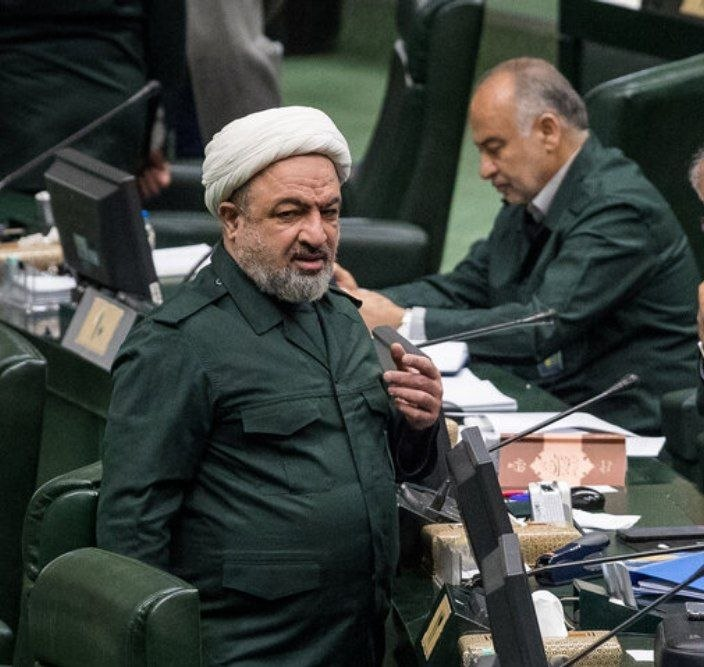

👈رسایی:
هر صحبت یا مذاکره‌ای باید با اجازه مجلس باشه

✅ @AloNews خبر جنگ

## alonews — post 120217

👈فروش کانفیگ متصل پایدار با ساب و مورد تایید مجموعه الونیوز
⬇️

🔔@FastProxyMakerBot

🔔@FastProxyMakerBot

✔️با خیال راحت و بدون دغدغه خرید کنید

## alonews — post 120216

  <a href="telegram/content/alonews_120216_1778857667.jpg">🎬 Download video</a>

👈بلومبرگ: امارات به دنبال پاسخ هماهنگ به ایران بود، اما عربستان و قطر با آن همراهی نکردند

✅ @AloNews خبر جنگ

## alonews — post 120215

  <a href="telegram/content/alonews_120215_1778857667.jpg">🎬 Download video</a>

👈وزیر امور خارجه پاکستان: یازده پاکستانی و ۲۰ ایرانی که در کشتی‌های توقیف شده توسط نیروهای آمریکایی بودند، آزاد شده‌اند

✅ @AloNews خبر جنگ

## alonews — post 120214

  <a href="telegram/content/alonews_120214_1778857667.jpg">🎬 Download video</a>

👈وزیر امور خارجه چین: ما خواستار بازگشایی هرچه سریع‌تر تنگه هرمز هستیم

✅ @AloNews خبر جنگ

## alonews — post 120213

  <a href="telegram/content/alonews_120213_1778857667.jpg">🎬 Download video</a>

👈وزیر خارجه چین : شی جین پینگ پاییز آینده به آمریکا سفر میکنه

✅ @AloNews خبر جنگ

## alonews — post 120212

  <a href="telegram/content/alonews_120212_1778857668.jpg">🎬 Download video</a>

👈وزارت نیروهای مسلح فرانسه: ناو هواپیمابر شارل دوگل در دریای عرب در ماموریتی احتمالی برای بازگرداندن ناوبری در تنگه هرمز است

✅ @AloNews خبر جنگ

## alonews — post 120211

  <a href="telegram/content/alonews_120211_1778857668.jpg">🎬 Download video</a>

👈وزیر امور خارجه چین: ما ایالات متحده و ایران را تشویق می‌کنیم که به حل اختلافات و مناقشات خود از طریق گفتگو ادامه دهند

✅ @AloNews خبر جنگ

## alonews — post 120210

👈شرکت‌های نفت دولتی هند قیمت بنزین و گازوئیل را بیش از ۳ درصد افزایش دادند

✅ @AloNews خبر جنگ

## alonews — post 120209

  <a href="telegram/content/alonews_120209_1778857668.mp4">🎬 Download video</a>

👈وزیر انرژی آمریکا : قبل از اینکه تصمیم بگیریم برنامه هسته‌ای ایران رو خلع سلاح کنیم، قیمت نفت و گازوئیل تو کالیفرنیا رسماً ترکونده بود!

✅ @AloNews خبر جنگ

## alonews — post 120208

  <a href="telegram/content/alonews_120208_1778857669.mp4">🎬 Download video</a>

👈روسیه حمله هدفمند با پهپاد FPV به خودروی سازمان ملل تو اوکراین رو منتشر کرد

✅ @AloNews خبر جنگ

## alonews — post 120207

  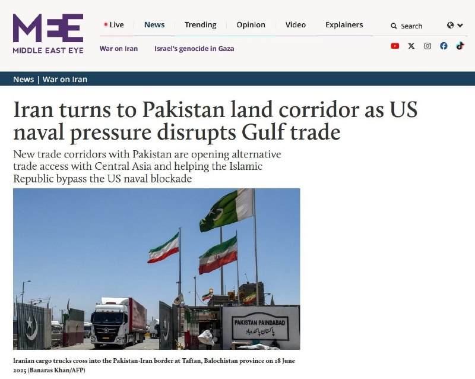

👈میدل‌ایست‌ای: ایران دنبال دور زدن مسیر محاصره شده تنگه هرمز با کریدور زمینی پاکستان است

🔴 در پی محاصره دریایی ایران توسط آمریکا که وارد پنجمین هفته خود شده است، ایران و پاکستان اعلام کردند که به دنبال احیای پروژه‌ اتصال چندین کریدور هستند که بنادر کراچی، بندر قاسم و گوادر پاکستان را از طریق بلوچستان به گذرگاه‌های مرزی گبد و تفتان ایران متصل می‌کنند

✅ @AloNews خبر جنگ

## alonews — post 120206

  <a href="telegram/content/alonews_120206_1778857672.mp4">🎬 Download video</a>

👈نیروهای دفاعی اسرائیل یک تمرین نظامی غافلگیرکننده در امتداد مرز اردن انجام دادند که هدف آن آزمایش آمادگی برای تهدیدات ناگهانی امنیتی بود

✅ @AloNews خبر جنگ

## alonews — post 120205

  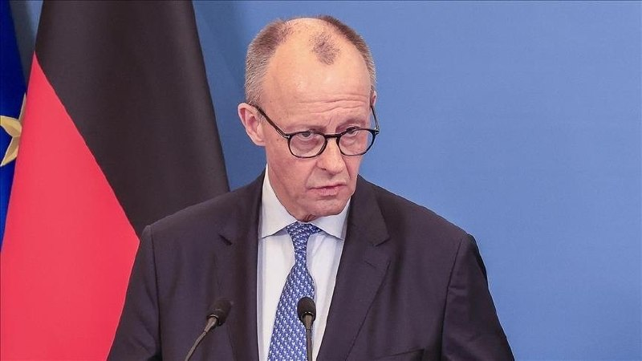

👈 صدر اعظم آلمان: تماس خوبی با ترامپ داشتم!

🔴ایران باید پای میز مذاکره بیاید و تنگه را باز کند، باید از دستیابی ایران به سلاح هسته‌ای جلوگیری شود

✅ @AloNews خبر جنگ

## alonews — post 120204

  <a href="telegram/content/alonews_120204_1778857674.jpg">🎬 Download video</a>

👈رویترز: امارات هم مانند عربستان به دنبال احداث مسیر دور زدن تنگه هرمز است

🔴امارات ساخت یک خط لوله نفت جدید را برای دو برابر کردن ظرفیت صادرات خود از طریق فجیره تسریع خواهد کرد تا توانایی‌اش را برای دور زدن تنگه هرمز به طور قابل توجهی گسترش دهد.

🔴ولیعهد ابوظبی اعلام کرده که این خط لوله در حال ساخت است و انتظار می‌رود در سال ۲۰۲۷ عملیاتی شود

✅ @AloNews خبر جنگ

## alonews — post 120203

  <a href="telegram/content/alonews_120203_1778857674.jpg">🎬 Download video</a>

👈نیویورک تایمز: سفر ترامپ به چین در ظاهر دوستانه بود، اما پشت پرده تنش‌های شدیدی بین واشنگتن و پکن جریان داشت

✅ @AloNews خبر جنگ

## alonews — post 120202

  <a href="telegram/content/alonews_120202_1778857674.jpg">🎬 Download video</a>

👈فرماندهی مرکزی ایالات متحده: تا امروز، ۷۵ کشتی تجاری تغییر مسیر داده‌اند و ۴ کشتی غیرفعال شده‌اند تا اطمینان حاصل شود که قوانین رعایت می‌شوند.

✅ @AloNews خبر جنگ

## alonews — post 120200

  <a href="telegram/content/alonews_120200_1778857675.mp4">🎬 Download video</a>

👈حداقل سه پهپاد شاهد-۱۳۶ ایرانی امروز اوایل روز به سایت‌های متعلق به گروه مخالف حزب دموکرات کردستان ایران در شمال اربیل در کردستان عراق حمله کردند

✅ @AloNews خبر جنگ

---
📅 بروزرسانی: 1405/02/25 15:59
---

## VahidOOnLine — post 240305

  <a href="telegram/content/VahidOOnLine_240305_1778848191.mp4">🎬 Download video</a>

دونالد ترامپ در پاسخ به پرسشی درباره پیشنهاد اخیر جمهوری اسلامی گفت این پیشنهاد را بررسی کرده، اما به گفته او، اگر از جمله نخست یک متن خوشش نیاید، بقیه آن را کنار می‌گذارد.

ترامپ در پاسخ به این پرسش که جمله نخست چه بوده است، آن را «غیرقابل قبول» توصیف کرد و گفت مسئله اصلی از نگاه او این است که ایران نباید «هیچ شکل» از برنامه هسته‌ای داشته باشد.

در ادامه، خبرنگار از ترامپ پرسید آیا دوره ۲۰ ساله برای او کافی نیست. ترامپ پاسخ داد که «۲۰ سال کافی است»، اما به گفته او، سطح تضمین‌هایی که جمهوری اسلامی ارائه می‌دهد اهمیت دارد.

ترامپ گفت که اگر قرار است توافقی ۲۰ ساله مطرح باشد، باید «۲۰ سال واقعی» باشد و نباید به گفته او، توافقی مبهم یا ظاهری باشد.
‌🏁 🇬🇧 ManotoTV

🤖 @VahidOOnLine

## VahidOOnLine — post 240304

  <a href="telegram/content/VahidOOnLine_240304_1778848192.mp4">🎬 Download video</a>

دونالد ترامپ در پاسخ به پرسشی درباره اینکه آیا شی جین‌پینگ، رئیس‌جمهوری چین، تعهدی قاطع برای فشار بر جمهوری اسلامی به منظور بازگشایی تنگه هرمز داده است، گفت از کسی «درخواست لطف» نمی‌کند.

ترامپ گفت: «من درخواست هیچ لطفی نمی‌کنم، چون وقتی درخواست لطف می‌کنید، باید در مقابل لطفی انجام دهید.» او افزود که آمریکا به چنین کمکی نیاز ندارد.

رئیس‌جمهوری آمریکا در ادامه گفت نیروهای مسلح طرف مقابل «اساسا از بین رفته‌اند» و ممکن است به گفته او «کمی کار پاکسازی» لازم باشد. او همچنین به آتش‌بس اشاره کرد و گفت این آتش‌بس به درخواست کشورهای دیگر انجام شد.

ترامپ گفت شخصا چندان موافق آتش‌بس نبوده، اما آن را به عنوان لطفی به پاکستان پذیرفته است. او از مقام‌های پاکستانی، از جمله نخست‌وزیر و فیلدمارشال این کشور، با تعبیر «افرادی فوق‌العاده» یاد کرد.
‌🏁 🇬🇧 ManotoTV

🤖 @VahidOOnLine

## VahidOOnLine — post 240303

  <a href="telegram/content/VahidOOnLine_240303_1778848193.mp4">🎬 Download video</a>

«انتقام خون بچه‌ها رو می‌گیریم»
‌🏁 🇬🇧 ManotoTV

🤖 @VahidOOnLine

## VahidOOnLine — post 240302

  <a href="telegram/content/VahidOOnLine_240302_1778848195.mp4">🎬 Download video</a>

«صدای فاطمه سپهری باشیم»
‌🏁 🇬🇧 ManotoTV

🤖 @VahidOOnLine

## VahidOOnLine — post 240301

  <a href="telegram/content/VahidOOnLine_240301_1778848196.mp4">🎬 Download video</a>

عباس عراقچی، وزیر خارجه جمهوری اسلامی، در حاشیه نشست بریکس در هند گفت روند میانجیگری پاکستان هنوز شکست نخورده، اما «در مسیری بسیار دشوار» قرار دارد.

عراقچی در نشست خبری خود گفت دشواری این روند عمدتا به دلیل «رفتار آمریکایی‌ها» است. وزیر خارجه جمهوری اسلامی پیش‌تر نیز گفته بود «پیام‌های متناقض» آمریکا یکی از موانع اصلی در مسیر گفتگوهاست.
‌🏁 🇬🇧 ManotoTV

🤖 @VahidOOnLine

## VahidOOnLine — post 240300

  

رسیدگی به پرونده سه متهم حمله به پارکینگی در مجاورت دفتر ایران‌اینترنشنال در لندن آغاز شده است. بر اساس حکم دادگاه مقدماتی، متهمان قرار است بهمن‌ماه محاکمه شوند. جلسه محاکمه مقدماتی این سه نفر ساعت ۱۰ صبح (به وقت محلی) جمعه ۲۵ اردیبهشت در دادگاه کیفری مرکزی انگلستان، موسوم به اولد بیلی، به ریاست قاضی چیما گراب برگزار شد.

بر اساس حکم جلسه مقدماتی، متهمان ۲۵ ژانویه ۲۰۲۷ (پنجم بهمن ۱۴۰۵) در دادگاه کیفری مرکزی محاکمه خواهند شد.

این سه نفر که شهروند بریتانیا هستند، ماه گذشته در دادگاه مجیستریت وست‌مینستر حضور یافته بودند.

دو متهم بزرگسال این پرونده اویسین مک‌گینس ۲۱ ساله و ناتان دان ۱۹ ساله هستند. متهم سوم یک پسر ۱۵ ساله است که به‌دلیل ملاحظات قانونی نامش فاش نخواهد شد.

هر سه نفر با اتهام «آتش‌سوزی عمدی به قصد به خطر انداختن جان افراد» روبه‌رو هستند. مک‌گینس علاوه بر این، به «رانندگی خطرناک» حین تعقیب پلیس نیز متهم شده است.
‌🏁 🇬🇧 IranintlTV

🤖 @VahidOOnLine

## VahidOOnLine — post 240299

  

⭕️ترامپ: مخالفتی با تعلیق ۲۰ ساله غنی‌سازی اورانیوم ایران ندارم ولی باید تعهد واقعی باشد

♦️دونالد ترامپ رئیس جمهوری ایالات متحده روز جمعه ۲۵ اردیبهشت و در زمان بازگشت از چین در هواپیمای ایرفورس وان به خبرنگاران گفت که مشکلی با تعلیق غنی‌سازی اورانیوم ایران به‌مدت ۲۰ سال ندارد اما این تعهد باید واقعی باشد.

ترامپ پیشتر گفته بود ایران دیگر هرگز نباید غنی‌سازی اورانیوم داشته باشد.

براساس گزارش‌های غیر رسمی مقام‌های جمهوری اسلامی بارها تاکید کرده‌اند که حداکثر غنی‌سازی ۵ ساله را می‌پذیرند. این در حالی است که اخیرا چند عضو مجلس شورای اسلامی گفته‌اند که تهران به‌هیچ وجه بحث تعلیق را نمی‌پذیرد.
‌🇸🇦 Indypersian

🤖 @VahidOOnLine

## VahidOOnLine — post 240298

  

شبکه کان اسرائیل گزارش داد ایال زمیر، رییس ستاد کل ارتش اسرائیل، در جریان جنگ علیه جمهوری اسلامی، به امارات متحده عربی سفر کرد. بر اساس این گزارش، زمیر در این سفر با مقام‌های اماراتی، از جمله محمد بن زاید آل نهیان، رییس این کشور، دیدار و گفت‌وگو کرده است.
‌🏁 🇬🇧 IranintlTV

🤖 @VahidOOnLine

## VahidOOnLine — post 240297

  

♦️عباس عراقچی، وزیر امور خارجه جمهوری اسلامی ایران، اعلام کرد تهران «هیچ اعتمادی» به ایالات متحده ندارد و فقط در صورتی به مذاکره با واشنگتن علاقه‌مند است که آمریکا در رویکرد خود «جدی» باشد.
عراقچی روز جمعه در جمع خبرنگاران در دهلی‌نو گفت پیام‌های متناقض آمریکا باعث شده ایران نسبت به نیت واقعی واشنگتن در مذاکرات تردید داشته باشد.
او همچنین درباره روند میانجی‌گری پاکستان گفت این روند شکست نخورده اما با «دشواری» مواجه شده است.
عراقچی تاکید کرد ایران تلاش می‌کند آتش‌بس فعلی حفظ شود تا فرصتی برای دیپلماسی فراهم شود، اما همزمان برای بازگشت به درگیری نیز آمادگی دارد.
اظهارات وزیر خارجه ایران چند ساعت پس از آن مطرح شد که دونالد ترامپ اعلام کرد صبرش در قبال ایران رو به پایان است و گفت در گفتگو با شی جین‌پینگ درباره لزوم بازگشایی تنگه هرمز توافق کرده است.
‌🇸🇦 Indypersian

🤖 @VahidOOnLine

## VahidOOnLine — post 240296

  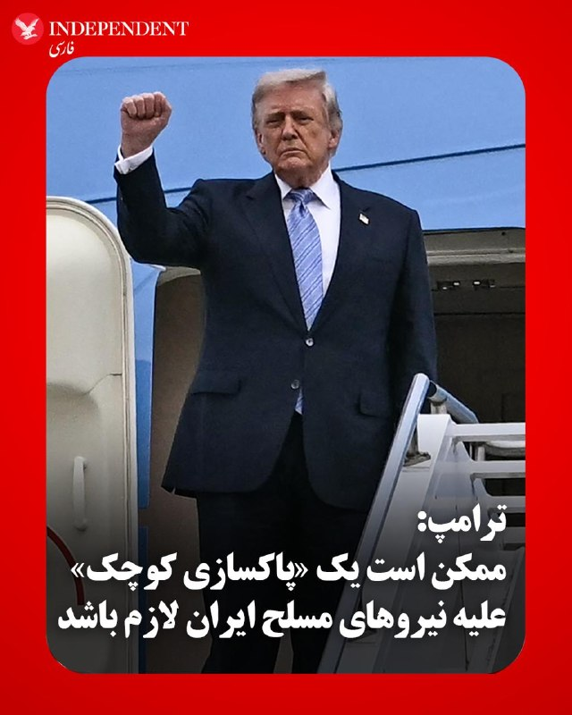

♦️دونالد ترامپ، رئیس جمهوری آمریکا روز جمعه ۲۵ اردیبهشت و در زمان بازگشت از چین به آمریکا در هواپیمای ایرفورس وان به خبرنگاران گفت با وجود آنکه نیروهای مسلح ایران در جنگ نابود شده‌اند، ممکن است نیاز به «یک پاکسازی کوچک» وجود داشته باشد.

ترامپ ساعاتی پیش در گفتگویی با فاکس‌نیوز هم گفته بود که نیروهای مسلح جمهوری اسلامی در چهار هفته گذشته، تلاش کرده‌اند تا تعدادی از پرتابگرهای موشکی را از زیر خاک بیرون بکشند و جای بعضی تجهیزات را عوض کنند، با این حال «آمریکا قادر است در دو روز همه این‌ها را نابود کند.»
‌🇸🇦 Indypersian

🤖 @VahidOOnLine

## VahidOOnLine — post 240295

  

⭕️ترامپ: شی تاکید دارد ایران نباید به سلاح هسته‌ای دست پیدا کند

♦️دونالد ترامپ، رئیس‌جمهوری آمریکا، روز جمعه اعلام کرد شی جین‌پینگ، رئیس‌جمهوری چین، «قویا» معتقد است که ایران نباید به سلاح هسته‌ای دست پیدا کند.

ترامپ در مسیر بازگشت از پکن به واشنگتن، در گفتگو با خبرنگاران در هواپیمای ایرفورس وان گفت: «او [شی] قویا معتقد است که آن‌ها نباید سلاح هسته‌ای داشته باشند.»

رئیس‌جمهوری آمریکا همچنین افزود که همتای چینی‌اش خواهان بازگشایی تنگه هرمز است.
ترامپ گفت: «او می‌خواهد تنگه [هرمز] باز شود.»
چین پیش‌تر خواستار برقراری آتش‌بس پایدار در خاورمیانه و بازگشایی سریع مسیرهای کشتیرانی شده بود.

پکن در دو روز گذشته میزبان دیدار تاریخی دونالد ترامپ، رئیس جمهوری آمریکا و همتای چینی‌اش، شی جی‌پینگ بود.
‌🇸🇦 Indypersian

🤖 @VahidOOnLine

## VahidOOnLine — post 240294

  <a href="telegram/content/VahidOOnLine_240294_1778848201.mp4">🎬 Download video</a>

بر اساس گزارش‌های منتشرشده توسط ایران اینترنشنال، ماموران حکومتی مانع برگزاری مراسم زادروز بهار شاه‌مهری بر مزار او شدند.

طبق این گزارش، خانواده بهار در روز تولدش قصد داشتند بر سر مزار او مراسم یادبود برگزار کنند، اما اجازه حضور و تجمع در محل خاکسپاری به آن‌ها داده نشد. در نتیجه، خانواده ناچار شدند مراسم را در خانه و در اتاق شخصی او برگزار کنند.

بر اساس این گزارش، افرادی ناشناس همچنین عکس بهار را که کنار مزارش قرار داشت، شکسته‌اند.
‌🏁 🇬🇧 IranintlTV

🤖 @VahidOOnLine

## VahidOOnLine — post 240293

  <a href="telegram/content/VahidOOnLine_240293_1778848203.mp4">🎬 Download video</a>

⭕️نخست وزیر هند در امارات: باز نگه داشتن تنگه هرمز بالاترین اولویت ماست

♦️نارندرا مودی، نخست‌وزیر هند، روز جمعه در آغاز سفر پنج‌کشوری خود وارد امارات متحده عربی شد، سفری که تحت تاثیر نگرانی‌ها از پیامدهای جنگ ایران بر بازار انرژی و زنجیره‌های تامین جهانی قرار گرفته است.

مودی که در بدو ورود با اسکورت جنگنده‌های نظامی همراهی شد، از سوی محمد بن زاید آل نهیان، رئیس امارات، مورد استقبال رسمی قرار گرفت.

مودی در دیدار با رئیس دولت امارات، با اشاره به اهمیت این آبراه هرمز گفت: «آزاد، باز و ایمن نگه داشتن تنگه هرمز بالاترین اولویت ما است و در این زمینه پایبندی به قوانین بین‌المللی ضروری است.»

وزارت خارجه هند اعلام کرد امارات و هند به توافق‌های راهبردی در حوزه نفت و گاز دست یافته‌اند و ابوظبی متعهد شده پنج میلیارد دلار در هند سرمایه‌گذاری کند، هرچند جزئیات بیشتری ارائه نشده است.

این سفر بخشی از تلاش گسترده‌تر هند برای گسترش شراکت‌های اقتصادی و راهبردی و کاهش وابستگی‌ها در شرایط تحولات ژئوپلیتیک ارزیابی می‌شود. مودی پس از امارات به هلند، سوئد، نروژ و ایتالیا سفر خواهد کرد.
‌🇸🇦 Indypersian

🤖 @VahidOOnLine

## VahidOOnLine — post 240292

  <a href="telegram/content/VahidOOnLine_240292_1778848205.mp4">🎬 Download video</a>

♦️عباس عراقچی، وزیر امور خارجه جمهوری اسلامی ایران، روز جمعه ۲۵ اردیبهشت ماه، در نشست خبری در دهلی‌نو اعلام کرد تهران پس از اظهارات اخیر دونالد ترامپ مبنی بر رد پیشنهاد تهران، پیام‌هایی از طرف آمریکا دریافت کرده که نشان می‌دهد واشنگتن همچنان خواهان ادامه گفتگوها و تعامل است.
عراقچی با اشاره به گزارش‌ها درباره رد شدن پیشنهاد یا پاسخ ایران از سوی آمریکا گفت: «اینکه مطرح شده آمریکا پیشنهاد یا پاسخ ایران را رد کرده، مربوط به چند روز پیش است؛ زمانی که آقای ترامپ در پیامی اعلام کرد این پیشنهاد غیرقابل قبول است.»
او افزود: «اما پس از آن، ما مجددا پیام‌هایی از طرف آمریکایی‌ها دریافت کردیم که مایل به ادامه گفتگوها و تعامل هستند.»
رسانه‌های ایران روز جمعه به‌نقل از تهران‌تایمز، نشریه انگلیسی‌زبان سازمان تبلیغات اسلامی‌گزارش داده بودند که آمریکا پیشنهاد ۱۴ ماده‌ای جمهوری اسلامی را رد کرده است‌.
‌🇸🇦 Indypersian

🤖 @VahidOOnLine

## VahidOOnLine — post 240291

  

تهران‌تایمز گزارش داد دولت آمریکا به پیشنهاد مکتوب جمهوری اسلامی درباره پایان جنگ پاسخ داده و پیشنهاد ۱۴ ماده‌ای تهران را رد کرده است.

بر اساس این گزارش، آمریکا با رد پیشنهادهای جمهوری اسلامی، بار دیگر مواضع خود، به‌ویژه در ارتباط با پرونده هسته‌ای را تکرار کرده است.

این روزنامه گزارش داد جمهوری اسلامی پیشنهاد خود را بر پایه روندی دو مرحله‌ای ارائه کرده بود؛ مرحله نخست به پایان جنگ در همه جبهه‌ها منجر می‌شد و در صورت برآورده شدن شروط تهران، مرحله دوم مذاکرات درباره موضوع هسته‌ای آغاز می‌شد.
‌🏁 🇬🇧 IranintlTV

🤖 @VahidOOnLine

## VahidOOnLine — post 240290

  

♦️عباس عراقچی، وزیر امور خارجه جمهوری اسلامی ایران، روز جمعه اعلام کرد تهران از هرگونه کمک برای حل بحران خاورمیانه، به‌ویژه از سوی چین، استقبال می‌کند.
عراقچی در جمع خبرنگاران در دهلی‌نو گفت: «از هر کشوری که توانایی کمک داشته باشد، قدردانی می‌کنیم؛ به‌ویژه چین.»
وزیر امور خارجه ایران با اشاره به روابط تهران و پکن افزود: «ما روابط بسیار خوبی با چین داریم و شریک راهبردی یکدیگر هستیم.»
او همچنین گفت: «می‌دانیم که چینی‌ها نیت خوبی دارند، بنابراین هر اقدامی که از سوی آن‌ها برای کمک به دیپلماسی انجام شود، از سوی جمهوری اسلامی مورد استقبال قرار خواهد گرفت.»
اظهارات عراقچی در حالی مطرح می‌شود که چین پیش‌تر خواستار برقراری آتش‌بس پایدار در خاورمیانه و بازگشایی سریع مسیرهای کشتیرانی شده بود.
پکن در دو روز گذشته میزبان دیدار تاریخی دونالد ترامپ، رئیس جمهوری آمریکا و همتای چینی‌اش، شی جی‌پینگ بود.
‌🇸🇦 Indypersian

🤖 @VahidOOnLine

## VahidOOnLine — post 240289

  

بلومبرگ به نقل از منابع آگاه گزارش داد امارات متحده عربی پس از آغاز حملات جمهوری اسلامی به کشورهای حوزه خلیج فارس، تلاش کرد کشورهای همسایه از جمله عربستان سعودی و قطر را برای مشارکت در یک پاسخ نظامی هماهنگ به حملات تهران متقاعد کند، اما با رد این درخواست از سوی آنها روبه‌رو شد.

به گفته این منابع، محمد بن زاید، رییس امارات متحده عربی مجموعه‌ای از تماس‌ها را با رهبران منطقه از جمله محمد بن سلمان، ولیعهد عربستان سعودی، برقرار کرد.

این منابع افزودند محمد بن زاید بر این باور بود که پاسخ گروهی کشورهای منطقه به ایران می‌تواند بازدارندگی ایجاد کند.
‌🏁 🇬🇧 IranintlTV

🤖 @VahidOOnLine

## VahidOOnLine — post 240288

  <a href="telegram/content/VahidOOnLine_240288_1778848209.mp4">🎬 Download video</a>

⭕️حمله پهپادی اوکراین به ساختمانی در ریازان روسیه سه کشته برجا گذاشت

♦️ویدیویی که روز جمعه در شبکه اجتماعی تلگرام منتشر شد، ساختمان مسکونی در حال سوختن و ستون‌های غلیظ دود در آسمان شهر ریازان روسیه را پس از حمله پهپادی اوکراین نشان می‌دهد.

خبرگزاری رویترز ضمن تایید این ویدیو، به نقل از پاول مالکوف، فرماندار منطقه ریازان گزارش کرد این حمله روز جمعه ۲۵ اردیبهشت رخ داده است و در جریان آن علاوه بر کشته شدن سه نفر، چند برج مسکونی و یک محوطه صنعتی آسیب دیده‌اند.
‌🇸🇦 Indypersian

🤖 @VahidOOnLine

## VahidOOnLine — post 240287

  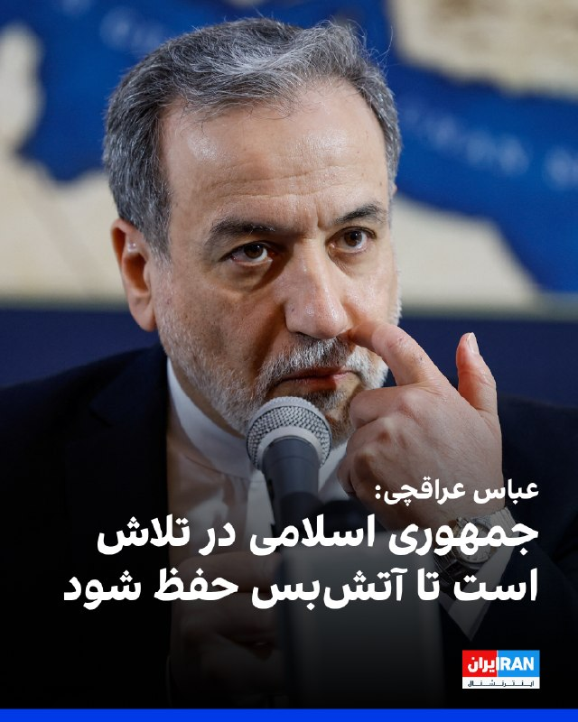

عباس عراقچی، وزیر خارجه جمهوری اسلامی، در یک نشست خبری در حاشیه اجلاس بریکس گفت جمهوری اسلامی در تلاش است آتش‌بس، «اگرچه بسیار ناپایدار است»، حفظ شود و به دیپلماسی فرصت داده شود.

او افزود: «به آمریکایی‌ها اعتماد نداریم و فقط در صورتی به مذاکرات علاقه‌مندیم که طرف مقابل جدی باشد.»

وزیر خارجه جمهوری اسلامی، در ادامه اظهاراتش گفت مذاکرات کنونی با آمریکا «از نبود اعتماد رنج می‌برد».

او همچنین گفت همه کشتی‌ها می‌توانند از تنگه هرمز عبور کنند، «به‌جز آن‌هایی که با ما در جنگ هستند».
‌🏁 🇬🇧 IranintlTV

🤖 @VahidOOnLine

## mwarmonitor — post 9127

تموم شد 😮‍💨

## mwarmonitor — post 9126

🔹خبرنگار: آقا، باز هم در مورد رئیس‌جمهور شی (رئیس‌جمهور چین)؛ چند سال پیش وقتی رئیس‌جمهور بایدن در سانفرانسیسکو با او ملاقات کرد، از او پرسیده شد که آیا فکر می‌کند رئیس‌جمهور شی یک دیکتاتور است یا خیر. آیا شما فکر می‌کنید رئیس‌جمهور شی یک دیکتاتور است؟ 🔸ترامپ:…

## mwarmonitor — post 9125

🔹خبرنگار: «فکر می‌کنید "شی" (رئیس‌جمهور چین) در معاملاتش با شما، نسبت به آخرین باری که با هم در ارتباط بودید، احساس قدرت بیشتری می‌کرد؟ قبل از اینکه کووید سر و کله‌اش پیدا شود...» 🔸ترامپ: «خب، من آن‌ها را بابت آن (کووید) مقصر دانستم. گفتم که کارِ "ووهان" بود…

## mwarmonitor — post 9124

🔹خبرنگار: «در مورد معاملات با چین چطور؟ آیا در مورد سویا به توافقی رسیدید؟ می‌دانید که کشاورزان...» 🔸ترامپ: «بله، کشاورزان خیلی خوشحال خواهند شد. آن‌ها قرار است میلیاردها دلار سویا بخرند. بله.» 🔹خبرنگار: «آقای رئیس‌جمهور، داشتیم در مورد بریتانیا صحبت می‌کردیم،…

## mwarmonitor — post 9123

🔸ترامپ: نمی‌خوام این رو بگم. یعنی دوست دارم بهتون بگم. دوست دارم بگم در یک ساعت خاص، در یک روز خاص، بمباران قراره... [اما] نمی‌خوام این رو بگم. فقط می‌تونم بگم که ایران... این رو با اطمینان بسیار بسیار قوی می‌تونم بگم... ایران هرگز سلاح هسته‌ای نخواهد داشت.…

## mwarmonitor — post 9122

🔹خبرنگار: می‌خوام متوجه بشم که او (شی جین‌پینگ) دقیقاً به چه چیزی متعهد شده، اصلاً تعهدی داده؟ 🔸ترامپ: خب، نمی‌خوام بگم کسی تعهدی داده، اما ما تفاهم خیلی خوبی با هم داریم. می‌دونید، مفهوم «خلع سلاح هسته‌ای»... 🔹خبرنگار: خلع سلاح هسته‌ای یا فقط تمدید (قراردادها)؟…

## mwarmonitor — post 9121

🔹خبرنگار: آقای رئیس‌جمهور، در شبکه "تروث سوشال" (Truth Social) گفتید که رئیس‌جمهور شی (رئیس‌جمهور چین) به افول ایالات متحده اشاره کرده است. ما نشنیدیم که او چنین چیزی بگوید، شاید چیزی بوده که در خلوت گفته است. اول از همه، او دقیقاً چه گفت که باعث شد شما آن…

## mwarmonitor — post 9120

...باز کردن تنگه [هرمز]. اما همان‌طور که او (رهبر چین) گفت، آن‌ها آن را بستند و بعد شما با یک لبخند آن‌ها را [مجبور به] بستن کردید. و این حقیقت دارد؛ ما کنترل تنگه را در دست داریم. و آن‌ها هیچ معامله‌ای انجام نداده‌اند، در واقع در دو هفته و نیم گذشته هیچ معامله‌ای…

## mwarmonitor — post 9119

🔸ترامپ: سلام به همگی. خب، ما اقامت بسیار خوبی داشتیم، دوران فوق‌العاده‌ای بود. رئیس‌جمهور شی (جین‌پینگ) آدم بی‌نظیریه. ما روی معاملات تجاری خیلی خوبی توافق کردیم، از جمله بیش از ۲۰۰ هواپیما از بوئینگ با وعده خرید تا ۷۵۰ هواپیما، که اگر ۲۰۰ تای اول رو به خوبی…

## mwarmonitor — post 9118

🇺🇸رئیس جمهور ترامپ در حال صحبت با مطبوعات در هواپیمای ایر فورس وان در مسیر انکوریج، آلاسکا، ۱۵ مه ۲۰۲۶ @mwarmonitor

## mwarmonitor — post 9117

🇺🇸رئیس جمهور ترامپ در حال صحبت با مطبوعات در هواپیمای ایر فورس وان در مسیر انکوریج، آلاسکا، ۱۵ مه ۲۰۲۶

@mwarmonitor

## mwarmonitor — post 9116

🦠«یک شیوع جدید از ویروس بسیار مسری ابولا در استان اییتوری در شرق کنگو تأیید شده است، به گفته نهاد اصلی بهداشت عمومی آفریقا. تاکنون ۲۴۶ مورد مشکوک و ۶۵ مرگ ثبت شده است.»

@mwarmonitor

## mwarmonitor — post 9115

🔴«بلومبرگ گزارش داد که امارات متحده عربی تلاش کرد عربستان سعودی و قطر را برای هماهنگی یک پاسخ مشترک علیه ایران در جریان جنگ هماهنگ کند، اما موفق نشد؛ به گفته افرادی مطلع از موضوع.»

@mwarmonitor

## pm_afshaa — post 90787

  <a href="telegram/content/pm_afshaa_90787_1778848212.jpg">🎬 Download video</a>

🔴ترامپ به فاکس‌نیوز: ما میتونستیم پل‌ها و شبکه‌های برق ایران رو نابود کنیم و میتونیم ظرف دو روز همه چیز رو در آنجا از بین ببریم.

💧 Rainbet.com the #1 Non-KYC Crypto Casino & Sportsbook @rainbetcom

😁 @Pm_Afshaa

## pm_afshaa — post 90786

  <a href="telegram/content/pm_afshaa_90786_1778848212.jpg">🎬 Download video</a>

🔴بلومبرگ: امارات تلاش کرد عربستان و قطر رو برای مشارکت در یک پاسخ نظامی مشترک علیه جمهوری اسلامی همراه کنه، اما هر دو کشور این درخواست رو رد کردن.

💧 Rainbet.com the #1 Non-KYC Crypto Casino & Sportsbook @rainbetcom

😁 @Pm_Afshaa

## pm_afshaa — post 90785

امروز 25 اردیبهشت روز پاسداشت زبان فارسی و بزرگداشت فردوسیه 
💧 Rainbet.com the #1 Non-KYC Crypto Casino & Sportsbook @rainbetcom 
😁 @Pm_Afshaa

## pm_afshaa — post 90784

  

امروز 25 اردیبهشت روز پاسداشت زبان فارسی و بزرگداشت فردوسیه

💧 Rainbet.com the #1 Non-KYC Crypto Casino & Sportsbook @rainbetcom

😁 @Pm_Afshaa

## pm_afshaa — post 90783

  <a href="telegram/content/pm_afshaa_90783_1778848213.mp4">🎬 Download video</a>

روانه شدن نفت در سواحل جزایر خلیج فارس جمهموری اسلامی داره نفتو تو دریا میریزه و جان موجودات دریایی و زیست بوم ها رو به خطر انداخته

💧 Rainbet.com the #1 Non-KYC Crypto Casino & Sportsbook @rainbetcom

😁 @Pm_Afshaa

## pm_afshaa — post 90782

  <a href="telegram/content/pm_afshaa_90782_1778848215.jpg">🎬 Download video</a>

🔴ترامپ: به رئیس جمهور چین گفتم در مورد پرونده تایوان صحبت نمی‌کنم.

💧 Rainbet.com the #1 Non-KYC Crypto Casino & Sportsbook @rainbetcom

😁 @Pm_Afshaa

## pm_afshaa — post 90781

  <a href="telegram/content/pm_afshaa_90781_1778848216.jpg">🎬 Download video</a>

🔴ترامپ: من مشکلی ندارم که ایران برنامه هسته‌ای خودش رو به مدت 20 سال تعلیق کنه، اما این باید یک تعهد واقعی باشه.

💧 Rainbet.com the #1 Non-KYC Crypto Casino & Sportsbook @rainbetcom

😁 @Pm_Afshaa

## pm_afshaa — post 90780

  <a href="telegram/content/pm_afshaa_90780_1778848216.jpg">🎬 Download video</a>

🔴ترامپ: وقتی به پیشنهاد ایران نگاه کردم، جمله اول رو دوست نداشتم و قابل قبول نبود، بنابراین پیشنهاد رو رد کردم.

💧 Rainbet.com the #1 Non-KYC Crypto Casino & Sportsbook @rainbetcom

😁 @Pm_Afshaa

## pm_afshaa — post 90779

  <a href="telegram/content/pm_afshaa_90779_1778848217.jpg">🎬 Download video</a>

🔴ترامپ: ارتش ایران رو از بین بردیم و شاید باید یک عملیات پاکسازی سبک انجام دهیم.

💧 Rainbet.com the #1 Non-KYC Crypto Casino & Sportsbook @rainbetcom

😁 @Pm_Afshaa

## pm_afshaa — post 90778

🔴روبیو: اگر ایران فکر می‌کند ما برای رسیدن به توافق امتیازاتی می‌دهیم، سخت در اشتباه است

💧 Rainbet.com the #1 Non-KYC Crypto Casino & Sportsbook @rainbetcom

😁 @Pm_Afshaa

## pm_afshaa — post 90777

  <a href="telegram/content/pm_afshaa_90777_1778848217.jpg">🎬 Download video</a>

🔴دونالد ترامپ: نیروی هوایی ایران رو به طور کامل حذف کردیم و از شر رهبران ایران خلاص شدیم.

💧 Rainbet.com the #1 Non-KYC Crypto Casino & Sportsbook @rainbetcom

😁 @Pm_Afshaa

## pm_afshaa — post 90776

  <a href="telegram/content/pm_afshaa_90776_1778848218.jpg">🎬 Download video</a>

🔴ترامپ: من از رئیس جمهور چین نخواستم که به ایران برای باز کردن تنگه هرمز فشار بیاورد.

💧 Rainbet.com the #1 Non-KYC Crypto Casino & Sportsbook @rainbetcom

😁 @Pm_Afshaa

## pm_afshaa — post 90775

  <a href="telegram/content/pm_afshaa_90775_1778848218.jpg">🎬 Download video</a>

🔴ترامپ به فاکس‌ نیوز: من دیگر خیلی بیشتر از این صبر نخواهم کرد. آنها باید توافق رو امضا کنند. مواد هسته‌ای ایران، ممکنه به چین یا آمریکا تحویل داده شه!

💧 Rainbet.com the #1 Non-KYC Crypto Casino & Sportsbook @rainbetcom

😁 @Pm_Afshaa

## pm_afshaa — post 90774

  

پس از سفر ترامپ و تیم اقتصادیش به چین، بازار سهام آمریکا باز هم رکورد تاریخی زد و حدود بیست درصد رشد رو تجربه کرد

💧 Rainbet.com the #1 Non-KYC Crypto Casino & Sportsbook @rainbetcom

😁 @Pm_Afshaa

## pm_afshaa — post 90773

وای‌نت: امارات متحده عربی تلاش کرد کشورهای همسایه رو برای حمله مشترک به جمهوری اسلامی متقاعد کنه.

💧 Rainbet.com the #1 Non-KYC Crypto Casino & Sportsbook @rainbetcom

😁 @Pm_Afshaa

## pm_afshaa — post 90772

  <a href="telegram/content/pm_afshaa_90772_1778848219.jpg">🎬 Download video</a>

🔴ویکتور گائو، پژوهشگر چینی:
نشست ترامپ و شی ۹.۹۹ از ۱۰ بود. این دیدار بسیار موفق، دقیق برنامه‌ریزی‌شده و در عین حال پر از هیجان و خودجوشی بود؛ واقعا یک لحظه تاریخی.

سفر ترامپ به چین «گامی مهم در مسیر درست» برای روابط دو کشوره.

💧 Rainbet.com the #1 Non-KYC Crypto Casino & Sportsbook @rainbetcom

😁 @Pm_Afshaa

## pm_afshaa — post 90771

  <a href="telegram/content/pm_afshaa_90771_1778848220.jpg">🎬 Download video</a>

🔴کانال 11 اسرائیل: گزینه حملات هدفمند به زیرساخت‌های انرژی در ایران روی میزه.

💧 Rainbet.com the #1 Non-KYC Crypto Casino & Sportsbook @rainbetcom

😁 @Pm_Afshaa

## DEJradio — post 4649

  <a href="telegram/content/DEJradio_4649_1778848220.mp4">🎬 Download video</a>

🚨
🔸 مستند؛
آمنه‌سادات ذبیح‌پور- خانم خبرنگار دست در دست نیروهای امنیتی

#نیروهای_امنیتی #بازجو_خبرنگار
@DEJradio

## IranIntlTV — post 337316

  <a href="https://t.me/IranintlTV/337316">📎 Download file</a>

🎧نسخه صوتی اخبار نیم‌روزی | جمعه ۲۵ اردیبهشت
@iranintlTV

## IranIntlTV — post 337315

  

رسیدگی به پرونده سه متهم حمله به پارکینگی در مجاورت دفتر ایران‌اینترنشنال در لندن آغاز شده است. بر اساس حکم دادگاه مقدماتی، متهمان قرار است بهمن‌ماه محاکمه شوند. جلسه محاکمه مقدماتی این سه نفر ساعت ۱۰ صبح (به وقت محلی) جمعه ۲۵ اردیبهشت در دادگاه کیفری مرکزی انگلستان، موسوم به اولد بیلی، به ریاست قاضی چیما گراب برگزار شد.

بر اساس حکم جلسه مقدماتی، متهمان ۲۵ ژانویه ۲۰۲۷ (پنجم بهمن ۱۴۰۵) در دادگاه کیفری مرکزی محاکمه خواهند شد.

این سه نفر که شهروند بریتانیا هستند، ماه گذشته در دادگاه مجیستریت وست‌مینستر حضور یافته بودند.

دو متهم بزرگسال این پرونده اویسین مک‌گینس ۲۱ ساله و ناتان دان ۱۹ ساله هستند. متهم سوم یک پسر ۱۵ ساله است که به‌دلیل ملاحظات قانونی نامش فاش نخواهد شد.

هر سه نفر با اتهام «آتش‌سوزی عمدی به قصد به خطر انداختن جان افراد» روبه‌رو هستند. مک‌گینس علاوه بر این، به «رانندگی خطرناک» حین تعقیب پلیس نیز متهم شده است.
https://iranintl.com/202605153243

## IranIntlTV — post 337314

  

شبکه کان اسرائیل گزارش داد ایال زمیر، رییس ستاد کل ارتش اسرائیل، در جریان جنگ علیه جمهوری اسلامی، به امارات متحده عربی سفر کرد. بر اساس این گزارش، زمیر در این سفر با مقام‌های اماراتی، از جمله محمد بن زاید آل نهیان، رییس این کشور، دیدار و گفت‌وگو کرده است.
https://iranintl.com/202605157769

## IranIntlTV — post 337313

  

🔻علی تاجرنیا، رییس هیات مدیره باشگاه استقلال، در جمع خبرنگاران درباره معرفی این تیم به کنفدراسیون فوتبال آسیا به‌عنوان نماینده فوتبال ایران در لیگ نخبگان گفت: «اگر بقیه ناراحت نشوند، می‌گوییم استقلال فصل آینده نماینده ایران در لیگ نخبگان است.»

🔹او در ادامه درباره پیشنهاد برگزاری تورنمنت چندجانبه میان تیم‌های بالای جدول برای انتخاب قهرمان و نمایندگان آسیا گفت: «به هیچ عنوان زیر بار تورنمنت چندجانبه نمی‌رویم، در آن شرکت نمی‌کنیم و از فدراسیون فوتبال می‌خواهم هرچه زودتر نماینده‌های آسیایی را اعلام کند.»

🔹تاجرنیا درباره آخرین وضعیت پنجره نقل‌وانتقالاتی استقلال نیز گفت: «استقلال با بیشتر بازیکنان خود قرارداد دوساله دارد و قرارداد بخشی از بازیکنانی که قرارداد یک‌ساله دارند نیز تمدید می‌شود. پنجره باشگاه به‌زودی باز خواهد شد.»

🔹او افزود: «آن‌هایی که خود را دلسوز استقلال می‌دانند، بهتر است اجازه دهند صاحبان و تصمیم‌گیران باشگاه این دلسوزی را بیشتر نشان دهند.»

@iranintltvsport

## IranIntlTV — post 337312

  <a href="telegram/content/IranIntlTV_337312_1778848225.mp4">🎬 Download video</a>

بر اساس گزارش‌های منتشرشده توسط ایران اینترنشنال، ماموران حکومتی مانع برگزاری مراسم زادروز بهار شاه‌مهری بر مزار او شدند.

طبق این گزارش، خانواده بهار در روز تولدش قصد داشتند بر سر مزار او مراسم یادبود برگزار کنند، اما اجازه حضور و تجمع در محل خاکسپاری به آن‌ها داده نشد. در نتیجه، خانواده ناچار شدند مراسم را در خانه و در اتاق شخصی او برگزار کنند.

بر اساس این گزارش، افرادی ناشناس همچنین عکس بهار را که کنار مزارش قرار داشت، شکسته‌اند.

## IranIntlTV — post 337311

  <a href="telegram/content/IranIntlTV_337311_1778848227.mp4">🎬 Download video</a>

پیام‌های شهروندان به ایران‌اینترنشنال حاکی است نیروهای انتظامی جمهوری اسلامی، هفته‌ها پس از برقراری آتش‌بس، همچنان خارج از مقرهای نظامی مستقر هستند. برخی از گزارش‌های مردمی از استقرار این نیروها در اصفهان و کرمانشاه، در مکان‌هایی از جمله قبرستان‌ها و بیابان‌ها خبر می‌دهند.

گفت‌وگو با محسن مهیمنی، خبرنگار ایران‌اینترنشنال
@iranintltv

## IranIntlTV — post 337310

  <a href="telegram/content/IranIntlTV_337310_1778848228.mp4">🎬 Download video</a>

رسیدگی به پرونده متهمان حمله با کوکتل مولوتوف به پارکینگ ساختمان مجاور دفتر ایران اینترنشنال در لندن، در دادگاه اولد بیلی آغاز شد. سه متهم این پرونده با اتهام پرتاب مواد آتش‌زا و به خطر انداختن جان مردم محاکمه می‌شوند.
تاج‌الدین سروش، عضو تحریریه ایران‌اینترنشال، گزارش می‌دهد
@iranintltv

## IranIntlTV — post 337309

  <a href="telegram/content/IranIntlTV_337309_1778848230.mp4">🎬 Download video</a>

برد کوپر، فرمانده ستاد فرماندهی مرکزی ایالات متحده، سنتکام، تایید کرد تخریب یک مدرسه در ایران که مقام‌های جمهوری اسلامی مدعی کشته شدن ۱۷۵ نفر در آن هستند، ممکن است بر اثر اصابت یک بمب آمریکایی رخ داده باشد. او گفت این حادثه همچنان در دست بررسی است و ارتش آمریکا مسئولیت آن را نپذیرفته است.
جزییات بیشتر با علی شیرازی، عضو تحریریه ایران‌اینترنشنال
@iranintltv

## IranIntlTV — post 337308

  <a href="telegram/content/IranIntlTV_337308_1778848232.mp4">🎬 Download video</a>

عصر ۲۶ فروردین به پارکینگی در مجاورت دفتر ایران‌اینترنشنال در شمال لندن با دو کوکتل مولوتوف حمله شد. دادگاه اولد‌بِیلی لندن اعلام کرد رسیدگی به پرونده سه متهم این حمله آغاز شده است. اویسین مک‌گینس ۲۱ ساله، ناتان دان ۱۹ ساله و یک پسر ۱۶ ساله به اتهام پرتاب مواد آتش‌زا و به خطر انداختن جان مردم در این دادگاه محاکمه می‌شوند.
@iranintltv

## IranIntlTV — post 337307

  <a href="telegram/content/IranIntlTV_337307_1778848233.mp4">🎬 Download video</a>

ارتش تایوان روز چهارشنبه ۱۳ مه در شهرستان کینمن یک رزمایش با آتش واقعی برگزار کرد که در آن سناریوی دفاع در برابر تلاش نیروهای دشمن برای پیاده‌سازی در این جزیره شبیه‌سازی شد. به گزارش یوت دیلی نیوز، رسانه وابسته به وزارت دفاع تایوان، این رزمایش در نزدیکی فرودگاه کینمن برگزار شد و شامل استفاده از موشک‌های جاولین، هویتزرها، تانک‌های M60A3 و نفربرهای زرهی CM21 بود.
@iranintltv

## IranIntlTV — post 337306

  

تهران‌تایمز گزارش داد دولت آمریکا به پیشنهاد مکتوب جمهوری اسلامی درباره پایان جنگ پاسخ داده و پیشنهاد ۱۴ ماده‌ای تهران را رد کرده است.

بر اساس این گزارش، آمریکا با رد پیشنهادهای جمهوری اسلامی، بار دیگر مواضع خود، به‌ویژه در ارتباط با پرونده هسته‌ای را تکرار کرده است.

این روزنامه گزارش داد جمهوری اسلامی پیشنهاد خود را بر پایه روندی دو مرحله‌ای ارائه کرده بود؛ مرحله نخست به پایان جنگ در همه جبهه‌ها منجر می‌شد و در صورت برآورده شدن شروط تهران، مرحله دوم مذاکرات درباره موضوع هسته‌ای آغاز می‌شد.
https://iranintl.com/202605157552

## IranIntlTV — post 337305

  

بلومبرگ به نقل از منابع آگاه گزارش داد امارات متحده عربی پس از آغاز حملات جمهوری اسلامی به کشورهای حوزه خلیج فارس، تلاش کرد کشورهای همسایه از جمله عربستان سعودی و قطر را برای مشارکت در یک پاسخ نظامی هماهنگ به حملات تهران متقاعد کند، اما با رد این درخواست از سوی آنها روبه‌رو شد.

به گفته این منابع، محمد بن زاید، رییس امارات متحده عربی مجموعه‌ای از تماس‌ها را با رهبران منطقه از جمله محمد بن سلمان، ولیعهد عربستان سعودی، برقرار کرد.

این منابع افزودند محمد بن زاید بر این باور بود که پاسخ گروهی کشورهای منطقه به ایران می‌تواند بازدارندگی ایجاد کند.
https://iranintl.com/202605157589

## IranIntlTV — post 337304

  <a href="telegram/content/IranIntlTV_337304_1778848235.mp4">🎬 Download video</a>

اصغر فرهادی، کارگردان ایرانی، در نشست خبری فیلم «داستان‌های موازی» در جشنواره کن به لی‌لی نیکفر، خبرنگار ایران‌اینترنشنال، گفت کشته شدن تعداد زیادی از معترضان «بی‌گناه» در جریان اعتراضات دی‌ماه و همچنین کشته شدن غیرنظامیان در جنگ دردناک بود.

او افزود مخالفت با کشته شدن بی‌گناهان و غیرنظامیان در جنگ به معنی موافقت با کشته شدن معترضان نیست. فرهادی گفت کشته شدن هر انسانی جنایت است؛ چه در جنگ، چه با اعدام و چه در اعتراضات.
@iranintltv

## IranIntlTV — post 337303

  

عباس عراقچی، وزیر خارجه جمهوری اسلامی، در یک نشست خبری در حاشیه اجلاس بریکس گفت جمهوری اسلامی در تلاش است آتش‌بس، «اگرچه بسیار ناپایدار است»، حفظ شود و به دیپلماسی فرصت داده شود.

او افزود: «به آمریکایی‌ها اعتماد نداریم و فقط در صورتی به مذاکرات علاقه‌مندیم که طرف مقابل جدی باشد.»

وزیر خارجه جمهوری اسلامی، در ادامه اظهاراتش گفت مذاکرات کنونی با آمریکا «از نبود اعتماد رنج می‌برد».

او همچنین گفت همه کشتی‌ها می‌توانند از تنگه هرمز عبور کنند، «به‌جز آن‌هایی که با ما در جنگ هستند».
https://iranintl.com/202605155857

## ManotoTV — post 105483

  <a href="telegram/content/ManotoTV_105483_1778848237.mp4">🎬 Download video</a>

دونالد ترامپ در پاسخ به پرسشی درباره پیشنهاد اخیر جمهوری اسلامی گفت این پیشنهاد را بررسی کرده، اما به گفته او، اگر از جمله نخست یک متن خوشش نیاید، بقیه آن را کنار می‌گذارد.

ترامپ در پاسخ به این پرسش که جمله نخست چه بوده است، آن را «غیرقابل قبول» توصیف کرد و گفت مسئله اصلی از نگاه او این است که ایران نباید «هیچ شکل» از برنامه هسته‌ای داشته باشد.

در ادامه، خبرنگار از ترامپ پرسید آیا دوره ۲۰ ساله برای او کافی نیست. ترامپ پاسخ داد که «۲۰ سال کافی است»، اما به گفته او، سطح تضمین‌هایی که جمهوری اسلامی ارائه می‌دهد اهمیت دارد.

ترامپ گفت که اگر قرار است توافقی ۲۰ ساله مطرح باشد، باید «۲۰ سال واقعی» باشد و نباید به گفته او، توافقی مبهم یا ظاهری باشد.

## ManotoTV — post 105482

  <a href="telegram/content/ManotoTV_105482_1778848239.mp4">🎬 Download video</a>

دونالد ترامپ در پاسخ به پرسشی درباره اینکه آیا شی جین‌پینگ، رئیس‌جمهوری چین، تعهدی قاطع برای فشار بر جمهوری اسلامی به منظور بازگشایی تنگه هرمز داده است، گفت از کسی «درخواست لطف» نمی‌کند.

ترامپ گفت: «من درخواست هیچ لطفی نمی‌کنم، چون وقتی درخواست لطف می‌کنید، باید در مقابل لطفی انجام دهید.» او افزود که آمریکا به چنین کمکی نیاز ندارد.

رئیس‌جمهوری آمریکا در ادامه گفت نیروهای مسلح طرف مقابل «اساسا از بین رفته‌اند» و ممکن است به گفته او «کمی کار پاکسازی» لازم باشد. او همچنین به آتش‌بس اشاره کرد و گفت این آتش‌بس به درخواست کشورهای دیگر انجام شد.

ترامپ گفت شخصا چندان موافق آتش‌بس نبوده، اما آن را به عنوان لطفی به پاکستان پذیرفته است. او از مقام‌های پاکستانی، از جمله نخست‌وزیر و فیلدمارشال این کشور، با تعبیر «افرادی فوق‌العاده» یاد کرد.

## ManotoTV — post 105481

  <a href="telegram/content/ManotoTV_105481_1778848240.mp4">🎬 Download video</a>

«انتقام خون بچه‌ها رو می‌گیریم»

## ManotoTV — post 105480

  <a href="telegram/content/ManotoTV_105480_1778848242.mp4">🎬 Download video</a>

«صدای فاطمه سپهری باشیم»

## ManotoTV — post 105479

  <a href="telegram/content/ManotoTV_105479_1778848243.mp4">🎬 Download video</a>

عباس عراقچی، وزیر خارجه جمهوری اسلامی، در حاشیه نشست بریکس در هند گفت روند میانجیگری پاکستان هنوز شکست نخورده، اما «در مسیری بسیار دشوار» قرار دارد.

عراقچی در نشست خبری خود گفت دشواری این روند عمدتا به دلیل «رفتار آمریکایی‌ها» است. وزیر خارجه جمهوری اسلامی پیش‌تر نیز گفته بود «پیام‌های متناقض» آمریکا یکی از موانع اصلی در مسیر گفتگوهاست.

## FarsiVOA — post 217816

  

وزیر خارجه جمهوری اسلامی اعلام کرد که حکومت ایران از هرگونه تلاش دیپلماتیک چین برای کاهش تنش در درگیری با ایالات متحده استقبال خواهد کرد.

عباس عراقچی در یک کنفرانس خبری در دهلی نو و در جریان سفرش برای شرکت در نشست وزرای خارجه بریکس گفت: «ما از هر کشوری که بتواند به روند حل‌وفصل کمک کند استقبال می‌کنیم، به‌ویژه چین. چین در گذشته نیز در ازسرگیری روابط ایران و عربستان نقش مثبتی ایفا کرده است.»

او افزود: «ما روابط بسیار خوبی با چین داریم و دو کشور شرکای راهبردی یکدیگر هستند. می‌دانیم که چینی‌ها نیت خوبی دارند، بنابراین هر اقدامی که از سوی آن‌ها برای کمک به دیپلماسی انجام شود، از سوی جمهوری اسلامی ایران مورد استقبال قرار خواهد گرفت.»

چین شریک دیپلماتیک نزدیک جمهوری اسلامی و بزرگ‌ترین خریدار نفت ایران است.

خبرگزاری رویترز، ساعاتی پس از ترک پکن از سوی دونالد ترامپ، رئیس‌جمهور آمریکا گزارش داد که او اعلام کرده که با تعلیق برنامه هسته‌ای ایران به مدت ۲۰ سال موافق است، اما باید یک «تعهد واقعی» از سوی تهران وجود داشته باشد.
@FarsiVOA

## FarsiVOA — post 217815

  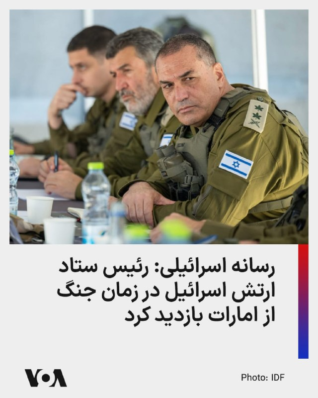

یک رسانه اسرائیلی خبر داد که گفته می‌شود سپهبد ایال زمیر رئیس ستاد ارتش اسرائیل، در جریان جنگ علیه حکومت ایران از امارات متحده عربی بازدید کرده است.

طبق گزارش رسانه دولتی کان اسرائیل، دیگر مقام‌های نظامی این کشور زمیر را در این سفر همراهی کردند. بر اساس این گزارش، در طول این سفر، زمیر با مقام‌های اماراتی، از جمله محمد بن زاید، رئیس‌ امارات دیدار کرده است.

ارتش اسرائیل هنوز درباره این گزارش اظهار نظر نکرده است.

این موضوع پس از آن مطرح شد که بنیامین نتانیاهو نخست‌وزیر اسرائیل روز چهارشنبه گفت او نیز در جریان جنگ علیه رژیم ایران از امارات بازدید کرده است؛ امارات بعدا این سفر را تکذیب کرد.

همچنین گزارش شده است که رؤسای شین‌بت و موساد نیز در جریان جنگ از امارات بازدید کرده‌اند.

پیشتر، مقام‌های ارشد آمریکایی گزارش‌ها مبنی بر این که اسرائیل یک سامانه «گنبد آهنین» را به امارات ارسال کرده، تأیید کردند.
@FarsiVOA

## FarsiVOA — post 217814

  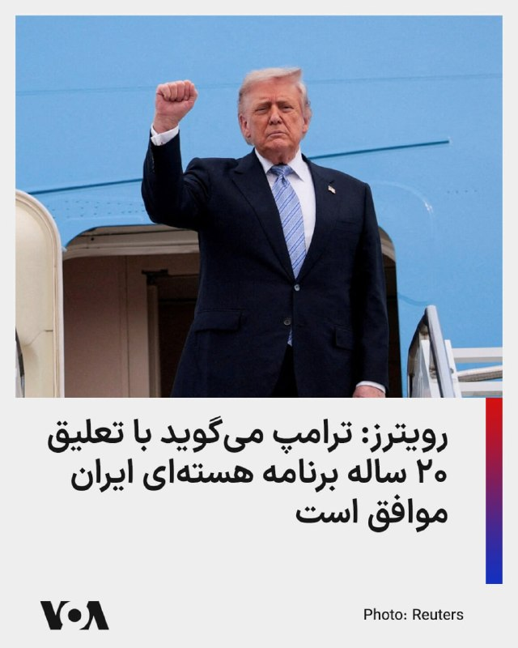

خبرگزاری رویترز گزارش داد که دونالد ترامپ، رئیس‌جمهور آمریکا اعلام کرده که با تعلیق برنامه هسته‌ای ایران به مدت ۲۰ سال موافق است، اما باید یک تعهد «واقعی» از سوی تهران وجود داشته باشد.

بر اساس گزارش رویترز، ترامپ همچنین گفت: «طی چند روز آینده درباره لغو تحریم‌ها علیه شرکت‌های نفتی چینی که نفت ایران را می‌خرند تصمیم خواهم گرفت.»

رئیس‌جمهور آمریکا گزارش‌هایی را که ادعا می‌کنند جمهوری اسلامی ظرفیت موشکی خود را حفظ کرده، رد کرد و گفت ۸۰ درصد این توان از بین رفته است.

آقای ترامپ که ساعاتی است پکن را به مقصد واشنگتن ترک کرده، در جریان دیدارش با همتای چینی خود گفت که دو کشور در زمینه عدم دستیابی جمهوری اسلامی به سلاح اتمی هم‌نظرند.
@FarsiVOA

## FarsiVOA — post 217813

🔺وزرای بریکس در صدور یک بیانیه مشترک ناکام شدند

▪️نشست دو روزه وزیران خارجه کشورهای عضو گروه اقتصادهای نوظهور بزرگ موسوم به «بریکس» در دهلی نو بدون صدور بیانیه مشترک پایان یافت.

▪️عدم صدور یک بیانیه مشترک در شرایطی بود که به گفته هند، میزبان این نشست، «دیدگاه‌های متفاوتی میان برخی اعضا» درباره وضعیت خاورمیانه وجود داشت.

▪️بریکس شامل کشورهای برزیل، روسیه، هند، چین، آفریقای جنوبی، اتیوپی، مصر، ایران، امارات متحده عربی و اندونزی است.

▪️اختلافات میان اعضا در جریان جنگ اخیر خاورمیانه، به‌ویژه میان تهران و امارات متحده عربی، بیشتر آشکار شده است.

⬇️ بیشتر بخوانید:
https://ir.voanews.com/a/8150371.html

## FarsiVOA — post 217812

🔺۱۸۲۰ ساعت انزوای دیجیتال؛ میلیاردها تومان خسارت و افزایش نگرانی‌های روانی

▪️ایران در حالی وارد هفتاد و هفتمین روز از محدودیت‌ها و اختلال گسترده اینترنت بین‌المللی شده است که به گفته نت‌بلاکس، نهاد پایش دسترسی به اینترنت، مجموع ساعات قطعی یا اختلال شدید به بیش از هزار و ۸۲۴ ساعت رسیده است.

▪️بر اساس گزارش‌ها، در طول جنگ ۱۲ روزه، اینترنت در ایران ۹ روز قطع بوده است. همچنین در جریان اعتراضات دی‌ماه، این اختلال به ۲۱ روز رسیده و از ۹ اسفند تا امروز نیز ۷۷ روز محدودیت ثبت شده است.

▪️در مجموع، این دوره‌ها حدود ۱۰۷ روز خاموشی یا اختلال اینترنتی را شامل می‌شود؛ به این معنا که شهروندان ایرانی تقریباً یک‌سوم روزهای ۱۱ ماهه گذشته را در شرایط دسترسی محدود به اینترنت سپری کرده‌اند.

⬇️ بیشتر بخوانید:
https://ir.voanews.com/a/8150370.html

## DW_Farsi — post 124725

🔶 توقف موقت فعالیت‌های فرودگاه هلسینکی به دلیل مشاهده یک پهپاد

فرودگاه هلسینکی بامداد جمعه (۱۵ مه ۲۰۲۶) به‌دلیل هشدار امنیتی درباره احتمال حضور یک پهپاد، برای چند ساعت فعالیت‌های خود را متوقف کرد. مقام‌های فنلاندی بعدتر اعلام کردند خطر در منطقه اوسیما برطرف شده و رفت‌وآمد هوایی در فرودگاه از سر گرفته شده است.

خبرگزاری آلمان گزارش داد، نهادهای امنیتی برای منطقه اوسیما در جنوب فنلاند، که هلسینکی را نیز در بر می‌گیرد، هشدار خطر صادر کردند و از حدود ۱/۸ میلیون نفر از ساکنان این منطقه خواستند در خانه‌های خود بمانند.

در پی این هشدار، فرودگاه هلسینکی از حدود ساعت ۴ تا ۷ صبح به وقت محلی فعالیت خود را متوقف کرد.

در گزارش‌ها آمده است نیروهای مسلح فنلاند به‌طور موقت جنگنده‌هایی را به پرواز درآوردند و دیگر نهادهای امدادی و امنیتی نیز وارد عمل شدند.

@dw_farsi

## DW_Farsi — post 124724

  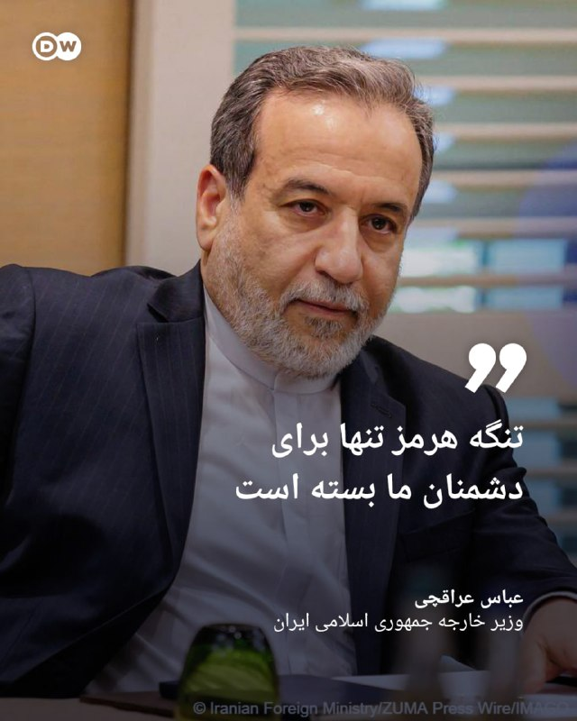

🔶 عراقچی: تنگه هرمز تنها برای دشمنان ما بسته است

عباس عراقچی، وزیر خارجه جمهوری اسلامی در گفت‌وگو با یک رسانه هندی به موضوعاتی از جمله پیامدهای جنگ آمریکا و اسرائیل علیه جمهوری اسلامی پرداخت.

او با قدردانی از موضع بریکس در محکومیت حملات آمریکا و اسرائیل، این حملات را "تجاوزی برخلاف اصول اساسی حقوق بین‌الملل و منشور سازمان ملل متحد" توصیف کرد و گفت: «مسیر پیش‌روی بریکس ادامه حرکت بر پایه اصول این گروه و مسیری است که به‌طور مشترک آغاز کرده‌ایم.»

او افزود: «درباره غرب آسیا نیز معتقدم بهترین راه، دیپلماسی است.» عراقچی در ادامه بدون اشاره به حملات مداوم جمهوری اسلامی به کشورهای همسایه خلیج فارس در جریان جنگ اخیر مدعی شد: «هیچ راه‌حل نظامی‌ای وجود ندارد و فکر می‌کنم ایالات متحده باید این واقعیت را درک کند. آن‌ها دست‌کم دو بار ما را آزموده‌اند و اکنون به این نتیجه رسیده‌اند که راه‌حل نظامی وجود ندارد.»

وزیر خارجه جمهوری اسلامی افزود: «آن‌ها نمی‌توانند از طریق اقدامات نظامی به اهداف خود برسند، اما اگر مسیر دیپلماسی را دنبال کنند، موضوع متفاوت خواهد بود. ما پیش‌تر تعاملات را آغاز کرده‌ایم، اما همان‌طور که می‌دانید مشکلات زیادی در این مسیر وجود دارد. مهم‌ترین مشکل، پیام‌های متناقضی است که از سوی آمریکایی‌ها از طریق اظهارنظرها، مصاحبه‌ها و مواضع مختلف دریافت می‌کنیم.»

عراقچی همچنین با اشاره به اختلالات ایجادشده در تنگه هرمز که فشار زیادی بر زنجیره تامین جهانی و به‌ویژه در زمینه انرژی ایجاد کرده، جمهوری اسلامی را در این خصوص مقصر ندانست و گفت که حکومت ایران "آغازگر این جنگ" نبوده است.

عراقچی افزود: «ما فقط از خود دفاع می‌کنیم و معتقدم حق کامل دفاع مشروع را داریم. تا آنجا که به ما مربوط می‌شود، تنگه هرمز بسته نیست، به‌ویژه برای کشورهای دوست. این محدودیت تنها برای دشمنان ما اعمال می‌شود.»

وزیر خارجه جمهوری اسلامی در ادامه افزود: «کشتی‌های متعلق به کشورهای دوست و سایر کشورها فقط ملزم هستند عبور خود را با نیروهای نظامی ما هماهنگ کنند تا از هرگونه مانع احتمالی جلوگیری شود و عبوری امن داشته باشند. در روزهای گذشته نیز کشتی‌های زیادی با کمک نیروهای دریایی ما از این تنگهعبور کرده‌اند و این روند ادامه خواهد داشت.»

@dw_farsi

## DW_Farsi — post 124723

  

🔶 الهه و الناز محمدی برنده جایزه "شجاعت در روزنامه‌نگاری" شدند

بنیاد بین‌المللی رسانه زنان (IWMF) برنگان سی‌وهفتمین دوره سالانه جوایز "شجاعت در روزنامه‌نگاری" را معرفی کرد.

این جایزه از زنانی تقدیر می‌کند که تحت شرایط خطرناک و فشار شدید برای آشکار کردن حقیقت گزارش تهیه می‌کنند.

برندگان سال ۲۰۲۶ شامل الهه و الناز محمدی، خواهران ایرانی و خبرنگاران رسانه‌های چاپی؛ جورجیا فورت، خبرنگار تلویزیونی از ایالات متحده آمریکا؛ و نای مین نی (با استفاده از نام مستعار)، خبرنگار دیجیتال از میانمار هستند.

فرنچی می کامپیو، خبرنگار فیلیپینی که درباره خشونت حکومتی در فیلیپین گزارش تهیه می‌کند و اکنون در همان کشور زندانی است، جایزه "والیس آننبرگ برای عدالت برای زنان روزنامه‌نگار" بنیاد بین‌المللی رسانه زنان در سال ۲۰۲۶ را دریافت کرد؛ این جایزه‌ که هر سال به روزنامه‌نگاری اعطا می‌شود که به ناحق بازداشت، زندانی یا محبوس شده باشد.

برندگان جایزه شجاعت امسال از میان نامزدهایی از ۵۳ ملیت انتخاب شدند. به گفته ناظران، این امر نشان‌دهنده کاهش آزادی مطبوعات در جهان است و با ترکیبی از فشارهای حقوقی، ارعاب جنسیتی و هدف‌گیری دیجیتال تشدید شده است.

الیزا لیس مونوز، رئیس بنیاد بین‌المللی رسانه زنان با اشاره به برندگان جوایز امسال شجاعت در روزنامه‌نگاری گفت: «جرم‌انگاری حقیقت‌گویی همان چیزی است که شجاعت را به آینده روزنامه‌نگاری تبدیل می‌کند. برای زنانی که جرات گزارشگری دارند، خود روزنامه‌نگاری در حال بازتعریف شدن به‌عنوان عملی قابل مجازات است.»

او افزود: «ما دیگر در جهانی از سرکوب واکنشی زندگی نمی‌کنیم، بلکه در جهانی از بازدارندگی پیش‌دستانه هستیم؛ جایی که خودِ گزارشگری به یک مسئولیت خطرناک تبدیل شده است. بنیاد بین‌المللی رسانه زنان با افتخار از الهه، الناز، فرنچی، جورجیا و نای، زنانی که با همان خطری زندگی می‌کنند که درباره آن گزارش تهیه می‌کنند، امسال با جوایز شجاعت تقدیر می‌کند.»

@dw_farsi

## DW_Farsi — post 124722

  

🔶 ترامپ: روند نابودی نظامی ایران ادامه خواهد داشت

دونالد ترامپ، رئیس ‌جمهور ایالات متحده آمریکا، در یک پست طولانی در شبکه اجتماعی خود تروث سوشال، هنگام فهرست کردن آنچه موفقیت‌های دولتش خواند، از "درهم‌کوبیدن نظامی ایران" نام برد.

او در ادامه جمله مربوط به ایران، داخل پرانتز نوشت: «ادامه دارد»؛ عبارتی که به گفته ناظران سیاسی ممکن است نشان‌دهنده این باشد که او پس از بازگشت از سفرش به چین در روز جمعه، جنگ علیه جمهوری اسلامی را از سر بگیرد.

همزمان برخی منابع خبری اسرائیلی گزارش داده‌اند که در اسرائیل این باور وجود دارد که ترامپ، پس از بازگشت از سفرش به چین در پایان هفته، درباره ازسرگیری جنگ علیه ایران تصمیم خواهد گرفت.

بر اساس اعلام منابع اسرائیلی، رئیس ‌جمهور آمریکا با دو گزینه اصلی روبه‌رو است: ازسرگیری درگیری‌ها، همان‌طور که گفته می‌شود بنیامین نتانیاهو، نخست‌وزیر اسرائیل، این گزینه را ترجیح می‌دهد، یا گزینه دوم یعنی ازسرگیری محاصره تنگه هرمز در چارچوب آنچه عملیات آمریکایی "پروژه آزادی" توصیف شده است.

در عین حال، بر اساس گزارش شبکه ۱۲ اسرائیل (کان)، ترامپ همچنین ممکن است در پایان سفر تاریخی خود به چین تصمیم بگیرد که "هیچ تصمیمی" نگیرد.

در همین راستا منابع اسرائیلی به روزنامه هاآرتص گفته‌اند اگرچه در حال حاضر، وضعیت هشدار غیرعادی وجود ندارد، اما احتمال ازسرگیری درگیری‌ها در روزهای آینده همچنان وجود دارد.

@dw_farsi

## DW_Farsi — post 124721

  

🔶 رویترز از حمله پهپادی به مقر یک حزب کرد ایرانی در اربیل خبر داد

خبرگزاری رویترز به نقل از منابع امنیتی، از حمله دو پهپاد به یک مقر احزاب کرد ایرانی مخالف جمهوری اسلامی در شمال اربیل در اقلیم کردستان عراق خبر داد.
این خبرگزاری نوشت که این حمله توسط دو پهپاد روز جمعه صورت گرفته است. با این حال رویترز نام این حزب را ذکر نکرده و جزئیات بیشتری در خصوص خسارات و تلفات احتمالی این حمله منتشر نکرده است.

پیش از این این، حزب دموکرات کردستان ایران از حمله پهپادی مجدد جمهوری اسلامی به کمپ‌های این حزب در شامگاه چهارشنبه، ۲۳ اردیبهشت‌ماه ۱۴۰۵، ساعت ۲۱:۳۰ به وقت محلی خبر داده بود.

بر اساس اطلاعیه این حزب، جمهوری اسلامی در این حمله با دو پهپاد، کمپ "جژنیکان" متعلق به حزب دموکرات کردستان ایران در نزدیکی اربیل را هدف قرار داد که گفته شده "محل استقرار خانواده‌ها و پناهجویان این حزب است".

این کمپ به گفته حزب دموکرات کردستان از ابتدای جنگ۴۰ روزه، "تاکنون بارها هدف حملات مستقیم قرار گرفته است".

حزب دموکرات کردستان پیش از این اعلام کرده بود که حکومت ایران از زمان آغاز درگیری‌ها با آمریکا و اسرائیل، "با بیش از ۱۲۶ فروند موشک و پهپاد، کمپ‌های مدنی، مراکز درمانی و نهادهای آموزشی حزب دموکرات کوردستان ایران را هدف قرار داده است".

@dw_farsi

## Persian_Trend_Official — post 14189

ترامپ مدعی شد: رئیس جمهور چین به من اطمینان داد که با داشتن سلاح هسته‌ای توسط ایران مخالف است. 🔹من از رئیس جمهور چین چیزی در رابطه با ایران نخواستم. 🔹من از رئیس جمهور چین نخواستم که به ایران برای باز کردن تنگه هرمز فشار بیاورد. 🔹ظرف چند روز آینده در مورد…

## Persian_Trend_Official — post 14188

  <a href="telegram/content/Persian_Trend_Official_14188_1778848248.jpg">🎬 Download video</a>

🔴ترامپ: «من دیگر خیلی بیشتر از این صبر نخواهم کرد. آنها باید توافق را امضا کنند.» 💢آخرین چیزی که الان به آن نیاز داریم جنگ است، ایران میتواند اورانیوم غنی شده خود را به چین یا آمریکا تحویل دهد 🫆:Tony 📌 @persian_trend_official پرشین ترند | متفاوت‌ترین کانال…

## Persian_Trend_Official — post 14187

🔴ترامپ اشاره کرد که می‌تواند توقف ۲۰ ساله فعالیت‌های هسته‌ای ایران را بپذیرد: ۲۰ سال کافی است. اما سطح تضمین از طرف آنها... باید واقعاً ۲۰ سال باشد. 🫆:Tony 📌 @persian_trend_official پرشین ترند | متفاوت‌ترین کانال نظامی

## Persian_Trend_Official — post 14186

  <a href="telegram/content/Persian_Trend_Official_14186_1778848249.mp4">🎬 Download video</a>

🔴ترامپ اشاره کرد که می‌تواند توقف ۲۰ ساله فعالیت‌های هسته‌ای ایران را بپذیرد:

۲۰ سال کافی است. اما سطح تضمین از طرف آنها... باید واقعاً ۲۰ سال باشد.

🫆:Tony

📌 @persian_trend_official
پرشین ترند | متفاوت‌ترین کانال نظامی

## Persian_Trend_Official — post 14184

  <a href="telegram/content/Persian_Trend_Official_14184_1778848250.mp4">🎬 Download video</a>

💢عراقچی: خبر رد پیشنهاد جمهوری اسلامی توسط آمریکا برای چند روز پیش هست/ پیام‌های از آمریکا گرفتیم که مایل به ادامه گفتگو و تعامل هستند

🔹وزیر امورخارجه در نشست خبری:

💢اینکه مطرح شده آمریکا پیشنهاد یا پاسخ ایران را رد کرده مربوط به چند روز پیش هست که آقای ترامپ توییت زد و گفت که غیر قابل قبول هست و ولی بعد از ما مجدد پیام‌هایی را از طرف آمریکایی‌ها گرفتیم که مایل به ادامه گفتگوها و ادامه تعامل هستند.

💢اینکه امروز چطوری دوباره این موضوع در رسانه‌ها برجسته شده، من اطلاع ندارم ولی قضیه مربوط به چند روز پیش هست.

🫆:Tony

📌 @persian_trend_official
پرشین ترند | متفاوت‌ترین کانال نظامی

## RadioFarda — post 157216

🔸عباس عراقچی، وزیر خارجه ایران، می‌گوید تهران پیام‌هایی از ایالات متحده دریافت کرده که نشان می‌دهد دولت دونالد ترامپ آمادهٔ ادامه مذاکرات با هدف پایان دادن به جنگ خاورمیانه است.

🔸عراقچی روز جمعه ۲۵ اردیبهشت در دهلی نو گفت: «این‌که گفته شد ایالات متحده پیشنهاد ایران یا پاسخ ایران به پیشنهاد آمریکا را رد کرده، مربوط به چند روز پیش بود؛ زمانی که آقای ترامپ در شبکه‌های اجتماعی نوشت که این پیشنهاد قابل قبول نیست.»

🔸او افزود: «اما پس از آن، دوباره از طرف آمریکایی‌ها پیام‌هایی دریافت کردیم مبنی بر این‌که آن‌ها مایل به ادامهٔ مذاکرات و ادامهٔ تعامل هستند.»

🔸آقای عراقچی همچنین گفت ایران هم برای بازگشت به درگیری نظامی و هم برای راه‌حل‌های دیپلماتیک آمادگی دارد. او در ادامه افزود روند میانجی‌گری پاکستان شکست نخورده، اما با دشواری‌هایی روبه‌رو است.

🔸وزیر خارجه ایران جزئیات بیشتری دربارهٔ این دشواری‌ها ارائه نکرد. او در عین حال گفت «موضوع غنی‌سازی ما پیچیده است و برای رسیدن به نتیجه با طرف آمریکایی پیشنهاد دادیم این بحث به تعویق بیفتد».

@RadioFarda

## RadioFarda — post 157215

  

📷 Photo

## RadioFarda — post 157214

🔸وزارت خارجه چین روز جمعه گفت ادامه جنگ ایران «هیچ فایده‌ای ندارد» و خواستار بازگشایی مسیرهای کشتیرانی «در اسراع وقت» و بازگشت به گفت‌وگو و دستیابی به آتش‌بسی پایدار در خاورمیانه شد. 🔸سخنگوی وزارت خارجه چین در پاسخ به پرسشی درباره گفت‌وگوهای احتمالی میان…

## RadioFarda — post 157213

  

🔸وزارت خارجه چین روز جمعه گفت ادامه جنگ ایران «هیچ فایده‌ای ندارد» و خواستار بازگشایی مسیرهای کشتیرانی «در اسراع وقت» و بازگشت به گفت‌وگو و دستیابی به آتش‌بسی پایدار در خاورمیانه شد.

🔸سخنگوی وزارت خارجه چین در پاسخ به پرسشی درباره گفت‌وگوهای احتمالی میان پکن و واشینگتن درباره ایران و موضع چین نسبت به جنگ گفت: «ادامهٔ این درگیری هیچ فایده‌ای ندارد؛ درگیری‌ای که اساساً نباید رخ می‌داد.»

🔸او افزود: «یافتن راهی سریع برای حل‌وفصل وضعیت نه تنها به نفع آمریکا و ایران، بلکه به سود کشورهای منطقه و دیگر نقاط جهان است.»

🔸این مقام چینی همچنین تأکید کرد اکنون که «درِ گفت‌وگو باز شده است، نباید دوباره بسته شود» و خواستار حفظ روند کاهش تنش و پیگیری راه‌حل سیاسی برای حل‌وفصل مسئله هسته‌ای ایران و دیگر اختلافات شد.

@RadioFarda

## RadioFarda — post 157212

ارزیابی امنیتی از احتمال افزایش حملات تروریستی در اتحادیه اروپا در پی جنگ ایران

🔸یک ارزیابی امنیتی رسمی در اتحادیه اروپا حاکی از «افزایش نگرانی» از احتمال وقوع حملات تروریستیِ تلافی‌جویانه در اروپا در پی جنگ آمریکا و اسرائیل با ایران است.

🔸این ارزیابی امنیتی که رادیو اروپای آزاد/رادیو آزادی آن را رؤیت کرده، با اشاره به افزایش خطر از جانب افغانستان و ایران هشدار می‌دهد که تروریسم و افراط‌گری خشونت‌آمیز «تهدیدی چشمگیر برای اتحادیه اروپا» است.

🔸این سند ۲۳ صفحه‌ای که شورای اتحادیه اروپا تهیه کرده، بیشتر به اخبار و گرایش‌ها در سال ۲۰۲۵ پرداخته است تا تهدیدهای مرتبط با جنگ در ایران.

🔸با این همه در آن هشدار داده شده است که افزایش تنش در ایران به بالا رفتن سطح نگرانی از «فعال شدن شبکه‌های نیابتی و هسته‌های خفته برای انجام حملات تلافی‌جویانه در اروپا» دامن زده است.

🔸بر اساس این سند، این هشدار بیشتر دربارهٔ کشورهایی صدق می‌کند که جمعیت مسلمان یا یهودی «بزرگ یا چشمگیری» دارند.

🔸ارزیابی امنیتی اتحادیه اروپا در نگاه به افغانستان نیز درباره تهدید «گروه داعش خراسان» هشدار داده است،؛ شاخه‌ای از گروه تروریستی داعش که هم‌چنان فعال است و «یکی از تهدیدهای خارجی عمده» برای قاره اروپا شمرده می‌شود.
در سال جاری میلادی، حملات تروریستی قابل توجهی گزارش نشده است، اما چند حمله منفرد و جداگانه، به‌ویژه به یهودیان در چند کشور اروپایی، رخ داده است.

🔸در هفته‌های اخیر افرادی با بمب‌های آتش‌زا به چند کنیسه، یک فروشگاه حلال یهودیان، و چهار آمبولانس یک خیریۀ یهودی در لندن و شهرهای دیگر در بریتانیا حمله کرده‌اند.

🔸 گزارش کامل را در وب‌سایت رادیوفردا بخوانید.

@RadioFarda

## RadioFarda — post 157211

ایالات متحده ۱.۸ میلیارد دلار دیگر برای عملیات امدادرسانی سازمان ملل اختصاص داد

🔸ایالات متحده از اختصاص ۱.۸ میلیارد دلار کمک بشردوستانهٔ جدید برای عملیات امدادرسانی تحت هدایت سازمان ملل در سراسر جهان، از جمله ادامهٔ حمایت از اوکراین، خبر داد.

🔸مقام‌های ارشد آمریکا و سازمان ملل در نشستی که ۲۴ اردیبهشت به میزبانی مرکز مطبوعاتی خارجی وزارت خارجهٔ آمریکا برگزار شد، گفتند این بستهٔ جدید بر پایهٔ توافق «بازتنظیم بشردوستانه» میان واشینگتن و دفتر هماهنگی امور بشردوستانهٔ سازمان ملل، اوچا، در دسامبر ۲۰۲۵ تهیه شده است.

🔸با این کمک تازه، مجموع حمایت آمریکا در چارچوب این توافق به ۳.۸ میلیارد دلار برای ۲۱ کشور بحران‌زده می‌رسد.

🔸مایک والتز، سفیر آمریکا در سازمان ملل، گفت این کمک هم «جان انسان‌های بیشتری را در سراسر جهان نجات خواهد داد» و هم به اصلاحاتی کمک می‌کند که هدف آن‌ها افزایش «کارآمدی، پاسخگویی و اثرگذاری پایدار» است.

🔸این بودجه به صندوق‌های مشترک اوچا و برنامه‌های اضطراری در کشورهایی از جمله اوکراین، سودان، سوریه، هائیتی، لبنان و ونزوئلا اختصاص می‌یابد.

🔸آنتونیو گوترش، دبیرکل سازمان ملل، از این تصمیم استقبال کرد و گفت این کمک به نهادهای امدادرسان امکان می‌دهد «به میلیون‌ها نفر در بحرانی‌ترین مناطق جهان، کمک‌های نجات‌بخش برسانند.»

🔸نسخه کامل این گزارش را در وب‌سایت رادیوفردا بخوانید.

## RadioFarda — post 157210

  <a href="https://t.me/radiofarda/157210">📎 Download file</a>

📻بشنوید: ساعت ۱۴ با رادیوفردا، ۲۵ اردیبهشت ۱۴۰۵‌

@Radiofarda

## RadioFarda — post 157209

  

🔸اصغر فرهادی، کارگردان سرشناس، در نشست خبری فیلم تازه‌اش در جشنوارهٔ کن گفت کشته شدن غیرنظامیان در جنگ اخیر و کشتار معترضان دی‌ماه هر دو دردناک بودند و فراموش نخواهند شد.

🔸فرهادی که با فیلم «داستان‌های موازی» محصول فرانسه در بخش رقابتی جشنواره کن حضور دارد، به اعتراضات سراسری دی‌ماه و جنگ آمریکا و اسرائیل با ایران اشاره کرد و گفت: «من تا هفتهٔ پیش در تهران بودم و هنوز اثر این اتفاقات دردناک با من همراه است؛ کشته شدن بسیاری انسان‌های بی‌گناه، کودکان و غیرنظامیان در جنگ؛ پیش از آن نیز کشته شدن معترضان در خیابان‌ها در دی‌ماه که تعداد زیادی هم آن‌جا کشته شدند، آدم‌های بی‌گناهی که معترض بودند. هر دو برای من بسیار دردناک است و فراموش نخواهد شد.»

🔸اصغر فرهادی در بخش دیگری از سخنان خود تأکید کرد که «همدلی با کشته شدن بی‌گناهان و غیرنظامیان و آدم‌های معمولی معنایش موافقت با کشته شدن آن بخش دیگر در خیابان‌ها نیست.»

🔸او گفت: «همدلی با کشته‌شدگانی که در خیابان‌ها بودند نیز به معنای همدلی نکردن با کسانی که در جنگ کشته شدند، نیست. کشتن و قتل انسان‌ها برای من قابل پذیرش نیست.»

@RadioFarda

## RadioFarda — post 157208

  

🔸نشست وزیران خارجهٔ کشورهای عضو بریکس در دهلی‌نو، پایتخت هند، به‌دلیل اختلاف‌نظر میان اعضا به‌خصوص بین ایران و امارات متحدهٔ عربی بر سر جنگ ایران، بدون صدور بیانیهٔ مشترک پایان یافت.

🔸به‌گزارش رویترز، هند روز جمعه ۲۵ اردیبهشت اعلام کرد به‌جای بیانیهٔ مشترک، «بیانیهٔ رئیس» منتشر شده است، زیرا برخی اعضا دربارهٔ تحولات خاورمیانه دیدگاه‌های متفاوتی داشتند.

🔸گروه بریکس شامل برزیل، روسیه، هند، چین، آفریقای جنوبی، اتیوپی، مصر، ایران، امارات متحدهٔ عربی و اندونزی است.

🔸روز پنجشنبه رسانه‌های ایران از تنش لفظی در این نشست خبر دادند و نوشتند عباس عراقچی، وزیر خارجه ایران، امارات را به مشارکت مستقیم در جنگ آمریکا و اسرائیل علیه ایران متهم کرد و گفت میزبانی پایگاه‌های نظامی آمریکا از سوی ابوظبی و همکاری امنیتی این کشور با اسرائیل، آن را به بخشی از جنگ تبدیل کرده است.

🔸روزنامهٔ لبنانی الاخبار نوشت که در مقابل، هیئت اماراتی خواهان آن بود که هر بیانیهٔ نهایی، حملات موشکی جمهوری اسلامی ایران به این کشور و توقیف کشتی‌ها را محکوم کند، در حالی که تهران بر درج محکومیت صریح حملات آمریکا و اسرائیل اصرار داشت.

@RadioFarda

## IranianMinds — post 20191

🔴عراقچی:

اگر آنها بخواهند به جنگ بازگردند، این به خودشان بستگی دارد.

@IranianMinds

## IranianMinds — post 20190

🔴 ترامپ:

تنها کشورهایی که قادر به خارج کردن غبار هسته‌ای از ایران هستند، آمریکا و چین هستند.

@IranianMinds

## IranianMinds — post 20189

🔴 ترامپ:

می‌توانستیم پل‌ها و شبکه‌های برق ایران را نابود کنیم و همه چیز را آن‌جا طی دو روز از بین ببریم.

@IranianMinds

## IranianMinds — post 20188

🔴 ترامپ:

اگر ۹ ماه پیش از بمب‌های B-2 استفاده نکرده بودم، ایران اکنون قادر به دستیابی به سلاح هسته‌ای بود.

@IranianMinds

## IranianMinds — post 20187

🔴 ترامپ:

رئیس ‌جمهور چین با عدم دستیابی ایران به سلاح هسته‌ای موافق است و می‌خواهد ایران تنگه هرمز را باز کند.

@IranianMinds

## IranianMinds — post 20186

🔴 ترامپ:

تحقیقات درباره هدف قرار گرفتن مدرسه‌ای در ایران ( مدرسه میناب ) در جریان است.

@IranianMinds

## IranianMinds — post 20185

🔴 ترامپ:

پیشنهاد ایرانیا که برام رسید همون‌ جمله ی اول متنشونو که خوندم برام قابل قبول نبود و سریع ردش کردم

@IranianMinds

## IranianMinds — post 20184

🔴 ترامپ:

ارتش ایران را نابود کردیم و شاید لازم باشد یک عملیات پاکسازی سبک دیگر‌ هم انجام دهیم.

@IranianMinds

## IranianMinds — post 20183

🔴 ترامپ:

نیروی هوایی ایران را کاملا نابود کردیم و از شر رهبران ایرانی خلاص شدیم.

@IranianMinds

## IranianMinds — post 20182

🔴 ترامپ:

ایران هرگز به سلاح هسته‌ای دست نخواهد یافت و تحت هیچ شرایطی فرصتی برای آن نخواهد داشت.

@IranianMinds

## IranianMinds — post 20181

  <a href="telegram/content/IranianMinds_20181_1778848255.mp4">🎬 Download video</a>

🔴 ترامپ درباره رهبر کره شمالی :

من رابطه خیلی خوبی با کیم جونگ‌اون دارم.

او به کشور ما احترام گذاشته است و من می‌خواهم همین احترام را ادامه دهد.

@IranianMinds

## IranianMinds — post 20180

🔴 ترامپ:

80 درصد از توان موشکی ایران نابود شده است

@IranianMinds

## IranianMinds — post 20179

  <a href="telegram/content/IranianMinds_20179_1778848257.mp4">🎬 Download video</a>

🔴 ترامپ در مورد توقف فعالیت هسته ای ایران:

۲۰ سال کافی است. اما میزان تضمینی که از طرف آن‌ها داده می‌شود… باید واقعاً ۲۰ سال باشد

@IranianMinds

## IranianMinds — post 20178

🔴 ترامپ:

در مورد تایوان هیچ تعهدی به رئیس جمهور چین ندادم.

@IranianMinds

## IranianMinds — post 20177

🔴 ترامپ:

رئیس‌ جمهور چین به من اطمینان داد که با داشتن سلاح هسته‌ای ایران مخالف است

@IranianMinds

## IranianMinds — post 20176

🔴 ترامپ به رویترز :

من مانعی ندارم که ایران برنامه هسته‌ای خود را برای ۲۰ سال متوقف کند، اما این باید یک تعهد واقعی باشد!

@IranianMinds

## BBCPersian — post 281132

  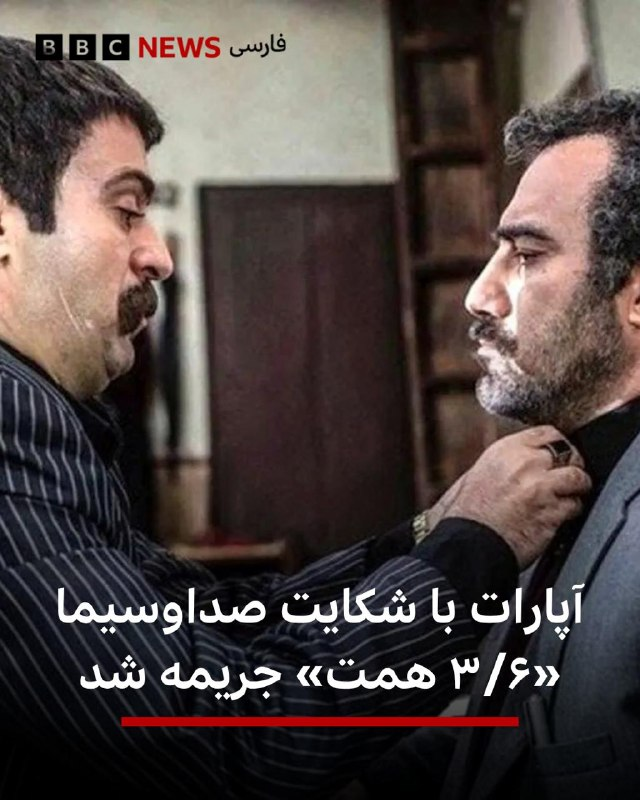

شرکت صاحب آپارات، سکوی نمایش محتوای آنلاین در ایران می‌گوید که در پی شکایت صداوسیما به دادگاه، بابت «نشر، پخش و عرضه اثر فرهنگی بدون اجازه» به پرداخت سه هزار و ۶۰۰ میلیارد تومان جریمه محکوم شده است.

در بیانیه‌ای که همراه با تصویر رای دادگاه در وبسایت آپارات منتشر شده آمده است که «مدیرعامل و شرکت فناوران ایده‌پرداز صبا به پرداخت حدود ۳/۶ همت خسارت بابت انتشار محتوایی که توسط کاربران بر بستر این پلتفرم بارگذاری شده محکوم شده و دادگاه، مسئولیت این محتوا را متوجه پلتفرم دانسته است.»

آپارات که پلتفرمی بومی و شبیه یوتوب در ایران است، چند سال پس از فیلتر شدن یوتیوب و سکوهای مشابه بارگذاری و تماشای ویدیو، در سال ۱۳۸۹ در ایران راه‌اندازی و با رشد چشمگیر کاربران ایرانی مواجه شد.

آپارات می‌گوید که پیشتر در شکایتی مشابه از سوی این سازمان، از دیوان عالی کشور رای برائت گرفته بود.

در رای دادگاه کیفری کارکنان دولت آمده است که این پلتفرم در خصوص نمایش ۷۵۵ اثر تلویزیونی بدون اجازه و منتفع شدن از درآمدهای تبلیغات ترافیک وبسایت میزبان، حق انحصاری پخش این آثار را نقض کرده است.

این حکم قابل تجدیدنظرخواهی است.
@bbcpersian

## BBCPersian — post 281131

  

🔻امارات متحده عربی از تسریع ساخت خط‌ لوله‌ای خبر داده است که این کشور امیدوار است با اتکا به آن ظرفیت صادرات نفت خود از مسیر فجیره را تا سال ۲۰۲۷ دو برابر کند و وابستگی به تنگه هرمز را کاهش دهد.

دفتر رسانه‌ای دولت ابوظبی روز جمعه گزارش داد که شیخ خالد بن محمد بن زاید، ولیعهد این شیخ‌نشین، به شرکت ملی نفت امارات دستور داده است که پروژه خط لوله غرب به شرق با سرعت بیشتری اجرا شود. به گفته مقام‌های اماراتی، این پروژه هم‌اکنون در حال ساخت است.

امارات در حال حاضر از طریق خط لوله حبشان–فجیره، که ظرفیت انتقال روزانه تا ۱/۸ میلیون بشکه نفت خام را دارد، بخشی از صادرات نفت خود را بدون عبور از تنگه هرمز انجام می‌دهد. این خط لوله نقش مهمی در انتقال مستقیم نفت به سواحل دریای عمان ایفا کرده است.

در میان کشورهای حوزه خلیج فارس، تنها امارات متحده عربی و عربستان سعودی دارای خطوط لوله‌ای هستند که امکان صادرات نفت خام را خارج از مسیر تنگه هرمز فراهم می‌کند.

عمان هم به‌دلیل داشتن خط ساحلی طولانی در دریای عمان، دسترسی مستقیم‌تری به آب‌های آزاد دارد.

📸 Getty

https://bbc.in/3R12525
@BBCPersian

## BBCPersian — post 281130

🔻دیدار نخست‌وزیر هند و رئیس‌ امارات؛ مودی حملات به امارات را محکوم کرد

نارندرا مودی، نخست‌وزیر هند در دیدار با محمد بن زاید آل نهیان،‌ رئیس امارات، ضمن قدرانی از او برای حمایت از جامعه هندی‌های مقیم امارات،‌ حملات به این کشور را «به‌شدت» محکوم کرد.

آقای مودی روز جمعه ۲۵ اردیبهشت پیش از آغاز مجموعه سفرش به کشورهای اروپایی هلند، سوئد،‌ نروژ و ایتالیا وارد ابوظبی شد. سفر او در سایه نگرانی‌ها درباره تنش‌ در خلیج فارس و مساله تامین انرژی انجام می‌شود.

دفتر آقای مودی در شبکه ایکس اعلام کرد که در این سفر «توافق‌نامه‌های مهم در زمینه انرژی، دفاع، زیرساخت‌ها، کشتیرانی و فناوری پیشرفته امضا شده است.»

هند همچنین می‌گوید که ابوظبی متعهد شده است که ۵ میلیارد دلار در هند سرمایه‌گذاری کند، هرچند جزئیات بیشتری ارائه نشده است.

آقای مودی در ویدئویی که وزارت خارجه هند منتشر کرد، گفت: «حفظ آزادی، باز بودن و امنیت تنگه هرمز بالاترین اولویت ماست و در این زمینه، پایبندی به قوانین بین‌المللی ضروری است.»

رئیس امارات شخصا از نخست وزیر هند استقبال کرد. اقدامی که حاکی از روابط دوستانه و عمیق میان دو کشور ارزیابی شده است.

امارات متحده عربی در یک اقدام ویژه، با جنگنده‌های اف‌۱۶ هواپیمای حامل نارندرا مودی،‌ نخست‌وزیر هند را از بدو ورود به حریم هوایی امارات، اسکورت کرد.

آقای مودی در دیدار با محمد بن زاید آل نهیان،‌ رئیس امارات، گفت: «نحوه‌ای که نیروی هوایی شما امروز من را اسکورت کرد،‌ افتخاری برای مردم هند است.»

https://bbc.in/3R12525
@BBCPersian

## BBCPersian — post 281129

  

🔻وزیر خارجه ایران آمریکا را به ارسال پیام‌های‌ متناقض متهم کرده و جدیت واشنگتن را در مورد مذاکره زیر سوال برده است.

عباس عراقچی که در حاشیه نشست بریکس در دهلی نو صحبت می‌کرد، گفت: «آمریکایی‌ها پیام‌های متناقضی می‌فرستند، ما نمی‌دانیم که دقیقا نیت آمریکایی ها چیست.»

وزیر خارجه ایران افزود: «در مورد جدییت آمریکایی‌ها در مذاکرات تردید داریم؛ اما به محض اینکه احساس کنیم و اطمینان حاصل کنیم آنها جدی هستند و آماده یک توافق عادلانه هستند ما به مذاکرات برمی‌گردیم.»

آقای عراقچی همچنین آتش‌بس را «ناپایدار» توصیف کرد اما گفت که ایران سعی دارد آن را حفظ کند.

او در عین حال تاکید کرد که برای این مناقشه «هیچ راه‌ حل نظامی وجود ندارد.»

«ما در برابر هرگونه فشار و تحریم مقاومت می‌کنیم. کشور من بیش از چهل سال هدف تحریم‌های شدید آمریکا بوده اما این سیاست‌های ما را تغییر نداد.»

📷 EPA
https://bbc.in/4wwmkVm
@BBCPersian

## BBCPersian — post 281128

🔻پایان نشست وزرای خارجه بریکس بدون صدور بیانیه مشترک

نشست وزیران خارجه گروه بریکس بدون صدور بیانیه مشترک پایان یافت؛ موضوعی که نشان‌دهنده اختلافات عمیق میان اعضا بر سر جنگ ایران و بحران خاورمیانه است.

این نشست دو روزه در دهلی‌ نو برگزار شد و کشورهای عضو درباره موضوعاتی مانند امنیت دریایی،‌ حاکمیت کشورها، وضعیت تنگه هرمز و جنگ غزه گفت‌وگو کردند.

با این حال اختلاف دیدگاه‌ها به ویژه میان ایران و امارات متحده عربی،‌ مانع دستیابی به موضعی واحد شد.

ایران خواستار آن بود که بریکس اقدامات آمریکا و اسرائیل را محکوم کند.

عباس عراقچی، وزیر خارجه ایران، از کشورهای عضو خواست در برابر «سیاسی کردن نهادهای بین‌المللی» مقاومت کنند و موضعی قاطع‌تر بگیرند. اما برخی اعضا از جمله امارات متحده عربی با این رویکرد موافق نبودند.

در پایان، هند که ریاست دوره‌ای بریکس را برعهده دارد،‌ به جای بیانیه مشترک فقط «بیانیه رئیس نشست» را منتشر کرد،‌ اقدامی که معمولا زمانی انجام می‌شود که اعضا نتوانند بر سر متن نهایی به توافق برسند.

در بیانیه ریاست نشست که توسط وزارت خارجه هند منتشر شد، آمده است که «دیدگاه‌های متفاوتی در بین برخی از اعضا درباره وضعیت در منطقه غرب آسیا/ خاورمیانه» وجود دارد.

این اختلافات نشان می‌دهد که بریکس گسترش یافته، که اکنون شامل کشورهایی مانند ایران،‌ امارات،‌ مصر، اتیوپی و اندونزی هم هست،‌ در حفظ انسجام سیاسی با چالش روبرو شده است،‌ به ویژه زمانی که اعضای آن در بحران‌های منطقه‌ای در جبهه‌های متفاوت قرار دارند.

https://bbc.in/3R12525
@BBCPersian

## BBCPersian — post 281125

🔻روابط عمومی سپاه پاسداران استان لرستان از خنتی‌‌سازی یک بمب از زمان جنگ اسرائیل و آمریکا با ایران در شهرستان دلفان خبر داد. آلبوم را ورق بزنید و در این باره بیشتر بخوانید.

📷 Mehr New Agency / IRIB
https://bbc.in/4wOawOH
@BBCPersian

## BBCPersian — post 281124

🔻عراقچی: پیام‌های آمریکایی‌ها متناقض و نیت‌شان نامشخص است

وزیر خارجه ایران آمریکا را به ارسال پیام‌های‌ متناقض متهم کرده و جدیت واشنگتن را در مورد مذاکره زیر سوال برده است.

عباس عراقچی که در حاشیه نشست بریکس در دهلی نو صحبت می‌کرد، گفت: «آمریکایی‌ها پیام‌های متناقضی می‌فرستند، ما نمی‌دانیم که دقیقا نیت آمریکایی ها چیست.»

وزیر خارجه ایران افزود: «در مورد جدییت آمریکایی‌ها در مذاکرات تردید داریم؛ اما به محض اینکه احساس کنیم و اطمینان حاصل کنیم آنها جدی هستند و آماده یک توافق عادلانه هستند ما به مذاکرات برمی‌گردیم.»

آقای عراقچی همچنین آتش‌بس را «ناپایدار» توصیف کرد اما گفت که ایران سعی دارد آن را حفظ کند.

او در عین حال تاکید کرد که برای این مناقشه «هیچ راه‌ حل نظامی وجود ندارد.»

«ما در برابر هرگونه فشار و تحریم مقاومت می‌کنیم. کشور من بیش از چهل سال هدف تحریم‌های شدید آمریکا بوده اما این سیاست‌های ما را تغییر نداد.»

https://bbc.in/3R12525
@BBCPersian

## idfinfarsi — post 11582

  <a href="telegram/content/idfinfarsi_11582_1778848260.mp4">🎬 Download video</a>

🎬 Video

## idfinfarsi — post 11581

«*توجه فرمائید - دارای محدودیت انتشار قبل از ساعت 14:30 به وقت اسرائیل*»

در طول هفته گذشته حدود ۶۰ تروریست به هلاکت رسیدند: لشکر ۱۴۶ به عملیات خود در جنوب لبنان ادامه می‌دهد

نیروهای تیم‌های رزمی تیپ‌های ۵۵۱، ۴۰۱ و ۳۰۰ تحت فرماندهی لشکر ۱۴۶ همچنان در جنوب خط دفاعی مقدم برای رفع تهدیدها علیه شهروندان اسرائیل به عملیات خود ادامه می‌دهند.

در هفته گذشته، نیروهای تیم رزمی تیپ ۵۵۱ بیش از ۱۰۰ زیرساخت تروریستی، از جمله انبارهای تسلیحاتی و مواضع دیده‌بانی متعلق به حزب‌الله، را هدف قرار دادند. در یکی از عملیات‌ها، یک انبار تسلیحاتی در منطقه رأس‌البیاضه شناسایی شد و در زمان کوتاهی مورد حمله قرار گرفته و منهدم شد.

نیروهای تیم رزمی تیپ ۴۰۱ نیز طی هفته گذشته بیش از ۵۰ مورد تجهیزات نظامی را در منطقه شناسایی کرده و ده‌ها زیرساخت تروریستی را منهدم کردند.

نیروهای تیپ ۳۰۰ همچنان در نقاط کلیدی منطقه برای دفاع از ساکنان جلیل غربی فعالیت می‌کنند. این تیپ تاکنون صدها زیرساخت تروریستی را منهدم کرده است.

ارتش اسرائیل به مقابله با تهدیدها علیه شهروندان این کشور و نیروهای خود ادامه داده و بر اساس دستورالعمل‌های مقامات سیاسی عمل می‌کند.

## Dirty_Kids — post 389493

ایران حتی تبریک تولدهامون‌ هم نفرینه
ایشالله خودت ۱۲۰ ساله بشی بی‌شرف

@Dirty_Kids 👻

## Dirty_Kids — post 389492

  <a href="telegram/content/Dirty_Kids_389492_1778848262.mp4">🎬 Download video</a>

آنلاین شاپا باز شروع کردن...

@Dirty_Kids 👻

## Dirty_Kids — post 389491

  <a href="https://t.me/Dirty_Kids/389491">📎 Download file</a>

✅ اپلیکیشن اندروید سایت جهانی دربی بت

💰اولین سایت جهانی با امکان شارژ و برداشت ریالی(کارت به کارت)

🔗 برای ورود فیلترشکن روی کشور مناسب قرار دهید مانند فنلاند و المان و....

😀Telegram Channel
👇
https://t.me/+bcynkEgSW2dlYTc0

## Dirty_Kids — post 389490

  

😤دنبال یه سایت شرط بندی بین المللی بودی که به ایرانیا خدمات بده؟!
⛔

👍دربی بت همون انتخاب  100%

💎ویژگی های سایت جهانی Derby Bet:

⬅️امکان شارژ امن با کارت بانکی

⬅️واریز اول دوبل شارژ می شوید(بونوس۱۰۰٪)

⬅️پر اپشن ترین سایت فعال در ایران

⬅️تسویه حساب کمتر از 5 دقیقه

⬅️برگشت بخشی از باخت به صورت هفتگی

🚨کد هدیه ثبت نام:GG007

⚠️برای دانلود اپلکیشن کلیک کنید
👉

🔔کانال دربی بت :

🪙https://t.me/+bcynkEgSW2dlYTc0

## Dirty_Kids — post 389489

  <a href="telegram/content/Dirty_Kids_389489_1778848265.mp4">🎬 Download video</a>

در مورد پروپوزال ایران:
ترامپ: جمله اولش رو که خوندم انداختمش دور!
خبرنگار: جمله اول چی بود؟
ترامپ: یه‌ چیز غیرقال قبول! ما نمیخوایم ایران غنی سازی کنه!!
خبرنگار: یعنی ۲۰ سال توقف غنی سازی کافی نیس؟
ترامپ: ۲۰ سال کافیه ولی باید واقعی باشه و تضمین بدن!

@Dirty_Kids 👻

## Dirty_Kids — post 389488

  

مجتبی خامنه‌ای به مناسبت روز بزرگداشت فردوسی، این پیام رو منتشر کرد:

همین که یک تازی راهزن بیابانگرد رافضی به ارزش‌های زبان و ادبیات فارسی اعتراف می‌کند می‌تواند جالب باشد.

@Dirty_Kids 👻

## configx2ray — post 38894

2.22.250.149
23.58.193.140
23.48.23.151
2.19.126.81
23.202.138.125
23.43.237.239
104.112.146.82
23.2.13.136
72.246.28.37
2.18.63.49
2.16.53.11
2.16.53.50
2.16.19.136
2.19.205.58
2.19.205.59
2.19.205.64
2.19.205.65
2.19.205.82
2.19.205.83
92.122.123.128
65.109.34.234
94.130.70.160
63.141.252.203
94.130.50.12
50.7.5.83
142.54.178.211
94.130.33.41
144.76.1.88
138.201.54.122
95.216.69.37
2.19.204.19
2.19.204.87
2.19.204.137
2.19.204.144
2.19.204.145
2.19.204.170
2.19.204.184
2.19.204.185
2.19.204.202
2.19.204.210
2.19.204.211
2.19.204.217
2.19.204.218
2.19.204.225
2.19.204.232
2.19.204.234
2.19.204.240
2.19.204.249
2.19.204.250
2.19.204.251
2.19.205.8
2.19.205.9
2.19.205.11
2.19.205.27
2.19.205.33
2.19.205.34
2.19.205.40
2.19.205.41
2.19.205.42
2.19.205.49
2.19.205.50
2.19.205.88
2.19.205.97
2.19.205.98
2.19.205.105
184.31.169.195
184.31.169.252
184.31.170.97
184.31.170.185
212.71.238.39

لیست ایپی های تست شده برای متود جدید سایفون
🔥

همشو باهم وارد کنید داخل برنامه 
🔥

Channel : https://t.me/ConfigX2ray

## configx2ray — post 38893

جهت دریافت Dns های متصل شیر و خورشید روی همین کلمه کلیک کنید 🌟

## configx2ray — post 38892

چندین DNS متصل تست شده رو براتون تست کردیم برای این که سریع مسدود نشه داخل رباتمون گذاشتیم میتونین با کلیک کردن کلمه زیر دریافت کنید و استفاده کنید 
❤️

جهت دریافت Dns های متصل شیر و خورشید روی همین کلمه کلیک کنید 🌟

Channel : https://t.me/ConfigX2ray

## configx2ray — post 38891

151.101.0.223
151.101.128.223
151.101.192.223
65.109.34.234
151.101.64.223
142.54.178.211
2.16.53.50
2.16.53.11
95.101.133.82
95.101.133.42
104.103.65.50
2.23.168.47
104.103.64.7
2.23.168.254
2.23.168.144
2.23.169.249
2.23.169.42
2.23.170.80
104.103.65.5
95.101.133.131
104.103.65.74
2.16.20.51
23.221.28.57
23.221.29.29
23.221.28.5
2.23.169.111
2.23.168.96
2.23.169.12
2.23.168.174
2.23.168.7
184.84.221.34
2.23.41.22

لیست ایپی های تست شده برای متود جدید سایفون
🔥

همشو باهم وارد کنید داخل برنامه 
🔥

Channel : https://t.me/ConfigX2ray

## configx2ray — post 38890

  <a href="https://t.me/ConfigX2ray/38890">📎 Download file</a>

کانفیگ برای Npv tunnel ⭕️

به هیچ وج دانلود نزنید باهاش
❤️

رمز فایل : @ConfigX2ray

Channel : https://t.me/ConfigX2ray

## configx2ray — post 38889

😈

## configx2ray — post 38888

104.126.37.162
23.73.0.64
96.16.122.141
104.117.76.10
96.16.53.158
92.123.157.46
104.81.175.248
23.58.222.136
23.73.2.148
92.122.166.175
172.237.127.6
104.81.104.13
96.17.207.137
92.123.112.7
96.16.122.75
96.17.207.142
96.17.207.143
92.122.166.182
104.109.128.153
104.96.143.134
23.73.2.141
104.83.5.202
23.67.136.200
23.67.136.202
23.65.119.52
96.16.122.70
92.122.166.236
92.122.166.234
92.122.166.237
104.110.138.190
173.222.200.5
184.51.252.36
184.51.252.38
104.83.5.208
96.16.122.146
96.17.206.214
92.122.166.197
104.94.100.73
104.83.15.66
88.221.213.81
172.239.57.117
104.117.76.40
184.51.252.4
96.17.207.30
96.16.122.83
96.16.122.150
23.73.207.11
96.16.122.77
96.17.207.155
92.123.189.82
96.16.122.82
96.16.122.66
96.7.218.219
96.16.122.137
184.51.252.157
92.123.189.41
184.86.251.12
96.16.122.154
96.16.122.157
184.51.252.152
96.17.207.12
23.79.48.162
96.16.122.74
104.109.250.232
92.123.104.7
104.110.191.57
184.51.233.146
173.222.201.77
96.16.53.134
96.16.122.140
184.51.252.135
172.234.24.211
96.16.122.149
104.122.213.129
104.103.72.97
104.103.65.5
104.83.5.210
104.117.76.152
104.83.5.176
184.86.251.26
96.16.122.133
96.16.53.152
96.16.53.147
96.16.122.152

لیست ایپی های تست شده برای متود جدید سایفون
🔥

همشو باهم وارد کنید داخل برنامه 
🔥

Channel : https://t.me/ConfigX2ray

## configx2ray — post 38887

2.22.250.149
23.58.193.140
23.48.23.151
2.19.126.81
23.202.138.125
23.43.237.239
104.112.146.82
23.2.13.136
72.246.28.37
2.18.63.49
2.16.53.11
2.16.53.50
2.16.19.136



لیست ایپی های تست شده برای متود جدید سایفون
🔥

همشو باهم وارد کنید داخل برنامه 
🔥

Channel : https://t.me/ConfigX2ray

## manototv — post 105483

  <a href="telegram/content/manototv_105483_1778848267.mp4">🎬 Download video</a>

دونالد ترامپ در پاسخ به پرسشی درباره پیشنهاد اخیر جمهوری اسلامی گفت این پیشنهاد را بررسی کرده، اما به گفته او، اگر از جمله نخست یک متن خوشش نیاید، بقیه آن را کنار می‌گذارد.

ترامپ در پاسخ به این پرسش که جمله نخست چه بوده است، آن را «غیرقابل قبول» توصیف کرد و گفت مسئله اصلی از نگاه او این است که ایران نباید «هیچ شکل» از برنامه هسته‌ای داشته باشد.

در ادامه، خبرنگار از ترامپ پرسید آیا دوره ۲۰ ساله برای او کافی نیست. ترامپ پاسخ داد که «۲۰ سال کافی است»، اما به گفته او، سطح تضمین‌هایی که جمهوری اسلامی ارائه می‌دهد اهمیت دارد.

ترامپ گفت که اگر قرار است توافقی ۲۰ ساله مطرح باشد، باید «۲۰ سال واقعی» باشد و نباید به گفته او، توافقی مبهم یا ظاهری باشد.

## manototv — post 105482

  <a href="telegram/content/manototv_105482_1778848268.mp4">🎬 Download video</a>

دونالد ترامپ در پاسخ به پرسشی درباره اینکه آیا شی جین‌پینگ، رئیس‌جمهوری چین، تعهدی قاطع برای فشار بر جمهوری اسلامی به منظور بازگشایی تنگه هرمز داده است، گفت از کسی «درخواست لطف» نمی‌کند.

ترامپ گفت: «من درخواست هیچ لطفی نمی‌کنم، چون وقتی درخواست لطف می‌کنید، باید در مقابل لطفی انجام دهید.» او افزود که آمریکا به چنین کمکی نیاز ندارد.

رئیس‌جمهوری آمریکا در ادامه گفت نیروهای مسلح طرف مقابل «اساسا از بین رفته‌اند» و ممکن است به گفته او «کمی کار پاکسازی» لازم باشد. او همچنین به آتش‌بس اشاره کرد و گفت این آتش‌بس به درخواست کشورهای دیگر انجام شد.

ترامپ گفت شخصا چندان موافق آتش‌بس نبوده، اما آن را به عنوان لطفی به پاکستان پذیرفته است. او از مقام‌های پاکستانی، از جمله نخست‌وزیر و فیلدمارشال این کشور، با تعبیر «افرادی فوق‌العاده» یاد کرد.

## manototv — post 105481

  <a href="telegram/content/manototv_105481_1778848269.mp4">🎬 Download video</a>

«انتقام خون بچه‌ها رو می‌گیریم»

## manototv — post 105480

  <a href="telegram/content/manototv_105480_1778848271.mp4">🎬 Download video</a>

«صدای فاطمه سپهری باشیم»

## manototv — post 105479

  <a href="telegram/content/manototv_105479_1778848272.mp4">🎬 Download video</a>

عباس عراقچی، وزیر خارجه جمهوری اسلامی، در حاشیه نشست بریکس در هند گفت روند میانجیگری پاکستان هنوز شکست نخورده، اما «در مسیری بسیار دشوار» قرار دارد.

عراقچی در نشست خبری خود گفت دشواری این روند عمدتا به دلیل «رفتار آمریکایی‌ها» است. وزیر خارجه جمهوری اسلامی پیش‌تر نیز گفته بود «پیام‌های متناقض» آمریکا یکی از موانع اصلی در مسیر گفتگوهاست.

## alonews — post 120187

  <a href="telegram/content/alonews_120187_1778848274.mp4">🎬 Download video</a>

👈خبرنگار: آیا اصلاً درباره اوکراین با شی صحبت کردید؟ و آیا در این زمینه پیشرفتی حاصل شده است؟

🔴ترامپ: بله، صحبت کردیم — خب، این موضوعی است که دوست داریم حل شود. تا دیشب اوضاع خوب به نظر می‌رسید، اما آنها دیشب ضربه بزرگی خوردند.

🔴پس این اتفاق خواهد افتاد، اما حیف است

✅ @AloNews خبر جنگ

## alonews — post 120186

  <a href="telegram/content/alonews_120186_1778848276.mp4">🎬 Download video</a>

👈خبرنگار: دیروز از دریاسالار کوپر درباره حمله به مدرسه دخترانه در اولین روز جنگ سوال شد.

🔴ترامپ: شما درباره مورد اصلی صحبت می‌کنید — که در حال بررسی است.

🔴خبرنگار: آیا می‌توانید تایید کنید که این موشک آمریکایی بود؟

🔴ترامپ: شما با چه کسی هستید؟

🔴خبرنگار: بی‌بی‌سی.

🔴ترامپ: بی‌بی‌سی جعلی.

✅ @AloNews خبر جنگ

## alonews — post 120185

  <a href="telegram/content/alonews_120185_1778848277.jpg">🎬 Download video</a>

👈عراقچی: اگه به جنگ برگردن این تصمیم خودشونه، ولی نتیجه فرقی نمیکنه و بازم شکست میخورن

✅ @AloNews خبر جنگ

## alonews — post 120184

  <a href="telegram/content/alonews_120184_1778848277.jpg">🎬 Download video</a>

👈ترامپ رسماً اعلام کرد که یه دور دیگر از عملیات نظامی آمریکا در ایران در راه است:
ما از نظر نظامی در ایران تقریباً کار را تمام کردیم. حدود ۷۵٪ کار را. (البته) ما همه چیز را تمام نکردیم. برمی‌گردیم و آن را تکمیل می‌کنیم. حتی شاید بیشتر!

✅ @AloNews خبر جنگ

## alonews — post 120183

  <a href="telegram/content/alonews_120183_1778848277.jpg">🎬 Download video</a>

👈مرتس و ترامپ درباره ایران، هرمز و اوکراین رایزنی کردند

✅ @AloNews خبر جنگ

## alonews — post 120182

  <a href="telegram/content/alonews_120182_1778848278.jpg">🎬 Download video</a>

👈ترامپ درباره استعفای استارمر: من چنین چیزی نمیگویم

🔴خبرنگاری از دونالد ترامپ پرسید آیا کی‌یر استارمر، نخست وزیر بریتانیا، باید استعفا دهد؟

🔴ترامپ پاسخ داد: «من این را نمیگویم. در واقع فکر میکنم او مرد خوبی است.»

✅ @AloNews خبر جنگ

## alonews — post 120181

  <a href="telegram/content/alonews_120181_1778848278.jpg">🎬 Download video</a>

👈خبرنگار : خب آمریکا که شانسی نداشت. این همه بمبارون رو چرا تکرار می‌کنید؟ ۳۸ روز زدید، آخرشم تغییر سیاسی تو ایران اتفاق نیفتاد

🔴ترامپ : نه، اتفاقاً ما یه پیروزی کامل نظامی داشتیم

🔴 مشکل اینه که سیاسی‌بازایی مثل تو حقیقتو نمی‌نویسن

🔴 ما کل نیروی دریایی‌شونو زدیم، نیروی هواییشونو نابود کردیم، پدافندشونو خوابوندیم، راداراشونو ترکوندیم

🔴 همه فرمانده‌های رده اولشونو زدیم، بعد رده دوم و حتی کلی از رده سومی‌ها رو هم زدیم. الان کاملاً گیج و به‌هم‌ریخته‌ان

🔴 این یه پیروزی کامل بود، جز توی رسانه‌هایی مثل نیویورک تایمز و CNN که حقیقتو نمی‌گن

🔴حتی به نظرم چیزی که می‌نویسید یه جور خیانته

✅ @AloNews خبر جنگ

## alonews — post 120180

  <a href="telegram/content/alonews_120180_1778848278.mp4">🎬 Download video</a>

👈خبرنگار : در مورد ایران، دقیقاً قدم بعدی چیه؟ دوباره می‌خواید با تهدید بمبارون فشار بیارید؟ چقدر واقعیه؟

🔴 ترامپ : نمی‌خوام بگم فلان ساعت و فلان روز بمبارون دوباره شروع میشه

🔴 فقط اینو با اطمینان خیلی زیاد میگم

🔴 ایران هیچ‌وقت به اون چیزی که می‌خواست نمی‌رسه و قرار هم نبود برسه

✅ @AloNews خبر جنگ

## alonews — post 120179

  <a href="telegram/content/alonews_120179_1778848280.jpg">🎬 Download video</a>

👈مذاکرات بریکس بدون بیانیه مشترک پایان یافت

✅ @AloNews خبر جنگ

## alonews — post 120178

  <a href="telegram/content/alonews_120178_1778848280.jpg">🎬 Download video</a>

👈آسوشیتدپرس گزارش داد دور سوم مذاکرات لبنان و اسرائیل امروز در واشنگتن آغاز شده تا دو طرف درباره آتش بس تازه، کاهش درگیری‌ها و مسائل امنیتی جنوب لبنان گفت وگو کنند.

🔴لبنان خواستار عقب نشینی نیروهای اسرائیلی از جنوب این کشور است، اما اسرائیل بحث خلع سلاح حزب الله را جلو کشیده. همین موضوع گره اصلی مذاکرات است، چون حزب الله پشت میز حضور ندارد، اما بخش مهمی از پرونده امنیتی لبنان به آن گره خورده است.

🔴این مذاکرات برای تهران هم پیام دارد. هر فشار تازه روی حزب الله، یکی از مهم‌ترین بازوهای منطقه‌ای جمهوری اسلامی را محدودتر میکند، آن هم بدون اینکه تهران مستقیما در اتاق مذاکره باشد

✅ @AloNews خبر جنگ

## alonews — post 120177

  <a href="telegram/content/alonews_120177_1778848280.mp4">🎬 Download video</a>

👈ترامپ درباره دیکتاتور بودن شی: این را شما باید تشخیص دهید

🔴خبرنگاری از دونالد ترامپ پرسید آیا شی جین پینگ را دیکتاتور میداند یا نه.

🔴ترامپ پاسخ داد: «او حاکم چین است، رئیس جمهور چین است. من به این موضوع فکر نمیکنم. شما با چیزی که وجود دارد طرف میشوید. من به او احترام میگذارم، خیلی باهوش است و کشورش را دوست دارد.»

🔴ترامپ در ادامه گفت: «اینکه او دیکتاتور هست یا نه، چیزی است که شما باید تشخیص دهید.»

🔴ترامپ در برابر چین، انتقاد حقوق بشری را عقب میگذارد و بیشتر روی معامله، رابطه شخصی و مدیریت قدرت تمرکز میکند. برای پکن، همین ادبیات یعنی واشنگتن فعلا دنبال درگیری لفظی تازه نیست

✅ @AloNews خبر جنگ

## alonews — post 120176

👈فروش کانفیگ متصل پایدار با ساب و مورد تایید مجموعه الونیوز
⬇️

🔔@FastProxyMakerBot

🔔@FastProxyMakerBot

✔️با خیال راحت و بدون دغدغه خرید کنید

## alonews — post 120175

  <a href="telegram/content/alonews_120175_1778848282.jpg">🎬 Download video</a>

👈عراقچی: این جنگ، جایگاه و اقتدار ایران رو در دنیا ارتقا داد

✅ @AloNews خبر جنگ

## alonews — post 120174

  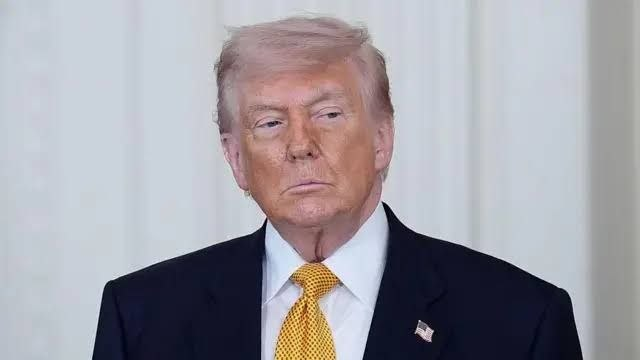

👈دونالد ترامپ: درخواستی برای باز شدن تنگه هرمز از رئیس جمهور چین نداشتم

✅ @AloNews خبر جنگ

## alonews — post 120173

👈عراقچی: موضوع مواد غنی‌شده ما مسئله‌ای بسیار پیچیده است و اکنون با آمریکایی‌ها به این نتیجه رسیده‌ایم که چون در این مورد خاص تقریباً به بن‌بست رسیده‌ایم، بهتر است بررسی آن را به مراحل بعدی مذاکرات موکول کنیم

✅ @AloNews خبر جنگ

## alonews — post 120172

  <a href="telegram/content/alonews_120172_1778848283.jpg">🎬 Download video</a>

👈ترامپ به خبرنگار نیویورک تایمز:
پوشش نیویورک تایمز برای جنگ ایران نشان دهنده خیانت بزرگ است

✅ @AloNews خبر جنگ

## alonews — post 120171

  <a href="telegram/content/alonews_120171_1778848283.jpg">🎬 Download video</a>

👸سفر رسمی علیاحضرت شهبانو فرح پهلوی، به چین سال ۱۳۵۱ انجام شده است. 
🤔آن زمان، چین فقیر بود و ایران ثروتمند. 
✅@AloNews

## alonews — post 120170

  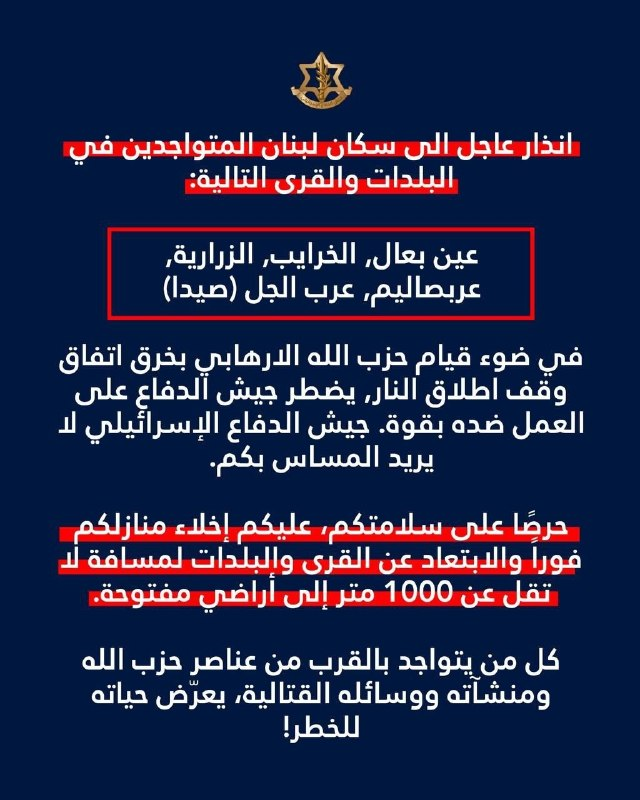

👈ارتش اسرائیل دستور تخلیه به ساکنان: عین بعال، الخریب، الزراریه، عرب سلیم و عرب الجل (صیدا) در جنوب لبنان صادر کرده است

✅ @AloNews خبر جنگ

## alonews — post 120169

  <a href="telegram/content/alonews_120169_1778848284.jpg">🎬 Download video</a>

👈ترامپ: اگر 9 ماه پیش از بمب‌ افکن‌های B-2 استفاده نمی‌کردم، ایران اکنون می‌توانست به سلاح هسته‌ای دست یابد

✅ @AloNews خبر جنگ

## alonews — post 120168

  <a href="telegram/content/alonews_120168_1778848284.jpg">🎬 Download video</a>

👈ترامپ: به رئیس جمهور چین گفتم در مورد پرونده تایوان صحبت نمی کنم

🔴چینی ها عملیات جاسوسی انجام می دهند و ما نیز عملیات جاسوسی انجام می دهیم

✅ @AloNews خبر جنگ

<!-- MSG END -->
<!-- NAV START -->
[صفحه قبل](telegram/content/archive_1.md)
<!-- NAV END -->
