# خواننده تلگرام

<!-- MSG START -->

---
📅 بروزرسانی: 1405/02/20 18:48
---

## VahidOOnLine — post 239309

  <a href="telegram/content/VahidOOnLine_239309_1778426336.mp4">🎬 Download video</a>

ویدیوهای رسیده به ایران اینترنشنال نشان می‌دهد شمار زیادی از ایرانیان مقیم هامبورگ روز یکشنبه ۲۰ اردیبهشت‌ماه در پی فراخوان شاهزاده رضا پهلوی، در اعتراض به اعدام‌های جمهوری اسلامی و قطع اینترنت در ایران راهپیمایی کردند.
‌🏁 🇬🇧 IranintlTV

🤖 @VahidOOnLine

## VahidOOnLine — post 239308

  <a href="telegram/content/VahidOOnLine_239308_1778426337.mp4">🎬 Download video</a>

بر اساس ویدیوهای رسیده به ایران‌اینترنشنال، ایرانیان مقیم سوئیس یکشنبه ۲۰ اردیبهشت در پی فراخوان شاهزاده رضا پهلوی، علیه اعدام‌های جمهوری اسلامی و قطع اینترنت در ایران، در شهر ژنو تجمع کردند.
‌🏁 🇬🇧 IranintlTV

🤖 @VahidOOnLine

## VahidOOnLine — post 239307

  <a href="telegram/content/VahidOOnLine_239307_1778426339.mp4">🎬 Download video</a>

هلسینکی | فنلاند؛ گردهمایی ایرانیان ـ گزارشگر ۲۰ اردیبهشت ۱۴۰۵
‌🏁 🇬🇧 ManotoTV

🤖 @VahidOOnLine

## VahidOOnLine — post 239306

  <a href="telegram/content/VahidOOnLine_239306_1778426340.mp4">🎬 Download video</a>

گزارشگر منوتو با ارسال ویدیویی از گرانی اقلام خوراکی در فروشگاه می‌گوید:
«سپاه ما رو به خواری و ذلت انداخته»
‌🏁 🇬🇧 ManotoTV

🤖 @VahidOOnLine

## VahidOOnLine — post 239305

  <a href="telegram/content/VahidOOnLine_239305_1778426342.mp4">🎬 Download video</a>

ویدیوهای رسیده به ایران‌اینترنشنال نشان می‌دهند گروهی از ایرانیان مقیم ایتالیا، یکشنبه ۲۰ اردیبهشت در اعتراض به اعدام‌های جمهوری اسلامی، در شهر بولونیا تجمع کردند و شعار «تا آخوند کفن نشود، این وطن وطن نشود» سردادند.
‌🏁 🇬🇧 IranintlTV

🤖 @VahidOOnLine

## VahidOOnLine — post 239304

  

رسانه‌های ایران گزارش دادند در پاسخ جمهوری اسلامی درباره توافق خاتمه جنگ به میانجی پاکستانی، بر پایان جنگ در همه جبهه‌ها، به‌ویژه لبنان، و تامین امنیت کشتیرانی تاکید شده است.

پیش‌تر دونالد ترامپ گفته بود انتظار دارد هر چه سریع‌تر پاسخ جمهوری اسلامی را دریافت کند.
‌🏁 🇬🇧 IranintlTV

🤖 @VahidOOnLine

## VahidOOnLine — post 239303

  <a href="telegram/content/VahidOOnLine_239303_1778426344.mp4">🎬 Download video</a>

ویدیوهای رسیده به ایران‌اینترنشنال نشان می‌دهد ایرانیان مقیم هامبورگ در آلمان روز یکشنبه ۲۰ اردیبهشت‌ماه در پی فراخوان شاهزاده رضا پهلوی، در اعتراض به اعدام‌های جمهوری اسلامی و قطع اینترنت در ایران راهپیمایی کردند.
‌🏁 🇬🇧 IranintlTV

🤖 @VahidOOnLine

## VahidOOnLine — post 239302

  <a href="telegram/content/VahidOOnLine_239302_1778426346.mp4">🎬 Download video</a>

بر اساس ویدیوهای رسیده به ایران‌اینترنشنال، گروهی از ایرانیان مقیم بریتانیا، یکشنبه ۲۰ اردیبهشت در اعتراض به اعدام‌های جمهوری اسلامی، در شهرهای نیوکسل و بیرمنگام تجمع کردند و شعار دادند: «ایران آری، آخوند نه»
‌🏁 🇬🇧 IranintlTV

🤖 @VahidOOnLine

## VahidOOnLine — post 239301

  

♦️دونالد ترامپ، رئیس‌جمهوری آمریکا، روز یکشنبه در گفتگو با برنامه آمریکایی «فول مژر» با اشاره به مذاکرات اخیر با جمهوری اسلامی گفت: «با گروه سرسختی طرف هستیم»، اما در عین حال تاکید کرد ایران از نظر نظامی شکست خورده است.

ترامپ همچنین گفت آمریکا «سه رده رهبری» در ایران را از میان برده و جمهوری اسلامی اکنون «رهبرانی ندارد، چون آن‌ها را نابود کردیم.»

او در ادامه گفت ایران دیگر سامانه پدافند هوایی و رادار ندارد و مدعی شد جمهوری اسلامی «نه نیروی دریایی دارد و نه نیروی هوایی.»

ترامپ افزود جمهوری اسلامی موشک‌هایی در اختیار داشت که توان رسیدن به اروپا را داشتند و اگر توافق هسته‌ای موسوم به برجام لغو نمی‌شد، ایران اکنون به سلاح هسته‌ای دست یافته بود.

او همچنین یادآور شد در صورتی که آمریکا از برجام خارج نمی‌شد، بازسازی توانمندی‌های ایران «۲۰ سال» زمان می‌برد.
‌🇸🇦 Indypersian

🤖 @VahidOOnLine

## VahidOOnLine — post 239300

  

مایک والتز، نماینده آمریکا در سازمان ملل متحد، به فاکس نیوز گفت: عملیات خشم اقتصادی در حال حاضر اقتصاد ایران را ویران می‌کند. پول آنها در حال سقوط آزاد است، ذخایر ارزی آنها نزدیک به صفر است.
‌🏁 🇬🇧 IranintlTV

🤖 @VahidOOnLine

## VahidOOnLine — post 239299

  <a href="telegram/content/VahidOOnLine_239299_1778426349.mp4">🎬 Download video</a>

اینسبروک | اتریش؛ گردهمایی ایرانیان ـ گزارشگر ۲۰ اردیبهشت ۱۴۰۵
‌🏁 🇬🇧 ManotoTV

🤖 @VahidOOnLine

## VahidOOnLine — post 239298

  <a href="telegram/content/VahidOOnLine_239298_1778426350.mp4">🎬 Download video</a>

ژنو | سوئیس؛ گردهمایی ایرانیان ـ گزارشگر ۲۰ اردیبهشت ۱۴۰۵
‌🏁 🇬🇧 ManotoTV

🤖 @VahidOOnLine

## VahidOOnLine — post 239297

  

دونالد ترامپ در گفت‌وگو با «فول مژر» درباره اورانیوم غنی‌شده در ایران گفت: ما بالاخره به آن دست پیدا می‌کنیم، ما آنجا را تحت نظارت داریم. همه‌چیز تحت نظر است. اگر کسی به آن محل نزدیک شود، خبردار می‌شویم و نابودش می‌کنیم.
‌🏁 🇬🇧 IranintlTV

🤖 @VahidOOnLine

## VahidOOnLine — post 239296

  

دونالد ترامپ در گفت‌وگو با «فول مژر» درباره اورانیوم غنی‌شده در ایران گفت: ما بالاخره به آن دست پیدا می‌کنیم، ما آنجا را تحت نظارت داریم. همه‌چیز تحت نظر است. اگر کسی به آن محل نزدیک شود، خبردار می‌شویم و نابودش می‌کنیم.
‌🏁 🇬🇧 IranintlTV

🤖 @VahidOOnLine

## VahidOOnLine — post 239295

  

دونالد ترامپ در گفت‌وگو با «فول مژر» درباره اورانیوم غنی‌شده در ایران گفت: ما بالاخره به آن دست پیدا می‌کنیم، ما آنجا را تحت نظارت داریم. همه‌چیز تحت نظر است. اگر کسی به آن محل نزدیک شود، خبردار می‌شویم و نابودش می‌کنیم.
‌🏁 🇬🇧 IranintlTV

🤖 @VahidOOnLine

## VahidOOnLine — post 239294

  <a href="telegram/content/VahidOOnLine_239294_1778426353.mp4">🎬 Download video</a>

راهپیمایی ایرانیان ساکن استکهلم سوئد، یکشنبه ۲۰ اردیبهشت ۱۴۰۵
‌🏁 🇬🇧 ManotoTV

🤖 @VahidOOnLine

## VahidOOnLine — post 239293

  

عباس اسدروز، مدیرعامل شرکت پایانه‌های نفتی ایران، گزارش‌ها درباره وجود لکه نفتی در جزیره خارک را رد کرد و گفت پس از انتشار این اخبار، گروه‌های تخصصی کل منطقه را پایش کردند اما هیچ نشتی شناسایی نشد.

او افزود: هیچ‌گونه نشتی در زیرساخت‌ها، مخازن ذخیره‌سازی، سیستم‌های اندازه‌گیری، اسکله‌ها، خطوط لوله این منطقه و کشتی‌های در حال بارگیری وجود ندارد.

آسوشیتدپرس جمعه ۱۸ اردیبهشت گزارش داد لکه‌ای نفتی از بخش غربی جزیره خارک، در حال نشت است.
آمی دنیل، مدیرعامل شرکت اطلاعات دریایی «ویندوارد ای‌آی»، به ای‌پی گفت از روز سه‌شنبه، معادل حدود ۸۰ هزار بشکه نفت از جزیره خارک نشت کرده است.
‌🏁 🇬🇧 IranintlTV

🤖 @VahidOOnLine

## mwarmonitor — post 8830

  

🔴اUSS John Finn (DDG-113) در پشت سرِ USS Milius (DDG-69)، USNS Carl Brashear (T-AKE-7) و USS George H.W. Bush (CVN-77) در دریای عرب در حال حرکت است.

📌بیش از ۲۰ ناو جنگی آمریکا در حال اجرای محاصره علیه ایران هستند. نیروهای سنتکام تاکنون ۶۱ کشتی تجاری را منحرف کرده و ۴ فروند را از کار انداخته‌اند تا از اجرای این روند اطمینان حاصل شود.

@mwarmonitor

## mwarmonitor — post 8829

📝این آخرین تلاش‌هایِ دولتِ اِستامر قبل از کله‌پا شدنِ

## mwarmonitor — post 8828

🔴ترامپ: «برای من لازم بود که مداخله نظامی انجام دهم، زیرا با اطمینان می‌دانستم که ایران در مسیر دستیابی به سلاح هسته‌ای قرار دارد.» @mwarmonitor

## mwarmonitor — post 8827

«مصاحبه ترامپ درباره موضوعات مختلف داخلی و خارجی انجام شد که بخش‌های مهم مربوط به ایران را در ادامه برای شما ارائه خواهم کرد.»

## mwarmonitor — post 8826

🔴ترامپ در مصاحبه‌ای با The National Desk اعلام کرد: «می‌توانیم دو هفته دیگر ادامه دهیم و همه اهداف را بزنیم؛ ما اهداف مشخصی داشتیم که ۷۰ درصد آن‌ها را انجام داده‌ایم. اهداف بیشتری هم وجود دارد که می‌توانیم به‌طور احتمالی آن‌ها را هدف قرار دهیم.» او همچنین…

## mwarmonitor — post 8825

🔴شریل اتکیسون: در کجای جنگ هستیم، اگر هنوز مواد هسته‌ای، یعنی اورانیوم غنی‌شده را از آن‌ها نگرفته‌ایم؟ 🔵دونالد ترامپ: خب، ما در مقطعی آن را به دست خواهیم آورد، هر زمان که بخواهیم. ما آنجا را تحت نظر داریم. می‌دانی، من چیزی به نام «نیروی فضایی» ایجاد کردم و…

## mwarmonitor — post 8824

  

ترامپ در سوشال تروث

@mwarmonitor

## pm_afshaa — post 90490

  <a href="telegram/content/pm_afshaa_90490_1778426357.jpg">🎬 Download video</a>

🔴نخست وزیر پاکستان: فرمانده ارتش پاکستان بهم گفت که ایران پاسخ خودش به پیشنهاد آمریکا رو ارسال کرده و دریافت شده.

💧 Rainbet.com the #1 Non-KYC Crypto Casino & Sportsbook @rainbetcom

😁 @Pm_Afshaa

## pm_afshaa — post 90489

  <a href="telegram/content/pm_afshaa_90489_1778426357.jpg">🎬 Download video</a>

🔴ترامپ: نگفتم عملیات نظامی علیه ایران پایان یافته، بلکه گفتم آنها شکست خوردن.

💧 Rainbet.com the #1 Non-KYC Crypto Casino & Sportsbook @rainbetcom

😁 @Pm_Afshaa

## pm_afshaa — post 90488

  <a href="telegram/content/pm_afshaa_90488_1778426358.jpg">🎬 Download video</a>

🔴دونالد ترامپ: 3 سطح از رهبری ایران نابود شده اما من فکر میکنم ما با افرادی روبرو هستیم که قدرت خاصی دارن؛ خیلی جالبه که آنها معامله می‌کنند و سپس آن را می‌شکنند. آنها گروه سر سختی هستند.

اگر امروز انجا رو ترک کنیم، ایران برای بازسازی توانمندی‌هایش به 20 سال زمان نیاز خواهد داشت.

💧 Rainbet.com the #1 Non-KYC Crypto Casino & Sportsbook @rainbetcom

😁 @Pm_Afshaa

## pm_afshaa — post 90487

  <a href="telegram/content/pm_afshaa_90487_1778426358.jpg">🎬 Download video</a>

🔴نتانیاهو در مصاحبه با CBS News: جنگ با ایران هنوز تموم نشده، چون هنوز یه مقدار اورانیوم غنی‌شده تو ایران مونده که باید از ایران خارجش بشه؛ هنوزم سایت‌های غنی‌سازی هست که باید جمع بشه، هنوز گروه‌های نیابتی‌ای که ایران حمایتشون میکنه وجود دارن و ایران هنوز…

## pm_afshaa — post 90486

  <a href="telegram/content/pm_afshaa_90486_1778426359.mp4">🎬 Download video</a>

🔴نتانیاهو در مصاحبه با CBS News:
جنگ با ایران هنوز تموم نشده، چون هنوز یه مقدار اورانیوم غنی‌شده تو ایران مونده که باید از ایران خارجش بشه؛

هنوزم سایت‌های غنی‌سازی هست که باید جمع بشه، هنوز گروه‌های نیابتی‌ای که ایران حمایتشون میکنه وجود دارن و ایران هنوز میخواد موشک بالستیک تولید کنه؛ ما خیلی از توانشونو نابود یا ضعیف کردیم، ولی هنوز کار مونده که باید انجام بدیم.

💧 Rainbet.com the #1 Non-KYC Crypto Casino & Sportsbook @rainbetcom

😁 @Pm_Afshaa

## pm_afshaa — post 90485

  <a href="telegram/content/pm_afshaa_90485_1778426360.jpg">🎬 Download video</a>

🔴منبع دیپلماتیک پاکستانی به الجزیره:
پاسخ ایران به پیشنهاد آمریکا پس از دریافت به طرف آمریکایی منتقل شد.

💧 Rainbet.com the #1 Non-KYC Crypto Casino & Sportsbook @rainbetcom

😁 @Pm_Afshaa

## pm_afshaa — post 90484

  

🔴ترامپ ویدیویی رو بازنشر کرده که مربوط به برنامه مارک لوینه؛ جایی که مهمان برنامه میگه «ازسرگیری اقدام نظامی، بهترین گزینه برای مقابله با ایرانه.»

💧 Rainbet.com the #1 Non-KYC Crypto Casino & Sportsbook @rainbetcom

😁 @Pm_Afshaa

## pm_afshaa — post 90483

🔴ترامپ:ما نمی‌توانیم اجازه دهیم ایران سلاح هسته‌ای داشته باشد چون آن‌ها دیوانه هستند.

اگر من توافق هسته‌ای اوباما با ایران را لغو نکرده بودم، آن‌ها اکنون آن را داشتند و ممکن بود از آن علیه اسرائیل و خاورمیانه و شاید فراتر استفاده کنن

💧 Rainbet.com the #1 Non-KYC Crypto Casino & Sportsbook @rainbetcom

😁 @Pm_Afshaa

## pm_afshaa — post 90482

🔴ترامپ: هنوز اهداف دیگری در ایران داریم که همچنان احتمال هدف قرار دادنشان بسیار بالاست

💧 Rainbet.com the #1 Non-KYC Crypto Casino & Sportsbook @rainbetcom

😁 @Pm_Afshaa

## pm_afshaa — post 90481

🔴ترامپ: می‌توانیم تا دو هفته دیگر علیه ایران حرکت کنیم و به هر یک از اهداف مشخص‌شده ضربه بزنیم

💧 Rainbet.com the #1 Non-KYC Crypto Casino & Sportsbook @rainbetcom

😁 @Pm_Afshaa

## pm_afshaa — post 90480

🔴ترامپ درباره ایران:ما در نهایت اورانیوم غنی‌شده ایران را به دست خواهیم آورد. هر چه بخواهیم ما آن را تحت نظر داریم. من چیزی به نام نیروی فضایی ایجاد کردم و آن‌ها در حال نظارت بر آن هستند. اگر کسی وارد شود، می‌توانند نام، آدرس و شماره نشان او را به شما بگویند اگر کسی به آن مکان نزدیک شود، ما از آن مطلع خواهیم شد و او را منفجر خواهیم کرد

💧 Rainbet.com the #1 Non-KYC Crypto Casino & Sportsbook @rainbetcom

😁 @Pm_Afshaa

## iaghapour — post 2595

⭕️ ادعای عجیب نماینده مجلس: با ۴ هزار میلیارد تومان ایتا را به سطح واتس‌اپ می‌رسانیم!

رئیس کمیته ICT مجلس در اظهارنظری جنجالی مدعی شده است که فاصله میان پیام‌رسان‌های داخلی مثل ایتا با نمونه‌های جهانی مانند واتس‌اپ، تنها در کمبود بودجه برای خرید سرور خلاصه می‌شود. به گفته او، ارتقای این پلتفرم‌ها هزینه چندانی برای کشور ندارد.

این نماینده مجلس معتقد است که پلتفرم‌های داخلی از نظر فنی کمبودی ندارند و تنها زیرساخت‌های سخت‌افزاری آن‌ها باید تقویت شود:

🔹 بودجه برای رقابت: مصطفی طاهری مدعی است با صرف ۳ تا ۴ هزار میلیارد تومان برای خرید سرور، می‌توان کیفیت ایتا را به سطح واتس‌اپ رساند تا توانایی پذیرش بدون مشکل بیش از ۲۰ میلیون کاربر را داشته باشد.

🔸 هشدار درباره جاسوسی سخت‌افزاری: این مقام مسئول همچنین به موضوع استفاده از بیگ‌دیتا (داده‌های بزرگ) اشاره کرده و مدعی شده که آمریکا قوانینی برای جاسوسی در لایه‌های سخت‌افزاری و تراشه‌ها (حتی پایین‌تر از سطح سیستم‌عامل) دارد.

این اظهارات در حالی مطرح می‌شود که کارشناسان حوزه تکنولوژی، موفقیت پلتفرم‌های جهانی را فراتر از صرفا تعداد سرور می‌دانند و مواردی چون امنیت، پروتکل‌های رمزنگاری، حریم خصوصی و نوآوری‌های مداوم نرم‌افزاری را از عوامل اصلی برتری آن‌ها به حساب می‌آورند.

یکی از کاربرا زیر همین پست در دیجیاتو کامنت جالبی گذاشته بود:
مامان‌بزرگ منم با چند میلیارد نیکی میناژ میشه!

پ.ن: حالا فارق از این حرفا داره میگه اینا دارن از کاربراشون جاسوسی میکنن برای همین ما باید اپ های خودمون رو داشته باشیم... من حرفی ندارم.

🆔 @iaghapour

## VahidOnline — post 75377

  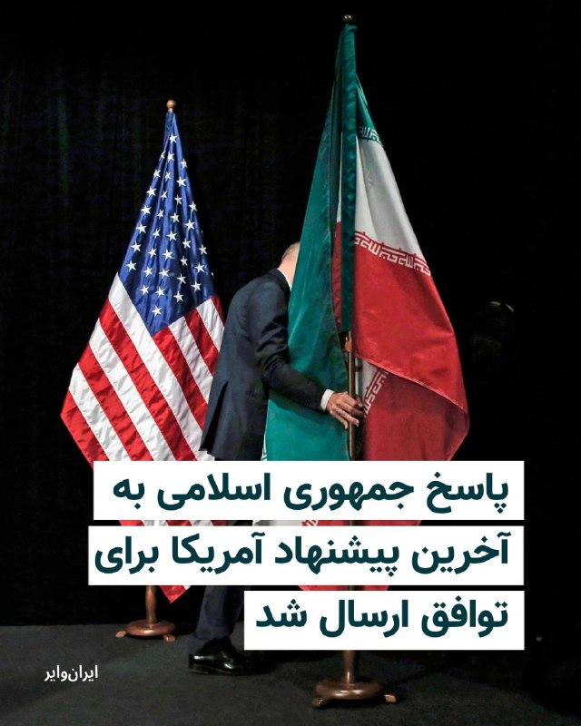

خبرگزاری ایرنا، روز یکشنبه ۲۰ اردیبهشت ۱۴۰۵گزارش داد پاسخ تهران به آخرین طرح پیشنهادی ایالات متحده برای رسیدن به توافق بر سر پایان جنگ، برای پاکستان به عنوان میانجی مذاکرات ارسال شده است.

ایرنا بدون اشاره به جزئیات بیشتر نوشت: «بر اساس طرح پیشنهادی، در این مرحله مذاکرات متمرکز بر موضوع خاتمه جنگ در منطقه خواهد بود.»

وب‌سایت اکسیوس و خبرگزاری رویترز، چهارشنبه هفته گذشته گزارش دادند که واشنگتن و تهران به یک «یادداشت تفاهم یک‌صفحه‌ای» برای پایان دادن به جنگ نزدیک شده‌اند.

رویترز نوشته بود در این تفاهم‌نامه حتی به تعلیق فعالیت هسته‌ای ایران یا بازگشایی تنگه هرمز که از سوی سپاه پاسداران بسته شده، اشاره‌ای نشده است.

در مقابل، روزنامه وال‌استریت ژورنال گزارش داده بود که در طرح پیشنهادی آمریکا، تهران باید ثابت کند که به‌دنبال سلاح اتمی نیست، تاسیسات فردو، نطنز و اصفهان را برچیند، فعالیت زیرزمینی هسته‌ای را متوقف کند و همچنین بپذیرد غنی‌سازی را تا ۲۰ سال متوقف کند.

رییس‌جمهور و وزیر خارجه آمریکا روز جمعه گفته بودند جمهوری اسلامی تا پایان همان روز قرار است به پیشنهاد ایالات متحده پاسخ دهد.
@VahidHeadline
ولی جمهوری اسلامی به جای جمعه، روز بسته شدن بازارها، صبر کرد یکشنبه پاسخ داد که ساعت ۸ شبش به وقت شرق آمریکا بازارهای مالی هفته کاری رو آغاز می‌کنند.
📡 @VahidOnline

## VahidOnline — post 75376

  

وزارت دفاع امارات متحده عربی روز یکشنبه ۲۰ اردیبهشت اعلام کرد که سامانه‌های پدافند هوایی این کشور با موفقیت دو پهپاد پرتاب شده از «ایران» را منهدم کردند.

این وزارتخانه تاکید کرده است که از زمان ««شروع حملات آشکار ایران، پدافند هوایی امارات متحده عربی در مجموع ۵۵۱ موشک بالستیک، ۲۹ موشک کروز و ۲۲۶۵ پهپاد را منهدم کرده است.»
وزارت دفاع امارات همچنین گزارش داده است که از زمان شروع حملات آشکار ایران، تعداد کل جانباختگان نظامی به ۳ نفر رسیده و تلفات غیرنظامی هم ۱۰ نفر از ملیت‌های پاکستانی، نپالی، بنگلادشی، فلسطینی، هندی و مصری است.
@VahidOOnLine

📡 @VahidOnline

## VahidOnline — post 75375

  

رسانه‌های جمهوری اسلامی گفته‌اند علی عبداللهی، فرمانده قرارگاه مرکزی خاتم‌الانبیا، با مجتبی خامنه‌ای دیدار کرده و گزارشی از آمادگی نیروهای مسلح، از جمله ارتش، سپاه، نیروی انتظامی، نهادهای امنیتی، مرزبانی، وزارت دفاع و بسیج ارائه داده است.

بر اساس این گزارش‌ها، عبداللهی گفته نیروهای مسلح از نظر روحیه رزمی، آمادگی دفاعی و هجومی، طرح‌های راهبردی و تجهیزات لازم برای مقابله با «دشمنان» در سطح بالایی از آمادگی قرار دارند.

این رسانه‌ها همچنین نوشتند مجتبی خامنه‌ای در این دیدار تدابیر تازه‌ای برای ادامه اقدامات و مقابله با دشمنان ابلاغ کرده است. با وجود انتشار متن این خبر، رسانه‌های جمهوری اسلامی تصویری از این دیدار منتشر نکردند.
@VahidOOnLine

📡 @VahidOnline

## VahidOnline — post 75374

  

خبرگزاری فارس، وابسته به سپاه پاسداران درباره کشتی باری هدف ‌قرارگرفته شده در نزدیکی سواحل قطر، به نقل از منبعی که نامش را فاش نکرد، گزارش داد این کشتی با پرچم آمریکا تردد می‌کرده و متعلق به ایالات متحده بوده است.

سازمان «عملیات تجارت دریایی بریتانیا» (UKMTO) صبح یکشنبه گزارش داد که یک پرتابه به سمت یک کشتی باری  در ۲۳ مایل دریایی (۳۷ کیلومتری) شمال شرقی دوحه شلیک شده است.
بنا بر این گزارش یک آتش‌سوزی کوچک در این کشتی رخ داده که خاموش شده است و تلفات جانی نیز نداشته است.

این خبر در حالی اعلام شده است که مارکو روبیو، وزیر امور خارجه آمریکا روز شنبه با محمد بن عبدالرحمن آل ثانی، نخست‌وزیر و وزیر امور خارجه قطر، در میامی دیدار و گفتگو کرد و شراکت دو کشور را برای بازدارندگی در برابر تهدیدات و تقویت ثبات در خاورمیانه حائز اهمیت خواند.
@VahidOOnLine

📡 @VahidOnline

## VahidOnline — post 75373

  

‌ ‌ ‌ ‌
خبرگزاری فارس می‌گوید «یک نفتکش حمل‌کننده گاز طبیعی مایع متعلق به قطر به نام الخریطیات» با «اجازه ایران» از تنگه هرمز عبور کرده است.

بنابر این گزارش، این نفتکش «روز گذشته در دهانهٔ تنگهٔ هرمز دیده شده بود و پس از آن سامانه موقعیت‌یاب خودکار خود را خاموش کرد.»

به گفته فارس، «این نفتکش که مقصدش پاکستان است، نخستین نفتکش غیرمرتبط با ایران است که از نیروی دریایی سپاه اجازه عبور از تنگه هرمز دریافت کرده است.»
@VahidHeadline

📡 @VahidOnline

## VahidOnline — post 75372

  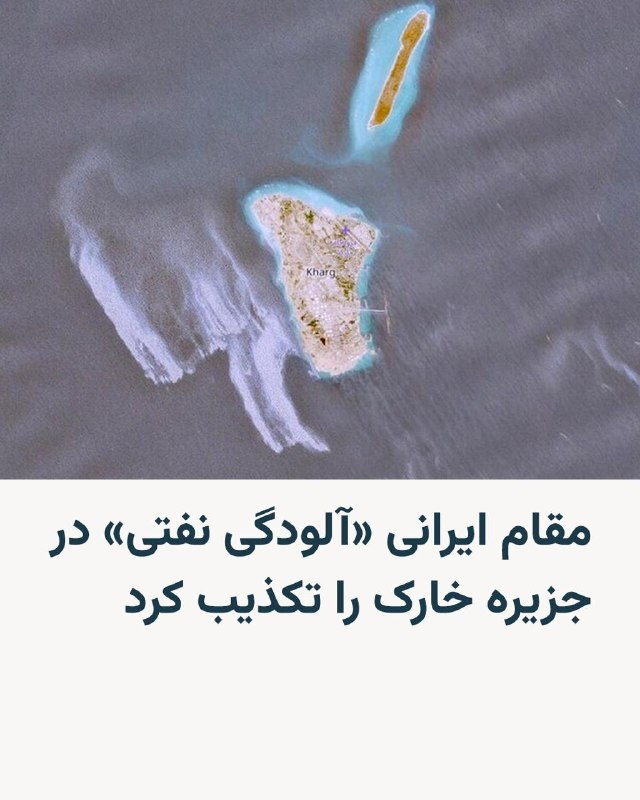

رسانه‌های داخل ایران روز یک‌شنبه به نقل از مدیرعامل شرکت پایانه‌های نفتی ایران هر گونه آلودگی نفتی ناشی از تأسیسات جزیره خارک را تکذیب کردند.

او گفت: «به محض انتشار این اخبار، گروه‌های متخصص اچ‌اس‌ئی و اداره شیمیایی و آزمایشگاه، همه منطقه را پایش کردند اما حتی کوچک‌ترین موردی یافت نشد.»

خبرگزاری رویترز گزارش داده بود که تصاویر ماهواره‌ای ثبت‌شده در روزهای ۱۶ تا ۱۸ اردیبهشت، لکه‌ای بزرگ را در آب‌های اطراف جزیره خارک، مهم‌ترین پایانه صادرات نفت ایران، نشان می‌دهد که به گفته کارشناسان با «نشت نفت» سازگار است.

بر اساس این گزارش، لکه‌ای خاکستری و سفیدرنگ در غرب جزیره خارک دیده شده که به گفته یک پژوهشگر «رصدخانه منازعه و محیط زیست»، مساحتی حدود ۴۵ کیلومتر مربع را پوشش می‌دهد.

به گفته عباس اسدروز، «طبق اعلام مرکز بین‌المللی «میمک» به نمایندگی از سازمان بین‌المللی دریانوردی هیچ‌گونه نشتی در زیرساخت‌ها، مخازن ذخیره‌سازی، سیستم‌های اندازه‌گیری، اسکله‌ها، خطوط لوله این منطقه و کشتی‌های در حال بارگیری وجود ندارد.»

اسدروز توضیح نداده است که لکه موجود در تصاویر نشان‌دهنده چه چیزی است.
@VahidHeadline

📡 @VahidOnline

## kianmeli1 — post 87328

  <a href="telegram/content/kianmeli1_87328_1778426365.mp4">🎬 Download video</a>

🔴چگونه تصور می‌کنید اورانیوم بسیار غنی‌شده از ایران خارج خواهد شد؟

بنیامین نتانیاهو:

شما وارد می‌شوید و آن را بیرون می‌آورید. رئیس‌جمهور ترامپ به من گفته است: «می‌خواهم وارد آنجا شوم.»

من زمان‌بندی خاصی برای آن ارائه نمی‌دهم، اما می‌گویم که این یک مأموریت بسیار مهم است.
 https://t.me/kianmeli1

## kianmeli1 — post 87327

🔴شرکت ایرفرانس در بیانیه‌ای اعلام کرد:

به‌دلیل شرایط امنیتی، پروازها به دبی، ریاض، تل‌آویو و بیروت تا ۲۰ می (۳۰ اردیبهشت) لغو شده است
https://t.me/kianmeli1

## kianmeli1 — post 87326

🔴پزشکیان، رئیس جمهور ایران، تنها دقایقی پس از ارسال پاسخ ایران به پیشنهاد آمریکا توسط میانجیگران پاکستانی، بیانیه‌ای منتشر کرد:

او می‌گوید: «ما هرگز در برابر دشمن سر تعظیم فرود نمی‌آوریم و اگر صحبت از گفتگو یا مذاکره می‌شود، به معنای تسلیم یا عقب‌نشینی نیست. بلکه هدف، احقاق حقوق ملت ایران و دفاع از منافع ملی با قدرت و قاطعیت است.»
https://t.me/kianmeli1

## kianmeli1 — post 87325

🔴ترامپ: «ما می‌توانیم دو هفته دیگر ادامه دهیم و تک تک اهداف را هدف قرار دهیم، ما اهداف مشخصی داریم که می‌خواستیم به آنها برسیم و ۷۰ درصد آنها را انجام داده‌ایم.

احتمالاً اهداف بیشتری هم وجود دارد که می‌توانیم به آنها ضربه بزنیم.»
https://t.me/kianmeli1

## IranIntlTV — post 336488

  <a href="telegram/content/IranIntlTV_336488_1778426366.mp4">🎬 Download video</a>

ویدیوهای رسیده به ایران اینترنشنال نشان می‌دهد شمار زیادی از ایرانیان مقیم هامبورگ روز یکشنبه ۲۰ اردیبهشت‌ماه در پی فراخوان شاهزاده رضا پهلوی، در اعتراض به اعدام‌های جمهوری اسلامی و قطع اینترنت در ایران راهپیمایی کردند.

## IranIntlTV — post 336487

  <a href="telegram/content/IranIntlTV_336487_1778426368.mp4">🎬 Download video</a>

بر اساس ویدیوهای رسیده به ایران‌اینترنشنال، ایرانیان مقیم سوئیس یکشنبه ۲۰ اردیبهشت در پی فراخوان شاهزاده رضا پهلوی، علیه اعدام‌های جمهوری اسلامی و قطع اینترنت در ایران، در شهر ژنو تجمع کردند.

## IranIntlTV — post 336486

  <a href="telegram/content/IranIntlTV_336486_1778426370.mp4">🎬 Download video</a>

ویدیوهای رسیده به ایران‌اینترنشنال نشان می‌دهند گروهی از ایرانیان مقیم ایتالیا، یکشنبه ۲۰ اردیبهشت در اعتراض به اعدام‌های جمهوری اسلامی، در شهر بولونیا تجمع کردند و شعار «تا آخوند کفن نشود، این وطن وطن نشود» سردادند.

## IranIntlTV — post 336485

  <a href="telegram/content/IranIntlTV_336485_1778426371.mp4">🎬 Download video</a>

خبرگزاری دولتی ایرنا گزارش داد پاسخ جمهوری اسلامی به آخرین متن پیشنهادی آمریکا برای خاتمه جنگ، به میانجی پاکستانی تحویل داده شده است.

گفت‌وگو با علی شیرازی، عضو تحریریه ایران‌اینترنشنال
@iranintltv

## IranIntlTV — post 336484

  

رسانه‌های ایران گزارش دادند در پاسخ جمهوری اسلامی درباره توافق خاتمه جنگ به میانجی پاکستانی، بر پایان جنگ در همه جبهه‌ها، به‌ویژه لبنان، و تامین امنیت کشتیرانی تاکید شده است.

پیش‌تر دونالد ترامپ گفته بود انتظار دارد هر چه سریع‌تر پاسخ جمهوری اسلامی را دریافت کند.
https://iranintl.com/202605106999

## IranIntlTV — post 336483

  <a href="telegram/content/IranIntlTV_336483_1778426373.mp4">🎬 Download video</a>

ویدیوهای رسیده به ایران‌اینترنشنال نشان می‌دهد ایرانیان مقیم هامبورگ در آلمان روز یکشنبه ۲۰ اردیبهشت‌ماه در پی فراخوان شاهزاده رضا پهلوی، در اعتراض به اعدام‌های جمهوری اسلامی و قطع اینترنت در ایران راهپیمایی کردند.

## IranIntlTV — post 336482

  <a href="telegram/content/IranIntlTV_336482_1778426375.mp4">🎬 Download video</a>

بر اساس ویدیوهای رسیده به ایران‌اینترنشنال، گروهی از ایرانیان مقیم بریتانیا، یکشنبه ۲۰ اردیبهشت در اعتراض به اعدام‌های جمهوری اسلامی، در شهرهای نیوکسل و بیرمنگام تجمع کردند و شعار دادند: «ایران آری، آخوند نه»

## IranIntlTV — post 336481

  <a href="telegram/content/IranIntlTV_336481_1778426377.mp4">🎬 Download video</a>

یکی از شرکت‌کنندگان در تجمع لندن در گفت‌وگو با آیدین مقیمی، خبرنگار ایران‌اینترنشنال، گفت: «تا وقتی که اینترنت مردم ایران قطع باشد، صدای ایرانیان داخل کشور در سراسر جهان هستیم.»
@iranintltv

## IranIntlTV — post 336480

  <a href="telegram/content/IranIntlTV_336480_1778426379.mp4">🎬 Download video</a>

سرخط خبرهای یکشنبه ۲۰ اردیبهشت
@iranintltv

## IranIntlTV — post 336479

  

مایک والتز، نماینده آمریکا در سازمان ملل متحد، به فاکس نیوز گفت: عملیات خشم اقتصادی در حال حاضر اقتصاد ایران را ویران می‌کند. پول آنها در حال سقوط آزاد است، ذخایر ارزی آنها نزدیک به صفر است.
https://iranintl.com/202605109384

## IranIntlTV — post 336476

  

دونالد ترامپ در گفت‌وگو با «فول مژر» درباره اورانیوم غنی‌شده در ایران گفت: ما بالاخره به آن دست پیدا می‌کنیم، ما آنجا را تحت نظارت داریم. همه‌چیز تحت نظر است. اگر کسی به آن محل نزدیک شود، خبردار می‌شویم و نابودش می‌کنیم.
https://iranintl.com/202605102225

## IranIntlTV — post 336475

  <a href="telegram/content/IranIntlTV_336475_1778426381.mp4">🎬 Download video</a>

معصومه طاهرخانی، تحلیل‌گر اقتصادی، گفت ایرانیان در حال حاضر درگیر «اقتصاد بقا» هستند. او افزود: «وقتی سفره مردم کوچک‌تر، ارزان‌تر و بی‌کیفیت‌تر می‌شود، نسلی شکل می‌گیرد که با مشکلات سلامت روبه‌رو خواهد بود و این موضوع تهدیدی جدی برای آینده ایران به شمار می‌رود.»
@iranintltv

## IranIntlTV — post 336474

  <a href="telegram/content/IranIntlTV_336474_1778426383.mp4">🎬 Download video</a>

یکی از شرکت‌کنندگان در تجمع لندن در گفت‌وگو با آیدین مقیمی، خبرنگار ایران‌اینترنشنال، گفت: «همه جهان باید در جریان اعدام‌ها در ایران قرار بگیرد و ما با حضور در تجمع‌ها صدای زندانیان سیاسی هستیم.»
@iranintltv

## IranIntlTV — post 336473

  

عباس اسدروز، مدیرعامل شرکت پایانه‌های نفتی ایران، گزارش‌ها درباره وجود لکه نفتی در جزیره خارک را رد کرد و گفت پس از انتشار این اخبار، گروه‌های تخصصی کل منطقه را پایش کردند اما هیچ نشتی شناسایی نشد.

او افزود: هیچ‌گونه نشتی در زیرساخت‌ها، مخازن ذخیره‌سازی، سیستم‌های اندازه‌گیری، اسکله‌ها، خطوط لوله این منطقه و کشتی‌های در حال بارگیری وجود ندارد.

آسوشیتدپرس جمعه ۱۸ اردیبهشت گزارش داد لکه‌ای نفتی از بخش غربی جزیره خارک، در حال نشت است.
آمی دنیل، مدیرعامل شرکت اطلاعات دریایی «ویندوارد ای‌آی»، به ای‌پی گفت از روز سه‌شنبه، معادل حدود ۸۰ هزار بشکه نفت از جزیره خارک نشت کرده است.
https://iranintl.com/202605108217

## Shin_Persian — post 5932

Shin ✓ @hey_itsmyturn
Sun, 10 May 2026 14:37:49 UTC

State-run YJC citing Al Jazeera:
"Pakistan delivered [Islamic Regime of] Iran's response to the United States on the ceasefire terms"

فارسی

خبرگزاری دولتی YJC به نقل از الجزیره:
«پاکستان پاسخ [رژیم اسلامی] ایران درباره شرایط آتش‌بس را به ایالات متحده تحویل داد»

𝕏 · @shin_persian

## Shin_Persian — post 5931

📦 mhrv-rs v1.9.19 released

• **UI accessibility
• Also rolling up the exit_node Content-Encoding fix (#964)

Files (Android APKs, Windows, macOS, Linux, OpenWRT) on the files channel:

👉 v1.9.19 — all files with SHA-256

Channel:
https://t.me/mhrv_rs
or: https://t.me/+R1OyoHX2boA1ZDgx

#v1919

## ManotoTV — post 105248

  <a href="telegram/content/ManotoTV_105248_1778426385.mp4">🎬 Download video</a>

هلسینکی | فنلاند؛ گردهمایی ایرانیان ـ گزارشگر ۲۰ اردیبهشت ۱۴۰۵

## ManotoTV — post 105247

  <a href="telegram/content/ManotoTV_105247_1778426386.mp4">🎬 Download video</a>

گزارشگر منوتو با ارسال ویدیویی از گرانی اقلام خوراکی در فروشگاه می‌گوید:
«سپاه ما رو به خواری و ذلت انداخته»

## ManotoTV — post 105246

  <a href="telegram/content/ManotoTV_105246_1778426388.mp4">🎬 Download video</a>

اینسبروک | اتریش؛ گردهمایی ایرانیان ـ گزارشگر ۲۰ اردیبهشت ۱۴۰۵

## ManotoTV — post 105245

  <a href="telegram/content/ManotoTV_105245_1778426389.mp4">🎬 Download video</a>

ژنو | سوئیس؛ گردهمایی ایرانیان ـ گزارشگر ۲۰ اردیبهشت ۱۴۰۵

## ManotoTV — post 105243

  <a href="telegram/content/ManotoTV_105243_1778426390.mp4">🎬 Download video</a>

راهپیمایی ایرانیان ساکن استکهلم سوئد، یکشنبه ۲۰ اردیبهشت ۱۴۰۵

## FarsiVOA — post 217348

  <a href="telegram/content/FarsiVOA_217348_1778426392.mp4">🎬 Download video</a>

رضا تقی‌زاده در عمق میدان در پاسخ به پرسش فهیمه خضر حیدری درباره آینده سیاسی ایران گفت: به رضا پهلوی رأی نخواهم داد

## FarsiVOA — post 217347

  <a href="telegram/content/FarsiVOA_217347_1778426393.mp4">🎬 Download video</a>

ارتش اسرائیل اعلام کرد در هفته گذشته حدود ۷۰ موضع حزب‌الله را هدف قرار داده و بیش از ۳۰ نیروی حزب‌الله را حذف کرده است. این ارتش همچنین از رهگیری و انهدام چند موشک شلیک شده به سمت نیروهای اسرائیل در جنوب لبنان خبر داد.

## FarsiVOA — post 217346

🔺آغاز دومین جلسه دادگاه سران رژیم سابق سوریه؛ همه دارایی‌های بشار اسد مصادره شد

◾️خبرگزاری رسمی سوریه (سانا) روز یکشنبه ۲۰ اردیبهشت، گزارش داد که دادگاه جنایی سوریه، دومین جلسه محاکمه سران رژیم سابق این کشور را آغاز کرده است.

⬇️ بیشتر بخوانید:

https://ir.voanews.com/a/syria-bashar-alassad-court-criminal-political/8148477.html?withmediaplayer=1

## FarsiVOA — post 217345

در ادامه نشانه‌های بحران در بازار دارو، دبیر انجمن پیوند کلیه ایران از کاهش ذخایر دارویی و نایاب شدن برخی آنتی‌بیوتیک‌ها خبر داده و هشدار داده است که ادامه این وضعیت می‌تواند برای بیماران دیالیزی و پیوندی مشکل‌ساز شود.

فاطمه پوررضاقلی به‌طور مشخص درباره آنتی‌بیوتیک‌ها هشدار داده و گفته برخی از این داروها «بسیار نایاب» شده‌اند.

صدای آمریکا روز گذشته به نقل از منابع خود در بیمارستان‌ها و داروخانه‌ها گزارش داده بود دستورالعمل‌هایی برای کاهش مصرف سرم و آنتی‌بیوتیک ابلاغ شده و توزیع این اقلام در داروخانه‌ها با تأخیر و کمتر از میزان تقاضا انجام می‌شود.

گزارش کامل را در وب‌سایت صدای آمریکا بخوانید.

@FarsiVOA

## FarsiVOA — post 217344

رضا تقی‌زاده، چهره شناخته‌شده مشروطه‌خواهان پادشاهی‌خواه در عمق میدان به‌شدت از عملکرد رضا پهلوی انتقاد کرد و گفت او به سوگند ولیعهدی پشت کرده است

## FarsiVOA — post 217343

🔺سفر وزیر خزانه‌داری آمریکا به ژاپن و کره جنوبی در آستانه دیدار تاریخی پرزیدنت ترامپ و شی‌ جین‌پینگ

◾️وزیر خزانه‌داری آمریکا از سفر خود به ژاپن و کره جنوبی در آستانه نشست پرزیدنت ترامپ و رئیس جمهوری چین خبر داد.

⬇️ بیشتر بخوانید:

https://ir.voanews.com/a/scott-bessent-travel-china-south-korea-beijing-america-japan/8148484.html

## DW_Farsi — post 124528

  

🔶امضای "پیمان آوریل" در اعتراض به افزایش اعدام‌ها و سرکوب سیاسی در ایران

بیش از صد نهاد مدنی، سیاسی و حقوق بشری با امضای یک پیمان‌نامه به نام "پیمان آوریل" به موج فزاینده اعدام‌ها و سرکوب سیاسی در ایران اعتراض و بر تداوم مبارزه برای لغو کامل مجازات اعدام و آزادی زندانیان سیاسی تأکید کردند.

امضاکنندگان، اعدام را "ابزار سرکوب، ارعاب و قتل حکومتی" توصیف کرده و خواستار پایان فوری تمامی احکام اعدام در ایران شده‌اند.

در بخشی از این میثاق آمده است: «ما امضاکنندگان این پیمان اعلام می‌کنیم که متحدانه و با تمام قوا علیه هر حکم و اجرای اعدام توسط جمهوری اسلامی، به هر جرم و بهانه‌ای، مبارزه می‌کنیم و برای قطع فوری اعدام‌ها در ایران پیگیرانه می‌کوشیم.»

این بیانیه همچنین تأکید می‌کند که "هیچ انسانی نباید به دلیل عقیده، اعتراض، فعالیت سیاسی یا سبک زندگی خود زندانی یا مجازات شود" و بر آزادی فوری و بی‌قید و شرط تمامی زندانیان سیاسی و عقیدتی پافشاری می‌کند.

@dw_farsi

## DW_Farsi — post 124527

🔶روسیه در "روز پیروزی" از پهپاد تهاجمی جدیدش رونمایی کرد

روسیه در رژه نظامی "روز پیروزی" در روز شنبه ۹ ماه مه (۱۹ اردیبهشت) برای نخستین بار از پهپاد سنگین انتحاری "گران−۵" خود رونمایی کرد.

این رژه نظامی که به مناسبت گرامی‌داشت هشتاد و یکمین سالگرد پیروزی اتحاد جماهیر شوروی سابق بر آلمان نازی در مسکو برگزار شد، برخلاف سال‌های گذشته، با نمایش تانک‌ها و تجهیزات سنگین نظامی روسیه همراه نبود.

در جریان این مراسم در مسکو، تصاویر این پهپاد جدید بر روی نمایشگرهای غول‌پیکر به نمایش گذاشته شد. در این تصاویر دیده می‌شد که سامانه تسلیحاتی مورد نظر با استفاده از منجنیق پرتاب می‌شود.

@dw_farsi

## DW_Farsi — post 124526

  

🔶ایران پاسخ خود به طرح پیشنهادی آمریکا را ارسال کرد

خبرگزاری ایرنا روز یکشنبه ۲۰ اردیبهشت (۱۰ مه) در خبری اختصاصی نوشت جمهوری اسلامی پاسخ خود به آخرین متن پیشنهادی آمریکا برای خاتمه جنگ را به میانجی پاکستانی ارسال کرده است.

ایرنا نوشته بر اساس طرح پیشنهادی، در این مرحله، مذاکرات متمرکز بر موضوع خاتمه جنگ خواهد بود.

پیش از این مارکو روبیو، وزیر خارجه آمریکا، روز جمعه ۸ مه (۱۸ اردیبهشت) در جریان سفر خود به ایتالیا گفته بود ایالات متحده انتظار دارد پاسخ ایران به پیشنهاد اخیر واشنگتن برای پایان دادن به جنگ را دریافت کند. روبیو گفته بود امیدوار است محتوای این پاسخ، زمینه را برای ورود به یک روند "جدی" مذاکراتی فراهم سازد.

به گفته برخی منابع خبری، بر اساس طرح پیشنهادی که توسط ایالات متحده ارائه شده است و در صورت پذیرش آن توسط ایران، جنگ رسما پیش از شروع مذاکرات در مورد مسائل مهم‌تری، از جمله برنامه هسته‌ای ایران، پایان می‌یابد.

@dw_farsi

## DW_Farsi — post 124525

  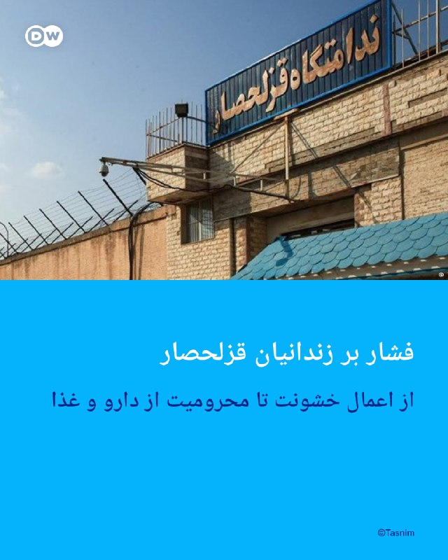

🔶فشار بر زندانیان قزلحصار؛ از اعمال خشونت تا محرومیت از دارو و غذا

"سازمان حقوق بشر ایران" مستقر در نروژ از افزایش خشونت شدید علیه زندانیان محبوس در زندان قزلحصار و کمبود اقلام خوراکی و دارویی در این زندان خبر داد.

در گزارش این سازمان حقوق بشری از جمله آمده است: «تعدادی از زندانیان واحد ۴ این زندان با لوله‌های پلی‌اتیلن مورد ضرب‌وجرح شدید قرار گرفته‌اند و زندانبا‌ن‌هایی با سابقه اعمال خشونت علیه زندانیان به این واحد منتقل شده‌اند.»

در این گزارش از احمد ترکمان، افسر نگهبان واحد ۲ زندان قزل‌حصار نام برده شده که به اعمال خشونت مشهور است و شخصا در مقابل چشمان شماری از زندانیان، یک زندانی تبعه افغانستان به نام عبدالعهد تورن ان‌شاءالله را "با لوله پلی‌اتیلن سه اینچی مورد ضرب‌وجرح شدید" قرار داده است.

همچنین زندانیان واحد ۳ زندان قزل‌حصار با فشارهای شدید معیشتی مواجه هستند و دسترسی محدودی به امکانات درمانی دارند؛ قیمت اقلام خوراکی چند برابر شده و حتی آب معدنی هم نایاب است.

@dw_farsi

## Persian_Trend_Official — post 13830

  

پست ترامپ در تروث سوشال لحظاتی قبل منتشر کرد.

## Persian_Trend_Official — post 13829

⭕️ رئیس انرژی: پارسال 9 هزار مگاوات کمبود برق داشتیم و امسال 24 هزارمگاوات؛ مردم برای قطعی های برق در هر 7 روز هفته خودشونو آماده کنن.

📝 Nick

📌 @persian_trend_official
پرشین ترند | متفاوت‌ترین کانال نظامی

## Persian_Trend_Official — post 13828

  <a href="telegram/content/Persian_Trend_Official_13828_1778426397.jpg">🎬 Download video</a>

دونالد ترامپ : نگفتم عملیات نظامی علیه ایران پایان یافته، بلکه گفتم آن‌ها شکست خورده‌اند !!!

📌 @persian_trend_official
پرشین ترند | متفاوت‌ترین کانال نظامی

## RadioFarda — post 157034

🔸یک هفته پس از سخنان امام جمعه رشت درباره لزوم برخورد با «بی‌حجابی»، یکی از مداحان حکومتی در تجمعی، زنان« کم‌حجابی» را که «به میدان آمده‌اند» «دختران این کشور» توصیف کرد.

🔸پیش‌تر امام جمعه رشت خواستار برخورد با زنانی شده بود که از حجاب اجباری تبعیت نمی‌کنند.

🔸جمهوری اسلامی سابقه‌ای طولانی در محدود کردن حقوق زنان دارد و طی دهه‌های گذشته قوانین سخت‌گیرانه‌ای درباره پوشش زنان اعمال کرده است.

🔸با این حال، از زمان اعتراض‌های «زن، زندگی، آزادی» تاکنون، زنان با حضور و نافرمانی مدنی، حکومت را برای کاهش محدودیت‌ها تحت فشار قرار داده‌اند.

@RadioFarda

## IranianMinds — post 19901

🔴 معاون وزیر امور خارجه جمهوری اسلامی:

حضور ناوهای جنگی فرانسه و انگلیس در تنگه هرمز با واکنش فوری و قاطع مواجه خواهد شد.

@IranianMinds

## IranianMinds — post 19900

  

نه داداش تو نمیدونی جمهوری اسلامی خیلی خوب داره دووم میاره جلو آمریکا و اسرائیل :

@IranianMinds

## IranianMinds — post 19899

  <a href="telegram/content/IranianMinds_19899_1778426398.mp4">🎬 Download video</a>

🔴 نتانیاهو:

جنگ با ایران تمام نشده است زیرا هنوز اورانیوم غنی شده وجود دارد که باید از ایران خارج شود.

هنوز سایت های غنی سازی وجود دارد که باید برچیده شوند. هنوز هم پروکسی هایی وجود دارند که ایران از آنها پشتیبانی می کند و موشک های بالستیکی که آنها می خواهند تولید کنند.

ما خیلی اونارو تحقیر کردیم، اما جای کار وجود دارد.

@IranianMinds

## IranianMinds — post 19897

  <a href="https://t.me/IranianMinds/19897">📎 Download file</a>

📲#اپلیکیشن اندروید سایت جهانی دربی بت

👍اسپانسر لیگ انگلیس
👍
🔥امکان شارژ امن از طریق کارت بانکی
➖➖➖➖➖➖➖➖➖

🪙همین حالا عضو شوید 👇
https://t.me/+aCbq7yy8QY80NzQ0

## IranianMinds — post 19896

  

😤دنبال یه سایت شرط بندی بین المللی بودی که به ایرانیا خدمات بده؟!
⛔

👍دربی بت همون انتخاب  100%

💎ویژگی های سایت جهانی Derby Bet:

⬅️امکان شارژ امن با کارت بانکی

⬅️واریز اول دوبل شارژ می شوید(بونوس۱۰۰٪)

⬅️پر اپشن ترین سایت فعال در ایران

⬅️تسویه حساب کمتر از 5 دقیقه

⬅️برگشت بخشی از باخت به صورت هفتگی

🚨کد هدیه ثبت نام:GG007

⚠️برای دانلود اپلکیشن کلیک کنید
👉
ge20

🔔کانال دربی بت :

🪙https://t.me/+aCbq7yy8QY80NzQ0

## IranianMinds — post 19895

  <a href="telegram/content/IranianMinds_19895_1778426400.mp4">🎬 Download video</a>

🔴 ترامپ:

دو گروه از رهبرانشان از بین رفته‌اند، گروه A رفته، گروه B هم رفته، و احتمالاً گروه C هم از بین رفته است.

ما با افرادی طرف هستیم که نوعی قدرت دارند. خیلی جالب است آن‌ها یک توافق می‌کنند و بعد آن را می‌شکنند.

@IranianMinds

## IranianMinds — post 19894

  <a href="telegram/content/IranianMinds_19894_1778426402.mp4">🎬 Download video</a>

🔴 ترامپ:

ایران از نظر نظامی شکست خورده است. شاید در ذهن خودشان هنوز این را ندانند، اما من فکر می‌کنم می‌دانند، چون من مستقیما با آن‌ها در ارتباط هستم

@IranianMinds

## IranianMinds — post 19893

🔴 ترامپ:

من مجبور بودم از نظر نظامی وارد عمل شوم، چون با اطمینان می‌دانستم ایران در مسیر دست‌یابی به سلاح هسته‌ای قرار دارد

@IranianMinds

## IranianMinds — post 19892

🔴 ترامپ :

تحت هیچ شرایطی ما نباید اجازه بدیم اونا سلاح هسته ای داشته باشن ، چون اونا دیوانه اند!

@IranianMinds

## IranianMinds — post 19891

🔴 ترامپ:

اگر ایران به سلاح هسته‌ای دست پیدا کند، آن را علیه اسرائیل و خاورمیانه به کار می‌برد!

@IranianMinds

## IranianMinds — post 19890

🔴 ترامپ : ما در ایران اهداف مشخصی داشتیم که دنبال می‌کردیم و احتمالا حدود ۷۰ درصدشون رو محقق کردیم @IranianMinds

## IranianMinds — post 19889

🔴 ترامپ:

هنوز اهداف دیگری در ایران داریم که همچنان احتمال هدف قرار دادنشان بسیار بالاست!

@IranianMinds

## IranianMinds — post 19888

🔴 ترامپ :

ما در ایران اهداف مشخصی داشتیم که دنبال می‌کردیم و احتمالا حدود ۷۰ درصدشون رو محقق کردیم

@IranianMinds

## IranianMinds — post 19887

🔴 ترامپ:

می‌توانیم تا دو هفته دیگر علیه ایران حرکت کنیم و به هر یک از اهداف مشخص‌شده ضربه بزنیم.

@IranianMinds

## IranianMinds — post 19886

🔴 ترامپ:

اگه امروز جنگ رو ترک کنیم، 20 سال طول می‌کشد تا ایران توانایی‌هایش را بازسازی کند

@IranianMinds

## BBCPersian — post 280666

  <a href="telegram/content/BBCPersian_280666_1778426404.mp4">🎬 Download video</a>

اینستاگرام روز ۱۸ اردیبهشت ۱۴۰۵ اعلام کرد که گزینه ارسال پیام‌های مستقیم با فناوری حریم خصوصی بسیار امن را حذف می‌کند. این در حالی است که این پلتفرم سال‌ها این فناوری را به عنوان آینده اینستاگرام معرفی می‌کرد.

مارک زاکربرگ، مدیرعامل متا، در سال ۲۰۱۹ وعده داد که اجرای رمزگذاری سرتاسری در سراسر برنامه‌هایش، پلتفرم‌هایش را ایمن‌تر و مطمئن‌تر خواهد کرد. اما ماه گذشته این شرکت از این وعده خود دست کشید؛ اقدامی که مورد تحسین گروه‌های مجری قانون قرار گرفت اما فعالان حریم خصوصی به آن انتقاد کردند.
@BBCPersian
https://bbc.in/4fc1lAT

## BBCPersian — post 280665

🔻مدیرعامل شرکت پایانه‌های نفتی ایران ایجاد یک لکه نفتی در سواحل جزیره خارگ را «ادعای کذب و به دور از واقعیت» خواند.

به گزارش رسانه‌های ایران، عباس اسدروز گفت: «به محض انتشار این اخبار، گروه‌های متخصص اچ‌اس‌ئی [سلامت و ایمنی]، اداره شیمیایی و آزمایشگاه، همه منطقه را پایش کردند اما حتی کوچک‌ترین موردی یافت نشد.»

به گفته او، نه مرکز بین‌المللی میمک، وابسته به سازمان بین المللی دریانوردی، نه ایران گزارشی از آلودگی در این منطقه ثبت نکرده‌اند.

آقای اسدروز همچنین گفت: «روایت‌سازان مدعی لکه‌ای هستند که به سمت دریا می‌رود، در حالی که با توجه به جهت باد شمال‌غربی (۲۰ گره دریایی) به سمت جنوب شرقی، اگر لکه‌ای وجود داشت باید به سمت ساحل می‌آمد.»

اشاره آقای اسدروز به پست نهاد غیردولتی «رصدخانه درگیری و محیط زیست» در شبکه ایکس است که نوشته بود: «منشا اولیه هنوز مشخص نیست و این لکه در حال حرکت به سمت جنوب است و به نظر نمی‌رسد به‌درستی مهار شود.»

https://bbc.in/4u2uB1B
@BBCPersian

## BBCPersian — post 280664

🔹چند خبر کوتاه از ایران

▪️وزارت خارجه ایران رافائل گروسی، مدیرکل آژانس بین‌المللی انرژی اتمی، را به سیاسی‌کاری متهم کرد. سخنگوی وزارت خارجه ایران در شبکه اجتماعی ایکس نوشت وظیفه آژانس «راستی‌آزمایی است، نه ارسال پیام‌های سیاسی در مورد تنگه هرمز، موشک‌های ایران یا نحوه رفتار تهران.» به گفته اسماعیل بقایی «وقتی بی‌طرفی حرفه‌ای قربانی رفتارهای سیاسی یا جاه‌طلبی‌های شخصی بشود، اعتبار نهادها دچار فرسایش می‌شود و بعد از چندی اثربخشی آنها نیز مخدوش می‌گردد.» آقای گروسی هفته گذشته در مصاحبه‌ای گفته بود توافق آمریکا و ایران نیازمند اراده سیاسی در تهران است.»

▪️نایب رئیس مجلس ایران گفت: «تنگه هرمز با عملیات نظامی باز نمی‌شود.» علی نیکزاد در نطق پیش از دستور در جلسه اینترنتی امروز مجلس گفت: «سال‌ها بود که تنگه هرمز با نجابت ملت ایران مورد استفاده شما قرار می‌گرفت. این شما بودید که جنگ‌افروزی کردید و امروز باید به نظم جدید این آبراه استراتژیک عادت کنید.»

▪️مسعود پزشکیان در جلسه کارگروه بازسازی پس از جنگ گفت که «اگر «سخنی از گفت‌وگو یا مذاکره مطرح می‌شود، معنای آن تسلیم یا عقب‌نشینی نیست» و هدف «احقاق حقوق ملت ایران و دفاع مقتدرانه از منافع ملی است.»

https://bbc.in/4u0SGG1
@BBCPersian

## BBCPersian — post 280663

🔻نخست‌وزیر قطر: همه طرف‌ها باید برای پایان دادن به جنگ تلاش کنند

نخست‌وزیر قطر با وزیر خارجه ایالات متحده درباره اوضاع منطقه و میانجیگری پاکستان برای پایان جنگ گفت‌‌وگو کرده است.

در بیانیه‌ دولت قطر آمده است که محمد بن عبدالرحمن آل ثانی، نخست‌وزیر و وزیر خارجه قطر، در دیدار با مارکو روبیو در میامی خواستار توجه همه طرف‌ها به تلاش‌های میانجیگرانه و «رسیدگی به ریشه‌های بحران از طریق روش‌های مسالمت‌آمیز» شده است.

بنابر این بیانیه، قطر خواهان «توافقی جامع» برای صلح پایدار در منطقه است.

ساعاتی پس از دیدار محمدبن عبدالرحمن آل ثانی با وزیر خارجه آمریکا، او با عباس عراقچی، وزیر خارجه ایران، تلفنی گفت‌وگو کرد.

خبرگزاری دولتی ایرنا نوشت در این تماس تلفنی «پیرامون آخرین تحولات منطقه‌ای و روندهای جاری دیپلماتیک» گفت‌وگو شده است اما جزئیات بیشتری منتشر نکرد.

https://bbc.in/4wiFopY
@BBCPersian

## idfinfarsi — post 11562

ارتش اسرائیل تروریست‌های نخبه و دیگر تروریست‌هایی را که نیروهای ما را در نوار غزه تهدید می‌کردند، به هلاکت رساند

نیروهای ارتش اسرائیل در فرماندهی جنوب، امروز (یکشنبه) تروریست‌های مسلح نخبه از سازمان تروریستی حماس را که برای پیشبرد توطئه‌های تروریستی در کوتاه‌مدت علیه نیروهای ارتش اسرائیل در جنوب نوار غزه فعالیت می‌کردند، شناسایی کردند.

در حادثه دیگری که دیشب (شنبه) رخ داد، نیروهای تیم رزمی تیپ ۱۴ که در شمال نوار غزه فعالیت می‌کردند، دو تروریست را که در منطقه خط زرد اقدامات مشکوکی را روی زمین انجام می‌دادند و به گونه‌ای به نیروها نزدیک می‌شدند که تهدید فوری ایجاد می‌کردند، شناسایی کردند.

در هر دو حادثه، نیروی هوایی، تحت هدایت نیروها، تروریست‌ها را به هلاکت رساند تا تهدید را از بین ببرد.

قبل از حملات، اقداماتی برای به حداقل رساندن آسیب به غیرنظامیان، از جمله استفاده از سلاح‌های دقیق و رصد هوایی، انجام شد.

ارتش اسرائیل در فرماندهی جنوب مطابق با توافق در منطقه مستقر هستند و به عملیات خود برای از بین بردن هرگونه تهدید فوری ادامه خواهند داد.

## Hranews — post 112866

  

💥 دعوت به همکاری با خبرگزاری هرانا

خبرگزاری هرانا، با بیش از دو دهه سابقه در حوزه گزارشگری و مستندسازی حقوق بشر، در راستای توسعه فعالیت‌های خود از علاقه‌مندان واجد شرایط برای همکاری دعوت می‌کند.

هرانا در این مرحله بیش از آن‌که به دنبال افراد با سابقه حرفه‌ای باشد، به دنبال افرادی متعهد، دقیق و آموزش‌پذیر است؛ کسانی که دغدغه واقعی حقوق بشر دارند و مایل‌اند در یک چارچوب حرفه‌ای، مهارت‌های خود را توسعه دهند.

زمینه‌های همکاری شامل:
گزارشگری، ویراستاری، ترجمه، مدیریت شبکه‌های اجتماعی و سایر حوزه‌های مرتبط

ویژگی‌های مورد انتظار:

* تسلط کافی به زبان فارسی (خواندن و نوشتن)
* دقت، مسئولیت‌پذیری و توانایی یادگیری مستمر
* علاقه و حساسیت نسبت به موضوعات حقوق بشر
* آمادگی برای فعالیت در چارچوب‌های سازمان‌یافته و حرفه‌ای

❗️ توجه: درخواست‌ها صرفاً در صورتی بررسی خواهند شد که اطلاعات ثبت‌شده در فرم (از جمله کشور محل سکونت و سایر شرایط اعلام‌شده) با الزامات همکاری همخوانی داشته باشد.

همکاری با هرانا فرصتی است برای کسب تجربه عملی در حوزه مستندسازی و فعالیت‌های حقوق بشری در یک نهاد با سابقه و ساختار حرفه‌ای.

📎 برای ثبت درخواست همکاری، لطفا فرم زیر را تکمیل کنید:
https://hra.news/4cBjHqs

📩 در صورت بروز مشکل در تکمیل فرم، می‌توانید رزومه و اطلاعات تماس خود را به آدرس زیر ارسال نمایید:
info@hra-news.org

↘️
@hranews_bot تماس ✉️ -  @Hranews  کانال هرانا 🆑

## manototv — post 105248

  <a href="telegram/content/manototv_105248_1778426406.mp4">🎬 Download video</a>

هلسینکی | فنلاند؛ گردهمایی ایرانیان ـ گزارشگر ۲۰ اردیبهشت ۱۴۰۵

## manototv — post 105247

  <a href="telegram/content/manototv_105247_1778426408.mp4">🎬 Download video</a>

گزارشگر منوتو با ارسال ویدیویی از گرانی اقلام خوراکی در فروشگاه می‌گوید:
«سپاه ما رو به خواری و ذلت انداخته»

## manototv — post 105246

  <a href="telegram/content/manototv_105246_1778426409.mp4">🎬 Download video</a>

اینسبروک | اتریش؛ گردهمایی ایرانیان ـ گزارشگر ۲۰ اردیبهشت ۱۴۰۵

## manototv — post 105245

  <a href="telegram/content/manototv_105245_1778426410.mp4">🎬 Download video</a>

ژنو | سوئیس؛ گردهمایی ایرانیان ـ گزارشگر ۲۰ اردیبهشت ۱۴۰۵

## manototv — post 105243

  <a href="telegram/content/manototv_105243_1778426412.mp4">🎬 Download video</a>

راهپیمایی ایرانیان ساکن استکهلم سوئد، یکشنبه ۲۰ اردیبهشت ۱۴۰۵

## alonews — post 119100

  <a href="telegram/content/alonews_119100_1778426413.jpg">🎬 Download video</a>

👈شرکت ایرفرانس در بیانیه‌ای اعلام کرد:
به‌دلیل شرایط امنیتی، پروازها به دبی، ریاض، تل‌آویو و بیروت تا ۲۰ می (۳۰ اردیبهشت) لغو شده است

✅ @AloNews خبر جنگ

## alonews — post 119099

  <a href="telegram/content/alonews_119099_1778426413.jpg">🎬 Download video</a>

👈ترامپ: نگفتم عملیات نظامی علیه ایران پایان یافته، بلکه گفتم آنها شکست خوردن.

✅ @AloNews خبر جنگ

## alonews — post 119098

  <a href="telegram/content/alonews_119098_1778426414.jpg">🎬 Download video</a>

👈نخست‌وزیر پاکستان اعلام کرد که ژنرال عاصم منیر، رئیس ستاد ارتش، به او اطلاع داده است که پاسخی از سوی ایران به پیشنهاد آمریکا دریافت شده است.

✅ @AloNews خبر جنگ

## alonews — post 119097

  

👈فرماندهی مرکزی ایالات متحده:
بیش از 20 ناو جنگی آمریکا محاصره ایران را اجرا میکنند

🔴نیروهای CENTCOM 61 کشتی تجاری را هدایت کرده اند و 4 کشتی را برای اطمینان از انطباق غیرفعال کرده اند.‌‌

✅ @AloNews خبر جنگ

## alonews — post 119096

  <a href="telegram/content/alonews_119096_1778426414.mp4">🎬 Download video</a>

👈چگونه تصور می‌کنید اورانیوم بسیار غنی‌شده از ایران خارج شود؟

🔴نتانیاهو: شما وارد می‌شوید و آن را بیرون می‌آورید. رئیس‌جمهور ترامپ به من گفته است، «می‌خواهم وارد آنجا شوم.»

🔴من جدول زمانی برای آن نمی‌دهم، اما می‌گویم این یک مأموریت فوق‌العاده مهم است

✅ @AloNews خبر جنگ

## alonews — post 119095

  <a href="telegram/content/alonews_119095_1778426416.mp4">🎬 Download video</a>

👈بنیامین نتانیاهو: من فکر می‌کنم جنگ با ایران دستاوردهای زیادی داشته است، اما هنوز تمام نشده، زیرا هنوز مواد هسته‌ای، اورانیوم غنی‌شده وجود دارد که باید از ایران خارج شود.

🔴هنوز سایت‌های غنی‌سازی وجود دارند که باید منهدم شوند. هنوز نیروهای نیابتی وجود دارند که ایران از آن‌ها حمایت می‌کند.

🔴موشک‌های بالستیکی وجود دارند که آن‌ها هنوز می‌خواهند تولید کنند. حالا، ما بخش زیادی از آن را تضعیف کرده‌ایم، اما همه آن‌ها هنوز وجود دارند و کارهایی باید انجام شود.

✅ @AloNews خبر جنگ

## alonews — post 119094

  <a href="telegram/content/alonews_119094_1778426417.jpg">🎬 Download video</a>

👈ترامپ: من هشت جنگ را به پایان رساندم و ما بهترین اقتصاد را که تاکنون داشته‌ایم داریم.

🔴همین که وارد اتاق می‌شوم، می‌بینم شاخص S&P در طول یک جنگ به اصطلاح، به بالاترین حد جدیدی رسیده است.

🔴من آن را یک درگیری نظامی می‌نامم چون نسبتاً آسان بود

✅ @AloNews خبر جنگ

## alonews — post 119093

  <a href="telegram/content/alonews_119093_1778426417.jpg">🎬 Download video</a>

👈ترامپ: حتی اگر به اهداف باقی‌مانده در ایران حمله نکنیم، بازسازی آنها سال‌ها طول خواهد کشید.

✅ @AloNews خبر جنگ

## alonews — post 119092

  <a href="telegram/content/alonews_119092_1778426418.jpg">🎬 Download video</a>

👈ترامپ: ما اکنون نفت و گازی بیشتر از مجموع روسیه و عربستان سعودی تولید می‌کنیم.

🔴 تا پایان امسال، این عدد احتمالاً دو برابر خواهد شد.

✅ @AloNews خبر جنگ

## alonews — post 119091

  <a href="telegram/content/alonews_119091_1778426418.mp4">🎬 Download video</a>

👈 ترامپ: ناتو ثابت کرده که یک ببر کاغذی است. آن‌ها برای کمک آنجا نبودند.

🔴جالب این است که بسیاری از کشورهای ناتو از تنگه هرمز استفاده می‌کنند — ما از تنگه استفاده نمی‌کنیم.

🔴ما به تنگه نیاز نداریم. ما این کار را برای کمک به اسرائیل و عربستان سعودی و قطر و امارات متحده عربی و دیگران انجام دادیم.

✅ @AloNews خبر جنگ

## alonews — post 119090

  <a href="telegram/content/alonews_119090_1778426420.mp4">🎬 Download video</a>

👈 ترامپ درباره جمهوري اسلامي: رهبران آن‌ها رفته‌اند، تیم A رفته، تیم B رفته و احتمالاً تیم C رفته است.

🔴ما با افرادی طرف هستیم که قدرتی خاص دارند. بسیار جالب است — آن‌ها توافق می‌کنند و سپس آن را نقض می‌کنند.

✅ @AloNews خبر جنگ

## alonews — post 119089

  <a href="telegram/content/alonews_119089_1778426421.mp4">🎬 Download video</a>

👈ترامپ درباره ایران: اگر من سلیمانی را از بین نمی‌بردم، فکر می‌کنم ایران کشور متفاوتی بود. کشور شایسته‌تری می‌شد.

🔴اما او نابغه‌ای شرور بود.

✅ @AloNews خبر جنگ

## alonews — post 119088

  <a href="telegram/content/alonews_119088_1778426423.jpg">🎬 Download video</a>

👈ترامپ درباره ایران: ما نمی‌توانیم اجازه دهیم ایران سلاح هسته‌ای داشته باشد چون آن‌ها دیوانه هستند.

🔴اگر من توافق هسته‌ای اوباما با ایران را لغو نکرده بودم، آن‌ها اکنون آن را داشتند و ممکن بود از آن علیه اسرائیل و خاورمیانه و شاید فراتر استفاده کنند.

✅ @AloNews خبر جنگ

## alonews — post 119086

  <a href="telegram/content/alonews_119086_1778426423.jpg">🎬 Download video</a>

👈ترامپ: ما اهداف مشخصی داریم که در ایران به دنبال دستیابی به آنها بوده‌ایم و شاید حدود ۷۰ درصد از آنها را محقق کرده باشیم

✅ @AloNews خبر جنگ

## alonews — post 119085

  <a href="telegram/content/alonews_119085_1778426423.jpg">🎬 Download video</a>

👈ترامپ: ایران از نظر نظامی شکست خورده است و ممکن است خودشان متوجه این موضوع نباشند، اما من فکر می‌کنم که متوجه هستند.

🔴ایران شکست خورده است، اما این به معنای نابودی کامل آن نیست.

🔴ما می‌توانیم تا دو هفته دیگر علیه ایران اقدام نظامی انجام دهیم و به تک تک اهداف شناسایی شده حمله کنیم

✅ @AloNews خبر جنگ

## alonews — post 119084

  <a href="telegram/content/alonews_119084_1778426424.jpg">🎬 Download video</a>

👈ترامپ: هنوز اهدافی داریم که محقق نشده

✅ @AloNews خبر جنگ

## alonews — post 119083

  <a href="telegram/content/alonews_119083_1778426424.jpg">🎬 Download video</a>

👈ترامپ: ما می‌توانیم تا دو هفته دیگر علیه ایران اقدام نظامی انجام دهیم و به تک تک اهداف شناسایی شده حمله کنیم.

✅ @AloNews خبر جنگ

---
📅 بروزرسانی: 1405/02/20 17:44
---

## VahidOOnLine — post 239292

  <a href="telegram/content/VahidOOnLine_239292_1778422464.mp4">🎬 Download video</a>

بر اساس ویدیوهای رسیده به ایران‌اینترنشنال، ایرانیان مقیم نروژ یکشنبه ۲۰ اردیبهشت در پی فراخوان شاهزاده رضا پهلوی، علیه اعدام‌های جمهوری اسلامی و قطع اینترنت در ایران، در شهر اسلو تجمع کردند.
‌🏁 🇬🇧 IranintlTV

🤖 @VahidOOnLine

## VahidOOnLine — post 239291

♦️مصطفی طاهری، عضو کمیسیون صنایع مجلس، روز یکشنبه ۲۰ اردیبهشت در گفتگویی تلویزیونی مدعی شد بر اساس پیش‌نویس مطرح‌شده، امکان ایجاد حدود ۱۵ میلیارد دلار درآمد برای کشور وجود دارد.
او با اشاره به اینکه در شرایط عادی درآمد نفتی ایران می‌تواند به حدود ۴۰ میلیارد دلار برسد، گفت این رقم معادل بیش از یک‌سوم درآمد نفتی کشور است و می‌تواند «گشایش قابل‌توجهی» در اقتصاد ایجاد کند.
طاهری همچنین تاکید کرد که اهمیت این درآمد به‌دلیل ارزی بودن آن است و می‌تواند در بهبود وضعیت بازار ارز، کاهش نوسانات و مدیریت عرضه و تقاضا نقش مؤثری داشته باشد.
طاهری افزود، تزریق این منابع ارزی می‌تواند بخشی از مشکلات مربوط به چندنرخی بودن ارز و بی‌ثباتی بازار را کاهش دهد.
‌🇸🇦 Indypersian

🤖 @VahidOOnLine

## VahidOOnLine — post 239290

  <a href="telegram/content/VahidOOnLine_239290_1778422466.mp4">🎬 Download video</a>

گردهمایی ایرانیان ساکن توکیو مقابل وزارت خارجه ژاپن، یکشنبه ۲۰ اردیبهشت
‌🏁 🇬🇧 ManotoTV

🤖 @VahidOOnLine

## VahidOOnLine — post 239289

  <a href="telegram/content/VahidOOnLine_239289_1778422469.mp4">🎬 Download video</a>

شماری از ایرانیان ساکن لندن روز شنبه ۱۰ مه با حضور در تجمعی مقابل دفتر نخست‌وزیر بریتانیا، مخالفت خود را با یهودستیزی اعلام کردند.

شرکت‌کنندگان در این گردهمایی با در دست داشتن پرچم‌های ایران و اسرائیل و پلاکاردهایی در حمایت از همزیستی و مقابله با نفرت‌پراکنی، خواستار ایستادگی در برابر یهودستیزی و افراط‌گرایی شدند.

این تجمع در حالی برگزار شد که در ماه‌های اخیر نگرانی‌ها درباره افزایش موارد یهودستیزی در بریتانیا و برخی کشورهای اروپایی افزایش یافته است.
‌🏁 🇬🇧 ManotoTV

🤖 @VahidOOnLine

## VahidOOnLine — post 239288

  <a href="telegram/content/VahidOOnLine_239288_1778422471.mp4">🎬 Download video</a>

راهپیمایی ایرانیان گوتنبرگ
‌🏁 🇬🇧 ManotoTV

🤖 @VahidOOnLine

## VahidOOnLine — post 239287

  <a href="telegram/content/VahidOOnLine_239287_1778422473.mp4">🎬 Download video</a>

حضور گسترده ایرانیان در تجمع ضد یهودستیزی در برابر دفتر نخست وزیر در لندن، یکشنبه ۲۰ اردیبهشت
‌🏁 🇬🇧 ManotoTV

🤖 @VahidOOnLine

## VahidOOnLine — post 239286

  <a href="telegram/content/VahidOOnLine_239286_1778422475.mp4">🎬 Download video</a>

دفتر رسانه‌ای دولت دبی اعلام کرد دود غلیظ مشاهده‌شده در منطقه الجداف، ناشی از آتش‌سوزی در یک قایق متوقف در خور دبی بوده است.

بر اساس این بیانیه، تیم‌های دفاع مدنی دبی حریق را در مدت ۵۴ دقیقه به طور کامل مهار کردند و عملیات خنک‌سازی محل ادامه دارد.

دفتر رسانه‌ای دولت دبی اعلام کرد در این حادثه هیچ مصدومی گزارش نشده و رنگ سیاه و غلظت دود به دلیل سوختن مواد فایبرگلاس به کار رفته در ساخت قایق بوده است.
‌🏁 🇬🇧 ManotoTV

🤖 @VahidOOnLine

## VahidOOnLine — post 239285

  <a href="telegram/content/VahidOOnLine_239285_1778422477.mp4">🎬 Download video</a>

ویدیوهای رسیده به ایران‌اینترنشنال نشان می‌دهند گروهی از ایرانیان مقیم آلمان، یکشنبه ۲۰ اردیبهشت در اعتراض به اعدام‌های جمهوری اسلامی، در شهر هانوفر تجمع کردند و فریاد «ایستاده‌ایم تا پایان» سردادند.
‌🏁 🇬🇧 IranintlTV

🤖 @VahidOOnLine

## VahidOOnLine — post 239284

  

وزارت خارجه امارات متحده عربی «حملات با پهپاد» به کویت را به‌شدت محکوم کرد و افزود این حملات «تروریستی» علیه کویت نقض حاکمیت این کشور محسوب می‌شود و امنیت و ثبات آن را تهدید می‌کند.

صبح یک‌شنبه کویت از مقابله با پهپادهای پرتاب شده به این کشور خبر داد.
‌🏁 🇬🇧 IranintlTV

🤖 @VahidOOnLine

## VahidOOnLine — post 239283

  <a href="telegram/content/VahidOOnLine_239283_1778422481.mp4">🎬 Download video</a>

ویدیوی ارسال‌شده به ایران‌اینترنشنال نشان می‌دهد یکشنبه ۲۰ اردیبهشت محبوبه رمضانی و رحیمه یوسف‌زاده، مادران پژمان قلی‌پور و نوید بهبودی، معترضان کشته‌شده در آبان ۹۸، با حضور در تجمع ایرانیان در هانوفر آلمان، اعتراض «فرزندان ایران را برای سرنگونی حکومت فاسد آخوندی» خواندند.
‌🏁 🇬🇧 IranintlTV

🤖 @VahidOOnLine

## VahidOOnLine — post 239282

  

♦️وزارت خارجه قطر، روز یکشنبه اعلام کرد شیخ محمد بن عبدالرحمن آل ثانی، نخست‌وزیر و وزیر خارجه این کشور، در تماس تلفنی با فیصل بن فرحان، وزیر خارجه عربستان سعودی، درباره تحولات مربوط به آتش‌بس میان آمریکا و ایران گفتگو کرده است.
بر اساس بیانیه وزارت خارجه قطر، دو طرف همچنین درباره تلاش‌ها برای کاهش تنش‌ها «به گونه‌ای که به تقویت امنیت و ثبات منطقه کمک کند» رایزنی کردند.
شیخ محمد بن عبدالرحمن آل ثانی، پیش از این تماس، با عباس عراقچی درباره بحران منطقه‌ای و انسداد تنگه هرمز گفتگو کرده بود. وزیر امور خارجه قطر در این گفتگو از تهران خواسته بود آبراهه هرمز را به عنوان «اهرم فشار» به کار نگیرد.
‌🇸🇦 Indypersian

🤖 @VahidOOnLine

## VahidOOnLine — post 239281

♦️عبدالناصر همتی، رئیس بانک مرکزی در مصاحبه با صداوسیما گفت که افزایش نرخ دلار با توجه به جنگ منطقی بوده و هم اکنون بازار ارز در آرامش است.
همتی همچنین گفت: «در جلسه امروز به نتایج خوبی برای تامین و تخصیص ارز ۱۴۰۵ رسیدیم.»
‌🇸🇦 Indypersian

🤖 @VahidOOnLine

## VahidOOnLine — post 239280

  

♦️وزارت خارجه کره‌جنوبی روز یکشنبه اعلام کرد کشتی باری متعلق به این کشور که پیشتر در تنگه هرمز دچار حادثه شده بود، حمله «هواگردهای ناشناس» قرار گرفته است.
پارک ایل، سخنگوی وزارت خارجه کره‌جنوبی، در یک نشست خبری گفت دو هواگرد ناشناس بخش بیرونی مخزن تعادل سمت چپ در قسمت عقب کشتی «اچ‌ام‌ام نامو» را با فاصله حدود یک دقیقه هدف قرار دادند که در پی آن آتش و دود ایجاد شد.
او بدون اشاره به نوع این هواگردها گفت تصاویر آن‌ها در دوربین‌های مداربسته ثبت شده، اما «محدودیت‌هایی برای شناسایی دقیق نوع، مبدا پرتاب و اندازه فیزیکی این اشیا وجود دارد.»
به گفته مقام‌های کره‌جنوبی، بررسی‌های بیشتری روی بقایای موتور و دیگر قطعات به‌جا مانده انجام خواهد شد.
سخنگوی وزارت خارجه کره‌جنوبی افزود آسیب وارد شده به این کشتی باری که ۲۴ خدمه در آن حضور داشتند، حدود پنج متر عرض داشته و تا حدود هفت متر در بدنه کشتی در بخش عقب سمت چپ امتداد یافته است.
او همچنین گفت آتش‌سوزی در اتاق موتور احتمالا در اثر نخستین حمله آغاز شده و حمله دوم باعث گسترش سریع آتش شده است.
دولت کره‌جنوبی روز دوشنبه ۱۴ اردیبهشت اعلام کرد در حال بررسی اطلاعاتی است که نشان می‌دهد یک کشتی با پرچم این کشور در تنگه هرمز هدف حمله قرار گرفته است.
دونالد ترامپ، رئیس‌جمهوری آمریکا، پس از این حادثه گفت ایران به این کشتی با پرچم پاناما «شلیک‌هایی» انجام داده و از کره‌جنوبی خواست به عملیات آمریکا برای بازگرداندن امنیت کشتیرانی در تنگه هرمز بپیوندد.
جمهوری اسلامی دخالت در این حمله را رد کرده است. سفارت ایران در سئول در بیانیه‌ای اعلام کرد تهران «هرگونه ادعا درباره دخالت نیروهایش» را قاطعانه تکذیب می‌کند.
سخنگوی وزارت خارجه کره‌جنوبی همچنین گفت سفیر ایران در سئول به وزارت خارجه احضار شده تا درباره موضع تهران در قبال یافته‌های منتشر شده توضیح دهد.
‌🇸🇦 Indypersian

🤖 @VahidOOnLine

## VahidOOnLine — post 239279

♦️عبدالناصر همتی، رئیس بانک مرکزی در مصاحبه با صداوسیما گفت که افزایش نرخ دلار با توجه به جنگ منطقی بوده و هم اکنون بازار ارز در آرامش است.
همتی همچنین گفت: «در جلسه امروز به نتایج خوبی برای تامین و تخصیص ارز ۱۴۰۵ رسیدیم.»
‌🇸🇦 Indypersian

🤖 @VahidOOnLine

## VahidOOnLine — post 239278

  <a href="telegram/content/VahidOOnLine_239278_1778422485.mp4">🎬 Download video</a>

بر اساس ویدیوهای رسیده به ایران‌اینترنشنال، ایرانیان مقیم بریتانیا یکشنبه ۲۰ اردیبهشت در پی فراخوان شاهزاده رضا پهلوی، علیه اعدام‌های جمهوری اسلامی و قطع اینترنت در ایران، در شهر شفیلد تجمع کردند.
‌🏁 🇬🇧 IranintlTV

🤖 @VahidOOnLine

## VahidOOnLine — post 239277

  

خبرگزاری ایرنا نوشت پاسخ جمهوری اسلامی به آخرین متن پیشنهادی آمریکا برای خاتمه جنگ، امروز از طریق میانجی پاکستانی ارسال شده است.

بر اساس این گزارش، سخنگوی وزارت خارجه جمهوری اسلامی پیش‌تر گفته بود دیدگاه‌ها و ملاحظات تهران درباره پیشنهادهای آمریکا پس از تکمیل بررسی‌ها و جمع‌بندی نهایی ارسال می‌شود.

ایرنا افزود در طرح پیشنهادی، مذاکرات در این مرحله بر موضوع خاتمه جنگ در منطقه متمرکز خواهد بود.
‌🏁 🇬🇧 ManotoTV

🤖 @VahidOOnLine

## mwarmonitor — post 8823

  

✈️هواپیمای سوخت‌رسان هوایی KC-46A Pegasus متعلق به نیروی هوایی آمریکا امروز با دفعات بیشتری بر فراز عراق در حال عملیات بوده است.

✈️در همین حال، یک فروند دیگر KC-135R Stratotanker که از پایگاه هوایی الظفره در ابوظبی پرواز کرده، اکنون در حال فعالیت بر فراز دریای عمان است.

@mwarmonitor

## mwarmonitor — post 8822

🔴شریل اتکیسون: در کجای جنگ هستیم، اگر هنوز مواد هسته‌ای، یعنی اورانیوم غنی‌شده را از آن‌ها نگرفته‌ایم؟
🔵دونالد ترامپ: خب، ما در مقطعی آن را به دست خواهیم آورد، هر زمان که بخواهیم. ما آنجا را تحت نظر داریم. می‌دانی، من چیزی به نام «نیروی فضایی» ایجاد کردم و آن‌ها هر لحظه آنجا را تماشا می‌کنند. اگر کسی وارد شود، آن‌ها می‌توانند نامش، آدرسش و شماره نشانش را به شما بگویند.
نه، ما آنجا را خیلی خوب تحت نظر داریم. اگر کسی به آن مکان نزدیک شود، ما باخبر خواهیم شد و آن‌ها را منفجر خواهیم کرد.

@mwarmonitor

## mwarmonitor — post 8821

  <a href="telegram/content/mwarmonitor_8821_1778422490.mp4">🎬 Download video</a>

🎬 Video

## mwarmonitor — post 8820

Trump is typing ...

## mwarmonitor — post 8819

🔴یک منبع دیپلماتیک پاکستانی به الجزیره: پاسخ ایران بلافاصله پس از دریافت، به طرف آمریکایی منتقل شد.

@mwarmonitor

## mwarmonitor — post 8818

📝در دنیایی که کانال‌های چندصد هزار نفری، اطلاع‌رسانی را به «کاسه گدایی» تبدیل کرده‌اند، مسیر ما متفاوت است.

🔸 اینجا نه خبری از تبلیغاتِ سایت‌های بت و فروشندگان VPN است و نه بساطِ گلریزان به حساب‌های پی‌پال پهن شده؛ اینجا خبری از «کاسبی از جهل» نیست.

🔸تمام آنچه در این فضا منتشر می‌شود، به صورت تک‌نفره، دلی و با هدف رساندن اخبار صحیح به ایرانیان داخل و خارج از کشور است. ما بدون هیچ چشم‌داشتی، بر لبه‌ی حقیقت ایستاده‌ایم تا تفاوت میان «رسانه مستقل» و «دکان‌های مجازی» بیش از پیش آشکار شود.

تعهد ما فقط به حقیقت است، نه به جیب مخاطب.

@mwarmonitor

## mwarmonitor — post 8817

رئیس‌جمهور ترامپ از خطوط قرمز خود عقب‌نشینی نکرده است. او خطوط قرمز خود را حفظ کرده که این نکته مثبتی برای اوست. اما من فکر می‌کنم ما باید فشارهای اقتصادی را حفظ کنیم، محاصره را ادامه دهیم؛ اقتصاد آن‌ها در حال فروپاشی است و آن‌ها نمی‌توانند این حجم از فشار…

## mwarmonitor — post 8816

🔴مارک لوین : «نکته بسیار خوبی است. آن‌ها نمی‌توانند دوباره این کار را انجام دهند. ما ممکن است مجبور شویم ۱۰، ۱۵ یا ۲۰ سال دیگر برگردیم. شما مخالفتی را که در برابر کارهای رئیس‌جمهور (ترامپ) وجود دارد، می‌بینید. من می‌بینم که مخالفت‌ها اینجا در ایالات متحده…

## mwarmonitor — post 8815

🔴مارک لوین: به «زندگی، آزادی و لوین» خوش آمدید. ما اینجا با دوست خوبمان، «ربکا هاینریش»، پژوهشگر ارشد موسسه هادسون و مدیر طرح دفاعی کیستون هستیم. ربکا، ممنون که دوباره به برنامه ما آمدی. خب، ما الان در نقطه‌ای هستیم که فکر می‌کنم همه چیز به دو گزینه ختم می‌شود:…

## mwarmonitor — post 8814

🔴مارک لوین: به «زندگی، آزادی و لوین» خوش آمدید. ما اینجا با دوست خوبمان، «ربکا هاینریش»، پژوهشگر ارشد موسسه هادسون و مدیر طرح دفاعی کیستون هستیم. ربکا، ممنون که دوباره به برنامه ما آمدی. خب، ما الان در نقطه‌ای هستیم که فکر می‌کنم همه چیز به دو گزینه ختم می‌شود: مهار (ایران) از طریق یک توافق، یا نوعی پیروزی؛ جایی که فشار را حفظ کنیم، فشار نظامی، فشار اقتصادی و غیره. تو در حال حاضر این وضعیت را چطور می‌بینی؟

🔵ربکا هاینریش: خب، من در واقع فکر می‌کنم راه سومی هم وجود دارد و آن این است که اساساً فشار را دوباره برقرار کنید، یک عملیات نظامی دیگر انجام دهید و این کار زمینه را برای رسیدن به توافقی که واقعاً کارایی داشته باشد، بیشتر فراهم می‌کند.
پرزیدنت ترامپ در برابر این رژیمِ باقی‌مانده (رژیم ایران) به طرز باورنکردنی صبور بوده است، اما این صبر نتیجه‌ای نداده است. وقتی رئیس‌جمهور می‌گوید «ببینید، ما قرار است آتش‌بس داشته باشیم»، شما همچنان می‌بینید که شبه‌نظامیان سپاه پاسداران (IRGC) به کشتی‌های نیروی دریایی شلیک می‌کنند.
مارک، همانطور که می‌دانی ارتش ما هنوز در منطقه حضور دارد، بنابراین ما به انهدام این قایق‌های کوچک که سعی دارند به نفت‌کش‌ها یا کشتی‌های ما آسیب برسانند، ادامه می‌دهیم. اما می‌دانی، دیگر کافی است. ما آن‌ها را از نظر اقتصادی تحت فشار گذاشته‌ایم؛ آن‌ها به دلیل کارزار فشار اقتصادی پرنسسیپ ترامپ، روزانه صدها میلیون دلار از دست می‌دهند.
فشار نظامی هنوز پابرجاست و اگر پرنسسیپ ترامپ چراغ سبز نشان دهد، عملی خواهد شد. اما من همچنان فکر می‌کنم که ما باید دور دیگری (از حملات) را انجام دهیم. ما می‌دانیم چه اهدافی را هنوز باید در داخل ایران بزنیم. این کار باید در مرحله بعد انجام شود و آن زمان در موقعیت بهتری خواهیم بود تا ایرانی‌ها را وادار کنیم که واقعاً وارد بازی شوند (همکاری کنند).
🔴مارک لوین: خب، فرض کنیم این کار را کردیم و به آن مرحله رسیدیم و آن‌ها گفتند: «بسیار خوب، تسلیم، ما واقعاً می‌خواهیم دوباره با شما صحبت کنیم.» ما چه می‌خواهیم؟ می‌دانیم که «سلاح هسته‌ای نباید باشد»، می‌دانیم که «غنی‌سازی نباید باشد»، می‌دانیم که می‌خواهیم «تمام ذخایر غنی‌شده حذف شود»... دیگر چه می‌خواهیم؟
🔵ربکا هاینریش: ما کنترل «تنگه هرمز» را می‌خواهیم. می‌دانید، پرنسسیپ ترامپ کاملاً حق داشت که عملیات «خشم حماسی» (Epic Fury) را آغاز کند. وقتی می‌بینید منتقدانش می‌آیند و می‌گویند: «اوه خدای من، ایالات متحده برای تهدید ایرانی‌ها علیه تنگه آماده نبود»، این حرف‌ها مزخرف است.
ما همیشه می‌دانستیم که این تنها کاری است که ایرانی‌ها می‌توانند انجام دهند؛ اینکه در تنگه هرمز که بیش از ۲۰ درصد حمل و نقل جهانی از آن می‌گذرد، رعب و وحشت ایجاد کنند. بنابراین ما نمی‌توانیم دیگر هرگز این کارت بازی را به آن‌ها بدهیم.
و البته می‌دانیم تا زمانی که ایرانی‌ها بتوانند در تنگه رعب و وحشت ایجاد کنند... و در ضمن، هنوز ۱۵۰۰ کشتی توسط ایرانی‌ها در تنگه به گروگان گرفته شده‌اند که پرنسسیپ ترامپ می‌خواست با پروژه «آزادی» آن‌ها را آزاد کند. ما آن را متوقف کردیم چون ایرانی‌ها از ما خواستند متوقفش کنیم، که به نظر من این یک اشتباه بود.
اما فکر می‌کنم باید این (قدرت) را از آن‌ها بگیریم. آن‌ها نباید بتوانند نیروهای نیابتی را در سراسر منطقه تامین مالی کنند. ما در واقع با محروم کردن آن‌ها از هرگونه منابع، داریم با این موضوع مقابله می‌کنیم. آن‌ها در حال حاضر به دلیل فشار اقتصادی که در آن هستند، حتی قادر به پرداخت حقوق شبه‌نظامیان خود نیستند.
اما ما نمی‌خواهیم آن‌ها کنترل تنگه را داشته باشند، آن‌ها نمی‌توانند سلاح هسته‌ای داشته باشند و نمی‌توانند برنامه موشک‌های بالستیکی داشته باشند که به عنوان یک سپر عمل کند.شرکای عالی ما و متحدان اسرائیلی‌مان، تا نتوانند دوباره این کار را انجام دهند، اگر لازم باشد ۱۰، ۱۵ یا ۲۰ سال دیگر دوباره برگردیم.»

@mwarmonitor

## mwarmonitor — post 8813

ترامپ در سوشال تروث ویدیو به همراه متن ترجمه‌شده در ادامه، خدمت شما عزیزان در کانال قرار خواهد گرفت. @mwarmonitor

## mwarmonitor — post 8812

  

ترامپ در سوشال تروث
ویدیو به همراه متن ترجمه‌شده در ادامه، خدمت شما عزیزان در کانال قرار خواهد گرفت.

@mwarmonitor

## mwarmonitor — post 8811

  <a href="telegram/content/mwarmonitor_8811_1778422493.mp4">🎬 Download video</a>

🇮🇱سخنگوی ارتش اسرائیل:

🔸همکاری میان اپراتور یک پهپاد و یک افسر در تیپ کفیر در نوار غزه

🔹در یک واکنش سریع، یک پهپاد نیروی هوایی با همکاری تیپ کفیر، فردی را که مظنون به کارگذاری مواد انفجاری در جنوب نوار غزه بود، هدف قرار داد.

🔸نیروی هوایی به‌طور مداوم به پشتیبانی از نیروهای رزمی در جبهه‌های مختلف، در عملیات‌های هجومی و دفاعی ادامه می‌دهد.

@mwarmonitor

## pm_afshaa — post 90479

  <a href="telegram/content/pm_afshaa_90479_1778422495.jpg">🎬 Download video</a>

🔴رئیس انرژی: پارسال 9 هزار مگاوات کمبود برق داشتیم و امسال 24 هزارمگاوات؛ مردم برای قطعی های برق در هر 7 روز هفته خودشونو آماده کنن.

💧 Rainbet.com the #1 Non-KYC Crypto Casino & Sportsbook @rainbetcom

😁 @Pm_Afshaa

## pm_afshaa — post 90478

  <a href="telegram/content/pm_afshaa_90478_1778422496.jpg">🎬 Download video</a>

🔴ایسنا: تمرکز اصلی پاسخ جمهوری اسلامی به طرح پیشنهادی آمریکا بر «خاتمه جنگ و امنیت دریانوردی در خلیج فارس و تنگه هرمزه.»

💧 Rainbet.com the #1 Non-KYC Crypto Casino & Sportsbook @rainbetcom

😁 @Pm_Afshaa

## pm_afshaa — post 90477

  <a href="telegram/content/pm_afshaa_90477_1778422497.jpg">🎬 Download video</a>

🔴صداوسیما: پاسخی که به آمریکا داده شده همچنان مطابق با مواضع قبلی ماست، از جمله آمادگی برای ادامه آتش‌بس در ازای بازگشایی متقابل تنگه هرمز و پیشبرد مذاکرات متمرکز بر پایان دادن به جنگ در منطقه.

💧 Rainbet.com the #1 Non-KYC Crypto Casino & Sportsbook @rainbetcom

😁 @Pm_Afshaa

## pm_afshaa — post 90476

  <a href="telegram/content/pm_afshaa_90476_1778422497.jpg">🎬 Download video</a>

🔴حمید رسایی، نماینده مجلس: تمام تلاشم رو میکنم تا اینترنت بین الملل وصل نشه.

💧 Rainbet.com the #1 Non-KYC Crypto Casino & Sportsbook @rainbetcom

😁 @Pm_Afshaa

## pm_afshaa — post 90475

  <a href="telegram/content/pm_afshaa_90475_1778422498.jpg">🎬 Download video</a>

ایرنا:پاسخ جمهوری اسلامی به آخرین متن پیشنهادی آمریکا برای خاتمه جنگ، امروز به میانجی پاکستانی ارسال شد 
💧 Rainbet.com the #1 Non-KYC Crypto Casino & Sportsbook @rainbetcom 
😁 @Pm_Afshaa

## pm_afshaa — post 90474

  <a href="telegram/content/pm_afshaa_90474_1778422499.jpg">🎬 Download video</a>

ایرنا:پاسخ جمهوری اسلامی به آخرین متن پیشنهادی آمریکا برای خاتمه جنگ، امروز به میانجی پاکستانی ارسال شد 
💧 Rainbet.com the #1 Non-KYC Crypto Casino & Sportsbook @rainbetcom 
😁 @Pm_Afshaa

## DEJradio — post 4547

  

🔸
⭕️ خبرگزاری فارس:
مجتبی خامنه‌ای به نیروهای مسلح دستور ادامه عملیات را صادر کرده است

خبرگزاری فارس وابسته به سـ.ـپاه یکشنبه ۲۰ اردیبهشت گزارش داد، مجتبی خامنه‌ای، در دیدار با پاسدار علی عبداللهی، فرمانده قرارگاه مرکزی خاتم‌الانبیا، «دستور جدیدی برای ادامه عملیات و مقابله قاطعانه با دشمنان» داده است.
این خبرگزاری افزود، علی عبداللهی، دستورهای جدید را در دیدار با مجتبی خامنه‌ای دریافت کرده است.
طبق این گزارش عبداللهی در این دیدار، مجتبی خامنه‌ای را در جریان «میزان آمادگی نیروهای مسلح» قرار داده است.
زمان برگزاری این دیدار را مشخص نیست، اما عبداللهی گفته: «نیروهای مسلح برای مقابله با هرگونه اقدام آمریکا و اسرائیل در آمادگی کامل قرار دارند.»

#موشتبا #تنگه_هرمز #جنگ

@DEJradio

## DEJradio — post 4546

  <a href="telegram/content/DEJradio_4546_1778422501.mp4">🎬 Download video</a>

🎥📢“نتانیاهو و ترامپ مادرانی را که خامنه‌ای داغدارشان کرده بود خوشحال کردن

#نتانیاهو #ترامپ #مادران_داغدار
@DEJradio

## DEJradio — post 4545

  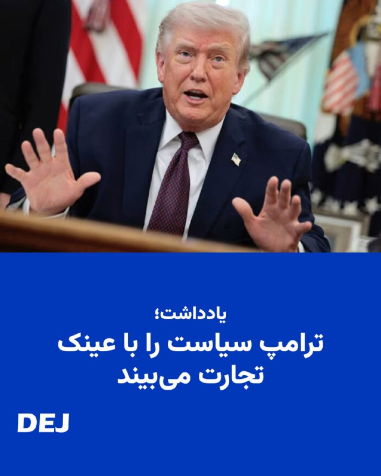

📝
⭕️ یادداشت؛
ترامپ سیاست را با عینک تجارت می‌بیند

پرسشی که شاید ذهن بسیاری را درگیر کرده باشد این است که آیا ارتش آمریکا نمی‌تواند مانع اقدامات ایذایی سـ.ـپاه در تنگه هرمز شود؟
از نظر نظامی و تجهیزاتی، فاصله میان ارتش آمریکا و سـ.ـپاه پاسداران بسیار زیاد است و عملاً آمریکا توان مقابله با اقدامات ایذایی سـ.ـپاه را دارد؛ هرچند این مسئله ممکن است نسبت به برخی عملیات‌های دیگر پیچیدگی‌های متفاوتی داشته باشد، اما در نهایت چالش بزرگی برای آمریکا محسوب نمی‌شود.
اما پرسش اصلی اینجاست که چرا ترامپ عجله‌ای برای پایان دادن سریع به این وضعیت ندارد؟ او به‌عنوان یک تاجر، ممکن است از تهدید مسدود شدن تنگه هرمز به‌عنوان ابزاری برای فشار اقتصادی و سیاسی بر اروپا و چین استفاده کند.
اروپایی که از نگاه ترامپ حاضر نیست هزینه کافی برای تأمین امنیت خود بپردازد و در ناتو نیز گاه ساز مخالف می‌زند، باری اضافی بر دوش آمریکا محسوب می‌شود. اکنون نیز با اختلال در جریان انتقال نفت از تنگه هرمز، اروپا تحت فشار اقتصادی سنگینی قرار گرفته است و ترامپ امیدوار است این فشار باعث شود کشورهای اروپایی سهم بیشتری در هزینه‌های امنیتی پرداخت کنند و حتی ناوگان دریایی خود را به منطقه اعزام نمایند؛ یعنی کشورهایی که تا دیروز منتقد مقابله نظامی با جمهوری اسلامی بودند، ناچار شوند در این تقابل نقش فعال‌تری ایفا کنند.
از سوی دیگر، چین به‌عنوان بزرگ‌ترین خریدار نفت ارزان ایران و کشوری که نزدیک به نیمی از نفت مصرفی خود را از خلیج فارس تأمین می‌کند نیز تحت فشار قرار می‌گیرد؛ چراکه هرگونه محدودیت در تنگه هرمز می‌تواند صادرات نفت به چین را مختل کند. همزمان، ترامپ نیز با محاصره دریایی جمهوری اسلامی ، تلاش می‌کند مانع انتقال نفت جمهوری اسلامی به چین شود.
ترامپ می‌خواهد همه هزینه‌های امنیت و منافع خود را بپردازند. حتی کره جنوبی و ژاپن نیز از نگاه او دور نمانده‌اند؛ شاید اولویت نخستش نباشند، اما قطعاً فراموششان نکرده است. او در نهایت با ذهنیت یک تاجر به سیاست نگاه می‌کند.

#ترامپ #خاورمیانه
@DEJradio

## IranIntlTV — post 336472

  <a href="telegram/content/IranIntlTV_336472_1778422505.mp4">🎬 Download video</a>

بر اساس ویدیوهای رسیده به ایران‌اینترنشنال، ایرانیان مقیم نروژ یکشنبه ۲۰ اردیبهشت در پی فراخوان شاهزاده رضا پهلوی، علیه اعدام‌های جمهوری اسلامی و قطع اینترنت در ایران، در شهر اسلو تجمع کردند.

## IranIntlTV — post 336471

  <a href="telegram/content/IranIntlTV_336471_1778422508.mp4">🎬 Download video</a>

یکی از آسیب‌دیدگان چشمی خیزش سراسری ۱۴۰۱ در تجمع برلین به ایران‌اینترنشنال گفت: «مذاکره با جمهوری اسلامی به‌معنای پایمال کردن خون جاویدنامان ایران است.» او افزود حکومت ایران اینترنت را به روی مردم قطع کرده و «ما اینجا هستیم تا صدای آن‌ها را به گوش جهانیان برسانیم.»

گزارش علی حسن‌پور، خبرنگار ایران‌اینترنشنال
@iranintltv

## IranIntlTV — post 336470

  <a href="telegram/content/IranIntlTV_336470_1778422510.mp4">🎬 Download video</a>

ویدیوهای رسیده به ایران‌اینترنشنال نشان می‌دهند گروهی از ایرانیان مقیم آلمان، یکشنبه ۲۰ اردیبهشت در اعتراض به اعدام‌های جمهوری اسلامی، در شهر هانوفر تجمع کردند و فریاد «ایستاده‌ایم تا پایان» سردادند.

## IranIntlTV — post 336469

  

وزارت خارجه امارات متحده عربی «حملات با پهپاد» به کویت را به‌شدت محکوم کرد و افزود این حملات «تروریستی» علیه کویت نقض حاکمیت این کشور محسوب می‌شود و امنیت و ثبات آن را تهدید می‌کند.

صبح یک‌شنبه کویت از مقابله با پهپادهای پرتاب شده به این کشور خبر داد.
https://iranintl.com/202605105298

## IranIntlTV — post 336468

  <a href="telegram/content/IranIntlTV_336468_1778422514.mp4">🎬 Download video</a>

ویدیوی ارسال‌شده به ایران‌اینترنشنال نشان می‌دهد یکشنبه ۲۰ اردیبهشت محبوبه رمضانی و رحیمه یوسف‌زاده، مادران پژمان قلی‌پور و نوید بهبودی، معترضان کشته‌شده در آبان ۹۸، با حضور در تجمع ایرانیان در هانوفر آلمان، اعتراض «فرزندان ایران را برای سرنگونی حکومت فاسد آخوندی» خواندند.

## IranIntlTV — post 336467

  <a href="telegram/content/IranIntlTV_336467_1778422516.mp4">🎬 Download video</a>

یکی از شرکت‌کنندگان در تجمع برلین در گفت‌وگو با علی حسن‌پور، خبرنگار ایران‌اینترنشنال، برای فاطمه سپهری پیام فرستاد و گفت: «مادر عزیزم طاقت بیار، ایران آزاد می‌شود و ما آزادی را در کنارت جشن می‌گیریم.»
@iranintltv

## IranIntlTV — post 336466

  <a href="telegram/content/IranIntlTV_336466_1778422518.mp4">🎬 Download video</a>

انتشار تصاویر ماهواره‌ای تازه از احتمال نشت نفت در آب‌های اطراف جزیره خارک، توجه جهانی را جلب کرده است. هم‌زمان، تهدید رسانه‌های نزدیک به سپاه پاسداران درباره کنترل کابل‌های اینترنتی زیر دریا، نگرانی‌ها درباره امنیت انرژی و آسیب‌پذیری زیرساخت‌های حیاتی در تنگه هرمز را افزایش داده است.

عادله بورنگ، عضو تحریریه ایران‌اینترنشنال، از واکنش کاربران رسانه‌های اجتماعی به این موضوع‌ها گزارش می‌دهد
@iranintltv

## IranIntlTV — post 336465

  <a href="telegram/content/IranIntlTV_336465_1778422521.mp4">🎬 Download video</a>

کارزار همبستگی ایرانیان خارج از کشور با «ملت در گروگان» در ایران ادامه دارد. این تجمع‌ها با فراخوان شاهزاده رضا پهلوی و در اعتراض به تشدید اعدام‌‌ها، سرکوب و قطع اینترنت در ایران، برگزار می‌شود.

علی حسن‌پور، خبرنگار ایران‌اینترنشنال، از تجمع شهر برلین گزارش می‌دهد
@iranintltv

## IranIntlTV — post 336464

  <a href="telegram/content/IranIntlTV_336464_1778422523.mp4">🎬 Download video</a>

یکی از شرکت‌کنندگان در تجمع استکهلم گفت تنها خواسته دوست جاویدنامش، محمود موسوی، ۲۹ ساله که دی‌ماه در قشم کشته شد، این بود که «خسته نشویم و ادامه دهیم».

گزارش مهران عباسیان، خبرنگار ایران‌اینترنشنال
@iranintltv

## IranIntlTV — post 336463

  <a href="telegram/content/IranIntlTV_336463_1778422526.mp4">🎬 Download video</a>

ایرانیان مقیم استکهلم در ادامه کارزار همبستگی با انقلاب ملی و در اعتراض به تشدید اعدام‌‌ها، سرکوب و قطع اینترنت در ایران، تجمع کردند.

گفت‌وگوی مهران عباسیان، خبرنگار ایران‌اینترنشنال، با شرکت‌کنندگان در این تجمع
@iranintltv

## IranIntlTV — post 336462

🔻افزایش بازداشت‌ها و تشدید فشار امنیتی جمهوری اسلامی بر جامعه بهائی در سایه قطع اینترنت

بررسی‌های ایران‌اینترنشنال نشان می‌دهد در هفته‌های اخیر و هم‌زمان با تداوم قطعی اینترنت، فشارهای امنیتی و قضایی جمهوری اسلامی علیه جامعه بهائی در شهرهای مختلف ایران افزایش یافته و احضار، بازداشت، تفتیش خانه‌ها، ضبط گسترده اموال و اجرای احکام حبس شدت گرفته است.

بر اساس اطلاعات رسیده به ایران‌اینترنشنال، از اعتراضات دی‌ماه تا صبح یک‌شنبه ۲۰ اردیبهشت، شماری از شهروندان بهائی در شهرهای مختلف بازداشت شده‌اند.

پیوند نعیمی، برنا نعیمی و شکیلا قاسمی در کرمان، بهزاد یزدانی و همسرش رومینا خزعلی، مهسا ستوده، ماندانا ستوده، پژمان زارع، سارا سپهری و عنقا سیاوشی در شیراز و فلورا صمدانی در یزد، از جمله شهروندان بهائی بازداشت‌شده در این دوره‌اند.

همچنین وفا کاشفی، نوید ذره‌بین ایرانی، پیام فریدیان، ربیع مالکی و سپهر کوشکباغی در مشهد، ریاض بهراد در کرج و آرتین غضنفری در تهران نیز در این مدت بازداشت شده‌اند.

بسیاری از این شهروندان همچنان در بازداشت و بلاتکلیفی به‌ سر می‌برند و خبر تازه‌ای از آزادی یا ادامه بازداشت شماری از آنان، از جمله فریدیان، مالکی و کوشکباغی، در دست نیست.
جامعه جهانی بهائی ۱۰ اردیبهشت در بیانیه‌ای هشدار داد پیوند و برنا نعیمی تحت شکنجه، ضرب‌وشتم، شوک الکتریکی، محرومیت از آب و غذا و اعدام‌های نمایشی قرار گرفته‌اند تا به اتهام‌هایی که مرتکب نشده‌اند، اعتراف کنند.

جامعه جهانی بهائی تاکید کرد این دو نفر در خطر اعدام قرار دارند.

هم‌زمان، برخی دیگر از شهروندان بهائی در هفته‌های اخیر بازداشت شده و پس از تودیع وثیقه‌های سنگین، به‌طور موقت آزاد شده‌اند.

با گذشت ۷۲ روز از قطعی اینترنت در ایران، منابع مطلع به ایران‌اینترنشنال گفته‌اند ابعاد واقعی بازداشت‌ها و فشارها علیه جامعه بهائی بسیار گسترده‌تر از موارد رسانه‌ای‌شده است، اما اختلال در اطلاع‌رسانی، تهدید خانواده‌ها و فضای امنیتی، دسترسی به اطلاعات دقیق را دشوار کرده است.

وزارت اطلاعات جمهوری اسلامی دی‌ماه ۱۴۰۴ در اطلاعیه‌ای از شناسایی یک «شبکه ۳۲ نفره جاسوسی» مرتبط با شهروندان بهائی خبر داد.

وزارت اطلاعات این افراد را به «اغتشاش و تخریب‌گری» متهم کرد و افزود ۱۲ نفر از آنان بازداشت و ۱۳ تن دیگر احضار شده‌اند.

مقام‌های جمهوری اسلامی پیش‌تر نیز از جمله در جریان جنگ ۱۲ روزه، شهروندان بهائی را به «جاسوسی برای اسرائیل» متهم و برای شماری از آنان پرونده‌سازی کرده بودند.

بلاتکلیفی بازداشت‌شدگان و فشار بر خانواده‌ها

بر اساس اطلاعات رسیده به ایران‌اینترنشنال، شماری از شهروندان بهائی بازداشت‌شده در هفته‌ها و ماه‌های اخیر، بدون دسترسی روشن به روند قضایی، در وضعیت بلاتکلیف نگهداری می‌شوند.

در برخی پرونده‌ها، خانواده‌ها از محل نگهداری، وضعیت جسمی، اتهامات مطرح‌شده یا زمان احتمالی آزادی عزیزانشان بی‌اطلاع مانده‌اند و پیگیری‌های آنان نیز با تهدید و فشار امنیتی روبه‌رو شده است.

در مواردی، تماس بازداشت‌شدگان با خانواده‌ها بسیار کوتاه و محدود بوده و همین تماس‌های چندثانیه‌ای نیز امکان اطلاع از وضعیت جسمی و روحی آنان را فراهم نکرده است.

منابع مطلع به ایران‌اینترنشنال گفته‌اند برخی خانواده‌ها، حتی پس از تامین وثیقه‌های سنگین، همچنان با ادامه بازداشت عزیزانشان روبه‌رو شده‌اند و در برخی پرونده‌ها نیز اتهامات تازه‌ای به بازداشت‌شدگان افزوده شده است.

اطلاعات رسیده همچنین از نگرانی جدی درباره وضعیت جسمی شماری از بازداشت‌شدگان حکایت دارد.

برخی از آنان پیش از بازداشت با مشکلات پزشکی، نیاز به مصرف دارو یا مسئولیت نگهداری از اعضای بیمار و سالخورده خانواده روبه‌رو بوده‌اند، اما در بازداشت با محدودیت تماس، کمبود دارو، نبود رسیدگی پزشکی کافی و محرومیت از دسترسی منظم به خانواده مواجه شده‌اند.

بازداشت هم‌زمان اعضای برخی خانواده‌های بهائی، نگهداری طولانی‌مدت در بلاتکلیفی و تهدید نزدیکان برای خودداری از پیگیری، فشار مضاعفی بر خانواده‌های بهائی وارد کرده است.

🔗ادامه گزارش را اینجا بخوانید
@iranintltv

## IranIntlTV — post 336461

  <a href="telegram/content/IranIntlTV_336461_1778422529.mp4">🎬 Download video</a>

بر اساس ویدیوهای رسیده به ایران‌اینترنشنال، ایرانیان مقیم بریتانیا یکشنبه ۲۰ اردیبهشت در پی فراخوان شاهزاده رضا پهلوی، علیه اعدام‌های جمهوری اسلامی و قطع اینترنت در ایران، در شهر شفیلد تجمع کردند.

## IranIntlTV — post 336460

  <a href="telegram/content/IranIntlTV_336460_1778422531.mp4">🎬 Download video</a>

یکی از شرکت‌کنندگان در تجمع برلین به علی حسن‌پور، خبرنگار ایران‌اینترنشنال، گفت: «اینجا هستیم تا از سیاستمداران اروپایی بخواهیم چشم خود را بر اعدام‌ها در ایران نبندند و برای دسترسی مردم ایران به اینترنت تلاش کنند.»
@iranintltv

## IranIntlTV — post 336459

  <a href="telegram/content/IranIntlTV_336459_1778422534.mp4">🎬 Download video</a>

رسانه‌های حکومتی در ایران از دیدار علی عبداللهی، فرمانده قرارگاه مرکزی خاتم‌الانبیا، با مجتبی خامنه‌ای خبر دادند.

مرتضی کاظمیان، عضو تحریریه ایران‌اینترنشنال، جزییات این گزارش رسمی را ارزیابی می‌کند
@iranintltv

## Shin_Persian — post 5930

  

Dubai Media Office ✓ @DXBMediaOffice Sun, 10 May 2026 11:25:48 UTC توضيح: الدخان الملاحظ في منطقة الجداف ناتج عن حريق في قارب متوقف في خور دبي. ولم ينتج عن الحريق اي إصابات، وتعود كثافة الدخان إلى مادة الفيبرجلاس المستخدمة في تصنيع القارب. وتدعو الجهات المعنية…

## Shin_Persian — post 5929

Dubai Media Office ✓ @DXBMediaOffice
Sun, 10 May 2026 11:25:48 UTC

توضيح: الدخان الملاحظ في منطقة الجداف ناتج عن حريق في قارب متوقف في خور دبي. ولم ينتج عن الحريق اي إصابات، وتعود كثافة الدخان إلى مادة الفيبرجلاس المستخدمة في تصنيع القارب. وتدعو الجهات المعنية الجمهور إلى الحصول على المعلومات من المصادر الرسمية وعدم تداول الشائعات أو المعلومات

English

Clarification: The smoke observed in the Al Jaddaf area is resulting from a fire in a boat docked in Dubai Creek. The fire has not resulted in any injuries, and the density of the smoke is due to the fiberglass material used in the boat's manufacturing. Concerned authorities urge the public to obtain information from official sources and to avoid circulating rumors or misinformation.

𝕏 · @shin_persian

## Shin_Persian — post 5928

  <a href="telegram/content/Shin_Persian_5928_1778422537.mp4">🎬 Download video</a>

Open Source Intel ✓ @Osint613
Sun, 10 May 2026 12:02:08 UTC

Visa and Mastercard now functional in Syria after 15 years.

فارسی

ویزا و مسترکارت پس از ۱۵ سال اکنون در سوریه فعال هستند.

𝕏 · @shin_persian

## Shin_Persian — post 5927

  

DefenceGeek 🇬🇧 ✓ @DefenceGeek Sun, 10 May 2026 13:06:00 UTC UPDATE: US Air Force Tanker Fleet 10/05/2026 (Ceasefire Day 33) #FreeIran‌ --- Operation EPIC FURY / Project FREEDOM --- Bit of a major update today instead of my weekly update on Tuesday as I'm…

## Shin_Persian — post 5926

DefenceGeek 🇬🇧 ✓ @DefenceGeek
Sun, 10 May 2026 13:06:00 UTC

UPDATE: US Air Force Tanker Fleet 10/05/2026 (Ceasefire Day 33) #FreeIran‌
--- Operation EPIC FURY / Project FREEDOM ---

Bit of a major update today instead of my weekly update on Tuesday as I'm going to be a little busy then. Overall tanker numbers have reduced slightly (230 down to 225) from my last update, but this coincides with a shift of some tankers into CENTCOM and others back to the US via UK/German bases. The implication of the change in positioning being that the US is now using the tankers in CENTCOM for operations and rotating them out with less used airframes elsewhere, while still running training flights for the RAF Fairford (EGVA)-based bombers in the UK and Mediterranean.

Of the 114 tankers identified in CENTCOM (Red Zone):
- 93 have been tracked flying so far in May 2026
- 37 of those have been tracked flying at least once in the last 36hrs
- The tanker with the oldest "last tracked" date was last seen on 21st March 2026

Usual rule, exact distribution I won't give out for now on the off chance that hostilities begin again in the coming days/weeks.

@MATA_osint @vcdgf555 @steffanwatkins @ArmchairAdml @TheIntelFrogbu @jamjake01 @Andyyyyrrrr @Saint1Mil @rocketron101 @Faytuks

فارسی

به‌روزرسانی: ناوگان تانکرهای نیروی هوایی ایالات متحده (USAF) ۱۰ مه ۲۰۲۶ (روز سی‌وسوم آتش‌بس) #FreeIran‌
--- عملیات خشم حماسی (EPIC FURY) / پروژه آزادی (FREEDOM) ---

امروز به‌جای به‌روزرسانی هفتگی در سه‌شنبه، یک به‌روزرسانی مهم دارم، چرا که آن روز کمی سرم شلوغ خواهد بود. در مجموع، تعداد تانکرها نسبت به آخرین به‌روزرسانی من اندکی کاهش یافته است (از ۲۳۰ به ۲۲۵ فروند)، اما این موضوع با جابه‌جایی برخی تانکرها به منطقه مسئولیت فرماندهی مرکزی ایالات متحده (CENTCOM) و بازگشت برخی دیگر به ایالات متحده از طریق پایگاه‌های بریتانیا و آلمان همزمان شده است. پیامد این تغییر موقعیت این است که ایالات متحده در حال حاضر از تانکرها در سنتکام (CENTCOM) برای عملیات استفاده می‌کند و آن‌ها را با بدنه هواپیماهایی که کمتر در جاهای دیگر استفاده شده‌اند، جایگزین می‌کند، در حالی که همچنان پروازهای آموزشی برای بمب‌افکن‌های مستقر در پایگاه نیروی هوایی سلطنتی فیرفورد (RAF Fairford - EGVA) در بریتانیا و مدیترانه را ادامه می‌دهد.

از ۱۱۴ تانکر شناسایی‌شده در سنتکام (منطقه قرمز):
- ۹۳ فروند تا این لحظه در ماه مه ۲۰۲۶ ردیابی شده‌اند.
- ۳۷ فروند از آن‌ها حداقل یک بار در ۳۶ ساعت گذشته ردیابی شده‌اند.
- قدیمی‌ترین تاریخ مربوط به «آخرین ردیابی»، مربوط به ۲۱ مارس ۲۰۲۶ است.

طبق قاعده همیشگی، توزیع دقیق را فعلاً اعلام نمی‌کنم تا در صورت آغاز احتمالی دوباره خصومت‌ها در روزها/هفته‌های آینده، اطلاعاتی درز نکند.

@MATA_osint @vcdgf555 @steffanwatkins @ArmchairAdml @TheIntelFrogbu @jamjake01 @Andyyyyrrrr @Saint1Mil @rocketron101 @Faytuks

𝕏 · @shin_persian

## Shin_Persian — post 5924

وزارة التربية والتعليم ✓ @MOEUAEofficial Sun, 10 May 2026 11:21:46 UTC تعلن #وزارة_التربية_والتعليم استئناف التعليم الحضوري لجميع الطلبة والكوادر التعليمية والإدارية في المدارس الحكومية والخاصة والحضانات على مستوى الدولة، اعتبارًا من يوم الاثنين الموافق…

## Shin_Persian — post 5923

وزارة التربية والتعليم ✓ @MOEUAEofficial
Sun, 10 May 2026 11:21:46 UTC

تعلن #وزارة_التربية_والتعليم استئناف التعليم الحضوري لجميع الطلبة والكوادر التعليمية والإدارية في المدارس الحكومية والخاصة والحضانات على مستوى الدولة، اعتبارًا من يوم الاثنين الموافق 11 مايو 2026، وذلك في ضوء المتابعة المستمرة للمستجدات والتنسيق القائم مع الجهات المعنية، بما يضمن انتظام العملية التعليمية واستمرارية التقييمات الأكاديمية.

The Ministry of Education announces the resumption of in-person learning for all students, teaching and administrative staff in public and private schools and nurseries across the UAE, effective Monday, 11 May 2026. This decision follows the continuous monitoring of developments and coordination with the relevant authorities, ensuring the continuity of the educational process and academic assessments.

فارسی

#وزارت_آموزش_و_پرورش امارات از سرگیری آموزش حضوری برای تمامی دانش‌آموزان و کادر آموزشی و اداری در مدارس دولتی و خصوصی و مهدکودک‌ها در سراسر کشور را از روز دوشنبه ۱۱ می ۲۰۲۶ (۲۱ اردیبهشت ۱۴۰۵) اعلام می‌کند. این تصمیم در راستای پایش مستمر تحولات و هماهنگی‌های موجود با مراجع ذی‌صلاح اتخاذ شده است تا از نظم فرآیند آموزشی و تداوم ارزیابی‌های تحصیلی اطمینان حاصل شود.

𝕏 · @shin_persian

## ManotoTV — post 105242

  <a href="telegram/content/ManotoTV_105242_1778422541.mp4">🎬 Download video</a>

گردهمایی ایرانیان ساکن توکیو مقابل وزارت خارجه ژاپن، یکشنبه ۲۰ اردیبهشت

## ManotoTV — post 105241

  <a href="telegram/content/ManotoTV_105241_1778422542.mp4">🎬 Download video</a>

شماری از ایرانیان ساکن لندن روز شنبه ۱۰ مه با حضور در تجمعی مقابل دفتر نخست‌وزیر بریتانیا، مخالفت خود را با یهودستیزی اعلام کردند.

شرکت‌کنندگان در این گردهمایی با در دست داشتن پرچم‌های ایران و اسرائیل و پلاکاردهایی در حمایت از همزیستی و مقابله با نفرت‌پراکنی، خواستار ایستادگی در برابر یهودستیزی و افراط‌گرایی شدند.

این تجمع در حالی برگزار شد که در ماه‌های اخیر نگرانی‌ها درباره افزایش موارد یهودستیزی در بریتانیا و برخی کشورهای اروپایی افزایش یافته است.

## ManotoTV — post 105240

  <a href="telegram/content/ManotoTV_105240_1778422545.mp4">🎬 Download video</a>

راهپیمایی ایرانیان گوتنبرگ

## ManotoTV — post 105239

  <a href="telegram/content/ManotoTV_105239_1778422547.mp4">🎬 Download video</a>

حضور گسترده ایرانیان در تجمع ضد یهودستیزی در برابر دفتر نخست وزیر در لندن، یکشنبه ۲۰ اردیبهشت

## ManotoTV — post 105238

  <a href="telegram/content/ManotoTV_105238_1778422550.mp4">🎬 Download video</a>

دفتر رسانه‌ای دولت دبی اعلام کرد دود غلیظ مشاهده‌شده در منطقه الجداف، ناشی از آتش‌سوزی در یک قایق متوقف در خور دبی بوده است.

بر اساس این بیانیه، تیم‌های دفاع مدنی دبی حریق را در مدت ۵۴ دقیقه به طور کامل مهار کردند و عملیات خنک‌سازی محل ادامه دارد.

دفتر رسانه‌ای دولت دبی اعلام کرد در این حادثه هیچ مصدومی گزارش نشده و رنگ سیاه و غلظت دود به دلیل سوختن مواد فایبرگلاس به کار رفته در ساخت قایق بوده است.

## ManotoTV — post 105237

  

خبرگزاری ایرنا نوشت پاسخ جمهوری اسلامی به آخرین متن پیشنهادی آمریکا برای خاتمه جنگ، امروز از طریق میانجی پاکستانی ارسال شده است.

بر اساس این گزارش، سخنگوی وزارت خارجه جمهوری اسلامی پیش‌تر گفته بود دیدگاه‌ها و ملاحظات تهران درباره پیشنهادهای آمریکا پس از تکمیل بررسی‌ها و جمع‌بندی نهایی ارسال می‌شود.

ایرنا افزود در طرح پیشنهادی، مذاکرات در این مرحله بر موضوع خاتمه جنگ در منطقه متمرکز خواهد بود.

## FarsiVOA — post 217342

🔺رسانه حکومتی «ایرنا» می‌گوید رژیم ایران پاسخ خود به پیشنهاد آمریکا را از طریق پاکستان ارسال کرده است

◾️خبرگزاری حکومتی «ایرنا» روز یکشنبه ۲۰ اردیبهشت گزارش داد که رژیم ایران پاسخ خود را به پیشنهاد ایالات متحده با هدف پایان دادن به جنگ دوماهه، از طریق پاکستان به‌عنوان میانجی به آمریکا ارسال کرده است.

⬇️ بیشتر بخوانید:

https://ir.voanews.com/a/irna-iran-response-to-us-pakistan/8148482.html

## FarsiVOA — post 217341

برملا شدن ابعاد تازه‌ای از ارتباط جمهوری اسلامی با حمله تروریستی ۷ اکتبر - گفت‌و‌گو با حسن هاشمیان

## FarsiVOA — post 217340

  <a href="telegram/content/FarsiVOA_217340_1778422552.mp4">🎬 Download video</a>

ارتش اسرائیل تصاویری از هدف قرار دادن فرد مظنون به کارگذاری مواد منفجره با همکاری میان اپراتور پهپاد و افسر تیپ کفیر در نوار غزه منتشر و تاکید کرد نیروی هوایی این ارتش «به‌طور مداوم به پشتیبانی از نیروهای رزمی در جبهه‌های مختلف، در عملیات‌های هجومی و دفاعی ادامه می‌دهد.»

## FarsiVOA — post 217339

  <a href="telegram/content/FarsiVOA_217339_1778422554.mp4">🎬 Download video</a>

فرماندهی مرکزی ایالات متحده، سنتکام، ویدیویی از سوخت‌رسانی هوایی به یک جنگنده اف‌۱۸ نیروی دریایی آمریکا در آسمان خاورمیانه منتشر کرد.

به گفته سنتکام، این جنگنده در حال گشت‌ بر فراز منطقه بود و سوخت مورد نیاز خود را از یک هواپیمای سوخت‌رسان کی-۱۳۵ نیروی هوایی آمریکا دریافت کرد.

@FarsiVOA

## FarsiVOA — post 217338

🔺هشدار قطر به جمهوری اسلامی: استفاده از تنگه هرمز به‌عنوان «ابزار فشار» بحران را عمیق‌تر می‌کند

◾️وزارت امور خارجه قطر روز یکشنبه ۲۰ اردیبهشت اعلام کرد نخست‌وزیر این کشور در گفت‌وگو با وزیر امور خارجه جمهوری اسلامی به او گفته است که استفاده از تنگه هرمز به‌عنوان «ابزار فشار» تنها به عمیق‌تر شدن بحران در خلیج فارس منجر خواهد شد.

⬇️ بیشتر بخوانید:

https://ir.voanews.com/a/qatar-iran-hormuz-strait-closing-crisis-increase/8148473.html

## DW_Farsi — post 124524

  

🔶پزشکیان: مذاکره به معنای تسلیم نیست، هدف احقاق حقوق مردم است

مسعود پزشکیان، رئیس جمهور ایران، روز یکشنبه ۲۰ اردیبهشت (۱۰ مه) در جلسه کارگروه بازسازی خسارات ناشی از جنگ گفت مردم باید با واقع‌بینی شرایط کشور و محدودیت‌های موجود را درک کنند.

پزشکیان افزود: «ملت ایران در برابر دشمن هرگز سر خم نخواهد کرد و اگر سخنی از گفت‌و‌گو یا مذاکره مطرح می‌شود، معنای آن تسلیم یا عقب‌نشینی نیست، بلکه هدف، احقاق حقوق ملت ایران و دفاع مقتدرانه از منافع ملی است.»

رئیس دولت چهاردهم جمهوری اسلامی، ماندن و ایستادگی در چنین شرایطی را "از شهادت نیز دشوارتر" دانست و گفت: «مردمی که با صبر، مقاومت و تحمل در میدان باقی مانده‌اند، در حقیقت در حال انجام جهاد اکبر هستند.»

بسیاری این سخنان را زمینه‌چینی برای پذیرش تصمیمات اتخاذشده از سوی حکومت در مذاکره و گفت‌وگو با آمریکا می‌دانند؛ به ویژه پذیرش از سوی پایگاه هواداران افراطی حکومت که مخالف هرگونه مذاکره و طرفدار ادامه تنش و جنگ با آمریکا و اسرائیل هستند.

@dw_farsi

## DW_Farsi — post 124523

  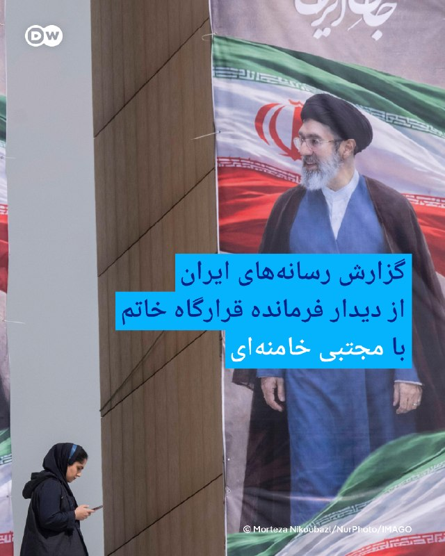

🔶گزارش رسانه‌های ایران از دیدار فرمانده قرارگاه خاتم با مجتبی خامنه‌ای

خبرگزاری ایسنا روز یکشنبه ۱۰ مه (۲۰ اردیبهشت) گزارش داد که علی عبداللهی، فرمانده قرارگاه خاتم‌الانبیای سپاه پاسداران با مجتبی خامنه‌ای دیدار کرده و گزارشی از آمادگی‌های نیروهای مسلح جمهوری اسلامی به رهبر جدید جمهوری اسلامی ارائه کرده است.

آنطور که در این گزارش آمده، فرمانده قرارگاه خاتم‌الانبیا به مجتبی خامنه‌ای اطمینان داده که "نیروهای مسلح تا آخرین نفس از آرمان‌های انقلاب اسلامی، ایران، حاکمیت و منافع ملی و ملت غیرتمند و شجاع ایران دفاع خواهند کرد".

ایسنا ادعا کرده که در اين ديدار مجتبی خامنه‌ای "تدابیر جدید و راهگشایی برای مقابله با دشمن" به عبداللهی ابلاغ کرده است.

این در حالی است که از زمان کشته شدن علی خامنه‌ای در حملات اسرائیل و آمریکا به محل بیت رهبری در تهران، هیچگونه پیام صوتی یا تصویری و عکس جدیدی از مجتبی خامنه‌ای منتشر نشده و گمانه‌زنی‌های بسیاری درباره وضعیت سلامتی و یا حتی زنده‌بودن یا نبودن او در جریان است.

@dw_farsi

## DW_Farsi — post 124522

  <a href="telegram/content/DW_Farsi_124522_1778422558.mp4">🎬 Download video</a>

🎥سه شهر و یک دنیا تاریخ؛ آلمان در آینه جنگ

نام برخی شهرهای آلمان هم با تحولات تاریخی مثبت در دوران رشد و شکوفایی علم و اندیشه و سیاست گره خورده، هم با روزهای سیاه رژیم ترور رایش سوم به رهبری آدولف هیتلر.

@dw_farsi

## Persian_Trend_Official — post 13827

  <a href="telegram/content/Persian_Trend_Official_13827_1778422561.mp4">🎬 Download video</a>

🔴ویدیویی از آماده سازی پهپاد های فیبر نوری 💢در چند وقت اخیر FPV های فیبر نوری حزب الله سر صدا زیادی به راه انداخته لذا این ویدیو جهت افزایش اطلاعات علاقه مندان بارگذاری میشود ▪️پهپاد انتحاری از نوع fpv فیبر نوری، با هدف مقابله با جنگ الکترونیک و اخلال‌گرها…

## Persian_Trend_Official — post 13826

تصمیم گرفتم لایو های شبانه رو از این به بعد، حدود ساعت 20 به وقت ایران اجرا کنم .

## RadioFarda — post 157033

ایران می‌گوید به طرح پیشنهادی آمریکا برای توافق «پاسخ داده است»

🔸خبرگزاری جمهوری اسلامی، ایرنا، روز یکشنبه ۲۰ اردیبهشت خبر داد که پاسخ تهران به آخرین طرح پیشنهادی ایالات متحده برای رسیدن به توافق بر سر پایان جنگ، برای پاکستان به عنوان میانجی مذاکرات ارسال شده است.

🔸ایرنا بدون اشاره به جزئیات بیشتر نوشته است: «بر اساس طرح پیشنهادی، در این مرحله مذاکرات متمرکز بر موضوع خاتمه جنگ در منطقه خواهد بود».

🔸این در حالی است که دونالد ترامپ، رئیس‌جمهور آمریکا، چهارشنبه هفته گذشته بار دیگر تأکید کرد که ایالات متحده اورانیوم غنی‌شدۀ ایران را خواهد گرفت.

🔸وب‌سایت اکسیوس و خبرگزاری رویترز در همان روز گفته بودند که واشینگتن و تهران به یک «یادداشت تفاهم یک‌صفحه‌ای» برای پایان دادن به جنگ نزدیک شده‌اند.

🔸رویترز گفته بود در این تفاهم‌نامه حتی به تعلیق فعالیت هسته‌ای ایران یا بازگشایی تنگهٔ هرمز هم که توسط سپاه پاسداران بسته شده اشاره نشده است.

🔸در مقابل روزنامهٔ وال‌استریت جورنال گزارش داده بود که در طرح پیشنهادی آمریکا، تهران باید ثابت کند که به‌دنبال سلاح اتمی نیست، تأسیسات فردو و نطنز و اصفهان را برچیند، فعالیت زیرزمینی هسته‌ای را متوقف کند، و همین‌طور بپذیرد که غنی‌سازی را تا ۲۰ سال متوقف کند.

🔸رئیس‌جمهور و وزیر خارجه آمریکا روز جمعه گفته بودند که جمهوری اسلامی تا پایان همان روز قرار است به پیشنهاد ایالات متحده پاسخ دهد.

@RadioFarda

## RadioFarda — post 157032

امارات می‌گوید دو پهپاد شلیک‌شده از سوی ایران را رهگیری کرده است

🔸وزارت دفاع امارات متحده عربی اعلام کرد سامانه‌های پدافند هوایی این کشور روز یکشنبه ۲۰ اردیبهشت دو پهپاد شلیک‌شده از سوی ایران را رهگیری کرده‌ است.

🔸به گزارش خبرگزاری رویترز، این تازه‌ترین مورد از حملات ازسرگرفته‌شده علیه این کشور نفت‌خیز حوزه خلیج فارس است.

🔸امارات در روزهای اخیر گزارش داده که از سوی ایران هدف حمله قرار گرفته، آن هم پس از چهار هفته آرامش نسبی از زمان اعلام آتش‌بس در جنگ ایالات متحده و اسرائیل با ایران.

🔸ایران انجام هرگونه عملیات علیه امارات در روزهای اخیر را رد کرده، اما هشدار داده است که در صورت انجام هر اقدامی از سوی امارات علیه آن، «پاسخی کوبنده» خواهد داد.

🔸این حملات باعث شد که امارات هفته گذشته آموزش مدارس را به‌صورت غیرحضوری برگزار کند، اما مقامات روز یکشنبه اعلام کردند آموزش حضوری از روز دوشنبه از سر گرفته خواهد شد.

@RadioFarda

## IranianMinds — post 19885

  

🔴 ترامپ داره ویدیوهایی از مارک لوین منتشر می‌کنه که توش میگه فشار روی ایران باید ادامه پیدا کنه و حتی احتمال داره برای قوی‌تر کردن موضع آمریکا قبل از مذاکرات، یه دور دیگه درگیری و جنگ هم اجتناب‌ناپذیر باشه!

@IranianMinds

## IranianMinds — post 19884

🔴 ترامپ:

من هیچوقت نگفتم که عملیات نظامی علیه ایران تمام شده است، اما گفتم که آنها شکست خوردند

@IranianMinds

## IranianMinds — post 19883

🔴 ترامپ:

نیروی فضایی ما تمام منطقه رو زیر نظر داره اگه کسی به اورانیوم غنی شده ایران که زیر آوار مدفون شده نزدیک شود، از آن مطلع خواهیم شد و آن را بمباران و نابود خواهیم کرد.

@IranianMinds

## IranianMinds — post 19882

🔴 ترامپ :

در مقطعی به اورانیوم غنی شده ایران که در اعماق زمین و آوار مدفون شده است خواهیم رسید

@IranianMinds

## IranianMinds — post 19881

  

🔴 پست جدید ترامپ :

وزیر خارجه اسرائیل ازم‌ تمجید کرد.

@IranianMinds

## IranianMinds — post 19880

🔴 الجزیره به نقل از یک مقام پاکستانی:

پیام ایران‌ رو منتقل کردیم به آمریکاییا و‌ دارن بررسیش میکنن

@IranianMinds

## IranianMinds — post 19879

  <a href="telegram/content/IranianMinds_19879_1778422565.mp4">🎬 Download video</a>

🔴یک فروند KC-135 امریکا در حال پرواز در آسمان خاورمیانه و درحال سوخت‌رسانی به یک F/A-18 سوپر‌هورنت.

@IranianMinds

## IranianMinds — post 19878

🔴 جمهوری اسلامی : پاسخ خودمون به آمریکا برای پایان دادن به جنگ رو دادیم. @IranianMinds

## IranianMinds — post 19877

🔴 جمهوری اسلامی :

پاسخ خودمون به آمریکا برای پایان دادن به جنگ رو دادیم.

@IranianMinds

## BBCPersian — post 280662

🔻قطر حمله به یک کشتی تجاری در آبهایش را تایید کرد

وزارت دفاع قطر تایید کرد یک پهپاد کشتی تجاری که از امارات به سمت بندر مسیعید در حرکت بود، در آب‌های قطر هدف قرار گرفته است.

بنابر اعلام وزارت دفاع قطر، در اثر اصابت این پهپاد آتش‌سوزی محدودی در کشتی رخ داد اما تلفات جانی نداشت.

در این بیانیه به مبدا حرکت این پهپاد اشاره نشده است.

بنابر این گزارش، پس از اطفای حریق این کشتی که از امارات حرکت کرده بود به سمت بندر مسیعید ادامه داد.

برخی رسانه‌های ایران می‌گویند این کشتی فله‌بر متعلق به آمریکا بوده و با پرچم آمریکا حرکت می‌کرد.

ایران تهدید کرده است شناورهای آمریکا را هدف قرار خواهد داد.

https://bbc.in/4nljC0U
@BBCPersian

## BBCPersian — post 280661

🔻اولین جلسه علنی مجلس ایران بعد از شروع جنگ اینترنتی برگزار شد

مجلس ایران برای اولین بعد از شروع جنگ اخیر، به‌صورت وبینار (ویدئو کنفرانس) جلسه علنی داشت.

آخرین جلسه علنی مجلس ۲۸ بهمن ۱۴۰۴ بود.

بنابر گزارش‌ها موضوع این جلسه «التهابات بازار، نگرانی‌های مردم و گرانی‌های اخیر» بود.

مجلس شورای اسلامی در آخرین جلسه‌اش در سال گذشته به موضوع اصلاح لایحه بودجه سال ۱۴۰۵ پرداخته بود.

علت تاخیر در برگزاری جلسات مجلس «مسائل امنیتی» عنوان شده است.

با اینکه مجلس پس از شروع جنگ جلسه علنی نداشت، به گفته علی نیکزاد، نایب رئیس مجلس، «مجلس و نمایندگان از روز نخست جنگ فعالانه نقش‌آفرینی» کردند و «قانون بودجه سال ۱۴۰۵ در میانه جنگ، نهایی و ابلاغ شد.»

آقای نیکزاد همچنین گفت که «۱۲ جلسه با مشارکت هیئت رئیسه، رؤسای کمیسیون‌های تخصصی مجلس، معاونت‌های مجلس، مرکز پژوهش‌ها و اعضای هیئت دولت با موضوعات ارزیابی و نحوه جبران خسارت» و «بیش از ۹۰ جلسه و نشست نظارتی» در کمیسیون‌های مجلس برگزار شده است.

https://bbc.in/4toE7Lq
@BBCPersian

## BBCPersian — post 280660

  <a href="telegram/content/BBCPersian_280660_1778422567.mp4">🎬 Download video</a>

⭕️سرخط خبرها، یکشنبه ۲۰ اردیبهشت ۱۴۰۵
@BBCPersian

## BBCPersian — post 280659

⚽️رئیس فیفا برای تیم ملی فوتبال ایران در جام جهانی آرزوی موفقیت کرد

جانی اینفانتینو برای تیم فوتبال ایران در جام جهانی پیش رو در آمریکای شمالی «بهترین‌ها» را آرزو کرد.

رئیس فدراسیون بین‌المللی فوتبال در شبکه‌های اجتماعی نوشت: «برای جمهوری اسلامی ایران در چهارمین حضور متوالی خود در جام جهانی فیفا بهترین‌ها را آرزو می‌کنم.»

تیم ملی مردان ایران قرار است اولین بازی خود را در ۲۵ خرداد (۱۵ ژوئن) در کالیفرنیا مقابل نیوزیلند انجام دهد.

فدراسیون فوتبال ایران پیش از این از فیفا خواسته بود که به‌دلیل نگرانی‌های امنیتی بازی‌هایش به مکزیک منتقل شود اما فیفا این درخواست را رد کرد و گفت نمی‌تواند محل مسابقات را در این فاصله نزدیک به برگزاری تغییر دهد.

تیم ایران با نیوزیلند و بلژیک و مصر هم‌گروه است.

https://bbc.in/49CiMXK
@BBCPersian

## BBCPersian — post 280658

  

🔻ایران می‌گوید پاسخش به «آخرین متن پیشنهادی آمریکا برای خاتمه جنگ» را امروز به پاکستان ارسال کرده است.

وزارت خارجه ایران گفته بود که «بعد از تکمیل بررسی‌ها و جمع‌بندی نهایی» به پیشنهاد آمریکا پاسخ خواهد داد.

ایرنا نوشت: «بر اساس طرح پیشنهادی، در این مرحله مذاکرات متمرکز بر موضوع خاتمه جنگ در منطقه خواهد بود.»

آمریکا هفته پیش پیشنهاد دیگری به ایران داد و دونالد ترامپ بعد از آن چند بار گفته بود منتظر پاسخ تهران است.

به گفته رسانه‌های آمریکا طرح آخر دولت دونالد ترامپ یک پیشنهاد یک صفحه‌ای در ۱۴ بند است.

📸AFP via Getty Images

https://bbc.in/42qUBrr
@BBCPersian

## idfinfarsi — post 11561

  <a href="telegram/content/idfinfarsi_11561_1778422570.mp4">🎬 Download video</a>

سخنگوی ارتش اسرائیل:

تماشا کنید: همکاری میان اپراتور یک پهپاد و یک افسر در تیپ کفیر در نوار غزه

در یک واکنش سریع، یک پهپاد نیروی هوایی با همکاری تیپ کفیر، فردی را که مظنون به کارگذاری مواد انفجاری در جنوب نوار غزه بود، هدف قرار داد.

نیروی هوایی به‌طور مداوم به پشتیبانی از نیروهای رزمی در جبهه‌های مختلف، در عملیات‌های هجومی و دفاعی ادامه می‌دهد.

## Dirty_Kids — post 389224

  

‌‎
نه بابا خب بچه خودش رفته پانزده خرداد خرید کرده اومده جلو آیینه استایلشو زده
(عرزشی همینقدر خر) 🤣

@Dirty_Kids 👻

## Dirty_Kids — post 389223

  

کره شمالی توی قانون اساسیش داره قانونی رو اضافه میکنه که درصورتی که رهبر این کشور "کیم جونگ اون" توسط کشوری ترور و کشته بشه، کره شمالی با بمب اتم از اون کشور انتقام بگیره.

@Dirty_Kids 👻

## Hranews — post 112865

قتل و به آتش کشیدن پیکر یک کودک ۹ ساله در سراوان؛ متهم بازداشت شد

❗️
❗️
❗️
❗️
❗️ – اواخر فروردین‌ماه امسال پیکر بی‌جان فاطمه‌ زهرا حسین‌بر، #کودک ۹ ساله اهل شهر گُشت از توابع شهرستان سراوان، پس از چند روز ناپدید شدن، در شرایطی خشونت‌بار در حاشیه شهر کشف شد. فرمانده انتظامی سراوان اکنون از بازداشت متهم این پرونده خبر داده است.

ادامه مطلب

#فاطمه_زهرا_حسین‌بر

↘️
@hranews_bot تماس ✉️ -  @Hranews  کانال هرانا 🆑

## Hranews — post 112864

  

رومینا گلی، شهروند بهائی در ساری بازداشت و تفهیم اتهام شد

❗️
❗️
❗️
❗️
❗️ – رومینا گلی، شهروند بهائی ساکن ساری، روز گذشته #بازداشت شد و امروز یکشنبه، جلسه بازپرسی وی در دادسرای این شهرستان برگزار شد. در پایان این جلسه، قرار بازداشت موقت یک‌ماهه برای وی صادر شده است.

به گزارش خبرگزاری هرانا، ارگان خبری مجموعه فعالان حقوق بشر در ایران، رومینا گلی بازداشت شد و مورد تفهیم اتهام قرار گرفت.

بر اساس اطلاعات دریافتی هرانا، امروز یکشنبه ۲۰ اردیبهشت‌ماه، جلسه بازپرسی خانم گلی در دادسرای ساری برگزار شد. در جریان این جلسه، وی بر اساس ماده ۵۰۰ و ماده ۵۰۰ مکرر قانون مجازات اسلامی، از بابت اتهامات “تبلیغ علیه نظام” و “فعالیت تبلیغی مغایر با شرع اسلام” مورد تفهیم اتهام قرار گرفت. همچنین، برای این شهروند بهائی قرار بازداشت موقت یک‌ ماهه صادر شده است.

ادامه مطلب

#رومینا_گلی

↘️
@hranews_bot تماس ✉️ -  @Hranews  کانال هرانا 🆑

## Hranews — post 112863

  

اکرم و اعظم دانشورکار از زندان قرچک ورامین به مکان نامعلومی منتقل شدند

❗️
❗️
❗️
❗️
❗️ – اکرم و اعظم دانشورکار، خواهران اکبر دانشورکار، زندانی سیاسی اعدام‌شده، که در زندان قرچک ورامین محبوس بودند، از این زندان به مکان نامعلومی منتقل شدند. بی‌خبری از وضعیت این دو زندانی، نگرانی خانواده آنان را افزایش داده است.

به گزارش خبرگزاری هرانا، ارگان خبری مجموعه فعالان حقوق بشر در ایران، اکرم و اعظم دانشورکار از زندان قرچک ورامین به مکانی نامعلوم منتقل شدند.

یک منبع مطلع نزدیک به خانواده این شهروندان، ضمن تایید این خبر به هرانا گفت: “روز پنجشنبه ۱۷ اردیبهشت‌ماه، اکرم و اعظم دانشورکار توسط نیروهای امنیتی از زندان قرچک ورامین به مکانی نامعلوم منتقل شدند. از زمان انتقال تاکنون، هیچ‌گونه تماسی از جانب این افراد با خانواده‌هایشان برقرار نشده است. بی‌خبری از وضعیت خواهران دانشورکار، نگرانی نزدیکان آنان را افزایش داده است.”

ادامه مطلب

#اکرم_دانشورکار
#اعظم_دانشورکار

↘️
@hranews_bot تماس ✉️ -  @Hranews  کانال هرانا 🆑

## manototv — post 105242

  <a href="telegram/content/manototv_105242_1778422575.mp4">🎬 Download video</a>

گردهمایی ایرانیان ساکن توکیو مقابل وزارت خارجه ژاپن، یکشنبه ۲۰ اردیبهشت

## manototv — post 105241

  <a href="telegram/content/manototv_105241_1778422577.mp4">🎬 Download video</a>

شماری از ایرانیان ساکن لندن روز شنبه ۱۰ مه با حضور در تجمعی مقابل دفتر نخست‌وزیر بریتانیا، مخالفت خود را با یهودستیزی اعلام کردند.

شرکت‌کنندگان در این گردهمایی با در دست داشتن پرچم‌های ایران و اسرائیل و پلاکاردهایی در حمایت از همزیستی و مقابله با نفرت‌پراکنی، خواستار ایستادگی در برابر یهودستیزی و افراط‌گرایی شدند.

این تجمع در حالی برگزار شد که در ماه‌های اخیر نگرانی‌ها درباره افزایش موارد یهودستیزی در بریتانیا و برخی کشورهای اروپایی افزایش یافته است.

## manototv — post 105240

  <a href="telegram/content/manototv_105240_1778422579.mp4">🎬 Download video</a>

راهپیمایی ایرانیان گوتنبرگ

## manototv — post 105239

  <a href="telegram/content/manototv_105239_1778422582.mp4">🎬 Download video</a>

حضور گسترده ایرانیان در تجمع ضد یهودستیزی در برابر دفتر نخست وزیر در لندن، یکشنبه ۲۰ اردیبهشت

## manototv — post 105238

  <a href="telegram/content/manototv_105238_1778422585.mp4">🎬 Download video</a>

دفتر رسانه‌ای دولت دبی اعلام کرد دود غلیظ مشاهده‌شده در منطقه الجداف، ناشی از آتش‌سوزی در یک قایق متوقف در خور دبی بوده است.

بر اساس این بیانیه، تیم‌های دفاع مدنی دبی حریق را در مدت ۵۴ دقیقه به طور کامل مهار کردند و عملیات خنک‌سازی محل ادامه دارد.

دفتر رسانه‌ای دولت دبی اعلام کرد در این حادثه هیچ مصدومی گزارش نشده و رنگ سیاه و غلظت دود به دلیل سوختن مواد فایبرگلاس به کار رفته در ساخت قایق بوده است.

## manototv — post 105237

  

خبرگزاری ایرنا نوشت پاسخ جمهوری اسلامی به آخرین متن پیشنهادی آمریکا برای خاتمه جنگ، امروز از طریق میانجی پاکستانی ارسال شده است.

بر اساس این گزارش، سخنگوی وزارت خارجه جمهوری اسلامی پیش‌تر گفته بود دیدگاه‌ها و ملاحظات تهران درباره پیشنهادهای آمریکا پس از تکمیل بررسی‌ها و جمع‌بندی نهایی ارسال می‌شود.

ایرنا افزود در طرح پیشنهادی، مذاکرات در این مرحله بر موضوع خاتمه جنگ در منطقه متمرکز خواهد بود.

## alonews — post 119082

  

👈ترامپ کلیپ‌هایی از مارک لوین منتشر می‌کند که استدلال می‌کند فشار بر ایران باید ادامه یابد و پیشنهاد می‌دهد ممکن است یک دور دیگر مبارزه اجتناب‌ناپذیر باشد تا موقعیت آمریکا را پیش از مذاکرات تقویت کند.

✅ @AloNews خبر جنگ

## alonews — post 119081

  <a href="telegram/content/alonews_119081_1778422588.jpg">🎬 Download video</a>

👈ترامپ: نگفتم که عملیات نظامی علیه ایران تمام شده است، اما گفتم که آنها شکست خوردند

✅ @AloNews خبر جنگ

## alonews — post 119080

  <a href="telegram/content/alonews_119080_1778422588.jpg">🎬 Download video</a>

👈ترامپ: اگر کسی به اورانیوم غنی‌شده ایران که زیر آوار دفن شده نزدیک شود، ما از آن مطلع خواهیم شد و آن را منفجر خواهیم کرد

✅ @AloNews خبر جنگ

## alonews — post 119079

  <a href="telegram/content/alonews_119079_1778422588.jpg">🎬 Download video</a>

👈ترامپ: بالاخره به اورانیوم غنی‌شده ایران که زیر آوار مدفون شده، خواهیم رسید

🔴ما اورانیوم غنی‌شده ایران را که زیر آوار دفن شده است، زیر نظر داریم و نیروی فضایی ایالات متحده آن را مدیریت می‌کند.

✅ @AloNews خبر جنگ

## alonews — post 119078

  <a href="telegram/content/alonews_119078_1778422588.jpg">🎬 Download video</a>

👈رئیس ستاد ارتش اسرائیل: ما در بالاترین سطح آماده باش برای بازگشت به جنگ ایران هستیم

✅ @AloNews خبر جنگ

## alonews — post 119077

  <a href="telegram/content/alonews_119077_1778422589.mp4">🎬 Download video</a>

👈نیروهای پزشکی ارتش بریتانیا با چتر پریدن تو جزیره تریستان دا کونیا وسط اقیانوس اطلس

🔴 رفتن کمک یه شهروند انگلیسی که "هانتاویروس" گرفته

✅ @AloNews خبر جنگ

## alonews — post 119076

  <a href="telegram/content/alonews_119076_1778422591.jpg">🎬 Download video</a>

👈سفیر اسلام آباد در مسکو: مذاکرات ایران-آمریکا به بن‌بست نرسیده است

🔴 مذاکرات ادامه دارد و ما معتقدیم که دیر یا زود به نتیجه خواهیم رسید

✅ @AloNews خبر جنگ

## alonews — post 119075

  <a href="telegram/content/alonews_119075_1778422592.jpg">🎬 Download video</a>

👈مایک والتز» سفیر آمریکا در سازمان ملل متحد به شبکه ABC گفت: مذاکرات با ایران و روند دیپلماتیک ادامه دارد، بنابراین خواهیم دید چه اتفاقی می‌افتد

✅ @AloNews خبر جنگ

## alonews — post 119074

  <a href="telegram/content/alonews_119074_1778422592.jpg">🎬 Download video</a>

👈یک منبع دیپلماتیک پاکستانی به الجزیره: پاسخ ایران بلافاصله پس از دریافت، به طرف آمریکایی منتقل شد

✅ @AloNews خبر جنگ

## alonews — post 119073

  <a href="telegram/content/alonews_119073_1778422592.jpg">🎬 Download video</a>

👈معاون زنان دولت سیزدهم : تعداد زیادی از مهندسین زن کشورمون مشغول ساخت موشک و پهپاد هستن و بصورت کامل تو ساختشون مشارکت دارن.

✅ @AloNews خبر جنگ

## alonews — post 119072

  <a href="telegram/content/alonews_119072_1778422593.mp4">🎬 Download video</a>

👈بوئینگ 747 غول‌پیکر از کالیتا ایر اومد نشست پایگاه فِرفورد انگلستان

🔴پر از بار برای پشتیبانی استقرار بمب‌افکن‌های آمریکا تو این پایگاه

✅ @AloNews خبر جنگ

## alonews — post 119071

  <a href="telegram/content/alonews_119071_1778422596.jpg">🎬 Download video</a>

👈رئیس‌جمهور ترامپ مصاحبه‌ای از نیوزمکس با وزیر امور خارجه اسرائیل، گیدئون ساعر، را به اشتراک می‌گذارد که در آن از ترامپ به خاطر «نشان دادن رهبری قابل توجه در رسیدگی به برنامه هسته‌ای ایران» تمجید می‌کند

✅ @AloNews خبر جنگ

## alonews — post 119070

  <a href="telegram/content/alonews_119070_1778422597.jpg">🎬 Download video</a>

👈رئیس ستاد ارتش اسرائیل (IDF) می‌گوید هیچ هدفی برای خلع سلاح حزب‌الله تعیین نشده است

✅ @AloNews خبر جنگ

## alonews — post 119069

  <a href="telegram/content/alonews_119069_1778422597.jpg">🎬 Download video</a>

👈حزب‌الله فیلمی از دو حمله پهپاد FPV منتشر کرد که به یک باتری گنبد آهنین در سایت جال العالم اسرائیل در مرز هدف گرفته شده‌اند.

🔴 پهپاد FPV به طور مستقیم به یک باتری گنبد آهنین حمله کرده و آن را نابود می‌کند (۷ مه)

🔴 پهپاد FPV به طور مستقیم به گروهی از شش سرباز اسرائیلی که در حال تعویض باتری هدف‌گرفته شده گنبد آهنین بودند حمله می‌کند (۸ مه)

✅ @AloNews خبر جنگ

## alonews — post 119068

  <a href="telegram/content/alonews_119068_1778422597.jpg">🎬 Download video</a>

👈ایسنا: تمرکز اصلی پاسخ ایران به طرح پیشنهادی آمریکا بر «خاتمه جنگ و امنیت دریانوردی» در خلیج فارس و تنگه هرمز است

✅ @AloNews خبر جنگ

## alonews — post 119067

  <a href="telegram/content/alonews_119067_1778422598.jpg">🎬 Download video</a>

👈 وزیر انرژی آمریکا به NBC: فکر نمی‌کنم تا الان ایران یه تصمیم واضح و مشخص به ما داده باشه.

✅ @AloNews خبر جنگ

## alonews — post 119066

  <a href="telegram/content/alonews_119066_1778422598.jpg">🎬 Download video</a>

👈یک منبع در وزارت امور خارجه ترکیه: وزیر امور خارجه در تماس با همتای ایرانی خود درباره تحولات مذاکرات ایران و آمریکا گفتگو کرد

✅ @AloNews خبر جنگ

## alonews — post 119065

  <a href="telegram/content/alonews_119065_1778422598.jpg">🎬 Download video</a>

👈وزارت خارجه قطر: وزیر خارجه قطر در تماسی با وزیر خارجه عربستان سعودی، اوضاع منطقه را بررسی کردند

✅ @AloNews خبر جنگ

## alonews — post 119064

  <a href="telegram/content/alonews_119064_1778422599.mp4">🎬 Download video</a>

👈ارتش اسرائیل : هفته قبل حدود ۷۰ هدف رو زدیم و بیش از ۳۰ نفر از حزب‌الله رو از بین بردیم

✅ @AloNews خبر جنگ

## alonews — post 119063

  <a href="telegram/content/alonews_119063_1778422601.jpg">🎬 Download video</a>

👈صداوسیما: پاسخی که به آمریکا داده شده همچنان مطابق با مواضع قبلی ما است، از جمله آمادگی برای ادامه آتش‌بس در ازای بازگشایی متقابل تنگه هرمز و پیشبرد مذاکرات متمرکز بر پایان دادن به جنگ در منطقه

✅ @AloNews خبر جنگ

---
📅 بروزرسانی: 1405/02/20 16:15
---

## VahidOOnLine — post 239276

  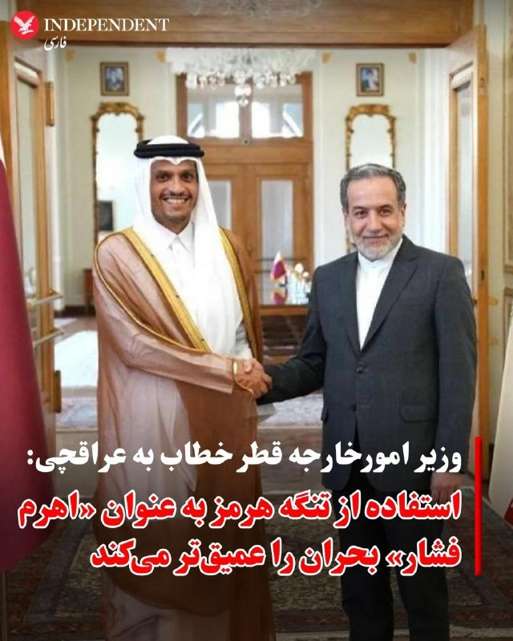

♦️وزارت خارجه قطر روز یکشنبه ۲۰ اردیبهشت ماه اعلام کرد شیخ محمد بن عبدالرحمن آل ثانی، نخست‌وزیر و وزیر خارجه این کشور، در تماس تلفنی با عباس عراقچی، تاکید کرده است استفاده از تنگه هرمز به عنوان «اهرم فشار» تنها به تشدید بحران در خاورمیانه منجر خواهد شد.
بر اساس بیانیه وزارت خارجه قطر، نخست‌وزیر این کشور در گفتگوی روز یکشنبه به همتای ایرانی‌اش گفت: «آزادی کشتیرانی یک اصل تثبیت‌شده و غیرقابل مصالحه است و بستن تنگه هرمز یا استفاده از آن به عنوان کارت فشار، تنها به عمیق‌تر شدن بحران کمک می‌کند.»
‌🇸🇦 Indypersian

🤖 @VahidOOnLine

## VahidOOnLine — post 239275

  <a href="telegram/content/VahidOOnLine_239275_1778417134.mp4">🎬 Download video</a>

یوری اوشاکوف، دستیار رئیس‌جمهور روسیه در امور سیاست خارجی، اعلام کرد استیو ویتکاف، فرستاده ویژه رئیس‌جمهور آمریکا، و جرد کوشنر، داماد دونالد ترامپ، احتمالا به‌زودی برای ادامه گفت‌وگوها به مسکو سفر می‌کنند.

به گزارش اینترفکس، اوشاکوف گفت: «دیر یا زود، فکر می‌کنم به‌زودی، همکاران دائمی ما استیو ویتکاف و کوشنر به مسکو می‌آیند و ما گفت‌وگو را با آن‌ها ادامه می‌دهیم.»

او همچنین گفت واشنگتن موضوع حل‌وفصل جنگ اوکراین را کنار نگذاشته و تماس‌های تلفنی فعال میان آمریکا و روسیه ادامه دارد. ودوموستی نیز نوشت این سفر احتمالی در چارچوب ادامه گفت‌وگوها درباره حل‌وفصل جنگ اوکراین مطرح شده است.
‌🏁 🇬🇧 ManotoTV

🤖 @VahidOOnLine

## VahidOOnLine — post 239274

  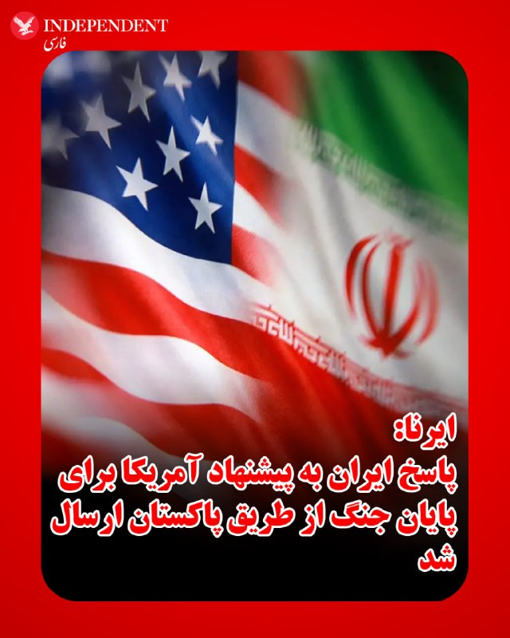

♦️ایرنا، خبرگزاری رسمی دولت جمهوری اسلامی به نقل از منابعی در دولت گزارش داد تهران، روز یکشنبه ۲۰ اردیبهشت ماه، پاسخ خود به آخرین متن پیشنهادی آمریکا برای پایان جنگ را از طریق میانجی پاکستانی ارسال کرده است.
اسماعیل بقایی، سخنگوی وزارت خارجه جمهوری اسلامی، پیش‌تر اعلام کرده بود که دیدگاه‌ها و ملاحظات ایران درباره پیشنهادهای آمریکا پس از تکمیل بررسی‌ها و جمع‌بندی نهایی ارائه خواهد شد.
ایرنا همچنین نوشت بر اساس طرح پیشنهادی، مذاکرات در این مرحله بر موضوع پایان جنگ در منطقه متمرکز خواهد بود.
‌🇸🇦 Indypersian

🤖 @VahidOOnLine

## VahidOOnLine — post 239273

  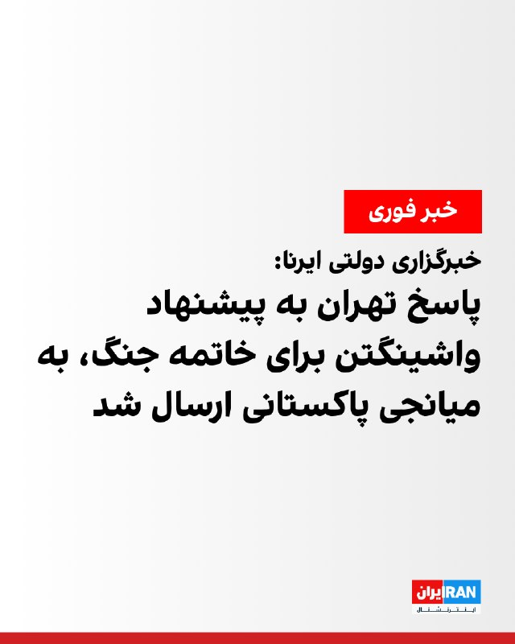

خبرگزاری دولتی ایرنا گزارش داد که پاسخ جمهوری اسلامی به آخرین متن پیشنهادی آمریکا برای خاتمه جنگ، روز یکشنبه به میانجی پاکستانی ارسال شده است.

روز شنبه دونالد ترامپ گفته بود که انتظار دارد هر چه سریع‌تر پاسخ جمهوری اسلامی را دریافت کند.

پیش‌تر سخنگوی وزارت خارجه جمهوری اسلامی اعلام کرده بود دیدگاه‌ها و ملاحظات مقام‌های ایرانی راجع به پیشنهادهای آمریکا، بعد از تکمیل بررسی‌ها و جمع‌بندی نهایی، ارسال خواهد شد.
‌🏁 🇬🇧 IranintlTV

🤖 @VahidOOnLine

## VahidOOnLine — post 239272

  <a href="telegram/content/VahidOOnLine_239272_1778417136.mp4">🎬 Download video</a>

⭕️ شمارش معکوس برای افتتاح جشنواره کن؛
پوستر ۲۰۰ کیلویی جشنواره نصب شد

♦️همزمان با آغاز شمارش معکوس برای افتتاح هفتادونهمین دوره جشنواره فیلم کن، کارگران در یکی از نمادین‌ترین سنت‌های سالانه این رویداد سینمایی، پوستر رسمی جشنواره را بر فراز ساختمان «کاخ جشنواره‌ها» در شهر کن فرانسه نصب کردند.
پوستر امسال با تصویری از فیلم ماندگار «تلما و لوییز» طراحی شده و حدود ۲۵۰ متر مربع مساحت و نزدیک به ۲۰۰ کیلوگرم وزن دارد.
فیلم «تلما و لوییز» (Thelma & Louise) ساخته ریدلی اسکات در سال ۱۹۹۱، یکی از ماندگارترین آثار جاده‌ای و فمینیستی تاریخ سینما به شمار می‌رود؛ فیلمی با بازی درخشان جینا دیویس و سوزان ساراندون در نقش دو زن که در جریان سفری کوتاه، ناخواسته وارد مسیری پرتنش و فرار از قانون می‌شوند. این اثر که به‌دلیل روایت متفاوت از استقلال زنان، خشونت جنسیتی و آزادی فردی مورد توجه گسترده قرار گرفت، در شصت‌وچهارمین دوره اسکار نامزد دریافت ۶ جایزه شد و جایزه بهترین فیلم‌نامه غیراقتباسی را کسب کرد.
‌🇸🇦 Indypersian

🤖 @VahidOOnLine

## VahidOOnLine — post 239271

  

♦️وزارت دفاع قطر روز یکشنبه تایید کرد که یک کشتی باری تجاری در آب‌های سرزمینی این کشور هدف حمله پهپادی قرار گرفته است.
این وزارتخانه در بیانیه‌ای اعلام کرد که کشتی مورد نظر در شمال شرق بندر مسیعید قطر و در حالی که از ابوظبی در حرکت بود، هدف قرار گرفت. به گفته مقام‌های قطری، این حمله باعث وقوع آتش‌سوزی محدودی در کشتی شد، اما هیچ مصدومی بر جای نگذاشت.
وزارت دفاع قطر افزود که آتش مهار شده و کشتی به مسیر خود به سوی بندر مسیعید ادامه داده است.
پیش‌تر مرکز عملیات تجارت دریایی بریتانیا نیز از اصابت یک «پرتابه ناشناس» به یک کشتی فله‌بر در ۲۳ مایل دریایی شمال شرق دوحه خبر داده بود.
پیشتر خبرگزاری حکومتی فارس، به نقل از منبعی گزارش داد این کشتی باری مورد هدف با پرچم آمریکا تردد می‌کرده و متعلق به ایالات متحده بوده است.
‌🇸🇦 Indypersian

🤖 @VahidOOnLine

## VahidOOnLine — post 239270

  

♦️سخنگوی کمیسیون امنیت ملی مجلس روز یکشنبه به ایالات متحده در مورد هرگونه حمله به کشتی‌ها در آب‌های خلیج فارس هشدار داد  و گفت خویشتنداری به پایان رسیده است.
ابراهیم رضایی، رضایی در پیامی در شبکه اجتماعی ایکس نوشت: «خویشتنداری ما از امروز به پایان رسیده است. هرگونه حمله به کشتی‌های ما باعث واکنش قوی و قاطع ایران علیه کشتی‌ها و پایگاه‌های آمریکایی خواهد شد.»
او اضافه کرد: «بهترین راه، تسلیم شدن و دادن امتیاز است. باید به نظم منطقه‌ای جدید عادت کنید.»
این پیام ساعتی پس از آن منتشر شد که رسانه‌ها از هدف قرار گرفتن یک کشتی باری در سواحل قطر خبر دادند. رسانه‌های نزدیک به سپاه کشتی هدف قرار گرفته شده را متعلق به آمریکا اعلام کردند.
این حادثه پس از آن رخ داد که یک جت جنگنده آمریکایی روز جمعه دو نفتکش با پرچم ایران را در خلیج عمان از کار انداخت تا از ادامه مسیر آنها به سمت ایران جلوگیری کند.
سپاه پاسداران ایران سپس روز شنبه تهدید کرد که در صورت آتش گرفتن نفتکش‌های خود، سایت‌های آمریکایی در خاورمیانه و «کشتی‌های دشمن» را هدف قرار خواهد داد.
‌🇸🇦 Indypersian

🤖 @VahidOOnLine

## VahidOOnLine — post 239269

  <a href="telegram/content/VahidOOnLine_239269_1778417140.mp4">🎬 Download video</a>

بر اساس ویدیوهای رسیده به ایران‌اینترنشنال، ایرانیان مقیم فنلاند، یکشنبه ۲۰ اردیبهشت در اعتراض به اعدام‌های جمهوری اسلامی، در شهر هلسینکی تجمع کردند و فریاد «کینگ رضا پهلوی» سردادند.
‌🏁 🇬🇧 IranintlTV

🤖 @VahidOOnLine

## mwarmonitor — post 8810

امروز باید منتظر توئیت ترامپ در مورد جواب ایران به طرح پیشنهادی آمریکا باشیم

## mwarmonitor — post 8809

🔴(عاموس هارل Amos Harel. او یکی از شناخته‌شده‌ترین تحلیل‌گران نظامی و امنیتی اسرائیل است و سال‌هاست در روزنامه Haaretz می‌نویسد. هارل معمولاً به‌خاطر نگاه انتقادی، حرفه‌ای و غیرجناحی‌اش به ارتش اسرائیل، جنگ‌ها، سیاست‌های امنیتی و عملکرد دولت‌ها—از جمله نتانیاهو—شناخته می‌شود. تحلیل‌های او اغلب در رسانه‌های بین‌المللی هم بازتاب پیدا می‌کند و منبع مهمی برای فهم فضای امنیتی و نظامی اسرائیل محسوب می‌شود.)

📝عاموس هارل می‌نویسد

«نتانیاهو هرچه بیشتر در ترمیم تناقض‌های مواضع خود ناتوان می‌شود. پیروزی مطلقی که وعده داده بود مدت‌هاست رنگ باخته است. به نظر می‌رسد تنها حامیان دوآتشه‌اش با طفره رفتن او از انجام یک تحقیق مستقل درباره بدترین شکست تاریخ کشور کنار آمده‌اند. در حالی که کمتر از شش ماه تا انتخابات باقی مانده، وضعیت نخست‌وزیر آن‌گونه که در نظرسنجی‌ها بازتاب یافته، به‌هیچ‌وجه امیدوارکننده نیست. دقیقاً به همین دلایل است که هرچه به موعد انتخابات نزدیک می‌شویم، باید تصمیمات او در حوزه‌های امنیتی و سیاسی را با نگاهی شکاکانه‌تر از همیشه بررسی کرد.»

@mwarmonitor

## mwarmonitor — post 8808

  <a href="telegram/content/mwarmonitor_8808_1778417143.mp4">🎬 Download video</a>

✈️در حالی که یک جنگنده F/A-18 نیروی دریایی آمریکا در حال گشت‌زنی بر فراز آسمان خاورمیانه بود، توسط یک هواپیمای سوخت‌رسان KC-135 استراتوتنکر نیروی هوایی آمریکا سوخت‌گیری شد. بزرگ‌ترین نیروی نظامی جهان به‌طور معمول مأموریت‌های لجستیکی حیاتی را چنان هماهنگ انجام می‌دهد که کاملاً بی‌نقص به نظر می‌رسند.

@mwarmonitor

## mwarmonitor — post 8807

📝 این سنگ مزار، مانیفست توحش و کیفرخواستی عریان علیه رژیم سفاکی است که بقای متعفن و ننگین خود را در قصابی دسته‌جمعی خانواده‌ها و به رگبار بستن همزمان مادر و جگرگوشه‌هایش می‌بیند. نوزدهم دی‌ماه، روزی است که چنگال خونین این استبداد مذهبی، تمام هستی یک خانه را…

## mwarmonitor — post 8806

🇮🇷سخنگوی کمیسیون امنیت ملی ایران، ابراهیم رضایی، خطاب به رئیس‌جمهور ترامپ:

«بهترین راه، تسلیم شدن است.»

«از امروز، خویشتنداری ما پایان یافته است. هرگونه تجاوز به کشتی‌های ما با پاسخی سنگین و قاطع از سوی ایران علیه کشتی‌ها و پایگاه‌های آمریکایی روبه‌رو خواهد شد.»

«زمان به ضرر منافع آمریکا در حال سپری شدن است؛ به نفع آن‌هاست که دست به اقدام احمقانه نزنند و خود را بیشتر در باتلاقی که در آن گرفتار شده‌اند، فرو نبرند.»

«بهترین گزینه تسلیم شدن و پذیرش امتیازهاست. باید به نظم جدید منطقه‌ای عادت کنید.»

🔴مارک لوین ؛

🔸رژیم ایران می‌گوید بهترین راه این است که ما تسلیم شویم!

🔹علاوه بر ایدئولوژی مرگ‌پرستانه‌اش، این افراد سرسخت از لفاظی‌های دموکرات‌ها، رسانه‌های ما و «ووک ریخ» (Woke Reich) جسورتر شده‌اند؛ کسانی که به گفته این متن به دشمن کمک و دلگرمی داده‌اند. همچنین این رژیم آتش‌بس را نشانه ضعف می‌داند.

@mwarmonitor

## mwarmonitor — post 8805

🇩🇪برلین در حال احیای تلاش‌ها برای خرید موشک‌های کروز تاماهاوک ساخت آمریکا است، پس از آن‌که پنتاگون برنامه‌های خود برای استقرار یک گردان آمریکایی مجهز به این تسلیحات در آلمان را لغو کرد؛ اقدامی که باعث ایجاد شکاف در بازدارندگی اروپا در برابر روسیه شده است. فیننشال تایمز

@mwarmonitor

## pm_afshaa — post 90473

ایرنا:پاسخ جمهوری اسلامی به آخرین متن پیشنهادی آمریکا برای خاتمه جنگ، امروز به میانجی پاکستانی ارسال شد

💧 Rainbet.com the #1 Non-KYC Crypto Casino & Sportsbook @rainbetcom

😁 @Pm_Afshaa

## DEJradio — post 4544

  <a href="telegram/content/DEJradio_4544_1778417144.jpg">🎬 Download video</a>

🚨
⭕️ خبرگزاری جمهوری اسلامی، ایرنا، مدعی شد پاسخ تهران به آخرین متن پیشنهادی آمریکا برای پایان جنگ، از طریق میانجی پاکستانی ارسال شده است. بنا بر این گزارش، پاسخ جمهوری اسلامی روز یکشنبه به طرف آمریکایی منتقل شده است.

#مذاکرات #پاکستان #جنگ
@DEJradio

## DEJradio — post 4543

  <a href="telegram/content/DEJradio_4543_1778417145.mp4">🎬 Download video</a>

⭕️
🗣 یکی از شهروندان از تهران با ارسال ویدیویی نوشت، «از شهرستان‌ها آدم به تهران می‌آورند برای تجمعات، اینجا پر است از ماشین‌هایی با پلاک شهرهای اطراف و یا شهرستان‌های دیگر. غریبه‌هایی که سعی می‌کنند، چشم از تو بدزدند، وقتی که آن‌ها را کنار ماشین‌های مزین شده به پرچم و عکس آقای شهیدشان و آقای جدیدشان می‌بینی.
این ماشین یکی از آن‌هاست. خراب و دود کرده کنار یکی از خیابان‌های شمال شهر ایستاده بود. زن و یکی از دخترها داخل سوپر مارکتی شدند که مردم محل هم دیگر به سختی توان خرید از آن را دارند. آن‌ها پول خوراکی که تهیه کرد بودند با کارت سبز رنگی که مشخص بود؛ کارت بانکی نیست و شبیه کارت هدیه بود، دادند و کنار پیاده رو، روی زمین نشستند و صبحانه خوردند. در میان نگاه های مردمی که از کنارشان می گذشتند؛ بعضی با نفرت و برخی با ترحم.»

#تجمعات_خیابانی
@DEJradio

## DEJradio — post 4542

  

🔸
⭕️ وبسایت «وای نت» در تحلیلی به قلم سور پلاکر، سردبیر ارشد اقتصادی این روزنامه، با مقایسه وضعیت کنونی جمهوری اسلامی با روزهای آخر آلمان نازی، هشدار داد اگر ترامپ بخواهد با صبر و حوصله منتظر بماند تا حاکمان ایران از تعصب ایدئولوژیک خود دست بردارند، ممکن است روزی برسد که بفهمد کار بیهوده‌ای کرده است؛ تاریخ اروپا در ۸۱ سال پیش نشان داد دیکتاتوری آدولف هیتلر تا وقتی شکست به آن تحمیل نشد، جنگ را ادامه داد.
در این یادداشت آمده «در هفته‌های اخیر، ترامپ توافق‌هایی معقول به حکومت ایران پیشنهاد کرده است تا به جنگ پایان دهد. تندروها در میان رهبران حکومت، با وجود ضربه‌هایی که ایرانیان متحمل شده‌اند و در جنگ با ایالات متحده و اسرائیل همچنان متحمل خواهند شد، این پیشنهادها را با تمسخر رد کرده‌اند.»
این تحلیل با اشاره به اینکه اکثریت آلمانی‌ها با وجودی که ایمانشان را به هیتلر و حکومت نازی‌ها از دست داده بودند، شورش نکردند و خودشان نازیسم را سرنگون نکردند، گفت حکومت آلمان نازی تا آخرین لحظه و تا زمانی که سربازان متفقین با زور بر درهای مقرهایشان کوبیدند، به سرکوب ادامه داد.

#جمهوری_اسلامی #هیتلر
@DEJradio

## mamlekate — post 103496

  <a href="telegram/content/mamlekate_103496_1778417148.mp4">🎬 Download video</a>

دوستانی که دنبال کون آخوند نگران بودند ایران سوریه بشه، سوریه با سوییفت، ویزا و مستر به جهان وصل شد

@mamlekate

## mamlekate — post 103495

📝 ساخت «پایگاهی مخفی» توسط اسرائیل در صحرای عراق

وال‌استریت ژورنال می‌گوید، اسرائیل پیش از حمله به ایران پایگاهی مخفی در عراق ساخته بود که نقشی کلیدی در پشتیبانی از عملیات هوایی علیه ایران داشته است. اسرائیل حتی برای حفاظت از این پایگاه، به نیروهای عراقی حمله کرده است.

@mamlekate

## mamlekate — post 103494

📝 امارات متحده عربی: دو پهپاد پرتاب شده از ایران را در روز یکشنبه رهگیری کردیم

وزارت دفاع امارات متحده عربی اعلام کرد که روز یکشنبه، دو پهپاد پرتاب شده از ایران را رهگیری کرده است. در روزهای گذشته امارات متحده عربی چندین بار هدف موشک ها و پهپادهای پرتاب شده از سوی جمهوری اسلامی قرار گرفت.

@mamlekate

## kianmeli1 — post 87324

‏🔴ایرنا، خبرگزاری رسمی جمهوری اسلامی: پاسخ جمهوری اسلامی به آخرین متن پیشنهادی آمریکا برای خاتمه جنگ، امروز به میانجی پاکستانی ارسال شد
https://t.me/kianmeli1

## kianmeli1 — post 87323

  

🔴آتش سوزی شدید یک کشتی در سواحل دبی/امارات_ علت: نامشخص
https://t.me/kianmeli1

## IranIntlTV — post 336457

  

خبرگزاری دولتی ایرنا گزارش داد که پاسخ جمهوری اسلامی به آخرین متن پیشنهادی آمریکا برای خاتمه جنگ، روز یکشنبه به میانجی پاکستانی ارسال شده است.

روز شنبه دونالد ترامپ گفته بود که انتظار دارد هر چه سریع‌تر پاسخ جمهوری اسلامی را دریافت کند.

پیش‌تر سخنگوی وزارت خارجه جمهوری اسلامی اعلام کرده بود دیدگاه‌ها و ملاحظات مقام‌های ایرانی راجع به پیشنهادهای آمریکا، بعد از تکمیل بررسی‌ها و جمع‌بندی نهایی، ارسال خواهد شد.
https://iranintl.com/202605100427

## IranIntlTV — post 336456

🔻رییس کمیسیون انرژی اتاق بازرگانی: خاموشی‌ها امسال گسترده‌تر خواهد شد

رییس کمیسیون انرژی اتاق بازرگانی ضمن هشدار درباره تشدید بحران انرژی در ایران اعلام کرد به نظر می‌رسد تابستان امسال قطعی برق خانگی، تجاری و اداری به‌صورت روزانه و مستمر ادامه داشته باشد و بخش صنعت نیز همچنان در اولویت خاموشی‌ها قرار گیرد.

آرش نجفی یک‌شنبه ۲۰ اردیبهشت در مصاحبه با خبرگزاری ایلنا گفت با توجه به آسیب‌ دیدن برخی پتروشیمی‌ها در جنگ و در نتیجه، تامین برق آن‌ها از شبکه سراسری، نزدیک به هزار مگاوات برق پایدار باید به‌صورت شبانه‌روزی به این مجتمع‌ها اختصاص یابد.

او افزود به‌دلیل این وضعیت، بخش زیادی از برق تولیدشده در نیروگاه‌های تجدیدپذیر صرف پتروشیمی‌ها خواهد شد.

نجفی افزود پیش‌بینی می‌شود در بهترین حالت، شرایط صنعت برق تفاوتی با سال گذشته نداشته باشد و خاموشی‌های برنامه‌ریزی‌شده ادامه پیدا کند.

او ادامه داد جمهوری اسلامی ناچار است حدود ۱۲۰ روز محدودیت مصرف برق اعمال کند و با توجه به اینکه مردم ابزار موثری برای کاهش مصرف در اختیار ندارند، این وضعیت به خاموشی‌های گسترده منجر خواهد شد.

هم‌زمان، مسعود پزشکیان، رییس دولت، در جلسه طرح «محله‌محوری و مسجدمحوری»، صرفه‌جویی در مصرف برق را به جنگ گره زد و گفت خاموش کردن یک چراغ «به‌مثابه شلیک یک تیر به سمت دشمن در جنگ فعلی است».

او افزود مردم باید با «صرفه‌جویی» در مصرف انرژی سهم خود را در این «میدان» ایفا کنند.

۱۹ اردیبهشت، مجید دوست‌علی، عضو کمیسیون برنامه و بودجه مجلس، صرفه‌جویی را «مقابله مستقیم» با «توطئه اقتصادی دشمن» توصیف کرد و گفت دشمن می‌خواهد از مسیر کمبود برق، آب یا سوخت، مردم را تحت فشار قرار دهد و نارضایتی ایجاد کند.
تداوم خاموشی‌های روزانه در بخش خانگی، تجاری و اداری

رییس کمیسیون انرژی اتاق بازرگانی در ادامه با اشاره به خاموشی‌های سال گذشته گفت در برخی موارد، برق مشترکان سه تا چهار روز در هفته و هر بار به‌مدت دو ساعت قطع می‌شد و احتمال می‌رود در سال جاری این وضعیت شدیدتر شود و قطعی برق خانگی، تجاری و اداری به‌صورت روزانه ادامه یابد.

نجفی هشدار داد بخش صنعت همچنان نخستین بخشی خواهد بود که با محدودیت و قطع برق روبه‌رو می‌شود.

او افزود کمبود برق کشور که پیش‌تر حدود ۸ تا ۹ هزار مگاوات بود، اکنون به بیش از ۲۳ تا ۲۴ هزار مگاوات رسیده است.

نجفی دلیل این وضعیت را خروج سرمایه‌گذاران از صنعت برق، افزایش نرخ ارز، مشکلات بازپرداخت بدهی نیروگاه‌ها و فراهم نشدن شرایط مناسب برای حضور بخش خصوصی در حوزه نیروگاه‌های تجدیدپذیر عنوان کرد.

او درباره واردات برق از کشورهای همسایه نیز گفت حتی در بهترین شرایط، ایران تنها می‌تواند بین ۵۰۰ تا هزار مگاوات برق وارد کند و این میزان پاسخگوی کمبود فعلی شبکه برق کشور نخواهد بود.
رضا سپهوند، عضو کمیسیون انرژی مجلس، ۱۸ اردیبهشت خبر داد ممکن است در تابستان خاموشی‌هایی رخ دهد، اما تلاش بر این است که در بخش برق خانگی خاموشی اعمال نشود.

او افزود احتمال دارد بخشی از صنایع با خاموشی روبه‌رو شوند، اما میزان آن کمتر از سال گذشته خواهد بود.

هشتم اردیبهشت نیز مصطفی رجبی‌ مشهدی، معاون وزیر نیرو و سخنگوی صنعت برق، اعلام کرد نمی‌تواند تضمین دهد امسال قطعی برق رخ نخواهد داد، اما احتمال می‌رود میزان محدودیت‌ها نسبت به گذشته کاهش یابد.

در حالی که مقام‌های جمهوری اسلامی کمبود برق را به «جنگ اقتصادی» و ضرورت صرفه‌جویی در «میدان مقابله با دشمن» نسبت می‌دهند، پیام‌های رسیده به ایران‌اینترنشنال از فشار هم‌زمان گرانی، خاموشی و ناامیدی در میان شهروندان حکایت دارد.

پیش‌تر یک شهروند با ارسال پیامی به ایران‌اینترنشنال گفته بود: «برق را تازگی‌ها روزانه قطع می‌کنند. هیچ امیدی هم که به آینده نیست. ما در ایران مدت‌هاست که برگشته‌ایم به عصر غارنشینی و صرفا به دنبال بقا هستیم.»

🔗وب‌سایت ایران‌اینترنشنال
@iranintltv

## IranIntlTV — post 336455

  <a href="telegram/content/IranIntlTV_336455_1778417151.mp4">🎬 Download video</a>

🔻مهدی تاج، رییس فدراسیون فوتبال، شب گذشته در یک برنامه تلویزیونی مدعی شد حتی اگر فیفا با همه شروط فدراسیون فوتبال برای حضور تیم ملی در جام جهانی موافقت نکند، «فکر می‌کنم کشورهایی مانند الجزایر و ترکیه شاید در جام جهانی پرچم ما را هم بالا ببرند.»

@iranintltvsport

## IranIntlTV — post 336454

  <a href="telegram/content/IranIntlTV_336454_1778417153.mp4">🎬 Download video</a>

بر اساس ویدیوهای رسیده به ایران‌اینترنشنال، ایرانیان مقیم فنلاند، یکشنبه ۲۰ اردیبهشت در اعتراض به اعدام‌های جمهوری اسلامی، در شهر هلسینکی تجمع کردند و فریاد «کینگ رضا پهلوی» سردادند.

## IranIntlTV — post 336453

  <a href="telegram/content/IranIntlTV_336453_1778417155.mp4">🎬 Download video</a>

همزمان با معترضان در ده‌ها شهر جهان، ایرانیان مقیم سئول و توکیو نیز در پاسخ به فراخوان شاهزاده رضا پهلوی، مقابل وزارت خارجه کره جنوبی و ژاپن تجمع کردند.

توماج طاهباز ، خبرنگار ایران‌اینترنشنال، گزارش می‌دهد
@iranintltv

## IranIntlTV — post 336452

  <a href="telegram/content/IranIntlTV_336452_1778417158.mp4">🎬 Download video</a>

کارزار همبستگی ایرانیان خارج از کشور با «ملت در گروگان» در ایران و در حمایت از انقلاب ملی در شهرهای مختلف جهان ادامه دارد.

گفت‌وگوی مهران عباسیان، خبرنگار ایران‌اینترنشنال، با شرکت‌کنندگان در تجمع استکهلم

@iranintltv

## IranIntlTV — post 336451

در ادامه کارزار همبستگی ایرانیان خارج از کشور، ایرانیان مقیم استکهلم در تجمعی اعتراضی، در گفت‌وگو با مهران عباسیان، خبرنگار ایران‌اینترنشنال، با مردم داخل کشور اعلام همبستگی کردند.
@iranintltv

## IranIntlTV — post 336450

  <a href="telegram/content/IranIntlTV_336450_1778417160.mp4">🎬 Download video</a>

کارزار همبستگی ایرانیان خارج از کشور با «ملت در گروگان» در ایران ادامه دارد. این تجمع‌ها با فراخوان شاهزاده رضا پهلوی و در اعتراض به تشدید اعدام‌‌ها، سرکوب و قطع اینترنت در ایران، برگزار می‌شود.

مهران عباسیان، خبرنگار ایران‌اینترنشنال، از تجمع شهر استکهلم گزارش می‌دهد

@iranintltv

## IranIntlTV — post 336449

  <a href="telegram/content/IranIntlTV_336449_1778417162.mp4">🎬 Download video</a>

در ادامه گزارش‌ها از تشدید بحران انرژی در ایران، مسعود پزشکیان از طرفداران حکومت خواست بر مصرف برق در محله‌ها نظارت کنند.

گفت‌وگو با عطا حسینیان، روزنامه‌نگار اقتصادی و حوزه انرژی

@iranintltv

## ManotoTV — post 105236

  <a href="telegram/content/ManotoTV_105236_1778417164.mp4">🎬 Download video</a>

یوری اوشاکوف، دستیار رئیس‌جمهور روسیه در امور سیاست خارجی، اعلام کرد استیو ویتکاف، فرستاده ویژه رئیس‌جمهور آمریکا، و جرد کوشنر، داماد دونالد ترامپ، احتمالا به‌زودی برای ادامه گفت‌وگوها به مسکو سفر می‌کنند.

به گزارش اینترفکس، اوشاکوف گفت: «دیر یا زود، فکر می‌کنم به‌زودی، همکاران دائمی ما استیو ویتکاف و کوشنر به مسکو می‌آیند و ما گفت‌وگو را با آن‌ها ادامه می‌دهیم.»

او همچنین گفت واشنگتن موضوع حل‌وفصل جنگ اوکراین را کنار نگذاشته و تماس‌های تلفنی فعال میان آمریکا و روسیه ادامه دارد. ودوموستی نیز نوشت این سفر احتمالی در چارچوب ادامه گفت‌وگوها درباره حل‌وفصل جنگ اوکراین مطرح شده است.

## FarsiVOA — post 217337

نت‌بلاکس، نهاد مستقل پایش اینترنت، اعلام کرد خاموشی اینترنت در ایران وارد هفتادودومین روز شده و اتصال کشور پس از بیش از ۱۷۰۴ ساعت همچنان در پایین‌ترین سطح قرار دارد.

به نوشته نت‌بلاکس، هیچ نشانه‌ای از بازگشت گسترده دسترسی دیده نمی‌شود و مقام‌ها همچنان از دسترسی عمومی مردم به اینترنت جهانی جلوگیری می‌کنند.

بحران اینترنت در ایران فقط یک اختلال فنی نیست. نت‌بلاکس از خاموشی ۷۲ روزه و نبود نشانه بازگشت دسترسی می‌گوید؛ دنیای اقتصاد از گران‌تر شدن مسیر اتصال پرسرعت می‌نویسد؛ مهر آن را مسئله حقوق شهروندی و تبعیض در دسترسی می‌داند؛ و گاردین از اثر آن بر اطلاع‌رسانی و ارتباط با منابع داخل ایران می‌گوید.

گزارش کامل را در وب‌سایت صدای آمریکا بخوانید.

@FarsiVOA

## DW_Farsi — post 124521

  

🔶۷۲ روز قطعی اینترنت و سکوت دیجیتال در ایران

قطعی و محدودیت گسترده اینترنت در ایران وارد هفتادودومین روز خود شد؛ وضعیتی که بنا بر داده‌های نت بلاکس، نهاد ناظر بر وضعیت دسترسی به اینترنت در جهان، همچنان بدون نشانه‌ای از بازگشت پایدار ارتباطات ادامه دارد.

بر اساس این داده‌ها، اتصال اینترنت در ایران پس از ۱۷۰۴ ساعت همچنان قطع است. این اختلال گسترده اکنون وارد سومین ماه پیاپی شده و از آن به‌عنوان یکی از طولانی‌ترین دوره‌های محدودیت اینترنت نه تنها در ایران بلکه در جهان یاد می‌شود.

این در حالی است که اینترنت در ایران پیش از شروع جنگ نیز در زمان اعتراضات دی‌ماه ۱۴۰۴ با یک قطعی گسترده روبرو بود و به فاصله کوتاهی پس از آغاز حملات آمریکا و اسرائیل، جمهوری اسلامی مجددا ایران را در یک خاموشی دیجیتال فرو برد.

@dw_farsi

## DW_Farsi — post 124520

🔶آلمان از سقف سهم مصرف از منابع طبیعی در سال ۲۰۲۶ عبور کرد

از منظر آمار، آلمان منابع طبیعی مورد نیاز برای کل سال ۲۰۲۶ را از روز یکشنبه ۱۰ مه (۲۰ اردیبهشت) به پایان رسانده است.

سازمان محیط زیستی "شبکه ردپای جهانی" (Global Footprint Network)، اصطلاحا " روز اضافه‌برداشت زمین " را سالانه برای کشورهای مختلف و همچنین برای کل سیاره محاسبه می‌کند.

اگر همه مردم جهان به اندازه ساکنان آلمان منابع طبیعی مصرف و دی‌اکسید کربن تولید می‌کردند، ظرفیت زیستی سالانه زمین همین حالا، در یک‌سوم نخست سال ۲۰۲۶، به پایان می‌رسید.

@dw_farsi

## DW_Farsi — post 124519

🔸تلاش آلمان برای خرید موشک‌های تاماهاک از آمریکا

به گزارش فایننشال تایمز، پس از لغو قرار استقرار موشک‌های تاماهاک در آلمان از سوی آمریکا، دولت آلمان قصد دارد برای خریداری این موشک‌های کروز از ایالات متحده تلاش کند.

این روزنامه بریتانیایی به نقل از منابع آگاه گزارش داده که دولت آلمان امیدوار است بتواند واشنگتن را به فروش این تسلیحات، همراه با سامانه پرتابگر زمینی موشکی "تایفون" مرتبط با آن، متقاعد کند.

بر اساس این گزارش، بوریس پیستوریوس، وزیر دفاع آلمان، قصد دارد برای پیگیری خرید این سامانه‌های دوربرد به واشنگتن سفر کند.

آلمان در ماه ژوئیه سال گذشته درخواست خرید سامانه تایفون را ارائه کرده بود، اما آمریکا تاکنون به این درخواست پاسخی نداده است.

با این حال، به نوشته فایننشال تایمز، سفر پیستوریوس به آمریکا بستگی به این دارد که آیا او بتواند دیداری با پیت هگست، همتای آمریکایی خود، ترتیب دهد یا نه.

این روزنامه می‌نویسد با توجه به تیرگی روابط میان دونالد ترامپ، رئیس جمهور آمریکا، و فریدریش مرتس، صدراعظم آلمان، در پی جنگ ایران، چنین دیداری قطعی به نظر نمی‌رسد.

تاکنون نیز هیچ واکنشی از سوی کاخ سفید، وزارت دفاع آمریکا یا وزارت دفاع آلمان در این خصوص منتشر نشده است.

@dw_farsi

## DW_Farsi — post 124518

  

🔸دادستانی تهران علیه صادق زیباکلام و عباس عبدی اعلام جرم کرد

خبرگزاری قوه قضائیه روز یکشنبه ۲۰ اردیبهشت اعلام کرد که دادستانی تهران علیه صادق زیباکلام، استاد پیشین دانشگاه و عباس عبدی، روزنامه‌نگار و فعال سیاسی اعلام جرم کرده است. در اطلاعیه قوه قضائیه آمده است، یادداشت اخیر عبدی در روزنامه "اعتماد" و مصاحبه زیباکلام با خبرگزاری "آنا" دلیل اعلام جرم علیه آنان بوده است.

عباس عبدی ۱۶ اردیبهشت در یادداشت خود برای اعتماد در مورد "جعل خبر" به ویژه از سوی برخی چهره‌‌های تندرو در مجلس شورای اسلامی هشدار داده و نوشته بود: «این افراد تحت نام نمایندگی هر چه بخواهند می‌گویند و کسی هم در مقام اصلاح آنها برنمی‌آید.»

صادق زیباکلام نیز در مصاحبه‌اش با خبرگزاری آنا که ۱۷ اردیبهشت منتشر شد، با انتقاد از "آمریکاستیزی" و بیان اینکه "چه شد که آمریکاستیزی و مرگ بر آمریکا تبدیل به ایدئولوژی جمهوری اسلامی شد" گفته بود: «شماها همیشه کیفرخواستتان علیه آمریکا یک‌سویه هست؛ هیچ وقت نگاه نکردید که ما چه کار کردیم؛ شما می‌گویید که آمریکایی‌ها ایرباس را زدند ولی هیچ‌وقت نیامدید بگویید که چه شد که ایرباس زده شد؟»

@dw_farsi

## Persian_Trend_Official — post 13825

  

در ساعات گذشته چندین پهپاد انتحاری به سوی کشور امارات کویت قطر پهپاد شلیک شد .
همچنین یککشتی باربریِ متعلق به کره‌جنوبیخ تو تنگه هرمز با دو تا پهپادِ ناشناس هدف گرفته شده است.

☆Phantom☆

📌 @persian_trend_official
پرشین ترند | متفاوت‌ترین کانال نظامی

## Persian_Trend_Official — post 13824

  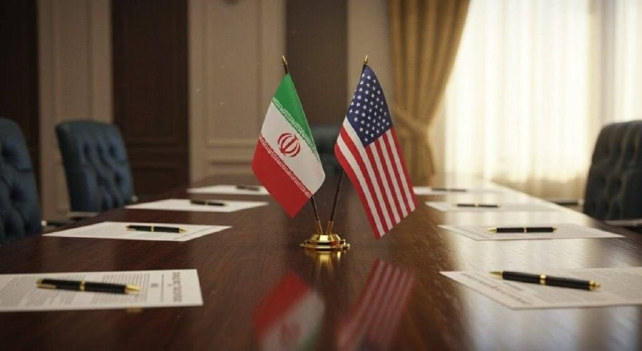

⭕️ ایرنا؛
🔸پاسخ ایران به متن پیشنهادی آمریکا ارسال شد

🔹پاسخ جمهوری اسلامی ایران به آخرین متن پیشنهادی آمریکا برای خاتمه جنگ، امروز به میانجی پاکستانی ارسال شد.

🔹سخنگوی وزارت خارجه قبلا چند بار اعلام کرده بود دیدگاه‌ها و ملاحظات ایران راجع به پیشنهادهای آمریکا، بعد از تکمیل بررسی‌ها و جمع‌بندی نهایی، ارسال خواهد شد.

🔹بر اساس طرح پیشنهادی، در این مرحله مذاکرات متمرکز بر موضوع خاتمه جنگ در منطقه خواهد بود.

🫆:Tony

📌 @persian_trend_official
پرشین ترند | متفاوت‌ترین کانال نظامی

## Persian_Trend_Official — post 13823

  

🔴 گزارش‌ها از اعزام گسترده هواپیماهای ترابری سنگین آمریکا به خاورمیانه

💢برخی منابع از پرواز و اعزام ۱۳ فروند هواپیمای ترابری نظامی سنگین ارتش آمریکا از پایگاه‌های اروپایی به سمت خاورمیانه طی ساعات اخیر خبر می‌دهند.

🫆:Tony

📌 @persian_trend_official
پرشین ترند | متفاوت‌ترین کانال نظامی

## Persian_Trend_Official — post 13822

  <a href="telegram/content/Persian_Trend_Official_13822_1778417169.mp4">🎬 Download video</a>

🔴ویدیویی از آماده سازی پهپاد های فیبر نوری

💢در چند وقت اخیر FPV های فیبر نوری حزب الله سر صدا زیادی به راه انداخته لذا این ویدیو جهت افزایش اطلاعات علاقه مندان بارگذاری میشود

▪️پهپاد انتحاری از نوع fpv فیبر نوری، با هدف مقابله با جنگ الکترونیک و اخلال‌گرها طراحی شده؛ جایی که پهپادهای عادی معمولاً کور و قطع می‌شوند.

▪️این پهپاد به‌جای ارتباط رادیویی، از کابل فیبر نوری استفاده می‌کند و همین موضوع باعث می‌شود عملاً در برابر جمینگ و اختلال الکترونیکی مقاوم باشد.

▪️این پهپاد هاتوان نفوذ دقیق به مواضع، سنگرها و خودروهای زرهی را دارد و به دلیل تأخیر بسیار کم در انتقال تصویر، کنترل‌پذیری بالایی در لحظات آخر حمله فراهم می‌کند.

💢استفاده گسترده از پهپادهای فیبر نوری در جنگ اوکراین، توجه بسیاری از ارتش‌ها و گروه‌های نظامی از جمله حزب الله را به این فناوری جلب کرده است.

🫆:Tony

📌 @persian_trend_official
پرشین ترند | متفاوت‌ترین کانال نظامی

## Persian_Trend_Official — post 13821

  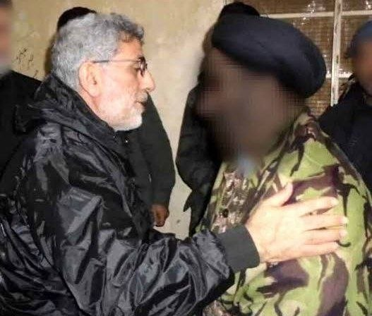

منابع عراقی به روزنامه العربی الجدید گفتند که اسماعیل قاآنی فرمانده نیروی قدس سپاه ایران طی سفری رسمی وارد بغداد شد. این دومین سفر او به بغداد در کمتر از یک ماه است.
🇮🇷🇮🇶
☆Phantom☆

📌 @persian_trend_official
پرشین ترند | متفاوت‌ترین کانال نظامی

## RadioFarda — post 157031

  <a href="https://t.me/radiofarda/157031">📎 Download file</a>

📻بشنوید: ساعت ۱۴ با رادیوفردا،۲۰ اردیبهشت ۱۴۰۵‌

@Radiofarda

## RadioFarda — post 157030

🔸رسانه‌های داخل ایران روز یک‌شنبه به نقل از مدیرعامل شرکت پایانه‌های نفتی ایران هر گونه آلودگی نفتی ناشی از تأسیسات جزیره خارک را تکذیب کردند. 🔸او گفت: «به محض انتشار این اخبار، گروه‌های متخصص اچ‌اس‌ئی و اداره شیمیایی و آزمایشگاه، همه منطقه را پایش کردند…

## RadioFarda — post 157029

  

🔸رسانه‌های داخل ایران روز یک‌شنبه به نقل از مدیرعامل شرکت پایانه‌های نفتی ایران هر گونه آلودگی نفتی ناشی از تأسیسات جزیره خارک را تکذیب کردند.

🔸او گفت: «به محض انتشار این اخبار، گروه‌های متخصص اچ‌اس‌ئی و اداره شیمیایی و آزمایشگاه، همه منطقه را پایش کردند اما حتی کوچک‌ترین موردی یافت نشد.»

🔸خبرگزاری رویترز گزارش داده بود که تصاویر ماهواره‌ای ثبت‌شده در روزهای ۱۶ تا ۱۸ اردیبهشت، لکه‌ای بزرگ را در آب‌های اطراف جزیره خارک، مهم‌ترین پایانه صادرات نفت ایران، نشان می‌دهد که به گفته کارشناسان با «نشت نفت» سازگار است.

🔸بر اساس این گزارش، لکه‌ای خاکستری و سفیدرنگ در غرب جزیره خارک دیده شده که به گفته یک پژوهشگر «رصدخانه منازعه و محیط زیست»، مساحتی حدود ۴۵ کیلومتر مربع را پوشش می‌دهد.

@RadioFarda

## IranianMinds — post 19876

۱۰ می روز جهانی مادر است، اما در سرزمین ما، بعضی مادرها فقط مادر نماندند، به درد یک ملت تبدیل شدند.
مادرانی که فرزندانشان را در راه آزادی از دست دادند و مادرانی که خود، جاویدنام راه ایران شدند.
نامتان در حافظهٔ این خاک خواهد ماند، مثل نوری خاموش‌نشدنی.
روز مادر بر تمام مادران غیور و سربلند ایران‌زمین خجسته باد.
بر آنان که ایستادند، سوختند ، اما نشکستند.

@IranianMinds

## BBCPersian — post 280657

🔻سخنگوی کمیسیون امنیت ملی مجلس: از امروز خویشتنداری ما تمام شد

سخنگوی کمیسیون امنیت ملی و سیاست خارجی مجلس ایران گفت که از امروز «خویشتنداری» به پایان می‌رسد.

ابراهیم رضایی در شبکه اجتماعی ایکس نوشت: «هر تعرضی به شناورهای ما، با پاسخ سنگین و قاطع ایران به شناورها و پایگاه‌های آمریکایی مواجه خواهد شد.»

آقای رضایی در پایان نوشت: «باید به نظم منطقه‌ای جدید عادت کنید.»

https://bbc.in/4u0LNEF
@BBCPersian

## BBCPersian — post 280656

⚽️«بی‌رحم و عذاب‌آور»؛ پنالتی از کی وارد فوتبال شد؟

✍️فیل جونز و سونیا آکسلی
بی‌بی‌سی

مارتین کلی روزی را به یاد می‌آورد که آرزو داشت مثل بقیه بچه‌های حاضر در استادیوم، چهارپایه‌ای داشت تا روی آن بایستد و دید بهتری به زمین داشته باشد.

او نمی‌خواست پشت سر دیگر تماشاچیان، دیدن نخستین ضربات پنالتی رسمی تاریخ فوتبال را از دست بدهد.

📲ادامه مطلب در لینک زیر⬇️

https://bbc.in/4wAKzlw
@BBCPersian

## BBCPersian — post 280655

🔻امارات: با دو پهپاد با موفقیت مقابله کردیم

وزارت دفاع امارات متحده عربی می‌گوید که پدافند هوایی‌اش با موفقیت دو پهپاد را که از ایران شلیک شده بودند، هدف قرار داده است.

گزارشی از خسارت‌ منتشر نشده است.

ساعاتی پیش کویت هم از شناسایی و مقابله با پهپاد در آسمانش خبر داده بود.

ایران اظهارنظری نکرده است.

https://bbc.in/4wqbvo0
@BBCPersian

## BBCPersian — post 280649

✍️آرچی میچل
گزارشگر اقتصادی، بی‌بی‌سی

⭕️در حالی که خانواده‌ها در سراسر جهان هزینه‌های جنگ آمریکا و اسرائیل علیه ایران را می‌پردازند، برخی شرکت‌ها در همین مدت سودهای کلانی به دست آورده‌اند.

بلاتکلیفی ناشی از این درگیری و بسته شدن عملی تنگه هرمز از سوی ایران، هزینه‌های زندگی را افزایش داده و بودجه شرکت‌ها، خانواده‌ها و دولت‌ها را تحت فشار قرار داده است.

📲در اینجا برخی از شرکت‌ها و حوزه‌هایی را مرور می‌کنیم که با ادامه جنگ در خاورمیانه، میلیاردها دلار سود به دست آورده‌اند.🔽

📸Getty/ BBC

https://bbc.in/42rgmY7
@BBCPersian

## Dirty_Kids — post 389222

  

فرق بین تمدن و توحش

@Dirty_Kids 👻

## Dirty_Kids — post 389221

وضعیت تکنولوژی در منطقه:

‏- افغانستان و ترکیه : اینترنت 5G تست و راه‌اندازی شد.
‏- عراق: تلگرام رفع فیلتر شد.
‏- سوریه: سوییفت، ویزا و مستر به سوریه آمدند.
‏- ایران: رکورد شکنی جدید، قطعی اینترنت به یازدهمین هفته رسید.

@Dirty_Kids 👻

## Hranews — post 112862

سیستان‌وبلوچستان؛ ۳ شهروند بر اثر انفجار مین کشته و مجروح شدند

❗️
❗️
❗️
❗️
❗️ – #انفجار_مین در مناطق مرزی شهرستان‌های میرجاوه و زاهدان، منجر به مرگ و مجروح شدن سه شهروند شد.

ادامه مطلب

↘️
@hranews_bot تماس ✉️ -  @Hranews  کانال هرانا 🆑

## configx2ray — post 38713

  <a href="https://t.me/ConfigX2ray/38713">📎 Download file</a>

کانفیگ برای Npv tunnel ⭕️

به هیچ وج دانلود نزنید باهاش
❤️

رمز فایل : @ConfigX2ray

Channel : https://t.me/ConfigX2ray

## configx2ray — post 38712

😋

## manototv — post 105236

  <a href="telegram/content/manototv_105236_1778417173.mp4">🎬 Download video</a>

یوری اوشاکوف، دستیار رئیس‌جمهور روسیه در امور سیاست خارجی، اعلام کرد استیو ویتکاف، فرستاده ویژه رئیس‌جمهور آمریکا، و جرد کوشنر، داماد دونالد ترامپ، احتمالا به‌زودی برای ادامه گفت‌وگوها به مسکو سفر می‌کنند.

به گزارش اینترفکس، اوشاکوف گفت: «دیر یا زود، فکر می‌کنم به‌زودی، همکاران دائمی ما استیو ویتکاف و کوشنر به مسکو می‌آیند و ما گفت‌وگو را با آن‌ها ادامه می‌دهیم.»

او همچنین گفت واشنگتن موضوع حل‌وفصل جنگ اوکراین را کنار نگذاشته و تماس‌های تلفنی فعال میان آمریکا و روسیه ادامه دارد. ودوموستی نیز نوشت این سفر احتمالی در چارچوب ادامه گفت‌وگوها درباره حل‌وفصل جنگ اوکراین مطرح شده است.

## alonews — post 119062

  <a href="telegram/content/alonews_119062_1778417174.jpg">🎬 Download video</a>

👈وزیررفاه: قراراست شرکت‌های لبنی ۸ درصد پایین‌تر از نرخ مصوب کالاهای خود را در کالابرگ عرضه کنند

✅ @AloNews خبر جنگ

## alonews — post 119061

  <a href="telegram/content/alonews_119061_1778417174.jpg">🎬 Download video</a>

👈همتی: افزایش نرخ دلار با توجه به جنگ منطقی بود

✅ @AloNews خبر جنگ

## alonews — post 119060

  <a href="telegram/content/alonews_119060_1778417174.jpg">🎬 Download video</a>

👈امارات بازگشت آموزش حضوری از فردا دوشنبه را با اجرای پروتکل‌ها و تدابیر مصوب ایمنی و سلامت اعلام کرد

✅ @AloNews خبر جنگ

## alonews — post 119059

  <a href="telegram/content/alonews_119059_1778417175.jpg">🎬 Download video</a>

⭕️کره شمالی دکترین هسته‌ای خود را اصلاح کرده به طوری که در صورت کشته شدن رهبرش، شلیک خودکار سلاح‌های هسته‌ای مجاز خواهد بود.!

✅@AloNews

## alonews — post 119058

  <a href="telegram/content/alonews_119058_1778417175.jpg">🎬 Download video</a>

👈خبرگزاری دولت: بر اساس طرح پیشنهادی، در این مرحله مذاکرات متمرکز بر موضوع خاتمه جنگ در منطقه خواهد بود.

✅ @AloNews خبر جنگ

## alonews — post 119057

  <a href="telegram/content/alonews_119057_1778417176.jpg">🎬 Download video</a>

🔴فوری/ خبرگزاری دولت: پاسخ ایران به متن پیشنهادی آمریکا ارسال شد

✅ @AloNews خبر جنگ

## alonews — post 119056

این کاناله قیمتای کل تلگرام بهم ریخته :))) داره گیگی 200 تومن کانفیگ میفروشه برید خریداتون بزنید تا تخفیفشو ورنداشته: 
🔸
🔻@vizhennet 
🔸
🔻@vizhennet

## alonews — post 119055

این کاناله قیمتای کل تلگرام بهم ریخته :))) داره گیگی 200 تومن کانفیگ میفروشه برید خریداتون بزنید تا تخفیفشو ورنداشته:

🔸
🔻@vizhennet

🔸
🔻@vizhennet

## alonews — post 119054

  <a href="telegram/content/alonews_119054_1778417176.jpg">🎬 Download video</a>

👈نایب رئیس مجلس: ایران رسماً به چهارمین ابرقدرت جهان تبدیل شده

✅ @AloNews خبر جنگ

## alonews — post 119053

  <a href="telegram/content/alonews_119053_1778417176.mp4">🎬 Download video</a>

👈یک تانکر سوخت‌رسان KC-135 نیروی هوایی ایالات متحده در حال سوخت‌رسانی به یک جنگنده F/A-18 سوپر هورنت نیروی دریایی ایالات متحده بر فراز خاورمیانه

✅ @AloNews خبر جنگ

## alonews — post 119052

  <a href="telegram/content/alonews_119052_1778417178.jpg">🎬 Download video</a>

👈حزب‌الله گزارش می‌دهد که بولدوزر D-9 اسرائیلی را در بنت جبیل هدف قرار داده و ادعا می‌کند که آسیب‌هایی وارد شده است

✅ @AloNews خبر جنگ

## alonews — post 119051

  

👈 آتش سوزی شدید یک کشتی در سواحل دبی/امارات

✅ @AloNews خبر جنگ

## alonews — post 119050

  <a href="telegram/content/alonews_119050_1778417179.jpg">🎬 Download video</a>

👈کره‌جنوبی : یه کشتی باربریِ ما تو تنگه هرمز با دو تا پهپادِ ناشناس هدف گرفته شده

✅ @AloNews خبر جنگ

## alonews — post 119049

  <a href="telegram/content/alonews_119049_1778417179.jpg">🎬 Download video</a>

👈یک دیپلمات به نیویورک تایمز: امارات از اینکه پاکستان از این کشور حمایت نکرد، شوکه شد و پاکستان از اینکه امارات شوکه شد، شوکه شد

✅ @AloNews خبر جنگ

## alonews — post 119048

  <a href="telegram/content/alonews_119048_1778417179.jpg">🎬 Download video</a>

👈وبسایت بلومبرگ: جنگ ایران با کاهش جریان نفت از خلیج فارس، ذخایر نفتی جهان را با سرعت بی‌سابقه‌ای کاهش می‌دهد.

✅ @AloNews خبر جنگ

---
📅 بروزرسانی: 1405/02/20 15:08
---

## VahidOOnLine — post 239268

  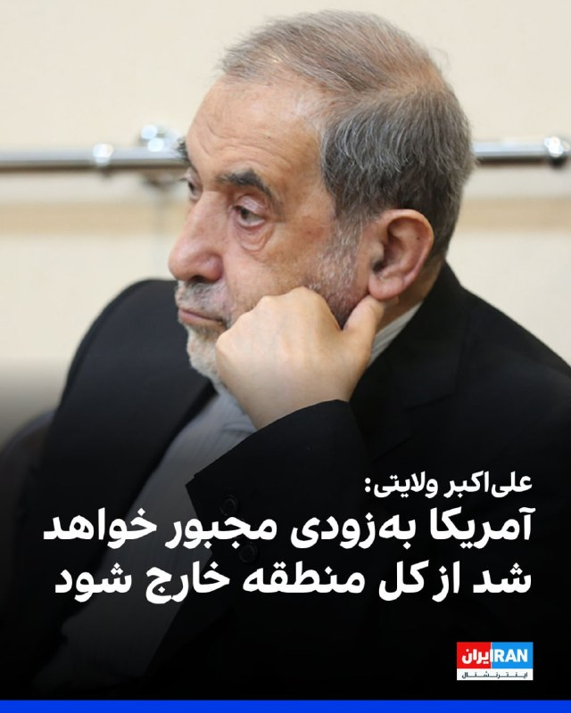

علی‌اکبر ولایتی، مشاور رهبر کشته‌شده جمهوری اسلامی، در مطلبی در روزنامه دولتی «ایران» نوشت: «آمریکا به‌زودی مجبور خواهد شد نه‌تنها از ایران، بلکه از کل منطقه خارج شود.»

او افزود: ««امپراطوری آمریکا پس از شکست این کشور در برابر جمهوری اسلامی و جبهه مقاومت و در اختیار گرفتن تنگه هرمز به دست ما، در حال سقوط است.»
iranintl
‌🏁 🇬🇧 IranintlTV

🤖 @VahidOOnLine

## VahidOOnLine — post 239267

  <a href="telegram/content/VahidOOnLine_239267_1778413092.mp4">🎬 Download video</a>

♦️مسافران اسپانیایی کشتی تفریحی «ام‌وی هوندیوس» که پس از شیوع ویروس هانتا در نزدیکی جزیره تنریف متوقف شده بود، روز یکشنبه تحت تدابیر شدید بهداشتی و امنیتی به فرودگاه تنریف جنوبی منتقل و با یک هواپیمای نظامی راهی مادرید شدند.
ویدیوهای منتشرشده نشان می‌دهد مسافران پس از پیاده شدن از کشتی، با لباس‌های محافظ ویژه و در حالی که وسایل شخصی خود را داخل کیسه‌های پلاستیکی حمل می‌کردند، سوار اتوبوس شده و سپس برای انتقال به هواپیما آماده شدند. همچنین خلبانان و عوامل پرواز نیز از لباس‌های ایزوله استفاده کرده بودند.
مقام‌های اسپانیایی اعلام کرده‌اند این مسافران در حال حاضر علائمی از ویروس هانتا ندارند، اما پس از رسیدن به مادرید به مراکز درمانی منتقل و در قرنطینه نگهداری خواهند شد. دولت اسپانیا تاکید کرده که این افراد هیچ تماسی با عموم مردم نخواهند داشت.
کشتی «ام‌وی هوندیوس» چهارشنبه گذشته سواحل کیپ‌ورد را به مقصد اسپانیا ترک کرد؛ اقدامی که پس از درخواست سازمان جهانی بهداشت و اتحادیه اروپا از دولت اسپانیا برای مدیریت تخلیه و انتقال مسافران، انجام شد.
‌🇸🇦 Indypersian

🤖 @VahidOOnLine

## VahidOOnLine — post 239266

  

♦️اسماعیل بقایی، سخنگوی وزارت امور خارجه جمهوری اسلامی روز یکشنبه در واکنش به اظهارات رافائل گروسی، مدیرکل آژانس بین‌المللی انرژی اتمی، در مورد تحولات منطقه، در پیامی در شبکه اجتماعی ایکس نوشت: «ماموریت آژانس بین‌المللی انرژی اتمی، راستی‌آزمایی است، نه ارسال پیام‌های سیاسی در مورد تنگه هرمز، یا موشک‌های ایران، یا نحوه برخورد تهران با مسائل.»
بقایی اضافه کرد: «وقتی بی‌طرفی حرفه‌ای فدای رفتارهای سیاسی یا جاه‌طلبی‌های شخصی می‌شود، اعتبار نهادها از بین می‌رود و با گذشت زمان، اثربخشی آنها نیز تضعیف می‌شود.»
‌🇸🇦 Indypersian

🤖 @VahidOOnLine

## VahidOOnLine — post 239265

  

وزارت دفاع امارات اعلام کرد سامانه‌های پدافند هوایی این کشور روز ۲۰ اردیبهشت با دو پهپاد که به گفته این وزارتخانه از ایران شلیک شده بودند، مقابله کرده‌اند.

بر اساس اطلاعیه وزارت دفاع امارات، از آغاز درگیری‌ها، سامانه‌های پدافندی این کشور با چند حمله موشکی و پهپادی مقابله کرده‌اند.
‌🏁 🇬🇧 ManotoTV

🤖 @VahidOOnLine

## VahidOOnLine — post 239264

  

ابراهیم رضایی، سخنگوی کمیسیون امنیت ملی مجلس، در شبکه ایکس نوشت: «از امروز خویشتن‌داری ما تمام شد و هر تعرضی به شناورهای ما، با پاسخ سنگین و قاطع به شناورها و پایگاه‌های آمریکایی مواجه خواهد شد.»

او خطاب به آمریکایی‌ها نوشت: «بهترین راه، تسلیم‌شدن و دادن امتیاز است. باید به نظم منطقه‌ای جدید عادت کنید.»
iranintl
‌🏁 🇬🇧 IranintlTV

🤖 @VahidOOnLine

## VahidOOnLine — post 239263

  

ایران‌اینترنشنال موفق شد در چهار بخش جوایز رسانه‌های دیجیتال خاورمیانه انجمن جهانی ناشران اخبار (WAN-IFRA) را از آن خود کند. یکی از پروژه‌های این شبکه نیز به مرحله نهایی رقابت‌های جهانی راه یافت.

براساس اعلام WAN-IFRA در رقابت‌های رسانه‌های دیجیتال خاورمیانه ۲۰۲۶، پروژه‌های ایران‌اینترنشنال شامل «مدیا بات»، کمپین «زن، زندگی، آزادی» و «نقشه تعاملی اهداف اسرائیل در جنگ ۱۲ روزه» موفق به کسب عنوان برندگان منطقه‌ای در چند بخش شدند.
کمپین «زن، زندگی، آزادی» جایزه «بهترین کمپین بازاریابی برای یک برند خبری» را دریافت کرد. داوران این بخش از تاثیرگذاری، خلاقیت و گستره مخاطبان این پروژه تقدیر کردند.
پروژه «نقشه تعاملی اهداف اسرائیل در جنگ ۱۲ روزه» برنده بخش «بهترین مصورسازی داده» در منطقه خاورمیانه شد.

«مدیا بات»، ربات تلگرامی ایران‌اینترنشنال نیز در دو بخش «نوآورانه‌ترین محصول دیجیتال» و «بهترین تعامل با مخاطب» برنده شد. این محصول با هدف تسهیل دسترسی کاربران به اخبار و محتوای چندرسانه‌ای طراحی شده است. «مدیا بات» در ادامه رقابت، به مرحله جهانی جوایز WAN-IFRA نیز راه یافته است.
‌🏁 🇬🇧 IranintlTV

🤖 @VahidOOnLine

## VahidOOnLine — post 239262

  

♦️وزارت دفاع امارات متحده عربی روز یکشنبه ۲۰ اردیبهشت اعلام کرد که سامانه‌های پدافند هوایی این کشور با موفقیت دو پهپاد پرتاب شده از «ایران» را منهدم کردند.
این وزارتخانه تاکید کرده است که از زمان ««شروع حملات آشکار ایران، پدافند هوایی امارات متحده عربی در مجموع ۵۵۱ موشک بالستیک، ۲۹ موشک کروز و ۲۲۶۵ پهپاد را منهدم کرده است.»
وزارت دفاع امارات همچنین گزارش داده است که از زمان شروع حملات آشکار ایران، تعداد کل جانباختگان نظامی به ۳ نفر رسیده و تلفات غیرنظامی هم ۱۰ نفر از ملیت‌های پاکستانی، نپالی، بنگلادشی، فلسطینی، هندی و مصری است.
وزارت دفاع امارات متحده عربی همچنین بر آمادگی کامل این کشور برای مقابله با هرگونه تهدیدی تاکید کرده و اعلام کرده است که قاطعانه با هر چیزی که قصد تضعیف امنیت کشور را داشته باشد، مقابله خواهد کرد.

در روزهای گذشته مقام‌های جمهوری اسلامی بارها امارات متحده عربی را تهدید به «برخورد قاطع نظامی» کرده‌اند.
‌🇸🇦 Indypersian

🤖 @VahidOOnLine

## VahidOOnLine — post 239261

  

همزمان با «روز مادر» که در بسیاری از کشورهای جهان در دومین یکشنبه ماه مه گرامی داشته می‌شود، تصویری از مادر مهراد صادقی، نوجوان جان‌باخته اعتراضات ۱۴۰۴، بر مزار فرزندش منتشر شده است. جهان مناسبت می‌سازد، سیاستمدارها پیام تبریک می‌دهند، و بعضی مادرها کنار سنگ قبر فرزندشان دراز می‌کشند. تمدن بشر، شاهکار تناقض.

متن خبر:

مهراد صادقی، نوجوان اصفهانی و نقاش، در جریان اعتراضات سال ۱۴۰۴ با اصابت گلوله نیروهای امنیتی از ناحیه پهلو جان باخت.

بنا بر روایت خانواده، مادر مهراد پس از بی‌پاسخ ماندن تماس‌هایش، سرانجام با فردی ناشناس روبه‌رو شد که با تلفن همراه فرزندش پاسخ داده و گفته بود: «فرزندتان تیر خورده، بیایید او را ببرید.»

خانواده می‌گویند مهراد را در حالی به خانه منتقل کردند که دیگر جان باخته بود و پیکر او به مدت دو روز در بالکن خانه نگهداری شد.

به گفته نزدیکان خانواده، پس از انتقال پیکر به باغ رضوان اصفهان، جسد برای مدتی به خانواده تحویل داده نشد و در نهایت حدود یک هفته بعد، پیکر مهراد تحویل و در همان‌جا به خاک سپرده شد.
‌🏁 🇬🇧 ManotoTV

🤖 @VahidOOnLine

## VahidOOnLine — post 239260

  

رسانه‌های جمهوری اسلامی گفته‌اند علی عبداللهی، فرمانده قرارگاه مرکزی خاتم‌الانبیا، با مجتبی خامنه‌ای دیدار کرده و گزارشی از آمادگی نیروهای مسلح، از جمله ارتش، سپاه، نیروی انتظامی، نهادهای امنیتی، مرزبانی، وزارت دفاع و بسیج ارائه داده است.

بر اساس این گزارش‌ها، عبداللهی گفته نیروهای مسلح از نظر روحیه رزمی، آمادگی دفاعی و هجومی، طرح‌های راهبردی و تجهیزات لازم برای مقابله با «دشمنان» در سطح بالایی از آمادگی قرار دارند.

این رسانه‌ها همچنین نوشتند مجتبی خامنه‌ای در این دیدار تدابیر تازه‌ای برای ادامه اقدامات و مقابله با دشمنان ابلاغ کرده است. با وجود انتشار متن این خبر، رسانه‌های جمهوری اسلامی تصویری از این دیدار منتشر نکردند.
‌🏁 🇬🇧 ManotoTV

🤖 @VahidOOnLine

## VahidOOnLine — post 239259

  

وزارت دفاع امارات متحده عربی اعلام کرد که روز یکشنبه، دو پهپاد پرتاب شده از ایران را رهگیری کرده است.

در روزهای گذشته امارات متحده عربی چندین بار هدف موشک‌ها و پهپادهای پرتاب شده از سوی جمهوری اسلامی قرار گرفت.

حملات جمهوری اسلامی به امارات متحده عربی پس از برقراری آتش‌بس، با موج محکومیت گسترده بین‌المللی مواجه شده است.
‌🏁 🇬🇧 IranintlTV

🤖 @VahidOOnLine

## VahidOOnLine — post 239258

  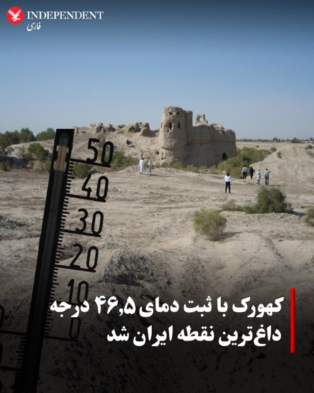

♦️مدیرکل هواشناسی سیستان و بلوچستان اعلام کرد ایستگاه تازه‌تاسیس کهورک با ثبت دمای ۴۶.۵ درجه سلسیوس، عنوان گرم‌ترین نقطه ایران را به خود اختصاص داده است.
بر اساس اعلام هواشناسی، پس از کهورک، شهرستان دلگان با دمای ۴۵ درجه سلسیوس در رتبه دوم گرم‌ترین نقاط کشور قرار گرفت. همچنین شهر زاهدان با ثبت دمای ۳۹ درجه، گرم‌ترین مرکز استان ایران در روز شنبه ١٩ اردیبهشت بود.
به گفته مسئولان هواشناسی، موج گرمای شدید در سیستان و بلوچستان باعث شده ۲۳ ایستگاه هواشناسی در سطح استان دمای بالاتر از ۴۰ درجه سلسیوس را ثبت کنند، موضوعی که نشان‌دهنده تداوم شرایط بسیار گرم و خشک در جنوب شرق کشور است.
کارشناسان هشدار داده‌اند با ادامه روند افزایش دما، احتمال تشدید تنش‌های گرمایی، افزایش مصرف آب و برق و بروز مشکلات برای گروه‌های حساس وجود دارد و شهروندان باید توصیه‌های ایمنی و بهداشتی را جدی بگیرند.
کهورک، روستایی از توابع بخش نصرت‌آباد شهرستان زاهدان در استان سیستان و بلوچستان است که براساس سرشماری سال ۱۳۸۵ مرکز آمار ایران، تنها ۷۱ نفر جمعیت در قالب ۹ خانوار داشته است.
‌🇸🇦 Indypersian

🤖 @VahidOOnLine

## VahidOOnLine — post 239257

  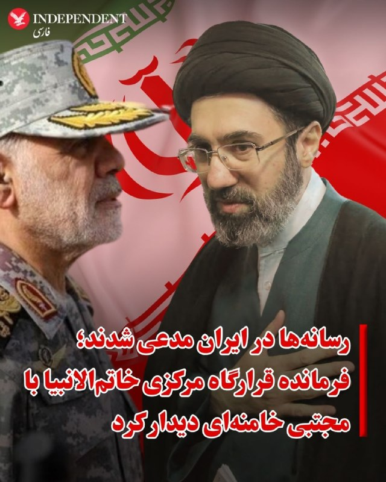

♦️رسانه‌ها در ایران روز یکشنبه ۲۰ اردیبهشت مدعی شدند که علی عبداللهی فرمانده قرارگاه مرکزی خاتم‌الانبیا با مجتبی خامنه‌ای، رهبر جدید جمهوری اسلامی دیدار کرده است.
خبرگزاری تسنیم نزدیک به سپاه پاسداران اعلام کرد که عبداللهی در این دیدار گزارشی از آمادگی‌های نیروهای مسلح ایران اعم از ارتش، سپاه، نیروهای انتظامی، امنیتی و مرزبانی، وزارت دفاع و بسیجیان ارائه کرده است.
تسنیم در این گزارش مدعی شده است که مجتبی خامنه‌ای در این دیدار «تدابیر جدید» و «راهگشایی برای تداوم اقدامات و مقابله مقتدرانه با دشمنان» به فرمانده فرمانده قرارگاه مرکزی خاتم‌الانبیا ابلاغ کرده است.
این خبر در حالی منتشر شده است که مجتبی خامنه‌ای از زمان زخمی شدن در حمله‌ ۹ اسفند که در آغاز جنگ رخ داد و به کشته شدن پدرش و چند تن از فرماندهان عالی‌رتبه جمهوری اسلامی انجامید، در انظار عمومی دیده نشده است.
وال‌استریت ژورنال روز شنبه گزارش داد غیبت مجتبی خامنه‌ای از انظار عمومی به اختلاف میان حامیان حکومت بر سر مذاکره با آمریکا دامن زده است.
‌🇸🇦 Indypersian

🤖 @VahidOOnLine

## mwarmonitor — post 8804

  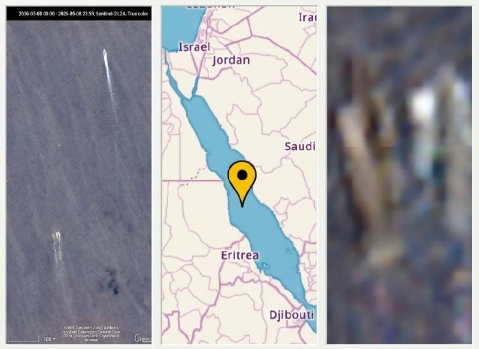

🇫🇷ناو هواپیمابر شارل دوگل (FS Charles de Gaulle)، تنها ناو هواپیمابر فرانسه، از کانال سوئز عبور کرده و در مسیر ورود به دریای سرخ قرار دارد. 🇫🇷وزارت دفاع فرانسه اعلام کرده است که گروه رزمی این ناو در منطقه جنوب دریای سرخ / خلیج عدن مستقر خواهد شد تا خود را…

## mwarmonitor — post 8803

🔴گزارش ویژه فاکس نیوز: تخلیه کشتی تفریحی به دلیل شیوع ویروس هانتا

مجری: خبر فوری فاکس نیوز؛ مسافران کشتی تفریحی که به شیوع مرگبار ویروس هانتا مرتبط شده است، پس از پهلو گرفتن در نزدیکی سواحل جزایر قناری، شبانه در حال پیاده شدن از کشتی هستند.
مجری : دست‌کم ۱۷ آمریکایی در میان کسانی هستند که در حال تخلیه می‌باشند، در حالی که مقامات برای مهار این ویروس تلاش می‌کنند. "چانلی پینتر" با جزئیات بیشتر همراه ماست. چانلی، بفرمایید.
​چانلی پینتر: سلام، صبح بخیر. بله، ۱۴۰ مسافر کشتی "ام‌وی هوندیوس" که گرفتار ویروس هانتا شده، اکنون در گروه‌هایی بر اساس ملیت و با قایق‌های کوچک (تا ظرفیت ۱۰ نفر) در حال پیاده شدن هستند.
​این اتفاق پس از آن رخ داد که کشتی تفریحی چند ساعت پیش در جزایر قناری، در نزدیکی سواحل آفریقا، پهلو گرفت. سازمان جهانی بهداشت به ساکنان جزیره اطمینان داده است که هیچ خطری برای عموم مردم وجود ندارد و مقامات بهداشتی اسپانیا می‌گویند تمام مسافران فعلاً بدون علامت هستند.
​اگرچه هیچ‌یک از مسافران فعلی تست مثبت ویروس هانتا نداشته‌اند، اما این شیوع پیش‌تر باعث مرگ سه نفر در کشتی شده و تست چندین نفر دیگر نیز مثبت اعلام شده بود. بنابراین، مسافران و خدمه باقی‌مانده پس از انجام غربالگری‌های بهداشتی در حال ترک کشتی هستند و پس از خروج، با اتوبوس برای پروازهای خود به فرودگاه منتقل خواهند شد.

@mwarmonitor

## mwarmonitor — post 8802

  <a href="telegram/content/mwarmonitor_8802_1778413100.mp4">🎬 Download video</a>

🎬 Video

## mwarmonitor — post 8801

🔴درگیری پدافند هوایی امارات با ۲ پهپاد

🇦🇪وزارت دفاع اعلام کرد که در تاریخ ۱۰ مه ۲۰۲۶، پدافند هوایی امارات با دو فروند پهپاد که از سمت ایران در حال نزدیک شدن بودند، مقابله کرده است.

🔸از زمان آغاز «تجاوزات آشکار ایران»، پدافند هوایی امارات با ۵۵۱ فروند موشک بالستیک، ۲۹ فروند موشک کروز و ۲۲۶۵ فروند پهپاد مقابله کرده است.

🔹در ساعات گذشته هیچ موردی از شهادت، جراحت یا فوت گزارش نشده است. به این ترتیب، از زمان آغاز این حملات، مجموع تلفات به دو شهید رسیده است، علاوه بر یک غیرنظامی با تابعیت مراکشی که پیمانکار نیروهای مسلح بوده و به شهادت رسیده است.

🔹همچنین مجموع کشته‌شدگان غیرنظامی به ۱۰ نفر از ملیت‌های مختلف شامل: پاکستانی، نپالی، بنگلادشی، فلسطینی، هندی و مصری رسیده است.

🔸تعداد کل مجروحان از آغاز این حملات به ۲۳۰ نفر رسیده که شامل ملیت‌های مختلفی از جمله: اماراتی، مصری، سودانی، اتیوپیایی، فیلیپینی، پاکستانی، ایرانی، هندی، بنگلادشی، سریلانکایی، آذربایجانی، یمنی، اوگاندایی، اریتره‌ای، لبنانی، افغان، بحرینی، کوموری، ترکیه‌ای، عراقی، نپالی، نیجریه‌ای، عمانی، اردنی، فلسطینی، غنایی، اندونزیایی، سوئدی، تونسی، مراکشی و روسی است.

🔹وزارت دفاع تأکید کرد که در بالاترین سطح آمادگی برای مقابله با هرگونه تهدید قرار دارد و با قاطعیت با هر اقدامی که امنیت کشور را هدف قرار دهد مقابله خواهد کرد تا حاکمیت، امنیت و ثبات کشور حفظ شده و از منافع و دارایی‌های ملی محافظت شود.

@mwarmonitor

## mwarmonitor — post 8800

  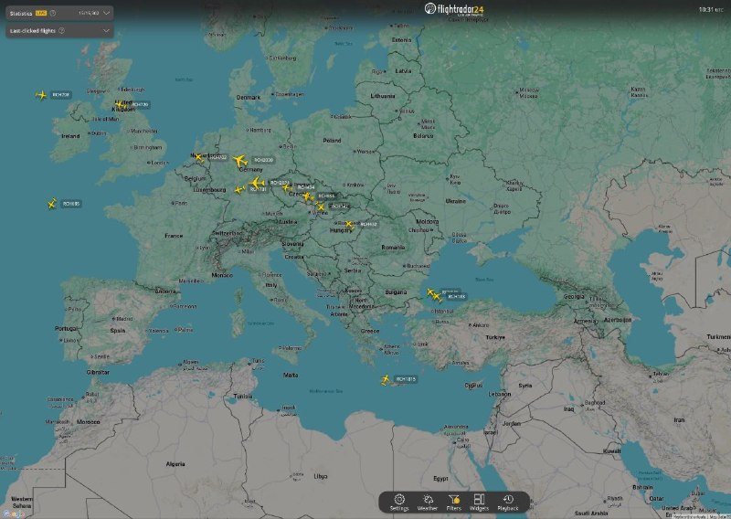

🇺🇸فرماندهی ترابری هوایی نیروی هوایی آمریکا (AMC) صبح امروز با جدیت در حال فعالیت است و ۱۳ فروند هواپیمای C-17A «گلوبمستر III» نیروی هوایی آمریکا و ۲ فروند هواپیمای C-5M «سوپر گالکسی» در آسمان اروپا و خاورمیانه در حال عملیات هستند.

@mwarmonitor

## pm_afshaa — post 90472

🔴ویتکاف و کوشنر قراره به مسکو برن

💧 Rainbet.com the #1 Non-KYC Crypto Casino & Sportsbook @rainbetcom

😁 @Pm_Afshaa

## pm_afshaa — post 90471

  <a href="telegram/content/pm_afshaa_90471_1778413102.jpg">🎬 Download video</a>

🔴وزارت دفاع امارات: امروز دوتا موشک که از سمت ایران پرتاب شده بود رو رهگیری کردیم. 
💧 Rainbet.com the #1 Non-KYC Crypto Casino & Sportsbook @rainbetcom 
😁 @Pm_Afshaa

## pm_afshaa — post 90470

سخنگوی کمیسیون امنیت ملی: از امروز خویشتن‌داری ما تمام شد

💧 Rainbet.com the #1 Non-KYC Crypto Casino & Sportsbook @rainbetcom

😁 @Pm_Afshaa

## pm_afshaa — post 90469

  <a href="telegram/content/pm_afshaa_90469_1778413102.jpg">🎬 Download video</a>

🔴تسنیم: از اونجایی که کابل‌های فیبر نوری حیاتی از کف تنگه هرمز عبور میکنه، ما باید هزینه سالانه از کمپانی‌های بزرگ بگیریم و آمازون، مایکروسافت و متا رو موظف کنیم تحت قوانین ایران کار کنن!

💧 Rainbet.com the #1 Non-KYC Crypto Casino & Sportsbook @rainbetcom

😁 @Pm_Afshaa

## pm_afshaa — post 90468

  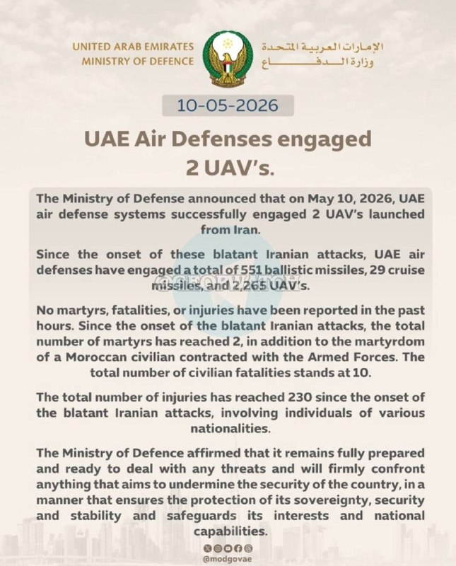

🔴وزارت دفاع امارات:
امروز دوتا موشک که از سمت ایران پرتاب شده بود رو رهگیری کردیم.

💧 Rainbet.com the #1 Non-KYC Crypto Casino & Sportsbook @rainbetcom

😁 @Pm_Afshaa

## pm_afshaa — post 90467

  <a href="telegram/content/pm_afshaa_90467_1778413104.jpg">🎬 Download video</a>

🔴کویت: بامداد امروز چند تا پهپاد متخاصم (دشمن) رو تو حریم هوایی خودمون رصد کردیم و باهاشون برخورد شد و منهدم شدن.

💧 Rainbet.com the #1 Non-KYC Crypto Casino & Sportsbook @rainbetcom

😁 @Pm_Afshaa

## pm_afshaa — post 90465

  <a href="telegram/content/pm_afshaa_90465_1778413104.jpg">🎬 Download video</a>

‏
🔴فارس: علی عبداللهی، رئیس ستاد کل نیروهای مسلح، با مجتبی خامنه‌ای دیدار کرد.

💧 Rainbet.com the #1 Non-KYC Crypto Casino & Sportsbook @rainbetcom

😁 @Pm_Afshaa

## pm_afshaa — post 90464

  <a href="telegram/content/pm_afshaa_90464_1778413104.jpg">🎬 Download video</a>

🔴پزشکیان: خاموش کردن یک چراغ مثل شلیک تیر به سمت دشمنه.

💧 Rainbet.com the #1 Non-KYC Crypto Casino & Sportsbook @rainbetcom

😁 @Pm_Afshaa

## mamlekate — post 103492

  <a href="telegram/content/mamlekate_103492_1778413105.mp4">🎬 Download video</a>

در جریان سومین ماه قطعی اینترنت در داخل ایران، یک ایرانی در خارج، تست آزمایش سرعت اینترنت خود را منتشر کرد. گفته شده این ایرانی باید سریع‌ترین اینترنت خانگی دنیا رو داشته باشه.

@mamlekate

## mamlekate — post 103491

  

توضیحی تکراری: تبلیغاتی که توی تلگرام نمایش داده میشن، بصورت اتوماتیک توسط تلگرام نمایش داده میشن. ادمین کانال‌ها، نقشی توی نمایش تبلیغات تلگرام ندارند. توی توضیحات پین کانال و چندین کوییز و هشدار سعی کردم این مساله رو آموزش بدم. اما هنوز متاسفانه قربانی داریم.

تماس با افرادی که نمی‌شناسین دو ریسک داره: یکی ریسک از دست دادن پولتون. دومین ریسک هم مربوط به اطلاعات شماست. مراقب افشای اطلاعات خودتون به این مافیاهای شیاد باشید.

مملکته ارتباطی با فروش وی‌پی‌ان، کانفیگ، استارلینک و اخیرا سیم‌کارت سفید یا هر تبلیغ عمومی یا مارکتینگ‌های دایرکتی دیگه نداشته، نداره و نخواهد داشت. درآمد مملکته از حمایت‌های مالی چند نفر از گل‌های گل کانال (حدود ۲۰۰ دلار در ماه) + گنج قناعته.

@mamlekate

## kianmeli1 — post 87322

🔴دقایقی پیش چندین پهپاد به امارات حمله کرده است
https://t.me/kianmeli1

## IranIntlTV — post 336448

  

علی‌اکبر ولایتی، مشاور رهبر کشته‌شده جمهوری اسلامی، در مطلبی در روزنامه دولتی «ایران» نوشت: «آمریکا به‌زودی مجبور خواهد شد نه‌تنها از ایران، بلکه از کل منطقه خارج شود.»

او افزود: ««امپراطوری آمریکا پس از شکست این کشور در برابر جمهوری اسلامی و جبهه مقاومت و در اختیار گرفتن تنگه هرمز به دست ما، در حال سقوط است.»
iranintl.com/202605103420

## IranIntlTV — post 336447

  

ابراهیم رضایی، سخنگوی کمیسیون امنیت ملی مجلس، در شبکه ایکس نوشت: «از امروز خویشتن‌داری ما تمام شد و هر تعرضی به شناورهای ما، با پاسخ سنگین و قاطع به شناورها و پایگاه‌های آمریکایی مواجه خواهد شد.»

او خطاب به آمریکایی‌ها نوشت: «بهترین راه، تسلیم‌شدن و دادن امتیاز است. باید به نظم منطقه‌ای جدید عادت کنید.»
iranintl.com/202605106244

## IranIntlTV — post 336446

  

ایران‌اینترنشنال موفق شد در چهار بخش جوایز رسانه‌های دیجیتال خاورمیانه انجمن جهانی ناشران اخبار (WAN-IFRA) را از آن خود کند. یکی از پروژه‌های این شبکه نیز به مرحله نهایی رقابت‌های جهانی راه یافت.

براساس اعلام WAN-IFRA در رقابت‌های رسانه‌های دیجیتال خاورمیانه ۲۰۲۶، پروژه‌های ایران‌اینترنشنال شامل «مدیا بات»، کمپین «زن، زندگی، آزادی» و «نقشه تعاملی اهداف اسرائیل در جنگ ۱۲ روزه» موفق به کسب عنوان برندگان منطقه‌ای در چند بخش شدند.
کمپین «زن، زندگی، آزادی» جایزه «بهترین کمپین بازاریابی برای یک برند خبری» را دریافت کرد. داوران این بخش از تاثیرگذاری، خلاقیت و گستره مخاطبان این پروژه تقدیر کردند.
پروژه «نقشه تعاملی اهداف اسرائیل در جنگ ۱۲ روزه» برنده بخش «بهترین مصورسازی داده» در منطقه خاورمیانه شد.

«مدیا بات»، ربات تلگرامی ایران‌اینترنشنال نیز در دو بخش «نوآورانه‌ترین محصول دیجیتال» و «بهترین تعامل با مخاطب» برنده شد. این محصول با هدف تسهیل دسترسی کاربران به اخبار و محتوای چندرسانه‌ای طراحی شده است. «مدیا بات» در ادامه رقابت، به مرحله جهانی جوایز WAN-IFRA نیز راه یافته است.
https://iranintl.com/202605092229

## IranIntlTV — post 336445

🔻هرج‌ومرج در پراگ؛ هواداران اسلاویا به زمین یورش بردند و بازی در شب قهرمانی نیمه‌تمام ماند

دربی شهر پراگ میان دو تیم فوتبال اسلاویا پراگ و اسپارتا پراگ در هفته سرنوشت‌ساز لیگ برتر جمهوری چک، به دلیل هجوم تماشاگران میزبان در دقایق پایانی بازی، نیمه‌تمام ماند. رییس باشگاه اسلاویا پراگ، ضمن عذرخواهی از تیم میهمان اعلام کرد هواداران خاطی مادام‌العمر محروم می‌شوند.

اسلاویا در این دیدار حساس صدر جدول با نتیجه ۳ بر ۲ از رقیب سنتی خود پیش بود و پیروزی می‌توانست قهرمانی را برای میزبان قطعی کند. اما در دقیقه هفتم از ۱۰ دقیقه وقت‌های تلف‌شده پایان مسابقه، بازی به هرج و مرج و اتفاقات غیرقابل‌کنترل کشیده شد.

صدها نفر از هواداران اسلاویا ناگهان وارد زمین شدند. بسیاری از آنها مشعل‌های روشن در دست داشتند و آنها را به داخل زمین پرتاب کردند. برخی نیز به سمت جایگاه هواداران تیم میهمان رفتند و مواد آتش‌بازی را به سوی آنها پرتاب کردند.

تصاویر منتشرشده نشان می‌دهد بازیکنان دو تیم با عجله به سمت تونل ورزشگاه دویدند تا به محل امن برسند.

یاکوب سوروچیک، دروازه‌بان اسپارتا پراگ، پس از آنچه گفته می‌شود برخورد با یکی از مهاجمان بود، روی زمین افتاد و بعدا هواداران میزبان را به حمله متهم کرد. او در اینستاگرام نوشت: «اینکه کسی هنگام مسابقه به سمت من بدود، روبه‌رویم تهدیدم کند و به من حمله کند، کاملا غیرقابل قبول است. این موضوع را از نظر حقوقی پیگیری خواهم کرد.»

بر اساس گزارش‌ها، ماتیاس وویتا، هم‌تیمی او، و یکی از اعضای کادر پزشکی اسپارتا نیز مورد حمله قرار گرفتند.

داور ابتدا مسابقه را متوقف کرد و سپس بازی به طور کامل لغو شد. بازیکنان اسپارتا به سرعت ورزشگاه ادن آرنا را ترک کردند.

یاروسلاو توردیک، رییس باشگاه اسلاویا پراگ، اعلام کرد هوادارانی که در دقایق پایانی دیدار برابر اسپارتا پراگ به زمین مسابقه یورش بردند، با محرومیت مادام‌العمر مواجه خواهند شد.

توردیک صبح یکشنبه در بیانیه‌ای در شبکه‌های اجتماعی از «اسپارتا پراگ، هواداران میهمان، داوران، جامعه فوتبال و همه هواداران شرافتمند اسلاویا که دیروز با قلبی شکسته ورزشگاه را ترک کردند» عذرخواهی کرد.

او گفت: «ارزش‌های اسلاویا نفرت و خشونت نیست. ما مسئولیت را می‌پذیریم و پیامدها را اجرا می‌کنیم. آنچه در پایان دربی دیروز در فورتونا آرنا رخ داد، دشوارترین لحظه در تاریخ معاصر باشگاه است. این فوتبال نیست. این اسلاویا نیست. این ننگی است که همه ما در آن سهیم هستیم.»

رییس اسلاویا اعلام کرد جایگاه شمالی ورزشگاه تا اطلاع ثانوی بسته خواهد شد و تا زمانی که عاملان شناسایی و پاسخگو نشوند، بازگشایی نخواهد شد. او افزود باشگاه با پلیس و سایر نهادهای مربوطه «حداکثر همکاری» را خواهد داشت.

به گفته او، تمامی تصاویر دوربین‌های مداربسته، نتایج ارزیابی نیروهای اجرایی و اطلاعات هویتی دارندگان بلیت و کارت فصلی جایگاه شمالی در اختیار مقامات قرار خواهد گرفت: «عاملان شناسایی‌شده طبق مقررات ورود تماشاگران، با محرومیت مادام‌العمر از ورود به فورتونا آرنا مواجه خواهند شد. اسلاویا همچنین جبران کامل خسارات، از جمله هرگونه مجازات اعمال‌شده از سوی نهادهای فوتبالی، را مطالبه خواهد کرد.»

اتحادیه لیگ فوتبال جمهوری چک هم در این‌باره اعلام کرد: «چنین رفتاری تحت هیچ شرایطی قابل تحمل نیست. فضای احساسی یا رقابت ورزشی هرگز نمی‌تواند بهانه‌ای برای چنین رفتارهایی باشد. فوتبال حرفه‌ای باید محیطی امن برای همه افراد حاضر در مسابقه و تماشاگران ورزشگاه باقی بماند.»

این نهاد افزود آماده است حداکثر همکاری را با پلیس جمهوری چک برای شناسایی افراد دخیل در حمله به بازیکنان انجام دهد و از اعمال قاطع مسیولیت علیه همه عاملان حمایت می‌کند.

اسلاویا پراگ قرار است چهارشنبه آینده در خانه به مصاف اف‌کی یابلونتس برود.

اسلاویا پراگ با ۷۷ امتیاز در صدر جدول است و اسپارتا، رقیب سنتی، با ۶۶ امتیاز در رده دوم جدول قرار دارد. این پیروزی، تثبیت‌کننده قهرمانی اسلاویا بود،‌ اما یورش هواداران، جشن قهرمانی را به تعویق انداخت.

🔗وب‌سایت ایران‌اینترنشنال
@iranintltv

## IranIntlTV — post 336444

  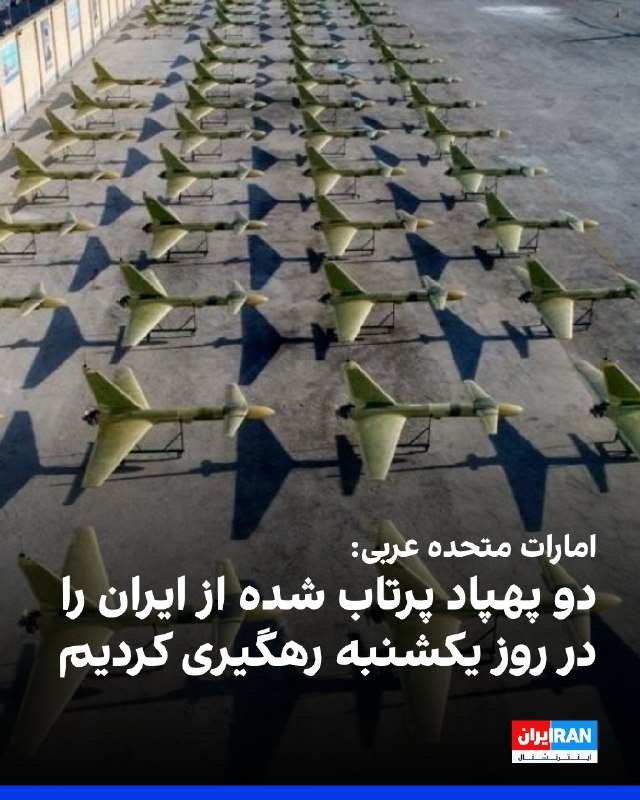

وزارت دفاع امارات متحده عربی اعلام کرد که روز یکشنبه، دو پهپاد پرتاب شده از ایران را رهگیری کرده است.

در روزهای گذشته امارات متحده عربی چندین بار هدف موشک‌ها و پهپادهای پرتاب شده از سوی جمهوری اسلامی قرار گرفت.

حملات جمهوری اسلامی به امارات متحده عربی پس از برقراری آتش‌بس، با موج محکومیت گسترده بین‌المللی مواجه شده است.
https://iranintl.com/202605100564

## IranIntlTV — post 336443

  <a href="telegram/content/IranIntlTV_336443_1778413109.mp4">🎬 Download video</a>

مروری بر روزنامه‌های ایران، یکشنبه ۲۰ اردیبهشت، با مجتبی هاشمی، روزنامه‌نگار
@iranintltv

## Shin_Persian — post 5922

  

وزارة الدفاع |MOD UAE ✓ @modgovae Sun, 10 May 2026 10:44:56 UTC UAE Air Defenses engaged 2 UAV’s. The Ministry of Defense announced that on May 10, 2026, UAE air defense systems successfully engaged 2 UAV’s launched from Iran. Since the onset of these…

## Shin_Persian — post 5921

وزارة الدفاع |MOD UAE ✓ @modgovae
Sun, 10 May 2026 10:44:56 UTC

UAE Air Defenses engaged 2 UAV’s.

The Ministry of Defense announced that on May 10, 2026, UAE air defense systems successfully engaged 2 UAV’s launched from Iran.

Since the onset of these blatant Iranian attacks, UAE air defenses have engaged a total of 551 ballistic missiles, 29 cruise missiles, and 2,265 UAV’s.

No martyrs, fatalities, or injuries have been reported in the past hours. Since the onset of the blatant Iranian attacks, the total number of martyrs has reached 2, in addition to the martyrdom of a Moroccan civilian contracted with the Armed Forces. The total number of civilian fatalities stands at 10, from Pakistani, Nepalese, Bangladeshi, Palestinian, Indian, and Egyptian nationalities.

The total number of injuries has reached 230 since the onset of the blatant Iranian attacks, involving individuals of various nationalities, including Emirati, Egyptian, Sudanese, Ethiopian, Filipino, Pakistani, Iranian, Indian, Bangladeshi, Sri Lankan, Azerbaijani, Yemeni, Ugandan, Eritrean, Lebanese, Afghan, Bahraini, Comorian, Turkish, Iraqi, Nepalese, Nigerian, Omani, Jordanian, Palestinian, Ghanaian, Indonesian, Swedish, Tunisian, Moroccan, and Russian.

The Ministry of Defence affirmed that it remains fully prepared and ready to deal with any threats and will firmly confront anything that aims to undermine the security of the country, in a manner that ensures the protection of its sovereignty, security and stability and safeguards its interests and national capabilities.

#وزارة_الدفاع
#وزارة_الدفاع_الإماراتية
#MOD
#UAEMinistryOfDefence

ترجمه فارسی در بخش نظرات

𝕏 · @shin_persian

## ManotoTV — post 105235

  <a href="telegram/content/ManotoTV_105235_1778413112.mp4">🎬 Download video</a>

گزارشگرمنوتو: «به فراخوان شاهزاده رضا پهلوی، ما ایرانیان در شهر ماربیا روز ۱۰ مه گرد هم آمدیم تا صدای مردم ایران باشیم و حمایت خود را از انقلاب شیروخورشید اعلام کنیم.»

## ManotoTV — post 105234

  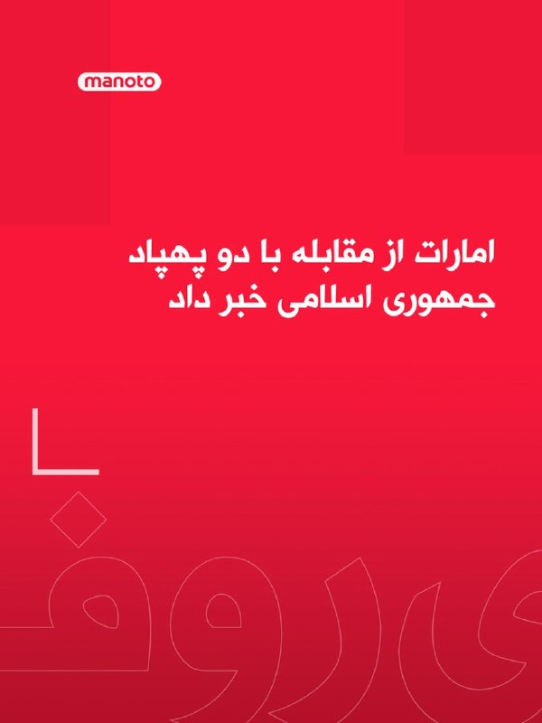

وزارت دفاع امارات اعلام کرد سامانه‌های پدافند هوایی این کشور روز ۲۰ اردیبهشت با دو پهپاد که به گفته این وزارتخانه از ایران شلیک شده بودند، مقابله کرده‌اند.

بر اساس اطلاعیه وزارت دفاع امارات، از آغاز درگیری‌ها، سامانه‌های پدافندی این کشور با چند حمله موشکی و پهپادی مقابله کرده‌اند.

## ManotoTV — post 105233

  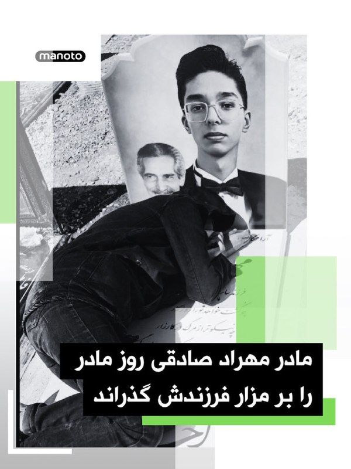

همزمان با «روز مادر» که در بسیاری از کشورهای جهان در دومین یکشنبه ماه مه گرامی داشته می‌شود، تصویری از مادر مهراد صادقی، نوجوان جان‌باخته اعتراضات ۱۴۰۴، بر مزار فرزندش منتشر شده است. جهان مناسبت می‌سازد، سیاستمدارها پیام تبریک می‌دهند، و بعضی مادرها کنار سنگ قبر فرزندشان دراز می‌کشند. تمدن بشر، شاهکار تناقض.

متن خبر:

مهراد صادقی، نوجوان اصفهانی و نقاش، در جریان اعتراضات سال ۱۴۰۴ با اصابت گلوله نیروهای امنیتی از ناحیه پهلو جان باخت.

بنا بر روایت خانواده، مادر مهراد پس از بی‌پاسخ ماندن تماس‌هایش، سرانجام با فردی ناشناس روبه‌رو شد که با تلفن همراه فرزندش پاسخ داده و گفته بود: «فرزندتان تیر خورده، بیایید او را ببرید.»

خانواده می‌گویند مهراد را در حالی به خانه منتقل کردند که دیگر جان باخته بود و پیکر او به مدت دو روز در بالکن خانه نگهداری شد.

به گفته نزدیکان خانواده، پس از انتقال پیکر به باغ رضوان اصفهان، جسد برای مدتی به خانواده تحویل داده نشد و در نهایت حدود یک هفته بعد، پیکر مهراد تحویل و در همان‌جا به خاک سپرده شد.

## ManotoTV — post 105232

  <a href="telegram/content/ManotoTV_105232_1778413114.mp4">🎬 Download video</a>

گزارشگرمنوتو: «گردهمایی و راهپیمایی امروز ملبورن در پاسخ به فراخوان شاهزاده رضا پهلوی

تا زمان آزادی پا پس نمی‌کشیم و صدای ایران خواهیم بود.»

شماری از ایرانیان ساکن ملبورن امروز با حضور در این گردهمایی، حمایت خود را از انقلاب شیروخورشید و مردم داخل ایران اعلام کردند.

فراخوان این تجمع با محوریت اعتراض به «خاموشی سراسری اینترنت»، «اعدام‌های بی‌وقفه» و حمایت از زندانیان سیاسی منتشر شده بود.

## ManotoTV — post 105231

  

رسانه‌های جمهوری اسلامی گفته‌اند علی عبداللهی، فرمانده قرارگاه مرکزی خاتم‌الانبیا، با مجتبی خامنه‌ای دیدار کرده و گزارشی از آمادگی نیروهای مسلح، از جمله ارتش، سپاه، نیروی انتظامی، نهادهای امنیتی، مرزبانی، وزارت دفاع و بسیج ارائه داده است.

بر اساس این گزارش‌ها، عبداللهی گفته نیروهای مسلح از نظر روحیه رزمی، آمادگی دفاعی و هجومی، طرح‌های راهبردی و تجهیزات لازم برای مقابله با «دشمنان» در سطح بالایی از آمادگی قرار دارند.

این رسانه‌ها همچنین نوشتند مجتبی خامنه‌ای در این دیدار تدابیر تازه‌ای برای ادامه اقدامات و مقابله با دشمنان ابلاغ کرده است. با وجود انتشار متن این خبر، رسانه‌های جمهوری اسلامی تصویری از این دیدار منتشر نکردند.

## FarsiVOA — post 217336

🔺انفجار بمب انتحاری جان دست کم ۱۵ پلیس پاکستان را گرفت

▪️انفجار بمب انتحاری در پاسگاه پلیس «فاتح خیل» ایالت خیبر پختونخوا پاکستان منجر به کشته شدن دست کم ۱۵ پلیس شد.

▪️فرمانده منطقه‌ای پلیس شهر «بنو» در مرز با افغانستان روز یکشنبه اعلام کرد که «تروریست‌ها با هدایت یک خودروی مملو از مواد منفجره به این پاسگاه، حمله را ترتیب دادند.»

▪️شدت انفجار خودرو مملو از مواد منفجره به حدی بوده که نه تنها پاسگاه پلیس کلاً ویران شده، بلکه ساختمان‌های اطراف نیز آسیب جدی دیده است.

⬇️ بیشتر بخوانید:
https://ir.voanews.com/a/8148466.html

## FarsiVOA — post 217335

  

وزارت دفاع امارات متحده عربی اعلام کرد پدافند هوایی این کشور روز یکشنبه با دو پهپاد منتسب به جمهوری اسلامی مقابله کرده است.

بر اساس آمار منتشرشده از سوی وزارت دفاع امارات، حملات منتسب به جمهوری اسلامی از آغاز درگیری‌ها تاکنون به دوهزار و ۲۶۵ پهپاد، ۲۹ موشک کروز و ۵۵۱ موشک بالستیک رسیده است.

این اعلامیه در حالی منتشر شده که آتش‌بس میان آمریکا و جمهوری اسلامی همچنان شکننده توصیف می‌شود و کویت نیز از شناسایی پهپادهای «متخاصم» در حریم هوایی خود خبر داده بود.

امارات در روزهای گذشته نیز از مقابله با حملات موشکی و پهپادی منتسب به جمهوری اسلامی خبر داده بود؛ حملاتی که تهران دست‌کم بخشی از آن‌ها را رد کرده است.
@FarsiVOA

## FarsiVOA — post 217334

  <a href="telegram/content/FarsiVOA_217334_1778413116.mp4">🎬 Download video</a>

ارتش اسرائیل اعلام کرد نیروهای تیپ کفیر، تحت فرماندهی لشکر غزه، در ادامه عملیات پاکسازی در محدوده اردوگاه‌های مرکزی نوار غزه، در شرق خط زرد، دو مسیر زیرزمینی را منهدم کردند.

بر اساس اعلام ارتش اسرائیل، این دو مسیر تونلی در مجموع حدود دو کیلومتر طول داشتند و در جریان عملیات، چند اتاق اقامت و مقادیر مختلفی سلاح در داخل آنها شناسایی شد.

ارتش اسرائیل همچنین اعلام کرد نیروهایش در جریان جست‌وجوهای میدانی در این منطقه، ده‌ها راکت و مواد انفجاری را نیز کشف کرده‌اند.

طبق بیانیه ارتش اسرائیل، نیروهای فرماندهی جنوب همچنان بر اساس چارچوب توافق آتش‌بس در منطقه مستقر هستند و به عملیات برای رفع هرگونه تهدید فوری ادامه خواهند داد.
@FarsiVOA

## FarsiVOA — post 217333

  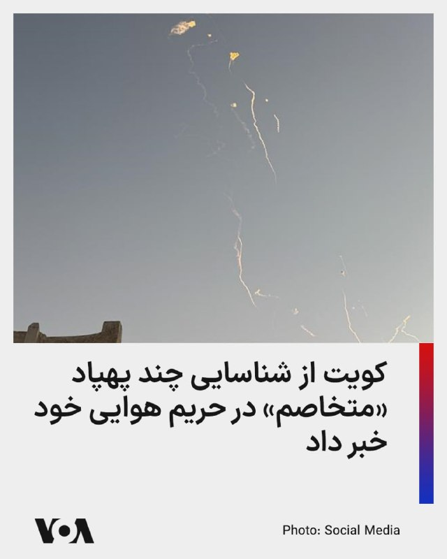

ارتش کویت اعلام کرد بامداد یکشنبه چند پهپاد «متخاصم» را در حریم هوایی این کشور شناسایی و با آن‌ها مقابله کرده است. رویترز نوشته این نخستین حادثه از این نوع در کویت از زمان اجرای آتش‌بس جنگ با جمهوری اسلامی است. به گزارش رویترز، ارتش کویت جزئیات بیشتری درباره منشأ این پهپادها یا خسارت احتمالی منتشر نکرده است.

این حادثه در حالی رخ می‌دهد که آتش‌بس میان آمریکا و جمهوری اسلامی از ابتدا شکننده بوده است. رویترز در هشتم آوریل نوشته بود با وجود توافق دو هفته‌ای آتش‌بس، در همان روز نخست همچنان درگیری‌هایی جریان داشت و کشورهای حاشیه خلیج فارس، از جمله کویت، بحرین و امارات، از حملات موشکی و پهپادی گزارش داده بودند.

کویت پیش‌تر نیز گفته بود پدافند هوایی این کشور در جریان جنگ با موشک‌ها و پهپادهای جمهوری اسلامی مقابله کرده؛ از جمله موجی از پهپادها در هشتم آوریل که به گفته رویترز زیرساخت‌های حیاتی را هدف گرفته بود.

در روزهای اخیر نیز امارات متحده عربی از مقابله پدافند هوایی خود با دو موشک بالستیک و سه پهپاد جمهوری اسلامی خبر داده بود؛ حملاتی که به نوشته رویترز سه زخمی بر جا گذاشت.
@FarsiVOA

## FarsiVOA — post 217332

  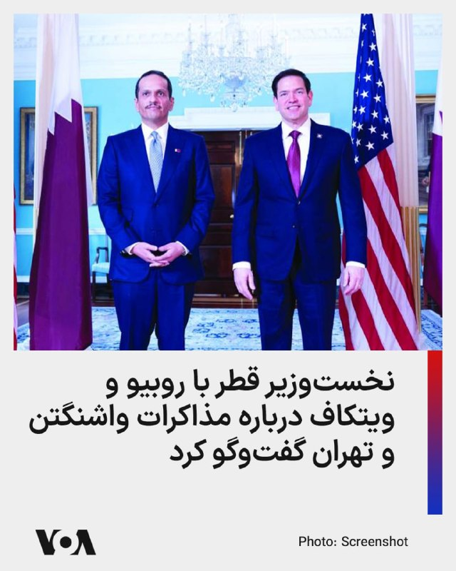

وزارت خارجه قطر اعلام کرد محمد بن عبدالرحمن آل‌ثانی، نخست‌وزیر و وزیر خارجه قطر، در دیداری در میامی با مارکو روبیو، وزیر خارجه آمریکا، و استیو ویتکاف، فرستاده ویژه دولت ترامپ، درباره تلاش‌های میانجی‌گرانه برای رسیدن به توافق میان واشنگتن و تهران گفت‌وگو کرده است.

به گفته وزارت خارجه قطر، در این دیدار آخرین تحولات منطقه و میانجی‌گری پاکستان برای کاهش تنش و تقویت امنیت و ثبات منطقه بررسی شد.

نخست‌وزیر قطر تأکید کرده همه طرف‌ها باید به تلاش‌های جاری میانجی‌گری پاسخ دهند تا مسیر برای رسیدگی به ریشه‌های بحران از راه گفت‌وگو و ابزارهای مسالمت‌آمیز باز شود.

تایمز اسرائیل نیز نوشته قطر در پشت صحنه به‌عنوان کانال ارتباطی میان واشنگتن و تهران عمل می‌کند، در حالی که پاکستان نقش اصلی میانجی‌گری را بر عهده دارد. این تلاش‌ها همزمان با مذاکرات درباره چارچوبی برای پایان جنگ و توافق گسترده‌تر میان آمریکا و ایران ادامه دارد.
@FarsiVOA

## DW_Farsi — post 124517

  

🔸عاصم منیر: پاکستان به تلاش‌های میانجی‌گرانه بین ایران و آمریکا ادامه می‌دهد

عاصم منیر، فرمانده ارتش پاکستان، روز یکشنبه اظهار داشت، اسلام‌آباد به تلاش‌های میانجی‌گرانه خود میان تهران و واشنگتن ادامه خواهد داد.

او در جریان یک سخنرانی به مناسبت اولین سالگرد جنگ سه‌‌روزه میان پاکستان و هند گفت: «ما تمام تلاش خود را برای موفقیت این میانجی‌گری به کار خواهیم گرفت و به این کار ادامه خواهیم داد.»

عاصم منیر که گفته می‌شود روابط دوستانه‌ای با دونالد ترامپ، رئیس جمهور آمریکا دارد، تأکید کرد پاکستان در تلاش است به صلحی پایدار در جنگ آمریکا و اسرائیل علیه ایران که بخش بزرگی از منطقه را درگیر کرده، دست یابد.

در همین حال پاکستان و قطر با انتشار بیانیه‌هایی از گفت‌وگوی تلفنی میان نخست‌وزیر قطر و نخست‌وزیر پاکستان خبر دادند. در این بیانیه گفته شده است که دو طرف درباره آخرین تحولات منطقه و همچنین تلاش‌های میانجی‌گرانه پاکستان رایزنی کرده‌اند.

@dw_farsi

## DW_Farsi — post 124516

🔸جنگ ایران؛ ساخت "پایگاهی مخفی" توسط اسرائیل در صحرای عراق

به نوشته روزنامه وال‌استریت ژورنال، اسرائیل پیش از آغاز جنگ با ایران در نهم اسفند ۱۴۰۴، یک پایگاه نظامی مخفی در بیابان غربی عراق ساخته بود؛ پایگاهی که به عنوان مرکز لجستیکی برای نیروی هوایی اسرائیل و محل استقرار نیروهای ویژه و تیم‌های تجسس و نجات عمل می‌کرد.

این روزنامه آمریکایی در گزارشی که شنبه ۹ مه (۱۹ اردیبهشت) منتشر شد، به نقل از منابع آگاه، از جمله مقام‌های آمریکایی، نوشت که این پایگاه اندکی پیش از آغاز عملیات "غرش شیران" ساخته شده؛ عملیاتی که با مشارکت آمریکا و اسرائیل علیه ایران آغاز شد.

بر اساس این گزارش، هدف از ایجاد این پایگاه، نزدیکتر کردن اسرائیل به میدان نبرد و فراهم کردن امکان واکنش سریع در صورت سرنگونی احتمالی خلبانان اسرائیلی بر فراز خاک ایران یا دیگر مناطق بوده است. به گفته این منابع، نیروهای ویژه نیروی هوایی اسرائیل که برای عملیات کماندویی در خاک دشمن آموزش دیده‌اند، در این پایگاه حضور داشته‌اند.

وال‌استریت ژورنال همچنین گزارش داده است که گرچه هیچ جنگنده اسرائیلی در جریان این جنگ سرنگون نشد، اما هنگام سقوط یک جنگنده اف-۱۵ آمریکایی در نزدیکی اصفهان، اسرائیل پیشنهاد کمک برای عملیات نجات را مطرح کرده بود؛ هرچند در نهایت نیروهای آمریکایی خود خدمه این هواپیما را نجات دادند.

به نوشته این روزنامه، محل این پایگاه مخفی نزدیک بود در اوایل ماه مارس گذشته فاش شود. رسانه‌های عراقی در آن زمان گزارش داده بودند که یک چوپان محلی فعالیت‌های غیرعادی، از جمله پرواز بالگردها و تیراندازی، را در منطقه‌ای دورافتاده مشاهده کرده و موضوع را به نیروهای امنیتی اطلاع داده است.

در پی این گزارش، نیروهای عراقی برای بررسی به منطقه اعزام شده‌اند. اما به گفته منابعی که وال‌استریت ژورنال با آنها گفت‌وگو کرده، اسرائیل برای جلوگیری از نزدیک شدن نیروهای عراقی، حملاتی هوایی علیه آنان انجام داده است.

@dw_farsi

## Persian_Trend_Official — post 13820

🔴ادعای دفاع هوایی امارات در مقابل دو پهپاد

💢دفاع هوایی امارات متحده عربی اعلام کرد دو موشک ورودی که گفته می‌شود از سمت ایران شلیک شده بودند را رهگیری و منهدم کرده است.

🫆:Tony

📌 @persian_trend_official
پرشین ترند | متفاوت‌ترین کانال نظامی

## Persian_Trend_Official — post 13819

  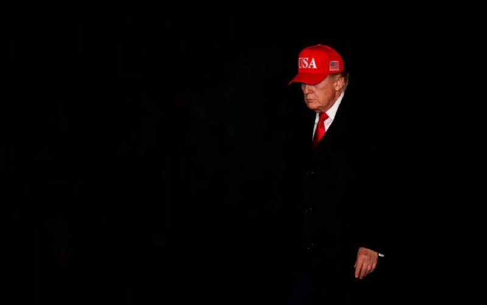

🔴 ترامپ و شکاف در روابط آمریکا با متحدان؛ پیامدهای جنگ ایران

💢یک گزارش تازه رویترز نشان می‌دهد تنش‌های دونالد ترامپ با متحدان سنتی آمریکا، حالا فراتر از یک اختلاف سیاسی معمول رفته و در حال تبدیل شدن به یک تغییر ساختاری در روابط بین‌الملل است.

💢براساس این گزارش، تصمیم‌هایی مثل کاهش بخشی از نیروهای آمریکا در آلمان، احتمال کاهش حضور نظامی در دیگر کشورهای اروپایی و همچنین مواضع مبهم در قبال حملات منطقه‌ای، باعث شده اعتماد متحدان واشنگتن به شدت آسیب ببیند.

▪️اروپا، خاورمیانه و شرق آسیا حالا با یک نگرانی مشترک روبه‌رو هستند:
آیا آمریکا در یک بحران واقعی همچنان قابل اتکا خواهد بود؟

💢در اروپا، برخی کشورها به سمت افزایش همکاری‌های نظامی مستقل و کاهش وابستگی به آمریکا حرکت کرده‌اند. در آسیا هم کشورهایی مثل ژاپن و کره جنوبی نسبت به میزان تعهد واشنگتن در صورت درگیری احتمالی با چین، دچار تردید شده‌اند.

💢در مقابل، چین و روسیه این وضعیت را یک فرصت می‌بینند تا نفوذ خود را در مناطق مختلف افزایش دهند.

🫆:Tony
📌 @persian_trend_official
پرشین ترند | متفاوت‌ترین کانال نظامی

## Persian_Trend_Official — post 13818

  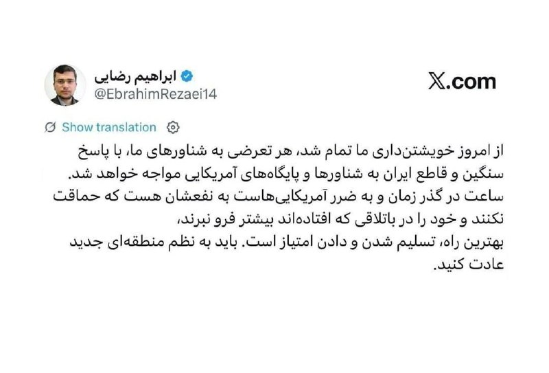

💢 سخنگوی کمیسیون امنیت ملی: از امروز خویشتن‌داری ما تمام شد

▪️هرتعرضی به شناورهای ما،با پاسخ سنگین و قاطع به شناور ها و پایگاه های آمریکایی مواجه خواهد شد

🫆:Tony

📌 @persian_trend_official
پرشین ترند | متفاوت‌ترین کانال نظامی

## Persian_Trend_Official — post 13817

  <a href="telegram/content/Persian_Trend_Official_13817_1778413121.mp4">🎬 Download video</a>

🔴 دود غلیظ بر فراز اربیل پس از حمله پهپادی به مقر گروه‌های مخالف جمهوری اسلامی

💢منابع محلی از برخاستن ستون‌های دود از اطراف شهر اربیل در شمال عراق خبر می‌دهند؛ پس از آنکه یک پهپاد مواضع گروه‌های کرد مخالف جمهوری اسلامی را هدف قرار داد/نایا

▪️تاکنون جزئیاتی درباره تلفات یا خسارات احتمالی منتشر نشده است.

🫆:Tony

📌 @persian_trend_official
پرشین ترند | متفاوت‌ترین کانال نظامی

## Persian_Trend_Official — post 13816

💢خبرگزاری صداوسیمای جمهوری اسلامی گزارش داد «علی عبداللهی» از فرماندهان ارشد نظامی ایران با «مجتبی خامنه‌ای» دیدار کرده است.

▪️بر اساس این گزارش:

💢 مجتبی خامنه‌ای در این دیدار از نیروهای مسلح تقدیر کرده

💢 او همچنین از «اقدامات جدید و مسیر ادامه اقدامات برای مقابله قدرتمندانه با دشمنان» سخن گفته است

💢 جزئیات بیشتری درباره ماهیت این اقدامات منتشر نشده است

از زمان انتصاب مجتبی خامنه‌ای در ماه مارس، تاکنون هیچ حضور عمومی یا تصویر رسمی جدیدی از او منتشر نشده و پیام‌هایش معمولاً از طریق رسانه‌های حکومتی قرائت می‌شود

🫆:Tony

📌 @persian_trend_official
پرشین ترند | متفاوت‌ترین کانال نظامی

## RadioFarda — post 157028

  

🔸در روزی که گزارش‌های تأییدنشده حاکی از آن است که ایران قرار است به پیشنهاد آمریکا برای پایان جنگ پاسخ بدهد، سخنگوی کمیسیون امنیت ملی مجلس شورای اسلامی خطاب به آمریکا می‌گوید که «از امروز خویشتن‌داری ما تمام شد».

🔸ابراهیم رضایی در پیام خود در شبکه ایکس همچنین نوشته است:‌ «بهترین راه، تسلیم‌ شدن و دادن امتیاز است. باید به نظم منطقه‌ای جدید عادت کنید.»

🔸این نماینده اصولگرای مجلس همچنین هشدار داد: «هر تعرضی به شناورهای ما، با پاسخ سنگین و قاطع ایران به شناورها و پایگاه‌های آمریکایی مواجه خواهد شد.»

🔸رضایی همچنین نوشته است: «ساعت در گذر زمان و به ضرر آمریکایی‌هاست، به نفعشان هست که حماقت نکنند و خود را در باتلاقی که افتاده‌اند بیشتر فرو نبرند.»

🔸حکومت ایران قرار بود در روز جمعه به پیشنهاد تازه دولت دونالد ترامپ پاسخ بدهد،‌ اما تا این ساعت از روز یک‌شنبه هنوز خبری در این باره منتشر نشده است.

🔸همزمان برخی منابع نزدیک به حکومت در شبکه‌های اجتماعی نوشته‌اند که این پاسخ روز یک‌شنبه ارسال خواهد شد.

🔸رادیوفردا قادر به تأیید این اخبار نیست.

@RadioFarda

## RadioFarda — post 157027

🔸 در مراسم آغاز به کار «پیتر مجیار» به‌عنوان نخست‌وزیر جدید مجارستان، «ژولت هگدوش» سیاستمدار شناخته‌شده مجارستانی بار دیگر با اجرای رقص معروف خود روی پله‌های پارلمان، توجه رسانه‌ها و حاضران را به خود جلب کرد. 🔸 هگدوش که پس از پیروزی انتخاباتی حزب مخالف «تیسا»…

## RadioFarda — post 157026

🔸 در مراسم آغاز به کار «پیتر مجیار» به‌عنوان نخست‌وزیر جدید مجارستان، «ژولت هگدوش» سیاستمدار شناخته‌شده مجارستانی بار دیگر با اجرای رقص معروف خود روی پله‌های پارلمان، توجه رسانه‌ها و حاضران را به خود جلب کرد.

🔸 هگدوش که پس از پیروزی انتخاباتی حزب مخالف «تیسا» در ۱۲ آوریل و انتشار ویدئوی رقص پرشور او در فضای مجازی به شهرت رسیده بود، این بار نیز مقابل جمعیتی که در میدان پارلمان بوداپست گرد آمده بودند، حرکات نمایشی و «گیتار خیالی» اجرا کرد.

🔸 همزمان اعضای جدید پارلمان و حاضران او را تشویق می‌کردند و بسیاری با تلفن‌های همراه خود از این صحنه فیلم می‌گرفتند.

@RadioFarda

## IranianMinds — post 19875

  <a href="telegram/content/IranianMinds_19875_1778413122.mp4">🎬 Download video</a>

🔴نمونه‌ای از کلاهبرداری‌ها و دزدی‌های آخوندهای کثیف.
اگر می‌خواهید در بهشت جواب بگیرید، در این دنیا باید به ازای هر متر زمین ۱۷۰۰ دلار بهمون پول بدید، سند هم به اسم خودتون زده میشه.

@IranianMinds

## IranianMinds — post 19874

  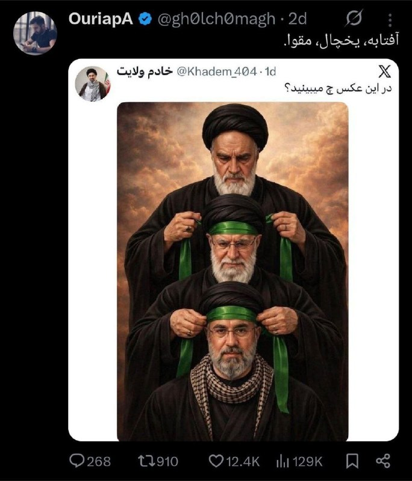

🔴در این عکس چه می‌بینید؟

آفتابه، یخچال، مقوا.

@IranianMinds

## BBCPersian — post 280648

  

🔻رسانه‌های ایران می‌گویند سرلشگر علی عبداللهی، فرمانده قرارگاه مرکزی خاتم‌الانبیا، با مجتبی خامنه‌ای، رهبر جمهوری اسلامی، دیدار کرده است.

این رسانه‌ها بدون انتشار هیچ عکس یا تصویری نوشته‌اند که فرمانده قرارگاه خاتم «گزارشی از آمادگی‌های نیروهای مسلح جمهوری اسلامی ایران اعم از ارتش جمهوری اسلامی، سپاه پاسداران انقلاب اسلامی، نیروهای انتظامی امنیتی و مرزبانی کشور، وزارت دفاع و بسیجیان» را به آقای خامنه‌ای داده است.

بنابر گزارش‌ها رهبر جمهوری اسلامی از نیروهای مسلح در جنگ آمریکا و اسرائیل با ایران «قدردانی» کرده است.
مسعود پزشکیان، رئیس‌جمهور ایران، ۱۷ اردیبهشت «دو ساعت و نیم» دیدار با رهبر جمهوری اسلامی خبر داد اما به زمان این دیدار اشاره نکرد.

از زمان حمله آمریکا و اسرائیل به بیت رهبری،‌ صدا یا تصویری از مجتبی خامنه‌ای منتشر نشده است و رسانه‌های ایران فقط پیام‌های مکتوب از طرف او منتشر کرده‌اند.

📸GettyImages/ ISNA

https://bbc.in/4df4GfU
@BBCPersian

## BBCPersian — post 280647

  <a href="telegram/content/BBCPersian_280647_1778413125.mp4">🎬 Download video</a>

این صحنه‌ای است که بی‌بی‌سی به اشتباه به جای گای کوینی، روزنامه‌نگار حوزه فناوری، با گای گوما، که برای یک مصاحبه شغلی آمده بود، به صورت زنده مصاحبه کرد.

۲۰ سال پیش، در تاریخ ۸ مه ۲۰۰۶، گوما برای مصاحبه‌ای به بی‌بی‌سی دعوت شد. اما در پذیرش، او را با کوینی اشتباه گرفتند و از یک برنامه زنده از کانال خبری بی‌بی‌سی سردرآورد. گوما در این موقعیت عجیب جا نزد و با وجود اینکه از موضوع خبر نداشت، به سوالات مجری پاسخ داد. او شغلی را که تقاضا کرده بود، نگرفت.

@BBCPersian
https://bbc.in/48RTMeY

## Dirty_Kids — post 389220

  <a href="telegram/content/Dirty_Kids_389220_1778413126.mp4">🎬 Download video</a>

متین ستوده:
همه دنیا می‌داند ترامپ دیوانه است.

حالا ببین شما کی هستید که دنیا دست به دامن اون دیوونه شده که شما رو نابود کنه!

اینها واقعا مارو کسخل فرض کردن؟ خب کسکش خونشور کیان پیرفلک و ۴۰هزار جوون ۱۸ و ۱۹دی رو جمهوری اسلامی کشت. برای کی گریه کردی پلشت؟

از قاتل حمایت میکنن، بعد برای قربانی گریه میکنن

@Dirty_Kids 👻

## Dirty_Kids — post 389219

  

شاید این وسط براتون سوال باشه نظر مراجع در مورد خوردن شیر همسر چیه؟

خامنه ای، مکارم، وحید خراسانی، نوری همدانی: جایز است و مشکل نداره✅
سیستانی: خورده نشه بهتره❌

+ یکی از علما هم گفته من خوردم خوشمزه نبوده، نخورین بهتره :))

@Dirty_Kids 👻

## Dirty_Kids — post 389214

عکسای جدید بانو بیلی آیلیش که خیلی تو ایکس وایرال شده

@Dirty_Kids 👻

## Dirty_Kids — post 389213

‏فکر کن یه عالمه درس بخونی که بری خارج یه عالمه درس بخونی.

@Dirty_Kids 👻

## Hranews — post 112861

  

بلاتکلیفی زهرا موسوی در زندان وکیل‌آباد مشهد ادامه دارد

❗️
❗️
❗️
❗️
❗️ – زهرا موسوی، شهروند ۲۱ ساله و سرپرست خانواده، بیش از سه ماه است که در زندان وکیل‌آباد مشهد در بازداشت به‌سر می‌برد. خانم موسوی همچنان در بند آرامش این زندان بلاتکلیف است و رسیدگی قضایی موثری به پرونده وی صورت نگرفته است.

به گزارش خبرگزاری هرانا، ارگان خبری مجموعه فعالان حقوق بشر در ایران، بلاتکلیفی زهرا موسوی در زندان وکیل‌آباد مشهد ادامه دارد.

بر اساس اطلاعات دریافتی هرانا، زهرا موسوی اوایل بهمن‌ماه ۱۴۰۴ در جریان اعتراضات سراسری بازداشت شده است. اتهامات مطرح‌ شده علیه وی شامل «حضور در اعتراضات، ایجاد گروه، آموزش و ساخت و استفاده از کوکتل مولوتوف و ترغیب افراد به برهم زدن نظم و امنیت ملی» عنوان شده است.
یک منبع مطلع از وضعیت این زندانی، در تماس با هرانا گفت: «خانم موسوی که پیش از بازداشت به عنوان صندوق‌دار در یک رستوران در شهرستان فریمان مشغول به کار بود، تابعیت ایرانی و افغانستانی دارد. او متولد ایران است، اما در پی تشکیل این پرونده، شناسنامه ایرانی‌اش سلب شده و با تهدید به تبعید نیز مواجه شده است.»

ادامه مطلب

#زهرا_موسوی

↘️
@hranews_bot تماس ✉️ -  @Hranews  کانال هرانا 🆑

## manototv — post 105235

  <a href="telegram/content/manototv_105235_1778413128.mp4">🎬 Download video</a>

گزارشگرمنوتو: «به فراخوان شاهزاده رضا پهلوی، ما ایرانیان در شهر ماربیا روز ۱۰ مه گرد هم آمدیم تا صدای مردم ایران باشیم و حمایت خود را از انقلاب شیروخورشید اعلام کنیم.»

## manototv — post 105234

  

وزارت دفاع امارات اعلام کرد سامانه‌های پدافند هوایی این کشور روز ۲۰ اردیبهشت با دو پهپاد که به گفته این وزارتخانه از ایران شلیک شده بودند، مقابله کرده‌اند.

بر اساس اطلاعیه وزارت دفاع امارات، از آغاز درگیری‌ها، سامانه‌های پدافندی این کشور با چند حمله موشکی و پهپادی مقابله کرده‌اند.

## manototv — post 105233

  

همزمان با «روز مادر» که در بسیاری از کشورهای جهان در دومین یکشنبه ماه مه گرامی داشته می‌شود، تصویری از مادر مهراد صادقی، نوجوان جان‌باخته اعتراضات ۱۴۰۴، بر مزار فرزندش منتشر شده است. جهان مناسبت می‌سازد، سیاستمدارها پیام تبریک می‌دهند، و بعضی مادرها کنار سنگ قبر فرزندشان دراز می‌کشند. تمدن بشر، شاهکار تناقض.

متن خبر:

مهراد صادقی، نوجوان اصفهانی و نقاش، در جریان اعتراضات سال ۱۴۰۴ با اصابت گلوله نیروهای امنیتی از ناحیه پهلو جان باخت.

بنا بر روایت خانواده، مادر مهراد پس از بی‌پاسخ ماندن تماس‌هایش، سرانجام با فردی ناشناس روبه‌رو شد که با تلفن همراه فرزندش پاسخ داده و گفته بود: «فرزندتان تیر خورده، بیایید او را ببرید.»

خانواده می‌گویند مهراد را در حالی به خانه منتقل کردند که دیگر جان باخته بود و پیکر او به مدت دو روز در بالکن خانه نگهداری شد.

به گفته نزدیکان خانواده، پس از انتقال پیکر به باغ رضوان اصفهان، جسد برای مدتی به خانواده تحویل داده نشد و در نهایت حدود یک هفته بعد، پیکر مهراد تحویل و در همان‌جا به خاک سپرده شد.

## manototv — post 105232

  <a href="telegram/content/manototv_105232_1778413130.mp4">🎬 Download video</a>

گزارشگرمنوتو: «گردهمایی و راهپیمایی امروز ملبورن در پاسخ به فراخوان شاهزاده رضا پهلوی

تا زمان آزادی پا پس نمی‌کشیم و صدای ایران خواهیم بود.»

شماری از ایرانیان ساکن ملبورن امروز با حضور در این گردهمایی، حمایت خود را از انقلاب شیروخورشید و مردم داخل ایران اعلام کردند.

فراخوان این تجمع با محوریت اعتراض به «خاموشی سراسری اینترنت»، «اعدام‌های بی‌وقفه» و حمایت از زندانیان سیاسی منتشر شده بود.

## manototv — post 105231

  

رسانه‌های جمهوری اسلامی گفته‌اند علی عبداللهی، فرمانده قرارگاه مرکزی خاتم‌الانبیا، با مجتبی خامنه‌ای دیدار کرده و گزارشی از آمادگی نیروهای مسلح، از جمله ارتش، سپاه، نیروی انتظامی، نهادهای امنیتی، مرزبانی، وزارت دفاع و بسیج ارائه داده است.

بر اساس این گزارش‌ها، عبداللهی گفته نیروهای مسلح از نظر روحیه رزمی، آمادگی دفاعی و هجومی، طرح‌های راهبردی و تجهیزات لازم برای مقابله با «دشمنان» در سطح بالایی از آمادگی قرار دارند.

این رسانه‌ها همچنین نوشتند مجتبی خامنه‌ای در این دیدار تدابیر تازه‌ای برای ادامه اقدامات و مقابله با دشمنان ابلاغ کرده است. با وجود انتشار متن این خبر، رسانه‌های جمهوری اسلامی تصویری از این دیدار منتشر نکردند.

## alonews — post 119047

  <a href="telegram/content/alonews_119047_1778413132.jpg">🎬 Download video</a>

👈ایران نیوانس: پاسخ ایران به آمریکا احتمالاً امروز ارسال شود.

✅ @AloNews خبر جنگ

## alonews — post 119046

  <a href="telegram/content/alonews_119046_1778413132.jpg">🎬 Download video</a>

👈 طبق گزارش نیویورک تایمز، امارات متحده عربی هزاران کارگر پاکستانی، که بسیاری از آنها شیعه هستند، را بلافاصله پس از کمک پاکستان به میانجیگری آتش‌بس بین آمریکا و ایران، بازداشت و اخراج کرد.

🔴 اخراج‌شدگان از بازداشت‌های ناگهانی، شرایط سخت بازداشت، مسدود شدن حساب‌های بانکی و اخراج سریع بدون توضیح سخن گفتند.

🔴 این موضوع اهمیت زیادی دارد زیرا حدود ۲ میلیون پاکستانی در امارات کار می‌کنند و میلیاردها دلار حواله به کشورشان می‌فرستند.

✅ @AloNews خبر جنگ

## alonews — post 119045

  <a href="telegram/content/alonews_119045_1778413133.jpg">🎬 Download video</a>

👈ویتکاف و کوشنر به مسکو می‌روند

✅ @AloNews خبر جنگ

## alonews — post 119044

  <a href="telegram/content/alonews_119044_1778413133.jpg">🎬 Download video</a>

👈وزارت خارجه قطر: حمله به کشتی باری در آب های قطر را محکوم می کنیم

✅ @AloNews خبر جنگ

## alonews — post 119043

  <a href="telegram/content/alonews_119043_1778413133.jpg">🎬 Download video</a>

👈پزشکیان: خاموش کردن هر یک چراغ مثل شلیک تیر به سمت دشمنه

✅ @AloNews خبر جنگ

## alonews — post 119042

  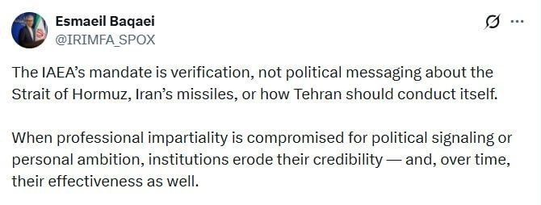

👈سخنگوی وزارت خارجه: وظیفه آژانس بین‌المللی انرژی اتمی، راستی‌آزمایی است، نه ارسال پیام‌های سیاسی در مورد تنگه هرمز، موشک‌های ایران یا نحوه رفتار تهران.

🔴وقتی بی‌طرفی حرفه‌ای قربانی رفتارهای سیاسی یا جاه‌طلبی‌های شخصی بشود، اعتبار نهادها دچار فرسایش می‌شود و بعد از جندی اثربخشی آنها نیز مخدوش می‌گردد.

✅ @AloNews خبر جنگ

## alonews — post 119041

  <a href="telegram/content/alonews_119041_1778413133.jpg">🎬 Download video</a>

👈گفت‌وگوی تلفنی وزرای خارجه ایران و قطر

✅ @AloNews خبر جنگ

## alonews — post 119040

  <a href="telegram/content/alonews_119040_1778413133.jpg">🎬 Download video</a>

👈دفاع امارات متحده عربی: دفاع هوایی ما دو موشک ورودی از ایران را رهگیری کرد.

✅ @AloNews خبر جنگ

## alonews — post 119039

  <a href="telegram/content/alonews_119039_1778413134.jpg">🎬 Download video</a>

👈یک منبع امنیتی عراقی به الجزیره می‌گوید هیچ نشانه‌ای از حضور نیروهای اسرائیلی در بیابان غربی در طول جنگ وجود ندارد و این احتمالاً نیروی آمریکایی بوده است.

🔴نیروها در طول جنگ عملیات‌های رهاسازی هماهنگ‌نشده‌ای در مناطق بادیه نجف و سماوه انجام دادند.

🔴رسانه‌ها درباره آن صحبت می‌کنند، متروک و کاملاً جدا از هرگونه حضور امنیتی یا مسکونی است.

✅ @AloNews خبر جنگ

---
📅 بروزرسانی: 1405/02/20 14:12
---

## VahidOOnLine — post 239256

  

خبرگزاری صداوسیمای جمهوری اسلامی اعلام کرد علی عبداللهی، فرمانده قرارگاه مرکزی خاتم‌الانبیا، با مجتبی خامنه‌ای دیدار کرده و گزارشی از وضعیت نیروهای مسلح جمهوری اسلامی به او ارائه داده است.

بنا بر این گزارش، او به مجتبی خامنه‌ای گفته در صورت هرگونه خطای راهبردی، تعرض و تجاوز از سوی دشمنان با سرعت عمل، پرشدت و پرقدرت با آن برخورد خواهد شد.

خبرگزاری صداوسیما همچنین نوشت که مجتبی خامنه‌ای در این دیدار، از عملکرد نیروهای مسلح جمهوری اسلامی «قدردانی» کرده است.

این خبر در حالی منتشر شده که از زمان انتصاب مجتبی خامنه‌ای به‌عنوان سومین رهبر جمهوری اسلامی، هیچ تصویر، فایل صوتی یا ویدیویی از او منتشر نشده و پیش‌تر نیز خبری از دیدار او با مسعود پزشکیان، با شک و تردیدهای بسیاری همراه بود.
iranintl
‌🏁 🇬🇧 IranintlTV

🤖 @VahidOOnLine

## VahidOOnLine — post 239255

  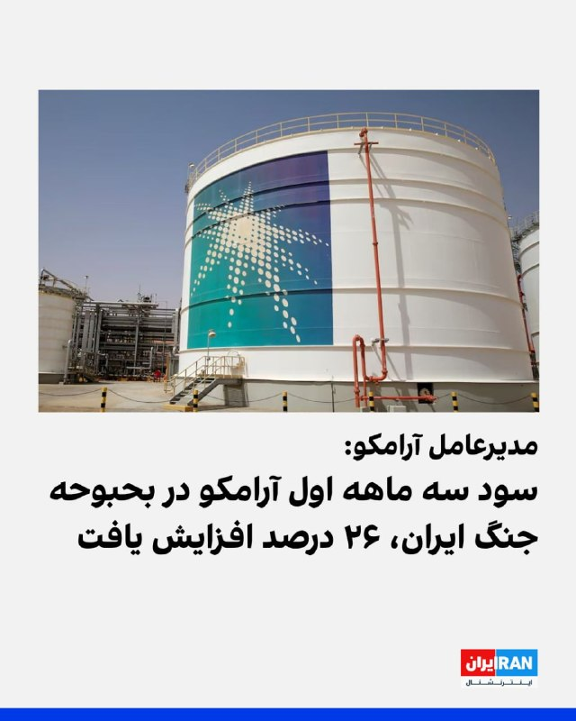

مدیرعامل آرامکو گفت که سود سه ماهه اول این شرکت با رسیدن خط لوله اصلی به ظرفیت کامل در بحبوحه جنگ ایران، ۲۶ درصد افزایش یافت.

او اضافه کرد خط لوله شرق به غرب عربستان سعودی، به یک شریان حیاتی تبدیل شده و به کاهش بخشی از پیامدهای شوک شدید جهانی انرژی کمک کرده است.

مدیرعامل آرامکو افزود حدود یک میلیارد بشکه از انتقال نفت کاسته شده و بازگشایی مسیرهای انتقال انرژی به معنای عادی‌سازی سریع وضعیت بازار نیست.
iranintl
‌🏁 🇬🇧 IranintlTV

🤖 @VahidOOnLine

## VahidOOnLine — post 239254

  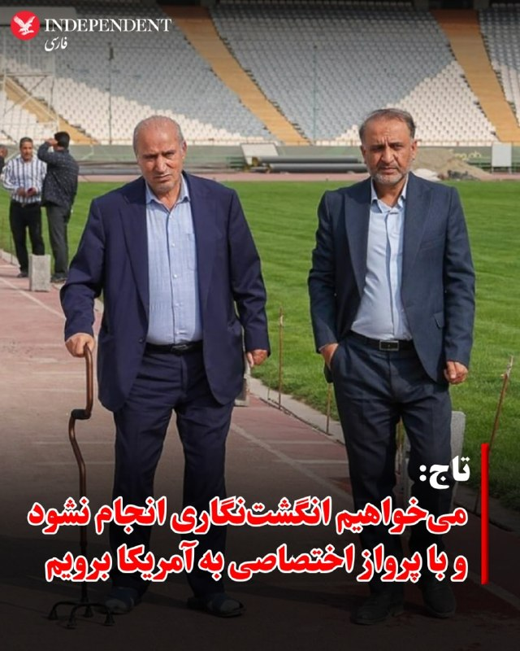

♦️رئیس فدراسیون فوتبال ایران با اشاره به برنامه‌ریزی‌های تیم ملی برای حضور در جام‌جهانی ۲۰۲۶ اعلام کرد که فدراسیون در حال رایزنی برای تسهیل شرایط سفر ملی‌پوشان به آمریکاست و درخواست کرده اعضای تیم بدون انگشت‌نگاری وارد این کشور شوند.
مهدی تاج روز یکشنبه گفت که او به همراه هدایت ممبینی آخر هفته راهی زوریخ خواهد شد تا در دیدار با جیانی اینفانتینو و دبیرکل فیفا درباره شرایط حضور ایران در جام‌جهانی مذاکره کند.
او همچنین از سفر مسئولان فدراسیون به آنکارا برای دریافت روادید اعضای تیم ملی خبر داد و افزود: «درخواست ما این است که انگشت‌نگاری انجام نشود و همچنین به دنبال این هستیم که با پرواز اختصاصی به آمریکا برویم.»
رئیس فدراسیون فوتبال با تاکید بر اهمیت حضور ایران در جام‌جهانی گفت فیفا تمایل دارد تمام تیم‌های صعودکننده در مسابقات حاضر باشند و غیبت ایران می‌تواند تبعات منفی برای فوتبال کشور داشته باشد.
تاج در بخش دیگری از صحبت‌هایش هشدار داد اگر ایران از حضور در جام‌جهانی انصراف دهد، فیفا این اختیار را دارد که تیم دیگری را جایگزین کند؛ موضوعی که به گفته او ممکن است برخی کشورها از آن استقبال کنند.
‌🇸🇦 Indypersian

🤖 @VahidOOnLine

## VahidOOnLine — post 239253

  

کویت اعلام کرد چند پهپاد «متخاصم» در حریم هوایی این کشور شناسایی شده‌اند و با آن‌ها بر اساس رویه‌های تعیین‌شده برخورد شده است.

مقام‌های کویتی جزئیات بیشتری درباره تعداد دقیق پهپادها، مبدا احتمالی آن‌ها یا محل رهگیری منتشر نکرده‌اند.
‌🏁 🇬🇧 ManotoTV

🤖 @VahidOOnLine

## VahidOOnLine — post 239252

  

خبرگزاری حکومتی مهر گزارش داد دقایقی پیش صدای یک انفجار شدید در شهر چابهار شنیده شده است.

بر اساس این گزارش، هنوز جزئیات بیشتری درباره علت انفجار، محل دقیق آن و خسارت‌های احتمالی منتشر نشده است.

تا زمان انتشار این خبر، مقام‌های محلی توضیحی درباره این حادثه نداده‌اند.
‌🏁 🇬🇧 ManotoTV

🤖 @VahidOOnLine

## VahidOOnLine — post 239251

  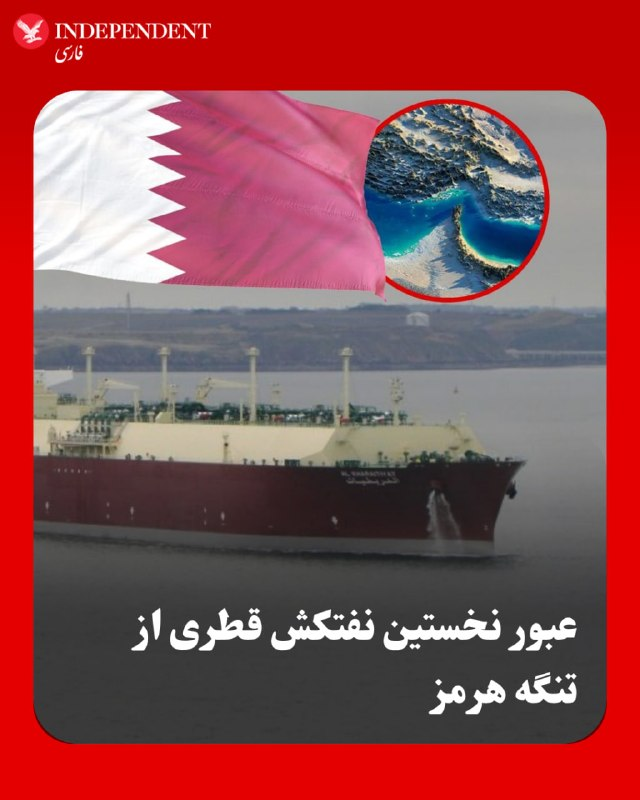

♦️رسانه‌های ایران روز یکشنبه ۱۹ اردیبهشت از عبور یک نفتکش قطری از تنگه هرمز با اجازه مقام‌های جمهوری اسلامی خبر دادند.
بنا بر گزارش‌ها نفتکش «الخریطیات»، متعلق به قطر که حامل گاز طبیعی مایع است در آب‌های دریای عمان سیگنال ارسال کرد.
خبرگزاری فارس، وابسته به سپاه پاسداران نیز گزارش داد که این نفتکش روز شنبه در دهانه تنگه هرمز دیده شده بود و پس از آن سامانه موقعیت‌یاب خودکار خود را خاموش کرد.
این نفتکش که مقصد آن پاکستان است، نخستین نفتکش غیرمرتبط با ایران است که  از زمان آغاز جنگ توانسته با «اجازه عبور» از تنگه هرمز گذر کند.

 خبرگزاری رویترز روز شنبه بر اساس داده‌های کشتیرانی موسسه LSEG، اعلام کرد که نفتکش حامل گاز طبیعی مایع (LNG) قطری با نام «الخریطیات» (Al Kharaitiyat)،  پس از ترک بندر رأس‌لفان، به سمت تنگه هرمز حرکت کرد تا مسیر خود را به مقصد بندر قاسم در پاکستان ادامه دهد.
‌🇸🇦 Indypersian

🤖 @VahidOOnLine

## VahidOOnLine — post 239250

  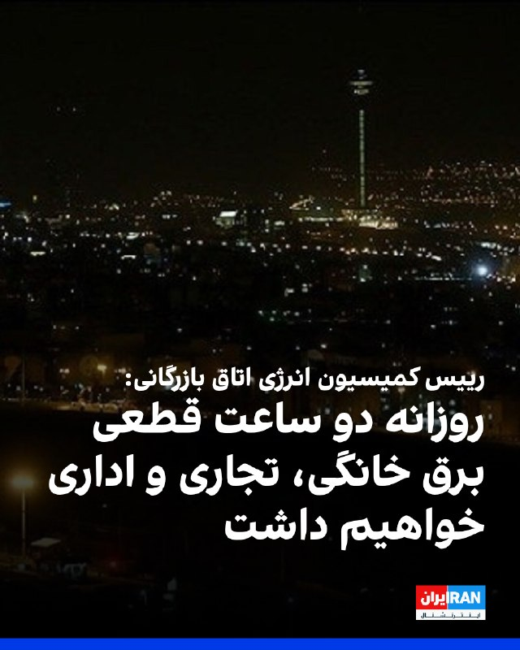

آرش نجفی، رییس کمیسیون انرژی اتاق بازرگانی گفت: «سال گذشته هر هفته سه تا چهار روز خاموشی دو ساعته داشتیم، امسال ممکن است فراتر برود و به نظر می‌رسد به طور مستمر روزانه دو ساعت قطعی برق خانگی، تجاری و اداری داشته باشیم و البته بخش صنعت هم همواره در اولویت قطعی‌ها خواهد بود.»

او افزود: «کمبود برق در ایران از هشت تا ۹ هزار مگاوات شروع شد و امروز به بیش از ۲۳ تا ۲۴ هزار مگاوات رسیده است.»
‌🏁 🇬🇧 IranintlTV

🤖 @VahidOOnLine

## VahidOOnLine — post 239249

  <a href="telegram/content/VahidOOnLine_239249_1778409730.mp4">🎬 Download video</a>

امیرحسین کریمی، یکی از شرکت‌کنندگان «آکادمی گوگوش»، درگذشت.

او از چهره‌های پرطرفدار و جنجالی آخرین فصل «آکادمی گوگوش» در «منوتو» بود و بسیاری او را با اجرای یکی از آثار فرهاد به یاد می‌آورند.

او که با نام «اردشیر پهلو» نیز شناخته می‌شد، پس از حضور در آکادمی گوگوش، مهمان نخستین قسمت برنامه «امید اِی‌اِم» در «منوتو» نیز بود و در میان مخاطبان این برنامه‌ها به چهره‌ای شناخته‌شده تبدیل شد.

بر اساس گزارش‌ها، او چند هفته پیش در نروژ دچار سانحه رانندگی شده بود و روز سه‌شنبه در ۳۹ سالگی جان باخت. خبر درگذشت او به‌تازگی منتشر شده است.
‌🏁 🇬🇧 ManotoTV

🤖 @VahidOOnLine

## VahidOOnLine — post 239248

  

شهرام ایرانی، فرمانده نیروی دریایی ارتش گفت: «زیردریایی‌های ما در آب‌های تنگه هرمز دست به ماشه و در حال گسترش و کف‌نشینی هستند.»

او افزود: «دلفین‌های خلیج فارس برای نشان دادن اقتدار دفاع دریایی، در تنگه هرمز روی آب آمدند و پس از اجرای چند مانور آرایشی به اعماق دریا رفتند.»
‌🏁 🇬🇧 IranintlTV

🤖 @VahidOOnLine

## mwarmonitor — post 8799

📊طبق یک نظرسنجی جدید روزنامه فایننشال تایمز، تعرفه‌های رئیس‌جمهور و جنگ در ایران در حال آسیب زدن به چشم‌انداز انتخاباتی حزب او در انتخابات میان‌دوره‌ای هستند.

@mwarmonitor

## mwarmonitor — post 8798

  <a href="telegram/content/mwarmonitor_8798_1778409733.mp4">🎬 Download video</a>

❌ متلاشی شد: دو مسیر تونل زیرزمینی با مجموع طول حدود ۲ کیلومتر در شرق «خط زرد» در مرکز غزه.

🔸در داخل این مسیرهای تونلی، چندین مخفیگاه و سلاح شناسایی شد. همچنین در جریان عملیات جست‌وجو در این منطقه، نیروها ده‌ها راکت و مواد منفجره را کشف کردند.

@mwarmonitor

## mwarmonitor — post 8797

🔴سازمان UKMTO گزارشی از یک حادثه در ۲۳ مایل دریایی شمال شرقی دوحه، قطر دریافت کرده است. ناخدای یک کشتی فله‌بر گزارش داده است که کشتی مورد اصابت یک پرتابه ناشناس قرار گرفته است. آتش‌سوزی کوچکی رخ داده که مهار شده است؛ این حادثه تلفات جانی نداشته و هیچگونه اثرات…

## mwarmonitor — post 8796

🇵🇰نخست وزیر پاکستان:

🔸خوشحالم که امروز در تماس تلفنی با برادرم، جناب شیخ محمد بن عبد الرحمن بن جاسم آل ثانی، نخست‌وزیر و وزیر امور خارجه دولت قطر، گفتگو کردم.

🔸در این تماس، دیدگاه‌هایمان را درباره تحولات اوضاع منطقه تبادل کردیم و بار دیگر بر تعهد مشترک خود برای حمایت از همه تلاش‌های جاری در جهت تقویت صلح پایدار، ثبات و گفت‌وگوی سازنده در سراسر منطقه تأکید کردیم.

🔸همچنین صمیمانه از برادرم، جناب شیخ تمیم بن حمد آل ثانی، امیر دولت قطر، به خاطر رهبری حکیمانه‌اش و حمایت مستمر قطر از تلاش‌های صادقانه پاکستان برای تقویت صلح و ثبات منطقه‌ای از طریق گفت‌وگو و دیپلماسی، قدردانی کردم.

🔸و مشتاقانه در انتظار سفر قریب‌الوقوع برادرم، امیر محترم دولت قطر، به پاکستان در آینده‌ای بسیار نزدیک هستم.

@mwarmonitor

## mwarmonitor — post 8795

📝 پیشنهاد یا انتقادی دارید؟ دایرکت خوشحال میشم بشنوم.

## mwarmonitor — post 8793

🇸🇩نیروهای مسلح کویت «تعدادی پهپاد متخاصم را» در داخل حریم هوایی این کشور در سپیده‌دم روز یکشنبه شناسایی کرده و «طبق رویه‌های مصوب با آن‌ها برخورد کرده‌اند».

@mwarmonitor

## mwarmonitor — post 8792

«آن‌ها (دولت) باید به همراه موساد اسرائیل تصمیم بگیرند که بهترین راه برای تعیین اینکه چه کسی را آموزش داده و مسلح کنند چیست. در حالی که همزمان به خفه کردن اقتصادی (تحریم‌های شدید) ادامه می‌دهیم.» «و ارتش ما به همراه متحدانمان، اسرائیلی‌ها، حمایت‌های هماهنگ…

## mwarmonitor — post 8791

متن روی تصویر «دولت باراک اوباما، رئیس‌جمهور سابق ایالات متحده، و سرویس جدید اقدام خارجی اروپا (EEAS)، در خوانش درست نیات ایران ناکام ماندند. پافشاری آن‌ها در نگریستن به تحولات سیاسی ایران از دریچه روابط ایران با غرب، موقعیت مذاکراتی غرب را به شدت محدود کرد.»…

## mwarmonitor — post 8790

ایرانی‌ها می‌گویند: «بیایید فقط دندان روی جگر بگذاریم (صبر کنیم). اگر دموکرات‌ها مجلس نمایندگان را بگیرند، این خودش یک "تغییر رژیم" در آمریکاست.» و اگر دموکرات‌ها ریاست‌جمهوری را هم به دست بیاورند، وای... آن وقت دیگر دست‌مان برای هر کاری باز است. سه سال بعد،…

## mwarmonitor — post 8789

به جای بازگویی ده ها نمونه، یا به عبارتی شواهدی، مبنی بر اینکه رژیم [ایران] هر توافقی را که تا به حال با هر سازمان بین‌المللی، هر کشور یا هر گروهی از کشورها امضا کرده، نقض کرده است، [باید گفت] به سادگی هیچ مدرکی وجود ندارد که این رژیم تا به حال به توافقی پایبند…

## mwarmonitor — post 8788

🇺🇸مارک لوین: سلام آمریکا، من مارک لوین هستم و این برنامه «زندگی، آزادی و لوین» شنبه است. به برنامه خوش آمدید. می‌دانید، پرزیدنت ترامپ کاری را انجام داده است که هیچ رئیس‌جمهوری در نیم‌قرن گذشته جرأت انجام آن را نداشته است. او به همراه متحد ما اسرائیل و نخست‌وزیر…

## mwarmonitor — post 8787

🇺🇸مارک لوین: سلام آمریکا، من مارک لوین هستم و این برنامه «زندگی، آزادی و لوین» شنبه است. به برنامه خوش آمدید.

می‌دانید، پرزیدنت ترامپ کاری را انجام داده است که هیچ رئیس‌جمهوری در نیم‌قرن گذشته جرأت انجام آن را نداشته است. او به همراه متحد ما اسرائیل و نخست‌وزیر بزرگ آن‌ها، بنیامین نتانیاهو، توانایی‌های نظامی رژیم ایران، تهدید هسته‌ای فوری و اکثر سیستم‌های موشکی را که برای ایجاد رعب و وحشت در کشورهای اطراف استفاده می‌شد، نابود کرده است.
اگر به شما می‌گفتم که این کار در عرض چند روز یا حتی چند هفته انجام می‌شود، باور نمی‌کردید. با این حال، به دلایلی، ما طوری رفتار می‌کنیم که انگار این یک موفقیت نظامی خیره‌کننده نبوده است.
با این حال، دانشِ چگونگی ساخت سلاح‌های هسته‌ای و موشک‌های بالستیک قاره‌پیما (ICBM)، به همراه کمک‌های کشورهایی مانند چین، روسیه و کره شمالی، و همچنین شبه‌نظامیان داخلی و نیروهای امنیتی ایران، به نظر می‌رسد تضمین می‌کند که در زمانی در آینده، ایران قادر خواهد بود این سیستم‌های تسلیحاتی را بازسازی کند، ارتش خود را دوباره بسازد و در داخل کشور، کشتار دسته‌جمعی حتی مسالمت‌آمیزترین صداهای مخالف را افزایش دهد.
پس، بعد از اینکه ارتش دشمن را شکست دادید و رده‌های بالای رهبری آن‌ها را از بین بردید، چه کار می‌کنید؟ چه کار می‌کنید؟ چون ما الان در چنین وضعیتی هستیم.
خب، بیایید ابتدا به آنچه گفتیم انجام نخواهیم داد نگاه کنیم: نیروی زمینی اعزام نمی‌کنیم. چرا؟ چون عملاً هیچ اراده سیاسی در کشور ما برای اعزام نیروی زمینی به ایران وجود ندارد. و من استدلال می‌کنم که اصلاً نیازی هم به اعزام نیروی زمینی نیست، به دلایلی که لحظاتی دیگر توضیح خواهم داد.
پرزیدنت ترامپ نه تنها رهبری یک پیروزی نظامی تاریخی علیه ایران را بر عهده داشته، بلکه کنترل تنگه هرمز را نیز به دست گرفته است؛ و از این طریق، توانایی ایران برای فروش نفتش را کنترل کرده و اقتصاد ایران را تحت فشار قرار داده است، به امید اینکه رژیم را مجبور به پذیرش یک توافق یا فروپاشی کند.
این‌ها دو هدف بسیار متمایز هستند: توافق کردن یا فروپاشی.
بنابراین سوال این است که کدام یک مرجح است؟ بیایید بیشتر به این موضوع بپردازیم. اگر هدف سرنگونی رژیم باشد، دو شرط از سه شرط مهم قبلاً محقق شده است: نابودی تقریباً تمام ظرفیت نظامی آن‌ها و کنترل اقتصادی بر اقتصادشان. این‌ها به نوبه خود دو موفقیت تاریخی هستند.
اما اگر هدف رسیدن به یک توافق باشد، مسئله فقط این نیست که چه نوع توافقی، بلکه آیا این توافق پایدار خواهد بود؟ یعنی از کجا بدانیم که دشمن به مفاد توافق پایبند خواهد بود، به‌ویژه پس از اینکه پرزیدنت ترامپ دفتر ریاست‌جمهوری را ترک کند؟

@mwarmonitor

## mwarmonitor — post 8786

## pm_afshaa — post 90463

  <a href="telegram/content/pm_afshaa_90463_1778409734.jpg">🎬 Download video</a>

🔴آرش نجفی، رییس کمیسیون انرژی اتاق بازرگانی: امسال به طور مستمر روزانه دو ساعت قطعی برق خانگی، تجاری و اداری خواهیم داشت!

💧 Rainbet.com the #1 Non-KYC Crypto Casino & Sportsbook @rainbetcom

😁 @Pm_Afshaa

## pm_afshaa — post 90462

  <a href="telegram/content/pm_afshaa_90462_1778409735.jpg">🎬 Download video</a>

🔴دبیر انجمن پیوند کلیه ایران:
در حوزه آنتی‌بیوتیک‌ها با مشکلاتی مواجه هستیم و برخی از این داروها بسیار نایاب شدن!

در حال حاضر کمبود برخی داروهای عمومی و در دسترس، به‌تدریج محسوس شده.

💧 Rainbet.com the #1 Non-KYC Crypto Casino & Sportsbook @rainbetcom

😁 @Pm_Afshaa

## pm_afshaa — post 90461

  <a href="telegram/content/pm_afshaa_90461_1778409735.jpg">🎬 Download video</a>

🔴وای‌نت: ترامپ نباید منتظر تغییر رفتار حکومت ایران یا قیام مردم برای پایان تهدید جمهوری اسلامی بمونه. همون‌طور که حکومت آلمان نازی بدون مداخله نظامی خارجی سقوط نکرد.

💧 Rainbet.com the #1 Non-KYC Crypto Casino & Sportsbook @rainbetcom

😁 @Pm_Afshaa

## pm_afshaa — post 90460

رویترز : مجتبی خامنه‌ای به نیروهای ایرانی دستور داده عملیات‌ها رو ادامه بدن

💧 Rainbet.com the #1 Non-KYC Crypto Casino & Sportsbook @rainbetcom

😁 @Pm_Afshaa

## pm_afshaa — post 90459

شنیده شدن انفجار در اربیل عراق

💧 Rainbet.com the #1 Non-KYC Crypto Casino & Sportsbook @rainbetcom

😁 @Pm_Afshaa

## pm_afshaa — post 90458

شنیده شدن صدای جنگنده در شیراز

💧 Rainbet.com the #1 Non-KYC Crypto Casino & Sportsbook @rainbetcom

😁 @Pm_Afshaa

## pm_afshaa — post 90457

مهر:دقایقی پیش صدای یک انفجار شدید در شهر چابهار شنیده شده است.
هنوز جزئیات بیشتری از علت یا محل دقیق انفجار منتشر نشده

💧 Rainbet.com the #1 Non-KYC Crypto Casino & Sportsbook @rainbetcom

😁 @Pm_Afshaa

## pm_afshaa — post 90456

🔴صدای انفجار در چابهار شنیده شده

💧 Rainbet.com the #1 Non-KYC Crypto Casino & Sportsbook @rainbetcom

😁 @Pm_Afshaa

## kianmeli1 — post 87321

‏🔴کویت از مقابله با پهپادهای پرتاب شده به این کشور در صبح یکشنبه خبر داد
https://t.me/kianmeli1

## kianmeli1 — post 87320

‏🔴وزارت دفاع قطر تایید کرد که صبح یکشنبه یک کشتی تجاری باری در آب‌های این کشور هدف یک پهپاد قرار گرفته است
https://t.me/kianmeli1

## kianmeli1 — post 87319

‏🔴مهر به نقل از فرمانداری چابهار: شنیده شدن صدای انفجار مربوط به خنثی‌سازی مهمات عمل نکرده است
https://t.me/kianmeli1

## kianmeli1 — post 87318

🔴مدیرعامل آرامکو عربستان: حتی با صلح نفت گران می‌ماند
https://t.me/kianmeli1

## kianmeli1 — post 87317

🔴یک طلافروشی در بلوار اندرزگوی تهران هدف سرقت مسلحانه قرار گرفت و سارقان پس از آن، از محل متواری شدند
https://t.me/kianmeli1

## IranIntlTV — post 336442

  <a href="telegram/content/IranIntlTV_336442_1778409736.mp4">🎬 Download video</a>

سرخط خبرهای یکشنبه ۲۰ اردیبهشت
@iranintltv

## IranIntlTV — post 336441

  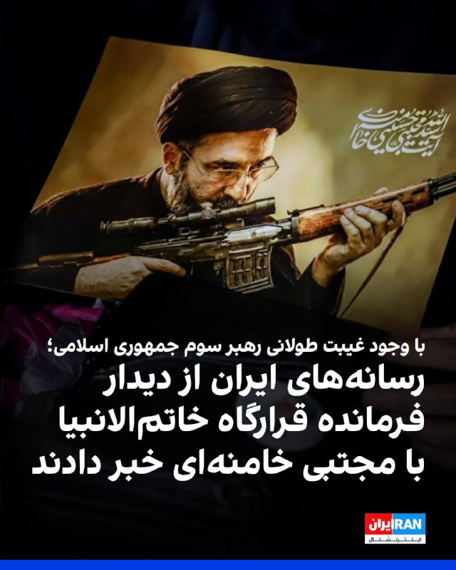

خبرگزاری صداوسیمای جمهوری اسلامی اعلام کرد علی عبداللهی، فرمانده قرارگاه مرکزی خاتم‌الانبیا، با مجتبی خامنه‌ای دیدار کرده و گزارشی از وضعیت نیروهای مسلح جمهوری اسلامی به او ارائه داده است.

بنا بر این گزارش، او به مجتبی خامنه‌ای گفته در صورت هرگونه خطای راهبردی، تعرض و تجاوز از سوی دشمنان با سرعت عمل، پرشدت و پرقدرت با آن برخورد خواهد شد.

خبرگزاری صداوسیما همچنین نوشت که مجتبی خامنه‌ای در این دیدار، از عملکرد نیروهای مسلح جمهوری اسلامی «قدردانی» کرده است.

این خبر در حالی منتشر شده که از زمان انتصاب مجتبی خامنه‌ای به‌عنوان سومین رهبر جمهوری اسلامی، هیچ تصویر، فایل صوتی یا ویدیویی از او منتشر نشده و پیش‌تر نیز خبری از دیدار او با مسعود پزشکیان، با شک و تردیدهای بسیاری همراه بود.
iranintl.com/202605101882

## IranIntlTV — post 336440

  <a href="telegram/content/IranIntlTV_336440_1778409738.mp4">🎬 Download video</a>

اشکان اسدیان، شهروند ایرانی از حضورش در محل حادثه و درگیری با ضارب در حمله تروریستی به یهودیان در لندن می‌گوید.

گفت‌وگوی رضا محدث، خبرنگار ایران‌اینترنشنال، با اشکان اسدیان، شاهد این حادثه
@iranintltv

## IranIntlTV — post 336439

🔻سوریه حزب‌الله را به پناه دادن به عاملان جنایات حکومت اسد متهم کرد

در حالی‌ که فشارها برای خلع سلاح حزب‌الله ادامه دارد، وزارت کشور سوریه این گروه نیابتی جمهوری اسلامی را متهم کرد که به «مجرمان» حکومت بشار اسد پناه داده است.

به گزارش شبکه خبری العربیه، وزارت کشور سوریه شامگاه شنبه ۱۹ اردیبهشت اعلام کرد برخی افرادی که در جنایات حکومت اسد علیه مردم سوریه دست داشتند، به لبنان گریخته‌اند و مقام‌های دمشق در تلاش‌اند آن‌ها را بازگردانند و محاکمه کنند.

این وزارتخانه همچنین از انجام اقداماتی برای «تقویت اعتماد و گسترش همکاری‌ها» با بیروت خبر داد و تاکید کرد لبنان در زمینه کنترل مرزهای دو کشور، «شریکی واقعی و قابل اعتماد» به شمار می‌رود.

حزب‌الله در کنار سپاه پاسداران انقلاب اسلامی نقشی کلیدی در بقای حکومت بشار اسد پس از آغاز جنگ داخلی سوریه ایفا کرده بود.

در نهایت، مخالفان مسلح به رهبری گروه تحریر الشام توانستند در یک عملیات غافلگیرکننده آذر ۱۴۰۳ به دمشق برسند و به بیش از پنج دهه حکومت خاندان اسد بر سوریه پایان دهند.

در دوران بشار اسد، سوریه یکی از مسیرهای اصلی انتقال تسلیحات به حزب‌الله به شمار می‌رفت، اما پس از روی کار آمدن حکومت جدید، محدودیت‌ها بر مسیرهای قاچاق سلاح افزایش یافته است.
سفر نخست‌وزیر لبنان به دمشق

نواف سلام، نخست‎‌وزیر لبنان، ۱۹ اردیبهشت با احمد الشرع، رییس‌جمهوری سوریه، در دمشق دیدار کرد.

او پس از این دیدار گفت دو طرف در حال گسترش همکاری‌های سیاسی و اقتصادی هستند و بر سر تشکیل «شورای مشترک تجاری» به توافق رسیده‌اند.

نخست‎‌وزیر لبنان افزود در این دیدار ضرورت تشدید کنترل مرزها و مقابله با قاچاق در سایه چالش‌های امنیتی و اقتصادی مناطق مرزی دو کشور مورد تاکید قرار گرفت.

سفر سلام به دمشق در حالی انجام گرفت که دولت لبنان در هفته‌های اخیر کوشیده است با استفاده از اهرم‌های گوناگون، نفوذ حزب‌الله را کاهش دهد و حتی مذاکرات مستقیم با اسرائیل را برای کاهش تنش‌ها در دستور کار قرار داده است.

۱۳ اردیبهشت، حسن فضل‌الله، نماینده حزب‌الله در پارلمان لبنان، اعلام کرد این گروه نیابتی جمهوری اسلامی خود را به مذاکرات مستقیم میان دولت لبنان و اسرائیل و نتایج احتمالی آن متعهد نمی‌داند.

این در حالی است که حملات اسرائیل به مواضع حزب‌الله در لبنان همچنان ادامه دارد. وزارت بهداشت لبنان پیش‌تر از کشته شدن ۳۹ تن در جریان حملات اسرائیل در ۱۹ اردیبهشت خبر داد.
شبکه کان: حزب‌الله از بیم از دست دادن حمایت تهران، با خلع سلاح مخالفت می‌کند

شبکه کان اسرائیل ۲۰ اردیبهشت به نقل از منابع امنیتی گزارش داد حزب‌الله با نگرانی تحولات دیپلماتیک و فشارهای بین‌المللی را دنبال می‌کند و بیم آن دارد که توافق احتمالی میان اسرائیل و لبنان به اقدام دولت لبنان علیه این گروه و محدود شدن نفوذ آن منجر شود.

بر اساس این گزارش، حزب‌الله تسلیحاتش را پایه قدرت نظامی، راهبردی و سیاسی خود در لبنان می‌داند و به‌دلیل نگرانی از احتمال از دست دادن پشتیبانی حکومت ایران، تاکید کرده است به خلع سلاح تن نخواهد داد.

کان افزود بر پایه برآوردها در اسرائیل، خلع سلاح حزب‌الله یکی از محورهای اصلی اختلاف در هرگونه تلاشی برای دستیابی به توافقی بلندمدت در جبهه شمالی خواهد بود.

نمایندگان اسرائیل و لبنان قرار است ۲۴ و ۲۵ اردیبهشت برای دور تازه مذاکرات در واشینگتن دیدار کنند. به گزارش کان، در این نشست موضوع خلع سلاح حزب‌الله و ترسیم مرز میان دو کشور بررسی خواهد شد و احتمالا نمایندگانی از ارتش‌ دو طرف نیز حضور خواهند داشت.

🔗وب‌سایت ایران‌اینترنشنال
@iranintltv

## IranIntlTV — post 336438

🔻جهش ۴۰۰ درصدی قیمت‌ها؛ داروخانه‌ها در تامین داروی بیماران دچار مشکل شده‌اند

هم‌زمان با وخامت اوضاع اقتصادی و بحران معیشت در ایران، مهدی زحمتکش، رییس انجمن داروسازان خراسان رضوی، اعلام کرد قیمت برخی داروها تا ۴۰۰ درصد افزایش یافته است.

زحمتکش یک‌شنبه ۲۰ اردیبهشت در مصاحبه با ایرنا، خبرگزاری دولت جمهوری اسلامی، از کمبود دارو و جهش قیمت‌ها خبر داد و حذف ارز ترجیحی و «آسیب‌» ناشی از جنگ اخیر را از عوامل اصلی این وضعیت دانست.

او گفت: «طی این مدت با کمبود داروی بیماران خاص و صعب‌العلاج (بیماران سرطانی، ام.اس، دیالیز، پیوندی، پروانه‌ای و هموفیلی)، اعصاب، قلبی و تنفسی مواجه هستیم و نیز در برخی داروها با افزایش قیمت بین ۲۰ تا ۴۰۰ درصدی مواجه بودیم.»

رییس انجمن داروسازان خراسان رضوی بر ضرورت گسترش پوشش بیمه‌ای برای کاهش پرداخت هزینه‌های درمان از جیب بیماران تاکید کرد.
در هفته‌های اخیر، شهروندان با ارسال پیام‌هایی به ایران‌اینترنشنال، از کمبود و افزایش شدید قیمت دارو، اخراج گسترده نیروها، تورم افسارگسیخته و رکود عمیق اقتصادی در کشور انتقاد کرده‌اند.

پیش‌تر در ۱۹ اردیبهشت، روزنامه اعتماد به نقل از هادی احمدی، سخنگو و عضو هیات ‌مدیره انجمن داروسازان ایران، از افزایش ۳۰ تا ۳۰۰ درصدی قیمت دارو در کشور خبر داد.

احمدی دلیل این جهش قیمت را «محدود شدن منابع ارزشی دولت به معنی کاهش امکان اختصاص یارانه به تولید و عرضه دارو» دانست.

بر اساس این گزارش، با وجود افزایش ۴۵ درصدی حداقل حقوق، سقوط بی‌سابقه ارزش ریال سبب شده هزینه‌های درمان برای خانوارهای کم‌درآمد در ایران «سرسام‌آور و کمرشکن» باشد.
داروخانه‌ها در انتظار پرداخت مطالبات

رییس انجمن داروسازان خراسان رضوی در ادامه گفت: «با توجه به افزایش ۲۰ تا ۴۰۰ درصدی قیمت داروها و مطالبه بین ۵۰۰ تا چهار هزار میلیارد ریالی داروخانه‌های خاص از سازمان‌های بیمه‌گر، آنها در تامین داروی بیماران سخت‌درمان با مشکل مواجه شده‌اند.»

زحمتکش اضافه کرد بیمه‌ها باید طبق قانون، مطالبات داروخانه‌ها را حداکثر ظرف ۴۵ روز پرداخت کنند تا نقدینگی لازم برای خرید و تامین داروی بیماران فراهم شود.

یکی از شهروندان پیش‌تر در پیامی به ایران‌اینترنشنال نوشت: «دارو به هیچ وجه گیر نمی‌آد. بعد از آوارگی بین ۱۰۰ تا داروخانه، اگر داروی مورد نظر رو هم پیدا کنیم، چون بیمه تامین اجتماعی و بیمه سلامت پول داروخانه‌ها رو ندادن، باید آزاد بخریم. فاجعه است.»

گزارش‌های رسیده به ایران‌اینترنشنال همچنین از افزایش قیمت و کمبود داروهای اعصاب در هفته‌های اخیر حکایت دارد؛ وضعیتی که به گفته شهروندان و کارکنان داروخانه‌ها، بسیاری از بیماران را ناچار به حذف یا تغییر روند درمان کرده است.

🔗وب‌سایت ایران‌اینترنشنال
@iranintltv

## IranIntlTV — post 336437

  <a href="telegram/content/IranIntlTV_336437_1778409740.mp4">🎬 Download video</a>

ساعاتی پس از سفر نخست وزیر قطر به آمریکا، سازمان عملیات تجارت دریایی بریتانیا از حمله به یک کشتی فله‌بر در آب‌های شمال شرقی دوحه، پایتخت قطر خبر داد.

گفت‌وگو با میثم مهرانی، تحلیلگر سیاسی

@iranintltv

## IranIntlTV — post 336436

  

مدیرعامل آرامکو گفت که سود سه ماهه اول این شرکت با رسیدن خط لوله اصلی به ظرفیت کامل در بحبوحه جنگ ایران، ۲۶ درصد افزایش یافت.

او اضافه کرد خط لوله شرق به غرب عربستان سعودی، به یک شریان حیاتی تبدیل شده و به کاهش بخشی از پیامدهای شوک شدید جهانی انرژی کمک کرده است.

مدیرعامل آرامکو افزود حدود یک میلیارد بشکه از انتقال نفت کاسته شده و بازگشایی مسیرهای انتقال انرژی به معنای عادی‌سازی سریع وضعیت بازار نیست.
iranintl.com/202605101007

## IranIntlTV — post 336435

  <a href="telegram/content/IranIntlTV_336435_1778409742.mp4">🎬 Download video</a>

مهدی تاج، رییس فدراسیون فوتبال ایران، با تاکید بر شروط جمهوری اسلامی برای حضور در جام جهانی، از ارسال پیام این فدراسیون به فیفا خبر داده و گفته تمام اعضای کاروان تیم باید ویزای سفر به آمریکا را دریافت کنند.
گفت‌وگو با علیرضا مدیری، عضو تحریریه ایران‌اینترنشنال
@iranintltv

## IranIntlTV — post 336434

  

آرش نجفی، رییس کمیسیون انرژی اتاق بازرگانی گفت: «سال گذشته هر هفته سه تا چهار روز خاموشی دو ساعته داشتیم، امسال ممکن است فراتر برود و به نظر می‌رسد به طور مستمر روزانه دو ساعت قطعی برق خانگی، تجاری و اداری داشته باشیم و البته بخش صنعت هم همواره در اولویت قطعی‌ها خواهد بود.»

او افزود: «کمبود برق در ایران از هشت تا ۹ هزار مگاوات شروع شد و امروز به بیش از ۲۳ تا ۲۴ هزار مگاوات رسیده است.»
https://iranintl.com/202605104112

## IranIntlTV — post 336433

  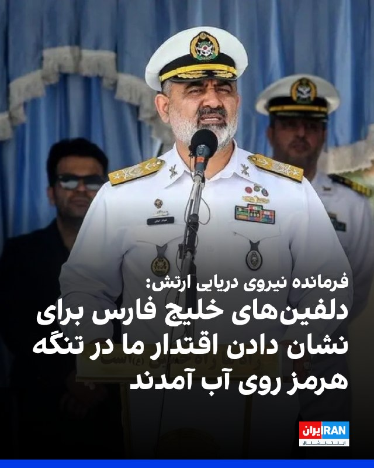

شهرام ایرانی، فرمانده نیروی دریایی ارتش گفت: «زیردریایی‌های ما در آب‌های تنگه هرمز دست به ماشه و در حال گسترش و کف‌نشینی هستند.»

او افزود: «دلفین‌های خلیج فارس برای نشان دادن اقتدار دفاع دریایی، در تنگه هرمز روی آب آمدند و پس از اجرای چند مانور آرایشی به اعماق دریا رفتند.»
https://iranintl.com/202605101887

## IranIntlTV — post 336432

  <a href="telegram/content/IranIntlTV_336432_1778409745.mp4">🎬 Download video</a>

نیروی دریایی سپاه پاسداران اعلام کرد در صورت «تعرض» به شناورهای جمهوری اسلامی، پایگاه‌های آمریکا در منطقه را هدف حمله قرار خواهد داد. سخنگوی ارتش جمهوری اسلامی نیز هشدار داده در صورت حمله دوباره آمریکا، جنگ وارد مرحله جدیدی خواهد شد.
گفت‌وگو با علی شیرازی، عضو تحریریه ایران‌اینترنشنال
@iranintltv

## Shin_Persian — post 5920

Shin ✓ @hey_itsmyturn
Sun, 10 May 2026 10:19:32 UTC

Explosions in Erbil, unknown nature.
KRI, #Iraq 🇮🇶

فارسی

انفجارهایی در اربیل، ماهیت نامشخص.
اقلیم کردستان عراق (KRI)، #Iraq 🇮🇶

𝕏 · @shin_persian

## Shin_Persian — post 5919

  

Shin ✓ @hey_itsmyturn
Sun, 10 May 2026 09:43:49 UTC

Mehr News on Chabahar explosion: UXO

فارسی

خبرگزاری مهر درباره انفجار چابهار: مهمات عمل‌نکرده (UXO)

𝕏 · @shin_persian

## Shin_Persian — post 5918

  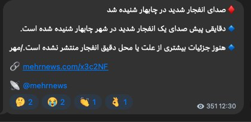

Shin ✓ @hey_itsmyturn
Sun, 10 May 2026 09:38:47 UTC

State-affiliated Mehr News:

Loud explosion heard in the city of Chabahar. No details on cause or exact location yet.
Sistan and Baluchestan Province, #Iran

فارسی

خبرگزاری دولتی مهر:

صدای انفجار مهیبی در شهر چابهار شنیده شد. هنوز جزئیاتی از علت یا محل دقیق آن در دست نیست.
استان سیستان و بلوچستان، #Iran_

𝕏 · @shin_persian

## ManotoTV — post 105230

  

کویت اعلام کرد چند پهپاد «متخاصم» در حریم هوایی این کشور شناسایی شده‌اند و با آن‌ها بر اساس رویه‌های تعیین‌شده برخورد شده است.

مقام‌های کویتی جزئیات بیشتری درباره تعداد دقیق پهپادها، مبدا احتمالی آن‌ها یا محل رهگیری منتشر نکرده‌اند.

## ManotoTV — post 105229

  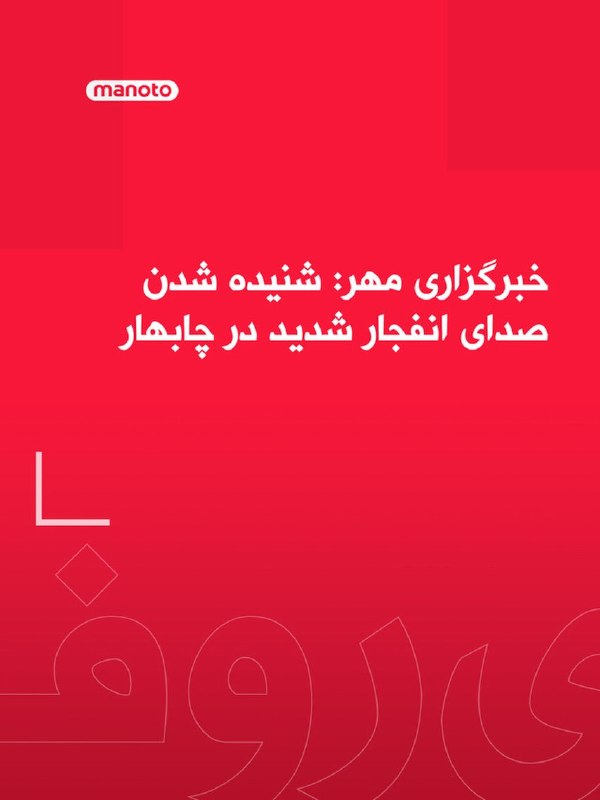

خبرگزاری حکومتی مهر گزارش داد دقایقی پیش صدای یک انفجار شدید در شهر چابهار شنیده شده است.

بر اساس این گزارش، هنوز جزئیات بیشتری درباره علت انفجار، محل دقیق آن و خسارت‌های احتمالی منتشر نشده است.

تا زمان انتشار این خبر، مقام‌های محلی توضیحی درباره این حادثه نداده‌اند.

## ManotoTV — post 105228

  <a href="telegram/content/ManotoTV_105228_1778409749.mp4">🎬 Download video</a>

امیرحسین کریمی، یکی از شرکت‌کنندگان «آکادمی گوگوش»، درگذشت.

او از چهره‌های پرطرفدار و جنجالی آخرین فصل «آکادمی گوگوش» در «منوتو» بود و بسیاری او را با اجرای یکی از آثار فرهاد به یاد می‌آورند.

او که با نام «اردشیر پهلو» نیز شناخته می‌شد، پس از حضور در آکادمی گوگوش، مهمان نخستین قسمت برنامه «امید اِی‌اِم» در «منوتو» نیز بود و در میان مخاطبان این برنامه‌ها به چهره‌ای شناخته‌شده تبدیل شد.

بر اساس گزارش‌ها، او چند هفته پیش در نروژ دچار سانحه رانندگی شده بود و روز سه‌شنبه در ۳۹ سالگی جان باخت. خبر درگذشت او به‌تازگی منتشر شده است.

## FarsiVOA — post 217331

  

وزارت اطلاعات، از اصلی‌ترین بازوهای سرکوب جمهوری اسلامی، اعلام کرد دو هسته عملیاتی وابسته به موساد را در چند استان ایران شناسایی و منهدم کرده است.

بر اساس ادعای این وزارتخانه، یک هسته چهار نفره در استان آذربایجان غربی پیش از اجرای آنچه «عملیات تروریستی علیه مراکز حساس» و «ترور فردی در تهران» خوانده شده، شناسایی و بازداشت شده است. در این اطلاعیه آمده یک نفر نیز در جریان درگیری با نیروهای وزارت اطلاعات کشته شده است.

وزارت اطلاعات همچنین مدعی است هسته‌ای دیگر در استان‌های کرمان و البرز، پیش از انجام هرگونه اقدام، شناسایی و بازداشت شده است.

به گفته این وزارتخانه، از افراد بازداشت‌شده شماری ریزپرنده، خودروی مخصوص حمل‌ونقل، سه قبضه کلت کمری با صداخفه‌کن، جلیقه ضدگلوله، تفنگ وینچستر، تفنگ دوربین‌دار، مهمات و تجهیزات استارلینک کشف شده است.

در بخش دیگری از اطلاعیه، وزارت اطلاعات از بازداشت فردی با نام اختصاری «مسعود-ت» خبر داده که به گفته این نهاد قصد خروج اطلاعات طبقه‌بندی‌شده یک مرکز نظامی در قزوین از کشور را داشته است.
@FarsiVOA

## FarsiVOA — post 217330

  

مدیر عامل شرکت هواپیمایی سوئیس اینترنشنال می‌گوید فعلاً با کمبود فوری سوخت جت مواجه نیست، اما برنامه‌های اضطراری سوخت را بررسی می‌کند.

ینس فهلینگر در ادامه گفته است این شرکت برای شش هفته آینده ذخایر کافی سوخت جت در اختیار دارد و پیش‌بینی‌های تأمین‌کنندگان سوخت این شرکت در حال حاضر مثبت است.

بیش از ۷۰ درصد سوخت هواپیمای مصرفی اروپا از کشورهای عرب حاشیه خلیج فارس تامین می‌شود که به خاطر انسداد تنگه هرمز توسط جمهوری اسلامی مختل و قیمت آن در بازارهای اروپایی دو برابر شده است.
@FarsiVOA

## FarsiVOA — post 217329

  

محققان دانشگاه «تکنیون» اسرائیل موفق به توسعه نانو-ربات‌هایی از جنس دی‌اِن‌اِی شده‌اند که می‌توانند مستقیماً در داخل بدن انسان به جنگ بیماری‌ها بروند.

این ماشین‌های برنامه‌ریزی‌پذیر تنها ۱۰۰ نانومتر عرض دارند و کاملاً از رشته‌های دی‌اِن‌اِی ساخته شده‌اند.

این نانو-ربات‌ها در جریان خون حرکت کرده، نشانگرهای سلول‌های سرطانی را شناسایی می‌کنند و سموم درمانی را فقط داخل تومور تخلیه می‌کنند؛ بدون اینکه کوچک‌ترین آسیبی به سلول‌های سالم برسد.

در آزمایش‌های اخیر بر روی سرطان‌های تهاجمی، این روش دقت و اثربخشی خیره‌کننده‌ای از خود نشان داده است.

تیم‌های تحقیقاتی همچنین در حال توسعه نانو-تکنولوژی مشابه‌ای برای ترمیم نورون‌های حرکتی هستند که می‌تواند تحولی بزرگ در درمان بیماری‌های عصبی سخت‌علاج مانند اِی‌اِل‌اِس ایجاد کند.

این نوآوری، بدن انسان را به میدان نبردی هوشمند علیه بیماری‌ها تبدیل کرده و مرزهای بین علم و تخیل را جابه‌جا کرده است.
@FarsiVOA

## FarsiVOA — post 217328

  

شرکت نفت عربستان سعودی، آرامکو، از جهش ۲۵ درصدی درآمد خالص خود در سه ماهه ابتدایی ۲۰۲۶ خبر داد. آرامکو می‌گوید در دوره یاد شده ۳۲.۵ میلیارد دلار درآمد خالص داشته است؛ موضوعی که نشان از انعطاف عربستان در ادامه صادرات نفت به رغم انسداد تنگه هرمز دارد.

امین ناصر، مدیرعامل شرکت آرامکو نیز به این موضوع اشاره کرده و گفته است ظرفیت صادرات روزانه نفت از طریق خط لوله شرق‌-غرب و مسیر دریای سرخ به هفت میلیون بشکه اوج گرفته است.

به رغم حملات جمهوری اسلامی به این کشور و انسداد تنگه هرمز، سرمایه‌گذاری‌های آرامکو دستخوش تغییر چندانی نشده و حدود ۱۲ میلیارد دلار در سه‌ماه ابتدایی امسال بوده است.
@FarsiVOA

## FarsiVOA — post 217327

🔺برخی آنتی‌بیوتیک‌ها در ایران نایاب شد

▪️در ادامه نشانه‌های بحران در بازار دارو، دبیر انجمن پیوند کلیه ایران از کاهش ذخایر دارویی و نایاب شدن برخی آنتی‌بیوتیک‌ها خبر داده و هشدار داده است که ادامه این وضعیت می‌تواند برای بیماران دیالیزی و پیوندی مشکل‌ساز شود.

▪️فاطمه پوررضاقلی به‌طور مشخص درباره آنتی‌بیوتیک‌ها هشدار داده و گفته برخی از این داروها «بسیار نایاب» شده‌اند.

▪️صدای آمریکا روز گذشته به نقل از منابع خود در بیمارستان‌ها و داروخانه‌ها گزارش داده بود دستورالعمل‌هایی برای کاهش مصرف سرم و آنتی‌بیوتیک ابلاغ شده و توزیع این اقلام در داروخانه‌ها با تأخیر و کمتر از میزان تقاضا انجام می‌شود.

⬇️ بیشتر بخوانید:
https://ir.voanews.com/a/8148465.html

## FarsiVOA — post 217326

🔺تداوم قطعی اینترنت در هفتادودومین روز؛ نشانه‌های گرانی اینترنت در ایران

▪️نت‌بلاکس، نهاد مستقل پایش اینترنت، اعلام کرد خاموشی اینترنت در ایران وارد هفتادودومین روز شده و اتصال کشور پس از بیش از ۱۷۰۴ ساعت همچنان در پایین‌ترین سطح قرار دارد.

▪️به نوشته نت‌بلاکس، هیچ نشانه‌ای از بازگشت گسترده دسترسی دیده نمی‌شود و مقام‌ها همچنان از دسترسی عمومی مردم به اینترنت جهانی جلوگیری می‌کنند.

▪️ بحران اینترنت در ایران فقط یک اختلال فنی نیست. نت‌بلاکس از خاموشی ۷۲ روزه و نبود نشانه بازگشت دسترسی می‌گوید؛ دنیای اقتصاد از گران‌تر شدن مسیر اتصال پرسرعت می‌نویسد؛ مهر آن را مسئله حقوق شهروندی و تبعیض در دسترسی می‌داند؛ و گاردین از اثر آن بر اطلاع‌رسانی و ارتباط با منابع داخل ایران می‌گوید.

⬇️ بیشتر بخوانید:
https://ir.voanews.com/a/8148464.html

## DW_Farsi — post 124515

  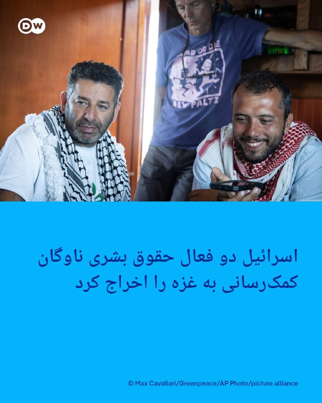

🔸اسرائیل دو فعال حقوق بشری ناوگان کمک‌رسانی به غزه را اخراج کرد

اسرائیل روز یکشنبه ۱۰ مه از اخراج دو فعال حقوق بشری خبر داد. به گفته وزارت خارجه اسرائیل، سیف ابو کِشِک، شهروند اسپانیا و تیاگو آویلا، شهروند برزیل که سوار بر یک ناوگان بین‌المللی سعی در شکستن محاصره نوار غزه از طریق دریا را داشتند، پس از بازداشت و انتقال به اسرائیل از این کشور اخراج شدند.

طبق این گزارش، این دو نفر که بخشی از دومین "ناوگان همبستگی جهانی صمود" بودند ۱۲ آوریل از اسپانیا به سمت غزه راه افتاده بودند. این دو ۲۹ آوریل در آب‌های بین‌المللی بازداشت و به اسرائیل منتقل شده بودند.

وزارت خارجه اسرائیل گفته است که سیف ابو کشک که اصالتا یک فلسطینی و مظنون به ارتباط با یک سازمان تروریستی است و تیاگو آویلا نیز مظنون به فعالیت غیرقانونی است.

این افراد با رد اتهامات مطرح شده از سوی اسرائیل گفته‌اند که در چارچوب یک مأموریت بشردوستانه برای غیرنظامیان غزه فعالیت می‌کردند و بازداشتشان در آب‌های بین‌المللی غیرقانونی بوده است.

اسپانیا پیش‌تر خواستار آزادی فوری ابو کشک شده بود.

@dw_farsi

## DW_Farsi — post 124514

  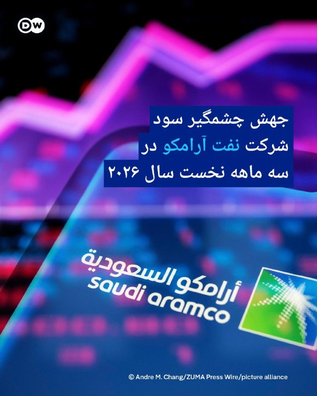

🔸جهش چشمگیر سود شرکت نفت آرامکو در سه ماهه نخست سال ۲۰۲۶

شرکت نفت عربستان سعودی، آرامکو، روز یکشنبه دهم مه (۲۰ اردیبهشت) اعلام کرد که سود خالص این شرکت در سه‌ماهه نخست سال ۲۰۲۶ نسبت به مدت مشابه سال گذشته ۲۵.۵ درصد افزایش یافته است.

آرامکو که بزرگ‌ترین صادرکننده نفت جهان به شمار می‌رود، در بیانیه‌ای که در وب‌سایت بورس عربستان منتشر شد اعلام کرد که افزایش درآمد این شرکت "عمدتاً به دلیل افزایش قیمت‌ها و حجم فروش محصولات پالایش‌شده و شیمیایی، همچنین افزایش حجم فروش نفت خام و رشد قیمت نفت خام" ناشی از جنگ در خاورمیانه بوده است.

قیمت نفت در سه‌ماهه نخست امسال از حدود ۶۰ دلار در اوایل فوریه به بیش از ۱۰۰ دلار در هر بشکه در ماه مارس افزایش یافت. بسته شدن تنگه هرمز توسط ایران باعث ایجاد بحران جهانی انرژی شد و بازارهای جهانی در حال حاضر با عدم قطعیت درباره روند جنگ آمریکا و اسرائیل علیه ایران مواجه هستند.

آمریکا همچنان در انتظار پاسخ ایران به درخواست یک صفحه‌ای واشنگتن درباره توافق بر سر پایان جنگ است.

@dw_farsi

## DW_Farsi — post 124513

  

🔸چندین کشته در ادامه حملات سنگین اسرائیل به لبنان

ارتش اسرائیل روز یکشنبه دهم مه (۲۰ اردیبهشت) اعلام کرد، در حملات هوایی دو روز گذشته جنوب لبنان بیش از ده عضو حزب‌الله کشته و حدود ۴۰ مکان مورد استفاده این گروه شبه نظامی مورد حمایت جمهوری اسلامی، از جمله انبارهای تسلیحات و یک موشک‌انداز هدف قرار گرفتند.

در همین حال به گفته ارتش اسرائیل، دو پهپاد شلیک‌شده از سوی حزب‌الله صبح روز یکشنبه بر فراز مناطقی در جنوب لبنان که نیروهای اسرائیل در آنجا مستقر هستند، رهگیری و منهدم شدند.

شبکه خبری المیادین، وابسته به حزب‌الله لبنان گزارش داد که در حملات روز شنبه اسرائیل به جنوب لبنان حدود ۲۶ تن کشته شدند.

شبکه خبری الجزیره در گزارشی از کشته شدن دستکم ۲۴ تن در جنوب لبنان در پی حملات اسرائیل در روز شنبه خبر داد و با استناد به آمار ارائه‌شده توسط وزارت بهداشت لبنان نوشت، از ۱۶ آوریل تا کنون ۵۰۰ نفر در این کشور در پی حملات نیروهای اسرائیلی کشته شده‌اند.

این گزارش شمار کل کشته‌شدگان از زمان آغاز بمباران لبنان توسط اسرائیل در دوم مارس را بیش از ۲۷۵۹ نفر اعلام کرده است.

@dw_farsi

## Persian_Trend_Official — post 13815

🔴 کویت: چند پهپاد «متخاصم» در حریم هوایی کشور شناسایی شدند

💢وزارت دفاع کویت اعلام کرد بامداد امروز چند پهپاد «متخاصم» در حریم هوایی این کشور شناسایی شده‌اند.

💢سخنگوی وزارت دفاع در بیانیه‌ای اعلام کرد این پهپادها «طبق رویه‌های تعیین‌شده» رهگیری و با آن‌ها مقابله شده است.

تا این لحظه جزئیاتی درباره منشأ پهپادها، تعداد دقیق آن‌ها یا خسارات احتمالی منتشر نشده است.

🫆:Tony

📌 @persian_trend_official
پرشین ترند | متفاوت‌ترین کانال نظامی

## Persian_Trend_Official — post 13814

  <a href="telegram/content/Persian_Trend_Official_13814_1778409755.mp4">🎬 Download video</a>

🇸🇾 اتفاقی تاریخی برای سوریه؛
پس از بیش از ۱۵ سال، اولین تراکنش با کارت‌های ویزا و مسترکارت در این کشور انجام شد.

این رویداد می‌تواند نشانه‌ای از بازگشت تدریجی سوریه به شبکه مالی جهانی پس از سال‌ها انزوای ناشی از تحریم‌ها باشد.

☆Phantom☆

📌 @persian_trend_official
پرشین ترند | متفاوت‌ترین کانال نظامی

## IranianMinds — post 19873

  <a href="telegram/content/IranianMinds_19873_1778409757.mp4">🎬 Download video</a>

🔴این پرستوی حکومتی نمی‌دونه پرستوی نظام یعنی چی.

@IranianMinds

## IranianMinds — post 19872

🔴غیر رسمی:

گویا در قشم و شیراز هم انفجارهایی رخ داده.

@IranianMinds

## IranianMinds — post 19871

🔴خبرگزاری مهر:

دقایقی پیش صدای یک انفجار شدید در شهر چابهار شنیده شده است.
هنوز جزئیات بیشتری از علت یا محل دقیق انفجار منتشر نشده است.

@IranianMinds

## BBCPersian — post 280646

🔻 کویت: به حمله پهپادی پاسخ دادیم

کویت می‌گوید که بامداد امروز هدف حمله پهپادی قرار گرفته است.

سرهنگ عبدالعزیز العطوان، سخنگوی وزارت دفاع کویت، گفت که در ساعت‌های اول بامداد یکشنبه «چندیدن پهپاد متخاصم در آسمان کویت شناسایی شدند و مطابق دستورالعمل‌ها به آنها پاسخ داده شد.»

جزئیات بیشتری منتشر نشده است.

پیش از آتش‌بس، کویت چندین بار از حملات پهپادی ایران و رهگیری آنها خبر داده بود.

https://bbc.in/3PtcOBM
@BBCPersian

## BBCPersian — post 280645

  

‌ ‌ ‌ ‌
خبرگزاری فارس می‌گوید «یک نفتکش حمل‌کننده گاز طبیعی مایع متعلق به قطر به نام الخریطیات» با «اجازه ایران» از تنگه هرمز عبور کرده است.

بنابر این گزارش، این نفتکش «روز گذشته در دهانهٔ تنگهٔ هرمز دیده شده بود و پس از آن سامانه موقعیت‌یاب خودکار خود را خاموش کرد.»

به گفته فارس، «این نفتکش که مقصدش پاکستان است، نخستین نفتکش غیرمرتبط با ایران است که از نیروی دریایی سپاه اجازه عبور از تنگه هرمز دریافت کرده است.»

بر طبق داده‌های ناوبری مارین‌ترفیک که تردد دریایی را رصد و منعکس می‌کند، براساس آخرین سیگنال دریافتی، این کشتی دیروز حدود ساعت ۱۶:۲۷ به وقت دوحه در تنگه هرمز و در ۴۴ کیلومتری جنوب شرقی جزیره قشم قرار داشت و سپس سیگنال خود را حدود ۱۴ ساعت پنهان کرد و اکنون پس از عبور از تنگه هرمز مجددا سیگنال آن قابل رویت است.

https://bbc.in/4tKlylj
📷Danil Shamkin/NurPhoto via Getty Images / عکس آرشیوی
@BBCPersian

## Dirty_Kids — post 389212

  <a href="telegram/content/Dirty_Kids_389212_1778409758.mp4">🎬 Download video</a>

Mother's Day 2026

روزت مبارک مامان ♥️
#محمدرضاقربانی

@Dirty_Kids 👻

## Dirty_Kids — post 389211

  <a href="telegram/content/Dirty_Kids_389211_1778409760.mp4">🎬 Download video</a>

«بچه شیعه باخت نمیده»
چون نزدیک جام‌جهانی هستیم این مدلیشم ببینید

@Dirty_Kids 👻

## Dirty_Kids — post 389210

  <a href="https://t.me/Dirty_Kids/389210">📎 Download file</a>

✅ اپلیکیشن اندروید سایت جهانی دربی بت

💰اولین سایت جهانی با امکان شارژ و برداشت ریالی(کارت به کارت)

🔗 برای ورود فیلترشکن روی کشور مناسب قرار دهید مانند فنلاند و المان و....

😀Telegram Channel
👇
https://t.me/+bcynkEgSW2dlYTc0

## Dirty_Kids — post 389209

  

😤دنبال یه سایت شرط بندی بین المللی بودی که به ایرانیا خدمات بده؟!
⛔

👍دربی بت همون انتخاب  100%

💎ویژگی های سایت جهانی Derby Bet:

⬅️امکان شارژ امن با کارت بانکی

⬅️واریز اول دوبل شارژ می شوید(بونوس۱۰۰٪)

⬅️پر اپشن ترین سایت فعال در ایران

⬅️تسویه حساب کمتر از 5 دقیقه

⬅️برگشت بخشی از باخت به صورت هفتگی

🚨کد هدیه ثبت نام:GG007

⚠️برای دانلود اپلکیشن کلیک کنید
👉

🔔کانال دربی بت :

🪙https://t.me/+bcynkEgSW2dlYTc0

## Dirty_Kids — post 389208

رفتم شیرینی فروشی، پرسیدم ببخشید این ظرف گِرده که روش پسته داره چیه؟
یکطوری نگاهم کرد گفت این دسرمون خیلی لایت و کریمیه با تاپینگِ سالتِد کارامل سیروپ، با پودرِ پستاچیو.
گفتم نخرم زشته؛ خریدم رفتم حساب کردم، توی فاکتور نوشته بود شیر برنج. :)))))))))

@Dirty_Kids 👻

## Dirty_Kids — post 389207

  <a href="telegram/content/Dirty_Kids_389207_1778409762.mp4">🎬 Download video</a>

داره میگه جنده‌ای، کصکش ادا تنگا رو درنیار دیگه 🤭🤭🤭

@Dirty_Kids 👻

## Hranews — post 112860

بازداشت و ضبط تجهیزات استارلینک دستکم چهار شهروند در زاهدان

❗️
❗️
❗️
❗️
❗️ – روز چهارشنبه ۱۶ اردیبهشت‌ماه، نیروهای امنیتی با مراجعه به منازل شماری از شهروندان در زاهدان، دستکم چهار شهروند را #بازداشت کردند. در جریان این اقدام، تجهیزات اینترنت ماهواره‌ای استارلینک و برخی وسایل الکترونیکی این افراد نیز ضبط شد.

ادامه مطلب

↘️
@hranews_bot تماس ✉️ -  @Hranews  کانال هرانا 🆑

## Hranews — post 112859

وزارت اطلاعات از بازداشت شماری از افراد و کشته شدن یک تن خبر داد

❗️
❗️
❗️
❗️
❗️ – وزارت اطلاعات در اطلاعیه ای از شناسایی و #بازداشت شماری از افراد در استان‌هایی از جمله آذربایجان‌‌غربی، کرمان و البرز خبر داد. این نهاد امنیتی، اتهامات مطروحه این افراد را #جاسوسی عنوان کرد و اظهار داشت که در جریان این عملیات یک تن کشته شده است.

ادامه مطلب

↘️
@hranews_bot تماس ✉️ -  @Hranews  کانال هرانا 🆑

## manototv — post 105230

  

کویت اعلام کرد چند پهپاد «متخاصم» در حریم هوایی این کشور شناسایی شده‌اند و با آن‌ها بر اساس رویه‌های تعیین‌شده برخورد شده است.

مقام‌های کویتی جزئیات بیشتری درباره تعداد دقیق پهپادها، مبدا احتمالی آن‌ها یا محل رهگیری منتشر نکرده‌اند.

## manototv — post 105229

  

خبرگزاری حکومتی مهر گزارش داد دقایقی پیش صدای یک انفجار شدید در شهر چابهار شنیده شده است.

بر اساس این گزارش، هنوز جزئیات بیشتری درباره علت انفجار، محل دقیق آن و خسارت‌های احتمالی منتشر نشده است.

تا زمان انتشار این خبر، مقام‌های محلی توضیحی درباره این حادثه نداده‌اند.

## manototv — post 105228

  <a href="telegram/content/manototv_105228_1778409764.mp4">🎬 Download video</a>

امیرحسین کریمی، یکی از شرکت‌کنندگان «آکادمی گوگوش»، درگذشت.

او از چهره‌های پرطرفدار و جنجالی آخرین فصل «آکادمی گوگوش» در «منوتو» بود و بسیاری او را با اجرای یکی از آثار فرهاد به یاد می‌آورند.

او که با نام «اردشیر پهلو» نیز شناخته می‌شد، پس از حضور در آکادمی گوگوش، مهمان نخستین قسمت برنامه «امید اِی‌اِم» در «منوتو» نیز بود و در میان مخاطبان این برنامه‌ها به چهره‌ای شناخته‌شده تبدیل شد.

بر اساس گزارش‌ها، او چند هفته پیش در نروژ دچار سانحه رانندگی شده بود و روز سه‌شنبه در ۳۹ سالگی جان باخت. خبر درگذشت او به‌تازگی منتشر شده است.

## alonews — post 119038

  <a href="telegram/content/alonews_119038_1778409766.jpg">🎬 Download video</a>

👈فوربس: ثروت ترامپ از ۲.۳۴ به ۶.۵ میلیارد دلار رسید؛ او و اطرافیانش در جنگ اخیر با ایران بیش از ۲.۶ میلیارد دلار درآمد کسب کردند که بخشی از آن حاصل شرط‌بندی بود

✅ @AloNews خبر جنگ

## alonews — post 119037

  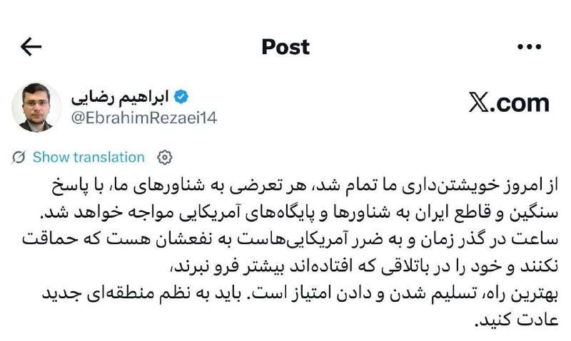

👈سخنگوی کمیسیون امنیت ملی مجلس گفت: از امروز خویشتن‌داری ما تمام شد، هر تعرضی به شناورهای ما، با پاسخ سنگین و قاطع ایران به شناورها و پایگاه‌های آمریکایی مواجه خواهد شد

✅ @AloNews خبر جنگ

## alonews — post 119036

  <a href="telegram/content/alonews_119036_1778409766.mp4">🎬 Download video</a>

👈اولین گروه از مسافران کشتی کروز آلوده به هانتاویروس تخلیه شدند

✅ @AloNews خبر جنگ

## alonews — post 119035

  <a href="telegram/content/alonews_119035_1778409768.mp4">🎬 Download video</a>

👈 حمله‌ی سپاه پاسداران به اربیل عراق

✅ @AloNews خبر جنگ

## alonews — post 119034

  <a href="telegram/content/alonews_119034_1778409769.jpg">🎬 Download video</a>

👈رویترز به نقل از مدیرعامل آرامکوی عربستان: شوک عرضه جهانی ناشی از جنگ، جهان را در ۲ ماه گذشته از حدود یک میلیارد بشکه نفت محروم کرده است

🔴حتی اگر جریان انرژی از سر گرفته شود، بازگشت سیستم به حالت عادی زمان خواهد برد.

✅ @AloNews خبر جنگ

## alonews — post 119033

  <a href="telegram/content/alonews_119033_1778409769.mp4">🎬 Download video</a>

🔴بعد از ۱۵ سال در سوریه اولین تراکنش‌ها با «ویزا» و «مسترکارد» انجام شد.

🤔جزو ساده‌ترین‌های روزمره در جهان، که مردم ایران دهه‌هاست ازش محروم‌اند.

✅@AloNews

## alonews — post 119032

  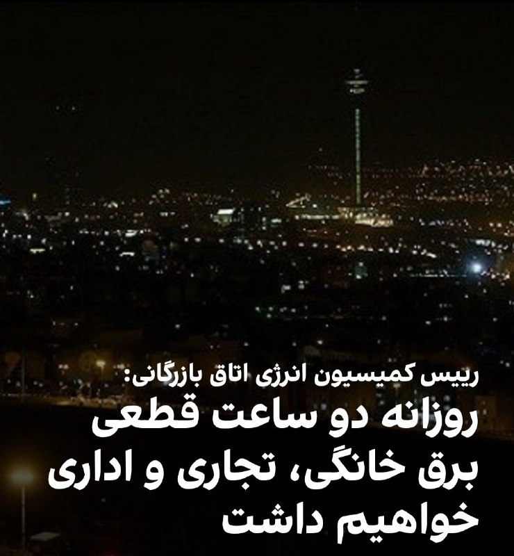

👈 رییس کمیسیون انرژی اتاق بازرگانی:
سال گذشته هر هفته ۳ تا ۴ روز خاموشی ۲ ساعته داشتیم ولی امسال تمامی روزهای هفته ۲ ساعت قطعی برق خانگی، تجاری و اداری داریم

✅ @AloNews خبر جنگ

## alonews — post 119031

  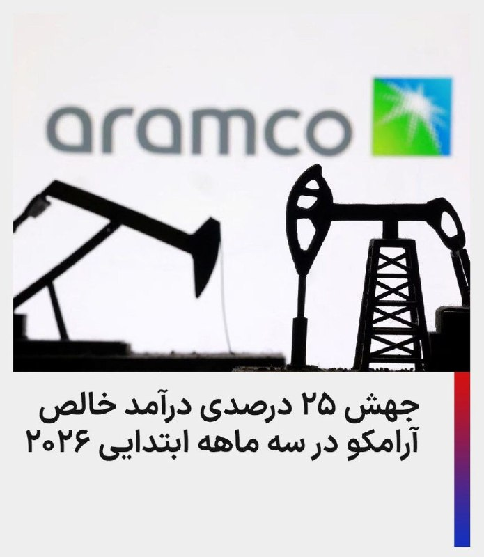

👈شرکت نفت عربستان سعودی، آرامکو، از جهش ۲۵ درصدی درآمد خالص خود در سه ماهه ابتدایی ۲۰۲۶ خبر داد. آرامکو می‌گوید در دوره یاد شده ۳۲.۵ میلیارد دلار درآمد خالص داشته است؛ موضوعی که نشان از انعطاف عربستان در ادامه صادرات نفت به رغم انسداد تنگه هرمز دارد.

✅@AloNews

## alonews — post 119030

  <a href="telegram/content/alonews_119030_1778409771.jpg">🎬 Download video</a>

👈ساعاتی پیش یک طلافروشی در بلوار اندرزگو تهران هدف سرقت مسلحانه قرار گرفت و سارقان پس از سرقت، با یک دستگاه خودروی سراتوی مشکی‌رنگ از محل متواری شدند

✅ @AloNews خبر جنگ

## alonews — post 119029

  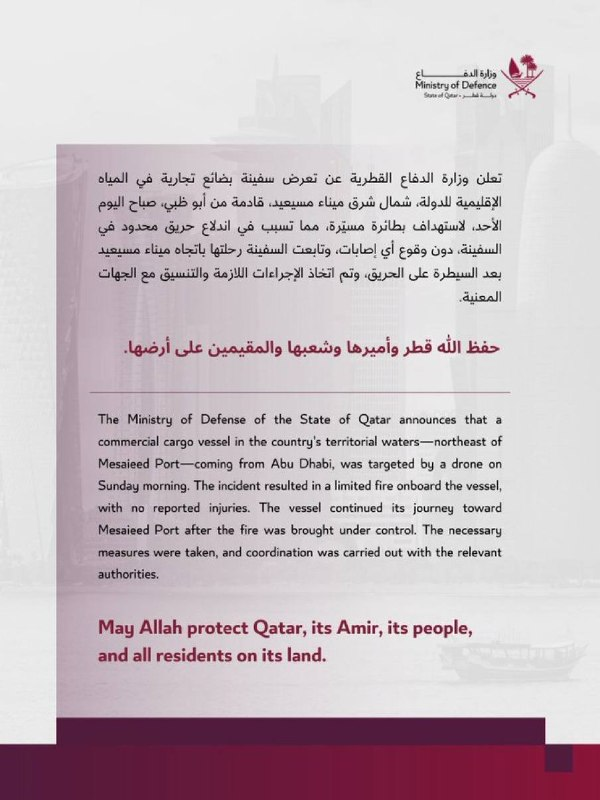

👈 ️وزارت دفاع قطر اعلام کرد یک کشتی باربری تجاری در آب‌های سرزمینی این کشور در شمال شرقی بندر مسعید هدف یک پهپاد قرار گرفت که باعث آتش‌سوزی جزئی در عرشه کشتی شد.هیچ مصدومی گزارش نشده و کشتی پس از کنترل آتش به سمت بندر تغییر مسیر داد

✅ @AloNews خبر جنگ.

## alonews — post 119028

  <a href="telegram/content/alonews_119028_1778409772.mp4">🎬 Download video</a>

من و رفیقم خطاب به کانفیگ فروشا

[@AloTweet]

## alonews — post 119027

  <a href="telegram/content/alonews_119027_1778409773.jpg">🎬 Download video</a>

👈نخست وزیر پاکستان: با وزیر خارجه قطر درباره تحولات منطقه‌ای تبادل نظر کردم.

✅ @AloNews خبر جنگ

## alonews — post 119026

  <a href="telegram/content/alonews_119026_1778409773.jpg">🎬 Download video</a>

👈دقایقی پیش صدای یک انفجار شدید در شهر چابهار شنیده شده است. 
🔴هنوز جزئیات بیشتری از علت یا محل دقیق انفجار منتشر نشده است 
✅ @AloNews خبر جنگ

## alonews — post 119025

  

👈ایلان ماسک:

🔴بچ ها

🔴پول

🔴بدون مالیات

🔴جشن

🔴(واقعا بیخیال خودتون نشید، بچه‌ها)

✅ @AloNews خبر جنگ

## alonews — post 119024

  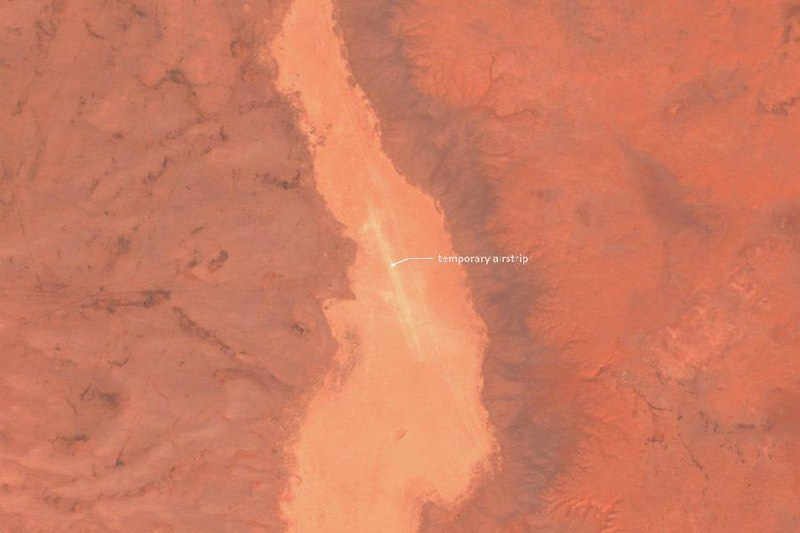

👈 این پایگاه هوایی سری اسرائیل در عراق است.

🔴تصاویر ماهواره‌ای نشان می‌دهند که یک باند فرودگاهی به طول تقریبی ۱.۶ کیلومتر در بستر یک دریاچه خشک شده، حدود ۱۸۰ کیلومتر جنوب غربی نجف/کربلا در بیابان غربی عراق، پاکسازی شده است.

✅ @AloNews خبر جنگ

## alonews — post 119023

  <a href="telegram/content/alonews_119023_1778409774.jpg">🎬 Download video</a>

👈دقایقی پیش صدای یک انفجار شدید در شهر چابهار شنیده شده است.

🔴هنوز جزئیات بیشتری از علت یا محل دقیق انفجار منتشر نشده است

✅ @AloNews خبر جنگ

## alonews — post 119022

  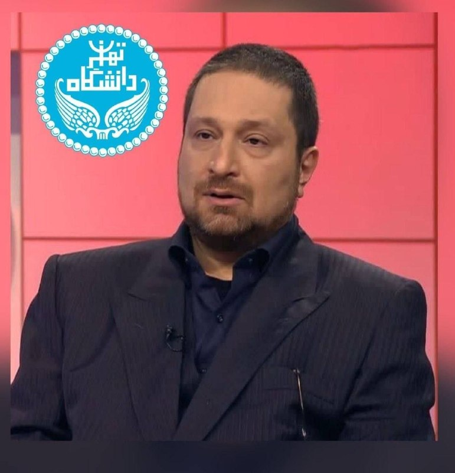

👈گروهک رجانیوز نزدیک به بستگان ابراهیم رئیسی، نوشته که «بیژن پیروز» به دلیل «مخالفت با برجام» از دانشگاه تهران اخراج شده؛ اما واقعیت چیست؟

🔴او یک عضو پیمانی فاقد ارتقای علمی بود که حتی در زمان رئیسی هم قراردادش به دلیل «رکود علمی» تمدید نشده، حقوقش به دلیل تخلفات متعدد در دوران سه وزیرِ مختلف مسدود بوده و هیأت جذب، با حضور اعضای اصولگرای دانشگاه تهران، پس از چندین بار بررسی پرونده بیژن پیروز، به تمدید قرارداد او رأی منفی داده است.

🔴۱-قسم حضرت عباسِ جریانِ تاریخ‌مصرف‌گذشته‌ای که دُمِ خروسش با رکوردشکنی اخراجِ سیاسیِ اساتید و دانشجویان در آن ۳ سال سیاه بیرون زده بود، قابل باور نیست که هیچ، مضحک است!

🔴۲-اینکه رسانه‌های جبهه پایداری و پیمانکاران پروژه‌ایش در شبکه‌های اجتماعی، با سوءاستفاده از شرایط جنگی و برای تسویه حساب باقی‌مانده با دانشگاه، یک اقدام فنی را با عنوان «تسویه حساب سیاسی» جا می‌زنند، بسیار قابل تامل است.

✅ @AloNews خبر جنگ

## alonews — post 119021

  <a href="telegram/content/alonews_119021_1778409775.jpg">🎬 Download video</a>

👈بیاتی، نماینده مجلس: تنگه هرمز برگ برنده ماست؛ آمریکا می‌خواهد آن را از ما را بگیرد

🔴به هیچ وجه و در چارچوب هیچ مذاکره ای ایران غنی سازی را صفر و اورانیوم غنی شده را به آمریکا نمی دهد.

✅ @AloNews خبر جنگ

## alonews — post 119020

  <a href="telegram/content/alonews_119020_1778409775.jpg">🎬 Download video</a>

👈ارتش کویت: ما سحرگاه امروز چندین پهپاد متخاصم را در حریم هوایی خود شناسایی و با آنها مقابله کردیم.

✅ @AloNews خبر جنگ

## alonews — post 119019

  <a href="telegram/content/alonews_119019_1778409775.mp4">🎬 Download video</a>

👈پرواز هواپیمای A10 آمریکایی در آسمان الانبار عراق

✅ @AloNews خبر جنگ

<!-- MSG END -->
<!-- NAV START -->
[صفحه قبل](telegram/content/archive_1.md)
<!-- NAV END -->
