# خواننده تلگرام

<!-- MSG START -->

---
📅 بروزرسانی: 1405/02/31 01:37
---

## VahidOOnLine — post 241237

  

به گزارش رسانه‌های ایران، چهارشنبه در پی تیراندازی سرنشینان مسلح یک خودروی پژو به خودروی نیروهای انتظامی در یکی از جاده‌های اطراف سراوان، یک نیروی نظامی به نام امیرحسین شهرکی و دو نفر از مهاجمان کشته شدند.
بر اساس این گزارش‌ها، پس از این درگیری، سلاح، مهمات و یک دستگاه استارلینک کشف و خودروی مهاجمان توقیف شد. تلاش‌ها برای شناسایی و بازداشت دیگر مهاجمان ادامه دارد.

‌🏁 🇬🇧 IranintlTV

🤖 @VahidOOnLine

## VahidOOnLine — post 241236

  <a href="telegram/content/VahidOOnLine_241236_1779314861.mp4">🎬 Download video</a>

جاویدنام سینا عباسی؛
جوان ۲۲ ساله‌ای از کرمانشاه که هشتم دی ۱۴۰۴ در جریان اعتراضات میدان انقلاب، بر اثر ضربات باتوم به سر جان باخت.
با گذشت ماه‌ها، هنوز نامش جایی ثبت نشده…
و خانواده‌اش فقط می‌خواهند صدای سینا شنیده شود.»
‌🏁 🇬🇧 ManotoTV

🤖 @VahidOOnLine

## VahidOOnLine — post 241235

  <a href="telegram/content/VahidOOnLine_241235_1779314862.mp4">🎬 Download video</a>

‌
«نهاد مدیریت آبراه خلیج فارس» با انتشار نقشه‌ای در شبکه اکس «محدوده نظارتی مدیریت» جمهوری اسلامی در تنگه هرمز را تعیین کرد.

بر اساس متن این نقشه، محدوده مورد نظر در شرق تنگه از خط اتصال «کوه مبارک» در ایران به جنوب فجیره در امارات متحده عربی، و در غرب تنگه از خط اتصال انتهای جزیره قشم به ام‌القوین در امارات تعیین شده است.

در این بیانیه آمده است تردد در این محدوده برای عبور از تنگه هرمز باید «با هماهنگی مدیریت آبراه خلیج فارس و مجوز این نهاد» انجام شود.

در نقشه منتشرشده، بخش وسیعی از آب‌های اطراف تنگه هرمز (محدوده قرمز) با عنوان «محدوده تحت نظارت نیروهای مسلح ایران» مشخص شده است.
‌🏁 🇬🇧 ManotoTV

🤖 @VahidOOnLine

## VahidOOnLine — post 241234

♦️نارندرا مودی، نخست وزیر هند، با انتشار تصاویری از اجرای رقص پنج زن ایتالیایی در حساب کاربری خود در اکس نوشت: «دیدن علاقه جهانی به فرم‌های رقص هندی واقعا شگفت‌انگیز است.» این هنرمندان ایتالیایی به مناسبت سفر رسمی مودی به رم و برای خوش‌آمدگویی به او، ترکیبی از رقص‌های سنتی «کوچی‌پودی»، «بهاراتاناتیام» و «کاتاک» را اجرا کردند؛ هنرمندانی که پس از این اجرا اعلام کردند احساسات بسیار عمیقی داشتند و مودی نیز شخصا از عملکرد عالی آن‌ها تقدیر کرده است. نخست وزیر هند در بخش دیگری از این سفر دیپلماتیک، به همراه همتای ایتالیایی خود، جورجیا ملونی، از بنای تاریخی کولوسئوم در رم بازدید کرد؛ سفری که ملونی با انتشار پیامی در شبکه اجتماعی اکس و با عبارت «دوست من، به رم خوش آمدی»، استقبال گرمی از آن به عمل آورد. این سفر، نخستین سفر یک نخست‌وزیر هند به ایتالیا در ۲۶ سال گذشته است.
‌🇸🇦 Indypersian

🤖 @VahidOOnLine

## VahidOOnLine — post 241233

  <a href="telegram/content/VahidOOnLine_241233_1779314863.mp4">🎬 Download video</a>

♦️وزارت دفاع بریتانیا چهارشنبه ۳۰ اردیبهشت‌ماه اعلام کرد یک فروند هواپیمای شناسایی «ریوت جوینت» نیروی هوایی سلطنتی در حریم هوایی بین‌المللی بر فراز دریای سیاه با مزاحمت و رهگیری جنگنده‌های روسیه روبه‌رو شده است.

بر اساس بیانیه لندن، جنگنده‌های روسی تا فاصله شش متری به هواپیمای بریتانیایی نزدیک شدند و سامانه‌های اضطراری داخل هواپیما فعال شد.

در تصاویر منتشرشده از سوی وزارت دفاع بریتانیا، جنگنده‌های روسیه در فاصله‌ای بسیار نزدیک کنار هواپیمای شناسایی بریتانیا دیده می‌شوند.

بریتانیا اعلام کرد این هواپیما در حال انجام ماموریتی عادی در حمایت از عملیات ناتو بوده و خدمه آن با وجود «مانورهای بی‌پروا» ماموریت خود را با امنیت کامل به پایان رساندند.

وزارت دفاع بریتانیا همچنین این حادثه را نشانه ادامه افزایش فعالیت‌های نظامی روسیه در اروپای شرقی و مناطق شمالی توصیف کرد.
‌🇸🇦 Indypersian

🤖 @VahidOOnLine

## VahidOOnLine — post 241232

۴۰ روز مادری؛ مراقبت انسانی، نمایش عاطفه و پرسش‌های اخلاقی

نعیمه دوستدار- روایت زنی جوان که برای مدتی کوتاه سرپرستی یک نوزاد را بر عهده داشت، به یکی از بحث‌برانگیزترین موضوعات شبکه‌های اجتماعی فارسی‌زبان تبدیل شد. روایتی که با لحنی احساسی و الهام‌بخش منتشر شد، خیلی زود به موجی از نقدهای اخلاقی، روانشناختی و سیاسی دامن زد.
ماجرا از انتشار روایت‌های سارا کنعانی، فعال فضای مجازی، درباره حضور موقت یک نوزاد در خانه‌اش آغاز شد. او در اینستاگرام و ایکس از تجربه «مادری موقت» نوشت. تجربه‌ای که در قالب طرح «میزبان» سازمان بهزیستی انجام شد.
رسانه‌های حکومتی در ایران، از جمله خبرگزاری جمهوری اسلامی (ایرنا) و روزنامه همشهری، این روایت را با ادبیاتی احساسی و تصویری بازنشر کردند. تصاویری از خانه، آغوش، گریه هنگام جدایی و توصیف‌هایی از «۴۰ روز مادری».
تصاویر بدون حجاب کنعانی در ایرنا منتشر شد و کاربران مدتی بعد خبر از دسترس خارج شدن این خبرگزاری را منتشر کردند.
اما آنچه ابتدا برای بخشی از کاربران تصویری انسانی از مراقبت از کودک بی‌سرپرست به نظر می‌رسید، برای گروهی دیگر به پرسشی جدی درباره مرز میان حمایت از کودک و تبدیل کودک به «محتوا» بدل شد.
https://www.iranintl.com/fa/202605197267

‌🏁 🇬🇧 IranintlTV

🤖 @VahidOOnLine

## VahidOOnLine — post 241231

  

♦️خبرگزاری تسنیم، وابسته به سپاه پاسداران، چهارشنبه‌شب ۳۰ اردیبهشت‌ماه اعلام کرد «نهاد مدیریت آبراه خلیج فارس» محدوده نظارتی جمهوری اسلامی در تنگه هرمز را تعیین کرده است.

بر اساس نقشه منتشرشده، محدوده شرقی این منطقه از خط اتصال «کوه مبارک» در ایران تا جنوب فجیره در امارات متحده عربی و محدوده غربی آن از انتهای جزیره قشم تا ام‌القوین در امارات تعیین شده است.

در متن منتشرشده آمده است عبور از تنگه هرمز در این محدوده باید «با هماهنگی مدیریت آبراه خلیج فارس و مجوز این نهاد» انجام شود.

در نقشه منتشرشده، بخش وسیعی از آب‌های اطراف تنگه هرمز با عنوان «محدوده تحت نظارت نیروهای مسلح جمهوری اسلامی» مشخص شده است.
‌🇸🇦 Indypersian

🤖 @VahidOOnLine

## VahidOOnLine — post 241230

  

♦️به گزارش انتخاب، فداحسین مالکی، عضو کمیسیون امنیت ملی و سیاست خارجی مجلس، چهارشنبه‌شب ۳۰ اردیبهشت‌ماه، در گفتگو با صداوسیما اعلام کرد عاصم منیر، فرمانده ارتش پاکستان، فردا به ایران سفر خواهد کرد. این عضو کمیسیون امنیت ملی با اشاره به اهداف این سفر اعلام کرد که فرمانده ارتش پاکستان در این دیدار، حامل پیام جدیدی از سوی ایالات متحده آمریکا به مقامات جمهوری اسلامی است.
پیش‌تر نیز مسعود پزشکیان، رئیس‌جمهوری اسلامی، در دیدار با سید محسن نقوی، وزیر کشور پاکستان، درباره آخرین تحولات منطقه، روند مذاکرات غیرمستقیم ایران و آمریکا و گسترش همکاری‌های تهران و اسلام‌آباد گفتگو کرده بود. در این دیدار، وزیر کشور پاکستان پیام‌ها و دیدگاه‌های مقام‌های این کشور را درباره تحولات منطقه و ادامه رایزنی‌های دیپلماتیک به پزشکیان منتقل کرد.
‌🇸🇦 Indypersian

🤖 @VahidOOnLine

## VahidOOnLine — post 241229

  

♦️علیرضا زاکانی، شهردار تهران، چهارشنبه‌شب ۳۰ اردیبهشت‌ماه، در گفتگو با صداوسیما با رد گزارش‌ها درباره محاصره دریایی جمهوری اسلامی گفت: «محاصره دریایی معنا ندارد. این‌ها اغراق می‌کنند و جرات حمله ندارند. اوج اقداماتشان را هم انجام دادند و دیدند ما دست بالا را داریم.»

او افزود: «اگر حمله کنند، پاسخ می‌گیرند. دوره بزن‌دررو تمام شده است.»

زاکانی همچنین درباره تنگه هرمز گفت نظارت بر این آبراه «حق طبیعی» جمهوری اسلامی است و تهران نباید درباره آن با آمریکا مذاکره کند.

شهردار تهران افزود: «از تنگه هرکی می‌خواهد استفاده کند، باید منابع ما را آزاد کند» و گفت کشورهایی که جمهوری اسلامی را تحریم کرده‌اند، نباید انتظار عبور آزاد از تنگه هرمز را داشته باشند.
‌🇸🇦 Indypersian

🤖 @VahidOOnLine

## VahidOOnLine — post 241228

  

علیرضا زاکانی، شهردار تهران، در گفت‌وگو با صداوسیما، گفت: «محاصره دریایی معنا ندارد. این‌ها اغراق می‌کنند و جرات حمله ندارند. اوج اقداماتشان را هم انجام دادند و دیدند ما دست بالا را داریم.»

او اضافه کرد: «اگر حمله کنند، پاسخ می‌گیرند. دوره بزن‌دررو تمام شده است.»
‌🏁 🇬🇧 IranintlTV

🤖 @VahidOOnLine

## VahidOOnLine — post 241227

  

♦️روزنامه «فایننشال تایمز» روز چهارشنبه ۳۰ اردیبهشت، گزارش داد که بر اساس توافق جدید میان دونالد ترامپ و وزارت دادگستری آمریکا، اداره امور مالیاتی این کشور (IRS) دیگر حق پیگیری ادعاهای مالیاتی علیه ترامپ، پسران بزرگش و سازمان ترامپ را نخواهد داشت. این توافق در پی انصراف رئیس‌جمهوری آمریکا از شکایت ۱۰ میلیارد دلاری خود علیه این نهاد مالیاتی صورت گرفت.

این تعهد از سوی وزارت دادگستری یک روز پس از آن صادر شد که ترامپ موافقت کرد در ازای راه‌اندازی یک صندوق ۱.۸ میلیارد دلاری از سوی دولت برای قربانیان جنگ قضایی (Lawfare)، شکایت خود را تسویه کند. جنگ قضایی نامی است که در صحنه سیاسی آمریکا به اختلافات میان شهروندان و اداره مالیات در دوره ریاست‌جمهوری جو بایدن داده شده است. تاد بلانش، سرپرست دادستانی کل آمریکا، در سندی رسمی اعلام کرد که ایالات متحده تمامی ادعاهای مالیاتی علیه شاکیان این پرونده را برای همیشه لغو و ساقط کرده است.

سخنگوی وزارت دادگستری در گفتگو با فایننشال تایمز تصریح کرد که این ممنوعیت تعقیب، «تنها شامل حسابرسی‌های مالیاتی موجود» می‌شود. او افزود اگر هر یک از طرفین می‌توانستند ادعاهای قبلی خود را دوباره مطرح کنند، تسویه این پرونده‌های بزرگ بی‌معنا می‌شد.
‌🇸🇦 Indypersian

🤖 @VahidOOnLine

## VahidOOnLine — post 241226

♦️دونالد ترامپ، رئیس‌جمهور آمریکا، در تازه‌ترین اظهارات خود درباره روند تحولات مرتبط با ایران و مذاکرات جاری، اعلام کرد که شرایط «در مرز تصمیم‌گیری» قرار دارد و در صورت دریافت نکردن پاسخ‌های موردنظر واشنگتن، تحولات می‌تواند «بسیار سریع» پیش برود.
ترامپ با تاکید بر اینکه آمریکا برای هر سناریویی آمادگی کامل دارد، گفت پاسخ‌هایی که از طرف مقابل دریافت می‌شود باید «صددرصد کامل و مطلوب» باشد، چرا که رسیدن به توافق می‌تواند از اتلاف زمان، انرژی و مهم‌تر از همه از تلفات انسانی جلوگیری کند.
رئیس‌جمهوری آمریکا همچنین گفت ایران اکنون در موقعیتی «ضعیف و شکست‌خورده» قرار دارد، اما در عین حال تاکید کرد افرادی که هم‌اکنون در مذاکرات حضور دارند، نسبت به گذشته «منطقی‌تر» هستند. ترامپ گفت طرف‌های حاضر در گفتگوها را افرادی «باهوش، بااستعداد و دارای قدرت فکری بالا» می‌داند و ابراز امیدواری کرد که این مذاکرات به توافقی منجر شود که «برای همه عالی» باشد.
او در بخش دیگری از سخنانش با اشاره به احتمال تشدید تنش‌ها، تاکید کرد ترجیح می‌دهد با چند روز صبر و ادامه مسیر دیپلماسی، از وقوع جنگ و کشته شدن انسان‌ها جلوگیری شود.
‌🇸🇦 Indypersian

🤖 @VahidOOnLine

## mwarmonitor — post 9389

📝 سوال، انتقاد ، پیشنهاد ، دایرکت به گوشم

## mwarmonitor — post 9388

🔴هدف این تلاش جدید این است که تعهدات ملموس‌تری از سوی ایران درباره گام‌های مربوط به برنامه هسته‌ای‌اش به دست آید، و همچنین جزئیات بیشتری از سوی آمریکا درباره این‌که چگونه دارایی‌های مسدودشده ایران به‌تدریج آزاد خواهند شد، ارائه شود؛ یک مقام عربی گفت. باراک راوید

@mwarmonitor

## mwarmonitor — post 9387

🇮🇷🇺🇸ایالات متحده و ایران در حال گفت‌وگو درباره یک «نقشه راه » برای دور جدیدی از مذاکرات هستند که قرار است محورهای مورد بحث را مشخص کند؛ مذاکراتی که ترامپ پیش‌تر گفته بود در اسلام‌آباد برگزار خواهد شد—اگر ایران آماده گفت‌وگو درباره کنار گذاشتن جاه‌طلبی‌های هسته‌ای خود باشد. نیویورک پست

@mwarmonitor

## mwarmonitor — post 9386

  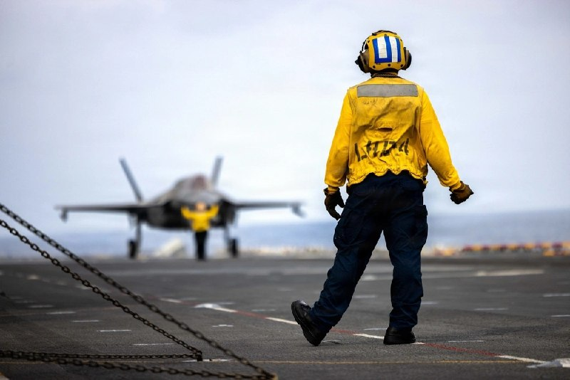

⁉️سوال زیادی در مورد موقعیت ناو boxer پرسیده بودید

🔸اقیانوس هند
۱۵ می ۲۰۲۶ (۲۵ اردیبهشت ۱۴۰۵)

📷عکس از: سرجوخه ترنت ای. هنری
یگان یازدهم اعزامی تفنگداران دریایی 11th MEU

🔸یک ملوان آمریکایی مستقر در کشتی بالگردبر و آب‌خاکی کلاس واسپ، یو‌اس‌اس باکسر (LHD 4)، در حال نظارت بر یک جنگنده F-35B لایتنینگ ۲ متعلق به اسکادران ۱۲۲ حمله جنگنده‌ای تفنگداران دریایی (VMFA-122)، یگان یازدهم اعزامی تفنگداران دریایی، در جریان عملیات پروازی در اقیانوس هند در تاریخ ۱۵ می ۲۰۲۶ است.

🔸یگان 11th MEU که بر روی ناوگروه آماده آب-خاکی باکسر (Boxer ARG) مستقر شده است، یک نیروی مداوم و با توان رزمی معتبر است که به بازدارندگی و پاسخ به بحران‌ها در منطقه عملیاتی ناوگان هفتم نیروی دریایی آمریکا کمک می‌کند. ناوگان هفتم ایالات متحده، به عنوان بزرگ‌ترین ناوگان شماره‌گذاری‌شده و فرامرزی نیروی دریایی آمریکا، به طور منظم با متحدان و شرکای خود تعامل و عملیات انجام می‌دهد تا امنیت و پایداری یک منطقه آزاد و باز در هند-آرام (ایندو-پاسیفیک) را حفظ کند.

@mwarmonitor

## mwarmonitor — post 9385

  

🔴به نظر می‌رسد نخست وزیر هند در مسیر بازگشت از اروپا، به‌طور کامل از خاورمیانه اجتناب می‌کند. عجیب است که او حتی از حریم هوایی عربستان هم عبور نکرده است.

@mwarmonitor

## mwarmonitor — post 9384

🇺🇸مقامات فدرال آمریکا در حال بررسی معاملاتی مشکوک در بازار نفت به ارزش ۸۰۰ میلیون دلار هستند که درست پیش از انتشار خبرهای مهم مربوط به جنگ ایران انجام شده است؛ موضوعی که یک گزارش آن را فاش کرده است. نیویورک پست

@mwarmonitor

## mwarmonitor — post 9383

🔴فیننشال تایمز: ارزشمندترین شرکت جهان (اینویدیا) پیش‌بینی کرده است که فروش آن در سه‌ماهه جاری به ۹۱ میلیارد دلار برسد؛ رقمی که به‌طور قابل توجهی بالاتر از میانگین انتظار وال‌استریت (۸۶ میلیارد دلار بر اساس داده‌های Visible Alpha) است، اما از خوش‌بینانه‌ترین پیش‌بینی‌ها کمتر است.

@mwarmonitor

## pm_afshaa — post 91136

  <a href="telegram/content/pm_afshaa_91136_1779314867.mp4">🎬 Download video</a>

🎙 خبرنگار: پیامت به خانواده‌های آمریکایی که از هوش مصنوعی می‌ترسن چیه؟ اونا نگرانن بچه‌هاشون تو آینده کار نداشته باشن.

جواب کاملا مرتبط و منطقی ترامپ:
هوش مصنوعی فوق‌العاده‌ست و ایران نباید سلاح هسته‌ای داشته باشه!

💧 Rainbet.com the #1 Non-KYC Crypto Casino & Sportsbook @rainbetcom

😁 @Pm_Afshaa

## pm_afshaa — post 91135

  <a href="telegram/content/pm_afshaa_91135_1779314868.jpg">🎬 Download video</a>

🔴میدل ایست آی: سه منبع گفتن که انتظار دارن جنگ در هفته‌های آینده و پس از پایان دوره حج، از سر گرفته بشه. آمریکا از سیگنال‌های فریبنده استفاده کرده تا سعی کنه طرف مقابل رو دچار احساس امنیت کاذب کنه. 
💧 Rainbet.com the #1 Non-KYC Crypto Casino & Sportsbook…

## pm_afshaa — post 91134

  <a href="telegram/content/pm_afshaa_91134_1779314869.jpg">🎬 Download video</a>

🔴میدل ایست آی: سه منبع گفتن که انتظار دارن جنگ در هفته‌های آینده و پس از پایان دوره حج، از سر گرفته بشه.

آمریکا از سیگنال‌های فریبنده استفاده کرده تا سعی کنه طرف مقابل رو دچار احساس امنیت کاذب کنه.

💧 Rainbet.com the #1 Non-KYC Crypto Casino & Sportsbook @rainbetcom

😁 @Pm_Afshaa

## pm_afshaa — post 91133

  <a href="telegram/content/pm_afshaa_91133_1779314869.jpg">🎬 Download video</a>

🔴فدا حسین مالکی، عضو کمیسیون امنیت ملی مجلس در صداوسیما: عاصم منیر فردا حامل پیام جدیدی از سوی آمریکا به ایرانه.

💧 Rainbet.com the #1 Non-KYC Crypto Casino & Sportsbook @rainbetcom

😁 @Pm_Afshaa

## pm_afshaa — post 91132

  <a href="telegram/content/pm_afshaa_91132_1779314870.jpg">🎬 Download video</a>

🔴آکسیوس به نقل از یک منبع آمریکایی: ترامپ به نتانیاهو از یک دوره 30 روزه مذاکره درباره برنامه هسته‌ای ایران و تنگه هرمز اطلاع داد 
💧 Rainbet.com the #1 Non-KYC Crypto Casino & Sportsbook @rainbetcom 
😁 @Pm_Afshaa

## kianmeli1 — post 87525

  <a href="telegram/content/kianmeli1_87525_1779314870.mp4">🎬 Download video</a>

🔴 ترامپ درباره ایران:
اگر پاسخ‌های درست را نگیریم، خیلی سریع پیش می‌رود. همه ما آماده‌ایم. باید پاسخ‌های درست را بگیریم.

باید پاسخ‌ها کاملاً ۱۰۰٪ درست باشند، و اگر اینطور باشد، زمان، انرژی و جان‌های زیادی را نجات می‌دهیم.
https://t.me/kianmeli1

## kianmeli1 — post 87524

  

🔴آخرین قیمت نفت ۱۰۵.۰۹ دلار
https://t.me/kianmeli1

## kianmeli1 — post 87523

  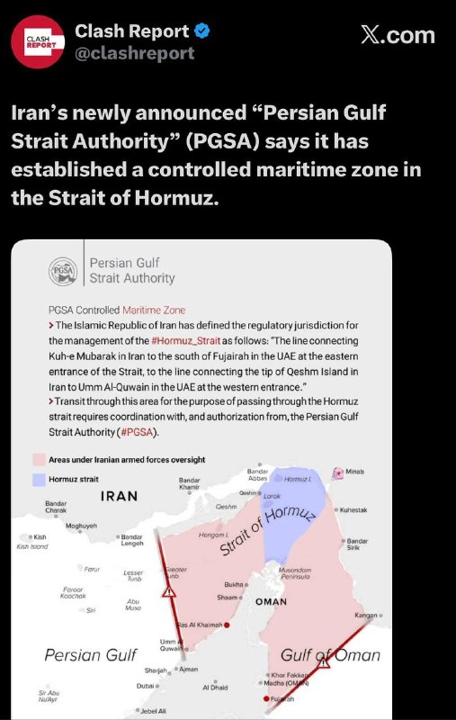

🔴«اداره تنگه خلیج فارس» (PGSA) که به تازگی از سوی ایران اعلام موجودیت کرده است، می‌گوید یک منطقه دریایی کنترل‌شده در تنگه هرمز ایجاد کرده است.
https://t.me/kianmeli1

## IranIntlTV — post 338161

  <a href="https://t.me/IranintlTV/338161">📎 Download file</a>

🎧نسخه صوتی سیاست با مراد ویسی: چهارمین جنگ یا توافق در آخرین لحظه؟
@iranintlTV

## IranIntlTV — post 338160

  <a href="telegram/content/IranIntlTV_338160_1779314873.mp4">🎬 Download video</a>

آکسیوس گزارش داد دونالد ترامپ در گفت‌وگوی تلفنی با بنیامین نتانیاهو از کار میانجی‌ها روی یک «تفاهم اولیه» خبر داده که قرار است آمریکا و ایران آن را امضا کنند تا جنگ به‌صورت رسمی پایان یابد و دوره ۳۰ روزه مذاکرات آغاز شود.

گفت‌وگو با فرزین ندیمی، پژوهشگر امور دفاعی و امنیتی
@iranintltv

## IranIntlTV — post 338159

  

به گزارش رسانه‌های ایران، چهارشنبه در پی تیراندازی سرنشینان مسلح یک خودروی پژو به خودروی نیروهای انتظامی در یکی از جاده‌های اطراف سراوان، یک نیروی نظامی به نام امیرحسین شهرکی و دو نفر از مهاجمان کشته شدند.
بر اساس این گزارش‌ها، پس از این درگیری، سلاح، مهمات و یک دستگاه استارلینک کشف و خودروی مهاجمان توقیف شد. تلاش‌ها برای شناسایی و بازداشت دیگر مهاجمان ادامه دارد.

https://iranintl.com/202605200267

## IranIntlTV — post 338158

  <a href="telegram/content/IranIntlTV_338158_1779314875.mp4">🎬 Download video</a>

دونالد ترامپ گفت ایران باید تنگه هرمز را باز نگه دارد. او با اشاره به شرایط دشوار زندگی در ایران افزود خشم و ناآرامی زیادی در کشور وجود دارد.

همزمان آکسیوس گزارش داد تماس تلفنی ترامپ و نتانیاهو درباره جمهوری اسلامی پرتنش بوده است.

گزارش اردوان روزبه، خبرنگار ایران‌اینترنشنال
@iranintltv

## IranIntlTV — post 338157

  <a href="telegram/content/IranIntlTV_338157_1779314876.mp4">🎬 Download video</a>

مراد ویسی، تحلیل‌گر ارشد ایران‌اینترنشنال، گفت: «تشکیل تدریجی صف برای برخی کالاها، از جمله بنزین و نان، در شهرهای مختلف به مساله‌ای تازه در زندگی روزمره مردم تبدیل شده، صف‌هایی که نشانه کمبود و اختلال در تامین برخی کالاها پس از جنگ اخیر هستند. گزارش‌هایی از شهرهایی مانند اصفهان، مشهد، بندرعباس و اراک از طولانی شدن صف بنزین و نان و مشکلات تأمین بنزین و آرد خبر می‌دهد.»
@iranintltv

## IranIntlTV — post 338156

  <a href="telegram/content/IranIntlTV_338156_1779314878.mp4">🎬 Download video</a>

مراد ویسی، تحلیل‌گر ارشد ایران‌اینترنشنال، گفت: «ترامپ گفته فقط چند روز دیگر برای توافق با جمهوری اسلامی فرصت خواهد داد. او گفته الان سوال اصلی این است که جمهوری اسلامی سند توافق را امضا خواهد کرد یا ما کار را تمام خواهیم کرد. طبق گفته ترامپ همه چیز باید تا یکشنبه روشن شود اما تجارب تاریخی نشان داده سیاست بالا و پایین بسیار دارد.»
@iranintltv

## IranIntlTV — post 338155

۴۰ روز مادری؛ مراقبت انسانی، نمایش عاطفه و پرسش‌های اخلاقی

نعیمه دوستدار- روایت زنی جوان که برای مدتی کوتاه سرپرستی یک نوزاد را بر عهده داشت، به یکی از بحث‌برانگیزترین موضوعات شبکه‌های اجتماعی فارسی‌زبان تبدیل شد. روایتی که با لحنی احساسی و الهام‌بخش منتشر شد، خیلی زود به موجی از نقدهای اخلاقی، روانشناختی و سیاسی دامن زد.
ماجرا از انتشار روایت‌های سارا کنعانی، فعال فضای مجازی، درباره حضور موقت یک نوزاد در خانه‌اش آغاز شد. او در اینستاگرام و ایکس از تجربه «مادری موقت» نوشت. تجربه‌ای که در قالب طرح «میزبان» سازمان بهزیستی انجام شد.
رسانه‌های حکومتی در ایران، از جمله خبرگزاری جمهوری اسلامی (ایرنا) و روزنامه همشهری، این روایت را با ادبیاتی احساسی و تصویری بازنشر کردند. تصاویری از خانه، آغوش، گریه هنگام جدایی و توصیف‌هایی از «۴۰ روز مادری».
تصاویر بدون حجاب کنعانی در ایرنا منتشر شد و کاربران مدتی بعد خبر از دسترس خارج شدن این خبرگزاری را منتشر کردند.
اما آنچه ابتدا برای بخشی از کاربران تصویری انسانی از مراقبت از کودک بی‌سرپرست به نظر می‌رسید، برای گروهی دیگر به پرسشی جدی درباره مرز میان حمایت از کودک و تبدیل کودک به «محتوا» بدل شد.

https://www.iranintl.com/fa/202605197267

## IranIntlTV — post 338154

  <a href="telegram/content/IranIntlTV_338154_1779314879.mp4">🎬 Download video</a>

دونالد ترامپ گفت باید پاسخ درستی از جمهوری اسلامی دریافت کند. او افزود واشینگتن در تهران با «افرادی منطقی» در حال گفت‌وگو است و چند روز دیگر نیز در انتظار پاسخ آنها خواهد ماند.
ترامپ همچنین تاکید کرد تا زمان دستیابی به توافق، هیچ‌گونه امتیاز یا تخفیفی به ایران داده نخواهد شد.

گفت‌وگو با محسن مدیرشانه‌چی، پژوهشگر موسسه نظم جهانی، و محمد قائدی، مدرس روابط بین‌الملل
@iranintltv

## IranIntlTV — post 338153

  <a href="telegram/content/IranIntlTV_338153_1779314881.mp4">🎬 Download video</a>

رابرت اِستلوف، مدیر اجرایی انستیتو واشینگتن، به مرضیه حسینی، خبرنگار ایران‌اینترنشنال، گفت: «کاملا وارد مرحله‌ای شده‌ایم که هدف بلندمدت، تغییر حکومت است. اینکه چطور به آن برسند، از طریق ادامه فشار و محاصره سیاسی و اقتصادی حکومت خواهد بود.»
@iranintltv

## IranIntlTV — post 338152

  <a href="telegram/content/IranIntlTV_338152_1779314882.mp4">🎬 Download video</a>

سپاه پاسداران در واکنش به تهدیدهای کاخ سفید هشدار داد در صورت حمله آمریکا و اسرائیل، به نقاطی که آنها تصور نمی‌کنند، ضرباتی کوبنده وارد می‌کند.

گفت‌وگو با علی شیرازی، عضو تحریریه ایران‌اینترنشنال و آرام حسامی، استاد علوم سیاسی کالج مونتگومری
@iranintltv

## IranIntlTV — post 338151

  <a href="telegram/content/IranIntlTV_338151_1779314884.mp4">🎬 Download video</a>

دونالد ترامپ گفت: «مهم این است که چه پاسخی از ایران دریافت می‌کنیم. اگر پاسخ، آن چیزی نباشد که ما انتظار داریم، خیلی سریع وارد عمل خواهیم شد. همه‌چیز آماده است.»

او افزود: «اگر به توافق برسیم، از هزینه‌های بسیار زیاد و کشته شدن انسان‌ها جلوگیری می‌شود. ممکن است این ماجرا خیلی زود تمام شود یا چند روز دیگر طول بکشد.»

او تاکید کرد: «آمریکا تا پیش از امضای توافق، هیچ تخفیفی در تحریم‌ها به ایران نخواهد داد و در حال حاضر هیچ امتیاز یا پیشنهاد مشخصی روی میز نیست.»
@iranintltv

## IranIntlTV — post 338150

  <a href="telegram/content/IranIntlTV_338150_1779314885.mp4">🎬 Download video</a>

کلیفورد می، رییس بنیاد دفاع از دموکراسی‌ها، به مرضیه حسینی، خبرنگار ایران‌اینترنشنال، گفت: «پیش‌بینی دونالد ترامپ خیلی سخت است، چون مدام نظرش را عوض می‌کند.»

او افزود: «امیدوارم هرچه زودتر به این نتیجه برسد که برای ادامه این مسیر، باید هم فشار اقتصادی را حفظ کند و هم فشار نظامی را افزایش دهد؛ از جمله حمله به مراکز نظامی و شاید حتی حذف لایه‌های بعدی قدرت در ایران.»
@iranintltv

## IranIntlTV — post 338149

  <a href="telegram/content/IranIntlTV_338149_1779314887.mp4">🎬 Download video</a>

سپاه در واکنش به تهدیدهای آمریکا و اسرائیل هشدار داد در صورت حمله، پاسخ‌های کوبنده‌ای در نقاط غیرقابل‌تصور خواهد داد. محمدباقر قالیباف نیز گفت نشانه‌ها از احتمال دور جدید تنش و جنگ حکایت دارد. وزیر خارجه ایران هم از هماهنگی روزانه میان دستگاه دیپلماسی و نیروهای نظامی خبر داد.
@iranintltv

## IranIntlTV — post 338148

  <a href="telegram/content/IranIntlTV_338148_1779314888.mp4">🎬 Download video</a>

قانون جدید طالبان درباره طلاق و ازدواج، موجی از نگرانی درباره حقوق زنان و افزایش کودک‌همسری در افغانستان ایجاد کرده است. براساس این قانون، سکوت دختر به‌منزله رضایت برای ازدواج تلقی می‌شود؛ موضوعی که منتقدان می‌گویند راه را برای ازدواج اجباری و کودک‌همسری هموارتر می‌کند.
@iranintltv

## IranIntlTV — post 338147

  

علیرضا زاکانی، شهردار تهران، در گفت‌وگو با صداوسیما، گفت: «محاصره دریایی معنا ندارد. این‌ها اغراق می‌کنند و جرات حمله ندارند. اوج اقداماتشان را هم انجام دادند و دیدند ما دست بالا را داریم.»

او اضافه کرد: «اگر حمله کنند، پاسخ می‌گیرند. دوره بزن‌دررو تمام شده است.»
https://iranintl.com/202605200745

## Shin_Persian — post 6118

Shin ✓ @hey_itsmyturn
Wed, 20 May 2026 22:03:08 UTC

Jet activity over Daraa, #Syria 🇸🇾

فارسی

فعالیت جت‌ها برفراز درعا، #Syria 🇸🇾

𝕏 · @shin_persian

## ManotoTV — post 105706

  <a href="telegram/content/ManotoTV_105706_1779314889.mp4">🎬 Download video</a>

جاویدنام سینا عباسی؛
جوان ۲۲ ساله‌ای از کرمانشاه که هشتم دی ۱۴۰۴ در جریان اعتراضات میدان انقلاب، بر اثر ضربات باتوم به سر جان باخت.
با گذشت ماه‌ها، هنوز نامش جایی ثبت نشده…
و خانواده‌اش فقط می‌خواهند صدای سینا شنیده شود.»

## ManotoTV — post 105705

  <a href="telegram/content/ManotoTV_105705_1779314891.mp4">🎬 Download video</a>

‌
«نهاد مدیریت آبراه خلیج فارس» با انتشار نقشه‌ای در شبکه اکس «محدوده نظارتی مدیریت» جمهوری اسلامی در تنگه هرمز را تعیین کرد.

بر اساس متن این نقشه، محدوده مورد نظر در شرق تنگه از خط اتصال «کوه مبارک» در ایران به جنوب فجیره در امارات متحده عربی، و در غرب تنگه از خط اتصال انتهای جزیره قشم به ام‌القوین در امارات تعیین شده است.

در این بیانیه آمده است تردد در این محدوده برای عبور از تنگه هرمز باید «با هماهنگی مدیریت آبراه خلیج فارس و مجوز این نهاد» انجام شود.

در نقشه منتشرشده، بخش وسیعی از آب‌های اطراف تنگه هرمز (محدوده قرمز) با عنوان «محدوده تحت نظارت نیروهای مسلح ایران» مشخص شده است.

## ManotoTV — post 105704

  <a href="telegram/content/ManotoTV_105704_1779314891.mp4">🎬 Download video</a>

تماسی که از جاویدنام سینا عباسی، ۲۲ ساله از کرمانشاه گفت…

## FarsiVOA — post 218260

🔺آمریکا علیه رهبر سابق کوبا کیفرخواست صادر کرد؛ رائول کاسترو متهم به قتل شد

▪️دادستان‌های فدرال آمریکا روز چهارشنبه اعلام کردند که علیه رائول کاسترو، رئیس‌جمهوری پیشین کوبا، به اتهام نقش داشتن در سرنگونی هواپیماهای غیرنظامی در سال ۱۹۹۶ پرونده کیفری تشکیل داده‌اند. این هواپیماها مورد استفاده تبعیدی‌هایی کوبایی‌تبار ساکن میامی در آمریکا بود.

⬇️ بیشتر بخوانید:
https://ir.voanews.com/a/8152139.html
@FarsiVOA

## FarsiVOA — post 218259

🔺وزیر خزانه‌داری آمریکا با وزیر دارایی قطر در مورد لزوم حفظ فشار بر جمهوری اسلامی صحبت کرد

▪️وزیر خزانه‌داری آمریکا، اسکات بسنت، روز چهارشنبه ۳۰ اردیبهشت اعلام کرد که با وزیر علی احمد الکواری وزیر دارایی قطر در پاریس دیدار و گفت‌وگو کرده است.

⬇️ بیشتر بخوانید:
https://ir.voanews.com/a/8152133.html
@FarsiVOA

## FarsiVOA — post 218258

🔺سناتور گراهام: جمهوری اسلامی با اقدامات دونالد ترامپ در ضعیف‌ترین وضعیت خود قرار دارد

▪️لیندزی گراهام، سناتور جمهوری‌خواه آمریکایی از ایالت کارولینای جنوبی، روز چهارشنبه ۳۰ اردیبهشت با تمجید از سیاست‌های دونالد ترامپ، رئیس‌جمهوری آمریکا، در قبال جمهوری اسلامی، گفت آقای ترامپ توانسته است رژیم ایران را به ضعیف‌ترین وضعیتش از سال ۱۳۵۷ برساند.

⬇️ بیشتر بخوانید:
https://ir.voanews.com/a/lindsey-graham-on-asim-munir-going-to-iran/8152121.html
@FarsiVOA

## FarsiVOA — post 218257

⚡️امید جمهوری اسلامی به کولبران و ملوانان برای واردات مواد پتروشیمی و پلیمری
@FarsiVOA

## FarsiVOA — post 218256

🔺دونالد ترامپ: اگر با چند روز صبر کردن، از کشته‌شدن افراد جلوگیری کنم این کار را انجام می‌دهم

▪️رئیس‌جمهوری آمریکا، دونالد ترامپ، عصر چهارشنبه ۳۰ اردیبهشت در پاسخ به پرسش خبرنگاری درباره علت مذاکرات بی‌وقفه‌اش با رژیم ایران و اینکه آیا از مذاکرات خسته‌ می‌شود گفت: «من هرگز خسته نمی‌شوم. کاری که دوست دارم انجام ‌دهم [این است که] اگر بتوانم با چند روز صبر کردن از جنگ جلوگیری کنم، یا بتوانم با چند روز صبر کردن از کشته شدن افراد جلوگیری کنم، فکر می‌کنم کار بزرگی است.»

⬇️ بیشتر بخوانید:
https://ir.voanews.com/a/8152125.html
@FarsiVOA

## Persian_Trend_Official — post 14563

⭕️ رائول کاسترو متهم به قتل شد 💢دادستان‌های فدرال آمریکا روز چهارشنبه اعلام کردند که علیه رائول کاسترو، رئیس‌جمهوری پیشین کوبا، به اتهام نقش داشتن در سرنگونی هواپیماهای غیرنظامی در سال ۱۹۹۶ پرونده کیفری تشکیل داده‌اند. این هواپیماها مورد استفاده تبعیدی‌هایی…

## Persian_Trend_Official — post 14562

  <a href="telegram/content/Persian_Trend_Official_14562_1779314892.jpg">🎬 Download video</a>

⭕️ رائول کاسترو متهم به قتل شد

💢دادستان‌های فدرال آمریکا روز چهارشنبه اعلام کردند که علیه رائول کاسترو، رئیس‌جمهوری پیشین کوبا، به اتهام نقش داشتن در سرنگونی هواپیماهای غیرنظامی در سال ۱۹۹۶ پرونده کیفری تشکیل داده‌اند. این هواپیماها مورد استفاده تبعیدی‌هایی کوبایی‌تبار ساکن میامی در آمریکا بود.

🫆:Tony

📌 @persian_trend_official
پرشین ترند | متفاوت‌ترین کانال نظامی

## Persian_Trend_Official — post 14561

  <a href="telegram/content/Persian_Trend_Official_14561_1779314893.jpg">🎬 Download video</a>

نسخه صوتی لایو امشب در اسپاتیفای : https://open.spotify.com/episode/4ZyN11ARn9PzPUowsFbzbh?si=w_I-pR9MRMyUKElfOPbe8Q

## Persian_Trend_Official — post 14560

  

🔴 هالیوود فیلمی درباره عملیات نجات خلبانان آمریکایی در ایران می‌سازد

💢به گزارش ددلاین، استودیوی «یونیورسال پیکچرز» و «مایکل بی» کارگردان مشهور آمریکایی، در حال ساخت فیلمی درباره نجات دو نیروی هوایی آمریکا در ایران پس از سرنگونی جنگنده F-15E Strike Eagle آن‌ها در جریان عملیات «خشم حماسی» هستند.

🔻بر اساس این گزارش:

▪️ فیلم بر پایه کتابی از «میچل زاکف» که قرار است در سال ۲۰۲۷ منتشر شود ساخته خواهد شد
▪️ مایکل بی اعلام کرده طی سال‌های فعالیتش همکاری «شگفت‌انگیزی» با وزارت جنگ آمریکا و ارتش این کشور داشته است
▪️ این موضوع احتمال همکاری مستقیم پنتاگون با پروژه را تقویت می‌کند

مایکل بی درباره این پروژه گفت:

▪️ فیلم روی نیروهایی تمرکز دارد که یکی از «پیچیده‌ترین و پرریسک‌ترین عملیات‌های تاریخ معاصر» را انجام داده‌اند

🫆:Tony

📌 @persian_trend_official
پرشین ترند | متفاوت‌ترین کانال نظامی

## Persian_Trend_Official — post 14559

💢ادعای «میدل ایست آی»:

🔹سه منبع گفتند که انتظار دارند جنگ در هفته‌های آینده و پس از پایان دوره حج، از سر گرفته شود

🔹ایالات متحده در گذشته از سیگنال‌های فریبنده و حیله‌های دیگر استفاده کرده تا سعی کند طرف مقابل را دچار احساس امنیت کاذب کند

🫆:Tony

📌 @persian_trend_official
پرشین ترند | متفاوت‌ترین کانال نظامی

## Persian_Trend_Official — post 14558

🔴 جانشین فرمانده نیروی دریایی سپاه: آماده رویارویی در تنگه هرمز هستیم

💢جانشین فرمانده نیروی دریایی سپاه پاسداران ایران اعلام کرد نیروهای ایرانی در وضعیت آماده‌باش قرار دارند و تهدیدها را جدی می‌دانند.

وی گفت:

▪️ «دست ما روی ماشه است»

▪️ اگر ترامپ تصور می‌کند می‌تواند با زور تنگه هرمز را باز کند، باید بداند با همان نیروی دریایی مواجه خواهد شد که ادعا می‌کردند نابود شده است

▪️ دشمنان اشتباه می‌کنند اگر فکر کنند با هدف قرار دادن زیرساخت‌ها، این ملت عقب‌نشینی خواهد کرد

▪️ ایران طی ۴۷ سال گذشته نشان داده که آسیب‌پذیر است اما تسلیم نمی‌شود

🫆:Tony

📌 @persian_trend_official
پرشین ترند | متفاوت‌ترین کانال نظامی

## Persian_Trend_Official — post 14557

  <a href="https://t.me/persian_trend_official/14557">📎 Download file</a>

نسخه تلگرام :

## Persian_Trend_Official — post 14555

  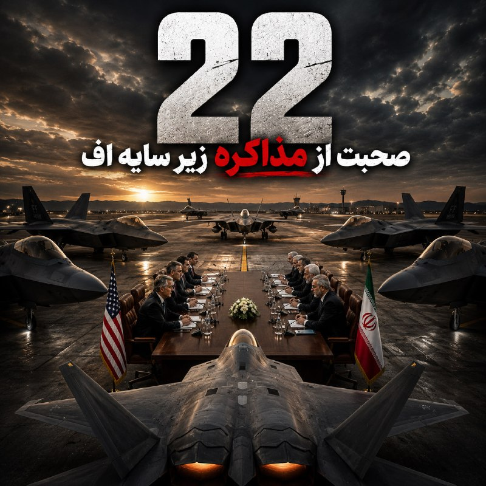

نسخ صوتی لایو امشب در کست باکس :

https://castbox.fm/vi/947285526

## Persian_Trend_Official — post 14554

  <a href="telegram/content/Persian_Trend_Official_14554_1779314895.jpg">🎬 Download video</a>

💢سپاه پاسداران با صدور بیانیه‌ای تهدید کرد:

⭕️در صورت حمله دوباره آمریکا و اسرائیل، جنگ را به فراتر از منطقه خواهد کشاند.

🫆:Tony

📌 @persian_trend_official
پرشین ترند | متفاوت‌ترین کانال نظامی

## Persian_Trend_Official — post 14553

نسخه صوتی لایو امشب در اسپاتیفای :

https://open.spotify.com/episode/4ZyN11ARn9PzPUowsFbzbh?si=w_I-pR9MRMyUKElfOPbe8Q

## Persian_Trend_Official — post 14552

  

🔴 ایران محدوده نظارت خود بر تنگه هرمز را مشخص کرد

💢هیئت تنگه خلیج فارس اعلام کرد جمهوری اسلامی ایران حدود منطقه نظارت بر مدیریت تنگه هرمز را تعیین کرده است.

🔻بر اساس این بیانیه:

▪️ مرز شرقی این محدوده، خطی است که «کوه مبارک» در ایران را به جنوب فجیره در امارات متصل می‌کند

▪️ مرز غربی نیز خطی است کهانتهای جزیره قشم در ایران را به «ام‌القیوین» در امارات وصل می‌کند

💢این اعلام در شرایطی منتشر شده که تنش‌ها بر سر کنترل و عبور کشتی‌ها از تنگه هرمز همچنان ادامه دارد.

🫆:Tony

📌 @persian_trend_official
پرشین ترند | متفاوت‌ترین کانال نظامی

## Persian_Trend_Official — post 14551

💢 عضو کمیسیون امنیت ملی مجلس

💢عاصم منیر فردا حامل پیام جدیدی از سوی آمریکا به ایران است

🫆:Tony

📌 @persian_trend_official
پرشین ترند | متفاوت‌ترین کانال نظامی

## IranianMinds — post 20470

  

🔴نهاد مدیریت آبراه خلیج ‌فارس که به تازگی اعلام موجودیت کرده است، می‌گوید یک منطقه دریایی کنترل شده در تنگه هرمز ایجاد کرده است.

@IranianMinds

## IranianMinds — post 20469

🔴کانال ۱۲ اسرائیل:

نخست‌وزیر نتانیاهو همیشه با نظر ترامپ در مورد مذاکره با ایران مخالفت کرده است.

@IranianMinds

## BBCPersian — post 281646

🔻قاآنی: جنگ باعث شد اسرائیل سریع‌تر به «نقطه پایان نزدیک شود»

اسماعیل قاآنی، فرمانده نیروی قدس سپاه پاسداران در اظهاراتی جدید که خبرگزاری‌های نزدیک به سپاه منتشر کرده‌اند به تحولات روز واکنش نشان داده است از جمله به حرکت ناوگان بشردوستانه به سمت غزه که متوقف کردن آن و برخورد خشن و تحقیر آمیز وزیر امنیت ملی اسرائیل با یکی از دهها فعال ناوگان صمود آن امروز خبر ساز شده است.

آقای قاآنی گفته آنچه او دستاورهای ناوگان صمود خوانده «ادامه» خواهد داشت و از نظر او: «فلسطین را باز به کانون توجه جهانیان بازگرداند. رژیم صهیونسیتی مغلوب را که به تشدید سرکوب و جنایاتگری دست زده، سریعتر از قبل به نقطه پایان نزدیک کرد.»

نیروی قدس سپاه پاسداران که پیش از آقای قاآنی، قاسم سلیمانی برای سالها فرماندهی آن را در دست داشت، شاخه برون مرزی سپاه پاسداران است و بازوری اصلی حکومت در ایران برای هماهنگی و کنترل و حمایت از نیروهای نیابتی آن در منطقه محسوب می‌شود.

این بخش از سپاه پاسداران از سال‌ها قبل در فهرست سازمان‌های تروریستی آمریکا و چند کشور غربی دیگر قرار گرفته است.

https://bbc.in/4upkbJS
@BBCPersian

## BBCPersian — post 281645

  

🔻نشریه آمریکایی اکسیوس از تماس تلفنی روز گذشته - سه‌شنبه ۲۹ اردیبهشت - میان دونالد ترامپ و بنیامین نتانیاهو بر سر ایران خبر داده که به نوشته این رسانه، «پرتنش» بوده و نخست‌وزیر اسرائیل را «بسیار برآشفته» است.

باراک راوید، خبرنگار اکسیوس در گزارش روز چهارشنبه خود نوشته که این اطلاعات را سه منبع مطلع دریافت کرده است هر چند نام آنها را ذکر نکرده است.

به گفته این باراک راوید: «بنیامین نتانیاهو نسبت به مذاکرات به‌شدت بدبین است و خواهان ازسرگیری جنگ برای تضعیف بیشتر توانایی‌های نظامی ایران و ضربه زدن به حکومت از طریق نابودی زیرساخت‌های حیاتی آن است.»

بر اساس آنچه اکسیوس گزارش کرده در برابر این موضع نخست‌وزیر اسرائیل، دونالد ترامپ «معتقد است که امکان دستیابی به توافق وجود دارد، اما اگر چنین توافقی حاصل نشود، آماده ازسرگیری جنگ است.»

📸GettyImages
https://bbc.in/49Zp2sK
@BBCPersian

## BBCPersian — post 281644

🔸آرسنال پس از ۲۲ سال دوباره قهرمان لیگ برتر شد؛ قهرمانی‌ای که دیشب با توقف منچسترسیتی مقابل بورنموث قطعی شد. هزاران هوادار این تیم بیرون از ورزشگاه امارات و همزمان، بازیکنان و کادر فنی هم در محل تمرین تیم در شمال لندن این قهرمانی را جشن گرفتند. قرار است جام قهرمانی لیگ برتر در پایان آخرین بازی فصل لیگ برتر توپچی‌ها به آرسنال اهدا شود؛ دیداری که یکشنبه آینده در خانه کریستال پالاس برگزار می‌شود. این چهارمین قهرمانی آرسنال در تاریخ لیگ برتر است؛ تیمی که حالا به یک چالش بزرگ دیگر فکر می‌کند: فینال لیگ قهرمانان اروپا مقابل پاری‌سن‌ژرمن در بوداپست.

 گزارشی از کاوه مشکات

@BBCPersian

## BBCPersian — post 281643

🔻بریتانیا با لغو تحریم‌های نفتی روسیه، مجوز واردات دیزل و سوخت جت را صادر می‌کند

بریتانیا بر اساس برنامه معافیت از تحریم‌ها، اجازه واردات دیزل و سوخت جت پالایش‌شده از نفت خام روسیه در خارج از این کشور را خواهد داد.

با افزایش هزینه‌های سوخت و فشار بر خطوط هوایی و خانوارها، که بخشی از آن به دلیل درگیری در خاورمیانه است، بریتانیا در صدد است تا محدودیت‌ها در این زمینه را کاهش ‌دهد.

تصمیم بریتانیا پس از اقدام مشابه ایالات متحده انجام می‌شود.

آمریکا روز دوشنبه طرح معافیت از تحریم‌های نفتی روسیه را تمدید کرد و مجوز خرید نفت از این کشور را صادر کرد.

منتقدان این تصمیم آمریکا می‌گویند که چنین اقدامی، پول بیشتری را روانه روسیه خواهد کرد که آن را جنگ در اوکراین برای کشتن مردم اوکراین هزینه خواهد کرد.

روز سه‌شنبه قیمت هر بشکه نفت برنت روز سه‌شنبه به حدود ۱۱۰ دلار رسید که نزدیک به بالاترین رکوردهای اخیر است.

این نشان‌دهنده ادامه نگرانی‌ها در مورد اختلال در جریان نفت از طریق تنگه هرمز است.

https://bbc.in/4eTwV6x
@BBCPersian

## BBCPersian — post 281642

  <a href="https://t.me/bbcpersian/281642">📎 Download file</a>

🔻پادکست برنامه شصت دقیقه چهارشنبه ۳۰ اردیبهشت ۱۴۰۵

این نسخه رادیویی برنامه شصت دقیقه تلویزیون فارسی بی‌بی‌سی است که هرشب بعد از پخش، با حجم کم از صفحه تلگرام بی‌بی‌سی فارسی در دسترس است.
با هشتگ BBCPersianRadio با ما در ارتباط باشید.

## Dirty_Kids — post 389846

  

سرانجام بخت زیبای خفته‌ی عرزشی‌ها هم باز شد @Dirty_Kids 👻

## Dirty_Kids — post 389845

  <a href="telegram/content/Dirty_Kids_389845_1779314897.mp4">🎬 Download video</a>

سرانجام بخت زیبای خفته‌ی عرزشی‌ها هم باز شد

@Dirty_Kids 👻

## Dirty_Kids — post 389841

حاصل خالی گذاشتن سکوهای ورزشگاه جام جهانی قطر شد:
حضور ‎#پرستوهای_رژیم به اسم «نماینده ی ملت ایران» با هد بند و پرچم!
آخوندها هم به دنیا گفتند: ببینید مردم ایران چقدر آزادند و حامی و دوستدار حکومت میباشند!!

تبلیغات جمهوری اسلامی در جام جهانی قطر دقیقا ۴ سال جنایت و فلاکت و شکنجه و غارت ایران و همچنین ۴۰ هزار کشته فقط در ۲ روز واسمون هزینه ایجاد کرد!!
این بار فریب نخوریم و با برنامه پیش بریم.

@Dirty_Kids 👻

## Dirty_Kids — post 389840

  <a href="telegram/content/Dirty_Kids_389840_1779314898.mp4">🎬 Download video</a>

چالش "دوربین‌به‌کون" هم تازه راه افتاده

@Dirty_Kids 👻

## Dirty_Kids — post 389839

نخست وزیر پاکستان:
بتخمم اصلا جنگ کنید

@Dirty_Kids 👻

## Dirty_Kids — post 389838

  

جان‌فداست ولی تو عروسیش ماسک میزنه شناسایی نشه.

@Dirty_Kids 👻

## configx2ray — post 39117

🚀 #NEW_IP

📌لیست اول 
⬇️

80.191.243.226
80.210.40.37
2.16.19.136
2.16.220.191
2.16.220.194
2.16.221.4
2.16.221.37
2.16.221.84
2.16.221.116
2.16.223.7
2.188.21.240
2.21.2.33
2.21.2.42
2.21.2.51
2.21.2.80
2.21.2.81
2.21.2.99
2.21.2.104
2.21.2.105
2.21.2.123
2.23.41.22
2.23.168.7
2.23.168.47
2.23.168.96
2.23.168.144
2.23.168.174
2.23.168.213
2.23.168.250
2.23.168.254
2.23.169.12
2.23.169.42
2.23.169.105
2.23.169.111
2.23.170.80
23.34.75.229
23.50.176.34
23.197.216.67
23.208.64.169
23.208.176.67
23.215.60.74
23.221.29.186
23.221.30.96
31.214.169.244
37.191.76.110
37.191.95.70
46.32.31.30
50.7.4.107
50.7.4.243
50.7.4.244
50.7.5.85
63.141.252.203
78.39.234.140
78.157.41.60
92.123.106.11
92.123.106.42
92.123.106.43
92.123.106.90
95.101.133.42
104.103.65.5
109.72.197.1
142.54.178.211
164.138.17.122
172.237.127.6
178.252.128.66
184.26.54.19
184.26.54.24
184.84.221.34
185.50.37.52
185.88.178.196
185.109.61.27
185.141.106.238
185.200.232.42
185.200.232.43
185.200.232.50
185.208.174.167
185.208.175.228
185.255.91.60
5.160.13.85
5.160.128.142

🗄
🗄
🗄
🗄
🗄
🗄
🗄
🗄
🗄
🗄

📌لیست دوم 
⬇️

31.214.169.244
185.109.61.27
46.32.31.30
37.255.133.30
37.191.76.110
80.191.243.226
185.141.106.238
81.12.72.218
37.191.95.70
63.141.252.203
142.54.178.211
5.160.13.85
178.252.128.66
94.130.13.19
2.23.168.254
2.23.168.144
78.39.234.140
109.72.197.1
185.137.25.214
2.23.168.7
78.157.41.60
2.23.168.96
185.208.175.228
81.91.145.2
2.23.168.47
185.255.91.60
2.23.170.80
2.23.168.213
2.23.168.174
65.109.34.234
5.160.128.142
23.77.7.74
92.123.128.176
104.109.250.232
92.123.106.90
92.123.102.160
104.103.72.80
96.16.248.159
104.89.170.140
184.86.103.158
104.126.37.176
72.246.28.215
23.73.2.75
184.51.133.123
88.221.168.204
88.221.169.205
96.16.122.137
104.103.72.50
23.72.248.210

🗄
🗄
🗄
🗄
🗄
🗄
🗄
🗄
🗄
🗄

📌لیست سوم 
⬇️

2.21.2.26
2.21.2.65
2.21.2.106
2.23.168.7
2.23.168.47
2.23.168.96
2.23.168.144
2.23.168.174
2.23.168.213
2.23.168.250
2.23.168.254
2.23.170.80
2.188.21.240
5.160.13.85
5.160.128.142
23.58.95.153
23.221.28.5
31.214.169.244
37.191.76.110
37.191.95.70
37.255.133.30
46.32.31.30
50.7.4.107
50.7.4.243
50.7.4.244
50.7.5.85
63.141.252.203
65.109.34.234
78.39.234.140
78.157.41.60
80.191.243.226
81.12.72.218
81.91.145.2
94.130.13.19
109.72.197.1
142.54.178.211
151.101.64.223
164.138.17.122
172.234.159.32
172.237.145.27
178.252.128.66
185.50.37.52
185.88.178.196
185.109.61.27
185.137.25.214
185.141.106.238
185.208.174.167
185.208.175.228
185.255.91.60

🗄
🗄
🗄
🗄
🗄
🗄
🗄
🗄
🗄
🗄

Channel : https://t.me/ConfigX2ray

## configx2ray — post 39116

  <a href="https://t.me/ConfigX2ray/39116">📎 Download file</a>

کانفیگ برای Npv tunnel ⭕️

به هیچ وج دانلود نزنید باهاش
❤️

رمز فایل : @ConfigX2ray

Channel : https://t.me/ConfigX2ray

## configx2ray — post 39115

  <a href="https://t.me/ConfigX2ray/39115">📎 Download file</a>

کانفیگ برای Npv tunnel ⭕️

به هیچ وج دانلود نزنید باهاش
❤️

رمز فایل : @ConfigX2ray

Channel : https://t.me/ConfigX2ray

## configx2ray — post 39114

23.54.210.170
23.44.201.206
23.220.163.205
23.209.46.33
23.10.34.11
23.39.185.35
23.32.152.106
23.218.232.181
23.206.188.212
2.21.2.89
23.208.222.120
23.48.203.248
23.44.201.136
23.44.201.151
23.44.201.149
2.21.2.58
23.3.90.48
23.44.201.41
2.19.204.184
23.218.232.188
23.44.201.12
23.212.253.227
23.201.31.155
23.220.163.203
23.44.201.185
23.52.116.66
23.44.201.17
23.62.54.24
23.218.239.132
23.39.149.69
23.52.40.147
23.58.95.144
2.16.244.58
23.212.253.137
2.17.106.176
23.62.54.137

Channel : https://t.me/ConfigX2ray

## configx2ray — post 39113

2.17.106.5
23.203.134.233
23.212.253.232
23.206.188.197
23.44.201.170
23.54.127.39
23.214.170.83
23.52.40.89
23.55.176.73
23.202.229.140
23.215.56.61
2.17.106.166
23.222.126.108
184.25.85.224
23.1.241.123
23.3.90.43
80.210.40.37
37.255.133.30
23.47.124.134
184.25.28.31
151.101.0.223
95.101.111.144
2.19.205.42
2.19.205.50
2.19.252.134
104.109.250.240
92.122.17.124
185.200.232.43
2.17.100.200
96.16.122.153
151.101.64.223
2.16.245.188
2.18.69.150
23.58.222.107
23.50.131.147
23.46.190.18
23.207.210.80
23.55.110.74
94.130.33.41
94.130.70.160
144.76.1.88
94.130.50.12
94.130.13.19
95.216.69.37
94.130.50.12
184.24.77.32
94.130.33.41
184.24.77.5
184.24.77.7
184.24.77.16
184.24.77.36
184.24.77.21
184.24.77.11
23.48.23.186
23.48.23.133
23.48.23.195
23.48.23.178
184.24.77.29
185.200.232.49
185.200.232.50
185.200.232.42
185.200.232.41
172.237.127.6
185.200.232.49
185.200.232.50
185.200.232.42
185.200.232.41
184.24.77.42
184.24.77.32
184.24.77.5
184.24.77.7
184.24.77.16
184.24.77.36
184.24.77.21
184.24.77.11
23.48.23.186
23.48.23.133
23.48.23.195
23.48.23.178
184.24.77.29
23.65.119.52
23.73.2.141
104.110.138.190
104.83.5.202
92.122.166.236
92.122.166.234
92.122.166.237
96.16.122.70
23.67.136.200
23.67.136.202
96.16.53.158
23.55.163.135
2.21.134.89
2.19.204.217
96.16.122.149
2.19.205.64
23.73.2.148
2.17.147.11
2.19.204.240
184.51.252.36
23.55.110.58
92.122.166.146
2.23.168.213
23.213.184.134
2.22.6.68
2.19.205.88
184.30.150.136
23.219.36.80
23.39.249.249
2.19.126.98
2.23.168.96
23.41.37.129
95.100.69.108
185.200.232.50
104.103.90.156
92.122.166.141
2.23.168.144
184.24.77.42 184.24.77.32 184.24.77.5 184.24.77.7 184.24.77.16 184.24.77.36 184.24.77.21 184.24.77.11 185.200.232.49 185.200.232.50 185.200.232.42 185.200.232.41 23.48.23.186 23.48.23.133 23.48.23.195 23.48.23.178 184.24.77.29 104.78.170.186 96.17.222.31 23.41.37.129 23.2.13.227 23.222.126.108 2.20.255.113 2.17.251.98 23.2.13.152 95.101.23.27 2.21.239.21 23.211.49.252 88.221.168.5 104.103.90.156 23.79.20.249 88.221.132.162 23.59.235.208 23.60.69.118 23.46.188.71 104.122.212.92 23.219.1.4 23.57.43.195 184.51.252.135 2.22.6.68 23.217.11.56 95.100.69.108 23.40.63.69 185.200.232.49 185.200.232.50 185.200.232.42 185.200.232.41 184.24.77.42 184.24.77.32 184.24.77.5 184.24.77.7 184.24.77.16 184.24.77.36 184.24.77.21 184.24.77.11 23.48.23.186 23.48.23.133 23.48.23.195 23.48.23.178 184.24.77.29 96.16.122.74 104.109.250.232 92.123.104.7 104.110.191.57 104.83.5.82 92.122.166.168 104.83.5.65 104.121.0.17 104.66.70.133 92.122.166.146 23.73.2.161 92.122.73.138 92.122.166.141 96.16.122.55 104.81.108.51 23.72.248.214 104.126.37.185 104.83.5.201 104.83.5.216 92.123.104.67 104.83.5.203 96.17.207.151 88.221.168.138 96.17.207.149 104.81.108.10 23.73.2.148 92.122.166.175 172.237.127.6 104.81.104.13 96.17.207.137 92.123.112.7 96.16.122.75 96.16.122.70 92.122.166.182 104.109.128.153 104.96.143.134 23.73.2.141 104.83.5.202 23.67.136.200 23.67.136.202 23.65.119.52 92.122.166.236 92.122.166.234 92.122.166.237 104.110.138.190 173.222.200.5 184.51.252.36 184.51.252.38 104.83.5.208 96.16.122.146 96.17.206.214 92.122.166.197 104.94.100.73 104.83.15.66 88.221.213.81 172.239.57.117 104.117.76.40 184.51.252.4 96.17.207.30 96.16.122.83 96.16.122.150 23.73.207.11 96.16.122.77 96.17.207.155 92.123.189.82 96.16.122.82 96.16.122.66 96.7.218.219 96.16.122.137 184.51.252.157 92.123.189.41 184.86.251.12 96.16.122.154 184.51.252.152 96.17.207.12 23.79.48.162 151.101.0.223 151.101.128.223 151.101.192.223 65.109.34.234 151.101.64.223 142.54.178.211 104.103.90.156 23.79.20.249 88.221.132.162 23.59.235.208 23.60.69.118 23.46.188.71 104.122.212.92 23.219.1.4 23.57.43.195 184.51.252.135 2.22.6.68 23.217.11.56 95.100.69.108 23.40.63.69 2.23.168.47 2.23.170.80 2.23.168.144 2.23.168.213 2.23.168.174 2.23.169.111 2.23.168.96 185.200.232.49 185.200.232.41 2.23.169.105 2.23.168.7 2.23.169.207 185.200.232.50 185.200.232.42

Channel : https://t.me/ConfigX2ray

## manototv — post 105706

  <a href="telegram/content/manototv_105706_1779314901.mp4">🎬 Download video</a>

جاویدنام سینا عباسی؛
جوان ۲۲ ساله‌ای از کرمانشاه که هشتم دی ۱۴۰۴ در جریان اعتراضات میدان انقلاب، بر اثر ضربات باتوم به سر جان باخت.
با گذشت ماه‌ها، هنوز نامش جایی ثبت نشده…
و خانواده‌اش فقط می‌خواهند صدای سینا شنیده شود.»

## manototv — post 105705

  <a href="telegram/content/manototv_105705_1779314902.mp4">🎬 Download video</a>

‌
«نهاد مدیریت آبراه خلیج فارس» با انتشار نقشه‌ای در شبکه اکس «محدوده نظارتی مدیریت» جمهوری اسلامی در تنگه هرمز را تعیین کرد.

بر اساس متن این نقشه، محدوده مورد نظر در شرق تنگه از خط اتصال «کوه مبارک» در ایران به جنوب فجیره در امارات متحده عربی، و در غرب تنگه از خط اتصال انتهای جزیره قشم به ام‌القوین در امارات تعیین شده است.

در این بیانیه آمده است تردد در این محدوده برای عبور از تنگه هرمز باید «با هماهنگی مدیریت آبراه خلیج فارس و مجوز این نهاد» انجام شود.

در نقشه منتشرشده، بخش وسیعی از آب‌های اطراف تنگه هرمز (محدوده قرمز) با عنوان «محدوده تحت نظارت نیروهای مسلح ایران» مشخص شده است.

## alonews — post 121444

  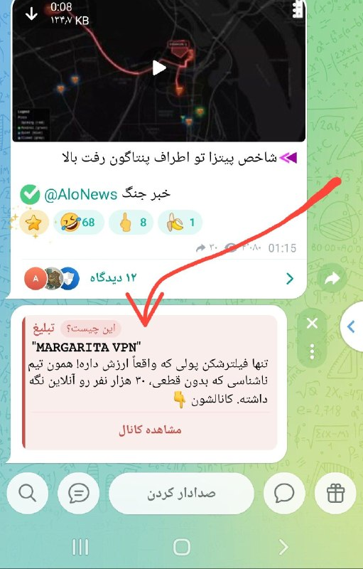

👈دوستان این تبلیغاتی که پائین کانال نمایش داده میشه توسط تلگرامه و دست ما نیست و کلاهبرداری هست و فریب نخورید

✅ @AloNews خبر جنگ

## alonews — post 121443

  <a href="telegram/content/alonews_121443_1779314903.mp4">🎬 Download video</a>

👈شاخص پیتزا تو اطراف پنتاگون رفت بالا

✅ @AloNews خبر جنگ

## alonews — post 121442

  <a href="telegram/content/alonews_121442_1779314904.mp4">🎬 Download video</a>

👈خبرنگار: پیامت به خانواده‌های آمریکایی که از هوش مصنوعی می‌ترسن چیه؟ اونا نگرانن بچه‌هاشون تو آینده کار نداشته باشن.

🔴جواب کاملا مرتبط و منطقی ترامپ:
ایران نباید سلاح هسته‌ای داشته باشه!

✅ @AloNews خبر جنگ

## alonews — post 121441

  <a href="telegram/content/alonews_121441_1779314905.mp4">🎬 Download video</a>

👈 وزیر بهداشت و خدمات انسانی آر‌اف‌کِی جونیور: من همیشه در اطراف دختران جوان زیادی هستم و همه آنها در آن بخش از زندگی خود واقعا دیوانه به نظر می رسند

✅ @AloNews خبر جنگ

## alonews — post 121440

  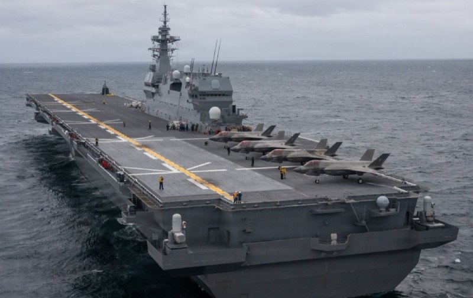

👈بزرگترین کشتی جنگی ژاپن برای آموزش F-35B با تفنگداران دریایی آمریکا آماده میشه - USNI

✅ @AloNews خبر جنگ

## alonews — post 121439

  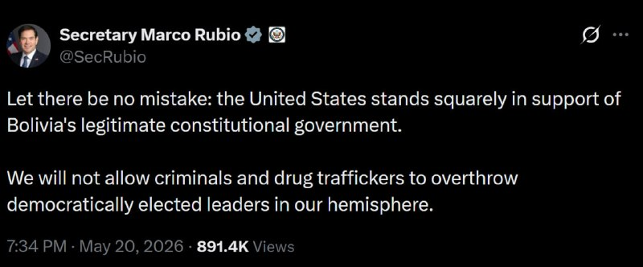

👈وزیر امور خارجه مارکو روبیو:
اشتباهی نباشد: ایالات متحده به طور قاطع از دولت قانونی و قانون اساسی بولیوی حمایت می‌کند.

🔴ما اجازه نخواهیم داد که جنایتکاران و قاچاقچیان مواد مخدر رهبران منتخب دموکراتیک در نیمکره ما را سرنگون کنند.

✅ @AloNews خبر جنگ

## alonews — post 121438

  <a href="telegram/content/alonews_121438_1779314908.jpg">🎬 Download video</a>

👈زاکانی شهردار تهران: آمریکا ته زورشو زد و دیگه جرات حمله نداره

✅ @AloNews خبر جنگ

## alonews — post 121437

  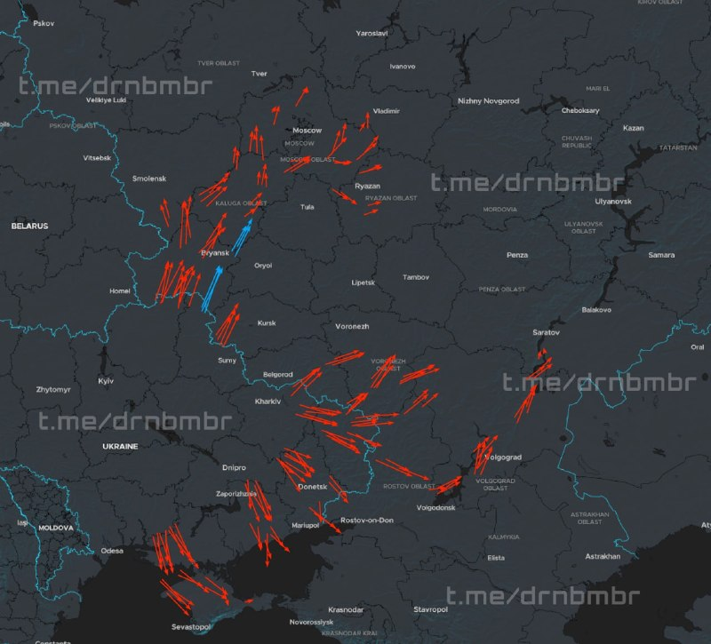

👈اوکراین تعداد زیادی پهپاد به سمت غرب روسیه و کریمه پرتاب کرده است

✅ @AloNews خبر جنگ

## alonews — post 121436

  <a href="telegram/content/alonews_121436_1779314908.jpg">🎬 Download video</a>

👈ادعای «میدل ایست آی»: دونالد ترامپ، حمله برنامه‌ریزی‌شده به ایران را در این هفته به تعویق انداخت، چراکه متحدان عرب و مقامات دولت خودش به او هشدار دادند در ایام حج، جنگ را از سر نگیرد. 
🔴به گفته دو مقام ارشد کشورهای حوزه خلیج‌فارس، به ترامپ گفته شده بود که…

## alonews — post 121435

  <a href="telegram/content/alonews_121435_1779314909.jpg">🎬 Download video</a>

👈فرستاده ویژه ترامپ به گرینلند جف لندری: زمان آن است که ایالات متحده ردپای خود را دوباره در گرینلند بگذارد 
✅ @AloNews خبر جنگ

## alonews — post 121434

  <a href="telegram/content/alonews_121434_1779314909.jpg">🎬 Download video</a>

👈ادعای «میدل ایست آی»: دونالد ترامپ، حمله برنامه‌ریزی‌شده به ایران را در این هفته به تعویق انداخت، چراکه متحدان عرب و مقامات دولت خودش به او هشدار دادند در ایام حج، جنگ را از سر نگیرد.

🔴به گفته دو مقام ارشد کشورهای حوزه خلیج‌فارس، به ترامپ گفته شده بود که حمله به ایران در ایام حج، بحرانی را در میان کشورهای عربی حاشیه خلیج فارس ایجاد می‌کند، زیرا این حمله باعث می‌شود صدها هزار زائر حج سرگردان بمانند.

🔴منابع همچنین گفتند که به ترامپ گفته شده بود حمله در این ایام مقدس که منتهی به عید قربان می‌شود، بیشتر از این به جایگاه آمریکا در جهان اسلام لطمه می‌زند.

🔴یک مقام ارشد آمریکایی که از بحث‌های جریان‌یافته در دولت ترامپ آگاه است، تأیید کرد که این گفت‌وگوها انجام شده است

✅ @AloNews خبر جنگ

## alonews — post 121433

  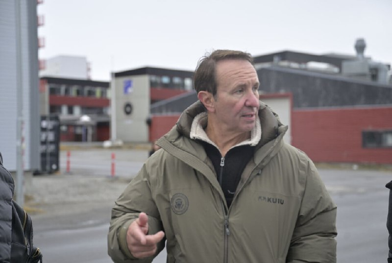

👈فرستاده ویژه ترامپ به گرینلند جف لندری: زمان آن است که ایالات متحده ردپای خود را دوباره در گرینلند بگذارد

✅ @AloNews خبر جنگ

## alonews — post 121431

لکسوس LX600 غول ژاپنی با قیمت 110 میلیارد تومان ناقابل!

و حالا همون ماشین در فرانسه به قیمت 124000 یورو که میشع چیزی حدود 26 میلیارد تومن…

شما فقط اختلاف رو ببین

[@AloTweet]

## alonews — post 121430

  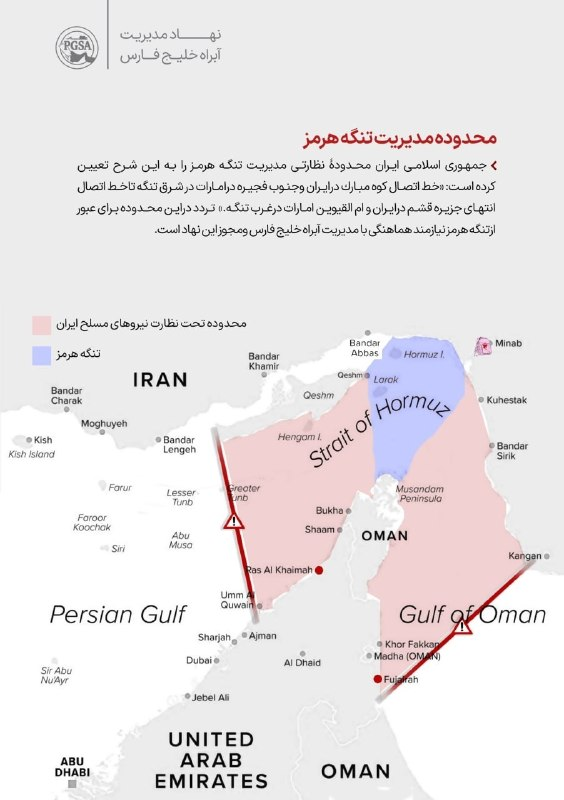

👈نهاد مدیریت آبراه خلیج فارس محدودهٔ نظارتی مدیریتی تنگهٔ هرمز را مشخص کرد

🔴ايران محدودهٔ نظارتى مديریت تنگهٔ هرمز را به این شرح تعيین کرده است:

🔴«خط اتصال كوه مبارک درايران و جنوب فجيره درامارات در شرق تنگه تا خط اتصال انتهاى جزيره قشم در ايران و ام‌القيوین امارات درغرب تنگه.»

🔴تردد دراین محدوده برای عبور از تنگهٔ هرمز نیازمند هماهنگی با مدیریت آبراه خلیج فارس و مجوز این نهاد است

✅ @AloNews خبر جنگ

## alonews — post 121429

اخبار جنگ الونیوز AloNews pinned a photo

## alonews — post 121428

  <a href="telegram/content/alonews_121428_1779314910.jpg">🎬 Download video</a>

👈نخست‌وزیر اسپانیا: فشار می‌آورم تا کل اروپا وزیر امنیت اسرائیل را تحریم کند

✅ @AloNews خبر جنگ

## alonews — post 121426

  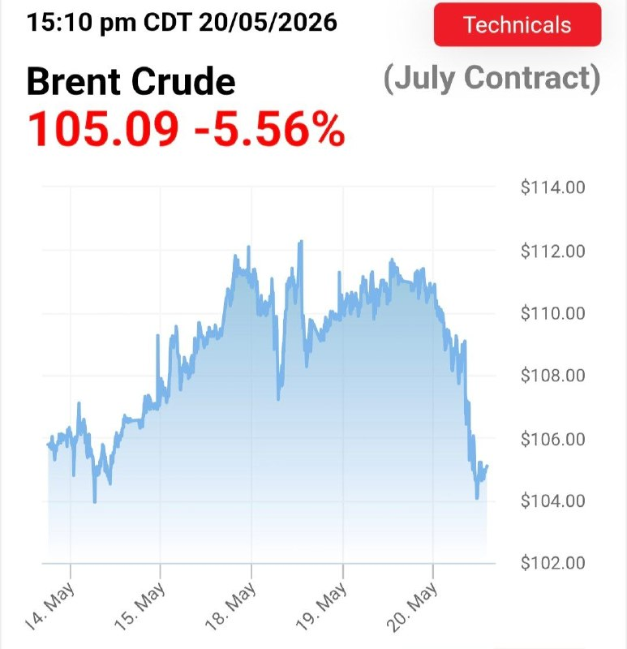

👈آخرین قیمت نفت ۱۰۵.۰۹ دلار

✅ @AloNews خبر جنگ

## alonews — post 121425

  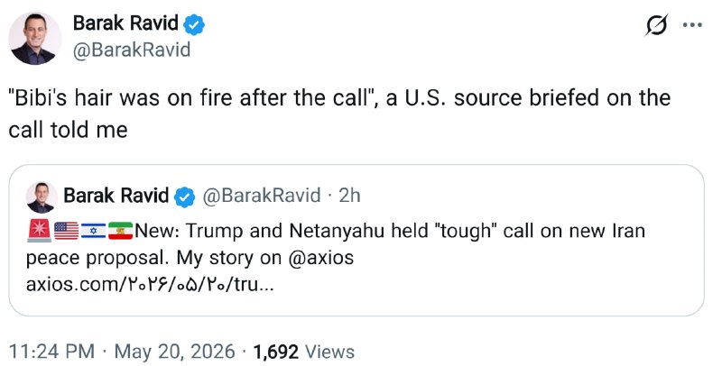

👈آکسیوس: یک منبع آمریکایی که در جریان این تماس تلفنی قرار داشت به من گفت: «موهای بی‌بی بعد از تماس آتش گرفته بود.»

✅ @AloNews خبر جنگ

## alonews — post 121424

  <a href="telegram/content/alonews_121424_1779314911.jpg">🎬 Download video</a>

👈ترامپ درباره کوبا: مردم غذا و برق ندارند، اما مردم بزرگی هستند

✅ @AloNews خبر جنگ

<!-- MSG END -->
<!-- NAV START -->
[صفحه قبل](telegram/content/archive_1.md)
<!-- NAV END -->
